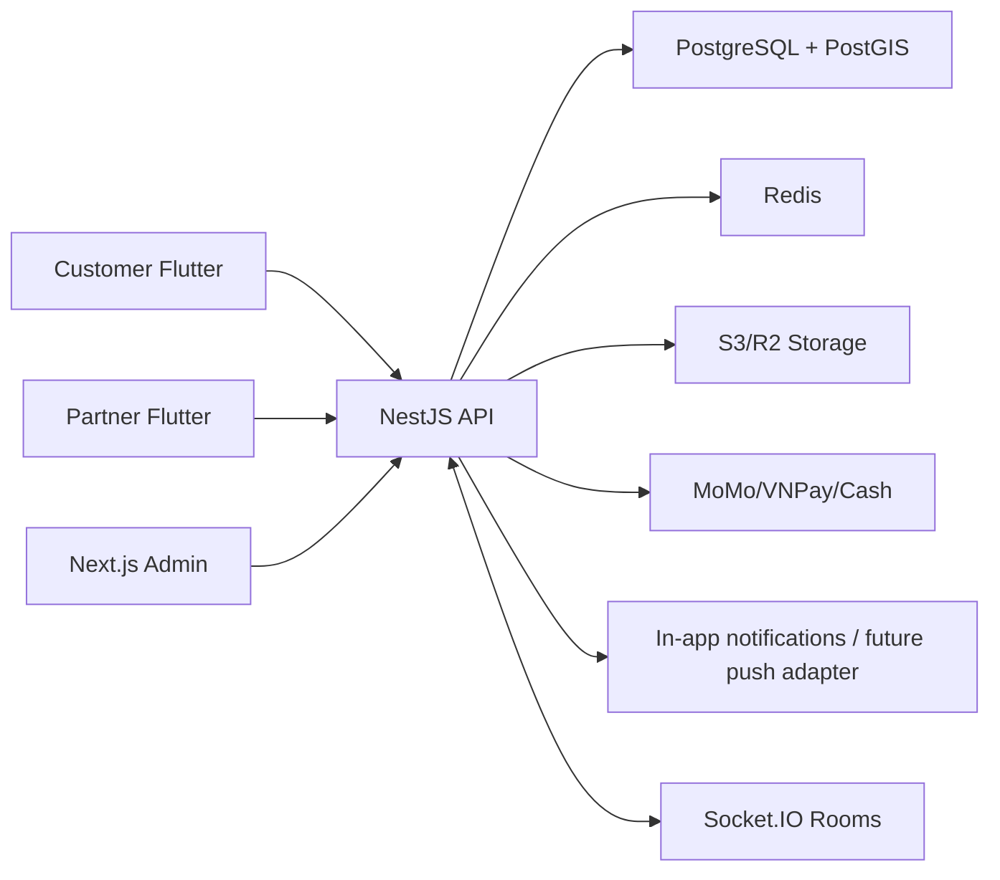

# Product Architecture

## System Shape

This is a modular monorepo, not microservices. The NestJS API owns REST endpoints, Socket.IO gateways, BullMQ processors, Prisma persistence, and payment provider integrations.

## Realtime Matching

- Customers can browse partner profiles from any country. If GPS is unavailable or outside Vietnam, discovery uses a default Vietnam service-area browse pin for distance sorting.
- A customer must confirm a Vietnam service address before booking. The API stores that immutable `BookingAddressSnapshot` and uses it for marketplace radius checks.
- Payment is authorized or marked cash-pending.
- Booking moves to `OPEN_MATCHING`.
- A customer may choose a first-pick partner first. That partner has a 10 minute response window.
- During that same 10 minute window, other online partners within the configured radius can join as marketplace candidates.
- Eligible marketplace partners receive a notification and can also see the request in the Partner app open-request list.
- Partners join as `BookingParticipant` records with the server-calculated distance snapshot.
- Partners are sorted by server-side distance and availability.
- Customer selects the final partner.
- Booking moves to `MATCHED`; chat room is created.

## Availability Formula

`provider_next_available_at = current_booking_end_time + travel_buffer_minutes - early_accept_window_minutes`

Defaults:

- `travel_buffer_minutes = 30`
- `early_accept_window_minutes = 10`
- `marketplace_partner_radius_meters = 10000`

Some existing environment/config keys may still contain `backup_provider` for compatibility. Product and operator-facing wording should describe this as marketplace partner participation.

## Redis Responsibilities

- Partner online status
- Partner latest stored location
- Active booking matching state
- Socket.IO scale-out adapter state
- Timeout and no-response job coordination

## BullMQ Jobs

- Booking timeout
- Provider no-response
- Payment status check
- Notification retry
- Review reminder

## Security

- OTP login, JWT access token, refresh token
- Role guards for customer/partner/admin
- Private verification files
- Public partner images through CDN
- No hardcoded secrets
