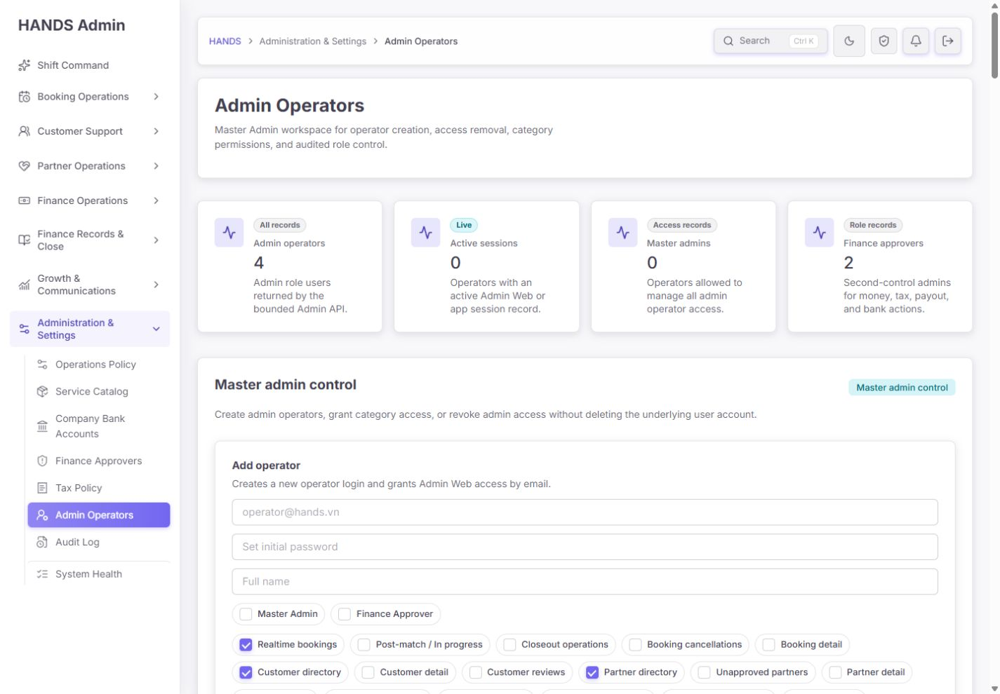
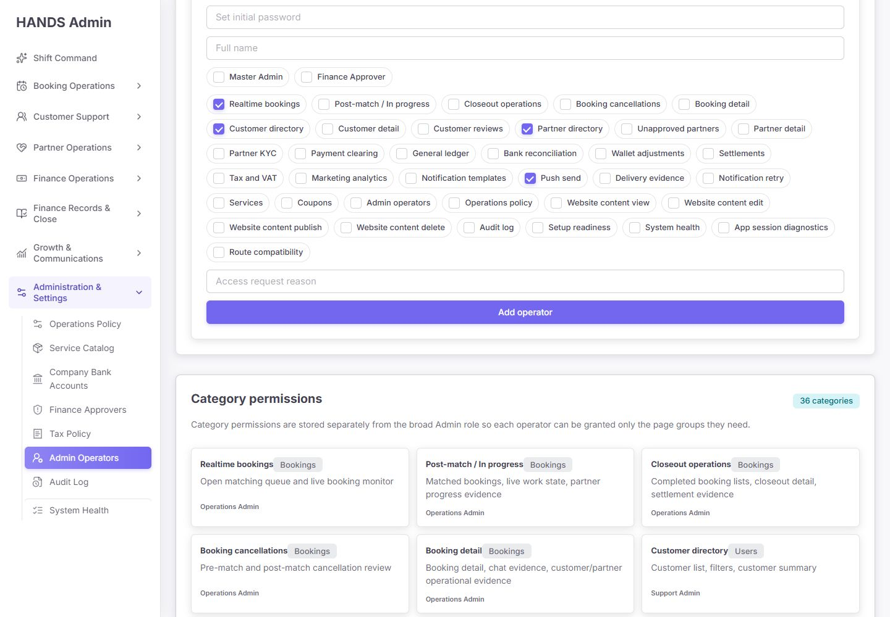
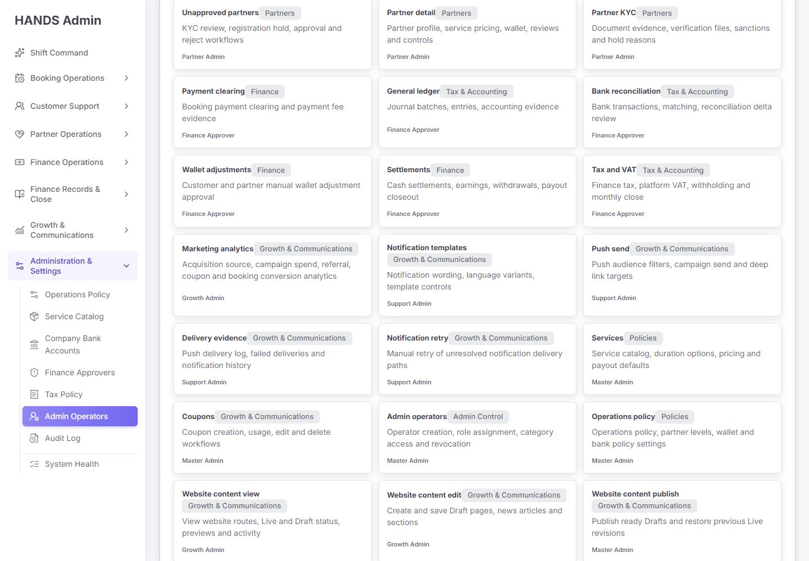
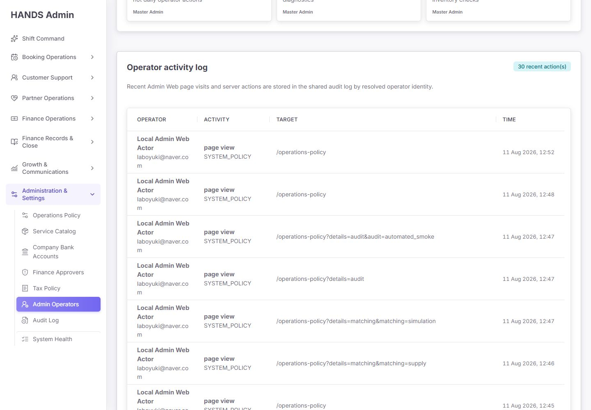
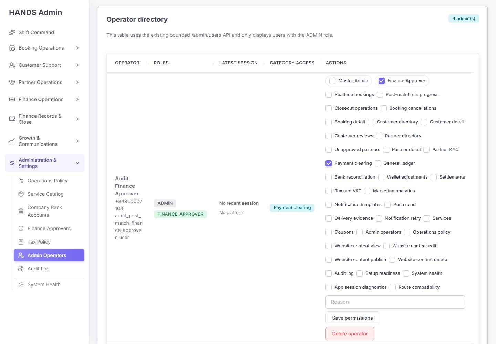
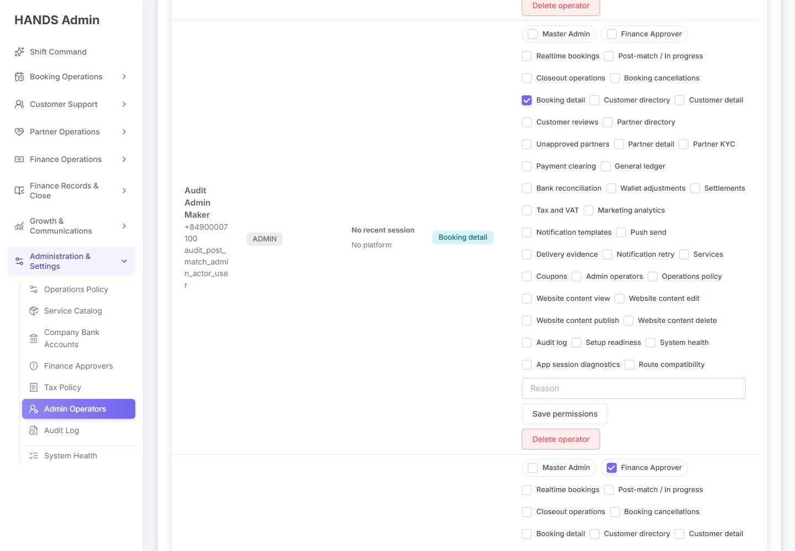

# Admin Operators 최종 심층 재감사 보고서

- 감사 대상: `http://localhost:3101/admin-operators`
- 감사일: 2026-08-11
- 관점: 프로그래머가 아니라 실제 운영 책임자, 접근권한 관리자, 사고 대응자
- 화면 기준: 1440px 이상 데스크톱만 검수
- 제외 범위: 1024px 이하 화면과 모바일/태블릿 대응은 이번 감사에서 완전히 제외
- 검수 방식: 로그인된 실제 화면, 현재 소스, API 권한 가드, Prisma 스키마, 현재 로컬 DB, 관련 테스트를 교차 확인
- 변경 범위: 코드와 데이터는 수정하지 않았으며, 본 문서와 캡처 증거만 추가함

## 1. 최종 판정

**종합 출시 준비도: 28/100 — 출시 보류(Release hold)**

화면의 카드, 배지, 입력 컴포넌트는 기존 관리자 디자인 시스템에 맞춰져 있고 1440px에서 깨지지는 않는다. 그러나 이 페이지의 핵심 임무는 “보기 좋은 권한 화면”이 아니라 **누가 관리자이고, 누가 어떤 권한을 실제로 가지며, 누가 무엇을 변경했는지 틀리지 않게 통제하는 것**이다. 이 핵심 기준에서는 현재 상태로 출시할 수 없다.

가장 큰 이유는 다음 네 가지다.

1. 화면은 관리자 4명, Master Admin 0명, Finance Approver 2명으로 표시하지만 현재 DB에는 각각 22명, 4명, 12명이 있다.
2. 화면에서 제공하는 4개 Website Content 권한은 저장 시 API가 조용히 제거한다.
3. 권한을 전부 해제해 저장하면 “권한 없음”이 아니라 기본 권한 묶음이 다시 부여될 수 있다.
4. “Operator activity log”에는 운영자 권한 변경이 아니라 다른 관리자 페이지 방문 기록 30건만 표시된다.

따라서 현재 화면은 단순 UX 개선 단계가 아니라 **권한 데이터 계약, 신원 수명주기, 감사 추적을 먼저 바로잡아야 하는 통제 화면**이다.

### 영역별 점수

| 영역 | 점수 | 판정 |
|---|---:|---|
| 1440px 시각 일관성 | 61/100 | 컴포넌트 스타일은 일관되지만 정보량과 행 구조가 과도함 |
| 운영 효율 | 24/100 | 검색·필터·상태·상세 편집 흐름이 없고 페이지가 약 10,018px까지 길어짐 |
| 데이터 신뢰성 | 10/100 | 목록과 KPI가 실제 전체 관리자 집합을 표현하지 못함 |
| 접근권한 안전성 | 34/100 | 서버 가드는 존재하지만 권한 카탈로그·기본값·신원 연결에 치명적 불일치가 있음 |
| 감사·복구 가능성 | 28/100 | 감사 레코드는 있으나 이 화면은 잘못된 액션 집합을 보여주고 사유가 선택 사항임 |
| 오류·문구·접근성 | 48/100 | 레이블 구조는 양호하지만 기술 문구와 모호한 실패 안내가 많음 |

## 2. 실제 화면 증거

### 2.1 첫 화면

첫 화면의 시각적 계층 자체는 무난하다. 문제는 상단 KPI가 운영 판단의 기준인데 실제 데이터와 다르다는 점이다. `All records`라는 표기도 현재 구현과 정반대다.

### 2.2 운영자 추가와 36개 권한

하나의 폼에서 계정 생성, 비밀번호 설정, Master Admin 승격, Finance Approver 승격, 36개 세부 권한 부여를 동시에 수행한다. 운영자가 변경의 위험도를 구분하기 어렵고, 실수 한 번의 영향 범위가 지나치게 크다.

### 2.3 권한 사전

권한 설명은 필요하지만 36개 카드를 본문에 모두 펼쳐 놓아 생성 폼과 디렉터리의 체크박스 정보를 다시 반복한다. 권한 참고 정보는 검색 가능한 도움말/드로어에 두고, 본문은 실제 운영자 목록과 위험 상태에 집중해야 한다.

### 2.4 현재 활동 로그

섹션명은 `Operator activity log`이지만 실제 표시 내용은 `/operations-policy`, `/tax-policy` 등의 `admin_web.page_view`다. 최근 권한 생성·변경·회수 이력을 확인할 수 없다.

### 2.5 현재 운영자 디렉터리

테이블 한 행 안에 36개 체크박스, 역할 체크박스, 사유 입력, 저장, 삭제를 모두 넣었다. 한 행이 화면 한 장에 가까우며 왼쪽 신원 정보와 오른쪽 액션의 관계를 눈으로 추적하기 어렵다. 표시된 4명도 모두 감사/스모크 테스트 성격의 운영자다.

## 3. 화면 수치와 실제 데이터 교차 검증

현재 로컬 DB를 읽기 전용으로 확인한 결과다. 운영 환경과 동일하다고 단정하지는 않지만, **현재 화면이 자신의 데이터 소스조차 정확히 요약하지 못한다는 사실**은 확정할 수 있다.

| 항목 | 화면 표시 | 현재 DB | 차이 |
|---|---:|---:|---:|
| 전체 사용자 | 표시하지 않음 | 1,478 | - |
| ADMIN 역할 사용자 | 4 | 22 | 18명 누락 |
| MASTER_ADMIN 역할 사용자 | 0 | 4 | 전원 누락 |
| FINANCE_APPROVER 역할 사용자 | 2 | 12 | 10명 누락 |
| 활성 Admin 앱 세션 | 0 | 0 | 수치는 같지만 Admin Web 세션을 측정하지 못함 |
| AdminOperatorPermission 레코드 | 표시하지 않음 | 18 | ADMIN 4명은 권한 레코드가 없음 |
| AdminOperatorCredential 레코드 | 표시하지 않음 | 1 | 실제 비밀번호 로그인 가능한 계정 상태를 알 수 없음 |
| `admin_operator.*` 감사 액션 | 화면에 0 | 4 | 화면의 감사 쿼리에서 제외됨 |

추가로 ADMIN 22명 중 ID/이름에 `audit` 또는 `smoke`가 포함된 휴리스틱 기준 테스트성 계정은 20명이다. 현재 화면에 보이는 4명은 모두 이 범주다. 출시 전에는 운영 DB에서 fixture 계정, 역할, 자격 증명을 별도 확인하고 제거/격리해야 한다.

### 수치가 틀리는 직접 원인

- 화면은 `apps/admin_web/app/admin-operators/page.tsx:34`에서 `/admin/users?take=100`을 요청한다.
- API는 `apps/api/src/admin/admin.service.ts:39587-39597`에서 최대 50건으로 강제 제한한다.
- 그 50건은 `createdAt desc` 기준 전체 사용자이며, 화면에서 뒤늦게 ADMIN 역할만 필터링한다(`page.tsx:37`).
- 현재 전체 사용자 1,478명 중 최신 50명 안에 ADMIN이 4명뿐이라 나머지 관리자 18명이 사라진다.
- 그런데 KPI scope는 `All records`이고 디렉터리 설명도 운영자 전체처럼 읽힌다.

이 문제는 페이지네이션을 추가하는 정도로 끝나지 않는다. API가 처음부터 `ADMIN`/운영자 집합을 서버에서 필터링하고, 전체 합계와 역할별 합계를 같은 스냅샷에서 반환해야 한다.

## 4. 운영 흐름 단계별 건강도

제품 디자인 감사 기준에 따라 이 페이지의 실제 업무 흐름을 단계별로 판정했다.

| 단계 | 운영자 행동 | 일반 건강도 | 핵심 문제 |
|---:|---|---|---|
| 1 | 페이지 진입 후 관리자 현황 확인 | **실패** | KPI와 목록이 최신 전체 사용자 50건의 부분집합에 의존해 실제 수치와 다름 |
| 2 | 새 운영자 추가 | **실패** | 초대, 기존 사용자 승격, 비밀번호 재설정이 한 액션에 섞여 있음 |
| 3 | 역할과 세부 권한 선택 | **실패** | 36개 평면 체크박스, 위험도 구분 없음, 일부 권한은 저장되지 않음 |
| 4 | 운영자 목록에서 대상 찾기 | **실패** | 검색·상태·역할·권한 필터·정확한 페이지네이션 없음, 실제 운영자 누락 |
| 5 | 역할/권한 변경 | **실패** | 한 행에 모든 권한을 펼치고 사유가 선택 사항이며 동시 수정 충돌을 막지 않음 |
| 6 | 접근 회수 | **실패** | `Delete operator`라는 잘못된 용어, 확인 대화상자 없음, 사유는 고정 hidden 값 |
| 7 | 변경 이력 확인 | **실패** | `admin_operator.*`가 아니라 `admin_web.page_view` 30건만 표시 |
| 8 | 로그인·세션 위험 확인 | **실패** | Admin Web 세션/최근 로그인/MFA/잠금/실패 횟수/세션 강제 종료 정보 없음 |
| 9 | 권한 사전 이해 | **주의** | 설명은 존재하지만 본문 36개 카드가 생성·편집 UI와 중복되어 탐색 비용이 큼 |

## 5. 확인된 문제 상세

### P0-01. 운영자 디렉터리와 KPI가 실제 관리자 전체를 누락한다

**확정 증거**

- 화면 4 / 0 / 2와 DB 22 / 4 / 12가 불일치한다.
- 페이지는 서버 필터 없이 최신 사용자 최대 50명만 받은 다음 브라우저 렌더 단계에서 ADMIN을 필터링한다.
- `take=100`을 요청하지만 API 최대값은 50이다.

**운영 영향**

- 실제 Master Admin이 4명인데 0명으로 보여 권한 비상상황으로 오판한다.
- 실제 Finance Approver 후보가 목록에 없어서 역할 회수·점검·사고 대응을 할 수 없다.
- 오래된 운영자가 계속 접근 가능한 상태여도 이 페이지에서는 존재 자체가 보이지 않는다.

**수정 방향**

- 전용 `GET /admin/operators` 또는 `view=operator-directory-v2` 계약을 만든다.
- 서버에서 ADMIN 역할, 검색, 상태, 역할, 권한, 커서 페이지네이션을 처리한다.
- 응답은 `{ items, totalCount, countsByRole, countsByState, nextCursor }` 형태로 같은 조건/스냅샷을 사용한다.
- 화면에서 추가 필터링해 합계를 계산하지 않는다.
- `All records`는 실제 totalCount를 받았을 때만 사용한다.

### P0-02. 화면의 Website Content 4개 권한은 API에서 조용히 제거된다

**확정 증거**

- 프런트 카탈로그는 `CONTENT_VIEW`, `CONTENT_EDIT`, `CONTENT_PUBLISH`, `CONTENT_DELETE`를 36개 옵션에 포함한다(`admin-operator-permissions.ts:219-245`).
- API DTO는 이 enum을 허용하지만 실제 저장 허용 목록 `ADMIN_OPERATOR_PERMISSION_CATEGORIES`에는 네 값이 없다(`admin.service.ts:636-678`).
- 저장 직전 `normalizeAdminOperatorPermissionCategories`가 허용 목록에 없는 값을 제거한다(`admin.service.ts:39507-39520`).
- 반대로 Admin Web과 API 가드는 Website Content에서 이 네 권한을 실제로 요구한다.

**운영 영향**

- 운영자는 체크하고 저장 성공 메시지를 보지만 다시 불러오면 권한이 사라진다.
- Content Editor/Publisher를 세밀하게 분리할 수 없고, 레거시 `SYSTEM_POLICY`로 우회하면 정책 관리 권한까지 과다 부여될 수 있다.

**수정 방향**

- 프런트와 API가 하나의 공유 manifest를 import하도록 통합한다.
- enum, UI label, API 허용 목록, Admin Web route mapping, API guard mapping이 1:1인지 CI에서 검증한다.
- 저장 API는 알 수 없거나 미지원 권한을 조용히 버리지 말고 400과 정확한 필드 오류를 반환한다.
- 네 Content 권한을 실제 저장 허용 목록에 포함하고 read/edit/publish/delete 각각의 API 행위 테스트를 추가한다.

### P0-03. “모두 해제”가 권한 없음이 아니라 기본 권한 재부여로 바뀔 수 있다

**확정 증거**

- `normalizeAdminOperatorPermissionCategories`는 요청 배열이 빈 배열이면 기본 권한을 사용한다(`admin.service.ts:39515-39518`).
- 일반 ADMIN 기본값은 Realtime bookings, Customer directory, Partner directory, Push send다(`admin.service.ts:39528-39533`).
- FINANCE_APPROVER는 여기에 6개 금융 권한을 더 받는다.

**운영 영향**

- 관리자가 모든 체크를 해제해 저장해도 오히려 4개 또는 10개 권한이 생길 수 있다.
- 특히 `Push send`가 기본 권한이라 신규 운영자가 실수로 대량 알림 발송 권한을 가질 수 있다.
- least privilege 원칙과 UI 기대가 모두 깨진다.

**수정 방향**

- `undefined`는 “변경 안 함”, `[]`는 “권한 없음”으로 엄격히 구분한다.
- 신규 초대 기본값은 권한 0개 또는 명시적으로 고른 역할 템플릿이어야 한다.
- Push send, Finance, Publish, Delete, Admin operator management는 어떤 템플릿에서도 자동 체크하지 않는다.
- 권한 0개를 허용하지 않을 정책이라면 저장 전에 UI/API가 명시적으로 차단하고 이유를 설명한다.

### P0-04. 권한 레코드가 없는 ADMIN은 UI와 API가 서로 다른 유효 권한을 계산한다

**확정 증거**

- 현재 ADMIN 22명 중 4명은 `AdminOperatorPermission` 레코드가 없다.
- `getAdminOperatorAccess`는 레코드가 없으면 역할 기반 기본 권한을 반환한다(`admin.service.ts:39489-39492`).
- API guard는 같은 경우 카테고리를 빈 배열로 취급해 접근을 거부한다(`admin-operator-category.guard.ts:260-265`).
- 디렉터리 UI도 권한이 없을 때 `Bookings`, `Users`, `Partners`를 표시한다(`page.tsx:334-349`).

**운영 영향**

- 메뉴는 열릴 것처럼 보이지만 실제 API는 403이 될 수 있다.
- 디렉터리는 실제보다 넓은 접근권한을 표시한다.
- 장애가 “권한 없음”인지 “API 오류”인지 운영자가 구분하지 못한다.

**수정 방향**

- 유효 권한 계산 함수를 서버 하나로 통일한다.
- permission 레코드가 없는 기존 ADMIN을 위한 명시적 migration을 만들고 dry-run 결과를 검토한다.
- migration 전에는 `MIGRATION_REQUIRED` 상태로 표시하고 임의의 기본 권한을 추정해 보여주지 않는다.

### P0-05. 비고유 User.email을 `findFirst`로 연결해 잘못된 사용자에게 관리자 권한을 줄 수 있다

**확정 증거**

- `User.email`은 unique가 아니다(`apps/api/prisma/schema.prisma:583`).
- 생성 서비스는 기존 자격 증명이 없으면 email 또는 생성된 phone으로 `user.findFirst`를 실행한다(`admin.service.ts:3463-3471`).
- 이메일이 중복된 경우 어떤 사용자 레코드가 선택될지 운영자가 확인할 수 없다.

**운영 영향**

- 동일 이메일을 가진 다른 사용자에게 ADMIN/MASTER_ADMIN 역할과 비밀번호 자격 증명이 연결될 수 있다.
- 이는 단순 UX 문제가 아니라 관리자 신원 경계 문제다.

**수정 방향**

- 정규화된 관리자 이메일에 DB 수준 unique 제약을 둔다.
- 기존 사용자 연결은 검색 결과를 보여주고 정확한 userId를 확인하는 별도 흐름으로 분리한다.
- 중복 후보가 있으면 절대 `findFirst`로 계속하지 말고 409 conflict로 중단한다.

### P1-01. `Add operator`가 초대, 기존 사용자 승격, 비밀번호 재설정을 동시에 수행한다

**확정 증거**

- 같은 이메일 자격 증명이 있으면 기존 사용자를 업데이트하고 비밀번호 hash/salt를 덮어쓴다(`admin.service.ts:3450-3513`).
- 화면 문구는 단순히 “Creates a new operator login”이라고만 설명한다.
- `passwordUpdatedAt`은 기본값만 있고 upsert update에서 갱신하지 않는다.

**운영 영향**

- 새 운영자를 만든다고 생각했는데 기존 계정 역할과 비밀번호를 바꿀 수 있다.
- 비밀번호 변경 시점을 감사할 수 없다.

**수정 방향**

- `Invite new operator`, `Grant existing user Admin access`, `Reset operator credential`을 분리한다.
- 이메일 초대 또는 1회용 링크를 사용하고 초기 비밀번호를 Master Admin이 직접 정하지 않게 한다.
- 최초 로그인 강제 변경, 초대 만료, 사용 완료, 폐기 상태를 저장한다.

### P1-02. 자격 증명 수명주기와 Admin Web 세션 통제가 부족하다

`AdminOperatorCredential`에는 hash, salt, passwordUpdatedAt만 있다. 다음 상태가 없다.

- 초대 만료/사용 여부
- 최초 로그인 비밀번호 변경 필요 여부
- 실패 횟수와 잠금 시각
- MFA 등록/복구 상태
- 마지막 성공/실패 로그인
- 비활성/정지/회수 시각
- 서버가 추적하는 Admin Web 세션과 강제 종료

비밀번호는 random salt + scrypt + timing-safe 비교를 사용한다는 점은 좋다. 그러나 8자 최소 길이, 만료되지 않는 초기 비밀번호, MFA 부재 상태로는 관리자 계정에 충분하지 않다.

### P1-03. Finance Approver 역할 관리가 별도 페이지와 중복된다

- 이 페이지는 `FINANCE_APPROVER` 체크박스로 역할을 직접 추가/제거한다.
- `/finance-tax/finance-approvers`는 동일 역할을 별도 endpoint로 관리한다.
- 두 경로는 문구, 감사 액션, 권한 소유자, 운영 절차가 달라질 수 있다.

**권장 소유권**

- Admin Operators: 신원 초대, ADMIN 활성/정지, 일반 업무영역 권한, Master Admin 수명주기
- Finance Approvers: Finance Approver 지정/회수와 금융 통제 설명의 단일 소유자
- Admin Operators에서는 Finance Approver를 읽기 전용 badge로 보여주고 해당 페이지로 연결한다.

### P1-04. 접근 회수 동작이 위험하고 용어가 틀렸다

현재 버튼은 `Delete operator`지만 실제 서비스는 사용자 레코드를 삭제하지 않고 Admin 계열 역할과 permission만 제거한다. 또한 화면에는 다음 문제가 있다.

- 확인 대화상자 없음
- 대상 이메일/이름 재확인 없음
- 영향 요약 없음
- 운영자 입력 사유 없음
- hidden 사유는 모든 행에서 `Master Admin row action`으로 동일

**권장 문구와 흐름**

- 버튼: `Suspend Admin Web access`
- 확인 제목: `Suspend access for {operator}?`
- 영향: 새 Admin API 요청 즉시 차단, 활성 Admin Web 세션 종료, 역할/권한 보존 또는 회수 정책
- 필수 사유: 최소 12자
- 완료 후: 누가, 누구를, 언제, 왜 정지했는지 변경 이력에 바로 표시

### P1-05. 활동 로그가 잘못된 데이터 집합을 사용한다

- 화면은 `/admin/audit-logs?bucket=Admin%20Web&take=30`을 요청한다.
- `Admin Web` bucket은 `admin_web.*`만 포함한다.
- 실제 권한 변경은 `admin_operator.create`, `admin_operator.access.grant`, `admin_operator.access.update`, `admin_operator.access.revoke`다.
- 현재 최신 30건은 모두 `admin_web.page_view`였다.

**수정 방향**

- 이 화면의 기본 로그는 정확히 `admin_operator.*` 액션만 조회한다.
- 열은 Actor, Target operator, Change, Before → After, Reason, Result, Time으로 구성한다.
- 페이지 방문 기록은 전체 Audit Log의 별도 `Admin Web access` 필터에 둔다.

### P1-06. 권한 변경 사유가 선택 사항이고 실패 원인이 모두 하나로 합쳐진다

- create/update/delete DTO의 reason은 모두 optional이다.
- 미입력 시 `No reason provided by API caller`로 대체된다.
- UI update reason도 required가 아니다.
- API 오류는 대부분 `operatorNotice=failed` 한 종류로 변환된다.

권한 변경, Master Admin 승격, Finance Approver 지정, 접근 회수는 사유를 필수로 받아야 한다. `권한 없음`, `마지막 Master Admin`, `동시 수정 충돌`, `이메일 중복`, `비밀번호 정책 위반`을 서로 다른 운영자 문구로 보여줘야 한다.

### P1-07. 동시 수정 충돌을 막는 버전 검사가 없다

두 Master Admin이 같은 운영자를 동시에 열고 저장하면 마지막 저장이 앞선 변경을 조용히 덮어쓴다. `AdminOperatorPermission.updatedAt` 또는 명시적 version을 `expectedVersion`으로 보내고, 달라졌으면 409와 비교 화면을 제공해야 한다.

### P1-08. 디렉터리 한 행이 편집 폼 전체라 실제 운영에 부적합하다

현재 약 10,018px 높이의 페이지에 다음이 반복된다.

- 운영자 한 명당 역할 2개 체크박스
- 세부 권한 최대 36개 체크박스
- 사유 입력
- 저장/삭제 버튼

운영자는 대상 신원과 오른쪽 액션을 한 시야에서 확인하기 어렵고, 다른 행을 잘못 수정할 위험이 커진다. 목록 행은 요약만 보여주고 `View access`를 눌러 드로어/상세 페이지에서 편집해야 한다.

### P2-01. 검색, 상태, 필터, 정렬, 정확한 페이지네이션이 없다

필수 필터는 다음과 같다.

- Search: 이름 또는 관리자 이메일
- Status: Invited / Active / Suspended / Locked / Invite expired
- Role: Admin / Master Admin / Finance Approver
- Access domain: Bookings / Customers / Partners / Finance / Content / System
- Sign-in: Never / Active now / 7일 이상 미사용 / 30일 이상 미사용
- Risk: MFA 없음 / 과도한 권한 / 권한 레코드 누락 / fixture 의심

### P2-02. 본문 권한 사전 36개 카드가 작업 UI와 중복된다

권한 설명은 없애지 말고 다음 중 하나로 이동한다.

- `Permission guide` 드로어
- 권한 선택기의 그룹별 tooltip/설명
- 검색 가능한 별도 문서

본문에서는 “현재 위험한 권한이 누구에게 있는가”가 더 중요하다.

### P2-03. 운영자 문구 대신 구현 세부사항이 노출된다

현재 문구 예시:

- `This table uses the existing bounded /admin/users API...`
- `Admin API authentication failed...`
- `Check master admin permission, duplicate phone, or last role guard.`
- `No platform`

이 문구는 운영자의 다음 행동을 안내하지 않는다. API, bounded, role guard, duplicate phone 같은 표현은 제거해야 한다.

## 6. 잘된 부분

다음 기반은 유지할 가치가 있다.

- 1440px에서 레이아웃이 깨지지 않고 가로 스크롤 중심의 중첩 스크롤 지옥은 없다.
- H1/H2/H3와 form label, checkbox label이 제공되어 기본 접근성 구조가 있다.
- 공통 AdminCard, StatusBadge, form control, table 컴포넌트를 사용한다.
- 비밀번호는 plain text로 저장하지 않고 random salt + scrypt hash를 사용한다.
- 서버는 self role change/revoke를 차단한다.
- 마지막 Master Admin과 마지막 Finance Approver 제거를 막는 가드가 있다.
- API category guard는 저장된 ADMIN 역할과 permission을 매 요청에서 다시 확인한다.
- 관련 현재 테스트는 통과하며 타입 검사도 통과했다.

다만 통과한 테스트가 현재 잘못된 계약도 고정하고 있다. 예를 들어 page spec은 `/admin/users?take=100`, `All records`, `Delete operator`를 기대한다. 따라서 “테스트 통과”는 이 페이지의 운영 정확성을 보증하지 않는다.

## 7. 권장 최종 화면 구성

### 7.1 기본 페이지

1. **헤더**
   - 제목: `Operator Access`
   - 설명: `Invite operators, review effective access, and suspend Admin Web access.`
   - Primary CTA: `Invite operator`
   - Secondary: `Permission guide`, `Access change history`

2. **신뢰 가능한 요약 카드**
   - Active operators
   - Pending / expired invites
   - Master Admins
   - Operators without MFA 또는 `Security setup incomplete`

3. **위험 알림 스트립**
   - 운영자 권한 레코드 누락
   - production fixture 의심 계정
   - 최근 30일 미사용 고권한 계정
   - 마지막 Master Admin/Finance Approver 위험

4. **검색·필터 바**
   - Search, Status, Role, Access domain, Sign-in risk
   - 현재 조건의 정확한 `22 operators`와 페이지네이션

5. **컴팩트 디렉터리**

| 열 | 내용 |
|---|---|
| Operator | 이름, 관리자 이메일 |
| Status | Active/Invited/Suspended/Locked |
| Roles | Master Admin, Finance Approver 등의 읽기 전용 badge |
| Effective access | 도메인 2~4개 요약 + `+N` |
| Security | MFA, invite/password 상태 |
| Last Admin Web sign-in | 시각, 장치/세션 수 |
| Action | `View access` 한 개 |

6. **선택 운영자 드로어/상세 페이지**
   - Overview
   - Access
   - Sessions
   - Change history

### 7.2 초대 흐름

1. 이메일과 이름 입력
2. 기존 사용자 중복 여부 확인
3. 역할 템플릿 선택 또는 Custom
4. 위험 권한 요약 검토
5. 필수 사유 + Master 재인증
6. 만료되는 초대 링크 발송
7. 최초 로그인에서 비밀번호 설정 + MFA 등록

Master Admin 또는 Content publish/delete 같은 고위험 권한은 일반 권한과 같은 체크박스 목록에 섞지 말고 별도 경고 단계에서 확인한다.

### 7.3 권한 편집기

- Bookings, Customers, Partners, Finance, Communications, Content, Administration 그룹으로 접는다.
- 각 권한에 `View`, `Operate`, `Approve`, `Publish/Delete` 위험도를 표시한다.
- `Effective access`와 `Directly assigned`를 구분한다.
- parent/legacy 권한으로 상속된 경우 이유를 표시한다.
- 저장 전 Added / Removed / Unchanged diff를 보여준다.
- Finance Approver는 이 편집기에서 직접 바꾸지 않고 전용 페이지로 연결한다.

## 8. 문구 교체안

| 현재 문구 | 권장 문구 |
|---|---|
| Admin Operators | Operator Access |
| Master admin control | 제거하고 `Invite operator` CTA로 대체 |
| Add operator | Send invite |
| Temporary password | 제거; 운영자가 비밀번호를 직접 지정하지 않음 |
| Access request reason | Reason for access (required) |
| Save permissions | Review access changes |
| Delete operator | Suspend Admin Web access |
| Category permissions are stored separately... | Choose only the work areas this operator needs. |
| Operator activity log | Access change history |
| This table uses the existing bounded... | Active, invited, and suspended Admin Web operators. |
| No recent session | Never signed in / Last sign-in not recorded |
| No platform | 제거 |
| Operator action finished. | 구체적 결과 또는 실패 원인을 표시 |

## 9. 권장 API·데이터 계약

### 전용 목록

`GET /admin/operators?q=&status=&role=&category=&cursor=&take=25`

반환값에는 다음이 필요하다.

- `items`
- `totalCount`
- `countsByRole`
- `countsByStatus`
- `nextCursor`
- operator identity와 effective access summary
- invite/credential/MFA/last Admin Web sign-in/session count
- permission version

password hash, salt, raw IP 전체값 같은 민감 정보는 반환하지 않는다.

### 초대/신원

- `POST /admin/operator-invitations`
- `POST /admin/operator-invitations/:id/resend`
- `POST /admin/operator-invitations/:id/revoke`
- 운영자 이메일 unique/normalized DB 제약
- 기존 사용자 연결은 userId를 명시하고 충돌 시 409

### 권한 변경

- `PATCH /admin/operators/:id/access`
- 필수 `reason`
- 필수 `expectedVersion`
- unsupported permission은 400
- `[]`는 실제 empty, `undefined`는 unchanged
- 응답에 before/after/effective access/auditLogId 포함

### 접근 정지와 세션

- `POST /admin/operators/:id/suspend`
- `POST /admin/operators/:id/reactivate`
- `POST /admin/operators/:id/sessions/revoke-all`
- 접근 정지 시 서버 추적 Admin Web 세션을 즉시 무효화

### 부트스트랩

현재 `Master Admin이 0명이면 아무 ADMIN이나 Master Admin 변경을 수행할 수 있는` 런타임 fallback은 장기 운영 기능으로 두지 않는다. 1회성 CLI/배포 절차로 최초 Master Admin을 생성하고, 이후에는 웹에서 자동 fallback이 열리지 않게 한다.

## 10. 테스트와 검증 결과

### 통과

- Admin Web 관련 3개 파일: 13 tests passed
- API guard/auth/admin service 관련 3개 파일: 674 tests passed
- Admin Web TypeScript typecheck: passed
- API TypeScript typecheck: passed
- Admin visible-copy static guard: 1,607 files, 0 violations
- 로컬 production warm navigation: 약 114ms

### 테스트 공백

다음 회귀 테스트는 현재 없다.

1. 비관리자 50명보다 오래된 ADMIN도 디렉터리에 반드시 나타나는가
2. 목록 total과 역할별 합계가 DB count와 같은가
3. 36개 UI permission이 API 저장 허용 목록과 정확히 같은가
4. CONTENT_VIEW/EDIT/PUBLISH/DELETE가 저장 후 유지되는가
5. 빈 배열이 기본 권한으로 변하지 않는가
6. permission 레코드가 없는 ADMIN의 UI/API effective access가 같은가
7. 중복 email 후보가 있으면 생성이 중단되는가
8. 접근 회수 시 Admin Web 세션이 즉시 종료되는가
9. 활동 로그가 `admin_operator.*`만 보여주는가
10. 동시 수정 시 오래된 expectedVersion이 409를 받는가

## 11. Codex 수정 우선순위

### 1단계 — P0 데이터·권한 계약

- 전용 서버 필터 운영자 API와 true total/count 구현
- permission manifest 단일화
- Content 권한 저장 누락 수정
- empty와 undefined 의미 분리
- permission 없는 ADMIN migration/명시 상태 처리
- 관리자 이메일 unique 및 중복 충돌 차단

### 2단계 — 신원·보안 수명주기

- 초기 비밀번호 입력 제거, 초대 링크 도입
- force setup, expiry, lock, MFA, last login, Admin Web session 저장
- 접근 정지와 세션 강제 종료
- 필수 사유, 재인증, version conflict
- 런타임 zero-master bootstrap fallback 제거

### 3단계 — 운영 UI 재구성

- 컴팩트 디렉터리 + 검색/필터/페이지네이션
- 권한 편집을 드로어/상세로 이동
- 권한 가이드를 본문에서 분리
- Finance Approver 역할 변경의 단일 소유 페이지 결정
- `Delete`를 `Suspend access`로 교체하고 확인 흐름 추가

### 4단계 — 감사·출시 게이트

- Access change history를 `admin_operator.*`로 교체
- before/after/reason/result 표시
- fixture/스모크 계정 생산 환경 제거 검증
- 1440/1600/1920 데스크톱 시각 재감사
- 실제 Master Admin 한 명을 기준으로 초대 → 로그인 → 권한 변경 → 정지 → 세션 차단 E2E 수행

## 12. 출시 승인 조건

아래 조건을 모두 만족하기 전에는 이 페이지를 production 권한 관리의 기준 화면으로 사용하지 않는 것이 안전하다.

- [ ] 화면 ADMIN/Master/Finance 수치가 DB의 동일 조건 count와 일치한다.
- [ ] 모든 운영자가 검색과 페이지네이션으로 발견된다.
- [ ] UI와 API permission manifest가 자동 테스트로 1:1 보장된다.
- [ ] Content 4개 권한이 실제 저장·적용된다.
- [ ] 빈 권한 저장이 권한 상승을 만들지 않는다.
- [ ] permission 없는 기존 ADMIN 처리 정책과 migration이 완료됐다.
- [ ] 중복 email이 관리자 신원으로 자동 연결되지 않는다.
- [ ] 운영자가 초기 비밀번호를 직접 지정하지 않는다.
- [ ] Admin Web 최근 로그인, MFA, 활성 세션, 정지 상태를 확인할 수 있다.
- [ ] 접근 회수에 확인, 필수 사유, 세션 종료가 있다.
- [ ] Finance Approver 역할 변경 경로가 하나로 통일됐다.
- [ ] `admin_operator.*` 변경 이력이 이 화면에 정확히 표시된다.
- [ ] production에서 fixture 관리자·자격 증명·권한이 제거 또는 격리됐다.
- [ ] 현재 통과 테스트에 위 10개 회귀 시나리오가 추가됐다.

## 13. 최종 결론

현재 Admin Operators 페이지는 **디자인 시스템을 적용한 권한 데모 화면**으로는 보이지만, **실제 운영 권한의 source of truth**로는 아직 사용할 수 없다. 가장 먼저 고칠 것은 카드 색상이나 간격이 아니라 다음 세 가지다.

1. 전체 운영자와 역할 수치를 정확히 가져오는 데이터 계약
2. UI와 API가 완전히 동일하게 해석하는 permission manifest
3. 초대·권한 변경·접근 정지·세션 종료가 분리된 안전한 신원 수명주기

이 세 가지가 해결된 뒤 디렉터리를 컴팩트하게 재구성하면, 한 명이 운영하는 소규모 환경에서도 매일 계속 들여다볼 필요 없이 “이상 상태가 있을 때만 처리하는” 관리자 접근 통제 화면으로 만들 수 있다.
