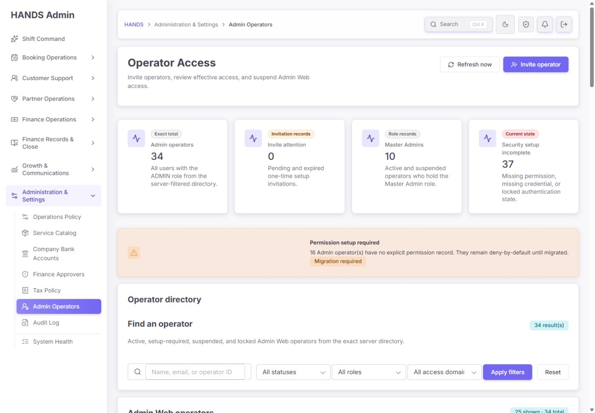
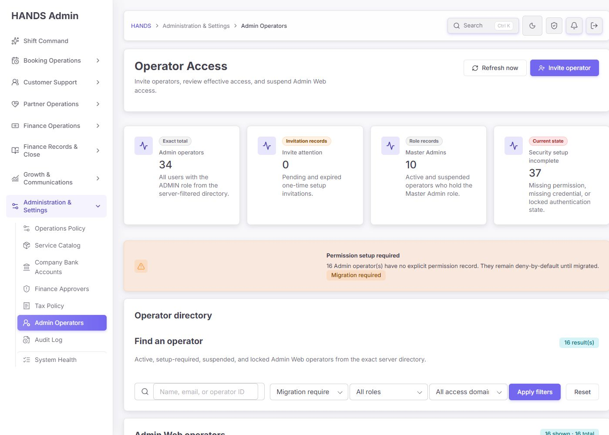
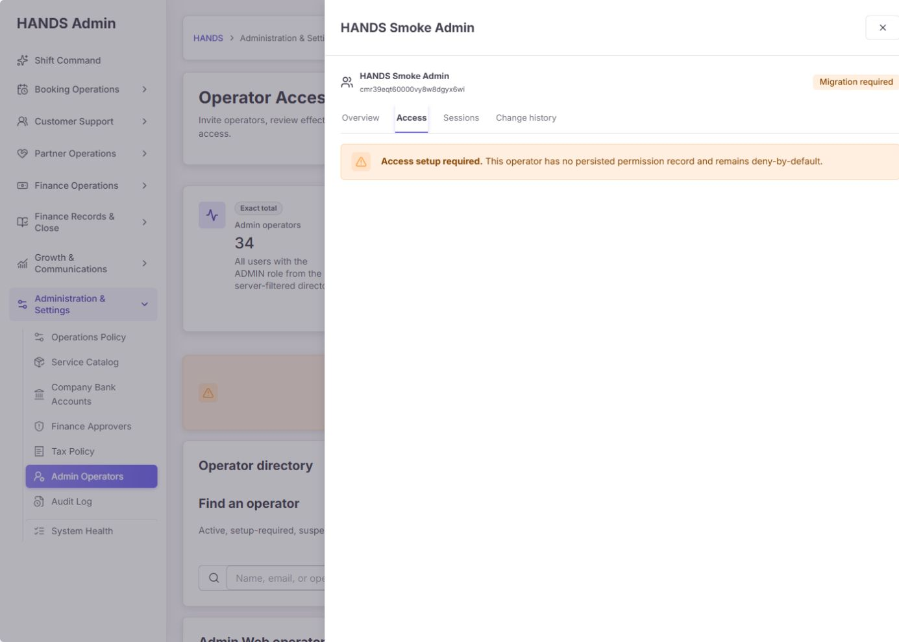
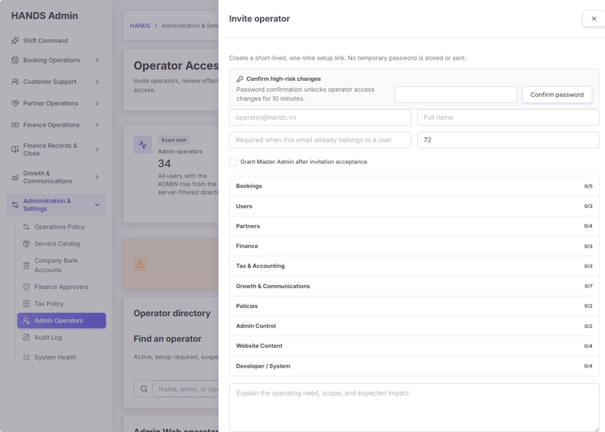
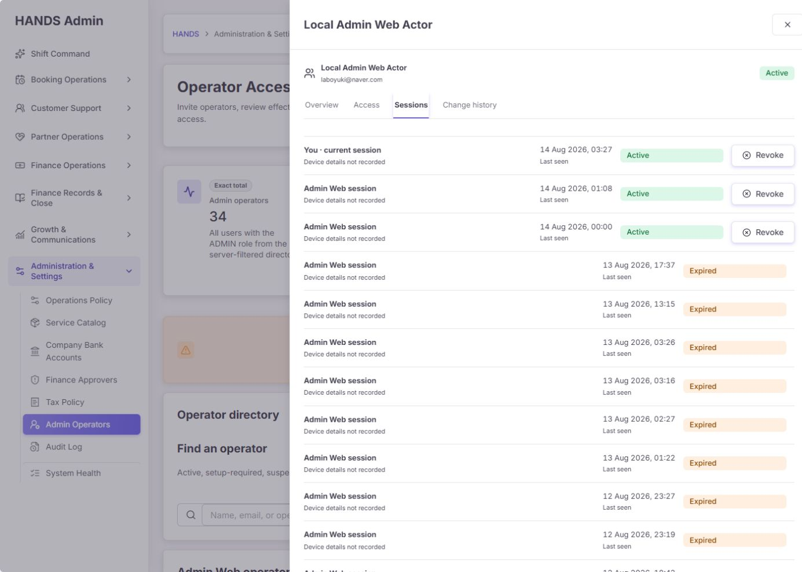
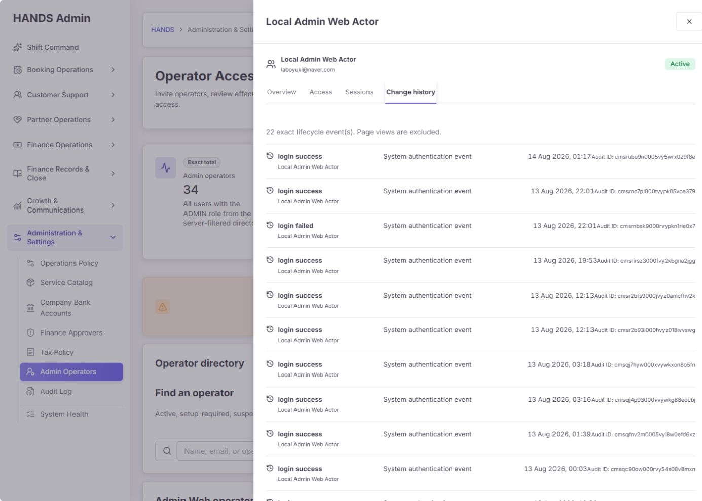
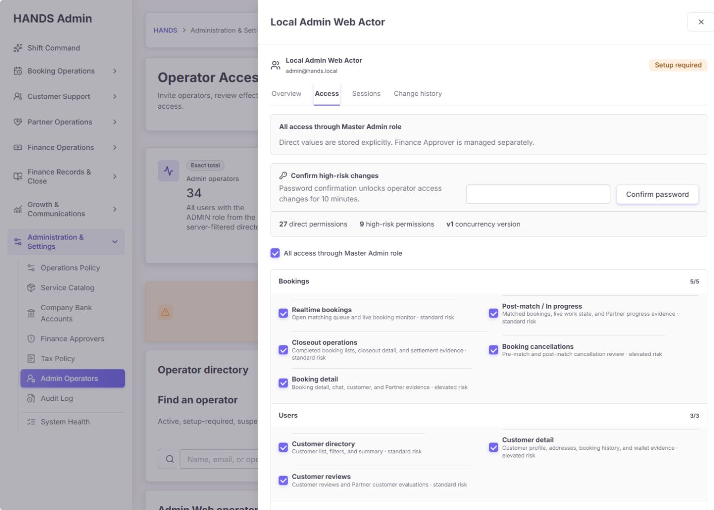
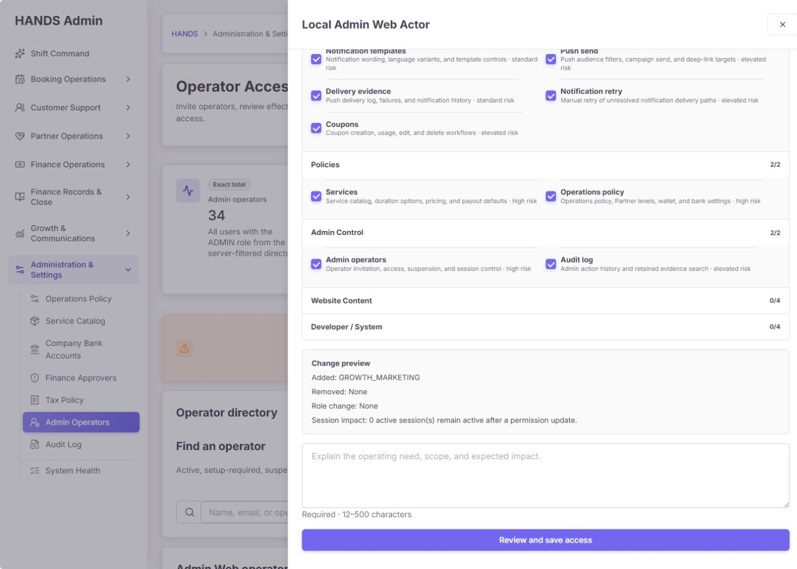

# Admin Operators 최종 심층 재감사 보고서

- 감사일: 2026-08-14
- 대상: /admin-operators
- 기준 화면: 1440 × 1000 이상 데스크톱
- 제외 범위: 1024px 이하 반응형 디자인
- 비교 기준:
  - admin-operators-final-reaudit-2026-08-11.md
  - admin-operators-remediation-master.md
  - admin-operators-remediation-evidence-2026-08-12/README.md
- 검증 방식: 실제 로그인 화면, 주요 상태별 스크린샷, Admin Web/API 코드, 읽기 전용 데이터 집계, 빌드 및 테스트 결과 교차검증
- 안전 원칙: 초대 생성, 권한 변경, 정지, 세션 회수, 데이터 삭제는 실행하지 않았다.

## 1. 최종 판정

**종합 출시 준비도: 68/100 — 큰 폭으로 개선됐으나 출시 보류**

이전 감사의 28/100과 비교하면 구조적인 P0 문제는 대부분 해결됐다. 특히 정확한 운영자 디렉터리 API, 권한 누락 시 deny-by-default, 단일 권한 매니페스트, 초대 토큰, 재인증, 변경 사유, 동시성 버전, 세션 기록, 정확한 수명주기 감사 로그, 컴팩트한 테이블과 상세 드로어는 모두 실질적인 개선이다.

그러나 지금 화면을 운영자가 그대로 신뢰하기에는 세 가지 축이 아직 부족하다.

1. **운영 데이터 신뢰성:** 현재 34명 중 33명이 테스트성 패턴이며, Finance Approver 통합 테스트가 PRODUCTION provenance로 만든 계정 12개가 남아 있다.
2. **표시 숫자·필터의 계약:** Security setup incomplete는 중복 합산되어 총 운영자 수보다 큰 37을 표시하며, 상태 및 권한 필터는 화면에 표시되는 유효 상태·유효 권한과 다른 원시 필드를 사용한다.
3. **보안 수명주기 완결성:** MFA는 표시만 있고 실제 등록·검증·강제 흐름이 없으며, 초대 취소/재발송, 누락 권한 초기화, 세션 회수 재인증, 운영자 완전 회수 UI가 연결되지 않았다.

따라서 **UI 재설계 자체는 성공**, **운영 출시 준비는 미완료**로 판단한다.

## 2. 점수표

| 평가 축 | 점수 | 판정 |
|---|---:|---|
| 이전 감사 요구 이행도 | 82/100 | 핵심 권한 계약과 UI 구조는 대부분 반영 |
| 1440+ 시각적 완성도 | 84/100 | 읽기 쉬운 테이블·드로어 구조, 문서 가로 넘침 없음 |
| 운영 효율 | 68/100 | 검색·필터·상세 검토는 좋아졌으나 처리 큐가 행동으로 이어지지 않음 |
| 데이터 신뢰성 | 38/100 | 테스트 데이터 오염, KPI 중복 합산, 필터 의미 불일치 |
| 접근 보안 | 58/100 | 재인증·세션 회수·deny-by-default는 좋지만 MFA와 수명주기 빈틈 존재 |
| 감사·복구 가능성 | 65/100 | 정확한 이벤트는 생겼으나 로그인 노이즈와 초대/회수 기능 공백 존재 |
| 문구·접근성 | 76/100 | 기본 레이블과 포커스 처리는 좋으나 개발자 용어와 중복 접근성 이름 존재 |

### 구현 표면 20점 점검

| 항목 | 점수 |
|---|---:|
| 접근성 기본기 | 3/4 |
| 성능 | 4/4 |
| 1440+ 데스크톱 레이아웃 | 4/4 |
| 디자인 시스템 일관성 | 4/4 |
| 구현·데이터 무결성 | 2/4 |
| 합계 | **17/20** |

이 17/20은 화면 구현의 표면 품질이다. 운영 데이터와 보안 출시 조건까지 포함한 종합 출시 준비도 68/100을 대체하지 않는다.

## 3. 실제 화면 확인

### 3.1 기본 화면

좋아진 점:

- 큰 인라인 편집 행을 제거하고 운영자 목록과 상세 드로어를 분리했다.
- 필터 레이블, 결과 수, 상태 배지, 역할, 보안 상태, 최근 로그인이 한 행에서 읽힌다.
- 1440px에서 문서 전체 가로 스크롤은 발생하지 않았다.
- 서버 필터 및 커서 페이지네이션으로 디렉터리 전체를 한 번에 수화하지 않는다.

남은 문제:

- 첫 화면 상단의 큰 KPI 4개, 큰 경고 카드, 필터 영역이 누적되어 실제 운영자 행이 첫 화면 아래로 밀린다.
- Security setup incomplete 37은 Admin operators 34보다 크다. 운영자는 즉시 숫자를 불신하게 된다.
- KPI가 단순 숫자 카드라서 해당 처리 큐로 바로 이동할 수 없다.

### 3.2 Migration required 큐

권한 레코드가 없는 운영자는 deny-by-default로 안전하게 막힌다. 그러나 Access 탭은 “setup required” 경고만 보여주며 초기화 작업을 시작할 수 없다. API도 일반 권한 수정 요청을 ADMIN_OPERATOR_PERMISSION_MIGRATION_REQUIRED로 거절한다. 즉, 16개 항목은 발견할 수 있지만 이 페이지에서 해결할 수 없다.

### 3.3 초대

임시 비밀번호 대신 한 번만 노출되는 설정 링크를 사용하고, 사유와 권한을 초대 시점에 명시한 것은 올바르다. 반면 Existing user ID (optional)는 운영자용 문구가 아니라 데이터베이스 식별자 중심의 개발자 문구다. 초대가 이미 존재할 때 오류는 “pending invitation”을 알려주지만 현재 페이지에는 취소 또는 재발송 동작이 없다.

### 3.4 세션과 감사 이력

세션 식별과 개별 회수, 현재 세션 표시, 페이지 조회를 제외한 정확한 수명주기 감사 데이터는 이전보다 훨씬 낫다. 다만 세션 탭에 재인증 UI가 없고, 회수 버튼은 확인 단계와 운영자 입력 사유 없이 고정 사유로 즉시 제출된다. 이력 22건 중 20건이 로그인 성공이라 실제 권한 변경을 찾기 어렵다.

### 3.5 권한 편집

37개 leaf permission, 고위험 권한 수, 버전, 추가·제거 미리보기, 세션 영향, 필수 사유가 한 흐름에 들어간 점은 좋다. 그러나 Review and save access 버튼은 실제로 별도 검토 단계를 열지 않고 즉시 저장한다. 문구와 동작이 일치하지 않는다.

## 4. 이전 감사 요구 이행 상태

| 이전 핵심 문제 | 상태 | 재감사 판정 |
|---|---|---|
| 실제 관리자 전체를 누락하던 디렉터리 | 완료 | 전용 서버 디렉터리, 총계, 서버 필터, 커서 페이지네이션 구현 |
| Website Content 권한이 API에서 제거됨 | 완료 | Admin Web과 API가 동일한 leaf 매니페스트 사용, 관련 테스트 통과 |
| 모든 권한 해제가 기본 권한으로 바뀔 수 있음 | 완료 | undefined와 빈 배열을 구분하고 명시적 빈 권한 저장 계약 구현 |
| 권한 레코드 없는 ADMIN의 UI/API 불일치 | 부분 완료 | deny-by-default는 일치하나 초기화 작업이 막혀 있음 |
| email findFirst로 잘못된 사용자 자동 연결 | 완료 | 기존 계정은 명시적인 대상 선택을 요구 |
| 초대·기존 사용자 승격·비밀번호 초기화가 한 동작 | 대부분 완료 | 초대 계약은 분리됐으나 기존 사용자 선택 UX와 초대 취소/재발송이 미완료 |
| 세션 통제 부족 | 부분 완료 | 세션 조회·회수는 추가됐으나 재인증·확인·기기 정보가 미완료 |
| Finance Approver 역할 중복 관리 | 완료 | 이 페이지는 읽기 전용으로 안내하고 전용 거버넌스 페이지로 연결 |
| 삭제처럼 보이는 위험한 접근 회수 | 대부분 완료 | Suspend/Reactivate 의미는 정확해졌으나 영구 offboarding UI는 없음 |
| 활동 로그가 잘못된 데이터 사용 | 완료 | 전용 exact lifecycle history 사용 |
| 사유 선택·오류 합침 | 완료 | 최소 12자 사유 및 주요 오류 코드별 문구 구현 |
| 동시 수정 충돌 방지 없음 | 완료 | expectedVersion 기반 충돌 방지 구현 |
| 행마다 전체 편집 폼 노출 | 완료 | 컴팩트 디렉터리 + 드로어 구조로 변경 |

## 5. 데이터 교차검증

읽기 전용 집계 결과:

| 항목 | 확인값 |
|---|---:|
| 전체 사용자 | 1,502 |
| ADMIN 역할 보유자 | 34 |
| Master Admin | 10 |
| Finance Approver | 18 |
| 권한 레코드 존재 | 18 |
| 권한 레코드 누락 | 16 |
| Admin credential 존재 | 13 |
| credential 누락 | 21 |
| 권한과 credential 모두 누락 | 4 |
| MFA configured | 0 |
| 활성 Admin Web 세션 | 3 |
| 대기/만료 초대 | 0 / 0 |
| 중복 정규화 이메일 | 0 |
| 매니페스트 외 저장 권한 | 0 |
| 휴리스틱상 테스트성 운영자 | 33/34 |
| finance-governance 테스트 실행 잔존 계정 | 12 |

주의: 테스트성 33/34는 이름·ID·이메일의 smoke, audit, demo, test, integration, finance-governance 패턴을 기준으로 한 휴리스틱이다. 개인정보나 실제 이메일은 보고서에 기록하지 않았다.

## 6. 상세 발견 사항

### P1-01. 테스트 데이터가 운영자 디렉터리와 KPI를 오염시킨다

근거:

- 현재 34명 중 33명이 테스트성 패턴이다.
- admin-finance-approver-governance.integration.spec.ts는 테스트 사용자를 AdminUserProvenance.PRODUCTION으로 생성한다.
- 동일 실행 계열의 계정 12개가 정리되지 않고 남아 있다.
- dry-run의 production provenance 12건은 실제 운영자라기보다 이 테스트 잔존 데이터와 일치한다.

영향:

- 운영자는 34명, Master 10명, Finance 18명이라는 숫자를 실제 인력 현황으로 오인한다.
- 마지막 Master Admin, Finance Approver 거버넌스, 정리 가능 여부 판단까지 왜곡될 수 있다.

수정:

1. 통합 테스트는 격리 DB/스키마 또는 트랜잭션을 사용한다.
2. 테스트 운영자는 반드시 FIXTURE provenance와 testRunId를 가진다.
3. beforeEach와 afterEach 양쪽에서 exact testRunId 정리를 수행한다.
4. 현재 잔존 데이터는 검토 가능한 삭제 매니페스트와 감사 로그를 만든 뒤 별도 정리한다. 자동 추정 삭제는 금지한다.
5. 출시 빌드에서는 FIXTURE provenance가 운영 KPI와 디렉터리에서 제외되는지 계약 테스트를 추가한다.

### P1-02. Security setup incomplete가 사람 수가 아니라 중복 문제 수를 표시한다

현재 page.tsx:191은 missingCredential + missingPermission + locked를 단순 합산한다. 권한과 credential이 모두 없는 4명이 중복되어 37이 되고, 전체 운영자 34보다 커진다.

수정:

- API가 사람 기준의 securityIncompleteDistinct를 계산해 반환한다.
- 별도 breakdown으로 Missing credential 21, Missing permission 16, Locked 0을 제공한다.
- 카드 값은 distinct 사람 수, 보조 문구는 문제 유형별 건수를 표시한다.
- 카드를 클릭하면 동일한 서버 계약을 쓰는 처리 큐로 이동해야 한다.

### P1-03. 상태 필터와 화면 상태가 같은 의미를 사용하지 않는다

확인 결과 setup-required 필터는 21건을 반환하지만, 그 안에 화면상 Migration required 4건이 포함됐다. 서버 where 조건은 credential 누락을 보고, 렌더링 lifecycleStatus는 permission 누락을 먼저 본다.

수정:

- 하나의 lifecycle status 계산식을 DB 필터, 총계, 행 표시가 공유하게 한다.
- SETUP_REQUIRED, MIGRATION_REQUIRED, LOCKED, SUSPENDED, ACTIVE를 상호 배타적으로 정의한다.
- 각 상태별 API 계약 테스트에서 filteredTotal과 모든 반환 행의 lifecycleStatus가 동일한지 검증한다.

### P1-04. Access domain 필터가 화면의 유효 권한과 다르게 동작한다

레거시 parent permission 6개가 UI에서는 27개 leaf 권한으로 확장되지만, 서버 필터는 저장 배열에 선택한 leaf가 직접 존재하는지만 검사한다. 따라서 Realtime bookings 유효 권한이 보이는 운영자를 해당 필터로 찾으면 0건이 될 수 있다.

수정:

- 최우선은 모든 저장 권한을 leaf-only 매니페스트로 마이그레이션하는 것이다.
- 마이그레이션 완료 전에는 서버 필터도 legacy parent → leaf 확장 규칙을 사용한다.
- 응답에는 storedPermissionCount와 effectiveLeafPermissionCount를 분리한다.

### P1-05. Migration required는 발견만 가능하고 해결할 수 없다

수정:

- Access 탭에 Initialize explicit access 동작을 제공한다.
- 현재 역할, 선택할 leaf 권한, 빈 권한 허용 여부, 고위험 권한, 세션 영향, 사유를 검토하게 한다.
- 재인증과 expectedVersion/없음 상태의 원자적 생성, exact audit event를 요구한다.
- 기본 권한을 추정해 자동 부여하지 않는다.
- 테스트 잔존 계정 정리 후 실제 대상만 큐에 남겨야 한다.

### P1-06. MFA는 상태 필드만 있고 실제 보안 흐름이 없다

현재 데이터는 0/34 configured다. 코드 검색상 mfaState 표시와 저장 필드는 있으나 Admin Web 등록, challenge, recovery code, 로그인 강제 흐름은 확인되지 않았다.

수정:

- 출시 전 TOTP 또는 동등한 2단계 인증의 등록, challenge, recovery, 재설정, 감사 이벤트를 구현한다.
- 최소한 Master Admin과 Finance Approver는 configured 전까지 고위험 변경을 금지한다.
- 기능을 아직 제공하지 않을 경우 문구를 MFA not available in this environment로 바꿔 “설정하면 되는 상태”처럼 보이지 않게 한다.

### P1-07. 초대는 생성할 수 있지만 취소·재발송할 수 없다

API와 화면에는 초대 목록과 생성만 있다. 중복 초대 시 기존 초대를 취소하라는 오류 계약이 존재하지만 실제 취소 UI/route가 없다.

수정:

- Pending invitation에 Revoke와 Resend를 제공한다.
- Resend는 기존 토큰을 폐기하고 새 만료 시간과 새 토큰을 발급한다.
- 둘 다 재인증, 12자 이상 사유, 확인 단계, exact audit event를 사용한다.
- 전달 여부를 SENT, DELIVERY_FAILED, ACCEPTED, EXPIRED, REVOKED로 구분한다.

### P1-08. 세션 회수 UX가 백엔드 보안 계약과 연결되지 않는다

백엔드는 최근 재인증을 요구하지만 Sessions 탭에는 재인증 UI가 없다. 회수 버튼은 즉시 제출되고 사유는 hidden 고정 문자열이다. 현재 세션도 동일한 Revoke 버튼으로 처리된다.

수정:

- Sessions 탭 상단에 재인증 상태와 남은 유효 시간을 표시한다.
- 다른 사람 세션 회수는 대상, 마지막 사용, 기기, 영향, 입력 사유를 보여주는 확인 다이얼로그를 사용한다.
- 현재 세션은 Revoke가 아니라 Sign out this session으로 분리한다.
- Admin 로그인 요청에서 user agent/device 요약을 생성해 platformSummary로 전달한다.

### P2-01. 표의 direct permission 수와 상세의 effective leaf 수가 다르다

예: 목록에서는 6 direct permissions, 상세에서는 27 effective permissions로 보인다. 다른 운영자는 목록 46, 상세 37처럼 역전되기도 한다.

수정:

- 저장값은 Stored entries, 확장값은 Effective leaf access로 명확히 분리한다.
- 일반 운영자에게는 Effective access만 주 정보로 보여준다.
- 저장 데이터가 leaf-only로 정규화되면 legacy count는 진단 화면으로 이동한다.

### P2-02. 두 번째 페이지에서 이전 페이지로 돌아갈 수 없다

현재 Next page만 있고 두 번째 페이지에는 Previous 또는 First가 없다.

수정:

- cursor history를 URL에 보존하거나 page 기반 탐색 계약을 제공한다.
- First, Previous, Next와 현재 범위를 항상 같은 위치에 노출한다.
- 필터 변경 시 cursor를 초기화한다.

### P2-03. Change history가 로그인 성공 이벤트에 잠긴다

현재 22건 중 20건이 login success다. 권한 변경이나 정지 이력을 찾기 어렵고 최대 30건 이후 페이지네이션도 없다.

수정:

- 기본 탭은 Access changes로 한다.
- Sign-ins와 Sessions를 별도 세그먼트로 분리한다.
- actor, target, before → after, reason, result, time, audit ID 열을 제공한다.
- action/type/date/actor 필터와 커서 페이지네이션을 추가한다.

### P2-04. Existing user ID는 운영자 친화적 입력이 아니다

수정:

- Invite new operator와 Grant access to existing user를 명시적으로 분리한다.
- 기존 사용자는 이메일/이름 검색 후 단일 계정을 선택하게 한다.
- 내부 ID는 확인용 보조 정보로만 표시한다.

### P2-05. Review and save access가 실제 검토 단계 없이 저장한다

수정:

- 가장 간단한 수정은 버튼을 Save access로 바꾸는 것이다.
- 고위험 권한 또는 Master Admin 변경에는 실제 검토 다이얼로그를 추가해 대상, 역할, 추가·제거 권한, 세션 영향, 사유를 다시 보여준다.

### P2-06. 정지 불가능한 대상에도 정지 폼이 노출된다

credential이 없거나 Finance Approver 거버넌스가 걸린 대상에도 Suspend Admin Web access 폼이 보인다. 제출하면 서버가 거절한다.

수정:

- API가 allowedActions와 blockedReasons를 반환한다.
- 화면은 불가능한 동작을 숨기지 말고 disabled 상태와 해결 경로를 설명한다.
- credential 없는 레거시 계정에는 migration/cleanup 흐름을, Finance Approver에는 전용 페이지 링크를 제공한다.

### P2-07. 영구 offboarding UI가 없다

API에는 DELETE users/:id/admin-operator가 있으나 Admin Web action과 폼에서는 연결되지 않는다. Suspend는 역할과 권한을 보존하므로 퇴사·계약 종료 수명주기를 끝낼 수 없다.

수정:

- Suspended 상태에서만 Remove operator access를 허용한다.
- Finance Approver 해제, 마지막 Master 보호, 활성 세션 0, 재인증, 입력 사유, 운영자명 재입력 확인을 preflight로 요구한다.
- 삭제가 아니라 역할·credential·permission 처리 정책을 화면에 정확히 설명한다.

### P2-08. 첫 화면의 처리 우선순위가 약하다

수정:

- 큰 KPI 4개를 한 줄짜리 compact command strip으로 줄인다.
- Migration required, Security incomplete, Pending invitations를 처리 가능한 queue chip으로 만든다.
- Access domain은 37개 flat option 대신 그룹형 select 또는 검색 가능한 combobox로 바꾼다.
- High-risk access 필터를 추가한다.

### P2-09. 드로어 닫기 접근성 이름이 중복된다

backdrop 버튼과 X 버튼이 모두 Close Operator Access detail이라는 동일한 접근성 이름을 갖는다.

수정:

- backdrop은 포커스 순서와 접근성 트리에서 제외하고 포인터 클릭만 처리한다.
- 실제 닫기 버튼 하나만 명확한 이름을 가진다.
- Escape, 닫기 버튼, backdrop, 포커스 복귀를 자동화 테스트로 고정한다.

### P3-01. 문구를 운영 언어로 더 정리할 수 있다

권장 문구:

| 현재 | 권장 |
|---|---|
| Operator Access | Admin operators 또는 운영자 접근 관리 중 내비게이션과 하나로 통일 |
| 1 permission(s) | 1 permission / 2 permissions로 복수형 처리 |
| Direct access | Effective access |
| Access setup required | No permission policy saved — access is blocked |
| Setup required | Sign-in setup required |
| Migration required | Permission policy required |
| Review and save access | Save access 또는 실제 Review 단계 구현 |
| Device details not recorded | Device details unavailable for this sign-in |

## 7. 권장 화면 구조

1. **Command strip:** 전체 운영자, 조치 필요, 대기 초대, 잠긴 계정. 각 숫자는 필터 큐로 이동.
2. **처리 큐:** Permission policy required, Sign-in setup required, Locked, Pending invitation.
3. **검색·필터:** 검색, 수명주기 상태, 역할, 권한 그룹, 고위험 접근.
4. **운영자 테이블:** 운영자, 상태, 역할, 유효 권한, 인증/MFA, 최근 로그인, 상세.
5. **상세 드로어:** Overview, Access, Sessions, Access history.
6. **별도 Sign-in history:** 권한 변경 이력과 분리.

## 8. 구현 우선순위

### 1단계 — 출시 데이터와 숫자 계약

- 테스트 DB 격리 및 PRODUCTION 테스트 fixture 제거
- 승인된 매니페스트 기반 잔존 테스트 데이터 정리
- distinct securityIncomplete와 상호 배타적 lifecycle status 구현
- legacy parent permission의 leaf-only 마이그레이션
- 상태·권한 필터 계약 테스트

### 2단계 — 막힌 운영 업무 연결

- explicit permission initialization
- invitation revoke/resend
- 세션 탭 재인증·확인·입력 사유
- operator offboarding UI
- allowedActions/blockedReasons 계약

### 3단계 — 보안 출시 조건

- MFA 등록·검증·복구·강제
- Master/Finance 고위험 작업 MFA gate
- device/platform summary 기록
- 세션 및 초대 감사 이벤트 보강

### 4단계 — 운영 효율과 문구

- compact actionable command strip
- 이전/다음 페이지 탐색
- access history와 sign-in history 분리
- 권한 필터 그룹화 및 high-risk 필터
- direct/effective 용어와 복수형 수정
- 드로어 닫기 접근성 이름 수정

## 9. 완료 기준

- [ ] 운영 DB/릴리스 후보 DB에 승인되지 않은 fixture 운영자가 0명이다.
- [ ] Admin operators 총수보다 Security incomplete가 커질 수 없다.
- [ ] 모든 상태 필터 결과의 lifecycleStatus가 선택 상태와 일치한다.
- [ ] 유효 leaf 권한이 있는 운영자는 동일 access domain 필터에서 검색된다.
- [ ] Migration required 항목을 페이지 안에서 명시적 권한으로 초기화할 수 있다.
- [ ] Pending invitation을 취소하고 안전하게 재발송할 수 있다.
- [ ] MFA가 최소 Master Admin과 Finance Approver에게 실제로 강제된다.
- [ ] 세션 회수 전에 재인증·영향 확인·입력 사유가 필요하다.
- [ ] 세션에 기기/플랫폼 식별 정보가 기록된다.
- [ ] Access history 기본 화면에서 로그인 이벤트가 분리된다.
- [ ] 영구 offboarding이 별도 preflight와 감사 로그를 가진다.
- [ ] 전체 Admin Web 테스트의 기존 3개 실패가 해소된다.

## 10. 기술 검증 결과

- Admin Web production build: 통과
- Admin Operators 집중 테스트: 3개 파일, 11개 테스트 통과
- API 권한 guard/auth/manifest 집중 테스트: 5개 파일, 109개 테스트 통과
- API admin service/controller: 830개 중 829개 통과, 1개 실패
  - 실패는 이 화면이 아니라 push campaign enqueue 이후 receipt persistence 기대값과 관련
- 전체 Admin Web: 844개 파일 중 840 통과, 1 skip, 3 실패
  - admin-surface-css 규칙 추출 기대값
  - admin-navigation Company Bank Accounts 기대값
  - finance-closeout fixture 날짜 기대값
- 1440 × 1000 실제 화면: 문서 가로 overflow 없음
- 인증 상태 production 화면 reload 표본: 약 290–321ms
- 브라우저 콘솔 오류: 없음

전체 Admin Web의 기존 3개 실패가 여전히 남았으므로, 2026-08-12 구현 증빙의 repository release hold 조건은 아직 해제되지 않았다.

## 11. 감사 한계

- localhost의 현재 데이터와 코드 기준이다. 실제 production 데이터 상태라고 단정하지 않는다.
- destructive 동작은 실행하지 않았으므로 초대 수락, 권한 저장, 정지, 세션 회수의 실제 DB mutation 결과는 집중 테스트와 코드 계약으로 검증했다.
- 사용자 요구에 따라 1024px 이하 화면은 검사·평가·보고서에서 제외했다.
- 접근성은 구조·레이블·포커스 코드를 검토한 결과이며, 전체 WCAG 준수를 보증하는 인증은 아니다.

## 12. 결론

이번 수정은 단순 미관 개선이 아니라 위험했던 관리자 권한 모델을 상당히 정상화했다. 이전 28점 상태에서 가장 큰 문제였던 권한 누락 허용, API/UI 권한 목록 불일치, 비고유 이메일 자동 연결, 임시 자격 증명, 무감사 변경, 거대한 행 편집기는 모두 의미 있게 개선됐다.

다음 병목은 디자인이 아니라 **데이터 신뢰성, 상태/필터의 단일 계약, 실제 MFA, 처리 가능한 수명주기**다. P1-01부터 P1-08까지 완료하고 전체 테스트를 녹색으로 만든 뒤에야 출시 후보로 재평가하는 것이 안전하다.

