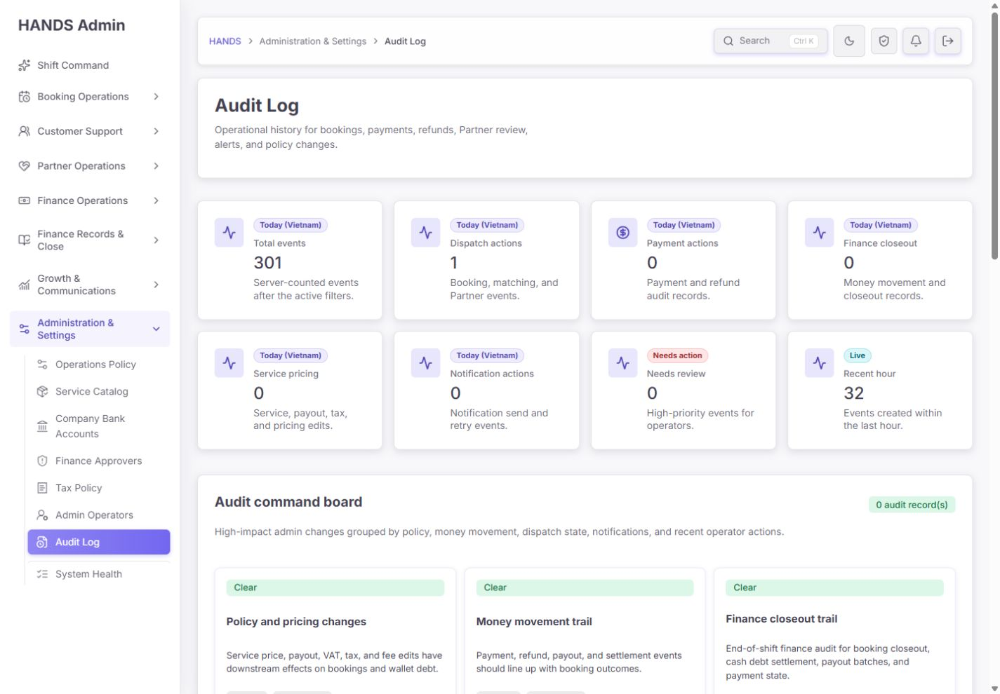
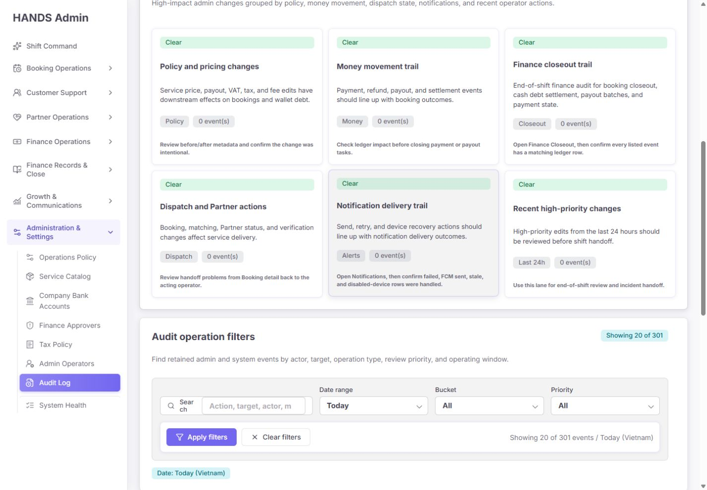
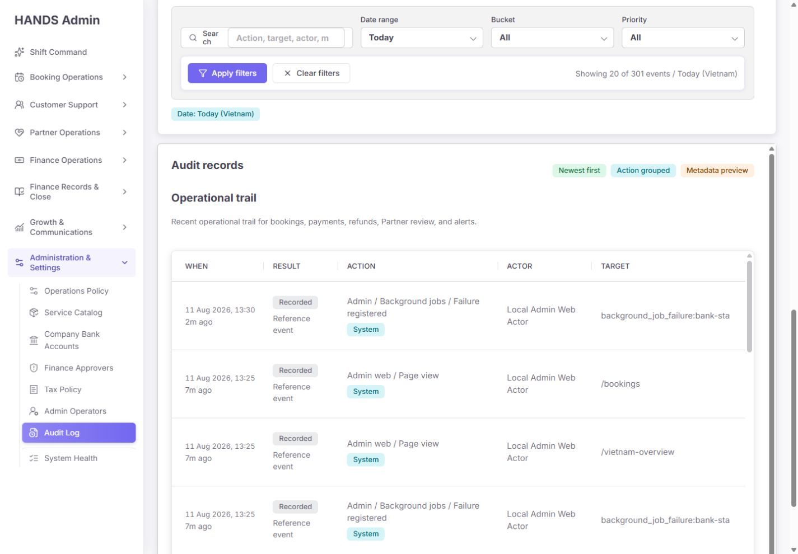
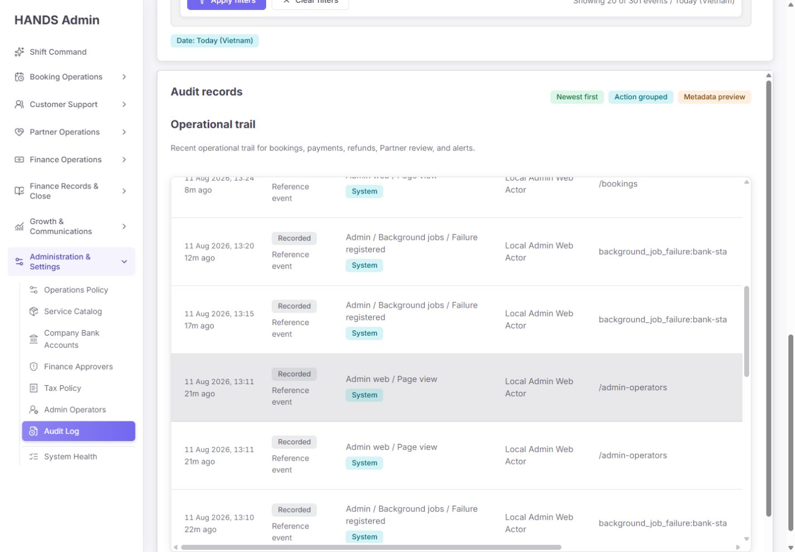
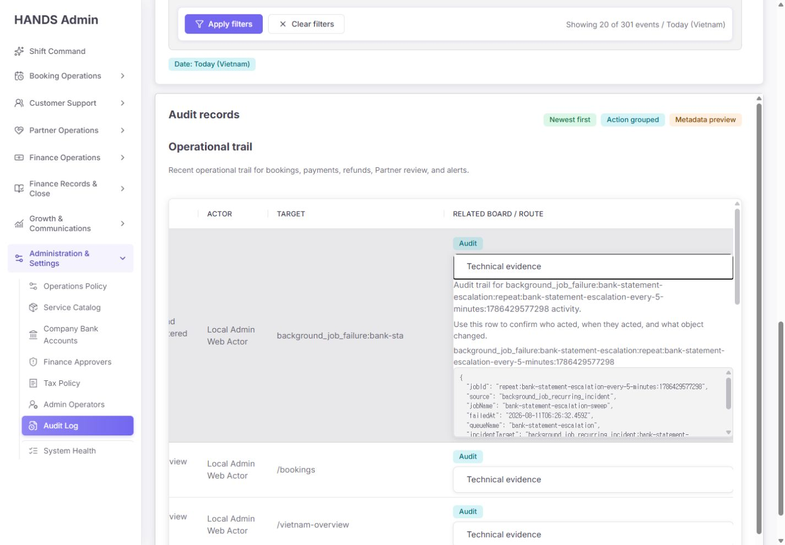
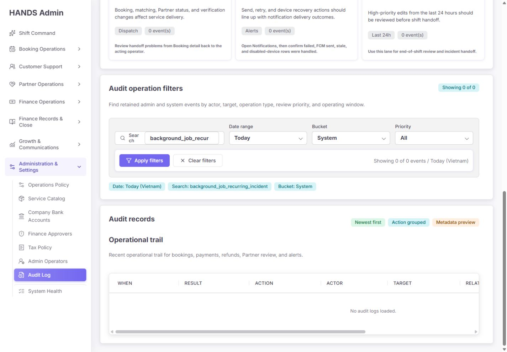
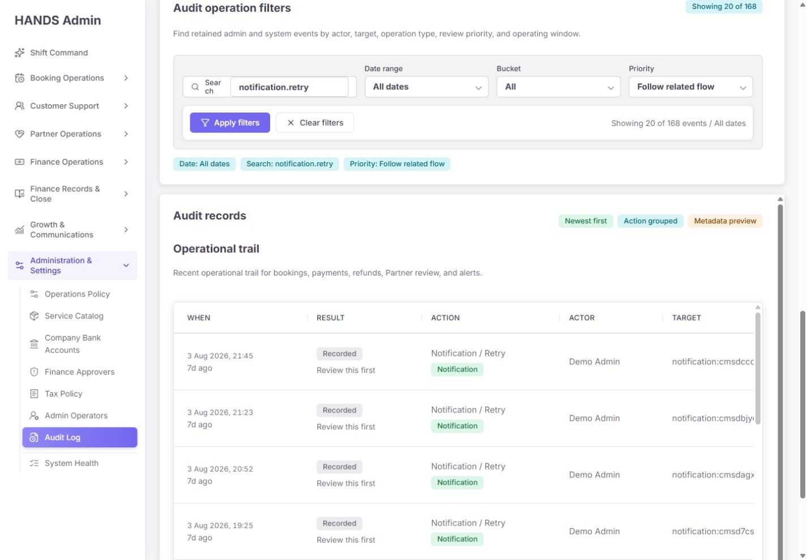
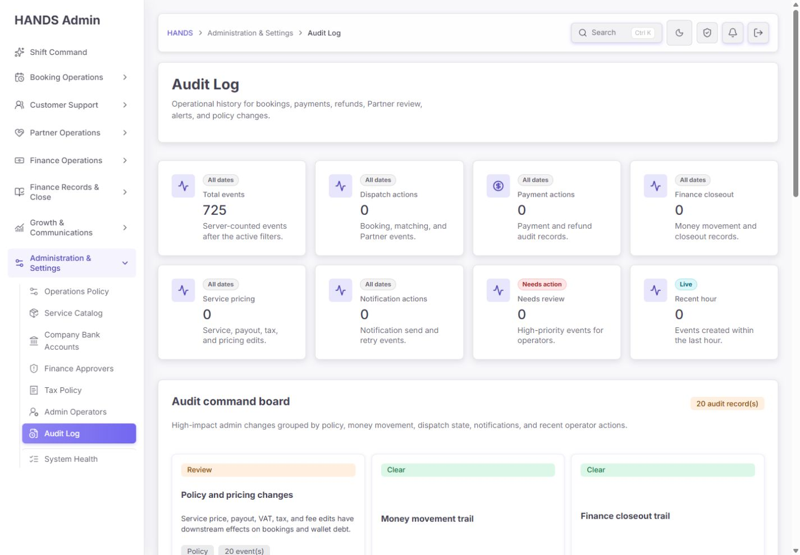
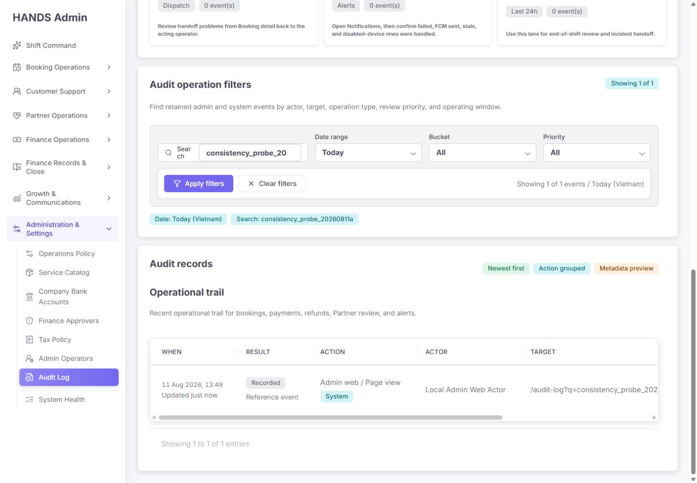

# Audit Log 최종 심층 재감사 보고서

- 감사 대상: `http://localhost:3101/audit-log`
- 감사일: 2026-08-11
- 관점: 실제 운영자, 운영 책임자, 보안·사고 조사자, 재무 감사자
- 화면 기준: 1440px 이상 데스크톱만 검수
- 제외 범위: 1024px 이하 화면과 모바일/태블릿 대응은 이번 보고서에서 완전히 제외
- 검수 방식: 로그인된 실제 화면, 필터 상호작용, 현재 소스, API, Prisma 스키마, 로컬 DB, SQL 실행 계획, 관련 테스트를 교차 검증
- 변경 범위: 애플리케이션 코드와 업무 데이터는 수정하지 않았으며, 본 보고서와 캡처 증거만 추가함

## 1. 최종 판정

**종합 출시 준비도: 31/100 — 출시 보류(Release hold)**

현재 페이지는 카드·필터·테이블·페이지네이션이라는 기본 골격을 갖췄고, 1440px에서 화면 자체가 무너지지는 않는다. 그러나 Audit Log의 핵심은 “예쁜 기록 목록”이 아니라 다음 질문에 틀리지 않게 답하는 것이다.

1. 누가 행동했는가?
2. 무엇이 바뀌었는가?
3. 성공·실패·거부 중 어떤 결과였는가?
4. 원본 증거는 변조되지 않았는가?
5. 필터·집계·목록이 같은 사실을 말하는가?

현재 구현은 이 다섯 질문에 안정적으로 답하지 못한다. 특히 시스템이 만든 백그라운드 실패를 사람의 행동으로 귀속하고, 페이지를 열 때마다 그 방문을 같은 감사 로그에 기록하며, 화면과 API의 카테고리·우선순위 규칙이 다르고, 원본 감사 레코드의 metadata를 실제로 수정하는 코드가 존재한다. 따라서 단순 UI 보완보다 **감사 이벤트 데이터 계약과 무결성 경계 수정이 먼저**다.

### 영역별 점수

| 영역 | 점수 | 판정 |
|---|---:|---|
| 1440px 시각 일관성 | 58/100 | 디자인 시스템은 일관되지만 상단 과밀, 3중 스크롤, 1500px 강제 테이블 때문에 실제 판독성이 낮음 |
| 운영 효율 | 29/100 | 중요 변경보다 페이지 방문·백그라운드 반복 실패가 기본 목록을 지배하고 필터 결과를 신뢰하기 어려움 |
| 데이터·집계 신뢰성 | 18/100 | Tax, priority, bucket, command board, summary와 row label이 서로 불일치 |
| 감사 무결성·주체 식별 | 12/100 | 시스템 이벤트가 사람 actor로 저장되고 기존 audit metadata를 update하는 코드가 있음 |
| 장애·복구 안전성 | 21/100 | API 실패를 0건/`Clear`로 표시할 수 있고 list와 summary가 서로 다른 스냅샷을 읽음 |
| 성능·확장성 | 49/100 | 현재 4.97만 건에서는 SQL 자체가 치명적으로 느리지는 않지만 불필요한 쓰기, 2개 실시간 집계, 불충분한 인덱스 구조가 누적됨 |
| 접근성·문구 | 51/100 | label, table header, time, native disclosure는 양호하나 모호한 `Recorded`, `Clear`, 잘린 Search label과 다중 스크롤이 문제 |
| 테스트 신뢰성 | 46/100 | API 감사 테스트는 통과하지만 핵심 의미 계약을 검증하지 않고 Admin Web 대상 테스트 1건이 현재 실패 |

## 2. 잘된 부분

현재 개선에서 유지할 가치가 있는 부분도 분명하다.

- Admin Web과 API 모두 Audit Log에 전용 `SYSTEM_AUDIT` 권한 경계를 둔다.
- 목록은 서버에서 20건 단위로 제한하고 summary API를 별도로 두어 과거처럼 전체 로그를 한 번에 불러오지는 않는다.
- actor의 ID, 이메일, 전화번호, 이름을 API select에 포함한다.
- 테이블은 `<th scope="col">`, `<time datetime>`, focus 가능한 scroll region, native `<details>`를 사용한다.
- booking, payment, refund, payout, notification 등 일부 이벤트는 관련 업무 화면으로 연결한다.
- operational policy, service pricing, notification retry 등 일부 이벤트는 metadata를 운영 문구로 요약한다.
- 백그라운드 실패 사유 중 연결 URL, bearer token, password/secret/token query 값을 일부 마스킹하는 코드가 있다.
- API의 날짜·검색·bucket·priority·skip·take 기본 테스트 13건은 통과했다.

이 기반은 버릴 필요가 없다. 다만 지금은 “컴포넌트 사용 여부”보다 감사 사실의 정확성을 먼저 강화해야 한다.

## 3. 실제 화면 증거

### 3.1 첫 화면: 기록보다 요약 카드가 먼저 두 화면 가까이를 차지한다



상단에 KPI 8개가 있고 그 아래 command board 카드 6개가 이어진다. 실제 운영자가 필요한 최근 감사 행은 첫 화면에서 보이지 않는다. 더 큰 문제는 KPI가 “필터 이후 집계”인지 “전체 운영 상태”인지 한눈에 구분되지 않고, 동일 이벤트가 여러 KPI에 중복 포함된다는 점이다.

### 3.2 Command board와 필터



6개 카드가 모두 같은 시각적 무게를 가지며, 이벤트가 없으면 `Clear`라고 표시한다. 그러나 이벤트가 없다는 사실은 문제가 없다는 뜻이 아니다. 데이터 로딩 실패도 현재 구현상 0건으로 내려갈 수 있어 `Clear`는 안전한 표현이 아니다.

필터 영역에서는 `Search` label이 두 줄로 잘리고 placeholder도 축약된다. 1440px 전용 화면인데도 검색 필드가 좁고, `Bucket`과 `Priority`는 내부 구현 용어에 가깝다.

### 3.3 테이블: 가장 중요한 관련 화면이 오른쪽 바깥에 있다



기본 목록은 `Admin web / Page view`와 `Background jobs / Failure registered`가 대부분이다. 관련 업무 화면과 Technical evidence는 오른쪽 끝에 있어 수평 스크롤 전에는 보이지 않는다. Target은 중간에서 잘려 사건을 구분하기 어렵다.

### 3.4 페이지·섹션·테이블이 각각 스크롤된다



현재 CSS는 Audit Log의 각 card에 최대 높이와 세로 스크롤을 주고, 테이블에도 별도 최대 높이와 `overflow:auto`를 준다. 바깥 페이지 스크롤까지 포함하면 운영자는 최대 3개의 세로 스크롤과 1개의 가로 스크롤을 사용해야 한다.

### 3.5 Technical evidence는 원시 JSON 중심이고 또 스크롤된다



행 안의 disclosure에 설명, full target, highlight, JSON이 모두 들어간다. JSON에는 다시 128px 높이의 내부 스크롤이 생긴다. before/after, reason, outcome, request/correlation ID가 구조적으로 분리되지 않았고 복사·다운로드 기능도 없다.

### 3.6 metadata 검색을 약속하지만 실제로 찾지 못한다



화면 placeholder는 `Action, target, actor, metadata`라고 안내한다. 실제 background failure metadata에 `background_job_recurring_incident`가 존재하지만, System bucket에서 같은 값을 검색하면 0건이다. API의 `q` 조건에는 action, target, actor만 있고 metadata가 없다.

### 3.7 Priority 필터와 행의 우선순위가 정반대로 표시된다



필터는 `Follow related flow`인데 결과 168건의 행은 모두 `Review this first`라고 표시된다. 서버는 모든 `notification.*`을 priority 2 조건에 포함하지만, 프런트는 `.retry`를 priority 4로 분류하기 때문이다. 이 화면에서는 동일 행이 여러 priority 필터에 포함될 수 있다.

### 3.8 Tax 725건인데 “tax 포함” KPI는 0, command board는 20건이다



Tax bucket 전체 기간에는 725건이 있다. 그러나 `Service pricing` helper는 “Service, payout, tax, and pricing edits”라고 쓰면서 값은 0이다. 같은 화면의 `Policy and pricing changes` card는 현재 페이지의 20건만 세어 `20 audit record(s)`라고 표시한다.

더 나아가 Tax 행을 보여주는 이 card의 링크는 `/audit-log?bucket=Service%2FPricing`이다. 클릭하면 Tax 필터가 사라지고 다른 데이터 집합으로 이동한다.

### 3.9 검색이 업무 기록 대신 자신의 이전 검색 방문을 찾는다



`consistency_probe_20260811a`라는 새 값을 첫 검색했을 때 0건이었고, 같은 URL을 다시 열자 1건이 되었다. 결과는 업무 이벤트가 아니라 이전 검색 URL 자체를 target으로 저장한 `Admin web / Page view`다. 검색 행위가 검색 대상 데이터에 들어가므로 결과 수와 페이지네이션이 스스로 변한다.

## 4. 현재 DB 교차 검증

2026-08-11 감사 중 로컬 DB를 읽기 전용으로 확인했다. 화면 탐색 자체가 `admin_web.page_view`를 추가하므로 아래 수치는 검사 시점의 스냅샷이며 이후 조금 증가할 수 있다.

| 항목 | 건수 | 비율/의미 |
|---|---:|---|
| 전체 AdminAuditLog | 49,706 | 현재 누적량 |
| 전체 `admin_web.page_view` | 27,357 | 전체의 55.04% |
| 전체 background failure registered | 5,244 | 전체의 10.55% |
| 오늘 Vietnam 기준 전체 | 326 | 검사 시점 |
| 오늘 background failure registered | 167 | 오늘의 51.23% |
| 오늘 `admin_web.page_view` | 158 | 오늘의 48.47% |
| 오늘 실제 업무 감사 이벤트 | 1 | `booking.sensitive_detail.view` 1건 |
| 오늘 noise 합계 | 325 | 오늘의 99.69% |
| 오늘 화면에 표시된 actor | 1명 | 326건 모두 `Local Admin Web Actor` |

오늘의 background failure는 실제로 사람이 실행한 것이 아니다. 그런데 `admin-background-jobs.service.ts`가 첫 번째 Master Admin의 user ID를 `actorId`로 저장한다. 시스템 모니터가 만든 사건이 사람의 행위로 보이는 직접 원인이다.

### 현재 SQL 성능 측정

49,706건인 현재 로컬 DB에서 Vietnam 오늘 범위로 실행 계획을 확인했다.

| 쿼리 | 실행 시간 | buffer hit | 현재 해석 |
|---|---:|---:|---|
| 최근 20행 + 정렬 | 17.726ms | 562 | 현재는 치명적으로 느리지 않지만 20행을 위해 넓게 읽고 별도 top-N sort 수행 |
| action group summary | 3.223ms | 560 | 현재 규모에서는 양호 |

존재하는 일반 인덱스는 `(action, createdAt)`뿐이다. 기본 화면은 action 조건 없이 `createdAt desc`로 조회하므로 `(createdAt DESC, id DESC)` 인덱스가 더 직접적이다. 다만 현 시점의 체감 지연을 DB 하나로 단정하면 안 된다. 실제 페이지는 다음 비용을 동시에 만든다.

- 페이지 진입마다 감사 row 1건 쓰기
- no-store list API 호출
- no-store summary API 호출
- summary 내부 count 2개와 groupBy 1개
- metadata JSON을 포함한 20행 전송
- 별도 snapshot 없이 list와 summary를 병렬 조회

즉 지금의 우선순위는 “무조건 캐시 추가”가 아니라 **불필요한 page-view 쓰기 제거, 한 스냅샷 응답, 올바른 인덱스**다.

## 5. 운영 흐름 단계별 건강도

| 단계 | 운영자 행동 | 건강도 | 핵심 문제 |
|---:|---|---|---|
| 1 | 페이지 진입 후 데이터 신뢰 상태 확인 | **실패** | 데이터 시점·API 상태·지연 여부가 없고 API 실패도 0/`Clear`로 보일 수 있음 |
| 2 | 오늘 중요한 변경을 빠르게 파악 | **실패** | 오늘 326건 중 325건이 page view/반복 failure이며 실제 중요 변경이 묻힘 |
| 3 | command board로 업무 영역 선택 | **실패** | 현재 20행만 집계하고 카테고리 중복, Tax link 불일치, `Clear` 의미가 부정확 |
| 4 | 검색·기간·영역·우선순위 적용 | **실패** | metadata 검색 미지원, priority 중복, Admin Web 필터 UI 누락, 검색 자체가 결과를 오염 |
| 5 | 행에서 actor·결과·대상 파악 | **실패** | 시스템 사건이 사람 actor, 결과는 항상 `Recorded`, target은 잘리고 actor type이 없음 |
| 6 | 관련 업무 화면으로 이동 | **주의** | 일부 링크는 유용하나 generic event는 현재 페이지로 돌아오는 `Audit` 링크뿐 |
| 7 | 변경 전후와 사유 확인 | **실패** | 핵심 필드가 구조화되지 않고 변환된 JSON을 내부 스크롤로 제공 |
| 8 | 시간 순서로 사건 재구성 | **실패** | 서버 page는 최신순인데 각 page 안에서 client가 priority로 재정렬; global order가 아님 |
| 9 | 다음 페이지로 조사 확대 | **실패** | offset pagination, 안정적 tie-breaker 없음, 새 page view가 계속 추가되어 행 중복/누락 가능 |
| 10 | 증거 내보내기·사건 인계 | **미구현** | CSV/JSON export, permalink/event detail, correlation ID, review note/acknowledgement 없음 |

## 6. 확인된 문제 상세

### P0-01. 시스템 이벤트가 사람의 행동으로 기록된다

**확정 증거**

- `AdminAuditLog.actorId`는 필수이고 actor type이 없다(`apps/api/prisma/schema.prisma:2491-2500`).
- background monitor는 첫 번째 Master Admin을 찾아 `actorId: recipients[0].id`로 incident/failure audit를 생성한다(`apps/api/src/admin/admin-background-jobs.service.ts:661-682`, `714-728`).
- 오늘 326건 모두 화면에서 `Local Admin Web Actor`로 표시됐다.

**운영 영향**

- 사고 조사 시 특정 사람이 실패를 발생시킨 것처럼 오해한다.
- “누가 무엇을 했는가”라는 감사 로그의 가장 중요한 사실이 틀린다.
- 자동화와 사람의 책임 경계를 나눌 수 없다.

**수정 요건**

- `actorType: HUMAN | SYSTEM | SERVICE`를 필수로 둔다.
- human actor는 user ID와 당시 표시명/email snapshot을 저장한다.
- system/service actor는 `system_monitor`, `notification_worker`, `bank_reconciliation_worker` 같은 stable principal을 사용한다.
- 시스템 사건의 알림 수신자는 actor가 아니라 `recipients`로만 남긴다.
- 기존 자동화 로그를 migration/backfill할 때 metadata.source와 action prefix로 actor type을 교정한다.

### P0-02. 페이지 방문 기록이 감사 로그를 지배하고 검색·집계를 자기 오염시킨다

**확정 증거**

- 접근 허용 페이지마다 `admin_web.page_view`를 기록한다(`apps/admin_web/lib/admin-operator-access.ts:43-60`).
- middleware는 query string까지 포함한 전체 경로를 전달한다(`apps/admin_web/proxy.ts:9-12`).
- 전체 로그의 55.04%가 page view이고, 오늘은 158건이다.
- 새로운 검색어를 다시 열면 이전 검색 URL page view가 검색 결과로 나온다.

**수정 요건**

- 일반 page view는 `AdminAuditLog`에서 분리해 access telemetry 또는 security access event 저장소로 이동한다.
- 감사 로그에는 민감 화면 조회, export, 권한 거부, write action처럼 정책상 필요한 접근 사건만 남긴다.
- query string 전체를 target으로 저장하지 말고 route template과 허용된 filter key만 구조화한다. 검색어·PII가 URL에 있으면 그대로 보존하지 않는다.
- 기본 Audit Log view에서는 page view를 제외하고, `Security & access` saved view에서만 조회한다.

### P0-03. 영역과 우선순위 분류 계약이 서버·프런트·command board마다 다르다

**확정 사례**

- 서버 priority 2는 모든 `notification.*`을 포함하지만 프런트는 `.retry`를 priority 4로 표시한다.
- priority 4의 `.retry`, priority 3의 payment/refund, priority 2의 notification 규칙이 서로 중복된다.
- Dispatch와 Partner가 `provider_`, `provider-` 액션을 함께 포함한다.
- Payment와 Finance/Closeout이 payment/refund를 함께 포함한다.
- Tax filter는 `tax_`를 반환하지만 Service pricing summary에는 Tax가 없고 helper 문구에는 Tax가 있다고 쓴다.
- Policy card는 Tax를 세지만 링크는 Service/Pricing으로 이동한다.

**수정 요건**

- prefix if-chain을 프런트와 서버에 복제하지 않는다.
- 하나의 canonical event registry에서 `area`, `severity`, `outcome`, `actorType`, `objectType`, `relatedRoute`를 결정한다.
- 한 이벤트에는 primary area와 하나의 severity만 부여한다. 여러 관점은 `tags`로 분리한다.
- API가 계산한 분류 값을 그대로 응답하고 UI는 다시 추론하지 않는다.
- 모든 filter option은 API facet count와 1:1이어야 한다.

### P0-04. API 실패와 서로 다른 조회 시점이 “0건/정상”으로 보일 수 있다

**확정 증거**

- 페이지는 list에 `[]`, summary에 `null` fallback을 넘기는 `adminGet`을 사용한다(`page-content.tsx:65-71`).
- `adminGet`은 HTTP 오류나 exception을 숨기고 fallback data만 반환한다(`apps/admin_web/lib/admin-api.ts:6379-6415`).
- list와 summary를 별도 API로 병렬 요청한다. 같은 transaction/snapshot이 아니다.
- command board는 list의 현재 20행, KPI는 summary 전체 집계를 사용한다.

**운영 영향**

- API 장애가 발생해도 0건, `Clear`, `No audit logs loaded`로 보일 수 있다.
- 새 이벤트가 들어오는 시점에 `Showing 0 of 1` 같은 불일치가 생길 수 있다.
- 운영자가 “문제 없음”으로 오판한다.

**수정 요건**

- 전용 page endpoint가 `{ items, totalCount, facets, summary, cursor, generatedAt, sourceStatus }`를 한 스냅샷으로 반환한다.
- 화면은 loading, empty, degraded, permission denied, API unavailable을 구분한다.
- `sourceStatus !== LIVE`일 때 어떤 카드도 `Clear`를 표시하지 않는다.
- 재시도 버튼, 마지막 성공 시각, 오류 reference ID를 제공한다.

### P0-05. 감사 레코드가 완전한 append-only가 아니다

**확정 증거**

- bank statement batch assignment에서 기존 `AdminAuditLog`의 metadata를 update한다(`apps/api/src/admin/admin.service.ts:18636-18665`).
- 별도 assignment audit를 추가하기는 하지만 최초 batch import audit의 payload도 변경된다.
- schema에는 immutable enforcement, version, hash, retention marker가 없다.

**수정 요건**

- 감사 테이블에 대한 application role의 UPDATE/DELETE를 금지한다.
- 현재 상태 projection은 별도 업무 테이블이나 materialized view에 둔다.
- 잘못된 감사 이벤트는 원본 수정이 아니라 correction event로 연결한다.
- 최소한 `schemaVersion`, `occurredAt`, `recordedAt`, `correlationId`, `eventId`, `source`, `payloadHash`를 정의한다.
- 보존 기간과 archive 정책은 별도 운영 정책으로 명문화하고 복구 테스트를 둔다.

### P0-06. `Technical evidence`가 원본 그대로가 아니다

**확정 증거**

- generic metadata는 `JSON.stringify` 후 `operationalDisplayText`를 통과한다(`page-content.tsx:723-739`).
- 이 함수는 `provider`를 `partner`, `backup`을 `marketplace`, `penalty`를 `closeout decision` 등으로 전역 치환한다(`apps/admin_web/lib/admin-copy.ts:63-123`).
- 따라서 JSON key와 value까지 바뀔 수 있다.

**운영 영향**

- 화면에 보이는 JSON이 DB의 원본과 다를 수 있다.
- 사건 대응, 재무·세무 증거, 개발 디버깅에서 복사한 값이 실제 key와 맞지 않을 수 있다.

**수정 요건**

- 운영 요약은 별도 필드로 humanize하되 Raw JSON은 copy transform을 절대 적용하지 않는다.
- raw payload는 role 기반 권한과 redaction policy를 적용한 후 byte-faithful JSON으로 제공한다.
- `Copy raw JSON`, `Copy event ID`, `Download evidence`를 제공한다.

### P1-01. Command board는 전체 상태가 아니라 현재 페이지 샘플이다

- `buildAuditCommandBoard(logs, range)`는 현재 page의 최대 20행만 받는다.
- card 상단 count는 서로 겹치는 card의 `logs.length`를 합산해 unique event 수가 아니다.
- payment priority 3 이벤트 하나는 Money, Finance closeout, Recent high-priority에 동시에 포함될 수 있다.
- `Clear`는 “이 페이지 샘플에 해당 이벤트가 없음”일 뿐 운영 안전 상태가 아니다.

**권고**: command board 6개를 제거하고 서버 집계 saved view 5개로 단순화한다.

1. Review required
2. Operator changes
3. Money & policy
4. Security & access
5. System incidents
6. All records

### P1-02. 상단 8 KPI + 6 card가 핵심 레코드를 지나치게 아래로 민다

Audit Log는 실시간 command center가 아니라 조사·증거 화면이다. Booking, Finance, Notification, System Health에는 이미 각 운영 queue가 있다. Audit Log에서 같은 queue를 다시 카드로 만들면 중복과 규칙 불일치가 늘어난다.

**권고 레이아웃**

```text
Audit Log                       Data live · generated 13:55 ICT
[Review required] [Operator changes] [Money & policy] [Security & access] [System incidents] [All]

[Search event/object/actor] [Area] [Outcome] [Actor type] [Date & time] [More filters] [Export]
Active filters ...                                             1–50 of 725

Time & actor | Event / outcome | Object | Change summary | Open
---------------------------------------------------------------
13:45 SYSTEM | Background incident opened | Queue ... | ... | System Health

Row drawer: Summary | Before/after | Reason | Request context | Raw JSON
```

상단 숫자는 `Review required`, `Failed`, `Unacknowledged`, `Data lag` 정도만 유지한다.

### P1-03. Result 열이 항상 `Recorded`라 실제 결과를 말하지 않는다

`audit-log-table-section.tsx:57-60`은 모든 행에 `Recorded`를 하드코딩한다. Failure registered도 Recorded, retry success도 Recorded, access denied도 Recorded다.

**수정 요건**

- outcome을 `SUCCEEDED | FAILED | DENIED | SKIPPED | OPENED | ACKNOWLEDGED | RESOLVED | RECORDED`로 정규화한다.
- severity와 review state를 outcome과 분리한다.
- `Recorded`는 감사 저장 성공 여부가 아니라 이벤트 결과가 없을 때만 보조 정보로 사용한다.

### P1-04. 테이블 구조와 스크롤이 운영 판독을 방해한다

관련 코드와 CSS:

- 테이블 min-width 1500px: `apps/admin_web/app/globals.css:8118-8120`
- card 자체 max-height/overflow: `globals.css:7208-7231`
- table scroll max-height/overflow: `globals.css:8101-8108`
- JSON 내부 max-height/overflow: `globals.css:8088-8095`

**수정 요건**

- 1440px에서 page vertical scroll 하나만 사용한다.
- 6열을 5열로 합치고 `Related board`는 마지막 direct action으로 둔다.
- Technical evidence를 row 내부가 아니라 우측 drawer/detail route로 이동한다.
- actor type, display name, stable ID를 같은 cell에 계층화한다.
- target은 object type과 human label을 먼저, full ID와 copy action을 다음 줄에 둔다.
- generic `/audit-log` 링크는 숨기고 실제 관련 route가 있을 때만 `Open booking`, `Open notification`처럼 표시한다.

### P1-05. 검색·필터가 조사 업무에 필요한 축을 제공하지 않는다

현재 필터: q, date range, bucket, priority.

필요한 필터:

- event/action type
- actor 또는 system principal
- actor type(Human/System/Service)
- outcome
- object type
- exact event ID, object ID, correlation/request ID
- custom date/time from-to
- security-sensitive access
- review/acknowledgement status

metadata 전체 free-text 검색은 JSON 전체 ILIKE로 무작정 구현하면 느리고 민감정보 노출 위험이 있다. 우선 검색 가능한 allowlisted evidence key를 정하고 `correlationId`, `bookingId`, `notificationId`, `reasonCode` 등을 정규화·인덱싱해야 한다. 그렇지 않다면 placeholder에서 metadata 약속을 제거한다.

또한 API에는 `Admin Web` bucket이 있지만 UI option에는 없다. 기본 All을 지배하는 page view를 별도로 거를 방법이 없는 상태다.

### P1-06. 정렬과 페이지네이션이 전역 순서를 보장하지 않는다

- API는 `createdAt desc`로 20행을 가져온다.
- 프런트는 그 20행을 다시 priority desc, createdAt desc로 정렬한다(`page-content.tsx:285-294`).
- 화면 badge는 `Newest first`와 `Action grouped`를 동시에 표시하지만 둘 다 정확하지 않다.
- `createdAt` 동률의 `id` tie-breaker가 없다.
- offset pagination 중 새 page view가 추가되므로 다음 페이지에서 중복·누락 가능성이 있다.

**수정 요건**

- sort는 서버 하나에서 수행하고 UI가 선택한 sort를 URL에 표시한다.
- 기본은 `(occurredAt DESC, id DESC)` cursor pagination을 사용한다.
- priority sort가 필요하면 `(severity DESC, occurredAt DESC, id DESC)`로 전역 적용한다.
- 페이지 상단의 snapshot `generatedAt`을 cursor에 묶어 조사 중 결과가 움직이지 않게 한다.
- `Newest first`, `Action grouped`, `Metadata preview` 상태 badge는 제거하거나 실제 sort/view control로 바꾼다.

### P1-07. Vietnam Today가 배포 서버 timezone에 의존한다

`auditLogDateWindow`는 Next 서버의 `new Date()`와 `setHours(0,0,0,0)`를 사용한다(`page-content.tsx:526-545`). 현재 로컬 서버가 Vietnam timezone이라 맞아 보이지만 production server가 UTC이면 `Today (Vietnam)` 문구와 실제 범위가 달라질 수 있다.

**수정 요건**

- API가 `Asia/Ho_Chi_Minh` IANA timezone을 기준으로 today boundary를 계산한다.
- 응답에 timezone과 from/to를 반환하고 화면에 ICT를 표시한다.
- 자정 경계, DST 비적용, month/year 전환 테스트를 추가한다.

### P1-08. 감사 조사에 필요한 export·permalink·correlation이 없다

감사 기록은 외부 전달과 재현이 중요하다. 현재는 event ID가 화면에 보이지 않고, 행 단위 permalink나 scoped export가 없다.

**수정 요건**

- `/audit-log/events/:id` 또는 drawer permalink
- 현재 필터를 그대로 유지하는 CSV/JSON export
- export 자체의 actor, filter, row count, outcome audit
- 최대 행 제한, async export, redaction, 권한 확인
- booking/payment/notification/request를 잇는 correlation ID

review workflow가 필요하다면 immutable event를 수정하지 말고 별도 `AuditReview` 또는 incident table에 assignee, status, note, acknowledgedAt을 둔다.

### P2-01. 문구가 상태보다 구현을 설명한다

수정 권장 문구:

| 현재 | 문제 | 권장 |
|---|---|---|
| Audit command board | Audit 자체가 command queue처럼 보임 | Saved views 또는 Review views |
| Bucket | 개발 분류 용어 | Area |
| Priority | 실제 규칙이 중복 | Severity 또는 Review level |
| Clear | 0건·로딩 실패·문제없음을 혼동 | No matching events / Data unavailable |
| Recorded | 업무 결과를 숨김 | 실제 outcome |
| Technical evidence | 내용이 변환되고 구조 없음 | Evidence details; raw 탭은 별도 |
| No audit logs loaded. | 빈 결과와 실패 구분 못함 | No events match these filters / Audit data unavailable |
| Audit | 현재 페이지로 되돌아오는 무의미한 링크 | 관련 route가 없으면 액션 숨김 |

### P2-02. 접근성 기반은 있으나 다중 스크롤과 정보 위치가 실사용을 방해한다

좋은 점:

- 각 select와 search에 accessible label이 있다.
- table header scope, exact/relative time, native details가 있다.
- table scroll region은 keyboard focus 가능하다.

보완점:

- focus 가능한 scroll region이 중첩돼 keyboard 사용자가 어느 스크롤을 움직이는지 예측하기 어렵다.
- Related route와 disclosure가 화면 오른쪽 바깥에 있어 keyboard/tab 순서와 시각 위치가 벌어진다.
- `Search` label이 두 줄로 잘리고 input text도 축약된다.
- 큰 command card 전체가 link라 긴 accessible name과 넓은 click target이 생기지만 실제 행동은 단순 필터 이동이다.
- raw JSON에는 field navigation, copy, expand, wrap toggle이 없다.

## 7. 권장 정보구조와 중복 페이지 정리

Audit Log는 다른 운영 화면의 queue를 복제하지 말고 “변경·접근·사건의 증거 검색”에 집중해야 한다.

| 데이터 성격 | 기본 소유 화면 | Audit Log에서의 역할 |
|---|---|---|
| Booking/dispatch 미처리 업무 | Booking Operations | 상태 변경 증거와 actor만 제공 |
| Payment/refund/payout 미처리 업무 | Finance Operations/Records | 금액·상태 변경 증거와 관련 record 링크 |
| Notification 실패 처리 | Notifications | send/retry/resolve event 증거 |
| Background job 반복 실패 | System Health incident queue | incident opened/acknowledged/resolved 전환만 기본 노출 |
| 일반 관리자 페이지 방문 | 별도 Security access view/telemetry | 기본 감사 목록에서 제외 |
| 민감 상세 조회·export·권한 거부 | Security & access saved view | 조사 가능한 보안 이벤트로 유지 |
| 관리자/권한/정책/가격 변경 | Audit Log 기본 Operator changes | 최우선 기본 업무 |

## 8. 권장 감사 이벤트 계약

```ts
type AuditEvent = {
  id: string;
  schemaVersion: number;
  occurredAt: string;
  recordedAt: string;
  eventType: string;
  area: 'OPERATOR' | 'POLICY' | 'MONEY' | 'BOOKING' | 'SECURITY' | 'SYSTEM';
  severity: 'INFO' | 'NOTICE' | 'REVIEW' | 'CRITICAL';
  outcome: 'SUCCEEDED' | 'FAILED' | 'DENIED' | 'SKIPPED' | 'OPENED' | 'ACKNOWLEDGED' | 'RESOLVED';
  actor: {
    type: 'HUMAN' | 'SYSTEM' | 'SERVICE';
    id: string;
    labelSnapshot: string;
  };
  object: { type: string; id: string; labelSnapshot?: string };
  reason?: { code?: string; text?: string };
  change?: { before?: unknown; after?: unknown; changedFields?: string[] };
  context?: { correlationId?: string; requestId?: string; source?: string };
  payload: unknown;
  payloadHash: string;
};
```

핵심은 UI가 action prefix를 재해석하지 않는 것이다. API가 위 계약을 반환하고 UI는 표시만 해야 한다.

## 9. 구현 우선순위

### Phase 0 — 출시 차단 해소

1. system/service actor 모델 도입, background job의 Master Admin actor 오귀속 제거
2. page view를 일반 audit에서 분리하고 sensitive view/access denied/export만 보안 이벤트로 유지
3. canonical event registry로 area/severity/outcome/related route 통합
4. list+summary+facets를 한 스냅샷 endpoint로 통합하고 API failure state 노출
5. AuditLog UPDATE 제거, append-only DB 권한·correction event 적용
6. raw JSON에서 copy transform 제거 및 redaction/권한 정책 적용

### Phase 1 — 운영 화면 재구성

1. 8 KPI + 6 command card를 compact trust strip + saved views로 축소
2. 5열 테이블과 우측 evidence drawer 도입
3. actor type, real outcome, before/after, reason, correlation을 기본 판독 정보로 제공
4. custom date/time, actor, outcome, object, event ID 필터 추가
5. server sort + cursor/snapshot pagination 적용
6. scoped CSV/JSON export와 event permalink 추가

### Phase 2 — 성능·운영 정책

1. `(createdAt DESC, id DESC)` 또는 새 `occurredAt` 기준 인덱스 추가
2. allowlisted 검색 필드와 필요한 trigram/functional index 설계
3. 반복 failure를 incident 단위로 dedupe하고 상태 전환만 기본 목록에 노출
4. retention/archive/restore 정책과 운영 문서 작성
5. 데이터 증가량 10배·100배 기준 EXPLAIN/부하 테스트

## 10. 파일별 수정 지점

| 파일 | 주요 수정 |
|---|---|
| `apps/admin_web/app/audit-log/page-content.tsx` | 두 API 호출 통합, client 분류/정렬 제거, 필터·copy·timezone 수정 |
| `apps/admin_web/app/audit-log/audit-log-command-board-section.tsx` | command board 제거 또는 server saved view facet으로 교체 |
| `apps/admin_web/app/audit-log/audit-log-table-section.tsx` | 실제 outcome/actor type, compact table, evidence drawer trigger |
| `apps/admin_web/app/globals.css` | Audit Log card/table 세로 max-height 제거, 1500px min-width 제거 |
| `apps/admin_web/lib/admin-operator-access.ts` | 모든 page view 기록 중단, 민감 접근 이벤트만 명시적 기록 |
| `apps/admin_web/lib/admin-copy.ts` | raw evidence에는 display text transform 적용 금지 |
| `apps/api/src/admin/admin-governance.routes.ts` | single page response, facets/export/event detail 계약 |
| `apps/api/src/admin/admin.service.ts` | canonical registry, snapshot query, cursor pagination, append-only 보장 |
| `apps/api/src/admin/admin-background-jobs.service.ts` | system actor, incident dedupe, human actor 오귀속 제거 |
| `apps/api/prisma/schema.prisma` | actor type/snapshot, outcome/severity/area, correlation, version/hash, index |

## 11. 필수 테스트와 완료 조건

### 데이터 계약 테스트

- 모든 event type이 정확히 하나의 primary area와 severity를 가진다.
- 서버 filter의 priority와 행의 priority label이 항상 같다.
- Tax facet count, KPI count, card count, clicked result count가 같다.
- Partner/Dispatch와 Payment/Finance의 primary area는 겹치지 않는다.
- SYSTEM event는 HUMAN actor로 저장되지 않는다.
- AuditLog에 update/delete가 발생하면 CI 또는 DB permission test가 실패한다.
- raw JSON render 결과가 저장 payload와 같고 redaction 대상만 마스킹된다.
- metadata를 검색한다고 안내한다면 allowlisted metadata key 검색 테스트가 통과한다.

### 장애·일관성 테스트

- list/summary/facets가 하나의 `generatedAt`과 snapshot ID를 공유한다.
- API 401/403/500/timeout일 때 0/`Clear`가 아니라 명시적 오류 상태가 나온다.
- 새 이벤트가 계속 생성되는 동안 pagination에서 중복/누락이 없다.
- out-of-range page/cursor는 안전하게 첫/마지막 유효 상태로 처리한다.

### 브라우저 검수

- 1440x1000, 1680x1050에서 page vertical scroll 하나만 존재한다.
- 첫 화면 안에 saved views, 필터, 최소 3개의 감사 행이 보인다.
- 가로 스크롤 없이 related action을 사용할 수 있다.
- keyboard로 filter → row → drawer → related record 순서가 자연스럽다.
- loading/empty/degraded/error/permission denied를 각각 확인한다.
- 1024px 이하 검수는 본 작업 범위에서 제외한다.

### 이번 검증 실행 결과

- 로그인 실제 브라우저 1440x1000: 기본, Dispatch, Tax, System metadata 검색, priority 2, Technical evidence 상태 검수
- API 감사 로그 관련 테스트: **13 passed**
- Admin Web Audit Log 관련 테스트: **25 passed, 1 failed**
- 실패 1건: `page.spec.ts`의 React invalid hook call / renderer context 문제
- 로컬 DB read-only count/group/actor/index/EXPLAIN 검증 완료

현재 테스트는 컴포넌트 atom 사용과 일부 URL 생성은 잘 확인하지만 다음을 검증하지 않는다.

- 분류의 상호 배타성
- server/client priority 일치
- Tax summary/card/link 일치
- 실제 metadata 검색
- 시스템 actor 정확성
- append-only 무결성
- API 장애 시 false-clear 방지
- list/summary 동일 snapshot

## 12. 최종 결론

현재 Audit Log는 **보이는 형태는 개선됐지만 감사 통제 화면으로서의 사실 정확성은 아직 부족하다.** 특히 다음 여섯 가지는 출시 전에 반드시 해결해야 한다.

1. 시스템 이벤트의 사람 actor 오귀속
2. page view 자기 오염
3. 서버·프런트 분류/우선순위 불일치
4. API 오류의 0건/`Clear` 위장 가능성
5. audit metadata update로 인한 append-only 훼손
6. 변환된 JSON을 `Technical evidence`로 표시하는 문제

이 여섯 가지를 먼저 고친 뒤 UI를 compact saved views + 조사 테이블 + evidence drawer로 정리하면, 운영자가 “무슨 일이 있었고 누가 했으며 지금 무엇을 확인해야 하는지”를 빠르게 판단할 수 있는 페이지가 된다. 현재 상태에서는 이 화면을 보안·재무·운영 사고의 최종 증거로 사용하면 안 된다.
