# HANDS Admin Audit Log — Post-remediation Final Re-audit

Date: 2026-08-14  
Target: `http://localhost:3101/audit-log`  
Viewport scope: **1440px and 1600px desktop only**. Per request, no finding or score considers 1024px-and-below layouts.  
Method: live signed-in browser inspection, current source review, read-only database checks, focused tests, type checks, and browser-console review.  
Product code changes: none. This document and its evidence screenshots are the only files created by this audit.

## Executive verdict

The page is materially better than the 2026-08-11 audit. The previous command-board/sample presentation has been replaced by a credible investigation workspace; new-schema system events are attributed to a system actor; normal page views no longer pollute the log; evidence opens in a focused drawer; raw payloads are storage-redacted and hashed; and the database has active insert-normalization and append-only triggers.

However, the page is **not release-ready as an authoritative audit interface**. Three release-blocking issues remain:

1. Facet counts, displayed row classifications, saved-view counts, filters, and exports do not all use the same classification truth. For example, the screen offered `Recorded (61)` and returned only 5 rows; it offered `Unknown (9)` and returned zero.
2. Cross-page `bucket` scope is preserved in the browser URL but omitted from the workspace request and export path. An `Operations/Policy` audit link therefore shows all 22,966 records instead of the 1,325 policy records present in the database.
3. The browser/API smoke result is not from the latest source snapshot: both the API distribution and the admin production build are older than current source files.

**Overall score: 66/100 — substantial remediation, release HOLD.**  
The score is capped by audit-truth failures even though the visual and interaction quality is now much stronger.

| Category | Score | Assessment |
|---|---:|---|
| Evidence truth and scope | 8/25 | Filter/facet/export scope contradictions are release-blocking. |
| Operator workflow | 13/20 | Strong base flow; system noise and pagination still slow investigations. |
| Information hierarchy and readability | 15/20 | Compact, legible desktop shell; advanced filters break at 1440px. |
| Audit integrity and security | 17/20 | Append-only, redaction, hashes, actor attribution are materially improved. |
| Interaction and accessibility | 9/10 | Semantic table and keyboard drawer behavior are good; a few labels remain ambiguous. |
| Resilience and verification | 4/5 | Error handling and focused checks pass, but the running build is stale. |

## Evidence-based flow review

### 1. Default investigation workspace — generally healthy

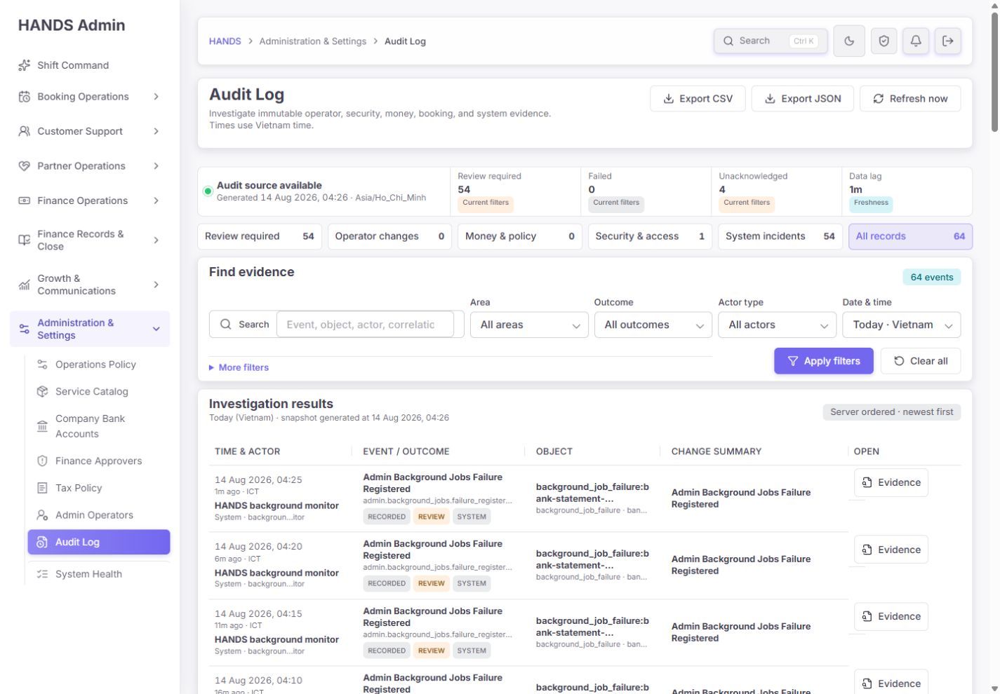

The top of the page now exposes source status, generated time, Vietnam timezone, saved views, primary filters, and the first evidence rows in one 1440px viewport. This is a major improvement over the previous oversized command-board layout. The five-column table has a workable scan order: time/actor → event/outcome → object → change summary → action.

Remaining friction:

- The search placeholder is clipped even at supported desktop widths. Use a shorter prompt such as `Event, actor, object, or ID` and move examples to help text.
- Background-job rows repeat the same label in Event and Change summary. The summary should carry operator value: queue, incident status, first/last failure time, occurrence count, and acknowledgement state.
- Object IDs are visually truncated without a row-level copy affordance.

### 2. Review required saved view — functional but operationally swamped

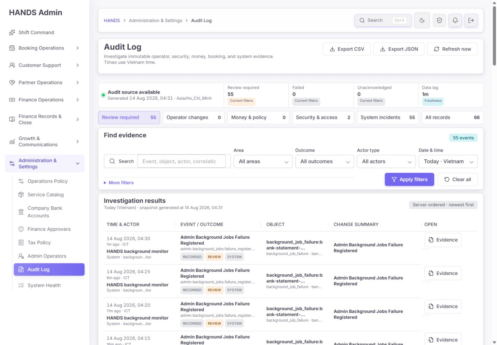

The selected state and count are clear. The underlying queue is not operationally useful yet: 56 of 67 non-page-view events observed today were `admin.background_jobs.failure_registered`. The first 50-row page is dominated by the same five-minute recurring monitor event.

Keep every immutable event in the audit store, but make the operator projection incident-based:

- One active incident row per queue/job/incident key.
- Show first seen, last seen, occurrence count, current status, owner, and acknowledgement.
- Treat `failure_registered` inside an already-open incident as INFO/telemetry, not a separate review-required item.
- Keep `recurring_incident_opened`, acknowledgement, recovery, and escalation as review-level lifecycle events.
- Link the incident row directly to System Health/background jobs.

### 3. Evidence drawer — strong remediation

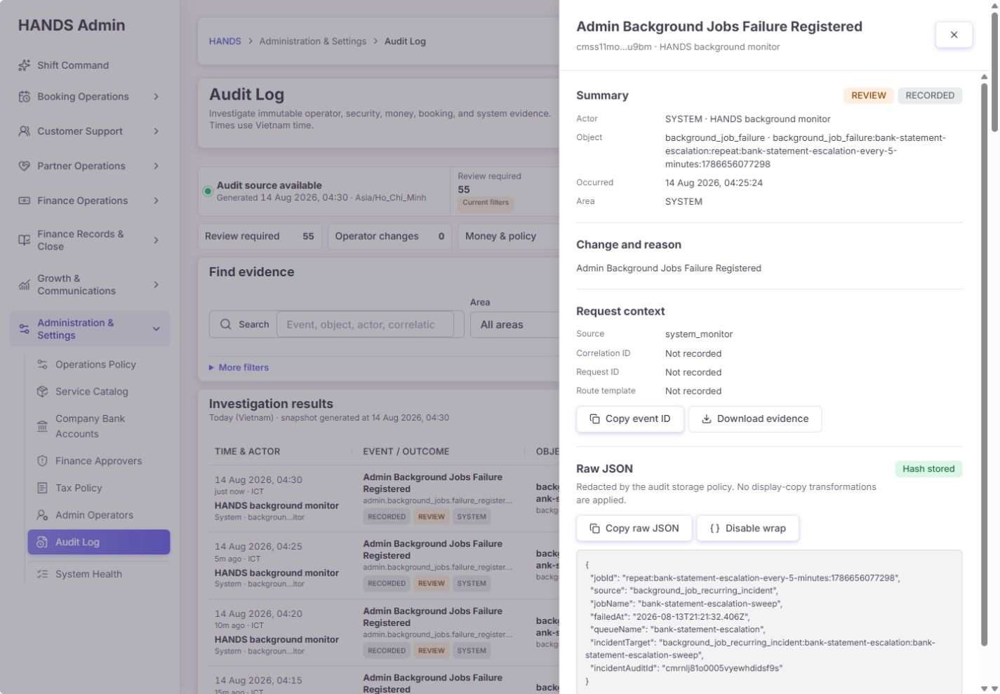

The drawer exposes actor, object, occurred time, area, source, IDs, payload, payload hash, copy actions, and per-event download. The raw JSON statement correctly distinguishes storage redaction from display transformation. Keyboard focus moved to the close control; Escape closed the drawer and returned focus to the originating Evidence link.

Further refinements:

- Add copy controls for object ID, actor key, and payload hash.
- Show both Occurred and Recorded timestamps, schema version, and an explicit integrity state.
- Change repeated `Evidence` accessible names to `Open evidence for <event label>, <time>` while keeping the visible label short.
- Lock background-page scrolling while the modal drawer is open. The inspected page retained a scrollable 5,593px document behind the drawer.

### 4. Security & access view — mostly healthy

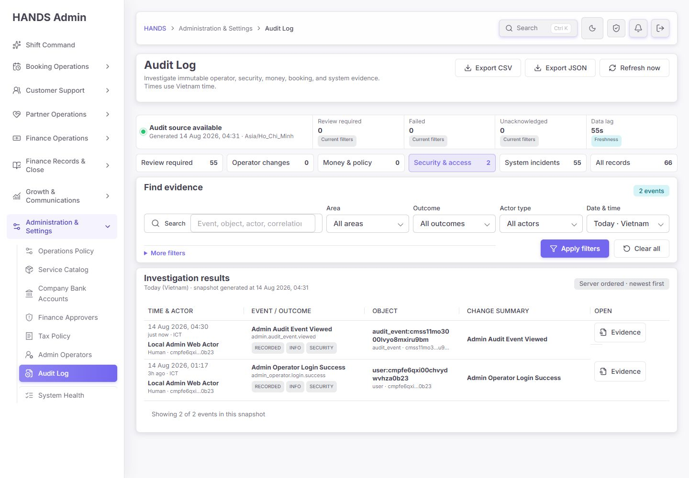

The view correctly includes login and audit-evidence access. Viewing evidence itself is recorded as `admin.audit_event.viewed`, which is appropriate for sensitive evidence access. Normal Audit Log page opens did not generate `admin_web.page_view`; the read-only database check found zero such events today.

The remaining classification gap is finance-approver governance: all 9 observed `admin_user.finance_approver.*` events display as `UNKNOWN / INFO`, so access grants and revocations are absent from Security & access and Money & policy. Classify these actions explicitly—prefer SECURITY as the primary area, with a finance/treasury tag—and assign meaningful outcomes to request, approval, grant, revoke, and blocked events.

### 5. Cross-page scoped audit entry — release blocker

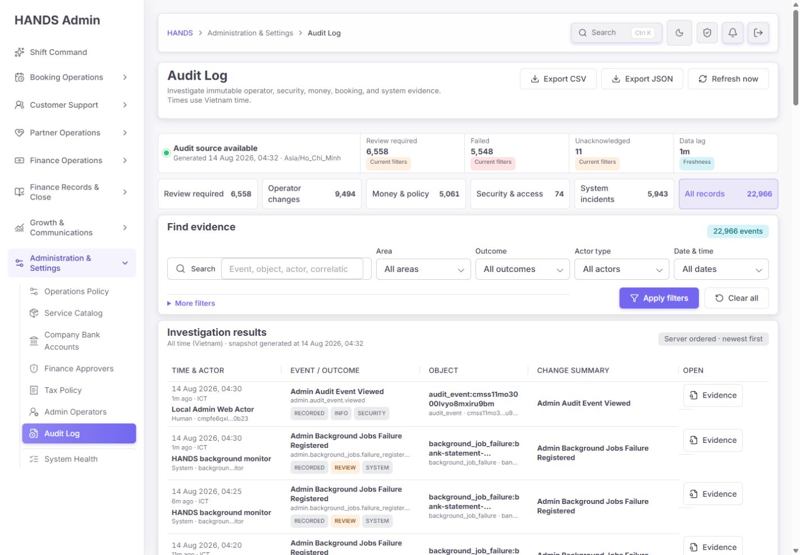

The browser URL contains `bucket=Operations%2FPolicy`, but the screen shows the unscoped 22,966-record universe. The export links also omit `bucket`. A read-only database count found 1,325 `operational_policy.*` records, so the mismatch is not an empty-data condition.

Root cause:

- `page-content.tsx` parses `bucket` and adds it to browser navigation URLs, but `auditFilterParams()` omits it; both the workspace API URL and export URL reuse that incomplete builder.
- The Next export proxy does not allowlist `bucket`.
- The Nest export route does not accept or pass `bucket`.
- Export filter evidence/hash also omits `bucket`.
- `Clear all` drops the scope.

Required correction:

1. Define one typed canonical query-key list for page navigation, workspace API, event drawer return, export proxy, API controller, and export audit evidence.
2. Include `bucket`, `priority`, `action`, and `targetPrefix` consistently where supported.
3. Preserve immutable context scope on `Clear filters`; only clear operator refinements.
4. Add a contract test for every bucket comparing list count, saved-view counts, facets, and export count/hash.
5. Give scoped pages a visible context chip/title such as `Scope: Operations Policy`; do not rely on a hidden query parameter.

Relevant source locations:

- `apps/admin_web/app/audit-log/page-content.tsx:325`
- `apps/admin_web/app/api/admin/audit-log/export/route.ts:13`
- `apps/api/src/admin/admin-governance.routes.ts:106`
- `apps/api/src/admin/admin.service.ts:34913`

### 6. Advanced filters at 1440px — visually broken

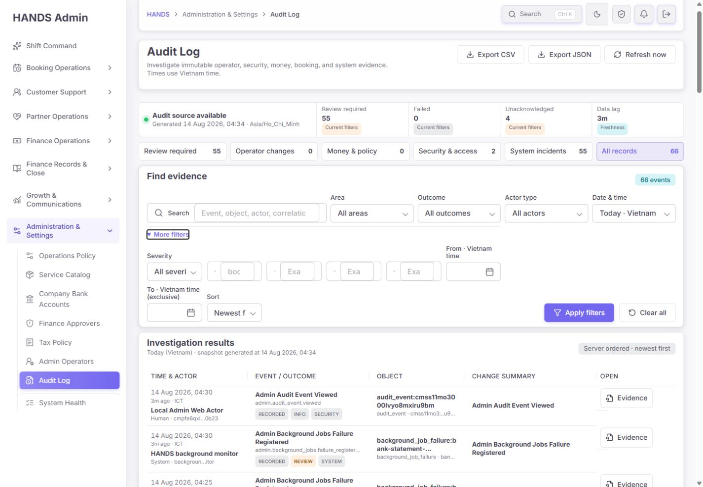

At the supported 1440px viewport, Severity/Object type/Event ID/Correlation ID/Request ID are compressed into tiny controls with clipped labels and placeholder fragments, while most of the row remains empty. The cause is structural: `.audit-more-filters` spans only columns `1 / 4`, then places six internal columns inside that restricted area.

Required layout:

- When closed, the disclosure and action row may share a line.
- When open, make the disclosure span `1 / -1`.
- Use a three- or four-column advanced grid at 1440px, with ID fields given at least 220–260px.
- Put From/To together and keep the exclusive-boundary explanation as help text, not a wrapping label.
- Keep Apply and Clear in a stable footer row.

Relevant CSS: `apps/admin_web/app/globals.css:9791-9835`.

### 7. Unknown area filter — release blocker

The unfiltered screen offered `Unknown (9)`:

Selecting it returned zero events and caused the Area select itself to fall back visually to `All areas`, while an active chip still said `Area: Unknown`:

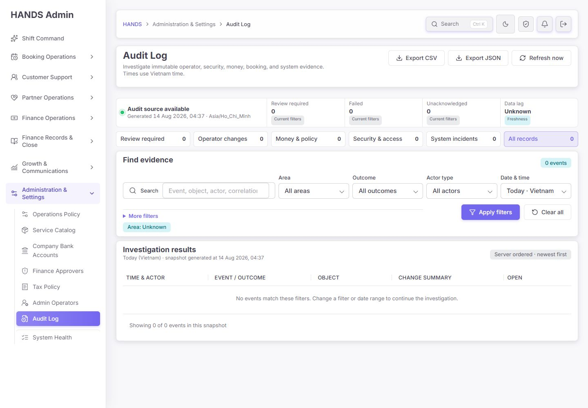

This is not only a UI bug. `adminAuditAreaWhere('UNKNOWN')` routes to `classificationWhere()`, which has no UNKNOWN rule and deliberately returns a no-match sentinel. At the same time, facets and row models can expose UNKNOWN from stored/fallback values.

### 8. Recorded outcome filter — release blocker

The unfiltered screen reported 60–61 Recorded events. Selecting Recorded returned only 5:

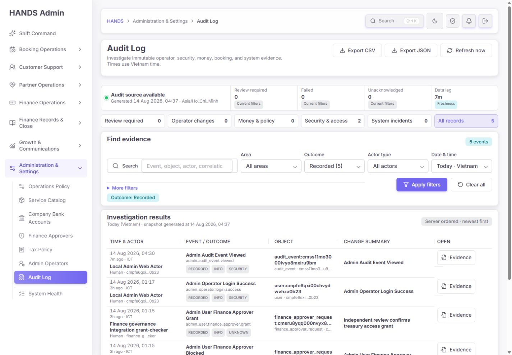

The data model has three competing truths:

- New writes store `area`, `severity`, and `outcome` columns.
- The row model generally trusts stored classification when area is not UNKNOWN.
- Facets use a hybrid of stored values and action inference.
- Filters and saved-view predicates classify from action-name rules and largely ignore stored columns.

For example, the background monitor stores `failure_registered` as `RECORDED / REVIEW / SYSTEM`, but action inference sees `failure`/`registered`. The facet counts it as RECORDED, while the Recorded filter excludes it.

Required data-contract correction:

1. For schema v2+, make stored classification columns canonical for row display, filtering, facets, saved views, summary, pagination, and export.
2. Backfill legacy rows once into explicit effective classification, or expose a database view with deterministic effective fields. Do not infer the same value differently in multiple endpoints.
3. Define explicit UNKNOWN queries (`area = 'UNKNOWN'` or the agreed legacy fallback), not a no-match sentinel.
4. Make facets either base-scope facets or self-excluding facets; never remove the currently selected value from the select options.
5. Add API contract tests asserting `facet count == filtered total == exported total` for every area/outcome/severity/actor facet and each saved view.
6. Add a registry coverage test that enumerates all emitted action constants and fails if a production action remains UNKNOWN without an explicit exemption.

Relevant source locations:

- `apps/api/src/admin/admin-audit-event-registry.ts:247-302`
- `apps/api/src/admin/admin-audit-event-registry.ts:336-352`
- `apps/api/src/admin/admin-audit-event-registry.ts:483-503`
- `apps/api/src/admin/admin.service.ts:34789-34859`
- `apps/api/src/admin/admin.service.ts:34944-34979`

### 9. Filter-dependent freshness metric — misleading

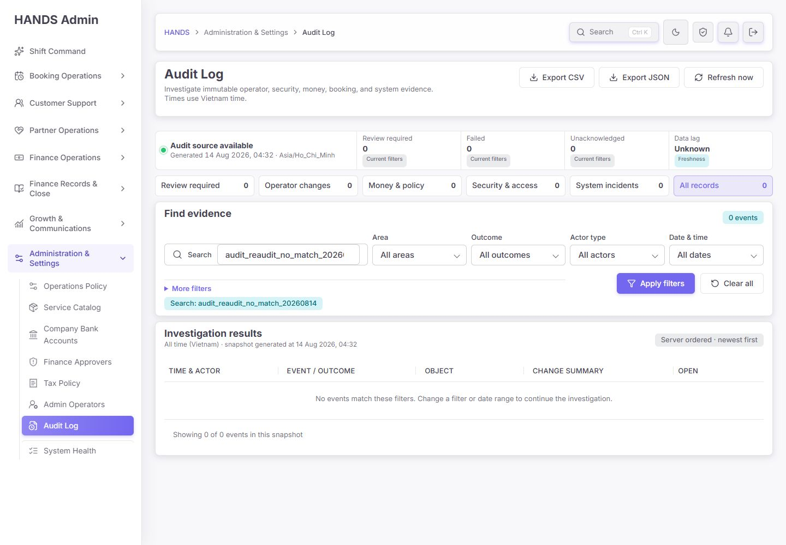

An empty search leaves the source green but changes Data lag to `Unknown`. The Recorded filter changed Data lag to `7m` even though the unfiltered source had a 1–3 minute high-water mark. The backend calculates latest recorded time using `filteredWhere`, so the card is really “age of latest matching event,” not source freshness.

Fix by computing source freshness from the unfiltered audit-source high-water mark. If useful, add a separate label `Latest matching event` within Investigation results. Never present a filtered event age as source health.

Relevant source: `apps/api/src/admin/admin.service.ts:30454-30457`.

### 10. Cursor pagination — stable snapshot, incomplete navigation

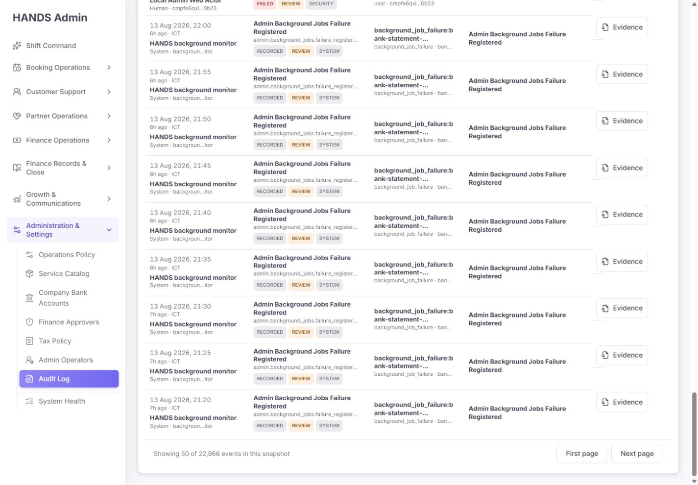

Server ordering, a snapshot timestamp, and cursor pagination are good improvements. On page two the only navigation options are First page and Next page. Operators cannot move back exactly one page except through browser history.

Add Previous page using a cursor stack in the URL/client state or an API-provided previous cursor. Preserve the original snapshot time in both directions. Consider a page-size choice of 50/100 only if query performance remains proven.

### 11. 1600px dark mode — healthy

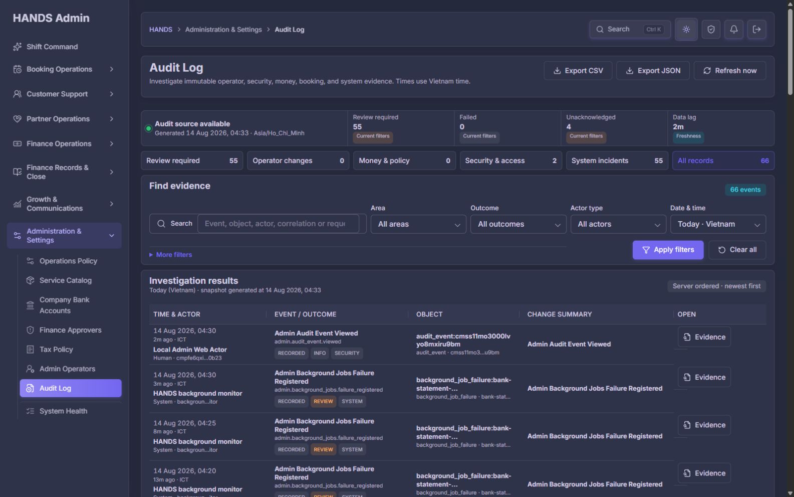

Dark mode preserves hierarchy, active states, badges, and table readability at 1600px. No horizontal document overflow was detected at 1440 or 1600. Color contrast was visually inspected but not measured with an automated contrast engine in this run.

## Previous critical findings: remediation status

| Previous finding | Current status | Evidence |
|---|---|---|
| System events attributed to a human | **Fixed for schema v2** | Today’s monitor events show SYSTEM/HANDS background monitor; DB check found zero schema-v2 system actor mismatches. Legacy rows remain inferred. |
| Normal page views pollute Audit Log | **Fixed** | Allowed access no longer writes page-view logs; database found zero `admin_web.page_view` events today. |
| Inconsistent classifications | **Partially fixed / still release-blocking** | Stored fields and registry exist, but filtering/facets/export do not share one canonical truth. |
| Separate list/summary snapshots | **Fixed** | One repeatable-read workspace transaction supplies rows, summary, facets, saved views, and cursor. |
| API failure shown as empty/clear | **Fixed in page path** | `adminGetResult` state is handled explicitly. Live degraded/permission states were not induced in the signed-in production-style session. |
| Mutable audit metadata | **Fixed at database trigger level** | Active prepare-insert and reject-mutation triggers are present. |
| Display-transformed raw JSON | **Fixed** | Drawer states storage redaction and displays untransformed stored payload. |
| Sample command board / oversized top | **Fixed** | Compact investigation workspace now exposes rows in first viewport. |
| Missing advanced filters/export/permalink/timezone | **Mostly fixed** | Controls exist, but advanced layout and scope parity are incomplete. |
| Client sorting / offset paging | **Fixed** | Server ordering and cursor snapshot are used. Previous-page navigation remains missing. |

## Integrity and data checks

Read-only database observations at audit time:

- 67 non-page-view events in the current Vietnam day.
- 56 were `admin.background_jobs.failure_registered`.
- 9 finance-approver governance events were stored as UNKNOWN classification.
- 1,325 `operational_policy.*` events existed versus 22,967 total non-page-view events.
- 0 `admin_web.page_view` events existed in the current Vietnam day.
- 0 schema-v2 rows were missing `payloadHash`.
- 0 schema-v2 `admin.background_jobs.*` rows had a non-SYSTEM actor or non-null human actor ID.
- Both `AdminAuditLog_prepare_insert` and `AdminAuditLog_reject_mutation` triggers were enabled.

The audit did not attempt an UPDATE/DELETE against production-like audit data because that would be a destructive verification. Trigger existence, migration source, and focused contract tests were used instead.

## Runtime freshness limitation

The running environment is healthy enough to inspect, but not fresh enough to certify:

- API status explicitly reported `apiBuildFreshness: stale`; `apps/api/src` was newer than `apps/api/dist/main.js`.
- The admin server is `next start` using a build created at `2026-08-13T20:35:45Z`, while `globals.css` and other admin source files are newer.

Before accepting or rejecting any final visual fix, build both applications from the exact intended commit, run migrations, restart, and repeat the 1440/1600 smoke. Add build SHA/build time to System Health and the Audit Log trust strip so operators and auditors can identify the code snapshot that produced the evidence.

## Verification performed

- Live signed-in browser flow at 1440×1000 and 1600×1000.
- Evidence drawer focus entry, Escape close, and trigger-focus restoration.
- Empty search, saved views, scoped bucket URL, Unknown area, Recorded outcome, expanded filters, cursor page two, light and dark themes.
- Browser console: 0 warnings/errors during the inspected flow.
- Admin Audit Log tests: **7 files / 27 tests passed**.
- API audit-focused tests: **4 files / 53 tests passed**.
- Admin typecheck: passed.
- API typecheck: passed.

Passing tests do not cover the observed facet/filter parity, bucket propagation, stale-build provenance, or advanced-filter desktop layout. Those contracts must be added before release.

## Prioritized implementation plan

### P0 — release blockers

1. Unify stored/effective classification across rows, filters, summaries, facets, saved views, and export; migrate/reclassify legacy rows.
2. Propagate `bucket` and other context keys through page → workspace → export → export audit evidence; preserve scope on clear/reset.
3. Rebuild/restart API and admin from one source revision, expose build provenance, and repeat this audit.

### P1 — operator efficiency

4. Replace recurring failure event spam with an incident projection for Review required while retaining raw immutable events.
5. Classify finance-approver access events explicitly and add registry-coverage enforcement.
6. Rebuild the open advanced-filter layout for 1440px+.
7. Separate global source freshness from latest matching-event age.
8. Add exact Previous page navigation with snapshot preservation.

### P2 — polish

9. Shorten the search placeholder and add help text.
10. Make Evidence accessible names unique; add copy actions for actor/object/hash.
11. Make Change summary operationally descriptive instead of repeating the event label.
12. Disable or hide export actions when the workspace source is unavailable or access is denied.

## Release acceptance criteria

Release only when all are true:

- Every visible facet value returns the same total it advertised, including UNKNOWN and RECORDED.
- Saved-view, summary, list, event download, CSV, and JSON export use the identical effective scope and classification.
- Every cross-page bucket shows a visible scope indicator and returns the expected domain-only records.
- The audit of an Operations Policy scope returns the 1,325-policy universe (or the current expected count), not all records.
- New finance-approver request/approve/grant/revoke/block events never land in UNKNOWN.
- Review required presents actionable incidents rather than one row per recurring five-minute failure.
- Open advanced filters remain legible and operable at 1440×1000 and 1600×1000.
- Source freshness is unchanged by a content filter; latest matching-event age is labeled separately.
- Page two supports Previous and preserves the original snapshot.
- Admin/API build SHA and timestamp match the audited source revision.
- Focused tests, type checks, facet/filter parity tests, bucket/export parity tests, and a clean browser-console smoke all pass.

