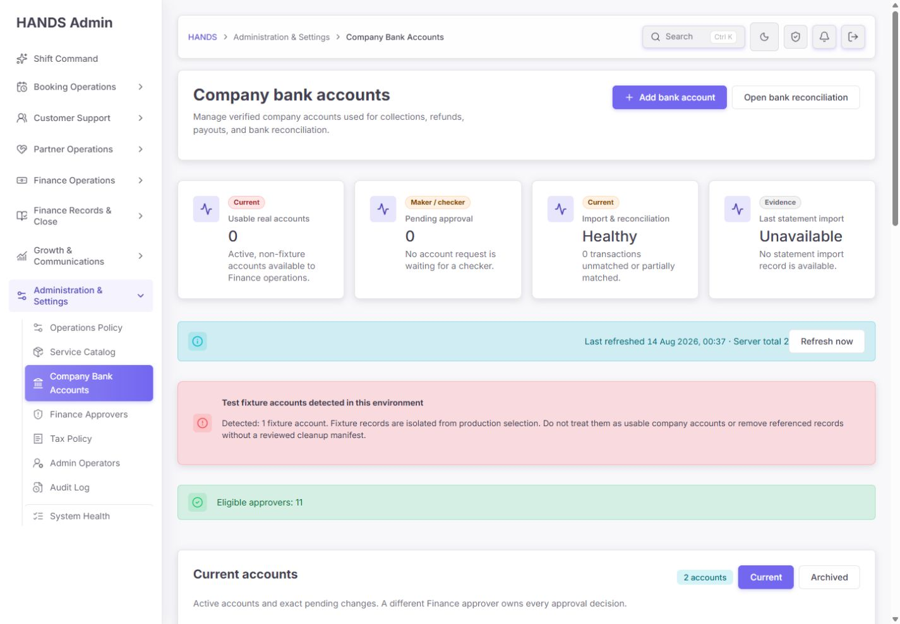
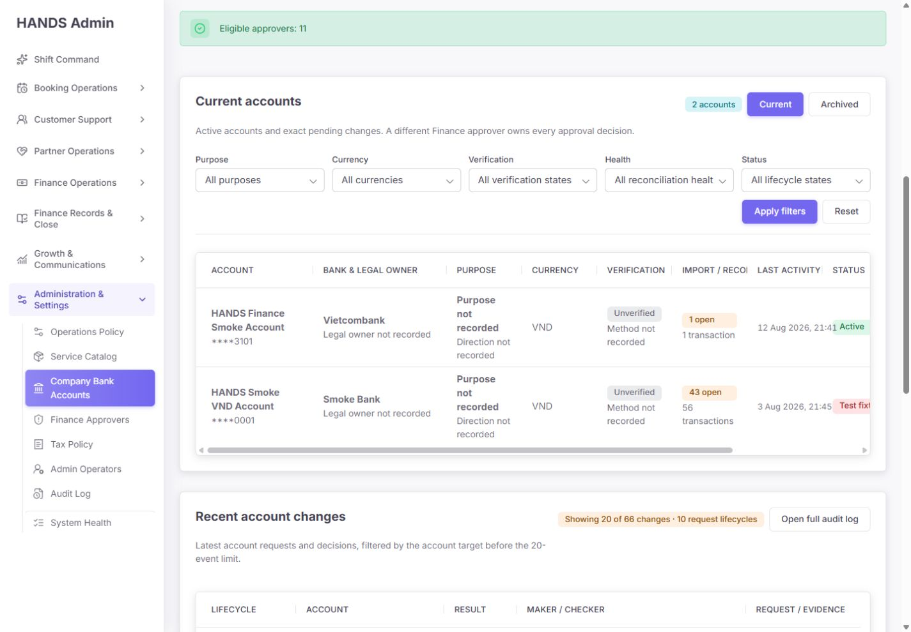
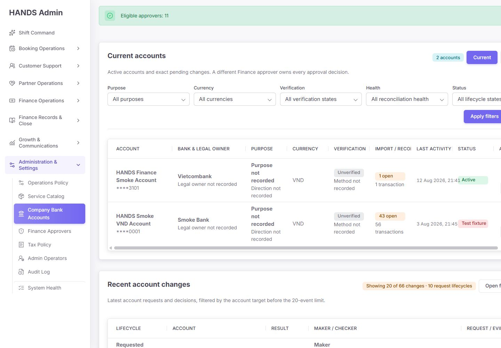
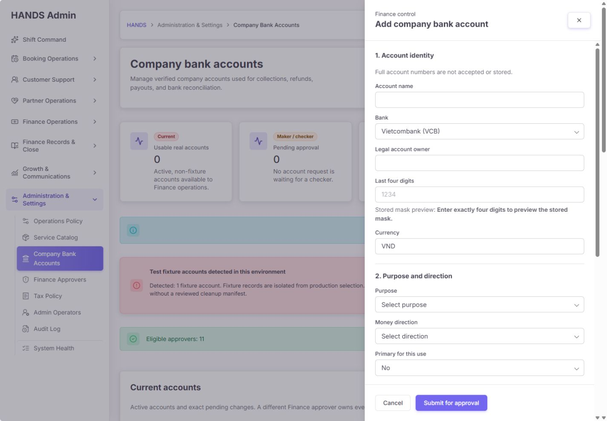
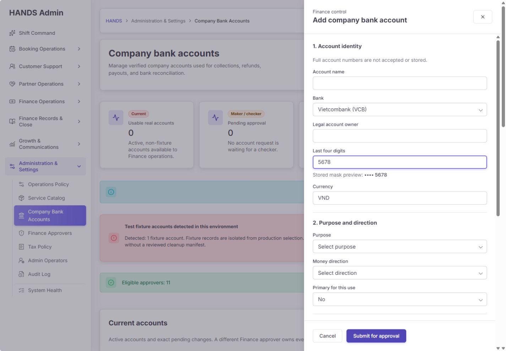
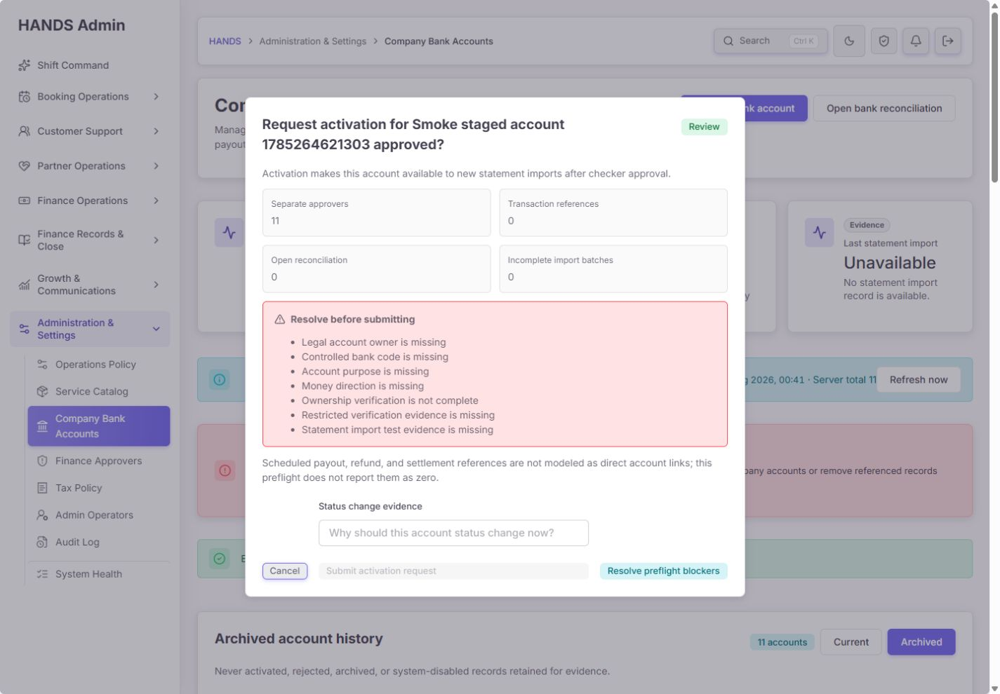
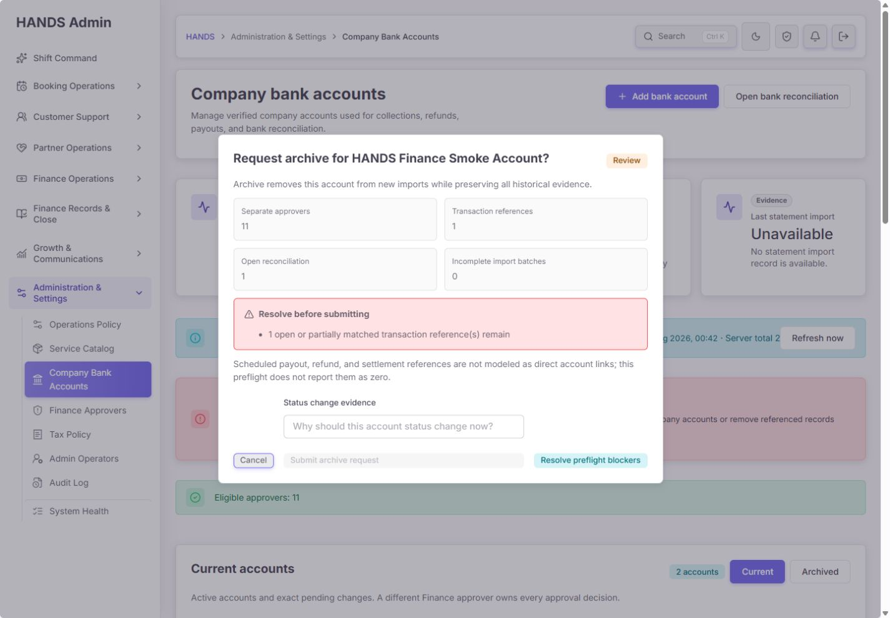
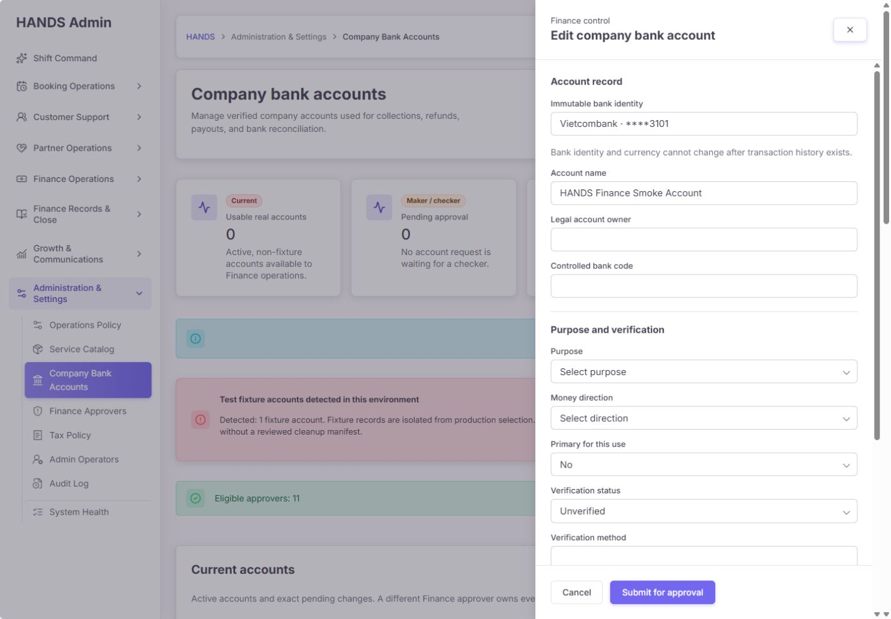
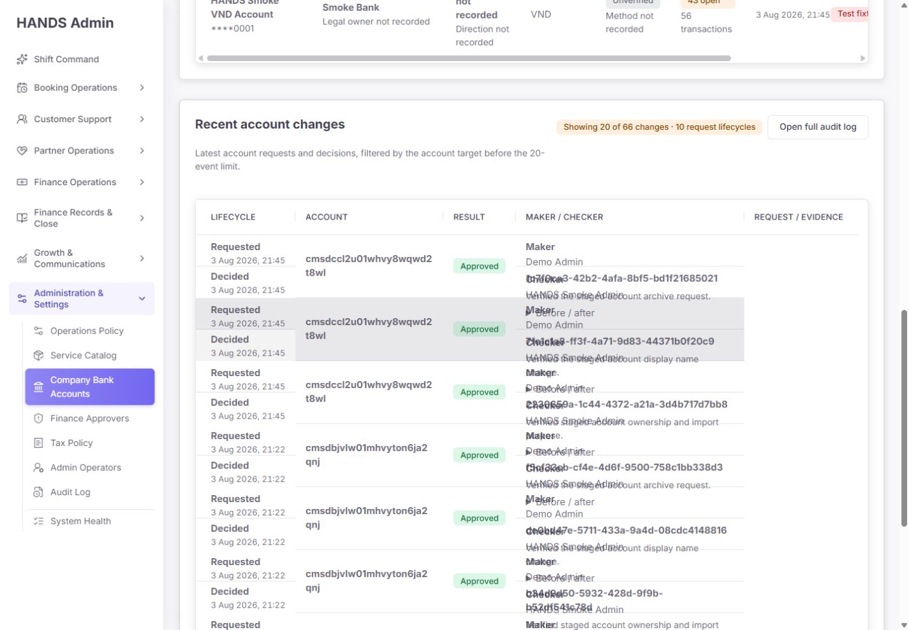
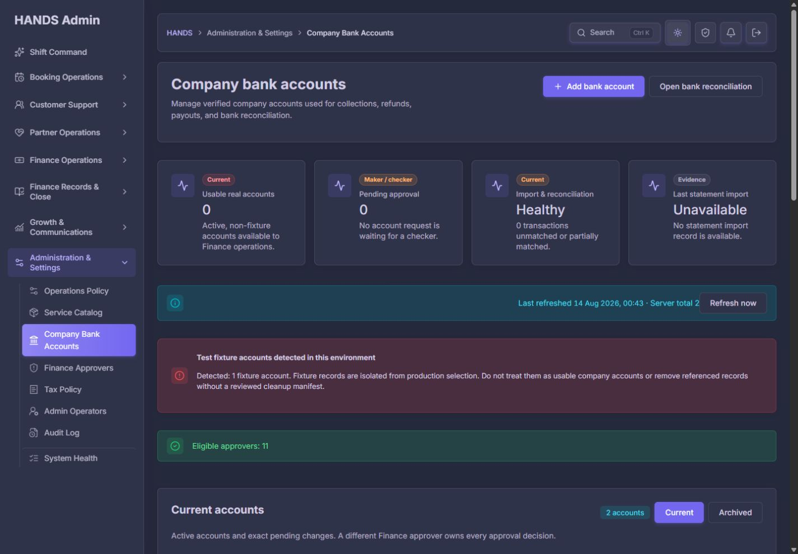

# Company Bank Accounts 개선 후 최종 재감사 보고서

- 감사일: 2026-08-14
- 대상: `http://localhost:3101/finance-tax/company-bank-accounts`
- 기준 화면: 1440 × 1000, 보조 확인 1600 × 1000
- 제외 범위: 사용자 요청에 따라 1024px 이하 반응형 UI는 검사하지 않음
- 검사 방법: 로그인된 실제 화면 조작, 현재 데이터 확인, 소스·API·DTO·Prisma·권한·테스트 검토
- 데이터 변경: 없음. 생성·수정·활성화·보관 요청을 제출하지 않음
- 이전 점수: 46/100
- 현재 점수: **67/100 (+21)**
- 출시 판정: **출시 보류(Release hold)**

## 1. 최종 결론

이전 보고서의 핵심 방향은 상당 부분 제대로 구현됐다. 특히 끝 네 자리만 입력받는 계좌번호 계약, 서버 마스크 생성, 생성 시 기본 `INACTIVE`, maker-checker 분리, 승인 가능 운영자 사전 확인, 정확한 감사 대상 필터, 실패와 빈 목록의 구분, 드로어 기반 입력, 활성화·보관 preflight는 실제 코드와 화면에서 확인됐다.

그러나 이 페이지를 실제 회사 자금 흐름에 연결하기에는 아직 두 가지 P0가 남아 있다.

1. **운영 계좌와 fixture를 구분하는 단일한 권위 데이터가 없다.** 현재 화면은 `Usable real accounts 0`이라고 하면서 동시에 fixture로 표시되지 않은 `Active` smoke 계좌를 보여준다. 명시적으로 인식되는 fixture는 1건뿐인데, 보관 목록 11건은 모두 이름상 smoke 기록이며 운영 후보처럼 취급된다. API의 JSON 필터와 UI의 런타임 판정도 서로 다른 결과를 낸다.
2. **보관 preflight가 확인하지 못한 지급·환불·정산 참조를 알면서도 통과할 수 있다.** API는 `scheduledReferenceCount: null`을 반환하지만 `ready` 계산에는 이 미확인 상태를 blocker로 넣지 않는다. 문구로 경고하는 것만으로는 실제 계좌 보관을 안전하게 막지 못한다.

따라서 현재 상태는 “UI와 기본 통제는 좋아졌지만 운영 데이터의 진실성과 보관 영향 범위가 아직 fail-closed가 아닌 상태”다. 이 두 P0를 해결하고 production-like 데이터로 회귀 검증하기 전에는 출시하지 않는 것이 맞다.

## 2. 점수표

| 평가 영역 | 배점 | 점수 | 판단 |
|---|---:|---:|---|
| 계좌번호·민감정보 보호 | 15 | 13 | last4-only는 좋음. 증거 참조는 아직 문자열 계약에 머묾 |
| 승인·상태 변경 통제 | 20 | 14 | maker-checker와 preflight는 좋지만 archive 영향 확인이 불완전 |
| 운영 데이터 신뢰성 | 20 | 7 | fixture/production 분류와 요약·행 상태가 서로 모순 |
| 운영자 workflow | 15 | 11 | 드로어·receipt·필터 개선. 취소 guard와 해결 동선 미완성 |
| 정보 구조·시각 품질 | 15 | 8 | 상단 구조는 명확. 핵심 표와 audit timeline은 읽기 어려움 |
| 접근성·오류 상태 | 10 | 9 | dialog/focus/error summary가 좋음. 일부 오류 연결과 Cancel 동작 보완 필요 |
| 테스트·변경 안전성 | 5 | 5 | 집중 테스트, DTO, typecheck, copy guard 모두 통과 |
| **합계** | **100** | **67** | **출시 보류** |

## 3. 이전 핵심 지적 반영 여부

| 이전 지적 | 현재 판정 | 근거 |
|---|---|---|
| 원문과 유사한 계좌번호 저장 가능 | **해결** | UI는 last4만 받고 API는 `accountNumberMasked` 입력을 거부하며 서버가 `•••• 1234` 생성 |
| 테스트 계좌가 운영 계좌와 혼재 | **부분 해결 / P0 잔존** | 명시 fixture 차단과 cleanup dry-run은 추가됐지만 legacy smoke 12건이 정확히 분류되지 않음 |
| 최근 변경 20건이 페이지 조회 로그에 오염 | **해결** | `/recent-changes`가 `targetPrefix=company_bank_account:`를 서버에 전달 |
| 권한/API 실패가 0건으로 표시 | **대부분 해결** | result-aware 상태와 access denied/temporary failure copy 및 테스트 확인 |
| DB 기본 ACTIVE, 멱등·경쟁 조건 부족 | **부분 해결** | DB 기본은 INACTIVE, request idempotency 추가. 다만 중복 계좌 경쟁은 계좌 identity 단위로 직렬화되지 않음 |
| inline disclosure 폼 | **해결** | 560px 드로어와 sticky action footer로 변경 |
| 활성화·보관 영향 사전 확인 없음 | **부분 해결** | preflight UI는 생겼지만 확인 불가능한 참조가 fail-open |
| 별도 승인자 유무를 제출 전에 모름 | **해결** | 현재 별도 approver 11명 표시, 0명이면 요청 진입 차단 |

## 4. 현재 실제 데이터와 운영 해석

| 항목 | 화면 확인값 | 운영 해석 |
|---|---:|---|
| Current 목록 | 2건 | 두 건 모두 이름상 smoke 계좌 |
| Archived 목록 | 11건 | 모두 반복 smoke lifecycle 명명 패턴 |
| 명시 fixture 경고 | 1건 | 실제 smoke 성격 레코드 수와 불일치 |
| Usable real accounts | 0건 | 실제 운영 가능한 회사 계좌 없음 |
| Pending approval | 0건 | 현재 승인 대기 없음 |
| Eligible approvers | 11명 | maker-checker 운영 가능 |
| Last statement import | Unavailable | 성공 import 증거 없음 |
| Reconciliation summary | Healthy, 0 unmatched | “운영 준비 완료”가 아니라 “현재 집계 대상 unmatched가 0”일 뿐 |
| Recent audit | 20/66 events, 10 lifecycles | 정확한 target filter는 적용됐으나 화면 렌더링이 깨짐 |

기존 cleanup dry-run manifest도 13건 모두를 `manual-review`로 분류했다. 현재 화면의 2 current + 11 archived와 수량이 일치하므로, 정리·provenance backfill이 아직 완료되지 않은 상태로 판단한다.

## 5. 화면 흐름별 재감사

### 5.1 1단계 — 첫 화면과 운영 요약



**건강도: 개선 필요**

잘된 점:

- 페이지 목적과 주요 행동인 `Add bank account`, `Open bank reconciliation`이 상단에 있다.
- usable, pending approval, reconciliation, last import를 별도 카드로 분리했다.
- 마지막 조회 시각, server total, 즉시 새로고침을 제공한다.
- fixture 경고와 approver readiness가 데이터 목록보다 먼저 드러난다.

문제:

- `Usable real accounts 0`, `Import & reconciliation Healthy`, `Last statement import Unavailable`가 동시에 표시된다. 운영자에게 “문제 없음”과 “운영 불가”를 동시에 전달한다.
- 현재 `Healthy`는 실제 readiness가 아니라 open unmatched count가 0이라는 뜻이다. 활성 운영 계좌가 없으면 `Not ready` 또는 `No production account`가 맞다.
- fixture 경고 1건은 화면에 보이는 13개의 smoke 성격 레코드를 설명하지 못한다.
- `Eligible approvers: 11` 전체 폭 성공 배너는 안정 상태인데도 위험 경고와 같은 시각적 무게를 차지한다. 작은 보조 상태나 제출 시점 정보로 낮추는 편이 낫다.
- 상단 카드·조회 배너·fixture 경고·approver 배너가 첫 화면을 거의 모두 차지해 실제 계좌 행은 아래로 밀린다.

권장 수정:

1. 상단 상태를 하나의 `Operational readiness`로 계산한다.
2. `usableRealAccountCount === 0`이면 최상위 상태를 `Not ready`로 고정하고, reconciliation은 하위 근거로만 표시한다.
3. `lastRecordedStatementImport === null`이면 `Import not proven`을 별도 blocker로 표시한다.
4. approver 수는 `Pending approval` 카드 helper 또는 Add drawer preflight로 이동한다.
5. `Server total`은 현재 탭의 결과라는 뜻으로 `Current results 2` 또는 `Archived results 11`로 바꾼다.

접근성:

- 카드와 상태 텍스트는 아이콘에만 의존하지 않아 좋다.
- 다만 `Healthy`의 의미가 실제 운영 준비 상태와 달라 인지 접근성 측면에서 위험하다. 색보다 문구의 의미를 먼저 고쳐야 한다.

### 5.2 2단계 — Current/Archived 목록과 필터





**건강도: 위험**

잘된 점:

- Current와 Archived를 분리해 현재 운영 후보와 보존 이력을 구분했다.
- purpose, currency, verification, reconciliation health, status 필터가 한 구역에 모여 있다.
- account, legal owner, purpose, verification, reconciliation, activity를 한 행에서 비교할 수 있다.
- fixture는 빨간 status badge로 표시하려는 모델이 있다.

문제:

- `HANDS Finance Smoke Account`는 이름상 smoke이며 `Active`로 표시되지만 `Test fixture` 표시가 없다.
- 반면 상단 `Usable real accounts`는 0이다. 같은 데이터가 요약 집계와 행 lifecycle에서 서로 다르게 분류된다.
- 1440px에서 Action 열은 완전히 보이지 않고, 1600px에서도 일부가 잘린다. 운영자가 가장 자주 누르는 `Edit`, `Review archive/activation`이 가로 스크롤 끝에 있다.
- `IMPORT / RECO...` 등 헤더와 badge가 잘리고, account/purpose 셀은 과도하게 줄바꿈된다.
- `All lifecycle states` 필터는 실제로 `PENDING`, `ACTIVE`, `INACTIVE`, `DISABLED` DB 상태만 필터링한다. 행에 표시되는 `Never activated`, `Rejected`, `Archived with history`, `Test fixture`를 직접 선택할 수 없다.
- Current 탭에 explicit fixture가 함께 표시돼 경고는 되지만, 기본 운영 목록의 판단 밀도를 떨어뜨린다.

권장 수정:

1. 기본 표를 6개 핵심 열로 줄인다: `Account`, `Use`, `Readiness`, `Reconciliation`, `Last activity`, `Actions`.
2. bank/legal owner/verification 세부는 account 이름 아래 2줄 또는 row drawer에 넣는다.
3. Actions 열을 오른쪽 sticky column으로 만든다. 1440px에서 가로 스크롤 없이 Edit와 주요 상태 행동이 보여야 한다.
4. Current 기본값은 `production/unknown only`가 아니라 **확인된 production만** 보여주고, fixture는 별도 `Test data` 탭 또는 환경 전용 view로 이동한다.
5. `Status` 필터는 API lifecycle 값을 직접 지원하도록 바꾼다: `ACTIVE`, `PENDING_ACTIVATION`, `PENDING_CHANGE`, `NEVER_ACTIVATED`, `REJECTED`, `ARCHIVED_WITH_HISTORY`, `DISABLED_BY_SYSTEM`, `TEST_FIXTURE`.
6. 필터 적용 후 결과 수와 활성 filter chip을 보여주고, 각 select 변경 시 자동 적용하거나 Apply 버튼을 유지할 경우 변경된 필터 상태를 표시한다.

접근성:

- table semantics와 visible labels는 존재한다.
- 그러나 핵심 행동이 viewport 밖에 있어 키보드와 저시력 확대 사용자의 작업 탐색 비용이 크다. horizontal overflow 자체보다 핵심 액션이 숨는 것이 문제다.

### 5.3 3단계 — Add account 드로어





**건강도: 양호, 보완 필요**

잘된 점:

- 계좌 원문 대신 정확히 네 자리만 받는다.
- 입력 즉시 `•••• 5678`로 저장 형태를 보여준다.
- Identity → purpose/direction → verification evidence → review 순서가 자연스럽다.
- sticky footer로 Cancel과 Submit이 항상 보인다.
- 생성 요청이 inactive record를 만들고 activation은 별도 승인이라는 점을 명확히 안내한다.
- bank는 통제된 선택 목록으로 제한한다.

문제:

- `Verification status`가 기본 `Unverified`인데 verification method, evidence object ID, statement import tested at은 모두 required다. “아직 미검증 상태로 안전하게 초안을 생성”하는 경우와 “검증 증거까지 준비된 계좌를 등록”하는 경우가 섞여 있다.
- evidence object ID는 자유 텍스트 문자열이다. 실제 제한 저장소 객체 존재·권한·보존 여부를 UI에서 검증하지 않는다.
- statement import tested at은 임의 datetime 입력이다. 실제 성공한 import batch를 선택하는 것이 아니며 미래 시각 여부도 DTO에서 막지 않는다.
- HTML 기본 validation은 첫 필드로 초점을 이동하지만, 서버 필드 오류는 summary 링크와 `aria-invalid`만 제공하고 입력 바로 옆 메시지/`aria-describedby` 연결이 없다.
- Last4를 입력한 뒤 footer Cancel을 누르면 미저장 확인 없이 즉시 닫힌다. X/backdrop/Escape만 dirty guard를 사용하고 Cancel은 직접 링크다.

권장 수정:

1. 생성 정책을 하나로 결정한다.
   - 권장: create는 `UNVERIFIED` inactive shell만 만들고, 증거 등록은 별도 `Verify account` 단계로 분리한다.
   - 또는 verified-ready 생성만 허용한다면 verification status를 운영자가 직접 고르지 말고 증거 검증 결과로 서버가 결정한다.
2. evidence object ID 직접 입력을 제거하고 제한 저장소 파일 선택/업로드 결과를 서버가 연결한다.
3. statement 테스트는 성공한 import batch ID를 선택하게 하고 서버에서 계좌·통화·성공 상태·완료 시각을 검증한다.
4. 미래 datetime 및 현재 계좌 생성 이전의 비정상 datetime을 거부한다.
5. footer Cancel도 drawer `onClose`를 호출하도록 바꾸고 X/backdrop/Escape/Cancel 모두 같은 discard confirmation 회귀 테스트를 둔다.
6. 서버 필드 오류를 해당 input 아래 렌더링하고 `aria-describedby`로 연결한다. 수정 후 기존 `aria-invalid`도 제거한다.

### 5.4 4단계 — Activation preflight



**건강도: 개선됨, 보완 필요**

잘된 점:

- 소유자, bank code, purpose, direction, verification, evidence, statement test가 없으면 활성화 요청 버튼을 비활성화한다.
- 별도 승인자 수와 blocker 목록을 한 dialog에서 보여준다.
- status 변경 사유와 account ID 확인을 서버 action에 전달한다.
- checker 승인 전에는 실제 status를 바꾸지 않는다.

문제:

- 모든 blocker의 해결 링크가 bank reconciliation unmatched 화면으로 간다. legal owner, bank code, purpose, verification evidence는 그 화면에서 해결할 수 없다.
- `VERIFIED`, evidence ID, method, statement tested date가 모두 maker가 입력한 metadata다. checker의 수동 주의력 외에 실제 증거 객체와 import 성공을 검증하는 서버 관계가 없다.
- fixture 분류가 누락된 legacy smoke 계좌는 필수 필드를 채우면 activation 후보가 될 수 있다.
- 동일 bank/currency/last4 duplicate는 “review 필요”라고 하지만 create 단계에서는 409로 끝나며 실제 review/override workflow가 없다.

권장 수정:

1. blocker code별 해결 동선을 매핑한다.
   - identity/profile blocker → 해당 계좌 Edit drawer
   - evidence blocker → restricted evidence manager
   - statement blocker → exact import test workflow
   - duplicate blocker → duplicate comparison/review dialog
   - approver blocker → Finance Approvers
2. activation service가 실제 evidence object와 성공 import batch를 조회해 확인한 경우에만 ready=true를 반환한다.
3. `dataScope !== PRODUCTION` 또는 provenance 미확정이면 activation을 fail-closed한다.
4. duplicate review를 checker가 account pair를 비교해 한 건을 reject/disable하거나 예외 승인할 수 있게 한다.

### 5.5 5단계 — Archive preflight



**건강도: P0 위험**

잘된 점:

- open/partial reconciliation transaction이 있으면 보관 요청을 막는다.
- total transaction, open reconciliation, incomplete import batch, approver 수를 보여준다.
- 기본 계좌라면 replacement account를 요구하도록 설계했다.
- history를 보존하고 new import에서 제외한다는 효과를 설명한다.

문제:

- API는 scheduled payout/refund/settlement 참조를 조회하지 못해 `scheduledReferenceCount: null`로 반환한다.
- 그러나 `ready`는 오직 현재 `blockers.length === 0`으로 계산한다. 따라서 open transaction이 없는 계좌는 지급·환불·정산 참조가 **확인 불가인데도** preflight passed가 될 수 있다.
- 화면 문구 “not modeled… does not report them as zero”는 정확하지만 안전 통제가 아니다.
- incomplete import batch count도 실제 import batch relation이 아니라 open transaction metadata의 distinct batch ID 수다. 이름이 실제 권위 relation count처럼 보인다.

필수 수정:

1. payout/refund/settlement/import batch가 company bank account를 직접 참조하는 권위 relation을 만든다.
2. relation을 만들기 전까지 archive preflight는 `REFERENCE_COVERAGE_INCOMPLETE` blocker를 반환하고 ready=false로 둔다.
3. 최소한 “아직 모델링되지 않은 참조”를 0이 아닌 `Unknown`으로 UI 카드에 표시한다.
4. 보관 승인 시 preflight version 또는 source updated-at을 같이 제출하고 checker 결정 직전에 다시 계산한다.
5. replacement account는 같은 currency, compatible purpose/direction, verified production status를 서버에서 검증한다. 현재는 다른 active account이면 후보가 될 수 있다.

### 5.6 6단계 — Edit account 드로어



**건강도: 보통**

잘된 점:

- transaction history가 있는 bank identity와 currency를 바꿀 수 없다고 안내한다.
- name, legal owner, purpose, direction, primary, verification evidence 변경도 approval request로 보낸다.
- 현재 값을 채워서 운영자가 맥락을 잃지 않는다.

문제:

- 상단은 `Immutable bank identity: Vietcombank ****3101`이라고 하지만 바로 아래 `Controlled bank code`는 자유 텍스트로 편집 가능하다. bank name과 bank code가 불일치할 수 있다.
- create는 5개 은행 select를 사용하지만 edit는 임의 code 입력을 허용해 같은 필드의 통제 수준이 다르다.
- verification status를 `Verified`로 직접 선택할 수 있다. 승인자는 검토해야 하지만 status는 증거 검증 결과로 파생되는 편이 안전하다.
- 기존 값이 없는 legacy 계좌는 모든 필드를 한 번에 수작업으로 복원해야 한다. migration/backfill queue가 없다.

권장 수정:

1. bank code를 identity에 포함해 immutable로 만들거나, transaction 0건일 때만 create와 같은 controlled select로 변경한다.
2. bank name과 code를 하나의 bank registry record에서 파생한다.
3. verification status는 editable select가 아니라 verification workflow의 result로 표시한다.
4. legacy 계좌에는 `Data remediation` queue를 제공해 일반 운영 계좌와 분리한다.

### 5.7 7단계 — Recent account changes



**건강도: 위험**

잘된 점:

- broad search가 아니라 정확한 account target prefix로 limit 전에 필터링한다.
- maker와 checker event를 request lifecycle로 묶는다.
- 표시 event 수, 전체 event 수, lifecycle 수를 구분한다.
- SYSTEM_AUDIT 권한이 있을 때 exact full audit link를 제공한다.

문제:

- 현재 표는 maker/checker, request ID, 사유, before/after 내용이 서로 겹쳐 사실상 읽을 수 없다.
- Current 탭의 2개 account만 `accountById`에 있어 archived account audit은 이름 대신 raw CUID로 표시된다.
- before/after는 raw JSON `<pre>`다. 운영자가 변경된 핵심 필드를 찾기 어렵고 내부 admin/evidence ID가 과도하게 노출될 수 있다.
- 20 events를 10 lifecycle로 묶었는데 `Showing 20...`만 먼저 보여 row 수가 10이라는 점을 즉시 이해하기 어렵다.

권장 수정:

1. timeline을 table 대신 vertical activity list로 바꾼다.
2. 한 항목의 1행 요약은 `Account · Requested by · Approved/Rejected by · time · result`로 제한한다.
3. 펼쳤을 때만 structured field diff를 보여준다. raw JSON은 full audit page의 privileged technical view로 이동한다.
4. recent-changes API가 account `{id,name,bankName,mask}` snapshot을 함께 반환해 current pagination과 무관하게 이름을 표시한다.
5. 결과 문구를 `10 request lifecycles from the latest 20 of 66 audit events`처럼 바꾼다.

### 5.8 8단계 — Dark mode



**건강도: 양호**

잘된 점:

- 배경, 카드, border, status soft color가 일관되게 전환된다.
- 주요 제목과 버튼 대비는 육안상 충분하고, 정보 구조가 light mode와 동일하다.

보완:

- muted copy, warning helper, disabled control은 실제 contrast 측정을 자동화 테스트로 추가해야 한다.
- 이번 감사에서는 픽셀 대비값을 측정하지 않았으므로 WCAG AA 통과라고 단정하지 않는다.

## 6. P0 — 출시 전 반드시 해결

### P0-1. fixture/production provenance와 집계 판정의 단일 진실 부재

근거:

- 화면: `Usable real accounts 0`
- 화면: `HANDS Finance Smoke Account`는 `Active`, fixture badge 없음
- 화면: explicit fixture 경고는 1건
- 화면: Archived 11건은 모두 smoke lifecycle 이름이지만 `Never activated`로 표시
- 기존 dry-run: 13건 모두 manual review
- 코드: DB query predicate `companyBankAccountFixtureWhere()`와 JS predicate `companyBankAccountIsFixture()`를 별도로 유지
- 코드: production exclusion이 nullable JSON path의 `NOT` 조합에 의존

운영 위험:

- 실제 production 계좌가 목록/집계에서 누락될 수 있다.
- 반대로 legacy smoke가 production candidate, duplicate target, replacement target이 될 수 있다.
- 요약 카드와 행 status가 다르면 운영자는 어느 값을 믿어야 하는지 알 수 없다.

필수 설계:

1. JSON 추론 대신 schema-level `dataScope` enum(`PRODUCTION`, `SYNTHETIC`, `UNKNOWN`)과 provenance 필드를 둔다.
2. 기존 13건을 manual review 후 모두 backfill한다. 이름만으로 자동 production/synthetic 결정을 하지 않는다.
3. `UNKNOWN`은 production에서 조회·활성화·import·replacement에 모두 fail-closed한다.
4. summary, row lifecycle, list filter, import selection, transaction creation이 같은 predicate/helper를 사용한다.
5. production-like PostgreSQL 통합 테스트에서 `metadata=null`, key missing, legacy `smokeFixture`, `smoke`, explicit fixture, explicit production을 모두 검증한다.

완료 기준:

- `usableRealAccountCount`와 row lifecycle의 production/fixture 합계가 항상 일치한다.
- 현재 13건 각각에 승인된 provenance 결정이 존재한다.
- production 목록과 후보 API에 synthetic/unknown이 0건이다.

### P0-2. Archive preflight의 미확인 참조 fail-open

근거:

- API: `scheduledReferenceCount: null`
- API: `ready: blockers.length === 0`
- UI: 미모델링 안내는 하지만 blocker로 처리하지 않음
- 테스트 fixture도 `scheduledReferenceCount: null`과 `ready: true` 조합을 정상 사례로 사용

운영 위험:

- 예정 지급·환불·정산이 참조하는 계좌를 보관할 수 있다.
- 다음 배치가 실패하거나 다른 계좌로 잘못 전환될 수 있다.
- checker는 영향 범위가 완전하다고 오인할 수 있다.

완료 기준:

- 모든 자금 이동 도메인이 account ID를 직접 참조하고 preflight가 각 source count를 반환한다.
- source 하나라도 조회 실패/미지원/timeout이면 ready=false다.
- checker 승인 직전에 같은 preflight를 재실행하고 결과가 바뀌면 승인하지 않는다.
- `null/unknown` preflight가 archive 가능하다고 기대하는 테스트가 없어야 한다.

## 7. P1 — 다음 우선순위

| ID | 문제 | 수정 방향 |
|---|---|---|
| P1-1 | `Healthy`가 readiness로 오해됨 | 0 usable 또는 import 없음이면 `Not ready`; reconciliation health는 하위 상태 |
| P1-2 | 증거·statement test가 자유 텍스트/임의 날짜 | 실제 restricted object와 successful import batch relation 검증 |
| P1-3 | 중복 생성 lock이 actor+idempotency 단위 | bank registry + currency + last4 duplicate key 단위 advisory lock 또는 별도 fingerprint; review path 제공 |
| P1-4 | 1440/1600에서 Actions가 숨음 | 6열로 축소하고 right sticky Actions 적용 |
| P1-5 | Recent changes가 겹쳐 읽을 수 없음 | vertical lifecycle list + structured diff + account snapshot API |
| P1-6 | footer Cancel이 dirty guard 우회 | 모든 close trigger를 동일 handler로 통합 |
| P1-7 | blocker 해결 링크가 항상 reconciliation | blocker code별 정확한 목적지 매핑 |
| P1-8 | edit bank code가 자유 입력 | controlled bank registry 또는 immutable identity |
| P1-9 | lifecycle filter와 표시 badge 불일치 | API lifecycleStatus를 실제 filter contract로 승격 |
| P1-10 | legacy 계좌 수동 복구가 일반 workflow에 섞임 | provenance/profile remediation queue 분리 |

## 8. P2 — 품질 다듬기

- fixture 경고에 `Open cleanup manifest`와 `Open remediation queue`를 제공한다.
- 성공 상태 approver 배너는 상단 공간을 덜 쓰는 inline status로 축소한다.
- account name과 bank label 줄바꿈 규칙을 조정한다.
- audit ID는 전체 문자열 대신 앞/뒤 일부와 copy 버튼을 제공한다.
- exact approval request receipt에 checker SLA/owner를 추가한다.
- `Refresh now` 후 업데이트된 영역을 `aria-live=polite`로 알린다.
- 현재 필터 query를 `Reset`이 실제로 제거하는지 E2E로 검증한다.
- production에서는 `Test data` 탭 자체를 숨기거나 별도 권한으로 제한한다.

## 9. 권장 최종 화면 구조

```text
Company bank accounts                         [Add account] [Reconciliation]

Operational readiness: NOT READY
0 verified production accounts · No successful import · 0 pending approvals
[Resolve account setup]

[Current 0] [Pending 0] [Archived 0] [Data remediation 13]

Filters: Purpose | Verification | Readiness | Lifecycle       [Reset]

Account                  Use       Readiness      Reconciliation    Last activity    Actions
Collections VND ••••1234 Inbound   Ready          0 open            14 Aug 00:40     [View] [•••]

Recent controlled changes
• Collections VND — activation approved — Maker A / Checker B — 14 Aug 00:35 [Details]
```

핵심은 fixture 경고를 계속 크게 보여주는 것이 아니라, 데이터를 운영 후보에서 완전히 분리하고 `Data remediation`이라는 해결 가능한 작업 queue로 전환하는 것이다.

## 10. 코드 근거

주요 확인 위치:

- `apps/admin_web/app/finance-tax/company-bank-accounts/page.tsx:155-171` 병렬 API 조회
- `apps/admin_web/app/finance-tax/company-bank-accounts/page.tsx:220-273` 운영 요약과 fixture 경고
- `apps/admin_web/app/finance-tax/company-bank-accounts/page.tsx:331-355` status dialog와 단일 해결 링크
- `apps/admin_web/app/finance-tax/company-bank-accounts/page.tsx:375-531` account 표와 filter
- `apps/admin_web/app/finance-tax/company-bank-accounts/page.tsx:540-615` recent lifecycle 렌더링과 raw JSON
- `apps/admin_web/app/finance-tax/company-bank-accounts/page.tsx:628-716` create drawer
- `apps/admin_web/app/finance-tax/company-bank-accounts/page.tsx:719-784` edit drawer
- `apps/admin_web/app/finance-tax/company-bank-accounts/page.tsx:1187-1193` lifecycle 명칭과 실제 enum filter
- `apps/admin_web/app/finance-tax/company-bank-accounts/page.tsx:1262-1306` preflight summary와 unknown reference 문구
- `apps/admin_web/app/finance-tax/company-bank-accounts/company-bank-account-drawer-shell.tsx:39-42` guarded close
- `apps/admin_web/app/finance-tax/company-bank-accounts/company-bank-account-request-form.tsx:44-79` error focus와 summary
- `apps/admin_web/app/globals.css:4257-4286` 1320px table와 열 폭
- `apps/api/src/admin/admin.dto.ts:1931-2112` last4, evidence, datetime DTO 계약
- `apps/api/src/admin/admin.service.ts:17688-17858` operations summary와 fixture 집계
- `apps/api/src/admin/admin.service.ts:17869-17980` activation/archive preflight
- `apps/api/src/admin/admin.service.ts:17983-18233` create/update request, idempotency, optimistic update
- `apps/api/src/admin/admin.service.ts:18245-18353` checker 결정과 verification attribution
- `apps/api/src/admin/admin.service.ts:45439-45473` operational profile와 activation blockers
- `apps/api/src/admin/admin.service.ts:47671-47713` fixture production filter와 transaction guard
- `apps/api/prisma/schema.prisma:2416-2430` company bank account model
- `apps/api/prisma/migrations/20260811193000_default_company_bank_account_inactive/migration.sql` DB 기본 INACTIVE
- `infra/scripts/lib/company-bank-account-cleanup.mjs:4-33` cleanup decision 계약

## 11. 검증 결과

이번 재감사에서 실행한 명령은 모두 통과했다.

| 명령 | 결과 |
|---|---|
| Admin company bank account 집중 테스트 | 4 files, 21 tests passed |
| API DTO 테스트 | 1 file, 19 tests passed |
| API service company bank account 테스트 | 8 passed, 657 unrelated skipped |
| API controller company bank account 테스트 | 3 passed, 162 unrelated skipped |
| Cleanup script 테스트 | 3 passed |
| Admin typecheck | passed |
| API typecheck | passed |
| Admin visible-copy guard | 1,638 files, 0 violations |

테스트가 통과해도 P0가 남는 이유는 현재 테스트가 다음 위험한 조합을 정상값으로 두거나 다루지 않기 때문이다.

- `scheduledReferenceCount: null` + `ready: true`
- nullable/missing JSON fixture key의 production-like PostgreSQL query semantics
- different actor + different idempotency key의 동시 duplicate 생성
- 실제 evidence object 부재와 임의/future statement datetime
- footer Cancel dirty guard
- 1440/1600 Actions 열 visibility
- 20-event recent lifecycle의 실제 content overlap

## 12. 출시 게이트

다음 조건을 모두 만족하면 이 페이지 단독 기준으로 release hold를 해제할 수 있다.

- [ ] 모든 계좌에 승인된 schema-level `dataScope/provenance`가 있다.
- [ ] production 목록·import·replacement·transaction 경로에서 synthetic/unknown 0건이다.
- [ ] summary와 row lifecycle의 fixture/production 판정이 일치한다.
- [ ] archive preflight가 payout/refund/settlement/import 관계를 권위 source에서 조회한다.
- [ ] unknown/error source가 하나라도 있으면 archive ready=false다.
- [ ] evidence object와 statement import success가 실제 relation으로 검증된다.
- [ ] 1440px에서 주요 Actions가 가로 스크롤 없이 보인다.
- [ ] recent lifecycle 20-event fixture가 겹침 없이 읽힌다.
- [ ] X/backdrop/Escape/Cancel 모두 동일한 unsaved guard를 통과한다.
- [ ] production-like DB 통합 테스트와 maker-checker E2E가 통과한다.

## 13. 감사 한계

- 현재 로그인 운영자의 실제 권한 범위에서 검수했다. 권한 없음/503 상태는 코드와 기존 테스트로 확인했으며 이번 브라우저 세션에서 권한을 변경하지 않았다.
- 실제 승인 제출, 계좌 활성화, 보관, fixture 삭제는 데이터 변경 위험 때문에 수행하지 않았다.
- payout/refund/settlement relation이 현재 모델에 없으므로 실제 cross-domain reference 수를 확인할 수 없었다. 이것 자체가 P0 근거다.
- dark mode의 정확한 contrast ratio는 측정하지 않았다.
- 1024px 이하 UI는 사용자 요청에 따라 범위에서 완전히 제외했다.

## 14. 최종 우선순위

1. **P0:** 계좌 provenance를 schema field로 승격하고 13건을 manual backfill한다.
2. **P0:** archive impact relation을 완성하고 unknown을 fail-closed한다.
3. **P1:** evidence/import를 실제 권위 record로 연결한다.
4. **P1:** account table을 6열 + sticky Actions로 재구성한다.
5. **P1:** recent audit를 vertical lifecycle + structured diff로 교체한다.
6. **P1:** dirty Cancel, blocker별 link, controlled bank code를 수정한다.
7. production-like 통합 테스트와 1440px visual regression을 통과한 뒤 재감사한다.

Want me to plot this out in Figma with the screenshots and notes?
