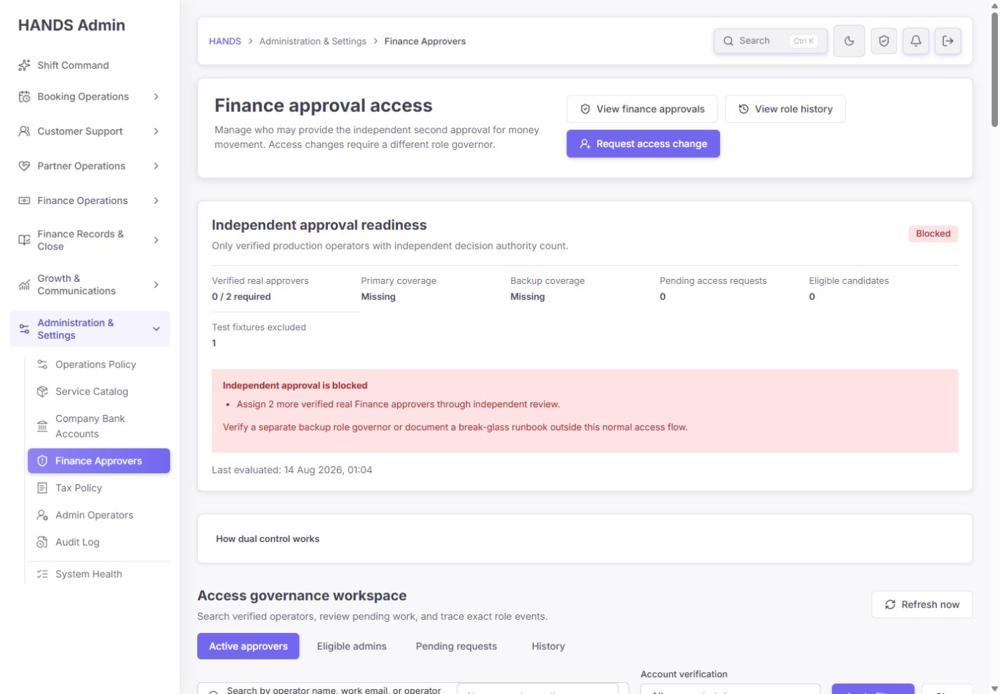
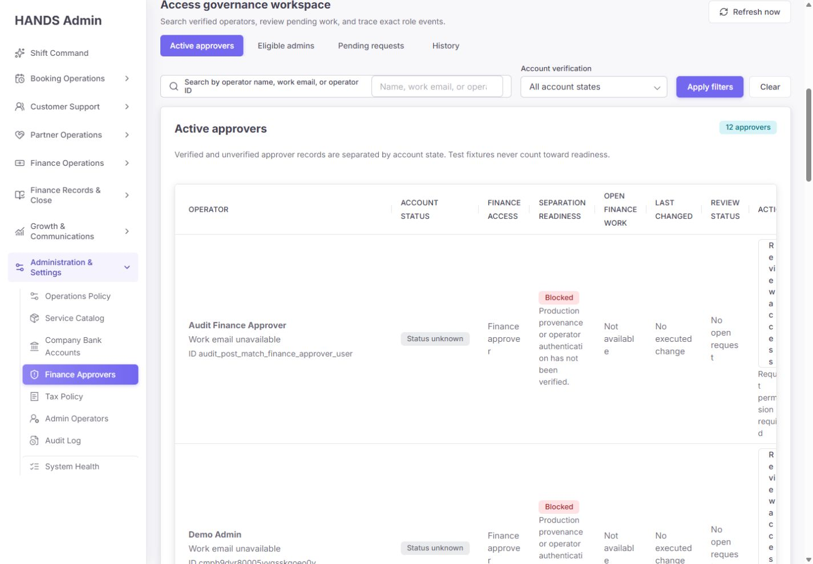
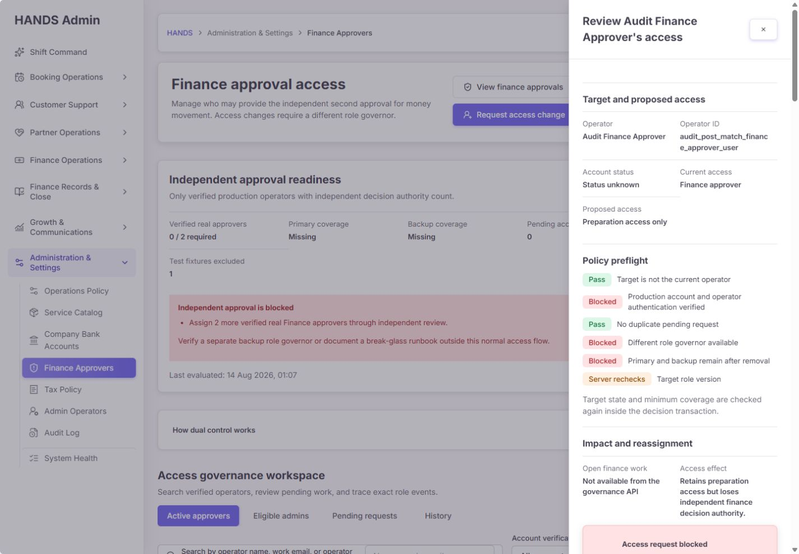
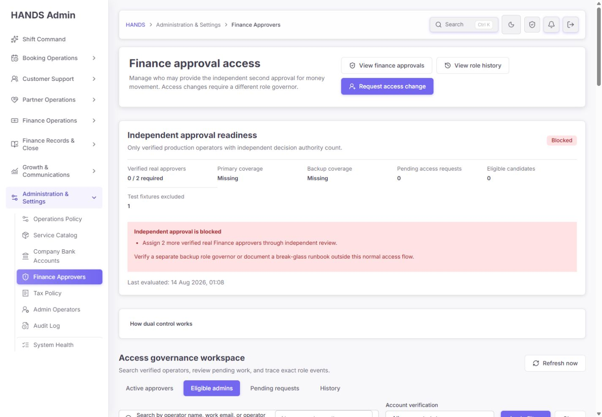
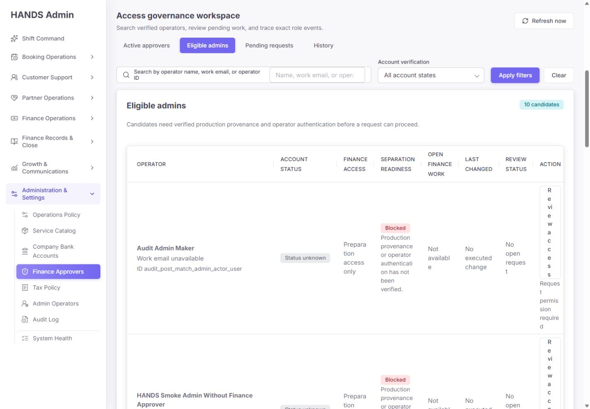
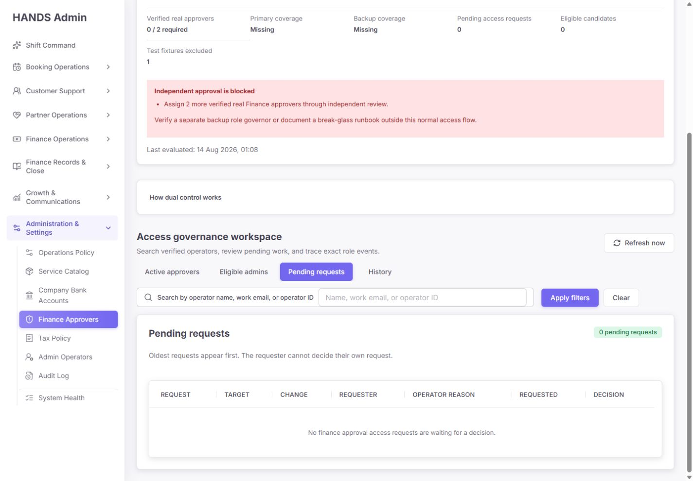
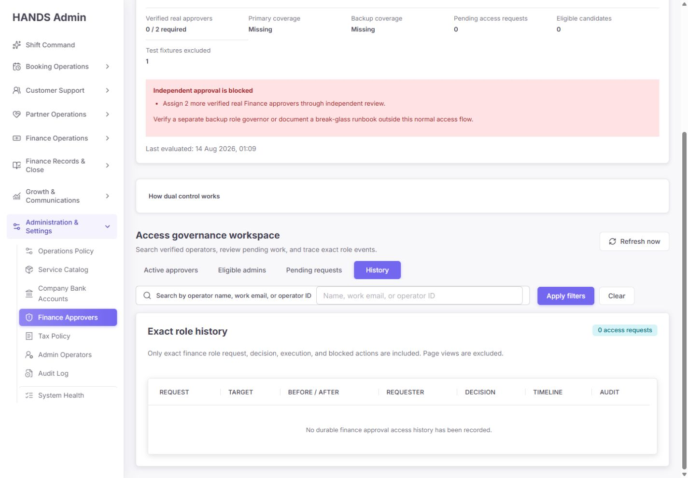
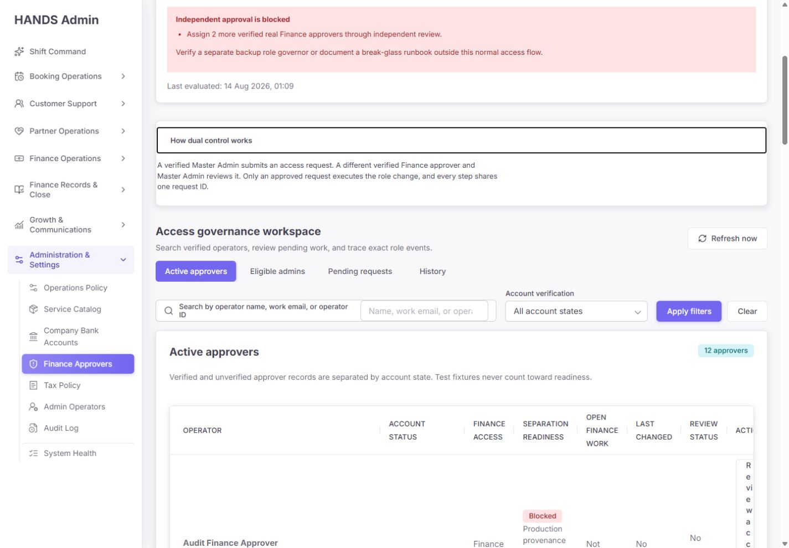

# Finance Approvers 최종 재감사 보고서

- 감사일: 2026-08-14
- 대상: `http://localhost:3101/finance-tax/finance-approvers`
- 화면 기준: 1440px 이상만 검사함. 1024px 이하 반응형은 검사·평가·권고에서 완전히 제외함.
- 검수 범위: 현재 화면, 문구, 4개 URL 기반 뷰, 접근 검토 drawer, Admin Web 서버 액션, Admin API 권한/트랜잭션, Prisma 데이터, 감사 이력, 테스트와 운영 데이터
- 최종 판정: **RELEASE HOLD**
- 종합 점수: **43 / 100**

## 1. 요약 결론

이전의 직접적인 Finance Approver 역할 토글은 사라졌고, 요청자와 승인자를 분리하는 maker/checker 흐름, 필수 사유, 멱등성 키, 대상 역할 버전 재검사, Serializable 트랜잭션, 정확한 감사 링크가 구현됐다. 이 부분은 이전 감사보다 크게 좋아졌다.

그러나 현재 상태를 출시 가능하다고 판단할 수는 없다. 핵심 이유는 다음과 같다.

1. Finance Approvers 페이지는 fixture 계정을 readiness에서 제외하지만, 실제 환불·지갑·출금·지급 closeout 등 여러 금융 승인 로직은 여전히 `FINANCE_APPROVER` 역할 존재만으로 승인 가능 여부를 계산한다. 현재 로그인에 사용된 fixture 계정은 `ADMIN + FINANCE_APPROVER + MASTER_ADMIN`과 모든 금융·시스템 카테고리를 보유하고 있다. 즉, **페이지 표시상 fixture 제외와 실제 돈 이동 권한이 일치하지 않는다.**
2. "Verified production" 판정은 credential 레코드의 존재만 확인한다. `setupCompletedAt`, `disabledAt`, `lockedUntil`, MFA 준비 상태를 보지 않으므로 로그인할 수 없거나 중지된 계정도 readiness와 checker 수에 포함될 수 있다.
3. 정상 흐름으로는 최초 checker를 만들기 어렵고, Finance Approver가 사고 계정이어도 먼저 역할을 제거하지 않으면 계정 정지가 막힌다. 최소 2명 유지 규칙과 정지 규칙이 결합되어 비상 대응 deadlock이 생긴다.
4. 1440px 화면에서 8열 테이블이 운영자가 읽을 수 없는 수준으로 잘린다. Action이 세로 한 글자씩 보이고 blocker·상태 문구가 과도하게 줄바꿈된다.
5. 실행 가능한 후보는 `0`인데 Eligible admins 탭은 `10 candidates`라고 표시한다. 운영자는 10명을 선택할 수 있다고 이해하지만 실제로는 모두 blocked 상태다.
6. 기존 고권한 계정 12개는 durable role history가 전혀 없다. 현재 History 화면은 빈 상태여서 "누가 왜 이 권한을 보유하는가"를 증명하지 못한다.
7. DB 통합 테스트는 append-only 감사 로그를 삭제하려다가 실패하며 공유 개발 DB에 테스트용 production 고권한 계정과 pending 요청을 남겼다. 테스트 자체가 운영 readiness를 가짜로 통과시키는 오염원이 될 수 있다.

## 2. 점수

| 영역 | 점수 | 판정 |
|---|---:|---|
| 정보 구조·첫 화면 이해도 | 76 | 좋아짐 |
| 1440px 시각적 사용성 | 49 | 테이블 재설계 필요 |
| 운영 문구·행동 유도 | 55 | 숫자·명칭 불일치 |
| Maker/checker·트랜잭션 | 82 | 기본 구조 양호 |
| 실제 금융 권한 경계 | 24 | P0 |
| 계정 신뢰·readiness 정확성 | 22 | P0 |
| 감사·기존 권한 설명 가능성 | 45 | 신규 흐름만 양호 |
| 테스트·배포 안전성 | 18 | P0 |
| 전체 | **43** | **출시 보류** |

## 3. 현재 화면 기준 운영 데이터

통합 테스트를 실행하기 전, 화면과 read-only governance 진단이 일치한 기준값은 다음과 같다.

| 항목 | 값 |
|---|---:|
| Verified real approvers | 0 / 2 |
| Primary coverage | Missing |
| Backup coverage | Missing |
| 실행 가능한 eligible candidates | 0 |
| Pending access requests | 0 |
| Test fixtures excluded | 1 |
| Finance/Master 고권한 계정 | 12 |
| Provenance unknown | 11 |
| Fixture | 1 |
| Production | 0 |

따라서 화면이 보여 준 `Blocked` 자체는 맞다. 문제는 다음 행동이 연결되지 않고, 실제 금융 승인 권한은 동일한 신뢰 기준을 사용하지 않는다는 점이다.

## 4. 잘 개선된 부분

### 4.1 직접 역할 토글 제거

- 일반 Admin Operator 역할 편집 경로에서 `FINANCE_APPROVER` 추가·제거를 차단한다.
- Finance Approver 변경은 별도 request/decision API를 거쳐야 한다.
- 요청 생성 시 역할은 즉시 바뀌지 않는다.

### 4.2 Maker/checker 기본 구조

- 요청자와 결정자가 달라야 한다.
- 대상 본인은 자신의 권한을 요청하거나 결정할 수 없다.
- decision은 verified production Master Admin이면서 Finance Approver여야 한다.
- 사유는 API와 Admin Web 모두 12~500자로 강제한다.

### 4.3 동시성·멱등성·stale state

- 요청에는 idempotency key, 기존 역할 배열, 기존 역할 상태, `expectedTargetUpdatedAt`이 저장된다.
- 승인 시 역할 스냅샷과 최소 인원 수를 다시 확인한다.
- 요청·결정은 Serializable 트랜잭션으로 실행되고 충돌 재시도가 있다.
- 승인 상태, 실제 역할 변경, 승인/역할 감사 로그가 같은 트랜잭션 안에서 처리된다.

### 4.4 오류와 빈 상태 분리

- summary 또는 목록 API 실패를 0건으로 오인하지 않는다.
- 401, 403, 429, 5xx 문구를 구분한다.
- 전역 operator access API 실패도 이제 `Access restricted`가 아니라 `Operator access unavailable`로 구분한다.

### 4.5 화면 구조와 접근성 기본기

- 첫 화면에서 readiness, 필요한 인원, pending, fixture 제외를 확인할 수 있다.
- Active / Eligible / Pending / History가 URL 상태로 분리돼 새로고침과 공유가 가능하다.
- drawer에 dialog semantics, focus 관리, Escape/overlay/닫기 동작이 있다.
- 상태는 색상만이 아니라 `Blocked`, `Pass`, `Missing` 텍스트와 함께 제공된다.
- History는 일반 페이지 조회 로그를 제외하고 Finance Approver exact event만 조회한다.

## 5. P0 — 출시 전에 반드시 해결할 문제

### P0-1. Fixture 제외가 실제 금융 승인 권한에는 적용되지 않는다

#### 증거

- governance readiness는 `AdminUserProvenance.PRODUCTION`과 credential 존재를 요구한다.
- 그러나 금융 승인 큐와 지급·출금 closeout preflight는 `roles has FINANCE_APPROVER`만 확인한다.
- 별도 provenance 검사는 Finance Approver governance와 일부 provider onboarding 외에는 적용되지 않는다.
- 현재 fixture 계정 `cmpfe6qxi00chvydwvhza0b23`은 다음 상태다.
  - 역할: `ADMIN`, `FINANCE_APPROVER`, `MASTER_ADMIN`
  - provenance: `FIXTURE`
  - 금융·시스템 포함 전체 operator category 보유
  - credential 활성, 최근 로그인 기록 존재
  - MFA: `NOT_CONFIGURED`

#### 위험

페이지는 이 계정을 "Test fixture — excluded"로 표시하지만, 다른 금융 실행 API에서는 독립 승인자로 취급될 수 있다. readiness가 blocked여도 실제 돈 이동이 가능한 권한 경계가 남는다.

#### 수정 요건

1. 공통 서버 함수 `assertVerifiedProductionFinanceApprover(actorId)` 또는 동등한 정책 함수를 만든다.
2. 환불, manual wallet adjustment, partner bank deposit, withdrawal paid closeout, payout closeout, reversal, payment clearing 등 모든 돈 이동 decision endpoint가 이 공통 정책을 사용하게 한다.
3. `Role.FINANCE_APPROVER`만 확인하는 모든 query/preflight/execute 경로를 전수 검색해 교체한다.
4. fixture/unknown/disabled/locked/not-setup 계정은 조회 화면 접근과 무관하게 금융 결정을 실행할 수 없어야 한다.
5. 테스트에 "fixture가 FINANCE_APPROVER 역할과 모든 category를 보유해도 금융 승인 불가" 계약을 추가한다.

### P0-2. `Verified production` 판정이 credential 생존 상태를 확인하지 않는다

#### 증거

다음 함수들은 `adminOperatorCredential: { isNot: null }`만 확인한다.

- `verifiedFinanceApproverWhere`
- `eligibleFinanceApproverCandidateWhere`
- `financeApproverDecisionGovernorWhere`
- `financeApproverGovernanceActorView`
- `assertFinanceApproverTargetEligible`

하지만 credential 모델에는 `setupCompletedAt`, `disabledAt`, `lockedUntil`, `mfaState`, `lastLoginAt`이 존재한다.

통합 테스트가 남긴 6개의 production Finance Approver는 모두 credential 레코드는 있으나 다음 상태였다.

- `setupCompletedAt = null`
- `lastLoginAt = null`
- `mfaState = NOT_CONFIGURED`

그럼에도 현재 predicate로는 모두 verified real approver에 포함된다.

#### 위험

- 로그인할 수 없는 계정이 primary/backup coverage를 채운다.
- 사용할 수 없는 checker가 `Different role governor available`을 통과시킨다.
- disabled/locked 계정이 readiness를 READY로 만들 수 있다.

#### 수정 요건

공통 "active production operator" predicate를 만들고 모든 count·request·decision·금융 실행에서 동일하게 사용한다.

최소 조건:

- provenance = `PRODUCTION`
- Admin credential 존재
- `setupCompletedAt IS NOT NULL`
- `disabledAt IS NULL`
- `lockedUntil IS NULL OR lockedUntil <= now`
- 출시 정책상 고위험 권한에 MFA가 필수라면 `mfaState = ENFORCED/VERIFIED`
- 필요 시 최근 로그인/재인증 상태는 readiness가 아닌 action 직전 정책으로 별도 표시

### P0-3. Bootstrap과 비상 정지 흐름이 deadlock이다

#### 현재 규칙 조합

- request 제출 전 다른 verified Finance Approver + Master Admin checker가 있어야 한다.
- 현재 verified real approver는 0명이다.
- Finance Approver가 붙은 계정은 역할을 먼저 제거하지 않으면 suspend할 수 없다.
- 역할 제거 후에도 verified approver 2명이 남아야 한다.

#### 위험

- 최초 verified checker를 정상 UI만으로 만들기 어렵다.
- 정확히 2명인 상태에서 1명이 탈취·퇴사·분실돼도 즉시 credential disable이 막힐 수 있다.
- 사고 대응이 "외부 break-glass 문서"에만 의존하고 실제 제품 제어가 없다.

#### 수정 요건

1. 평상시 정책과 별도의 emergency containment를 설계한다.
2. 비상 정지는 역할 수와 무관하게 세션 즉시 폐기 + credential disable을 먼저 수행할 수 있어야 한다.
3. 이후 Finance Approver 역할 정리와 최소 인원 복구를 별도 incident task로 강제한다.
4. break-glass는 2인 승인, 시간 제한, 사유, incident ID, 자동 알림, exact audit, 사후 검토를 가져야 한다.
5. 최초 bootstrap은 설치 단계에서 두 개의 실계정 owner evidence를 요구하고, 일반 운영 UI와 분리한다.
6. readiness blocker에 `Open Admin Operators remediation`과 `Open break-glass runbook`의 실제 링크를 제공한다.

### P0-4. DB 통합 테스트가 공유 개발 DB를 오염시킨다

#### 재현 결과

- 기본 실행: integration file 전체가 `skip`됐다.
- `RUN_FINANCE_APPROVER_DB_INTEGRATION=1`로 실제 실행: 4/4 실패.
- 실패 원인: `afterEach`가 `AdminAuditLog.deleteMany()`를 호출했지만 DB append-only trigger가 `AdminAuditLog is append-only`로 거부했다.
- cleanup은 그 지점에서 중단됐고, 테스트 계정·credential·request·audit가 남았다.

#### 이번 감사 중 남은 레코드

- test run ID: `finance-governance-1786644908414`
- 생성 user: 12
- 생성 production high-privilege user: 9
- 생성 Finance Approver: 6
- 남은 pending access request: 2
- 이 때문에 governance 진단값이 `12 high privilege / 0 production / 0 pending`에서 `21 / 9 / 2`로 변했다.

이 레코드는 이번 보고서의 출시 판단에 실운영 데이터로 포함하지 않았다. 다만 현재 로컬 DB는 오염된 상태이므로 UI를 새로고침하면 READY처럼 보일 수 있다.

#### 수정 요건

1. 이 테스트는 공유 개발 DB에서 실행하지 못하도록 database name 또는 explicit allowlist guard를 둔다.
2. 전용 disposable test database/schema에서만 실행한다.
3. suite 종료 시 사용자/요청/audit row를 개별 삭제하지 말고 전용 schema/database 전체를 폐기한다.
4. append-only trigger가 활성화된 production parity DB에서 실행한다.
5. 이미 남은 `finance-governance-1786644908414:*` 레코드는 임의 삭제하지 말고, correction audit와 함께 승인된 cleanup 절차로 정리한다.
6. cleanup 실패 자체가 suite 최종 실패와 환경 오염 경고로 명확히 출력돼야 한다.

### P0-5. 기존 12개 고권한 계정의 provenance와 권한 근거가 없다

통합 테스트 전 기준으로 고권한 계정 12개 중 production은 0, unknown은 11, fixture는 1이었다. 이름이 Smoke/Audit/Demo처럼 보여도 이름만으로 fixture라고 분류해서는 안 된다.

필수 작업:

1. 각 계정 owner, 생성 경로, credential 소유자, 마지막 로그인, 목적을 확인한다.
2. 확인 증거 없이 `PRODUCTION`으로 일괄 변경하지 않는다.
3. fixture라면 생성 스크립트, run ID, 만료 시점, cleanup owner를 연결한다.
4. production이라면 실제 담당자, MFA, backup 여부, 재인증 정책을 증명한다.
5. 분류가 끝나기 전 금융 의사결정 권한은 차단한다.

## 6. P1 — 운영성과 신뢰도를 위해 반드시 개선할 문제

### P1-1. Primary/Backup은 실제 지정이 아니라 단순 인원 수다

`primaryReady = verifiedRealApproverCount >= 1`, `backupReady = count >= 2`다. 담당자 지정, 근무 가능 시간, 교대, 연락처, 지역, 휴가 상태가 없다.

개선 방법은 둘 중 하나다.

- 단순한 2인 최소 인원만 관리할 것이라면 문구를 `Minimum approver 1`, `Independent backup 1` 또는 `Coverage count`로 바꾼다.
- 정말 primary/backup을 운영할 것이라면 명시적인 designation, effective period, on-call 상태, owner, last attested를 모델링한다.

현재 `Primary coverage / Backup coverage`는 실제 운영 보장을 과장한다.

### P1-2. `Eligible candidates 0`과 `10 candidates`가 충돌한다

readiness의 eligible count는 verified production + credential + ADMIN + not approver만 센다. 반면 Eligible admins 탭은 단순히 Finance Approver 역할이 없는 모든 Admin을 조회한다. 그래서 같은 화면에서 `Eligible candidates 0`과 `10 candidates`가 동시에 보인다.

권고 구조:

- 탭 1: `Ready for request (0)` — 실제 요청 가능한 계정만
- 탭 2: `Needs operator verification (10)` — provenance/credential/MFA 보완이 필요한 계정
- 또는 현재 탭명을 `Admins without approval authority`로 변경하고 badge도 `10 admins`로 표시

각 blocked row에는 `Open Admin Operator` 또는 `Complete verification` CTA가 있어야 한다.

### P1-3. 1440px에서 핵심 테이블이 운영 불가능하다

8열, 1260px min-width, 좌측 sidebar를 함께 쓰면서 콘텐츠 viewport가 테이블보다 좁다. 결과:

- Action 버튼이 한 글자씩 세로로 줄바꿈된다.
- blocker 문구가 지나치게 길고 높은 row를 만든다.
- 우측 action을 보려면 horizontal scroll이 필요하지만 scrollbar는 row 아래 멀리 있다.
- 한 명을 비교할 때 시선이 좌우·상하로 과도하게 이동한다.

1440px 기준 권장 열:

1. Operator — 이름, email, account badge
2. Approval authority — Approver / No independent authority
3. Readiness — 가장 중요한 blocker 한 줄 + 추가 개수
4. Request — Pending/none + last change
5. Action — sticky right 또는 고정 폭

`Open finance work`, raw ID, 전체 blocker, before/after, audit 정보는 drawer로 이동한다. `Open finance work`가 항상 unavailable이면 authoritative API가 생기기 전까지 열 자체를 제거한다.

### P1-4. 권한이 없거나 blocked여도 `Review access`가 활성 링크다

모든 row에 동일한 `Review access` 링크가 있고 아래에 `Request permission required`가 붙는다. 결과적으로 운영자는 눌러 본 뒤에야 실행 불가를 확인한다.

개선:

- 실행 권한이 없으면 label을 `View access details`로 바꾼다.
- 실행 가능할 때만 `Request change`를 primary action으로 표시한다.
- blocker가 계정 검증 문제라면 `Open Admin Operator`를 제공한다.
- header의 `Request access change`도 ready candidate가 0이면 비활성 또는 `Resolve candidate blockers`로 변경한다.

### P1-5. `Preparation access only`는 실제 권한을 설명하지 못한다

API는 Finance Approver 역할 유무만 보고 모든 non-approver를 `PREPARATION_ONLY`로 반환한다. 하지만 실제 finance preparation category가 있는지 확인하지 않는다. 일부 Admin은 금융 preparation 권한이 전혀 없을 수 있다.

수정:

- 역할만 설명하려면 `No independent approval authority`로 변경한다.
- 실제 preparation access를 표시하려면 operator permission category를 조회해 `Can prepare: refunds, payouts...`를 별도로 계산한다.
- Finance Approver 승인 시 category를 자동 확대하지 않을 것이라면 receipt와 drawer에서 이 사실을 명확히 설명한다.

### P1-6. 기존 권한의 baseline history가 없다

Active approvers 12명 모두 `No executed change`, History는 `0 access requests`다. 신규 request부터는 좋은 audit chain이 생기지만 기존 권한은 설명할 수 없다.

권고:

- 기존 권한을 가짜 승인 요청으로 backfill하지 않는다.
- `LEGACY_BASELINE_ATTESTED` 또는 동등한 별도 event를 만든다.
- attestation에 target, 당시 roles, provenance, credential 상태, attestor, owner evidence, reason, recordedAt, source migration ID를 남긴다.
- 미확인 계정은 baseline이 아니라 `UNVERIFIED_LEGACY_ACCESS`로 기록하고 금융 실행을 차단한다.

### P1-7. decision 값이 없거나 비정상이면 APPROVE로 변환된다

Admin Web server action은 `decision === 'REJECT' ? 'REJECT' : 'APPROVE'`를 사용한다. 즉 missing/오타/예상하지 못한 값이 APPROVE가 된다. 직접 API DTO는 이를 막지만, Web server action이 잘못된 값을 정상 APPROVE payload로 변환한다.

수정:

- `APPROVE`와 `REJECT` 외에는 field error를 반환한다.
- missing decision 테스트를 추가하고 API 호출이 발생하지 않는지 확인한다.
- 고위험 승인에서는 approve 버튼에 명확한 최종 확인 또는 action-specific confirmation을 추가한다.

### P1-8. 입력 이탈 방지 로직이 완전하지 않다

- drawer close/backdrop/Escape는 dirty confirm을 사용한다.
- 그러나 form 내부 `Cancel`은 일반 링크라 dirty confirm을 우회한다.
- `onSubmitCapture`에서 결과가 오기 전에 dirty flag를 false로 만든다. API 오류 후 입력이 화면에 남아 있어도 close하면 경고가 나오지 않을 수 있다.

수정:

- Cancel도 drawer의 동일한 guarded close handler를 사용한다.
- 성공 receipt가 확정된 시점에만 dirty를 해제한다.
- 실패 후 reason이 유지되고 close 시 경고가 나오는 component test를 추가한다.
- browser back/navigation도 같은 방어 범위에 포함한다.

## 7. P2 — 다듬기 항목

1. raw operator ID는 table에서 제거하고 drawer에 copy button과 함께 둔다.
2. `Work email unavailable`은 `No work email on record`처럼 데이터 품질 문제임을 명확히 한다.
3. `No executed change`, `No open request`, `Not available` 반복을 icon/compact status로 줄인다.
4. blocker는 table에 첫 번째 한 줄만 보이고 `+2 more`로 drawer를 연다.
5. `How dual control works` 문구는 "Finance Approver and Master Admin"이 한 명의 checker에게 동시에 요구되는지 더 명확히 쓴다.
6. `Last evaluated`는 새로고침 시각인지 서버 판정 시각인지 helper text를 추가한다.
7. URL로 drawer target을 직접 열 때 현재 page/filter에 target이 없으면 drawer가 조용히 사라진다. target 전용 fetch 또는 명시적 not-found 메시지가 필요하다.
8. authenticated API latency/payload budget은 이번 재감사에서도 검증하지 못했다. 기능 안정성과 별개로 출시 체크리스트에 남겨야 한다.

## 8. 화면별 단계 감사

### Step 1. Readiness overview

**상태: Needs Attention**

좋은 점:

- Blocked가 첫 화면에서 명확하다.
- 0/2, pending, eligible, fixture 제외가 한 영역에 있다.
- 오류를 0으로 오인하지 않는다.

문제:

- 다음 행동이 "Assign 2 more" 문장뿐이고 실제 후보는 0이다.
- Primary/Backup가 실지정처럼 보인다.
- break-glass는 문서화하라고만 하고 링크와 실행 정책이 없다.

### Step 2. Active approvers

**상태: Blocked**

좋은 점:

- fixture, unknown, blocked 이유를 숨기지 않는다.
- 자기 자신과 다른 operator를 구분한다.

문제:

- 1440px에서 action과 blocker를 읽기 어렵다.
- 12명 모두 durable change가 없고 11명은 provenance unknown이다.
- 항상 unavailable인 열과 raw ID가 핵심 판단을 방해한다.

### Step 3. Access review drawer

**상태: Needs Attention**

좋은 점:

- 대상, 현재/제안 권한, preflight, 영향, blocker를 한 화면에서 검토한다.
- blocked 상태에서 mutation form을 렌더링하지 않는다.

문제:

- 실행 불가인데 list action이 동일한 활성 링크다.
- `Preparation access only`가 실제 category를 반영하지 않는다.
- open work가 authoritative하지 않다.
- blocker를 해결할 직접 링크가 없다.

### Step 4. Eligible admins

**상태: Blocked**

좋은 점:

- candidate도 검증 전에는 요청할 수 없음을 표시한다.

문제:

- readiness는 0 eligible인데 tab은 10 candidates라 표현한다.
- 사실상 후보 목록이 아니라 remediation 목록이다.
- table의 1440px 가독성 문제가 동일하다.

### Step 5. Pending requests

**상태: Healthy empty state / 운영 데이터는 미검증**

좋은 점:

- 0건 empty state가 실패 상태와 구분된다.
- oldest first와 maker cannot decide 규칙을 설명한다.

한계:

- 실제 maker/checker pending request를 정상 계정으로 확인하지 못했다.
- 통합 테스트 오염 이후에는 2개의 테스트 pending이 생겼으므로 현재 로컬 DB empty state는 더 이상 유지되지 않는다.

### Step 6. Exact history

**상태: Blocked for legacy governance**

좋은 점:

- exact actions만 대상으로 하고 page view를 제외한다.
- 신규 request가 생기면 request ID 기반으로 추적할 구조가 있다.

문제:

- 기존 12명에 대한 durable history가 0건이다.
- baseline attestation이 없다.

### Step 7. Dual-control help

**상태: Needs Attention**

좋은 점:

- maker/checker와 request ID 연결을 짧게 설명한다.

문제:

- zero-approver bootstrap과 emergency path를 설명하지 않는다.
- checker가 Finance Approver와 Master Admin을 모두 가져야 한다는 문장이 운영자에게 모호할 수 있다.

## 9. 테스트 결과

| 검사 | 결과 | 해석 |
|---|---|---|
| Admin Web finance approver focused unit | PASS, 2 files / 15 tests | 기본 렌더·server action 계약 통과 |
| API finance approver focused unit | PASS, 14 tests | request/decision 기본 서비스 계약 통과 |
| DB integration 기본 실행 | SKIPPED, 4 tests | 기본 명령만으로는 동시성 검증이 실행되지 않음 |
| DB integration 실제 실행 | FAIL, 4/4 | append-only audit cleanup 실패, 공유 DB 오염 |
| Read-only governance check, 테스트 전 | 12 high privilege, 0 production, 1 fixture, 11 unknown, 0 pending | 출시 blocked 데이터 |
| Read-only governance check, 테스트 후 | 21 high privilege, 9 production, 1 fixture, 11 unknown, 2 pending | 테스트 오염으로 신뢰 불가 |

현재 unit test에는 다음 회귀가 포함돼 있지 않다.

- fixture Finance Approver의 실제 금융 승인 차단
- disabled/locked/not-setup credential 제외
- missing decision이 APPROVE로 변환되지 않는지
- Cancel과 API 실패 후 dirty guard
- 1440px table action 가독성
- legacy baseline attestation
- emergency suspension deadlock
- append-only trigger가 있는 전용 DB에서 cleanup/rollback

## 10. Codex 구현 우선순위

### Phase 0 — 데이터 보호

1. Finance governance DB integration test를 즉시 공유 DB에서 차단한다.
2. `finance-governance-1786644908414:*` 오염 레코드 inventory와 correction plan을 만든다.
3. 임의 삭제·일괄 production 분류를 하지 않는다.

### Phase 1 — 권한 경계

1. verified production finance actor 공통 predicate/assertion을 만든다.
2. 모든 금융 decision endpoint에 적용한다.
3. fixture/unknown/disabled/locked/not-setup/MFA 미준비 차단 테스트를 추가한다.
4. emergency containment와 bootstrap을 설계한다.

### Phase 2 — 데이터 정리·감사

1. 12개 기존 고권한 계정을 owner evidence로 분류한다.
2. legacy baseline attestation을 도입한다.
3. 실제 실계정 primary/backup 2명을 확립한다.
4. 실제 maker/checker receipt와 exact audit chain을 캡처한다.

### Phase 3 — 1440px 운영 UI

1. table을 5열 중심으로 재설계한다.
2. Eligible을 Ready와 Needs verification으로 분리한다.
3. 권한·blocker에 따라 action label과 CTA를 바꾼다.
4. `Preparation access only`, Primary/Backup, candidates 문구를 실제 데이터 의미에 맞춘다.
5. unavailable 열과 raw ID를 drawer로 이동한다.

### Phase 4 — 품질 게이트

1. 전용 DB integration 4/4 통과
2. fixture 실제 금융 승인 E2E 차단
3. 두 실계정 maker/checker E2E 성공
4. 1440px visual regression
5. authenticated API latency/payload budget
6. emergency suspend drill과 복구 runbook 검증

## 11. 출시 승인 조건

다음 조건이 모두 충족되기 전에는 이 화면과 연결된 금융 승인 운영을 출시하지 않는다.

- [ ] fixture/unknown 계정이 실제 금융 결정을 실행할 수 없음
- [ ] verified predicate가 credential 활성·setup·lock·MFA 정책을 반영함
- [ ] 공유 DB에서 integration test 실행이 기술적으로 차단됨
- [ ] 이번 테스트 오염 레코드가 승인된 correction 절차로 정리됨
- [ ] 기존 12개 고권한 계정 provenance/owner 확인 완료
- [ ] 실제 production approver 2명 확보
- [ ] zero-bootstrap과 emergency containment runbook/제어 구현
- [ ] legacy baseline audit 확보
- [ ] 실제 maker/checker receipt와 exact audit 검증
- [ ] 1440px 테이블 가독성 수정
- [ ] eligible 수치와 후보 탭 의미 일치
- [ ] missing decision fail-closed
- [ ] dirty cancel/error recovery 검증
- [ ] 전용 DB 동시성/rollback integration 통과

## 12. 증거 한계와 데이터 변경 고지

- 1024px 이하 화면은 사용자 요구에 따라 전혀 검사하지 않았다.
- 실제 production maker/checker 성공 변경은 수행하지 않았다.
- Admin Web/API 소스 코드는 수정하지 않았다.
- read-only 진단 외에, DB integration 테스트가 isolated cleanup을 약속했지만 append-only audit trigger 때문에 cleanup에 실패하여 테스트 데이터가 남았다.
- 남은 테스트 레코드를 강제로 삭제하거나 역할을 임의 변경하지 않았다. 감사 추적을 훼손하지 않는 correction 절차가 필요하다.
- 통합 테스트 실행 전 캡처된 화면 8장은 모두 직접 확인했다.

## 13. 최종 판정

UI와 maker/checker 기본 구조는 이전보다 확실히 좋아졌다. 하지만 현재 페이지의 "fixture 제외"와 실제 금융 승인 권한이 분리돼 있고, verified 판정도 credential 존재만 본다. 여기에 비상 정지 deadlock, 기존 권한의 이력 부재, 공유 DB를 오염시키는 integration test까지 확인됐다.

따라서 현재 상태는 **운영 화면 개선 완료**가 아니라 **좋은 governance UI 위에 실제 권한 경계와 운영 데이터가 아직 따라오지 못한 상태**다. P0를 해결하고 전용 DB·실계정으로 검증하기 전까지는 RELEASE HOLD가 적절하다.
