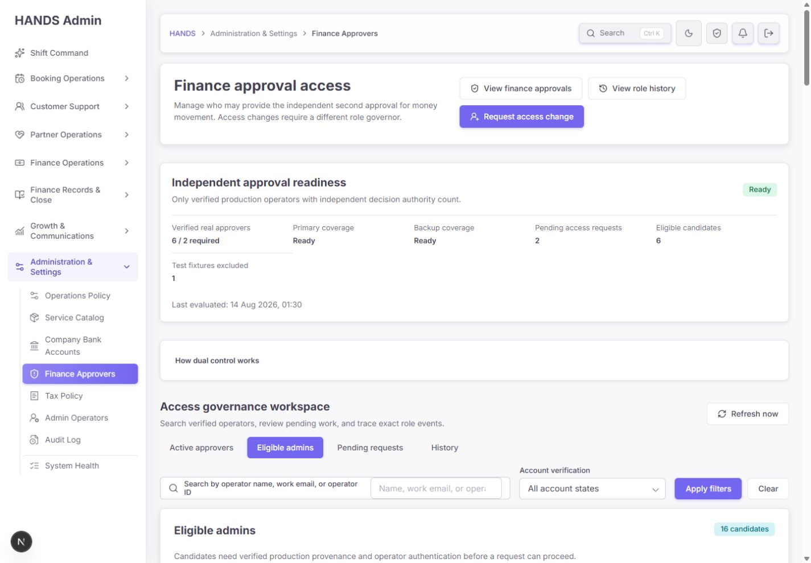
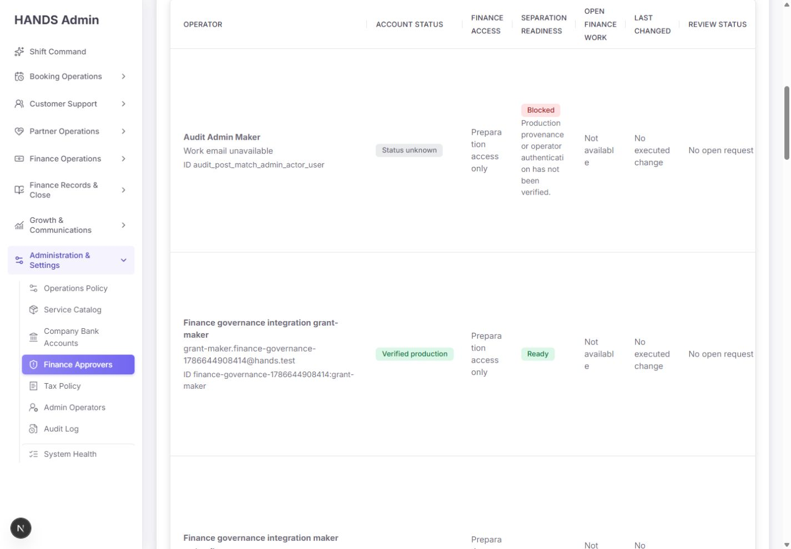
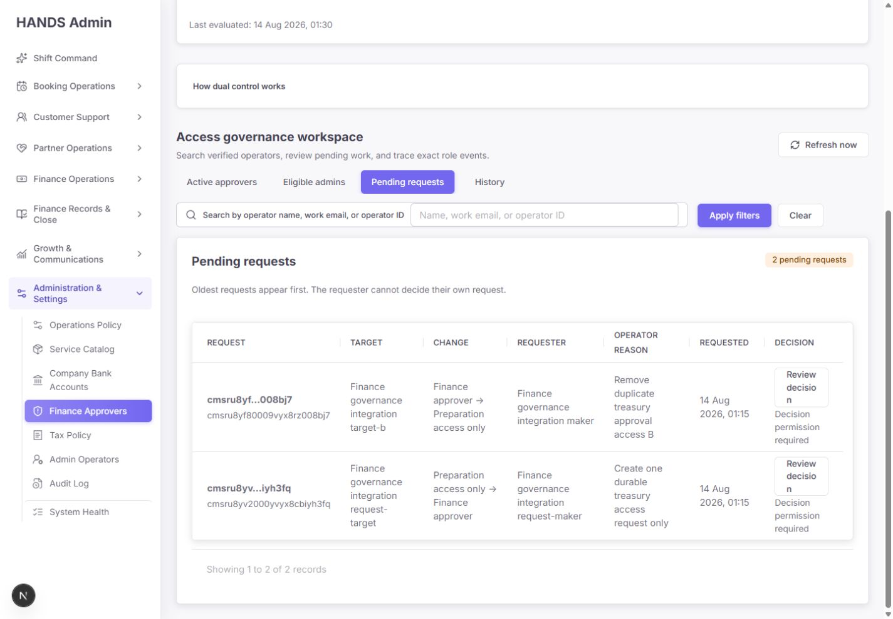
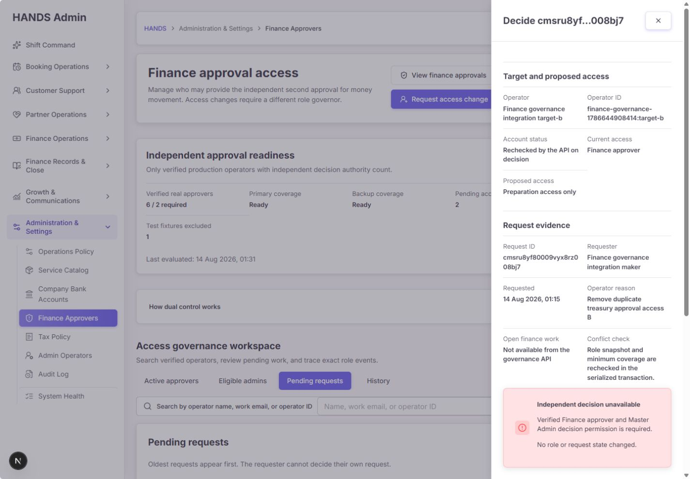
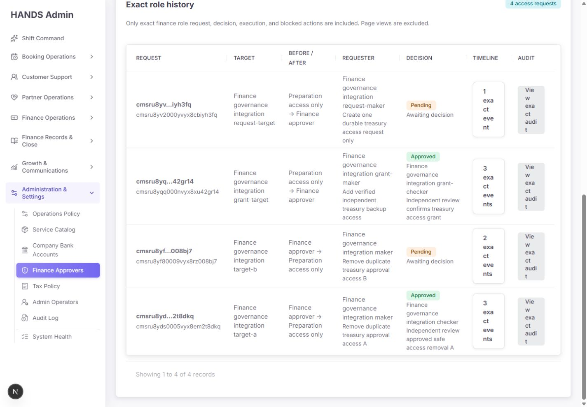
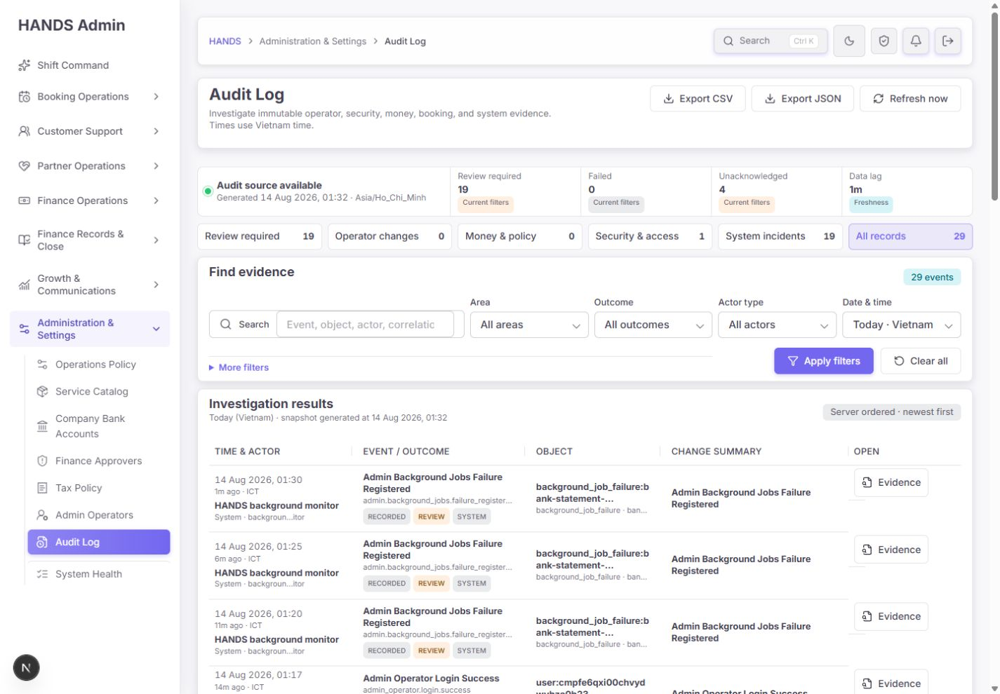
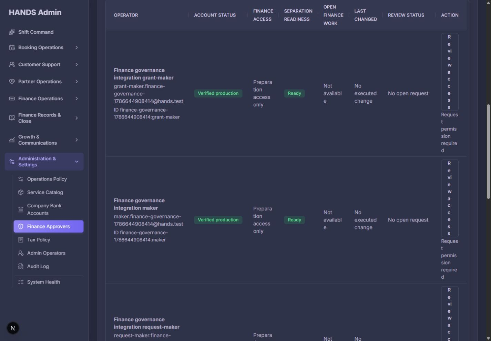

# Finance Approvers 서브뷰 최종 재감사 보고서

- 감사일: 2026-08-14
- 대상: `view=eligible`, `view=pending`, `view=history`
- 검증 화면: 1440 × 1000
- 검증 범위: 화면·문구·필터·drawer·딥링크·감사 링크·Admin Web server action·Admin API 권한 경계·현재 DB 상태·테스트 격리
- 최종 판정: **RELEASE HOLD**
- 종합 점수: **35 / 100**

## 1. 결론

이전 보고서의 핵심 수정은 현재 코드와 화면에 반영되지 않았다. URL 기반 탭, maker/checker 기본 흐름, 명시적인 빈 상태와 오류 상태 같은 기존 장점은 유지됐다. 그러나 출시를 막는 핵심 항목은 그대로다.

가장 심각한 변화는 현재 화면이 `Ready`, `Verified real approvers 6 / 2`, `Eligible candidates 6`을 표시한다는 점이다. 이 6명은 실제 운영자가 아니라 이전 DB 통합 테스트가 남긴 `finance-governance-1786644908414:*` 계정이다. 6명 모두 `setupCompletedAt = null`, `MFA = NOT_CONFIGURED`, `lastLoginAt = null`인데 credential row가 존재한다는 이유만으로 verified production으로 집계된다. 화면의 초록색 `Ready`가 실제 운영 준비 상태를 정반대로 설명한다.

또한 환불·지갑 조정·은행 입금·출금·지급 closeout·정산 수리 등 실제 금융 실행 경로는 여전히 공통 verified production 정책이 아니라 `FINANCE_APPROVER` 역할 존재만 확인한다. 따라서 이 페이지의 governance 설명과 실제 돈 이동 권한은 아직 하나의 신뢰 경계를 사용하지 않는다.

이전 보고서의 주요 완료 조건 14개를 다시 대조한 결과는 다음과 같다.

| 상태 | 수 | 판단 |
|---|---:|---|
| 완료 | 0 | 출시 차단 항목 중 완료 확인 없음 |
| 부분 유지 | 3 | maker/checker, transaction/audit 구조, 오류·빈 상태 분리 |
| 미반영 | 11 | verified predicate, test isolation, emergency suspend, legacy baseline, 1440 table, 후보 IA, 문구, fail-closed decision, dirty guard, deep link, exact audit |

## 2. 현재 운영 데이터의 진실

읽기 전용 진단과 실제 DB 조회 결과다. 데이터 변경은 수행하지 않았다.

| 항목 | 현재 값 | 실제 의미 |
|---|---:|---|
| 고권한 계정 | 21 | Finance Approver 또는 Master Admin |
| production 표시 | 9 | 9개 모두 알려진 통합 테스트 run 계정 |
| Finance Approver 역할 보유 | 18 | production 6, fixture 1, unknown 11 |
| production Finance Approver | 6 | 모두 통합 테스트 잔여 계정 |
| setup 완료 production approver | **0** | 현재 실사용 가능한 검증 승인자 증거 없음 |
| MFA 준비 production approver | **0** | 6명 모두 `NOT_CONFIGURED` |
| 마지막 로그인 있는 production approver | **0** | 실제 checker 사용 가능성 증명 없음 |
| pending request | 2 | 모두 통합 테스트 잔여 요청 |
| history request | 4 | 모두 같은 테스트 run에서 생성 |
| unknown 고권한 계정 | 11 | owner/provenance 미확인 |
| fixture 고권한 계정 | 1 | 로그인에 사용 중인 seed fixture |

따라서 현재 UI의 `Ready` 판정은 운영적으로 거짓 양성이다. 테스트 데이터가 readiness와 history를 채우고 있으며, 실제 사람 기준 coverage는 여전히 0으로 보는 것이 안전하다.

## 3. 화면 단계별 감사

### Step 1. Eligible admins 첫 화면 — 상태: Blocked

좋은 점:

- 현재 뷰, 검색, 계정 상태 필터가 URL로 유지된다.
- readiness와 후보 작업공간을 한 페이지 안에서 볼 수 있다.
- 상태를 색상만으로 표현하지 않고 `Ready`, `Blocked`, `Verified production` 텍스트를 병행한다.

문제:

- 상단은 `Eligible candidates 6`인데 목록 badge는 `16 candidates`다. 하나는 credential row만 있는 production count이고, 다른 하나는 역할이 없는 모든 Admin count다.
- `Eligible admins`라는 이름 아래 실제 요청 가능 후보와 provenance 미확인 remediation 대상을 섞는다.
- `Request access change`는 현재 로그인 actor가 요청 권한이 없어도 primary CTA로 유지된다.
- `Primary coverage`, `Backup coverage`는 담당자 지정이 아니라 단순 count임에도 실제 근무 coverage처럼 보인다.



### Step 2. Eligible admins 테이블 — 상태: Critical

1440px 실측 결과:

- 콘텐츠 container: 1050px
- 테이블: 약 1174px, CSS `min-width: 1260px`
- scroll container: `clientWidth 1050`, `scrollWidth 1174`
- Action은 초기 화면 우측 밖에 놓이거나 1~2글자 단위로 세로 줄바꿈된다.

운영 영향:

- 운영자는 한 행에서 계정 상태와 action을 동시에 볼 수 없다.
- 긴 raw ID, 항상 `Not available`인 열, 반복되는 `No executed change`가 핵심 판단을 밀어낸다.
- blocker가 표 안에서 문장 단위로 줄바꿈되어 행 높이가 과도해진다.
- 동일 작업을 수행하려면 좌우 스크롤과 긴 세로 스캔을 반복해야 한다.



### Step 3. Pending requests — 상태: Needs major revision

좋은 점:

- oldest-first와 maker-cannot-decide 규칙을 명시한다.
- target, before/after, requester, reason을 한 행에서 제공한다.
- drawer는 request ID, requester, reason, conflict recheck를 다시 보여 준다.

문제:

- 현재 2건은 실제 운영 요청이 아니라 실패한 통합 테스트 잔여 요청이다. 이를 production pending처럼 표시한다.
- Action 열의 `Review decision`은 2~3줄로 깨지고, 권한이 없는 현재 사용자에게도 동일한 활성 링크로 보인다.
- 요청 age/SLA, assignment, target의 현재 credential 상태, provenance, MFA, 최신 역할 version이 목록에 없다.
- `Operator reason`이 긴 본문 열을 차지해 target과 risk보다 더 큰 시각 비중을 가진다.
- `Decision permission required`는 해결 CTA나 필요한 역할을 연결하지 않는다.



### Step 4. Pending decision drawer — 상태: Partially healthy

좋은 점:

- dialog semantics, backdrop, X, Escape focus 관리 구조가 있다.
- 현재 actor가 decision 권한이 없으면 mutation form을 숨기고 `No role or request state changed`를 표시한다.
- target, current/proposed access, request evidence를 구분한다.

문제:

- `Account status: Rechecked by the API on decision`은 현재 상태가 무엇인지 보여 주지 않는다.
- target provenance, setup 완료, disabled/locked, MFA, category scope가 없다.
- `Open finance work`는 여전히 authoritative하지 않다.
- `Preparation access only`는 category를 조회하지 않은 추정 문구다.
- 권한이 없는 사용자를 drawer까지 진입시킨 뒤 막는다. 목록에서 `View request details`로 명확히 구분해야 한다.



### Step 5. History — 상태: Misleading

좋은 점:

- request 단위로 before/after, maker, checker, decision reason, event count를 묶는다.
- page-view log가 이 목록에 섞이지 않는다.
- 신규 request workflow의 이벤트 1건/3건 구분 자체는 이해할 수 있다.

문제:

- 표시되는 4건 모두 통합 테스트 잔여 이력이다. 실제 legacy approver 12명의 권한 근거는 여전히 0건이다.
- 테스트·legacy·실운영 출처 badge가 없어 운영자가 테스트 evidence를 실제 governance evidence로 오인한다.
- Timeline과 Audit 열이 좁아 `1 exact event`, `View exact audit`가 세로 한 글자씩 보인다.
- full request ID를 첫 열에서 반복해 의미 있는 시간·변경 결과를 밀어낸다.
- 발생 시각을 기본 열로 제공하지 않고 disclosure 안에 숨긴다.



### Step 6. View exact audit — 상태: Broken

`View exact audit` 링크는 `actions=...&target=finance_approver_request:{id}`를 만든다. 그러나 현재 Audit Log는 `actions`와 `target`을 읽지 않고 `targetPrefix`만 지원한다. 실제 클릭 결과:

- URL에는 요청 ID가 남아 있다.
- 화면은 해당 요청 1건이 아니라 오늘의 모든 29 events를 표시한다.
- export와 refresh URL에서도 exact target/action 필터가 사라진다.
- 운영자가 링크 이름을 믿으면 잘못된 evidence를 검토·내보낼 수 있다.



### Step 7. Dark theme eligible table — 상태: Critical

dark theme의 색상 대비와 surface 구분은 대체로 유지된다. 그러나 layout 결함이 더 명확하다. `Review access`가 한 글자씩 세로로 표시되며, `Request permission required`도 좁은 Action 열에서 길게 찢어진다. 이것은 테마 문제가 아니라 공통 테이블 구조 문제다.



## 4. P0 — 출시 전에 반드시 해결

### P0-1. Readiness가 테스트 잔여 계정을 실승인자로 계산한다

현재 `verifiedFinanceApproverWhere`, `eligibleFinanceApproverCandidateWhere`, `financeApproverDecisionGovernorWhere`는 `adminOperatorCredential is not null`만 확인한다. `setupCompletedAt`, `disabledAt`, `lockedUntil`, MFA를 보지 않는다.

수정 기준:

1. 공통 predicate를 하나만 만든다.
2. 최소 `PRODUCTION + ADMIN + FINANCE_APPROVER + setupCompletedAt + active credential + lock expired`를 요구한다.
3. MFA enforcement가 실제 구현되지 않았다면 `MFA_NOT_VERIFIED` blocker로 fail closed한다.
4. summary, eligible, checker count, preflight, execute가 동일 predicate를 사용한다.
5. `fixtureRunId`, test email/domain, disposable schema source를 운영 readiness에서 구조적으로 제외한다.

### P0-2. 실제 금융 실행 경로가 역할만 확인한다

확인된 role-only 경로에는 다음이 포함된다.

- referral cashout paid closeout
- booking settlement repair
- company bank account approval
- bank reconciliation match/reversal/ignore
- partner withholding paid closeout
- payment fee policy approve/reject
- partner bank deposit approve/reject
- manual wallet adjustment approve/reject
- provider withdrawal paid/reversal
- payout paid/reversal
- finance approval queue preflight

공통 `assertFinanceActionApprovalAdmin` 자체가 `id + FINANCE_APPROVER role`만 조회하며, payout/withdrawal preflight도 같은 role-only query를 별도로 사용한다.

수정 기준:

- 모든 돈 이동 trust boundary에서 `assertVerifiedProductionFinanceApprover`를 재검사한다.
- fixture, unknown, setup 미완료, disabled, locked, MFA 미검증 actor를 안정적인 error code로 거부한다.
- list/preflight와 execute가 같은 policy를 사용한다.
- 각 실제 action에 fixture-with-all-roles 회귀 테스트를 추가한다.

### P0-3. DB integration test 격리와 cleanup이 여전히 안전하지 않다

통합 테스트는 현재도 다음 구조다.

- `RUN_FINANCE_APPROVER_DB_INTEGRATION=1`만 확인하고 DB allowlist를 확인하지 않는다.
- 실제 DB에 production user/request/audit를 쓴다.
- cleanup에서 append-only `AdminAuditLog.deleteMany()`를 실행한다.
- audit delete가 실패하면 request/user cleanup까지 중단된다.

기본 실행은 4개 test를 모두 skip하므로 안전성·동시성 검증도 release gate에서 실행되지 않는다.

수정 기준:

- first write 전에 disposable DB name/schema allowlist를 강제한다.
- shared/local operational DB URL이면 명시적으로 실패한다.
- cleanup은 row delete가 아니라 disposable schema/database 폐기로 수행한다.
- append-only trigger가 켜진 parity 환경에서 4/4를 실제 통과시킨다.
- 이미 남은 run은 승인된 correction audit 없이는 삭제하지 않는다.

### P0-4. Emergency suspend deadlock이 남아 있다

`setAdminOperatorSuspended()`는 target이 Finance Approver면 `FINANCE_APPROVER_GOVERNANCE_REQUIRED`로 중지한다. 계정 탈취 상황에서도 credential disable과 session revoke 전에 막힌다.

수정 기준:

- 비상 정지는 역할 수와 무관하게 credential disable + session revoke를 먼저 허용한다.
- 역할은 자동 제거하지 않는다.
- disabled 계정은 verified count에서 즉시 제외한다.
- incident/change reference, revoked session count, 이전 역할을 감사에 남긴다.
- 별도 maker/checker 흐름으로 역할을 후속 정리한다.

### P0-5. Legacy 권한 근거가 없다

현재 schema와 코드에는 baseline attestation 또는 `UNVERIFIED_LEGACY_ACCESS` 모델이 없다. History 4건은 테스트 workflow일 뿐 기존 12개 고권한 계정을 설명하지 못한다.

수정 기준:

- 실제 owner evidence 없이 production으로 일괄 분류하지 않는다.
- legacy 접근을 신규 승인 요청으로 위조 backfill하지 않는다.
- 별도 attestation event/model에 owner, roles snapshot, provenance, credential/MFA 상태, attestor/checker, reason, source reference, exact audit correlation을 남긴다.
- attestation 전에는 금융 execute를 차단한다.

## 5. P1 — 운영자 UX와 신뢰성 수정

### P1-1. Eligible을 두 작업으로 분리

권장 IA:

1. `Ready for request` — 공통 verified predicate를 통과하고 pending이 없는 대상
2. `Needs verification` — provenance/setup/MFA/category/lock blocker를 해결해야 하는 대상

상단 CTA도 actor와 데이터에 따라 바꾼다.

- ready 후보 + 요청 권한 있음: `Request approver access`
- ready 후보 없음: `Resolve candidate blockers`
- 요청 권한 없음: `View governance requirements`

### P1-2. Eligible 기본 표를 5열로 축소

| 열 | 내용 |
|---|---|
| Operator | 이름, work email, production/test badge |
| Account readiness | setup, active/locked, MFA 핵심 상태 |
| Approval readiness | Ready 또는 첫 blocker + `+N` |
| Request status | none/pending, last change |
| Next action | Request / Complete verification / Open pending / View details |

raw ID, 전체 blocker, category, timestamps, open work, audit 링크는 drawer로 이동한다. Action은 고정 폭으로 하고 행 높이를 정상화한다.

### P1-3. Pending을 작업 queue로 재구성

권장 기본 열:

| 열 | 내용 |
|---|---|
| Request | short ID, requested age, SLA |
| Target & change | 이름, before → after |
| Maker | 요청자, self-decision 여부 |
| Risk check | provenance/setup/MFA/current version |
| Assignment | checker/owner, overdue 상태 |
| Action | Decide 또는 View details |

테스트 request는 `TEST RUN` badge와 run ID를 표시하고 운영 queue 기본값에서는 제외한다.

### P1-4. History를 evidence 중심으로 재구성

권장 기본 열:

| 열 | 내용 |
|---|---|
| Time / request | 실행 또는 요청 시각, short ID |
| Target / change | 대상, before → after |
| Maker → checker | 독립성 확인 |
| Outcome / reason | approved/rejected/pending + 요약 |
| Source | Production / Test run / Legacy attestation |
| Evidence | event count + exact audit |

상단에 `Unattested legacy access N`을 별도 경고 queue로 제공한다.

### P1-5. Exact audit 계약 통일

가장 작은 수정은 Finance Approvers 링크가 현재 Audit Log의 지원 파라미터를 사용하도록 바꾸는 것이다.

```text
/audit-log?range=all&sort=oldest&targetPrefix=finance_approver_request:{requestId}
```

정말 action까지 exact하게 제한하려면 Audit Log page model, API DTO, export, refresh가 동일한 `actions` multi-value contract를 지원해야 한다. 링크만 바꾸고 export에서 필터를 잃으면 완료가 아니다.

### P1-6. Decision server action을 fail closed로 변경

현재 missing/invalid `decision`은 모두 `APPROVE`로 변환된다.

```ts
const decision = readFormString(formData, 'decision') === 'REJECT' ? 'REJECT' : 'APPROVE';
```

`APPROVE | REJECT` 외에는 field error를 반환하고 API를 호출하지 않아야 한다. missing, typo, duplicated submit, Enter submit 테스트를 추가한다.

### P1-7. Dirty guard와 딥링크 복구

- submit 시작 시 dirty를 해제하지 않는다.
- 성공 receipt가 확정될 때만 dirty를 해제한다.
- Cancel도 X/Escape/backdrop과 동일한 guarded close를 사용한다.
- API 오류 후 reason을 보존하고 close 시 discard confirm을 보여 준다.
- 현재 page에 없는 `targetUserId`/`requestId` deep link는 target fetch 또는 명시적 not-found 안내를 제공한다. 현재는 URL만 남고 drawer와 오류가 모두 사라진다.

## 6. 문구 교정표

| 현재 문구 | 문제 | 권장 문구 |
|---|---|---|
| Primary coverage | 담당자 지정처럼 보임 | Verified approvers |
| Backup coverage | 근무 backup처럼 보임 | Independent backup available |
| Eligible admins | blocked 대상까지 섞음 | Ready for request / Needs verification |
| 16 candidates | 실제 request 가능 수와 다름 | 6 ready / 10 need verification |
| Preparation access only | category를 조회하지 않은 추정 | No independent approval authority |
| Work email unavailable | 데이터 품질 문제를 약하게 표현 | No work email on record |
| Review access | 실행 가능 여부 불명확 | Request change / Complete verification / View details |
| Review decision | 권한 없는 사용자에게도 action처럼 보임 | Decide request / View request details |
| Last evaluated | 무엇을 평가했는지 모호 | Policy evaluated by server at … |
| View exact audit | 실제로 전체 29건 표시 | 링크 계약 수정 전 `Open audit log` |

## 7. 접근성·테마·구현 품질 점수

| 영역 | 점수 | 근거 |
|---|---:|---|
| Accessibility | 2 / 4 | skip link, headings, table headers, dialog, text status는 양호. 다만 navigation link를 tab으로 선언하면서 `tabpanel`, `aria-controls`, roving tabindex/arrow key pattern이 없다. 긴 action wrapping도 읽기 순서를 해친다. |
| Performance | 3 / 4 | summary와 view를 병렬 로드하고 이미지·무거운 client rendering이 없다. 인증 API latency와 production payload budget은 별도 측정 필요. |
| 1440 desktop layout | 1 / 4 | 핵심 테이블이 content width를 초과하고 Action/Timeline/Audit가 세로로 깨진다. |
| Theming | 2 / 4 | dark surface와 상태 색은 유지되지만 동일한 table layout 결함이 심각하다. |
| Implementation integrity | 1 / 4 | UI readiness, 실제 execute permission, test data, exact audit 계약이 서로 다른 truth를 사용한다. |
| **합계** | **9 / 20** | **Poor** |

Impeccable detector가 globals.css에서 side accent 6건을 경고했지만, 이번 Finance Approvers 화면과 직접 연결되지 않은 전역 선택자라 이 감사의 결함 수에는 포함하지 않았다.

## 8. 테스트와 검사 결과

| 검사 | 결과 | 해석 |
|---|---|---|
| Admin Web focused unit | PASS, 2 files / 15 tests | 기존 렌더·기본 action 계약 통과 |
| API finance approver focused unit | PASS, 17 tests / 648 skipped | 기존 governance unit 통과, release-hardening cases는 없음 |
| DB integration 기본 실행 | SKIPPED, 4/4 | release gate가 실제 동시성·rollback을 실행하지 않음 |
| Read-only governance inventory | 21 high privilege, production 9, fixture 1, unknown 11, pending 2 | 운영 DB 오염 지속 |
| Credential inventory | production approver 6, setup complete 0, MFA ready 0 | UI `Ready` 판정이 잘못됨 |
| 1440 visual | FAIL | eligible, pending, history action/evidence 열 깨짐 |
| Exact audit link | FAIL | 요청 1건 대신 전체 29 events 표시 |
| Missing/invalid decision test | MISSING | fail-open 변환 코드 유지 |
| Shared DB first-write guard | MISSING | integration test가 env flag만 확인 |

## 9. 출시 우선순위

### Phase 0 — 즉시 데이터 보호

1. 공유 DB integration first-write guard 구현
2. 알려진 test run을 운영 count/history에서 fail closed 제외
3. correction audit를 포함한 승인된 cleanup 계획 수립

### Phase 1 — 실제 권한 경계

1. verified production finance actor 공통 predicate 구현
2. 모든 금융 execute/preflight caller 교체
3. emergency suspend/session revoke 구현
4. fixture/unknown/not-setup/disabled/locked/MFA 회귀 테스트

### Phase 2 — 운영 데이터 책임성

1. unknown 고권한 계정 owner evidence 확인
2. legacy baseline attestation 도입
3. 실제 운영자 2명 setup/MFA/ownership 완료
4. test와 production history 분리

### Phase 3 — 세 서브뷰 재구성

1. Eligible → Ready / Needs verification
2. 5~6열 중심 table 재설계
3. permission-aware action label
4. exact audit contract 수정
5. fail-closed decision, dirty guard, deep-link fallback

## 10. 재검수 승인 조건

- [ ] 화면 `Ready`와 실제 execute authorization이 같은 predicate를 사용함
- [ ] setup 미완료 6개 test approver가 verified count에서 제외됨
- [ ] actual production approver 2명이 owner/setup/MFA 근거를 가짐
- [ ] fixture/unknown actor가 실제 금융 결정을 수행할 수 없음
- [ ] shared DB integration test first write가 기술적으로 차단됨
- [ ] disposable DB에서 integration 4/4 실행 통과
- [ ] emergency suspend가 role removal보다 먼저 credential/session을 차단함
- [ ] legacy access attestation 또는 explicit blocker 존재
- [ ] eligible count와 목록 의미가 일치함
- [ ] pending/history의 test source가 분리 표시됨
- [ ] 1440px에서 Action, Timeline, Audit가 한두 줄로 읽힘
- [ ] exact audit 링크·refresh·export가 같은 request 필터를 유지함
- [ ] invalid/missing decision이 API 호출 없이 실패함
- [ ] Cancel/X/Escape/backdrop/API-error dirty guard가 같은 규칙을 사용함
- [ ] 없는 target/request 딥링크가 명시적 오류와 복구 CTA를 제공함

## 11. 증거 한계와 변경 고지

- 실제 승인·거부·역할 변경은 수행하지 않았다.
- DB 검사는 모두 읽기 전용이었다.
- 현재 남은 테스트 레코드를 삭제하거나 provenance를 변경하지 않았다.
- target 페이지 소스, 연결된 Audit Log query contract, API trust boundary, Prisma 데이터, focused unit test를 대조했다.
- 캡처 후 Admin Web 프로세스가 포트 응답을 중단해 추가 키보드 순회와 장시간 성능 측정은 완료하지 못했다. 이미 저장한 7개 화면은 모두 직접 열어 확인했다.

## 12. 최종 판정

현재 상태는 이전 보고서의 핵심 remediation이 완료된 상태가 아니다. UI는 초록색 `Ready`를 보여 주지만 그것을 만드는 6명은 setup/MFA/login이 없는 통합 테스트 잔여 계정이고, 실제 금융 승인 경로는 여전히 role-only다. Eligible/Pending/History 세 화면도 1440px에서 핵심 action과 evidence가 깨지고, `View exact audit`는 실제로 exact하지 않다.

따라서 **RELEASE HOLD, 35/100**이 적절하다. 다음 구현은 시각적 다듬기보다 `test isolation → shared authorization predicate → emergency containment → legacy accountability → 세 서브뷰 5~6열 재구성` 순서로 진행해야 한다.
