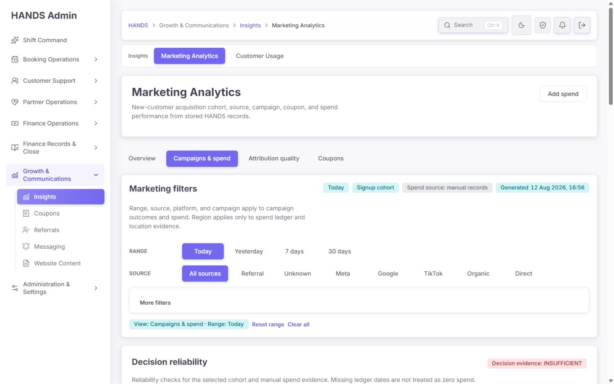
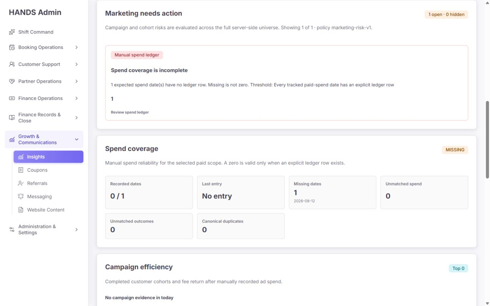
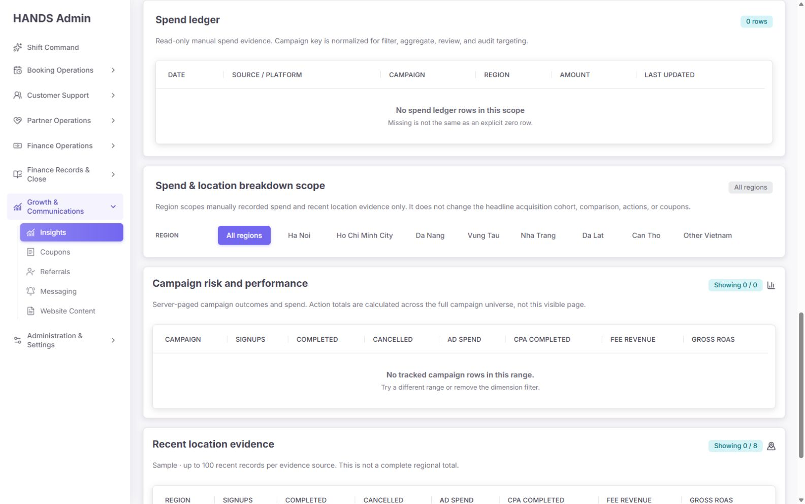
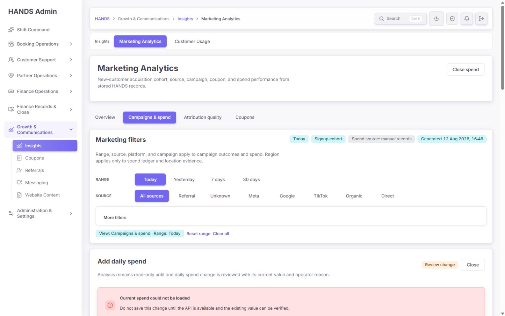
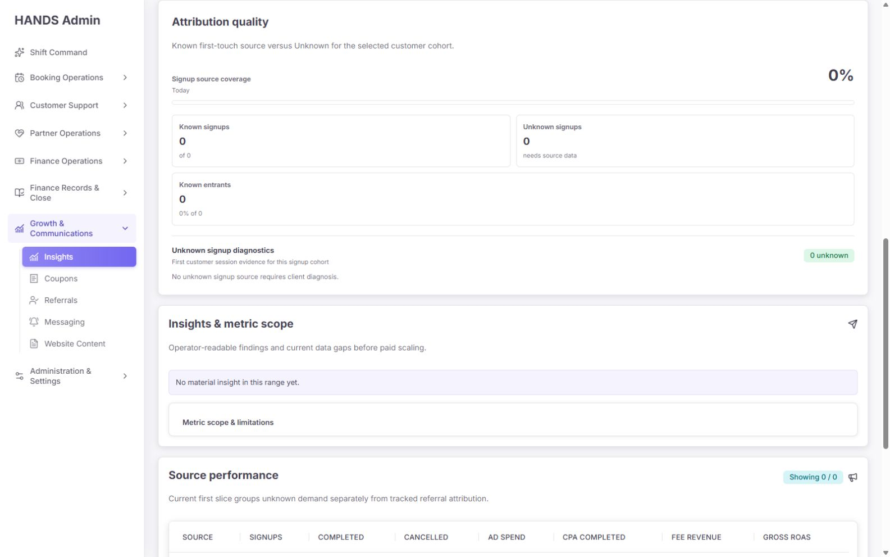
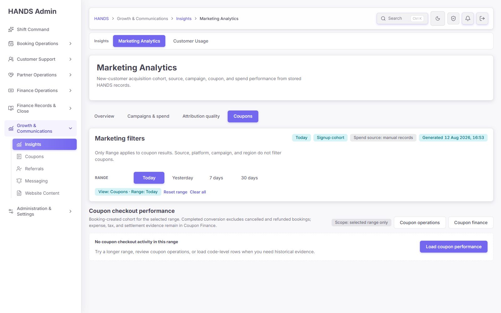
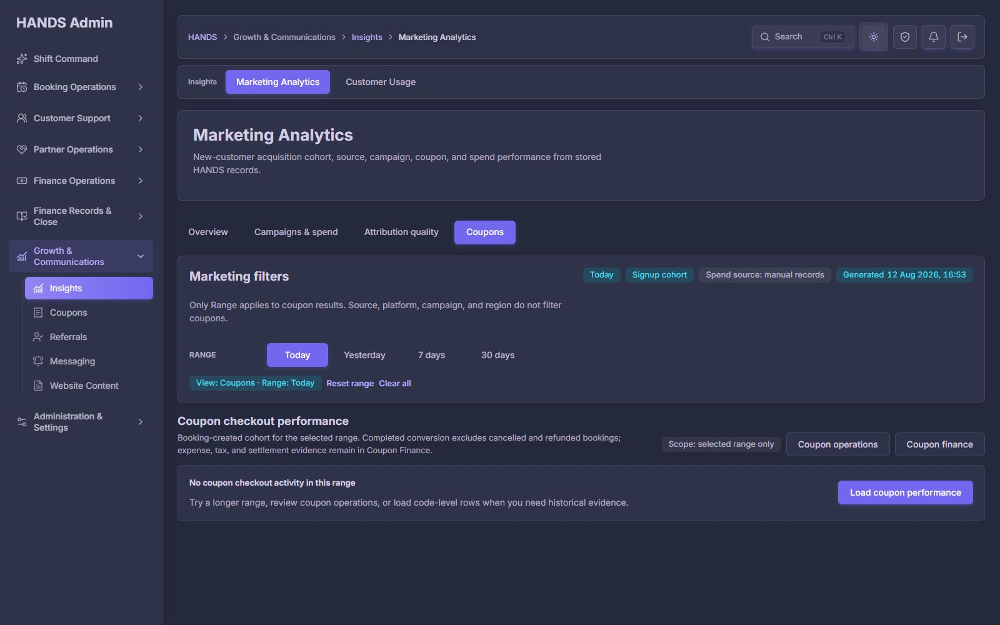

# Marketing Analytics Today 3개 뷰 최종 재감사 보고서

- 감사일: 2026-08-12 (Asia/Ho_Chi_Minh)
- 대상:
  - `/marketing-analytics?range=today&view=campaigns`
  - `/marketing-analytics?range=today&view=attribution`
  - `/marketing-analytics?range=today&view=coupons`
- 기준 해상도: 1440×900, 1600×1000 및 다크 테마
- 제외 범위: 1024px 이하 반응형·모바일 화면은 검사 및 점수에서 완전히 제외
- 감사 방식: 현재 로그인 세션의 실제 화면, 숨은 필터와 보조 동작, 읽기 전용 검토 흐름, 30일 데이터 상태, React/Next 코드, API 계약, 권한 가드, Prisma 마이그레이션, 집중 테스트를 교차 검증
- 변경 범위: 운영 코드 수정 없음. 이 보고서와 현재 실행 증거만 추가

## 1. 최종 판정

**운영 출시 준비도: 72/100 — RELEASE HOLD**

이전 보고서의 핵심 방향은 상당 부분 제대로 반영됐다. 특히 `Campaigns & spend / Attribution quality / Coupons` 목적 분리, `Missing ≠ 0`, 서버 전체 모집단 기준의 위험 합계, 수동 광고비 원장, 보기 권한과 수정 권한 분리, 독립적인 부분 실패 처리, 생성 시각, 다크 테마는 명백히 좋아졌다.

그러나 현재 실행 화면에서 운영자가 실제로 해야 하는 두 동작이 막힌다.

1. `Add spend → Review change`가 현재값 조회 실패로 중단되며 입력 화면으로 돌아가는 복구 동작도 없다.
2. Today 쿠폰 빈 상태의 `Load coupon performance`가 눌러도 동일한 빈 상태와 동일한 버튼을 다시 보여 준다.

여기에 미적용 권한 마이그레이션, `0%`와 `Not available`의 데이터 의미 충돌, 지역 표의 `Showing 0 / 8` 계약 불일치, 캠페인 판단 기준인 Fee ROAS의 표 누락이 남아 있다. 따라서 시각 완성도는 양호하지만 **운영 의사결정과 변경 작업의 신뢰도는 아직 출시 승인 수준이 아니다.**

## 2. 이전 보고서 반영 결과

| 이전 핵심 요구 | 현재 상태 | 판정 |
|---|---|---|
| 업무 목적별 4개 workspace view | Overview, Campaigns & spend, Attribution quality, Coupons로 분리 | 완료 |
| 수동 광고비를 0으로 위장하지 않기 | `Missing is not the same as an explicit zero row`, coverage 상태 제공 | 완료 |
| 전체 모집단 기준 위험 합계 | `Showing n of total`, `hidden` 수와 서버 threshold version 제공 | 완료 |
| 광고비 원장 읽기/쓰기 분리 | 별도 `GROWTH_MARKETING_SPEND` 코드와 read-only 상태 존재 | 코드 완료, 배포 미완료 |
| Review-first 광고비 변경 | Draft → Review → reason → Save 구조 구현 | 구조 완료, 현재 실행 실패 |
| 캠페인/지역/소스/플랫폼 페이지네이션 | 서버 페이지 및 독립 실패 상태 구현 | 대부분 완료, 지역 total 계약 오류 |
| 쿠폰 요약과 코드별 성과 지연 로드 | 요약과 on-demand API 분리 | 구현 완료, 빈 상태 CTA 오류 |
| Gross ROAS와 Fee ROAS 분리 | 상단 metric과 Campaign efficiency에는 둘 다 존재 | 캠페인 상세 표에서는 미완료 |
| 실패를 0건으로 오인하지 않기 | `unavailable` notice와 별도 empty state 존재 | 완료 |
| 1440px 이상 및 다크 테마 | 1440/1600 레이아웃과 다크 테마 정상 | 완료, 정보 우선순위 보완 필요 |

## 3. 화면 증거

### 3.1 Campaigns & spend — 1440px 첫 화면

장점은 workspace와 필터 범위가 명확하다는 것이다. 반면 1440×900에서 운영 판단에 필요한 `Decision reliability`는 제목만 겨우 첫 화면 하단에 보인다. breadcrumb, Insights 보조 내비게이션, 큰 페이지 소개 카드, workspace tabs, 큰 필터 카드가 수직 공간을 과도하게 사용한다.

### 3.2 Campaigns & spend — 실제 판단 영역

`Marketing needs action → Spend coverage → Campaign efficiency` 순서는 운영 업무에 적합하다. 다만 `1 expected spend date(s)`, `policy marketing-risk-v1`, `Top 0`, `No campaign evidence in today`처럼 구현 내부 용어와 어색한 문법이 운영 문구에 남아 있다.

### 3.3 Campaigns & spend — 원장·캠페인·지역

광고비가 없을 때 `0`이 아니라 `No spend ledger rows`를 보여 주는 것은 정확하다. 그러나 `Recent location evidence`는 실제 표시 행이 0개인데 `Showing 0 / 8`이라고 표시한다. 30일 보조 상태에서도 실제 활동 행 1개에 `Showing 1 / 8`과 `1 to 1 of 8`이 표시된다.

### 3.4 Add spend — 실제 Review 실패

Meta / Android / 캠페인 ID / 1,000 VND를 입력하고 `Review change`까지만 진행했으며 저장은 실행하지 않았다. 현재 화면은 `Current spend could not be loaded`로 중단된다. 실패 카드에는 `Retry current value`, `Edit inputs`, request ID, 상태 코드가 없다. Draft 값은 URL에는 남지만 화면에서는 사라져 운영자가 브라우저 뒤로가기에 의존해야 한다.

### 3.5 Attribution quality — 의미 충돌

동일 상태에서 상단 `Decision reliability`는 Attribution coverage를 `Not available`로 표시하지만 상세 카드는 `Signup source coverage 0%`와 `Known entrants 0% of 0`을 표시한다. 분모가 0인 비율은 0%가 아니라 `Not available — no signups/entrants in this range`여야 한다.

### 3.6 Coupons — 빈 상태 CTA

`Load coupon performance`를 눌러 `couponPerformance=1` 상태로 이동해도 화면과 버튼이 완전히 동일했다. `hasActivity === false` 분기가 요청된 page를 렌더링하지 않기 때문에, 운영자 입장에서는 버튼이 고장 난 것처럼 보인다.

### 3.7 Coupons — 다크 테마

다크 테마의 표면, 텍스트, 테두리, primary CTA 대비는 양호하다. 이 감사 범위에서는 심각한 테마 파손을 찾지 못했다.

## 4. 우선순위별 발견 사항

### P1-01. Add spend Review 흐름이 현재 운영 환경에서 완료되지 않는다

- 위치: `apps/admin_web/app/marketing-analytics/page.tsx:413`, `:1818`; `apps/api/src/admin/admin.service.ts:11220`
- 실제 증거: Draft 작성 후 Review에서 현재값 조회 실패
- 영향: 신규 광고비 행 생성과 기존 행 수정 모두 검토 단계에서 중단된다. 운영자가 금액을 입력해도 저장 전 검증 화면에 도달하지 못한다.
- 코드 관찰: API 서비스는 행이 없으면 `null`을 반환하도록 되어 있으므로, 현재 실패는 단순한 “신규 행 없음”이 아니다. 실행 중 API route/auth/runtime/validation 상태를 별도로 확인해야 한다.
- 중요한 제한: 화면은 `readFailed`만 노출하고 HTTP status, errorCode, requestId를 버리므로 이번 감사에서 정확한 응답 코드는 확정할 수 없었다. 아래 권한 마이그레이션 미적용은 별도 검증된 문제이지만, 이 GET 실패의 직접 원인이라고 단정하지 않는다.
- 수정 요건:
  1. `adminGetResult`의 `status`, `errorCode`, `requestId`를 Review 오류 카드에 운영 친화적으로 표시한다.
  2. 200 + `null`은 신규 행으로 간주해 Existing 0 VND 검토로 진행한다.
  3. 401/403/409/5xx를 구분한다.
  4. 오류 카드에 `Retry current value`, `Edit inputs`, `Cancel`을 제공한다.
  5. Draft query 값을 유지하고 오류 후에도 폼 값이 사라지지 않게 한다.
  6. 저장 버튼은 현재값 200/null 또는 200/record가 확인된 경우에만 노출한다.
- 완료 기준: 존재하지 않는 exact key, 기존 exact key, 409 conflict, 403, 503 각각의 브라우저 테스트가 통과한다.

### P1-02. `GROWTH_MARKETING_SPEND` 마이그레이션이 현재 로컬 DB에 적용되지 않았다

- 위치: `apps/api/prisma/schema.prisma:43`, `apps/api/prisma/migrations/20260812140000_add_marketing_spend_permission/migration.sql:1`
- 실제 검증: PostgreSQL enum 조회 결과에 `GROWTH_MARKETING_SPEND`가 없고 `_prisma_migrations`에도 해당 완료 행이 없다.
- 영향: Master Admin 외 운영자에게 이 세부 권한을 실제로 저장·부여할 수 없다. 코드와 런타임 DB의 권한 모델이 다르다.
- 수정 요건:
  1. 통제된 환경에서 migration을 적용한다.
  2. Prisma client generate → API build/restart 순서를 명시한다.
  3. `Admin Operators` 화면에서 해당 권한을 부여하고 재로그인 후 Add spend 노출을 확인한다.
  4. 일반 `GROWTH_MARKETING` 사용자는 read-only, `GROWTH_MARKETING_SPEND` 사용자는 write 가능, Master Admin은 write 가능을 smoke test한다.
- 완료 기준: DB enum, permission row, API guard, UI capability가 같은 값을 보고한다.

### P1-03. Today Coupons의 `Load coupon performance`가 무반응 CTA다

- 위치: `apps/admin_web/app/marketing-analytics/page.tsx:1414-1520`
- 원인: `couponPerformance=1`로 page를 가져와도 `hasActivity === false`이면 `Coupon code performance` section 자체를 렌더링하지 않는다.
- 영향: 운영자는 클릭 성공 여부를 알 수 없고 같은 버튼을 반복해서 누른다.
- 수정안 중 하나를 명확히 선택:
  1. **권장:** summary가 0이면 CTA를 제거하고 `No coupon checkout activity`만 유지한다. 코드별 행을 볼 이유가 없기 때문이다.
  2. 또는 요청 후 빈 paged table과 `0 entries`, `Hide code-level rows`를 명시적으로 렌더링한다.
- 완료 기준: 버튼 클릭 전후 상태가 눈에 띄게 다르거나, 애초에 불필요한 버튼이 없다.

### P1-04. Attribution의 분모 0 비율이 `0%`로 표시된다

- 위치: `apps/admin_web/app/marketing-analytics/page.tsx:1116-1127`, `:1142`
- 영향: “관측 데이터 없음”을 “기여도 품질 0%”로 오해하게 만든다. 같은 화면의 `Not available`과도 모순된다.
- 수정 요건:
  1. API/DTO의 coverage rate를 `number | null`로 바꾼다.
  2. signups 또는 entrants 분모가 0이면 `null`을 반환한다.
  3. UI는 `Not available`과 `No signups in Today`를 표시하고 progressbar를 제거하거나 indeterminate가 아닌 설명 상태로 바꾼다.
  4. 0/0, 0/n, n/n 세 계약 테스트를 추가한다.
- 완료 기준: 한 화면에서 `Not available`과 `0% of 0`이 동시에 존재하지 않는다.

### P1-05. Recent location evidence의 row count와 표시 행 계약이 다르다

- 위치: `apps/api/src/admin/admin.service.ts:10708`, `:10799`; `apps/admin_web/app/marketing-analytics/page.tsx:862`, `:2093`
- 원인: API는 8개 지역 bucket을 포함한 `rows.length`를 totalCount로 반환하지만, UI는 `hasMarketingActivity`로 행만 후처리 필터링한다.
- 영향: Today는 `Showing 0 / 8`, 30일은 `Showing 1 / 8`이 된다. 다음 페이지로 이동하면 비활동 bucket만 남아 빈 페이지가 생길 수 있다.
- 수정 요건:
  1. 서버에서 activity row만 만든 뒤 그 결과로 totalCount와 pagination을 계산한다.
  2. 또는 8개 bucket을 모두 보여 줄 목적이면 UI에서 행을 제거하지 말고 `No activity`를 명시한다.
  3. `rows.length <= totalCount`, page summary, empty page normalization을 계약 테스트한다.
- 권장안: 제목이 `Recent location evidence`이므로 activity row만 서버에서 페이지네이션한다.

### P1-06. 캠페인 위험 판단은 Fee ROAS를 쓰지만 상세 표는 Gross ROAS만 보여 준다

- 위치: `apps/admin_web/app/marketing-analytics/page.tsx:154-163`, `:2121`; 위험 threshold는 `apps/api/src/admin/admin-marketing-analytics.ts:826`
- 영향: 운영자는 `Fee ROAS < 1.00x` 경보의 근거를 캠페인 행에서 직접 확인할 수 없다. 대신 Fee revenue와 Gross ROAS가 섞여 있어 수익성 판단 축이 바뀐다.
- 수정 요건:
  1. 캠페인 표에 `Fee ROAS`를 추가하고 `Gross ROAS`와 명확히 분리한다.
  2. 공간이 부족하면 기본 판단 열은 Fee ROAS로 두고 Gross ROAS를 보조 열/상세 drawer로 이동한다.
  3. 위험 카드에서 해당 캠페인 행으로 이동하면 같은 수치와 threshold를 보여 준다.
- 완료 기준: 경보 카드의 observed value, 표의 Fee ROAS, 서버 threshold 계산이 일치한다.

### P2-01. 1440px 첫 화면에서 의사결정 정보가 접힌다

- 위치: 페이지 상단 shell + `Marketing Analytics` hero + workspace tabs + `Marketing filters`
- 영향: 운영자는 매번 스크롤해야 첫 위험과 신뢰도 상태를 본다.
- 수정 요건:
  1. 페이지 소개 카드 높이를 절반 수준으로 축소하고 제목/설명을 한 줄 toolbar로 통합한다.
  2. workspace tabs와 범위 필터를 같은 상단 control bar에 배치한다.
  3. `Generated`, `Signup cohort`, spend source는 도움말 또는 compact metadata row로 이동한다.
  4. Campaigns에서는 첫 viewport에 Decision reliability와 Needs action의 첫 행이 들어오게 한다.

### P2-02. `Reset range`와 `Clear all`이 Today에서 같은 7일 URL로 이동한다

- 위치: `apps/admin_web/app/marketing-analytics/page.tsx:637`, `:668`
- 영향: “모든 필터 해제”가 기간까지 7일로 바꾸는지 예측하기 어렵고, 두 링크가 중복된다.
- 수정 요건:
  - `Reset to default (7 days)` 하나로 합치거나,
  - `Clear dimensions`는 source/platform/campaign만 제거하고 Today를 유지하며, `Use default range`를 별도 제공한다.
- 권장안: 두 번째 방식. 기간은 운영자가 명시적으로 선택한 분석 범위이므로 dimension clear와 분리한다.

### P2-03. Coupons에 적용되지 않는 metadata가 노출된다

- 위치: `apps/admin_web/app/marketing-analytics/page.tsx:557-558`
- 현상: 쿠폰 뷰에도 `Signup cohort`, `Spend source: manual records`가 표시된다.
- 영향: 바로 아래 설명의 “Only Range applies”와 충돌하고 쿠폰 데이터가 signup/spend scope를 따른다는 인상을 준다.
- 수정 요건: 쿠폰 뷰에서는 `Booking-created cohort`, `Source: booking coupon metadata`처럼 실제 contract로 교체한다.

### P2-04. 운영 문구에 내부 표현과 문법 오류가 남아 있다

- 예: `1 expected spend date(s)`, `policy marketing-risk-v1`, `Top 0`, `No campaign evidence in today`
- 수정 예:
  - `1 spend date is missing from the ledger` / 복수형 formatter
  - `Risk policy v1` + 상세 tooltip에 내부 key
  - `No ranked campaigns`
  - `No campaign evidence for Today`
- 완료 기준: 단수/복수 fixture, 0건 fixture의 snapshot test를 추가한다.

### P2-05. 데이터 요청이 두 번의 직렬 wave로 나뉜다

- 위치: `apps/admin_web/app/marketing-analytics/page.tsx:413`, `:434`
- 현상: summary/coupon summary/spend record batch가 끝난 뒤에 dimension/coupon page/spend ledger batch를 시작한다.
- 영향: 독립 API가 느리면 Campaigns와 Attribution이 불필요하게 한 round trip 더 기다린다.
- 수정 요건: filters와 paging만으로 계산 가능한 요청은 같은 Promise graph에서 동시에 시작하고, view별 독립 section은 Suspense/streaming 또는 병렬 server fetch를 사용한다.
- 주의: 데이터 정합성을 위해 같은 generatedAt snapshot이 반드시 필요하다면 API batch endpoint를 만들고 그 이유를 contract로 명시한다.

### P2-06. 현재 테스트가 실제로 깨진 두 상태를 놓친다

- 위치: `apps/admin_web/app/marketing-analytics/page.spec.tsx`
- 누락 상태:
  1. exact spend row가 없을 때 200/null Review
  2. current row GET이 403/409/503일 때 Draft 보존과 recovery
  3. coupon summary 0 + `couponPerformance=1`
  4. region API totalCount와 UI activity filter 일치
  5. denominator 0 coverage `Not available`
  6. 권한 migration 적용 smoke
- 영향: 32개의 집중 테스트가 모두 통과해도 실제 브라우저의 핵심 흐름은 실패한다.

## 5. 페이지별 운영자 관점 결론

### Campaigns & spend — 68/100

좋은 점:

- Spend coverage와 missing dates를 최우선 action으로 만든 구조가 좋다.
- missing spend를 0으로 간주하지 않는다.
- 원장·캠페인·지역을 한 workspace에서 연결한다.
- Add spend가 별도 페이지로 튀지 않고 분석 맥락을 유지한다.

출시 전 필수:

- Add spend 현재값 조회/복구
- 권한 migration
- Fee ROAS 열
- 지역 pagination contract

### Attribution quality — 76/100

좋은 점:

- Known/Unknown 분리, unknown diagnostics, source/platform 분해가 명확하다.
- 30일 보조 데이터에서는 25% coverage와 3/3 server-paged rows가 일관되게 나타났다.

출시 전 필수:

- 0/0 비율을 `Not available`로 통일
- Attribution 뷰에서 spend 부족이 전체 `Decision evidence: INSUFFICIENT`를 만드는 이유를 분리 표시. `Attribution evidence`와 `Paid scaling evidence`를 두 상태로 나누는 편이 더 직관적이다.

### Coupons — 74/100

좋은 점:

- Booking-created cohort 정의, cancelled/refunded 제외 조건, Coupon operations/finance 연결이 명확하다.
- 30일 보조 상태에서 10/33 server pagination과 상세 열이 정상 렌더링됐다.
- 다크 테마가 안정적이다.

출시 전 필수:

- Today empty의 무반응 Load CTA 제거 또는 명시적 loaded-empty 상태 제공
- 쿠폰 뷰에서 signup/spend metadata 제거

## 6. 기술 감사 점수

| # | 항목 | 점수(0–4) | 핵심 판단 |
|---|---|---:|---|
| 1 | 접근성 | 3 | landmark, label, focus, active state는 양호. 0/0 progressbar 의미는 수정 필요 |
| 2 | 성능 | 3 | view별 요청 축소는 좋으나 두 단계 fetch waterfall 존재 |
| 3 | 지원 데스크톱 레이아웃 | 3 | 1440+에서 파손은 없으나 첫 판단 정보가 아래로 밀림 |
| 4 | 테마 | 4 | light/dark 대비와 token 사용 양호 |
| 5 | 구현 무결성 | 2 | 실제 CTA 2개 실패, 지역 total 불일치, migration 미적용 |
| **합계** |  | **15/20 — Good, but release blockers remain** | |

Impeccable detector는 지정 UI 대상과 공용 CSS에 대해 6개의 side-tab 패턴을 보고했다. 모두 marketing 화면이 아닌 공용 CSS의 다른 페이지 selector였으므로 이번 화면의 결함으로 집계하지 않았다. Marketing 전용 코드에서 detector가 확인한 결정적 anti-pattern은 없었다.

## 7. 권장 최종 화면 구조

### Campaigns & spend

1. Compact title/metadata toolbar
2. Workspace tabs + Range + primary Source + `More filters`
3. Decision reliability 4-cell strip
4. Needs action queue
5. Spend coverage + Add spend CTA
6. Campaign performance table: Completed, Spend, CPA, **Fee ROAS**, Gross ROAS, Decision
7. Spend ledger
8. Region evidence
9. Metric scope & limitations

현재처럼 긴 소개/필터가 먼저 오는 구조보다 **상태 → 해야 할 일 → 근거 → 상세 원장** 순서가 운영자에게 맞다.

### Attribution quality

1. Attribution evidence state: Available / Insufficient / No cohort
2. Known vs Unknown + denominator 문구
3. Unknown diagnostics
4. Source table
5. Platform table
6. Metric scope

Spend coverage는 이 뷰의 주상태에서 분리하고 `Paid scaling readiness` 보조 badge로만 남긴다.

### Coupons

1. Range + generatedAt + booking-created cohort
2. 5개 summary metrics 또는 단일 honest empty state
3. 데이터가 있을 때만 `Load code-level performance`
4. Coupon table
5. Coupon operations / Coupon finance links

## 8. 구현 순서

| 단계 | 작업 | 우선순위 | 완료 판정 |
|---:|---|---|---|
| 1 | Spend GET 실패 원인과 응답 코드를 확인하고 Review recovery 구현 | P1 | 신규/기존/403/409/503 브라우저 테스트 통과 |
| 2 | `GROWTH_MARKETING_SPEND` migration 적용 및 역할 smoke | P1 | DB enum·권한 UI·API guard 일치 |
| 3 | coupon empty CTA 무반응 제거 | P1 | 클릭 없는 honest empty 또는 loaded-empty 표시 |
| 4 | 0/0 coverage를 null contract로 수정 | P1 | `Not available` 일관성 |
| 5 | region activity pagination을 서버 기준으로 통일 | P1 | rows/total/page 일치 |
| 6 | 캠페인 표에 Fee ROAS 추가 | P1 | action value와 행 값 일치 |
| 7 | 상단 vertical density와 필터 clear semantics 정리 | P2 | 1440×900 첫 화면에 reliability/action 진입 표시 |
| 8 | view별 metadata와 운영 문구 정리 | P2 | 단수/복수/0건 snapshot 통과 |
| 9 | view API 병렬화 또는 batch contract 적용 | P2 | 요청 waterfall 제거 |
| 10 | 1440×900, 1600×1000 light/dark 최종 재감사 | P2 | P1 0건 |

## 9. 검증 실행 결과

| 명령/검증 | 결과 | 비고 |
|---|---|---|
| Admin marketing focused Vitest | PASS | 3 files, 32 tests |
| API marketing/guard/controller focused Vitest | PASS | 3 files, 32 passed, 199 skipped by test filter |
| Admin web typecheck | PASS | `next typegen && tsc --noEmit` |
| API typecheck | FAIL | referral reward evidence 타입 오류 2건. Marketing 직접 원인은 아니지만 저장소 release gate는 실패 |
| Prisma migration structure check | PASS | 93 migrations, violation 0, duplicate timestamp warning 1 |
| Local DB enum/migration state | FAIL | `GROWTH_MARKETING_SPEND` 및 완료 migration row 없음 |
| Browser Campaigns Today | FAIL | Add spend Review 중단, region 0/8 |
| Browser Attribution Today | FAIL | Not available와 0% of 0 충돌 |
| Browser Coupons Today | FAIL | Load coupon performance 무반응 |
| Browser dark theme | PASS | 심각한 대비/레이아웃 파손 없음 |

## 10. 테스트가 통과했는데 화면이 실패한 이유

현재 집중 테스트는 컴포넌트 markup과 mock API href 계약을 잘 검증한다. 그러나 브라우저에서 실제 API와 연결되는 상태 전이를 검증하지 않는다.

- spend test는 “기존 row가 정상 반환되는 happy path”만 있다.
- coupon test는 summary 0과 page 요청이 함께 있을 때도 동일 empty state를 기대해 현재 no-op을 정상으로 승인한다.
- region API와 UI가 서로 다른 row set을 사용해도 각 단위 테스트는 따로 통과한다.
- migration 파일 존재 검사는 통과하지만 실행 DB 적용 여부는 검사하지 않는다.

따라서 다음 수정에서는 단위 테스트 수를 늘리는 것보다 **운영 시나리오 기반 통합 테스트 5개**를 추가하는 것이 중요하다.

## 11. 보호해야 할 구현

다음 요소는 재설계 과정에서 제거하지 않는다.

- `Missing is not zero` 원칙
- server-authoritative action total과 hidden count
- view별 독립 API 실패 상태
- manual spend의 review-first, reason, optimistic version contract
- read/write permission 분리
- generatedAt과 metric scope
- Coupon operations / Coupon finance 역할 분리
- 현재 design tokens, 공용 table/form/badge atoms, light/dark theme
- 1440px 이상 데스크톱 운영 환경 우선

## 12. 최종 승인 기준

다음 조건을 모두 만족할 때 RELEASE HOLD를 해제한다.

1. P1 6건이 모두 닫힌다.
2. Today에서 신규 spend 1건을 Review까지 정상 진행하고 저장 전 취소할 수 있다.
3. 일반 marketing reader는 Add spend를 볼 수 없고 spend manager만 볼 수 있다.
4. Coupons Today empty에서 무반응 CTA가 없다.
5. Attribution 0/0은 0%가 아니라 Not available이다.
6. Location의 displayed rows, totalCount, pagination이 일치한다.
7. 캠페인 행에서 Fee ROAS 경보 근거를 확인할 수 있다.
8. Admin/API typecheck와 집중 테스트가 모두 통과한다.
9. 1440×900과 1600×1000 light/dark 재캡처에서 첫 판단 흐름과 표가 잘리지 않는다.

## 13. 감사 산출물

- 현재 보고서: `docs/audits/marketing-analytics-final-reaudit-2026-08-12.md`
- 실행 증거: `docs/audits/marketing-analytics-final-reaudit-evidence-2026-08-12/`
- 비교 기준 보고서: `docs/audits/marketing-analytics-remediation-report-2026-08-12.md`
- 운영 코드: 변경하지 않음

