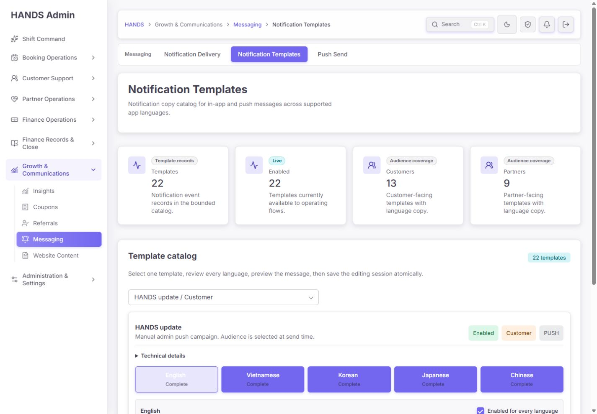
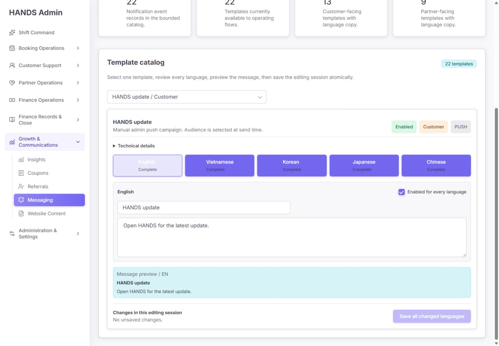
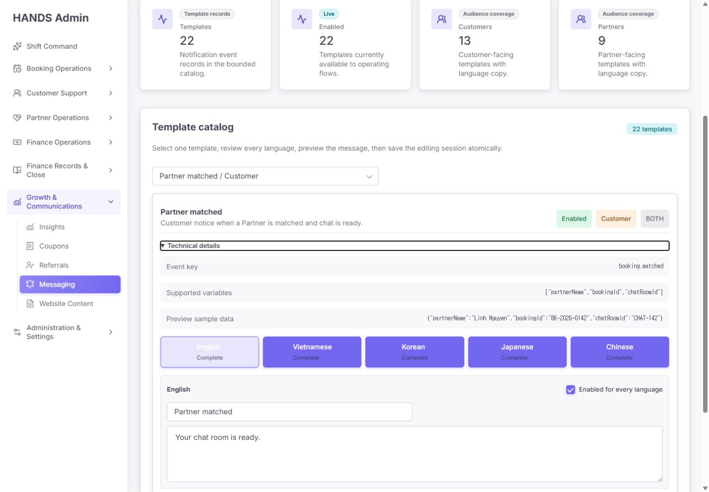
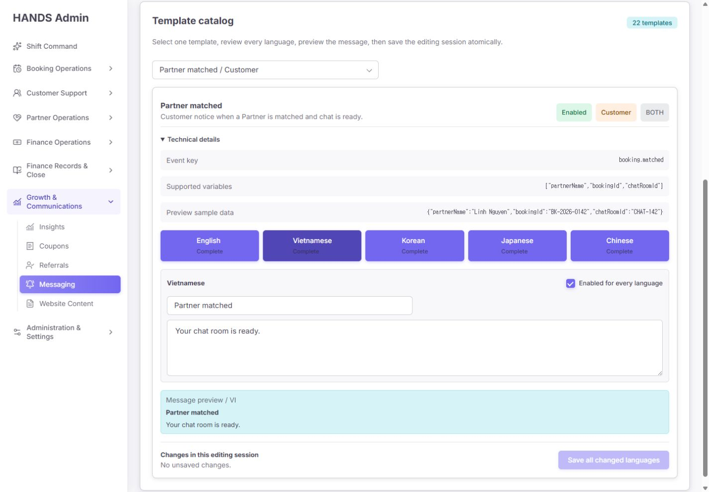
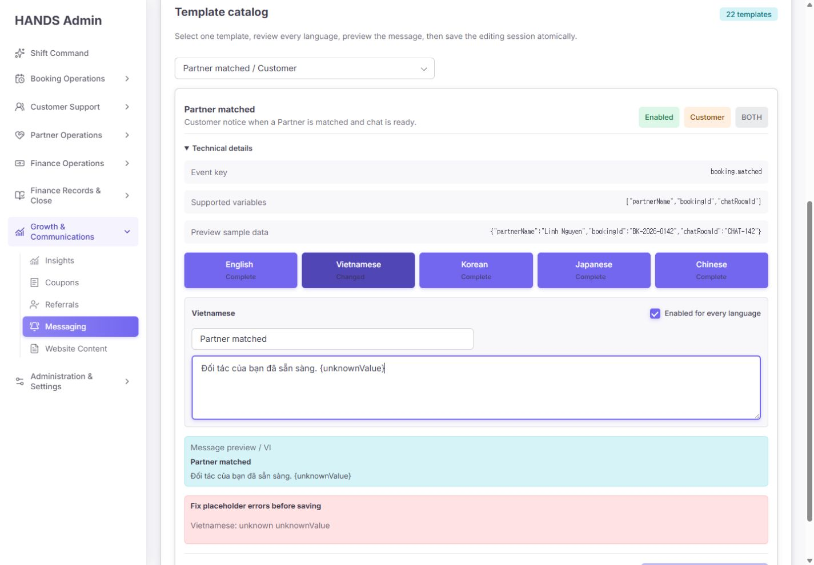
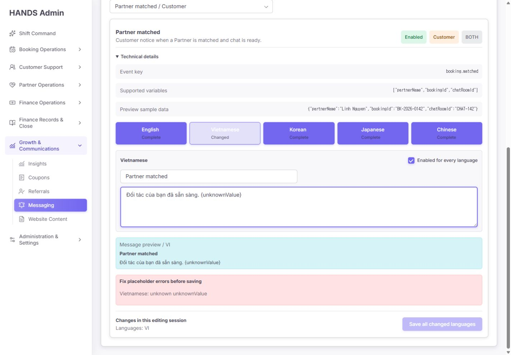
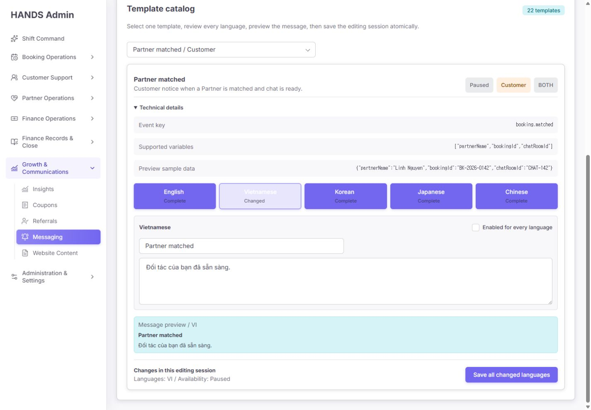
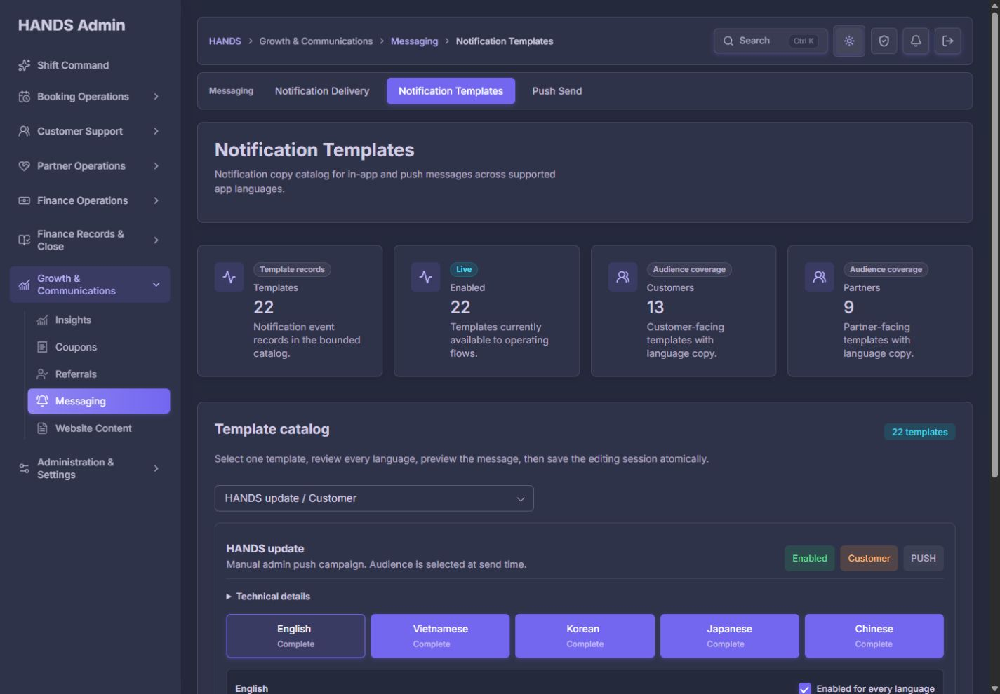
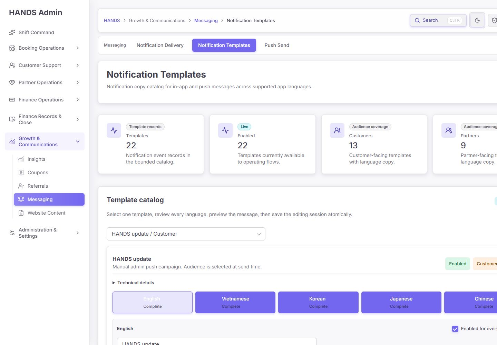

# Notification Templates 최종 재감사 보고서

- 감사 대상: `http://localhost:3101/notifications/templates`
- 감사일: 2026-08-12 (Asia/Ho_Chi_Minh)
- 화면 기준: 1440px 이상 데스크톱만 검사
- 제외 범위: 1024px 이하 화면, 모바일·태블릿 반응형
- 감사 방식: 로그인된 실제 화면 캡처, 키보드 조작, DOM·스타일 확인, API/웹 소스 추적, 로컬 데이터베이스 집계 조회, 관련 테스트 실행
- 변경 범위: 감사 및 보고서 작성만 수행. 템플릿 저장, 알림 발송, 애플리케이션 코드 수정 없음

## 1. 최종 판정

**48/100 — 출시 차단(Release blocked)**

이전 보고서의 핵심 UI 방향은 상당 부분 제대로 구현됐다. 특히 다음은 명확한 개선이다.

- 한 템플릿을 선택하고 5개 언어를 탭으로 편집하는 구조
- 변경 언어를 한 번에 저장하는 원자적 저장 흐름
- 기술 정보 기본 접기
- 지원하지 않는 변수와 필수 변수 누락의 저장 전 검증
- 변경 요약과 저장 버튼 비활성화
- 저장하지 않은 상태에서의 이탈 경고
- 1440px·1600px에서 가로 페이지 넘침 없음
- 라이트·다크 테마 모두 레이아웃 붕괴 없음
- API의 템플릿 키·언어·문구 길이·변수 검증 및 감사 로그

그러나 현재 페이지는 **편집 화면의 모양은 좋아졌지만, 실제로 어떤 문구가 누구에게 발송되는지에 대한 운영 신뢰성이 확보되지 않았다.** 다음 네 건은 출시 전에 반드시 해결해야 한다.

1. 베트남어·한국어·일본어·중국어 88개 문구가 모두 영어인데 UI는 `Complete`로 표시한다.
2. 템플릿 조회가 대상 역할을 보지 않고 `notification.type`만 사용해 고객 문구가 파트너에게 적용될 수 있다. 동시에 실제 발송 경로와 연결되지 않은 템플릿도 있다.
3. `{partnerName}`을 요구하는 템플릿과 실제 발송 데이터 계약이 맞지 않아 치환되지 않은 변수가 그대로 남을 수 있다.
4. UI의 `Paused`는 알림 발송 중지를 의미하지 않는다. 템플릿 적용만 건너뛰고 코드 기본 문구로 계속 발송된다.

운영자가 화면을 믿고 문구를 수정하거나 일시정지했을 때 기대한 결과와 실제 발송 결과가 달라질 수 있으므로, 이 네 항목을 해결하기 전에는 운영용 템플릿 관리 화면으로 승인하면 안 된다.

## 2. 점수표

| 평가 영역 | 점수 | 판정 | 핵심 이유 |
|---|---:|---|---|
| 발송·데이터 정확성 | 6/25 | 실패 | 다국어 허위 완료, 역할별 잘못된 템플릿 매핑, 미치환 변수 |
| 작업 안전성과 복구성 | 10/20 | 주의 | 원자 저장·검증은 좋으나 `Paused` 의미 오류, 동시 수정 방지와 오류 복구 부족 |
| 정보구조·운영 문구 | 10/15 | 보완 | 단일 편집 흐름은 좋아졌으나 행동 필요 템플릿을 찾기 어렵고 지표가 중복됨 |
| 접근성 | 6/15 | 실패 | 언어 탭 대비 부족, 화살표 키 미지원, 탭 연결 속성·roving tabindex 없음 |
| 시각 완성도·테마 | 11/15 | 양호 | 1440+ 배치와 다크 테마는 안정적이나 핵심 편집 영역이 첫 화면 아래로 밀림 |
| 성능·구현 건전성 | 5/10 | 보완 | 체감 속도는 양호하나 조회 GET이 DB를 쓰고 모든 `updatedAt`을 오염시킴 |
| **총점** | **48/100** | **출시 차단** | UI 구조 개선보다 발송 계약과 운영 진실성 수정이 우선 |

## 3. 감사 범위와 증거 제한

- 브라우저 감사는 `MASTER_ADMIN` 로그인 상태에서 수행했다.
- 1440×1000 라이트·다크, 1600×1000 라이트 화면을 확인했다.
- 테스트 중 입력한 문구와 `Paused` 상태는 저장하지 않고 복구했다.
- 실제 푸시 또는 인앱 알림은 발송하지 않았다.
- 로컬 DB 조회는 수량·타입·문구 패턴만 집계했고 수신자 개인정보는 수집하지 않았다.
- 로컬 DB에는 과거·레거시·비운영 데이터가 섞여 있을 수 있으므로 DB 수량을 실제 운영 장애 건수로 해석하면 안 된다. 다만 같은 결함이 소스 코드에서도 확인되어 계약 결함 자체는 확정적이다.
- 저장 실패 알림 URL을 별도로 캡처하기 전 브라우저 세션이 만료됐다. 오류 시 redirect와 초안 유실 문제는 웹 액션 소스 및 테스트 구조로 확인했다.
- 전체 WCAG 적합성을 선언하지 않는다. 이번에는 언어 탭의 실제 색상 대비와 키보드 동작을 집중 검사했다.

## 4. 화면 단계별 재감사

### 단계 1 — 기본 진입 화면: 주의

좋아진 점:

- 페이지 목적과 템플릿 수가 즉시 보인다.
- 선택된 템플릿의 대상, 채널, 설명을 편집 전에 확인할 수 있다.
- 기술 키와 JSON이 기본 화면을 방해하지 않는다.

남은 문제:

- `Templates 22`, `Enabled 22`, `Customers 13`, `Partners 9` 네 카드가 큰 공간을 차지한다. 현재는 `Enabled = Templates`, `Customers + Partners = Templates`라서 운영 판단 정보가 중복된다.
- 1440×1000에서 실제 제목·메시지 입력 필드가 첫 화면 아래로 밀린다. 반복 업무에서 매번 스크롤해야 한다.
- 운영자에게 필요한 값은 전체 개수보다 `번역 필요`, `검수 필요`, `발송 매핑 오류`, `템플릿 적용 중지`이다.
- 기본 선택인 `admin.push.broadcast`는 실제 수동 발송에서 템플릿 해석이 꺼져 있어 편집 결과가 사용되지 않는다. 가장 먼저 보여줄 항목으로 부적합하다.

권장 수정:

- 네 KPI 카드를 한 줄짜리 상태 도구막대로 축소한다.
- 상태 도구막대는 `번역 필요`, `검수 필요`, `연결 오류`, `카탈로그 문구 미사용`, `마지막 실제 변경`만 표시한다.
- 기본 선택은 첫 번째 `조치 필요` 템플릿으로 한다. 조치 항목이 없을 때만 최근 편집 템플릿을 연다.

### 단계 2 — 언어 편집과 한 번에 저장: 조건부 통과

통과한 부분:

- 언어별 별도 저장 버튼이 사라지고 한 편집 세션에서 변경 언어를 모아 저장한다.
- 제목 120자, 본문 500자 제한이 웹과 API 양쪽에 있다.
- 현재 언어, 미리보기, 변경 요약, 저장 버튼의 순서가 자연스럽다.
- 변경이 없으면 저장할 수 없고, 변경 언어가 요약된다.

보완할 부분:

- 현재 선택 템플릿·언어가 클라이언트에서 바뀌어도 URL은 바뀌지 않는다. 새로고침, 북마크, 뒤로가기, 동료에게 링크 공유 시 현재 작업 문맥을 잃는다.
- 제목·본문의 현재 글자 수가 보이지 않는다.
- 저장 요약은 `VI 변경` 수준이며 실제 이전/이후 문구를 보여주지 않는다.

권장 수정:

- 선택 시 `?template=...&locale=...`를 `router.replace`로 동기화한다.
- `32 / 120`, `118 / 500` 문자 수를 각 입력 하단에 표시한다.
- 저장 직전 변경 요약을 언어별 필드 diff로 제공한다. 짧은 문구이므로 전문 diff 도구까지는 필요 없다.

### 단계 3 — 기술 정보: 주의

좋아진 점:

- 일반 운영 흐름에서는 접혀 있다.
- event key, 지원 변수, 미리보기 샘플을 한곳에서 확인할 수 있다.

남은 문제:

- 지원 변수와 샘플 데이터가 원시 JSON 배열·객체다.
- 각 변수가 어떤 값인지, 필수인지, 어느 화면으로 연결되는지 설명이 없다.
- 문구 입력 중 변수를 클릭해 삽입할 수 없다.
- `BOTH`는 개발 용어처럼 보이며 실제 의미가 바로 전달되지 않는다.

권장 수정:

- `BOTH`를 `Push + in-app`으로 표시한다. DB enum은 바꾸지 않아도 된다.
- 변수는 `파트너 이름 · 필수 · 예: Mai`, `부킹 ID · 시스템 연결용`처럼 칩과 설명으로 제공한다.
- 변수 칩 클릭 시 커서 위치에 `{partnerName}`을 삽입한다.
- event key는 `고급 정보` 안에 유지하되 복사 버튼을 추가한다.

### 단계 4 — 베트남어 상태 확인: 실패

베트남어 탭에는 `Partner matched`, `Your chat room is ready.`라는 영어 문구가 있고 상태는 `Complete`다. 로컬 DB 전체 집계 결과도 동일하다.

| 언어 | 영어와 제목·본문이 완전히 같은 행 | 전체 템플릿 |
|---|---:|---:|
| 베트남어 | 22 | 22 |
| 한국어 | 22 | 22 |
| 일본어 | 22 | 22 |
| 중국어 | 22 | 22 |

원인은 `ensureDefaultNotificationTemplates()`가 모든 언어에 영어 기본 문구를 넣는 구조이고, UI는 제목과 본문이 비어 있지 않기만 하면 `Complete`로 판단하기 때문이다.

권장 상태 모델:

- `Missing`: 문구 없음
- `Source copied`: 영어 원문이 그대로 복사된 초기 상태
- `Needs translation`: 번역 필요
- `Needs review`: 번역됐으나 운영 검수 전
- `Ready`: 검수자와 검수 시간이 기록된 발송 가능 상태

`Complete`라는 단어를 단순히 `Ready`로 바꾸는 것은 해결이 아니다. 준비 상태를 판정할 실제 데이터가 필요하다. 한 명이 운영하더라도 `검수 완료` 체크와 `검수 시각` 정도의 최소 거버넌스는 필요하다.

### 단계 5 — 언어 탭 키보드·대비: 실패

증거 화면은 단계 4와 같고, DOM·키보드 결과는 [05-keyboard-tab-state.json](./notification-templates-final-reaudit-evidence-2026-08-12/05-keyboard-tab-state.json)에 기록했다.

확인 결과:

- 선택된 베트남어 탭에서 `ArrowRight`를 눌러도 한국어 탭으로 이동하지 않는다.
- 모든 탭이 각각 Tab 순서에 들어간다. 표준 tablist의 roving tabindex 패턴이 아니다.
- 탭에 `id`, `aria-controls`, `aria-labelledby` 연결이 없다.
- 선택 탭과 비선택 탭의 시각 강조가 역전돼 보인다.
- 실측 대비는 다음과 같다.

| 텍스트 조합 | 대비 | 기준 | 판정 |
|---|---:|---:|---|
| 흰색 일반 글자 / 보라색 | 4.26:1 | 4.5:1 | 실패 |
| 흰색 일반 글자 / 연한 선택 배경 | 1.29:1 | 4.5:1 | 심각한 실패 |
| 작은 muted 글자 / 보라색 | 2.29:1 | 4.5:1 | 실패 |
| 작은 muted 글자 / 연한 선택 배경 | 4.63:1 | 4.5:1 | 통과 |

권장 수정:

- 선택 탭은 충분히 진한 배경+흰 글자 또는 연한 배경+진한 글자로 통일한다.
- 선택 탭만 `tabIndex=0`, 나머지는 `-1`로 한다.
- 좌우 화살표, Home, End 키를 지원한다.
- 각 탭과 tabpanel을 `aria-controls`/`aria-labelledby`로 연결한다.
- 접근성 테스트에 키보드 이동과 계산 스타일 대비를 포함한다.

### 단계 6 — 변수 검증: 통과

- `{unknownValue}` 입력 시 언어를 명시한 오류가 즉시 보인다.
- 오류가 있는 동안 저장 버튼이 비활성화된다.
- API도 허용 변수와 필수 변수 누락을 다시 검증한다.
- 변경 요약이 현재 세션의 변경 언어를 알려준다.

이 부분은 이전 감사 요구를 제대로 반영했다. 다만 편집기 검증만으로는 충분하지 않다. 발송 호출자가 필수 변수 데이터를 실제로 제공하는지도 계약 테스트해야 한다.

### 단계 7 — 템플릿 일시정지: 실패

화면에서는 체크를 해제하면 `Paused`, `Availability: Paused`로 표현된다. 운영자는 해당 알림이 중지된다고 이해한다. 그러나 API는 비활성 템플릿일 때 코드에서 전달한 기본 제목·본문으로 되돌아가며 알림 생성과 발송을 계속한다.

즉 현재 체크박스의 실제 의미는 `발송 중지`가 아니라 **`관리자 카탈로그 문구 사용 중지`**다.

권장 방안은 둘 중 하나다.

1. 이 페이지에서는 토글을 제거하고 문구 편집만 제공한다.
2. 토글을 유지한다면 `Use catalog copy`로 이름을 바꾸고, 끄면 `코드 기본 문구로 계속 발송됩니다`를 바로 아래에 표시한다.

실제 알림 발송 중지는 별도 `Notification Delivery Policy`에서 대상·채널·기간·영향 수신자·사유·복구 시각을 확인하고 실행해야 한다. 문구 편집 화면의 작은 체크박스에 배치하면 안 된다.

### 단계 8 — 다크 테마: 통과

- 카드·폼·본문 배경의 계층이 유지된다.
- 주요 텍스트, 테두리, 컨트롤이 식별 가능하다.
- 레이아웃 붕괴나 가로 넘침은 없다.

언어 탭의 선택 상태 대비 문제는 라이트·다크 공통 컴포넌트 문제로 별도 수정해야 한다.

### 단계 9 — 1600px 데스크톱 배치: 통과

- 브라우저 내부 폭 1600px에서 문서 scrollWidth는 1585px로 페이지 수준 가로 넘침이 없다.
- 편집 영역은 약 1227px로 충분하다.
- 넓어진 공간이 자연스럽게 본문 폭으로 사용된다.

이번 보고서는 사용자 요구에 따라 1024px 이하 레이아웃을 검사·평가하지 않았다.

## 5. 출시 차단 상세 결함

### P0-1. 모든 비영어 문구가 영어인데 `Complete`로 표시됨

근거:

- `apps/api/src/admin/admin.service.ts:32363-32393`: 다섯 언어 모두에 영어 `template.title/body`를 초기 생성한다.
- `apps/admin_web/app/notifications/templates/notification-template-editor.tsx:184-199`: 제목과 본문이 비어 있지 않으면 `Complete`다.
- DB 증거: [14-database-translation-integrity.json](./notification-templates-final-reaudit-evidence-2026-08-12/14-database-translation-integrity.json)

운영 영향:

- 운영자는 다섯 언어 준비가 끝났다고 오판한다.
- 기기 언어가 vi/ko/ja/zh인 사용자에게 영어 문구가 선택될 수 있다.
- 번역 누락을 카탈로그 화면에서 찾을 방법이 없다.

필수 수정:

- 기존 88개 비영어 행을 `Needs translation`로 마이그레이션한다.
- 번역 준비 상태와 검수 메타데이터를 데이터 모델에 추가한다.
- `Ready`인 언어만 현지화 문구로 사용한다. 준비 전에는 명시적인 영어 fallback과 진단 로그를 사용한다.
- 자동 번역 결과를 검수 없이 `Ready`로 만들지 않는다.

### P0-2. 발송 타입과 대상 역할별 템플릿 매핑이 깨짐

근거:

- `apps/api/src/notifications/notifications.service.ts:266-297`: 템플릿을 `{ key: input.type }`으로만 찾고 `targetRole`을 사용하지 않는다.
- `booking.matched.partner` 템플릿은 존재하지만 고객·파트너 모두 `booking.matched`를 발행한다.
- `service.started.partner` 템플릿은 존재하지만 고객·파트너 모두 `service.started`를 발행한다.
- 카탈로그의 `chat.message`와 실제 발행 타입 `chat.message.created`가 다르다.
- `admin.push.broadcast`는 카탈로그에 있으나 수동 푸시는 `resolveTemplate: false`로 발송한다.
- DB 보조 증거: [15-database-template-routing-evidence.json](./notification-templates-final-reaudit-evidence-2026-08-12/15-database-template-routing-evidence.json)

운영 영향:

- 파트너가 고객 관점 문구를 받을 수 있다.
- 운영자가 수정해도 아무 발송에도 사용되지 않는 죽은 템플릿이 화면에 노출된다.
- 반대로 실제 발송 타입은 편집할 카탈로그 항목이 없을 수 있다.

필수 수정:

- 앱이 의존하는 기존 `notification.type`을 임의로 변경하지 않는다.
- 별도 `templateKey` 또는 명시적 `(eventType, targetRole) -> templateKey` 매핑을 도입한다.
- 모든 실제 발송 `(type, targetRole)` 조합이 정확히 한 템플릿으로 연결되어야 한다.
- 모든 카탈로그 템플릿은 최소 한 개 실제 발송 경로에서 사용되어야 한다.
- `admin.push.broadcast`는 수동 발송 전용 문구로 실제 연결하거나 이 카탈로그에서 제거하고 `Push Send` 화면으로 안내한다.

### P0-3. 필수 변수와 발송 payload 계약 불일치

근거:

- `provider.joined`, `provider.accepted`, `provider.rejected` 템플릿은 `{partnerName}`을 요구한다.
- `apps/api/src/bookings/bookings.notifications.ts:90-102,183-210`은 `providerProfileId`만 data에 넣고 `partnerName`을 넣지 않는다.
- `apps/api/src/notifications/notifications.service.ts:373-382`는 값이 없으면 `{partnerName}` 원문을 그대로 남긴다.
- 로컬 DB에는 해당 literal이 남은 집계 453건이 있다. 이 숫자는 레거시·비운영 데이터일 수 있으나 코드 계약 결함과 방향이 일치한다.

운영 영향:

- 사용자에게 `{partnerName}`이 그대로 보일 수 있다.
- 편집 화면은 템플릿 문법만 검증하므로 발송 payload 누락을 잡지 못한다.

필수 수정:

- 해당 발송 helper data에 `partnerName: input.provider.displayName`을 추가한다.
- 카탈로그 정의와 모든 호출자의 data를 비교하는 계약 테스트를 추가한다.
- 렌더 후 `{...}`가 남으면 전송·저장하지 않고 안전한 기본 문구로 fallback하며 구조화된 진단 이벤트를 남긴다.
- 조용히 literal을 발송하는 동작은 허용하지 않는다.

### P0-4. `Paused`가 실제 발송 중지를 의미하지 않음

근거:

- UI: `Notification template enabled`, `Enabled for every language`, `Availability: Paused`.
- API: 비활성 템플릿이면 호출자가 준 `input.title/body`를 반환하고 이후 알림 생성·발송을 계속한다.

필수 수정:

- 카탈로그 문구 적용 여부와 실제 발송 정책을 분리한다.
- 현재 의미를 유지한다면 `Use catalog copy` / `Code fallback copy is still sent`로 정확히 고친다.
- 진짜 발송 중지는 별도 정책 화면에서 처리하고 영향·사유·확인·감사 로그를 요구한다.

## 6. 높은 우선순위 보완 사항

### P1-1. 목록 GET 요청이 DB를 수정함

- `listNotificationTemplates()`는 조회 전에 `ensureDefaultNotificationTemplates()`를 호출한다.
- 이 함수는 22회 upsert와 22회 translation `createMany`를 순차 실행한다.
- Prisma의 `updatedAt @updatedAt` 때문에 화면 조회만 해도 모든 템플릿의 수정 시간이 갱신된다.
- 실제 재로드 후 22개가 142ms 구간에서 모두 갱신됐다: [16-database-updated-at-after-read.json](./notification-templates-final-reaudit-evidence-2026-08-12/16-database-updated-at-after-read.json)

영향:

- `마지막 변경`이 운영자 수정 이력이 아니라 화면 조회 시각이 된다.
- 변경 감지, 동시 수정 방지, 감사 증거가 신뢰할 수 없게 된다.
- 현재 22개라서 체감은 빠르지만 카탈로그가 커질수록 불필요한 DB 쓰기가 늘어난다.

수정:

- 기본 템플릿 생성은 migration 또는 명시적 bootstrap으로 이동한다.
- GET은 완전한 read-only로 만든다.
- 누락 정의를 찾는 health check는 읽기 전용으로 제공한다.

### P1-2. 동시 수정 덮어쓰기 방지 없음

- 업데이트 DTO에는 `expectedUpdatedAt`이나 revision이 없다.
- 저장 전 조회 후 unconditional update/upsert를 실행한다.
- 두 탭 또는 두 운영자가 같은 언어를 수정하면 마지막 저장이 앞선 변경을 덮어쓸 수 있다.

수정:

- 템플릿 또는 번역별 revision을 반환한다.
- PATCH에 `expectedRevision`을 요구한다.
- 불일치 시 409를 반환하고 서버 최신본과 내 초안을 비교해 선택하게 한다.

### P1-3. 저장 실패 시 초안 유실 및 원인 은폐

- `apps/admin_web/app/notifications/templates/actions.ts:14-28`은 모든 오류를 잡아 `?notice=failed`로 redirect한다.
- redirect로 클라이언트 초안이 사라진다.
- 권한, 네트워크, 충돌, 검증 오류가 모두 `Check required fields and try again`으로 합쳐진다.

수정:

- `useActionState` 또는 동등한 in-place 결과 처리를 사용해 초안을 유지한다.
- 400/403/409/5xx를 운영 문구로 구분한다.
- 실패 시 재시도와 초안 복사를 제공한다.
- 성공 메시지는 raw key 대신 사람이 읽는 템플릿 이름을 사용한다. audit log에는 key를 유지한다.

### P1-4. API 실패가 정상 빈 상태처럼 보임

- 페이지는 `adminGet(..., [])`로 오류를 빈 배열로 바꾼다.
- API 장애와 진짜 템플릿 0건이 모두 `No notification templates are available`로 보일 수 있다.

수정:

- load error, empty catalog, permission denied를 서로 다른 상태로 표시한다.
- 현재 시스템에서 기본 정의가 22개이므로 0건은 정상 empty가 아니라 운영 장애로 취급한다.

### P1-5. 실제 채널 미리보기가 아님

- 현재 미리보기는 일반 텍스트 블록이다.
- Push 제목·본문 자르기, 인앱 표시, 줄바꿈, 클릭 목적지, OS별 차이를 판단할 수 없다.

수정:

- `Push`와 `In-app` 두 탭으로 실제 최대 폭과 자르기 규칙을 재현한다.
- 채널에 해당하지 않으면 해당 미리보기는 숨긴다.
- 목적지와 샘플 변수 적용 결과, 문자 수를 함께 표시한다.

## 7. 운영자 중심 권장 화면 구조

1440px 이상 기준으로 다음 순서가 가장 효율적이다.

1. **상단 제목 + compact readiness bar**
   - 번역 필요
   - 검수 필요
   - 발송 매핑 오류
   - 카탈로그 문구 미사용
   - 마지막 실제 변경
2. **좌측 320~360px searchable catalog / 우측 편집기**
   - 검색: 사용자에게 보이는 제목, 설명, event key
   - 필터: 대상, 채널, 준비 상태, 변경자
   - 그룹: Booking, Service, Chat, Payment, Admin broadcast
   - 각 행: 친화적 이름, 대상, 채널, 언어 준비 `1/5`, 상태
3. **우측 편집 헤더**
   - 템플릿 이름
   - Customer/Partner
   - Push + in-app
   - 실제 연결된 발송 이벤트
   - 최근 실제 편집자·시각
4. **언어 탭**
   - Missing / Needs translation / Needs review / Ready
   - 키보드 접근 가능한 tablist
5. **제목·메시지 + 변수 삽입 + 문자 수**
6. **실제 Push / In-app 미리보기**
7. **변경 전후 요약 + 변경 사유 + 한 번에 저장**

템플릿 수가 22개뿐이므로 복잡한 번역 워크플로 엔진은 필요 없다. 검색 가능한 카탈로그, 명확한 준비 상태, 한 번의 검수 체크, revision 충돌 방지면 충분하다.

## 8. 구현 우선순위

### 1차 — 출시 차단 해소

1. `(notification.type, targetRole)` 발송 매핑 표를 코드로 만든다.
2. 죽은 템플릿과 실제 타입 불일치를 제거한다.
3. `{partnerName}` 등 필수 변수 payload를 맞추고 미치환 변수 전송을 차단한다.
4. 88개 비영어 문구를 `Needs translation`로 전환한다.
5. 준비되지 않은 번역은 현지화 문구로 선택하지 않는다.
6. `Paused` 의미를 실제 동작과 일치시킨다.

### 2차 — 데이터 신뢰성과 작업 안전

1. GET에서 기본 템플릿 upsert를 제거한다.
2. migration/bootstrap과 read-only health check를 추가한다.
3. revision 기반 409 충돌 방지를 추가한다.
4. 저장 실패를 in-place로 처리해 초안을 보존한다.
5. load error와 empty state를 분리한다.

### 3차 — 운영 효율과 접근성

1. 중복 KPI를 readiness bar로 교체한다.
2. 템플릿 검색·필터·그룹·상태를 추가한다.
3. 언어 탭 대비와 키보드 패턴을 수정한다.
4. 실제 채널 미리보기, 문자 수, 변수 삽입을 추가한다.
5. URL에 template·locale 문맥을 동기화한다.

## 9. Codex 구현 시 금지 사항

- `Complete` 문구만 `Ready`로 바꾸고 상태 데이터는 그대로 두지 말 것.
- 영어 원문을 5개 언어에 복사해 빈 칸을 채우지 말 것.
- 기계 번역 결과를 검수 없이 발송 가능 처리하지 말 것.
- 모바일 앱이 사용하는 notification type을 영향 분석 없이 일괄 rename하지 말 것.
- 죽은 템플릿을 UI에서만 숨겨 계약 문제를 은폐하지 말 것.
- GET에서 upsert를 유지한 채 캐시만 추가하지 말 것.
- `Paused`를 실제 발송 중지처럼 계속 표현하지 말 것.
- 소규모 운영에 불필요한 승인 조직·워크플로 엔진을 만들지 말 것.
- 1024px 이하 반응형 작업을 이번 개선 범위에 넣지 말 것.

## 10. 필수 수용 기준

### 발송 계약

- [ ] 모든 실제 `(type, targetRole)` 조합은 정확히 한 templateKey로 연결된다.
- [ ] 모든 카탈로그 템플릿은 실제 발송 경로 또는 명확한 수동 발송 경로가 있다.
- [ ] `booking.matched` 고객·파트너 문구가 각 대상에 맞게 선택된다.
- [ ] `service.started` 고객·파트너 문구가 각 대상에 맞게 선택된다.
- [ ] 실제 `chat.message.created`가 편집 가능한 템플릿과 연결된다.
- [ ] 렌더 후 미치환 `{...}`가 남은 알림은 저장·발송되지 않는다.

### 번역 상태

- [ ] vi/ko/ja/zh 영어 복사본 88개는 `Complete/Ready`로 표시되지 않는다.
- [ ] 각 언어에는 최소 `Needs translation`, `Needs review`, `Ready`가 기록된다.
- [ ] `Ready`가 아닌 현지 언어는 명시된 fallback 정책을 따른다.
- [ ] 화면에 언어별 준비 수와 조치 필요 템플릿 수가 보인다.

### 작업 안전

- [ ] 목록 GET은 DB write를 0회 수행하고 `updatedAt`을 변경하지 않는다.
- [ ] 두 탭에서 같은 번역을 수정하면 두 번째 저장은 409 conflict가 된다.
- [ ] 저장 실패 후 입력 초안이 유지된다.
- [ ] 오류 문구가 검증/권한/충돌/서버 오류를 구분한다.
- [ ] 카탈로그 문구 비활성과 실제 발송 중지가 명확히 분리된다.

### 접근성과 1440+ 화면

- [ ] 선택·비선택 언어 탭의 일반·작은 글자가 4.5:1 이상이다.
- [ ] 언어 탭이 ArrowLeft/Right, Home, End를 지원한다.
- [ ] tab/tabpanel에 roving tabindex와 ARIA 연결이 있다.
- [ ] 1440×900 이상에서 핵심 편집 필드가 불필요한 KPI 카드 때문에 밀리지 않는다.
- [ ] 1440px와 1600px에서 페이지 수준 가로 넘침이 없다.

## 11. 실행 검증 결과

| 검증 | 결과 |
|---|---|
| Admin template page/actions 집중 테스트 | 통과 — 2 files, 10 tests |
| API template catalog 테스트 | 통과 — 1 file, 2 tests |
| API admin service `notification template` 집중 테스트 | 통과 — 2 passed, 644 skipped |
| API notification service `template` 집중 테스트 | 통과 — 2 passed, 13 skipped |
| Admin operator access model 전체 테스트 | 통과 — 1 file, 5 tests |
| Admin TypeScript typecheck | 통과 |
| API TypeScript typecheck | 통과 |
| 관련 파일 ESLint | 통과 |
| 1440+ 콘솔 warning/error | 0건 — [13-console-warnings-errors.json](./notification-templates-final-reaudit-evidence-2026-08-12/13-console-warnings-errors.json) |
| warm route reload | 461~491ms — [09-route-reload-timings.json](./notification-templates-final-reaudit-evidence-2026-08-12/09-route-reload-timings.json) |

현재 테스트는 구현된 원자 저장과 입력 검증을 잘 보호하지만, 다음 계약을 아직 검증하지 않는다.

- 발송 타입·대상 역할별 템플릿 도달성
- 호출 payload와 필수 placeholder의 일치
- 미치환 placeholder 발송 차단
- 비영어 문구의 실제 번역 준비 상태
- GET 무쓰기와 `updatedAt` 안정성
- revision 충돌
- 언어 탭 키보드 동작과 대비
- 저장 실패 시 초안 유지

## 12. 최종 결론

이번 수정은 **편집 UX 리팩터링 자체는 성공적**이다. 이전의 원시 JSON 중심 화면에서 운영자가 한 템플릿의 다섯 언어를 검토하고 한 번에 저장하는 화면으로 확실히 발전했다. 시각적 완성도, 다크 테마, 입력 검증, 변경 요약도 좋은 수준이다.

다만 현재 가장 위험한 문제는 디자인이 아니라 **화면이 보여주는 사실과 실제 발송 계약이 다르다는 점**이다. 운영자는 `Complete`, `Paused`, 대상 배지를 신뢰할 수 있어야 한다. 지금은 세 단어 모두 실제 상태를 정확히 보장하지 못한다.

따라서 다음 개발은 레이아웃 미세 조정보다 먼저 `발송 타입 × 대상 역할 × templateKey × 필수 변수 × 언어 준비 상태`의 단일 계약을 확립해야 한다. 그 계약이 테스트로 고정되고, GET 쓰기·동시 저장·실패 복구가 정리된 뒤에야 이 페이지를 출시 가능한 운영 도구로 평가할 수 있다.
