# Notification Delivery 최종 재감사 보고서

- 감사 대상: `http://localhost:3101/notifications`
- 감사 일자: 2026-08-12 (Asia/Bangkok)
- 감사 기준: 실제 운영자 관점, 데스크톱 1440px 이상
- 확인 화면: 1440 × 1000, 1600 × 1000, 라이트/다크 테마
- 제외 범위: 1024px 이하 화면과 모바일·태블릿 반응형은 요청에 따라 검사·평가·권고에서 완전히 제외
- 감사 방식: 2026-08-10 재감사 보고서와 최종 개선 프롬프트 대조, 로그인된 인앱 브라우저 실화면 캡처, 읽기 전용 상호작용, 프런트/API/쿼리/권한/감사 로그 코드 추적, 집중 테스트 및 타입 검사
- 안전 경계: `Mark reviewed` 확인 화면까지만 열었고 저장하지 않았으며, 실제 notification retry·push send·데이터 변경은 실행하지 않음

## 1. 최종 판정

**운영 승인 보류 — 69/100**

이전 보고서의 핵심 방향은 실제로 상당 부분 반영됐다. 특히 다음은 명확한 개선이다.

- 현재 24시간과 24시간 이상 부채를 기본 화면에서 동시에 보여 준다.
- `No new delivery issues in the last 24 hours`처럼 정상 문구의 범위를 제한했다.
- 서버가 retry failure class와 복구 근거를 다시 검사하고, 영구·설정 오류를 차단한다.
- Production / Unknown source / Synthetic을 화면에서 분리했다.
- 행 액션 메뉴가 `Esc`로 닫히고 포커스가 trigger로 돌아온다.
- Admin system legacy alert에 `Mark reviewed`와 감사 사유 확인 절차가 생겼다.
- 레코드 모드는 경량 summary 경로를 사용해 이번 관찰에서는 빠르게 열렸다.

그러나 현재 화면을 운영의 단일 진실 공급원으로 승인할 수 없는 새로운 핵심 결함도 확인됐다.

1. **데이터 범위 계약이 UI·Prisma 목록·raw SQL 건강 집계 사이에서 다르다.** `Unknown source records · 0`이라고 표시되는 같은 화면에서 `4 current · 2,477 history`를 보여 준다. Unknown delivery records는 0건인데 Unknown action queue에는 수만 건이 존재한다.
2. **Notification 생성 경로가 authoritative data scope를 일관되게 기록하지 않는다.** 중앙 `NotificationsService.persist()`만 runtime scope를 붙이고, 7개의 직접 `notification.create()` 호출 경로는 이를 우회한다. 운영 환경에서도 새 레코드가 Unknown에 계속 들어갈 수 있다.
3. **실패 그룹 딥링크가 일부 provider에서 깨졌다.** 화면이 직접 생성한 `FCM_HTTP_V1`·`ONESIGNAL` 링크를 프런트와 API allowlist가 거부한다. Unknown source 컨텍스트도 링크에서 빠진다.
4. **`4 current · 2,477 history`는 유효한 합계가 아니다.** 실패 그룹 수, 실패 notification 수, 미시도 notification 수, 경로 없는 recipient 수를 더하고 중복도 허용한 값이다. 단위가 다른 값을 하나의 상태 숫자로 보여 준다.
5. **1440px에서도 핵심 표가 실제로 잘린다.** table viewport는 1002px인데 table min-width는 1080px이다. 액션 메뉴를 열면 컨테이너가 오른쪽으로 이동하면서 첫 열이 잘린다.
6. **히스토리 lifecycle은 여전히 읽기 전용이다.** 화면이 한계를 솔직히 설명하는 점은 좋지만, 24h+ 부채를 검토·수락·종결하는 운영 상태가 없다.
7. **Unknown action 경로는 여전히 2.2~2.9초대다.** records 모드는 빨라졌지만 action summary의 광범위한 집계 비용은 남았다.
8. **공식 retry audit contract 검사가 실패한다.** 새 Audit Log drawer로 구조가 바뀌었지만 검증 스크립트가 이전 소비자 계약을 계속 요구한다. 출시 검증 체계와 현재 UI가 동기화되지 않았다.

즉, **보이는 구조와 retry 안전성은 좋아졌지만 데이터 진실성, self-generated navigation, 1440 표 계약을 먼저 고쳐야 한다.** 이 세 영역이 해결되기 전에는 Production 탭의 0건이나 Unknown 탭의 집계를 운영 판단에 사용하면 안 된다.

## 2. 점수표

| 평가 영역 | 점수 | 판단 |
|---|---:|---|
| 상태·집계 정확성 | 56 | current/history 분리는 좋지만 data-scope 모순과 혼합 단위 합계가 심각함 |
| 액션·retry 안전성 | 88 | API gate, cooldown, route recovery, dedupe, 사유·감사 순서가 양호함 |
| 운영 업무 완결성 | 62 | 확인·조회는 가능하나 history 종결과 일부 장애 그룹 drill-down이 불가능함 |
| 정보 구조·인지 부하 | 72 | 구조는 명확해졌지만 지표와 issue selector가 반복되고 실제 큐가 아래로 밀림 |
| 1440+ 시각 완성도 | 66 | 카드·테마는 안정적이나 표 clipping, 코드 개행, 과도한 세로 공간이 남음 |
| 접근성·키보드 | 82 | skip link, ARIA, focus, Esc가 개선됨. blocked reason은 title에만 있어 불충분 |
| 성능 | 58 | records는 빠르지만 Unknown action/history가 2초 후반으로 유지됨 |
| 테스트·운영 검증 | 70 | focused tests/typecheck/security는 통과했지만 실제 버그를 놓치고 contract 1개 실패 |
| **종합** | **69** | **조건부 실패 / 운영 승인 보류** |

## 3. 이전 감사 요구 이행 여부

| 이전 요구 | 상태 | 이번 재감사 결과 |
|---|---|---|
| 거짓 `All delivery paths healthy` 제거 | **완료** | 현재 24시간 정상과 history 부채를 동시에 보여 줌 |
| current/history 기본 동시 노출 | **완료** | disclosure 없이 두 health band가 항상 보임 |
| permanent/config retry API 차단 | **완료** | `INVALID_ARGUMENT`은 UI와 서버 모두 blocked, server-side 재검사 확인 |
| token recovery와 cooldown 근거 | **완료** | 새 route timestamp, transient cooldown, 연속 실패 limit 계약 존재 |
| active retry dedupe·successful path 제외 | **완료** | queue dedupe와 accepted-device 제외가 API에서 강제됨 |
| Production / Unknown / Synthetic 분리 | **부분 완료** | 화면과 raw SQL은 분리됐지만 Prisma list/count 및 생성 경로가 불일치 |
| provider + failure code exact drill-down | **회귀 / 부분 완료** | `FCM`은 정상, `FCM_HTTP_V1`·`ONESIGNAL`은 프런트/API가 거부 |
| no-route recipient grouping | **완료** | recipient route unit으로 묶음. 다만 in-app Admin system 알림이 오염시킴 |
| row action `Esc`·focus return | **완료** | 직접 확인 및 관련 컴포넌트 계약 확인 |
| 1440 실제 본문 폭 대응 | **미완료** | 1002px viewport 안에서 1080px table이 overflow |
| history owner/status/evidence lifecycle | **미완료** | 읽기 전용 limitation 문구만 구현됨 |
| summary/history 성능 개선 | **부분 완료** | records early-return은 개선, action summary는 여전히 느림 |
| retry audit contract 유지 | **실패** | 공식 contract script가 새 Audit Log 구현과 불일치 |

## 4. 실제 운영 흐름별 검수

### 단계 1 — Production 기본 진입

**건강도: 부분 통과**

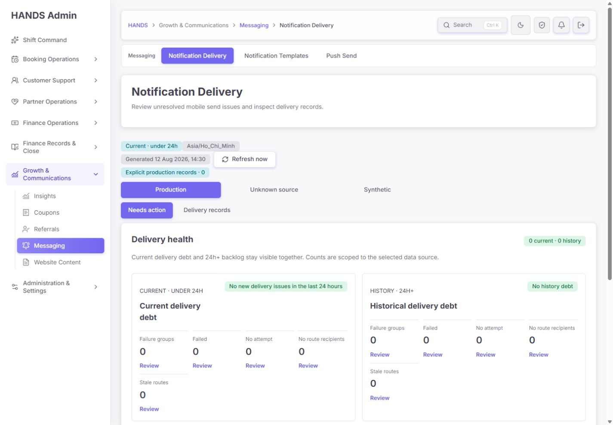

- `Explicit production records · 0`, `0 current · 0 history`, current/history 두 범위가 함께 보인다.
- 과거의 과도한 `All delivery paths healthy` 문구는 제거됐다.
- 다만 이 0은 실제 notification 전체가 아니라 **명시적으로 production으로 기록된 레코드만** 의미한다.
- 화면은 Unknown 탭에 대량 데이터가 있어도 Production 기본 화면에서 그 backlog를 알리지 못한다. `unknownDataCount`가 0으로 잘못 계산되기 때문이다.
- 1000px 높이 첫 화면에서도 실제 action result table은 보이지 않는다. 제목 카드, data status, source selector, mode, 2개 health band가 운영 큐보다 먼저 공간을 차지한다.

### 단계 2 — 기본 큐까지 이동

**건강도: 부분 통과**

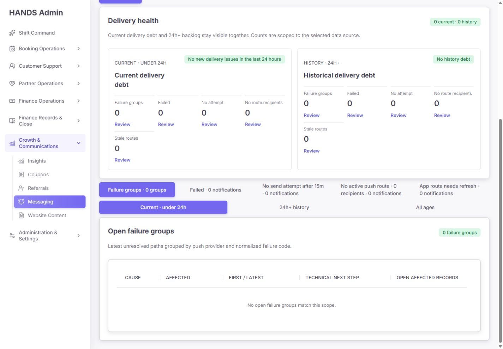

- 빈 상태는 `No open failure groups match this scope.`로 정확하다.
- 빈 table에는 불필요한 1080px min-width를 제거해 과거 빈 표 overflow는 개선됐다.
- 그러나 운영자가 매번 아래로 내려가야 실제 큐를 확인할 수 있다. 기본 화면의 10개 health metric과 바로 아래 5개 issue selector가 같은 탐색을 반복한다.

### 단계 3 — Unknown source 진입

**건강도: 실패**

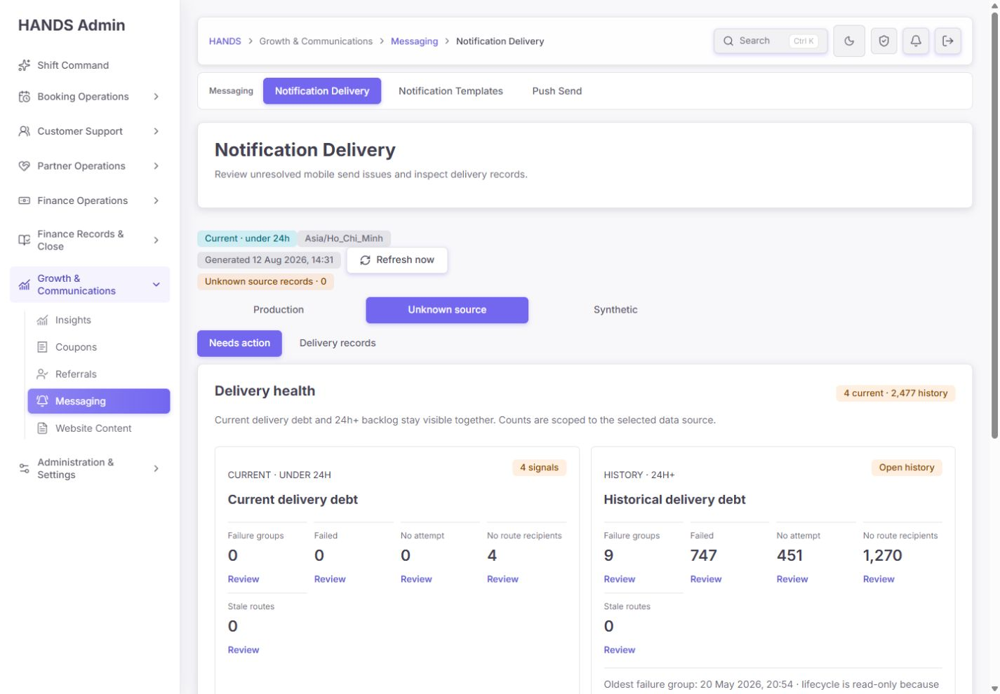

- 같은 화면에서 `Unknown source records · 0`과 `4 current · 2,477 history`가 동시에 나온다.
- historical health는 9 failure groups, 747 failed, 451 no attempt, 1,270 no-route recipients를 보여 준다.
- 이 모순은 단순 문구 문제가 아니다. Prisma JSON `WhereInput` 기반 list/count와 `COALESCE`를 사용하는 raw SQL action query가 서로 다른 unknown predicate를 사용한다.
- 운영자는 badge 0, records 0, action health 2,477 중 어느 숫자를 믿어야 하는지 판단할 수 없다.

### 단계 4 — Current no-route 큐

**건강도: 실패**

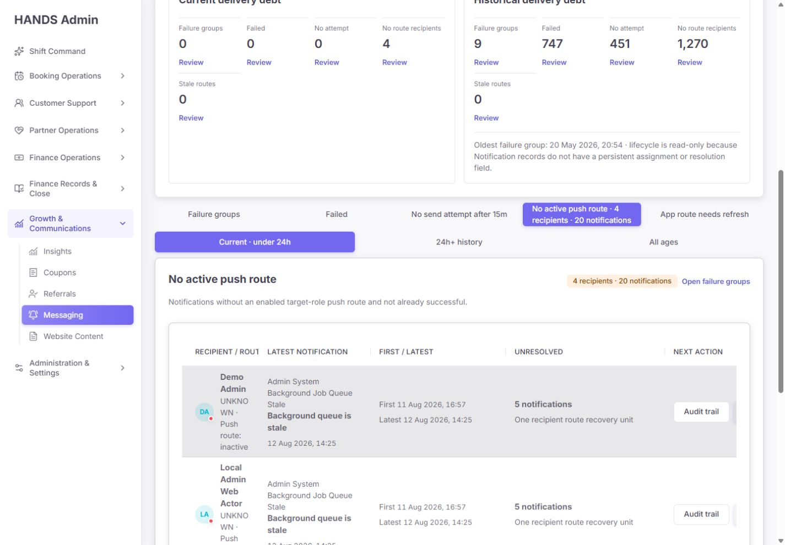

- 4 recipient groups, 20 notifications가 표시된다.
- 모두 `Background Job Queue Stale` Admin system 알림이며 `Demo Admin`, `Local Admin Web Actor`, `HANDS Smoke Admin` 등이다.
- 이 알림들은 `admin-background-jobs.service.ts`가 in-app 운영 알림으로 직접 저장하며 push send 경로를 만들지 않는다.
- 그런데 no-route SQL은 push delivery intent를 확인하지 않고 “enabled target device 없음”만 검사한다. 따라서 **push가 원래 필요하지 않은 Admin system 알림을 push-route 장애로 오인**한다.
- 이 상태에서는 current action queue의 4건을 운영 장애라고 볼 수 없다.

### 단계 5 — 행 액션 메뉴와 1440 clipping

**건강도: 부분 통과**

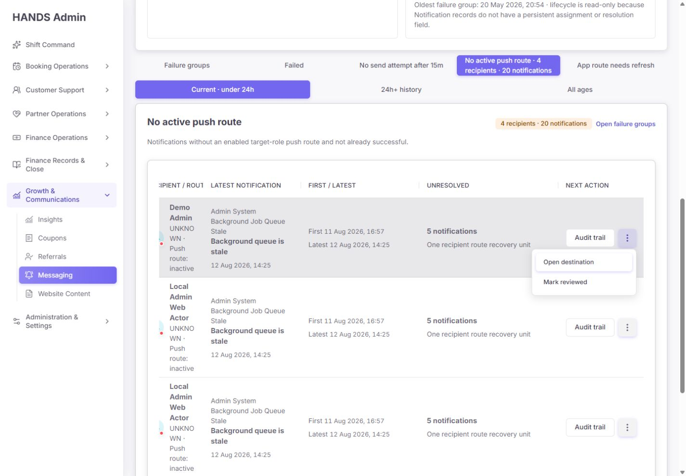

- `Esc`로 메뉴가 닫히고 trigger로 focus가 돌아오는 동작은 정상이다.
- 그러나 table scroll viewport는 `1002px`, scroll width는 `1080px`이다.
- 메뉴를 열 때 scrollLeft가 48px로 이동해 첫 header와 recipient context가 잘린다.
- action을 보기 위해 대상을 잃는 구조는 운영 표로 적합하지 않다.

### 단계 6 — Legacy Admin alert의 Mark reviewed

**건강도: 통과, 소규모 마감 필요**

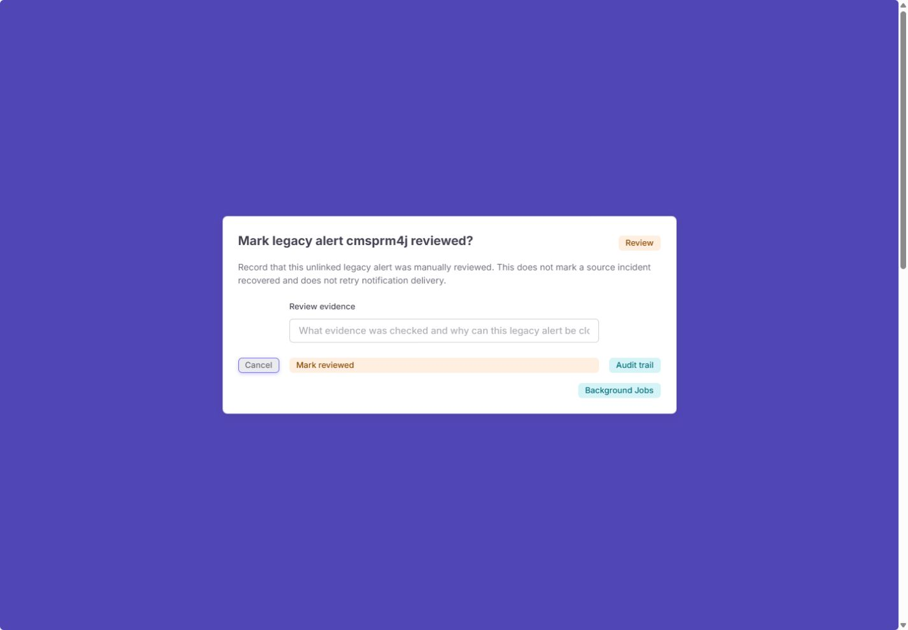

- Cancel이 초기 focus를 받고, alertdialog 의미가 명확하다.
- `This does not mark the source incident recovered and does not retry notification delivery.`라는 안전 문구가 정확하다.
- 최소 12자, 최대 500자 evidence를 요구하고 audit trail과 Background Jobs를 연결한다.
- 제출은 하지 않았다.
- 마감할 점: 빈 evidence 상태에서도 confirm button 자체는 enabled이고 native validation에만 의존한다. 입력이 유효해질 때까지 disabled 상태를 보여 주는 편이 더 명확하다. 긴 placeholder도 잘린다.

### 단계 7 — Unknown 24h+ no-route history

**건강도: 부분 통과**

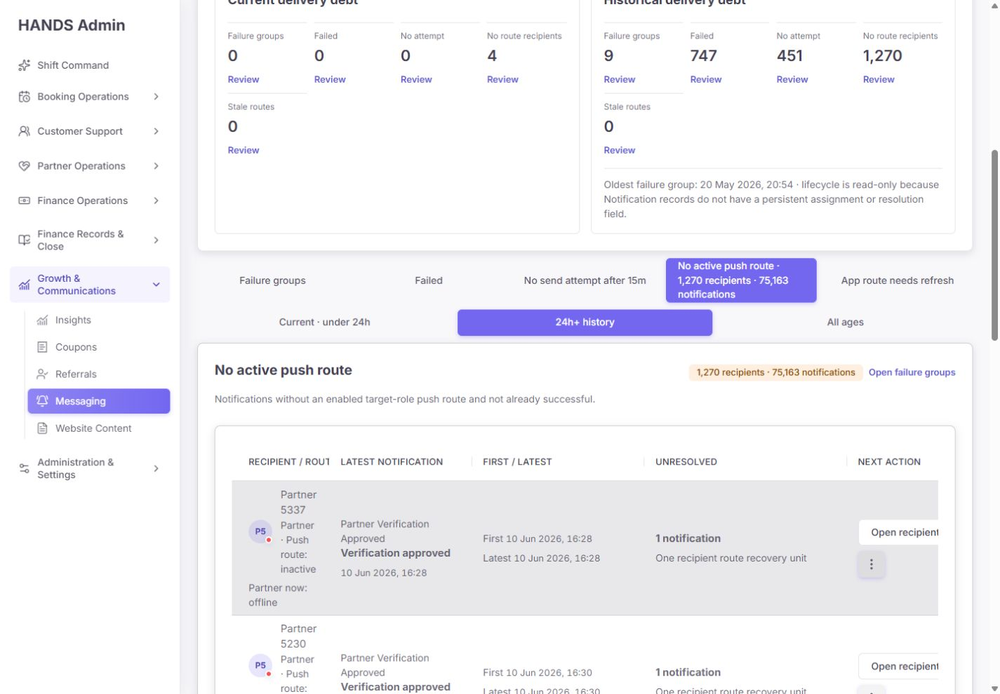

- 1,270 recipients / 75,163 notifications를 recipient route 단위로 묶은 것은 효과적이다.
- 실제 운영자로 보이는 `Partner 5337`, verification approved, marketplace available 레코드와 `Demo Customer`, smoke record가 같은 Unknown 범위에 섞인다.
- first/last와 unresolved count는 보이지만 `Reviewed`, `Resolved`, `Accepted debt` 같은 terminal workflow가 없다.
- 표 첫 열과 마지막 action이 동시에 안정적으로 보이지 않는다.

### 단계 8 — Failure group 목록

**건강도: 부분 통과**

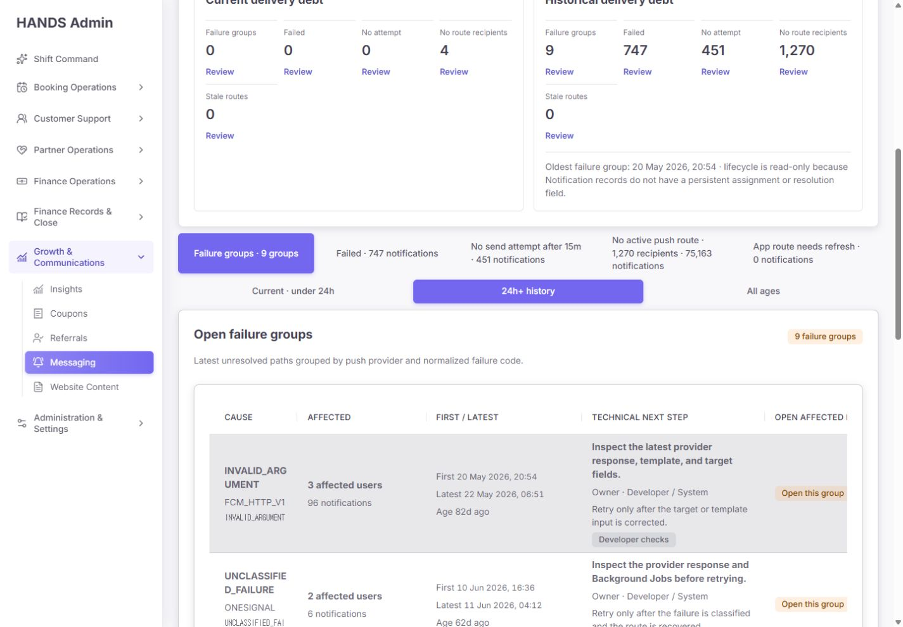

- 9개 그룹에 code별 operator copy, owner, retry condition, Developer checks가 있다.
- `INVALID_ARGUMENT` 계열은 raw provider/code 차이로 3개 그룹, 총 692 group memberships로 나뉜다. 중복 notification이 여러 그룹에 들어갈 수 있어 692는 unique notification 수가 아니다.
- `FCM_HTTP_V1`, `ONESIGNAL`, `FCM`의 provider taxonomy가 화면·filter allowlist와 일치하지 않는다.
- `INVALID_ARGUMENT`, `UNCLASSIFIED_FAILURE`가 열 폭 때문에 토큰 중간에서 잘려 읽기 어렵다.

### 단계 9 — 깨진 self-generated deep link

**건강도: 실패**

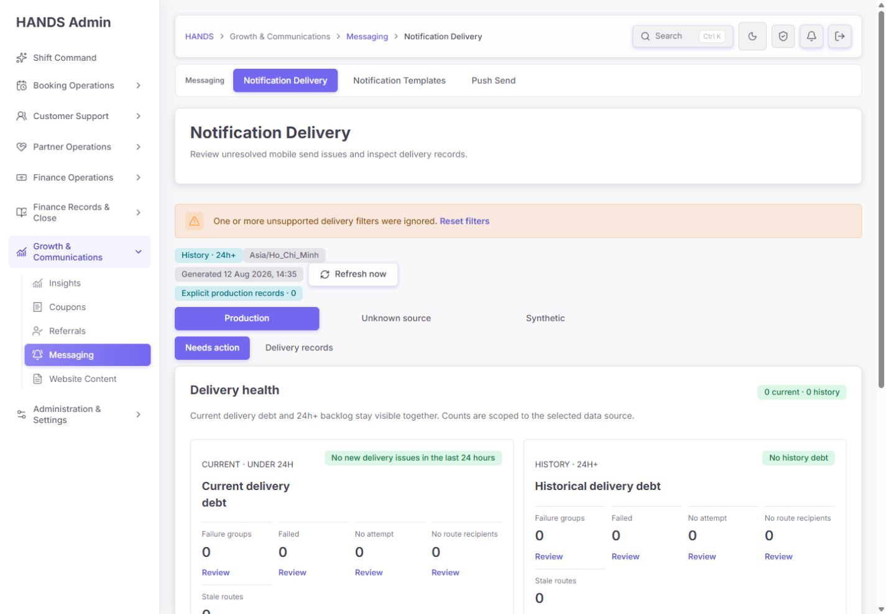

Failure group 화면이 생성한 링크:

```text
/notifications?issue=failed&scope=history&failureProvider=FCM_HTTP_V1&failureCode=INVALID_ARGUMENT
```

실제 결과:

- `dataScope=unknown`이 사라져 Production으로 전환된다.
- `FCM_HTTP_V1`은 프런트 allowlist `FCM | IN_APP_ONLY`에 없어서 unsupported 경고가 뜬다.
- 결과는 해당 그룹 96건이 아니라 Production 0건이다.
- `ONESIGNAL` 링크도 같은 이유로 실패한다.

이는 운영자가 가장 중요한 cause row의 `Open this group`을 눌러도 관련 레코드에 도달하지 못하는 P0 navigation 오류다.

### 단계 10 — 지원되는 FCM exact filter 비교

**건강도: 통과, 주변 상태 문구 실패**

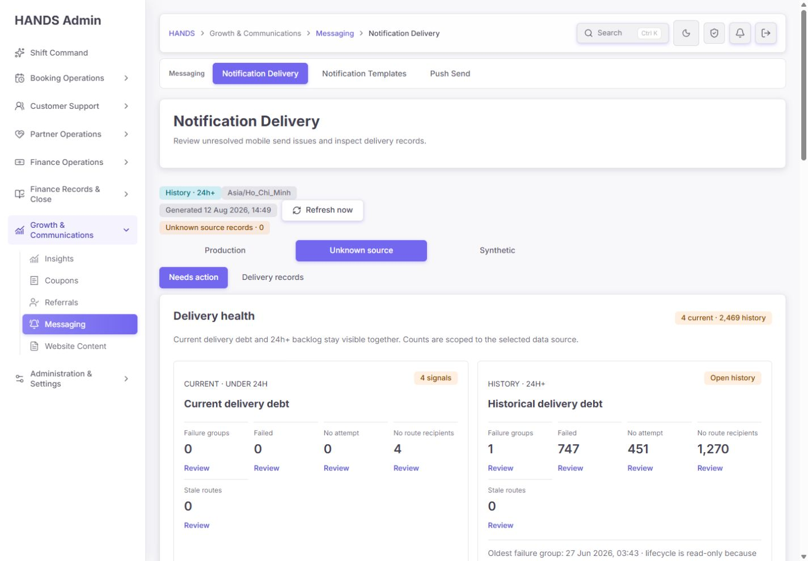

- `failureProvider=FCM&failureCode=INVALID_ARGUMENT&dataScope=unknown`을 명시하면 369건으로 정확히 좁혀진다.
- pagination도 provider, code, scope, dataScope를 유지한다.
- 따라서 exact query 자체는 동작하며, 실패 원인은 self-generated href context와 provider validation 계약이다.
- 이 상태에서 health badge가 `4 current · 2,469 history`로 바뀐다. active group count만 9→1로 바뀌고 다른 health metric은 global이기 때문이다. 이는 상단의 합계가 안정적인 health total이 아님을 다시 증명한다.

### 단계 11 — Delivery records와 필터

**건강도: 부분 통과**

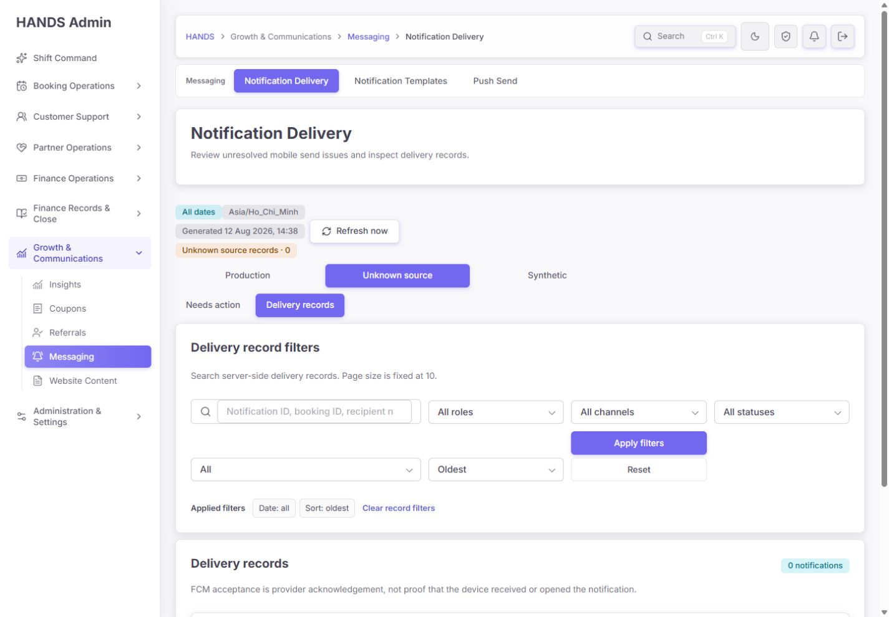

- 검색, recipient role, channel, status, date, sort, apply/reset, applied filters가 명확하다.
- records mode는 이번 반복 측정에서 147~164ms로 빨랐다.
- 그러나 Unknown action queue에 2,477 history가 있는 같은 데이터 source에서 records는 0건이다.
- 검색 placeholder가 잘리고, 필터가 두 줄에 넓게 퍼져 결과 table header가 첫 화면 아래로 밀린다.
- 필터 기능은 양호하지만 현재 backend predicate가 결과 신뢰성을 무너뜨린다.

### 단계 12 — Retry blocked 상태

**건강도: 안전성 통과, 설명 UX 부분 통과**

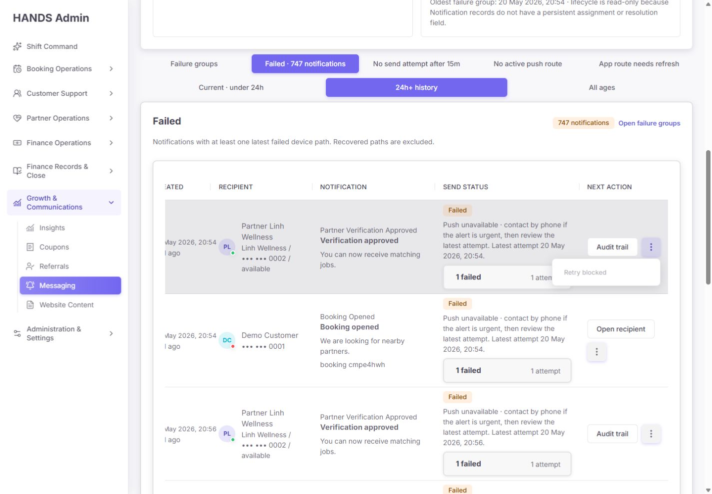

- `INVALID_ARGUMENT`은 `Retry blocked`로 표시되고 확인창으로 진행되지 않는다.
- API도 동일한 `notificationRetryDecision()`을 재검사하므로 UI 우회로 enqueue할 수 없다.
- successful path 제외, route recovery timestamp, cooldown, attempt limit, queue dedupe가 서버에 있다.
- 다만 blocked reason은 `title` attribute에만 들어가 ARIA snapshot과 화면에는 `Retry blocked`만 보인다. 운영자는 왜 blocked인지 메뉴 안에서 읽을 수 없다.

### 단계 13 — Audit trail 이동

**건강도: 실패에 가까운 부분 통과**

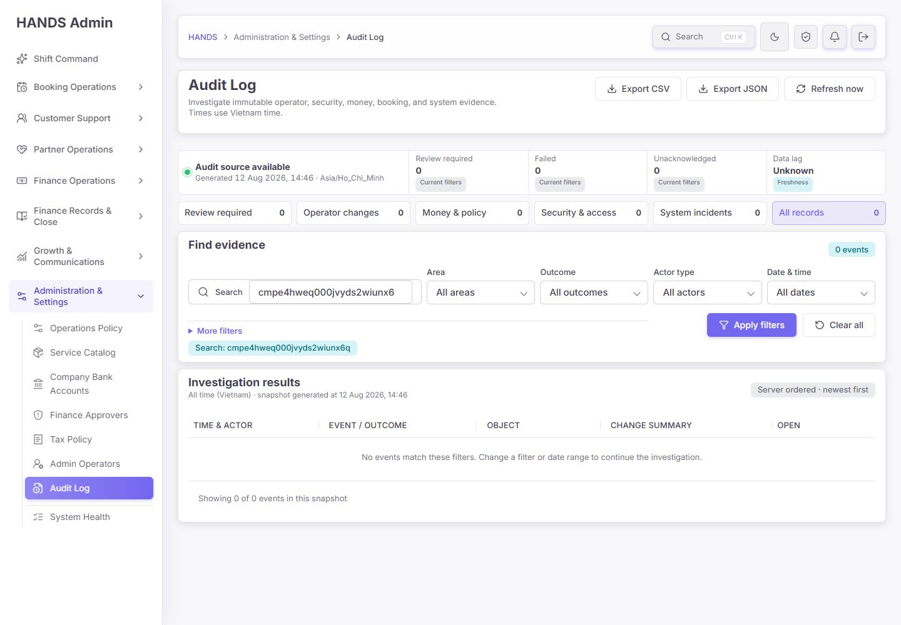

- 행의 primary `Audit trail`은 notification ID 검색이 적용된 Audit Log로 이동한다.
- 검증한 실패 notification은 0 events를 반환했다.
- 화면은 일반적인 “필터를 바꾸라”는 빈 상태만 보여 주고 Notification Delivery로 돌아갈 링크나 “이 notification에는 아직 audit event가 없다”는 문맥을 주지 않는다.
- retry가 blocked인 행에서 primary action까지 0건이면 운영자가 다음 행동을 찾을 수 없다.
- 공식 `notifications:retry-audit-contract`도 현재 Audit Log refactor와 동기화되지 않아 실패한다.

### 단계 14 — 다크 테마

**건강도: 통과**

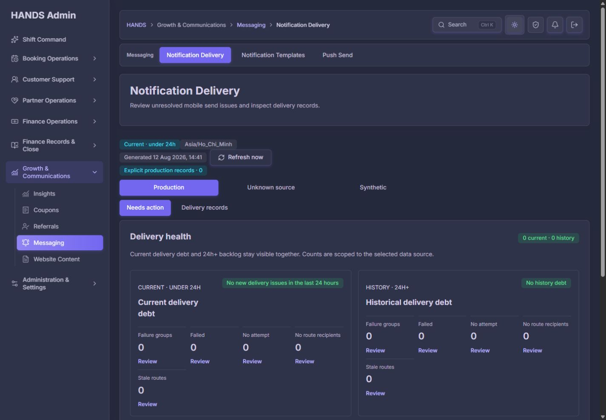

- 정보 구조와 조작 요소는 라이트 테마와 동일하고 핵심 텍스트를 읽을 수 있다.
- 성공/경고 tone도 색상 외 숫자와 문구를 함께 사용한다.
- 이번 감사에서는 자동 contrast 측정은 별도로 실행하지 않았으므로 최종 WCAG 수치 보증은 하지 않는다.

### 단계 15 — 1600px failure table

**건강도: 부분 통과**

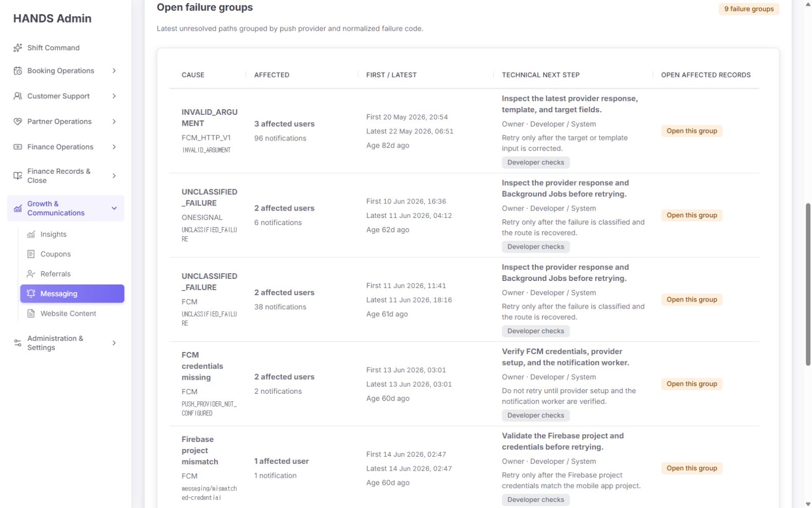

- 1600px에서는 table viewport와 scroll width가 모두 1162px로 수평 overflow가 사라진다.
- 그러나 raw code는 여전히 `INVALID_ARGU / MENT`, `UNCLASSIFIED_FAILU / RE`처럼 의미 없는 위치에서 끊어진다.
- 즉 1600px은 clipping을 완화하지만 column hierarchy와 code wrapping 문제까지 해결하지는 않는다.

## 5. P0 — 출시 전에 반드시 수정할 요건

### P0-1. Notification data scope와 delivery intent를 하나의 계약으로 만든다

#### 확인된 원인

- `apps/api/src/notifications/notifications.service.ts`의 중앙 `persist()`만 `notificationDataWithRuntimeScope()`를 호출한다.
- 중앙 경로 밖에서 Notification을 직접 저장하는 호출이 7개 있다.
  - `apps/api/src/admin/admin-background-jobs.service.ts`: 2개
  - `apps/api/src/admin/admin.service.ts`: 4개
  - `apps/api/src/referrals/referrals.service.ts`: 1개
- 이 직접 저장 경로에는 Admin system in-app alert, finance escalation, customer wallet adjustment, referral reward처럼 운영상 중요한 레코드가 포함된다.
- action health raw SQL은 missing `dataScope`를 `COALESCE`로 Unknown 처리한다.
- Prisma `adminNotificationDataScopeWhere('unknown')`은 JSON path에 대한 중첩 `NOT` 조합을 사용한다. 실제 DB에서 missing key가 raw SQL과 동일하게 잡히지 않는 정황이 화면에서 확인됐다.
- no-route query에는 notification의 `deliveryIntent` 또는 `channelIntent` 조건이 없다.

#### 수정 요구

1. 모든 Notification 저장 경로가 한 pure helper를 통해 아래 metadata를 기록하게 한다.

```ts
type NotificationDeliveryIntent = 'PUSH' | 'IN_APP_ONLY' | 'PUSH_AND_IN_APP';
type NotificationDataScope = 'production' | 'synthetic' | 'unknown';
```

2. transaction 안에서 직접 create가 필요한 경로도 `notificationDataWithRuntimeScope()`와 target role/intent helper를 반드시 호출한다.
3. `admin.system.*`는 실제 제품 정책이 in-app only라면 `deliveryIntent: 'IN_APP_ONLY'`로 저장하고 no-route·no-attempt·stale-route push health에서 제외한다.
4. customer/Partner에게 실제 push를 보내는 direct persisted notification은 `PUSH` 또는 `PUSH_AND_IN_APP`으로 명시한다.
5. list, record count, health raw SQL이 같은 scope predicate를 사용하게 한다. Unknown missing-key 동작은 실제 PostgreSQL integration test로 검증한다.
6. 현재 7개 direct create call site를 검사하는 정적 contract test를 추가한다. 단순 source string 검사만으로 끝내지 말고 생성 결과 metadata를 검증한다.
7. legacy backfill은 이름에 Demo/Smoke가 있다는 이유만으로 production/synthetic을 정하지 않는다. authoritative source, fixture flag, 생성 경로를 사용하고 증명할 수 없는 것은 Unknown으로 유지한다.
8. Production 기본 화면에서 Unknown backlog가 1건 이상이면 `Unknown source backlog · N`을 항상 노출한다.
9. `Unknown source records`는 선택 issue의 `totalCount`가 아니라 해당 source 전체 count임을 보장하거나 `Selected queue records`처럼 정확히 이름을 바꾼다.

#### 완료 기준

- Unknown badge, Unknown records list, Unknown action health가 같은 predicate를 사용한다.
- current Admin system in-app alert 4건이 no-route push queue에서 사라지고 Background Jobs/Operation Alerts에만 남는다.
- wallet adjustment/referral reward notification이 production runtime에서 Production source로 기록된다.
- Production 화면은 Unknown backlog가 있으면 0건 정상처럼 보이지 않는다.
- 실제 DB fixture에서 missing `dataScope`, explicit production, explicit synthetic이 겹치지 않고 세 scope의 합이 전체와 일치한다.

### P0-2. Failure group의 self-generated link를 모든 실제 provider에서 round-trip시킨다

#### 확인된 원인

- UI/API provider normalizer는 `FCM`과 `IN_APP_ONLY`만 허용한다.
- 실제 group query는 String provider를 그대로 묶어 `FCM_HTTP_V1`, `ONESIGNAL`, `FCM`을 반환한다.
- group row href는 빈 기본 view에서 생성돼 현재 `dataScope`를 모른다.
- `Open failure groups`는 `/notifications`로 하드코딩돼 source/scope를 잃는다.

#### 수정 요구

1. API가 반환한 provider를 UI가 다시 입력으로 받을 수 있어야 한다. **서버가 생성한 값이 서버 validation에서 거부되는 상태를 금지한다.**
2. 다음 중 하나를 선택한다.
   - raw provider를 안전한 길이·문자 패턴으로 받아 exact filter에 사용
   - `providerFamily: FCM | ONESIGNAL | IN_APP`과 `rawProvider`를 분리하고 group/filter 양쪽에서 같은 canonical contract 사용
3. incident href 생성 시 현재 `dataScope`, `scope`, `sort`를 전달한다.
4. `Open failure groups`도 `buildNotificationDeliveryHref(view, ...)`를 사용해 current source와 age scope를 보존한다.
5. active exact group의 issue selector나 health link가 filter를 의도치 않게 지우는지 행동 테스트한다.
6. 실제 관측 provider `FCM`, `FCM_HTTP_V1`, `ONESIGNAL` 각각에 round-trip rendered-link test와 API query test를 추가한다.

#### 완료 기준

- Unknown history의 `FCM_HTTP_V1 / INVALID_ARGUMENT`을 누르면 warning 없이 Unknown 96건만 열린다.
- Unknown history의 `ONESIGNAL / UNCLASSIFIED_FAILURE`를 누르면 6건만 열린다.
- `FCM / INVALID_ARGUMENT`은 현재처럼 369건과 pagination context를 유지한다.
- source tab, scope tab, pagination, retry confirmation cancel/return이 exact group context를 보존한다.

### P0-3. 서로 다른 단위와 중복 가능 값을 health total로 더하지 않는다

현재 `notificationDeliveryHealthTotals()`는 다음을 단순 합산한다.

```text
failure group count
+ failed notification count
+ no-attempt notification count
+ no-route recipient count
+ stale-route notification count
```

이는 단위가 다르고 한 notification이 여러 범주에 중복될 수 있어 합계로 의미가 없다.

#### 수정 요구

- health 판단은 `hasCurrentDebt`, `hasHistoricalDebt`, `summaryComplete` 같은 boolean으로 계산한다.
- 상단 badge에 임의 total을 쓰지 않는다.
- 필요하면 `Current: 4 recipients without route`처럼 하나의 대표 신호를 쓰거나 `Current issues present · History open`으로 표시한다.
- 상세 숫자는 현재처럼 개별 metric에 둔다.
- active failure group filter는 results count에만 적용하고 global health overview의 group count를 9→1로 바꾸지 않는다.
- unit이 같은 unique notification total을 꼭 보여 줘야 한다면 서버에서 distinct notification union을 별도로 계산하고 이름을 `Unique affected notifications`로 명확히 한다.

#### 완료 기준

- 화면에서 `2,477 history`, `2,469 history` 같은 혼합 단위 total이 사라진다.
- exact group을 열어도 global health는 안정적으로 같은 상태를 보여 준다.
- partial summary에서 healthy가 되지 않고, 모든 health source가 완전할 때만 clear 상태를 보여 준다.

## 6. P1 — 운영 효율을 위해 다음 순서로 수정할 요건

### P1-1. 1440px 실제 main content 폭용 table contract

현재 코드 근거:

- `.notification-table-shell .table { min-width: 1080px; }`
- 실제 1440 화면 내부 scroll viewport: `1002px`
- action column min-width: `188px`

수정 방향:

- viewport 1440이 아니라 sidebar와 section padding을 제외한 **1000~1010px container**를 기준으로 설계한다.
- 일반 delivery row 권장 폭 예시:

```text
Created 112 | Recipient 170 | Notification 220 | Send status 300 | Next action 160
```

- failure group 권장 폭 예시:

```text
Cause 180 | Affected 112 | First/Latest 170 | Technical next step 340 | Open 150
```

- 불필요한 nested horizontal padding을 줄이고 table/card/section padding을 중복 적용하지 않는다.
- 기본 action은 한 줄, action menu는 overlay로 열리며 scroll position을 바꾸지 않아야 한다.
- raw code는 `_`, `/`, `:` 같은 의미 있는 separator에만 `<wbr>`를 넣거나 짧은 label + copy/details로 이동한다.
- `overflow: hidden`으로 잘린 열을 숨기지 않는다.
- 1440×1000에서 first와 last column을 동시에 캡처해 검증한다.

### P1-2. health와 issue 탐색 중복을 줄인다

현재 순서:

```text
Data status chips
→ 3 source tabs
→ 2 mode tabs
→ 2 health cards / 10 Review links
→ 5 issue tabs
→ 3 age tabs
→ result queue
```

운영자는 큐를 보기 전에 같은 의미의 탐색을 여러 번 읽는다.

권장 구조:

```text
[Production ▾] [Needs action | Records] [Current <24h | History | All] [Refresh]

Current health summary | Historical debt summary

[Issue filter ▾ 또는 5개 compact tabs]                 [Result count]
Result table
```

- Unknown backlog가 있을 때만 source control 옆 warning을 노출한다.
- Synthetic은 0건일 때 주 탐색에서 빼고 Diagnostics/Data quality 메뉴에 둘 수 있다.
- health metric 자체를 drill-down 링크로 쓰면 별도의 5개 issue selector를 축소할 수 있다.
- 1440×1000 첫 화면에 최소한 result section title과 첫 table header가 보여야 한다.

### P1-3. 1인 운영에 맞는 최소 history lifecycle을 추가한다

현재 사용자가 1인 운영을 전제로 하므로 거대한 assignment/workflow engine은 필요 없다.

최소 상태:

```text
Open → Reviewed → Resolved
              ↘ Accepted debt
```

필수 필드:

- `reviewState`
- `lastReviewedAt`
- `reviewedByAdminId`
- `reviewNote`
- `resolutionEvidence` 또는 source recovery reference

원칙:

- source incident가 있는 Admin system alert는 Background Jobs에서 resolve하고 Notification 화면은 상태를 반영만 한다.
- 일반 delivery debt는 evidence 없이 Resolved로 바꿀 수 없게 한다.
- `Accepted debt`는 이유와 재검토일을 요구한다.
- owner는 1인 운영에서는 생략하거나 현재 운영자를 암묵적 owner로 표시한다. 다중 운영자가 생길 때만 assignment를 추가한다.
- age bucket은 `24–72h`, `3–7d`, `8–30d`, `30d+` 정도면 충분하다.

### P1-4. action summary 성능을 view-specific으로 줄인다

이번 브라우저 route 관찰값은 다음과 같다. 2회 측정이며 로컬 환경 회귀 지표로만 사용한다.

| 경로 | 1회 | 2회 | 관찰 범위 |
|---|---:|---:|---:|
| Production default | 1,138ms | 1,023ms | 1.02~1.14s |
| Unknown current | 2,185ms | 2,874ms | 2.19~2.87s |
| Unknown history groups | 2,499ms | 2,756ms | 2.50~2.76s |
| Unknown records | 147ms | 164ms | 0.15~0.16s |

records가 빠른 이유는 `viewMode === 'records'`에서 4개 count 후 early return하기 때문이다. action mode는 선택 issue와 무관하게 current/history incident, retry, unattempted, device health, stale route, data-scope count 등 다수 집계를 동시에 실행하고 일부 후속 집계도 수행한다.

수정 요구:

- global health header와 selected issue detail summary를 분리한다.
- header에는 current/history의 최소 boolean과 각 핵심 count만 유지한다.
- selected issue가 `no-route`면 failed group detail page query를 실행하지 않는 식으로 issue별 query budget을 둔다.
- exact group filter가 global health query를 오염시키지 않게 한다.
- 같은 조건 5회 warm 측정으로 median/p90을 기록한다.
- 권장 목표: action route P75 ≤ 1.5s, records/filter P75 ≤ 1.0s.
- 측정 없이 cache/index를 추가하지 않는다. 먼저 query count와 `EXPLAIN (ANALYZE, BUFFERS)`를 확인한다.

### P1-5. Audit trail을 실제 다음 행동으로 만든다

- notification ID로 찾은 audit event가 0개면 `Audit trail`을 primary action으로 쓰지 않는다.
- 이 경우 primary action은 recipient/destination 또는 inline delivery evidence여야 한다.
- Audit Log empty state는 `No audit events have been recorded for this notification.`과 Notification Delivery로 돌아가는 링크를 제공한다.
- retry request/queued/failed event가 있으면 correlation ID로 묶어 한 흐름으로 보여 준다.
- `notifications:retry-audit-contract`는 새 `AuditEvidenceDrawer` 구조를 읽도록 업데이트하거나 typed presentation contract로 대체한다.
- contract script를 삭제해서 통과시키지 말고, raw JSON drawer 또는 normalized view가 retry metadata를 실제로 보여 준다는 행동 테스트를 추가한다.

## 7. P2 — 문구와 시각 마감

1. `Unknown source records · 0`은 전체 source count인지 selected result count인지 이름을 분명히 한다.
2. blocked action 안에 `Payload/config recovery evidence required` 같은 reason을 직접 렌더링한다. `title` attribute에만 두지 않는다.
3. `Review` 반복 링크는 `Review failed`, `Review no route`처럼 accessible name을 구체화한다.
4. `Mark reviewed` confirm은 evidence 12자 미만에서 disabled visual state를 제공한다.
5. search placeholder가 1440에서 모두 보이게 검색 폭을 확보한다.
6. applied filter는 전체 clear 외에 개별 chip 제거를 제공할 수 있다.
7. `Current · under 24h`, timezone, generated time, source count를 3줄 badge stack 대신 한 줄 metadata toolbar로 정리한다.
8. failure group taxonomy는 operator-facing parent cause와 raw provider/code를 분리한다.
   - 예: `Invalid request payload` / raw `FCM_HTTP_V1 · INVALID_ARGUMENT`
9. dark theme 구조는 유지하되 최종 변경 후 automated contrast test를 한 번 실행한다.

## 8. 코드별 핵심 근거

| 파일 | 확인 내용 | 판단 |
|---|---|---|
| `apps/admin_web/app/notifications/notification-page-model.ts` | 서로 다른 5개 metric을 `notificationDeliveryHealthTotals()`에서 합산 | 잘못된 health total |
| 같은 파일 | failure provider normalizer가 `FCM`, `IN_APP_ONLY`만 허용 | 실제 provider와 불일치 |
| 같은 파일 | incident href를 빈 기본 view로 생성 | current dataScope context 손실 |
| `apps/admin_web/app/notifications/page.tsx` | `Open failure groups`가 `/notifications`로 하드코딩 | source/scope 손실 |
| 같은 파일 | source status가 summary data-scope count를 사용 | 잘못된 unknown count가 그대로 노출 |
| `apps/admin_web/app/globals.css` | notification table min-width 1080px | 1440 main container 1002px보다 큼 |
| `apps/admin_web/components/action-menu.tsx` | disabled action description이 title에만 있음 | 화면/ARIA에서 block reason 누락 |
| `apps/api/src/admin/admin-notification-production-data.ts` | raw SQL은 COALESCE, Prisma where는 JSON NOT 조합 | missing-key semantics 불일치 가능성 |
| `apps/api/src/admin/admin-notification-retry-query.ts` | 실제 provider String을 group하지만 input은 2개만 allow | self-generated filter 거부 |
| `apps/api/src/admin/admin-notification-unattempted-query.ts` | no-route가 delivery intent 없이 device 존재만 판단 | in-app Admin alert 오탐 |
| `apps/api/src/notifications/notifications.service.ts` | 중앙 생성은 scope stamp, retry는 server-side decision/dedupe 강제 | 생성 중앙 경로는 좋고 retry는 안전 |
| `apps/api/src/admin/admin-background-jobs.service.ts` | Admin system Notification을 직접 create | scope/intent 누락, no-route 오염 |
| `apps/api/src/admin/admin.service.ts` | finance escalation·wallet notification 직접 create | scope stamp 우회 |
| `apps/api/src/referrals/referrals.service.ts` | reward notification 직접 create 후 enqueue | scope stamp 우회 |
| `infra/scripts/check-notification-retry-audit-contract.mjs` | 이전 Audit Log source 파일만 검사 | 현재 drawer와 contract 불일치 |

## 9. 테스트 및 검증 결과

### 통과

| 검증 | 결과 |
|---|---|
| Admin Web notifications focused tests | **7 files / 114 tests passed** |
| API notification focused tests | **10 files / 103 tests passed** |
| Admin Web typecheck | **passed** |
| API typecheck | **passed** |
| focused ESLint | **passed** |
| `notifications:push-data-contract` | **passed** |
| `security:admin-sensitive` | **passed**, violations 0 |
| 브라우저 console error | **0** |
| 전화번호·device ID 노출 | 전체 전화번호와 raw device ID 미노출 확인 |
| retry mutation | 실행하지 않음 |

### 실패

`npm.cmd run notifications:retry-audit-contract`

- 결과: **exit 1**
- API와 smoke metadata 계약은 통과했다.
- Admin Audit Log 소비자에서 `latestDelivery`, `retryJob`, `retryRisk`, provider/device/job fields를 찾지 못했다고 보고했다.
- 새 Audit Log는 generic raw payload drawer로 리팩터링됐지만 contract script가 `page.tsx`와 `page-content.tsx`만 읽는다.
- 이는 기능이 반드시 사라졌다는 단독 증거는 아니지만, **출시 검사와 현재 UI가 불일치한다는 확실한 실패**다.

### 테스트가 놓친 영역

- exact group test는 `FCM`만 사용해 `FCM_HTTP_V1`·`ONESIGNAL` 회귀를 잡지 못했다.
- data-scope test는 Prisma object shape와 SQL 문자열만 검사하고 실제 PostgreSQL missing JSON key 동작을 검증하지 않는다.
- page tests 다수가 source string 존재 확인이라 실제 href 클릭과 source context 보존을 검증하지 않는다.
- table tests는 render markup을 보지만 1002px container에서 실제 column visibility를 측정하지 않는다.
- health total test는 단위가 다른 숫자를 합산하는 현재 동작을 오히려 정답으로 고정한다.

### 미실행

- production build: 이번 작업은 읽기 전용 감사이며 실행 중인 3101 production preview의 `.next` 결과를 덮어쓰지 않기 위해 실행하지 않음
- 실제 retry·Mark reviewed submit·push send: 안전상 미실행
- 1024px 이하 화면: 사용자 요청에 따라 미검사

## 10. 권장 구현 순서

1. **dataScope + deliveryIntent 생성 계약 통일**
2. **Unknown list/count/raw SQL predicate 통일 및 legacy/backfill 정책 확정**
3. **failure provider exact link round-trip과 context 보존**
4. **혼합 단위 health total 제거**
5. **1440 main container table contract 수정**
6. **in-app Admin alert를 push no-route queue에서 제외**
7. **view-specific action summary 성능 개선**
8. **1인 운영용 history Reviewed/Resolved/Accepted debt**
9. **Audit trail empty/contract 연결 보수**
10. **중복 selector, blocked reason, placeholder, code wrapping 마감**

## 11. 재검수 완료 기준

- [ ] Production/Unknown/Synthetic list, count, health가 같은 scope predicate를 사용한다.
- [ ] 모든 Notification create 경로가 dataScope와 deliveryIntent를 기록한다.
- [ ] Unknown 전체 count와 Unknown records/action queue가 모순되지 않는다.
- [ ] Admin system in-app notification이 no-route push queue에 나타나지 않는다.
- [ ] FCM, FCM_HTTP_V1, ONESIGNAL failure group 링크가 exact result와 context를 유지한다.
- [ ] `Open failure groups`가 현재 source/scope를 보존한다.
- [ ] 서로 다른 단위를 합한 current/history 숫자가 사라진다.
- [ ] active group filter가 global health를 바꾸지 않는다.
- [ ] 1440×1000에서 table first/last column과 action이 동시에 완전히 보인다.
- [ ] 메뉴를 열어도 horizontal scroll position이 움직이지 않는다.
- [ ] blocked retry reason을 화면과 접근성 트리에서 읽을 수 있다.
- [ ] history 항목을 최소 Reviewed/Resolved/Accepted debt로 정리할 수 있다.
- [ ] Unknown action/history warm P75가 1.5초 이하이거나 동일 조건 개선 근거가 기록된다.
- [ ] notification audit link가 0 events일 때 정확한 문맥과 돌아가기 경로를 제공한다.
- [ ] `notifications:retry-audit-contract`가 현재 Audit Log 구조와 함께 통과한다.
- [ ] 실제 PostgreSQL integration test가 missing/production/synthetic scope 분리를 검증한다.
- [ ] focused tests, typecheck, lint, security, contracts가 모두 통과한다.

## 12. 하지 말아야 할 수정

- Unknown legacy를 이름이나 ID 패턴만 보고 일괄 Production으로 바꾸지 않는다.
- `2,477 history`의 이름만 `signals`로 바꾸고 혼합 단위 합산은 유지하지 않는다.
- `overflow: hidden`으로 잘린 열을 감추지 않는다.
- provider allowlist에 현재 관측 문자열 두 개만 임시 추가하고 canonical/raw contract를 방치하지 않는다.
- Admin system alert를 단순 삭제해 Background Jobs 경고 자체를 없애지 않는다. 올바른 in-app incident 영역으로 라우팅한다.
- retry button만 숨기고 API gate를 약화하지 않는다.
- 1인 운영 화면에 불필요한 복잡한 owner/team workflow engine을 만들지 않는다.
- 성능 측정 없이 cache, index, dependency를 추가하지 않는다.
- 1024px 이하 반응형 작업을 이 개선 범위에 포함하지 않는다.

## 13. 최종 결론

이번 수정은 **상태 표현과 retry 안전성에서는 성공적**이다. 특히 current/history를 동시에 보여 주고, 영구 오류를 API에서 차단하고, keyboard action menu와 audited legacy review를 구현한 것은 운영 안정성을 실제로 높였다.

하지만 현재 가장 중요한 문제는 시각 마감이 아니라 **데이터가 어떤 source와 delivery intent에 속하는지 화면 전체가 같은 답을 하지 않는 것**이다. Production 0건, Unknown records 0건, Unknown history 2,477이라는 세 답이 동시에 존재하고, 화면이 생성한 일부 failure group link도 스스로 열지 못한다.

따라서 다음 개선은 디자인 polish보다 먼저 **data scope/intent contract → exact link → health 의미 → 1440 table** 순서로 진행해야 한다. 이 네 항목이 통과되면 Notification Delivery는 1인 운영자가 매일 신뢰하고 사용할 수 있는 수준으로 올라갈 수 있다.
