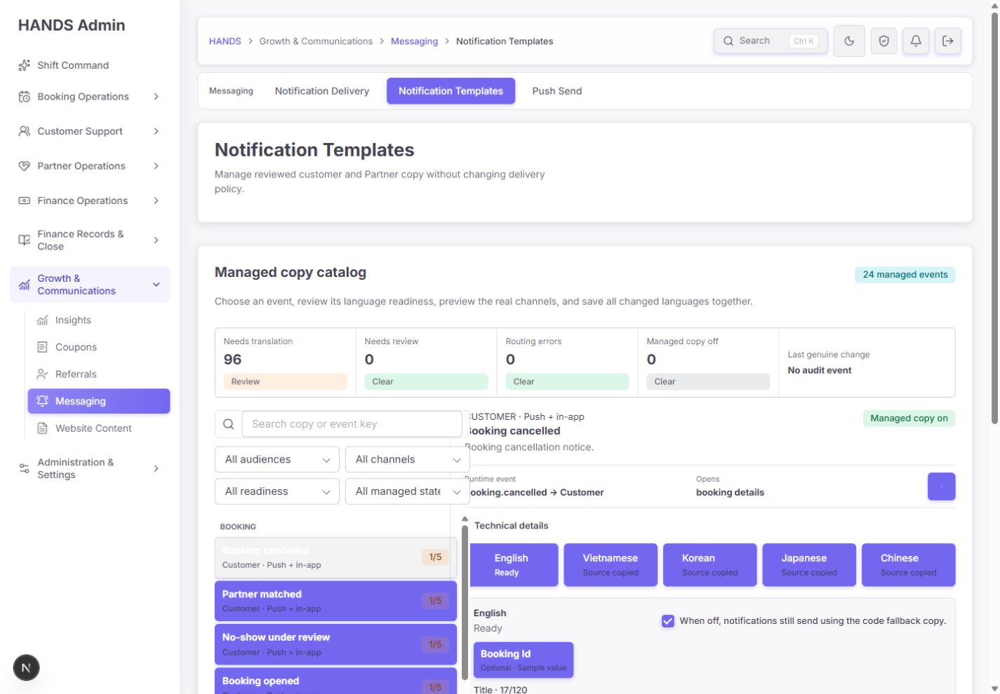
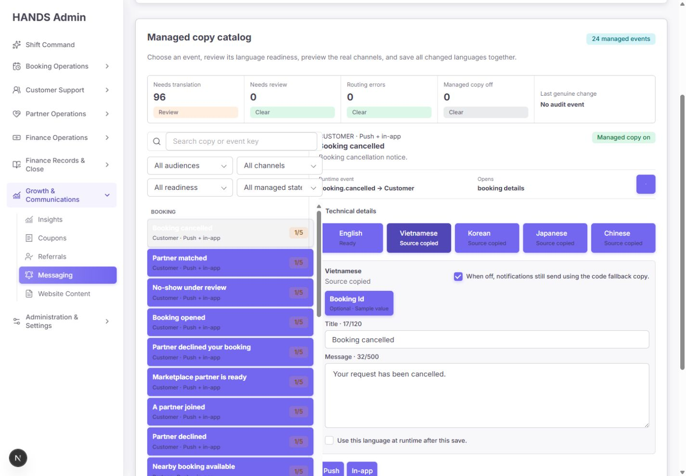
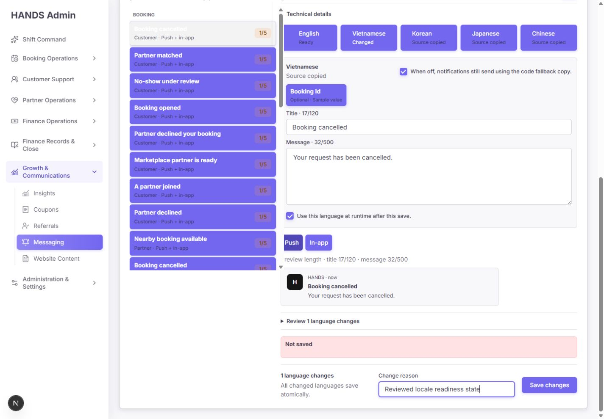
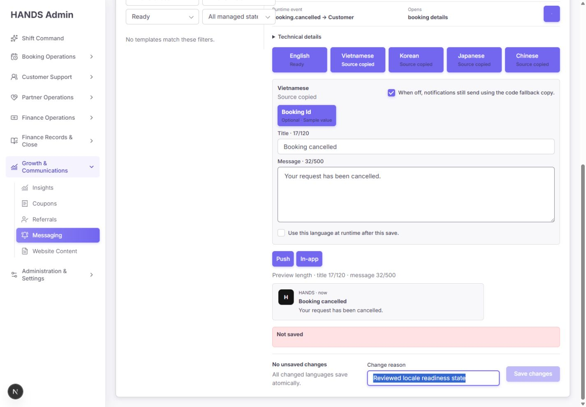
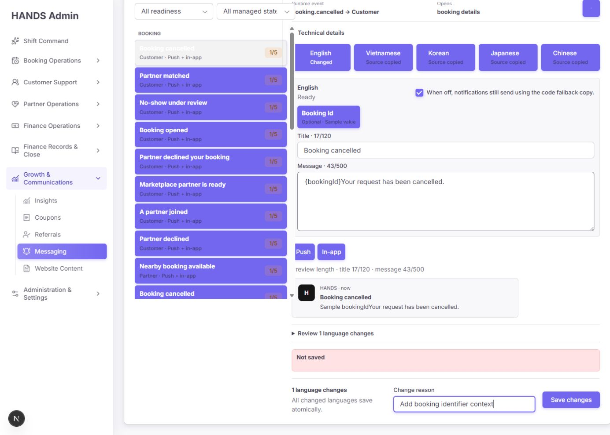
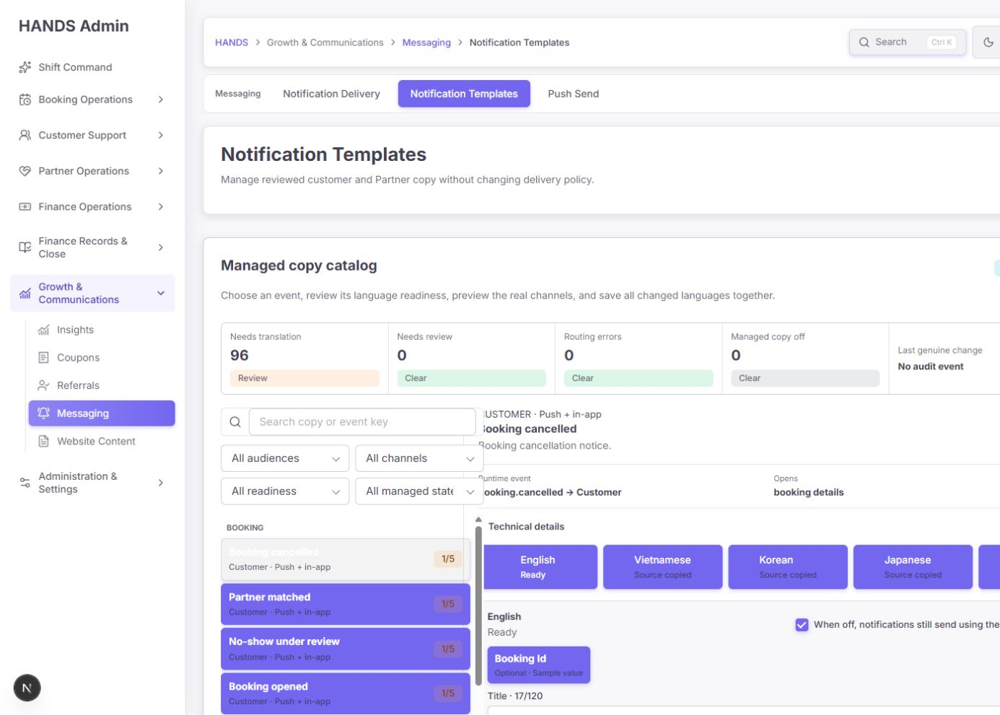
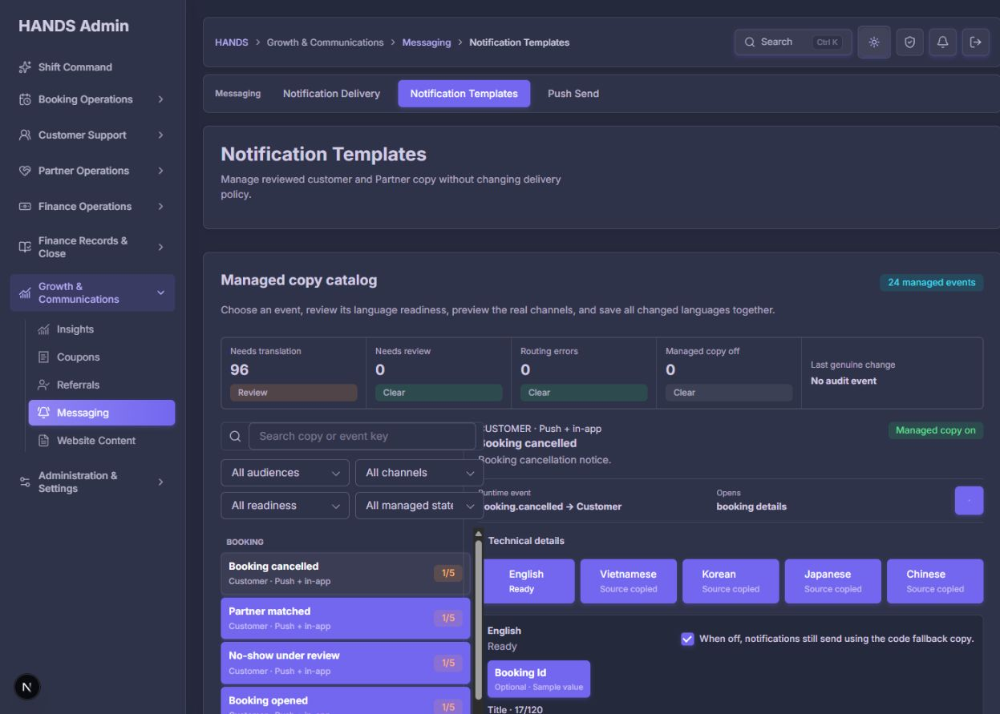

# Notification Templates 최종 재감사 보고서

- 감사 일자: 2026-08-13
- 대상: `http://localhost:3101/notifications/templates`
- 비교 기준: `notification-templates-final-reaudit-2026-08-12.md`, `notification-templates-remediation-implementation-2026-08-12.md`
- 검수 범위: 현재 브라우저 화면, 1440×1000/1600×1000, 라이트/다크, 검색·필터·언어 탭·변경 상태·미리보기, 관리자 웹 소스, API 템플릿·라우팅·저장 계약, DB 읽기 전용 상태, 관련 테스트
- 제외: 1024px 이하 반응형, 실제 저장 제출, 실제 푸시 발송, 실기기 알림 열기, 전체 WCAG 적합성 시험

## 1. 최종 판정

**종합 점수: 62/100 — 쓰기 기능 출시 보류(Release Hold)**

이전 48점 상태와 비교하면 구조적인 개선은 분명하다. 24개 이벤트 카탈로그, 고객/파트너 라우팅 분리, 번역 상태 모델, 읽기 전용 GET, 낙관적 동시성, 다국어 키보드 탭, 저장 사유와 원자적 저장 방향은 상당 부분 반영됐다.

그러나 현재 페이지는 단순한 문구 편집기가 아니라 실제 고객·파트너 알림 문구와 런타임 사용 여부를 바꾸는 운영 도구다. 이 기준에서는 다음 세 가지가 출시 차단 사항이다.

1. 번역하지 않은 `SOURCE_COPIED` 문구도 체크 한 번으로 `READY` 승격이 가능하다.
2. DB가 UI에 제공하는 허용 변수와 API가 저장 시 검증하는 정식 변수 계약이 달라, UI에서 정상으로 보이는 문구가 서버에서 거절될 수 있다.
3. 저장 중 다른 템플릿으로 이동할 수 있고, 이전 템플릿의 늦은 응답이 새 템플릿 편집 상태를 덮을 수 있다.

따라서 현재 페이지는 **읽기·현황 확인 용도에는 사용 가능**하지만, 관리 문구 저장 기능을 운영자에게 개방하기 전 P0 세 건을 해결해야 한다.

| 평가 영역 | 점수 | 판정 |
|---|---:|---|
| 데이터·런타임 정확성 | 14/25 | 계약 불일치와 부정확한 목적지 안내 |
| 변경 안전성 | 11/20 | 동시성 기반은 있으나 잘못된 템플릿 덮어쓰기 위험 |
| 운영자 작업 흐름 | 12/15 | 구조 개선, 번역 작업 큐는 부족 |
| 시각 위계 | 8/15 | 공통 버튼 CSS 충돌로 선택 상태 역전 |
| 접근성 | 9/15 | 키보드 탭 개선, 대비·레이블 미완료 |
| 구현·검증 신뢰도 | 8/10 | 집중 테스트 통과, 실행 서버 최신성 불일치 |

## 2. 이전 보고서 개선사항 재검증

| 이전 요구 | 현재 상태 | 재감사 판정 |
|---|---|---|
| 영어 복사본을 완료로 표시하지 않기 | `SOURCE_COPIED`, `NEEDS_REVIEW`, `READY` 구분 추가 | **부분 완료** — 표시는 개선됐지만 수정 없이 READY 승격 가능 |
| 역할·이벤트 라우팅 정리 | 24개 정식 이벤트와 고객/파트너 라우트 맵 존재 | **대체로 완료** |
| 필수 변수와 실제 payload 일치 | API 정식 카탈로그와 서버 검증 추가 | **부분 완료** — UI는 여전히 DB의 오래된 `variables` 사용 |
| `Paused` 의미 바로잡기 | `Managed copy on/off`, 코드 fallback 설명 추가 | **완료에 가까움** — 전역 토글 위치는 부적절 |
| GET 요청에서 쓰기 제거 | 페이지 재로드 전후 DB hash·행 수 동일 | **완료** |
| 낙관적 동시성 | `updatedAt` 조건부 claim 및 conflict 응답 | **구현 완료**, 실제 Postgres 동시 저장 증거는 없음 |
| 저장 실패 시 초안 복구 | 복사·새로고침 경로와 conflict UI 구현 | **코드·단위 테스트 확인**, 현재 실행 환경 fixture 미검증 |
| API 실패를 빈 상태로 보이지 않기 | 오류 상태 분리 코드 존재 | **코드 확인**, 현재 실행 환경 강제 오류 상태 미검증 |
| 가짜 미리보기 제거 | 길이와 두 채널 미리보기 개선 | **미완료** — `Opens`가 실제 앱 라우팅과 다름 |
| 언어 탭 접근성 | tablist/tabpanel, 화살표·Home·End 지원 | **기능 완료**, 대비 실패 남음 |

## 3. 실제 화면 작업 흐름 감사

### 3.1 기본 진입 — 주의 필요

- 장점: 페이지 목적, 준비도 요약, 이벤트 카탈로그, 편집기 구분이 이전보다 명확하다.
- 문제: 최초 진입부터 붉은 `Not saved` 상태 박스가 빈 문구로 나타난다. 같은 화면 아래에는 `No unsaved changes`가 있어 서로 모순된다.
- 문제: 선택된 `Booking cancelled` 행은 옅은 배경에 흰 글자라 거의 보이지 않고, 선택되지 않은 행은 모두 보라색 기본 버튼처럼 보여 선택 관계가 역전됐다.
- 판정: **Degraded**

### 3.2 베트남어 원문 복사 상태 확인 — 이해 가능하나 작업성 부족

- `Source copied` 상태 자체는 운영자가 번역 미완료임을 이해하는 데 도움이 된다.
- 실제 베트남어 제목과 본문은 영어 `Booking cancelled`, `Your request has been cancelled.` 그대로다.
- 현재 DB에는 비영어 96개가 모두 영어 원문과 동일하다. 상단 `Needs translation 96`은 이벤트 수가 아니라 언어 버전 수인데 단위가 표시되지 않는다.
- 베트남 운영자가 베트남어만 처리하려 해도 이벤트마다 베트남어 탭을 다시 눌러야 한다. 언어별 작업 큐와 `저장 후 다음 베트남어 미검수 항목` 동작이 없다.
- 판정: **Degraded**

### 3.3 번역하지 않고 런타임 사용 체크 — 치명적

- 문구를 한 글자도 바꾸지 않고 `Use this language at runtime after this save.`를 체크하면 변경으로 인식된다.
- 사유를 입력하면 저장 버튼이 활성화된다. 실제 저장은 감사 안전을 위해 누르지 않았다.
- 서버도 비영어 문구에 `reviewedAndReady=true`가 들어오면 내용 비교나 번역 증거 없이 `READY`로 저장한다.
- 변경 검토 영역은 제목·본문의 Before/After만 보여 준다. 이 경우 두 문구가 동일해도 핵심 변경인 `SOURCE_COPIED → READY`를 보여 주지 않는다.
- 판정: **Critical / P0**

### 3.4 Ready 필터 — 결과와 편집기가 모순

- 모든 템플릿이 1/5인 상태에서 `Ready`를 선택하면 왼쪽은 `No templates match these filters.`가 된다.
- 오른쪽에는 필터 조건에 맞지 않는 `Booking cancelled` 편집기가 그대로 남아 있다.
- 운영자는 현재 보고 있는 레코드가 필터 결과인지, 필터 밖의 이전 선택인지 판단하기 어렵다.
- 판정: **Degraded / P1**

### 3.5 변수 삽입 — UI/API 계약 불일치

- `booking.cancelled`의 DB 메타데이터는 `bookingId`를 허용 변수로 제공하고, UI는 이를 `Optional` 칩으로 표시한다.
- 칩으로 `{bookingId}`를 삽입해도 클라이언트 오류가 없고 저장 버튼이 활성화된다.
- 반면 API 정식 카탈로그의 동일 템플릿 변수는 빈 배열이며, 서버 저장 검증은 이 정식 카탈로그를 사용한다. 따라서 저장 시 거절되는 계약이다.
- `Routing errors 0`은 키 누락·예상 밖 키만 세며, audience/channel/variables/requiredVariables/runtime route drift는 검사하지 않는다. 현재 표시는 거짓 안심을 준다.
- 판정: **Critical / P0**

### 3.6 1600px 및 다크 테마 — 구조는 안정, 밀도와 대비는 미완료

- 1440과 1600에서 가로 overflow는 없었다.
- 다크 테마에서도 전체 레이아웃 붕괴는 없었다.
- 그러나 1600×1000에서도 첫 화면 대부분이 헤더·준비도·필터에 사용되어 제목·본문 편집 작업이 충분히 노출되지 않는다.
- 카탈로그 내부 스크롤과 페이지 스크롤이 함께 존재해 장시간 번역 작업에 피로를 준다.
- 보라색 버튼 남용과 선택 상태 문제는 다크 테마에서도 유지된다.
- 판정: **Degraded / P1**

## 4. P0 — 출시 전 반드시 수정

### P0-1. `SOURCE_COPIED`를 내용 변경 없이 `READY`로 승격할 수 있음

**근거**

- UI는 readiness 체크 변화만으로 해당 언어를 변경 목록에 포함한다: `notification-template-editor.tsx:84-90`, `:309`.
- 서버는 비영어 문구의 `reviewedAndReady`가 true이면 그대로 READY로 만든다: `admin.service.ts:32341-32346`.
- 현재 DB의 비영어 96개는 영어 문구와 동일하다.

**필수 수정**

1. 서버를 최종 권한으로 두고, `SOURCE_COPIED` 상태에서 정규화한 제목·본문이 영어 원문 또는 저장된 source hash와 같으면 READY 승격을 거절한다.
2. 실제로 동일 번역이 맞는 예외 문구만 별도 `confirmIdenticalTranslation` 확인과 구체적 사유로 승인하게 하고 감사 로그에 남긴다.
3. 변경 검토에 문구 diff와 별도로 `Readiness: Source copied → Ready`, 검토자, 검토 시각을 표시한다.
4. `SOURCE_COPIED`는 기본 체크 불가 또는 `번역 내용을 먼저 변경하세요` 안내를 보여 준다.

**합격 조건**

- 문구 미수정 + readiness 체크만으로 클라이언트와 API 모두 저장 불가.
- 예외 승인에는 독립 확인과 감사 메타데이터가 필요.
- 새 단위·브라우저 테스트가 미수정 원문 승격을 차단함을 증명.

### P0-2. UI 변수와 서버 변수의 단일 진실 공급원이 다름

**근거**

- 목록 API는 DB row를 펼친 뒤 `requiredVariables`만 정식 정의로 덮는다. DB `variables`는 그대로 노출된다: `admin.service.ts:32189-32214`.
- 저장 검증은 `DEFAULT_NOTIFICATION_TEMPLATES`의 `variables`를 사용한다: `admin.service.ts:32244-32250`, `notification-template-catalog.ts`.
- 실제 예: `booking.cancelled` DB=`[bookingId]`, 정식 카탈로그=`[]`.

**필수 수정**

1. `variables`, `requiredVariables`, audience, channel, runtimeRoutes를 모두 정식 카탈로그에서 파생하거나 DB와 정식 정의를 하나로 통합한다.
2. 목록 응답의 `variables`도 정식 정의로 덮고, DB의 오래된 메타데이터는 migration/backfill로 정리한다.
3. health에 metadata drift를 추가하고 `Routing errors` 대신 `Contract issues`로 표시한다.
4. UI 허용 변수 집합과 PATCH 저장 검증 집합이 동일하다는 API 계약 테스트를 추가한다.

**합격 조건**

- 화면의 모든 변수 칩은 서버 저장을 통과하고, 서버에서 거절하는 변수는 UI에 나타나지 않음.
- DB drift가 있으면 준비도 0이 아니라 명확한 오류와 저장 차단이 표시됨.

### P0-3. 저장 중 템플릿 이동으로 다른 템플릿 편집 상태를 덮을 수 있음

**근거**

- 저장 응답 성공 시 현재 선택 템플릿 확인 없이 `setDraft(templateDraft(nextState.saved))`, `setEnabled(...)`를 실행한다: `notification-template-editor.tsx:73-82`.
- 저장 중에는 제출 버튼만 비활성화되고 카탈로그 선택·언어 탭·브라우저 history 이동은 차단되지 않는다: `:151-171`, `:324-327`.

**실패 시나리오**

1. 템플릿 A 저장 시작.
2. 응답 전 템플릿 B 선택.
3. A 응답 도착.
4. 선택 key는 B인데 draft/enabled는 A로 덮임.
5. B의 baseline과 A draft가 비교되어 잘못된 변경이 생성되고, 운영자가 B에 A 문구를 저장할 수 있음.

**필수 수정**

- pending 동안 템플릿 선택, 언어 탭, history 이동을 잠그거나 저장 작업을 template key/revision별로 격리한다.
- 완료 응답은 `selectedKey === saved.key`일 때만 현재 editor draft를 갱신한다.
- 지연된 action을 이용한 상호작용 테스트로 A→B 이동과 응답 순서 역전을 검증한다.

## 5. P1 — 운영 개방 전 수정 권고

### P1-1. 공통 Primary 버튼 CSS가 선택 상태를 역전시킴

- `AdminFormControlButton`은 기본적으로 `button-primary`를 부여한다: `components/admin-form-controls.tsx:668`.
- 페이지 CSS는 중립 배경을 지정하지만 `.admin-form-control-button.button-primary`가 우선 적용된다: `globals.css:24964-24975`, `:29212-29233`, `:29304-29327`.
- 계산 스타일상 선택 행은 `rgba(47,43,61,.06)` + 흰 글자, 미선택 행은 보라 배경 + 흰 글자였다.
- 이전 테스트는 CSS 문자열 존재만 확인해 실제 cascade 실패를 잡지 못한다.

**수정**: 카탈로그 행·언어 탭·미리보기 탭·변수 칩·아이콘 버튼에 명시적 neutral/secondary/ghost variant를 적용하고, 선택 상태는 accent tint + 진한 텍스트 + 명확한 border로 통일한다. 계산 스타일 또는 시각 회귀 테스트를 추가한다.

### P1-2. 초기 화면의 빈 `Not saved` 오류

- 실제 실행 화면에서는 최초 진입부터 붉은 `Not saved`와 빈 본문이 보였다.
- 현재 소스는 idle 상태를 숨기도록 작성돼 있어, 실행 빌드와 현재 소스가 일치하지 않거나 action state 직렬화가 예상과 다르다.

**수정**: 동일 commit으로 admin/API를 재빌드·재시작한 뒤 재현 여부를 확인한다. 초기 상태는 DOM에 status 영역 자체가 없어야 한다. `No unsaved changes`와 오류 배너가 동시에 존재하지 않는 브라우저 테스트를 추가한다.

### P1-3. 필터 결과가 비어도 이전 편집기가 남음

**수정 선택지**

- 권장: 선택 항목이 필터 결과에서 제외되면 편집기를 빈 상태로 바꾸고 `필터를 변경하거나 초기화하세요` CTA 제공.
- 대안: 편집기를 유지하되 `현재 항목은 필터 결과 밖에 있습니다` 배너와 `필터 초기화` 버튼 제공.
- 결과 수 `0 of 24`를 필터 상단에 표시한다.

### P1-4. `Opens`가 실제 앱 목적지를 대표하지 못함

- UI의 `notificationDestination()`은 key prefix만 보고 대부분 `booking details`를 반환한다: `notification-template-editor.tsx:382`.
- 실제 앱은 type과 payload의 `bookingId`, `chatRoomId`, explicit destination 등에 따라 채팅·Jobs·Earnings·예약 상세 등으로 분기한다.
- 예: `earning.created`는 Earnings로 열리지만 UI는 booking details, 고객 `booking.matched`는 chatRoomId가 있으면 채팅으로 열릴 수 있다.

**수정**: 관리자 웹에서 목적지를 하드코딩하지 말고 API의 중앙 라우팅 계약에서 `possibleDestinations`와 필요 payload를 제공한다. payload에 따라 달라지면 `Varies by payload: Chat / Booking`처럼 표시한다. 고객·파트너 open-intent 테스트와 관리자 표시 계약을 연결한다.

### P1-5. 베트남 운영자용 번역 작업 큐가 없음

**권장 구성**

- 언어 필터: Vietnamese / Korean / Japanese / Chinese.
- 상태 필터: Source copied / Needs review / Ready.
- 상단 표현: `96 language versions need translation`과 언어별 `VI 24 · KO 24 · JA 24 · ZH 24`.
- 기본 큐는 현지 운영 언어인 Vietnamese + Oldest/Highest impact 순.
- 저장 완료 후 `Save & next Vietnamese item` 제공.
- 카탈로그 뱃지는 `1/5`만 표시하지 말고 현재 선택 언어 상태를 함께 표시.

### P1-6. 전역 Managed copy 토글이 언어 패널 안에 있음

- managed copy on/off는 템플릿 전역 값이지만 현재 활성 언어 패널 헤더에 있어 언어별 설정처럼 보인다.

**수정**: 템플릿 헤더 또는 별도 Delivery behavior 블록으로 이동하고, visible label을 `Use managed copy`로 고정한다. 보조 문구는 `Off에서도 알림 발송은 계속되며 코드 fallback을 사용합니다`로 분리한다.

## 6. P2 — 품질 개선

1. 페이지 헤더와 readiness strip 높이를 줄여 1440×1000 첫 화면에 제목·본문 편집기까지 노출한다.
2. 카탈로그 내부 스크롤과 페이지 스크롤 중 하나를 주 스크롤 모델로 정한다. 권장은 viewport 높이에 맞춘 sticky catalog + editor page scroll이다.
3. `Needs translation 96`의 단위를 명시하고 숫자를 클릭하면 해당 작업 큐로 필터링한다.
4. 미리보기는 placeholder sample만 보여 주지 말고, 지원 변수·누락 변수·실제 destination 분기를 함께 보여 주는 deterministic preview contract를 사용한다.
5. 카탈로그 기본 정렬을 단순 key/alphabetical 대신 운영 영향도와 최근 변경/오래된 미검수 순으로 제공한다.

## 7. 접근성 감사

### 확인된 개선

- 언어 탭은 `role=tablist`, `role=tab`, `role=tabpanel`, `aria-selected`, `aria-controls`를 사용한다.
- ArrowRight로 Vietnamese에서 Korean으로 포커스·선택·URL locale이 함께 이동했다.
- 1440/1600에서 가로 overflow가 없다.

### 남은 문제

- 선택 카탈로그 행은 흰 글자와 매우 옅은 배경 조합이라 식별이 어렵다.
- 비활성 언어 탭의 작은 상태 텍스트가 보라 배경 위에서 낮은 대비를 보인다. 흰색/accent 조합도 일반 텍스트 4.5:1 기준에 미달할 가능성이 높다.
- `Use this language at runtime after this save.`는 결과 설명이지 제어 이름이 아니다. 가시적 레이블은 `Reviewed and ready`로 명확히 보이고 결과 설명은 helper로 분리해야 한다.
- 초기 빈 오류 status는 스크린리더에도 의미 없는 실패 상태를 알릴 수 있다.

**판정**: 키보드 구조는 개선됐지만 색 대비·상태 이름 때문에 WCAG AA를 주장할 수 없다.

## 8. 코드·데이터·테스트 검증 결과

### 통과

- Admin notification templates focused tests: **19/19 통과**.
- API notification-template focused admin tests: **4/4 통과**.
- API 카탈로그·알림 서비스·booking notification spec: admin 전체 spec을 제외한 3개 파일 통과.
- Admin typecheck: 통과.
- API typecheck: 통과.
- Admin 관련 파일 ESLint: 통과.
- GET 재로드 DB 무변경: hash, 24 templates, 120 translations 모두 동일.
- 브라우저 console warning/error: 0/0.

### 전체 묶음에서 발견된 별도 회귀

- `admin.service.spec.ts` 전체 포함 API 묶음은 **687개 중 683 통과, 4 실패**.
- 실패 3건은 operations policy mock에 `$executeRaw`가 없어 발생했고, 1건은 push campaign update 기대 select/include 불일치다.
- 이 4건은 notification templates 집중 테스트 4건과 직접 관련되지는 않지만, 릴리스 CI가 녹색은 아니다.
- API 관련 파일 ESLint는 `admin.service.ts:3611`, `:4115`의 미사용 `updated` 2건 때문에 실패했다. 알림 템플릿 구간 밖이지만 현재 파일 전체 lint를 막는다.

### 테스트 공백

- `SOURCE_COPIED` 동일 문구 READY 승격 거절 테스트 없음.
- 목록 API 변수와 저장 API 변수의 동일성 테스트 없음.
- 저장 중 A→B 전환 및 늦은 A 응답 테스트 없음.
- 실제 계산 스타일/스크린샷 회귀 테스트 없음. 현재 CSS 테스트는 source 문자열만 검사한다.
- 실제 Postgres를 사용한 두 동시 PATCH 경쟁 테스트 없음.

## 9. 실행 환경 최신성 및 증거 한계

- 감사 당시 admin 3101 프로세스는 19:52, API 3000 프로세스는 21:05에 시작했다.
- API `dist/admin/admin.service.js`는 21:25, 현재 source는 22:45에 변경돼 실행 API가 최신 빌드보다 오래됐다.
- 따라서 브라우저 읽기 화면은 실제 실행 상태로 판정했지만, 현재 source의 PATCH 동작을 실행 서버에서 검증했다고 간주하지 않았다.
- 실제 저장·푸시·DB mutation은 수행하지 않았다.
- 1440 full-page capture는 sticky 영역 stitching artifact로 페이지가 중복되어 증거에서 제외했다. 이 보고서는 검수 완료한 viewport screenshot만 사용한다.
- 개인 데이터는 증거 파일에 포함하지 않았다.

## 10. 권장 수정 순서

1. **P0-2 변수 단일 계약** — UI/API 저장 결과 불일치를 먼저 제거.
2. **P0-1 readiness 서버 가드** — 번역 안 된 문구의 런타임 노출 차단.
3. **P0-3 pending 상태 격리** — 잘못된 템플릿 덮어쓰기 차단.
4. 동일 commit으로 admin/API clean build 및 재시작.
5. 초기 `Not saved`, 필터-편집기 모순, CSS cascade 수정.
6. 실제 destination 계약과 번역 언어 작업 큐 추가.
7. 집중 테스트 + 전체 API spec + lint + 1440/1600 브라우저 재감사.

## 11. 출시 승인 기준

- P0 세 건에 대한 자동 테스트와 1440 브라우저 증거가 모두 존재한다.
- 동일 commit/tag의 admin/API 빌드가 실행 중임이 확인된다.
- notification template 관련 집중 테스트뿐 아니라 전체 API CI가 통과한다.
- Source copied 96개가 우발적으로 READY가 될 수 없고, 베트남어 READY 문구는 실제 번역·검토 증거를 가진다.
- UI 변수 칩과 서버 placeholder validator가 동일 계약을 사용한다.
- 카탈로그·언어 탭의 선택/비선택 대비가 WCAG AA를 만족한다.
- 최초 진입, 빈 필터, conflict, API failure, 저장 중 이동, 저장 성공 상태가 모두 브라우저 테스트로 증명된다.

## 12. 증거 인덱스

- `01-default-1440x1000.png` — 초기 화면·선택 상태·빈 Not saved.
- `02-vietnamese-source-copied-1440x1000.png` — 영어가 복사된 베트남어 상태.
- `03-source-copy-can-be-marked-ready-1440x1000.png` — 문구 미수정 readiness 승격 가능.
- `04-ready-filter-empty-but-editor-visible-1440x1000.png` — 필터와 편집기 모순.
- `05-ui-allows-server-rejected-variable-1440x1000.png` — UI/API 변수 계약 불일치.
- `06-default-1600x1000.png` — 넓은 데스크톱 밀도.
- `07-default-dark-1440x1000.png` — 다크 테마 구조·대비.
- `09-browser-metrics.json` — viewport, console, keyboard, 계산 스타일.
- `10-database-readonly-and-contract.json` — DB 읽기 전용·readiness·변수 계약.
- `11-runtime-freshness.json` — 실행 프로세스와 source/dist 최신성.

`08-full-page-1440.png`는 브라우저 stitching artifact 때문에 승인 증거에서 제외한다.

## 13. 작업 범위와 보호 영역

- 제품 소스·DB·migration·알림 데이터는 수정하지 않았다.
- 생성한 파일은 본 보고서와 비식별 감사 증거뿐이다.
- schema/migration, auth, wallet/payment, matching/bookings, shared contracts는 사용자 변경 상태를 그대로 보존했다.
- 작업 트리는 감사 시작 전부터 대규모 dirty 상태였으며 관련 없는 변경은 건드리지 않았다.
