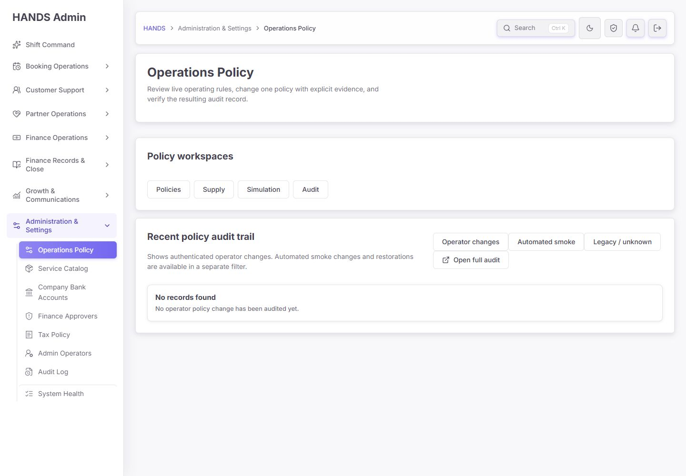
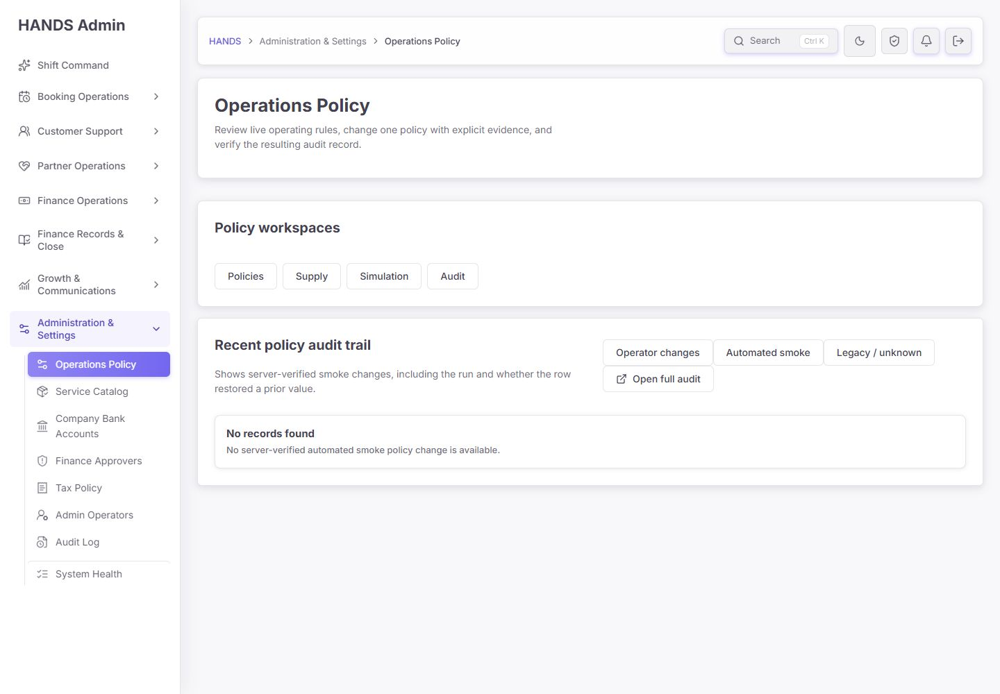
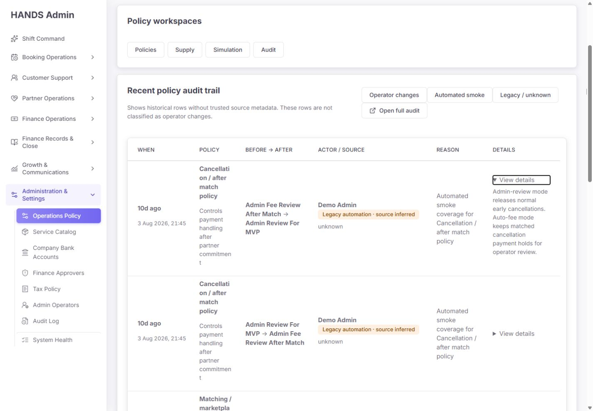
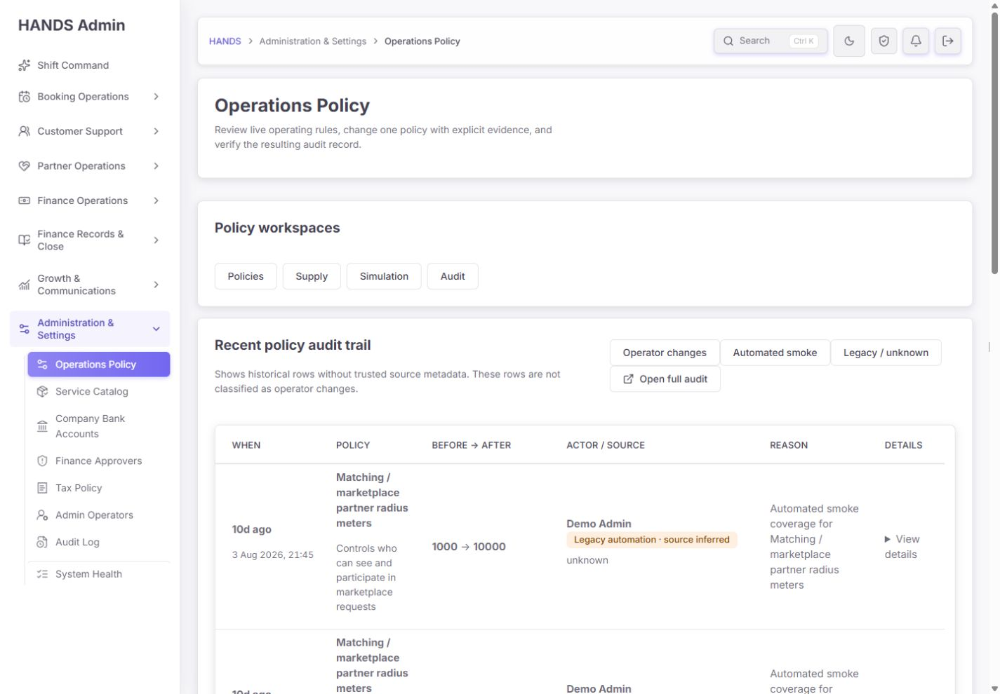
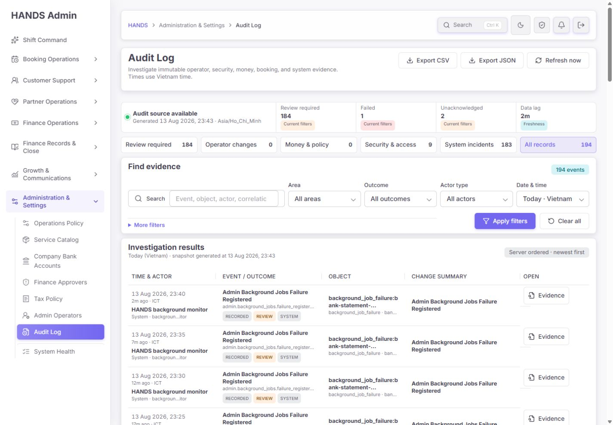
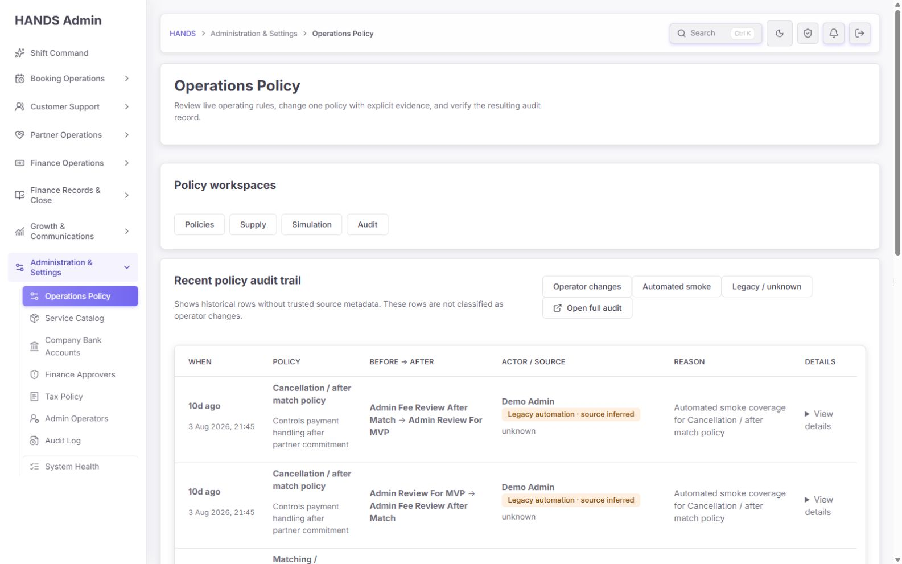
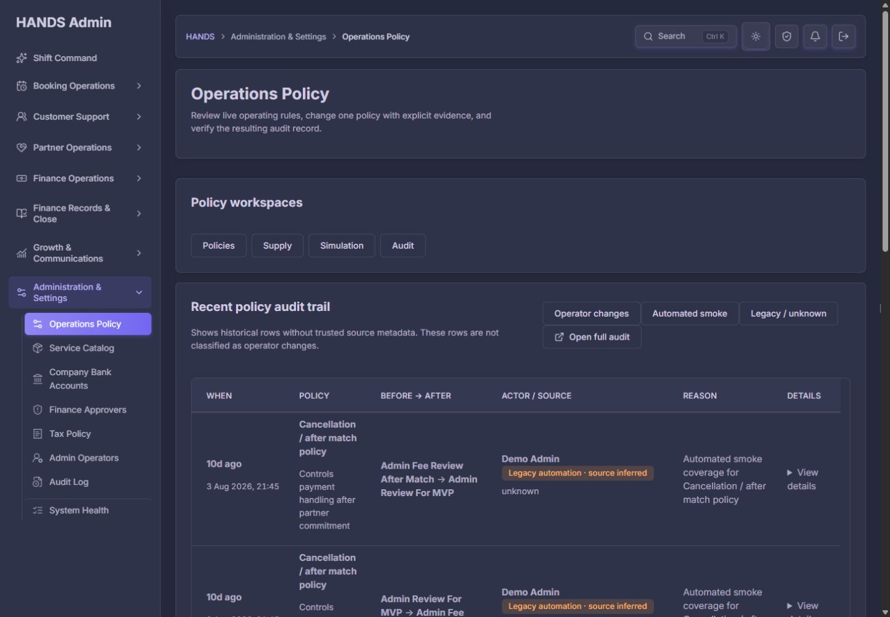

# Operations Policy · Audit 최종 재감사 보고서

- 감사일: 2026-08-13
- 대상: `http://localhost:3101/operations-policy?details=audit`
- 비교 기준: `docs/audits/operations-policy-final-reaudit-2026-08-13.md`
- 검사 범위: 로그인된 실제 화면, Operator / Automated smoke / Legacy source, 상세 펼침, cursor 페이지 이동, Full Audit 연결, 1440×1000·1600×1000, light·dark, 관련 Admin Web·API 코드와 단위 테스트
- 제외 범위: 사용 환경 계약에 따라 1024px 이하와 모바일/태블릿 반응형은 검사하지 않았다.
- 안전 범위: 정책 값과 운영 데이터는 변경하지 않았으며 읽기·탐색만 수행했다.

## 1. 최종 결론

**종합 점수: 68 / 100 — 핵심 분류 오류는 고쳤지만, 감사 증거 화면으로는 출시 보류가 맞다.**

이전 보고서의 가장 중요한 문제였던 “과거 자동 스모크 기록을 Operator 변경으로 오분류”하는 문제는 제대로 개선됐다. 현재는 서버가 `operator | automated_smoke | legacy_unknown`을 엄격히 나누고, 화면도 각 source를 분리해서 표시한다. Audit 모드에서 불필요한 정책 설정 전체를 읽지 않고 source별 최신 8건만 가져오는 구조도 적절하다.

그러나 감사 화면의 본래 목적은 “운영자가 나중에 사실을 증명할 수 있는가”이다. 현재 `Open full audit`는 URL에 `bucket=Operations/Policy`를 남기지만 실제 API 요청과 CSV/JSON export에는 bucket을 전달하지 않는다. 그 결과 화면에는 운영 정책 감사가 아니라 Background Jobs 실패 기록과 전체 건수가 나타난다. 또한 `View details`는 audit ID나 source metadata가 아니라 정책 효과 설명만 보여준다. 이 두 문제 때문에 현재 화면은 “최근 변경 참고표”로는 쓸 수 있지만 “감사 증거 워크스페이스”로는 신뢰할 수 없다.

### 판정 요약

| 영역 | 점수 | 판정 |
|---|---:|---|
| Source 분류·서버 계약 | 90 | 이전 핵심 오류 해결 |
| 감사 데이터 신뢰성 | 52 | Full Audit scope 불일치로 실패 |
| 운영 흐름·탐색 | 61 | 앞으로만 이동하는 pagination이 병목 |
| 1440px 정보 밀도·가독성 | 58 | 8행을 읽는 데 2,472px 세로 스크롤 필요 |
| 문구·정보 구조 | 74 | source 설명은 좋아졌지만 증거와 설명이 섞임 |
| 접근성·상태 인지 | 70 | 의미 구조는 좋으나 active 상태가 시각적으로 보이지 않음 |
| 성능·실패 처리 | 90 | bounded request, 명시적 실패 상태, console 오류 없음 |

### 출시 판단

- **최근 변경 참고 기능:** 조건부 통과
- **감사 증거 조사 기능:** 보류
- **P0 해결 후 예상 품질:** 78~82점
- **P0와 P1 전체 해결 후 목표:** 86점 이상

## 2. 이전 보고서 대비 개선 확인

### 완료 1 — 과거 smoke 기록이 Operator로 섞이지 않는다

기본 화면은 Operator 변경 0건을 정확하게 보여주고, 출처 metadata가 없는 과거 레코드는 `Legacy / unknown`으로만 노출된다. 과거 레코드의 reason이 자동 스모크 형식일 때도 `Legacy automation · source inferred`라고 명시하여 “추정”과 “검증된 source”를 구분한다.

코드 근거:

- `apps/api/src/admin/admin.service.ts:31328-31354` — source별 server-side where와 최대 8건 cursor 조회
- `apps/admin_web/app/operations-policy/policy-audit-rows.ts:34-39` — 3상태 source 모델
- `apps/admin_web/app/operations-policy/operations-policy-audit-trail-section.tsx:65-70` — source별 설명 문구

판정: **완료**

### 완료 2 — source를 필터한 뒤 최신 8건을 가져온다

이전처럼 50건을 받아 클라이언트에서 source를 걸러내지 않는다. API가 source를 먼저 적용하고 `take + 1`을 읽어 다음 cursor를 계산한다. 특정 source의 기록이 전체 최신 50건 밖에 있어도 누락되지 않는 구조다.

판정: **완료**

### 완료 3 — Audit 화면이 불필요한 settings 요청을 하지 않는다

`apps/admin_web/app/operations-policy/operations-policy-page-model.ts:73-80`에서 Audit 모드는 policy audit endpoint만 요청하고 settings는 읽지 않는다. 이 화면 범위에서 성능 방향은 올바르다.

판정: **완료**

### 완료 4 — API 실패와 실제 0건을 구분한다

`apps/admin_web/app/operations-policy/page.tsx:462-478`은 audit API 실패 시 `Policy audit unavailable`과 Retry를 표시하고, 성공한 빈 응답만 empty state로 렌더링한다. 운영자가 장애를 “변경 없음”으로 오판하지 않게 한 점은 좋다.

판정: **완료**

## 3. 화면별 증거 검토

### 화면 1 — Operator changes 기본 상태: ⚠️ 대체로 양호



- 자동 스모크 레코드가 더 이상 Operator에 섞이지 않는다.
- `No operator policy change has been audited yet.` 문구는 현재 상태를 거짓 없이 설명한다.
- 다만 Operator 탭과 상단 Audit workspace가 선택된 상태라는 시각적 표시가 없다.
- “어느 기간을 조회한 0건인지”와 “다음 실제 정책 변경부터 기록되는지”가 없어 0건의 의미를 즉시 판단하기 어렵다.

### 화면 2 — Automated smoke 0건: ⚠️ 분류는 정확, 운영 안내는 부족



- 서버 검증 source만 이 탭에 표시한다는 설명은 좋다.
- 현재 데이터가 0건인 상태를 오류와 구분한다.
- 마지막 smoke 실행 시각, 마지막 성공/실패, System Health 연결이 없어 운영자는 “아직 실행되지 않음”과 “실행됐지만 기록 실패”를 이 화면만으로 구분할 수 없다.

### 화면 3 — Legacy / unknown 목록: ❌ 읽기 밀도 실패


- `Legacy automation · source inferred`는 과거 데이터의 불확실성을 정직하게 표현한다.
- 그러나 1440px에서 Policy 열은 약 132px에 불과해 정책명이 3~5줄로 갈라진다.
- 접힌 첫 행 높이가 약 216px이고 8행 문서 높이가 2,472px다. 8건을 비교하기 위해 긴 세로 스크롤이 필요하다.
- Actor / Source 열은 약 294px인데 Policy는 132px라 업무 중요도와 열 폭 배분이 반대다.
- `unknown`만 별도 줄에 노출되어 무엇이 unknown인지 즉시 알기 어렵다.

실측 근거: `browser-metrics.json`

- viewport: 1440×1000
- table cell widths: 158 / 132 / 196 / 294 / 169 / 102
- collapsed first row: 약 216px
- document height: 2,472px
- horizontal overflow: 없음

### 화면 4 — View details 펼침: ❌ “감사 상세”가 아니다



현재 펼침 영역은 `row.effect`만 보여준다. 이는 정책이 어떤 영향을 주는지 설명하는 도움말이지, 이 이벤트가 실제로 발생했다는 증거가 아니다.

현재 누락된 핵심 증거:

- audit event ID
- 정확한 policy key와 target
- source 원문과 source 검증 여부
- environment
- smoke run ID와 restoration 여부
- actor 식별값
- exact timestamp
- before / after 원문
- request ID / correlation ID가 존재할 경우 해당 값
- 해당 이벤트를 Full Audit drawer에서 여는 링크

코드 근거: `apps/admin_web/app/operations-policy/operations-policy-audit-trail-section.tsx:115`

### 화면 5 — Older records: ❌ 되돌아오는 조작이 없다



`Older records`는 cursor를 적용해 다음 8건을 정상 표시한다. 하지만 두 번째 페이지에도 `Older records`만 있고 `Newer records`, `Previous page`, `First page`가 없다. 운영자는 브라우저 Back을 알아서 써야 한다.

코드 근거:

- component props에는 `nextHref`만 있음: `operations-policy-audit-trail-section.tsx:12-16`
- 페이지 footer도 `Older records`만 렌더링: 같은 파일 `:130`
- page는 `nextCursor`만 전달: `page.tsx:473-476`

### 화면 6 — Open full audit: ❌ P0 데이터 scope 불일치



링크 주소는 `/audit-log?bucket=Operations%2FPolicy`지만 실제 화면에는 다음이 표시됐다.

- 전체 194건
- 검토 필요 184건
- System incidents 183건
- `Admin Background Jobs Failure Registered` 레코드
- Area는 `All areas`
- `Operations / Policy` scope가 적용됐다는 표시 없음

정확한 원인은 코드로 확인됐다.

1. `auditFilters`는 bucket을 읽는다: `apps/admin_web/app/audit-log/page-content.tsx:291-303`
2. 브라우저 URL을 만들 때만 bucket을 별도로 추가한다: `:332-339`
3. 실제 API와 export가 공통 사용해 만드는 `auditFilterParams`에는 bucket이 빠져 있다: `:341-359`
4. 따라서 `/admin/audit-logs/page`와 CSV/JSON export는 Operations/Policy scope를 받지 않는다.
5. API에는 이미 올바른 bucket where가 있다: `apps/api/src/admin/admin.service.ts:35279-35292`

추가로 현재 Full Audit 링크는 range를 지정하지 않아 Audit Log 기본값인 `Today`로 열린다. bucket 전달만 고치면 10일 전 legacy 기록은 여전히 보이지 않는다. 이 링크는 최소한 `bucket=Operations/Policy&range=all&sort=newest`를 명시해야 한다.

### 화면 7 — 1600px: ⚠️ 개선되지만 근본 문제는 유지



1600px에서는 열 폭과 줄바꿈이 조금 좋아지지만 Reason, Actor / Source, Policy가 반복되어 여전히 행이 높다. “1440에서만 나쁜 반응형 문제”가 아니라 정보 구조 자체의 문제다.

### 화면 8 — Dark mode: ⚠️ 테마 안정, 선택 상태 실패



- 대비, border, badge, 테이블 배경은 안정적이며 가로 overflow가 없다.
- 그러나 선택된 `Audit`와 `Legacy / unknown`은 비선택 버튼과 computed background, border, color, font-weight, shadow가 모두 동일했다.
- `aria-current="page"`는 들어가지만 시각적으로는 현재 위치를 판단할 수 없다.

## 4. 우선순위별 수정 요구사항

### P0-1. Full Audit의 bucket·기간·export scope를 실제 데이터 요청에 적용한다

문제:

- URL은 Operations/Policy처럼 보이지만 API 결과와 export는 전체 감사다.
- 운영자가 잘못된 전체 건수와 다른 영역의 사건을 보고 정책 감사라고 오판할 수 있다.
- 화면과 CSV/JSON이 서로 같은 scope라고 보장할 수 없다.

수정:

1. `auditFilterParams`가 `filters.bucket`도 포함하게 한다.
2. workspace API, evidence drawer URL, pagination, refresh, saved view, CSV, JSON이 같은 normalized filter builder를 사용하게 한다.
3. `Open full audit`는 `range=all&sort=newest&bucket=Operations/Policy`로 연다.
4. Audit Log 상단에 `Scope: Operations / Policy` chip 또는 고정 context banner를 표시한다.
5. `Clear refinements`는 bucket을 유지하고 검색·area·date만 초기화한다. scope를 벗어나는 별도 액션은 `Exit policy scope`로 명확히 제공한다.
6. `activeFilterLabels`에 bucket을 포함한다.

완료 기준:

- 화면 결과, summary count, facets, saved-view count, pagination, refresh, CSV, JSON에 같은 bucket이 적용된다.
- Operations/Policy scope에서는 `operational_policy.*`가 아닌 action이 한 건도 나오지 않는다.
- 10일 전 legacy 레코드가 Full Audit 첫 조사 흐름에서 검색 가능하다.
- 현재 URL만 보고 적용 상태를 추측하지 않아도 화면에서 scope를 확인할 수 있다.

### P1-1. View details를 “Policy effect”와 “Audit evidence”로 분리한다

문제:

- 현재 details는 `row.effect` 한 줄뿐이다.
- 동일한 `View details` 링크가 반복되어 screen reader와 키보드 사용 시 어느 정책의 상세인지 식별하기 어렵다.

수정:

- 표의 액션 이름을 `Open evidence`로 바꾸고, 해당 event ID가 선택된 Audit Evidence drawer를 연다.
- drawer 또는 전폭 확장 행에 다음을 제공한다: event ID, policy key, exact timestamp, actor, source, environment, run ID, restoration, reason, before, after, request/correlation ID.
- 정책 효과 설명은 `Operational effect`라는 별도 subsection으로 유지한다.
- 반복 링크의 accessible name은 `Open evidence for {canonical policy label}, {exact timestamp}`로 만든다.
- event ID와 request/correlation ID에는 Copy 기능을 제공한다.

완료 기준:

- 한 행에서 실제 감사 이벤트를 고유 ID로 식별할 수 있다.
- compact Audit와 Full Audit drawer가 같은 event를 보여준다.
- legacy row는 source가 추정임을 drawer에서도 명확히 유지한다.

### P1-2. cursor pagination을 양방향으로 만든다

문제:

- 다음 페이지로 이동한 뒤 UI로 돌아올 수 없다.

수정 선택지:

- 권장: API가 `nextCursor`와 `previousCursor`를 제공하고 `direction=older|newer`를 지원한다.
- 최소안: URL에 cursor history를 안전하게 보존하고 `Newer records`와 `First page`를 제공한다.
- footer는 `8 records · Page 2` 또는 정확한 범위를 표시한다.

완료 기준:

- First / Newer / Older가 모두 키보드와 mouse로 작동한다.
- source 변경 시 cursor history는 초기화된다.
- 같은 이벤트가 페이지 경계에서 중복되거나 누락되지 않는다.

### P1-3. 1440px 테이블의 열 우선순위와 상세 표현을 재설계한다

문제:

- 가장 중요한 Policy 열이 가장 좁은 축에 속한다.
- native `<details>`가 작은 마지막 cell 안에서 열리며 전체 행을 불필요하게 키운다.

권장 구조:

| 열 | 권장 폭/역할 |
|---|---|
| When | 148px, relative + exact time |
| Policy | 최소 220px, canonical label + category |
| Change | 최소 200px, before → after |
| Actor / Source | 최소 190px, actor + source badge |
| Reason | 최소 240px, 2줄 clamp 후 drawer에서 전체 표시 |
| Evidence | 104px, `Open` 단일 액션 |

세부 원칙:

- collapsed row 목표 높이는 96~120px로 제한한다.
- `unknown`은 `Environment not recorded`처럼 무엇이 없는지 표시한다.
- effect는 작은 cell이 아니라 drawer나 다음 전폭 행에서 보여준다.
- policy label은 key를 `/`로 단순 변환하지 말고 `OPERATIONAL_POLICY_DEFINITIONS`의 canonical label을 사용한다.
- 표 전체 min-width는 약 1,100px로 명시하고 Admin content 폭이 좁을 때만 표 영역을 가로 스크롤한다.

완료 기준:

- 1440×1000에서 첫 5~6행을 한 화면에 비교할 수 있다.
- Policy명이 단어 단위로 과도하게 쪼개지지 않는다.
- 펼치기 전 행 높이가 120px를 넘지 않는다.
- 1600px에서 공간이 늘면 Reason과 Policy가 자연스럽게 확장된다.

### P1-4. workspace와 source의 active 상태를 시각적으로 표시한다

문제:

- `aria-current`만 있고 실제 색·border·weight·shadow가 동일하다.

수정:

- 공통 segmented control 또는 filter chip의 `is-active` 스타일을 재사용한다.
- active 상태는 배경색만 바꾸지 말고 leading indicator, border 또는 underline도 함께 사용한다.
- light와 dark 모두 인접 색 대비를 확인한다.
- `Audit` workspace와 `Operator/Automated/Legacy` source 두 레벨은 시각 위계를 다르게 한다.

완료 기준:

- 색각에 의존하지 않고 현재 workspace와 source를 구분할 수 있다.
- `aria-current="page"`와 시각 active class가 항상 같은 링크에만 적용된다.

### P2-1. Legacy empty state 문구 분기 오류를 고친다

`operations-policy-audit-trail-section.tsx:123-127`은 operator가 아니면 모두 automated-smoke 문구를 사용한다. 따라서 Legacy가 0건이 되는 순간 잘못된 문구가 노출된다.

권장 문구:

- Operator: `No authenticated operator policy changes are recorded.`
- Automated smoke: `No server-verified automated smoke policy changes are recorded.`
- Legacy: `No historical policy changes without trusted source metadata were found.`

### P2-2. 빈 상태에 조회 범위와 다음 행동을 제공한다

- `All recorded history · 0 operator changes`처럼 범위를 명시한다.
- Operator empty에는 `New authenticated policy changes will appear here after save.`와 `Open Policies`를 제공한다.
- Automated smoke empty에는 마지막 smoke 상태를 읽을 수 있을 때만 `Open System Health`를 제공한다.
- API가 효율적으로 제공할 수 있다면 source별 total을 같은 응답의 summary로 내려 탭에 count를 표시한다. count를 위해 source별 추가 3회 요청을 만들지는 않는다.

### P2-3. Legacy provenance를 사람이 읽는 문장으로 바꾼다

- `unknown` → `Environment not recorded`
- `Legacy automation · source inferred` 옆 tooltip/help text: `Reason resembles an older smoke event, but source metadata was not recorded.`
- 추정 데이터를 자동으로 “verified smoke”로 승격하지 않는다.
- runId가 없는 change/restore 쌍을 UI가 임의로 묶지 않는다.

### P2-4. 감사 상태·레코드 수를 헤더에서 설명한다

현재 제목 `Recent policy audit trail`은 실제 조회가 “최근 8건”이고 기간 제한은 없다는 사실을 숨긴다.

권장:

- title: `Policy audit trail`
- status: `Showing 8 most recent legacy records`
- footer: `Older available` 또는 `End of history`
- source별 데이터가 0건일 때도 범위와 source를 동일한 위치에서 유지한다.

## 5. 접근성 검토

### 확인된 장점

- 실제 table / th / td 구조를 사용한다.
- 날짜는 상대 시간과 exact time을 함께 제공한다.
- source 링크는 route navigation에 맞게 `aria-current="page"`를 쓴다.
- details/summary는 기본 키보드 동작을 제공한다.
- 가로 overflow 없이 1440과 1600에서 렌더링된다.
- light/dark 모두 텍스트와 surface는 육안상 안정적이다.

### 남은 문제

- active 상태가 시각적으로 보이지 않는다.
- 반복되는 `View details`의 accessible name이 모두 같다.
- 작은 cell 안에서 펼쳐지는 긴 문장이 표의 reading order와 행 비교를 방해한다.
- `unknown`은 label 없이 값만 있어 의미가 불명확하다.
- 403 계정과 강제 API 실패는 이번 로그인 세션에서 시각 검증하지 못했다. 코드는 명시적 denial/error state를 갖고 있지만 실제 화면 회귀 테스트가 추가로 필요하다.

## 6. 성능·안정성 검토

### 좋은 점

- Audit route는 settings, booking sample, provider sample을 요청하지 않는다.
- source별 최대 8건 + 1 probe만 읽는다.
- client-side 대량 필터가 없다.
- 현재 브라우저 console에 warning/error가 없었다.
- API 실패를 empty state로 위장하지 않는다.

### 주의할 점

- source tab 이동은 각 route에서 서버 요청을 다시 한다. 현재 데이터 크기에서는 합리적이며 세 source를 한 번에 미리 읽는 것보다 낫다.
- source count를 추가할 경우 세 번의 list request를 만들지 말고 단일 grouped summary 또는 기존 query에 작은 summary를 결합한다.
- Full Audit bucket 버그를 수정할 때 workspace와 export가 서로 다른 filter builder를 사용하지 않도록 단일 계약을 유지해야 한다.

## 7. 회귀 테스트 요구사항

현재 관련 테스트는 모두 통과하지만 다음 핵심 결함을 잡지 못한다.

필수 추가 테스트:

1. `buildAuditWorkspaceApiHref(buildAuditFilters({ bucket: 'Operations/Policy' }))`가 API URL에 bucket을 포함한다.
2. CSV와 JSON export가 bucket·range·sort를 보존한다.
3. Full Audit scope에서 `operational_policy.*` 외 action이 결과에 포함되지 않는다.
4. `Open full audit` 링크가 `bucket=Operations/Policy&range=all&sort=newest`를 포함한다.
5. Legacy 0건은 legacy 전용 empty copy를 표시한다.
6. second cursor page에서 `Newer records`와 `First page`가 존재한다.
7. source 변경 시 cursor가 제거된다.
8. workspace·source active link에 `aria-current`와 active class가 함께 적용된다.
9. `Open evidence`의 accessible name에 policy와 timestamp가 포함된다.
10. compact Audit의 event ID와 Full Audit drawer event ID가 동일하다.
11. 1440 visual regression에서 Policy 열 최소 폭과 collapsed row 높이를 검사한다.
12. permission denied, API unavailable, true empty가 서로 다른 화면으로 유지된다.

## 8. 권장 구현 순서

1. Full Audit bucket/range/export 계약 수정 및 회귀 테스트
2. compact row → Full Audit evidence drawer 연결
3. 양방향 cursor navigation
4. 1440px 열 폭과 details 정보 구조 재설계
5. workspace/source active state
6. legacy empty copy, provenance copy, source summary
7. 1440·1600 light/dark 시각 재검수

## 9. 검증 결과

| 검증 | 결과 |
|---|---|
| Admin Web 대상 테스트 5 files | PASS — 31 tests |
| API operational 대상 테스트 | PASS — 10 tests, 651 skipped |
| Admin Web typecheck | PASS |
| Operations Policy consistency guard | PASS — 21 consumer/default checks, 28 definitions |
| Browser console warning/error | 0 |
| 1440 horizontal overflow | 없음 |
| 1600 layout | 렌더 안정, 밀도 문제는 유지 |

실행 명령:

```text
npm.cmd run test --workspace @massage-vn/admin-web -- app/operations-policy/page.spec.tsx app/operations-policy/policy-audit-rows.spec.ts app/operations-policy/operations-policy-page-model.spec.ts app/audit-log/audit-log-page-model.spec.ts app/audit-log/page.spec.ts
npm.cmd run test --workspace @massage-vn/api -- src/admin/admin.service.spec.ts -t operational
npm.cmd run typecheck --workspace @massage-vn/admin-web
npm.cmd run policy:admin-consistency
```

## 10. 증거 목록과 한계

증거 폴더: `docs/audits/operations-policy-audit-final-reaudit-evidence-2026-08-13/`

1. `01-operator-audit-empty-1440x1000.png`
2. `02-automated-smoke-empty-1440x1000.png`
3. `03-legacy-audit-records-1440x1000.png`
4. `04-legacy-row-expanded-1440x1000.png`
5. `05-legacy-older-page-1440x1000.png`
6. `06-full-audit-bucket-mismatch-1440x1000.png`
7. `07-legacy-records-1600x1000.png`
8. `08-legacy-records-dark-1440x1000.png`
9. `browser-metrics.json`

한계:

- 현재 DB에는 Operator와 server-verified Automated smoke row가 0건이므로 해당 row의 실제 visual rendering은 코드와 테스트로 보완 검증했다.
- restricted 권한 계정, 강제 API failure fixture, 실제 export 파일 내용은 이번 브라우저 세션에서 직접 검증하지 않았다.
- 스크린샷 검토는 정식 WCAG 자동/수동 적합성 인증을 대체하지 않는다.
- 사용 환경 계약에 따라 1024px 이하 문제는 보고서에 포함하지 않았다.

## 최종 한 줄 판정

**이전의 source 오분류와 과다 조회는 제대로 해결됐지만, Full Audit가 잘못된 데이터를 보여주고 row details가 증거를 제공하지 않으므로 지금은 “감사 화면 완료”로 판정하면 안 된다. P0 scope 계약과 P1 evidence 연결을 먼저 고친 뒤 재출시 판정을 받아야 한다.**
