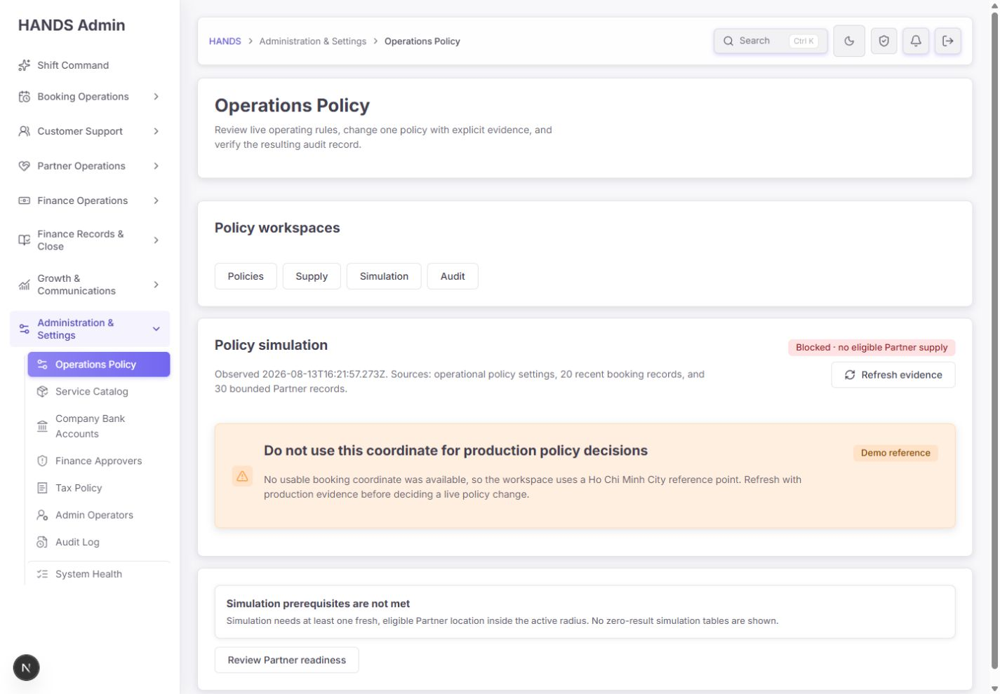
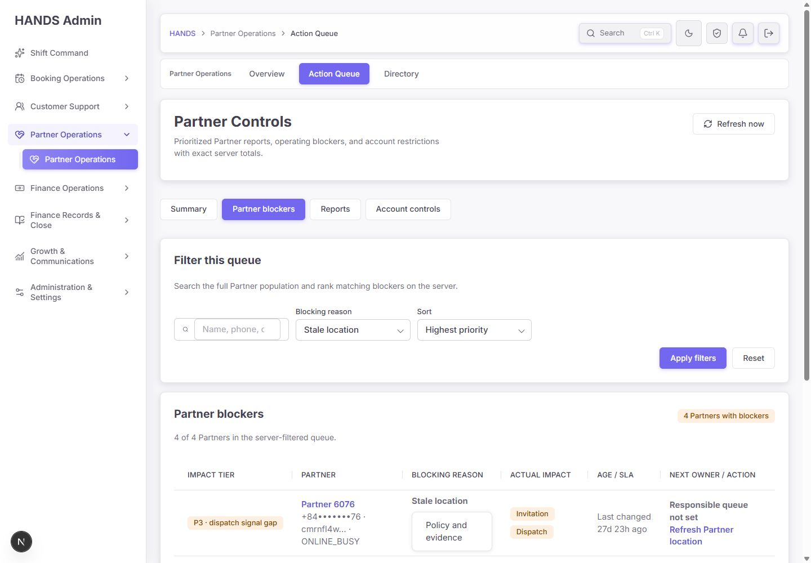
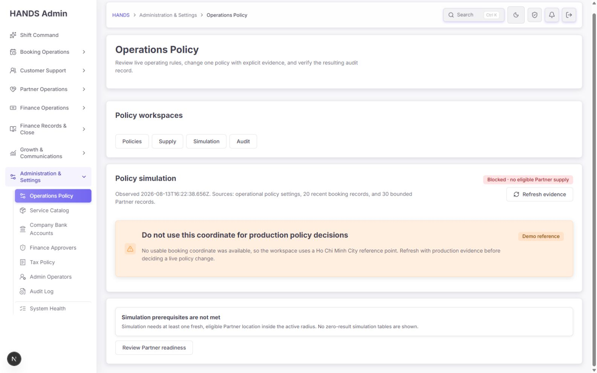
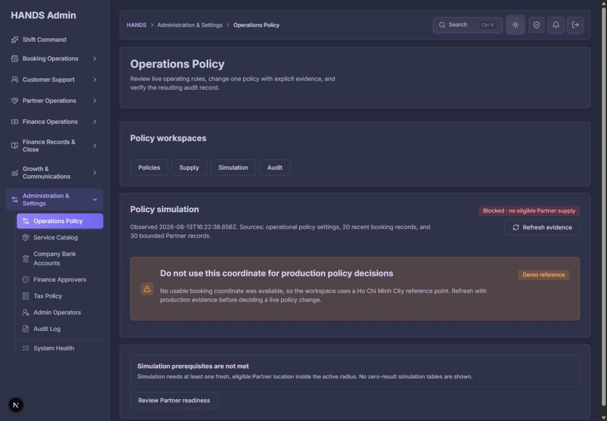

# Operations Policy · Matching Simulation 최종 재감사 보고서

- 감사 일자: 2026-08-13 (Asia/Ho_Chi_Minh)
- 대상: `/operations-policy?details=matching&matching=simulation`
- 검수 기준: 실제 운영자 판단 흐름, 화면·문구·상태·행동·코드 계산 계약·API 표본·테스트
- 화면 범위: 1440×1000, 1600×1000 데스크톱만 검수
- 제외 범위: 1024px 이하 화면, 실제 정책 저장/운영 데이터 변경

## 1. 최종 판정

**종합 점수: 66/100 · 조건부 보류(Release Hold for policy decision use)**

현재의 **차단 화면 자체는 운영자가 사용해도 된다.** 이전 감사의 가장 위험했던 문제였던 `Current snapshot` 오표현은 없어졌고, 현재는 `Blocked · no eligible Partner supply`, Demo 좌표 경고, 전제조건 미충족 안내가 일관된다. 0건 결과표도 숨겨져 화면이 짧고 명확해졌다.

그러나 이 페이지를 **실제 정책 의사결정을 위한 Simulation**으로 승인하기에는 아직 부족하다. 가장 큰 이유는 화면 디자인이 아니라 계산 계약이다. 현재 Simulation은 운영 API의 파트너 후보 30건을 받아 브라우저 쪽 별도 로직으로 재계산하며, 실제 booking marketplace 후보 조건과 동일한 함수를 사용하지 않는다. 이 때문에 실제로는 노출될 수 없는 Partner가 `eligible`, `invited`, `Ready`로 표시될 수 있다. 반대로 최신 30명 밖의 가용 Partner를 놓쳐 전체 공급이 없는 것처럼 보일 수도 있다.

또한 Demo 좌표를 쓰는 경우에도 `ready` 계산은 이를 차단 조건으로 포함하지 않는다. 현재 데이터에서는 공급도 0이라 차단됐지만, Demo HCMC 좌표 주변에 신선한 위치가 하나라도 있으면 **`Ready`와 “production decision에 쓰지 말라”는 경고가 동시에 나타날 수 있다.** 이 모순은 출시 전에 반드시 막아야 한다.

### 출시 판단을 나누면

| 사용 목적 | 판정 | 이유 |
|---|---:|---|
| 현재 공급 전제조건이 없음을 알리는 읽기 전용 화면 | 사용 가능 | 차단 상태·Demo 경고·회복 링크가 보임 |
| 현재 30명 표본의 단순 위치 진단 | 조건부 사용 | 표본 범위와 누락 가능성을 이해해야 함 |
| 실제 고객 요청의 노출/초대 Partner 예측 | 사용 금지 | 생산 매칭 자격과 다른 계산 계약 |
| 정책 변경 전 의사결정 근거 | 사용 금지 | Demo/표본/데이터 신선도/실제 계약 불일치 |

## 2. 점수표

| 항목 | 점수 | 판단 |
|---|---:|---|
| 운영 상태 인지 | 84 | Blocked와 Demo가 명확하고 0건 표를 숨김 |
| 운영 행동 연결 | 68 | CTA는 정상 이동하지만 위치 문제 하나로 과도하게 축약 |
| Simulation 계산 신뢰성 | 38 | 생산 marketplace 후보/Final Gate 계약과 불일치 |
| 근거의 신선도·표본 투명성 | 51 | 원시 ISO와 표본 수는 보이나 전체성·실제 source freshness가 없음 |
| 정보 구조·인지 부하 | 78 | 첫 화면은 짧지만 차단 시 독립적인 역사 분석까지 숨김 |
| 1440px+ 시각 완성도 | 86 | 가로 넘침 없고 light/dark 모두 안정적 |
| 접근성 | 78 | 의미론은 대체로 양호하나 현재 탭의 시각 구분이 없음 |
| 테스트·릴리스 방어 | 57 | 199개 테스트는 통과하지만 핵심 오판 시나리오가 테스트되지 않음 |
| **종합** | **66** | **차단 진단은 개선, 의사결정 Simulation은 보류** |

## 3. 이전 감사 요구사항 반영 확인

| 이전 요구 | 현재 상태 | 판정 |
|---|---|---|
| Simulation 준비 실패 시 상단을 성공처럼 보이지 않게 함 | `Blocked · no eligible Partner supply` | 완료 |
| 공급 0에서 무의미한 결과표 숨김 | table 0개, 전제조건 empty state만 표시 | 완료 |
| Demo 좌표를 생산 의사결정에 쓰지 않도록 경고 | 별도 warning notice 노출 | 완료 |
| Supply/Simulation 표본 API 제한 | booking 20, Partner 30 | 완료 — 단, 표본을 전체처럼 해석하는 새 문제 존재 |
| 진단 권한 부족을 조용히 다른 화면으로 돌리지 않음 | 코드상 명시적 403 notice | 완료 — 제한 권한 실계정은 이번 감사에서 미검증 |
| 새로고침 행동 제공 | `Refresh evidence` 정상 동작 | 완료 — source freshness 표현은 미완료 |
| 운영자가 다음 조치로 이동 | Partner Controls 위치 큐로 정상 이동 | 부분 완료 — 차단 원인 전체를 포괄하지 않음 |

## 4. 실제 화면 단계별 감사

### 4.1 첫 진입 — 건강도: 양호



좋은 점:

- 첫 화면에서 `Blocked`를 즉시 인지할 수 있다.
- Demo reference를 별도 경고로 분리해 생산 판단에 쓰면 안 된다는 문구가 보인다.
- 전제조건이 없을 때 0값 표와 카드 묶음을 렌더링하지 않는다.
- 1440px에서 문구 잘림, 가로 스크롤, 버튼 겹침이 없다.

남은 문제:

- `Blocked` 배지, Demo warning, `Simulation prerequisites are not met` 카드가 모두 같은 결론을 반복하지만 정작 **차단 원인별 수치**는 없다.
- `Observed 2026-08-13T16:22:38.656Z`는 운영자용 시간이 아니라 개발 로그에 가깝다.
- `30 bounded Partner records`는 표본이라는 사실은 말하지만, 최신 ID 기준 30명이고 전체 공급이 아니라는 핵심 한계를 설명하지 않는다.
- `Review Partner readiness`라는 넓은 이름의 CTA가 실제로는 stale-location 큐로 이동한다.

### 4.2 Refresh evidence — 건강도: 보통


링크는 정상 작동했고 화면 재요청 후 `Observed` 값이 변경됐다. 브라우저 오류·경고 로그도 없었다.

하지만 `Observed`는 `page.tsx`가 렌더링될 때 생성한 현재 시각이다. booking/Partner 레코드가 실제로 갱신되지 않아도 새로고침만 하면 시간이 최신으로 바뀐다. 따라서 운영자는 **데이터가 갱신됐다**고 오해할 수 있다.

권장 표현:

- `Checked at 23:22 ICT`
- `Partner location evidence: newest 2h ago / oldest sampled 3d ago`
- `Booking sample: latest 20 by created time, newest booking 4h ago`
- `This is a sample, not a complete supply count`

### 4.3 회복 CTA 목적지 — 건강도: 부분 양호



CTA는 `/partner-controls?details=controls&review=location`으로 정상 이동하며 현재 데이터에서는 `Stale location` 차단 4건을 보여 준다. 죽은 링크가 아니고 실제 조치 큐로 연결된 점은 좋다.

다만 Simulation의 차단 가능 원인은 위치만이 아니다. 신원/KYC/필수 문서, 서비스 제공 가능 여부, 상태, 기존 reject, 표본 누락도 후보 수를 0으로 만들 수 있다. 따라서 현재 CTA는 **복합 차단을 위치 한 가지로 오진할 수 있다.**

권장 구조:

- 주 CTA: `Review all supply blockers` → Supply workspace
- 보조 CTA: `Fix stale locations (4)` → 현재 Partner Controls 위치 큐
- 원인 카드: `Status`, `Identity/KYC/docs`, `Service eligibility`, `Location freshness`, `Inside radius`, `Sample coverage`

### 4.4 1600px 데스크톱 — 건강도: 양호



1600px에서도 카드 폭, 좌우 여백, 텍스트 길이가 안정적이다. 데스크톱 전용 운영 환경에는 적합하다. 다만 Policies/Supply/Simulation/Audit 링크 중 현재 `Simulation`은 `aria-current="page"`만 있고 네 링크의 배경·테두리·색·굵기가 모두 동일하다. 운영자는 현재 위치를 시각적으로 빠르게 찾기 어렵다.

### 4.5 Dark mode — 건강도: 양호



Dark mode에서도 차단 배지, 경고 패널, 본문, CTA가 구분된다. 육안상 심각한 대비 문제는 발견하지 못했다. 단, 이번 감사는 자동 WCAG 대비 계산 전체를 수행한 것은 아니므로 형식적 AA 인증으로 간주하면 안 된다.

## 5. 우선순위별 핵심 발견

### P0-1. Simulation이 생산 marketplace 후보 계약을 사용하지 않는다

### 증거

- `policy-simulation.ts:269-294`는 `status.startsWith('ONLINE')`, 위치 유무, 24시간 이내, `blockedAt`만으로 초기 후보를 만든다.
- `policy-simulation.ts:54-65`는 반경과 위치 신선도만으로 `eligible`, `freshEligible`, `ready`를 계산한다.
- 실제 후보 쿼리인 `bookings.backup-providers.ts:18-60`은 ONLINE_AVAILABLE/ONLINE_AVAILABLE_SOON, fresh location, verification, KYC, 필수 승인 문서, 요청 서비스, 해당 booking reject 이력 등을 함께 적용한다.
- `operations-policy.ts:180-227`의 Admin readiness 계약도 account/identity/location/push/wallet Final Gate를 별도로 판정한다.

### 운영 위험

- `ONLINE_BUSY`도 문자열이 `ONLINE`으로 시작하므로 Simulation 후보가 될 수 있다.
- KYC/verification/필수 문서가 미승인인 Partner가 `eligible`로 보일 수 있다.
- 요청 서비스를 제공하지 않는 Partner도 초대 가능 대상으로 보일 수 있다.
- 특정 booking에서 이미 reject한 Partner를 다시 포함할 수 있다.
- 결과적으로 `Ready for dispatch check`와 “real customer wait screen을 지원할 수 있다”는 문구가 사실보다 강해진다.

### 수정 원칙

클라이언트에 생산 로직을 복제하지 말고 **API에 read-only dry-run endpoint**를 만든다.

예시 계약:

```text
POST /admin/operations-policy/matching-simulation
{
  referenceBookingId | coordinate,
  policyOverrides?: {},
  dryRun: true
}
```

이 endpoint는 실제 booking marketplace 후보 선택 함수를 재사용하고, 다음을 구조화해 반환해야 한다.

- reference provenance와 사용 가능 여부
- 전체 평가 수와 단계별 제외 수
- visible / invitable / final-gate-ready 구분
- 제외 사유 코드
- 현재 정책과 제안 정책의 차이
- 데이터 관측 시각
- 어떤 저장·알림·초대도 발생하지 않았다는 dry-run 표식

### 완료 기준

- 생산 후보 함수와 Simulation이 같은 fixture에서 같은 Partner ID 집합을 반환한다.
- ONLINE_BUSY, 미승인 KYC, 필수 문서 누락, 서비스 불일치, reject 이력 케이스가 각각 제외된다.
- 실제 저장, push, participant 생성이 전혀 발생하지 않는다.

### P0-2. Demo 좌표에서도 `Ready`가 될 수 있다

### 증거

- `policy-simulation.ts:321-337`은 usable booking coordinate가 없으면 HCMC Demo 좌표를 반환한다.
- `policy-simulation.ts:65`의 `ready`는 fresh eligible 수만 확인하고 reference가 Demo인지 확인하지 않는다.
- `page.tsx:123-127`은 구조화된 상태가 아니라 `Reference location` 문자열 값이 `Demo Ho Chi Minh City`인지 검색해 경고를 만든다.

### 운영 위험

Demo 좌표 주변에 fresh Partner가 존재하면 헤더는 `Ready`, 본문은 production decision 금지 경고가 되는 모순 상태가 가능하다. 운영자는 어느 상태를 믿어야 할지 알 수 없다.

### 수정 방법

reference를 문자열이 아니라 다음처럼 구조화한다.

```ts
type SimulationReference = {
  kind: 'booking' | 'manual_dry_run' | 'demo';
  lat: number;
  lng: number;
  bookingId?: string;
  bookingStatus?: string;
  observedAt?: string;
};
```

상태도 boolean 대신 최소한 다음으로 나눈다.

- `BLOCKED_NO_REFERENCE`
- `BLOCKED_NO_ELIGIBLE_SUPPLY`
- `DEMO_PREVIEW_ONLY`
- `READY_WITH_PRODUCTION_EVIDENCE`
- `UNAVAILABLE`

Demo에서는 절대 `Ready`를 표시하지 않는다. 필요하면 `Demo preview only`로 결과는 보여 주되 정책 저장 판단과 분리한다.

### P1-1. 최신 Partner 30명 표본을 전체 공급처럼 판정한다

### 증거

- `operations-policy-page-model.ts:7-8, 67-78`은 bookings 20, providers 30으로 고정한다.
- `admin.service.ts:13048-13053`은 Provider를 `id desc`로 최대 30명 가져온다.
- 이 endpoint는 totalCount, cursor, availability/location 기반 표본 설계를 반환하지 않는다.
- 화면은 `Blocked · no eligible Partner supply`라고 전체 공급 결론처럼 표시한다.

### 운영 위험

ID가 오래된 가용 Partner는 표본에서 빠질 수 있다. 따라서 현재 계산으로 증명 가능한 것은 **“최신 ID 30명 표본에서 0명”**뿐이며 “가용 Partner가 전혀 없음”이 아니다.

### 수정 방법

최선은 P0-1의 서버 dry-run이 실제 조건으로 전체 후보를 집계하는 것이다. 임시 보완 시에는:

- 헤더를 `Blocked · 0 eligible in 30 sampled Partners`로 바꾼다.
- `sampledCount`, `totalCount`, `queryScope`, `ordering`, `truncated`를 API에서 반환한다.
- 표본이 잘렸으면 성공/실패가 아닌 `INCOMPLETE_EVIDENCE` 상태를 사용한다.

### P1-2. 신선한 현재 공급이 없으면 역사 분석까지 전부 숨긴다

### 증거

`page.tsx:440-459`에서 `policySimulation.ready`가 false이면 Live simulator뿐 아니라 다음 섹션도 모두 렌더링하지 않는다.

- Policy change impact
- Policy impact drill-down
- Policy outcome effect

이 세 분석은 이미 `page.tsx:114-121`에서 booking 20건을 사용해 계산됐고, current Partner supply가 0이어도 독립적으로 의미가 있다.

### 운영 위험

운영자가 정책을 검토해야 할 가장 위험한 시점인 공급 부족 상황에서 과거 정책 결과·snapshot drift·문제 booking 근거까지 사라진다. 현재 첫 화면이 지나치게 비어 보이는 이유이기도 하다.

### 수정 방법

Simulation 페이지를 두 영역으로 분리한다.

1. `Current dispatch preview` — reference와 current supply가 필요하며 차단 가능
2. `Historical policy evidence` — booking sample만 있으면 항상 표시

현재 dispatch preview가 차단돼도 역사 분석은 `Historical evidence remains available` 안내와 함께 보여 준다.

### P1-3. 초대 목록이 stale Partner를 포함할 수 있다

### 증거

- `policy-simulation.ts:57-61`은 `freshEligible`을 계산하지만 `invitedPartners`는 `eligiblePartners.slice(...)`로 만든다.
- `policy-simulation.ts:297-310`은 stale Partner를 warning badge로 표시한다.
- `operations-policy-live-simulator-section.tsx:91` 문구는 stale location이 dispatch count에서 제외된다고 말한다.

### 운영 위험

`Marketplace alert cap` helper에는 stale Partner도 “would be invited now”로 계산될 수 있다. 화면 문구와 실제 수치가 충돌한다.

### 수정 방법

`invitedPartners = freshEligible.slice(0, invitationLimit)`로 일치시키고, visible/invitable/final-gate-ready를 명시적으로 분리한다.

### P1-4. `Observed`가 데이터 신선도가 아니라 렌더 시각이다

### 증거

`page.tsx:96`에서 `new Date().toISOString()`으로 만들며 데이터 레코드의 max timestamp와 무관하다. 실제 Refresh에서 이 값만 새 시각으로 바뀌는 것을 확인했다.

### 수정 방법

- `Checked at`: 요청 실행 시각
- `Evidence newest at`: provider location / booking 생성 등 실제 근거의 최신 시각
- `Evidence oldest sampled at`
- `Stale evidence`: 정책 freshness 초과 여부

화면에는 ICT 절대 시각과 상대 시각을 같이 표시한다. 예: `Checked 23:22 ICT · 2 min ago`.

### P1-5. 차단 원인과 회복 행동이 너무 단순하다

현재 화면은 “fresh eligible Partner location 없음” 하나로 요약하고 location 큐 하나만 제공한다. 그러나 계산 계약을 바로잡으면 차단 원인은 여러 단계가 된다.

권장 blocker funnel:

| 단계 | 표시 예시 | 행동 |
|---|---|---|
| 평가 범위 | 120 total / 30 sampled | View sample contract |
| 운영 상태 | 8 online available/soon | Review availability |
| 신원 자격 | 5 identity ready | Review approvals |
| 서비스 자격 | 3 offer this service | Review service catalog |
| 위치 신선도 | 1 fresh | Fix stale locations |
| 반경 | 0 inside 10km | Check reference/radius |
| 최종 gate | 0 final-gate ready | Review wallet/security/push |

한 단계라도 0이 되면 그 단계가 primary blocker가 되고, CTA도 해당 큐로 연결해야 한다.

### P2-1. 이름은 Simulator지만 현재 정책의 정적 snapshot이다

Ready 상태 컴포넌트는 현재 정책값, 현재 파트너 목록, timeline, 과거 결과를 보여 주지만 운영자가 제안 값을 입력해 before/after를 비교하는 기능은 없다.

둘 중 하나를 선택해야 한다.

- 기능을 유지한다면 `Current dispatch preview`로 이름 변경
- 실제 Simulator를 원한다면 저장 없는 what-if 입력과 current/proposed diff 추가

권장 what-if 입력은 reference booking, radius, freshness, invitation cap, open mode 정도로 제한한다. `Apply policy`는 이 화면에 두지 말고 Policies 편집으로 이동시킨다.

### P2-2. 현재 workspace 탭의 시각 상태가 없다

Simulation 링크에는 `aria-current="page"`가 있어 의미론은 맞다. 하지만 1440px 측정에서 Policies/Supply/Simulation/Audit 네 링크의 배경, 테두리, 글자색, 굵기, shadow가 동일했다.

수정:

```css
.operations-policy-workspace-nav a[aria-current='page'] {
  /* 기존 primary token을 사용 */
  background: var(--admin-primary-soft);
  border-color: rgb(var(--admin-primary-channel) / .35);
  color: var(--admin-primary);
  font-weight: 700;
}
```

색만 사용하지 말고 굵기나 하단 indicator도 함께 제공한다.

### P2-3. 운영 문구가 개발자 중심이다

| 현재 | 권장 |
|---|---|
| `Observed 2026-...Z` | `Checked 23:22 ICT · 2 min ago` |
| `30 bounded Partner records` | `Latest 30 Partner records · partial sample` |
| `Simulation prerequisites are not met` | `Cannot run a production dispatch preview` |
| `No zero-result simulation tables are shown` | 제거 — 내부 구현 설명 |
| `Review Partner readiness` | 실제 목적지에 맞게 `Fix stale Partner locations` |
| `Refresh evidence` | `Re-run preview` |

## 6. 권장 최종 화면 구성

1. 페이지 제목: `Matching policy preview`
2. 상태줄: `Blocked / Demo only / Incomplete sample / Ready`
3. 근거줄: reference, checked time, evidence freshness, sample coverage
4. blocker funnel: 단계별 통과/제외 수와 primary reason
5. primary recovery CTA + 보조 큐 링크
6. current vs proposed 정책 비교 — what-if를 구현하는 경우만
7. candidate preview: `Visible`, `Invitable`, `Final-gate ready` 탭 또는 구분
8. historical evidence: current supply와 독립적으로 항상 표시
9. 안전 문구: `Dry run only · no booking, participant, or notification was created`

현재처럼 차단일 때 모든 내용을 비우지 말고, **실시간 preview만 차단하고 역사 근거는 유지**하는 것이 운영자에게 가장 유용하다.

## 7. 테스트 보강 요구사항

현재 실행 결과는 Admin 46 files / 199 tests 모두 통과했다. 그러나 `policy-simulation.spec.ts`의 핵심 builder 테스트는 ready, no-fresh, distance 세 종류뿐이며 다음 오판을 막지 못한다.

필수 추가 테스트:

1. Demo reference는 절대 production Ready가 되지 않는다.
2. ONLINE_BUSY는 invitable이 아니다.
3. location freshness를 초과한 Partner는 invite count에 들어가지 않는다.
4. verification 미승인 제외.
5. KYC 미승인 제외.
6. 필수 문서 누락 제외.
7. 요청 service 미지원 제외.
8. 해당 booking에서 reject한 Partner 제외.
9. 잘린 표본은 absolute `no supply`를 표시하지 않는다.
10. 현재 supply가 0이어도 Historical policy evidence는 렌더링된다.
11. source freshness와 checked-at이 별도 필드다.
12. dry-run 호출은 booking/participant/notification/audit mutation을 만들지 않는다.
13. 생산 후보 resolver와 simulation endpoint가 같은 fixture에서 같은 ID 집합을 반환한다.
14. workspace active link는 semantic state와 visual class/token을 함께 가진다.

## 8. 접근성·시각 품질 결과

### 통과

- 제목/섹션 heading 구조를 화면에서 이해할 수 있다.
- Demo warning과 prerequisite 상태가 접근성 snapshot에 `status`로 노출된다.
- CTA와 workspace 이동은 키보드 가능한 link다.
- 1440/1600에서 horizontal overflow가 없다.
- light/dark에서 차단 상태가 색만이 아니라 텍스트로도 표현된다.

### 보완

- 현재 workspace를 시각적으로 표시한다.
- `Blocked`의 원인을 badge 색 하나가 아니라 단계별 텍스트로 제공한다.
- 시각적 대비는 육안 검수만 통과했으므로 디자인 토큰 단위 자동 contrast 테스트를 추가한다.

## 9. 성능·안정성

- Simulation route는 settings, bookings 20, providers 30을 `Promise.all`로 읽는다.
- 현재 화면은 1440×1000에서 문서 높이 1019px, table 0개로 가볍다.
- 브라우저 console error/warn은 0건이었다.
- Admin/API typecheck가 통과했다.

성능 자체는 현재 화면의 핵심 문제가 아니다. 다만 올바른 서버 simulation endpoint를 만들 때 전체 Provider row를 반환하지 말고 **서버에서 집계 후 상위 후보와 exclude breakdown만 반환**해야 한다.

## 10. 수정 순서

### 1차 · 출시 차단 해제

1. Demo reference를 구조화하고 Ready에서 제외
2. 생산 booking candidate resolver를 재사용하는 dry-run API 도입
3. visible/invitable/final-gate-ready 정의 통일
4. stale Partner invite 오류 수정

### 2차 · 운영 신뢰성

5. sample coverage/total/truncated 표시
6. checked-at과 source freshness 분리
7. blocker funnel 및 원인별 CTA
8. current preview가 차단돼도 historical evidence 표시

### 3차 · 사용성 완성

9. Simulator 명칭 결정 또는 what-if 입력 제공
10. active workspace 시각 상태 추가
11. 운영 문구 현지화 및 내부 구현 문구 제거
12. ready, blocked, demo, incomplete, unavailable, restricted 권한 상태의 브라우저 회귀 캡처

## 11. 최종 Acceptance Criteria

- Production evidence가 없는 상태에서 `Ready`가 절대 표시되지 않는다.
- Simulation 결과와 실제 marketplace 후보 resolver 결과가 동일하다.
- 표본이 잘린 경우 전체 공급 0이라는 절대 문구가 나오지 않는다.
- 각 제외 단계의 count와 primary blocker가 보인다.
- CTA가 primary blocker에 맞는 큐로 이동한다.
- stale Partner가 `would be invited now` 수치에 포함되지 않는다.
- current supply가 0이어도 booking-based historical evidence를 볼 수 있다.
- `Checked at`과 실제 evidence freshness가 분리된다.
- Simulation 현재 탭이 색 이외의 시각 단서로 구분된다.
- dry-run이 어떤 운영 데이터도 변경하지 않는다.
- Admin/API typecheck, 정책 consistency, Simulation unit/integration/browser tests가 모두 통과한다.

## 12. 검증 명령과 결과

| 검증 | 결과 |
|---|---|
| `npm.cmd run test --workspace @massage-vn/admin-web -- app/operations-policy components/admin-form-control-usage.spec.tsx` | PASS · 46 files, 199 tests |
| `npm.cmd run typecheck --workspace @massage-vn/admin-web` | PASS |
| `npm.cmd run typecheck --workspace @massage-vn/api` | PASS |
| `npm.cmd run policy:admin-consistency` | PASS · 21 policy checks + lifecycle manifest |
| 1440×1000 light, refresh, CTA destination | PASS |
| 1600×1000 light | PASS |
| 1440×1000 dark | PASS |
| browser console error/warn | 0 |

## 13. 증거와 한계

증거 폴더: `docs/audits/operations-policy-matching-simulation-final-reaudit-evidence-2026-08-13`

- `01-simulation-default-1440x1000.png`
- `02-simulation-refreshed-1440x1000.png`
- `03-partner-readiness-destination-1440x1000.png`
- `04-simulation-default-1600x1000.png`
- `05-simulation-dark-1440x1000.png`
- `browser-metrics.json`

이번 데이터에는 fresh eligible Partner가 없으므로 실제 UI의 Ready 상태는 로그인된 브라우저에서 재현하지 못했다. Ready 상태 평가는 source와 unit fixture를 기반으로 했다. 운영 데이터를 변경해 인위적으로 Ready를 만들지 않았다. 제한 권한 계정의 403 화면도 실계정으로 재현하지 않았으며, 해당 판정은 route model과 component test 근거다.

## 14. 최종 결론

이번 수정은 **“쓸 수 없는 Simulation을 성공처럼 보이지 않게 하는 작업”에는 성공했다.** 화면도 1440px 이상에서 깔끔하고, 운영자에게 즉시 위험을 알린다.

다음 단계는 더 예쁘게 다듬는 것이 아니라 **Simulation이 생산 매칭과 같은 진실을 말하게 만드는 것**이다. P0 두 건과 P1-1~P1-4를 해결한 뒤 Ready 데이터를 준비해 다시 브라우저 회귀 검수를 통과하면, 정책 의사결정 도구로 승격할 수 있다.
