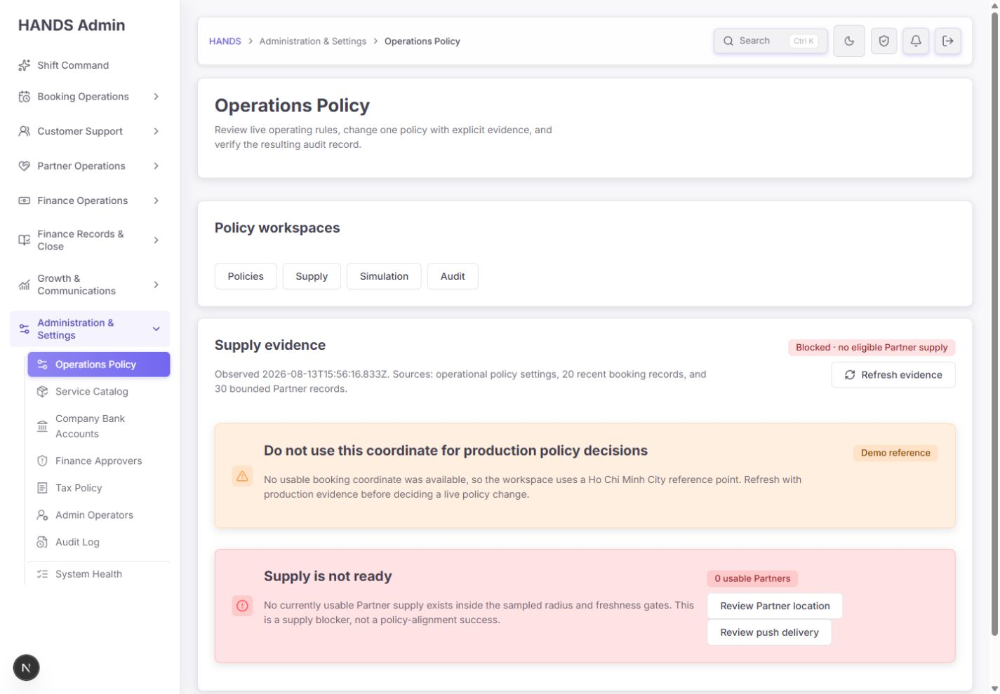
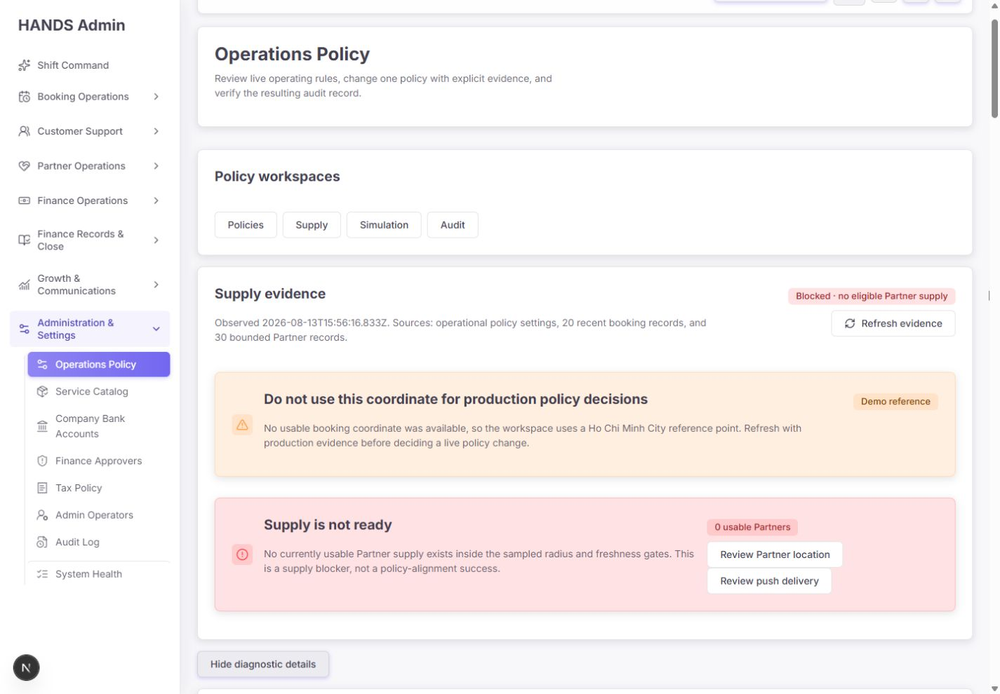
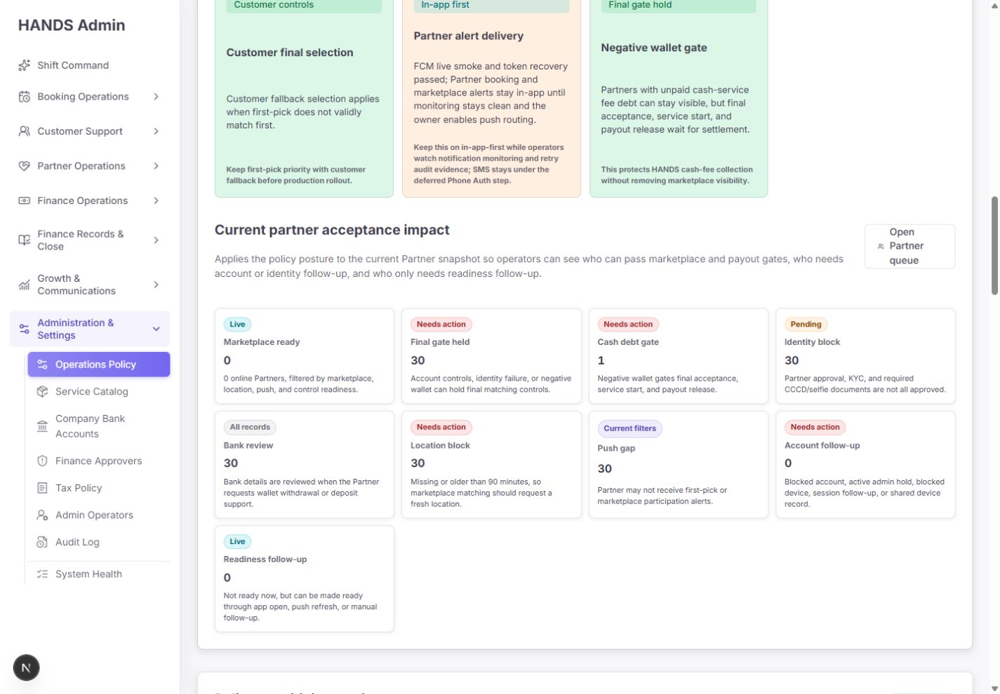
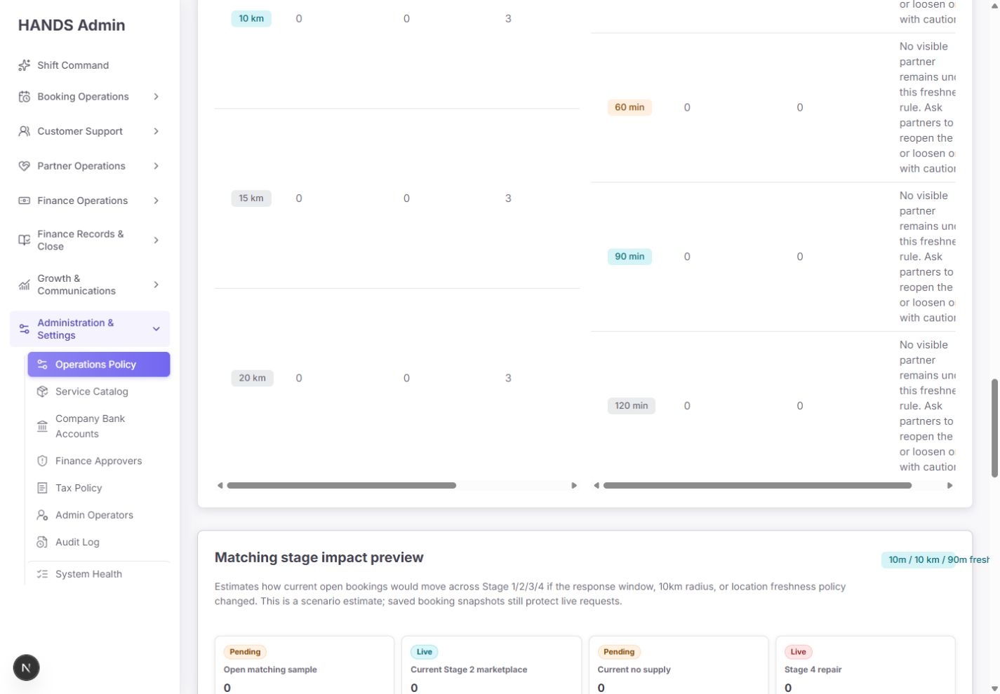
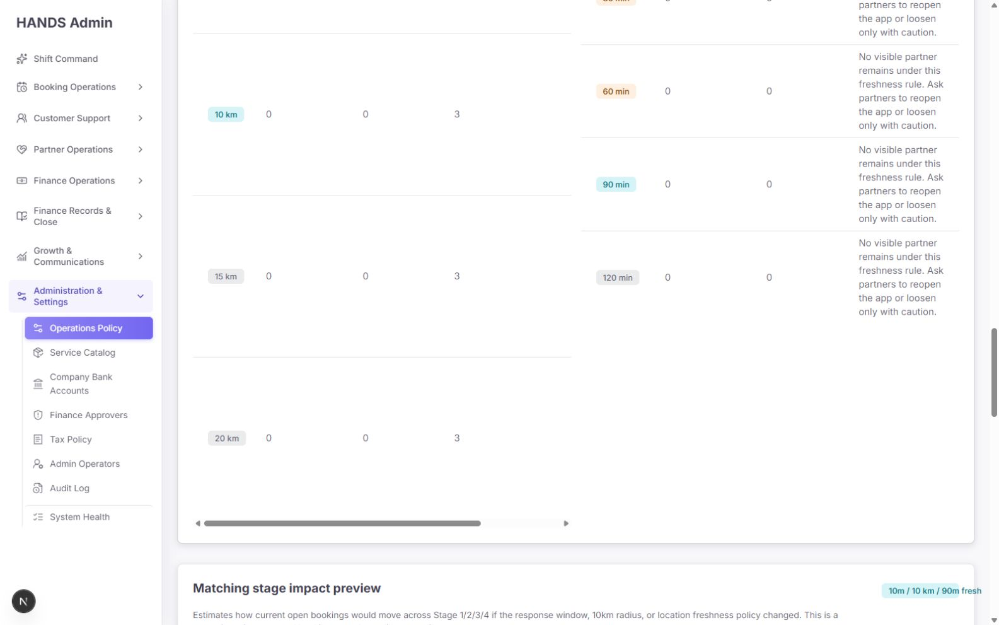
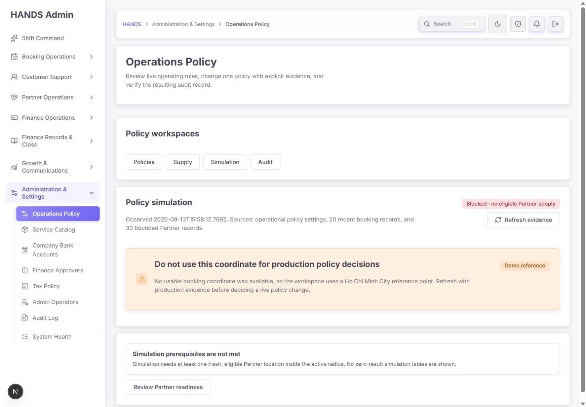
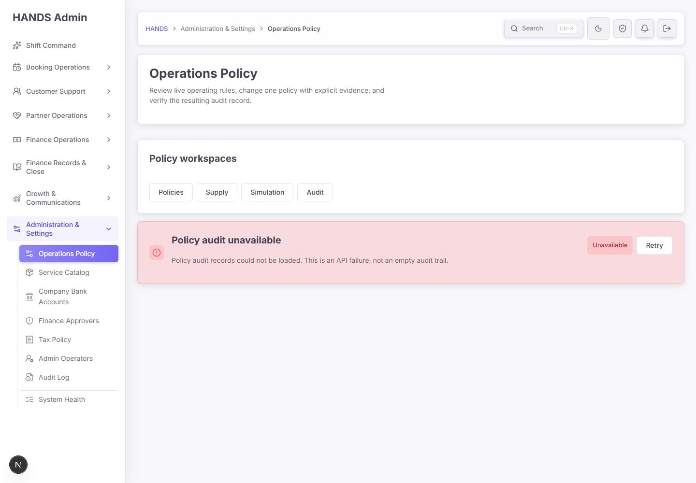
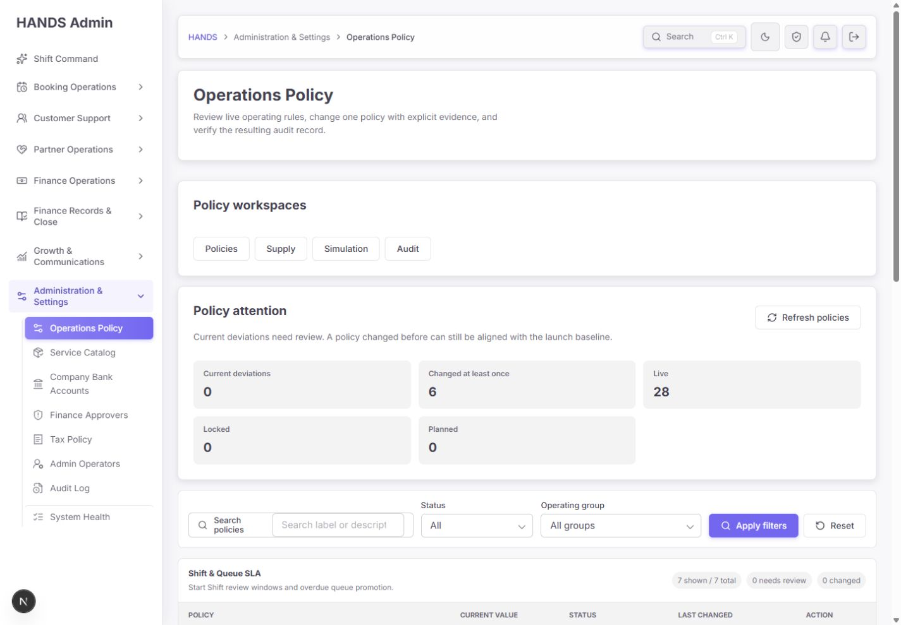
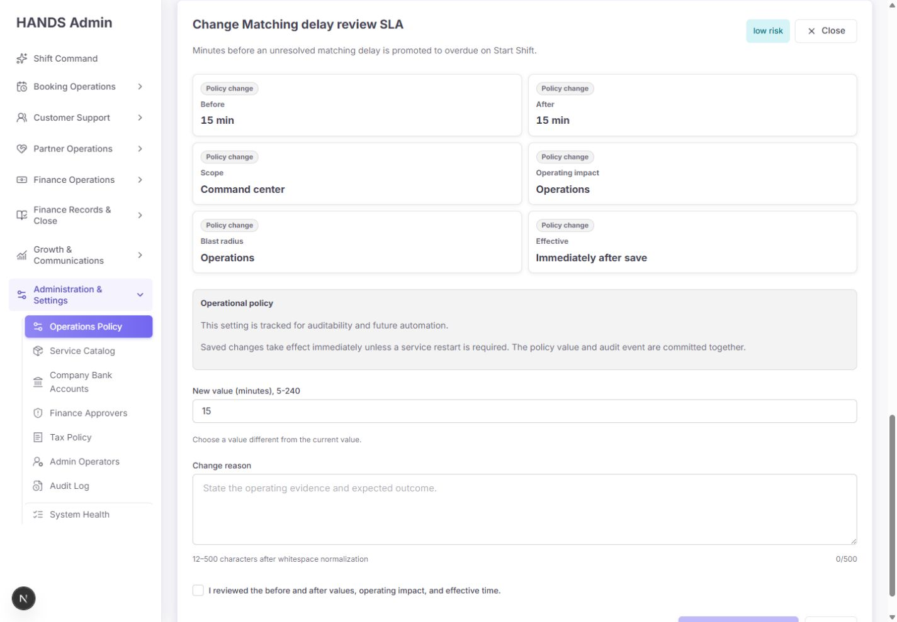
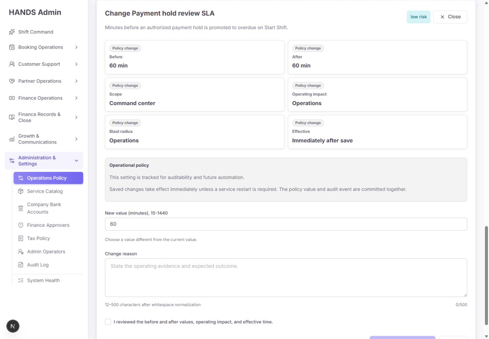

# Operations Policy / Matching Supply 개선 후 심층 재감사 보고서

- 감사 일시: 2026-08-13 (Asia/Ho_Chi_Minh)
- 대상: `/operations-policy?details=matching&matching=supply`
- 연계 검증: Policies, Simulation, Audit, 단일 정책 편집 화면
- 화면 기준: 1440×1000, 1600×1000 데스크톱만 검수
- 비교 기준: `operations-policy-final-reaudit-2026-08-13.md`, `operations-policy-final-remediation-master-2026-08-13.md`
- 검수 방식: 로그인 브라우저 시각·상호작용 검사, 현재 소스·테스트·실행 프로세스 교차 검증
- 안전 원칙: 정책 저장·롤백·실데이터 변경은 실행하지 않음

## 1. 최종 결론

이전 감사 이후 운영자 경험은 확실히 좋아졌다. 공급이 0일 때 첫 화면은 짧고 행동 중심이며, Demo 좌표를 생산 의사결정에 쓰지 말라는 경고와 `0 usable Partners` 차단 상태가 명확하다. 진단 상세는 기본적으로 DOM에서 제거되고, Simulation도 전제조건이 없으면 결과표를 숨긴다. 1440px 정책 편집 잘림, 정책 전환 시 이전 폼 값이 남던 문제, 초기부터 빨간 오류가 보이던 문제도 현재 소스와 화면에서 개선됐다.

그러나 **현재 실행 중인 통합 환경은 아직 정책 쓰기 기능을 출시하면 안 된다.** 가장 큰 이유는 다음 두 가지다.

1. 현재 API 응답에는 새 `lifecycle` 계약이 반영되지 않아 실제 화면이 28개 정책을 모두 Live로 표시한다. 최신 소스의 올바른 계약은 Live 19, Locked 2, Planned 7이다. 관리자 웹은 누락된 lifecycle을 `enforced=true`이면 Live로 간주하므로 버전 불일치가 조용히 쓰기 권한 확대로 바뀐다.
2. Audit 워크스페이스가 실제 실행 화면에서 API 오류로 사용할 수 없다. 정책을 변경한 뒤 결과를 검증하라는 페이지의 핵심 운영 절차가 끝까지 완결되지 않는다.

**종합 점수: 69/100 — 이전 61점보다 개선됐지만, 현재 통합 실행본의 정책 쓰기는 Release Hold.**

- 조회·공급 차단 판단: 조건부 사용 가능
- Simulation: 차단 상태 표현 용도로 사용 가능
- 정책 변경: 사용 중지 권고
- 출시 전 필수 조건: 관리자/API 계약 일치, lifecycle fail-closed, Audit 정상화

## 2. 점수표

| 평가 영역 | 점수 | 판단 |
|---|---:|---|
| 운영자 첫 판단 속도 | 84 | 첫 화면에서 공급 0, Demo 근거, 다음 행동을 바로 이해 가능 |
| 공급 진단 정보 구조 | 70 | 기본 화면은 좋으나 상세를 열면 6,700px대 장문 진단으로 다시 복잡해짐 |
| 정책 집행 계약의 진실성 | 48 | 소스 계약은 개선됐지만 실행 API가 구버전이고 UI가 28 Live로 오판 |
| 정책 변경 안전성 | 78 | 폼 격리·dirty guard·고위험 확인·rollback·DB lock이 구현됐으나 실행 계약 불일치가 치명적 |
| 감사 추적 가능성 | 46 | 오류와 빈 감사 구분은 좋아졌지만 실제 Audit API가 불능 |
| 1440px 데스크톱 구성 | 83 | 편집 영역과 기본 Supply는 안정적, 민감도 표의 내부 수평 스크롤은 미해결 |
| 문구·상태 의미 정확성 | 72 | 주요 차단 문구는 정확, raw ISO·자동 추론 `Live` 배지·중복 집계 해석 위험 존재 |
| 접근성·상호작용 | 82 | disclosure, alert/status, 표 헤더, 키보드용 폼 구조가 양호 |
| 회귀 검증·배포 준비도 | 61 | 정책 관련 테스트는 양호하나 실제 실행본 버전 동기화와 Audit smoke gate가 없음 |

## 3. 운영자 여정별 화면 감사

### 3.1 Supply 첫 화면 — 건강도: 양호



운영자가 5초 안에 이해할 수 있는 내용은 충분하다.

- `Blocked · no eligible Partner supply`가 페이지 결론으로 먼저 보인다.
- Demo 기준점임을 주황색 경고로 분리했다.
- `0 usable Partners`와 `Review Partner location`, `Review push delivery`가 원인 확인 경로를 제공한다.
- 공급 0을 정책 정렬 성공으로 오해하지 말라는 문구가 명시적이다.
- 상세 진단은 `Show diagnostic details`로 후순위화했다.

기본 접힘 상태의 문서 높이는 약 1,074px이고 표는 DOM에 없다. 이전처럼 첫 방문부터 수천 픽셀의 0값 표를 읽게 하지 않는 점은 좋은 개선이다.

남은 문제:

- 관측 시각이 `2026-08-13T16:05:11.225Z` 같은 raw ISO다. 방콕/베트남 현지 시각과 `방금 전`, `3분 전`이 함께 보여야 한다.
- 20 booking, 30 Partner가 “운영 전체”인지 “상한이 있는 표본”인지 첫 문장만으로 빠르게 구분하기 어렵다.
- Demo reference 상태에서는 Refresh만으로 생산 근거가 생기는지, 어떤 이벤트가 있어야 실제 좌표를 얻는지 설명이 없다.

### 3.2 진단 상세 — 건강도: 부분 개선



접힘 기능 자체는 성공했다. 다만 열었을 때는 문서 높이 약 6,797px, 표 3개, 데이터 행 19개가 한 흐름에 이어진다. 운영자가 필요한 “지금 무엇을 해야 하는가”와 정책 설계자가 필요한 상세 민감도 분석이 다시 한 화면에 섞인다.

권장 계층:

1. `Now` — 공급 차단 원인과 담당 행동 1~3개
2. `Current snapshot` — 현재 usable, fresh, in-radius, alert-ready 핵심 수치
3. `Why blocked` — 계정·신원·위치·push·wallet 원인별 겹침 집계
4. `Scenario analysis` — Radius와 Freshness를 탭 또는 별도 전체 폭 패널로 제공
5. `Matching stage preview` — 실제 open matching 표본이 있을 때만 표시

### 3.3 Partner acceptance impact — 건강도: 주의 필요



30개 Partner 표본에서 Final gate, Identity, Location, Push가 각각 30으로 보인다. 이 값들은 같은 Partner가 여러 원인에 동시에 포함될 수 있으므로 더해서는 안 되지만 화면은 그 사실을 말하지 않는다.

또한 공용 KPI 배지 자동 추론 때문에 다음 의미 오류가 생긴다.

- `Marketplace ready 0` → `Live`
- `Readiness follow-up 0` → `Live`
- `Push gap 30` → `Current filters`

`Live`는 값이 최신이라는 뜻처럼 보이지만, 운영자는 건강하거나 동작 중이라는 뜻으로 받아들일 가능성이 높다. 이 영역은 라벨 문자열로 배지 의미를 추론하지 말고 metric 데이터가 `scope`, `kind`, `tone`을 명시해야 한다.

권장 표시 예:

- `Ready now: 0` / `Blocked`
- `30 sampled Partners`
- `Blocker categories overlap — do not total these cards`
- 각 원인 카드에 `30 / 30 sampled`, `100%`와 해당 큐 링크 제공

최신 소스에서는 과거의 정적 `FCM live smoke ... passed` 문구가 `FCM readiness is not verified in this workspace`로 수정됐다. 이는 완료로 판정한다.

### 3.4 민감도 표 — 건강도: 미흡





1440뿐 아니라 1600에서도 Radius와 Freshness 표를 2열 `AdminDetailGrid`에 넣어 각각 내부 수평 스크롤이 발생한다. 긴 `Operator read` 문장이 좁은 셀에 들어가 행 높이가 커지고, 왼쪽 표와 오른쪽 표를 동시에 비교하기도 어렵다.

수정안:

- 두 표를 세로 전체 폭으로 쌓거나 `Radius | Freshness` 탭으로 한 번에 하나만 보여 준다.
- `Operator read`는 셀 장문 대신 행 선택 후 하단 설명 또는 1줄 요약으로 바꾼다.
- 기본 열은 `Tested value`, `Usable`, `Change vs current`, `Primary blocker` 네 개면 충분하다.
- 현재값 행을 강조하고, 모든 결과가 0이면 “정책을 완화해도 공급이 생기지 않음” 결론을 표 위에 고정한다.
- 표 내부 수평 스크롤을 데스크톱 1440/1600에서도 강요하지 않는다.

### 3.5 Matching stage impact — 건강도: 오류

화면의 `Open matching sample`은 0인데도 시나리오 표가 표시된다. 페이지는 `bookings.length > 0`을 조건으로 사용하지만 실제 필요한 조건은 `OPEN_MATCHING` booking 수다. 최근 booking 20건이 존재하기만 하면 open sample이 0이어도 12개 시나리오 행이 계산·표시된다.

수정안:

- `MatchingStageImpactPreview`에 `openMatchingCount` 또는 `hasOpenMatchingSample`을 명시한다.
- `openMatchingCount === 0`이면 표 전체를 `No open matching bookings to model` empty state로 대체한다.
- matched/live handoff repair는 별도 진단으로 분리해 open matching 시나리오와 섞지 않는다.
- zero sample 회귀 테스트에서 Stage 1/2/3 scenario 행이 DOM에 없음을 확인한다.

### 3.6 Simulation — 건강도: 양호



이전의 `Current snapshot` 오해 요소가 제거됐다. 현재는 `Blocked · no eligible Partner supply`, Demo 경고, `Simulation prerequisites are not met`를 일관되게 보여 주며 0값 결과표를 표시하지 않는다. 이 항목은 완료로 판정한다.

### 3.7 Audit — 건강도: 출시 차단



오류를 빈 감사 이력으로 위장하지 않는 문구는 정확하다. 그러나 실제 API가 불능이므로 운영자는 변경 전후의 감사 레코드를 볼 수 없다.

정책 화면의 안내 문구가 `change one policy ... and verify the resulting audit record`라고 명시하는 만큼 Audit 불능은 부가 기능 장애가 아니라 핵심 여정 중단이다.

권장:

- Audit API readiness를 관리자 웹이 로드 시 확인한다.
- Audit 불능이면 정책 write control을 fail-closed로 비활성화한다.
- 오류 카드에 endpoint 상태, 마지막 정상 수신 시각, correlation ID, `Open System Health`를 제공한다.
- 배포 smoke에서 Operator/Automated smoke/Legacy source 필터 각각 최소 1회 조회를 필수화한다.

### 3.8 Policies와 정책 편집 — 건강도: 소스 양호, 실행 계약 위험







좋아진 점:

- 1440px에서 편집기가 목록 아래 전체 폭으로 열려 Action/Close/Save가 잘리지 않는다.
- `key={selectedSetting.key}`와 dirty navigation guard가 구현됐다.
- Matching delay에 입력했던 값·사유·확인을 저장하지 않고 Payment hold로 이동했을 때 새 정책 값 60, 빈 사유, 미확인 상태로 초기화됐다.
- 초기 화면은 필드가 빨갛지 않고, 사용자가 건드리거나 제출을 시도한 뒤에만 오류가 보인다.
- high-risk는 정책 라벨 입력을 요구한다.
- 성공 상태에는 Audit link와 `Revert to Before`가 구현됐고 rollback도 새 PATCH/audit 경로를 사용한다.
- API 최신 소스에는 PostgreSQL advisory lock과 expectedValue 비교가 같은 transaction 안에 있다.

남은 문제:

- 실행 화면은 Live 28, Locked 0, Planned 0이다.
- 최신 API 소스 계약은 Live 19, Locked 2, Planned 7이다.
- 관리자 API 타입에서 `lifecycle`가 optional이고, UI는 누락 시 `enforced ? live : planned`로 대체한다.
- 유효한 새 값 20을 입력해도 도움말은 계속 `Choose a value different from the current value.`라고 말한다. 오류 색은 아니지만 현재 상태와 모순이다.
- 실제 save와 rollback은 데이터 변경을 피하기 위해 이번 감사에서 제출하지 않았다.

## 4. 이전 감사 항목 이행 상태

| 이전 항목 | 현재 상태 | 판정 |
|---|---|---|
| 정책 전환 시 이전 폼 상태 유지 | keyed form, dirty guard, 전환 후 값 초기화 확인 | 완료 |
| 모든 정책을 편집 가능한 Live로 표시 | 최신 소스는 19/2/7 계약 구현, 실행 화면은 여전히 28/0/0 | **미완료·P0** |
| 1440px 편집 패널 잘림 | 전체 폭 편집으로 Action/Close/Save 가시 | 완료 |
| 감사 source/cursor 서버 필터 | 최신 소스와 단위 테스트 구현 | 소스 완료, 실행 Audit 불능 |
| optimistic concurrency 원자성 | advisory lock + expectedValue + update/audit transaction 구현 | 소스 완료, 실제 동시 DB 통합증거 추가 필요 |
| 공급 0에서 장문 0표 노출 | 기본 접힘 및 DOM 제거 | 부분 완료 — 상세는 여전히 6,700px대 |
| 초기 빨간 validation | touched/submitAttempted 기반으로 변경 | 완료 |
| 유효 값에도 오해되는 helper | 중립색이지만 문구는 계속 부정확 | 부분 완료 |
| Simulation 상태 오표현 | Blocked/empty state로 정리 | 완료 |
| 권한 없는 운영자에게 진단 탭 노출 | 소스상 full diagnostics 권한 분기와 403 처리 | 소스 완료, 제한 권한 계정 실검증 미실시 |
| high-risk 확인·rollback | 라벨 확인과 Revert to Before 구현 | 소스 완료, 제출 실검증 미실시 |
| 정적 FCM smoke 성공 문구 | 최신 소스에서 `not verified`로 변경 | 완료 |
| Audit에서 불필요한 settings 조회 | load plan상 audit 전용 로드 구조 반영 | 완료 |
| 1440px 검색 필터 잘림 | Search policies 라벨 2줄, placeholder 일부 잘림 지속 | 미완료·P2 |

## 5. 우선순위별 수정 요구사항

### P0-1. Admin/API 버전 불일치가 쓰기 권한 확대로 변하는 fail-open 계약

증거:

- 실행 화면: Live 28 / Locked 0 / Planned 0
- 최신 소스 테스트 계약: Live 19 / Locked 2 / Planned 7
- API 프로세스 시작: 21:05:38, 현재 `node dist/main.js`
- dist policy/admin 파일 시각: 약 21:25
- 최신 API source 시각: 22:52
- 관리자 화면 source 시각: 22:55 이후
- `AdminOperationalPolicySetting.lifecycle`는 optional
- 목록과 편집 조건은 lifecycle 누락 시 `enforced=true`를 Live로 간주

이는 단순 “재시작이 필요함”보다 큰 계약 결함이다. rolling deploy, 캐시, 구버전 API, 부분 장애가 발생할 때 읽기 전용이어야 할 정책이 편집 가능해질 수 있다.

필수 수정:

1. Admin client의 lifecycle를 required로 바꾼다.
2. 이전 API 호환이 필요하면 missing lifecycle를 `unknown`으로 정규화하고 절대 `live`로 추론하지 않는다.
3. unknown/unsupported contract에서는 목록은 보되 모든 write action을 숨기고 `Policy contract unavailable — editing disabled`를 표시한다.
4. API 응답에 `contractVersion` 또는 `policySchemaVersion`을 넣고 관리자 웹의 지원 버전과 비교한다.
5. 관리자/API를 동일 릴리스 단위로 빌드·재시작한다.
6. 배포 후 smoke에서 정확히 19/2/7, locked/planned의 PATCH 409, live의 read-only dry validation을 확인한다.
7. System Health에 Admin build SHA, API build SHA, policy contract version을 함께 표시한다.

수용 기준:

- lifecycle 누락 응답 fixture에서 Edit 링크가 0개다.
- 실행 화면이 Live 19 / Locked 2 / Planned 7이다.
- locked/planned policy deep link를 직접 열어도 폼이 아닌 read-only notice가 보인다.
- 구버전 API와 신버전 Admin 조합 E2E가 fail-closed로 끝난다.

### P0-2. Audit API 불능 상태에서 정책 변경 여정이 열려 있음

필수 수정:

1. 현재 실행 API에 audit route/source filter 배포를 완료하고 재시작한다.
2. 정책 변경 화면을 열 때 Audit readiness를 확인한다.
3. Audit이 unavailable이면 Save를 비활성화하고 이유와 System Health 링크를 제공한다.
4. 저장 성공 응답의 audit ID가 즉시 Audit 화면에서 조회되는지 E2E로 검증한다.
5. rollback도 새 audit ID, before/after, source=operator를 남기는지 검증한다.

수용 기준:

- Operator, Automated smoke, Legacy 탭이 각각 서버 필터 결과를 표시한다.
- API 실패는 현재처럼 empty와 구분된다.
- audit 불능 상태에서 어떤 live policy도 저장할 수 없다.

### P1-1. Open matching 0인데 scenario 표가 표시됨

- `bookings.length > 0` 조건을 제거하고 실제 `OPEN_MATCHING` 수를 사용한다.
- preview model에 `openMatchingCount`를 넣어 UI가 summary 문자열을 역파싱하지 않게 한다.
- openMatchingCount=0 테스트에서 표와 12개 scenario 행이 없어야 한다.

### P1-2. 민감도 표가 1440·1600에서도 수평 스크롤을 요구함

- `AdminDetailGrid` 2열을 제거하고 full-width stack 또는 탭 구조로 전환한다.
- 긴 Operator read를 본문/드릴다운으로 옮긴다.
- current 대비 delta가 없는 절대값 표를 delta 중심으로 바꾼다.

### P1-3. 상세 진단의 행동 우선순위가 약함

- expanded 상태에서도 top actions를 sticky 또는 반복 노출한다.
- 각 blocker에 owner, queue link, affected/total, 마지막 갱신 시각을 붙인다.
- blocker category가 중복 집계임을 명시한다.

### P1-4. KPI 배지 의미가 문자열 추론에 의존함

- Supply metric model에 `scope`, `kind`, `tone`을 명시한다.
- `Marketplace ready 0`은 Live가 아니라 Blocked/0 ready다.
- `Push gap 30`은 Current filters가 아니라 Needs action이다.

### P1-5. 근거 freshness가 운영자 시간으로 표현되지 않음

- `Observed 23:05 ICT · 2 min ago`처럼 절대·상대 시각을 함께 표시한다.
- stale 기준을 정의하고 시간이 지나면 badge를 Current → Stale로 자동 전환한다.
- Refresh 성공/실패 시각을 분리한다.

### P2-1. 유효 값에도 “다른 값을 선택하라”는 helper가 남음

- 값이 현재값과 같을 때만 해당 helper를 표시한다.
- 유효하게 달라졌다면 `Will change 15 → 20 minutes`처럼 상태를 확인해 주거나 helper를 숨긴다.

### P2-2. Policies 필터의 1440px 정렬

- Search policies 라벨을 input 위로 이동하거나 최소 폭을 확보한다.
- placeholder가 잘리지 않도록 Status/Operating group과 grid 비율을 재조정한다.

### P2-3. Demo 근거 탈출 경로

- 왜 Demo 좌표가 사용됐는지 원인을 보여 준다.
- 실제 근거를 만들기 위한 구체적 행동(최근 booking 좌표 확인, 위치 permission/ingestion 확인)을 링크한다.

## 6. 권장 최종 화면 구조

```text
Supply evidence
├─ Decision strip
│  ├─ Blocked / Ready / Unavailable / Stale
│  ├─ observed local time + sample scope
│  └─ Refresh
├─ Primary blocker
│  ├─ 0 usable / 30 sampled
│  ├─ top 3 root causes (overlap noted)
│  └─ Partner location / Push delivery actions
├─ Current policy snapshot
│  ├─ 10 min first-pick
│  ├─ 10 km radius
│  └─ 90 min freshness
└─ Advanced diagnostics (collapsed)
   ├─ Partner gate breakdown
   ├─ Radius sensitivity (full width)
   ├─ Freshness sensitivity (full width)
   └─ Matching stage scenarios (only if openMatchingCount > 0)
```

## 7. 필수 회귀 테스트

1. lifecycle가 없는 API 응답에서는 write action이 0개다.
2. lifecycle 계약 수는 Live 19, Locked 2, Planned 7이다.
3. locked/planned PATCH는 409이고 audit가 생성되지 않는다.
4. 두 동시 live PATCH 중 정확히 하나만 성공, 하나는 409, audit는 한 건만 생성된다.
5. 정책 A의 dirty form에서 정책 B로 이동 시 확인 후 B의 초기 상태가 표시된다.
6. Save pending 중 정책 이동·뒤로가기·중복 제출이 차단된다.
7. 성공 후 Audit ID가 즉시 조회된다.
8. Revert to Before가 새 audit event를 생성한다.
9. Audit 불능이면 Save가 비활성화된다.
10. 공급 0 기본 화면에는 table과 scenario row가 DOM에 없다.
11. 진단 상세를 열어도 openMatchingCount=0이면 matching stage 표가 없다.
12. 1440·1600에서 민감도 표에 내부 수평 스크롤이 없다.
13. blocker category overlap 안내가 보인다.
14. `Marketplace ready 0`에 Live 배지가 붙지 않는다.
15. observed time이 ICT/localized이며 stale threshold를 넘으면 Stale로 바뀐다.
16. dark mode에서 warning/danger/info 텍스트와 버튼 대비가 유지된다.
17. 제한 권한 계정에서 Supply/Simulation/Audit 노출·403 행동이 계약대로다.

## 8. 자동 검증 결과

| 검증 | 결과 |
|---|---|
| Admin operations-policy tests | PASS — 45 files, 147 tests |
| API matching policy + audit source tests | PASS — 2 files, 19 tests |
| API admin operational policy targeted tests | PASS — 5 tests, 654 skipped |
| Admin typecheck | PASS |
| API typecheck | PASS |
| policy:admin-consistency | PASS — 21 policy key/default checks |
| API 관련 3개 파일 합산 테스트 | 677 passed, 1 failed — 실패는 operational policy가 아닌 push campaign receipt expectation |
| 브라우저 콘솔 warning/error | 정책 런타임 오류 없음; 개발 중 Fast Refresh full reload warning 1건 |

주의: 단위 테스트 통과가 현재 실행 환경의 계약 일치를 보장하지 않았다. 이번 감사에서 가장 중요한 결함은 “소스는 19/2/7인데 실제 화면은 28/0/0”인 통합 배포 불일치다. 따라서 release gate에 실제 로그인 브라우저 smoke와 build/contract version 검사가 필요하다.

## 9. 증거 목록

증거 폴더: `docs/audits/operations-policy-matching-supply-final-reaudit-evidence-2026-08-13/`

1. `01-matching-supply-1440x1000.png` — Supply 기본 접힘
2. `02-supply-diagnostics-open-1440x1000.png` — 진단 상세 상단
3. `03-supply-diagnostics-mid-1440x1000.png` — acceptance impact
4. `04-zero-sensitivity-and-stage-1440x1000.png` — 민감도·stage zero sample
5. `05-simulation-blocked-1440x1000.png` — Simulation 차단 상태
6. `06-audit-workspace-1440x1000.png` — Audit API 오류
7. `07-policies-overview-1440x1000.png` — 실행 lifecycle 28/0/0
8. `08-policy-editor-1440x1000.png` — 1440 정책 편집기
9. `09-policy-valid-not-submitted-1440x1000.png` — 유효 폼, 미제출
10. `10-policy-switch-reset-1440x1000.png` — 정책 전환 후 초기화
11. `11-supply-default-1600x1000.png` — 1600 기본 화면
12. `12-sensitivity-1600x1000.png` — 1600 내부 수평 스크롤
13. `13-supply-dark-1440x1000.png` — dark mode
14. `14-current-alert-and-impact-1440x1000.png` — 최신 FCM not verified 문구
15. `15-policies-runtime-current-1440x1000.png` — 최신 실행 lifecycle 재확인
16. `16-audit-runtime-current-1440x1000.png` — 최신 Audit 불능 재확인

## 10. 감사 제한과 신뢰 범위

- 실제 정책 저장, rollback, 운영 데이터 변경은 실행하지 않았다.
- native discard confirm의 시각 디자인은 자동화 환경 특성상 캡처하지 못했으나, 폼 상태 초기화와 source guard를 확인했다.
- 제한 권한 운영자 계정으로 403/탭 노출을 실제 재현하지 않았다.
- advisory lock은 소스와 단위 테스트로 확인했으며 실제 PostgreSQL 동시 요청 E2E는 별도로 필요하다.
- 감사 도중 operations-policy 소스가 갱신됐고 개발 서버 Fast Refresh가 발생했다. 최종 판단은 23:05 이후 최신 소스, 23:12 테스트, 최신 재캡처를 기준으로 했다.

## 11. 변경 및 보호 범위

- 이번 작업에서 제품 코드, 정책 값, DB schema, migration, auth, wallet, payment, booking/matching 로직은 변경하지 않았다.
- 추가한 파일은 이 감사 보고서, 화면 증거 PNG, 증거 메타데이터뿐이다.
- 현재 작업 트리의 기존 변경은 사용자 작업으로 간주해 건드리지 않았다.

## 12. 최종 출시 판단

이번 수정은 “운영자가 공급 0을 빠르게 인지하고 올바른 큐로 이동하는 화면”으로는 성공했다. 특히 첫 화면, Demo 경고, Simulation 차단, 폼 격리는 이전보다 훨씬 안전하다.

하지만 Operations Policy는 단순 대시보드가 아니라 실행 중인 규칙을 바꾸는 제어면이다. 제어면은 **표시된 계약, 실제 API 계약, 감사 계약**이 동시에 일치해야 한다. 현재는 소스와 실행 API가 어긋나고 Audit이 불능이므로, 디자인 완성도와 별개로 정책 쓰기 출시는 보류해야 한다.

가장 먼저 할 일은 UI를 더 꾸미는 것이 아니라 다음 순서다.

1. 현재 API를 최신 계약으로 빌드·재시작
2. lifecycle missing fail-closed 구현
3. Audit API 정상화 및 save gate 연결
4. 실행 화면 19/2/7 smoke 검증
5. 그 뒤 zero-sample stage와 민감도 레이아웃 정리
