# Operations Policy 구현 후 최종 재감사 보고서

- 감사일: 2026-08-14
- 대상: `http://localhost:3101/operations-policy`
- 포함 화면: Policies, 정책 편집기, Locked/Planned 직접 접근, Supply, Supply diagnostics, Simulation, Operator audit, Automated smoke audit, Legacy/unknown audit, audit cursor 2페이지, Full Audit 연결
- 기준 화면: **1440×1000 이상 데스크톱만 검사**
- 제외: 1024px 이하 화면, 모바일/태블릿 대응
- 방식: 로그인된 실제 화면 비파괴 조작, 신규 screenshot, 현재 소스·API·테스트·CSS 대조
- 데이터 보호: 정책 저장, rollback, 운영 데이터 생성·수정·삭제, 권한 변경을 하지 않음

## 1. 최종 판정

**종합 점수: 76 / 100 — 정책 조회·편집 안전성은 크게 좋아졌지만, 페이지 전체는 아직 출시 보류가 맞다.**

이전 보고서에서 가장 위험했던 두 문제, 즉 정책 A의 입력 상태가 정책 B로 이어질 수 있던 문제와 28개 정책을 모두 Live/editable처럼 취급하던 문제는 코드와 현재 화면에서 상당히 잘 해결됐다. 실제 화면은 `19 Live / 2 Locked / 7 Planned`를 구분하고, Locked·Planned 정책은 목록과 API 양쪽에서 쓰기를 막는다. 1440px 정책 편집기는 더 이상 Action/Close를 잘라내지 않으며, 고위험 정책은 정확한 정책명 입력을 추가로 요구한다. Supply와 Simulation도 0 usable Partner 상태를 성공처럼 표현하지 않는다.

그러나 다음 두 항목이 출시 차단 상태다.

1. **`Open full audit`가 정책 감사 범위를 실제 데이터 요청에 적용하지 않는다.** 링크 URL에는 `bucket=Operations/Policy`가 있지만 workspace API, CSV, JSON으로 전달되지 않는다. 실제 화면에는 정책 감사 대신 Background Jobs 실패를 포함한 전체 58건이 표시됐다.
2. **검사한 실행 서버가 현재 소스보다 오래된 production build다.** 3101 서버와 `.next/BUILD_ID`는 03:35에 시작·생성됐지만 `page.tsx`는 03:59, `globals.css`는 04:01에 수정됐다. 따라서 현재 코드에 추가된 일부 상태 스타일은 브라우저에 반영되지 않았다. “코드는 수정됨”과 “실행 화면도 수정됨”을 같은 것으로 판정할 수 없다.

### 영역별 점수

| 영역 | 점수 | 판정 |
|---|---:|---|
| 정책 lifecycle·runtime 진실성 | 92 | 19 Live / 2 Locked / 7 Planned, API fail-closed 확인 |
| 정책 변경 안전성 | 89 | stale-write 차단, transaction+audit, high-risk 확인, rollback 계약 양호 |
| Policies 운영 흐름 | 78 | 5열 목록은 좋아졌으나 상단 과밀 공간과 provenance 모호성 남음 |
| Supply·Simulation | 87 | Blocked/Demo/Unavailable 의미가 일관되고 zero-table 기본 노출 제거 |
| Audit source 분류 | 91 | Operator/verified smoke/legacy를 server-side로 분리 |
| Audit 증거 신뢰성 | 45 | Full Audit scope 불일치, 행별 증거 링크 부재 |
| 1440px 가독성 | 74 | 페이지 overflow는 없으나 Audit 열이 지나치게 좁고 행이 과도하게 길어짐 |
| 접근성·상태 인지 | 72 | 의미 구조는 양호하나 실행 화면에서 active 상태가 시각적으로 구분되지 않음 |
| 성능·실패 처리 | 88 | bounded request, 명시적 실패 상태, console error 없음 |
| 검증·배포 일치성 | 59 | focused tests는 양호하나 실행 build가 소스보다 오래됨 |

### 출시 판단

- **정책 목록/편집 계약:** 조건부 통과
- **Supply/Simulation 운영 참고:** 조건부 통과
- **Audit를 감사 증거로 사용:** 보류
- **Operations Policy 페이지 전체 출시:** **보류**
- **P0 해결 후 예상 점수:** 82~85점
- **P0·P1 전체 해결 후 목표:** 88점 이상

## 2. 이전 보고서 대비 실제 개선 확인

### PASS — 정책 lifecycle을 실제 계약으로 분리했다

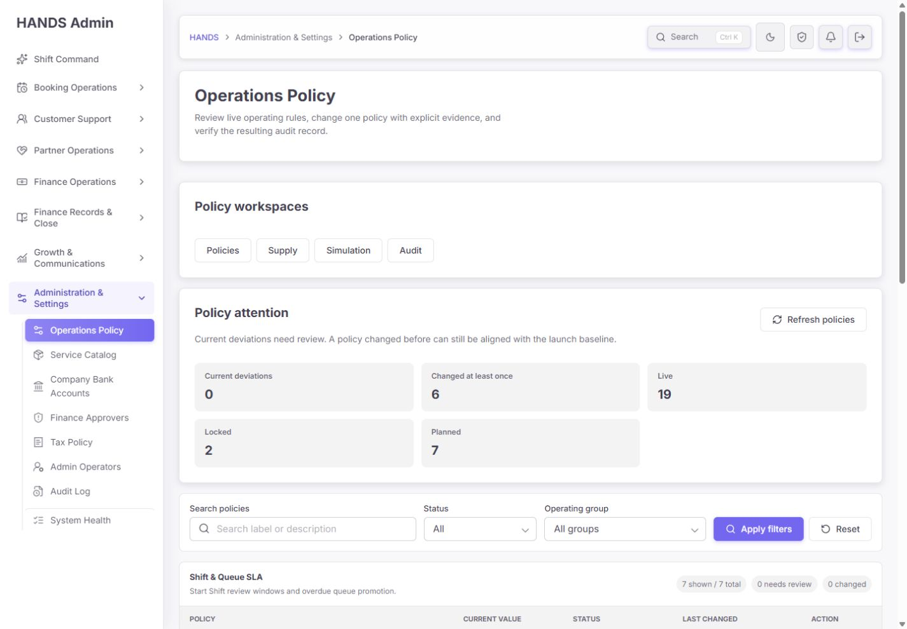

- 요약에서 19 Live, 2 Locked, 7 Planned가 정확히 분리된다.
- `matching.marketplace_open_mode`, `matching.preferred_accept_mode`는 Locked다.
- wallet/cash/payout 및 일부 exception 계약 7개는 Planned다.
- 목록은 Live에만 `Review change`, Locked/Planned에는 `Read only`를 표시한다.
- API도 lifecycle이 Live가 아니면 transaction 전에 `OPERATIONAL_POLICY_NOT_EDITABLE`로 차단한다.
- 정책 consistency 검사에서 28개 lifecycle과 runtime consumer contract가 모두 PASS했다.

### PASS — 1440px 정책 편집기 잘림이 해결됐다

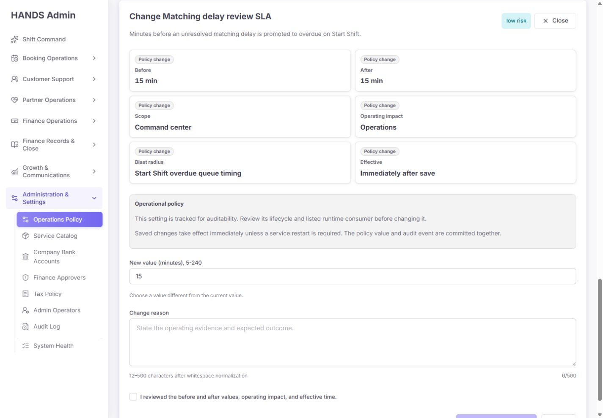

- 1440px에서 편집기는 목록 아래 full width로 열린다.
- `Before`, `After`, `Scope`, `Operating impact`, `Blast radius`, `Effective`가 한 화면 폭 안에 들어온다.
- Close, Save, Cancel이 줄바꿈되거나 Action 열이 사라지는 문제가 재현되지 않았다.
- 페이지 가로 overflow는 모든 주요 화면에서 0이었다.

### PASS — 초기 validation을 위험 상태처럼 보이지 않게 했다

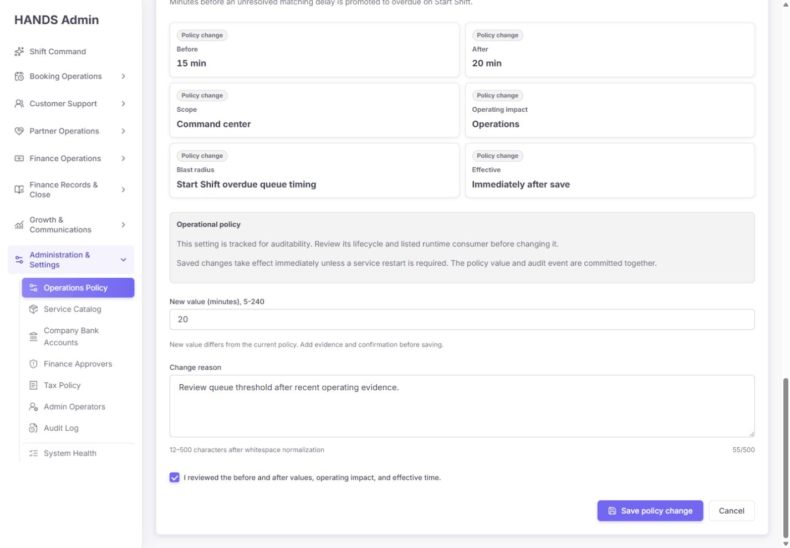

- 처음 열었을 때 빨간 field error가 나오지 않는다.
- 다른 값, 12자 이상 reason, 확인 checkbox를 충족하면 Save가 활성화된다.
- 이번 감사에서는 유효한 미제출 상태까지만 확인했고 실제 저장은 하지 않았다.

### PASS — 고위험 정책에 정확한 정책명 확인을 추가했다

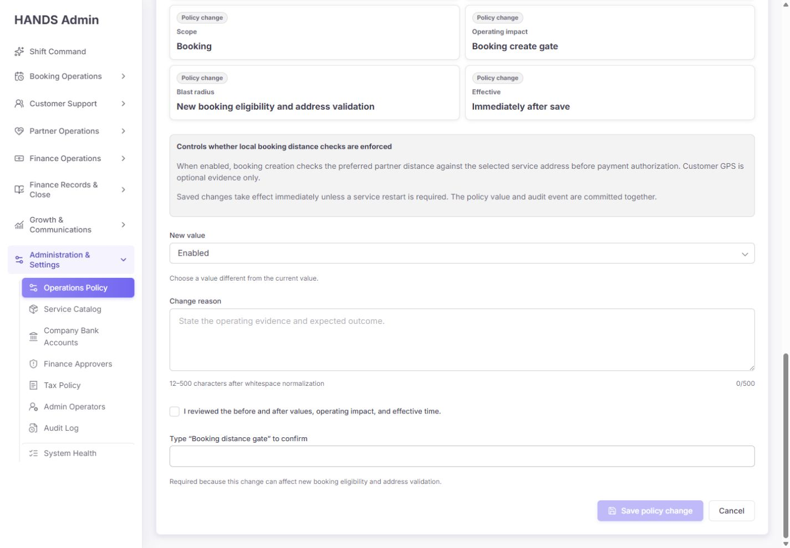

- `Booking distance gate`는 `high risk`로 표시된다.
- 일반 확인 checkbox 외에 `Type “Booking distance gate” to confirm`이 추가된다.
- 이 요구는 client validation뿐 아니라 API `updateOperationalPolicySetting`에서도 다시 검증한다.
- 성공 후에는 audit ID와 `Revert to Before`가 제공되고, revert도 expected-value contract를 사용한다.

### PASS — Locked/Planned 직접 URL 접근도 fail-closed다

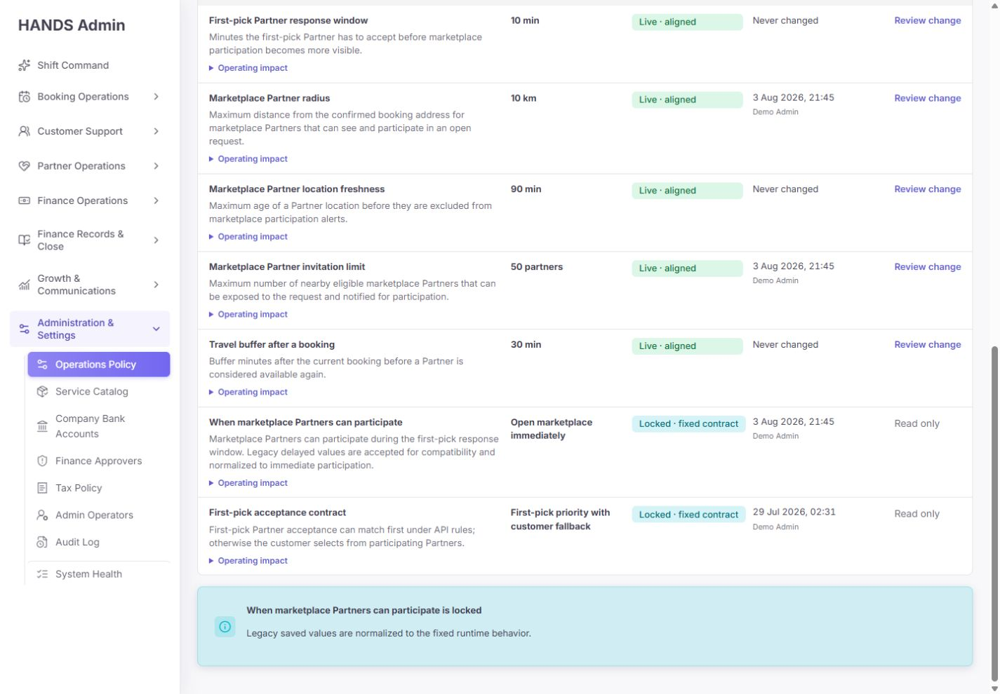

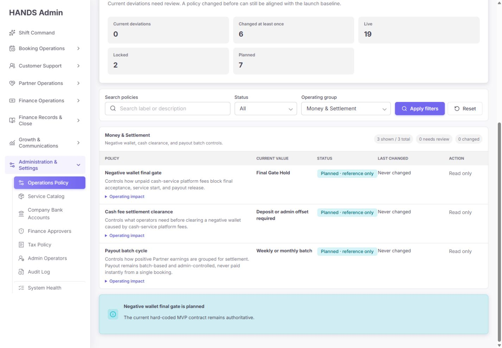

- URL에 `edit=<locked-key>` 또는 `edit=<planned-key>`를 직접 넣어도 편집 form이 열리지 않는다.
- Locked는 “legacy saved values are normalized”, Planned는 “hard-coded MVP contract remains authoritative”라고 설명한다.
- 목록과 API를 각각 우회해도 저장할 수 없는 이중 방어가 유지된다.

### PASS — Supply 0건 상태를 숨기거나 성공처럼 표현하지 않는다

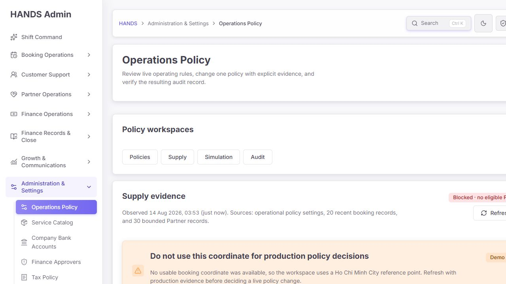

- 상단 상태는 `Blocked · no eligible Partner supply`다.
- usable booking coordinate가 없어 Demo Ho Chi Minh City 좌표를 사용한다는 경고를 먼저 보여준다.
- `0 usable Partners`를 명확히 표시하고 Partner readiness / push delivery로 연결한다.
- 긴 sensitivity table은 기본 DOM에서 제거되고 `Show diagnostic details`를 열어야 표시된다.

### PASS — Simulation이 0-result 표를 정상 결과처럼 보여주지 않는다

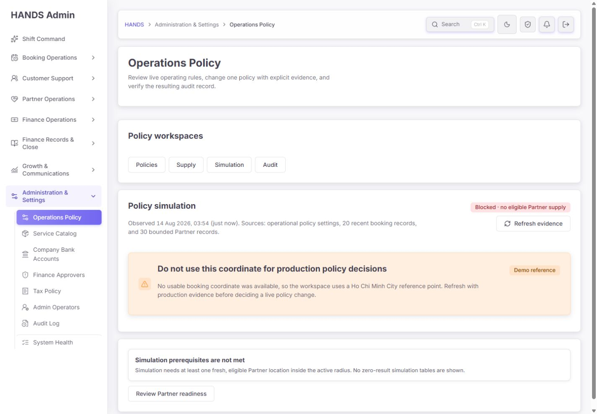

- prerequisites가 없으면 `Blocked`를 사용한다.
- “No zero-result simulation tables are shown”이라고 명시한다.
- `Review Partner readiness`라는 다음 행동을 제공한다.

### PASS — Audit source 분류와 bounded request가 개선됐다

- 기본 Operator audit에는 실제 operator row만 표시한다.
- verified metadata가 있는 smoke만 Automated smoke에 표시한다.
- metadata가 없는 과거 레코드는 Legacy/unknown으로 분리한다.
- API가 source를 먼저 필터한 뒤 최대 8건과 `nextCursor`를 반환한다.
- Audit workspace는 settings API를 불필요하게 읽지 않는다.
- API failure와 실제 0건 empty state를 서로 다르게 렌더링한다.

## 3. 화면별 잔여 문제

### 3.1 Policies overview

#### P1 — 첫 화면의 핵심 목록이 너무 늦게 시작한다

1440×1000에서 `Policy workspaces`는 약 153px, `Policy attention`은 약 310px를 차지한다. 두 카드만 약 463px이며, page header와 breadcrumb까지 더하면 첫 정책 행은 화면 아래쪽에서 겨우 시작한다.

운영자가 이 페이지에서 가장 자주 하는 일은 정책을 찾고 현재 값·상태를 읽는 것이다. 현재 구성은 탐색 탭 4개와 KPI 5개가 목록보다 우선한다.

**수정안**

- `Policy workspaces`를 독립 대형 카드가 아닌 페이지 header 하단의 compact segmented navigation으로 이동한다.
- `Policy attention`은 5개 큰 tile 대신 한 줄 command strip으로 축소한다.
- `Current deviations 0`일 때는 성공 요약 한 줄로 줄이고, deviation이 생겼을 때만 확장한다.
- 1440×1000 첫 viewport에서 filter bar와 첫 그룹의 최소 2개 정책 행이 보이도록 한다.

#### P1 — lifecycle KPI를 눌러 실제 정책을 볼 수 없다

Live/Locked/Planned 숫자는 보여주지만 filter는 `All / Needs review / Changed before`뿐이다. 운영자가 `Planned 7`을 보고 실제 7개가 무엇인지 확인하려면 그룹을 하나씩 열어야 한다.

**수정안**

- `Lifecycle` filter를 별도로 추가: `All / Live / Locked / Planned`.
- KPI tile을 link/filter trigger로 만들거나, 최소한 각 숫자 옆에 `View` action을 둔다.
- `Status`는 alignment 상태, `Lifecycle`은 실행 계약이라는 의미를 분리한다.

#### P1 — `Changed at least once`와 `Last changed`가 출처를 감춘다

현재 6개의 “Changed at least once”는 DB row의 `updatedAt`만 센다. 실제 목록은 `Demo Admin`과 날짜를 표시하지만 source가 operator인지 legacy automation인지 알 수 없다. 한편 Operator audit은 0건이고 Legacy audit에 자동 스모크 형식 레코드가 있다. 운영자는 “사람이 바꾼 6개”로 오해할 수 있다.

**수정안**

- summary를 `Saved row exists`로 바꾸거나 source-aware 집계를 API에서 반환한다.
- 권장 집계: `Operator changed`, `Verified smoke`, `Legacy/unknown`, `Never changed`.
- 목록 Last changed에 source badge를 추가한다.
- legacy row가 현재 값을 원복한 상태라면 `Restored to baseline`을 별도로 표시한다.

#### P2 — `Live · aligned`의 기준이 충분히 구체적이지 않다

`aligned`는 current value와 recommended value가 같은 의미다. runtime healthy, supply ready, audit healthy까지 통과했다는 뜻은 아니다.

**수정안**

- `Live · baseline aligned`로 변경한다.
- tooltip/help에 “current value equals launch baseline; this does not verify live supply or delivery”를 넣는다.

### 3.2 Policy editor

#### P1 — Shift & Queue SLA가 다시 generic fallback 문구를 사용한다

`Matching delay review SLA`는 실제 `queueSlaWindow` consumer가 있고 Start Shift overdue queue에 적용된다. 하지만 편집기 설명은 다음 generic 문구다.

> This setting is tracked for auditability. Review its lifecycle and listed runtime consumer before changing it.

이전 remediation report는 각 SLA에 concrete queue impact를 제공했다고 기록했지만 현재 `policy-impact-details.ts`는 7개 Shift key를 정의하지 않아 fallback을 사용한다. 이는 명백한 회귀다.

**수정안**

- 7개 Start Shift SLA key를 `POLICY_IMPACT_DETAILS`에 명시적으로 추가한다.
- 각 정책에 affected queue, overdue 전환 시점, 현재 unresolved count, 기존 항목 재계산 여부를 표시한다.
- 예: `Changes when unresolved matching delays move into the overdue lane on the next Start Shift read. Existing records keep their original created time.`
- fallback은 Live policy에 사용하지 못하도록 consistency test를 추가한다.

#### P1 — unsaved state 방어는 구현됐지만 실제 interaction 회귀 테스트가 약하다

- form은 `key={selectedSetting.key}`로 remount된다.
- same-route link, beforeunload, popstate에 discard confirmation이 있다.
- 하지만 현재 unit test는 `window.confirm` 문자열 존재를 주로 확인하고, 정책 A에 입력 → 정책 B 클릭 → Cancel/Accept 결과를 실제 브라우저 component test로 검증하지 않는다.

**수정안**

- 정책 A dirty form에서 정책 B를 클릭했을 때 Cancel은 A를 유지하고 Accept는 B 기본값으로 reset되는 test를 추가한다.
- Supply/Audit/Close/브라우저 Back에도 같은 matrix를 적용한다.
- pending save 중 navigation을 막고, action 완료 후에는 guard가 해제되는지 검증한다.

#### P2 — 성공 이후의 audit 연결도 Full Audit scope 버그의 영향을 받는다

개별 저장 성공 action은 `auditId`가 있으면 `/audit-log?q=<audit-id>`로 보낸다. 개별 search는 가능하지만 정책 context bucket과 all-date가 명시되지 않는다.

**수정안**

- 성공 링크를 `/audit-log?bucket=Operations%2FPolicy&range=all&sort=newest&event=<audit-id>`로 통일한다.
- event drawer가 해당 audit event를 직접 열도록 한다.

### 3.3 Supply

#### PASS — default disclosure 전략은 운영상 적합하다

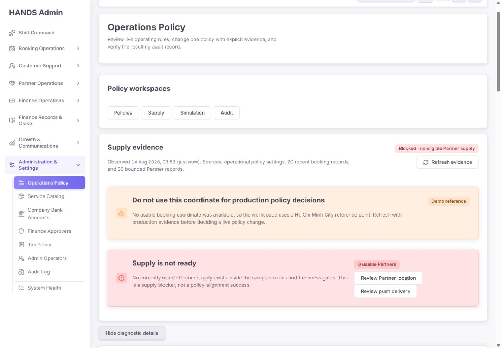

0 supply일 때 긴 diagnostic table을 기본적으로 숨기는 방식은 적합하다. Blocker, demo coordinate, 다음 행동을 먼저 보여주고 필요할 때 상세를 여는 순서가 1인 운영자에게 효율적이다.

#### P2 — expanded sensitivity가 같은 결론을 행마다 반복한다

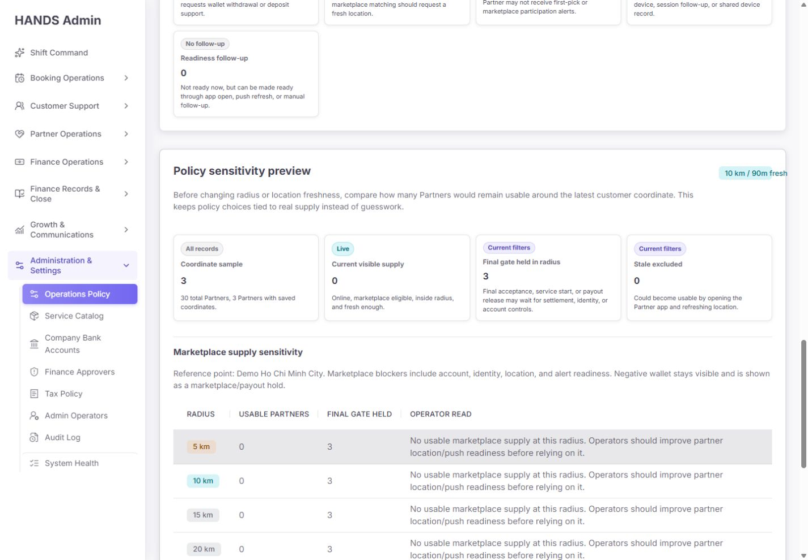

각 radius/freshness 행이 `No usable marketplace supply...`를 반복하여 table 길이가 커진다. 상세를 운영자가 직접 열었으므로 길이 자체는 P0가 아니지만 비교 효율은 낮다.

**수정안**

- 반복 문장을 table 상단 conclusion으로 한 번만 표시한다.
- 행에는 `Eligible`, `Visible`, `Held`, `Excluded stale`, `Delta vs current`만 남긴다.
- 0→0인 모든 sensitivity row는 하나의 `No scenario produces eligible supply` 그룹으로 축약한다.

#### P2 — Demo reference와 production evidence의 차이를 더 강하게 고정한다

경고는 좋아졌지만 운영자가 detail을 오래 읽는 동안 경고가 화면 밖으로 사라진다.

**수정안**

- expanded diagnostics header에도 `Demo reference` badge를 sticky/section-level로 반복한다.
- export나 screenshot을 공유할 때도 demo 표식이 남도록 table caption에 포함한다.

### 3.4 Simulation

현재 0 supply 조건에서는 설계가 적합하다. 다만 이번 세션에는 fresh/eligible Partner가 없어 Ready simulation 결과, sample sufficiency, scenario delta, action link 정확성은 실제 데이터로 재검증하지 못했다.

**추가 검증 요건**

- fixture 또는 비운영 전용 데이터로 `ready=true`를 만든다.
- current vs proposed가 같은 경우와 다른 경우를 모두 검증한다.
- sample count가 작을 때 confidence warning을 표시한다.
- Simulation이 실제 쓰기를 하지 않는 read-only preview임을 header에 명시한다.

### 3.5 Audit

#### P0 — Full Audit scope가 실제 API와 export에서 유실된다

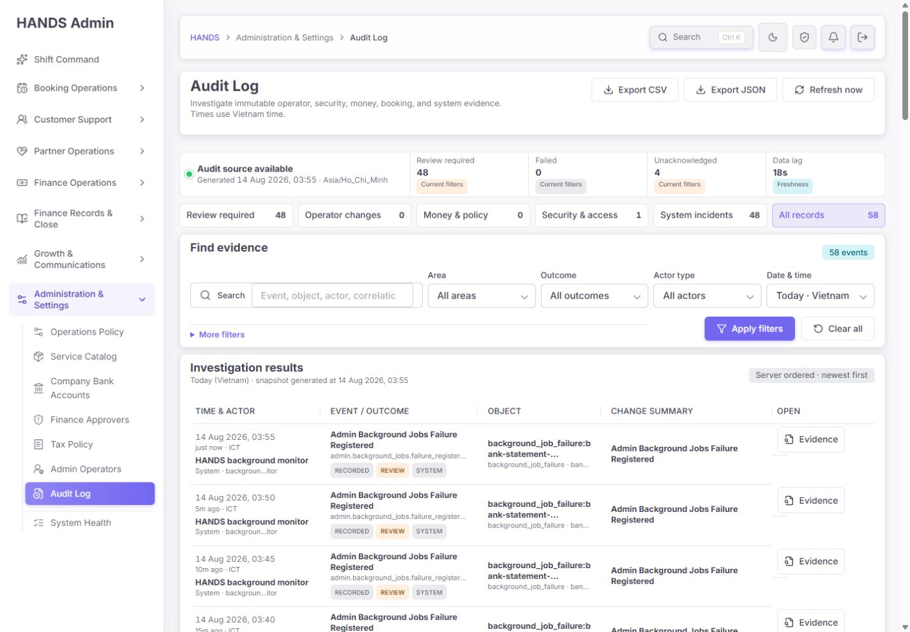

실제 `Open full audit` 결과는 다음과 같았다.

- URL: `/audit-log?bucket=Operations%2FPolicy`
- 화면: `All records 58`, `System incidents 48`
- 첫 레코드: `Admin Background Jobs Failure Registered`
- 날짜 범위: 기본 `Today · Vietnam`

정책 감사 링크인데 정책 이벤트가 아니라 전체 감사와 시스템 실패가 나타난다.

**Root cause**

- `auditFilters`는 bucket을 읽는다.
- shareable browser URL은 bucket을 별도로 보존한다.
- 실제 workspace API와 export가 공통 사용해야 하는 `auditFilterParams`에는 bucket이 없다.
- Admin export proxy의 `EXPORT_FILTER_KEYS`에도 bucket이 없다.
- API의 `adminAuditLogBucketWhere('Operations/Policy')` 자체는 이미 `operational_policy.*`를 올바르게 지원한다.

**필수 수정**

1. normalized audit filter builder에 bucket을 포함한다.
2. workspace API, summary, facets, pagination, saved views, refresh, drawer open/close가 같은 bucket을 보존한다.
3. CSV/JSON href와 Admin export proxy가 bucket을 upstream API로 전달한다.
4. `Open full audit` 기본 href를 `/audit-log?bucket=Operations%2FPolicy&range=all&sort=newest`로 만든다.
5. active filter summary에 `Scope: Operations / Policy`를 표시한다.
6. scoped 화면에서 `Clear all`은 `Clear refinements`로 바꾸고 bucket을 유지한다.
7. 범위를 벗어나는 별도 action은 `Exit policy scope`로 제공한다.
8. 화면 row와 CSV/JSON row가 모두 `operational_policy.*`뿐인지 test한다.

#### P1 — `View details`가 감사 증거가 아니라 정책 효과 설명만 연다

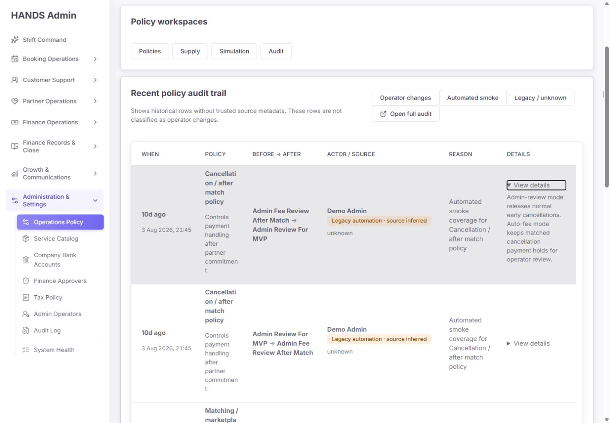

현재 details는 `row.effect`만 펼친다. 다음 핵심 증거가 없다.

- audit event ID
- immutable evidence drawer link
- raw source metadata와 source verification state
- full Before/After typed value
- environment / run ID 전체값
- effectiveAt / request/correlation reference
- payload hash / integrity

**수정안**

- `Details`를 `Policy effect`와 `Audit evidence`로 분리한다.
- 행의 주 action은 `Open evidence`로 만들고 full Audit drawer의 정확한 event를 연다.
- href는 bucket, range=all, sort=newest, event ID를 모두 포함한다.
- effect 설명은 secondary disclosure로 유지한다.
- legacy는 “source not recorded”를 명확히 표시하고 verified event처럼 꾸미지 않는다.

#### P1 — pagination이 과거 방향으로만 이동한다

두 번째 Legacy page에서도 `Older records`만 존재한다. `Newer records`, `Previous`, `First page`가 없다. 운영자는 browser Back을 알아야 한다.

**수정안**

- API가 source와 결합된 opaque `nextCursor` / `previousCursor`를 반환하도록 한다.
- 최소 구현이라면 URL에 bounded cursor history를 보존한다.
- second page 이후 `First page`, `Newer records`, `Older records`를 함께 제공한다.
- source tab을 바꾸면 cursor history를 초기화한다.
- invalid/source-mismatched cursor는 명시적 오류 또는 안전한 first page fallback으로 처리한다.

#### P1 — 1440px Audit table의 열 우선순위가 잘못됐다

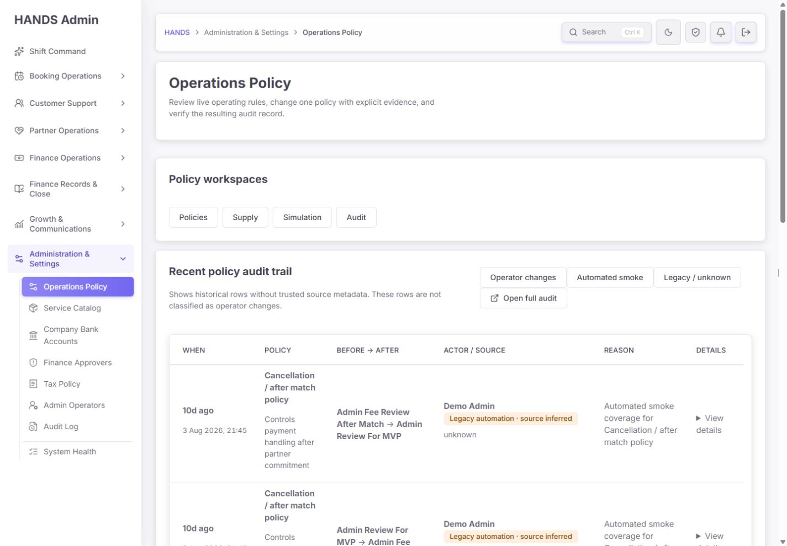

6열로 줄였지만 공통 `.service-trace`의 `min-width: 1420px`를 Operations Policy에서 920px로 강제로 줄인다. 결과적으로 1440 content 폭 안에서 Policy, Before/After, Actor/Source, Reason을 동시에 좁게 배분한다.

확인된 결과:

- `Cancellation / after match policy`가 단어 중간에서 끊긴다.
- Reason도 2~4단어마다 줄이 바뀐다.
- details를 열면 한 행이 매우 길어진다.
- 8건을 훑는 데 기존 캡처 기준 약 2,472px 세로 길이가 필요하다.

**수정안**

- compact row를 4개 주요 열로 재구성한다: `When`, `Policy & actor`, `Before → After`, `Evidence`.
- Reason, environment, source provenance는 두 번째 줄/expanded evidence summary로 이동한다.
- Policy 최소 폭을 240~280px 확보하고 단어 중간 break를 금지한다.
- Audit 전용 class를 사용하고 범용 `.service-trace`를 재사용하지 않는다.
- `min-width` 약 1,080~1,160px를 기준으로 1440 content 폭에서 검증한다.

#### P1 — active semantics는 있으나 실행 화면의 시각 상태가 없다

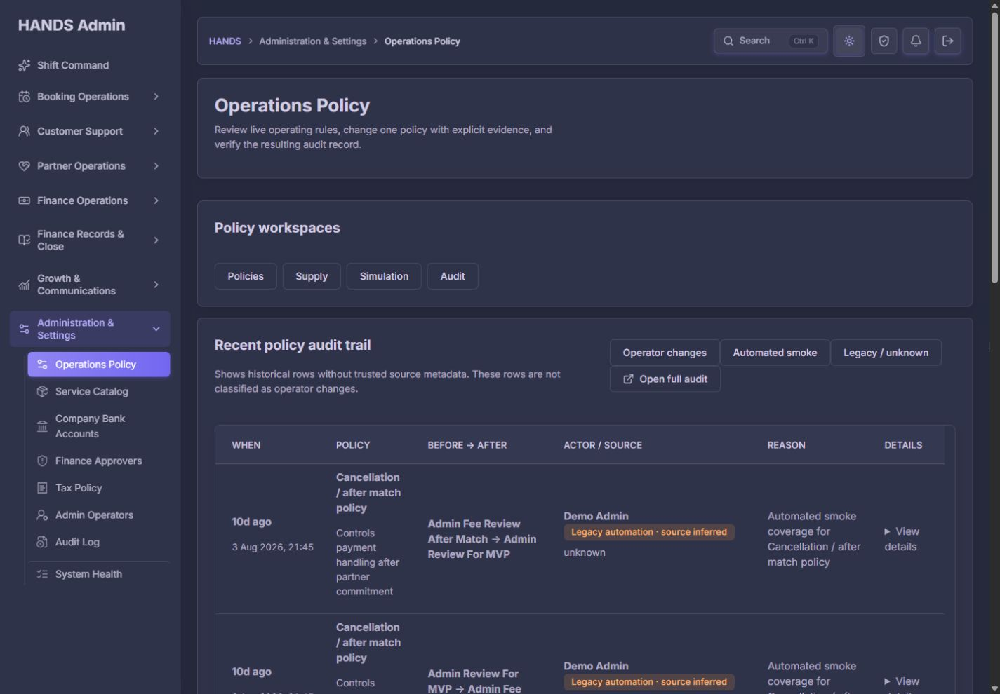

DOM에는 Audit workspace와 Legacy source에 `aria-current="page"`가 있다. 그러나 실행 화면에서 active와 inactive link의 computed background, border, shadow, font weight가 동일했다.

현재 소스 CSS에는 workspace용 active selector가 추가돼 있지만, 실행 production build가 더 오래되어 반영되지 않았다. source filter용 active selector는 현재 소스에도 별도로 없다.

**수정안**

- workspace와 source navigation 모두 shared segmented control을 사용한다.
- active 상태에 배경, border, font weight를 동시에 적용한다.
- light/dark에서 selected/inactive contrast를 screenshot regression으로 검증한다.
- 새 production build 이후 computed style test와 실제 screenshot을 다시 남긴다.

#### P2 — Legacy empty state가 잘못된 문구를 사용한다

`rows.length === 0`일 때 Operator만 별도 분기하고 나머지는 모두 `No server-verified automated smoke policy change is available.`을 사용한다. Legacy/unknown이 0건이면 잘못된 설명이다.

**수정안**

- Operator: `No operator policy change has been audited yet.`
- Automated: `No server-verified automated smoke policy change is available.`
- Legacy: `No legacy or unclassified policy audit record is available.`
- 각 상태에 source, 조회 범위, `Older available / End of history`를 함께 표시한다.

## 4. 배포·실행 일치성 문제

### P0 — 현재 브라우저는 최신 source를 실행하지 않는다

확인 시각 기준:

| 항목 | 시각 |
|---|---|
| 3101 Node process start | 2026-08-14 03:35:47 |
| `.next/BUILD_ID` | 2026-08-14 03:35:45 |
| `operations-policy/page.tsx` 수정 | 2026-08-14 03:59:33 |
| `globals.css` 수정 | 2026-08-14 04:01:09 |

이 때문에 현재 source의 일부 active-state 수정은 실제 화면에 없다. 사용자에게 보이는 실행 결과를 기준으로 하는 UI 감사에서는 가장 최근 build를 검증하지 않으면 완료 판정을 내릴 수 없다.

**필수 수정/운영 절차**

1. 작업 중인 production server를 종료한다.
2. Admin Web typecheck, focused tests, build를 실행한다.
3. 새 `.next/BUILD_ID`로 3101을 재시작한다.
4. build 시각이 관련 source 수정 시각 이후인지 확인한다.
5. 같은 tab, 1440×1000에서 Policies → editor → Supply → Simulation → Audit → Full Audit를 다시 캡처한다.
6. report에는 commit SHA, BUILD_ID, server start time을 함께 기록한다.

## 5. 코드 구조와 유지보수성

### 좋은 점

- page-model이 route별 settings/bookings/providers/audit request를 제한한다.
- policy definition이 lifecycle, risk, blast radius, consumer contract를 한 source에서 생성한다.
- write와 audit row를 같은 transaction에 저장한다.
- PostgreSQL advisory transaction lock으로 같은 key의 동시 write를 직렬화한다.
- client와 server 모두 reason length, expected value, high-risk label을 검증한다.
- API가 source filter와 cursor를 server-side로 적용한다.

### P2 — 제거되지 않은 legacy Operations Policy 모듈이 많다

Operations Policy 폴더에는 production `.ts/.tsx` 45개와 spec 45개가 있다. 다음 section/model은 현재 `page.tsx`의 production flow에서 호출되지 않는다.

- `operations-policy-action-gate-checklist-section.tsx`
- `operations-policy-authority-baseline-section.tsx`
- `operations-policy-booking-create-gate-section.tsx`
- `operations-policy-enforcement-trace-section.tsx`
- `operations-policy-matching-playbook-section.tsx`
- `operations-policy-next-choices-section.tsx`
- `operations-policy-owner-decision-backlog-section.tsx`
- `operations-policy-recommended-value-review-section.tsx`
- 연결된 일부 model: `booking-create-gate-review.ts`, `owner-decision-backlog.ts`, `owner-decision-pressure.ts`, `policy-enforcement-trace.ts`, `policy-recommendation-review.ts`, `policy-related-bookings.ts`

이 코드는 즉시 사용자 문제를 만들지는 않지만, 다음 Codex가 “있는 파일은 모두 현재 기능”으로 오해해 다시 연결하거나 수정 범위를 키울 위험이 있다.

**수정안**

- production import graph를 기준으로 truly dead인지 다시 확인한다.
- 다른 route/test가 사용하지 않는 모듈은 별도 cleanup PR에서 삭제한다.
- 의도적 보존이면 파일 상단에 deprecated/non-production 상태와 제거 조건을 명시한다.
- cleanup은 Full Audit P0 수정과 분리한다.

## 6. 성능·안정성 검토

### 확인 결과

- Policies warm navigation 관찰값: 117ms, 127ms, 141ms. 로컬 환경 수치이므로 production SLO로 사용하지 않는다.
- Policies DOM: 약 1,107 nodes, 63 links.
- Supply/Simulation sample은 booking 20건, Partner 30건으로 bounded다.
- Audit page는 source별 최대 8건만 읽는다.
- 주요 화면에서 page horizontal overflow 0.
- 브라우저 console error 0.
- Supply zero 상태의 기본 DOM에 diagnostic table 0개.

### 남은 주의점

- Policies는 28개 설정을 한 번에 읽고 group collapse로 렌더링한다. 현재 규모에는 허용 가능하다.
- expanded Supply diagnostics는 길지만 operator-triggered이므로 현재는 성능 blocker가 아니다.
- Audit table의 세로 길이는 데이터 양보다 열 배치와 wrapping 문제다. pagination size를 더 줄이는 것으로 해결하지 말아야 한다.
- 최신 source build를 아직 실행하지 않았으므로 build 후 hydration/console/network 재검증이 필요하다.

## 7. 접근성·문구 검토

### 확인된 장점

- workspace와 source link에 `aria-current`가 있다.
- table header와 role 구조가 유지된다.
- API failure, permission denied, true empty가 다른 표현을 사용한다.
- high-risk 확인 field에 label/help/error 연결이 있다.
- form error 발생 시 error summary로 focus를 이동한다.
- Light/Dark 모두 주요 글자 대비와 surface 경계는 안정적이다.

### 남은 문제

- active semantics가 runtime 시각 스타일로 이어지지 않는다.
- Legacy table 단어 중간 break가 읽기 흐름을 해친다.
- `View details`가 증거 action처럼 들리지만 실제로는 effect 설명뿐이다. `View policy effect`로 바꾸거나 실제 evidence를 연결해야 한다.
- `Changed at least once`, `aligned`, `Last changed`는 source와 기준을 더 구체적으로 표현해야 한다.
- 운영자 기본 작업에는 `Policy workspaces`, `Policy attention`, `Operating group` 등 추상 명사가 많다. `Rules`, `Needs review`, `Area`처럼 더 짧은 라벨도 검토할 수 있다.

## 8. 우선순위별 수정 요구사항

### P0 — 출시 전 반드시 해결

1. Full Audit bucket/range/export scope를 화면·API·CSV·JSON 전체에 적용한다.
2. 현재 source를 새 production build로 배포하고 같은 BUILD_ID를 실제 화면에서 검증한다.

### P1 — 운영 신뢰성과 효율에 직접 영향

1. Audit row를 실제 event evidence drawer에 연결한다.
2. policy audit cursor를 양방향으로 만든다.
3. 1440px Audit table을 4열 중심으로 재설계한다.
4. workspace/source active 상태를 light/dark에서 명확히 표시한다.
5. Shift & Queue SLA 7개의 구체적인 operating impact 문구를 복원한다.
6. lifecycle filter와 clickable KPI를 제공한다.
7. Changed/Last changed를 audit source-aware provenance로 바꾼다.
8. unsaved policy switch를 실제 interaction test로 보강한다.

### P2 — 다음 polish 단계

1. top workspace/attention 카드 높이를 줄여 첫 정책 목록을 viewport 위로 올린다.
2. `Live · baseline aligned`로 기준을 명시한다.
3. Legacy empty state를 mode별로 분기한다.
4. Supply expanded table의 반복 문장을 축약한다.
5. dead Operations Policy modules를 별도 cleanup으로 정리한다.

## 9. 필수 회귀 테스트

### Admin Web

1. Full Audit href가 bucket, range=all, sort=newest를 포함한다.
2. workspace API href가 bucket을 포함한다.
3. CSV/JSON href가 bucket을 포함한다.
4. export proxy allowlist가 bucket을 upstream으로 전달한다.
5. scoped refresh, saved view, cursor, evidence drawer가 bucket을 보존한다.
6. scoped Clear refinements는 bucket을 유지한다.
7. row Open evidence가 정확한 event ID를 연다.
8. second cursor page에 First/Newer/Older가 존재한다.
9. source 변경 시 cursor history가 제거된다.
10. Legacy empty state가 legacy 문구를 사용한다.
11. Policies/Supply/Simulation/Audit와 source active style이 light/dark에서 달라진다.
12. 1440 CSS contract가 Policy 최소 폭과 word-break 방지를 보장한다.
13. 7개 Shift SLA가 generic fallback을 사용하지 않는다.
14. dirty editor에서 다른 정책/tab/Back 이동 matrix를 실제 interaction으로 검증한다.

### API

1. `Operations/Policy` bucket이 `operational_policy.*`만 반환한다.
2. Audit workspace summary/facets/items가 동일한 bucket where를 사용한다.
3. Audit export도 동일한 bucket where를 사용한다.
4. source+cursor mismatch가 안전하게 실패한다.
5. previous/next cursor가 source boundary를 넘지 않는다.
6. Locked/Planned direct PATCH가 transaction 전에 차단된다.
7. 동일 key concurrent PATCH에서 한 요청만 성공하고 audit row도 1건만 생성된다.

## 10. 이번 검증 명령 결과

| 검증 | 결과 |
|---|---|
| Admin Web Operations Policy + Audit focused tests | PASS — 52 files, 183 tests |
| API `admin.service` operational-policy focused | PASS — 6 passed, 659 skipped |
| API audit-source + matching policy | PASS — 2 files, 19 tests |
| Policy Admin consistency | PASS — 28 definitions, 19/2/7 lifecycle, consumer contract 일치 |
| Admin Web typecheck | PASS |
| Admin Web focused ESLint | PASS |
| 브라우저 console errors | PASS — 0 |
| 1440 horizontal overflow | PASS — 주요 화면 모두 0 |
| API 전체 typecheck | FAIL — `bookings.backup-providers.ts:178` readonly array 타입 오류, 본 감사 범위 밖 기존 변경 |
| API `admin.service.spec.ts` 전체 파일 | FAIL — push campaign receipt test의 `include` 대 `select` 기대 불일치 1건; 정책 관련 6건은 별도 PASS |
| Impeccable detector | WARN — global CSS의 기존 side-accent 6건; Operations Policy target selector에서 새 blocker는 없음 |

API 전체 typecheck와 전체 `admin.service.spec.ts` 실패는 Operations Policy 변경에서 발생한 것으로 확인되지는 않았지만, 저장소 전체 release gate라면 별도로 해결해야 한다. 이번 페이지의 정책-focused 검증은 통과했다.

## 11. 증거 목록

1. `01-policies-overview-1440x1000.png` — Policies overview
2. `02-policy-editor-initial-1440x1000.png` — 초기 policy editor
3. `03-policy-editor-valid-not-submitted-1440x1000.png` — 유효하지만 미제출 form
4. `05-supply-default-1440x1000.png` — Supply blocker default
5. `06-supply-diagnostics-expanded-1440x1000.png` — expanded diagnostics
6. `07-supply-sensitivity-1440x1000.png` — sensitivity detail
7. `08-simulation-blocked-1440x1000.png` — Simulation prerequisites blocked
8. `09-audit-operator-1440x1000.png` — Operator empty
9. `10-audit-automated-smoke-1440x1000.png` — verified smoke empty
10. `11-audit-legacy-1440x1000.png` — Legacy table
11. `12-audit-legacy-details-1440x1000.png` — effect-only details
12. `13-full-audit-destination-1440x1000.png` — Full Audit scope mismatch
13. `14-audit-older-page-1440x1000.png` — one-way cursor page
14. `15-high-risk-editor-1440x1000.png` — exact-label high-risk confirmation
15. `16-locked-policy-direct-url-1440x1000.png` — Locked direct URL fail-closed
16. `17-planned-policy-direct-url-1440x1000.png` — Planned direct URL fail-closed
17. `18-audit-legacy-dark-1440x1000.png` — dark theme Audit

Evidence folder: `docs/audits/operations-policy-post-remediation-reaudit-evidence-2026-08-14/`

## 12. 감사 한계

- 실제 정책 저장·rollback은 운영 데이터 변경을 피하기 위해 실행하지 않았다. transaction/API/test로 보완했다.
- 현재 DB에는 Operator와 server-verified Automated smoke row가 0건이라 실제 row visual은 Legacy와 component test로 보완했다.
- non-Developer 계정이 없어 direct diagnostic permission denial은 실제 브라우저에서 재현하지 못했다.
- fresh eligible Partner가 없어 Ready Supply/Simulation 결과를 실제 데이터로 재현하지 못했다.
- 최신 source가 3101 production build에 반영되지 않아, build 이후 화면은 별도 재검수가 필요하다.

## 최종 한 줄 판정

**정책 lifecycle·편집 안전성·0-supply 처리까지는 의미 있게 개선됐지만, `Open full audit`가 여전히 잘못된 전체 데이터를 보여주고 최신 source가 실행 build에 반영되지 않았으므로 현재 Operations Policy 페이지를 최종 완료 또는 출시 가능으로 판정하면 안 된다. Full Audit scope와 build freshness 두 P0를 먼저 해결한 뒤 1440px 전체 흐름을 다시 검증해야 한다.**
