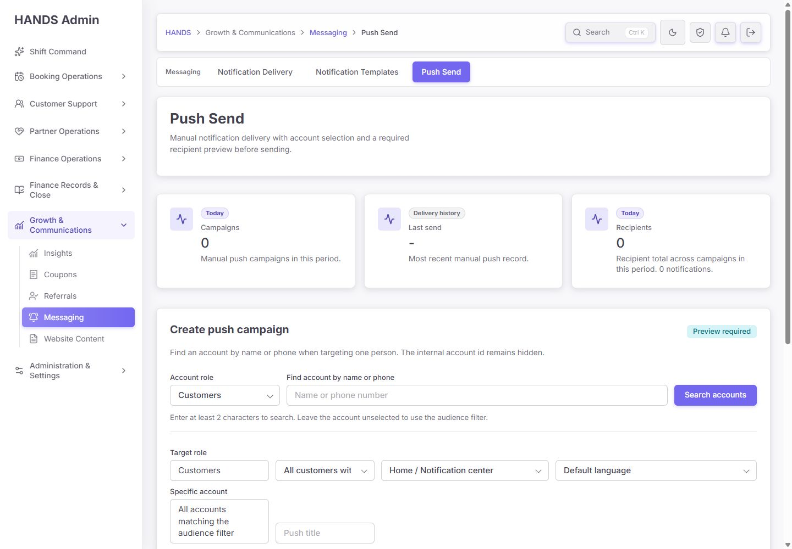
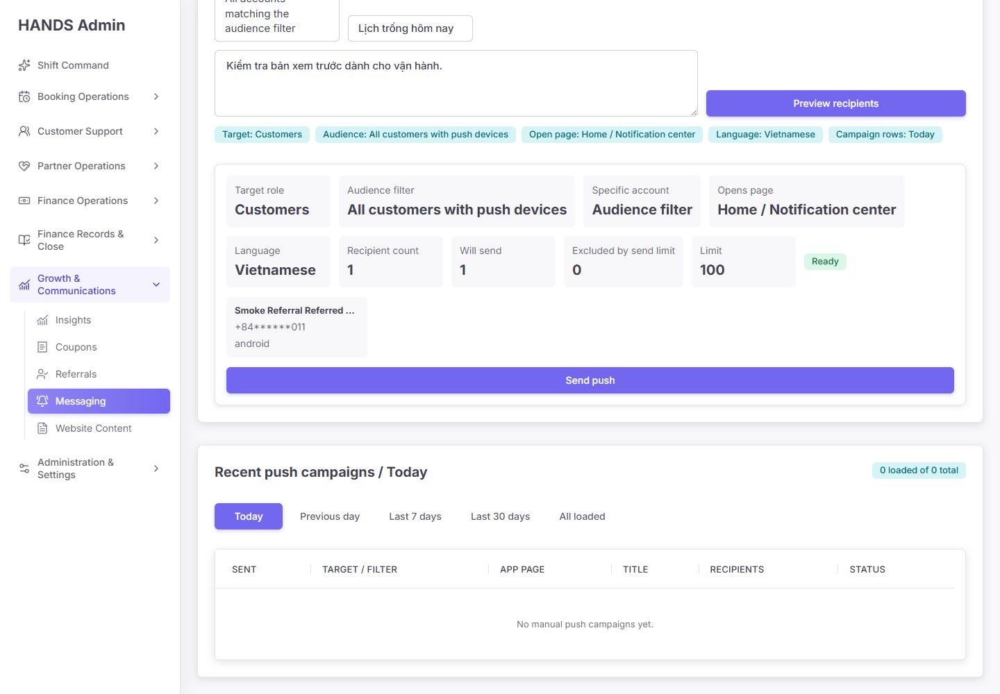
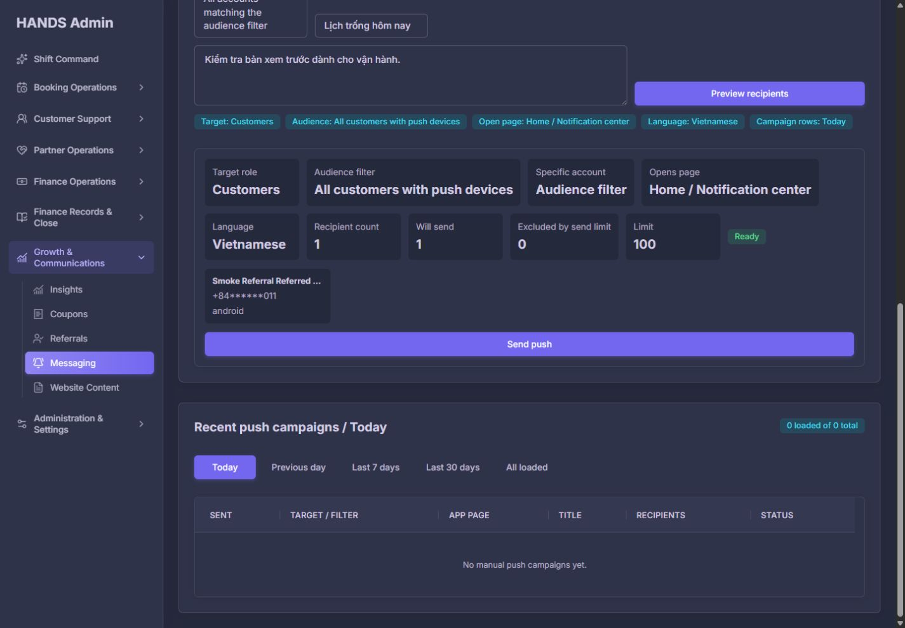
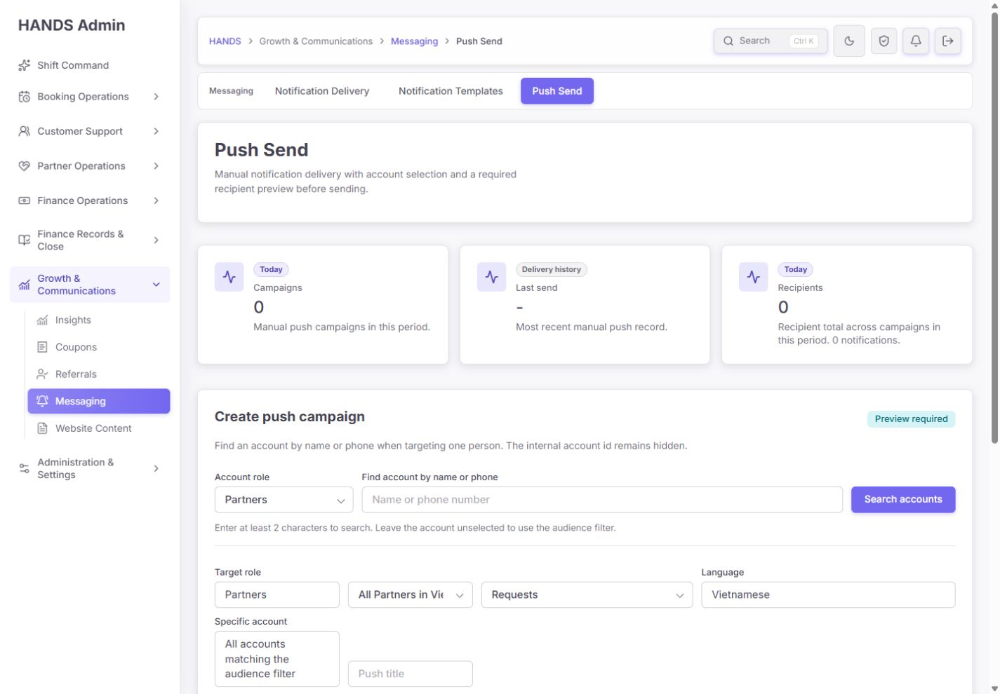

# HANDS Admin Push Send 최종 재감사 보고서

- 감사일: 2026-08-12
- 대상: `http://localhost:3101/notifications/push-send`
- 기준 문서: `docs/audits/push-send-remediation-codex-prompt-2026-08-12.md`
- 화면 기준: 1440×1000, 1600×1000만 검사
- 제외: 1024px 이하 화면 전체
- 감사 방식: 로그인된 실제 화면, 안전한 preview, 현재 Admin Web/API/Prisma/queue/mobile routing 코드, focused test, typecheck 교차 검증
- 외부 발송: **0건**. `Send push`는 누르지 않았다.

## 1. 최종 판정

**출시 차단 · 36/100**

이전 개선 프롬프트의 화면·안전 계약이 현재 Push Send 구현에는 실질적으로 적용되지 않았다. 브라우저와 소스가 같은 상태를 보여준다. 실제 화면은 여전히 `Preview recipients` 다음에 사유·typed confirmation·서버 검증 snapshot 없이 `Send push` 한 번으로 발송을 요청한다. API는 preview와 send를 독립적으로 재조회하고, 대상이 100명을 넘으면 최신 100명만 선택해 발송하며, locale을 실제 recipient/device 조건에 적용하지 않는다.

따라서 이 페이지는 **내부 개발·테스트용으로만 유지**하고, 운영 사용과 실제 push provider 연결은 중지해야 한다. UI 미세 조정보다 이전 프롬프트의 P0 계약을 먼저 구현해야 한다.

### 점수표

| 영역 | 점수 | 판정 | 핵심 이유 |
|---|---:|---|---|
| 대상·preview·발송 동일성 | 4/25 | 출시 차단 | receipt/snapshot 없음, preview 없는 API send 가능, 101명 이상 부분 발송 |
| 언어·destination 계약 | 6/15 | 출시 차단 | locale이 DB 표시에만 남고 device filter에 미반영, ID 없는 detail destination 존재 |
| queue·idempotency·복구 | 4/20 | 출시 차단 | 동기식 recipient loop, campaign 기본 `SENT`, 중간 실패·중복 submit 복구 없음 |
| 확인·권한·감사 | 6/15 | 출시 차단 | 사유/typed confirmation 없음, 상위 `NOTIFICATIONS` 권한으로 push 접근 가능, lifecycle audit 없음 |
| 운영 화면·문구·접근성 | 10/15 | 보완 필요 | 기본 가독성은 양호하나 핵심 CTA가 첫 화면 아래, 실제 push preview/disabled reason/상태 설명 부족 |
| 테스트·관찰 가능성 | 6/10 | 보완 필요 | 기존 focused test는 통과하지만 일부가 위험한 현재 동작을 정답으로 고정, campaign evidence E2E 없음 |
| **합계** | **36/100** | **출시 차단** | P0 발송 안전 계약 미충족 |

## 2. 현재 화면 증거

### 2.1 1440×1000 기본 화면



확인 사항:

- `Campaigns`, `Last send`, `Recipients` 3개 대형 카드가 0건이어도 첫 화면의 약 200px를 차지한다.
- 1440×1000에서 본문 입력, preview CTA, preview 결과가 화면 아래로 밀린다.
- `Account role`과 `Target role`이 같은 값을 반복해 운영자가 둘의 차이를 추론해야 한다.
- 상단 설명은 “required recipient preview”라고 하지만 서버 계약은 preview를 강제하지 않는다.

### 2.2 실제 preview 결과



안전한 테스트 문구로 1명의 preview를 실행했다. 화면에는 `Recipient count 1`, `Will send 1`, `Ready`가 표시됐지만 다음이 없다.

- server-issued `previewId`/receipt와 만료 시각
- eligible device attempts
- locale/device mismatch 제외 사유
- 실제 push 카드 모양의 제목·본문 미리보기
- 변경 사유 입력
- `SEND 1` typed confirmation
- preview 이후 최종 확인 단계
- `Send push`가 비활성화된 이유 설명 또는 queue 동작 설명

가장 위험한 점은 화면 전체 폭의 강한 보라색 `Send push`가 preview card 안에 바로 노출된다는 것이다. 이는 운영자에게 “한 번 더 확인”이 아니라 “즉시 완료”로 인식된다.

### 2.3 다크 모드



다크 모드는 텍스트·표·상태 badge의 기본 가독성이 유지된다. 다만 위험 작업 CTA가 일반 primary action과 동일한 보라색이어서 발송 위험 수준을 전달하지 못한다.

### 2.4 Partner 대상 화면



Partner는 Vietnamese로 고정되고 `Requests`, `Jobs`, `Earnings`, `Chat`, `Profile`을 제공한다. 그러나 `Chat`은 `chatRoomId` 없이 partner app에서 notification center 또는 jobs로 fallback하므로, 화면 label과 실제 열리는 화면이 다를 수 있다.

## 3. 이전 개선 요건 이행표

| 이전 요건 | 현재 상태 | 판정 | 근거 |
|---|---|---|---|
| 서버 발급 preview snapshot/receipt | 없음 | 미완료 | preview 응답은 count/sample만 반환하고 send DTO에 receipt가 없음 |
| preview actor binding·만료·1회 소비 | 없음 | 미완료 | preview route에 actor도 전달하지 않음 |
| preview와 send exact recipient 동일성 | 없음 | 미완료 | preview와 create가 각각 `adminPushRecipientWhere()`를 재실행 |
| 101명 이상 fail closed | 최신 100명만 발송 | 미완료 | create query의 `take: 100`과 UI `Capped` 후 send 활성 |
| 명시 locale 필수 | `Default language` 존재 | 미완료 | Customer locale optional, Partner 고정은 UI에서만 강제 |
| locale별 user/device eligibility | 없음 | 미완료 | recipient where와 processor 모두 role만 검사 |
| user count/device attempt 분리 | 없음 | 미완료 | preview는 `recipientCount`, `willSendCount`만 표시 |
| destination capability matrix | 단순 문자열 allowlist | 부분 | role별 allowlist는 있으나 LIST/DETAIL/required ID 계약이 없음 |
| ID 없는 detail destination 차단 | 차단 안 함 | 미완료 | `chat`, `booking`, `providerProfile`를 ID 없이 선택 가능 |
| idempotent campaign queue lifecycle | 없음 | 미완료 | HTTP 요청에서 순차 notification create/enqueue |
| PREVIEWED→QUEUED→PROCESSING→COMPLETED | 기본 `SENT` | 미완료 | Prisma `status String @default("SENT")` |
| 일부 실패 PARTIAL_FAILED | 없음 | 미완료 | 중간 throw 시 앞선 notification만 남을 수 있음 |
| 12~500자 운영 사유 | 없음 | 미완료 | AdminPushCampaignDto와 form에 reason 없음 |
| `SEND {count}` 확인 | 없음 | 미완료 | `Send push` 버튼 한 번 |
| strict `NOTIFICATIONS_PUSH` | 상위 권한 상속 | 부분 | route/page mapping은 있으나 `NOTIFICATIONS`가 parent로 허용 |
| lifecycle audit | create 완료 후 1회 | 미완료 | preview/confirm/queued/completed/failed audit 없음 |
| copy를 URL에서 제외 | URL에 title/body 포함 | 미완료 | 실제 브라우저 주소와 history range 링크에서 재현 |
| draft 보존 + 오류별 문구 | generic redirect | 미완료 | 모든 오류를 `?notice=failed`로 통합 |
| 실제 delivery evidence 상세 | 없음 | 미완료 | campaign detail/evidence route/action 없음 |
| compact risk strip | 큰 KPI 3개 | 미완료 | 0건에서도 대형 카드 유지 |
| Audience→Message→Confirm 3단계 | 단일 section | 미완료 | 계정 검색·조건·문구·발송이 한 section에 혼재 |
| 실제 push visual preview | 없음 | 미완료 | title/body 입력과 수치 요약만 존재 |
| action-oriented history | 단순 날짜 table | 미완료 | Needs attention/status filter/View evidence 없음 |
| 최근 device cap·영구 실패 disable | cap 10, disable 정책 존재 | 완료/회귀 필요 | queue/processor에서 bounded recent device와 permanent failure disable 사용 |
| 1440/1600·다크 기본 가독성 | 안정적 | 완료 | 현재 캡처, console log 0건 |

## 4. P0 출시 차단 문제

### P0-1. Preview와 실제 발송 대상이 서버에서 묶이지 않는다

근거:

- `apps/api/src/admin/admin-notification.routes.ts:132-139`의 preview와 create는 같은 DTO를 받는 별도 endpoint다.
- `apps/api/src/admin/admin.service.ts:32148-32185`는 preview 때 count/sample만 계산한다.
- `apps/api/src/admin/admin.service.ts:32189-32203`은 send 시 대상 query를 다시 실행한다.
- `apps/admin_web/app/notifications/push-send/actions.ts:9-34`는 receipt 없이 create endpoint를 직접 호출한다.

운영 영향:

- preview 이후 device 활성 상태, role, segment 포함 여부가 바뀌면 실제 대상이 달라질 수 있다.
- API를 직접 호출하거나 server action을 재현하면 preview 없이 발송 가능하다.
- 운영자는 자신이 확인한 “1 ready”가 실제 어느 snapshot인지 증명할 수 없다.

수정 방법:

1. preview 시 `PREVIEWED` campaign 또는 전용 preview record와 exact recipient snapshot을 저장한다.
2. `previewId`, `expiresAt`, actor, criteria/copy hash, eligible users/devices, exact snapshot fingerprint를 반환한다.
3. confirm API는 preview를 actor-bound·1회·원자적으로 소비한다.
4. criteria/copy/locale/destination 변경 또는 snapshot 변동 시 409와 “다시 미리보기”를 반환한다.
5. client가 보낸 count/recipient IDs는 권위 값으로 사용하지 않는다.

완료 기준:

- preview 없이 send 409/422
- 다른 운영자의 preview 403
- 만료 preview 409
- 같은 receipt double submit에서 campaign 1개
- preview snapshot과 campaign recipient가 정확히 동일

### P0-2. 101명 이상을 막지 않고 임의의 최신 100명에게 부분 발송한다

근거:

- `apps/api/src/admin/admin.service.ts:32182-32184`: `willSendCount = min(recipientCount, 100)`.
- `apps/api/src/admin/admin.service.ts:32195-32203`: create가 `orderBy createdAt desc`, `take: 100`으로 발송 대상을 결정한다.
- `apps/admin_web/app/notifications/push-send/page.tsx:460-491`: `Capped`를 보여주지만 send는 0명일 때만 비활성화된다.
- `apps/admin_web/app/notifications/push-send/page.spec.tsx:121-163`: capped preview에서도 `Send push`가 존재하는 동작을 통과 조건으로 둔다.

운영 영향:

- “전체 고객”으로 이해하고 실행했지만 최근 가입자 100명만 메시지를 받는다.
- 부분 발송 대상을 운영 기준으로 설명하거나 재현할 수 없다.
- 동일 캠페인을 다시 실행하면 중복 또는 다른 100명 선택 가능성이 생긴다.

수정 방법:

- eligible user가 101명 이상이면 preview를 `BLOCKED_OVER_LIMIT`로 만들고 confirm을 생성하지 않는다.
- 문구: `Audience too large · 143 eligible users / Manual limit · 100 / Narrow the audience or choose a specific account. No one has been sent yet.`
- API도 101명 이상에서 notification 0개를 보장해야 한다.
- batch campaign 기능은 별도 제품 요건으로 분리한다.

### P0-3. 선택 언어가 실제 device fanout에 적용되지 않는다

근거:

- `adminPushRecipientWhere()`는 enabled + role만 보고 locale을 검사하지 않는다.
- create는 campaign row에 locale을 기록하지만 `NotificationsService.create()`에 locale을 넘기지 않는다.
- `notifications.processor.ts`는 target role만 filter하고 locale을 filter하지 않는다.
- UI에는 `Default language`가 남아 있고 Partner Vietnamese 고정은 API가 강제하지 않는다.

운영 영향:

- Vietnamese 문구가 English/Korean/Japanese/Chinese device로 발송될 수 있다.
- 한 사용자의 여러 locale device에 같은 freeform copy가 fanout될 수 있다.
- 화면의 Language 값이 실제 전달 조건이 아니라 참고 metadata가 된다.

수정 방법:

- Customer/Partner 모두 명시 locale을 필수로 한다. Partner `vi`가 정책이면 DTO/service에서도 강제한다.
- preview recipient predicate와 device-attempt predicate에 role + locale을 함께 적용한다.
- Notification data와 delivery evidence에 selected locale을 남긴다.
- preview에 `Eligible users`, `Eligible devices`, `Excluded: no matching language device`, `Excluded by device cap`을 분리한다.

### P0-4. Destination label과 mobile 실제 동작이 일치하지 않는다

현재 payload는 `destination` 문자열만 보내며 booking/chat/provider/earning ID를 보내지 않는다.

| 대상 | UI option | 현재 mobile 동작 | 판정 |
|---|---|---|---|
| Customer | Home / Notification center | notification center | 유지 가능 |
| Customer | Bookings | booking list 또는 ID 없는 BookingsScreen | label을 `Bookings list`로 명확화 |
| Customer | Chat | ID 없는 ChatScreen 진입 가능, 특정 대화 아님 | `Chat list`가 실제로 안전한지 명시 검증 필요 |
| Customer | Partners | providerProfile ID가 없으면 home tab 수준 | 현재 label 부정확, 제거 또는 `Home / Find partners`로 실제 동작 일치 |
| Customer | Profile | profile tab | 유지 가능 |
| Partner | Requests | requests tab | 유지 가능 |
| Partner | Jobs | jobs tab | 유지 가능 |
| Partner | Earnings | earnings tab | 유지 가능 |
| Partner | Chat | `chatRoomId` 없으면 notification center/jobs fallback | **현재 option 제거** |
| Partner | Profile | profile tab | 유지 가능 |

수정 방법:

- LIST destination만 기본 manual campaign에서 제공한다.
- DETAIL destination은 entity search와 required ID 검증을 추가하기 전까지 제거한다.
- role별 단일 capability matrix를 shared contract로 만들고 API + 두 mobile parser test가 검증한다.
- preview에서 `Opens Customer app → Notification center`처럼 사람이 읽는 실제 결과를 보여준다.

### P0-5. 동기식 부분 저장 때문에 campaign 상태가 모순될 수 있다

근거:

- Prisma campaign status는 string이며 기본값이 `SENT`다.
- campaign은 notification을 하나도 만들기 전에 `sentAt=now`로 생성된다.
- 최대 100명을 HTTP 요청 안의 `for...of`로 순차 처리한다.
- 각 recipient마다 notification persist→queue 후 recipient row를 생성한다.
- audit는 전체 loop와 campaign update가 성공한 뒤 한 번만 기록된다.

실패 시나리오:

1. 37번째 notification enqueue가 실패한다.
2. 앞의 36개 notification은 이미 외부 queue에 있다.
3. campaign은 `SENT`, `notificationCount=0` 또는 일부 이전 값일 수 있다.
4. audit가 남지 않는다.
5. UI는 generic `No push was sent`를 표시한다.
6. 운영자가 다시 시도하면 앞의 36명에게 중복 발송될 수 있다.

수정 방법:

- preview→confirm transaction에서 campaign/recipient snapshot을 만들고 `QUEUED`로 전환한다.
- 하나의 campaign worker가 recipients를 idempotent key로 fanout한다.
- recipient/notification unique key로 retry 중복을 막는다.
- lifecycle을 `PREVIEWED`, `QUEUED`, `PROCESSING`, `COMPLETED`, `PARTIAL_FAILED`, `FAILED`, `EXPIRED`로 제한한다.
- provider delivery 결과 집계로 campaign을 terminal status로 전환한다.

## 5. P1 운영 통제·개인정보·복구 문제

### P1-1. Final confirmation과 운영 사유가 없다

현재 `Send push` 버튼은 실제 발송을 의미하는 고위험 작업인데 다음이 없다.

- 12~500자 사유
- `SEND {eligibleUserCount}` 입력
- exact title/body 재확인
- preview expiry
- device attempt 수
- exclusion 사유
- accessible confirm dialog/focus return

권장 화면은 `1 Choose audience → 2 Write & preview → 3 Confirm & queue`의 세 단계다. 실제 action label은 `Queue push campaign`으로 바꾼다.

### P1-2. Copy와 내부 식별자가 URL·history에 노출된다

실제 브라우저 재현 주소:

```text
/notifications/push-send?preview=1&...&locale=vi&title=...&body=...
```

또한 campaign 날짜 range 링크가 title/body query를 계속 복사한다. `buildPushRecipientSelectionHref()`는 `targetUserId`도 query에 보존하므로 내부 user ID가 URL, browser history, access log, referrer에 남을 수 있다.

테스트가 이 문제를 막지 않고 오히려 `title`과 `body`가 page link에 보존되는 것을 기대한다.

수정 방법:

- composer를 client state 또는 서버 draft ID 기반으로 바꾼다.
- GET query에는 history filter만 둔다.
- copy, reason, internal user ID를 URL에 넣지 않는다.
- 특정 계정은 short-lived server-side selection/draft에 연결한다.

### P1-3. Preview sample의 개인정보 최소화가 불완전하다

`page.tsx`는 이름이 없으면 `recipient.phone` 원문을 `<strong>` fallback으로 사용한다. preview API도 raw `id`, `phone`, `pushDevice.id`를 반환한다. 현재 캡처의 fixture는 이름이 있어 masked phone만 보였지만, 이름 없는 실제 계정에서는 전체 전화번호가 DOM에 노출될 수 있다.

수정 방법:

- API가 `displayLabel`, `maskedPhone`, `platform`, `lastActiveAt`만 반환한다.
- raw user/device ID와 전체 phone은 response/DOM/accessibility tree에서 제거한다.
- 이름 없음 fallback은 `Customer ending 011` 같은 server-generated masked label을 쓴다.

### P1-4. `NOTIFICATIONS_PUSH`가 완전한 elevated 권한이 아니다

좋은 점:

- Admin Web page와 API route가 모두 `NOTIFICATIONS_PUSH`로 매핑돼 있다.

남은 문제:

- API `adminOperatorHasRequiredCategory()`는 parent category를 허용한다.
- `NOTIFICATIONS_PUSH`의 parent가 `NOTIFICATIONS`이므로 일반 알림 권한만 있어도 Push Send에 접근할 수 있다.

수정 방법:

- Push Send view/preview/confirm/detail은 exact permission 또는 Master Admin만 허용한다.
- 상위 `NOTIFICATIONS` 상속에서 `NOTIFICATIONS_PUSH`를 제외한다.
- UI와 API 각각 read-only/403 test를 추가한다.

### P1-5. 오류가 모두 generic redirect로 합쳐지고 draft가 사라진다

`actions.ts`는 모든 예외를 `/notifications/push-send?notice=failed`로 redirect한다. 400/401/403/404/409/422/429/500/503, 일부 queue 성공, network timeout을 구분하지 않는다.

특히 `No push was sent`라는 문구는 중간 실패 시 거짓일 수 있다. 성공 notice도 title은 `Push campaign sent`, detail은 `queued for delivery`라 서로 모순된다.

권장 문구:

- 성공: `Campaign queued · Delivery has not completed yet.`
- preview stale: `Audience changed after preview. Review the new count before queueing.`
- over limit: `Audience is above the 100-user manual limit. No one has been queued.`
- partial: `Partially queued · Review campaign evidence before retrying.`
- permission: `You do not have Push Send permission. Ask a Master Admin for NOTIFICATIONS_PUSH access.`
- queue unavailable: `Queue unavailable · Draft preserved. Check system status and retry with the same request key.`

## 6. P1/P2 운영 화면 개선

### 6.1 정보 우선순위

현재 상단 대형 KPI 3개는 0건에서도 공간을 점유하고, 운영자가 먼저 봐야 할 실패/지연은 없다.

권장 compact risk strip:

```text
Needs attention 0 | Queued/processing 0 | Failed/partial 0 | Users today 0 | Device attempts 0 | Last completed —
```

- `Needs attention`이 1 이상이면 첫 번째 danger link로 표시한다.
- 정상 0건은 작은 muted value로 둔다.
- composer의 audience/message fields와 preview CTA가 1440×1000 첫 화면에 들어와야 한다.

### 6.2 Composer 구조

#### Step 1 — Choose audience

- Customers / Partners segmented control 하나만 사용한다.
- 중복 `Account role`/`Target role`을 제거한다.
- segment를 먼저 선택한 뒤 “Narrow to one account”를 secondary action으로 둔다.
- 각 segment에 기준 시점·포함·제외를 한 줄로 설명한다.
- `All Partners in Vietnam`은 실제 query가 Vietnam/approved/active를 검사하지 않으므로 label을 고치거나 predicate를 정책에 맞게 강화한다.
- 특정 계정 선택 시 `Only this account will be considered; the segment will not fan out.`를 표시한다.

#### Step 2 — Write and preview

- 제목 `0/120`, 본문 `0/500` counter
- 선택 언어 badge
- OS push card 형태 preview
- 실제 app destination label
- `Preview audience` primary CTA
- preview 실행 전/중/실패/0/over limit/expired 상태 분리

#### Step 3 — Confirm and queue

- server-verified snapshot
- eligible users/devices, exclusion breakdown, manual limit
- exact copy와 destination
- reason
- `SEND N` confirmation
- `Queue push campaign` danger/confirmation CTA

### 6.3 Preview 결과

현재 `Recipient count`, `Will send`, `Excluded by send limit`, `Limit`은 부분 발송을 정상화하는 구조다.

권장 순서:

```text
Eligible users
Eligible device attempts
Excluded users
Excluded devices
Exclusion reasons
Manual user limit
Preview expires in
Sample recipients (masked)
```

`Ready`는 receipt, 1~100 users, device attempts >0, locale/destination valid, unexpired, copy valid를 모두 만족할 때만 표시한다.

### 6.4 History와 evidence

현재 table은 `Sent`, `Target / Filter`, `App page`, `Title`, `Recipients`, `Status`만 보여주고 0건일 때도 큰 table을 유지한다.

필수 변경:

- filter: `Needs attention`, `Today`, `7 days`, `30 days`, `All history`
- `All loaded` → `All history`
- row: queued/completed time, audience+locale, destination, title, users, device attempts, delivered/failed/pending/skipped, actual status, created by
- row primary action: `View evidence`
- campaign detail/drawer: reason, actor, snapshot, lifecycle timestamps, failure groups, audit link, exact campaign-filtered Notification Delivery link
- summary 실패를 현재 20개 rows 합계로 fallback하지 않는다.
- Today/Previous day는 ICT helper로 계산한다.

### 6.5 접근성

확인된 장점:

- 주요 select/input에 accessible label이 있다.
- account search empty state는 `role=status`로 읽힌다.
- dark mode에서 기본 텍스트 가독성이 유지된다.
- 현재 browser console log는 0건이다.

보완:

- blocking preview 오류는 `role=alert`, 정상 결과는 단일 `role=status`로 구분한다.
- disabled confirm 옆에 “왜 발송할 수 없는지”를 텍스트로 표시한다.
- confirm dialog focus trap/Escape/return focus를 테스트한다.
- 색상 외에 상태명과 원인을 표시한다.
- push copy 최대 길이, Vietnamese/Korean/Japanese/Chinese line wrapping을 visual regression으로 추가한다.

## 7. 현재 구현에서 보존할 부분

다음은 재작성 과정에서 유지해야 한다.

- Push Send를 Notification Delivery/Templates와 분리한 IA
- Customers/Partners 분리와 role별 segment allowlist
- 이름·전화번호 검색 기반 특정 계정 선택
- 기본 검색 결과의 masked phone 방향
- Admin 계정을 recipient로 허용하지 않는 role predicate
- title 120, body 500 DTO 검증
- recipient 0명에서 현재 send button 비활성화
- 서버 pagination/list summary endpoint 방향
- page/API의 `NOTIFICATIONS_PUSH` route mapping
- 최근 device 우선, 1 user당 device cap 10
- provider permanent failure device 비활성화와 retry dedupe 기반
- 1440/1600 기본 레이아웃, 라이트/다크 theme, console error 0

## 8. 테스트·검증 결과

| 명령 | 결과 | 해석 |
|---|---|---|
| `npm.cmd run test -w @massage-vn/admin-web -- app/notifications/push-send/page.spec.tsx app/notifications/push-send/push-send-page-model.spec.ts` | PASS · 22 tests | 현재 UI 동작 회귀는 통과하지만 unsafe query/capped send도 정답으로 고정 |
| `npm.cmd run test -w @massage-vn/api -- src/admin/admin.service.spec.ts -t "manual push"` | PASS · 8 tests, 638 skipped | 현재 preview/create 동작 통과, snapshot/idempotency/101명 차단 검증 없음 |
| notification payload/service/processor/queue/permission 5 files | PASS · 83 tests | 일반 notification device cap/retry 역할 계약은 안정적 |
| `npm.cmd run typecheck -w @massage-vn/admin-web` | PASS | Admin Web 현재 타입 정상 |
| `npm.cmd run typecheck -w @massage-vn/api` | FAIL | referral reward evidence의 기존/별도 타입 오류 2건. Push Send focused test와는 무관하지만 전체 API release gate는 실패 |
| Impeccable detector | FAIL · 6 findings | 모두 Vietnam map/service/dispatch/timeline/ops/finance의 global CSS로 Push Send selector와 무관한 false positive/타 scope |
| 실제 브라우저 1440/1600 light, 1440 dark | PASS(표시) / FAIL(운영 안전) | 기본 가독성·console은 양호, confirm/evidence/첫 화면 우선순위 미충족 |

### 반드시 추가할 테스트

#### API/DB/queue

- preview actor binding, expiry, changed payload conflict
- preview 없는 send 차단
- 0/100/101 recipient 경계
- 101명에서 campaign/notification 0개
- double submit·timeout retry에서 campaign 1개
- locale별 user/device eligibility와 device attempts
- destination required ID
- partial queue/delivery failure lifecycle
- worker retry notification 중복 0
- audit reason/count/copy hash/lifecycle
- PostgreSQL unique constraint와 transaction integration test

#### Admin Web/E2E

- copy/internal user ID가 URL에 없음
- 400/401/403/404/409/422/429/500/503 개별 문구와 draft 보존
- `SEND N` confirmation과 focus return
- permission denied/read-only
- over-limit/expired/conflict 상태
- queued notice가 delivered라고 표현하지 않음
- campaign evidence와 scoped delivery link
- 1440×1000/1600×1000 horizontal overflow 0
- 외부 provider call 0인 mock lifecycle E2E

## 9. 권장 구현 순서

### 1단계 · P0 data contract — 건강도: 차단

- Prisma에 preview/campaign lifecycle, snapshot, expiry, idempotency, reason, counts, timestamps를 정의한다.
- receipt 발급과 atomic consume을 구현한다.
- 101명 이상 fail closed와 locale device predicate를 먼저 완성한다.

### 2단계 · P0 queue worker — 건강도: 차단

- HTTP recipient loop를 campaign job으로 이동한다.
- campaign recipient/notification unique key와 retry-safe fanout을 구현한다.
- provider delivery 결과로 campaign terminal status를 집계한다.

### 3단계 · P0 destination/mobile contract — 건강도: 차단

- LIST/DETAIL capability matrix를 만들고 ID 없는 Partner Chat 등 unsafe option을 제거한다.
- Customer/Partner mobile parser contract test를 추가한다.

### 4단계 · P1 operator controls — 건강도: 차단

- reason, typed confirmation, strict permission, draft preservation, 오류 분기를 구현한다.
- copy와 internal ID를 URL에서 제거한다.

### 5단계 · P1 evidence/history — 건강도: 취약

- lifecycle audit, campaign detail, failure grouping, scoped Notification Delivery deep link를 구현한다.

### 6단계 · P2 1440+ UI polish — 건강도: 보완

- compact risk strip과 3단계 composer로 재배치한다.
- actual push preview, counters, exclusions, disabled reason, Needs attention history를 추가한다.

### 7단계 · 통합 검증 — 건강도: 미검증

- mock provider + 실제 PostgreSQL/queue fixture에서 preview→confirm→queue→delivery terminal lifecycle을 검증한다.
- migration은 shared/production DB에 승인 없이 적용하지 않는다.

## 10. 출시 승인 체크리스트

다음이 모두 통과하기 전에는 Push Send를 운영자에게 개방하지 않는다.

- [ ] preview receipt 없이는 send 불가
- [ ] preview actor-bound, expiring, one-time, idempotent
- [ ] preview와 actual recipients exact match
- [ ] 101명 이상 notification 0개
- [ ] locale가 실제 role+locale device fanout에 적용
- [ ] user count와 device attempts 분리
- [ ] destination과 mobile 실제 화면 일치
- [ ] detail destination required IDs 검증
- [ ] campaign lifecycle과 partial failure 복구
- [ ] reason 12~500자와 `SEND N`
- [ ] exact `NOTIFICATIONS_PUSH` 또는 Master Admin만 접근
- [ ] copy/internal IDs가 URL·DOM·audit에 노출되지 않음
- [ ] campaign evidence와 scoped delivery/audit link
- [ ] 1440/1600 light, 1440 dark, CJK/VI max copy 통과
- [ ] console warning/error 0
- [ ] focused tests, integration tests, admin/API typecheck 통과
- [ ] 실제 외부 push 없이 E2E lifecycle 통과

## 11. 변경·보호 영역·남은 위험

이번 작업은 감사만 수행했다. 애플리케이션 코드는 수정하지 않았다.

새로 생성한 파일:

- `docs/audits/push-send-final-reaudit-2026-08-12.md`
- `docs/audits/push-send-final-reaudit-evidence-2026-08-12/*`

보호한 영역:

- 기존 dirty worktree 전체
- Admin Web/API/Prisma/mobile source
- 실제 push provider와 사용자 데이터
- shared/production migration

남은 핵심 위험:

1. 현재 UI에서 실제 `Send push`가 노출되어 있으므로 운영자가 사용할 수 있다.
2. 대상 101명 이상 부분 발송과 preview/send 불일치가 실제 외부 영향으로 이어질 수 있다.
3. locale·destination 불일치로 잘못된 언어 또는 잘못된 앱 화면이 열릴 수 있다.
4. 중간 queue 실패와 retry가 중복 발송·거짓 상태·감사 공백을 만들 수 있다.
5. 전체 API typecheck도 referral 관련 기존 오류 때문에 release gate를 통과하지 못한다.

## 12. 한 줄 결론

**현재 Push Send는 겉보기와 기본 입력 흐름은 정돈됐지만, 이전 보고서가 요구한 발송 안전 계약이 구현되지 않았으므로 36/100, 출시 불가다. P0 data/queue/destination 계약을 먼저 완료한 뒤 같은 기준으로 재감사해야 한다.**
