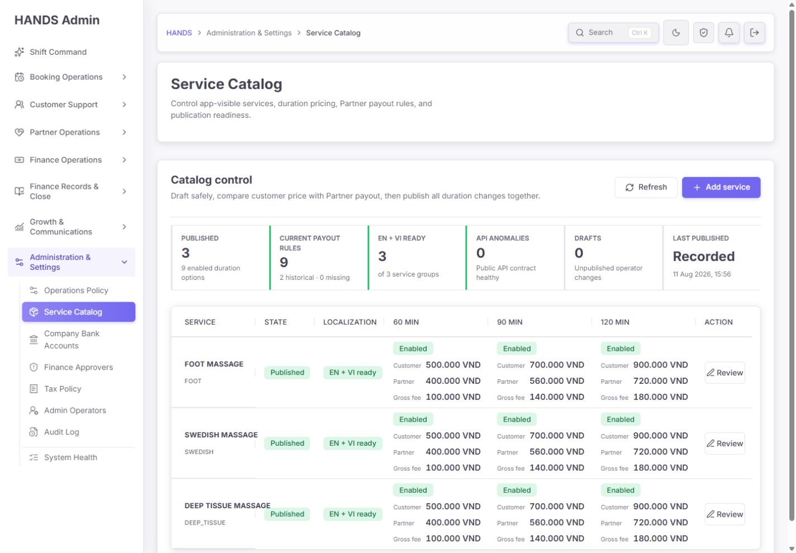
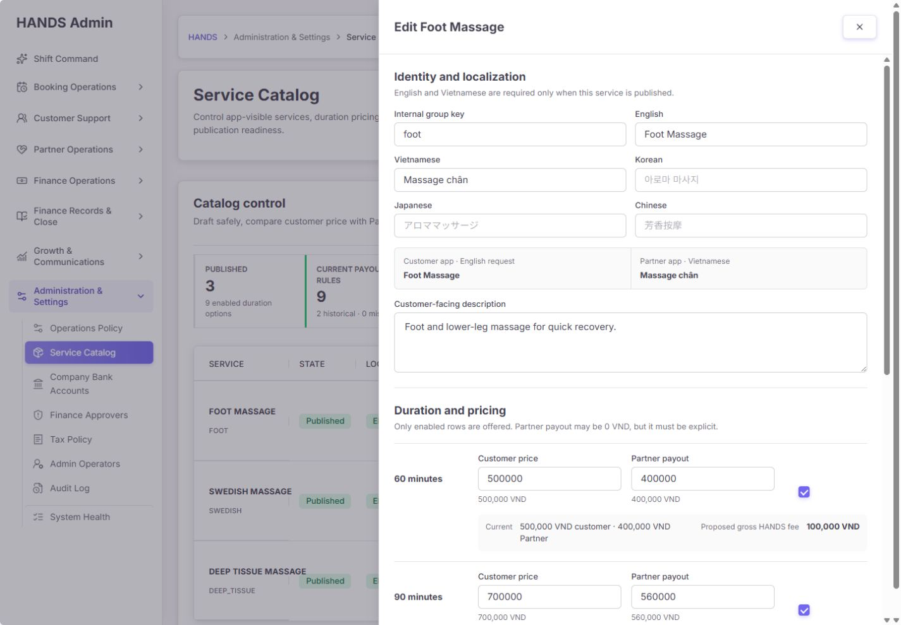
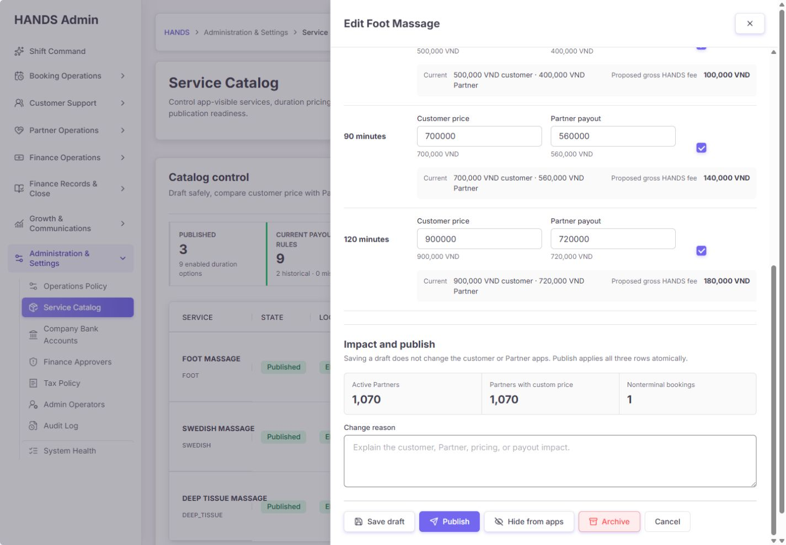
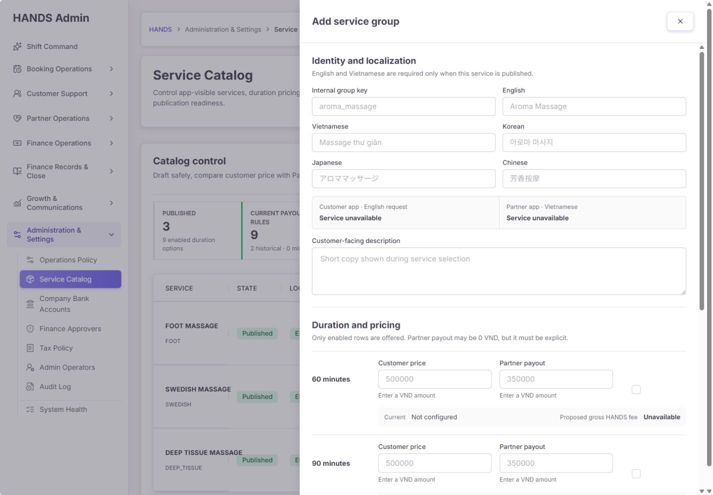
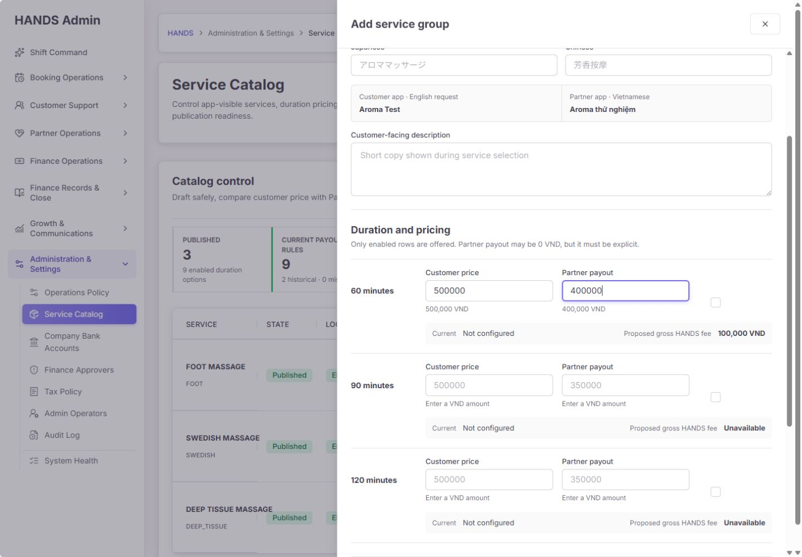
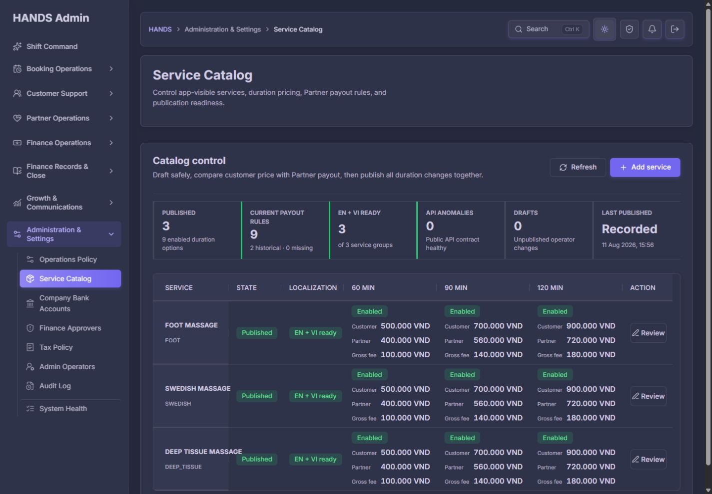
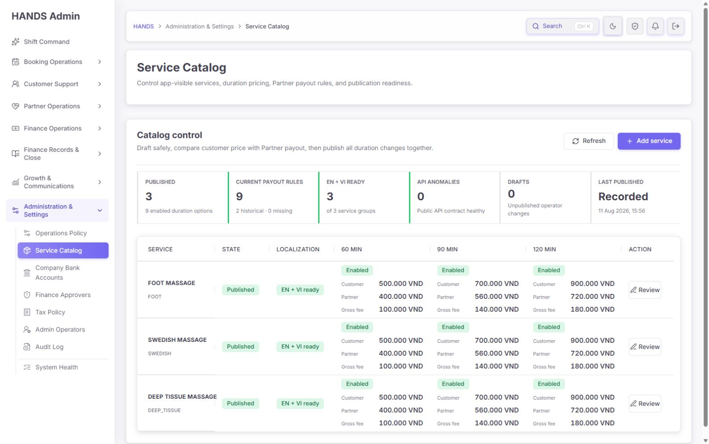
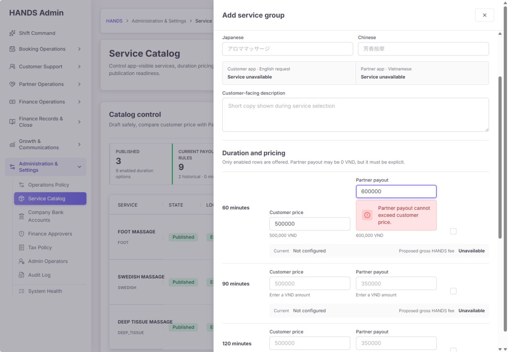

# Service Catalog 개선 후 최종 재감사 보고서

- 감사 일자: 2026-08-14
- 대상: Admin `/services`, 신규 서비스 drawer, 기존 서비스 편집 drawer, 공개 서비스 API, Admin 저장 API, 부킹 시점 정산 snapshot, 고객·Partner 앱 다국어 소비 계약
- 화면 기준: 1440 x 1000 및 1600 x 1000 데스크톱만 검수했다. 1024px 이하 화면은 범위에서 제외했다.
- 감사 방식: 로그인된 실제 화면 캡처, DOM·상호작용 확인, 현재 코드 및 테스트 추적, 공개 API 읽기 전용 검사, 관련 테스트·typecheck 실행
- 변경 범위: 제품 코드는 수정하지 않았고 이 보고서와 현재 실행 화면 증거만 추가했다.

## 1. 최종 결론

이전 41/100 상태와 비교하면 핵심 구조는 크게 개선됐다. 공개 API는 이제 실제 운영 서비스 3개 그룹·9개 옵션만 반환하고, 지급 규칙이 맞지 않는 옵션은 공개되지 않는다. 신규 서비스는 Draft로 저장할 수 있고 Publish 시 EN/VI, 활성 기간, 고객가, Partner 지급액, 변경 사유를 검증한다. 60/90/120분 발행은 한 transaction으로 처리되며 부킹에는 지급 규칙 snapshot이 남는다. 화면도 카드 나열에서 비교형 표와 우측 drawer로 정리되어 1440px 이상에서 훨씬 빠르게 읽힌다.

다만 **새 그룹 command가 유일한 변경 경로가 아니다.** 기존 단건 서비스·지급 규칙 mutation API와 사용하지 않는 Admin server action이 그대로 남아 있어, 새 UI를 우회하면 published 서비스의 가격 또는 지급 규칙을 원자성·version check·그룹 단위 감사 없이 바꿀 수 있다. 이 경로는 현재 UI에서 노출되지는 않지만 새 workflow가 보장하려는 핵심 불변식을 API 수준에서 무너뜨릴 수 있다.

또한 화면의 `API anomalies 0 · Public API contract healthy`는 실제 공개 API를 점검한 결과가 아니라 Admin 목록에서 계산한 추정치다. Draft 번역과 실제 공개 번역도 같은 readiness 숫자에 섞인다. 운영자는 녹색 상태를 실제 고객 앱 전달 상태로 오해할 수 있다.

**종합 점수: 82/100 — 내부 운영 품질은 크게 개선됐고 Release Candidate 수준이다. 단, 기존 직접 mutation 경로를 차단하거나 안전하게 제한하기 전에는 Service Catalog의 production write 권한을 열지 않는 것이 타당하다.**

판정은 다음과 같다.

- 읽기 전용 Catalog 현황 확인: 사용 가능
- Draft 작성과 검토: 사용 가능
- 실제 Publish/Hide/Archive: staging lifecycle smoke 후 조건부 사용 가능
- production release: 직접 mutation 우회 경로와 destructive action 보호를 먼저 보완

## 2. 점수표

| 영역 | 점수 | 판단 |
|---|---:|---|
| 운영자 과업 명확성 | 84/100 | 현황→검토→Draft→Publish 흐름은 명확하나 앱 노출 토글과 내부 key가 어렵다 |
| 1440px 이상 화면 구성 | 88/100 | 비교표와 drawer 밀도가 좋고 1600px에서는 매우 안정적이다 |
| 생성·편집 안전성 | 76/100 | inline 검증·원자 저장은 좋지만 위험 action 확인과 readiness 안내가 부족하다 |
| 카탈로그 데이터 신뢰성 | 92/100 | 공개 API 3그룹·9옵션, test 오염·지급 누락 노출 0을 확인했다 |
| 가격·정산 무결성 | 84/100 | booking snapshot과 atomic publish는 구현됐으나 legacy mutation이 우회 경로로 남았다 |
| 다국어·고객 노출 정합성 | 82/100 | EN/VI gate와 앱 resolver는 구현됐지만 설명 문구는 단일 언어다 |
| 접근성·문구 | 77/100 | modal/inert/focus 구조는 좋지만 숨은 토글 문구와 중복 action 이름이 남았다 |
| 성능·조회 구조 | 91/100 | 기본 1회 bounded 조회, 편집 시에만 impact 조회, 공개 응답 3,577 bytes다 |
| 권한·감사 추적 | 86/100 | SYSTEM_SERVICES, 변경 사유, 감사 change set은 좋지만 mutation 경로가 이원화됐다 |
| 테스트 실효성 | 75/100 | 핵심 API 테스트는 강해졌으나 Admin 상호작용 테스트 다수가 source 문자열 확인에 머문다 |

## 3. 이전 보고서 개선 항목 재검수

| 이전 문제 | 현재 판정 | 근거 및 남은 일 |
|---|---|---|
| 공개 API에 smoke/test 데이터 노출 | 해결 | 실제 `/api/services/groups` 200, 3 groups, 9 options, 3,577 bytes, finance key 0 |
| 신규 Enabled 값과 저장 결과 불일치 | 핵심 로직 해결 | `active60/90/120`을 group command의 `enabled`로 전송한다. 다만 가시 레이블이 없어 조작 의미가 불명확하다 |
| payout 누락 서비스 발행 가능 | 해결 | 활성 duration은 명시적 payout이 없으면 client와 API 모두 Publish를 차단한다 |
| 기존 부킹 지급액이 현재 rule에 종속 | 해결 | `BookingService`에 rule ID, Partner 지급액, 전체 rule snapshot을 저장하고 earnings가 snapshot을 사용한다 |
| 3개 duration 부분 저장 | 해결 | group PATCH가 transaction 안에서 세 기간과 rule version을 함께 저장한다 |
| current/historical/missing 구분 없음 | 대부분 해결 | `9 current · 2 historical · 0 missing`이 보인다. historical 상세를 열 수는 없다 |
| 번역 입력이 앱에서 사용되지 않음 | 이름 해결 | 고객·Partner 앱 resolver와 테스트가 존재한다. customer-facing description 번역은 남았다 |
| 가격·지급·HANDS fee 비교 어려움 | 해결 | 표와 drawer에서 세 값을 함께 표시하고 VND preview를 제공한다 |
| 변경 영향이 보이지 않음 | 부분 해결 | Partner·custom price·open booking count를 보이지만 현재값일 뿐 변경 후 delta는 아니다 |
| API 장애가 빈 화면으로 보임 | 해결 | groups/impact 각각 실패 상태를 구분한다 |
| 입력 중 오류와 복구 없음 | 해결 | payout 초과는 즉시 필드 오류·summary 오류·button 차단으로 보인다 |
| 위험 변경에 사유·확인·복구 경로 없음 | 부분 해결 | 사유·감사 링크·dirty close는 있다. Hide/Archive 전용 확인과 rollback shortcut은 없다 |
| 고객 노출 순서 관리 없음 | 미해결 | `displayOrder`는 hidden input이며 화면에서 순서를 바꿀 수 없다 |
| drawer 접근성 불완전 | 대부분 해결 | `aria-modal`, labelledby, focus trap, Escape, background inert가 확인됐다. backdrop과 close button 이름이 중복된다 |

## 4. 화면별 증거와 분석

### 4.1 기본 Catalog — 1440 x 1000

전반 상태: 좋음.

잘된 점:

1. 페이지 제목 아래에 별도 중복 hero를 두지 않고 `Catalog control` 한 카드로 작업 영역을 모았다.
2. 3개 서비스의 상태, EN/VI, 60/90/120분 가격, Partner 지급, HANDS gross fee를 행 단위로 비교할 수 있다.
3. 3개 그룹 규모에서 검색·필터를 억지로 추가하지 않은 판단은 적절하다.
4. `2 historical · 0 missing`처럼 정상 current rule과 legacy rule을 분리했다.

남은 문제:

1. `API anomalies 0`은 live public API probe가 아닌 로컬 계산값인데 `Public API contract healthy`라고 단정한다.
2. 모든 row action이 `Review`라서 screen reader의 link 목록에서는 어느 서비스를 여는지 구분하기 어렵다.
3. `Review`는 읽기 전용처럼 들리지만 drawer에서는 Publish·Hide·Archive까지 수행한다. `Edit` 또는 `Review & edit`가 더 정확하다.
4. `Last published · Recorded`는 가장 중요한 값 자리에 의미가 약한 단어를 둔다. 실제 시각, actor, reason 또는 audit 링크가 필요하다.

### 4.2 기존 서비스 편집 — 상단

전반 상태: 양호.

잘된 점:

1. `Identity and localization`, `Duration and pricing`, `Impact and publish` 순서가 운영자의 의사결정 흐름과 맞는다.
2. customer/Partner 앱 preview가 입력 즉시 반영된다.
3. drawer가 넓어 1440px에서도 form label과 입력값이 잘리지 않는다.
4. 배경 navigation과 main은 `aria-hidden` 및 `inert`가 적용되고 dialog는 `aria-modal=true`다.

남은 문제:

1. 기존 서비스의 `Internal group key`가 편집 가능하다. 하지만 server action은 이 값을 API path로 사용하므로 기존 그룹 rename이 아니라 새 key에 대한 version conflict 또는 별도 draft 시도가 된다.
2. 운영 필수 언어는 EN/VI인데 KO/JA/ZH를 같은 우선순위로 펼쳐 보여 첫 화면의 세로 길이를 늘린다. 추가 언어는 disclosure 아래로 접는 편이 효율적이다.
3. description은 `Customer-facing`이라고 명시하면서도 locale별 입력이 아니다. Vietnamese 앱에서 영어 설명이 노출될 수 있다.

### 4.3 기존 서비스 편집 — 가격·영향·action

전반 상태: 기능은 좋지만 위험 action 보호가 부족하다.

잘된 점:

1. 고객가·Partner 지급액·현재값·예상 gross fee를 한 duration 안에서 비교한다.
2. `Active Partners`, `Partners with custom price`, `Nonterminal bookings`를 Publish 전에 보여 준다.
3. change reason과 감사 change set 링크 계약이 존재한다.

남은 문제:

1. impact는 현재 count만 보여 주며 이번 변경으로 무엇이 달라지는지 설명하지 않는다.
2. API의 `nonterminalBookingCount`는 `BookingService.count()` 결과다. 화면 문구가 `bookings`라면 distinct booking을 세거나 `Open booking lines`로 바꿔야 한다.
3. `Hide from apps`와 `Archive`는 change reason이 이미 채워진 경우 별도 확인 없이 즉시 제출된다.
4. `Save draft`, `Publish`, `Hide`, `Archive`가 한 footer에 같은 수준으로 모여 있어 정상 작업과 destructive 작업의 경계가 약하다.
5. change reason은 Publish/Hide/Archive의 필수값이지만 label에 Required 표시나 최소 12자 안내, 글자 수가 없다.

### 4.4 신규 서비스 drawer

전반 상태: Draft-first 방향은 맞다.

잘된 점:

1. 신규 그룹이 즉시 고객 앱에 노출되지 않고 Draft/Publish action으로 분리됐다.
2. 빈 상태에서도 preview가 안정적인 fallback을 보인다.
3. 최소 한 duration만 활성화해도 발행할 수 있고, 활성 row만 가격·payout 필수 검증을 받는다.

남은 문제:

1. Publish button은 빈 form에서도 활성처럼 보이고 제출 후에야 여러 오류를 보여 준다. 현재 readiness를 action 근처에서 먼저 요약해야 한다.
2. `Internal group key`는 운영자가 직접 작성해야 하는 개발자 필드다. EN 이름에서 자동 생성하고 `Advanced`에서만 수정하도록 하는 편이 안전하다.
3. Draft는 불완전해도 저장할 수 있다는 점과 Publish 조건을 footer에서 더 명확히 분리해야 한다.

### 4.5 Localized preview와 앱 노출 토글

전반 상태: preview는 좋고 토글 표현은 불량하다.

실제 interaction 결과:

1. English 입력은 Customer preview에 즉시 반영됐다.
2. Vietnamese 입력은 Partner preview에 즉시 반영됐다.
3. 고객가와 payout 입력은 gross fee를 즉시 계산했다.
4. 보이는 체크 mark 영역을 누르면 상태는 정상 전환됐다.

문제:

1. `Enabled in apps`는 접근성 이름에는 존재하지만 가시 문구가 `sr-only`라 화면에는 작은 빈 사각형만 보인다.
2. 60/90/120분의 사각형이 무엇을 의미하는지, 체크하면 Customer와 Partner 앱 중 어디에 노출되는지 알기 어렵다.
3. 작은 mark만 조작 대상으로 인식되어 one-person operator의 실수 가능성이 높다.

수정 방향:

- 각 row에 `Offered in apps` 텍스트와 `On/Off` 상태를 항상 보인다.
- 전체 label 영역을 클릭 대상으로 유지한다.
- disabled 상태이면 `Not offered`로 가격 입력도 함께 비활성화하거나, 가격은 Draft 값으로 남는다는 점을 설명한다.

### 4.6 Dark mode — 1440 x 1000

전반 상태: 구조적 깨짐 없음.

표, status badge, sidebar, health strip의 계층은 유지된다. 다만 작은 muted text와 표 안의 secondary label은 밝은 mode보다 경계가 약하다. 이번 감사는 screenshot 기반 시각 점검이며 실제 contrast 계산은 수행하지 않았으므로 WCAG 실패로 단정하지 않는다. CI에 automated contrast 검사를 추가하는 것이 적절하다.

### 4.7 기본 Catalog — 1600 x 1000

전반 상태: 매우 좋음.

1600px에서는 가격 열 3개와 action이 충분한 간격으로 보이며 행 간 비교 속도가 좋다. 현재 3개 서비스 규모에서는 카드보다 표가 명백히 효율적이다. 이 화면에 검색, pagination, 별도 상세 page를 추가할 필요는 없다.

### 4.8 payout 초과 오류

전반 상태: 핵심 결함 해결.

`Customer 500,000 / Partner 600,000`을 입력하자 해당 field에 즉시 오류가 나타났고 전체 오류 summary도 표시됐다. `Save draft`와 `Publish` 모두 disabled가 됐다. 이전의 “서버에 제출한 뒤 generic error” 문제는 실제 화면 기준으로 해결됐다.

다만 같은 screenshot에서도 활성 토글이 설명 없는 작은 사각형으로만 보이는 문제가 분명하다.

## 5. 우선순위별 남은 문제

### P0-1. 새 group workflow를 우회하는 legacy mutation 경로를 닫아야 한다

현재 UI는 `PATCH /admin/services/groups/:groupKey`를 사용하지만 다음 경로가 계속 노출된다.

- `POST /admin/services`
- `POST /admin/services/duration-sets`
- `PATCH /admin/services/:id`
- `POST /admin/services/:id/payout-rules`
- `POST /admin/services/:id/payout-rules/bulk`
- `PATCH /admin/service-payout-rules/:id`

Admin Web의 `apps/admin_web/app/services/actions.ts`에도 이 경로를 쓰는 legacy server action 7개가 export 상태로 남아 있고 현재 화면에서는 사용하지 않는다. `service-dead-code.spec.ts`는 옛 component 파일이 없는지만 검사하며 이 action과 API route는 검사하지 않는다.

위험 시나리오:

1. published 서비스의 base price를 단건 PATCH한다.
2. 그룹 전체 transaction, expectedVersion, stable mutation key, Publish reason을 거치지 않는다.
3. exact payout rule이 새 가격과 맞지 않아 공개 API에서 해당 duration이 갑자기 사라질 수 있다.
4. 별도 payout PATCH까지 성공하기 전에는 고객 catalog와 Admin 상태가 불일치한다.

필수 수정:

1. 운영자 서비스는 group command 외 mutation을 거부한다.
2. smoke 전용 endpoint가 필요하면 production에서 비활성화하거나 `SMOKE` provenance와 전용 권한·환경으로 제한한다.
3. legacy route를 유지해야 한다면 PUBLISHED/OPERATOR row를 직접 수정하지 못하게 guard한다.
4. unused Admin server action을 제거하고 “active UI는 group command만 사용”하는 import/route contract test를 추가한다.

완료 기준:

- published 운영 서비스와 payout rule을 단건 mutation route로 바꾸려 하면 409 또는 403이다.
- 모든 production catalog write audit는 `service_group:{key}` change set으로 귀결된다.
- 부분 저장을 재현하는 통합 테스트가 추가되고 전부 rollback된다.

### P1-1. `API anomalies`를 실제 live 상태와 일치시켜야 한다

`apps/admin_web/app/services/page.tsx`의 `apiAnomalyCount`는 Admin에서 읽은 enabled published option 중 current payout이 없는 수만 센다. 실제 public endpoint의 status, group count, option count, localization projection, response age를 확인하지 않는다.

권장 구조:

- `Live public catalog`: 3 groups · 9 options · checked 2m ago
- `Blocked before delivery`: 0
- `Delivery/API unavailable`: 별도 danger
- `Working drafts`: 0

health backend가 실제 public projection과 같은 query/service를 사용하고, 화면 문구도 `Public API contract healthy`가 아니라 확인 범위와 시각을 정확히 말해야 한다.

### P1-2. Live와 Draft readiness를 분리해야 한다

현재 localization readiness는 draft가 최신이면 draft 번역을 사용한다. 따라서 published version은 정상인데 draft가 미완성인 경우 `Translation gap`으로 보이거나, 반대로 draft만 준비됐는데 live가 준비된 것처럼 보일 수 있다.

권장:

- State: `Published` / `Hidden` / `Archived`
- Live locale: `EN + VI ready`
- Draft: `Draft v4 · VI missing`
- Publish readiness: `2 blockers`

### P1-3. Hide·Archive를 별도 위험 흐름으로 분리해야 한다

권장:

1. 기본 footer에는 `Save draft`와 `Review publish`만 둔다.
2. `More actions`에 Hide, Archive를 둔다.
3. 전용 confirmation에서 현재 공개 option 수, 영향을 받는 Partner, open booking, 복구 방법을 보여 준다.
4. Archive confirmation은 group key를 입력하거나 명시적 checkbox를 요구한다.
5. 성공 후 `Undo hide` 또는 `Restore from draft` 경로를 제공한다.
6. Cancel, X, backdrop, Escape가 모두 같은 dirty-close 함수를 사용하도록 한다.

### P1-4. 기존 group key는 immutable로 표시해야 한다

신규 생성에서는 key 자동 생성 + 필요 시 고급 수정이 적절하다. 기존 그룹에서는 read-only text와 copy button만 보여야 한다. 실제 rename이 필요하면 별도 migration command로 service rows, draft, Partner prices, references, audit target을 함께 이동해야 한다.

### P1-5. Publish readiness를 action 근처에서 보여 줘야 한다

현재 Publish button은 pricing conflict가 아니면 활성이고 EN/VI, reason, enabled duration, payout 누락은 제출 후 server action error로 드러난다.

권장 summary:

- EN name: Ready
- VI name: Ready
- Enabled durations: 3
- Price/payout rules: 3 of 3 valid
- Change reason: 0/12 — Required
- `Publish 3 app-visible options`

상단 field 오류뿐 아니라 footer에 남은 blocker 수와 첫 오류로 이동하는 link를 둔다.

### P1-6. Impact는 현재 count가 아니라 변경 delta여야 한다

`1,070 Active Partners`, `1,070 custom price`, `1 nonterminal booking`만으로는 이번 가격 변경의 의미를 판단하기 어렵다.

필요한 정보:

- 공개 옵션: 3 → 2
- 고객 최저가: 500,000 → 600,000 VND
- base 가격을 그대로 쓰는 Partner: N
- custom price 때문에 영향 없는 Partner: N
- open bookings: N — 기존 snapshot 유지
- future bookings only / immediately hidden 같은 적용 시점

그리고 `BookingService.count()`를 계속 쓸 경우 label을 `Open booking lines`로 고쳐야 한다.

### P1-7. mutation key를 client submission 동안 안정적으로 유지해야 한다

현재 server action은 요청마다 `randomUUID()`를 새로 만들어 API에 보낸다. 같은 browser submission의 network retry와 lost response를 식별하려면 drawer가 열릴 때 또는 form submission 시작 시 생성한 key를 hidden field에 유지하고 같은 시도에서는 재사용해야 한다. expectedVersion이 중복 변경을 상당 부분 막지만 idempotency key의 목적을 완전히 대신하지는 않는다.

### P1-8. Customer-facing description도 locale 계약을 가져야 한다

이름은 EN/VI 필수인데 설명은 단일 문자열이다. 설명이 고객 앱에 보인다면 최소 `descriptionEn`, `descriptionVi`를 두고 name과 같은 fallback 순서를 적용해야 한다. 첫 출시에서 설명을 사용하지 않을 것이라면 field를 제거해 잘못된 단일 언어 입력을 막는 편이 낫다.

### P2-1. 앱 노출 토글의 가시 레이블을 복구한다

`AdminFormCheckbox`에 children을 주지 않아 label은 screen-reader only가 된다. 각 duration row에 `Offered in Customer & Partner apps`와 현재 On/Off 상태를 보인다.

### P2-2. action 이름을 서비스별로 고유하게 만든다

- 화면: `Review` → `Edit`
- 접근성 이름: `Edit Foot Massage`, `Edit Swedish Massage`, `Edit Deep Tissue Massage`

### P2-3. 추가 언어를 접는다

EN/VI는 기본 노출하고 KO/JA/ZH는 `Additional languages` disclosure에 둔다. 현재 Vietnam 초기 운영에서 가장 중요한 정보를 위로 당길 수 있다.

### P2-4. 고객 노출 순서를 운영 가능하게 만든다

현재 `displayOrder`는 hidden input이다. 서비스가 3개인 지금은 큰 문제가 아니지만 새 그룹을 추가할 때 고객 앱 순서를 예측하기 어렵다. 기본 표에서 drag를 강제할 필요는 없고, `Display order` 숫자 또는 `Move up/down`을 edit drawer에 추가하면 충분하다.

### P2-5. payout history의 의미를 열어 볼 수 있게 한다

`2 historical`을 클릭하면 service, customer price, payout, active/inactive, referenced booking count, 적용 기간을 보여 줘야 한다. 단순 숫자는 이상 여부를 판단하기 어렵다.

## 6. 코드 관점 심층 판정

### 6.1 잘 구현된 핵심 계약

1. 공개 read는 `active + PUBLISHED + OPERATOR/SEED + supported duration + exact safe payout` 조건을 만족한 option만 반환한다.
2. 공개 projection은 payout, VAT, other cost 같은 내부 finance key를 제거한다.
3. group publish는 DB transaction, expectedVersion, request hash, audit log를 사용한다.
4. payout rule은 덮어쓰지 않고 새 version을 만든다.
5. booking 생성 시 rule 전체 JSON과 Partner 지급액을 snapshot한다.
6. earnings는 최신 catalog rule 대신 booking snapshot을 사용하고 legacy 누락은 fail closed 한다.
7. impact query는 drawer가 열릴 때만 실행되어 기본 목록의 부담을 줄인다.
8. invalid group deep link는 빈 drawer 대신 recovery notice를 보여 준다.

### 6.2 테스트의 강점

1. public catalog filter와 내부 finance key 비노출 테스트가 존재한다.
2. incomplete Draft가 live row를 바꾸지 않는 테스트가 존재한다.
3. 3개 duration과 payout version이 한 transaction에서 발행되는 테스트가 존재한다.
4. stale version과 request ID replay conflict 테스트가 존재한다.
5. booking payout snapshot과 earnings fail-closed 테스트가 존재한다.
6. mobile locale fallback 테스트가 존재한다.

### 6.3 테스트의 빈틈

1. Admin UI 테스트는 실제 checkbox, dirty close, field error focus, action confirmation을 렌더·클릭하지 않고 source 문자열 존재를 주로 확인한다.
2. legacy mutation route가 published operator catalog를 변경하지 못하는 계약 테스트가 없다.
3. live public health와 Admin health 수가 같은지 검증하는 통합 테스트가 없다.
4. draft locale readiness와 published locale readiness를 분리하는 테스트가 없다.
5. Hide/Archive confirmation 및 restore lifecycle E2E가 없다.
6. stable idempotency key로 lost-response retry를 재현하는 테스트가 없다.

## 7. 권장 최종 화면 구조

### 목록 상단

1. `Live catalog` — 3 groups · 9 options · checked 2m ago
2. `Publish blockers` — 0
3. `Working drafts` — 0
4. `Localization` — Live EN+VI 3/3
5. `Payout coverage` — 9/9 current · 2 legacy ladders
6. `Last change` — actor · time · audit link

### 목록

| Service | Live state | Draft readiness | 60 min | 90 min | 120 min | Impact | Action |
|---|---|---|---|---|---|---|---|
| Foot Massage | Published · EN/VI | No draft | Customer / Partner / fee | … | … | 1 open | Edit |

### Drawer footer

- 왼쪽: `3 durations valid · EN/VI ready · reason required`
- 오른쪽 정상 action: `Save draft`, `Review publish`
- 분리된 위험 menu: `Hide from apps`, `Archive`
- Cancel은 button으로 만들어 동일한 dirty-close guard를 사용

## 8. 구현 순서

1. **Release gate:** legacy service/payout mutation route를 제거하거나 PUBLISHED/OPERATOR direct mutation을 거부한다.
2. **Release gate:** disposable staging에서 create → draft → publish → hide → restore/archive → audit receipt를 검증한다.
3. live public health와 draft readiness를 분리한다.
4. Hide/Archive 전용 confirmation과 restore 경로를 구현한다.
5. 기존 group key를 read-only로 만들고 새 key 자동 생성을 적용한다.
6. visible app toggle label, publish blocker summary, reason counter를 추가한다.
7. current impact를 before→after delta로 바꾸고 distinct booking 의미를 맞춘다.
8. description locale와 display order 관리 여부를 확정한다.
9. 실제 DOM interaction 기반 Admin component/E2E 테스트를 추가한다.

## 9. 필수 인수 테스트

1. published 운영 서비스를 legacy 단건 PATCH로 변경할 수 없다.
2. payout legacy PATCH가 group version과 분리되어 실행되지 않는다.
3. public API는 항상 3 intended groups, 9 safe options만 반환한다.
4. Admin live count와 public projection count가 다르면 danger다.
5. draft의 번역 누락이 live localization badge를 바꾸지 않는다.
6. 기존 group key는 편집할 수 없다.
7. 60/90/120 app toggle은 마우스와 키보드로 조작되고 가시 On/Off 문구가 있다.
8. payout > customer price에서 field 오류, summary 오류, action 차단이 유지된다.
9. Publish blocker summary가 EN, VI, reason, enabled duration, payout 누락을 모두 표시한다.
10. Hide/Archive는 별도 confirm 없이 실행되지 않는다.
11. Cancel, X, backdrop, Escape 모두 dirty form에서 같은 확인을 보여 준다.
12. lost response 후 같은 mutation key 재시도는 중복 payout version을 만들지 않는다.
13. price 변경 후 기존 booking earnings는 기존 snapshot을 그대로 사용한다.
14. staging audit log에서 actor, reason, before/after, version, exact group target을 확인할 수 있다.

## 10. 이번 재감사 실행 결과

| 검사 | 결과 |
|---|---|
| 실제 `/api/services/groups` | PASS — HTTP 200, 3 groups, 9 options, 3,577 bytes, finance key leak 0 |
| Admin Service Catalog 집중 테스트 | PASS — 9 files, 97 tests |
| API catalog/booking/earnings 집중 테스트 | PASS — 7 files, 101 tests |
| Admin typecheck | PASS |
| API typecheck | PASS |
| Service catalog cleanup tool tests | PASS — 5 tests |
| Prisma migration check | PASS — 95 migrations, violation 0, 기존 duplicate timestamp warning 1 |
| Admin visible-copy guard | PASS — 1,638 files, violation 0 |
| 브라우저 console | PASS — error/warning log 0 |
| 실제 payout 초과 UI | PASS — field/summary 오류와 Save/Publish 차단 확인 |
| staging create→publish→hide→archive mutation smoke | 이번 감사에서 미실행 — 현재 catalog를 변경하지 않기 위해 제외 |

## 11. 증거 한계

1. 현재 운영 catalog를 변경하지 않기 위해 실제 Publish, Hide, Archive는 누르지 않았다.
2. 1024px 이하 responsive 화면은 사용자 운영 조건에 따라 검사하지 않았다.
3. Dark mode contrast는 시각 검토만 했고 수치 기반 WCAG contrast 계산은 수행하지 않았다.
4. 현재 로그인 세션과 local database를 기준으로 검사했으며 staging migration 적용 여부는 별도 확인이 필요하다.

## 12. 최종 출시 판단

화면 재설계와 핵심 데이터 무결성 개선은 성공했다. 특히 public catalog 오염, payout 누락 공개, 부분 저장, booking payout 소급 변경이라는 이전 P0 문제는 현재 코드·실행 API·테스트에서 해결된 것으로 판단한다.

남은 가장 중요한 문제는 UI 미관이 아니라 **write path를 하나로 강제하지 못한 것**이다. 새 UI가 아무리 안전해도 기존 단건 API가 published row를 직접 바꿀 수 있으면 운영 불변식은 보장되지 않는다. 이 경로를 막고 staging lifecycle smoke를 통과하면 Service Catalog 범위는 production release 승인 가능한 수준으로 올라간다.

그다음 순서는 실제 public health, live/draft 분리, destructive confirmation, immutable key, visible toggle, impact delta다. 이 항목을 완료하면 예상 품질은 90/100 이상이다.
