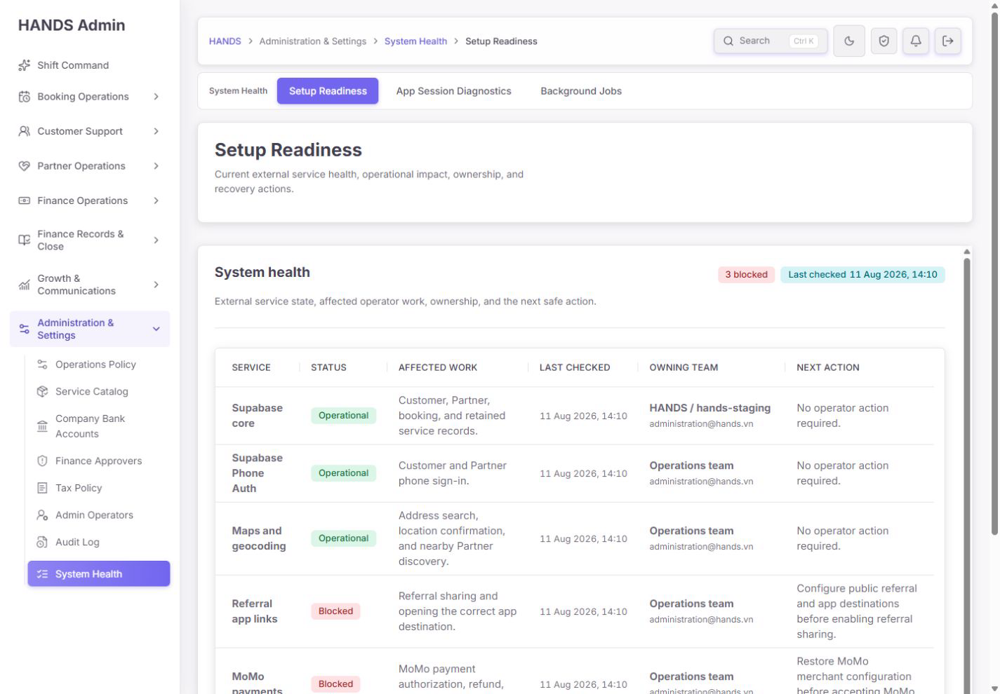
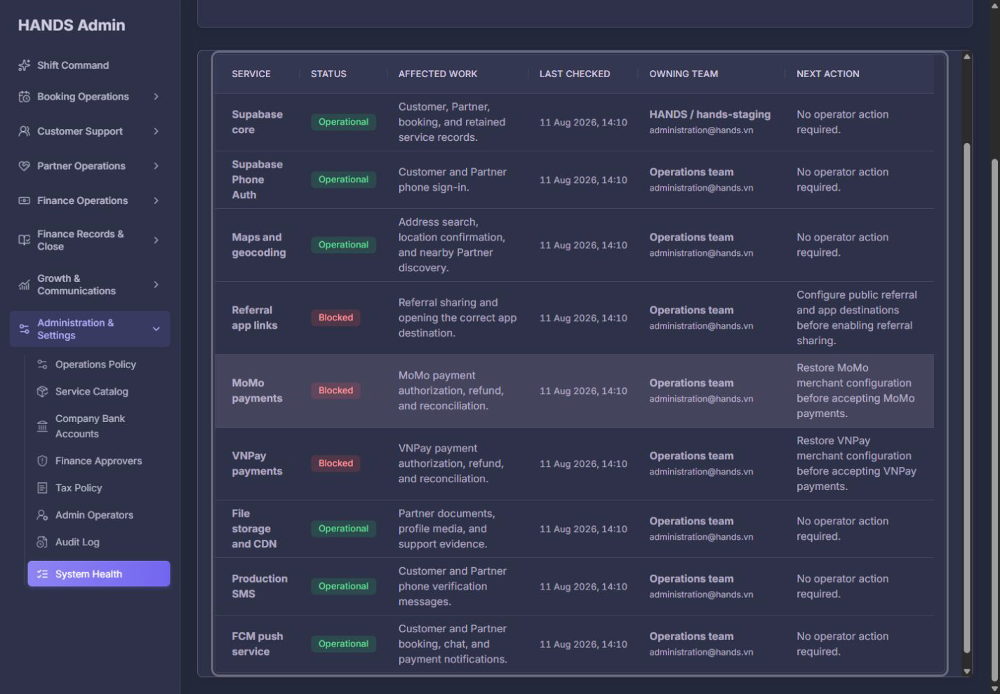
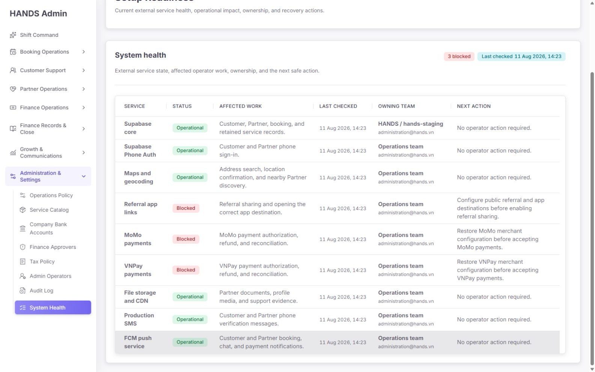

# Setup Readiness 최종 재감사 보고서

- 감사 일자: 2026-08-11
- 대상: `http://localhost:3101/setup`
- 기준 해상도: 1440px 이상만 검사
- 제외 범위: 1024px 이하 반응형 및 모바일 화면
- 감사 관점: 1인 운영자가 장애·설정 누락·출시 차단 요인을 빠르고 정확하게 판단할 수 있는가
- 검증 범위: 실제 화면, 키보드 탐색, 라이트/다크 테마, 프론트엔드 코드, API 상태 계약, 서버 판정 로직, 운영 문서, 자동화 테스트

## 1. 결론

### 종합 점수: 42/100

현재 페이지는 표의 기본 가독성과 시각적 일관성은 확보했지만, **운영 상태를 신뢰할 수 있는 시스템 헬스 화면으로는 출시 준비가 되지 않았다.** 가장 큰 이유는 외부 서비스에 실제로 연결해 정상 동작하는지 검사하지 않고 환경 변수의 존재와 형식만 확인한 결과를 `Operational`로 표시하기 때문이다.

또한 API에는 `currentStageOk`, `deferred`, `scope`, `operatorAction`, `commands`가 이미 존재하지만 화면이 이를 버리고 있다. 그 결과 현재 출시 범위가 아닌 Referral, MoMo, VNPay까지 모두 빨간 `Blocked`로 합산된다. 현금 결제 우선 출시 정책에서는 MoMo/VNPay가 꺼져 있는 것이 안전한 정상 상태이므로, 현재 `3 blocked`는 운영자가 잘못 행동하게 만드는 경보다.

판정은 다음과 같다.

- 실시간 `System Health` 화면으로 출시: **보류**
- 제한된 `Setup / Configuration Readiness` 화면으로 사용: **상태 의미와 범위 집계 수정 후 가능**
- 현금 결제 우선 서비스 출시 자체: MoMo/VNPay 미활성화를 이유로 차단하면 안 됨

## 2. 점수표

| 영역 | 점수 | 판정 |
|---|---:|---|
| 시각적 완성도 | 67 | 표·배지·타이포그래피는 정돈됐으나 정보 밀도와 스크롤 구조가 미흡 |
| 운영자 사용성 | 38 | 무엇을 먼저 해야 하는지, 어디에서 처리하는지 알 수 없음 |
| 데이터 진실성·신뢰 | 20 | 설정 존재 여부를 실제 운영 정상으로 오인하게 표현 |
| 정보 구조·명명 | 34 | Setup Readiness와 System Health가 혼합됨 |
| 장애 복구·오류 상태 | 40 | API 오류를 구분하지 못하고 재시도·런북·연결 CTA 없음 |
| 접근성 | 56 | 기본 시맨틱은 양호하나 중첩 스크롤과 키보드 이동 문제가 큼 |
| 성능 | 72 | 화면 자체는 단순하나 데이터 의미와 불필요한 레거시 유지비가 문제 |
| 테스트 신뢰도 | 55 | 통과는 하지만 핵심 상태 의미를 보호하는 테스트가 빠짐 |

## 3. 실제 운영 흐름 점검

| 단계 | 운영자가 보는 것 | 기대 행동 | 현재 결과 | 상태 |
|---|---|---|---|---|
| 1. 페이지 진입 | `Setup Readiness`, `System health`, `3 blocked` | 현재 장애인지 출시 전 설정 누락인지 즉시 구분 | 서로 다른 개념이 한 화면에 혼합됨 | 주의 |
| 2. 차단 항목 확인 | Referral, MoMo, VNPay가 Blocked | 영향·긴급도·현재 출시 범위 판단 | 모두 동일한 빨간 차단으로 보임 | 나쁨 |
| 3. 원인 확인 | Impact, Next action, Last checked | 실제 장애 증거와 시작 시점 확인 | 하드코딩된 설명과 응답 생성 시각만 제공 | 나쁨 |
| 4. 조치 시작 | 텍스트 형태의 Next action | 담당 화면·런북·재검사로 이동 | 클릭 가능한 조치가 없음 | 나쁨 |
| 5. 키보드 탐색 | 표 영역에서 PageDown | 예측 가능한 단일 스크롤 | 페이지와 카드가 함께 움직임 | 나쁨 |
| 6. 넓은 화면 확인 | 1600px에서 9개 서비스 | 한 화면에 전체 상태 비교 | 1600px에서는 비교적 양호 | 보통 |
| 7. 다크 모드 | 동일 정보 확인 | 밝기 변화에도 의미 유지 | 가독성은 유지되나 구조 문제는 동일 | 양호 |

## 4. 화면 증거

### 4.1 1440px 첫 화면



첫 화면에서 `3 blocked`가 강하게 강조되지만 이것이 현재 장애인지, 출시 전 설정인지, 의도적으로 미사용 중인 서비스인지 구분할 수 없다. 아래 차단 행까지 보려면 카드 내부를 별도로 스크롤해야 한다.

### 4.2 중첩 스크롤과 키보드 이동



1440×1000에서 문서 자체와 `.card.admin-section`이 각각 세로 스크롤을 가진다. 표 영역에 포커스를 두고 PageDown을 누르면 문서와 카드가 동시에 이동했다. 이는 키보드 사용자뿐 아니라 마우스 휠 사용자에게도 현재 위치를 잃게 만드는 구조다.

### 4.3 1600px 전체 서비스 목록



1600px에서는 9개 서비스를 한 번에 비교할 수 있어 시각적 구조가 더 안정적이다. 다만 넓은 화면에서도 상태 의미, 실제 검사 증거, 조치 버튼이 없는 문제는 그대로다.

## 5. 잘 개선된 부분

다음 요소는 유지할 가치가 있다.

1. 9개 외부 서비스가 하나의 표에 정렬되어 서비스 간 비교가 쉽다.
2. 상태를 색상만으로 표현하지 않고 `Operational`, `Blocked` 텍스트를 함께 제공한다.
3. 표 헤더와 행 구조가 시맨틱 테이블로 구현되어 있다.
4. 표 영역에 접근 가능한 이름과 포커스 처리가 있고, 페이지에는 skip link가 있다.
5. 사이드바와 작업공간 내비게이션에 현재 위치가 표시된다.
6. 라이트·다크 테마 모두 텍스트가 사라지거나 레이아웃이 깨지지 않는다.
7. 브라우저 콘솔에서 오류나 경고가 확인되지 않았다.
8. 관리자 권한 가드가 적용되어 비인증 `/health/external` 호출은 401과 요청 ID를 반환한다.
9. 관련 프론트 테스트 49개와 API 테스트 20개가 모두 통과했다.

이 장점들은 레이아웃을 전면 재작성하기보다 **상태 모델과 운영 행동을 바로잡는 방식**으로 개선할 수 있다는 뜻이다.

## 6. 핵심 발견 사항

### P0-1. `Configured`를 `Operational`로 잘못 번역한다

#### 확인 근거

- `apps/api/src/health/health.service.ts`의 외부 서비스 판정은 환경 변수 누락·형식·예상 값만 확인한다.
- 성공 상세 문구도 `All required environment values are configured.`이다.
- `apps/admin_web/app/setup/setup-page-model.ts`는 API의 `READY`를 `Operational`로 바꾼다.
- UI 소개 문구는 이를 `Current external service health`라고 설명한다.

#### 운영 위험

키가 폐기됐거나, 공급사 API가 다운됐거나, 네트워크가 막혔거나, OTP/Push/결제가 실제로 실패해도 환경 변수만 존재하면 `Operational`로 보일 수 있다. 운영자는 녹색 상태를 신뢰하고 장애 대응을 늦출 수 있다.

#### 수정 요건

상태를 최소 두 축으로 분리한다.

| 축 | 허용 상태 | 의미 |
|---|---|---|
| Configuration | Configured / Incomplete / Disabled / Deferred | 자격 증명과 플래그가 준비됐는가 |
| Runtime health | Healthy / Degraded / Down / Unknown / Not monitored | 실제 연결 또는 기능 검사가 성공했는가 |

실제 probe가 없는 서비스는 `Operational`이 아니라 `Not monitored` 또는 `Configuration ready`로 표시한다. 녹색 `Healthy`는 연결 또는 기능 검사가 성공한 경우에만 사용한다.

### P0-2. Deferred 서비스가 현재 차단 항목으로 잘못 합산된다

#### 확인 근거

- API는 Referral, Payments, Push, Storage 등 출시 이후 범위를 `DEFERRED`로 구분하고 `currentStageOk`와 `deferred`를 제공한다.
- 프론트 모델은 `scope`, `deferred`, `currentStageOk`를 사용하지 않고 `Blocked` 행을 모두 카운트한다.
- 화면 결과는 Referral, MoMo, VNPay를 포함한 `3 blocked`다.

#### 운영 위험

현재 필요한 일과 나중에 준비할 일을 구분하지 못한다. 불필요한 빨간 경보가 반복되면 운영자는 실제 경보도 무시하게 된다.

#### 수정 요건

- 상단 요약은 `현재 출시 차단`, `주의`, `의도적 보류`로 분리한다.
- 기본 목록은 `현재 출시 범위`만 보여준다.
- Deferred 항목은 별도 접힌 영역 또는 `Launch readiness` 탭으로 이동한다.
- 상단 빨간 차단 수는 `requiredForCurrentLaunch === true`인 미완료 항목만 집계한다.
- API의 `currentStageOk`, `blockingCategories`, `deferredCategories`를 화면 계약에 그대로 반영한다.

### P0-3. 현금 결제 우선 정책과 결제 상태가 충돌한다

#### 확인 근거

- MoMo와 VNPay는 `*_GATEWAY_ENABLED=true`가 아니면 차단으로 판정된다.
- `docs/architecture/payments.md`와 `docs/architecture/external-setup-checklist.md`는 smoke/E2E 검증 전 두 게이트웨이를 false로 유지하도록 요구한다.
- 기본 고객 결제 카탈로그는 현금 결제만 노출하도록 설계되어 있다.

#### 운영 위험

안전한 비활성 상태를 장애처럼 보여준다. 운영자가 경보를 없애려고 검증되지 않은 결제 게이트웨이를 켜면 더 큰 사고가 생길 수 있다.

#### 수정 요건

다음 상태 규칙을 적용한다.

| 출시 모드 | 게이트웨이 설정 | 표시 상태 |
|---|---|---|
| Cash-only | Disabled | `Deferred — intentionally disabled` |
| Cash-only | Enabled but invalid | `Warning — enabled outside launch scope` |
| Gateway required | Disabled | `Blocked — required but disabled` |
| Gateway required | Configured, unprobed | `Configuration ready · Runtime unknown` |
| Gateway required | Functional probe success | `Healthy` |

출시 프로필을 코드에 암묵적으로 흩뿌리지 말고 `launchProfile` 또는 capability 정책에서 단일 소스로 관리한다.

### P0-4. 시스템 헬스와 출시 준비도의 정보 구조가 섞여 있다

현재 사용되는 이름은 다음 세 가지다.

- 사이드바 대분류: `System Health`
- 페이지·서브 내비게이션: `Setup Readiness`
- 본문 섹션: `System health`

`Setup Readiness`는 일회성 설정과 출시 전 준비를 의미하지만 `System Health`는 현재 장애와 성능을 의미한다. 한 상태표에서 두 개념을 합치면 빨간색의 의미가 모호해진다.

#### 권장 IA

새 사이드바 페이지를 더 만들지 말고 `/setup` 하나 안에 두 작업공간을 둔다.

1. `Runtime health` — 기본 탭
   - 현재 활성화된 서비스만 표시
   - 실제 probe, 마지막 성공, 장애 시작, 영향, 복구 행동 제공
2. `Launch readiness`
   - 현재 출시 프로필별 필수 설정
   - 현재 차단과 Deferred 분리
   - 자격 증명 값은 노출하지 않고 설정 상태와 안전한 런북만 제공

`App Session Diagnostics`와 `Background Jobs`는 문제 성격과 대응 흐름이 다르므로 기존 별도 페이지를 유지한다.

### P0-5. API 오류 상태가 모두 같은 화면으로 소실된다

`page.tsx`는 `adminGet`과 fallback을 사용한다. `adminGet`은 응답 상태를 버리므로 401, 403, 500, 네트워크 단절, 타임아웃이 모두 같은 unavailable 상태로 합쳐진다.

#### 수정 요건

- `adminGetResult` 또는 typed result를 사용한다.
- 상태별 화면을 구분한다.
  - 401: 세션 만료, 다시 로그인
  - 403: 권한 없음, 접근 요청
  - 5xx: 상태 조회 실패, 재시도와 요청 ID
  - timeout/network: 연결 문제, 마지막 성공 데이터가 있으면 stale 배지
- 실패 시 epoch 시간이나 정상처럼 보이는 빈 표를 렌더링하지 않는다.

### P1-1. 실제 운영 행동으로 이어지는 CTA가 없다

현재 Next action은 모두 일반 텍스트다. 운영자는 어디서 조치해야 하는지 직접 찾아야 한다.

각 문제 행에 조건부 행동을 제공한다.

- `재검사`
- `관련 알림 열기`
- `Background Jobs 보기`
- `App Sessions 보기`
- `결제 설정/런북 열기`
- `담당자에게 전달`
- `상세 증거 보기`

버튼은 항상 많이 노출하지 말고 기본 CTA 하나와 `More` 메뉴로 제한한다. 위험한 변경이나 secret 수정 기능은 일상 운영 화면에 직접 넣지 않는다.

### P1-2. `Last checked`가 검사 시각처럼 보이지만 응답 생성 시각이다

모든 행의 시간이 동일하며 frontend는 response timestamp를 각 행에 복사한다. 이는 서비스별 실제 검사의 마지막 성공 시각이 아니다.

필요한 필드는 다음과 같다.

- `lastProbeAt`
- `lastSuccessAt`
- `failureSince`
- `latencyMs`
- `errorCode` 또는 안전하게 정제된 오류 요약
- `probeType`: Config / Connectivity / Functional E2E
- `isStale`

검사를 하지 않은 경우 시간을 꾸며내지 말고 `Not probed`로 표시한다.

### P1-3. 영향과 담당자 정보가 운영 판단에 부족하다

Impact와 Next action은 서비스별 하드코딩된 문구다. 담당자도 대부분 `Operations team`과 같은 이메일로 반복된다.

#### 수정 요건

- 현재 영향이 없으면 `No confirmed impact`라고 명시한다.
- 가능하면 영향받은 최근 예약·알림·결제 건수를 연결한다.
- `ownerTeam`, `onCallRoute`, `runbookUrl`, `escalationPolicy`를 구조화한다.
- 이메일 문자열을 분리해 임의의 `Operations team`으로 만드는 대신 API가 표시명과 연락 방식을 제공한다.
- 기술 설정 담당과 일상 운영 담당이 다르면 별도로 표시한다.

### P1-4. 1440px에서 중첩 세로 스크롤이 발생한다

`globals.css`의 `.setup-health-section.admin-section`에 viewport 기반 max-height와 `overflow-y:auto`가 적용되어 문서와 카드가 각각 스크롤된다.

#### 수정 요건

- 데스크톱 기본 화면에서는 카드의 `max-height`와 세로 overflow를 제거한다.
- 페이지 문서 하나만 세로 스크롤하도록 한다.
- 열이 많아질 때는 표의 가로 스크롤만 허용한다.
- 1440×900, 1440×1000, 1600×1000에서 첫 문제 행과 상단 요약의 관계를 확인한다.
- 표 헤더 고정이 필요하면 페이지 스크롤 기준 sticky header를 사용하되 사이드바/상단바와 겹치지 않게 한다.

### P1-5. 기본 화면의 우선순위가 1인 운영자에게 맞지 않는다

알파벳이나 구성 순서보다 `현재 영향과 조치 필요성`이 먼저 보여야 한다.

권장 기본 정렬:

1. 현재 출시를 차단하며 조치 가능한 항목
2. 실제 장애 또는 성능 저하
3. 상태를 모르는 활성 서비스
4. 정상 서비스
5. 의도적으로 보류된 서비스

필터는 처음부터 복잡한 필터 빌더를 만들 필요가 없다. 다음 세 개의 저장된 보기면 충분하다.

- `Needs action`
- `Active services`
- `Deferred`

### P2-1. 현재 페이지에서 사용되지 않는 Setup 코드가 많이 남아 있다

`apps/admin_web/app/setup`에는 약 2천 줄의 비테스트 코드가 있으며, 현재 페이지는 Overview와 모델 일부만 가져온다. 등록 handoff, readiness order, progress control, operator actions, migration runway, group detail, external backlog 관련 컴포넌트는 현재 페이지의 정적 import 경로에서 확인되지 않고 주로 자체 테스트만 남아 있다.

이는 현재 번들 비용으로 단정할 수는 없다. 트리 셰이킹으로 제외될 가능성이 높기 때문이다. 그러나 유지보수와 테스트 노이즈는 분명하다.

#### 수정 요건

- 실제 import 소비자를 다시 확인한 뒤 사용하지 않는 이전 setup wizard UI를 제거한다.
- 보존해야 하는 기술 절차는 관리자 일상 화면이 아니라 `docs/runbooks`로 이동한다.
- 544줄 규모의 정적 registration plan에서 현재 Overview에 필요한 owner metadata만 별도 작은 모듈로 분리한다.
- 제거 전에는 테스트와 검색으로 외부 소비자가 없는지 확인한다.

### P2-2. 상태 문구와 용어를 통일해야 한다

권장 용어:

- 페이지: `External Services`
- 기본 탭: `Runtime health`
- 보조 탭: `Launch readiness`
- 설정만 완료: `Configuration ready`
- 실제 검사 없음: `Runtime not monitored`
- 의도적 미사용: `Deferred — intentionally disabled`
- 현재 필수 설정 누락: `Launch blocker`
- 실제 장애: `Down` 또는 `Degraded`

`No operator action required`는 실제 상태 증거가 없으면 사용하지 않는다. 대신 `No configuration action required`처럼 범위를 정확히 제한한다.

## 7. 서비스별 현재 판정과 권장 표시

| 서비스 | 현재 서버가 확인하는 것 | 현재 UI | 권장 기본 표시 |
|---|---|---|---|
| Supabase core | URL·키·환경 설정 | Operational | Configuration ready · Runtime은 DB/연결 probe 결과로 별도 표시 |
| Supabase Phone Auth | `AUTH_BACKEND=supabase` 등 설정 | Operational | Configuration ready · OTP E2E not monitored |
| Maps and geocoding | 키 존재·형식 | Operational | Configuration ready · Connectivity/functional probe 필요 |
| Referral app links | 설정/딥링크 값 | Blocked | Deferred 또는 현재 출시 범위에 따라 blocker |
| MoMo payments | 자격 증명과 enable flag | Blocked | Cash-only에서는 intentionally disabled |
| VNPay payments | 자격 증명과 enable flag | Blocked | Cash-only에서는 intentionally disabled |
| File storage and CDN | storage 설정 | Operational | Configuration ready · 업로드/읽기 probe 별도 |
| Production SMS | provider 설정 | Operational | Configuration ready · 전달/OTP probe 또는 not monitored |
| FCM push service | credential 설정 | Operational | Configuration ready · 실제 delivery probe 별도 |

## 8. 권장 화면 구조

### 상단

- 제목: `External Services`
- 설명: `Active service health and launch configuration status.`
- 출시 프로필: `Cash-only launch`
- 마지막 자동 갱신과 `Refresh` 버튼
- 요약 카드:
  - `Needs action 0`
  - `Degraded 0`
  - `Unknown 6`
  - `Deferred 3`

### Runtime health 탭

열 구성:

1. Service
2. Runtime health
3. Evidence
4. Current impact
5. Last success / Failure since
6. Owner
7. Action

Configuration-only인 행은 건강 상태 칸에 녹색을 쓰지 않고 `Not monitored`를 중립색으로 표시한다.

### Launch readiness 탭

열 구성:

1. Capability
2. Required for current launch
3. Configuration
4. Validation level
5. Owner
6. Next step

Deferred는 기본적으로 접되 전체 건수와 이유를 보여준다.

## 9. 권장 데이터 계약

프론트에서 하드코딩해 추론하지 말고 API가 다음 정보를 명시적으로 제공해야 한다.

```ts
type ExternalServiceStatus = {
  id: string;
  name: string;
  category: 'auth' | 'maps' | 'payments' | 'storage' | 'messaging' | 'referrals';
  enabled: boolean;
  requiredForCurrentLaunch: boolean;
  configurationStatus: 'CONFIGURED' | 'INCOMPLETE' | 'DISABLED' | 'DEFERRED';
  runtimeStatus: 'HEALTHY' | 'DEGRADED' | 'DOWN' | 'UNKNOWN' | 'NOT_MONITORED';
  probeType: 'CONFIG' | 'CONNECTIVITY' | 'FUNCTIONAL_E2E' | 'NONE';
  lastProbeAt: string | null;
  lastSuccessAt: string | null;
  failureSince: string | null;
  latencyMs: number | null;
  impactSummary: string | null;
  ownerTeam: string;
  escalationRoute: string | null;
  runbookUrl: string | null;
  safeOperatorAction: string | null;
};
```

Secret 값, 전체 명령어, 내부 인프라 상세는 이 계약에 넣지 말고 권한이 제한된 런북으로 연결한다.

## 10. 파일별 구현 지침

### `apps/admin_web/app/setup/page.tsx`

- `adminGet` 대신 상태 코드를 보존하는 result API 사용
- runtime health와 launch readiness 데이터를 분리해 전달
- 실패·권한·stale 상태별 렌더링
- 기존 epoch fallback 제거

### `apps/admin_web/app/setup/setup-overview-section.tsx`

- `Blocked` 문자열 기반 단일 카운트 제거
- launch blocker, degraded, unknown, deferred 분리
- plain text Next action을 실제 CTA 또는 메뉴로 교체
- per-service probe evidence와 시간 표시
- generic owner parsing 제거

### `apps/admin_web/app/setup/setup-page-model.ts`

- `READY => Operational` 변환 제거
- API의 scope/deferred/currentStageOk 보존
- 하드코딩된 impact/action mapping을 API 계약 또는 중앙 메타데이터로 이동
- 현재 사용하는 모델과 이전 setup wizard 모델을 분리

### `apps/api/src/health/health.service.ts`

- 환경 설정 검사를 `configurationStatus`로 명명
- 실제 probe가 없으면 runtime status를 `NOT_MONITORED`로 반환
- `/health/ready`의 DB/Redis 결과와 외부 서비스 계약을 일관되게 연결
- 결제 상태는 current launch profile과 enable flag 조합으로 판정
- 실제 probe는 짧은 timeout, 안전한 오류 정제, 공급사 rate limit을 고려

### `apps/admin_web/app/globals.css`

- `.setup-health-section.admin-section`의 세로 max-height/overflow 제거
- 문서 단일 스크롤 유지
- 상태 색상은 configuration과 runtime 의미가 섞이지 않도록 토큰 분리

### 내비게이션·권한

- `/setup`의 권한 분류 `DEVELOPER_SETUP`은 유지 가능
- 사이드바 `System Health` 하위에 둘 경우 페이지 이름을 `External Services`로 바꾸고 내부 탭으로 의미를 분리
- 기술 진단 접근 권한과 secret 변경 권한은 계속 분리

## 11. 테스트 재설계

### 현재 확인 결과

- Admin setup 테스트: 14 files, 49 tests 통과
- API health 테스트: 2 files, 20 tests 통과
- 브라우저 콘솔: 오류 없음
- `/api/health/ready`: DB·Redis·storage 준비 상태 200 확인
- 비인증 `/api/health/external`: 401 확인

### 테스트의 신뢰도 문제

- `page.spec.tsx`는 `apiGet`을 mock하지만 실제 페이지는 `adminGet`을 사용해 mock 대상이 맞지 않는다.
- 많은 테스트가 소스 문자열 또는 현재 페이지에서 사용하지 않는 컴포넌트를 검사한다.
- API 테스트는 Referral이 deferred임을 알고 있지만 프론트에는 deferred를 blocker에서 제외하는 계약 테스트가 없다.

### 반드시 추가할 테스트

1. `configuration READY`가 `runtime HEALTHY`로 렌더링되지 않는 테스트
2. Cash-only launch에서 MoMo/VNPay disabled가 blocker가 아닌 테스트
3. Deferred가 상단 빨간 차단 수에 포함되지 않는 테스트
4. required + disabled만 launch blocker가 되는 테스트
5. 401/403/500/timeout/stale 상태별 UI 테스트
6. lastProbeAt과 lastSuccessAt이 응답 timestamp와 구분되는 테스트
7. CTA가 올바른 내부 페이지 또는 런북으로 연결되는 테스트
8. 1440×1000에서 세로 스크롤 컨테이너가 하나뿐인 브라우저 테스트
9. probe가 없을 때 `Not monitored`인 테스트
10. enabled gateway가 probe 실패하면 `Down/Degraded`인 테스트

## 12. 구현 우선순위

### Phase 1 — 상태 신뢰 회복, 출시 전 필수

1. Configured와 Runtime health 분리
2. Deferred와 현재 launch blocker 분리
3. Cash-only 프로필에서 MoMo/VNPay를 의도적 비활성으로 표시
4. `3 blocked` 집계 수정
5. typed API 오류 상태 적용
6. 중첩 세로 스크롤 제거

### Phase 2 — 1인 운영 효율

1. Runtime health / Launch readiness 두 탭 구성
2. 실제 probe 증거와 per-service 시간 추가
3. `Needs action`, `Active`, `Deferred` 보기 제공
4. CTA·런북·관련 관리자 화면 연결
5. 영향·담당·에스컬레이션 정보 구조화

### Phase 3 — 유지보수와 품질

1. 미사용 setup wizard 코드와 CSS 정리
2. 핵심 의미 중심 테스트로 재작성
3. 상태·문구·색상 토큰 통일
4. 장애 이력, 확인 처리, maintenance 상태는 실제 운영 수요가 생길 때 추가

## 13. 완료 기준

다음 조건을 모두 만족해야 이번 개선이 완료된 것으로 본다.

- 환경 변수만 준비된 서비스가 `Operational/Healthy`로 보이지 않는다.
- 현재 출시 범위가 아닌 서비스는 빨간 blocker에 포함되지 않는다.
- Cash-only 프로필에서 MoMo/VNPay disabled가 정상적인 Deferred로 보인다.
- 실제 장애와 설정 미완료를 운영자가 5초 안에 구분할 수 있다.
- 문제 행에서 한 번의 클릭으로 관련 조치나 런북을 열 수 있다.
- 각 상태에 검사 수준과 최근 증거가 표시된다.
- 1440px 이상에서 페이지 세로 스크롤은 하나만 존재한다.
- 401/403/5xx/network/stale 상태가 서로 다르게 안내된다.
- 핵심 의미를 보호하는 자동화 테스트가 추가되고 전체 테스트가 통과한다.

## 14. 접근성 검토 범위

시맨틱 테이블, 상태 텍스트, skip link, 현재 내비게이션 표시는 확인했다. 그러나 이번 감사는 전체 WCAG 적합성 검사나 스크린리더별 완전 검증이 아니다. 중첩 스크롤 제거 후 키보드 이동, 포커스 순서, 상태 배지 대비, CTA accessible name을 다시 검증해야 한다.

## 15. 최종 의견

이번 화면은 겉보기에는 안정적인 관리자 표지만, 운영자가 가장 믿어야 하는 `상태의 의미`가 실제 검사 수준보다 과장되어 있다. 가장 효과적인 개선은 카드를 더 꾸미거나 필터를 많이 추가하는 것이 아니라 다음 세 문장을 화면과 데이터 계약에 정확히 구현하는 것이다.

1. **설정이 존재한다고 서비스가 정상인 것은 아니다.**
2. **현재 출시 범위가 아닌 기능은 장애가 아니다.**
3. **운영 경보에는 증거, 영향, 책임자, 바로 실행할 행동이 있어야 한다.**

이 세 원칙을 Phase 1에 반영하면 `/setup`은 1인 운영자에게 방해가 되는 경보판에서 실제 판단을 돕는 운영 도구로 전환될 수 있다.
