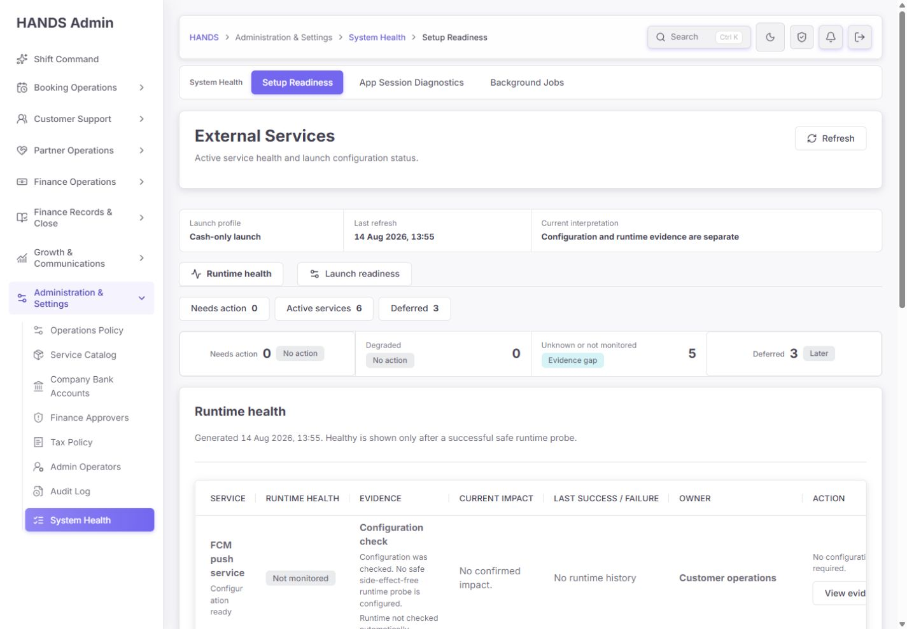
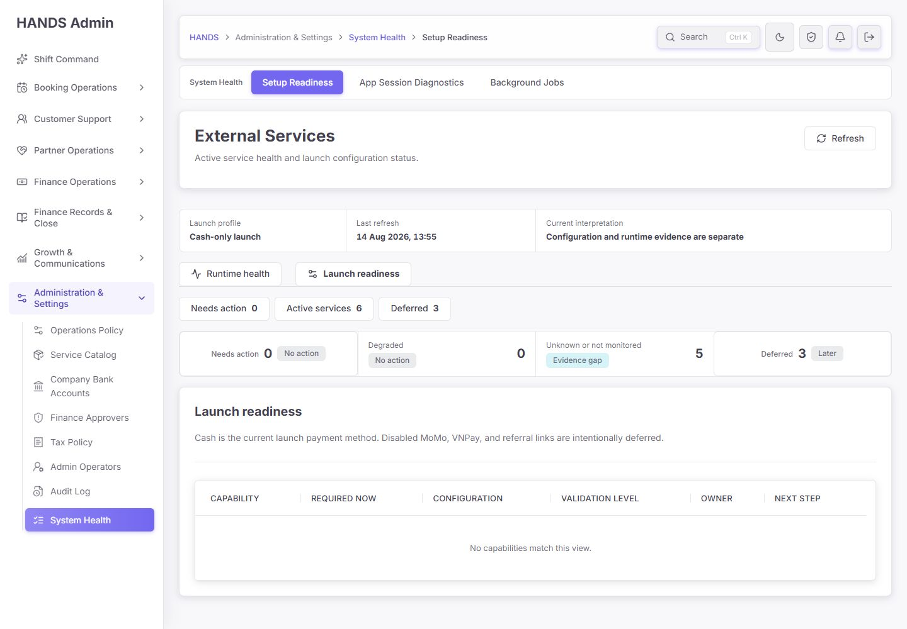
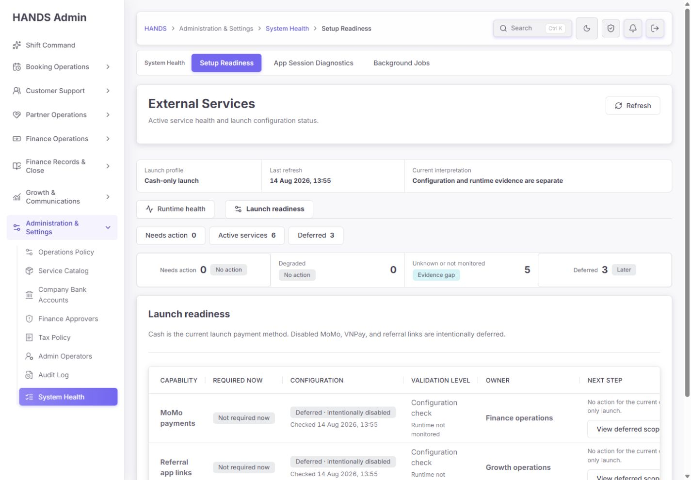
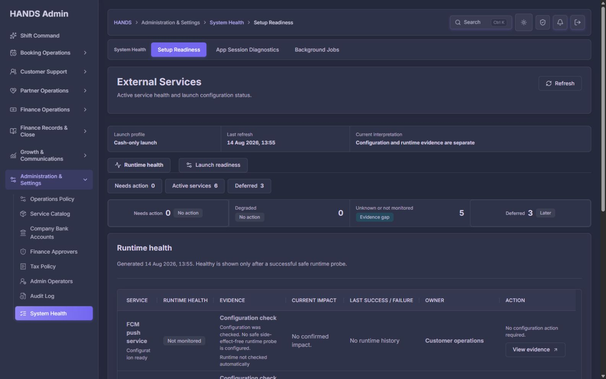

# HANDS Admin `/setup` 사후 재감사 보고서

- 감사일: 2026-08-14 (Asia/Ho_Chi_Minh)
- 대상: `http://localhost:3101/setup`
- 검사 범위: 인증된 실제 화면, URL 상태 전환, 새로고침, 라이트/다크 테마, 1440×1000 및 1600×1000, Admin Web/API 코드, API 계약 문서, 관련 테스트
- 제외 범위: 사용자 요청에 따라 1024px 이하 화면은 검사·평가·권고에서 완전히 제외
- 기준 보고서: `setup-final-reaudit-2026-08-11.md`, `setup-remediation-report-2026-08-11.md`
- 제품 코드 변경: 없음. 본 보고서와 감사 증거만 추가함

## 1. 최종 판정

**종합 점수: 78/100 — B-, 큰 폭으로 개선됐으나 최종 운영 품질은 아직 조건부 통과**

이전 감사의 가장 위험한 문제는 해결됐다. 현재 화면은 더 이상 `설정값이 존재한다`는 이유만으로 서비스를 `Operational/Healthy`라고 오판하지 않는다. `Configuration ready`, `Not monitored`, `Healthy`를 분리했고, 현금 결제 출시에서 비활성 MoMo·VNPay·추천 링크를 `Deferred`로 분리한 방향도 맞다. API 실패를 0건이나 정상 상태처럼 보여주지 않는 오류 처리와 단일 세로 스크롤 구조도 개선됐다.

다만 현재 화면은 운영자에게 **“지금 장애가 없는가?”**는 알려 주지만 **“필수 서비스 5개에 실제 작동 증거가 없는데, 내가 무엇을 확인해야 하는가?”**에는 답하지 못한다. `Needs action 0`과 `Unknown or not monitored 5`가 동시에 보이지만 후자는 열 수 없고, Launch readiness의 기본 화면은 빈 표다. 또한 같은 API 응답에서 구형 `checks[].scope=DEFERRED`와 신규 `services[].requiredForCurrentLaunch=true`가 충돌할 수 있어, 화면 외 소비자가 서로 다른 출시 판단을 내릴 위험이 남아 있다.

따라서 판정은 다음과 같다.

- **P0 출시 중단 결함:** 이번 범위에서는 발견하지 않음
- **P1 출시 전 우선 개선:** 6건
- **P2 운영 품질 개선:** 7건
- **현재 사용 가능 여부:** 내부 운영에는 사용 가능. 다만 이 화면만으로 출시 준비 완료나 외부 서비스 정상 작동을 확정해서는 안 됨
- **권장 게이트:** P1-1, P1-2, P1-3, P1-4를 해결한 뒤 최종 승인 화면으로 사용

## 2. 최신 화면 증거

아래 4장은 최신 Admin production build를 다시 생성한 뒤 확보한 최종 판정용 증거다. 01~07 파일은 재빌드 전 탐색·보조 증거이며, 최종 판정은 08~11을 우선한다.

### 화면 1 — Runtime health / Active services, 1440×1000

- 정상: 설정과 런타임을 분리했고, Supabase core만 실제 connectivity probe 결과를 `Healthy`로 표시한다.
- 문제: 첫 화면에서 `Needs action 0`이 강하게 보이지만 `Evidence gap 5`는 열 수 없다.
- 문제: 1440px에서 테이블 영역은 `clientWidth 1050px`, `scrollWidth 1162px`로 측정되어 약 112px의 수평 스크롤이 발생한다. 우측 Action이 잘리고 첫 번째 열의 서비스명이 과도하게 줄바꿈된다.
- 전반 상태: **의미 정확성은 양호, 운영 탐색성과 표 가독성은 보완 필요**

### 화면 2 — Launch readiness / Needs action 0, 1440×1000

- 정상: Cash-only launch 설명과 deferred 범위가 명시된다.
- 문제: 운영자가 `Launch readiness`를 누르면 기본적으로 `Needs action`으로 이동하고, 현재 0건이므로 `No capabilities match this view.`만 나온다.
- 문제: “출시 설정 준비 완료”, “실제 작동 증거 5건 부족”, “필수 서비스 6개 보기” 같은 결론과 다음 행동이 없다.
- 전반 상태: **빈 상태는 기술적으로 맞지만 출시 결정을 지원하지 못함**

### 화면 3 — Launch readiness / Deferred, 1440×1000

- 정상: MoMo, VNPay, referral links가 현재 cash-only 범위 밖임을 명확하게 분리한다.
- 문제: `Next step`이 우측 끝에 있어 1440px에서 문구와 버튼이 잘리고 수평 이동을 해야 한다.
- 문제: `View deferred scope`가 `/payments` 또는 `/referrals`의 넓은 기본 화면으로 이동하여 어떤 설정 범위를 확인해야 하는지 명확하지 않다.
- 전반 상태: **범위 판단은 정확, 조치 동선은 아직 넓고 모호함**

### 화면 4 — Runtime health / Dark mode, 1600×1000

- 정상: 카드, 구분선, 상태 배지, 본문 대비가 유지되고 레이아웃 붕괴는 없다.
- 문제: 1600px에서도 첫 번째 행의 서비스명과 설정 상태가 여러 줄로 잘게 분리되어 스캔 속도가 느리다.
- 전반 상태: **테마 안정성 양호, 데이터 밀도 조정 필요**

## 3. 이전 보고서 항목 재검수

| 이전 핵심 문제 | 현재 상태 | 판정 |
|---|---|---|
| Configured를 Operational로 표시 | `Configuration ready`와 `Not monitored` 분리 | 해결 |
| Deferred를 현재 blocker로 계산 | Cash-only에서 MoMo, VNPay, referral 3건 별도 표시 | 해결 |
| Cash-only 정책과 결제 상태 충돌 | Launch profile 및 설명 일치 | 해결 |
| Runtime과 readiness 혼합 | 한 페이지 안에서 두 mode로 분리 | 대체로 해결 |
| API 실패를 0/정상으로 축약 | 401/403/429/500별 오류 상태와 재시도 경로 존재 | 해결 |
| 중첩 세로 스크롤 | 문서 세로 스크롤 1개, 표는 수평 스크롤만 사용 | 해결 |
| 설정 시각과 런타임 시각 혼동 | `configurationCheckedAt`과 `lastProbeAt/lastSuccessAt` 분리 | 해결 |
| 우선순위 없는 긴 목록 | Needs action/Active/Deferred saved view 제공 | 부분 해결 |
| 운영자 행동이 기술 명령 중심 | UI에서 env/명령/비밀값 제거 | 해결 |
| 실제 증거 부족 | 6개 활성 서비스 중 Supabase core만 runtime probe, 5개는 Not monitored | 미해결이지만 정직하게 표시 |

## 4. 점수표

| 평가 항목 | 점수 | 근거 |
|---|---:|---|
| 상태 의미와 데이터 진실성 | 19/25 | 설정/런타임 분리와 deferred 판단은 좋지만 구형·신규 API 범위가 충돌함 |
| 운영자 판단·조치 효율 | 13/20 | 조치 큐와 saved view는 있으나 evidence gap, 빈 launch 결론, 넓은 링크가 남음 |
| 정보 구조와 문구 | 11/15 | 2-mode 구조는 적합하지만 System Health/Setup Readiness/External Services 명칭이 겹침 |
| 1440px+ 가독성과 시각 계층 | 11/15 | 테마 안정성은 좋으나 1440px 수평 스크롤과 과도한 줄바꿈이 있음 |
| 오류·접근성·복구성 | 15/15 | 오류 상태 분리, `aria-current`, 표 header scope, 키보드 접근 가능한 scroll region 확인 |
| 코드 품질과 테스트 가능성 | 9/10 | 관련 테스트·타입체크 통과. 다만 degraded 분기와 계약 일관성 테스트가 빠져 있음 |
| **합계** | **78/100** | **조건부 통과** |

## 5. P1 — 출시 전 우선 개선

### P1-1. `Needs action 0`이 실제 운영 불확실성 5건을 가린다

**증거**

- 화면 1과 2에서 `Needs action 0`, `Unknown or not monitored 5`가 동시에 나타난다.
- `Needs action`과 `Deferred`는 링크지만 `Unknown or not monitored`는 단순 `div`다.
- `setup-overview-section.tsx:83-87`에서 evidence gap 항목에 `href`가 없다.
- `setup-page-model.ts`의 `setupServiceNeedsAction()`은 DOWN/DEGRADED 또는 필수 설정 누락만 조치로 간주하고, Not monitored는 제외한다. 장애와 증거 부족을 분리하는 원칙은 맞지만, 증거 부족을 찾아갈 별도 경로가 없다.

**운영 영향**

운영자는 첫 화면만 보고 “확인할 일이 없다”고 해석하기 쉽다. 그러나 FCM, Storage/CDN, Maps/geocoding, Production SMS, Supabase Phone Auth는 현재 모두 필수로 표시되며 실제 런타임 자동 검증은 없다. 장애로 표기해서도 안 되지만, 완전히 비조치로 숨겨서도 안 된다.

**수정 요구사항**

1. `Unknown`과 `Not monitored`를 분리한다.
2. saved view에 `Evidence gaps 5`를 추가하고 상태 요약 카드도 같은 view로 연결한다.
3. evidence gap은 `Needs action` 장애 큐에 합치지 말고 별도 `Verification due` 또는 `Monitoring gaps`로 운영한다.
4. 각 행에 `Evidence level`, `Last verified`, `Verification method`, `Open evidence`를 제공한다.
5. 안전한 자동 probe가 없는 기능은 발송·결제·OTP 같은 부작용 probe를 만들지 말고, 최근 실제 운영 이벤트 또는 수동 검증 시각을 사용한다.

**완료 기준**

- `Evidence gaps 5`를 한 번 클릭하면 5개 행만 보인다.
- 5개 각각에서 다음 확인 방법과 최근 검증 시각을 알 수 있다.
- Not monitored가 Healthy나 장애로 오해되지 않는다.

### P1-2. Launch readiness 기본 화면이 빈 표라서 출시 결론을 제공하지 못한다

**증거**

- 화면 2에서 `Needs action 0` 선택 시 `No capabilities match this view.`만 표시된다.
- `setup-overview-section.tsx:72`가 다른 mode에서 Launch readiness로 들어갈 때 항상 `needs-action`을 기본값으로 사용한다.
- `setup-overview-section.tsx:149`의 empty copy는 단순 목록 필터 문구이고 출시 결론이 아니다.

**수정 요구사항**

0건일 때 일반 empty row 대신 다음을 표시한다.

- 제목: `Cash-only launch configuration is ready`
- 보조 결론: `6 required capabilities are configured. Runtime verification is available for 1 of 6.`
- 보조 상태: `3 capabilities are intentionally deferred.`
- CTA: `View required capabilities`, `Review evidence gaps`, `View deferred scope`

또는 `Launch readiness` 진입 시 needs-action이 0이면 `Active services`를 기본 view로 연다. URL로 명시적으로 `view=needs-action`을 선택한 경우에는 위의 결론형 empty state를 유지한다.

### P1-3. 같은 API 응답 안에 두 개의 출시 범위 정의가 공존한다

**코드 증거**

- `health.service.ts:669-675`, `isDeferredExternalCategory():932-935`는 Supabase Phone Auth, SMS, payments, push, storage, referrals를 구형 `DEFERRED`로 분류한다.
- 반면 `externalServicePolicy():784-825`는 신규 `services[]`에서 referrals와 비활성 cash-only PG만 deferred로 만들고, Phone Auth/SMS/push/storage를 `requiredForCurrentLaunch=true`로 만든다.
- `externalServicesOverview():90-110`은 top-level `currentStageOk`와 `blockingCategories`를 신규 services 기준으로 덮어쓰지만, 기존 `checks[].scope`는 그대로 반환한다.
- `health-readiness.md:39-44`도 구형 deferred 예시를 계속 설명한다.

**운영·개발 영향**

Admin 화면은 신규 `services[]`를 사용하므로 현재 표시는 일관돼 보인다. 그러나 smoke script, 별도 도구, 향후 클라이언트가 `checks[].scope`를 사용하면 동일 응답을 보고 서로 다른 출시 판단을 내릴 수 있다.

**수정 요구사항**

1. launch profile별 단일 정책 함수/manifest를 만든다. 예: `capabilityPolicy(CASH_ONLY)`.
2. `checks[]`, `services[]`, counts, `currentStageOk`, 문서가 동일 manifest에서 파생되게 한다.
3. legacy 필드를 유지해야 한다면 신규 기준으로 normalize하거나 명시적인 deprecation version을 추가한다.
4. 모든 capability에 대해 `legacy scope === derived launch scope` 계약 테스트를 추가한다.
5. Phone Auth, SMS, FCM, Storage가 cash-only 출시에서 정말 필수인지 제품 정책으로 확정하고 코드·문서에 동일하게 반영한다.

### P1-4. `View evidence`가 실제 증거가 아니라 넓은 관련 페이지를 연다

**증거**

- `setup-overview-section.tsx:169-185`는 escalation route가 있기만 하면 정상 상태에서도 `View evidence`라고 표시한다.
- `health.service.ts:852-912`의 목적지는 `/app-sessions`, `/vietnam-overview`, `/payments`, `/partners`, `/notifications`, `/referrals` 같은 넓은 기본 화면이다.
- Storage는 `/partners`, Supabase core는 `/app-sessions`로 이동하며 해당 서비스의 증거 행이나 필터가 보장되지 않는다.

**수정 요구사항**

- 실제 증거로 deep-link할 수 있을 때만 `View evidence`를 사용한다.
- 예: FCM은 delivery 상태가 필터된 Notifications, auth는 실패/세션 진단 view, maps는 map provider 상태 section, storage는 upload/storage incident view로 이동한다.
- deep-link가 없으면 `Open related workspace`로 문구를 바꾼다.
- API에서 `escalationRoute` 하나로 모든 의미를 담지 말고 `evidenceHref`, `relatedWorkspaceHref`, `runbookHref`를 구분한다.

### P1-5. 1440px 지원 범위에서 핵심 Action이 수평 스크롤 뒤에 숨는다

**증거**

- 화면 1과 3에서 우측 Action/Next step이 잘린다.
- 최신 화면 측정값: 표 컨테이너 `1050px`, 표 `1162px`.
- `globals.css:1739-1777`은 공통 최소 폭과 세 번째/마지막 열 최소 폭을 크게 잡고, runtime 표는 7개 열의 최소 폭을 누적한다.

**수정 요구사항**

1440px에서 핵심 조치가 수평 스크롤 없이 보여야 한다. 권장 우선순위는 다음과 같다.

1. Runtime 표의 기본 열을 `Service`, `Status`, `Evidence`, `Last event`, `Action` 5개로 줄인다.
2. `Current impact`와 `Owner`는 행 disclosure 또는 상세 drawer로 이동한다.
3. Action 열은 sticky right를 보조책으로 사용할 수 있지만, 첫 목표는 표 자체를 1440px 콘텐츠 폭 안에 맞추는 것이다.
4. Launch 표는 `Required now`를 configuration 배지의 보조 문구로 합치고 5개 열 이내로 줄인다.
5. 서비스명은 `FCM push service`, `Supabase core`처럼 단어 단위로 읽히도록 최소 폭을 보장한다.

### P1-6. `DEGRADED` 상태에서 다음 행동 문구가 잘못 만들어진다

**코드 증거**

- API의 `externalServiceNeedsAction()`은 `DEGRADED`를 조치 대상으로 포함한다 (`health.service.ts:828-832`).
- 하지만 `safeOperatorAction`은 `DOWN`만 runtime action으로 처리하고 `DEGRADED`는 `No configuration action required.`로 떨어진다 (`health.service.ts:319-326`).
- UI도 needs-action이면서 DOWN이 아니면 `Review readiness`로 표시한다 (`setup-overview-section.tsx:169-177`).

**수정 요구사항**

- DOWN과 DEGRADED 모두 runtime action을 사용한다.
- 버튼은 `Review runtime impact` 또는 서비스별 구체 동사를 사용한다.
- DEGRADED fixture로 API service test와 UI rendering test를 추가하여 `No configuration action required`가 나오지 않게 한다.

## 6. P2 — 운영 품질 개선

### P2-1. 한 화면을 네 가지 이름으로 부른다

현재 같은 위치가 sidebar `System Health`, workspace item `Setup Readiness`, breadcrumb `System Health > Setup Readiness`, H1 `External Services`로 표시되고 내부 탭에 다시 `Launch readiness`가 있다.

**권장 구조**

- Sidebar/local group: `System Health`
- Workspace page: `External Services`
- 같은 레벨 형제: `App Sessions`, `Background Jobs`
- External Services 내부 mode: `Runtime health`, `Launch readiness`
- `Setup Readiness`라는 페이지명은 제거한다.

즉 `admin-navigation.ts:296-303`의 label을 `External Services`로 바꾸고 breadcrumb도 같은 이름을 사용한다. 별도 페이지를 더 만들 필요는 없다.

### P2-2. `Unknown`과 `Not monitored`는 같은 상태가 아니다

Unknown은 probe가 있었지만 결과를 확정하지 못한 상태이고, Not monitored는 probe 자체가 없는 설계 상태다. 현재 counts와 화면은 둘을 합쳐 `Unknown or not monitored`로 표시한다. 운영 우선순위, 조치 방법, 심각도가 다르므로 분리해야 한다.

### P2-3. saved view와 status summary가 같은 숫자를 반복한다

`Needs action 0`, `Deferred 3`이 바로 위아래 두 줄에 반복된다. 두 번째 줄은 `Degraded`, `Evidence gaps`, `Last verified`, `Launch blockers`처럼 첫 줄과 다른 정보를 제공해야 한다. 또는 saved view와 KPI를 한 줄로 합친다.

### P2-4. 1인 운영 구조에서 가상의 팀명은 도움이 적다

현재 `Customer operations`, `Platform operations`, `Identity operations` 등이 owner로 보이지만 실제 초기 운영자는 1명이다. 팀명만으로는 누구에게 무엇을 요청할지 알 수 없다.

- 초기 단계: Owner 열을 제거하거나 `You / System` 수준으로 단순화한다.
- 대신 `Runbook`, `Provider console`, `Last handled by`가 더 실용적이다.
- 팀 운영으로 확장할 때 owner를 다시 노출할 수 있게 데이터 필드는 유지해도 된다.

### P2-5. Refresh는 작동하지만 cache와 진행 피드백이 보이지 않는다

- 실제 클릭 시 현재 URL 상태는 유지됐고, 약 0.5초 안에 새 화면이 표시됐다.
- API는 5초 cache를 사용하므로 짧은 간격의 반복 클릭은 `Last refresh`가 바뀌지 않을 수 있다.

버튼 클릭 중 spinner/disabled 상태를 주고, 필요하면 `Updated just now · cache up to 5s`를 표시한다. 자동 새로고침은 이 화면 규모에서는 필수가 아니다.

### P2-6. 문서의 접근 방식과 실제 인증 정책이 다르다

`health-readiness.md:3-7`은 세 endpoint를 모두 public operational check처럼 설명하고, Usage에서 인증 없는 `Invoke-RestMethod /api/health/external`을 제시한다. 실제 controller는 `JwtAuthGuard`, `RolesGuard`, `Role.ADMIN`을 요구하며 인증 없이 호출하면 401이다.

- 문서를 `health`, `health/ready` public / `health/external` admin-only로 분리한다.
- 인증된 호출 예시 또는 Admin 화면을 통한 확인 방법을 적는다.

### P2-7. 향후 probe 추가 시 impact와 history가 부정확해질 수 있다

- `impactSummary`는 모든 DOWN 서비스에 Supabase 데이터 영향 문구를 사용한다 (`health.service.ts:312-315`). 다른 provider probe가 추가되면 잘못된 영향이 표시된다.
- runtime history는 프로세스 메모리 Map에 있어 API 재시작 시 사라진다 (`health.service.ts:24-29`).

서비스별 impact metadata를 사용하고, 최근 성공/실패를 운영 로그나 metrics store에서 읽도록 확장한다. 현 단계에서 별도 대형 모니터링 시스템을 먼저 만들 필요는 없고, 최소한 최근 검증 이벤트를 보존하면 된다.

## 7. 유지해야 할 설계 결정

다음 항목은 현재 방향이 맞으므로 되돌리지 않는다.

- Runtime health와 Launch readiness는 **한 `/setup` 페이지 안의 두 mode**로 유지한다. 별도 대메뉴나 별도 페이지로 나누지 않는다.
- Cash-only에서 비활성 MoMo·VNPay·referral은 deferred로 보이되 현재 장애나 blocker로 세지 않는다.
- 설정값 존재를 Healthy/Operational로 승격하지 않는다.
- OTP, SMS, push, 결제, 환불, upload를 자동으로 발생시키는 위험한 health probe를 만들지 않는다.
- env key, secret value, shell command를 일반 운영 화면에 다시 노출하지 않는다.
- 401/403/429/5xx 오류를 0건 목록이나 정상 상태로 대체하지 않는다.
- 모바일/태블릿 대응을 이번 작업에 추가하지 않는다. 목표 해상도는 1440px 이상이다.
- 현재 디자인 시스템, 상태 배지, Admin surface를 유지하고 별도의 시각 체계를 만들지 않는다.

## 8. 권장 구현 순서

### 1차 — 데이터 계약과 상태 정확성

1. launch policy를 단일 manifest로 통합한다.
2. legacy/new scope 일치 테스트를 추가한다.
3. DEGRADED action 분기를 수정한다.
4. endpoint 인증 문서를 수정한다.

### 2차 — 운영자의 판단과 행동

1. `Evidence gaps` view를 추가한다.
2. Launch readiness 0건을 결론형 empty state로 교체한다.
3. evidence/related workspace/runbook 링크를 분리하고 deep-link를 만든다.
4. 혼자 운영하는 현재 상황에 맞춰 owner보다 runbook과 마지막 검증 시각을 우선한다.

### 3차 — 1440px 정보 밀도

1. 표의 기본 열을 5개 수준으로 축소한다.
2. impact/owner를 row disclosure로 옮긴다.
3. 1440px에서 Action/Next step이 수평 스크롤 없이 보이는지 검증한다.
4. 라이트/다크 1440/1600 screenshot regression을 남긴다.

## 9. Codex 구현 완료 기준

- `/setup` 기본 진입은 `Runtime health / Active services`를 유지한다.
- Launch readiness 진입 시 0건이면 긍정 결론과 `required 6 / runtime verified 1 / deferred 3`이 보인다.
- `Evidence gaps 5`가 클릭 가능하고 정확히 5개를 보여 준다.
- Unknown과 Not monitored count가 분리된다.
- 동일 API 응답의 legacy/new launch scope가 모순되지 않는다.
- DEGRADED 행에 runtime 조치 문구가 표시된다.
- `View evidence`는 실제 필터/section으로 이동하고, 그렇지 않으면 `Open related workspace`라고 표시한다.
- 1440×1000에서 핵심 Action/Next step이 수평 스크롤 없이 보인다.
- 401/403/429/5xx는 기존처럼 구체적인 오류와 복구 CTA를 유지한다.
- 관련 API/Admin tests, 양쪽 typecheck, production build, visible copy guard가 통과한다.
- 실제 브라우저에서 runtime active, launch zero, evidence gap, deferred, degraded fixture, 오류 상태, dark mode를 캡처한다.

## 10. 검증 기록

| 검증 | 결과 |
|---|---|
| Admin setup 관련 Vitest | 14 files, 59 tests 통과 |
| API health controller/service Vitest | 2 files, 25 tests 통과 |
| Admin Web typecheck | 통과 |
| API typecheck | 통과 |
| Admin visible-copy guard | 1,641 files, 위반 0 |
| Admin production build | Next.js 16.2.12 build 통과, 70 static pages 생성 완료 |
| Local API/Admin 상태 | API health 200, Admin 200, ports 3000/3101 listening |
| 실제 탭 전환 | Runtime → Launch readiness가 URL과 active state를 함께 변경 |
| 실제 Refresh | URL state 보존, context timestamp 갱신 확인 |
| 새 탭 로컬 navigation | 약 267ms. 로컬 단일 측정치이며 성능 벤치마크는 아님 |
| 1440px 표 폭 | container 1050px / content 1162px, 수평 overflow 확인 |
| 접근성 정적 증거 | breadcrumb/nav의 `aria-current`, table `scope=col`, scroll region `role=region`·`tabIndex=0`, error `role=alert` 확인 |

## 11. 검증 한계

- 인증 만료·403·429·API 중단을 실제 운영 세션에서 강제로 만들지는 않았다. 로그아웃이나 공유 API 중단을 피하기 위해 해당 상태는 source와 rendering tests로 검증했다.
- 스크린리더 실사용 발화, Windows high-contrast, 확대 200%는 이번 범위에 포함하지 않았다.
- 브라우저 콘솔 수집 인터페이스는 선택된 브라우저 제어 표면에 노출되지 않아 콘솔 로그를 직접 export하지 못했다. 화면상 error overlay는 없었고 관련 build/tests는 통과했다.
- 저장소에는 다른 기능의 다수 미커밋 변경이 존재한다. 본 감사에서는 이를 수정하거나 되돌리지 않았다.

## 12. 최종 결론

이번 수정은 이전 42/100 수준의 위험한 상태 표시를 실제 운영에 사용할 수 있는 78/100 수준으로 올렸다. 특히 **설정과 실제 작동을 구분한 것**, **현금 결제 출시 범위를 정확히 분리한 것**, **오류를 정상처럼 숨기지 않는 것**은 확실히 잘됐다.

다음 품질 단계의 핵심은 UI 장식이 아니라 세 가지다.

1. `Evidence gap 5`를 운영자가 실제로 처리할 수 있는 큐로 만든다.
2. API 안의 두 출시 범위 정의를 하나로 통일한다.
3. 1440px에서 판단과 Action을 수평 이동 없이 읽게 한다.

이 세 가지가 해결되면 `/setup`은 단순 설정 목록이 아니라 1인 운영자가 출시 전과 장애 시 실제로 의지할 수 있는 System Health 도구가 된다.
