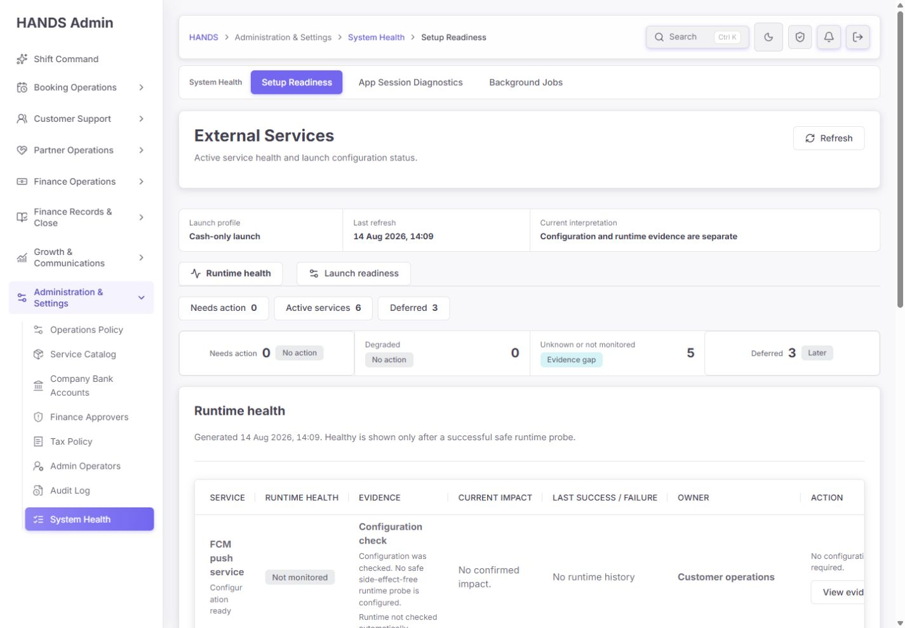
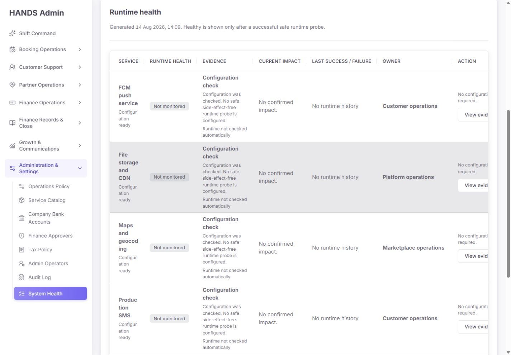
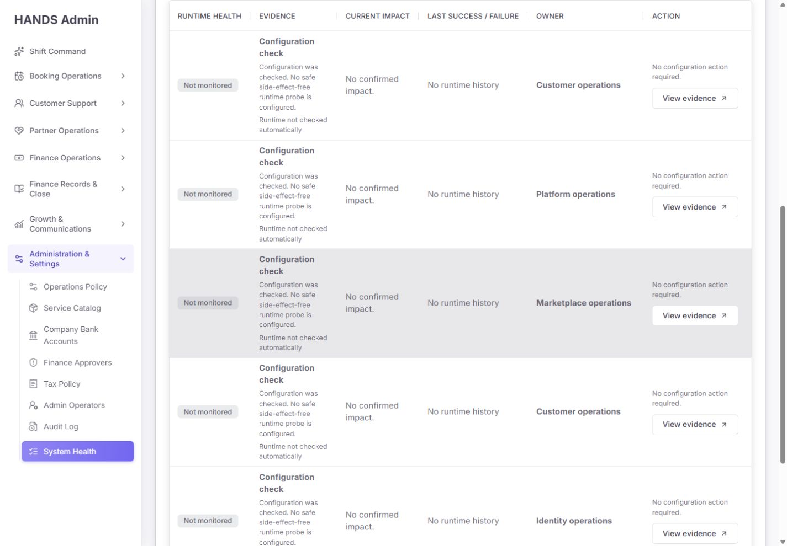
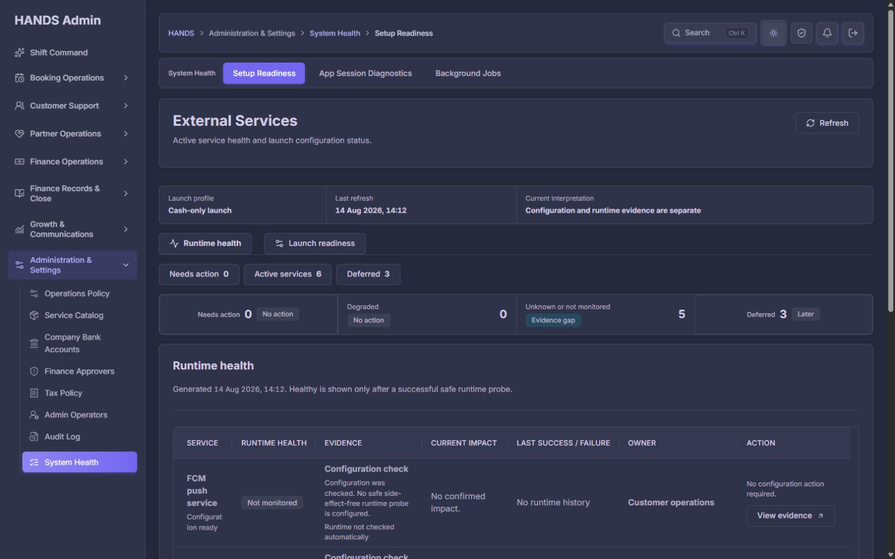

# HANDS Admin `/setup?mode=runtime&view=active` 최종 재감사 보고서

- 감사일: 2026-08-14 (Asia/Bangkok)
- 대상: `http://localhost:3101/setup?mode=runtime&view=active`
- 감사 방식: 로그인된 실제 화면, URL 상태, 표 수평 이동, Refresh, 라이트/다크 테마, 현재 소스, API 계약, 문서, 관련 테스트 대조
- 검사 해상도: 1440×1000, 1600×1000
- 제외 범위: 사용자 요청에 따라 1024px 이하·모바일·태블릿을 검사와 권고에서 완전히 제외
- 기준 보고서: `setup-post-remediation-final-reaudit-2026-08-14.md`
- 기준 구현 프롬프트: `setup-post-remediation-codex-implementation-prompt-2026-08-14.md`
- 제품 코드 변경: 없음. 본 보고서와 현재 감사 증거만 추가함

## 1. 최종 판정

**현재 Runtime active 화면 점수: 64/100 — C, 상태 표현은 정직하지만 감사 프롬프트 적용은 확인되지 않음**

**구현 판정: Release hold for the requested remediation scope**

이번 재감사의 가장 중요한 결론은 시각적 미세 조정이 아니다. 기준 구현 프롬프트에서 요구한 핵심 항목이 현재 소스와 실행 화면에 반영되어 있지 않다.

- `Evidence gaps` saved view가 없다.
- `Unknown`과 `Not monitored`가 여전히 합쳐져 있다.
- Runtime 표는 여전히 7열이며 1440px에서 Action이 잘린다.
- 모든 관련 업무 루트 링크가 여전히 `View evidence`로 표시된다.
- `DEGRADED` 행동 분기가 여전히 잘못되어 있다.
- legacy scope와 operator-facing launch policy가 여전히 서로 다른 기준을 사용한다.
- workspace 명칭은 여전히 `Setup Readiness`, 실제 H1은 `External Services`다.
- `/health/external` 인증 문서도 controller와 여전히 불일치한다.

파일 수정 시각도 이를 뒷받침한다. 구현 프롬프트는 2026-08-14 14:07에 생성되었지만 주요 Setup/API 파일은 2026-08-12 이후 수정되지 않았다.

따라서 이번 결과는 “수정은 잘됐고 작은 보완만 남음”이 아니라 **이전 78점 상태에서 요청된 후속 개선이 실제로 실행되지 않았거나 다른 작업공간에서 실행된 상태**로 판단해야 한다.

단, 기존 개선의 중요한 장점은 유지되어 있다.

- 설정값 존재를 실제 Healthy로 오판하지 않는다.
- Supabase core만 실제 connectivity probe 성공으로 Healthy다.
- 나머지 5개는 정직하게 Not monitored다.
- Cash-only에서 MoMo·VNPay·Referral 3개는 Deferred다.
- API 실패를 정상 0건으로 위장하지 않는 오류 분기가 있다.
- 부작용이 있는 OTP·SMS·Push·결제·upload probe를 자동 실행하지 않는다.

## 2. 감사 화면 증거

### 화면 1 — Runtime active 진입, 1440×1000



- URL과 `Runtime health / Active services` 선택 상태는 일치한다.
- Launch profile, 마지막 refresh, 상태 해석을 상단에서 확인할 수 있다.
- `Needs action 0` 바로 옆에 실제 검증 공백 5건이 있지만 `Evidence gaps`로 이동할 수 없다.
- `System Health > Setup Readiness > External Services > Runtime health`라는 이름 중첩이 계속 남아 있다.
- 첫 행부터 Action 문구와 버튼이 오른쪽에서 잘린다.
- 전반 상태: **상태 진실성 양호, 운영 행동 진입은 불충분**

### 화면 2 — Runtime 표 본문, 1440×1000



- 6개 활성 서비스 중 5개가 `Not monitored`임을 텍스트로 표시하는 점은 정확하다.
- 행 높이가 약 199px이고 같은 문구가 반복되어 한 화면에서 3~4개 행만 비교할 수 있다.
- Service 이름이 `FCM / push / service`, `Production / SMS`처럼 지나치게 줄바꿈된다.
- Owner 열이 넓은 공간을 사용하지만 초기 1인 운영자에게 실제 행동 정보를 주지 않는다.
- Action은 잘려 있어 수평 이동 전에는 정확한 버튼을 읽거나 누르기 어렵다.
- 전반 상태: **데이터는 정직하지만 비교·스캔 효율이 낮음**

### 화면 3 — 표를 오른쪽으로 97px 이동한 상태, 1440×1000



- Action을 보기 위해 표를 끝까지 오른쪽으로 이동하면 Service 열이 화면 밖으로 사라진다.
- 운영자는 “어떤 서비스의 버튼인지”와 “무슨 버튼인지”를 동시에 보기 어렵다.
- 모든 행의 CTA가 동일한 `View evidence`라서 오른쪽만 보아서는 목적지를 구분할 수 없다.
- 전반 상태: **핵심 식별자와 핵심 행동을 동시에 볼 수 없는 구조적 결함**

### 화면 4 — `view=evidence-gaps` 직접 진입, 1440×1000


- 브라우저 URL은 `view=evidence-gaps`를 유지한다.
- 화면은 `Active services`를 활성 상태로 렌더링한다.
- `Evidence gaps` link는 존재하지 않는다.
- 즉 URL과 실제 UI 상태가 서로 다르다. 잘못된 query를 기본값으로 복구하더라도 canonical URL로 redirect 또는 replace하지 않아 공유·새로고침 시 의미가 모호하다.
- 전반 상태: **요구된 view 미구현, invalid query 정규화도 불완전**

### 화면 5 — Runtime active / Dark mode, 1600×1000



- dark surface, border, 상태 badge, 본문 구조는 안정적으로 유지된다.
- 1600px에서는 Action이 보이지만 7열 밀도와 작은 본문 때문에 스캔 속도는 여전히 낮다.
- 서비스명과 configuration 보조 문구가 좁은 첫 열에서 과도하게 분리된다.
- 전반 상태: **테마 안정성은 양호, 정보 구조 문제는 그대로**

## 3. 기준 프롬프트 적용 여부

| 기준 프롬프트 필수 항목 | 현재 상태 | 판정 |
|---|---|---|
| launch policy 단일화 | `isDeferredExternalCategory()`와 `externalServicePolicy()`가 별도 기준 유지 | 미적용 |
| Unknown/Not monitored 분리 | API와 UI 모두 합산 `unknown` 사용 | 미적용 |
| Evidence gaps saved view | view type은 needs-action/active/deferred만 허용 | 미적용 |
| Launch 0건 결론형 empty state | `No capabilities match this view.` 유지 | 미적용 |
| evidence/related workspace/runbook 링크 분리 | `escalationRoute` 하나만 사용 | 미적용 |
| DEGRADED runtime action | DOWN만 runtime action으로 처리 | 미적용 |
| 1440px 5열 운영 표 | 7열과 수평 스크롤 유지 | 미적용 |
| Owner보다 증거·행동 우선 | 가상 Team owner 열 유지 | 미적용 |
| `External Services` 명칭 통일 | local nav/breadcrumb는 Setup Readiness 유지 | 미적용 |
| Refresh pending/success feedback | route link + 전체 loading fallback만 존재 | 부분 |
| `/health/external` 인증 문서 수정 | public처럼 설명하고 무인증 호출 예시 유지 | 미적용 |
| 요구사항 전용 테스트 | 기존 59/25개는 통과하지만 신규 계약 test 없음 | 미적용 |

## 4. 점수표

| 평가 항목 | 점수 | 근거 |
|---|---:|---|
| 상태 의미와 안전성 | 19/25 | configuration/runtime 분리, safe probe, deferred 판단은 좋으나 legacy/new scope 충돌 지속 |
| 운영자 판단·조치 효율 | 8/20 | 5개 evidence gap을 처리할 view가 없고 모든 CTA 의미가 같음 |
| 정보 구조와 문구 | 8/15 | mode/view는 이해 가능하지만 이름 중복, No action 오해, Owner 중심 구조가 남음 |
| 1440px 가독성과 정보 밀도 | 5/15 | 표 1050px viewport 안에 1162px content, Action 97px 이동 필요, 행 약 199px |
| 접근성·오류·복구 | 15/15 | table semantics, focusable region, aria-current, error 상태, loading fallback은 유지 |
| 코드·테스트 신뢰성 | 9/10 | 기존 테스트는 통과하나 신규 감사 조건과 deployment freshness 검증이 없음 |
| **합계** | **64/100** | **C — 요청한 개선 범위 기준 Release hold** |

## 5. P1 — 반드시 수정할 항목

### P1-1. 수정본이 실제 작업공간에 적용되지 않았다

**증거**

- 구현 프롬프트 수정 시각: 2026-08-14 14:07
- `setup-overview-section.tsx`: 2026-08-12 11:47
- `setup-page-model.ts`, `health.service.ts`: 2026-08-12 11:25
- `admin-navigation.ts`: 2026-08-10 14:02
- `rg` 검색 결과 `evidence-gaps`, `evidenceGaps`, `notMonitored`, `evidenceHref`, `relatedWorkspaceHref`, `Cash-only launch configuration is ready`가 Setup/Health 구현에 없다.
- 요청된 구현 보고서 `setup-post-remediation-implementation-report-2026-08-14.md`도 존재하지 않는다.

**추가 deployment 위험**

- 현재 local status의 Admin process 시작 시각은 10:43이다.
- `.next` production build 산출물은 13:57에 생성됐다.
- 즉 실행 중인 `next start` process가 최신 build보다 먼저 시작됐다. 현재 3101 화면과 디스크의 최신 build가 같다고 보장하기 어렵다.
- 실제 runtime CSS에서는 table min-width가 `100%`로 계산됐지만 현재 source에는 `.setup-health-table { min-width: 1260px; }`가 있다. 이 차이도 실행 process와 build/source 불일치를 뒷받침한다.

**수정 방법**

1. 반드시 `C:\dev\massage-on-demand-vn`에서 구현한다.
2. 구현 전후 `git diff -- <setup/health/navigation/doc files>`를 저장한다.
3. Setup/API source에 실제 요구사항이 들어간 것을 검색으로 확인한다.
4. `next build`와 `next start`를 같은 build 순서로 안전하게 재시작한다.
5. `local:status`만으로 끝내지 말고 browser에서 최신 marker와 기능을 확인한다.
6. 구현 보고서에 source timestamp, build timestamp, server start timestamp를 기록한다.

### P1-2. `Needs action 0`이 검증 공백 5건을 운영 큐에서 숨긴다

**화면 증거**

- 화면 1에서 `Needs action 0`, `Unknown or not monitored 5`가 동시에 보인다.
- evidence gap 요약은 클릭할 수 없다.
- 화면 4에서 `view=evidence-gaps`를 직접 입력해도 Active services로 fallback한다.

**코드 증거**

- `setup-page-model.ts:51-64`의 view union은 `needs-action | active | deferred`뿐이다.
- `setup-overview-section.tsx:77-87`에는 evidence gap saved view가 없고 합산 count는 link 없는 status item이다.
- API `health.service.ts:96-108`도 `UNKNOWN`과 `NOT_MONITORED`를 하나의 `unknown` count로 합친다.

**운영 영향**

장애가 없다는 사실과 운영 증거가 부족하다는 사실은 다르다. 현재 구조에서는 혼자 운영하는 사용자가 `Needs action 0 / No action`을 보고 확인 업무가 없다고 판단하기 쉽다.

**수정 요구사항**

1. `UNKNOWN`과 `NOT_MONITORED`를 서로 다른 count로 만든다.
2. required/enabled이면서 runtime evidence가 부족한 항목을 `Evidence gaps`로 파생한다.
3. Runtime saved views에 `Evidence gaps 5`를 추가한다.
4. status summary의 evidence gap count도 같은 URL로 연결한다.
5. `view=evidence-gaps`에서 정확히 5개만 보여 준다.
6. invalid view는 canonical `/setup?mode=runtime&view=active`로 redirect/replace하거나 URL을 기본 상태와 일치시킨다.
7. evidence gap은 danger blocker가 아니라 neutral/info verification queue로 표시한다.

### P1-3. 1440px에서 Service와 Action을 동시에 볼 수 없다

**측정 증거**

- viewport: 1440×1000, document client width: 1425px
- table scroll region client width: 1050px
- table content width: 1162px
- Action header x: 1274px, right: 1472px
- Action을 완전히 보기 위한 실제 수평 이동: 97px
- first five row height: 약 199px

**source 위험**

- 현재 source CSS는 `.setup-health-table { min-width: 1260px; }`다.
- Runtime 7열 최소폭 합계도 약 1360px다.
- 최신 source를 재시작하면 현재 1162px보다 overflow가 더 커질 가능성이 있다.

**운영 영향**

오른쪽으로 움직이면 Action은 보이지만 Service 이름이 사라진다. 이는 단순 미관 문제가 아니라 대상과 행동을 동시에 확인할 수 없는 의사결정 오류 가능성이다.

**수정 요구사항**

Runtime 기본 표를 최대 5열로 줄인다.

```text
Service
Runtime status
Evidence / last event
Current impact
Action
```

- Owner와 exact timestamps는 row disclosure로 이동한다.
- evidence copy는 한 줄 요약 + 보조 한 줄 수준으로 압축한다.
- Not monitored 행은 약 88~120px 범위에서 읽히게 한다.
- Service 열 최소폭을 확보해 단어가 한 글자 또는 짧은 조각으로 끊기지 않게 한다.
- 1440px에서 table `scrollWidth <= clientWidth`를 자동 검증한다.
- overflow를 숨겨 통과시키지 않는다.

### P1-4. 모든 관련 업무 링크를 `View evidence`라고 잘못 부른다

**실제 목적지**

| Service | 현재 CTA | 실제 href | 문제 |
|---|---|---|---|
| FCM | View evidence | `/notifications` | delivery evidence로 필터되지 않은 넓은 workspace |
| File storage/CDN | View evidence | `/partners` | storage evidence와 직접 관계없는 Partner 기본 화면 |
| Maps/geocoding | View evidence | `/vietnam-overview` | map provider evidence section이 보장되지 않음 |
| Production SMS | View evidence | `/app-sessions` | SMS delivery evidence가 아님 |
| Supabase Phone Auth | View evidence | `/app-sessions` | auth evidence filter가 없음 |
| Supabase core | View evidence | `/app-sessions` | database probe evidence 목적지가 아님 |

**코드 증거**

- API는 `escalationRoute` 하나만 제공한다 (`health.service.ts:316-318`, `852-912`).
- UI는 조치가 없더라도 route가 있으면 `View evidence`라고 표시한다 (`setup-overview-section.tsx:169-185`).

**수정 요구사항**

- `evidenceHref`, `relatedWorkspaceHref`, `runbookHref`를 분리한다.
- 실제 filter/section으로 deep-link할 때만 `View evidence`를 사용한다.
- 넓은 기본 페이지는 `Open related workspace`라고 부른다.
- 실제 문서가 있을 때만 `Open runbook`을 사용한다.
- Storage의 `/partners`처럼 증거와 관계가 너무 약한 route는 제거하거나 정확한 storage incident/evidence section이 생길 때까지 비활성 설명으로 둔다.
- 각 행 primary action은 하나만 둔다.

### P1-5. `Not monitored` 행의 행동 문구가 운영 질문에 답하지 않는다

현재 5개 행은 다음 조합이다.

```text
Configuration ready
Not monitored
No configuration action required.
View evidence
```

상태 자체는 거짓이 아니지만 운영 행동으로는 모순된다. 설정 행동이 없다는 사실과 검증 행동이 없다는 사실을 구분하지 못한다.

**수정 요구사항**

- primary copy: `Runtime verification is not automated.`
- 보조 copy: 최근 실제 운영 이벤트 또는 마지막 수동 검증 시각
- action 예시: `Review delivery evidence`, `Record manual verification`, `Open related workspace`
- 실제 증거가 없다면 `No runtime evidence yet`라고 표시한다.
- 부작용 probe를 새로 만들지는 않는다.

### P1-6. `DEGRADED`는 action count와 행동 문구가 충돌한다

**코드 증거**

- `externalServiceNeedsAction()`은 enabled `DOWN`과 `DEGRADED`를 모두 Needs action으로 포함한다 (`health.service.ts:828-832`).
- `safeOperatorAction`은 `runtime.status === 'DOWN'`만 runtime action을 사용하고 DEGRADED는 `No configuration action required.`로 떨어진다 (`health.service.ts:319-326`).
- UI도 DOWN이면 `Review impact`, 그 외 action 상태는 `Review readiness`다 (`setup-overview-section.tsx:169-178`).

**수정 요구사항**

- DOWN/DEGRADED 모두 runtime action을 사용한다.
- DEGRADED 버튼은 `Review runtime impact` 또는 서비스별 동사를 사용한다.
- API fixture와 component rendering test에서 DEGRADED가 configuration 문구로 떨어지지 않는지 검증한다.
- 실제 운영 외부 서비스를 degraded로 만들지 말고 fixture로 브라우저 QA한다.

### P1-7. launch scope 계약이 여전히 두 개다

**코드 증거**

- legacy `decorateExternalCheck()`는 `isDeferredExternalCategory()`를 사용한다 (`health.service.ts:669-675`).
- `isDeferredExternalCategory()`는 auth, SMS, payments, push, storage, referrals를 deferred로 분류한다 (`932-935`).
- operator-facing `externalServicePolicy()`는 Referral과 disabled cash-only PG만 deferred로 만들고, 나머지는 required now로 분류한다 (`784-825`).

**문서 증거**

- 문서 `health-readiness.md:26`은 operator-facing Cash-only 기준을 설명한다.
- 같은 문서 `43-44`는 legacy에서 Phone Auth, SMS, FCM, Storage를 deferred라고 설명한다.

**수정 요구사항**

- launch profile별 단일 capability manifest를 만든다.
- checks, services, counts, currentStageOk, blocking/deferred categories가 같은 policy에서 파생되게 한다.
- legacy 호환성이 필요하면 신규 기준으로 normalize하고 deprecation을 명시한다.
- 모든 capability의 legacy/operator scope 일치 계약 테스트를 추가한다.

### P1-8. 실행 build와 source의 동일성을 검증하는 절차가 없다

이번 감사에서는 source, `.next`, 실행 process 시각이 서로 다르다. 화면 감사가 정확하려면 최신 build를 실제 server가 서비스하는지 확인해야 한다.

**수정 요구사항**

- build identifier 또는 commit/source hash를 Admin의 비민감한 diagnostics metadata로 제공하는 방안을 검토한다.
- 최소한 로컬 workflow에서 `build → start → status → browser marker` 순서를 강제한다.
- running `next start` 상태에서 동일 `.next`에 `next typegen`/`next build`를 실행하지 않는다.
- 빌드 후 process를 재시작하고 `/setup`에서 신규 `Evidence gaps` marker가 실제 보이는지 확인한다.

## 6. P2 — 운영 품질 개선

### P2-1. 같은 화면의 명칭이 네 번 달라진다

- Sidebar: `System Health`
- Local workspace: `Setup Readiness`
- Breadcrumb: `System Health > Setup Readiness`
- H1: `External Services`
- 내부 mode: `Runtime health`

권장 구조는 다음과 같다.

- 그룹: `System Health`
- 현재 page: `External Services`
- 형제: `App Sessions`, `Background Jobs`
- 내부 mode: `Runtime health`, `Launch readiness`

route `/setup`은 유지하고 새 페이지를 만들지 않는다.

### P2-2. Saved view와 status strip이 같은 정보를 반복한다

`Needs action 0`과 `Deferred 3`이 연속된 두 줄에서 반복된다. 두 번째 줄은 `Degraded`, `Unknown`, `Not monitored`, `Last verified`처럼 첫 줄과 다른 판단 정보를 제공하거나 saved views와 summary를 한 줄로 합친다.

### P2-3. 가상의 팀 Owner는 1인 운영자에게 우선순위가 낮다

`Customer operations`, `Platform operations`, `Marketplace operations`, `Identity operations`는 현재 실제 배정자를 알려주지 않는다. 이 열을 row disclosure로 이동하고 기본 표에는 `Last verified`, `Verification method`, `Runbook`을 우선한다.

### P2-4. Refresh는 동작하지만 전체 context를 loading 화면으로 교체한다

- Refresh는 현재 query를 보존한다.
- source는 button이 아니라 같은 URL을 여는 link다.
- navigation 중 `loading.tsx`가 `External Services > Runtime health > Loading...`만 남기고 launch profile, saved view, 기존 상태를 잠시 제거한다.
- 성공 완료 안내나 cache 5초 설명은 없다.

기존 데이터를 유지한 채 Refresh control만 pending/disabled로 바꾸고, 완료 후 하나의 `role=status` 메시지로 `Service status refreshed`를 알리는 편이 안정적이다. 자동 polling은 필요 없다.

### P2-5. 문서의 인증 계약이 실제 API와 다르다

- 문서 3행은 두 public checks라고 쓰지만 5~7행에는 3개를 나열한다.
- `/api/health/external`은 실제로 `JwtAuthGuard`, `RolesGuard`, `Role.ADMIN`이 필요하다.
- 문서 57행은 인증 없는 `Invoke-RestMethod /api/health/external` 예시다.

문서를 public liveness/readiness와 admin-only external status로 분리한다. 실제 guard를 약화하지 않는다.

### P2-6. Runtime history 범위가 운영자에게 설명되지 않는다

현재 history는 API process 메모리에 의존하므로 재시작 시 초기화될 수 있다. 영속 저장소가 없다면 UI에서 장기간 이력처럼 보이지 않게 하고 `Since this API process started`처럼 범위를 정직하게 표시한다. 이번 개선만을 위해 새 DB schema를 성급히 추가할 필요는 없다.

## 7. 접근성 재검수

### 확인된 장점

- H1은 1개이며 H1 → H2 순서가 유지된다.
- table header가 column header로 노출된다.
- table wrapper는 `role=region`, 명확한 `aria-label`, `tabIndex=0`을 가진다.
- Runtime mode와 Active services에 `aria-current=page`가 적용된다.
- 버튼과 링크는 텍스트 이름을 가진 native control이다.
- 상태는 badge 색상뿐 아니라 `Healthy`, `Not monitored` 텍스트로도 전달된다.
- action link 실제 높이는 약 38px이며 데스크톱 마우스/키보드 환경에서 사용할 수 있다.

### 남은 위험

- focusable horizontal region은 접근 가능하지만, 1440px에서 Service와 Action을 동시에 읽을 수 없는 문제를 해결하지 않는다.
- URL은 `evidence-gaps`인데 Active view에 `aria-current=page`가 표시되어 보조기술에도 URL과 상태가 불일치한다.
- Refresh navigation 중 전체 context가 사라지는 상태 변화가 별도 live status로 설명되지 않는다.
- 여러 navigation 영역에서 `aria-current=page`가 동시에 사용된다. 각 navigation 맥락에서는 이해 가능하지만 `System Health`, `Setup Readiness`가 중복되어 전체 위치 설명이 장황하다.

스크린리더 실사용 발화, Windows high contrast, 200% zoom, 키보드 전체 순회 시간은 이번 감사에서 확인하지 않았다. 스크린샷과 정적 DOM만으로 WCAG 전체 준수를 주장하지 않는다.

## 8. 유지해야 할 결정

다음은 맞는 방향이므로 수정 과정에서 되돌리지 않는다.

- `/setup` 하나 안의 Runtime/Launch two-mode 구조
- `/setup?mode=runtime&view=active` 기본 deep link
- Configuration과 Runtime 두 축 분리
- 실제 connectivity probe가 성공한 Supabase core만 Healthy
- 안전한 probe가 없는 기능의 Not monitored 표시
- Cash-only에서 MoMo/VNPay/Referral을 Deferred로 분리
- API 오류별 401/403/429/5xx 화면
- side-effect probe 금지
- secret/raw provider error 비노출
- 문서 세로 스크롤 하나와 dark theme 구조
- 1024px 이하를 이번 범위에서 제외

## 9. 권장 구현 순서

### 1차 — 실제 구현·배포 기준선 복구

1. 올바른 repository/worktree 확인
2. 기존 user dirty diff 보존
3. 기준 프롬프트를 실제 source에 적용
4. focused tests
5. build 후 Admin process 재시작
6. browser marker와 source/build/process 시각 확인

### 2차 — 상태 계약

1. launch capability manifest 단일화
2. Unknown/Not monitored/evidence gaps 분리
3. DEGRADED action과 category impact 수정
4. evidence/related/runbook 링크 계약 분리
5. health-readiness 인증 문서 수정

### 3차 — Active 운영 화면

1. Evidence gaps saved view 추가
2. Runtime 표 5열로 축소
3. Owner/exact timestamps를 disclosure로 이동
4. Not monitored의 operator action을 검증 행동 중심으로 교체
5. naming과 중복 count 정리
6. Refresh stale-content/pending feedback 추가

### 4차 — 최종 검증

1. API/Admin contract tests
2. Admin/API typecheck와 production build
3. 1440×1000 `scrollWidth <= clientWidth` 측정
4. 1600×1000 light/dark
5. Active/Evidence gaps/Needs action/Deferred/DEGRADED/error fixture 캡처
6. 구현 보고서 작성

## 10. Codex 완료 기준

- `view=evidence-gaps`가 실제 지원되고 5개 해당 행만 표시한다.
- Unknown과 Not monitored count가 분리된다.
- `Needs action 0`이어도 evidence verification 업무가 숨겨지지 않는다.
- invalid query와 visible active state가 모순되지 않는다.
- Runtime 기본 표는 5열 수준이며 1440px에서 수평 스크롤이 없다.
- Service와 Action을 동시에 볼 수 있다.
- `View evidence`는 실제 filter/section evidence로만 이동한다.
- 넓은 route는 `Open related workspace`라고 표시한다.
- DEGRADED에 runtime 조치 문구가 표시된다.
- legacy/operator launch scope가 모순되지 않는다.
- local navigation과 breadcrumb가 `External Services`로 통일된다.
- Refresh 시 기존 데이터와 URL을 유지하면서 pending/success/error를 설명한다.
- `/health/external` 문서가 admin-only 인증과 일치한다.
- latest build가 실제 3101 process에서 서비스되는지 확인한다.
- 1024px 이하 문제를 검사나 보고서에 넣지 않는다.

## 11. 검증 기록

| 검증 | 결과 |
|---|---|
| 실제 `/setup?mode=runtime&view=active` | HTTP 200, 인증 화면 접근 성공 |
| 1440×1000 화면 | Action 잘림과 수평 이동 필요 확인 |
| table width | wrapper 1050px / content 1162px / scrollLeft max 약 97px |
| row height | 첫 5개 약 199px, 한 화면 비교량 낮음 |
| `view=evidence-gaps` | URL 유지, UI는 Active fallback, 전용 view 없음 |
| Refresh | query 보존, route loading fallback 확인, 별도 완료 feedback 없음 |
| 1600×1000 dark | 레이아웃 붕괴 없음, 정보 밀도 문제 유지 |
| Admin setup Vitest | 14 files, 59 tests PASS |
| API health Vitest | 2 files, 25 tests PASS |
| Admin visible-copy guard | 1,641 files, violations 0, PASS |
| Local status | API/Admin 200, ports 3000/3101 listening |
| Admin typecheck/build | 이번 감사에서는 재실행하지 않음. 실행 중 production server와 `.next` 충돌을 피함 |

테스트 통과는 현재 구현의 회귀가 없다는 뜻이지, 새 감사 요구사항이 구현됐다는 뜻은 아니다. 신규 요구사항을 검증하는 테스트 자체가 없다.

## 12. 검증 한계

- 실제 운영 API를 DOWN/DEGRADED로 만들지 않았다. 해당 분기는 source와 기존 tests로 검수했다.
- 401/403/429/5xx를 실제 로그인 세션에서 강제로 발생시키지 않았다.
- 실제 SMS, OTP, Push, 결제, 환불, upload를 실행하지 않았다.
- 실행 중 Admin server를 재시작하지 않았다. 본 요청은 감사·보고이며 제품/서버 상태 변경을 포함하지 않는다.
- source와 runtime build 불일치는 확인했지만, 최신 source 재시작 화면은 이 감사에서 캡처하지 않았다.
- 스크린리더, 고대비 모드, 200% 확대는 확인하지 않았다.
- 저장소의 관련 없는 다수 미커밋 변경은 수정하거나 되돌리지 않았다.

## 13. 최종 결론

현재 `/setup?mode=runtime&view=active`는 상태를 거짓으로 초록색 처리하지 않는다는 점에서 안전한 기반을 갖췄다. 그러나 기준 프롬프트에서 요구한 후속 개선은 실제 source와 화면에 반영되지 않았다.

지금 가장 중요한 것은 또 다른 시각 polishing이 아니다.

1. 구현이 올바른 worktree에 실제로 적용됐는지 확인한다.
2. source/build/running server를 같은 버전으로 맞춘다.
3. Evidence gaps와 1440px 5열 표를 실제 코드로 구현한다.
4. launch policy와 action link 계약을 서버부터 정리한다.

이 네 가지가 완료되어야 이 화면이 “상태를 보여주는 기술 표”에서 “혼자 운영하는 사람이 실제로 다음 행동을 선택할 수 있는 운영 도구”로 올라간다.
