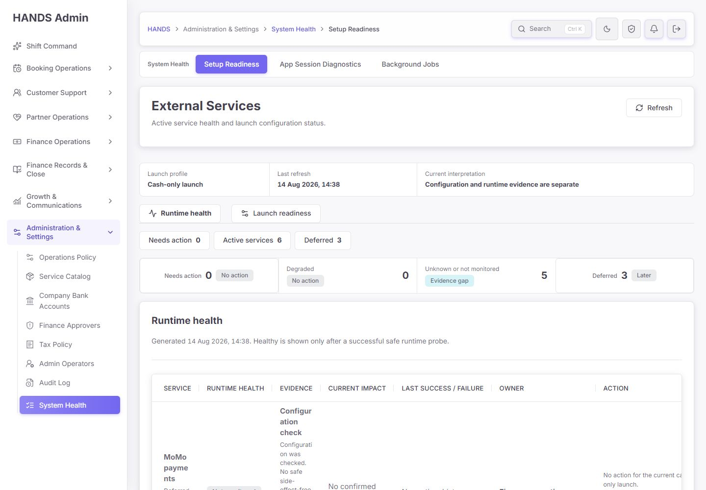
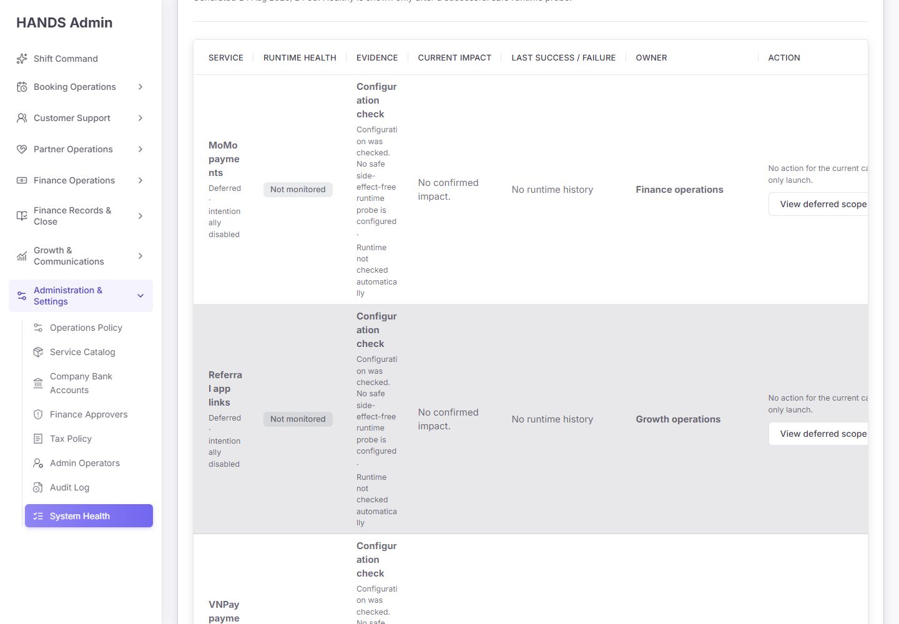
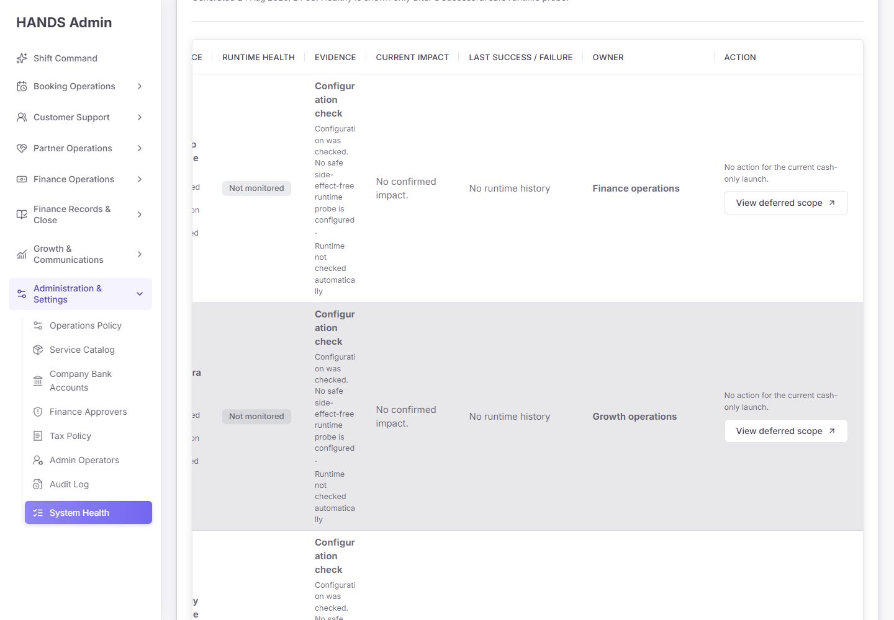
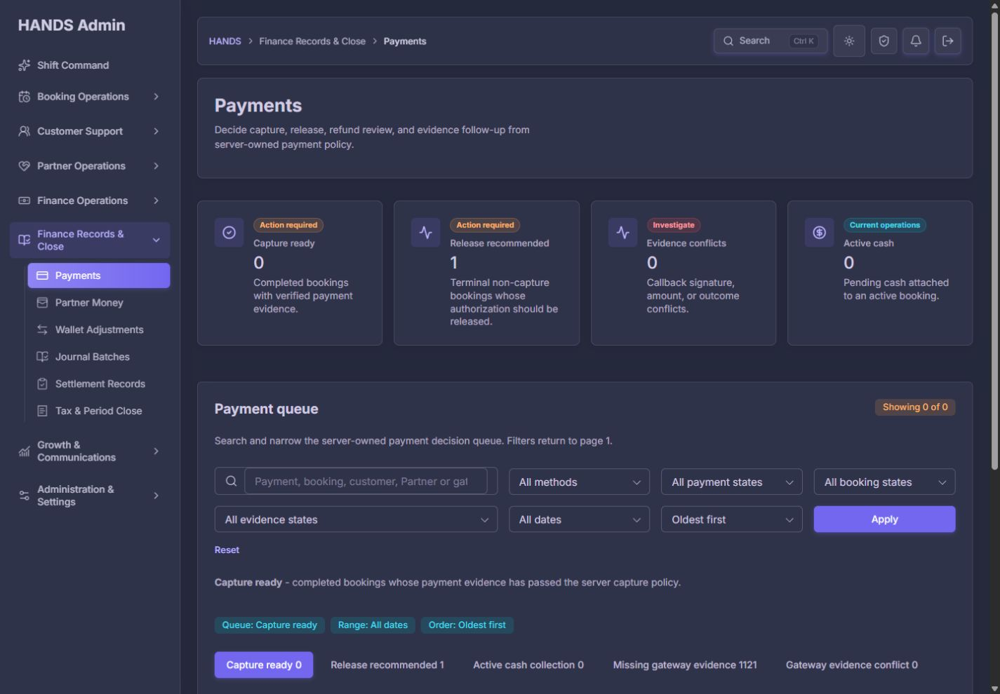
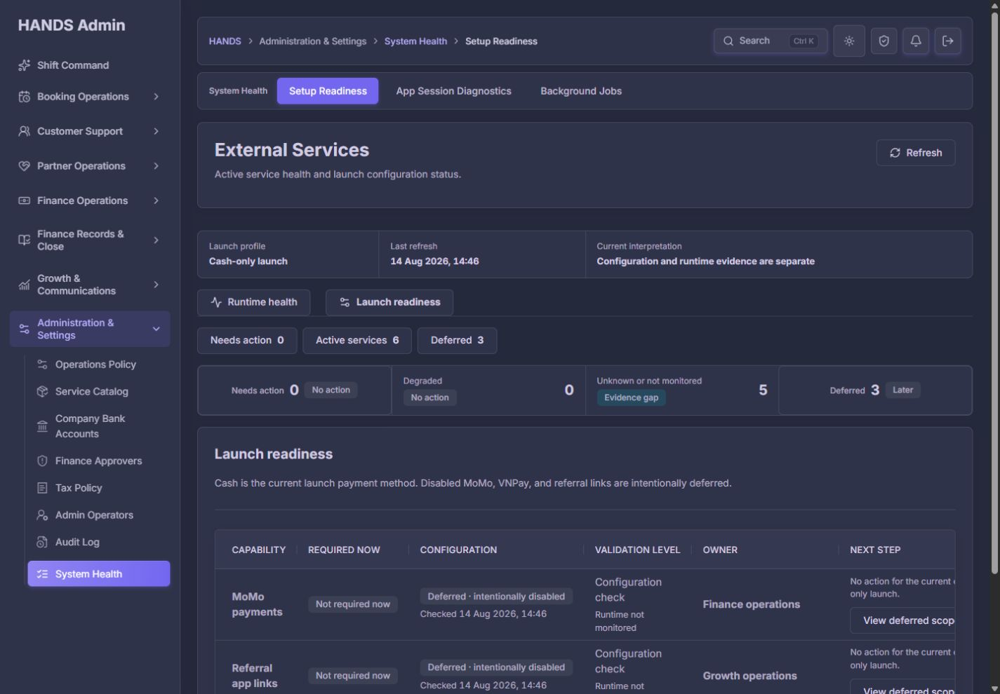
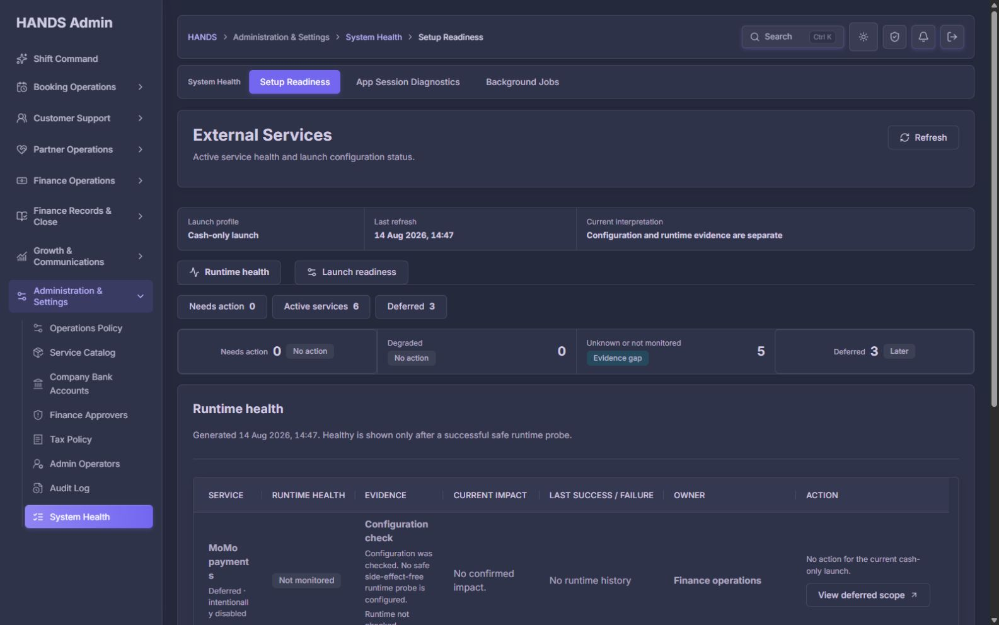

# HANDS Admin `/setup?mode=runtime&view=deferred` 최종 재감사 보고서

- 감사일: 2026-08-14 (Asia/Ho_Chi_Minh, UTC+7)
- 대상 URL: `http://localhost:3101/setup?mode=runtime&view=deferred`
- 비교 URL: `http://localhost:3101/setup?mode=readiness&view=deferred`
- 운영 조건: 1인 운영자, Cash-only launch
- 화면 검사 범위: 인증된 실제 Admin 화면, 1440×1000과 1600×1000 데스크톱, Deferred 작업 목적지, 라이트/다크 테마
- 코드 검사 범위: Admin Setup UI·query model·API contract·HealthService launch policy·navigation·CSS·문서·관련 테스트
- 제외 범위: 사용자 요청에 따라 1024px 이하 화면은 검사·평가·권고에서 완전히 제외
- 기준 보고서: `setup-post-remediation-final-reaudit-2026-08-14.md`, `setup-runtime-active-post-prompt-final-reaudit-2026-08-14.md`
- 제품 코드 변경: 없음. 이 보고서와 이번 감사 증거만 추가함

## 1. 최종 판정

**종합 점수: 63/100 — C, Cash-only 범위 판정은 맞지만 Deferred 운영 화면으로는 재설계가 필요함**

현재 화면의 가장 중요한 장점은 유지됐다. MoMo, VNPay, Referral app links를 현재 현금결제 출시 범위 밖의 3개 capability로 분리하고, 이들을 `Needs action`이나 현재 launch blocker에 합치지 않는다. `Deferred · intentionally disabled`, `No action for the current cash-only launch`라는 문구도 “현재 장애가 아니다”라는 사실을 정직하게 전달한다.

그러나 운영 화면의 목적은 “지금 안 해도 된다”에서 끝나지 않는다. 혼자 운영하는 사용자는 다음을 알아야 한다.

1. 왜 보류됐는가?
2. 무엇이 다시 시작되는 조건인가?
3. 다시 시작하기 전에 어떤 준비가 남았는가?
4. 다음 검토 시점은 언제인가?
5. 어디에서 정확한 준비 상태를 확인해야 하는가?

현재 화면은 이 질문에 답하지 못한다. 실행하지 않는 3개 서비스를 `Runtime health` 표에 넣어 `Not monitored`, `No runtime history`, `No confirmed impact`를 반복하고, 1440px에서는 Service와 Action을 동시에 읽을 수 없다. `View deferred scope`도 정확한 준비 범위가 아니라 일반 결제 처리 큐 또는 넓은 추천 운영 화면으로 이동한다.

따라서 판정은 다음과 같다.

- **현재 Cash-only 출시를 막는 결함:** 이번 Deferred 3건 자체에서는 없음
- **이 화면의 개선 작업 완료 여부:** 미완료
- **P1 우선 개선:** 8건
- **P2 운영 품질 개선:** 6건
- **현재 사용 가능 여부:** “현재 보류 대상이 3개”라는 확인용으로는 사용 가능
- **현재 사용 금지 판단:** 이 화면만 보고 향후 MoMo·VNPay·Referral 재개 준비도를 판단하면 안 됨
- **권장 게이트:** P1-1부터 P1-6까지 해결한 뒤 Deferred 운영 원장으로 승인

## 2. 이전 감사 요구사항 반영 여부

| 이전 요구사항 | 현재 상태 | 판정 |
|---|---|---|
| MoMo·VNPay·Referral을 Cash-only blocker에서 제외 | Deferred 3으로 분리됨 | 해결 |
| Deferred를 숨기지 않고 추적 | saved view와 표로 노출 | 해결 |
| Deferred Action을 1440px에서 바로 확인 | Action을 보려면 수평 이동 필요 | 미해결 |
| 7열 표를 운영 중심 5열로 축소 | Runtime 표가 여전히 7열 | 미해결 |
| 넓은 관련 페이지와 실제 evidence 링크 구분 | `escalationRoute` 하나를 계속 사용 | 미해결 |
| launch policy 단일화 | legacy scope와 신규 service policy가 공존 | 미해결 |
| `Unknown`과 `Not monitored` 분리 | `Unknown or not monitored 5` 유지 | 미해결 |
| Evidence gaps view 제공 | view type에 없음 | 미해결 |
| Refresh pending/success/error 피드백 | self-link만 제공 | 미해결 |
| System Health/External Services 이름 통일 | Setup Readiness 명칭 잔존 | 미해결 |

최신 구현 프롬프트가 작성된 2026-08-14 이후에도 핵심 Setup 소스는 2026-08-12 상태다.

- `setup-page-model.ts`: 2026-08-12 11:25
- `setup-overview-section.tsx`: 2026-08-12 11:47
- `page.tsx`: 2026-08-12 11:11
- `health.service.ts`: 2026-08-12 11:25
- `health-readiness.md`: 2026-08-12 11:24

`evidence-gaps`, `evidenceGaps`, `notMonitored`, `evidenceHref`, `relatedWorkspaceHref` marker도 대상 코드에 없다. 즉 이번 재감사에서 보이는 문제는 브라우저 캐시가 아니라 현재 소스의 실제 미구현 사항이다.

## 3. 실행본 일치성 검증

이전 재감사 때와 달리 이번에는 running Admin이 현재 build보다 오래된 문제는 발견되지 않았다.

- Admin `.next` build timestamp: 2026-08-14 14:36:50
- Build ID: `XdZ7FPvlE6kGWjzpjdQ_R`
- Admin Node process start: 2026-08-14 14:37:08
- `local:status`: Admin/API running, API health 200, Admin HTTP 200
- 브라우저 `Last refresh`: 14:38~14:47 사이에 갱신됨
- 브라우저 console warning/error: 0건

따라서 이번 화면 결함은 “서버가 이전 build를 보고 있기 때문”이라고 설명할 수 없다. 현재 build와 실행 process가 일치한 상태에서도 그대로 재현된다.

## 4. 최신 화면 증거와 단계별 검사

### Step 1 — Runtime health / Deferred 진입



**상태: 부분 양호**

- 정상: `Cash-only launch`, `Deferred 3`, `Needs action 0`이 함께 보여 현재 범위를 오해하지 않는다.
- 정상: Deferred saved view에 `aria-current="page"`가 적용된다.
- 정상: MoMo, Referral, VNPay 세 항목만 필터링된다.
- 문제: 상단 saved view의 `Deferred 3`과 바로 아래 status strip의 `Deferred 3 Later`가 같은 숫자를 반복한다.
- 문제: Deferred 화면인데 `Unknown or not monitored 5 / Evidence gap`이 함께 강조되어 현재 업무 초점이 흐려진다.
- 문제: sidebar는 `System Health`, workspace는 `Setup Readiness`, H1은 `External Services`, 내부 mode는 `Runtime health`로 같은 위치를 네 이름으로 부른다.

### Step 2 — 1440px Deferred 행 가독성



**상태: 불량**

브라우저 실측값은 다음과 같다.

| 측정 항목 | 값 |
|---|---:|
| 목표 viewport | 1440×1000 |
| 표 scroll region client width | 1065px |
| 표 scroll width | 1144px |
| 필요한 수평 이동 | 79px |
| Runtime 열 수 | 7개 |
| 각 Deferred 행 높이 | 367~368px |
| 한 화면에서 온전히 읽히는 행 | 2개 미만 |

가장 심각한 문제는 단어 단위 읽기가 깨진다는 점이다.

- `MoMo payments`가 `MoMo / payme / nts`처럼 잘린다.
- `Referral app links`가 여러 짧은 줄로 분해된다.
- `Configuration check`와 evidence 문장도 한두 단어씩 세로로 쌓인다.
- Action 문구와 버튼은 우측에서 잘린다.

소스 CSS는 더 큰 최소 폭을 요구한다.

- `.setup-health-table { min-width: 1260px; }`
- Evidence/Action 공통 최소 폭 260px
- Runtime 열별 최소 폭 180/150/260/210/175/165/220px

이 최소 폭들의 합과 7열 구조가 현재 Admin content 폭과 양립하지 않는다. `overflow-x:auto`는 표를 숨기지 않는 안전장치일 뿐, 운영 품질 해결책이 아니다.

### Step 3 — Action 열 확인을 위한 수평 이동



**상태: 불량**

- `scrollLeft=64`까지 이동해야 버튼 전체와 외부 링크 아이콘이 보인다.
- Action을 읽는 동안 Service 열은 반대로 잘린다.
- 운영자가 어떤 서비스의 버튼을 누르는지 시각적으로 재확인하기 어렵다.
- 세 행의 버튼 라벨이 모두 `View deferred scope`라서 서비스별 목적 차이가 드러나지 않는다.

이는 1440px 데스크톱을 주 운영 환경으로 쓰는 조건에서 명확한 실패다. Service와 Action은 같은 화면에 동시에 보여야 한다.

### Step 4 — MoMo `View deferred scope` 목적지



**상태: 불량**

MoMo와 VNPay 버튼은 모두 `/payments`를 연다. 실제 도착 화면은 다음 상태다.

- 기본 queue: `Capture ready`
- 기본 Method: `All methods`
- 목적: 기존 payment의 capture/release/refund/evidence 처리
- MoMo/VNPay merchant sandbox, callback URL, feature flag, signed smoke 준비 상태는 없음

즉 버튼 문구 `View deferred scope`와 목적지가 일치하지 않는다. 이 페이지는 결제 운영 기록에는 관련 있지만 gateway 재개 준비의 evidence나 runbook이 아니다.

Referral의 `/referrals`는 `/referrals/customers`로 이동하며, 관련 `Referral link readiness`는 긴 reward 운영 화면의 하단에 있다. 기본 도착 지점은 `Needs action` reward queue이고 readiness section anchor로 이동하지 않는다. 관련 내용은 존재하지만 정확한 작업 위치를 열지 못한다.

### Step 5 — 기존 Launch readiness / Deferred 비교



**상태: 부분 양호**

`mode=readiness&view=deferred`는 Runtime 표보다 의미가 더 적합하다.

- `Not required now`
- `Deferred · intentionally disabled`
- `Configuration check`
- `Next step`

그러나 이 화면도 6열이고 우측 Next step이 잘린다. 또한 `Runtime not monitored`는 의도적으로 꺼진 capability에 필요한 정보가 아니다. 현재 코드에 이미 더 적절한 mode가 있는데도 `/setup?mode=runtime&view=deferred`를 별도 정상 상태로 허용하여 같은 Deferred를 두 가지 표로 중복 표현한다.

### Step 6 — 1600px 다크 테마



**상태: 부분 양호**

- 1600px에서는 table region과 table scroll width가 모두 1210px로 수평 스크롤이 사라진다.
- 다크 테마의 배지, 카드, 선, 본문 대비는 안정적이다.
- 그러나 행 높이는 여전히 약 217~218px이고 `MoMo payments`가 단어 중간에서 잘린다.
- 넓은 화면에서도 7열이 정보 밀도를 높이지 못하고, 불필요한 Runtime 열이 핵심 Deferred 이유와 재개 조건의 자리를 차지한다.

## 5. 잘된 부분 — 반드시 유지

### 5.1 Cash-only 범위 분리는 올바르다

- MoMo와 VNPay가 disabled일 때 현재 blocker가 아니다.
- Referral app links도 현재 cash-only launch의 장애로 세지 않는다.
- Deferred 3건은 숨기지 않고 별도 saved view로 추적한다.

이 결정을 되돌려 MoMo/VNPay credential 누락을 현재 `Needs action`에 다시 합치면 안 된다.

### 5.2 설정과 런타임을 혼동하지 않는다

- Deferred capability를 Healthy로 표시하지 않는다.
- 안전한 probe가 없는 서비스에 runtime success timestamp를 만들지 않는다.
- 결제, OTP, SMS, FCM, upload 같은 부작용 probe를 실행하지 않는다.

### 5.3 오류·기본 접근성 기반은 양호하다

- table header는 모두 `scope="col"`을 가진다.
- Runtime tab과 Deferred saved view에 `aria-current="page"`가 있다.
- 표는 이름이 있는 region에 들어 있다.
- browser console warning/error는 발견되지 않았다.
- Admin API 오류는 정상 0건으로 축약하지 않는 기존 error state를 유지한다.

## 6. P1 — 우선 수정해야 할 항목

### P1-1. Deferred는 Runtime health view가 아니라 Launch readiness view여야 한다

**현재 문제**

Deferred 3개는 `enabled=false`, `requiredForCurrentLaunch=false`이며 실제 실행 중인 서비스가 아니다. 그런데 `mode=runtime&view=deferred`가 정상 URL로 유지되어 다음 Runtime 열을 보여 준다.

- Runtime health: Not monitored
- Evidence: Configuration check
- Current impact: No confirmed impact
- Last success/failure: No runtime history

이 값은 틀리지는 않지만 운영 판단에 가치가 없다. 실행하지 않는 서비스를 “왜 runtime monitoring이 없는가”로 설명하는 것은 잘못된 정보 구조다.

**수정 요구사항**

1. Runtime mode saved view는 `Needs action`, `Active services`, `Evidence gaps`로 구성한다.
2. Deferred는 Launch readiness에만 둔다.
3. status strip의 Deferred 링크는 항상 `/setup?mode=readiness&view=deferred`를 사용한다.
4. `/setup?mode=runtime&view=deferred` 접근은 server redirect 또는 query canonicalization으로 readiness/deferred에 통일한다.
5. URL과 선택된 mode가 항상 일치해야 한다.

**완료 기준**

- Runtime health 안에 disabled Deferred 행이 나타나지 않는다.
- 기존 runtime/deferred deep link를 열면 visible mode와 URL이 모두 readiness/deferred로 정규화된다.

### P1-2. Deferred 전용 운영 원장으로 재구성한다

Runtime 표나 일반 Launch 표를 재사용하지 말고 Deferred 목적에 맞는 최대 5열 구조를 사용한다.

| 권장 열 | 운영 질문 |
|---|---|
| Capability | 무엇을 보류했는가? |
| Deferred reason | 왜 지금 하지 않는가? |
| Re-entry prerequisites | 다시 시작하려면 무엇이 필요한가? |
| Review trigger | 언제 다시 검토하는가? |
| Action | 어디에서 준비 상태나 runbook을 보는가? |

Owner, missing item 상세, 관련 문서, 마지막 검토자, provider console은 행 disclosure 또는 drawer로 이동한다.

상단에는 다음 결론을 한 번만 보여 준다.

> 3 capabilities are deferred for the cash-only launch. They do not block the current launch. Review them only when the listed trigger is reached.

`Not monitored`, `No runtime history`, `No confirmed impact`는 Deferred 전용 표에서 제거한다.

### P1-3. 각 capability에 재개 조건과 준비 상태를 제공한다

현재 `safeOperatorAction`은 세 행 모두 `No action for the current cash-only launch.`로 끝난다. “지금 하지 않는다”는 맞지만 운영 원장이 되려면 다음 단계가 필요하다.

**MoMo**

- 보류 이유: Cash-only launch에서 online payment 비활성
- 재개 trigger: online payment phase 승인, public HTTPS callback 준비, merchant sandbox 계정 확보
- 재개 전 확인: signed checkout/IPN/query/refund smoke와 gateway flag 검토
- 안전 규칙: 검증 완료 전 `MOMO_GATEWAY_ENABLED=false`

**VNPay**

- 보류 이유: Cash-only launch에서 online payment 비활성
- 재개 trigger: online payment phase 승인과 server/DNS/TLS 준비
- 재개 전 확인: signed checkout, GET IPN, query recovery, async refund E2E
- 안전 규칙: 검증 완료 전 `VNPAY_GATEWAY_ENABLED=false`

**Referral app links**

- 보류 이유: public store-link E2E가 현재 출시 단계 밖
- 재개 trigger: public referral sharing 또는 store release phase 시작
- Android MVP 준비: public base URL, Customer/Partner Android store URL, device routing smoke
- iOS 준비: Customer/Partner iOS 앱이 release preparation에 들어갈 때 별도 활성화

화면에는 secret/env key를 노출하지 않고 사람이 읽는 checklist를 제공한다.

### P1-4. Referral readiness 계약의 Android/iOS 범위 충돌을 해결한다

`external-setup-checklist.md:64`는 현재 Android MVP에서 public base와 두 Android URL만 필수이며 iOS URL은 나중이라고 설명한다. 반면 `health.service.ts:137-143`의 Referral check는 Android와 iOS URL 다섯 값을 모두 동시에 요구한다.

현재 화면은 Referral을 무조건 Deferred로 덮으므로 이 충돌이 보이지 않는다. 향후 Referral phase를 재개할 때 iOS가 준비되지 않았다는 이유로 Android MVP도 BLOCKED 처리될 수 있다.

**수정 요구사항**

- launch/release profile에 `ANDROID_MVP`, `IOS_RELEASE` 같은 platform scope를 명시한다.
- Referral prerequisites를 platform scope에서 파생한다.
- Android MVP에서는 iOS URL을 blocker로 세지 않는다.
- UI에는 `Android prerequisites`와 `Future iOS prerequisites`를 구분한다.
- API와 문서의 요구값을 같은 manifest에서 생성하거나 계약 테스트로 고정한다.

### P1-5. `View deferred scope` 링크를 정확한 동선으로 바꾼다

하나의 `escalationRoute`로 evidence, 관련 workspace, runbook을 모두 표현하면 안 된다.

**API 권장 필드**

- `evidenceHref`: 실제 필터나 section으로 바로 갈 수 있을 때만 사용
- `relatedWorkspaceHref`: 일반 관련 운영 화면
- `runbookHref`: 재개 checklist 또는 문서
- `providerConsoleHref`: 필요할 경우에만, 권한과 안전성 검토 후 사용

**링크 규칙**

- `/payments` 일반 queue는 `Open payment operations`라고 표시한다.
- MoMo/VNPay 준비 evidence가 없으면 `View deferred scope`라고 부르지 않는다.
- 가능하면 `/payments?paymentMethod=MOMO` 같은 record filter와 별도로 gateway readiness section/runbook을 만든다.
- Referral은 최소 `/referrals/customers#referral-link-readiness`처럼 실제 section을 열고, Customer/Partner 범위를 각각 연결한다.
- 존재하지 않는 anchor나 빈 화면을 가리키는 가짜 deep link를 만들지 않는다.

### P1-6. 1440px에서 Service와 Action을 동시에 보이게 한다

**완료 기준**

- 1440×1000에서 `table.scrollWidth <= wrapper.clientWidth`
- 수평 스크롤 0
- 서비스명과 Action을 같은 화면에서 동시에 확인
- 단어 중간 줄바꿈 0
- 행 높이 목표 96~140px
- 첫 viewport에서 최소 3개 Deferred 행을 모두 확인하거나, 표 시작 후 3개가 한 번의 짧은 scroll 안에 들어옴

`overflow:hidden`으로 내용을 잘라 통과시키면 안 된다. 열을 줄이고, 상세 정보는 disclosure로 옮겨야 한다.

### P1-7. launch scope를 단일 manifest로 통합한다

현재 API에는 서로 다른 두 Deferred 정의가 있다.

1. legacy `isDeferredExternalCategory()`는 auth, SMS, payments, push, storage, referrals 등을 Deferred로 분류한다.
2. 신규 `externalServicePolicy()`는 Cash-only에서 Referral과 disabled MoMo/VNPay만 Deferred로 만들고 auth/SMS/push/storage는 required로 둔다.

`externalServicesOverview()`는 신규 services로 `currentStageOk`와 `blockingCategories`를 덮지만 legacy `checks[].scope`, `deferredCategories`, `deferredCommands`는 그대로 반환한다. 같은 응답의 소비자가 서로 다른 Deferred 목록을 얻을 수 있다.

**수정 요구사항**

- `CASH_ONLY` launch manifest를 단일 source of truth로 만든다.
- checks, services, counts, blockingCategories, deferredCategories, commands, Admin view가 같은 manifest에서 파생되게 한다.
- legacy 필드는 신규 기준으로 normalize하거나 version/deprecation을 명시한다.
- `legacy scope === derived launch scope` 계약 테스트를 모든 capability에 추가한다.

### P1-8. Deferred의 현재 준비도를 숨기지 않는다

Deferred와 “아직 준비되지 않음”은 동시에 참일 수 있다. 현재 `configurationStatus='DEFERRED'` 하나로 MoMo/VNPay/Referral의 underlying readiness를 덮어쓴다.

다음처럼 두 축을 분리해야 한다.

- Launch scope: `DEFERRED`
- Future readiness: `NOT_STARTED | PARTIAL | READY_FOR_REENTRY`

운영 화면은 missing secret 이름 대신 안전한 human checklist와 완료 비율을 표시한다. 예:

- `0/4 re-entry gates verified`
- `Merchant sandbox not connected`
- `Public callback not verified`
- `Android store routing not verified`

Deferred가 현재 blocker가 되지는 않지만, 미래 준비 부채가 사라져서도 안 된다.

## 7. P2 — 운영 품질 개선

### P2-1. saved view와 status strip의 중복 숫자를 줄인다

`Needs action 0`과 `Deferred 3`을 바로 위아래에서 반복하지 않는다. saved view는 navigation으로 유지하고 status strip은 다음처럼 다른 판단 정보를 제공한다.

- Current launch blockers
- Evidence gaps
- Last verified
- Deferred due for review

### P2-2. 1인 운영자에게 팀명 열을 강요하지 않는다

`Finance operations`, `Growth operations`은 향후 조직 확장 metadata로 유지할 수 있지만 primary table 열에서는 제거한다. 현재는 `Review trigger`, `Runbook`, `Last reviewed by`가 더 실용적이다.

### P2-3. 각 버튼을 구체적인 동사로 바꾼다

- MoMo: `Review MoMo re-entry checklist`
- VNPay: `Review VNPay re-entry checklist`
- Referral: `Review referral link readiness`

세 행 모두 같은 `View deferred scope`를 쓰지 않는다.

### P2-4. 다음 검토 시점과 overdue 상태를 추가한다

Deferred item은 무기한 잊히기 쉽다. calendar date를 억지로 정하기보다 trigger 기반 review를 우선한다.

- `When local completeness reaches 95%`
- `After server/DNS/TLS is ready`
- `When online payments enter scope`
- `Before public referral sharing`

필요하면 `reviewedAt`, `reviewDueAt`, `reviewState`를 추가하되 새로운 DB를 이 화면 하나 때문에 먼저 만들지 않는다. 기존 policy/audit metadata가 있으면 재사용한다.

### P2-5. Refresh에 진행·완료·실패 피드백을 제공한다

현재 Refresh는 같은 URL을 여는 `<a>`다.

- disabled/pending 없음
- `aria-busy` 없음
- completion/error live region 없음
- API 5초 cache를 설명하지 않음

기존 데이터를 유지한 채 pending 표시를 하고, 한 개의 `role="status"`에서 `Updated just now` 또는 오류를 알린다. 자동 polling은 필요하지 않다.

### P2-6. 화면 이름을 통일한다

- 대분류: `System Health`
- page: `External Services`
- 형제: `App Sessions`, `Background Jobs`
- 내부 mode: `Runtime health`, `Launch readiness`

`Setup Readiness`라는 workspace와 breadcrumb 이름은 제거한다.

## 8. 권장 최종 화면 구조

### 8.1 정보 구조

```text
System Health
└─ External Services
   ├─ Runtime health
   │  ├─ Needs action
   │  ├─ Active services
   │  └─ Evidence gaps
   └─ Launch readiness
      ├─ Needs action
      ├─ Required capabilities
      └─ Deferred
```

### 8.2 Deferred summary

```text
Deferred for cash-only launch                                      3
These capabilities do not block the current launch.
Review them only when their re-entry trigger is reached.

[MoMo] [VNPay] [Referral links]
Next trigger: online payments or public referral sharing enters scope
```

### 8.3 Deferred table

| Capability | Why deferred | Re-entry prerequisites | Review trigger | Action |
|---|---|---|---|---|
| MoMo | Cash-only launch | Merchant sandbox, HTTPS callback, signed flow smoke | Online payments approved | Review checklist |
| VNPay | Cash-only launch | Merchant sandbox, IPN/query/refund smoke | Online payments approved | Review checklist |
| Referral links | Public sharing later | Android store URLs and device routing; iOS later | Public referral launch | Review link readiness |

각 행 아래 `<details>`에 다음을 넣는다.

- future readiness state
- last reviewed timestamp
- verified prerequisites
- remaining human-readable prerequisites
- related operations workspace
- runbook/document link

## 9. 코드별 수정 지점

### Admin Web

**`apps/admin_web/app/setup/setup-page-model.ts`**

- `SetupWorkspaceView`에 `evidence-gaps` 추가
- mode별 허용 view 정의
- runtime/deferred를 readiness/deferred로 canonicalize
- `unknown`, `notMonitored`, `evidenceGaps` count 분리
- Deferred future readiness selector 추가

**`apps/admin_web/app/setup/setup-overview-section.tsx`**

- mode별 saved view 구성 분리
- Deferred를 `LaunchReadinessDeferredSection` 같은 전용 section으로 렌더링
- Runtime 7열 표에서 disabled Deferred 제거
- 최대 5열과 disclosure 적용
- 정확한 action label/href 사용
- 중복 KPI 제거

**`apps/admin_web/app/setup/page.tsx`**

- invalid/mismatched query의 visible state와 URL canonicalization
- Refresh pending/success/error 가능한 client boundary 또는 기존 navigation pattern 적용

**`apps/admin_web/lib/admin-api.ts`**

- counts 확장
- `launchScope`, `deferredReason`, `futureReadiness`, `reentryRequirements`, `reviewTrigger`
- `evidenceHref`, `relatedWorkspaceHref`, `runbookHref` 분리

**`apps/admin_web/app/globals.css`**

- `.setup-health-table { min-width:1260px; }` 제거 또는 Deferred 전용 표에서 사용 금지
- 7개 nth-child 최소 폭 규칙 제거
- 1440에서 5열이 content width 안에 들어오도록 고정 비율/최소 폭 재정의
- 단어 중간 줄바꿈을 숨김으로 해결하지 않음

**`apps/admin_web/lib/admin-navigation.ts`**

- `Setup Readiness`를 `External Services`로 변경
- breadcrumb/workspace label 동기화

### API

**`apps/api/src/health/health.service.ts`**

- launch profile manifest 단일화
- legacy/new scope normalize
- Deferred future readiness 별도 계산
- Android/iOS referral requirement 분리
- action destination 의미 분리
- top-level counts를 unknown/notMonitored/evidenceGaps로 확장

**`apps/api/src/health/health.service.spec.ts`**

- Cash-only Deferred 3 정확성
- legacy/new scope 일치
- Referral Android MVP가 iOS URL 때문에 blocked되지 않음
- future readiness partial/ready 상태
- 정확한 deep link와 runbook link
- secret-safe response

### 문서

**`docs/architecture/health-readiness.md`**

- `/health/external`은 Admin JWT endpoint임을 명시
- 인증 없는 호출 예시 제거
- 단일 launch manifest와 Deferred/re-entry 계약 설명

**`docs/architecture/external-setup-checklist.md`**

- Android MVP와 future iOS requirement를 API manifest와 일치시킴
- MoMo/VNPay 재개 gate를 화면 문구와 동기화

## 10. 테스트 감사 결과

### 실행 결과

| 검증 | 결과 |
|---|---|
| Admin Setup tests | 14 files, 59 tests PASS |
| API Health tests | 2 files, 25 tests PASS |
| Admin typecheck | PASS |
| API typecheck | PASS |
| Admin visible-copy guard | 1641 files, 0 violations |
| Browser console warning/error | 0 |

### 통과했지만 요구사항을 보장하지 않는 이유

현재 테스트 일부는 개선해야 할 상태를 오히려 고정한다.

- `page.spec.tsx`는 horizontal scrolling 유지 여부만 확인하고 1440 무스크롤을 검사하지 않는다.
- `setup-page-model.spec.ts`는 UNKNOWN과 NOT_MONITORED가 합쳐진 `unknown` count를 기대한다.
- `setup-overview-section.spec.tsx`는 Evidence gap 문구 존재만 확인하고 클릭 가능한 view를 검사하지 않는다.
- API test는 Deferred가 3개임은 확인하지만 legacy scope와 신규 service scope 일치를 검사하지 않는다.
- `View deferred scope`의 목적지와 실제 화면 의미를 검사하지 않는다.
- runtime/deferred URL canonicalization 테스트가 없다.
- 최대 5열, disclosure, 행 높이, 1440 overflow에 대한 구조/브라우저 검증이 없다.

### 추가해야 할 테스트

1. Runtime mode에 Deferred saved view가 없음
2. runtime/deferred URL이 readiness/deferred로 정규화됨
3. Deferred table header가 최대 5개
4. Runtime-only 열이 Deferred 표에 없음
5. MoMo/VNPay/Referral마다 다른 action label
6. link type과 destination 의미가 일치
7. Android MVP referral requirements가 iOS와 분리됨
8. 1440에서 `scrollWidth <= clientWidth`
9. service name이 단어 중간에서 끊기지 않음
10. Refresh status announcement 존재

## 11. 완료 판정 기준

다음 조건을 모두 충족해야 “Deferred 개선 완료”로 판정한다.

### 상태 계약

- [ ] Cash-only에서 Deferred는 정확히 MoMo, VNPay, Referral 3건
- [ ] legacy/new launch scope가 동일 manifest에서 파생
- [ ] Deferred와 future readiness가 별도 축
- [ ] Android MVP referral gate가 iOS future scope와 분리

### 정보 구조

- [ ] Deferred는 Launch readiness에만 존재
- [ ] runtime/deferred URL이 canonicalized
- [ ] Runtime saved views에 Evidence gaps가 존재
- [ ] 중복 숫자 strip 제거

### 화면

- [ ] 1440px 수평 스크롤 0
- [ ] Service와 Action 동시 표시
- [ ] 최대 5열
- [ ] 행 높이 140px 이하를 목표로 검증
- [ ] 단어 중간 줄바꿈 없음
- [ ] light/dark 1440/1600에서 동일하게 동작

### 운영 행동

- [ ] 각 항목에 deferred reason
- [ ] 각 항목에 re-entry prerequisites
- [ ] 각 항목에 review trigger
- [ ] 정확한 related workspace/runbook 링크
- [ ] 일반 운영 queue를 evidence라고 부르지 않음

### 검증

- [ ] 관련 Admin/API tests 추가 후 통과
- [ ] typecheck 통과
- [ ] production build 통과
- [ ] build 이후 Admin process 재시작
- [ ] 브라우저에서 신규 marker 확인
- [ ] 1440/1600 실측값과 screenshot 보존

## 12. 권장 구현 순서

1. launch manifest와 Android/iOS referral profile을 먼저 확정한다.
2. API에 Deferred reason/future readiness/re-entry/link contract를 추가한다.
3. mode별 view와 URL canonicalization을 수정한다.
4. Deferred 전용 5열 section을 만든다.
5. 정확한 deep link 또는 runbook 목적지를 연결한다.
6. 1440px CSS 실측으로 overflow와 행 높이를 줄인다.
7. Refresh feedback과 naming을 정리한다.
8. 테스트, typecheck, build, process restart를 수행한다.
9. 1440 light/dark와 1600 light/dark에서 최종 브라우저 검증한다.

## 13. 최종 결론

이번 화면은 **“현금결제 출시에서 지금 하지 않을 세 가지”를 분리하는 데는 성공**했다. 이 부분은 올바른 제품 결정이며 유지해야 한다.

하지만 현재 UI는 Deferred를 **미래 운영 계획**이 아니라 **작동하지 않는 Runtime service 목록**처럼 표현한다. 그래서 같은 의미 없는 문구가 반복되고, 실제로 필요한 재개 조건과 검토 trigger가 사라졌다. 1440px 표 붕괴와 부정확한 Action 목적지까지 겹쳐 혼자 운영하는 사용자가 이 화면을 작업 원장으로 쓰기는 어렵다.

가장 중요한 수정은 시각적 장식이 아니다.

> Deferred를 Runtime health에서 제거하고 Launch readiness의 전용 운영 원장으로 통합하여, 각 capability의 보류 이유·재개 조건·검토 trigger·정확한 작업 위치를 한 화면에서 보여 주는 것.

이 구조가 완성되어야 Deferred 3건이 “나중에 잊히는 항목”이 아니라 “현재 출시를 방해하지 않으면서도 안전하게 추적되는 미래 작업”이 된다.
