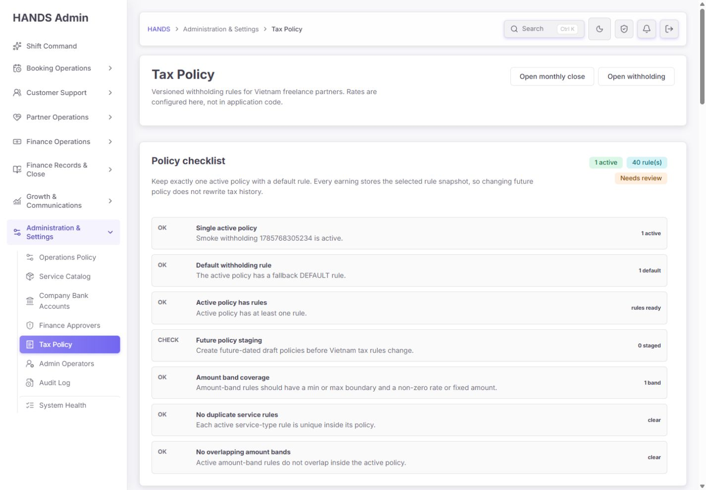
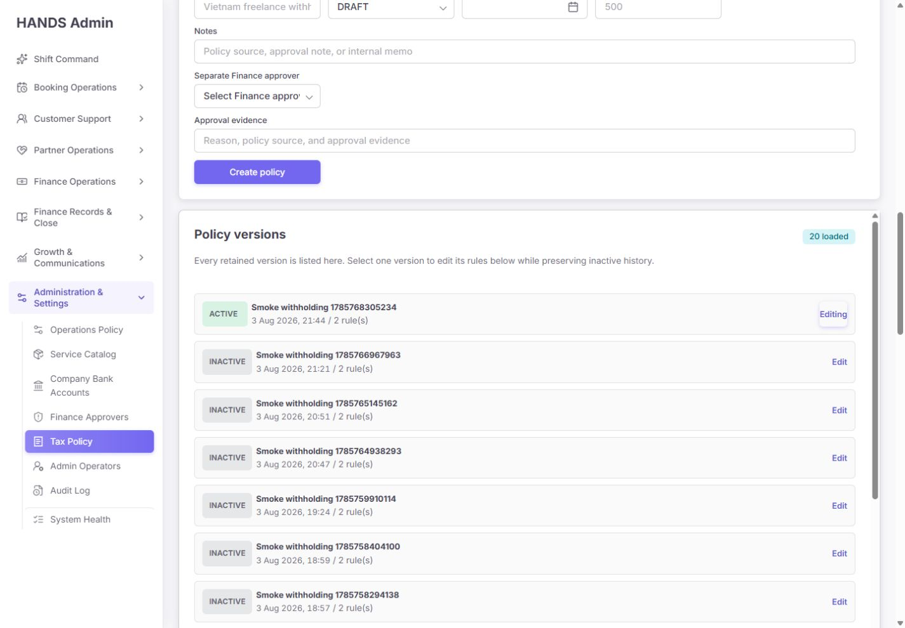
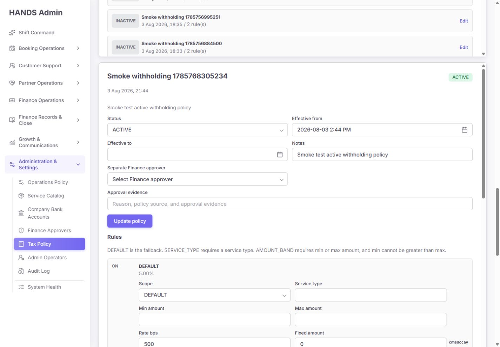
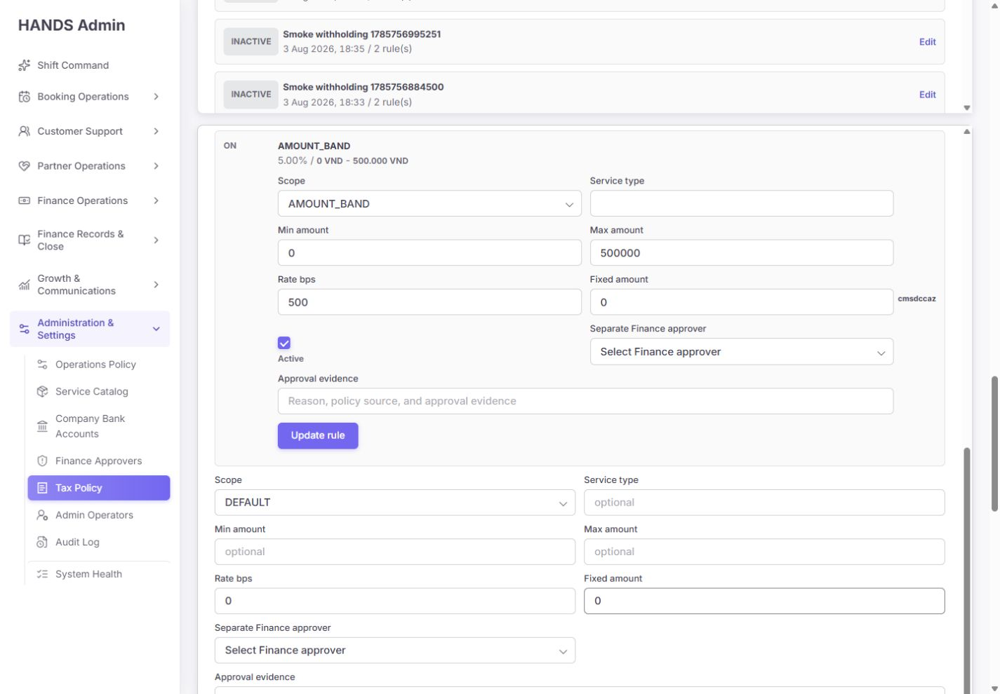
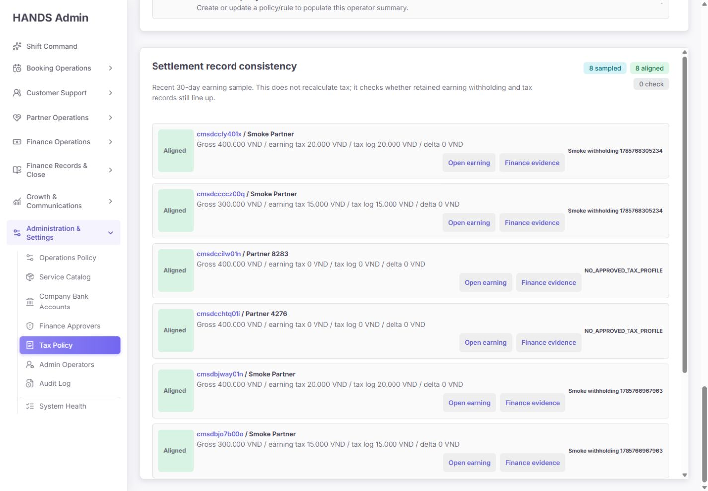
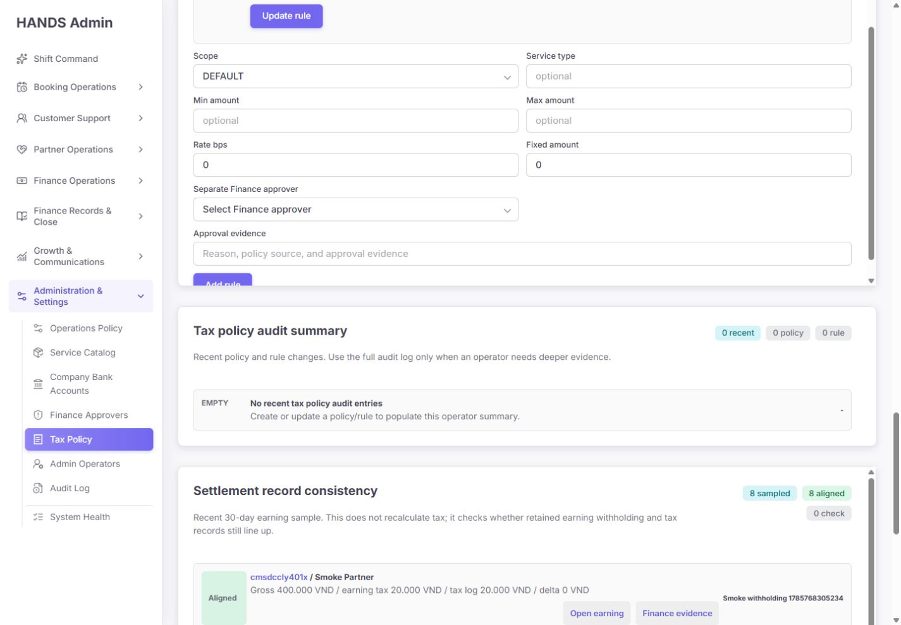
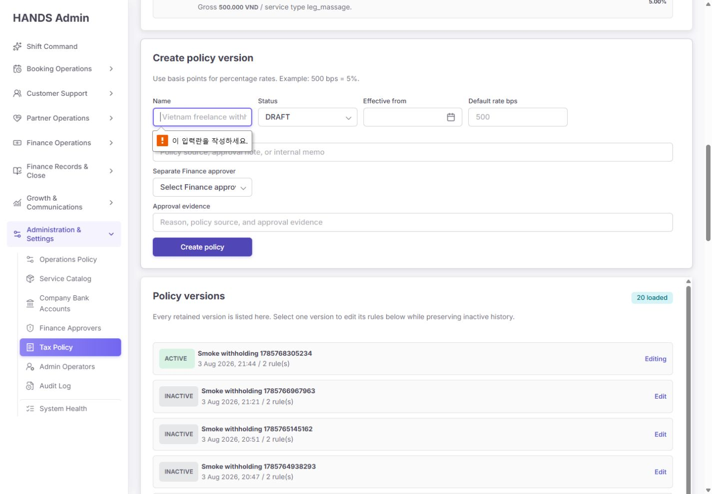

# Tax Policy 최종 재감사 보고서

- 감사일: 2026-08-11
- 대상: `/tax-policy`
- 기준 화면: 1440 × 1000 데스크톱
- 제외 범위: 1024px 이하 반응형 UI는 사용자 요청에 따라 검사하지 않음
- 감사 범위: 실제 로그인 화면, 정책 생성·수정·활성화 흐름, 규칙 편집, 계산 미리보기, 현재 DB, API·권한·트랜잭션·감사 로그, 정산 스냅샷, smoke 데이터 수명주기, 문구, 접근성, 성능 구조
- 판정: **출시 보류(Release hold)**
- 종합 점수: **29/100**

## 1. 최종 결론

화면에는 정책 체크리스트, 원천징수 미리보기, 별도 Finance approver 선택, 규칙 중복·구간 겹침 검사, 정산 스냅샷 표본 확인 같은 좋은 재료가 있다. 그러나 현재 구현은 “법적·재무적으로 통제된 버전 정책 관리”가 아니라 **활성 세금 계산 규칙을 한 화면에서 즉시 직접 수정하는 내부 개발 도구**에 가깝다.

출시 보류의 핵심 이유는 다음과 같다.

1. 미래 시점 정책을 지금 `ACTIVE`로 만들면 기존 활성 정책을 즉시 `INACTIVE`로 바꾸지만, 계산 엔진은 미래 `effectiveFrom` 전까지 새 정책을 선택하지 않는다. 그 사이 원천징수는 0원이 될 수 있다.
2. 화면의 `Separate Finance approver`는 실제 두 번째 사용자의 승인 행위가 아니다. 작업자가 승인자 ID와 자유문구를 대신 제출하면 서버가 그 ID의 역할만 확인하고 변경을 즉시 실행한다.
3. 이미 활성화됐거나 과거 정산에 사용된 정책과 규칙도 같은 레코드에서 직접 수정할 수 있다. 이름은 `Versioned`이지만 정책 버전 불변성이 없다.
4. 현재 실제 활성 정책은 `Smoke withholding 1785768305234`이고, DB에는 smoke가 누적한 정책 145개와 규칙 290개가 있다. API smoke가 매 실행마다 실제 활성 정책을 교체하고 정리하지 않는다.
5. 화면은 `20 loaded`, `40 rule(s)`, 감사 `0 recent`를 보여 주지만 DB에는 정책 145개, 규칙 290개, 정확한 정책·규칙 변경 감사 725건이 있다. 운영자가 보는 관리 수치가 실제 상태를 대표하지 않는다.
6. 정책 생성과 기본 규칙 생성은 서로 다른 API 호출이다. 특히 `ACTIVE` 정책 생성 후 기본 규칙 생성이 실패하면 기존 정책은 이미 비활성화되고 새 활성 정책은 불완전한 채 남을 수 있다.
7. mutation은 실패를 throw하는 API helper가 아니라 `null` fallback helper를 사용한다. 권한 거부·검증 실패·서버 장애가 화면에서 성공과 구분되지 않고 입력값과 작업 위치도 보존되지 않는다.
8. 저장된 `2026-08-03T14:44Z`가 화면에서 `2026-08-03 2:44 PM`으로 표시되고 hidden 값도 `2026-08-03T14:44`다. 베트남 시간이라면 9:44 PM이어야 하며, 서버 시간대에 따라 그대로 다시 저장해도 최대 7시간 이동할 수 있다.
9. 페이지 접근은 `SYSTEM_POLICY`, API 조회는 `FINANCE_TAX`, 쓰기는 다시 `SYSTEM_POLICY`로 분리되어 있다. 세금 정책의 열람·제안·승인·활성화 권한 경계가 일관되지 않다.

따라서 다음 단계는 색상이나 카드 간격 조정이 아니다. **정책 상태 머신, 실제 승인 워크플로, 활성화 원자성, 버전 불변성, smoke 격리, 정확한 감사·오류 상태**를 먼저 고쳐야 한다.

## 2. 이번 감사에서 실제 확인한 상태

| 항목 | 화면 표시 | 실제 확인값 | 판정 |
|---|---:|---:|---|
| 정책 버전 | 20 loaded | 145개 | 화면이 전체 이력을 대표하지 못함 |
| 정책 상태 | 1 active | ACTIVE 1, INACTIVE 144 | 숫자는 우연히 맞지만 최신 20개 표본 기반 체크임 |
| 규칙 수 | 40 rule(s) | 290개 | 최근 20개에 포함된 규칙만 집계 |
| 활성 정책 | Smoke withholding 1785768305234 | 동일 | 제품용 정책이 아니라 smoke 정책이 계산 엔진을 지배 |
| 활성 정책 규칙 | 2개 | DEFAULT 5%, 0~500,000 AMOUNT_BAND 5% | 기능상 계산 가능하지만 근거·승인 출처가 smoke 문구임 |
| 정확한 정책/규칙 변경 감사 | 0 recent | 725건 | 조회 방식 때문에 실제 이력을 누락 |
| `tax_` 포함 감사 | 화면은 상위 8개만 로드 | 1,000건 | broad 검색 결과 상한이 정확한 이벤트를 밀어냄 |
| 원천징수 로그 | 최근 8개 표본 | 351건 | 표본이 전체 건전성을 나타내지 못함 |
| `NO_APPROVED_TAX_PROFILE` 스냅샷 | 일부 행이 `Aligned` | 177건 | 금액 일치와 세금 적용 적정성을 혼동 |
| Provider tax profile | 화면 미표시 | APPROVED 112개 | 현재 준비도·프로필 기준일을 정책 판단에 연결하지 않음 |
| Finance approver | 11개 선택지 노출 | 전체 12명, 현재 작업자 제외 | 보이는 이름은 Audit/Demo/Local/Smoke 계열 fixture |
| 페이지 높이 | 한 화면이 아님 | 약 4,943px | 페이지 스크롤 외에 독립 스크롤 3개가 추가됨 |
| warm local navigation | - | 약 131ms | 이번 로컬 warm 측정에서는 페이지 자체가 느리지는 않았음 |

이번 감사의 DB 확인은 읽기 전용으로 수행했다. 정책·규칙·승인자·세금 로그를 생성·수정·삭제하지 않았다. 빈 `Create policy` 제출은 브라우저 기본 유효성 검사까지만 확인했고 API mutation은 발생시키지 않았다.

## 3. 화면 증거

### 3.1 상단 체크리스트와 미리보기

상단 구조는 목적을 파악하기 쉽다. 그러나 `1 active`, `40 rule(s)`, `Needs review`는 최근 20개 정책만으로 계산하며, 현재 활성 정책이 smoke라는 사실을 정상 성공 색상으로 보여 준다.

### 3.2 생성 폼과 정책 버전 목록

`Every retained version is listed here`라는 문구와 달리 145개 중 20개만 보인다. 검색, 상태 필터, 총 건수, 페이지 이동, 다음 기록이 없다.

### 3.3 활성 정책 직접 편집

현재 계산에 사용되는 활성 정책의 상태·시작·종료 시각·메모를 같은 레코드에서 바로 바꿀 수 있다. 변경 전후 비교, 영향 건수, 승인 대기 상태, 확인 단계가 없다.

### 3.4 규칙 직접 편집과 추가

규칙마다 긴 폼과 승인자·증거 입력이 반복된다. 운영자는 어떤 규칙을 수정하는지, 변경 후 어느 거래가 달라지는지, 우선순위가 무엇인지 한눈에 비교하기 어렵다.

### 3.5 정산 일관성과 감사 요약

실제 감사 이벤트가 725건인데도 화면은 0건으로 표시한다. `Aligned`는 정책 계산이 옳다는 뜻이 아니라 “earning 금액과 첫 tax log 금액이 같고 snapshot 객체가 존재한다”는 좁은 조건이다.

### 3.6 브라우저 기본 검증

빈 이름 제출은 안전하게 차단됐다. 다만 영어 관리자 화면 위에 운영체제 언어의 한국어 메시지가 나타나며, 여러 폼에서 어느 작업이 실패했는지 설명하는 페이지 내 오류 모델은 없다.

## 4. 운영 흐름별 건강도

| 단계 | 운영자가 하는 일 | 건강도 | 핵심 판단 |
|---:|---|---|---|
| 1 | 현재 정책 상태 파악 | 위험 | 최신 20개 표본과 smoke 정책을 정상 운영 상태처럼 보여 줌 |
| 2 | 규칙 결과 미리보기 | 개선 필요 | 한 건 계산은 되지만 실제 서비스 선택·세금 프로필·시점·법적 세목·경계값 검증이 없음 |
| 3 | 새 정책 초안 생성 | 위험 | `ACTIVE`를 바로 선택할 수 있고 정책+기본 규칙이 비원자적임 |
| 4 | 정책 버전 탐색 | 위험 | 145개 중 20개만 노출하면서 모든 버전이 보인다고 설명함 |
| 5 | 정책 메타데이터 변경 | 출시 차단 | 활성/과거 정책을 제자리에서 수정할 수 있고 시각 값이 시간대에 따라 이동함 |
| 6 | 규칙 수정·추가 | 출시 차단 | 활성 계산 규칙을 즉시 직접 변경하며 실제 두 번째 승인과 영향 확인이 없음 |
| 7 | 미래 정책 활성화 | 출시 차단 | 미래 ACTIVE가 현재 ACTIVE를 즉시 끄므로 적용 공백과 0원 원천징수가 가능함 |
| 8 | 변경 결과·실패 확인 | 위험 | mutation 실패가 null fallback으로 흡수되어 성공/실패가 구분되지 않음 |
| 9 | 감사 이력 확인 | 출시 차단 | DB 725건을 화면 0건으로 표시해 통제 증거를 제공하지 못함 |
| 10 | 정산 데이터 건전성 확인 | 위험 | 8건 금액 일치 표본을 정책 적정성처럼 해석하게 만듦 |

## 5. 잘 구현된 기반

다음은 유지하면서 통제 모델만 강화하는 것이 좋다.

- 제목과 설명이 Vietnam freelance partner 원천징수 설정이라는 목적을 명확히 말한다.
- 정책, 규칙, 계산 미리보기, 감사, 정산 증거를 한 업무 맥락에 연결하려는 방향은 좋다.
- 현재 API는 단일 요청 기준으로 다른 활성 정책을 비활성화하고, 한 정책 안의 활성 DEFAULT 중복을 차단한다.
- 서비스별 활성 규칙 중복과 AMOUNT_BAND 겹침을 API에서 거부한다.
- rate bps 범위, 금액 음수, 최소/최대 순서, 서비스 규칙의 service type 필수값을 서버에서 검사한다.
- earning에는 선택 정책과 규칙 snapshot이 남아 과거 정산 금액 자체를 다시 계산해 덮어쓰지는 않는다.
- 화면은 색상 외에도 `OK`, `CHECK`, `Aligned` 같은 텍스트를 함께 제공한다.
- 빈 필수값 제출은 브라우저에서 차단된다.
- 관련 관리자 웹 테스트 29개와 API 테스트 20개가 통과했고, admin/api typecheck와 visible-copy 검사도 통과했다.

이 통과 결과는 현재 코드가 선언한 계약을 지킨다는 의미다. 그러나 미래 ACTIVE 공백, 진짜 승인 행위 부재, 버전 불변성, 정확한 감사 조회, smoke 격리 같은 출시 핵심 계약은 테스트 대상에 들어 있지 않다.

## 6. P0 — 출시 전에 반드시 수정

### P0-1. 미래 ACTIVE 정책이 현재 원천징수를 끊을 수 있음

정책 생성·수정 API는 새 상태가 `ACTIVE`이면 다른 ACTIVE를 즉시 `INACTIVE`로 바꾼다. 반면 earning 계산은 `status=ACTIVE`이면서 `effectiveFrom <= occurredAt`인 정책만 찾는다.

예를 들어 현재 5% 정책 A가 있고 내일 00:00부터 적용할 정책 B를 오늘 `ACTIVE`로 저장하면 다음이 발생한다.

1. 저장 즉시 A가 INACTIVE가 된다.
2. B는 아직 effectiveFrom 전이라 계산 엔진이 선택하지 않는다.
3. 엔진은 `NO_ACTIVE_POLICY` snapshot과 원천징수 0원을 만든다.
4. 내일 시점부터 B가 선택된다.

이 문제는 화면의 `Future policy staging` 안내와 정반대다. 미래 정책을 미리 준비하는 가장 자연스러운 운영 행동이 세금 공백을 만든다.

수정 기준:

1. `DRAFT → PENDING_APPROVAL → SCHEDULED → ACTIVE → SUPERSEDED/ARCHIVED` 상태 머신을 만든다.
2. create/update DTO에서 일반 작업자가 `ACTIVE`를 직접 보낼 수 없게 한다.
3. `SCHEDULED`는 current ACTIVE를 유지하고 effectiveAt 시점에만 원자적으로 교체한다.
4. 활성화 작업은 DB lock 또는 검증된 serializable transaction으로 직렬화한다.
5. 새 정책의 기본 규칙, 범위 충돌, 법적 근거, 승인 상태를 활성화 직전에 다시 검사한다.
6. 활성화 실패 시 기존 정책을 그대로 유지하고 명확한 incident를 만든다.
7. 현재 정책 종료와 다음 정책 시작 사이의 gap 및 overlap을 출시 gate로 차단한다.
8. 시간 경계 `T-1ms`, `T`, `T+1ms` 테스트와 두 정책 동시 활성화 테스트를 추가한다.

관련 코드:

- `apps/api/src/provider-onboarding/provider-onboarding.service.ts:717`
- `apps/api/src/provider-onboarding/provider-onboarding.service.ts:740`
- `apps/api/src/provider-onboarding/provider-onboarding.service.ts:1249`
- `apps/api/src/earnings/earnings.service.ts:3829`

### P0-2. `Separate Finance approver`는 실제 승인이 아니라 작업자의 대리 진술임

현재 요청자는 드롭다운에서 다른 Finance approver 계정을 고르고 `Approval evidence`를 직접 작성한다. 서버는 다음만 확인한다.

- 승인자 ID가 요청자와 다른가
- 해당 사용자가 ADMIN과 FINANCE_APPROVER 역할을 갖는가
- 자유문구가 10자 이상인가

선택된 승인자가 로그인해 내용을 보고 승인·반려하는 단계, 승인 시각, 승인 세션, 대상 payload hash, 승인 만료, 재인증이 없다. 따라서 요청자가 fixture 승인자 ID를 선택하면 독립 승인처럼 기록된다.

수정 기준:

1. maker는 변경 요청과 제안 snapshot을 만들고 즉시 정책을 바꾸지 않는다.
2. checker는 자기 로그인 세션에서 before/after diff와 시뮬레이션을 확인한 뒤 승인·반려한다.
3. 요청자와 승인자는 다른 실제 사람이어야 하며 fixture·비활성·잠긴 계정은 제외한다.
4. 승인 대상 payload hash와 revision을 고정해 승인 뒤 내용 바꾸기를 막는다.
5. 승인에는 만료 시각과 1회성 nonce를 둔다.
6. 승인 결정과 정책 활성화 결과를 같은 request ID로 연결한다.
7. 소규모 1인 운영으로 독립 승인자가 없으면 `Protected`를 흉내 내지 말고 `Independent approver unavailable`로 표시한다.
8. 1인 break-glass가 꼭 필요하면 재인증/MFA, 짧은 유효시간, 외부 알림, 사후 검토 기한, 변경 불가 감사 저장을 요구한다.

관련 코드:

- `apps/admin_web/app/tax-policy/page.tsx:666`
- `apps/api/src/provider-onboarding/provider-onboarding.service.ts:1167`

### P0-3. 활성·과거 정책과 규칙이 불변 버전이 아님

화면은 현재 ACTIVE 정책의 상태, effectiveFrom, effectiveTo, notes를 직접 PATCH하고, 그 정책의 기존 규칙 범위·금액·세율·활성 여부도 직접 PATCH한다. 규칙 snapshot이 earning에 남는 것은 과거 earning 보존에는 도움이 되지만 다음 문제를 해결하지 못한다.

- 지금부터 이후 earning 계산이 예고 없이 즉시 바뀐다.
- “그 시점에 정책 원본이 무엇이었나”를 정책 테이블만으로 복원할 수 없다.
- 활성 규칙의 오타 수정과 법령 변경이 같은 update 동작으로 취급된다.
- 감사 로그가 누락되거나 읽기 어려우면 원본 비교가 불가능하다.

수정 기준:

1. DRAFT만 수정 가능하게 한다.
2. PENDING_APPROVAL 이후에는 revision을 고정한다.
3. ACTIVE/SCHEDULED/SUPERSEDED 정책과 그 규칙은 immutable로 만든다.
4. 수정은 `Clone as new draft`로 새 policyVersionId와 새 rule IDs를 만든다.
5. 화면에는 old/new diff와 변경 이유, 법적 근거, 영향 시뮬레이션을 표시한다.
6. DB 또는 서비스에서 과거 참조가 있는 정책·규칙 PATCH를 거부한다.
7. 활성화 이력에 predecessor/successor ID를 명시한다.

관련 코드:

- `apps/admin_web/app/tax-policy/page.tsx:362`
- `apps/admin_web/app/tax-policy/page.tsx:428`
- `apps/api/src/provider-onboarding/provider-onboarding.service.ts:753`
- `apps/api/src/provider-onboarding/provider-onboarding.service.ts:853`

### P0-4. smoke test가 실제 활성 정책과 정책 이력을 오염시킴

`api-smoke.mjs`는 실행할 때마다 이름이 `Smoke withholding {timestamp}`인 ACTIVE 정책을 생성한다. 이 동작은 기존 ACTIVE를 INACTIVE로 바꾸고, 새 DEFAULT·AMOUNT_BAND 규칙을 만든 뒤 정리하지 않는다.

현재 결과는 다음과 같다.

- 정책 145개
- 규칙 290개
- ACTIVE 1개, INACTIVE 144개
- 현재 ACTIVE 이름이 smoke
- 현재 ACTIVE가 실제 earning tax logs 5건에 연결됨

즉 smoke는 격리된 검증이 아니라 현재 계산 정책을 바꾸는 데이터 mutation이다.

수정 기준:

1. 세금 정책 smoke는 격리된 test DB/schema/tenant에서만 실행한다.
2. production 및 production-like DB에서는 `Smoke`, `Demo`, `Local`, `Audit` provenance 정책을 ACTIVE로 만들지 못하게 한다.
3. fixture에 `environment`, `fixtureType`, `runId`, `expiresAt`을 명시한다.
4. 테스트 전후 ACTIVE policy ID 불변식을 검사한다.
5. cleanup 실패를 삼키지 말고 테스트를 실패시키고 남은 레코드 ID를 출력한다.
6. 기존 145개/290개는 참조관계와 법적 보존 의무를 확인한 별도 dry-run 후 승인된 정리 절차로 처리한다. 이번 감사에서는 삭제하지 않았다.
7. 운영 정책이 준비되기 전에는 earning 생성/정산 gate가 smoke 정책을 사용할 수 없게 한다.

관련 코드:

- `infra/scripts/api-smoke.mjs:2228`
- `infra/scripts/api-smoke.mjs:2236`
- `infra/scripts/api-smoke.mjs:2296`

### P0-5. 정책 생성과 기본 규칙 생성, 감사 기록이 원자적이지 않음

관리자 웹은 먼저 정책을 생성한 뒤 응답이 오면 별도 API로 DEFAULT 규칙을 생성한다. 첫 요청에서 ACTIVE 정책이 만들어지면 기존 활성 정책은 이미 비활성화된다. 두 번째 요청이 권한·네트워크·충돌 오류로 실패해도 첫 변경은 되돌아가지 않는다.

API 서비스에서도 정책/규칙 mutation transaction이 commit된 뒤 `writeAudit`를 별도로 실행한다. 감사 쓰기가 실패하면 상태 변경은 성공했지만 API는 실패처럼 끝날 수 있다.

수정 기준:

1. 정책 초안과 초기 규칙을 하나의 API/transaction에서 만든다.
2. ACTIVE/SCHEDULED 전환은 별도 명령 endpoint로 분리한다.
3. 상태 변경과 감사 이벤트/outbox를 동일 transaction에 기록한다.
4. mutation에 idempotency key와 request ID를 사용한다.
5. 부분 성공 상태를 회귀 테스트한다.
6. 기본 규칙이 없는 정책은 활성화할 수 없게 한다.

관련 코드:

- `apps/admin_web/app/tax-policy/actions.ts:22`
- `apps/admin_web/app/tax-policy/actions.ts:34`
- `apps/api/src/provider-onboarding/provider-onboarding.service.ts:722`
- `apps/api/src/provider-onboarding/provider-onboarding.service.ts:743`
- `apps/api/src/provider-onboarding/provider-onboarding.service.ts:1113`

### P0-6. mutation 실패가 성공과 구분되지 않음

네 가지 server action은 모두 `adminPost`/`adminPatch`와 `null` fallback을 쓴다. 이 helper는 쓰기 권한 거부, non-2xx, 예외를 fallback으로 반환한다. action은 결과를 확인하지 않고 revalidate만 한다.

운영 결과:

- 승인자 불일치, 중복 규칙, 권한 없음, API 장애가 같은 무반응으로 보인다.
- 성공 toast도 실패 alert도 보장되지 않는다.
- 어느 정책·규칙 폼이 실패했는지 알 수 없다.
- 사용자가 입력한 승인 근거와 편집 위치가 보존되지 않는다.
- 재시도 시 실제로는 성공했던 요청을 중복 실행할 수 있다.

수정 기준:

1. `adminPostOrThrow`/`adminPatchOrThrow` 또는 명시적 result 타입을 사용한다.
2. 안정적인 API error code를 사용자 친화 문구로 매핑한다.
3. 성공/실패 notice에 policy/rule 이름, request ID, 발생 시각을 넣는다.
4. 실패한 폼으로 focus를 이동하고 입력·스크롤·선택 탭을 보존한다.
5. retry는 idempotency key를 재사용한다.
6. 401/403/409/422/500/timeout 테스트를 추가한다.

관련 코드:

- `apps/admin_web/app/tax-policy/actions.ts:5`
- `apps/admin_web/lib/admin-api.ts:6417`
- `apps/admin_web/lib/admin-api.ts:6482`

### P0-7. 감사 요약이 실제 725건을 0건으로 표시함

페이지는 `/admin/audit-logs?q=tax_&take=8`을 호출하고, 받은 8개를 다시 `tax_policy.*` 또는 `tax_rule.*`로 client-side filtering한다. `q=tax_`에는 provider tax profile 등 다른 액션도 들어오므로 최신 8개가 모두 다른 액션이면 최종 결과가 0이 된다.

서버는 이미 정확한 `action` 복수 필터를 지원한다. broad q 검색 후 post-filter할 이유가 없다.

수정 기준:

1. `action=tax_policy.create&action=tax_policy.update&action=tax_rule.create&action=tax_rule.update`로 서버에서 정확히 필터한다.
2. page API를 사용해 exact total과 다음 페이지를 함께 받는다.
3. 정책별 감사 이력은 target policy ID와 연관 rule target을 함께 조회한다.
4. create/update만이 아니라 request/approve/reject/schedule/activate/activation_failed/supersede/break_glass를 별도 액션으로 남긴다.
5. before/after snapshot, approval request ID, 법적 근거, payload hash를 감사 메타데이터에 넣는다.
6. 감사 조회 실패를 `0건`이 아니라 `Audit unavailable`로 표시한다.

관련 코드:

- `apps/admin_web/app/tax-policy/tax-policy-page-model.ts:17`
- `apps/admin_web/app/tax-policy/tax-policy-audit-summary.ts:24`
- `apps/api/src/admin/admin.service.ts:28350`
- `apps/api/src/admin/admin.service.ts:31795`

### P0-8. 베트남 정책 시각이 UTC/local/server timezone 사이에서 이동함

현재 DB의 ACTIVE effectiveFrom은 `2026-08-03T14:44:05.234Z`다. 베트남 시간으로는 21:44여야 하지만 화면은 `2026-08-03 2:44 PM`을 표시했고 제출 hidden 값은 `2026-08-03T14:44`였다.

원인은 저장된 ISO를 `toISOString().slice(0,16)`으로 잘라 timezone 없는 로컬 값으로 만든 뒤, client picker와 server `new Date(value)`가 각 실행 환경의 timezone으로 다시 해석하는 구조다.

수정 기준:

1. 정책 기준 timezone을 `Asia/Ho_Chi_Minh`으로 명시한다.
2. 법적 정책이 날짜 단위라면 datetime이 아니라 `effectiveDate`와 현지 자정 규칙을 사용한다.
3. 시각 단위가 필요하면 offset이 포함된 ISO 또는 instant+timezone을 전송한다.
4. 저장값, 화면값, 제출값에 timezone label을 표시한다.
5. 브라우저 `Asia/Ho_Chi_Minh`, 서버 UTC 조합과 브라우저 UTC, 서버 `Asia/Ho_Chi_Minh` 조합을 모두 테스트한다.
6. unchanged form submit이 instant를 바꾸지 않는 회귀 테스트를 추가한다.

관련 코드:

- `apps/admin_web/app/tax-policy/page.tsx:695`
- `apps/admin_web/components/admin-form-date-picker-field.tsx:176`
- `apps/admin_web/components/admin-form-date-picker-field.tsx:203`
- `apps/admin_web/app/tax-policy/actions.ts:176`

### P0-9. 세금 정책 권한 경계가 일관되지 않음

관리자 페이지 `/tax-policy`는 `SYSTEM_POLICY`에 매핑된다. API 기본 prefix `/admin/tax-policy-versions`, `/admin/tax-rules`는 `FINANCE_TAX`지만, write 요청은 별도 override로 `SYSTEM_POLICY`가 된다.

따라서 다음 문제가 생긴다.

- SYSTEM_POLICY 사용자는 페이지를 열고 쓸 수 있지만 조회 권한이 FINANCE_TAX와 달라 fallback 빈 상태를 볼 수 있다.
- FINANCE_TAX 사용자는 계산·정산 업무를 보더라도 정책 변경 제안 권한과 연결되지 않는다.
- 광범위한 운영 정책 관리자 권한이 세율 변경 실행 권한을 갖는다.
- 승인자는 Finance role이지만 실제 변경 권한은 System Policy에 있다.

수정 기준:

1. 전용 `FINANCE_TAX_POLICY_VIEW`, `PROPOSE`, `APPROVE`, `ACTIVATE`, `BREAK_GLASS` 권한을 만든다.
2. page/API/server method 내부 권한 의미를 동일하게 맞춘다.
3. 광범위한 SYSTEM 상속만으로 승인·활성화를 허용하지 않는다.
4. 허용·거부된 정책 변경 시도를 보안 감사에 남긴다.
5. 권한 조합별 page/API contract test를 추가한다.

관련 코드:

- `apps/admin_web/lib/admin-navigation.ts:708`
- `apps/admin_web/lib/admin-operator-access-model.ts:186`
- `apps/admin_web/lib/admin-operator-access-model.ts:296`
- `apps/admin_web/lib/admin-operator-access-model.ts:442`
- `apps/api/src/admin/admin-operator-category.guard.ts:125`
- `apps/api/src/admin/admin-operator-category.guard.ts:299`

### P0-10. 한 개 ACTIVE 보장이 DB 제약이나 동시성 제어로 보호되지 않음

현재 단일 transaction은 다른 ACTIVE를 updateMany로 비활성화한 뒤 정책을 ACTIVE로 저장한다. 그러나 DB에는 `status=ACTIVE` 하나만 허용하는 partial unique index가 없고, 활성화 명령을 직렬화하는 lock도 없다. 두 요청이 동시에 실행되면 둘 다 상대 정책을 보지 못하거나 서로 다른 결과를 만들 수 있다.

수정 기준:

1. 가능한 경우 partial unique index 또는 별도 singleton current-policy row를 사용한다.
2. 활성화는 advisory/row lock 또는 검증된 serializable transaction으로 직렬화한다.
3. revision/updatedAt optimistic concurrency를 적용한다.
4. 충돌은 `POLICY_REVISION_CHANGED`, `ACTIVE_POLICY_CHANGED`처럼 안정적인 409 code로 반환한다.
5. 동시 활성화 20회 테스트에서 항상 ACTIVE가 정확히 하나인지 확인한다.

관련 코드:

- `apps/api/prisma/schema.prisma:1762`
- `apps/api/src/provider-onboarding/provider-onboarding.service.ts:722`
- `apps/api/src/provider-onboarding/provider-onboarding.service.ts:1249`

## 7. P1 — 운영 효율과 판단 품질 개선

### P1-1. `20 loaded` 목록을 전체 이력처럼 설명하지 말 것

현재 API는 배열만 반환하고 `take=20`만 받는다. 화면에는 총 145개, 현재 페이지, 다음 페이지가 없다. `Every retained version is listed here`는 사실이 아니다.

수정 기준:

- `items`, `totalCount`, `skip/cursor`, `take`, `hasNext`를 반환한다.
- 기본 탭은 Current/Scheduled/Draft만 짧게 보여 주고 144개 INACTIVE는 History로 보낸다.
- 상태, 적용일, 생성자, 승인자, source, 정책명 검색을 제공한다.
- smoke/fixture provenance 필터와 격리 경고를 제공한다.
- `20 of 145`처럼 정확히 표시한다.

관련 코드:

- `apps/admin_web/app/tax-policy/tax-policy-page-model.ts:1`
- `apps/admin_web/app/tax-policy/page.tsx:299`
- `apps/api/src/provider-onboarding/provider-onboarding.service.ts:694`

### P1-2. 체크리스트를 표본 기반 UI 계산이 아니라 서버 진단으로 만들 것

`Single active policy`, `Default rule`, `Future policy staging`, 중복·겹침은 로드된 20개만으로 계산한다. 정책이 20개보다 많을 때 오래된 ACTIVE나 관련 규칙은 누락될 수 있다. `Future policy staging`은 법 변경 예정이 없는 평상시에도 무조건 CHECK가 되어 `Needs review`를 상시 발생시킨다.

수정 기준:

- 서버가 전체 데이터 기준 `tax-policy/readiness`를 계산한다.
- 필수 오류와 권고를 분리한다. 미래 draft 부재는 정보/권고이지 항상 장애가 아니다.
- 체크 항목마다 source count, checkedAt, scope, direct action을 제공한다.
- `Configured`는 active policy가 production provenance, 실제 승인, 유효 법적 근거, 규칙 완결성을 모두 만족할 때만 사용한다.

관련 코드:

- `apps/admin_web/app/tax-policy/page.tsx:73`
- `apps/admin_web/app/tax-policy/page.tsx:706`

### P1-3. 정산 `Aligned`를 정책 적정성과 구분할 것

현재 `Aligned` 조건은 tax log 존재, ruleSnapshot 객체 존재, earning tax와 log tax 금액 일치다. `ruleSnapshot.reason=NO_APPROVED_TAX_PROFILE`이고 0원이어도 두 금액이 같으면 초록색 Aligned다.

수정 기준:

- `Record integrity`와 `Tax applicability`를 별도 상태로 나눈다.
- `NO_APPROVED_TAX_PROFILE`, `NO_ACTIVE_POLICY`, `NO_MATCHING_RULE`을 warning/critical reason으로 집계한다.
- 8개 표본 대신 전체 기간 count와 분모를 보여 주고, 표본 선택 기준을 명시한다.
- 정책 ID, rule ID, rate, fixed amount, gross×rate 계산, tax kind, currency, effective window, profile approval-at-occurredAt까지 검증한다.
- 최신 taxLog는 API에서 명시적으로 정렬해 반환한다.
- `8/8 record amounts match`처럼 좁은 의미로 문구를 바꾼다.

관련 코드:

- `apps/admin_web/app/tax-policy/tax-policy-snapshot-consistency.ts:31`
- `apps/admin_web/app/tax-policy/tax-policy-snapshot-consistency.ts:46`
- `apps/admin_web/app/tax-policy/page.tsx:607`

### P1-4. 미리보기를 운영자용 영향 시뮬레이터로 확장할 것

현재 기본값 `leg_massage`, 500,000 VND와 raw service slug, raw rule ID, bps가 노출된다. 실제 운영자는 서비스명을 자유입력하지 않고 서비스 카탈로그에서 선택해야 한다.

수정 기준:

- 서비스 카탈로그 select와 표시명/내부 code를 함께 사용한다.
- 기준 시각, 파트너 세금 프로필 상태, tax kind, currency를 입력/표시한다.
- 현재 정책 vs 제안 정책 before/after 결과와 차액을 보여 준다.
- 최소값 바로 전/경계/바로 후를 자동 테스트한다.
- 대표 서비스와 금액 구간 전체 matrix를 한 번에 검증한다.
- 어떤 우선순위로 SERVICE_TYPE > AMOUNT_BAND > DEFAULT가 선택됐는지 설명한다.
- `cmsdccaz` 같은 raw ID는 복사 가능한 technical detail로 접고 기본 화면에서는 숨긴다.

관련 코드:

- `apps/admin_web/app/tax-policy/page.tsx:162`
- `apps/admin_web/app/tax-policy/page.tsx:849`
- `apps/api/src/earnings/earnings.service.ts:4516`

### P1-5. 4,943px 페이지와 3중 nested scroll을 제거할 것

CSS가 페이지의 모든 direct card와 선택 정책 card에 `max-height: min(900px, calc(100vh - 120px)); overflow-y:auto`를 적용한다. 결과적으로 브라우저 페이지 스크롤 외에 정책 목록, 정책 편집, 정산 일관성 카드가 각각 독립 스크롤을 갖는다.

1440px 데스크톱에서도 다음 문제가 발생한다.

- wheel이 어느 영역 위에 있는지에 따라 다른 스크롤이 움직인다.
- 긴 정책 편집 중 상단 정책명과 저장 대상 맥락을 잃는다.
- 키보드/스크린리더 사용자는 반복되는 스크롤 컨테이너를 탐색해야 한다.
- 전체 페이지 캡처와 인쇄, 운영 증거 보존이 어렵다.

수정 기준:

- 기본 페이지 스크롤 하나만 사용한다.
- Current, Drafts & scheduled, History, Audit & integrity 탭으로 내용을 분리한다.
- 규칙 편집은 table + detail drawer 또는 명시적 edit page를 사용한다.
- 1440px에서는 왼쪽 정책/규칙 목록 35%, 오른쪽 편집 65%의 고정 workspace도 가능하지만 내부 스크롤은 최대 한 영역만 둔다.
- sticky action bar에는 대상 정책명, unsaved state, Save draft/Submit approval을 표시한다.

관련 코드:

- `apps/admin_web/app/globals.css:17299`
- `apps/admin_web/app/globals.css:17316`
- `apps/admin_web/app/globals.css:17327`

### P1-6. `Edit` anchor가 생성 폼으로 이동함

`buildTaxPolicyEditorHref`는 `#tax-policy-editor`를 사용하지만 이 ID는 선택 정책 editor가 아니라 `Create policy version` section에 붙어 있다. 목록에서 Edit를 누르면 실제 편집 카드보다 위의 생성 폼으로 이동한다.

수정 기준:

- 선택 정책 editor container에 고유 `id=tax-policy-editor-{policyId}`를 둔다.
- 링크는 해당 ID로 이동한다.
- 정책이 현재 20개 밖에 있어 조회되지 않으면 silent fallback하지 말고 not found/Load policy를 표시한다.
- 이동 후 editor heading으로 focus를 옮기고 `Editing {name}`을 보조기기에 알린다.

관련 코드:

- `apps/admin_web/app/tax-policy/tax-policy-page-model.ts:23`
- `apps/admin_web/app/tax-policy/page.tsx:248`
- `apps/admin_web/app/tax-policy/page.tsx:318`

### P1-7. 반복 폼 대신 규칙 비교 중심 편집기를 사용할 것

현재 각 규칙마다 Scope, Service type, Min, Max, Rate bps, Fixed, Active, Approver, Evidence, Update button이 반복된다. 20개 규칙이면 같은 label이 수십 번 생긴다.

수정 기준:

- 기본은 `Priority / Scope / Applies to / Range / Rate / Fixed / Status / Last approved` 표로 보여 준다.
- 한 번에 하나의 draft rule만 drawer에서 편집한다.
- scope를 바꾸면 관련 없는 필드는 숨기고 값 삭제 영향을 확인시킨다.
- rate는 운영자에게 `%`로 입력받고 저장 전 bps 변환값을 보여 준다.
- 금액은 VND 구분자와 단위를 표시한다.
- 활성 규칙 직접 on/off 대신 새 draft version에서 변경한다.
- duplicate/overlap은 제출 후 서버 오류만 기다리지 말고 편집 중 inline 표시한다.

### P1-8. 법적 근거와 승인 증거를 자유문구 하나에 합치지 말 것

현재 Notes와 Approval evidence placeholder만으로 정책 source를 남긴다. 세금 정책에는 적어도 다음 구조가 필요하다.

- jurisdiction: Vietnam
- legal source title
- source URL 또는 첨부 문서 ID/hash
- promulgated date
- effective date/timezone
- tax subject/partner type
- tax kind
- change ticket/request ID
- maker/checker identity와 결정 시각
- internal legal/accounting review status
- supersedes policy ID

자유문구는 추가 설명으로만 사용하고 핵심 근거는 구조화해야 검색·검증·감사가 가능하다.

### P1-9. 상태·범위·문구를 운영자 언어로 바꿀 것

| 현재 문구 | 권장 문구 |
|---|---|
| ACTIVE | In effect |
| DRAFT | Draft |
| INACTIVE | Replaced 또는 Not in effect |
| ARCHIVED | Archived |
| DEFAULT | Fallback — all services |
| SERVICE_TYPE | Specific service |
| AMOUNT_BAND | Gross amount range |
| Rate bps | Withholding rate (%) |
| Fixed amount | Additional fixed withholding (VND) |
| Separate Finance approver | Reviewer — 실제 요청 단계에서만 표시 |
| Approval evidence | Change rationale and source — maker 입력 |
| Update policy | Save draft |
| Update rule | Save rule to draft |
| Add rule | Add draft rule |
| 8 aligned | 8/8 record amounts match |

`Approval evidence`라는 문구는 실제 승인이 이미 존재한다는 인상을 주므로 현재 구조에서는 특히 위험하다.

### P1-10. 오류·빈 상태·stale 상태를 분리할 것

다섯 개 SSR read는 모두 fallback을 사용한다. API 403/500/timeout이 정책 0개, 감사 0개, earning 0개, 승인자 0개로 보일 수 있다.

수정 기준:

- 각 데이터 source의 `ok/status/requestId/fetchedAt`을 보존한다.
- 필수 source 실패 시 체크리스트와 mutation을 비활성화한다.
- `No policies`, `No audit events`, `Access denied`, `API unavailable`, `Timed out`을 구분한다.
- 마지막 정상 조회 시각, retry, stale badge를 제공한다.
- 일부 source만 실패하면 해당 section만 격리하되 상단 전체 health에는 degraded를 표시한다.

관련 코드:

- `apps/admin_web/app/tax-policy/page.tsx:60`
- `apps/admin_web/lib/admin-api.ts:6385`

### P1-11. high-risk 변경 전에 diff·영향·확인을 제공할 것

현재 상태/시각/세율 변경은 ordinary submit button이다. 최소한 다음 순서가 필요하다.

1. draft 저장
2. validation
3. current-vs-proposed diff
4. 대표 거래 simulation
5. 예상 영향 건수/금액
6. reviewer 요청
7. reviewer 승인
8. schedule
9. activation result
10. post-activation monitoring

확인 화면에는 `이 변경은 2026-xx-xx 00:00 Asia/Ho_Chi_Minh부터 적용`, `현재 정책은 그 시각에 교체`, `기존 earning은 변경되지 않음`을 명시해야 한다.

### P1-12. 접근성은 반복 label과 오류 focus를 보강할 것

잘된 점은 label과 text status가 있고 empty required submission이 차단된다는 것이다. 남은 개선은 다음과 같다.

- 반복되는 `Scope`, `Rate bps`, `Separate Finance approver`의 accessible name에 정책/규칙 이름을 포함한다.
- 각 규칙을 `fieldset/legend` 또는 명확한 region heading으로 묶는다.
- native validation 언어에 의존하지 않고 영어 inline error와 error summary를 제공한다.
- 실패한 control은 `aria-invalid`, `aria-describedby`로 연결한다.
- success/failure 이후 focus 위치를 관리한다.
- nested scroll을 제거한다.
- destructive status change confirmation은 dialog title, initial focus, Escape, return focus를 검증한다.

## 8. 권장 목표 화면 구조

### 8.1 상단 command strip

한 줄에서 다음을 보여 준다.

- Current policy: 이름과 production/fixture provenance
- In effect: 시작 시각과 timezone
- Withholding: 대표 combined/VAT/PIT rate 요약
- Approval: reviewer, approved at, request ID
- Source: 법령/회계 근거
- Health: Ready / Degraded / Critical
- Primary action: `Create new draft`

현재 활성 정책이 smoke이면 성공 초록색 대신 Critical로 표시하고 정산 보호 action을 제공한다.

### 8.2 4개 운영 탭

1. **Current policy** — 읽기 전용 정책·규칙, 대표 계산, 활성화 감사
2. **Drafts & scheduled** — draft 편집, validation, diff, approval, schedule
3. **History** — replaced/archived 정책 검색·pagination·복제
4. **Audit & integrity** — 정확한 변경 이력, activation failures, 전체 정산 지표와 예외 queue

별도 페이지를 과도하게 늘릴 필요는 없다. 이 4개 view를 같은 `/tax-policy` workspace의 URL query state로 관리하면 된다. 다만 active policy를 직접 편집하는 현재 방식은 제거해야 한다.

### 8.3 draft 편집 순서

1. 정책 기본 정보와 법적 근거
2. 규칙 table
3. validation/coverage matrix
4. current-vs-proposed simulation
5. submit for approval
6. reviewer decision
7. schedule activation

`Create policy version` 폼을 페이지 한가운데 항상 노출하기보다 `Create new draft` action으로 시작하는 명확한 작업 흐름이 운영자에게 더 안전하다.

## 9. 수정 우선순위

### Phase 0 — 즉시 보호

1. 현재 smoke ACTIVE 정책의 운영 사용 여부를 확인하고 새 smoke 실행이 정책을 교체하지 못하게 한다.
2. 일반 create/update에서 ACTIVE 직접 지정과 ACTIVE policy/rule PATCH를 차단한다.
3. exact audit 조회로 725건 이력이 보이게 한다.
4. mutation fallback을 throw/result 기반으로 바꾸고 실패를 화면에 표시한다.
5. timezone 표시/제출 round-trip을 고친다.

### Phase 1 — 출시 통제

1. immutable version + approval request + scheduled activation 상태 머신
2. 활성화 transaction/lock/idempotency/audit outbox
3. 전용 권한 모델
4. production provenance와 legal source 구조화
5. smoke DB 격리와 기존 fixture cleanup plan

### Phase 2 — 운영 UX

1. Current/Drafts/History/Audit 탭
2. rule table + drawer
3. 정확한 pagination/search/filter
4. diff/impact simulation과 boundary matrix
5. 전체 integrity metrics와 exception queue
6. 단일 scroll, focus/error/accessibility 정리

## 10. 완료 기준

다음이 모두 충족되기 전에는 이 페이지를 출시 가능으로 판정하면 안 된다.

1. 미래 scheduled 정책을 만들어도 current ACTIVE가 적용 시각 전까지 유지된다.
2. 적용 시각에 current→next 전환이 하나의 원자적 작업으로 일어나고 gap/overlap이 없다.
3. ACTIVE/SCHEDULED/SUPERSEDED 정책과 규칙은 수정할 수 없다.
4. 정책 변경은 다른 실제 사용자의 authenticated approval 없이는 활성화되지 않는다.
5. 1인 운영 예외는 명시적 break-glass로만 가능하고 외부 알림·재인증·사후 검토가 남는다.
6. 정책 생성+초기 규칙+감사 이벤트가 부분 성공으로 남지 않는다.
7. 두 동시 활성화 요청에서도 ACTIVE가 정확히 하나다.
8. 화면과 서버가 같은 전용 권한 모델을 사용한다.
9. `Asia/Ho_Chi_Minh` 기준 시각이 브라우저/서버 timezone과 무관하게 round-trip 보존된다.
10. 목록이 `20 of 145`처럼 실제 total을 보여 주고 전체 이력을 탐색할 수 있다.
11. exact audit 725건의 최신 이벤트가 정상적으로 표시되고 조회 실패는 0건과 구분된다.
12. smoke는 운영 DB의 ACTIVE policy를 바꾸지 않는다.
13. 현재 active policy가 production provenance와 승인된 법적 근거를 가진다.
14. consistency는 금액 일치와 세금 적용 적정성을 분리하고 전체 분모/예외 수를 보여 준다.
15. mutation 401/403/409/422/500/timeout이 운영자에게 구체적으로 보이고 입력이 보존된다.
16. 1440px에서 페이지 scroll 외 독립 vertical scroll이 1개를 넘지 않는다.
17. keyboard-only로 draft 생성→rule 편집→승인 요청까지 완료할 수 있고 focus를 잃지 않는다.
18. 관련 단위·통합·동시성·timezone·browser 테스트가 모두 통과한다.

## 11. 검증 결과

### 통과

- 실제 로그인 화면 1440 × 1000 검수
- 정책 생성 empty required 브라우저 검증
- 관리자 웹 Tax Policy 관련 테스트: **29/29 통과**
- API provider-onboarding 관련 테스트: **20/20 통과**
- Admin web typecheck 통과
- API typecheck 통과
- Admin visible-copy 검사: 1,607개 파일, 위반 0
- 읽기 전용 DB 대조
- warm local navigation 약 131ms

### 검증에서 드러난 미충족 계약

- 미래 scheduled activation 안전성 테스트 없음
- ACTIVE policy/rule immutability 테스트 없음
- 실제 checker 세션 승인 테스트 없음
- 두 활성화 동시성 테스트 없음
- 정책+규칙+감사 원자성 테스트 없음
- browser/server timezone 교차 테스트 없음
- exact audit total/UI 대조 테스트 없음
- smoke 후 ACTIVE policy 불변식 테스트 없음
- API 실패를 화면에서 구분하는 테스트 없음
- 전체 145개 pagination 탐색 테스트 없음

## 12. 최종 판정

현재 페이지는 **화면 구성 55/100, 운영 편의 42/100, 데이터 진실성 18/100, 재무·법적 통제 12/100, 접근성 58/100, 테스트 계약 50/100** 수준이다. UI 요소 자체는 정돈되어 있으나, 세금 정책 페이지에서 가장 중요한 것은 “예쁘게 편집”이 아니라 “누가 무엇을 근거로 제안했고, 누가 실제 승인했으며, 언제 원자적으로 적용되었고, 과거 버전이 불변으로 남는가”다.

현재는 이 네 질문에 운영자가 신뢰할 수 있는 답을 얻기 어렵다. 특히 미래 ACTIVE 공백, smoke ACTIVE 오염, 가짜 maker-checker, 감사 0건 오표시, timezone 이동 가능성 때문에 **출시 보류**가 맞다.
