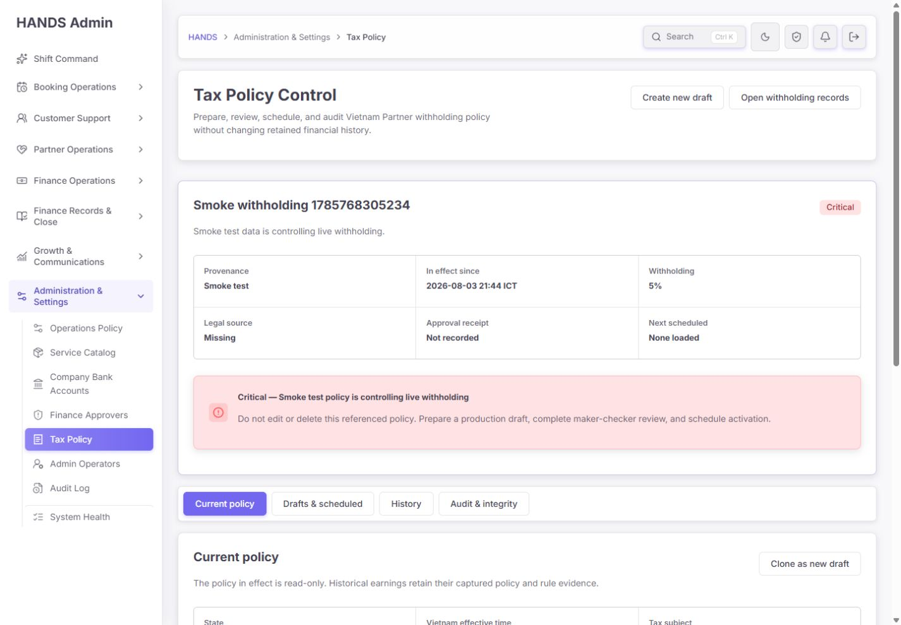
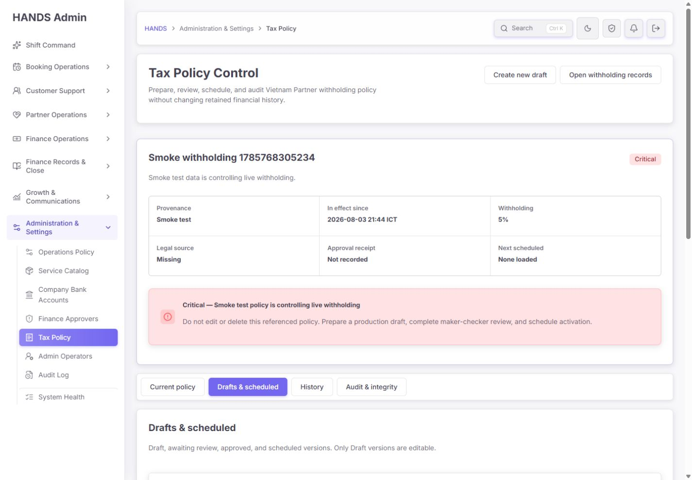
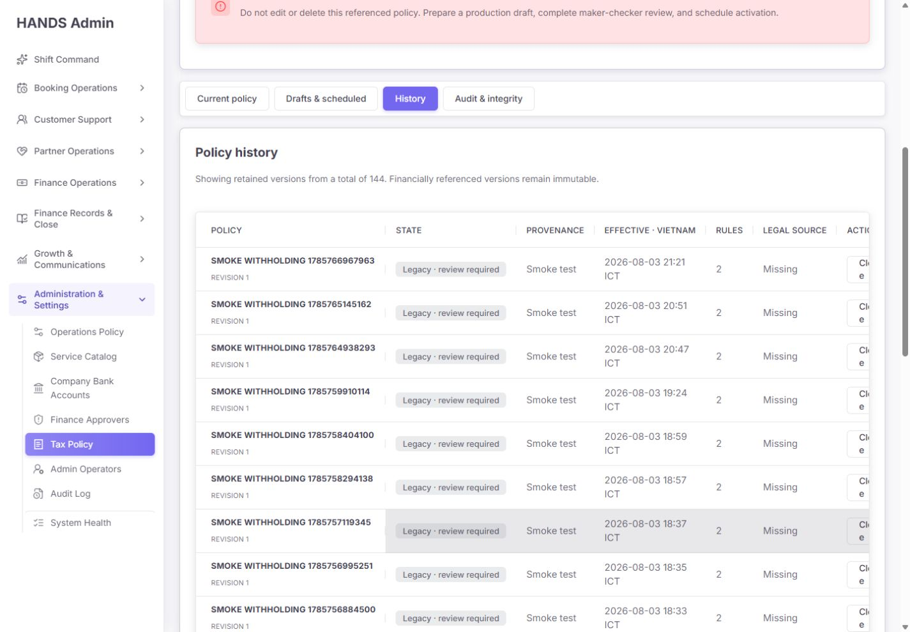
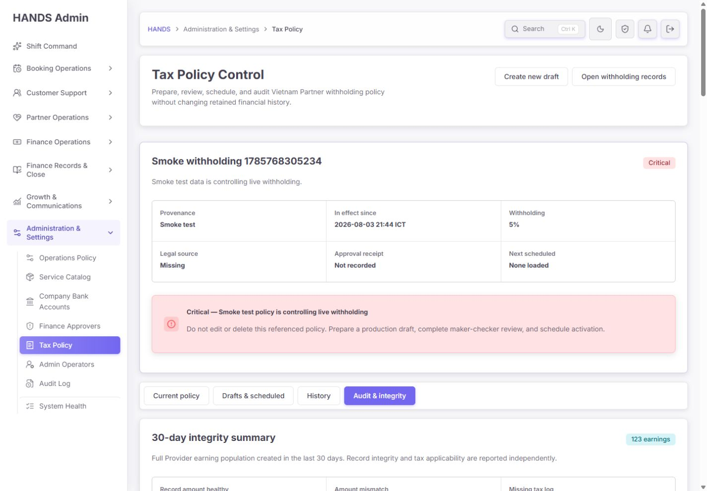
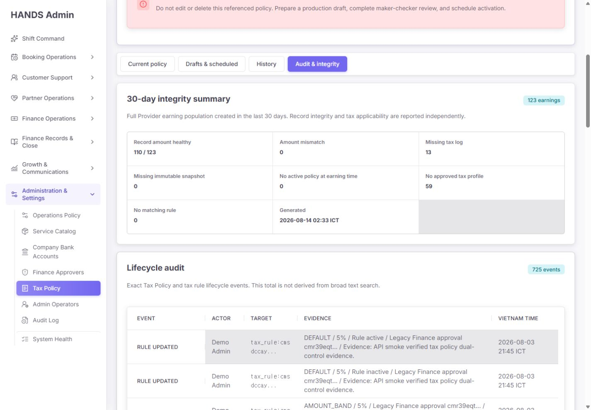
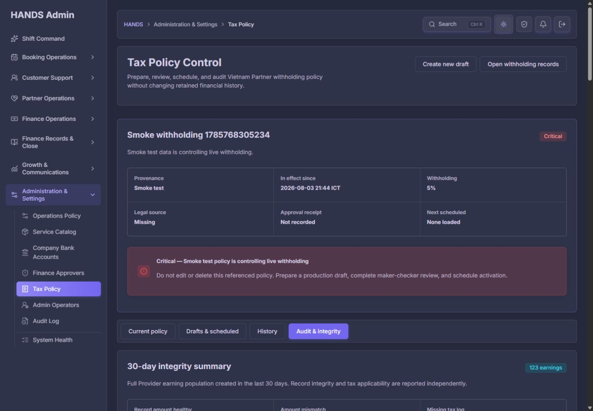
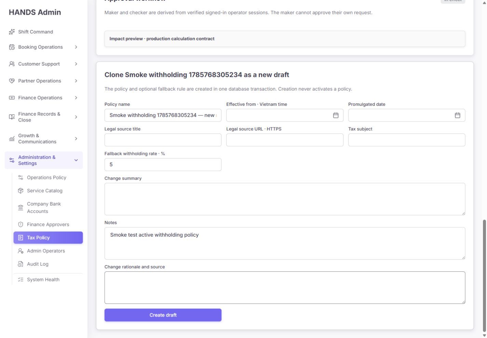

# Tax Policy authenticated final re-audit — 2026-08-14

## 1. Audit scope and decision

- Target: `http://localhost:3101/tax-policy`
- Audited views: Current policy, Drafts & scheduled, Create/clone draft, History, Audit & integrity, dark theme
- Viewport: **1440 × 1000 only**. No viewport at or below 1024px was inspected or scored.
- Evidence: 10 screenshots captured during this audit from the authenticated Admin session
- Code reviewed: Admin page/model/actions/CSS, API policy lifecycle, approval access, audit/integrity queries, calculation selection, Prisma policy/approval models, existing remediation report
- Mutations: none. No draft, rule, approval, activation, database record, or environment setting was changed.
- Verdict: **Release hold**
- Score: **63/100** (previous audit: 29/100)

The remediation is substantial and technically meaningful. The page is no longer a direct editor for the live policy, the lifecycle and maker-checker records are durable, scheduled activation is transactional, exact audit totals are visible, Vietnam time is explicit, and the four-view workspace is materially easier to understand.

It is still not safe to release as the operational authority for withholding. The live policy is a `SMOKE_TEST` record, all 145 retained policies in the local database are smoke records, the actor/readiness predicate called “verified” does not verify several account-security conditions, and important form/approval states can be hidden or lost by URL and redirect behavior.

## 2. Scorecard

| Area | Score | Assessment |
| --- | ---: | --- |
| Information architecture and visual hierarchy | 78/100 | Four views and read-only current policy are good; the repeated command strip consumes most of the first viewport in every view. |
| Operator usability | 66/100 | Core nouns and lifecycle are clearer; clone anchors, redirect context, field errors, and approval receipt loading remain weak. |
| Data truth and operational evidence | 44/100 | Exact totals and integrity dimensions are honest, but the dataset is overwhelmingly test evidence and exceptions are not actionable. |
| Finance/legal control | 58/100 | Immutable versions, approval request records and activation transaction are strong; the currently applied policy has no production provenance, legal source, or approval receipt. |
| Identity and authorization assurance | 38/100 | Category/role gates exist, but “verified” means only production provenance plus the existence of a credential record. |
| Accessibility at 1440px | 69/100 | Semantic navigation, visible labels and table headers are present; focus movement and field-error association are incomplete. |
| Test and implementation contract | 72/100 | Focused tests pass, but the browser failures and security-readiness edge cases found here are not covered. |

## 3. Previous audit remediation status

### P0 items

| Previous item | Status | Re-audit result |
| --- | --- | --- |
| Future ACTIVE could remove current policy early | Resolved | Future replacements use APPROVED/SCHEDULED and the activation path switches atomically at the effective instant. |
| Separate approver was only operator-entered text | Partial | Maker/checker are now authenticated users with durable requests, but the identity assurance behind “verified” remains incomplete. |
| ACTIVE/history could be edited in place | Resolved | Only DRAFT metadata/rules are mutable; current and historical policies are read-only. |
| Smoke data polluted live policy/history | **Unresolved** | The live policy is still `SMOKE_TEST`; dry-run inventory shows 145/145 policies are smoke provenance. |
| Create policy/default rule/audit was non-atomic | Resolved | Draft, optional default rule and audit row are created in one transaction. |
| Mutation failure looked like success | Partial | API errors now become explicit notices, but validation/API redirects lose the working view and entered values. |
| Audit UI showed 0 instead of 725 | Resolved | The UI now reports the exact 725-event lifecycle total with pagination. |
| Vietnam time could drift through browser/server TZ | Resolved | The page labels and parses Vietnam time explicitly. |
| Permission boundaries disagreed | Partial | `FINANCE_TAX` is consistently used, but account readiness is weaker than the wording and risk level require. |
| One ACTIVE had no DB/concurrency protection | Resolved | Partial unique indexes, advisory locking and serialized activation protect the invariant. |

Result: **6 resolved, 3 partially resolved, 1 unresolved**. The implementation report’s claim that the remaining tax-policy-specific gap was only authenticated browser QA is not supported by this re-audit.

### P1 items

| Previous item | Status | Re-audit result |
| --- | --- | --- |
| Partial list described as full history | Resolved | History shows 144 total, 25 per page and six pages. |
| Sample-based readiness | Resolved | Integrity summary is server-computed over the full 30-day population. |
| `Aligned` mixed amount integrity with applicability | Resolved | Record integrity and tax applicability are separate. |
| Preview was too weak | Partial | It uses the production calculator, but only for a persisted policy—not unsaved clone/form changes. |
| Very long page and nested vertical scroll | Partial | Nested vertical scrolling is gone; repeated command content still pushes each view’s real work below the first viewport. |
| Wrong editor/create anchor | **Not resolved** | `#create-tax-policy` remains at `scrollY=0` with focus on `BODY`; the target is about 2,084px below the viewport. |
| Repetitive rule forms | Partial | Disclosures reduce noise, but the draft editor is still form-heavy and not primarily a rule diff workflow. |
| Legal source and approval evidence were unstructured | Resolved | Legal title, URL, promulgated date, tax subject, change summary and approval receipt are distinct fields/records. |
| Operator copy was unclear | Partial | Most lifecycle copy improved, but `Provider` remains in a Partner-facing description and clone/edit labels are misleading. |
| Empty/error/stale states were conflated | Partial | Unavailable states are honest; form errors still lose context and values. |
| No diff/impact/confirmation before high-risk change | Partial | A saved-policy simulator exists; unsaved diff, coverage matrix and final activation confirmation remain absent. |
| Accessibility/focus was weak | Partial | Semantic controls improved; anchor focus and field-error linkage remain incomplete. |

## 4. Screen-by-screen evidence

### Step 1 — Current policy: **Critical data, otherwise good structure**

What is good:

- The live version is read-only and rules are presented as retained evidence.
- Provenance, effective time, rate, legal source, approval receipt and next activation are exposed above the fold.
- The red warning does not disguise a fixture policy as healthy.
- The operator is told not to edit/delete a referenced policy and to use a governed replacement.

What is still wrong:

- `Smoke withholding 1785768305234` is controlling live withholding at 5%.
- `Legal source` is Missing and `Approval receipt` is Not recorded.
- The primary action says `Clone as new draft`, while the warning says to prepare a production draft. Cloning a smoke source preloads smoke name/notes/rate and creates an avoidable contamination path.
- `Next scheduled: None loaded` is not a trustworthy global statement. The Current load plan requests only the first 25 records from the mixed drafts/pending/approved/scheduled view, ordered newest effective time first, and derives “next” client-side. With more than 25 workspace records it can omit the earliest scheduled activation.

Required change:

1. Replace the active smoke policy through a real production draft, legal evidence, independent approval and scheduled activation. Do not delete the referenced smoke version.
2. Replace `Clone as new draft` for non-operator sources with `Prepare clean production draft`; clear smoke name/notes and require an explicit source-review attestation.
3. Load next activation from a dedicated server query: `lifecycleStatus=SCHEDULED`, `effectiveFrom >= now`, ascending, `take=1`.

### Step 2 — Drafts & scheduled: **Good model, inefficient first viewport**

What is good:

- Draft, pending, approved and scheduled states share one operational queue.
- The empty state says exactly what is absent.
- Only draft versions are described as editable.

What is still wrong:

- The full six-fact live-policy command strip and critical alert repeat in every view. At 1440×1000 the selected view’s actual queue begins near/below the fold.
- Independent approver readiness is only shown after a policy is selected, so an operator can start a long draft flow before learning that submission is blocked.
- Policy pagination and approval-request pagination share the same `page/skip`, even though they are independent collections. A selected policy can therefore load without its actual pending request/receipt and falsely look ready for another submission.

Required change:

1. Keep the expanded command strip only on Current. Use a compact one-line risk banner on Drafts, History and Integrity.
2. Show a small readiness gate at the Drafts header before creation: `2 verified approvers ready` or `Blocked` with a link to Finance Approvers.
3. When a policy is selected, query approval requests by `policyVersionId=<selected id>` with independent pagination. Never infer the policy’s approval state from the general queue page.

### Step 3 — Create draft form: **Substantively improved, error recovery incomplete**

What is good:

- Required governance fields now exist: effective time in Vietnam, promulgated date, legal source title/HTTPS URL, tax subject, change summary and operator rationale.
- Creation explicitly stays DRAFT and draft/default rule/audit are atomic.
- Percent precision and 0–100 bounds are validated server-side.

What is still wrong:

- Required fields are not visually distinguished with a consistent required marker or concise field help.
- Controls have no `aria-describedby` links for helper/error messages.
- Validation and API failures redirect to the default Current view. Entered values are discarded and focus is not moved to the failing field.
- Success redirects also drop `view=drafts` and the draft editor anchor, so the operator loses task context immediately after create/save/rule/approval actions.

Required change:

1. Keep mutation results inside the Drafts workspace: `/tax-policy?view=drafts&policyId=...#tax-policy-...`.
2. Use a stateful form action/result so values survive 400/409/422/500/timeout failures.
3. Render field-level messages, connect them with `aria-describedby`, focus the first invalid field and retain a top error summary.
4. On successful create, return the created policy ID and open that exact draft.

### Step 4 — History summary: **Correct total, poor signal-to-noise**

What is good:

- Total and pagination truth are now explicit: 144 retained versions, 25 on the page, six pages.
- Lifecycle, provenance, effective time, rule count and legal source are distinct columns.

What is still wrong:

- The visible history is entirely smoke/legacy-review content. There is no default production-only view, provenance filter control, or explanation that the operational history has no production record.
- Every row offers `Clone`, including smoke and legacy-review policies. That action is too prominent and unsafe for evidence that should usually be inspected, not reused.
- There is no search by policy name/ID, legal source, effective date or actor.

Required change:

1. Default to `Production history`; expose `Test/legacy evidence (144)` as a separate filter.
2. Replace row `Clone` with `Inspect`. Offer `Prepare clean draft` only inside the detail view after a source warning.
3. Add provenance, lifecycle and date filters plus policy/ID/legal-source search.

### Step 5 — History table: **1440px layout failure**

Measured at 1440px:

- table viewport width: about 1,050px
- table scroll width: about 1,130px
- horizontal overflow: about 80px
- the Action column and Clone controls are visibly clipped until horizontal scroll

This is in the user’s supported desktop range, so it is not a responsive/mobile issue. The CSS forces a 980px minimum table plus 190px first column and 116px last column while seven content-heavy columns auto-size.

Required change:

- Use five operator-oriented columns: `Policy/source`, `Lifecycle/effective`, `Rule coverage`, `Legal/approval readiness`, `Open`.
- Move revision and provenance under the policy name; move time under lifecycle; replace the full-width Clone button with one `Open` action.
- At 1440px there must be no horizontal scrolling for this primary history table.

### Step 6 — Integrity summary: **Truthful dimensions, non-actionable exceptions**

Actual 30-day screen values:

| Metric | Count |
| --- | ---: |
| Earnings | 123 |
| Record amount healthy | 110/123 |
| Amount mismatch | 0 |
| Missing tax log | **13** |
| Missing immutable snapshot | 0 |
| No active policy at earning time | 0 |
| No approved tax profile | **59** |
| No matching rule | 0 |

What is good:

- Full-population integrity and bounded evidence sample are correctly separated.
- Amount integrity and tax applicability are separate dimensions and may overlap.
- Unavailable is not rendered as zero.

What is still wrong:

- `13 missing tax log` and `59 no approved tax profile` use the same neutral fact treatment as zero/healthy values.
- There is no percentage, threshold, ownership, oldest age or direct action.
- The description says `Full Provider earning population`; Admin visible copy should use `Partner`.

Required change:

1. Make each non-zero exception an actionable queue card: count, rate, oldest age, owner/SLA and `Open records`.
2. Give missing logs a danger/warning treatment and explain whether the 13 records are pre-policy legacy, migration debt or a current pipeline failure.
3. Give missing approved profiles a distinct applicability warning and state that it does not necessarily mean amount corruption.
4. Change `Provider` to `Partner` in user-facing copy.

### Step 7 — Lifecycle audit: **Exact total, weak investigation workflow**

What is good:

- The total is exact: 725 lifecycle events.
- Actor, action, target and evidence are visible.
- Pagination no longer represents the first page as the whole audit.

What is still wrong:

- The visible rows are Demo Admin/API smoke evidence, so the exact total is technically true but not operationally useful.
- There are no filters for action, actor, provenance/source, policy ID or date.
- Evidence is dense inline text; there is no focused event drawer, copy ID, linked policy or export.

Required change:

- Default to operator/production evidence and show test evidence separately.
- Add action/actor/source/date filters and exact policy deep links.
- Use an event-detail drawer with immutable IDs, before/after values, payload hash, approval request, activation attempt and copy/export actions.

### Step 8 — Dark theme: **Usable, not fully verified**

- Layout and primary text remain readable.
- Muted text and alert surfaces appear low-emphasis in places, but no automated contrast measurement was run; this audit does not claim WCAG conformance.
- The theme was restored to light after inspection.

Required change:

- Run automated and manual contrast checks for muted copy, border-only cards, warning/danger notices, disabled buttons and focus rings before release.

### Step 9 — Clone navigation: **Failed**

After selecting `Clone as new draft`:

- URL contains `#create-tax-policy`.
- `window.scrollY` remains `0`.
- focus remains on `BODY`.
- the target section starts about 2,084px below the viewport.

The link changes URL state but does not complete the operator’s intended navigation.

Required change:

- On client navigation, wait until the async server-rendered target exists, then call `scrollIntoView({ block: 'start' })` and move focus to the section heading.
- Add a browser test that clicks both Create and Clone from the top and asserts target visibility and focus at 1440×1000.

### Step 10 — Clone form and simulation: **Honest missing evidence, misleading context**

What is good:

- Missing legal source and tax subject are not invented.
- The clone stays a DRAFT and the source policy ID is retained as supersession lineage.

What is still wrong:

- A non-draft selected source is headed `Editing <policy>`, even though it is immutable. Use `Source policy` or `Reviewing source`.
- The smoke name, notes and fallback rate are prefilled. A production actor can create an OPERATOR-provenance draft from those values because new provenance is derived from the actor, while inherited source provenance is not surfaced in the draft label.
- `Impact preview · production calculation contract` simulates the selected persisted policy ID. It does not simulate unsaved values in the clone form. Operators can reasonably believe they are previewing the form they are editing when they are not.

Required change:

1. Surface two dimensions: `Created by: Production operator` and `Source lineage: Smoke test policy`.
2. For non-production sources, clear free-text/rate defaults or require explicit field-by-field confirmation before copying.
3. Rename the current simulator to `Saved policy preview` until it consumes the unsaved draft model.
4. Preferred end state: a client draft model drives rule diff, coverage matrix and preview before save; the server recalculates the same request before approval.

## 5. Release blockers

### P0-1. Replace the live smoke policy safely

Read-only cleanup result:

- total policies: 145
- `SMOKE_TEST`: 145
- ACTIVE: 1
- INACTIVE/legacy: 144
- active smoke references: 5 tax logs and 5 booking settlement snapshots
- recommended disposition: `CRITICAL / RETAIN_AND_MANUAL_REVIEW`

Do not mutate or delete the active record. The release procedure must create a clean production policy, attach the authoritative Vietnamese legal/accounting basis, obtain a real independent approval, schedule it, verify the atomic switch, and retain the smoke version for historical references.

### P0-2. Strengthen the “verified operator/approver” trust boundary

`requireTaxPolicyOperatorAccess()` currently treats a writer as verified when:

1. `adminUserProvenance === PRODUCTION`
2. an `adminOperatorCredential` row exists

It does not check setup completion, disabled state, lock state, MFA verification, attestation freshness or current session assurance. The Finance Approver readiness query uses the same weak credential-exists predicate. Therefore the UI/server can describe an account as a verified independent approver when its credential is incomplete, disabled, locked or not MFA-verified.

Required server predicate for tax-policy request/decision:

- production provenance
- ADMIN + required finance role
- `FINANCE_TAX` category
- setup completed
- credential present and not disabled
- not locked at decision time
- MFA configured and verified for the session
- required legal/security attestation current
- recent re-authentication for approval/activation
- different immutable maker/checker user IDs

Expose capabilities from the API (`canSubmit`, `canDecide`, blocker codes) and render from those capabilities. Do not infer high-risk capability from `currentOperatorRoles.includes('FINANCE_APPROVER')` in the page.

### P0-3. Stop fixture writes to the shared operational database

Explicit provenance is useful detection, not isolation. Fixture actors are still allowed to create `SMOKE_TEST` drafts, and all 145 stored policies prove the shared database has already accumulated test evidence.

Required control:

- smoke/e2e must require a disposable database identifier before first write
- reject fixture tax-policy writes when the database is marked operational/shared
- run tests in transaction rollback or ephemeral schema/database
- display a persistent `Test environment / Fixture identity` banner when applicable
- keep the cleanup command dry-run by default; remediation of referenced rows must remain a reviewed operation

## 6. P1 operational corrections

1. Fix success/error redirects and preserve field state.
2. Query approval receipts by selected policy ID, not by unrelated queue page.
3. Load the actual nearest scheduled activation with a dedicated ordered query.
4. Fix Create/Clone scroll and focus.
5. Make integrity exceptions actionable queues with severity, rate, age, owner and filtered drill-down.
6. Separate production history/audit from test/legacy evidence by default.
7. Remove horizontal scrolling from the 1440px history table.
8. Replace `Editing` for immutable sources and `Provider` with `Partner` in visible copy.
9. Make simulation state explicit and eventually preview unsaved draft changes.
10. Compact the repeated command strip outside Current so the active workspace begins in the first viewport.
11. Add policy search and provenance/lifecycle/date filters.
12. Add a policy/event evidence drawer with immutable IDs and copy/export actions.

## 7. Suggested operator-oriented target layout

### Current

- One production-readiness header: Active policy, legal source, approved by, effective since, health
- Rules table and representative calculation
- Next scheduled activation from a dedicated query
- Primary action: `Prepare replacement draft`

### Drafts & scheduled

- Compact live-risk banner
- Approver readiness gate
- Work queue grouped by `Needs author`, `Awaiting checker`, `Approved`, `Scheduled`
- Selected draft workspace: metadata → rule diff → coverage → impact → submit/review receipt

### History

- Production history by default
- Test/legacy evidence as an explicit secondary filter
- Five-column table that fits 1440px
- Inspect-first detail; guarded clean-draft action

### Audit & integrity

- Actionable exception cards
- Filtered lifecycle events
- Evidence drawer/export
- Bounded settlement sample clearly below the full-population summary

No additional top-level page is needed. The four URL-addressable views are the right information architecture once their states and queries are corrected.

## 8. Verification performed

### Passed

- Authenticated visual inspection at 1440×1000 for all four views
- Create and clone navigation inspection
- Form required/min/max/type attributes inspection
- DOM measurement of history overflow and clone anchor position
- Light and dark theme inspection
- Admin Tax Policy focused tests: **29/29 passed** across 7 files
- API provider-onboarding/tax withholding focused tests: **25/25 passed** across 2 files
- Read-only fixture cleanup inspection: 145 records, no writes

### Not performed / limits

- No mutation was submitted, so a real two-account create → submit → approve → activate journey was not executed.
- No production database or deployment was touched.
- No automated WCAG contrast scan or keyboard-only full flow was run.
- No viewport at or below 1024px was inspected.
- Focused passing tests do not cover the new findings: account readiness fields, selected-policy approval receipt loading, form-state retention, clone hash focus, nearest-scheduled query, or 1440px table fit.

## 9. Release gate

Do not change this page to release-ready until all of the following are demonstrated:

1. The active policy is OPERATOR/production provenance with complete legal source and immutable approval receipt.
2. No fixture/smoke actor can write to the shared operational database.
3. Request and decision require a fully active, unlocked, setup-complete, MFA-verified production operator session.
4. A selected policy always loads its exact pending/decided approval request.
5. The nearest scheduled activation is exact regardless of queue size.
6. Failed mutations preserve values, workspace, selected policy and first-error focus.
7. Create/Clone links scroll and focus the intended section.
8. History fits at 1440px without horizontal scroll.
9. Non-zero integrity exceptions open filtered evidence queues.
10. A two-real-account browser test proves maker ≠ checker, scheduling, atomic activation and immutable retained history.

## 10. Final assessment

The redesign is no longer a superficial policy editor; it is becoming a credible governed workspace. That is a major improvement. The remaining work is concentrated and understandable, but it sits at the highest-risk boundary: the policy currently controlling money, who is trusted to approve it, and whether the UI tells the truth about task state.

The recommended decision is **Release hold at 63/100**. Complete the three P0 controls first, then the P1 workflow truth/layout corrections, and repeat an authenticated two-operator end-to-end audit before release.
