# Tax Policy 서브뷰 최종 재감사 보고서

- 감사일: 2026-08-14
- 대상: `view=drafts`, `view=history`, `view=integrity`
- 기준 보고서: `tax-policy-final-reaudit-2026-08-14.md`
- 기준 구현 프롬프트: `tax-policy-final-remediation-codex-prompt-2026-08-14.md`
- 검증 화면: **1440 × 1000**
- 검증 범위: 로그인된 실제 화면, 문구, 링크·앵커·포커스, 폼 기본 검증, 테이블 실측, 다크 테마, Admin Web load/action 계약, Admin API 조회·권한 계약, 현재 DB read-only inventory, focused tests
- 제외: 1024px 이하 화면은 캡처·검사·점수에 포함하지 않음
- 데이터 변경: 없음. 정책 생성·수정·제출·승인·거부·활성화·삭제를 실행하지 않음
- 최종 판정: **RELEASE HOLD**
- 전체 Tax Policy 점수: **63 / 100 — 이전 감사와 변화 없음**

## 1. 결론

이번 세 서브뷰는 이전 감사 이후 실질적으로 개선되지 않았다. 현재 저장소와 로그인된 production build에서 이전 보고서의 핵심 결함이 동일하게 재현됐다.

특히 다음 여섯 항목은 화면과 코드에서 모두 미반영으로 확인됐다.

1. Drafts·History·Integrity마다 현재 정책의 큰 6칸 command strip과 critical 경고가 반복된다.
2. History는 production/test 구분과 검색·필터가 없고, 1440px에서 약 80px 가로 넘침이 발생한다.
3. History의 `Clone`은 smoke/legacy 값을 production draft로 쉽게 복제하며, 이동 후 `#create-tax-policy`가 화면에 보이지 않는다.
4. Draft 폼 오류는 입력 보존·field error·`aria-describedby`가 없고 action redirect가 작업 문맥을 잃는다.
5. Integrity의 `Missing tax log 13`, `No approved tax profile 59`는 행동 경로가 없는 중립 숫자다.
6. Lifecycle audit 725건은 exact total이지만 production/test 분리, 검색·필터, row detail, exact policy link가 없다.

Tax Policy 관련 주요 네 파일의 최종 수정 시각도 2026-08-12이며, 2026-08-14 개선 프롬프트의 요구사항을 구현한 새 Tax Policy implementation report는 발견되지 않았다. 따라서 이번 판정은 “개선했지만 일부가 부족함”보다는 **“8월 14일 2차 개선 요구가 현재 작업트리·현재 빌드에는 반영되지 않음”**에 가깝다.

다만 기존의 좋은 기반은 유지됐다. ACTIVE/history immutable, DRAFT-only editing, durable approval request, maker/checker self-approval 방지, serialized activation, exact audit total, Vietnam time parsing, unavailable/zero 구분, atomic draft/default-rule create는 그대로다. 이 기반을 버리고 재작성할 필요는 없다.

### 기술 감사 Health Score

| # | 영역 | 점수 | 핵심 판단 |
|---|---|---:|---|
| 1 | Accessibility | 2 / 4 | landmark·heading·label·table header는 양호하지만 anchor focus, required/error association, recovery focus가 미완성 |
| 2 | Performance | 3 / 4 | view별 request를 병렬·bounded load하고 무거운 client effect가 없으나 field latency/bundle budget은 미측정 |
| 3 | Supported desktop layout | 1 / 4 | 1440 History primary table overflow와 action 파손; 1024 이하 화면은 점수에서 제외 |
| 4 | Theming | 3 / 4 | token과 dark mode가 유지되나 muted/border contrast와 issue severity 표현은 미검증 |
| 5 | Implementation integrity | 1 / 4 | UI 문구, 실제 query, data provenance, approval readiness가 같은 truth를 사용하지 않음 |
| **합계** |  | **10 / 20** | **Acceptable — significant work needed** |

Impeccable detector는 전역 CSS에서 side-accent 6건을 경고했다. selector를 직접 대조한 결과 Vietnam map, Service Catalog, dispatch, generic timeline, Operations check, Booking finance card에 속하며 이번 Tax Policy 화면에는 적용되지 않는다. 따라서 false positive/범위 밖으로 분류했고 Tax Policy 결함 수에는 포함하지 않았다.

검증된 issue severity는 **P0 3건 / P1 10건 / P2 5건 / P3 0건**으로 정리했다. P3 장식성 개선은 출시 판단에 도움이 되지 않아 의도적으로 추가하지 않았다.

## 2. 이전 개선 요구사항 재대조

| 요구사항 | 상태 | 이번 재감사 증거 |
|---|---|---|
| non-current view의 compact current-policy banner | 미반영 | 세 뷰 모두 큰 command strip과 긴 critical alert 반복 |
| Drafts header의 independent approver readiness | 미반영 | 선택 정책이 없으면 readiness·blocker·Finance Approvers CTA 없음 |
| selected policy의 exact approval request 조회 | 미반영 | general request page를 policy list와 같은 `page/skip`으로 조회 후 client filter |
| nearest scheduled 전용 조회 | 미반영 | mixed workspace 첫 page에서 client-side 산출 |
| mutation 후 `view=drafts`·policy·anchor 유지 | 미반영 | action 성공/실패 모두 기본 `/tax-policy?...` redirect |
| validation/API 실패 입력값 보존 | 미반영 | URL notice만 남기며 form state를 보존하지 않음 |
| field error + `aria-describedby` + first-invalid focus | 미반영 | native validation만 있고 helper/error association 없음 |
| Create/Clone 실제 scroll + focus | 부분 | 같은 Drafts 내 Create는 보이게 scroll되지만 focus는 `BODY`; History Clone은 scroll·focus 모두 실패 |
| non-production source의 clean draft workflow | 미반영 | smoke name, notes, 5%를 그대로 prefill |
| immutable source의 truthful heading | 미반영 | `Editing Smoke withholding ...` 유지 |
| saved-only preview의 truthful copy | 미반영 | `Impact preview · production calculation contract` 유지 |
| History production/test 분리와 filters/search | 미반영 | 144 smoke/legacy row가 기본 history 전체 |
| History 5열·1440 no-overflow | 미반영 | 7열, 약 80px overflow, Action 버튼 세로 파손 |
| Integrity exception action queue | 미반영 | count만 있고 rate/age/owner/SLA/Open records 없음 |
| Lifecycle audit investigation filters/detail | 미반영 | page links 외 input/button 없음 |
| visible `Provider` → `Partner` | 미반영 | `Full Provider earning population` 유지 |
| Tax Policy/Finance Approver 공통 readiness predicate | 미반영 | 별도 credential-exists 계열 predicate 유지 |
| active smoke의 governed production replacement | 운영 차단 | 145/145 smoke, ACTIVE 1건도 smoke이며 legal/approval evidence 없음 |

결과: **완료 0, 부분 1, 미반영 16, 운영 차단 1**. 기존 1차 리팩터링의 장점은 유지됐지만 2차 프롬프트 완료 조건은 충족되지 않았다.

## 3. 화면 단계별 감사

### Step 1. Drafts & scheduled 첫 화면 — 상태: Needs major revision

좋은 점:

- `Drafts & scheduled`라는 queue 명칭과 DRAFT-only editable 설명은 정확하다.
- empty state는 draft/pending/approved/scheduled가 없음을 명확하게 말한다.
- Current/Drafts/History/Integrity의 위치와 active tab은 이해하기 쉽다.

문제:

- 1440×1000 첫 화면의 대부분이 현재 smoke 정책과 반복 경고에 사용된다.
- 실제 Drafts queue는 viewport 맨 아래에서 제목만 보이고, 운영자가 할 일은 바로 드러나지 않는다.
- empty queue인데도 `Create new draft`가 page header와 하단 create form에 중복된다.
- approver readiness, blocker, queue state별 count가 없어 정책을 작성한 뒤에야 제출 불가 사실을 알 수 있다.

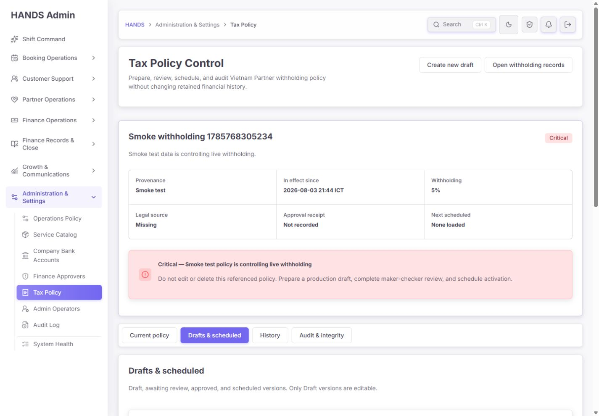

수정 기준:

1. expanded current-policy strip은 Current에만 둔다.
2. Drafts에는 `Active: Smoke test · Critical · Prepare governed replacement` 한 줄 banner만 남긴다.
3. 첫 viewport에 `Needs author / Awaiting checker / Approved / Scheduled` exact counts와 blocker를 표시한다.
4. queue가 완전히 비었을 때만 `Create production draft`를 primary action으로 강조한다.
5. `Open withholding records`는 Drafts 주 작업과 거리가 있으므로 overflow/supporting action으로 내린다.

### Step 2. Create policy draft — 상태: Structurally sound, recovery unsafe

좋은 점:

- effective time이 Vietnam time임을 표시한다.
- legal source title/HTTPS URL, promulgated date, tax subject, change summary, rationale가 분리돼 있다.
- create가 activation을 수행하지 않고 transaction으로 처리된다는 설명은 적절하다.

문제:

- required 여부가 label에서 빠르게 구분되지 않는다.
- field helper, example, error slot이 없고 `aria-describedby`는 모든 필수 control에서 `null`이었다.
- 빈 제출 시 browser native validation은 첫 `name`에 focus하지만 한국어 browser message만 나오며, Admin의 일관된 오류 설명은 없다.
- server validation/API error는 form 값을 보존하지 않고 Current view로 redirect할 수 있다.
- `Change rationale and source`는 change summary·legal source와 역할이 겹친다. 승인 증거인지 출처 설명인지 이름이 모호하다.
- submit CTA 폭이 한 column만 차지해 form 전체의 final action보다 임의의 grid item처럼 보인다.

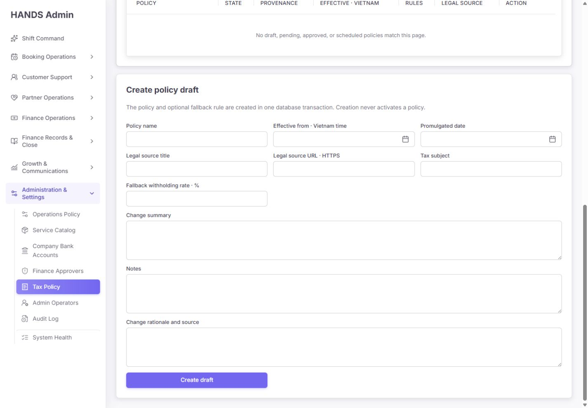

수정 기준:

1. 필수 label에 `Required` 또는 일관된 `*`와 legend를 제공한다.
2. `Legal source URL`, `Tax subject`, `Change summary`, `Approval rationale`에 짧은 helper를 제공한다.
3. `useActionState` 또는 기존 shared form-state 패턴으로 entered value와 exact error를 보존한다.
4. top error summary와 field error를 함께 표시하고 first invalid field에 focus한다.
5. 성공 시 생성된 ID로 `/tax-policy?view=drafts&policyId=<id>#tax-policy-<id>`에 복귀한다.
6. CTA 문구를 `Save production draft`로 바꾸고 위험하지 않은 DRAFT 저장임을 보조 문구로 유지한다.

### Step 3. Create link의 같은-page 이동 — 상태: Partial

Drafts 화면이 이미 로드된 상태에서 `Create new draft`를 클릭한 결과:

- URL hash: `#create-tax-policy`
- `scrollY`: 약 1,007px
- target top: 약 181px
- target visible: true
- active element: `BODY`

즉 scroll은 되지만 focus는 이동하지 않는다. 키보드·screen reader 사용자는 task 전환을 인지하기 어렵다.

수정 기준:

- target heading에 programmatic focus target을 제공한다.
- `scrollIntoView` 뒤 heading focus를 수행한다.
- sticky tab 아래에 target이 가려지지 않도록 scroll margin을 사용한다.

### Step 4. History 첫 화면 — 상태: Misleading default

좋은 점:

- `144 total`, page별 25개, 총 6 pages가 정확하다.
- retained/immutable history라는 설명은 맞다.
- lifecycle, provenance, Vietnam effective time, legal source를 별도 데이터로 보여 준다.

문제:

- 기본 화면의 144건 모두 smoke/legacy evidence다.
- production history가 0이라는 중요한 사실을 직접 표시하지 않는다.
- provenance, lifecycle, date, policy/ID/legal-source 검색 control이 전혀 없다.
- 상단 반복 command strip 때문에 History의 제목·정체성도 첫 화면 아래로 밀린다.

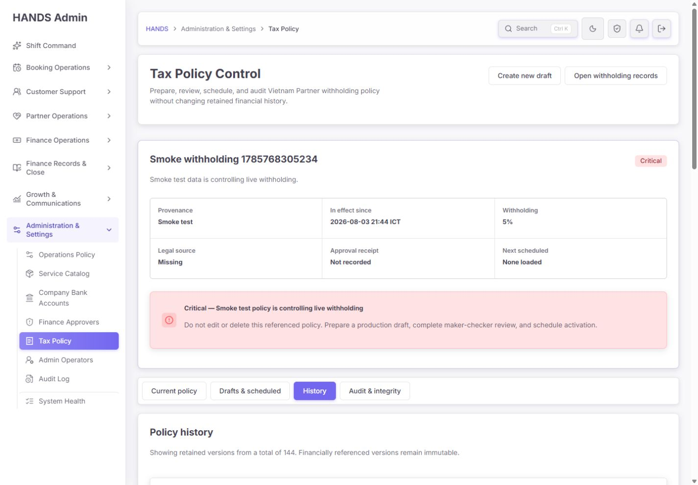

수정 기준:

1. default를 `Production history`로 두고 빈 상태에서 `No governed production policy history`를 표시한다.
2. `Test & legacy evidence (144)`를 별도 secondary filter로 둔다.
3. provenance, lifecycle, effective date range와 name/ID/legal-source search를 server-side로 처리한다.
4. filter·search·page를 URL과 total에 동일하게 반영한다.

### Step 5. History table — 상태: 1440 layout fail

1440px 실측:

- table region `clientWidth`: 약 1,050px
- table `scrollWidth`: 약 1,130px
- horizontal overflow: 약 80px
- Action column과 `Clone` button: 우측에서 잘리고 1~2글자 단위로 세로 줄바꿈

이 문제는 사용 범위 밖의 mobile/responsive 결함이 아니라 지원 대상인 1440 desktop의 primary table 실패다.

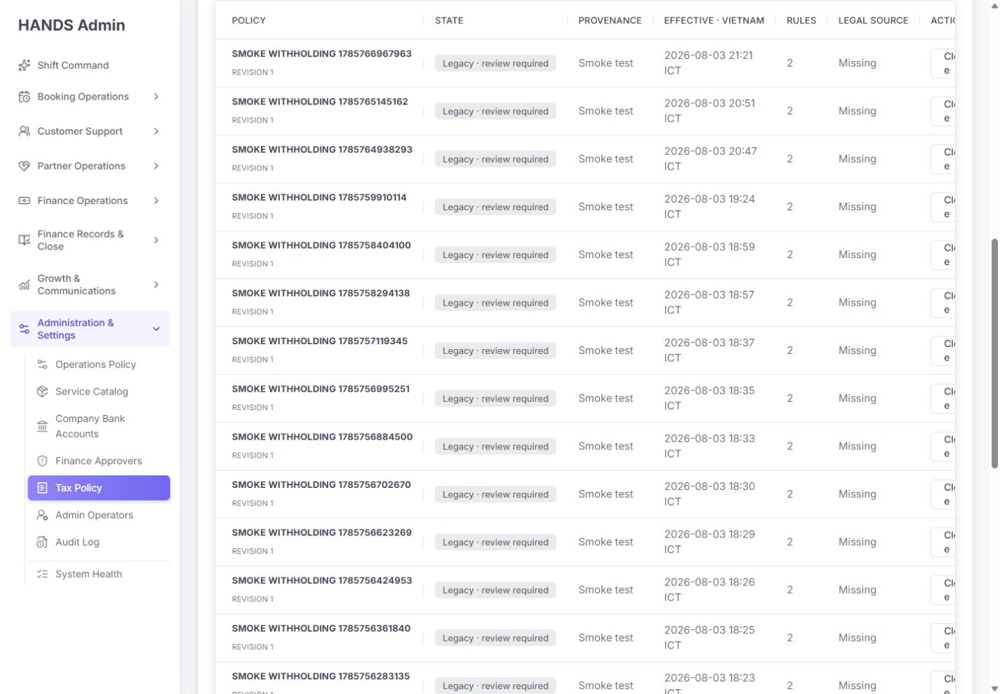

수정 기준:

| 권장 열 | 내용 |
|---|---|
| Policy / source | name, revision, provenance badge, short ID |
| Lifecycle / effective | state, Vietnam time |
| Rules | count와 coverage summary |
| Legal / approval | source readiness와 receipt state |
| Open | `Inspect` 한 개 |

- 기본 row action에서 `Clone`을 제거한다.
- 1440 content width에서 horizontal overflow가 0이어야 한다.
- CSS의 global Tax Policy 7열 min-width 보정 대신 view별 table class를 사용한다.

### Step 6. History Clone navigation — 상태: Failed

첫 History row의 `Clone`을 클릭한 결과:

- URL: `view=drafts&clonePolicyId=...#create-tax-policy`
- `scrollY`: 0
- create target top: 약 2,084px
- target visible: false
- active element: `BODY`

URL은 바뀌지만 사용자는 Drafts 상단에 그대로 남는다. `Clone`을 눌렀는데 form을 찾으려면 약 두 화면 이상 직접 내려가야 한다.

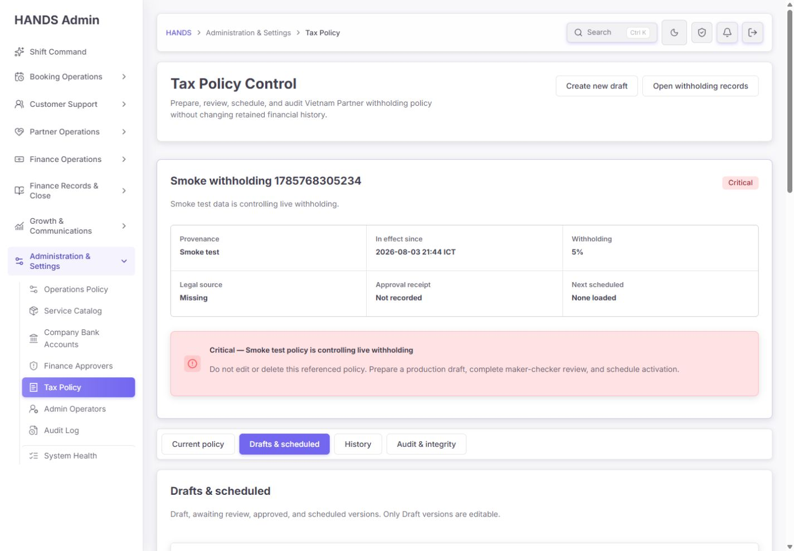

수정 기준:

- client navigation 후 target hydration/render 완료를 기다려 scroll/focus한다.
- 하지만 smoke/legacy history의 primary action은 애초에 `Clone`이 아니라 `Inspect`여야 한다.
- source detail에서만 `Prepare clean production draft`를 제공하고 별도 warning/attestation을 요구한다.

### Step 7. Smoke source clone form — 상태: Critical contamination path

현재 clone은 다음 값을 자동 복사한다.

- name: `Smoke withholding ... — new revision`
- fallback rate: `5`
- notes: `Smoke test active withholding policy`
- supersession lineage: source ID 유지
- legal source/tax subject/change summary/rationale: 비어 있음

lineage를 유지하는 점은 좋지만, 새 draft의 provenance는 production operator로 보일 수 있는 반면 실제 내용은 smoke source에서 복제된다. 운영자는 provenance label만 보고 production evidence로 오인할 수 있다.

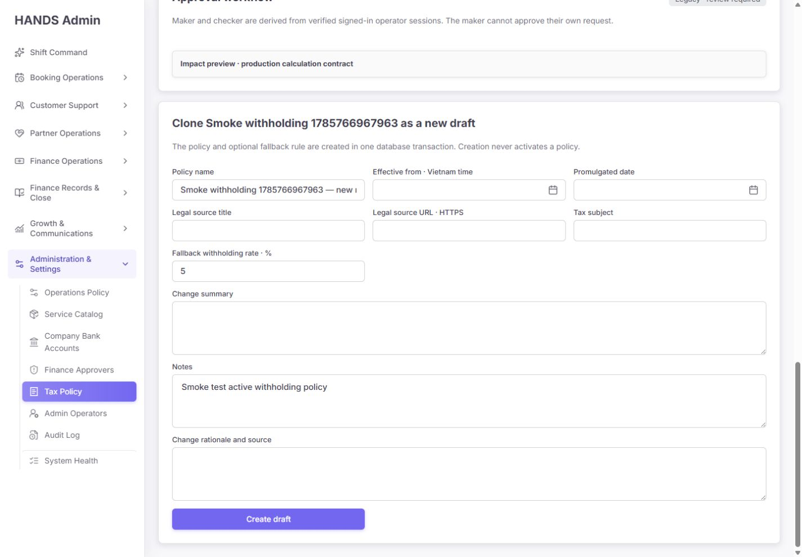

수정 기준:

1. non-OPERATOR source는 name, notes, rate를 기본 복사하지 않는다.
2. `Created by`와 `Source lineage`를 별도 badge/field로 표시한다.
3. `Clean source review completed` attestation 없이는 approval request를 거부한다.
4. source rules는 read-only comparison으로 보여 주되 새 draft에 반영할 값은 명시적으로 선택하게 한다.

### Step 8. Source detail와 preview 문구 — 상태: Misleading

- immutable legacy row인데 heading은 `Editing Smoke withholding ...`이다.
- 바로 아래에서는 `This version is immutable`이라고 하므로 같은 화면이 편집 가능/불가능을 동시에 말한다.
- `Impact preview · production calculation contract`는 selected persisted source를 계산한다. 아래의 unsaved clone form 값은 계산하지 않는다.
- approval workflow도 selected legacy source 문맥과 새 clone draft 문맥이 시각적으로 가까워 혼동된다.

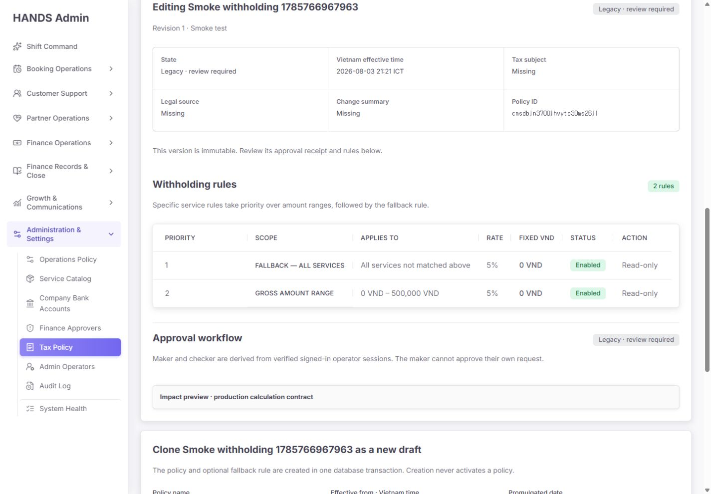

수정 기준:

- immutable source heading: `Review source policy`.
- current simulator heading: `Saved source policy preview`.
- unsaved 값 preview가 구현되기 전까지 form preview라고 암시하지 않는다.
- source evidence, new draft form, proposed impact를 3단계 flow로 분리한다.

### Step 9. Integrity 첫 화면과 summary — 상태: Honest but non-actionable

실제 30-day 값:

| 지표 | 값 | 운영 판단 |
|---|---:|---|
| Earnings | 123 | denominator |
| Record amount healthy | 110 / 123 | 89.4% |
| Amount mismatch | 0 | healthy |
| Missing tax log | **13** | 즉시 분류가 필요한 integrity exception |
| Missing immutable snapshot | 0 | healthy |
| No active policy at earning time | 0 | healthy |
| No approved tax profile | **59** | applicability/readiness exception |
| No matching rule | 0 | healthy |

좋은 점:

- full-population summary와 25-row evidence sample을 구분한다.
- amount integrity와 tax applicability를 분리한다.
- unavailable을 0으로 위장하지 않는다.

문제:

- 13과 59가 0과 같은 neutral fact cell이다.
- 비율, oldest age, 발생 구간, owner, SLA, `Open records`가 없다.
- `No approved tax profile`이 금액 corruption과 다르다는 설명이 card 안에 없다.
- visible copy에 `Provider`가 남아 있다.

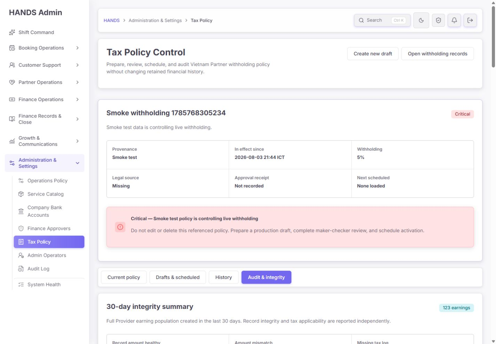

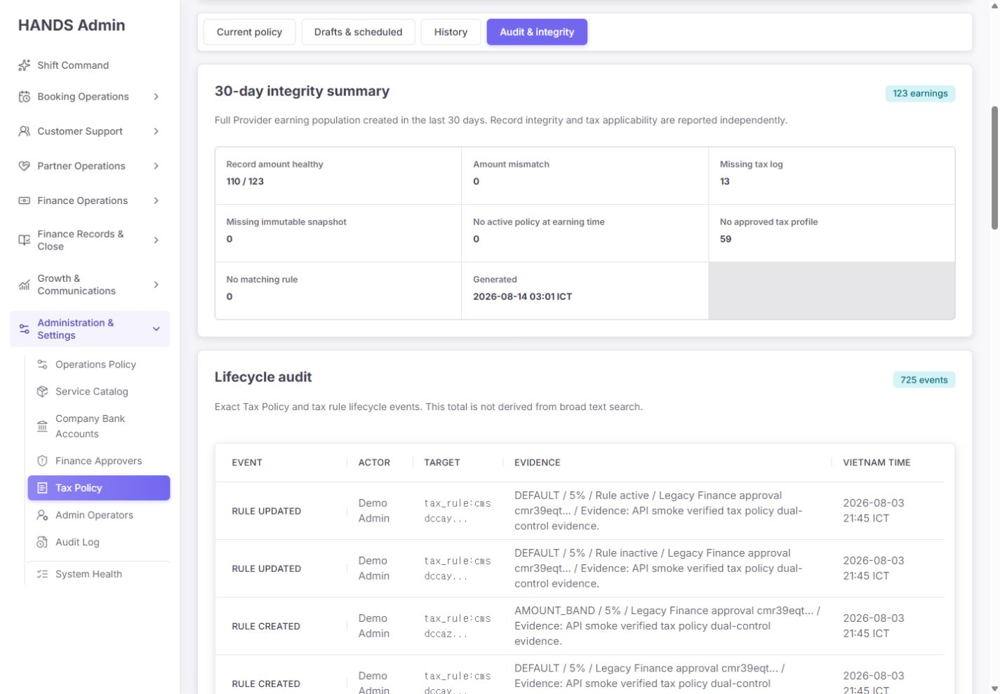

수정 기준:

1. non-zero issue는 `count / rate / oldest / owner / SLA / Open records`를 가진 actionable card로 바꾼다.
2. `Missing tax log`는 current regression, migration/legacy debt를 server-side로 구분한다.
3. `No approved tax profile`은 applicability warning으로 별도 설명한다.
4. issue link는 sample client filter가 아니라 exact server query를 연다.
5. `Full Partner earning population created in the last 30 days`로 교정한다.

### Step 10. Lifecycle audit — 상태: Exact count, poor investigation

좋은 점:

- 725 events라는 exact total과 25-row pagination은 정확하다.
- event, actor, target, evidence, Vietnam time의 핵심 evidence 필드를 제공한다.
- table은 1440에서 자체 가로 넘침이 없었다.

문제:

- 현재 상위 row는 모두 Demo Admin/API smoke lifecycle이다.
- section 안 interactive element는 pagination link뿐이다. input/select/button이 없다.
- action, actor, source/provenance, policy ID, date filter가 없다.
- target ID는 잘린 code text일 뿐 exact policy로 연결되지 않는다.
- dense evidence가 cell 본문에 반복돼 비교·복사가 어렵다.

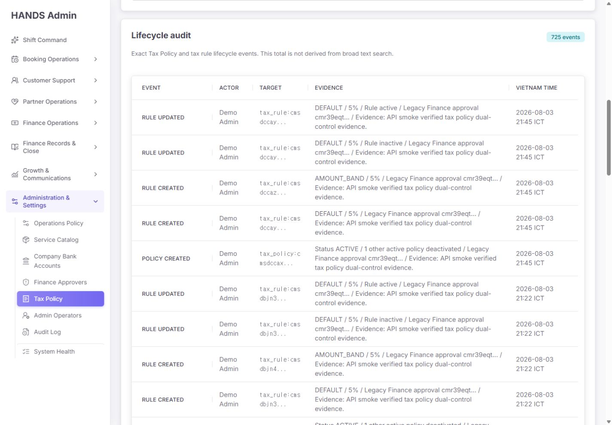

수정 기준:

- default: Production/operator events.
- secondary: Test/smoke/legacy events with exact count.
- action, actor, source, policy ID, date filters를 server pagination과 함께 구현한다.
- row click/detail drawer에 immutable IDs, before/after, payload hash, approval request, activation attempt/failure를 표시한다.
- exact policy link, copy ID, 현재 filter를 보존한 export를 제공한다.

### Step 11. Settlement evidence sample — 상태: Useful deep link, weak triage

좋은 점:

- 각 row의 `Evidence`는 실제 booking finance anchor로 연결된다.
- record integrity와 applicability를 badge로 분리한다.
- 1440에서 table 자체는 가로 넘침 없이 보인다.

문제:

- 25 examples만 있고 123개 population의 issue queue를 직접 탐색할 수 없다.
- booking ID가 너무 좁아 두 줄로 자주 깨진다.
- smoke partner와 실제 Partner-looking records가 같은 표에 섞여 source 구분이 어렵다.
- `No approved tax profile` row만 보기, missing tax log row만 보기, age/date sort가 없다.
- `Evidence`는 목적지가 무엇인지 약하다. `Open booking finance evidence`가 더 정확하다.

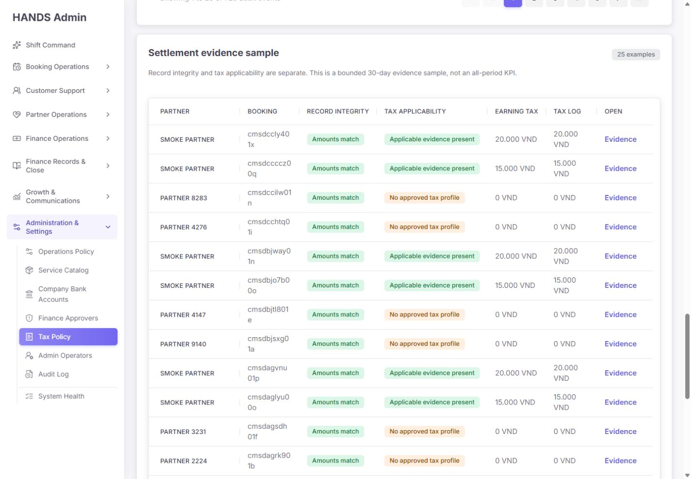

수정 기준:

- summary issue card에서 exact issue filter가 적용된 evidence list로 이동한다.
- source/provenance, issue, date, oldest-first filter를 제공한다.
- Partner/Booking을 한 cell로 합치고 action 폭을 확보한다.
- smoke/test row에 `TEST EVIDENCE` badge를 명시한다.

### Step 12. Dark theme — 상태: Usable, not certified

- 구조와 주요 heading은 읽을 수 있다.
- muted copy, grid borders, neutral cells의 대비는 낮아 보인다.
- non-zero issue가 색·label·icon 어느 쪽으로도 강조되지 않는 문제는 dark에서도 동일하다.
- 자동 contrast 측정은 수행하지 않았으므로 WCAG 준수를 주장하지 않는다.
- 검사 후 light theme로 복귀했다.

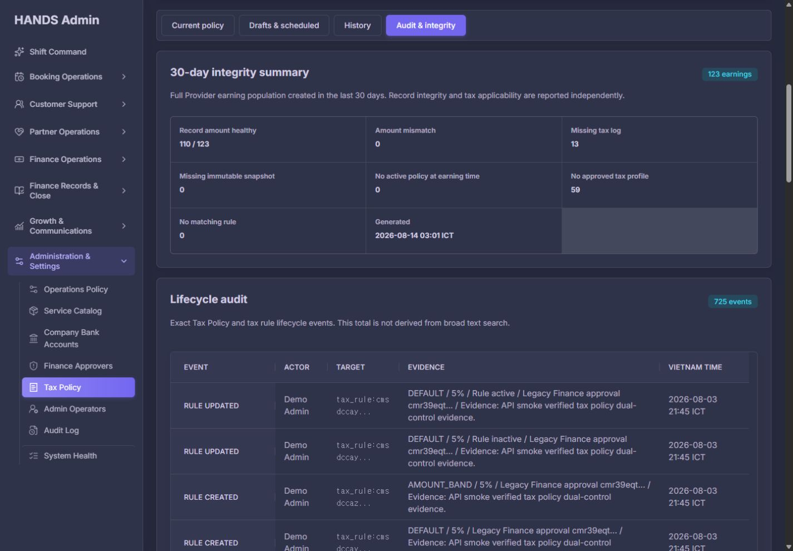

## 4. 코드 원인 감사

| 위치 | 현재 계약 | 문제 | 권장 변경 |
|---|---|---|---|
| `page.tsx:79-107` | view별 데이터를 `Promise.all`로 로드 | 병렬화는 양호 | 유지하되 exact endpoint를 추가 |
| `page.tsx:136-138` | workspace first page에서 nearest scheduled 계산 | 전체 데이터 보장 없음 | scheduled asc `take=1` server query |
| `page.tsx:179-210` | command strip을 모든 view에 렌더 | 첫 viewport 과밀 | Current expanded / 나머지 compact 분기 |
| `tax-policy-page-model.ts:40-42` | approval request를 policy page와 같은 `skip`으로 조회 | exact receipt 누락 가능 | API가 이미 지원하는 `policyVersionId` 사용 |
| `page.tsx:404` | 받은 request page에서 client filter | request가 다른 page면 false empty | selected ID exact fetch + 별도 unavailable state |
| `actions.ts:177-182` | 모든 성공을 기본 `/tax-policy?...`로 redirect | view/policy/anchor 손실 | Drafts exact context 유지 |
| `actions.ts:241-255` | validation/API error를 query notice로 redirect | 입력값·field error 손실 | stateful form result와 field error |
| `page.tsx:389` | 모든 selected policy에 `Editing` | immutable source에 거짓 copy | lifecycle에 따라 Edit/Review 분기 |
| `page.tsx:771` | persisted selected policy를 `Impact preview`로 표시 | unsaved form preview로 오인 | `Saved policy preview` 또는 draft payload endpoint |
| `page.tsx:815-840` | Drafts/History 공용 7열 table, History Clone | 작업 목적이 다르고 unsafe | view별 5열 table, Inspect 기본 |
| `globals.css:19336-19357` | Tax Policy table min-width 980, first 190, last 116 | content auto-size로 1130px 확장 | History-specific fixed/composed columns |
| `page.tsx:469` | `Full Provider earning population` | Admin IA 용어 불일치 | Partner로 교정 |
| `page.tsx:475-483` | Integrity counts를 같은 CommandFact로 표시 | severity/action 없음 | issue-card model과 exact links |
| `page.tsx:497-524` | audit table + pagination만 제공 | investigation workflow 없음 | server filters + detail drawer |
| `provider-onboarding.service.ts:2006-2048` | Tax Policy 전용 actor predicate | Finance governance와 truth가 분리됨 | 공통 capability/readiness helper 재사용 |

API에는 이미 `/admin/tax-policy-approval-requests?policyVersionId=...` 계약이 존재한다. 따라서 exact approval receipt는 새 DB 모델 없이 Admin load plan만 바로잡아도 1차 해결할 수 있다.

## 5. 데이터와 보안 판정

`tax-policy:fixture-cleanup:check` read-only 결과:

| 항목 | 값 |
|---|---:|
| total Tax Policy versions | 145 |
| SMOKE_TEST provenance | **145** |
| ACTIVE | 1 |
| ACTIVE policy | `Smoke withholding 1785768305234` |
| ACTIVE tax log references | 5 |
| ACTIVE settlement snapshot references | 5 |
| CRITICAL | 1 |
| HIGH | 98 |
| REVIEW | 46 |

현재 ACTIVE smoke는 삭제하면 안 된다. 금융 기록이 참조하므로 governed production replacement를 만들고 atomic switch 후 retained evidence로 보존해야 한다.

Tax Policy write predicate는 `PRODUCTION provenance + credential row 존재 + ADMIN + FINANCE_TAX`, decision에서는 `FINANCE_APPROVER`를 추가 확인한다. 로그인 token 검증이 disabled/locked session을 별도로 막는 구조는 존재하지만, Tax Policy service와 Finance Approver readiness가 동일한 capability predicate를 쓰지 않고 setup/MFA/attestation을 직접 증명하지 않는다. 따라서 UI의 `verified` 문구는 현재 service 자체가 보장하는 범위보다 강하다.

수정 기준:

1. 공통 `verified production finance actor` 판정을 단일 helper로 만든다.
2. UI summary, request, decision, activation preflight가 같은 판정을 사용한다.
3. setup incomplete, credential absent/disabled/locked, insufficient session assurance, missing required attestation은 stable code로 fail closed한다.
4. fixture actor는 shared/operational DB Tax Policy write를 수행할 수 없어야 한다.
5. 실제 production maker/checker 두 계정 검증 없이는 operational release를 완료로 표시하지 않는다.

## 6. 우선순위

### P0 — 출시 차단

1. ACTIVE smoke를 governed production policy로 교체하는 별도 runbook과 실제 owner evidence 준비
2. test/smoke/production을 History·Audit·readiness에서 명확히 분리
3. 공통 finance actor readiness/capability 판정 도입
4. fixture/shared DB write 차단과 test isolation 검증
5. non-production source의 silent clone/approval 차단

### P1 — 운영 workflow

1. selected policy exact approval request 조회
2. mutation context/form state/error focus 보존
3. Create/Prepare anchor scroll+focus 회귀 수정
4. Drafts compact banner·queue counts·approver readiness
5. History filters/search·5열·Inspect action
6. Integrity issue cards와 exact filtered records
7. Audit production default·filters·detail drawer
8. saved-only preview와 immutable source 문구 교정

### P2 — 시각·접근성 polish

1. required/helper/error pattern 통일
2. action width와 row density 조정
3. booking/policy ID의 copyable short-ID pattern
4. light/dark contrast 자동·수동 검사
5. sticky tab scroll margin과 focus ring 확인

## 7. 문구 교정표

| 현재 문구 | 문제 | 권장 문구 |
|---|---|---|
| Create new draft | production replacement 의도 부족 | Prepare production draft |
| Drafts & scheduled | queue state가 숨겨짐 | Policy work queue |
| Editing Smoke withholding... | immutable인데 Editing | Reviewing source policy: ... |
| Clone ... as a new draft | smoke 값을 그대로 복사 | Prepare clean production draft from this source |
| Impact preview · production calculation contract | unsaved 값 계산처럼 보임 | Saved source policy preview |
| Full Provider earning population | IA 용어 불일치 | Full Partner earning population |
| Evidence | 목적지 불명확 | Open booking finance evidence |
| Legacy · review required | test source가 숨겨짐 | Test legacy · review required |
| Change rationale and source | legal source와 의미 중복 | Approval rationale / operator evidence |
| No approved tax profile | 영향 설명 없음 | Tax profile not approved — applicability evidence missing |

## 8. 테스트와 검증 결과

| 검사 | 결과 | 해석 |
|---|---|---|
| Admin Web Tax Policy focused unit | PASS — 7 files / 29 tests | 기존 계약은 통과 |
| API policy/withholding focused unit | PASS — 2 files / 25 tests | 기존 lifecycle/calculation 계약은 통과 |
| authenticated browser 1440×1000 | FAIL | History overflow, cross-view anchor/focus, actionability 결함 재현 |
| same-view Create anchor | PARTIAL | scroll success, focus failure |
| History Clone anchor | FAIL | target off-screen, focus BODY |
| History primary table overflow | FAIL | 약 80px overflow, action 파손 |
| History production/test filter | MISSING | control 없음 |
| Integrity exact issue action | MISSING | action 없음 |
| Lifecycle audit filters/detail | MISSING | pagination만 있음 |
| fixture cleanup inventory | PASS — dry-run only | 145/145 smoke, DB mutation 없음 |
| real mutation recovery | NOT RUN | shared DB를 변경하지 않기 위해 실행하지 않음 |
| two-account maker/checker E2E | NOT RUN | 실제 승인 권한·운영 행위 필요 |
| WCAG contrast certification | NOT RUN | theme visual check만 수행 |

29/29와 25/25 unit pass는 현재 구현이 기존 test contract에 맞는다는 뜻이다. 이번에 발견된 missing requirements를 검증하는 테스트가 없으므로 release readiness를 의미하지 않는다.

## 9. Codex 구현 순서

1. 기존 Tax Policy lifecycle/DB invariant는 유지한다.
2. exact queries와 공통 readiness predicate를 먼저 고친다.
3. mutation state·focus·redirect를 고친다.
4. Drafts/History/Integrity의 operator IA를 재구성한다.
5. test/production evidence를 server-side로 분리한다.
6. focused unit/API tests와 1440 browser tests를 추가한다.
7. fresh authenticated screenshots를 새 폴더에 다시 저장한다.
8. 마지막에만 실제 production replacement runbook을 사람이 실행한다.

Impeccable 관점의 실행 순서는 다음과 같다.

1. **P0 `$impeccable harden`**: shared readiness, fixture isolation, form/action failure, non-production clone을 fail closed로 만든다.
2. **P1 `$impeccable distill`**: non-current command strip 반복과 History/Audit의 저신호 정보를 제거한다.
3. **P1 `$impeccable layout`**: History를 5열로 재구성하고 1440 overflow를 0으로 만든다.
4. **P1 `$impeccable clarify`**: Editing/Clone/Impact preview/Provider/Evidence 문구를 실제 계약에 맞춘다.
5. **P2 `$impeccable polish`**: light/dark contrast, spacing, focus ring, short-ID/copy interaction을 마지막에 검증한다.

## 10. 재검수 승인 조건

- [ ] non-current view에서 expanded current strip이 사라짐
- [ ] Drafts 첫 viewport에 queue count와 approver blocker가 보임
- [ ] exact selected-policy approval request가 page와 무관하게 로드됨
- [ ] nearest scheduled가 전체 dataset에서 정확함
- [ ] form validation/API error가 값을 보존함
- [ ] field error와 helper가 `aria-describedby`로 연결됨
- [ ] Create/Prepare가 target을 보이게 하고 heading에 focus함
- [ ] smoke/legacy source가 rate/name/notes를 silent prefill하지 않음
- [ ] immutable source에 `Editing`이 없음
- [ ] saved-only preview가 정확히 labelled됨
- [ ] History default production, test/legacy separate exact count
- [ ] History 1440 horizontal overflow 0
- [ ] History primary action이 Inspect/Open 하나임
- [ ] Integrity 13/59가 exact record queue로 연결됨
- [ ] issue에 rate/oldest/owner/SLA가 있음 또는 미배정 상태를 정직하게 표시함
- [ ] Lifecycle audit에 production default와 action/actor/source/date/policy filters가 있음
- [ ] audit row에서 exact policy/detail evidence를 열 수 있음
- [ ] visible `Provider`가 `Partner`로 교정됨
- [ ] light/dark contrast와 keyboard focus가 검증됨
- [ ] shared DB fixture write가 차단됨
- [ ] actual production maker/checker E2E가 별도로 통과함
- [ ] ACTIVE smoke가 삭제되지 않고 governed replacement 후 retained evidence로 보존됨

## 11. 증거 한계와 변경 고지

- 세 뷰를 로그인된 in-app browser에서 새로 캡처하고 저장한 12개 이미지를 모두 직접 확인했다.
- 화면을 실제로 변경하는 form submit, approval, activation은 실행하지 않았다.
- DB 검사는 cleanup script의 dry-run 결과만 사용했다.
- native empty-form validation만 확인했고 server 4xx/5xx/timeout은 실제 mutation 없이 코드 계약으로 확인했다.
- 실제 production maker/checker 두 계정 흐름은 검증하지 않았다.
- 1024px 이하 화면은 감사 범위에 포함하지 않았다.
- 기존 사용자 코드와 데이터는 변경하지 않았고, 이 보고서와 evidence 파일만 추가했다.

## 12. 최종 판정

현재 Drafts·History·Integrity는 1차 리팩터링의 기술적 기반은 유지하지만, 8월 14일 2차 개선 프롬프트의 운영자 UX·데이터 진실성·보안 경계 요구는 현재 코드와 빌드에 반영되지 않았다.

특히 History의 1440 layout failure와 unsafe smoke clone, Integrity의 non-actionable 13/59 exceptions, production/test evidence 혼합, ACTIVE smoke 정책은 출시 전에 반드시 해결해야 한다. 따라서 최종 판정은 **RELEASE HOLD, 63/100 — 이전 감사와 변화 없음**이다.
