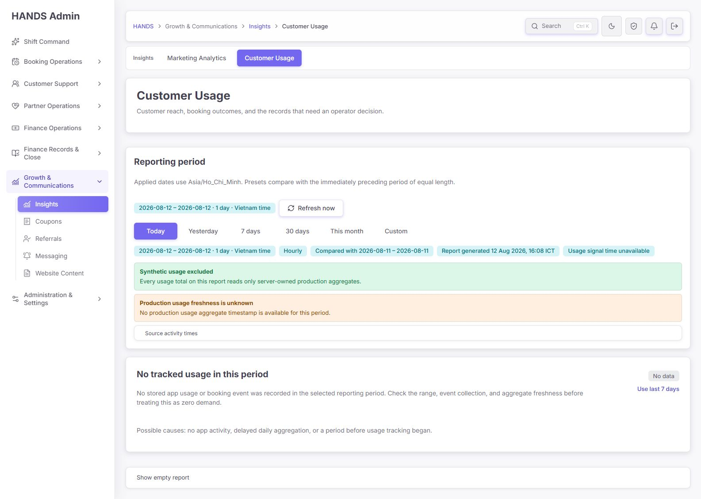
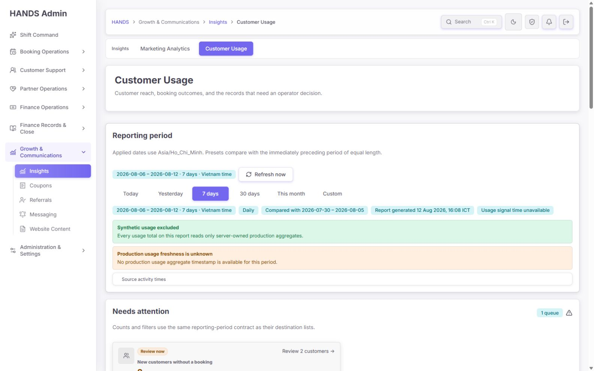
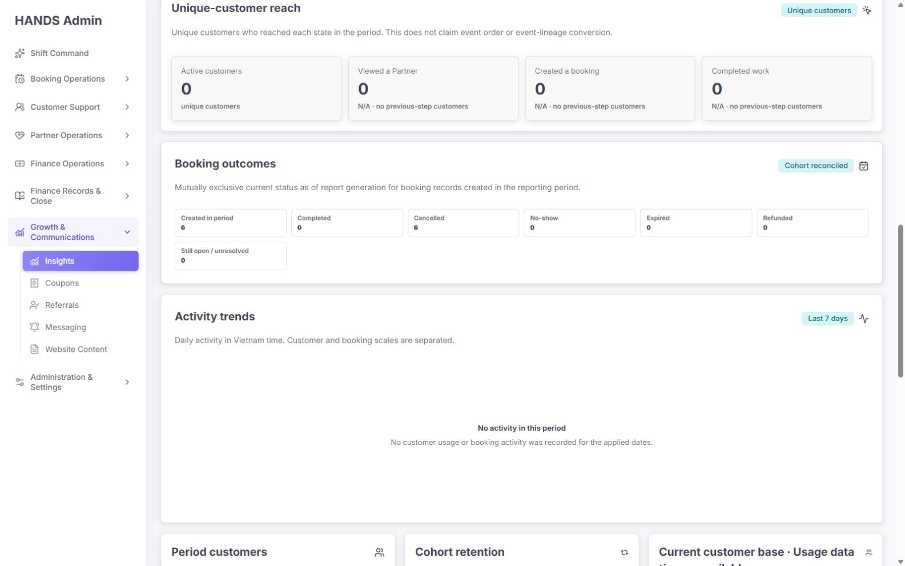
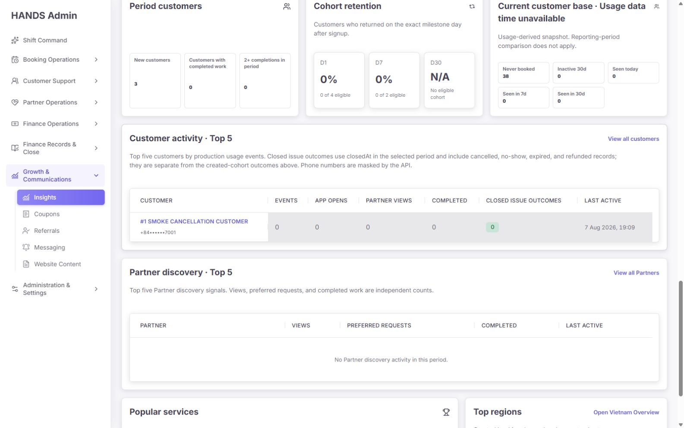
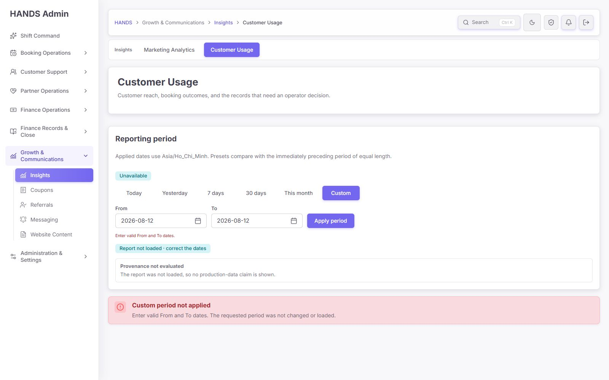
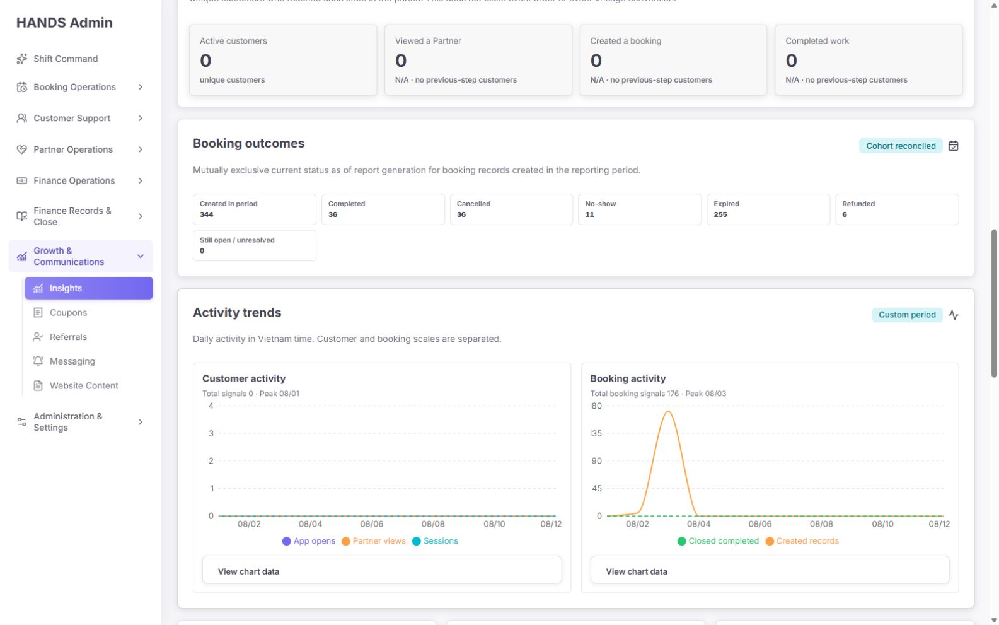
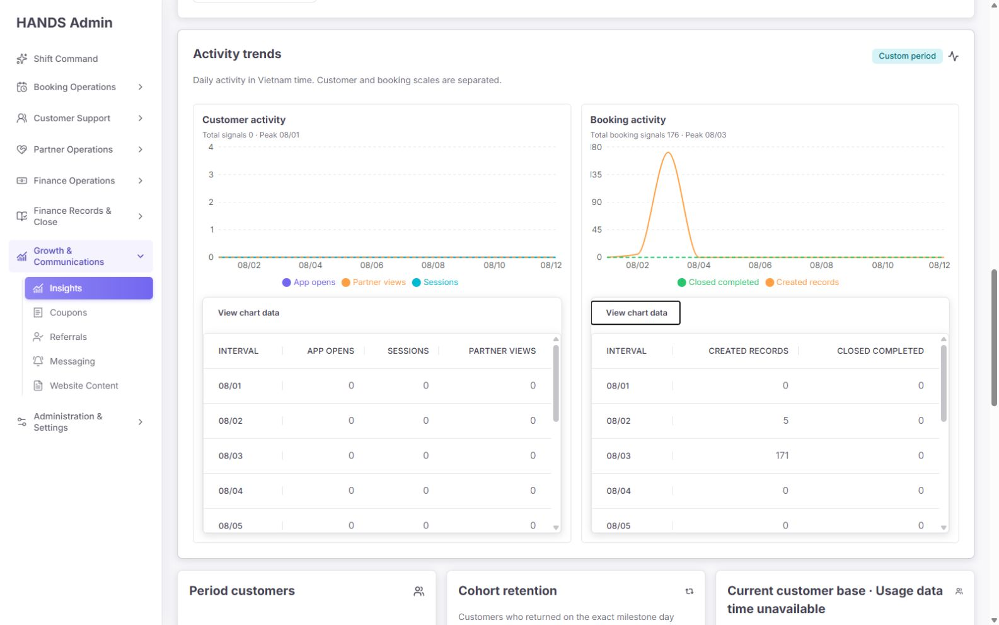
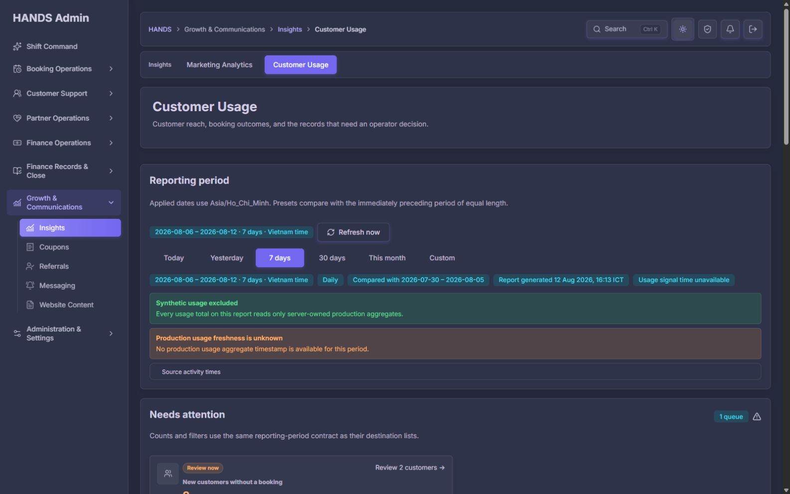
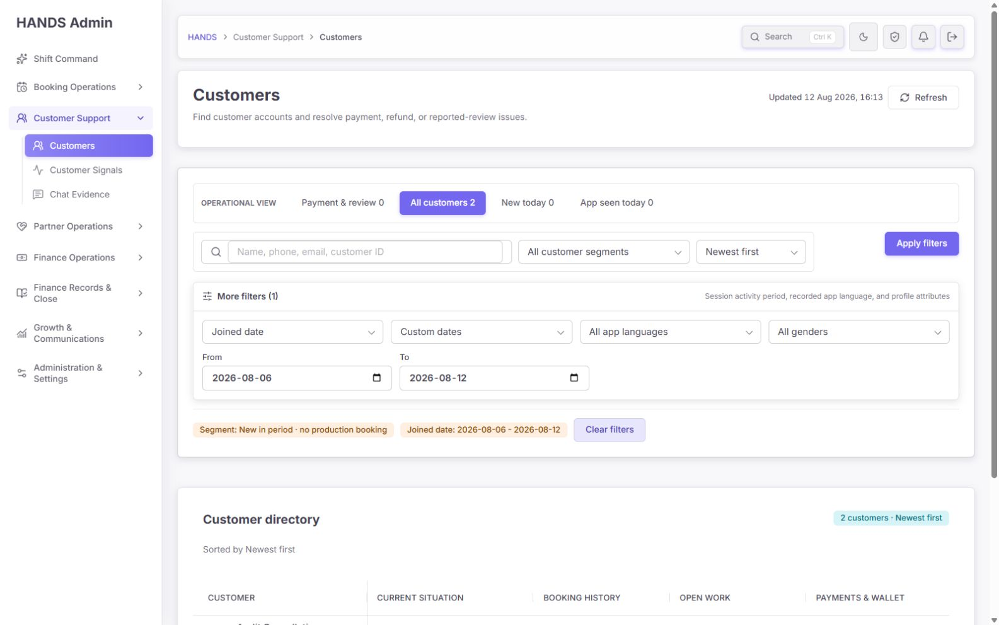

# Customer Usage (`/usage-overview`) 최종 재감사 보고서

- 감사일: 2026-08-12 (ICT)
- 대상: `http://localhost:3101/usage-overview`
- 평가 화면: 1600 × 1000, 라이트/다크 테마
- 평가 범위: 1440px 이상 데스크톱 운영 환경
- 평가 관점: 실제 운영자 의사결정, 데이터 신뢰성, 문구, 화면 구조, 필터/링크 동작, 접근성, 성능 확장성, 코드·테스트 계약
- 수행 방식: 로그인된 실제 화면 캡처 및 DOM 확인, 주요 상태·링크 직접 조작, 이전 화면 증거 비교, Next.js 화면 코드와 API SQL 대조, 관련 테스트·린트·타입 검사
- 결론: **큰 방향은 성공했지만, 수치 계약과 데이터 출처 문제 때문에 조건부 승인**

## 1. 최종 판정

### 종합 점수: 79 / 100

| 영역 | 점수 | 판정 |
|---|---:|---|
| 운영 목적과 정보구조 | 84 | 좋음 |
| 시각적 위계와 가독성 | 83 | 좋음 |
| 필터·행동 동선 | 85 | 좋음 |
| 접근성 | 88 | 매우 좋음 |
| 데이터 계약과 신뢰성 | 58 | 출시 전 수정 필요 |
| 성능과 확장 대비 | 75 | 현재 빠름, 구조적 위험 존재 |
| 문구와 의미 정확성 | 70 | 일부 오도 가능 |

현재 화면은 과거의 단순 순위형 `Usage Overview`에서 실제 운영 대시보드에 가까운 `Customer Usage`로 크게 개선됐다. 기간이 명확하고, 빈 데이터와 장애가 구분되며, 예약 결과·사용자 도달·리텐션·조치 큐가 서로 다른 섹션으로 정리됐다. 다크 테마와 차트 대체 표도 안정적이다.

그러나 다음 세 가지는 운영자가 잘못된 결론을 내릴 수 있는 수준이다.

1. 같은 기간에 `Created in period 6`을 표시하면서 바로 아래 추세는 `No booking activity`라고 말한다.
2. `Synthetic usage excluded`라는 성공 메시지 아래에 `Smoke` 고객·파트너가 실제 순위로 노출된다.
3. 사용량 집계 시각이 계속 `unavailable`인데 모든 사용량이 0으로 표시되어, 실제 0과 수집 실패를 운영자가 직관적으로 구분하기 어렵다.

따라서 **화면 디자인은 승인**, **운영 데이터 대시보드로서의 출시는 보류**가 적절하다. P1 항목을 해결하고 데이터 계약 회귀 테스트를 추가한 뒤 출시 가능 판정을 다시 받아야 한다.

## 2. 실제 화면 증거

### 기본 Today 빈 상태

- `No tracked usage in this period`와 `Use last 7 days`가 있어 빈 화면의 다음 행동이 명확하다.
- `Show empty report`로 0 값 전체를 선택적으로 열게 한 방식은 적절하다.
- 다만 실제 업무 섹션이 큰 제목·기간 패널 아래로 밀려 첫 화면 밀도가 낮다.

### 7일 범위와 조치 큐

- 기간, 비교 기간, 생성 시각, 집계 시각을 한 장소에서 확인할 수 있다.
- `Needs attention`을 보고서 상단에 둔 것은 운영자 중심 개선이다.
- 큐의 `Review 2 customers`는 실제 목적지의 2명과 일치했다.

### 예약 결과와 추세의 충돌

- 예약 결과: 생성 6, 취소 6.
- 바로 아래 추세: `No activity in this period` / `No customer usage or booking activity`.
- 이는 빈 상태 문구 문제가 아니라 서로 다른 예약 모집단을 동일한 이름으로 표시한 데이터 계약 결함이다.

### 순위에 노출되는 0 이벤트 Smoke 고객

- 설명은 `Top five customers by production usage events`지만 1위 고객의 Events, App opens, Partner views가 모두 0이다.
- 고객 이름도 `Smoke Cancellation Customer`다. 운영자가 이 표를 생산 사용량 순위로 신뢰할 수 없다.

### Custom 기본 상태 오류

- From/To에 동일한 오늘 날짜가 보이지만 `Enter valid From and To dates`가 나타난다.
- 보이는 값은 유효해 보이는데 서버 쿼리에는 `from`/`to`가 없어 발생한다. 운영자 입장에서는 시스템 오류처럼 보인다.

### 적용된 Custom 추세와 정확한 데이터

- Custom 2026-08-01~12 예약 결과는 생성 344건인데 차트의 `Created records` 합계는 176건이다.
- 정확한 값 표를 제공한 접근성·검증성은 매우 좋다. 그러나 정확한 표가 오히려 계약 불일치를 명확히 드러낸다.

### 다크 테마

- 배경, 패널, 경계, 성공·주의 상태가 모두 읽힌다.
- 색상만으로 상태를 전달하지 않고 텍스트를 함께 제공한다.

### 조치 큐 목적지

- `Segment: New in period · no production booking`과 가입일 필터가 정확히 적용됐다.
- 큐 2명과 목적지 2명이 일치한다.
- 다만 목록의 `No booking`과 같은 행의 전체 booking history가 함께 보일 때 생산 예약과 테스트/기타 예약의 기준 차이가 드러날 수 있으므로 목적지 문구도 동일한 출처 계약을 사용해야 한다.

## 3. 이전 감사 방향 반영 상태

| 요구 방향 | 상태 | 검수 결과 |
|---|---|---|
| 무제한 `All` 제거, 제한된 기간 사용 | 완료 | Today, Yesterday, 7 days, 30 days, This month, Custom 제공 |
| 베트남 시간 기준 명시 | 완료 | 범위·비교·생성 시각에 ICT/Vietnam time 표시 |
| 같은 길이의 이전 기간 비교 | 완료 | 7일과 이전 7일 계약이 명시됨 |
| API 실패와 실제 0 구분 | 완료 | `Report not loaded`와 실제 빈 상태가 분리됨 |
| 빈 상태에서 다음 행동 제공 | 완료 | `Use last 7 days`, `Show empty report` 제공 |
| 운영 조치 큐를 분석보다 앞에 배치 | 완료 | `Needs attention`을 첫 업무 섹션으로 배치 |
| 큐 건수와 목적지 필터 일치 | 완료 | 2명 → 실제 목록 2명 확인 |
| 고유 고객 도달과 예약 결과 분리 | 완료 | `Unique-customer reach`와 `Booking outcomes` 분리 |
| 허위 퍼널/순차 전환 표현 제거 | 완료 | “event order or lineage conversion을 주장하지 않음” 명시 |
| 예약 상태 상호 배타적 합계 | 완료 | 생성 건수와 상태 합계가 맞고 코드 테스트도 존재 |
| 리텐션 분모·마일스톤 명시 | 완료 | D1/D7/D30 eligible cohort 표시 |
| 기간 고객과 현재 고객 기반 분리 | 완료 | 서로 다른 카드로 구분 |
| 전화번호 API 마스킹 | 완료 | UI와 API 테스트 모두 확인 |
| 생산 사용량 provenance 표시 | 부분 완료 | Aggregate는 origin 기반이지만 예약 provenance는 explicit metadata 의존 |
| synthetic/test 데이터 제거 | 부분 완료 | Usage aggregate는 제외하나 Smoke/Demo 예약·프로필이 여전히 노출 |
| 차트의 접근 가능한 정확 값 제공 | 완료 | disclosure + 표 제공 |
| Custom 기간 지원 | 부분 완료 | 적용 후 동작하지만 최초 진입 기본값과 오류가 모순 |
| 소스 freshness 표시 | 부분 완료 | 표시 자체는 좋으나 실제 시각이 unavailable이라 출시 신뢰성 미달 |
| 성능 보호 | 부분 완료 | 기간 제한·Top N·인덱스는 있으나 12개 동시 live query와 캐시 부재 |

## 4. 우선순위별 발견 사항

### P0 — 즉시 장애

없음. 페이지 렌더링, 기간 전환, Custom 적용, 큐 이동, 테마 전환은 모두 작동했다.

### P1-1. 예약 추세와 예약 결과가 다른 모집단을 같은 이름으로 표시

**증거**

- 7일: Booking outcomes 생성 6건, Activity trends 예약 활동 없음.
- Custom: Booking outcomes 생성 344건, 차트 `Created records` 176건.
- `admin-usage-overview-query.ts`의 period summary는 기간 내 모든 예약을 센다.
- 같은 파일의 `queryTrend()`는 `preferredProviderId IS NOT NULL`인 예약만 `bookingRequestCount`로 센다.
- `usage-overview-trend-chart.tsx`는 이 값을 `Created records`로 표시한다.

**운영 위험**

- 운영자는 “해당 날짜에 예약이 없었다” 또는 “예약 생성이 176건이었다”고 잘못 판단한다.
- 상단 KPI, 예약 결과, 차트, CSV/보고 수치가 서로 달라질 수 있다.

**수정 원칙**

- 최선안: trend의 생성 시리즈를 전체 생산 예약 `createdAt` 기준으로 변경하고 필드명도 `createdBookingCount`로 통일한다.
- Preferred booking이 별도로 필요하면 `Preferred requests`라는 독립 시리즈를 추가하고 `partnerBookingRequestCount`와 일치시킨다.
- `Closed completed`는 생성 cohort 결과가 아니라 `closedAt` activity이므로 `Completed during period`처럼 정확히 표현한다.

**필수 회귀 조건**

- 모든 범위에서 `sum(trend.createdBookingCount) === bookingQuality.createdBookingCount`.
- Preferred series를 둔다면 `sum(trend.preferredRequestCount) === totals.partnerBookingRequestCount`.
- 예약 생성은 있지만 preferred 요청이 0인 fixture를 추가해 차트가 빈 상태가 되지 않는지 검사.

### P1-2. 예약 synthetic provenance가 보장되지 않는데 성공 메시지가 페이지 전체를 안전해 보이게 함

**증거**

- `usageBookingProductionSql()`은 `adminBookingExplicitFixtureMetadataSql()`을 사용한다.
- 이는 `metadata.smokeFixture`, `metadata.auditFixture`, `metadata.dataOrigin=SYNTHETIC`만 제외한다.
- ID prefix까지 제거하는 더 강한 `adminBookingProductionDataSql()`이 존재하지만 이 화면은 사용하지 않는다.
- 실제 Top 5에 `Smoke Cancellation Customer`가 보이고, Custom 범위의 파트너 순위에도 Smoke/Demo 데이터가 나타난다.
- API는 `bookingFixtures: explicit-markers-excluded`를 반환하지만 화면은 usage aggregate 성공 메시지만 크게 보여 준다.

**운영 위험**

- 테스트 예약이 예약 결과, 지역, 서비스, 고객/파트너 순위, 현재 고객 기반을 오염시킨다.
- “Synthetic usage excluded”를 보고 전체 보고서가 생산 전용이라고 오해할 수 있다.

**수정 원칙**

- 임시로 이름 기반 필터만 덧붙이는 것을 최종 해결로 삼지 않는다.
- Booking에 JSON 선택값이 아닌 first-class `dataOrigin` 또는 `isFixture` 컬럼을 두고 생성 경로에서 필수 기록한다.
- 기존 예약을 dry-run 분류 → 검토 → backfill하고, 알 수 없는 출처는 생산 집계에서 제외하면서 건수를 경고한다.
- 화면 신뢰 배지는 최소 두 개로 구분한다: `Usage signals: production verified`, `Booking records: verified / incomplete`.
- `bookingFixtures === explicit-markers-excluded`일 때 성공 톤을 사용하지 말고 “예약 출처 일부만 검증됨”으로 표시한다.

**필수 회귀 조건**

- marker 누락 Smoke/Demo 예약 fixture가 모든 예약 기반 집계에서 제외되는 통합 테스트.
- 예약 결과·서비스·지역·고객·파트너 순위가 동일한 provenance helper를 사용한다는 계약 테스트.
- unknown booking origin이 1건이라도 있으면 UI가 전체 보고서를 production-safe로 선언하지 않는다.

### P1-3. 사용량 데이터 freshness가 unknown인 상태를 출시 가능한 0처럼 읽을 수 있음

**증거**

- Today와 7일 모두 `Usage signal time unavailable` 및 `Production usage freshness is unknown`.
- 동시에 Active customers, Partner views, app activity가 모두 0으로 표시된다.
- 예약 데이터는 존재하므로 단순히 서비스 전체 활동이 없는 상태가 아니다.

**운영 위험**

- 수집/집계 파이프라인 미가동을 수요 0으로 판단할 수 있다.
- 마케팅·리텐션·고객 행동 판단이 모두 무효가 될 수 있다.

**수정 원칙**

- freshness unknown일 때 사용량 KPI 숫자를 정상 `0` 톤으로 표시하지 말고 `Data unavailable` 또는 `—`로 전환한다.
- 예약 지표는 계속 보여 주되 `Booking data available / Usage telemetry unavailable`로 두 소스를 명확히 분리한다.
- 파이프라인 health, 마지막 성공 집계, 예상 다음 집계, 담당 runbook 링크를 추가한다.
- 출시 게이트: 최근 48시간 이내 aggregate timestamp + known production origin + 최소 1회 end-to-end event 검증.

**필수 회귀 조건**

- `usageStatus=unknown/delayed/fresh`별 KPI 표시 스냅샷 테스트.
- unknown일 때 `0 active customers`를 수요 0으로 단정하는 문구가 없어야 한다.

### P1-4. Custom 최초 진입 시 보이는 날짜와 검증 상태가 모순

**증거**

- `/usage-overview?range=custom`에서 From/To가 모두 오늘로 보인다.
- 동시에 `Unavailable`, `Enter valid From and To dates`, `Custom period not applied`가 보인다.
- 화면은 `defaultValue={from ?? today}`와 `defaultValue={to ?? today}`를 사용하지만 서버 검증은 실제 query parameter가 없다고 판단한다.

**운영 위험**

- 운영자는 보이는 날짜가 왜 틀렸는지 이해할 수 없고 같은 값을 다시 선택해야 한다.
- Custom 기능이 고장 난 것으로 판단한다.

**권장안**

- Custom 탭 href 자체를 유효한 기본 기간과 함께 생성한다. 권장 기본은 최근 7일: `range=custom&from=...&to=...`.
- 또는 입력을 빈 값으로 렌더하고 “From/To를 선택하세요”만 표시한다.
- 보이는 default만 채우고 report error를 띄우는 현재 방식은 제거한다.

**필수 회귀 조건**

- bare Custom 링크를 클릭한 직후 보이는 입력과 URL의 값이 일치한다.
- 첫 진입 시 오류 alert가 없어야 하며 Apply가 즉시 유효하게 동작한다.

### P2-1. 고객 Top 5의 제목·설명과 실제 포함 기준 불일치

`queryCustomerRankings()`는 usage, closed booking, booking intent를 union한다. 따라서 usage event가 0인 고객도 포함되지만 UI는 `Top five customers by production usage events`라고 설명한다.

**권장 수정**

- 운영 목적에 맞춰 표를 분리한다.
  - `Most active customers`: `totalEventCount > 0`만 포함.
  - `Customers with booking outcomes`: completed/issue 기준 별도 표 또는 조치 큐.
- 한 표를 유지한다면 제목을 `Customer activity & booking outcomes`로 바꾸고 정렬 근거를 표시한다.
- 0 이벤트 고객을 순위 `#1`로 표시하지 않는다.

### P2-2. 조치 큐 목적지의 “생산 예약 없음”과 전체 booking history 기준이 다름

큐의 필터는 `no production booking`인데 고객 목록의 Current situation과 Booking history는 더 넓은 예약 집합을 사용할 수 있다. 같은 행에서 “No booking”과 `6 total`이 함께 보이면 운영자는 혼란스럽다.

**권장 수정**

- 목적지에 `No production booking`을 그대로 사용한다.
- 테스트/기타 기록이 있으면 `6 non-production records`를 보조 문구로 분리한다.
- 큐 카운트, 필터 chip, 행 상태, booking history가 같은 provenance contract를 사용하도록 통합 테스트한다.

### P2-3. 첫 화면에서 실제 작업까지의 세로 이동이 큼

상단에는 breadcrumb, Insights subnav, 큰 페이지 제목 카드, 큰 Reporting period 패널이 연속된다. 1600×1000에서도 조치 큐 전체가 첫 화면에 들어오지 않는다.

**권장 구성**

1. 페이지 제목과 기간 선택을 같은 compact header에 결합.
2. 적용 기간·비교·생성 시각은 한 줄 scope bar로 축약.
3. provenance/freshness는 하나의 `Data health` 행으로 합치고 상세 시각은 disclosure로 유지.
4. 첫 화면에 `Needs attention` 카드가 최소 한 줄 완전히 보이게 한다.

### P2-4. 상태 메시지가 반복되어 경고 피로를 만듦

`Usage signal time unavailable`이 scope chip, 경고 alert, Current customer base 제목에서 반복된다. 기간 전환 때 여러 `role=alert`가 연속 공지될 가능성도 있다.

**권장 수정**

- 최상단에 단일 `Data health` 컴포넌트 사용.
- 상태 변화나 처음 발생한 오류만 alert로 알리고, 반복 정보는 `status` 또는 일반 텍스트로 둔다.
- Current customer base 제목은 고정하고 카드 안에 작은 상태 배지를 둔다.

### P2-5. 월/Custom에서 Vietnam Overview 연결이 사라짐

코드는 Today, Yesterday, 7d, 30d만 Vietnam Overview 링크를 제공한다. `This month`와 `Custom`도 지역 결과를 보여 주므로 운영자가 같은 기간의 지역 화면으로 이동할 수 있어야 한다.

**권장 수정**

- Vietnam Overview가 exact `from`/`to`를 받을 수 있도록 공통 period query contract를 재사용한다.
- 지원하지 못한다면 링크를 숨기는 대신 `Regional detail supports presets only`와 가장 가까운 preset 행동을 제공한다.

### P2-6. 데이터 내보내기와 공유 가능한 보고 범위가 없음

정확한 차트 표는 있으나 보고서 전체를 CSV로 내려받거나 현재 범위를 공유할 명시적 행동이 없다. URL은 범위를 담고 있어 기본 공유는 가능하지만 운영자가 이를 알기 어렵다.

**권장 수정**

- `Export report`는 화면에 표시된 source status와 생성 시각을 포함한 CSV/JSON으로 제공.
- export에도 동일한 synthetic/provenance 정책을 강제.
- `Copy report link`로 현재 range/from/to를 복사.

### P2-7. 현재는 빠르지만 데이터 증가에 취약한 12-query live fan-out

`getAdminUsageOverview()`는 비교 요약을 포함해 12개의 raw query를 `Promise.all`로 매 요청 실행한다. 화면은 `freshness: live`를 사용하고 캐시가 없다. 제한 기간, Top 10/Top 5, 주요 인덱스는 긍정적이지만 동시 쿼리의 DB CPU 피크가 커질 수 있다.

**실측**

- 로컬 7일 화면 3회 navigation: 182ms, 74ms, 122ms.
- 현재 개발 데이터에서는 느림이 재현되지 않았다.

**권장 수정**

- 각 하위 query에 timing을 붙이고 p50/p95, scanned rows, timeout을 관측한다.
- 12개 전체가 아닌 핵심 상단 요약/큐를 먼저 반환하고 하위 분석은 독립 endpoint 또는 Suspense 구간으로 지연 로딩한다.
- daily materialized summary 또는 짧은 TTL snapshot을 검토한다.
- `queryCurrentCustomerBase()`처럼 기간과 무관한 값은 별도 캐시한다.
- 성능 목표: 상단 업무 정보 p95 1초 이내, 전체 분석 p95 2초 이내, query timeout과 부분 실패 표시.

### P3-1. 일부 문구가 운영자보다 구현 계약 중심

| 현재 문구 | 문제 | 권장 문구 |
|---|---|---|
| Counts and filters use the same reporting-period contract as their destination lists. | 개발자 표현 | These queues contain records from the selected period. |
| Every usage total on this report reads only server-owned production aggregates. | 기술적이고 페이지 전체로 오해 가능 | Usage signals are production-verified. Booking data verification is shown separately. |
| No customer usage or booking activity was recorded... | 실제 예약이 있을 때 거짓 | No tracked customer usage or preferred requests were recorded. 또는 집계 수정 후 문구 유지 |
| Customer activity · Top 5 | 실제 booking-only 고객 포함 | Most active customers 또는 Customer activity & booking outcomes |
| Usage signal time unavailable | 여러 곳 반복 | Data health: Usage telemetry unavailable |

### P3-2. 정확한 차트 표의 이중 내부 스크롤이 검수 효율을 낮춤

두 차트를 동시에 열면 각 표에 별도 세로 스크롤이 생긴다. 표 접근성은 좋지만 비교 시 마우스 이동이 많다.

**권장 수정**

- `View all chart data` 하나로 통합 표를 제공하거나, 한 번에 한 disclosure만 열리게 한다.
- 기본 노출은 peak/total 요약, 세부 값은 모달 또는 full-width drawer도 적합하다.

## 5. 권장 화면 구조

1440px 이상 운영 화면에서는 다음 순서가 가장 효율적이다.

1. **Compact page header**: Customer Usage + 한 줄 목적 설명 + Refresh / Export.
2. **Period and data health bar**: 기간 preset, applied dates, comparison, source health.
3. **Needs attention**: 큐명, 건수, 가장 오래된 건, 바로가기. 0건 큐는 기본 숨김.
4. **Decision snapshot**: Active customers, created bookings, unresolved, cancellations; 데이터 미가용은 `—`.
5. **Reach and booking outcomes**: 현재처럼 분리 유지.
6. **Trends**: 전체 예약 생성과 preferred requests를 구분한 시리즈.
7. **Customer lifecycle**: Period customers, retention, current base.
8. **Rankings**: usage 순위와 booking outcome 순위를 분리.
9. **Demand detail**: services, regions, payment methods.
10. **Source details**: 생성·집계·booking/review/refund 활동 시각과 provenance를 마지막 disclosure로 제공.

삭제할 필요가 있는 주요 기능은 없다. 문제는 기능 수보다 **데이터 모집단과 명칭의 불일치**, **상단 반복**, **테스트 데이터 출처 정책**이다.

## 6. 접근성 감사

### 잘된 점

- Skip link와 `main`, heading 구조가 확인된다.
- 기간 선택은 명확한 label과 active state를 가진다.
- Custom date picker는 dialog, gridcell 날짜명, selected state를 제공한다.
- 오류 입력은 `aria-invalid`, described error를 제공한다.
- 차트에는 요약, `role=img`, 정확한 값 표가 있다.
- 빈 상태와 오류 상태를 텍스트로 구분한다.
- 전화번호는 API에서 마스킹된다.
- 라이트/다크 모두 정보가 읽히며 색상 외 텍스트 신호가 있다.

### 보완점

- freshness/provenance alert를 하나로 합쳐 반복 공지를 줄인다.
- 차트 내부 SVG/application과 바깥 `role=img`가 중복 탐색되지 않는지 실제 스크린리더로 확인한다.
- 표의 `Last active`가 usage event인지 booking activity인지 행별로 다른 경우 column 설명을 제공한다.

이번 감사는 DOM·키보드 구조·대체 표를 확인했지만 NVDA/JAWS 실제 음성 흐름은 실행하지 않았다. 이는 별도 출시 전 검사 항목이다.

## 7. 코드·테스트 감사

### 통과

- Admin web usage 화면/모델 테스트: **2 files, 17 tests passed**.
- API usage overview 테스트: **2 files, 8 tests passed**.
- Admin web usage 대상 ESLint: 통과.
- API usage 대상 ESLint: 통과.
- Admin web typecheck: 통과.
- Impeccable UI detector: 지적 0건.

### 실패 또는 미완료

- API 전체 typecheck: 실패.
- 실패 위치: `apps/api/src/admin/admin.service.ts:7286`의 referral attribution 타입 불일치.
- 이번 usage-overview 감사 범위와 직접 관련 없는 기존 워크트리 문제로 보이며, 본 감사에서는 수정하지 않았다.

### 현재 테스트가 놓치는 핵심 계약

1. Trend 생성 합계와 booking outcome 생성 합계의 일치.
2. preferred 예약이 0이고 일반 예약만 있는 기간의 차트 상태.
3. marker가 누락된 Smoke/Demo 예약의 집계 제외.
4. customer ranking에 usage event 0 고객이 들어올 때 제목/정렬 계약.
5. bare `?range=custom` 최초 화면의 URL·입력·오류 일치.
6. usage freshness unknown일 때 0 수치 표현 금지.
7. action queue 목적지의 production booking 기준과 행 history 기준 일치.
8. 12개 쿼리별 p95/timeout/부분 실패 계약.

## 8. 구현 순서와 완료 기준

### Step 1 — 데이터 계약 교정 · 건강도: 위험

- trend를 전체 created bookings로 맞추고 preferred requests를 별도 필드로 분리.
- booking provenance를 first-class 필드로 전환하고 기존 데이터 backfill.
- 고객/파트너 순위의 포함 기준과 제목을 일치.
- 완료 기준: 동일 범위의 모든 합계가 자동 검증되고 Smoke/Demo가 생산 화면에 0건.

### Step 2 — 데이터 health 출시 게이트 · 건강도: 위험

- 사용량 집계 파이프라인 end-to-end 검증.
- unknown/delayed/fresh UI 상태와 runbook 제공.
- 완료 기준: 최근 48시간 이내 production aggregate timestamp가 보이고, unknown에서는 수요 0으로 표시하지 않음.

### Step 3 — Custom과 상단 운영 동선 압축 · 건강도: 주의

- 유효한 기본 Custom 기간 사용.
- 제목/기간/health를 compact header로 통합.
- Needs attention을 첫 화면에 완전히 노출.
- 완료 기준: Custom 첫 클릭에 오류 없음, 1600×1000 첫 화면에서 최소 한 개 큐 행동이 완전히 보임.

### Step 4 — 교차 페이지 및 문구 정합성 · 건강도: 주의

- queue chip, destination filter, row state, booking history의 production contract 통일.
- 사용자/파트너 ranking과 region link parity 수정.
- 완료 기준: 같은 용어는 같은 모집단을 의미하고, 큐 건수와 목적지 결과가 모든 preset/custom에서 일치.

### Step 5 — 성능·접근성 하드닝 · 건강도: 양호

- query timing, partial rendering/cache, p95 budget 추가.
- 실제 스크린리더와 키보드 회귀 검사.
- 완료 기준: 상단 p95 1초, 전체 p95 2초 이내 목표와 부분 실패 UI 확인.

## 9. 출시 체크리스트

- [ ] 7일 생성 예약 6건이면 trend 생성 합계도 6건이다.
- [ ] Custom 2026-08-01~12 생성 344건이면 trend 생성 합계도 344건이다.
- [ ] Preferred requests는 별도 명칭과 합계로 표시된다.
- [ ] Smoke/Demo/seed 예약·고객·파트너가 production 결과에 나타나지 않는다.
- [ ] Booking provenance가 `guaranteed`가 아니면 성공 메시지를 쓰지 않는다.
- [ ] usage freshness unknown이면 사용량 KPI를 정상 0으로 표시하지 않는다.
- [ ] Custom 첫 진입에서 보이는 날짜와 URL이 일치하고 오류가 없다.
- [ ] Customer Top 5의 제목, 포함 기준, 정렬 기준이 일치한다.
- [ ] 큐 수치, 목적지 수치, 행 상태가 동일한 production 기준을 쓴다.
- [ ] 6개 preset/custom 범위에 대한 합계·링크 회귀 테스트가 있다.
- [ ] API 전체 typecheck가 통과한다.
- [ ] 로컬이 아닌 운영 규모 데이터에서 p95 성능을 확인한다.
- [ ] NVDA 또는 JAWS로 기간 변경, alert, 차트 대체 표를 검증한다.

## 10. 최종 결론

이번 수정은 **시각적 완성도와 운영자 친화성 면에서 확실히 성공**했다. 특히 제한된 기간, 조치 큐, 빈 상태, 예약 결과 reconciliation, retention 분모, source time, exact chart table, 다크 테마는 이전보다 한 단계 높은 수준이다.

하지만 이 페이지의 핵심 목적은 예쁜 통계가 아니라 **운영자가 수치를 믿고 행동하게 하는 것**이다. 현재는 같은 기간의 예약 생성 수치가 섹션별로 다르고, 테스트 데이터가 생산 결과에 보이며, 사용량 freshness가 확인되지 않는다. 이 세 가지가 해결되기 전에는 보고·마케팅·고객 운영 의사결정의 기준 화면으로 승인하면 안 된다.

P1을 완료하면 예상 점수는 89~92점이며, 그때는 소규모 운영 환경에서 출시 가능한 Customer Usage 대시보드로 볼 수 있다.

## 11. 감사 인계

- 생성 문서: `docs/audits/usage-overview-final-reaudit-2026-08-12.md`
- 생성 증거: `docs/audits/usage-overview-final-reaudit-evidence-2026-08-12/*`
- 애플리케이션 코드 변경: 없음
- 보호한 영역: 기존 대규모 dirty worktree, usage 화면/API 구현, DB 데이터
- 통과 명령: admin usage tests, API usage tests, 양쪽 focused ESLint, admin typecheck, Impeccable detector
- 실패 명령: API 전체 typecheck — referral attribution 관련 기존 타입 불일치
- 미실행: production 데이터 load test, 실제 NVDA/JAWS, DB migration/backfill
- 남은 가장 큰 위험: 집계 모집단 불일치, booking provenance 미보장, usage telemetry freshness unknown
- 다음 구현 범위: P1 데이터 계약과 provenance 수정 후 동일 화면 재감사
