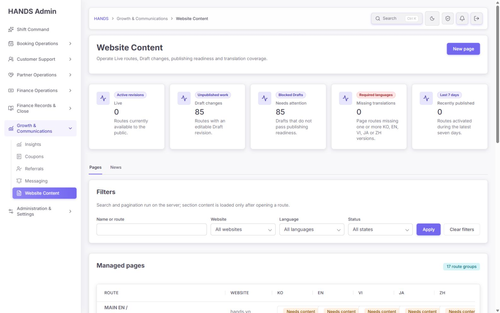
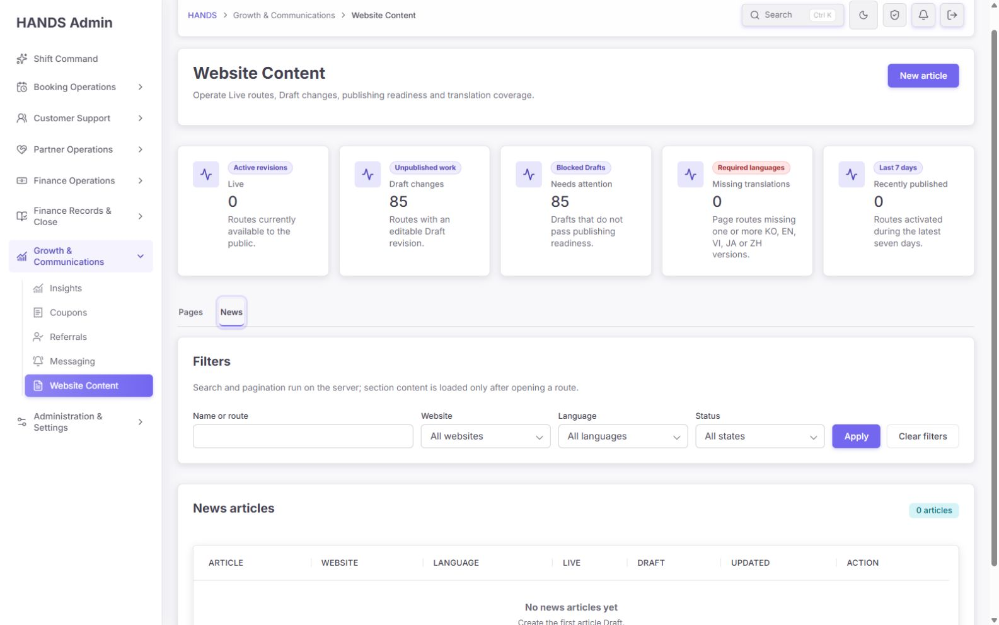
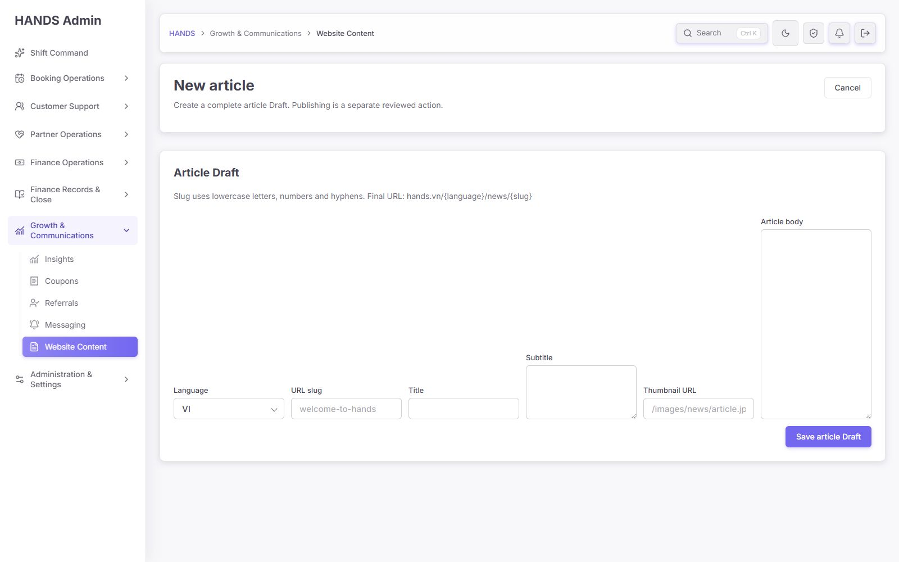
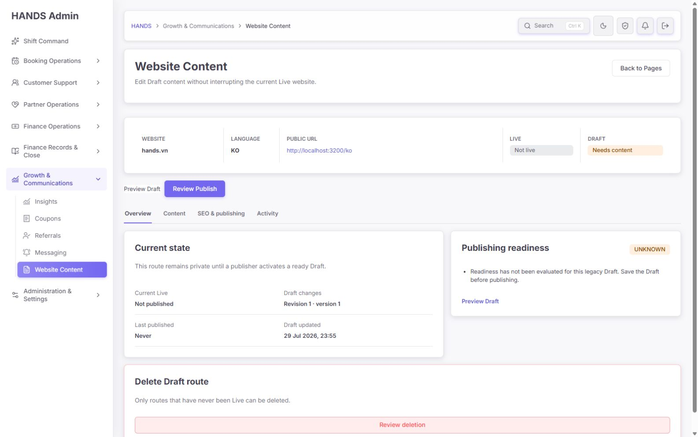
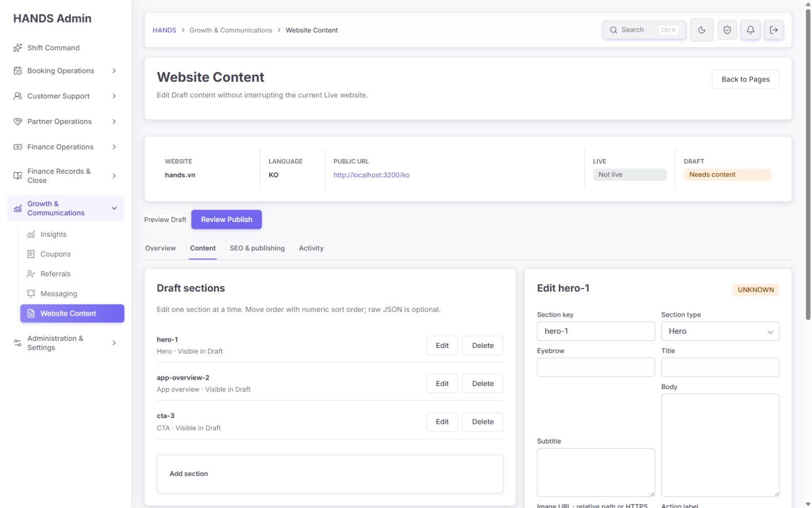
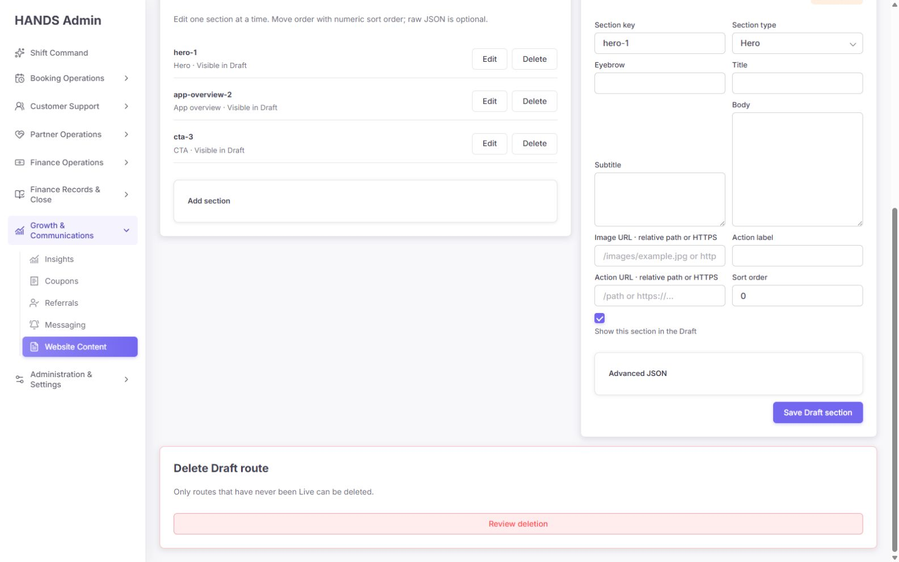
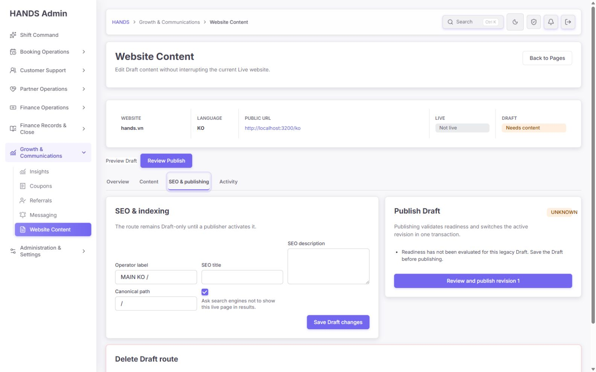
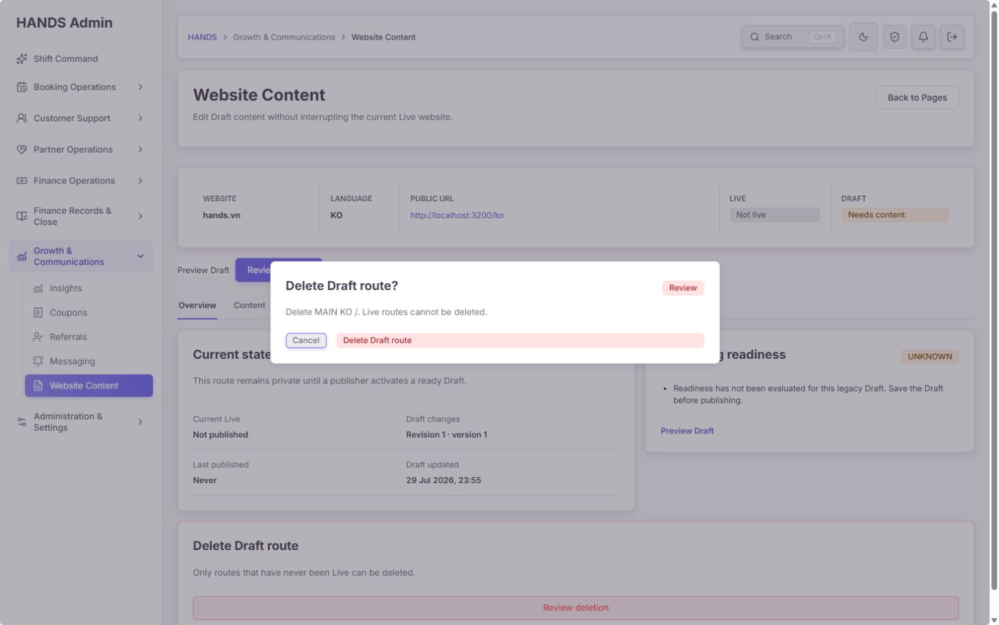
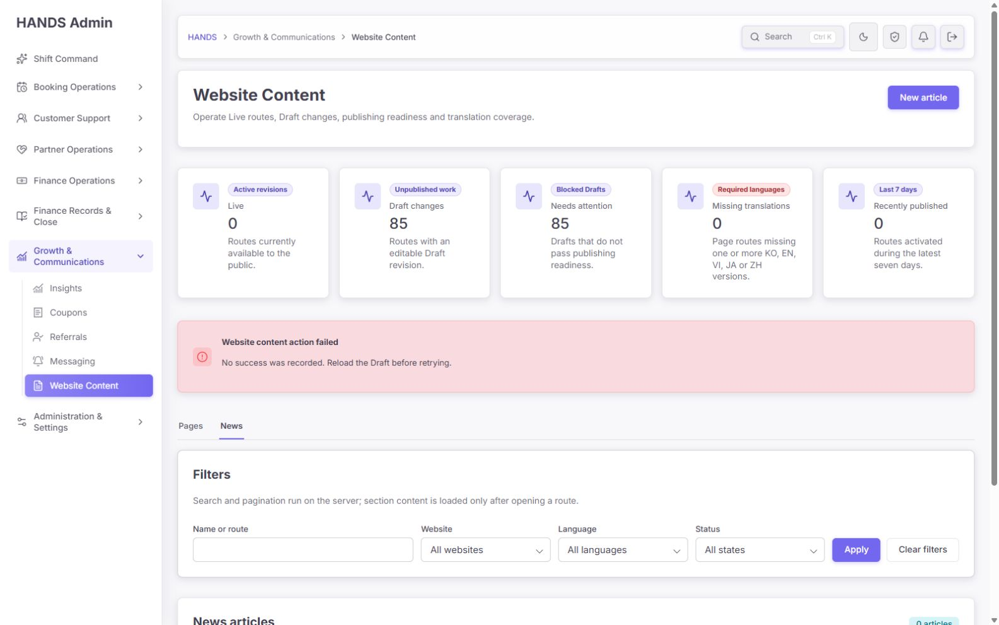
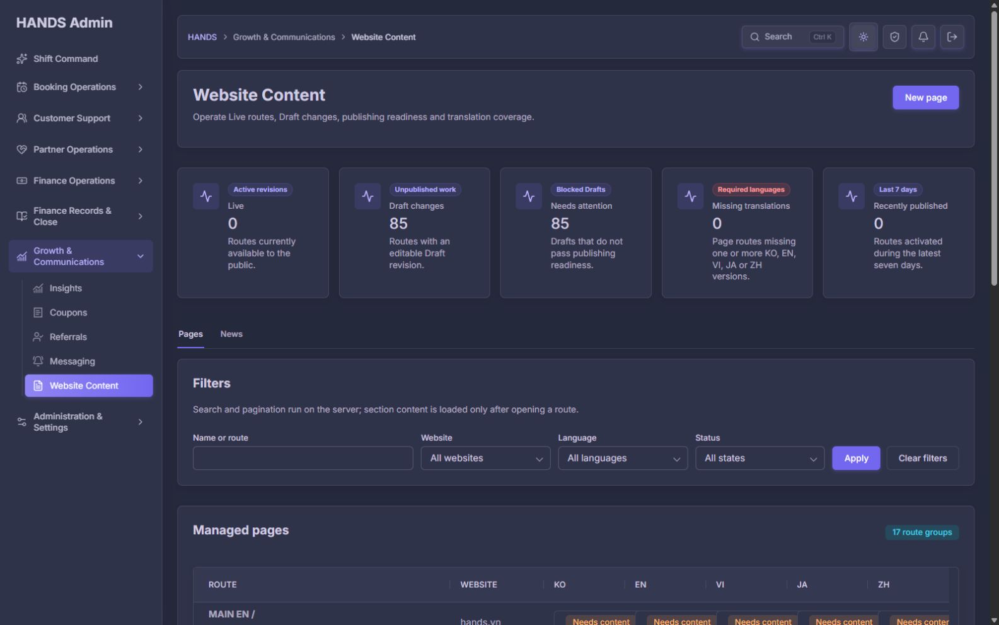

# Website Content 최종 재감사 보고서

- 감사일: 2026-08-12
- 대상: `http://localhost:3101/website-content`
- 평가 환경: 로그인된 관리자 세션, 1600×1000 데스크톱 뷰포트
- 감사 관점: 1인 운영자가 페이지 생성·수정·번역·검토·게시·복구를 안전하고 빠르게 수행할 수 있는가
- 근거: 현재 실행 화면, DOM/상호작용, 관리자·API·공개 웹 코드, 현재 DB 목록, 집중 테스트
- 범위: Pages, News, 새 페이지/기사, 상세 Overview/Content/SEO & Publishing/Activity, 섹션 편집, 삭제 확인, 필터, 오류 복구, 다크 테마

## 1. 최종 판정

**전체 점수: 68/100 — 시각적·구조적 개선은 확실하지만, 현재 상태로는 콘텐츠 운영 기능의 정식 출시를 보류하는 것이 안전하다.**

이전 감사의 핵심 방향인 Pages/News 분리, 언어 매트릭스, Draft/Live 리비전, 서버 필터·페이지네이션, 미리보기, 권한 분리, 게시 전 준비 상태, 감사 로그의 기초는 실제 코드에 반영됐다. 화면도 기존의 단순 CRUD보다 훨씬 운영 도구에 가까워졌다.

하지만 남은 문제는 장식이나 문구 수준이 아니다. 현재 DB에는 **17개 경로 그룹·85개 언어 페이지가 모두 `UNKNOWN`/게시 준비 미완료**인데, 소스의 최신 사이트 구조 정의는 **34개 경로 그룹·170개 언어 페이지**를 전제로 한다. 더 심각하게는 구조 부트스트랩 스크립트가 현재의 리비전 모델을 생성하지 않아, 그대로 실행하면 편집 가능한 Draft가 없는 페이지를 다시 만들 수 있다. 공개 웹은 CMS가 Live 0이어도 코드 폴백 페이지를 노출할 수 있어, 관리자가 보는 상태와 방문자가 보는 실제 사이트 사이의 소유권도 불명확하다.

따라서 출시 판단은 다음과 같다.

- **디자인·가독성:** 조건부 통과
- **기본 편집 흐름:** 부분 통과
- **게시 판단의 데이터 신뢰성:** 불합격
- **실패 복구와 긴급 복구:** 불합격
- **운영자 효율:** 부분 통과
- **정식 출시:** 보류

### 세부 점수

| 영역 | 점수 | 판정 | 핵심 이유 |
|---|---:|---|---|
| 1440px+ 데스크톱 시각 품질 | 78 | 양호 | 일관된 카드·탭·테이블·다크 테마. 다만 큰 상단 카드와 폼 그리드가 작업 공간을 낭비함 |
| 정보 구조와 탐색 | 74 | 보완 필요 | Pages/News와 상세 작업 공간은 좋아졌으나 페이지 정체성·우선 작업 큐·번역 전환이 약함 |
| 운영 문구와 이해도 | 65 | 보완 필요 | `UNKNOWN`, raw JSON, sort order, 서버 페이지네이션 등 개발자 용어가 남음 |
| 입력·오류 복구 | 48 | 불합격 | 잘못된 slug 한 번으로 입력 내용 전체가 사라지고 원인을 알려주지 않음 |
| 게시·삭제·복구 안전 | 55 | 불합격 | 비활성 게시 링크가 실제로 활성, 상세 diff 부재, 첫 게시 후 긴급 비공개 기능 부재 |
| 데이터·사이트 구조 신뢰성 | 45 | 불합격 | DB/manifest 불일치, 레거시 부트스트랩, CMS/코드 폴백 이중 소유 |
| 권한·감사 기반 | 82 | 양호 | 보기/편집/게시/삭제 분리와 감사 이벤트가 구현됨. 변경 사유·사람 친화적 이력은 추가 필요 |
| 성능·구현 건전성 | 75 | 보완 필요 | 서버 페이지네이션은 좋음. 목록마다 전역 요약 쿼리가 반복되고 탭별 요약 범위가 틀림 |

### Impeccable 5축 점수

| 축 | 점수(4점) | 근거 |
|---|---:|---|
| 접근성 | 3 | 레이블·제목·초기 포커스는 좋음. 차단 게시 링크 의미와 반복 링크 이름은 보완 필요 |
| 성능 | 3 | 상세 진입 전 섹션 미로딩, 서버 페이지네이션은 좋음. 목록 렌더마다 8~9개 DB 작업이 발생 |
| 1440px+ 레이아웃 | 2 | 새 페이지/기사 자동 그리드가 한 줄로 늘어나고 편집 화면의 빈 공간이 큼 |
| 테마 | 4 | 라이트·다크 모두 대비와 상태색이 안정적 |
| 구현 무결성 | 2 | 화면 상태와 실제 콘텐츠 소유권, manifest와 DB, 비활성 속성과 실제 동작이 어긋남 |
| **합계** | **14/20** | UI 자체는 양호하지만 운영 신뢰성 게이트는 별도로 실패 |

## 2. 이전 감사 요구사항 반영 상태

### 완료된 기반

1. Pages와 News 작업을 분리했다.
2. 경로 그룹을 행으로, KO/EN/VI/JA/ZH를 열로 배치해 번역 상태를 한눈에 비교할 수 있다.
3. 목록 검색·필터·페이지네이션이 서버에서 처리된다.
4. 상세 화면은 Overview, Content, SEO & Publishing, Activity로 나뉜다.
5. Draft/Live/Archived 리비전과 버전 충돌 검사가 API에 구현됐다.
6. 게시 준비 검증이 서버에도 존재해 UI 우회를 막는다.
7. Draft 미리보기는 만료·버전 바인딩이 있는 서명 토큰을 사용한다.
8. `CONTENT_VIEW`, `CONTENT_EDIT`, `CONTENT_PUBLISH`, `CONTENT_DELETE` 권한이 분리됐다.
9. publish, rollback, discard, delete 등의 감사 이벤트가 남는다.
10. 빈 목록과 API 실패 상태를 구분하는 기본 구조가 있다.
11. 다크 테마가 깨지지 않고 같은 정보 위계를 유지한다.

### 부분 반영

1. **게시 준비 상태:** 상태는 있으나 기존 85개 Draft가 모두 `UNKNOWN`이다.
2. **번역 커버리지:** 5개 언어 행 존재만 확인하며, 최신 필수 경로 누락과 번역 내용의 최신성은 검증하지 않는다.
3. **게시 확인:** 확인 단계는 있으나 필드별 변경 diff와 실제 방문자 영향 요약이 없다.
4. **활동 이력:** 표는 있으나 사람 이름·변경 이유·필드 차이·rollback 활성화 이벤트가 부족하다.
5. **운영자 친화적 폼:** 공통 컴포넌트를 사용하지만 실제 작업 순서와 콘텐츠 유형에 맞춘 편집기는 아니다.

### 미완료 또는 새로 확인된 문제

1. 최신 route manifest와 실제 DB 콘텐츠가 일치하지 않는다.
2. 부트스트랩 스크립트가 리비전 기반 CMS 모델과 호환되지 않는다.
3. CMS Live 상태와 공개 웹의 코드 폴백 소유권이 분리돼 있다.
4. 입력 실패 시 작성 내용을 보존하지 않는다.
5. News 탭이 Pages 전체 지표를 그대로 보여준다.
6. 게시 불가 링크가 실제로 포커스·클릭 가능한 활성 링크다.
7. 긴급 비공개/게시 취소 기능이 없다.
8. 언어 복제, 번역 기준 언어 비교, 번역 노후화 표시가 없다.

## 3. 실제 화면 흐름별 검수

| 단계 | 화면/업무 | 상태 | 실제 확인 결과 |
|---:|---|---|---|
| 1 | Pages 목록에서 우선 작업 파악 | 주의 | 5개 큰 지표가 첫 화면을 차지하고 85개 문제를 실행 가능한 큐로 바꾸지 못함 |
| 2 | News 목록과 기사 수 파악 | 실패 | 기사 0개인데 Draft changes/Needs attention이 각각 85로 표시됨 |
| 3 | 새 페이지·기사 작성 | 실패 | 필드가 한 줄로 과도하게 벌어지고, 잘못된 입력 제출 시 값이 모두 소실됨 |
| 4 | 상세 페이지 정체성·상태 파악 | 주의 | 제목이 항상 Website Content이며 경로·언어·페이지명이 작업 제목으로 드러나지 않음 |
| 5 | 섹션 편집·정렬·미디어 확인 | 주의 | 내부 key, 숫자 sort, raw URL/JSON 중심이며 유형별 미리보기·드래그 정렬이 없음 |
| 6 | SEO 검토·게시 | 실패 | `UNKNOWN` Draft에서 게시 링크가 활성처럼 보이고 실제 `aria-disabled`도 전달되지 않음 |
| 7 | 활동 이력·rollback 확인 | 주의 | 리비전 표는 있으나 변경자·변경 이유·실제 활성화 이력이 충분히 설명되지 않음 |
| 8 | Draft 경로 삭제 | 실패 | 숨겨진 ID 일치만으로 삭제되며 경로·언어·영향 범위를 다시 입력하지 않음 |
| 9 | 필터·다크 테마 | 양호 | 검색/사이트/언어/상태 필터와 테마는 정상. 필터 범위와 지표 범위 표시는 개선 필요 |

## 4. 화면 근거

### 4.1 Pages 목록

- 카드의 표현과 상태색은 안정적이다.
- 1600px에서도 5개 지표가 지나치게 넓어 실제 페이지 목록은 첫 화면 아래로 밀린다.
- `85 Draft changes`, `85 Needs attention`이 클릭 가능한 큐가 아니어서 운영자는 다시 필터를 조합해야 한다.
- 행의 대표명이 `MAIN EN /company`처럼 내부 사이트·언어·경로를 합친 값이고 경로가 아래에 다시 나와, 사람이 찾는 “회사 소개” 같은 페이지 정체성이 없다.
- 모든 언어 칸이 동일한 `Needs content` 링크라 스크린리더와 빠른 시각 스캔 모두 문맥이 부족하다.

### 4.2 News 목록

- 기사 0개라는 빈 상태는 명확하다.
- 그러나 상단 지표는 Pages의 85개 Draft를 그대로 보여준다. 운영자는 “기사 85개가 막혔다”고 오해할 수 있다.
- 원인은 `listAdminPages(contentType='news')`가 필터 없는 `adminSummary()`를 호출하는 구조다.

### 4.3 새 기사 작성

- 자동 `minmax` 폼 그리드 때문에 제목·slug·날짜·썸네일·본문이 가로 한 줄에 배치된다.
- 본문은 오른쪽 끝의 좁은 textarea가 되어 작성 작업과 화면 구조가 반대로 간다.
- 썸네일은 URL 문자열만 받으며 이미지 선택, 업로드, 미리보기, 대체 텍스트가 없다.
- 본문에 서식, 미리보기, 링크 검사, 글자 수, 저장 중 표시, 자동 저장이 없다.

### 4.4 상세 Overview

- H1이 항상 `Website Content`라 여러 탭을 열면 어떤 페이지를 편집하는지 구별하기 어렵다.
- 사이트·언어·경로는 상태 스트립에 있으나 페이지 이름과 라이브 상태를 작업 제목으로 묶지 못했다.
- `Preview Draft`, `Open Live page`는 기본 버튼 클래스가 빠진 링크라 주요 작업처럼 보이지 않는다.
- `Review Publish`는 차단 상태에서도 가장 강한 primary 색을 가진다.
- Draft-only 페이지의 Danger zone이 모든 작업 공간 하단에 크게 노출돼 일상 작업보다 삭제가 과도하게 강조된다.

### 4.5 섹션 편집

- `hero-1`, `app-overview-2`, `cta-3` 같은 내부 key를 운영자가 직접 이해해야 한다.
- 모든 섹션에 generic 필드를 노출해 섹션 유형별 필요한 정보와 검증이 약하다.
- 숫자 sort order로 순서를 바꾸고 Advanced JSON을 직접 다루는 방식은 개발자 도구에 가깝다.
- 이미지와 링크가 실제로 어떻게 보이는지 편집 화면에서 확인할 수 없다.
- 오른쪽 편집기가 길어질수록 왼쪽 절반은 빈 공간이 되고 삭제 영역이 바로 이어진다.

### 4.6 SEO & Publishing

- `UNKNOWN`은 운영 상태가 아니라 내부 enum이다.
- “Review and publish revision 1”이 활성 primary 링크로 보인다.
- 소스는 `aria-disabled="true"`를 전달하려 하지만 `AdminFormControlLink`가 해당 속성을 최종 `<a>`에 넘기지 않아 실제 DOM에는 없다.
- href도 같은 게시 섹션 앵커로 유지돼 키보드 포커스와 클릭을 허용한다. 서버 게시 우회는 막혀도 UI 의미는 틀리다.
- SEO 제목/설명 카운터, 검색 결과 미리보기, Open Graph, 언어별 canonical/hreflang, 깨진 링크/이미지 검사가 없다.

### 4.7 삭제 확인

- 초기 포커스가 Cancel인 점은 안전하다.
- 그러나 서버 확인은 숨겨진 `confirmationId === pageId`에 의존한다. 사람이 실제 경로를 다시 확인하는 단계가 아니다.
- 모달 문구에 사이트, 언어, URL, 섹션 수, Live 이력, 삭제 후 영향이 한 번에 나오지 않는다.

### 4.8 오류 복구

- `Bad slug`를 제출하자 서버가 거부했지만 새 기사 화면이 아니라 News 목록으로 이동했다.
- 입력한 제목·본문·날짜·URL 값은 모두 사라졌다.
- “No success was recorded. Reload the Draft before retrying.”은 신규 기사 작성에는 맞지 않고, 어느 필드가 잘못됐는지 알려주지 않는다.
- `runAction`이 대부분의 오류를 `status=failed`로 축약하고 redirect하기 때문에 같은 문제가 새 페이지·섹션 편집에서도 재현될 수 있다.

### 4.9 다크 테마

- 카드, 표, 필터, 경고색의 대비가 유지된다.
- 다크 테마 자체에서 출시를 막는 결함은 확인되지 않았다.

## 5. 우선순위별 핵심 발견

### P0 — 즉시 장애

현재 재현된 P0는 없다. 다만 아래 P1은 콘텐츠 기능을 정식 운영하기 전에 반드시 닫아야 하는 출시 게이트다.

### P1 — 출시 전 필수 수정

#### P1-1. route manifest, DB, 부트스트랩 모델을 하나로 맞춰야 한다

**근거**

- 현재 관리 목록: 17개 경로 그룹, 85개 언어 페이지.
- `infra/scripts/bootstrap-public-site-structure.mjs`의 최신 구조: 34개 경로 그룹, 170개 언어 페이지.
- 현재 DB에는 `/partners/[city]/[slug]`가 있지만 공개 웹 경로 해석은 `/partners/[city]/[district]`, `/partners/[city]/[district]/[slug]`를 사용한다.
- 부트스트랩은 과거 `PublicSitePage.sections`를 upsert하며 현재 필수인 `PublicSitePageRevision`과 `draftRevisionId`를 만들지 않는다.

**운영 영향**

- 필요한 페이지가 관리자 목록에 없고, 잘못된 동적 템플릿이 남을 수 있다.
- 지금 부트스트랩을 재실행하면 목록에는 있으나 편집·미리보기·게시가 불가능한 고아 Draft가 생길 수 있다.

**수정 방법**

1. route manifest를 단일 타입 안전 상수 또는 데이터 파일로 만들고 bootstrap, API completeness, public route mapping이 같이 사용하게 한다.
2. 부트스트랩을 revision-aware idempotent migration으로 다시 작성한다.
3. 실행 전 dry-run에서 생성/유지/이동/삭제 후보와 언어별 개수를 보여준다.
4. `/partners/[city]/[slug]`를 새 district 구조로 명시적으로 이관하고 자동 삭제하지 않는다.
5. DB 제약 또는 검증 스크립트로 모든 Draft-only 페이지가 `draftRevisionId`와 최소 1개 revision을 갖도록 보장한다.

**완료 기준**

- dry-run 결과가 예상 34그룹×5언어와 일치한다.
- 두 번 실행해 두 번째 실행의 변경 건수가 0이다.
- 생성된 모든 페이지가 관리자 편집, preview, readiness 평가까지 가능하다.

#### P1-2. CMS와 코드 폴백의 페이지 소유권을 명시해야 한다

**근거**

- 관리자 지표는 Live 0이다.
- 공개 웹 `[locale]/[[...slug]]/page.tsx`는 CMS 페이지가 없으면 홈·뉴스·추천·법률·파트너·채용 등의 코드 폴백을 렌더링할 수 있다.

**운영 영향**

- 관리자는 “아무것도 Live가 아니다”라고 보지만 방문자는 페이지를 볼 수 있다.
- CMS에서 수정해도 실제 페이지에 반영되지 않거나, 첫 게시 순간 코드 폴백이 예고 없이 교체될 수 있다.

**수정 방법**

- 각 route에 `CMS Live`, `Code fallback`, `Not served` 소유권 상태를 계산해 관리자 목록과 상세에 표시한다.
- route별 cutover 체크리스트를 만든다: 내용 비교 → 링크/SEO 검증 → preview 승인 → CMS publish → fallback 제거.
- cutover 전까지 “게시하면 현재 코드 페이지를 대체합니다” 경고와 diff/스크린샷 확인을 제공한다.

#### P1-3. 탭·필터 범위에 맞는 신뢰 가능한 지표가 필요하다

**근거**

- News 0개에서도 Live 0, Draft changes 85, Needs attention 85, Missing translations 0, Recently published 0이 표시된다.
- `site-content.service.ts`에서 Pages와 News 목록 모두 필터 없는 `adminSummary()`를 호출한다.
- `missingTranslations`는 존재하는 그룹의 locale 수만 세므로 manifest에 없는 경로를 발견하지 못한다.

**수정 방법**

- 요약 API에 `contentType`, `site`, `locale`, `readiness`, `query` 범위를 명시한다.
- 전역 지표를 유지하려면 카드에 `전체 Pages 기준`이라고 표시하고 News에는 기사 전용 지표를 별도 제공한다.
- 번역 누락은 manifest 필수 경로×필수 locale 행렬과 비교한다.
- `UNKNOWN`, `BLOCKED`, `READY`, stale translation, missing route를 별도 수치로 나눈다.

#### P1-4. 입력 오류에서 값과 위치를 보존해야 한다

**근거**

- 잘못된 slug 제출 후 목록으로 redirect되고 모든 값이 사라졌다.
- `runAction`은 일반 오류를 `failed`로 축약한다.

**수정 방법**

- 신규/편집 폼은 `useActionState` 또는 동일한 서버 액션 결과 패턴으로 필드별 오류를 반환한다.
- 실패 시 같은 폼에 머물고 입력값, 스크롤, 선택 섹션을 보존한다.
- 첫 오류 필드에 포커스를 이동하고 상단 요약과 필드 아래 오류를 함께 보여준다.
- slug는 입력 중 정규화·미리보기하고 `pattern`과 서버 검증 메시지를 동일하게 유지한다.

#### P1-5. 게시 불가 상태는 실제 비활성 컨트롤이어야 한다

**근거**

- `page.tsx`는 `aria-disabled`를 전달하지만 `AdminFormControlLink`가 이를 드롭한다.
- 차단 상태에서도 href와 primary 스타일이 유지된다.

**수정 방법**

- 차단 시 링크가 아니라 `disabled` button 또는 비동작 상태 요약을 렌더링한다.
- 준비 이슈를 모두 해결하기 전에는 publish 확인 URL 자체를 만들지 않는다.
- 공통 링크 컴포넌트가 표준 anchor 속성을 안전하게 전달하도록 타입·렌더 테스트를 추가한다.

#### P1-6. 긴급 비공개와 첫 게시 복구 경로를 추가해야 한다

**근거**

- rollback은 Archived revision이 있어야 한다.
- 첫 게시 직후 심각한 오류가 발견되면 이전 revision이 없고, 현재 기능에는 unpublish/take offline이 없다.

**수정 방법**

- 권한 분리된 `Take offline` 액션을 추가한다.
- 현재 Live snapshot, 사이트·언어·경로, 방문자 영향, 변경 사유를 요구한다.
- 원자적으로 activeRevision을 해제하고 감사 이벤트·운영 알림을 남긴다.
- 코드 폴백으로 자동 회귀할지 404/maintenance를 낼지 route ownership 정책에 따라 명시한다.

#### P1-7. 게시 전 field-level diff와 영향 요약이 필요하다

**근거**

- 현재 `draftChangeSummary`는 섹션 수와 일부 SEO 변경 정도만 설명한다.
- 섹션 제목·본문·이미지·링크·순서·활성 상태의 실제 전후 값이 보이지 않는다.

**수정 방법**

- Live와 Draft를 정규화해 필드별 추가/수정/삭제 diff를 만든다.
- publish 확인 화면에 변경 섹션, SEO, canonical/noindex, 번역, 링크 검사, 방문 URL, 코드 폴백 대체 여부를 보여준다.
- 최초 게시, 일반 수정, 대규모 삭제를 서로 다른 위험 수준으로 표시한다.

#### P1-8. 85개 레거시 Draft와 5개 언어 작업을 일괄 정리할 도구가 필요하다

**근거**

- 모든 Draft가 `UNKNOWN`이라 개별 저장 전에는 실제 문제 수를 알 수 없다.
- 34개 경로×5언어를 수동으로 열고 저장하는 것은 1인 운영에 비현실적이다.

**수정 방법**

- readiness 재평가 dry-run과 일괄 실행을 제공한다.
- 기준 언어 복제, 번역 필요 표시, 원문 revision이 바뀐 번역의 stale 표시를 지원한다.
- 목록에서 `UNKNOWN만`, `BLOCKED만`, `원문보다 오래된 번역만` 바로 열 수 있게 한다.

### P2 — 출시 직후 빠르게 개선

#### P2-1. 1440px+ 폼 레이아웃을 업무 순서에 맞게 재구성한다

- 새 기사: 기본 정보(제목/slug/날짜) → 썸네일 → 본문 → SEO → 저장 순서의 세로 폼.
- 새 페이지: 페이지 정체성 → URL/언어 → SEO → 생성 순서의 최대 2열 폼.
- 긴 본문과 설명은 항상 전체 폭을 사용한다.
- primary 저장 버튼은 폼 마지막과 sticky footer 중 한 곳에 일관되게 둔다.

#### P2-2. 상세 헤더에서 페이지 정체성과 핵심 액션을 통합한다

권장 헤더:

`회사 소개 · KO`  
`hands.vn/company · Draft · 게시 준비 검증 필요`

오른쪽 액션은 `미리보기`, `Live 열기`, `게시 준비 검토` 순서로 두고, 삭제는 `더보기 > 위험 작업`으로 이동한다.

#### P2-3. 섹션 편집기를 콘텐츠 유형별로 만든다

- key는 자동 생성하고 고급 설정에 숨긴다.
- 숫자 sort order 대신 드래그 핸들과 위/아래 이동 버튼을 제공한다.
- Hero, FAQ, CTA, Legal 등 유형별 필드와 유효성 검사를 사용한다.
- 이미지 선택/미리보기/alt, 링크 대상/검사, CTA preview를 인라인 제공한다.
- 원본 JSON은 디버그 권한 또는 고급 모드에서만 보여준다.

#### P2-4. 필터와 지표를 실제 작업 큐로 연결한다

- 각 지표를 클릭하면 해당 범위로 필터된 목록을 연다.
- 5개 큰 카드 대신 `즉시 처리`, `번역`, `최근 게시`의 compact summary strip을 권장한다.
- 필터 설명의 서버 구현 문구를 제거한다.
- 적용된 필터 chip, 결과 개수, 초기화, 저장된 보기 기능을 제공한다.

#### P2-5. 상세 query state 오염을 제거한다

- 섹션 선택 후 `sectionId`가 workspace 탭, Back to Pages, New page 링크에 남는다.
- list와 detail query schema를 분리하고 화면 전환 때 허용된 파라미터만 직렬화한다.
- Back to Pages에는 list 필터만, detail tab에는 pageId/workspace만 유지한다.

#### P2-6. 링크와 상태의 접근 가능한 이름을 구체화한다

- `Needs content` 대신 `회사 소개 · KO — 게시 준비 미완료`처럼 페이지와 언어를 이름에 포함한다.
- 상태색만 보지 않아도 state를 텍스트로 이해할 수 있게 한다.
- 반복되는 Edit/Delete 링크에도 섹션 제목을 포함한다.

#### P2-7. 활동 이력을 사람이 읽을 수 있는 감사 타임라인으로 바꾼다

- 원시 operator ID 대신 이름·이메일·역할을 표시한다.
- 변경 사유, revision 번호, 전환 전후 상태, 관련 audit event를 묶는다.
- rollback이 옛 revision을 다시 활성화한 시점과 실행자를 별도 이벤트로 표시한다.
- solo 운영을 고려해 모든 변경에 2인 승인을 강제하지 말고, 법률·결제·개인정보 페이지에만 선택적 승인 정책을 둔다.

#### P2-8. 목록 요약 쿼리를 줄이고 범위를 캐시한다

- Pages 목록은 그룹 수·페이지 행·요약을 포함해 대략 9개 DB 작업, News는 약 8개를 수행한다.
- 필터 입력마다 전역 summary를 다시 계산할 필요가 없다.
- 범위가 명시된 단일 집계 쿼리 또는 짧은 TTL 캐시를 사용하고, 상세와 목록 fetch를 프로파일링한다.

### P3 — 정리 및 완성도

1. 미리보기 링크에 만료 시각과 새로고침 동작을 표시한다.
2. 실제 페이지에서 사용하지 않는 `website-content-pagination.ts`와 전용 spec의 필요성을 재검토해 제거하거나 현재 페이지네이션에 통합한다.
3. `1 route groups`를 단·복수 처리하거나 한국어 운영 문구로 바꾼다.
4. SEO 입력에 글자 수와 검색 결과 미리보기를 추가한다.

## 6. 권장 화면 구조

### Pages/News 목록

1. **페이지 제목 + primary CTA**
2. **Compact 작업 요약:** 검증 필요, 게시 차단, 번역 누락, 최근 게시
3. **작업 큐:** “검증 필요 85”, “번역 오래됨”, “경로 누락”, “최근 실패”
4. **검색·필터:** 한 줄, 적용 chip, 저장된 보기
5. **경로 그룹 표:** 사람 친화적 페이지명, 실제 경로, 소유권, 5개 언어 상태

권장 열:

| 페이지 | 실제 제공 방식 | KO | EN | VI | JA | ZH | 최근 변경 |
|---|---|---|---|---|---|---|---|
| 회사 소개 `/company` | Code fallback | 검증 필요 | 검증 필요 | … | … | … | 3일 전 |

### 페이지 상세

1. **헤더:** 페이지명, 사이트, 언어, 경로, 소유권, Draft/Live 상태
2. **액션:** 미리보기, Live 열기, 게시 준비 검토
3. **탭:** 개요 / 콘텐츠 / 게시·SEO / 이력
4. **콘텐츠 편집:** 섹션 목록 + 유형별 편집기 + 실제 preview
5. **위험 작업:** 더보기 메뉴 또는 별도 설정 탭

1440px+에서는 콘텐츠 편집을 `섹션 목록 280px / 편집기 유동 / preview 380px`의 3영역으로 구성할 수 있다. preview를 제공하지 않는 상태라면 2열만 사용해 빈 공간을 줄이는 편이 낫다.

## 7. 운영 문구 교체안

| 현재 문구 | 권장 문구 |
|---|---|
| Search and pagination run on the server; section content is loaded only after opening a route. | 페이지 이름이나 주소로 찾고, 사이트·언어·상태로 범위를 좁히세요. |
| UNKNOWN | 검증 필요 |
| Needs content | 게시 준비 미완료 |
| Review Publish | 게시 준비 검토 |
| Review and publish revision 1 | 변경 내용 확인 후 게시 |
| Operator label | 관리용 페이지 이름 (방문자에게 보이지 않음) |
| Section key | 내부 섹션 ID (자동 생성) |
| Sort order | 화면에서 드래그해 순서를 변경하세요. |
| Raw JSON is optional | 고급 설정은 필요한 경우에만 사용하세요. |
| No success was recorded. Reload the Draft before retrying. | 저장하지 못했습니다. 표시된 항목을 확인하세요. 입력 내용은 그대로 보존했습니다. |
| 잘못된 slug의 필드 오류 없음 | URL 주소는 영문 소문자, 숫자, 하이픈만 사용할 수 있습니다. |
| 1 route groups | 1개 페이지 경로 |
| Delete Draft route? | 이 페이지 초안을 영구 삭제할까요? |

## 8. 구현 순서

### Gate A — 출시 전

1. revision-aware route manifest migration과 dry-run 도구 작성.
2. DB 17그룹과 manifest 34그룹 차이 검토·승인·이관.
3. CMS/코드 폴백 route ownership 및 cutover 정책 구현.
4. 85개 Draft readiness 일괄 재평가; `UNKNOWN` 0건 만들기.
5. Pages/News/필터별 summary 범위 수정.
6. 폼 오류를 필드 단위로 반환하고 값·위치 보존.
7. 차단 게시 컨트롤의 실제 disabled 처리와 컴포넌트 테스트.
8. 게시 전 field-level diff, 최초 게시 영향 경고 추가.
9. 긴급 Take offline 구현과 감사 이벤트 추가.
10. 페이지 삭제에 typed route 확인·변경 사유·영향 요약 추가.

### Gate B — 운영 효율

1. 1440px+ 새 페이지/기사 폼 재배치.
2. 상세 identity header와 primary action hierarchy 개선.
3. 유형별 섹션 편집기, 드래그 정렬, 이미지/링크 preview.
4. 기준 언어 복제와 stale translation 표시.
5. 클릭 가능한 작업 지표와 저장된 보기.
6. 감사 타임라인과 사람 친화적 운영자 정보.

### Gate C — 고도화

1. 예약 게시와 예약 해제.
2. 자산 라이브러리, 사용처 추적, 이미지 최적화.
3. 자동 링크·이미지·SEO·접근성 검사.
4. 대량 편집과 번역 공급 워크플로.

## 9. 수용 기준

### 데이터·구조

- manifest, DB, 공개 웹 route resolver가 같은 route key를 사용한다.
- migration dry-run에 생성/수정/이관/유지/삭제 후보가 명확히 나온다.
- 모든 Draft 페이지가 revision-backed이며 편집·미리보기 가능하다.
- 목록에서 manifest 누락 경로와 stale 경로를 감지한다.
- `UNKNOWN` readiness가 0건이다.

### 지표

- News 0개일 때 기사 전용 Live/Draft/Blocked/Recently published도 0 또는 정확한 값이다.
- 전역 지표라면 카드에 전역 범위를 명시한다.
- 필터 적용 시 카드와 결과 범위의 관계가 명확하다.

### 입력·오류

- 잘못된 slug 제출 후 같은 폼에 머문다.
- 모든 입력값이 보존되고 첫 오류에 포커스가 간다.
- 오류 메시지가 문제 필드와 수정 방법을 알려준다.
- 네트워크/API 오류에서도 중복 레코드가 만들어지지 않는다.

### 게시·복구

- `BLOCKED`/`UNKNOWN`이면 publish 확인 URL이 생성되지 않는다.
- 비활성 상태는 DOM에서 실제 disabled 의미를 가진다.
- 게시 확인에 Live↔Draft 필드별 diff와 코드 폴백 대체 영향이 보인다.
- 최초 게시 후에도 권한·사유·감사 로그가 있는 Take offline이 가능하다.
- rollback과 take offline 후 공개 웹 결과가 자동 테스트로 검증된다.

### 삭제

- 페이지 삭제 시 사이트, 언어, URL, 섹션 수, Live 이력을 보여준다.
- 운영자가 정확한 경로를 입력해야 삭제할 수 있다.
- 서버는 typed value를 실제 page path와 비교한다.
- 성공/실패 감사 로그에 사유와 대상 snapshot이 남는다.

### 1440px+ UI

- 새 기사 본문은 전체 폭 또는 주 편집 열을 사용한다.
- 긴 폼이 한 줄에 과도하게 펼쳐지지 않는다.
- 상세 제목만 보고 페이지·언어·환경·상태를 식별할 수 있다.
- 일상 작업 화면에서 삭제가 primary action과 경쟁하지 않는다.

## 10. 테스트와 검증 결과

### 통과

| 명령 | 결과 |
|---|---|
| `npm.cmd run test --workspace @massage-vn/admin-web -- app/website-content/page.spec.tsx app/website-content/actions.spec.ts app/website-content/website-content-pagination.spec.ts` | 3 files, 13 tests 통과 |
| `npm.cmd run test --workspace @massage-vn/api -- src/site-content/site-content.service.spec.ts src/admin/admin-operator-category.guard.spec.ts` | 2 files, 57 tests 통과 |
| `npm.cmd run test --workspace @massage-vn/public-web -- lib/site-content.spec.ts components/public-site-section.spec.tsx` | 2 files, 5 tests 통과 |
| 관리자 Website Content 관련 ESLint | 통과 |
| Admin Web typecheck | 통과 |
| API typecheck | 통과 |
| `npm.cmd run local:status` | API/Admin/DB/Redis 정상 |

### 테스트 공백

현재 통과한 테스트만으로 아래 문제는 잡히지 않는다.

1. News/Pages/필터 범위별 summary 정확성.
2. route manifest와 public resolver의 일치.
3. bootstrap이 revision-backed Draft를 만드는지.
4. `AdminFormControlLink`가 `aria-disabled`를 보존하는지.
5. 서버 액션 실패 후 폼 값과 오류 위치가 보존되는지.
6. CMS Live와 코드 폴백 중 실제 소유권이 무엇인지.
7. 최초 게시 후 긴급 take offline과 공개 웹 반영.
8. field-level diff가 삭제·순서·이미지·링크 변경을 모두 표시하는지.

### 정적 UI 탐지기

Impeccable detector는 공통 CSS의 `side-tab` 관련 경고 6건을 찾았지만 Website Content 표면과 직접 관련되지 않아 이번 우선순위에는 포함하지 않았다.

## 11. 코드 근거 위치

- 목록·상세·삭제·섹션·게시 UI: `apps/admin_web/app/website-content/page.tsx`
- 서버 액션 오류 축약/redirect: `apps/admin_web/app/website-content/actions.ts`
- 링크 속성 전달: `apps/admin_web/components/admin-form-controls.tsx`
- 자동 폼 그리드: `apps/admin_web/app/globals.css`
- 목록/summary/publish/rollback/readiness: `apps/api/src/site-content/site-content.service.ts`
- 공개 웹 CMS/폴백 선택: `apps/public_web/app/[locale]/[[...slug]]/page.tsx`
- 사이트 구조 정의·부트스트랩: `infra/scripts/bootstrap-public-site-structure.mjs`
- 현재 화면의 경로 목록 근거: `docs/audits/website-content-final-reaudit-evidence-2026-08-12/15-route-inventory.json`

## 12. 최종 권고

이번 개선은 **관리자 CRUD 화면을 콘텐츠 운영 워크스페이스로 바꾸는 데 성공**했다. 특히 리비전, 권한, 서버 검증, 미리보기, 언어 매트릭스는 다시 만들 필요가 없는 좋은 기반이다.

다음 작업은 화면을 더 예쁘게 꾸미는 일이 아니라 **관리자가 보는 정보와 실제 공개 사이트가 1:1로 일치하도록 만드는 일**이어야 한다. `route manifest → revision-backed Draft → readiness → preview → field diff → publish → take offline/rollback → public result`의 한 줄짜리 신뢰 체계를 먼저 완성해야 한다. 그 뒤 폼·섹션 편집기·번역 복제·자산 도구를 개선하면 1인 운영에서도 충분히 관리 가능한 수준으로 올라갈 수 있다.

이번 감사 기준의 출시 재검수 조건은 다음 6가지다.

1. manifest/DB/public resolver 일치.
2. `UNKNOWN` 0건.
3. CMS/코드 폴백 소유권 표시.
4. 입력 오류 시 값 보존.
5. publish diff와 실제 disabled 처리.
6. 최초 게시 후 take offline 가능.

이 6가지를 닫은 뒤 다시 검수하면 출시 가능 여부를 훨씬 신뢰도 높게 판단할 수 있다.
