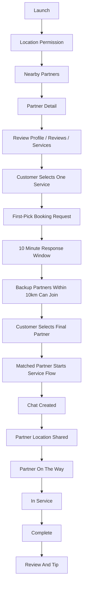
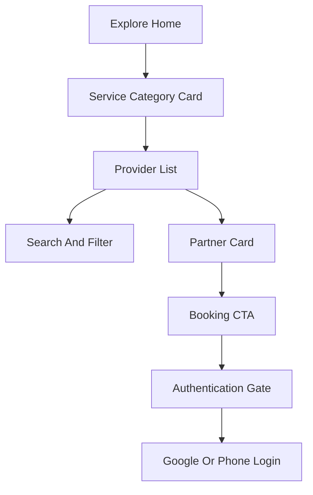
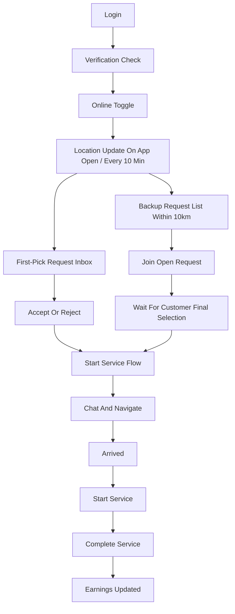

# UX Flow Map

## Phase 1 Navigation Shape

Customer app uses five tabs:

- Home: location, service categories, nearby partners
- Partners: searchable partner list and partner profile
- Bookings: active booking, matching, history
- Chat: rooms and messages
- Profile: account, addresses, wallet, support

Partner app uses five tabs:

- Requests: open matching jobs and invitations
- Schedule: availability and upcoming services
- Earnings: payouts, completed jobs, tips
- Chat: customer conversations
- Profile: verification, services, online toggle

Admin web uses sidebar navigation:

- Dashboard
- Customers
- Partners
- Verification
- Bookings
- Matching
- Payments
- Reviews/Reports
- Coupons
- Analytics
- Audit Log

## Customer Booking Sequence

## Reference Dynamic Flow Notes

Physical-device dynamic analysis confirmed this high-level customer flow shape:

MVP Phase 1 keeps the same broad order: explore first, partner browse second, partner detail third, booking action fourth. HANDS adds a controlled matching window after the first-pick request so backup partners can appear without removing the customer's final choice.

## Partner Sequence

## UX Comparison Principles

- Preserve: onboarding/auth/location prompts, tab-based IA, partner browsing before booking, booking detail/status timeline, chat placement, partner verification sequence.
- Change: original branding, artwork, copy, colors, icons, and the original matching implementation.
- Improve: make first-pick, backup participation, final customer choice, wallet debt blocks, and partner response state explicit for customers, partners, and operators.
