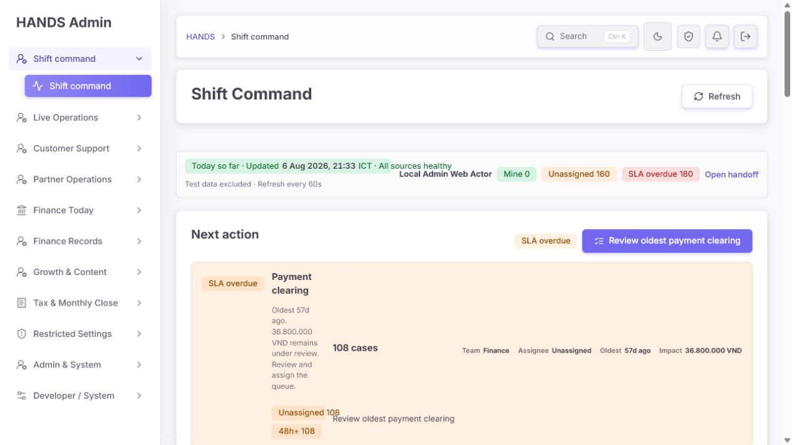
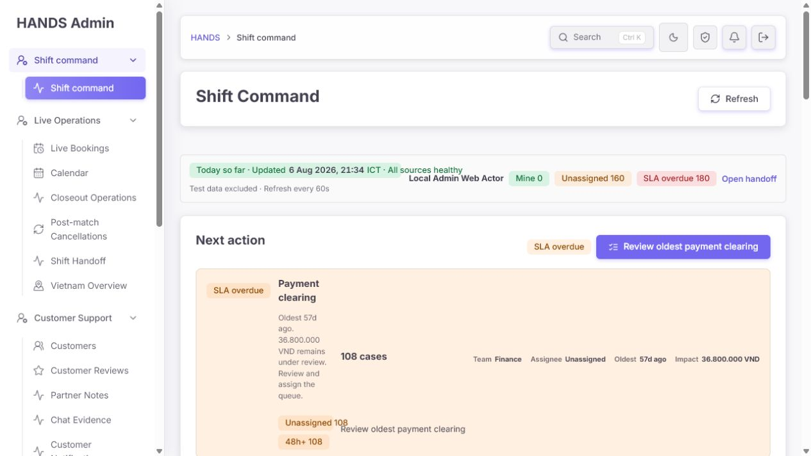
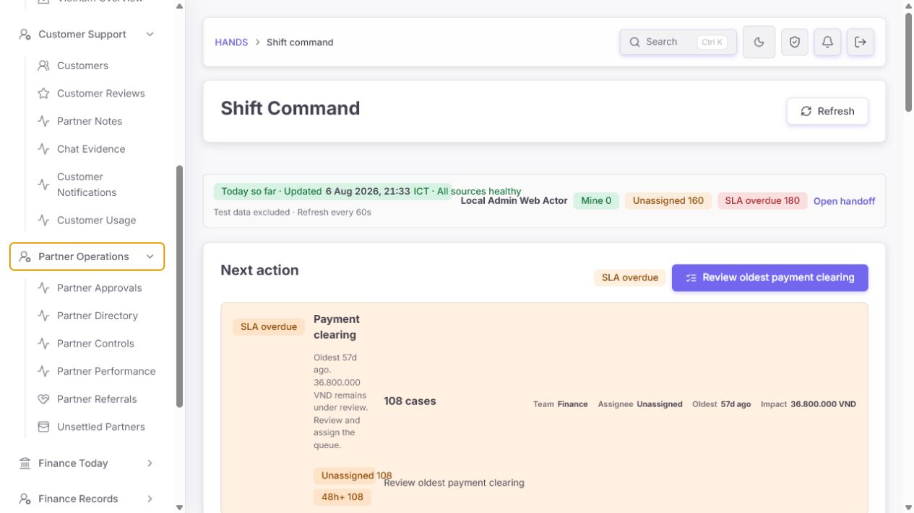
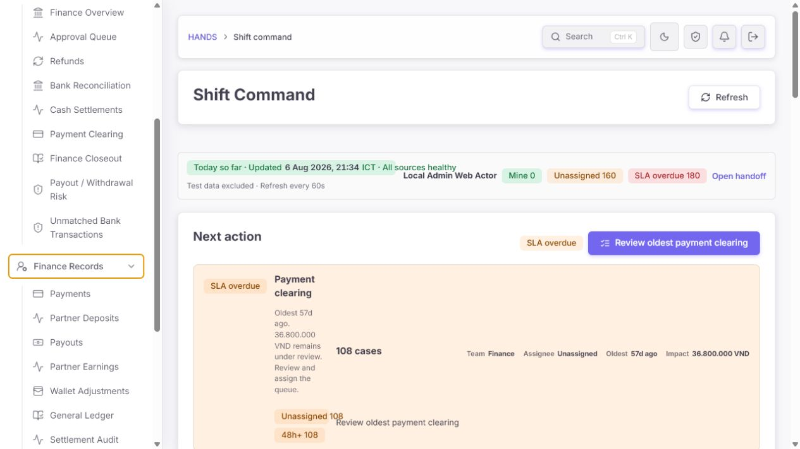
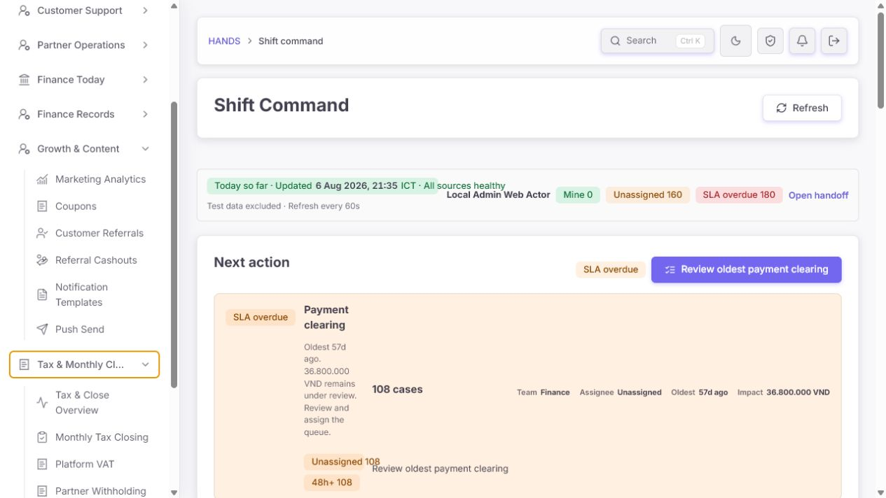
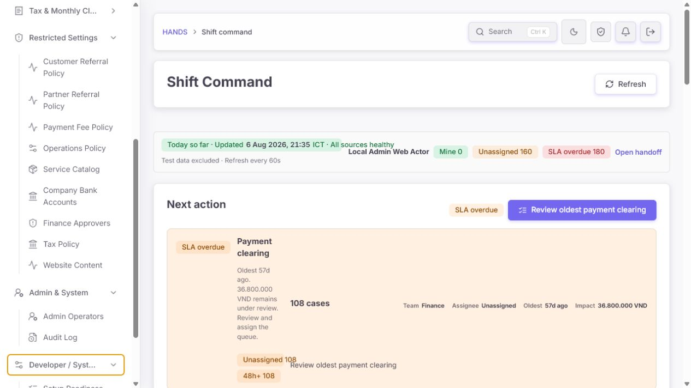
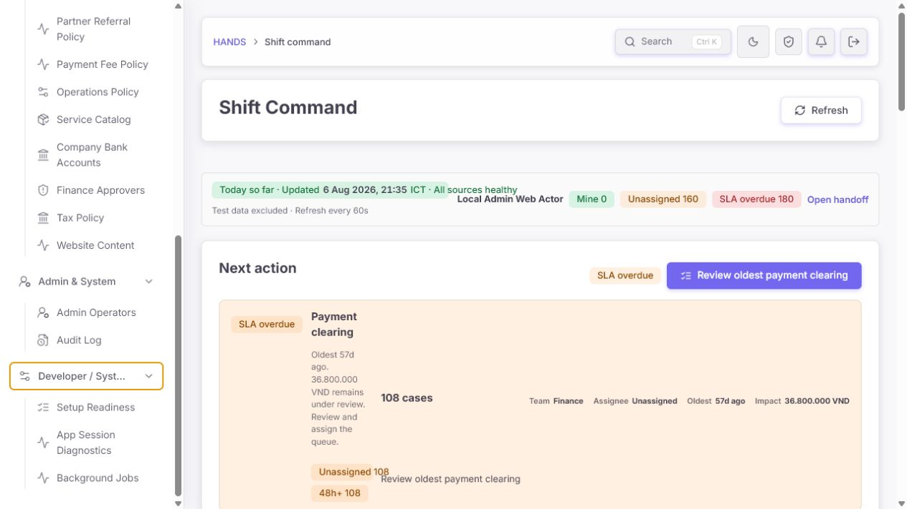
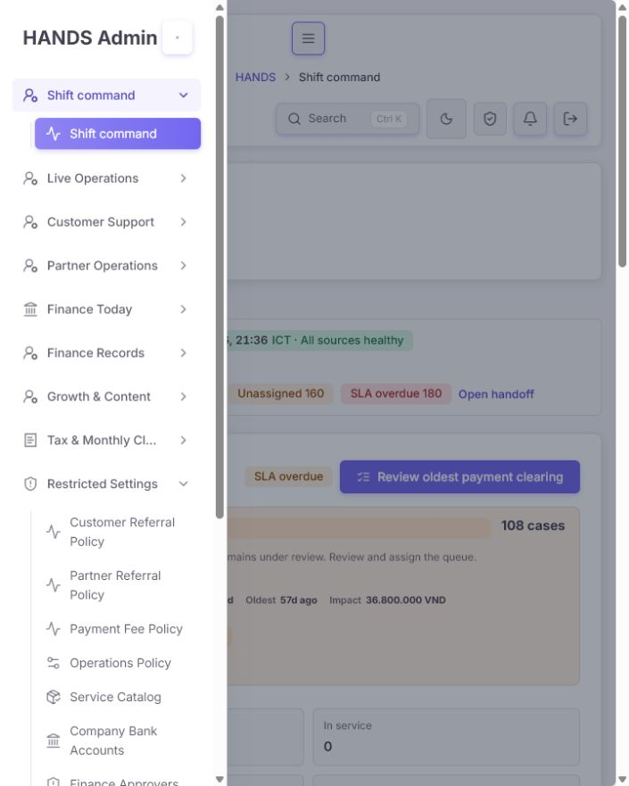
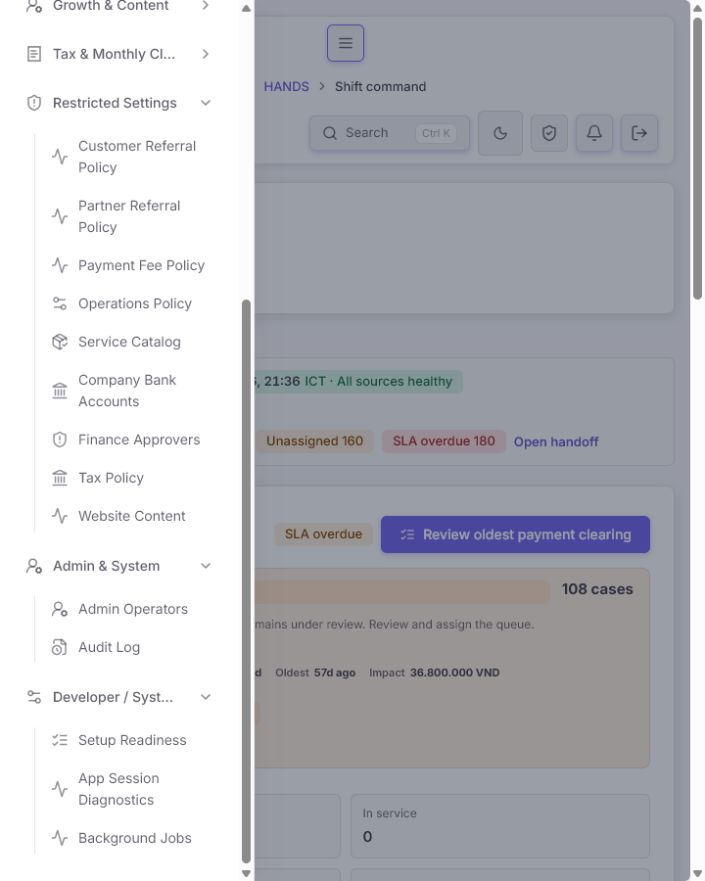

# HANDS Admin 대분류·소분류 정보구조 검수 보고서

- 대상: `http://localhost:3101/`
- 검수 시각: 2026-08-06 21:33–21:45 (Asia/Bangkok)
- 관점: 실제 운영자, 업무 소유권, 빠른 탐색, 권한 분리, 모바일 drawer
- 범위: 실제 사이드바, 현재 source의 navigation 정의, route별 permission category, 대표 page title/description, active route matching, 관련 specs
- 코드 변경: 없음

## 1. 결론

현재 분류는 **큰 방향은 좋아졌지만 그대로 확정하기에는 아직 이르다.** `Customer Support`, `Partner Operations`, `Finance Today`, `Finance Records`, `Tax & Monthly Close`처럼 운영자가 업무 성격을 예측할 수 있는 축이 생겼고, 권한에 따라 link를 개별 노출하는 구조도 안전하다.

하지만 세 가지 구조 문제가 남아 있다.

1. **업무 도메인과 다른 그룹에 들어간 항목**이 있다. 대표적으로 `Referral Cashouts`는 page 자체가 `Finance queue`라고 정의하고 permission도 `FINANCE_SETTLEMENTS`인데 `Growth & Content`에 있다.
2. **같은 page의 filter/policy mode를 별도 global menu처럼 반복**한다. 전체 href는 다르지만 base route 기준으로 6개 중복 계열이 있다.
3. `Restricted Settings`는 업무 도메인이 아니라 위험도 기준의 분류다. 그 결과 Growth, Finance, Tax, Operations의 설정이 한곳에 섞이고 `Website Content`가 정작 `Growth & Content` 밖에 있다.

최종 판정:

| 영역 | 판정 | 핵심 이유 |
|---|---|---|
| 대분류 명칭 | 보완 필요 | `Live`, `Today`, `System`이 실제 범위와 다름 |
| 소분류 배치 | 보완 필요 | Finance/Growth/Insights 업무가 교차 배치됨 |
| 중복 | 보완 필요 | base route 중복 6계열, filter link가 global nav를 늘림 |
| 권한 안전 | 양호 | link별 permission category로 section을 필터링함 |
| desktop 탐색 | 조건부 양호 | collapse는 유용하나 여러 section 동시 open으로 길어짐 |
| mobile 탐색 | 보완 필요 | 열려 있던 section과 sidebar scroll 위치가 유지돼 중간에서 시작할 수 있음 |
| 코드 일관성 | 보완 필요 | 새 label이 icon map에 없어 반복 fallback icon이 많음 |

차단 수준의 P0는 없다. 다만 P1 정보구조 문제를 그대로 두면 운영자가 “어디에 있을 것 같은가”보다 “전에 어디서 봤는가”에 의존하게 된다.

## 2. 현재 구조 정확 집계

현재 실제 sidebar는 11개 section, 62개 link다.

| 대분류 | 소분류 수 | 판정 | 핵심 조치 |
|---|---:|---|---|
| Shift command | 1 | 불필요한 중첩 | section과 child가 같은 이름이므로 direct home link로 변경 |
| Live Operations | 6 | 부분 적합 | `Live`를 `Operations`로 바꾸고 Vietnam Overview 이동 |
| Customer Support | 6 | 부분 적합 | Notification Delivery, Customer Usage 이동 |
| Partner Operations | 6 | 부분 적합 | Performance, Referrals, Unsettled 이동 또는 global nav 제거 |
| Finance Today | 9 | 명칭·중복 문제 | `Finance Queues`로 변경, Unmatched saved view 제거 |
| Finance Records | 9 | 대체로 적합 | 유지하되 record 성격만 보존 |
| Growth & Content | 6 | 오분류 | Referral Cashouts 이동, Website Content와 Partner Referrals 편입 |
| Tax & Monthly Close | 5 | 가장 일관적 | `Tax & Close`로 줄이고 유지 |
| Restricted Settings | 9 | 재구성 필요 | domain page/tab로 환원하고 global governance만 남김 |
| Admin & System | 2 | 명칭 충돌 | `Access & Audit`로 변경 |
| Developer / System | 3 | 명칭 충돌 | `System Health`로 변경 |

## 3. 잘된 부분

### 3.1 권한과 메뉴 노출이 link 단위로 연결돼 있다

`adminNavSectionsForAccess()`는 각 href를 `adminOperatorCategoryForPath()`에 연결하고 권한이 없는 link를 제거한다. section 전체를 임의로 공개하지 않는다. 이 구조는 유지해야 한다.

### 3.2 일일 action과 retained record를 구분하려는 방향은 맞다

`Finance Today`와 `Finance Records`를 나눈 의도는 좋다. 운영자가 지금 처리할 queue와 과거 evidence를 분리해 찾는 방식은 실제 업무 흐름과 맞는다. 문제는 `Today`라는 이름과 일부 중복 link이지, action/record 분리 자체가 아니다.

### 3.3 native `details/summary`와 active section 자동 open은 합리적이다

별도 accordion library 없이 native control을 사용한다. 현재 route가 속한 section을 자동으로 열고 `aria-current="page"`를 주는 것도 좋다.

### 3.4 exact 동일 href는 없다

현재 spec은 모든 full href가 unique임을 확인한다. legacy alias를 sidebar에서 숨기고 permission category를 강제하는 테스트도 존재한다. 다만 base route 중복은 별도 문제다.

## 4. P1 — 운영자가 실제로 헤매는 구조 문제

### P1-1. `Finance Today`는 실제로 Today가 아니다

`Finance Today` 안에는 다음이 있다.

- `/payouts?range=all&withdrawalStatus=REVIEW_REQUIRED`
- `/finance-tax/bank-reconciliation?range=all&review=unmatched`
- 여러 날짜에 걸친 refunds, cash settlement, closeout backlog

즉 오늘 생성된 업무가 아니라 **현재 열려 있는 action queue**다. `Today`는 범위를 잘못 약속한다.

권장:

- 대분류를 `Finance Queues` 또는 `Finance Operations`로 변경한다.
- `Unmatched Bank Transactions`는 `Bank Reconciliation` page의 selected filter로 남기고 global nav에서는 제거한다.
- `Payout / Withdrawal Risk`는 실제 action entry이므로 `Payouts` records와 함께 둘 수 있지만 active matching을 보강한다.

### P1-2. `Restricted Settings`가 domain 탐색을 깨뜨린다

현재 한 section에 다음이 함께 있다.

- referral policy 2개
- payment fee policy
- operations policy
- service catalog
- company bank accounts
- finance approvers
- tax policy
- website content

이들은 공통 업무가 아니라 “쓰기 권한이 제한됨”만 공통이다. 위험도는 access control의 속성이지 운영자의 탐색 기준이 아니다. 권한 필터는 이미 코드에 있으므로 navigation까지 위험도 기준으로 재분류할 필요가 없다.

권장:

- Customer/Partner Referral Policy는 각 referral page의 `Policy` mode로 유지하고 global nav link는 제거한다.
- Payment Fee Policy도 `Payment Fee Evidence` 안의 policy mode로 유지한다.
- Website Content는 `Growth & Communications`로 이동한다.
- Company Bank Accounts, Finance Approvers, Tax Policy는 `Policies & Access`에 둔다.
- Operations Policy와 Service Catalog도 `Policies & Access`에 둔다.
- `Restricted Settings` section은 제거한다. 위험 항목에는 기존 permission guard와 필요한 경우 lock badge만 사용한다.

### P1-3. 실제 page 소유권과 다른 소분류가 있다

| 현재 위치 | 항목 | 코드상 실제 성격 | 권장 위치 |
|---|---|---|---|
| Growth & Content | Referral Cashouts | page description이 명시적으로 `Finance queue`; permission은 `FINANCE_SETTLEMENTS` | Finance Queues |
| Customer Support | Notification Delivery | Customer·Partner·Admin 전체 delivery 기록 | Growth & Communications 또는 Communications |
| Customer Support | Customer Usage | usage, discovery, conversion, retention analytics | Insights |
| Partner Operations | Partner Performance | supply, quality, wallet risk 분석 | Insights |
| Partner Operations | Partner Referrals | acquisition/onboarding reward | Growth & Communications |
| Partner Operations | Unsettled Partners | unpaid commission/negative wallet | global nav 제거 후 Partner Directory filter와 Finance Overview에서 진입 |
| Live Operations | Vietnam Overview | regional demand/supply aggregate | Insights |
| Restricted Settings | Website Content | public publishing, SEO, section structure | Growth & Communications |

`Chat Evidence`는 permission상 `BOOKINGS_DETAIL`이지만 Support가 고객 결정을 위해 사용하는 evidence이므로 현재 위치를 유지할 수 있다. 이것은 기술 domain과 operator task ownership이 다른 합리적인 예외다.

### P1-4. “URL은 다르지만 같은 화면”인 중복 계열이 6개다

| Base route | 현재 entry | 판단 |
|---|---|---|
| `/partners` | Approvals, Directory, Unsettled | Approvals/Directory 유지, Unsettled global entry 제거 |
| `/referrals/partners` | Partner Referrals, Partner Referral Policy | Policy global entry 제거 |
| `/finance-tax/bank-reconciliation` | Bank Reconciliation, Unmatched Bank Transactions | Unmatched entry 제거 |
| `/payouts` | Payout Risk, Payouts | action/record saved view로 조건부 유지 |
| `/referrals/customers` | Customer Referrals, Customer Referral Policy | Policy global entry 제거 |
| `/finance-tax/payment-fees` | Evidence, Policy | Policy global entry 제거 |

현재 `does not repeat an exact navigation target` spec은 full href 문자열만 비교한다. 따라서 query만 다른 중복은 모두 통과한다. test 이름과 검증 범위가 운영자가 느끼는 중복을 대표하지 못한다.

### P1-5. query-specific nav active 상태가 너무 엄격하다

`hrefMatchesPath()`는 query가 있는 menu item을 다음처럼 비교한다.

```ts
new URLSearchParams(search).toString() === hrefQuery
```

실제 확인 결과:

| 현재 URL | active 판단 |
|---|---|
| 정확히 `range=all&withdrawalStatus=REVIEW_REQUIRED` | `true` |
| 위 URL에 `page=2` 추가 | `false` |
| 같은 query를 다른 순서로 전달 | `false` |

운영자가 page, sort, owner 같은 독립 filter를 추가하면 active item과 section open 상태를 잃을 수 있다.

권장:

- saved-view identity key만 부분집합으로 비교한다.
- 예: Payout Risk는 `withdrawalStatus=REVIEW_REQUIRED`만 route identity로 보고 `page`, `sort`, `range`는 active 판정에서 제외한다.
- query 문자열 순서가 아니라 key/value로 비교한다.
- base route가 같은 saved view마다 identity key를 명시하고 behavioral test를 추가한다.

### P1-6. 모바일에서 여러 section과 scroll state가 그대로 남는다

720px drawer를 열었을 때 이전에 펼친 `Restricted Settings`, `Admin & System`, `Developer / System`이 동시에 열린 채 sidebar 중간 위치에서 시작했다. 현재 위치를 아는 숙련자는 괜찮지만, 화면을 다시 연 운영자는 상단 category가 보이지 않아 전체 구조를 잃는다.

권장:

- 최소 변경: native `<details name="admin-nav">` grouping으로 한 번에 한 section만 open되게 한다.
- active section은 route 진입 시 open한다.
- drawer를 새로 열 때 active section heading이 보이도록 scroll 위치를 맞추고, active가 없으면 top으로 시작한다.
- `Shift command`는 single direct link로 렌더해 동일 label parent/child 반복을 제거한다.

## 5. P2 — 시각 위계·접근성·유지보수

### P2-1. 새 label이 icon map에 없어 같은 fallback icon이 반복된다

`sectionIconByLabel`은 이전 명칭인 `Shift Operations`, `Bookings`, `Customers`, `Partners` 등을 많이 보존한다. 현재 명칭인 `Shift command`, `Live Operations`, `Customer Support`, `Partner Operations`, `Finance Records`, `Growth & Content`, `Admin & System`은 map에 없어 모두 `UserRoundCog` fallback을 사용한다.

link도 `Closeout Operations`, `Notification Delivery`, `Customer Usage`, `Partner Notes`, `Partner Directory`, `Partner Controls`, `Partner Performance`, `Partner Deposits`, `Partner Earnings`, `Settlement Audit`, `Coupon Finance`, `Tax & Close Overview`, `Payment Fee Evidence`, `Website Content` 등이 `Activity` fallback을 사용할 수 있다.

화면에서 동일 파형/사람 icon이 반복돼 시각적 구분이 약하고, 일부 icon은 실제 의미를 오도한다.

권장:

- 새 abstraction을 만들지 말고 current labels만 existing Lucide icon에 정확히 매핑한다.
- 더 단순하게 하려면 top-level section icon만 유지하고 submenu icon은 제거해 hierarchy를 강화한다.
- 이번 구조에는 두 번째 방식이 더 읽기 쉽고 유지보수도 적다.

### P2-2. 긴 대분류가 ellipsis로 잘린다

CSS는 section label에 `text-overflow: ellipsis`를 적용한다. 실제 720 화면에서 `Tax & Monthly Cl...`, `Developer / Syst...`로 잘린다. 설명은 `title` 속성에만 있어 touch와 keyboard 사용자에게 탐색 단서가 약하다.

권장 copy:

- `Live Operations` → `Operations`
- `Finance Today` → `Finance Queues`
- `Tax & Monthly Close` → `Tax & Close`
- `Admin & System` → `Access & Audit`
- `Developer / System` → `System Health`
- `Growth & Content` → `Growth & Communications`

### P2-3. touch target은 작지만 이번 검수만으로 WCAG 실패를 확정할 수 없다

section summary min-height는 38px, submenu link는 36px, mobile close button은 34×34px다. WCAG 2.2의 최소 target 기준과는 별도로 일반적인 44px touch comfort에는 부족하다. 모바일 운영 빈도가 높다면 44px로 올리는 것이 안전하다.

### P2-4. test가 구조를 고정하지만 의미를 검증하지 않는다

현재 spec은 exact section label 배열과 특정 route의 현재 위치를 그대로 고정한다. 예를 들어 `Referral Cashouts`가 Growth에 있다는 사실을 regression contract로 만든다. 이 테스트는 코드 drift 방지에는 좋지만 잘못된 IA도 강하게 보호한다.

권장 test:

- exact 전체 배열 snapshot 대신 domain invariant를 검사한다.
- `FINANCE_SETTLEMENTS` page가 Growth section에 들어가지 않는지 검사한다.
- 같은 base route의 global entry 수와 허용된 saved-view exception을 검사한다.
- query identity에 extra `page/sort`가 있어도 active section이 유지되는지 검사한다.
- current label이 icon map 또는 iconless submenu 정책과 일치하는지 검사한다.

## 6. 권장 최종 대분류·소분류

새 3단 navigation이나 mega menu를 만들지 않는다. 현재 2단 구조를 유지하고 global nav에는 **canonical workspace**만 둔다. filter, policy mode, review state는 page 내부 tab/filter로 둔다.

| 권장 대분류 | 권장 소분류 |
|---|---|
| Shift Command | `/` direct link 하나, accordion 없음 |
| Operations | Live Bookings, Calendar, Closeout Operations, Post-match Cancellations, Shift Handoff |
| Customer Support | Customers, Customer Reviews, Partner Notes, Chat Evidence |
| Partner Operations | Partner Approvals, Partner Directory, Partner Controls |
| Insights | Vietnam Overview, Customer Usage, Partner Performance, Marketing Analytics |
| Finance Queues | Finance Overview, Approval Queue, Refunds, Bank Reconciliation, Cash Settlements, Payment Clearing, Finance Closeout, Payout / Withdrawal Risk, Referral Cashouts |
| Finance Records | Payments, Partner Deposits, Payouts, Partner Earnings, Wallet Adjustments, General Ledger, Settlement Audit, Settlement Reversals, Coupon Finance |
| Growth & Communications | Coupons, Customer Referrals, Partner Referrals, Notification Delivery, Notification Templates, Push Send, Website Content |
| Tax & Close | Tax & Close Overview, Monthly Tax Closing, Platform VAT, Partner Withholding, Payment Fee Evidence |
| Policies & Access | Operations Policy, Service Catalog, Company Bank Accounts, Finance Approvers, Tax Policy, Admin Operators, Audit Log |
| System Health | Setup Readiness, App Session Diagnostics, Background Jobs |

이 구조는 대분류 수 자체를 억지로 줄이지 않는다. 현재 11개를 유지하되 의미를 바로잡고, global link는 62개에서 57개로 줄인다. 더 줄이려면 실제 사용 로그를 확인한 뒤 Finance의 저빈도 record page를 `Finance Records` hub 안으로 숨겨야 한다. 사용 근거 없이 지금 숨기지는 않는다.

## 7. global nav에서 제거할 5개 entry

다음은 route를 삭제하는 것이 아니라 global sidebar link만 제거한다.

1. `Unsettled Partners` — Partner Directory의 saved filter와 Finance Overview에서 진입
2. `Unmatched Bank Transactions` — Bank Reconciliation의 selected view로 진입
3. `Customer Referral Policy` — Customer Referrals page의 Policy mode
4. `Partner Referral Policy` — Partner Referrals page의 Policy mode
5. `Payment Fee Policy` — Payment Fee Evidence page의 Policy mode

`Payout / Withdrawal Risk`와 `Payouts`, `Partner Approvals`와 `Partner Directory`는 action/record 목적이 충분히 달라 조건부 유지한다. 단 active query matching은 반드시 보강한다.

## 8. 구현 우선순위

### 1단계 — 문구와 오분류만 수정

- section rename 6개
- Referral Cashouts, Website Content, Notification Delivery, analytics page 이동
- icon fallback 정리
- 기존 route/permission/API는 변경하지 않음

### 2단계 — 중복 제거

- global nav 5개 saved-view/policy entry 제거
- 각 source page의 tab/filter entry가 실제로 보이는지 확인
- topbar search가 canonical page를 계속 찾는지 확인

### 3단계 — active state와 mobile

- query identity subset matching
- `page/sort/owner` 추가 시 active section 유지
- native single-open details와 mobile active scroll
- Shift Command direct link

### 4단계 — acceptance

- Master Admin, Support, Partner, Finance 권한별 sidebar capture
- desktop과 720 drawer 확인
- active route, query variation, keyboard, touch target 검사

## 9. 완료 기준

- 운영자는 항목 이름만 보고 어느 팀/업무인지 예측할 수 있다.
- `Today`라고 쓰인 group에 all-history queue가 없다.
- Finance queue가 Growth에 없고 Website Content가 Growth 밖에 없다.
- global nav에는 같은 page의 policy/filter mode가 불필요하게 반복되지 않는다.
- route별 permission category는 그대로 유지된다.
- query에 page/sort가 추가돼도 올바른 section과 item이 active다.
- 모바일 drawer는 active section을 보여 주고 여러 긴 section을 동시에 열지 않는다.
- 현재 label이 fallback icon으로 오인되지 않는다.
- removed entry의 업무는 canonical page 내부에서 계속 접근 가능하다.

## 10. 검증 결과

### Focused tests

```text
npm.cmd run test --workspace @massage-vn/admin-web --
  lib/admin-navigation.spec.ts
  lib/admin-nav-match.spec.ts
  components/admin-shell-nav.spec.tsx
```

- 3 files passed
- 27 tests passed

### Mechanical detector

```text
node C:\Users\laboy\.codex\skills\impeccable\scripts\detect.mjs --json apps/admin_web/components/admin-shell-nav.tsx
```

- findings: 0

### Scoped implementation health

| 차원 | 점수 | 근거 |
|---|---:|---|
| Accessibility | 3/4 | nav label, native details, aria-current는 양호; touch comfort와 title-only 설명은 보완 |
| Performance | 4/4 | navigation target에서 불필요한 dependency/animation 문제 없음 |
| Responsive | 2/4 | drawer는 동작하지만 scroll/expanded state와 긴 label 문제가 있음 |
| Theming | 4/4 | 관련 CSS가 admin tokens를 사용함 |
| Implementation integrity | 2/4 | permission 구조는 좋지만 semantic misclassification과 stale icon map 존재 |
| **합계** | **15/20** | **Good, IA 재정리 필요** |

## 11. 캡처 단계와 건강도

| # | 화면 | 상태 | 핵심 관찰 |
|---:|---|---|---|
| 1 | desktop collapsed | 주의 | 11개 대분류가 한 화면에 보이나 동일 icon 반복 |
| 2 | Live Operations expanded | 주의 | closeout·handoff·regional overview까지 `Live`에 포함 |
| 3 | Customer/Partner expanded | 불량 | delivery·usage·performance·referral·settlement가 domain을 넘나듦 |
| 4 | Finance Today top | 불량 | all-age 업무가 `Today` 아래 있음 |
| 5 | Finance Today/Records boundary | 주의 | action/record 분리는 좋지만 saved-view 중복 존재 |
| 6 | Growth/Tax expanded | 불량 | Finance cashout이 Growth에 있고 Website Content는 없음 |
| 7 | Restricted/Admin expanded | 불량 | domain이 다른 9개 설정이 위험도 하나로 묶임 |
| 8 | Developer items | 주의 | 내용은 일관적이나 Admin/System과 명칭이 겹침 |
| 9 | mobile top | 주의 | 긴 대분류 잘림, 많은 section을 빠르게 구분하기 어려움 |
| 10 | mobile lower state | 불량 | 이전 open/scroll 상태로 중간에서 시작 가능 |

## 12. 전체 캡처

### 1. Desktop collapsed



### 2. Live Operations expanded



### 3. Customer Support and Partner Operations expanded



### 4. Finance Today top


### 5. Finance Today and Finance Records boundary



### 6. Growth and Tax



### 7. Restricted Settings and Admin



### 8. Developer / System items



### 9. Mobile top-level density



### 10. Mobile retained lower state



## 13. 증거 한계

- audit 중 21:37에 Admin Web process가 재기동됐다. 재기동 전 화면은 source보다 오래된 runtime이어서 `/notifications` label이 `Customer Notifications`로 보였지만 현재 source는 `Notification Delivery`다.
- 새 build는 21:30 생성됐고 현재 source보다 최신이지만, 재기동 후 로그인 session이 무효화돼 새 build의 authenticated sidebar를 다시 캡처하지 못했다.
- 따라서 screenshot은 sidebar의 실제 density, hierarchy, expansion, mobile behavior 근거로 사용했고, 최종 label과 ownership 판단은 현재 source와 permission mapping을 우선했다.
- screenshot만으로 screen reader와 모든 keyboard 경로의 완전한 접근성을 보장하지 않는다.

## 14. 보호할 영역

- link별 permission filtering
- legacy hidden route policy
- action queue와 record view의 목적 분리
- `aria-current="page"`와 active section 자동 open
- native `details/summary`
- topbar search를 통한 전체 page 검색
- route 자체와 page 내부 filter/policy mode

핵심은 페이지를 삭제하는 것이 아니라 **global navigation에서 canonical workspace와 page 내부 mode를 구분하는 것**이다.
