# HANDS Admin 내비게이션·정보구조 재감사 보고서

- 감사일: 2026-08-08
- 대상: `http://localhost:3101` 관리자 웹 전역 셸, 카테고리/워크스페이스 내비게이션, 브레드크럼, 전역 검색, 대표 운영 화면
- 화면 기준: 실제 1692×1272 데스크톱 뷰포트. 사용자 요청에 따라 1024px 이하 화면은 검사·평가·개선안에서 완전히 제외했다.
- 방법: 현재 로그인 세션의 실화면 캡처와 DOM/키보드 상호작용 검수, 관련 소스·테스트 검토, 표적 테스트/타입 검사/린트/빌드 및 저장소 전체 관리자 검증

## 1. 결론

이전 프롬프트의 핵심 방향은 상당 부분 올바르게 구현됐다. 특히 Shift Command의 직접 활성 상태, 전역 검색의 `Ctrl/Meta+K`·방향키·Escape 동작, 대표 워크스페이스 브레드크럼, 출금 위험 저장 뷰의 정확한 앵커 이동, 용어 정리, 다크 테마는 실제 운영에 사용할 수 있는 수준으로 개선됐다.

다만 “완료”로 판정하기에는 네 가지 운영 결함이 남아 있다.

1. 첫 화면이 대표 링크인 워크스페이스에서 브레드크럼이 현재 페이지를 생략한다. 실제로 Customer Referrals는 `Growth & Communications > Referrals`에서 끝난다.
2. 로컬 탭과 페이지 헤더 액션이 다시 중복된 화면이 있다. Push Send의 `Templates`, Customer Referrals의 `Open reward cashouts`가 대표 사례다.
3. System Health는 접기 구조 자체는 성공했지만, 활성화하면 사이드바 3개 링크와 상단 로컬 탭 3개가 완전히 중복된다. 브레드크럼도 System Health 계층을 생략하며 `Developer Setup`/`Setup Readiness` 명칭도 충돌한다.
4. 전체 관리자 검증은 8개 테스트와 visible-copy guard 실패로 종료된다. 이번 내비게이션 변경의 표적 검증은 통과하지만 저장소 전체 릴리스 게이트는 아직 녹색이 아니다.

종합 평가는 **UI/UX 88/100, 현재 릴리스 신뢰도 80/100**이다. 시각 완성도는 높고 핵심 구조는 맞지만, 남은 항목은 장식이 아니라 운영자가 “현재 어디에 있고 다음에 무엇을 눌러야 하는지”에 직접 영향을 준다.

## 2. 이전 구현 프롬프트 완료 판정

| 요구 | 판정 | 근거 |
|---|---|---|
| Shift Command 활성 상태를 hover와 명확히 구분 | 통과 | 좌측 강조선·연한 배경·강조 텍스트가 동시에 적용됨 |
| 경로 변경 시 사이드바 열림 상태를 안전하게 동기화 | 통과 | effect 기반 state 복사를 제거하고 `routeKey` 기반 수동 상태+파생 기본값 사용 |
| 전역 검색 Ctrl/Meta+K, Escape, 외부 클릭, 방향키, Enter | 통과 | 실브라우저에서 검색 입력 자동 포커스, ArrowDown 첫 결과 이동, Escape 닫기와 검색 버튼 포커스 복귀 확인 |
| 전체 검색 결과를 카테고리별로 묶기 | 부분 통과 | 그룹은 생성되지만 전체 결과에서 검색창까지 함께 스크롤되어 현재 쿼리와 첫 그룹명이 사라질 수 있음 |
| 브레드크럼에 대분류 > 워크스페이스 > 현재 페이지 표시 | 부분 통과 | Messaging, Booking Closeout, Partner Referrals, Partner Money는 정상. Customer Referrals와 System Health는 누락 |
| 중복 페이지 액션 제거 | 부분 통과 | Notification Templates는 정리됐지만 Push Send와 Customer Referrals에 중복 남음 |
| System Health를 Administration 아래 접기 | 부분 통과 | 기본 접기·활성 자동 열림은 성공. 활성 시 사이드바와 상단 탭이 같은 3개 링크를 중복 노출 |
| 출금 위험 검색 링크를 정확한 저장 뷰/앵커로 연결 | 통과 | query/hash 유지, `scrollY=4835`, 타깃 상단 약 0px, 저장 뷰 문맥 표시 확인 |
| 라벨 정리와 아이콘 체계 유지 | 통과 | `Settlement Repair Queue`, `Tax & Period Close`, 전용 아이콘 매핑 확인 |
| 테스트·타입·린트·빌드 | 부분 통과 | 표적 118 테스트, 타입 검사, 린트, 빌드 통과. 전체 관리자 테스트/문구 가드 실패 |

## 3. 우선순위별 개선 요구

### P1 — 릴리스 게이트를 다시 녹색으로 만들기

전체 `verify:scope admin` 결과는 826개 파일 중 7개 테스트 파일, 4,389개 테스트 중 8개가 실패했다. 대표 실패는 폼 컨트롤 CSS 계약, Vietnam Overview의 raw page surface, Calendar focus 스타일, Partner detail empty copy다. `admin:visible-copy`도 `usage-overview-trend-chart.tsx`의 내부 변수명 `score`를 표시 문구로 오인해 실패한다.

권고:

- 이번 내비게이션 변경과 무관한 기존 실패라도 릴리스 브랜치에서 그대로 두지 않는다.
- visible-copy guard는 JSX/문자열 리터럴만 검사하도록 정교화하거나 내부 계산 변수명을 허용한다.
- 완료 조건은 `npm.cmd run verify:scope -- admin` 전체 PASS다.

### P2 — 브레드크럼 판정 우선순위 수정

관련 코드: `apps/admin_web/lib/admin-nav-match.ts`의 `adminBreadcrumbContext`.

현재 `pageLabel`은 `activeSearchEntry`를 `activeWorkspacePage`보다 먼저 사용한다. `/referrals/customers`처럼 대표 링크 자체가 워크스페이스 첫 페이지인 경우 `Referrals`가 현재 페이지 라벨까지 차지하여 `Customer Referrals`가 사라진다. 또한 `workspace`는 `activeLink`만 보고 만들기 때문에 `localGroups`의 System Health는 계층에 들어오지 않는다.

수정 원칙:

- query/hash로 명시된 특수 검색 진입점은 현재처럼 가장 구체적인 page label로 유지한다. 예: `Payout / Withdrawal Risk`.
- 그 외 대표 링크에서는 `activeWorkspacePage`를 일반 검색 entry보다 우선한다.
- `activeLocalGroup`과 그 안의 활성 page를 별도로 계산해 `Administration & Settings > System Health > Setup Readiness`를 만든다.
- 브레드크럼 label과 페이지 H1은 동일한 운영 용어를 사용한다.

필수 회귀 테스트:

- 모든 workspace의 첫 페이지를 표 기반으로 검증한다: Messaging/Notification Delivery, Referrals/Customer Referrals, Booking Closeout/Completed Services, Partner Money/Payouts, System Health/Setup Readiness.
- query 기반 세부 진입점이 workspace 첫 페이지보다 우선하는지도 함께 검증한다.

### P2 — 로컬 탭과 페이지 헤더 액션 중복 제거

남은 중복:

- `apps/admin_web/app/notifications/push-send/page.tsx:151`의 `Templates`는 바로 위 `Notification Templates` 탭과 같은 목적지다.
- `apps/admin_web/app/referrals/referral-dashboard.tsx:205`의 `Open reward cashouts`는 바로 위 `Referral Cashouts` 탭과 같은 목적지다.

수정 원칙:

- 페이지 헤더 액션은 현재 레코드에 대한 생성·변경·내보내기·정책 편집처럼 “이 화면에서 수행하는 일”만 둔다.
- 다른 로컬 페이지로 이동하는 링크는 로컬 탭이 전담한다.
- `Open policy settings`는 일상 탭과 다른 권한 기반 작업이므로 유지한다.
- 테스트는 특정 한 화면만 검사하지 말고, `header action href ∩ local navigation href = ∅` 계약으로 작성한다.

### P2 — System Health를 한 번만 탐색하게 만들기

현재 기본 접기와 활성 자동 열림은 좋다. 문제는 `/setup`에 들어가면 사이드바의 Setup Readiness/App Session Diagnostics/Background Jobs와 상단 로컬 탭의 동일 3개 링크가 동시에 보인다는 점이다.

권장 구조:

- Administration 아래에는 `System Health` 대표 링크 하나만 둔다. 목적지는 `/setup`.
- 세부 3개 페이지 전환은 상단 `System Health` 로컬 탭이 전담한다.
- 별도 허브 페이지나 9번째 최상위 카테고리는 만들지 않는다.
- H1 `Developer Setup`을 `Setup Readiness`로 바꾸고 기술 설명에서만 developer라는 단어를 사용한다.

### P2 — 전역 검색 전체 보기의 스크롤 구조 수정

기본 7개 결과는 명확하고 키보드 이동도 정상이다. 그러나 `Show all results` 이후 `.topbar-dropdown` 전체가 `overflow:auto`라 검색 입력과 첫 그룹명도 결과와 함께 스크롤된다. 실제 캡처에서 Partner Operations 그룹명이 위로 사라지고 Finance 그룹 중간부터 보였다.

수정 원칙:

- popover 외곽은 `overflow:hidden`.
- 검색 입력 헤더는 고정, 결과 목록만 `overflow:auto`.
- `show all` 전환 시 결과 목록 scrollTop을 0으로 재설정한다.
- 그룹 순서는 각 그룹의 최고 랭크 순, 그룹 내부는 기존 랭크 순으로 명시하고 테스트한다.
- 활성 결과는 `aria-activedescendant` 또는 현재 focus 이동 패턴 중 하나로 일관되게 유지한다.

### P2 — Operation Alerts Escape 후 포커스 복귀

메뉴와 항목의 `role=menu/menuitem`은 적용돼 있다. 다만 Escape 처리에서 알림을 닫기만 하고 트리거 버튼으로 포커스를 명시적으로 돌리지 않는다. 검색은 이 동작이 구현돼 있어 두 전역 popover의 규칙이 다르다.

수정 원칙:

- 알림 트리거 ref와 `closeNotifications(returnFocus)`를 추가한다.
- Escape는 트리거로 복귀, 외부 클릭은 복귀하지 않음, 메뉴 항목 클릭은 목적지 이동으로 정의한다.
- 알림이 1개 이상인 fixture로 첫/마지막 항목 방향키 이동도 검증한다.

### P3 — 출금 저장 뷰의 문맥 분리

위험 검색 링크와 앵커 이동은 정확하다. 다만 저장 뷰 상단 우측의 녹색 `Clear`는 `Clear saved view` 액션과 의미가 충돌한다. 또한 0건 필터 바로 아래에 필터 영향 밖의 Payout batch list가 이어져, 운영자가 결과가 0인지 전체 화면이 0인지 혼동할 수 있다.

권고:

- 녹색 `Clear`를 `Risk state: Clear`로 바꾸거나 제거한다.
- 하단 목록 앞에 `Other payout batches · not filtered by this saved view` 같은 범위 안내를 둔다.
- 저장 뷰가 활성일 때 관련 섹션 제목과 count를 sticky summary로 유지한다.

### P3 — 다크 테마의 보조 텍스트 대비 수치 검증

테마 토큰과 상태색의 일관성은 좋다. 다만 보조 설명과 비활성 내비게이션은 시각적으로 낮은 대비에 가깝다. 이번 감사는 화면·DOM 검사이며 axe/색 대비 계산을 실행하지 않았으므로 실패로 단정하지 않는다.

권고:

- `--admin-muted`, `--admin-sidebar-muted`, 비활성 pill 텍스트를 실제 배경별로 WCAG 대비 계산한다.
- 일반 텍스트 4.5:1, 큰 텍스트 3:1을 최소 완료 조건으로 둔다.

## 4. 화면별 건강도

1. **Shift Command — 좋음.** 직접 활성 상태가 hover와 분명히 구분되고, 운영 큐 우선순위도 첫 화면에서 읽힌다.
2. **Administration 접기 — 좋음.** System Health가 기본으로 접혀 메뉴 밀도를 낮춘다. 클릭 후 검은 focus outline은 접근성에는 유효하지만 디자인 토큰 기반 ring으로 다듬을 수 있다.
3. **System Health 활성 — 개선 필요.** 자동 열림은 성공. 중복 내비게이션·누락 브레드크럼·명칭 불일치가 남는다.
4. **Notification Templates — 좋음.** 4단계 브레드크럼과 로컬 탭, 페이지 제목이 일치하며 중복 헤더 액션이 제거됐다.
5. **Push Send — 개선 필요.** 구조는 명확하지만 `Templates` 헤더 액션이 로컬 탭과 중복된다.
6. **Customer Referrals — 개선 필요.** 현재 페이지 브레드크럼 누락과 cashout 중복 액션이 동시에 보인다.
7. **Partner Referrals — 좋음.** `Referrals > Partner Referrals`가 정확하고 정책 설정만 독립 액션으로 유지된다.
8. **Booking Closeout — 좋음.** 대분류/워크스페이스/현재 페이지가 정확하고 필터·SLA·결정 큐의 운영 순서도 합리적이다.
9. **Withdrawal Risk 저장 뷰 — 좋음, 문맥 보완 필요.** 정확한 anchor·필터·선택 상태·0건 결과가 확인된다.
10. **전역 검색 기본 결과 — 좋음.** 즉시 검색, 랭킹, 7개 제한, 키보드 이동, Escape 복귀가 정상이다.
11. **전역 검색 전체 결과 — 개선 필요.** 그룹화는 됐지만 검색 헤더와 첫 그룹이 스크롤되어 문맥이 사라진다.
12. **다크 테마 — 좋음.** 토큰 일관성과 선택/상태 표현은 유지된다. 보조 텍스트 대비는 수치 검증이 남았다.

## 5. 검증 결과

통과:

- 표적 테스트: 8개 파일, 118개 테스트
- Admin typecheck
- Admin lint
- Admin production build
- Admin query guards

미통과:

- 전체 Admin test: 7 files failed / 819 passed, 8 tests failed / 4,381 passed
- Admin visible-copy guard: 2 violations
- `verify:scope admin`: 최종 exit code 1

접근성 증거 범위:

- DOM accessibility snapshot, 키보드 검색 이동, Escape/포커스 복귀, ARIA role을 확인했다.
- 스크린리더 실사용, axe 자동 검사, 색 대비 계산, 200% 확대/Windows 고대비 모드는 이번 범위에서 수행하지 않았다.

## 6. 캡처 증거

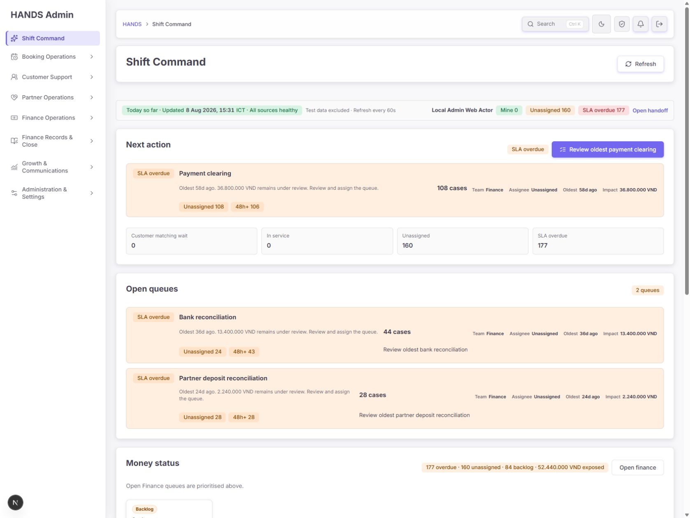

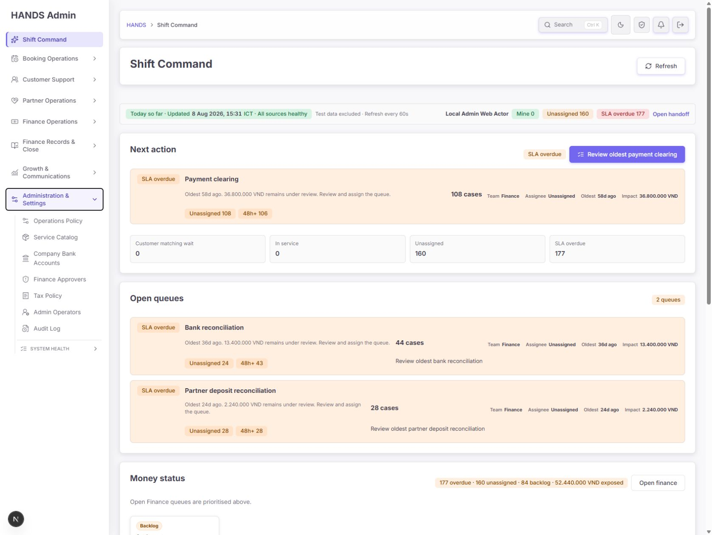

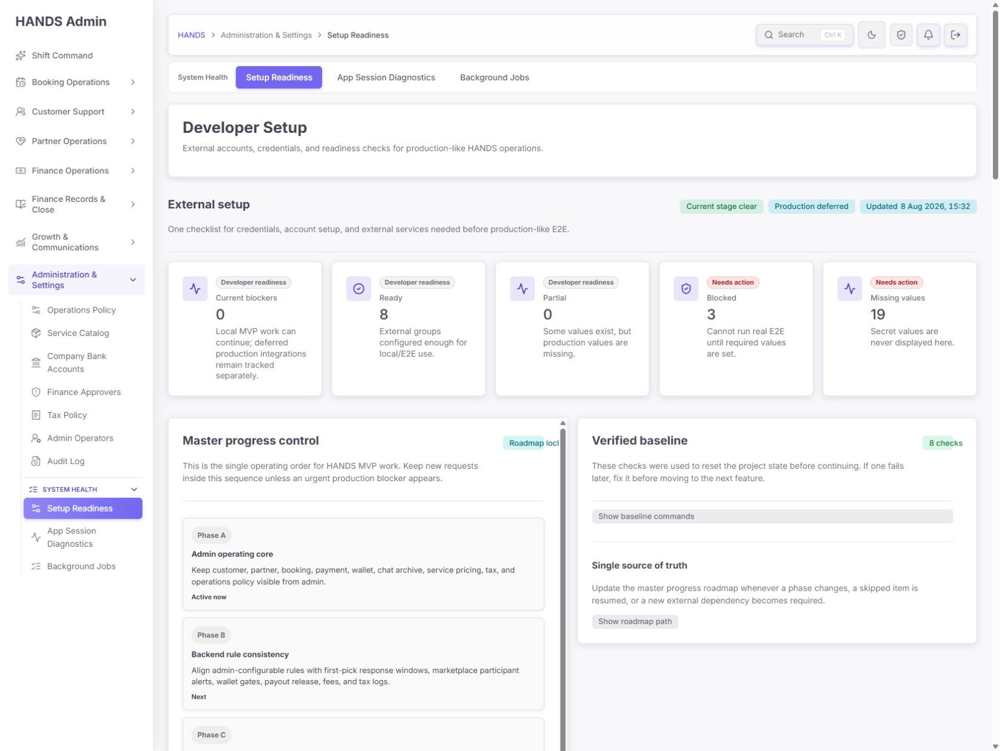

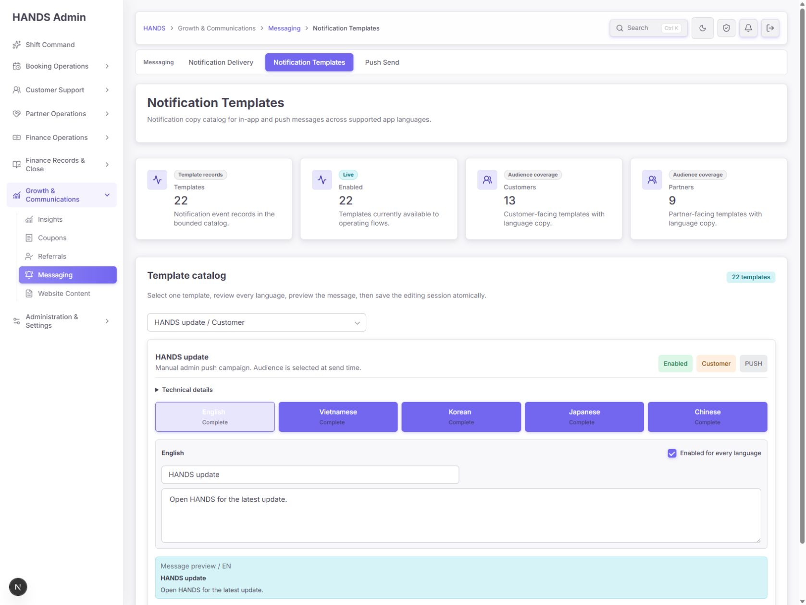

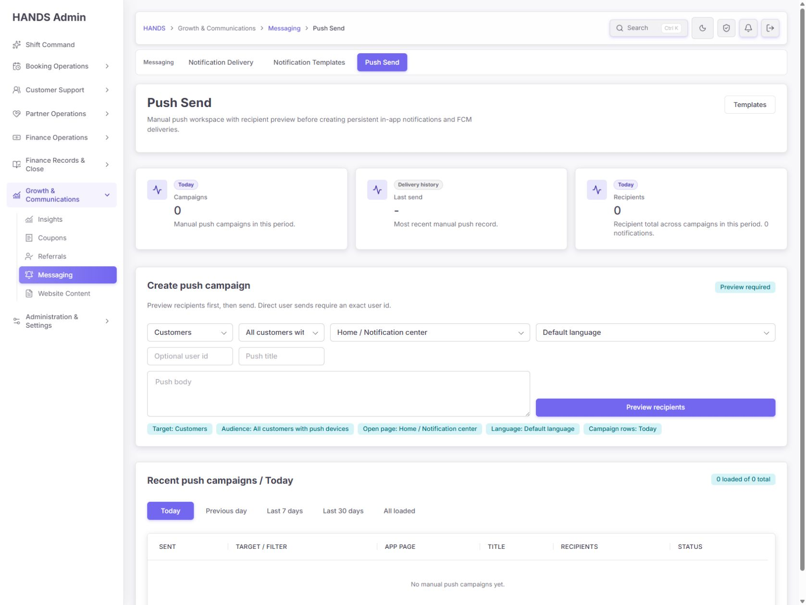

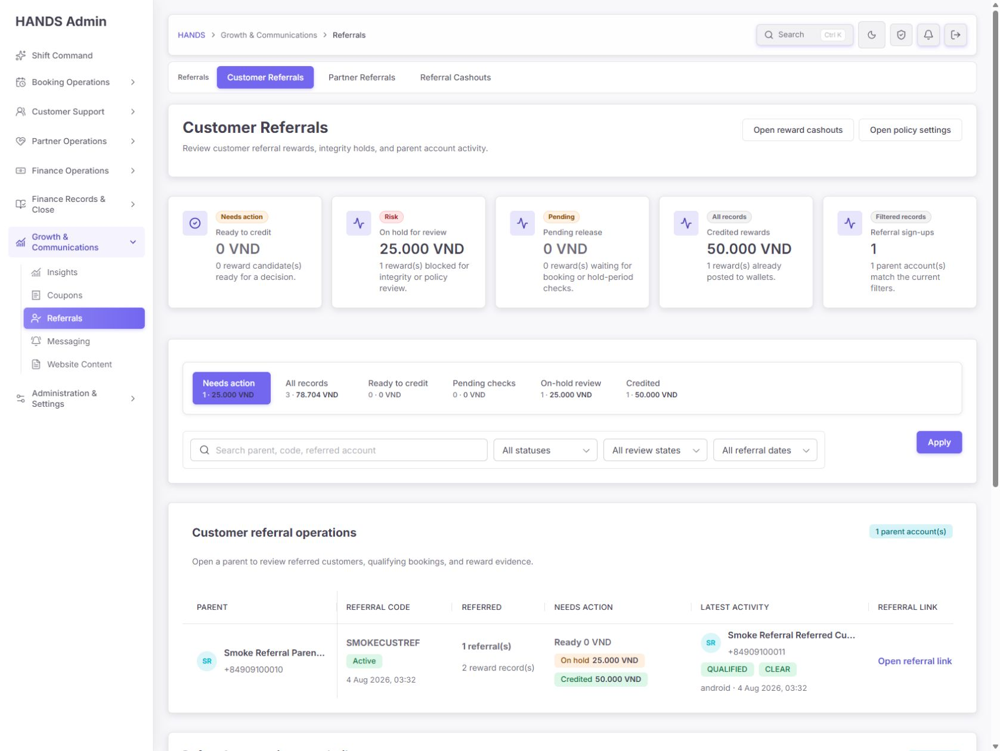

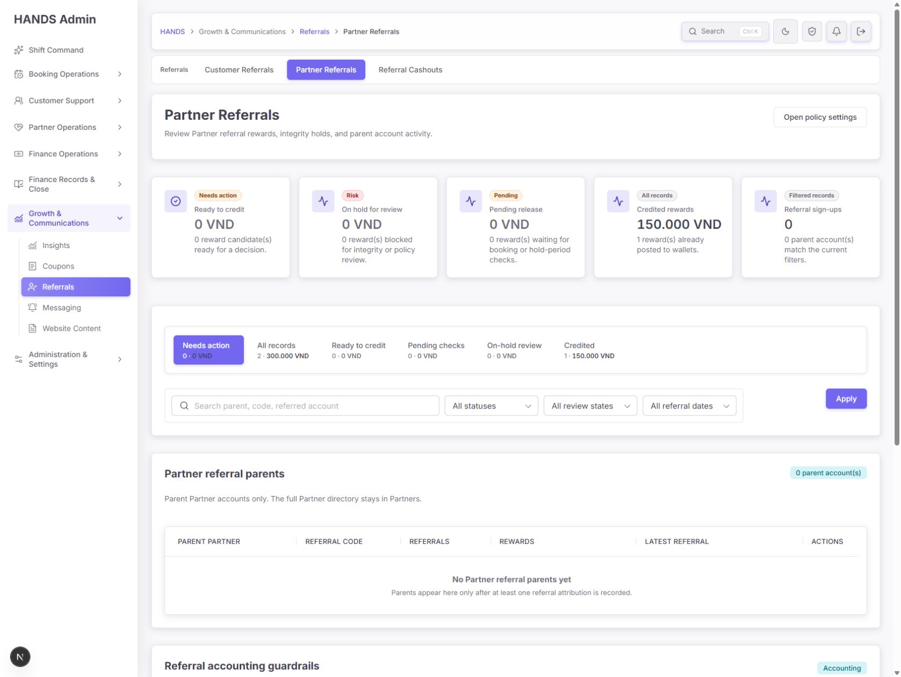

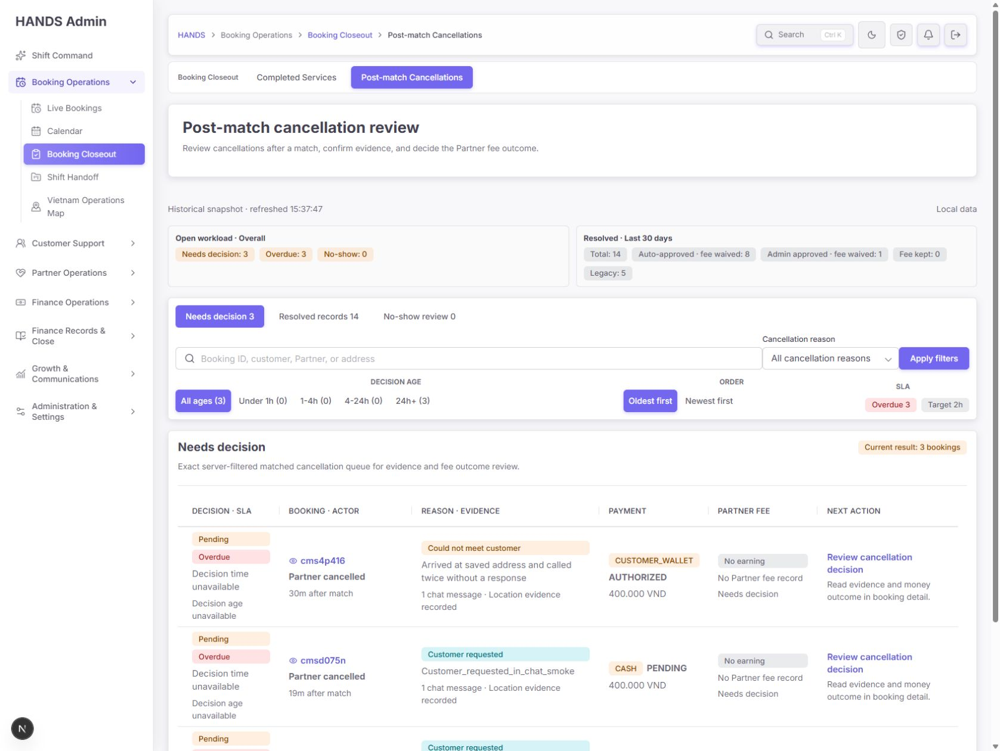

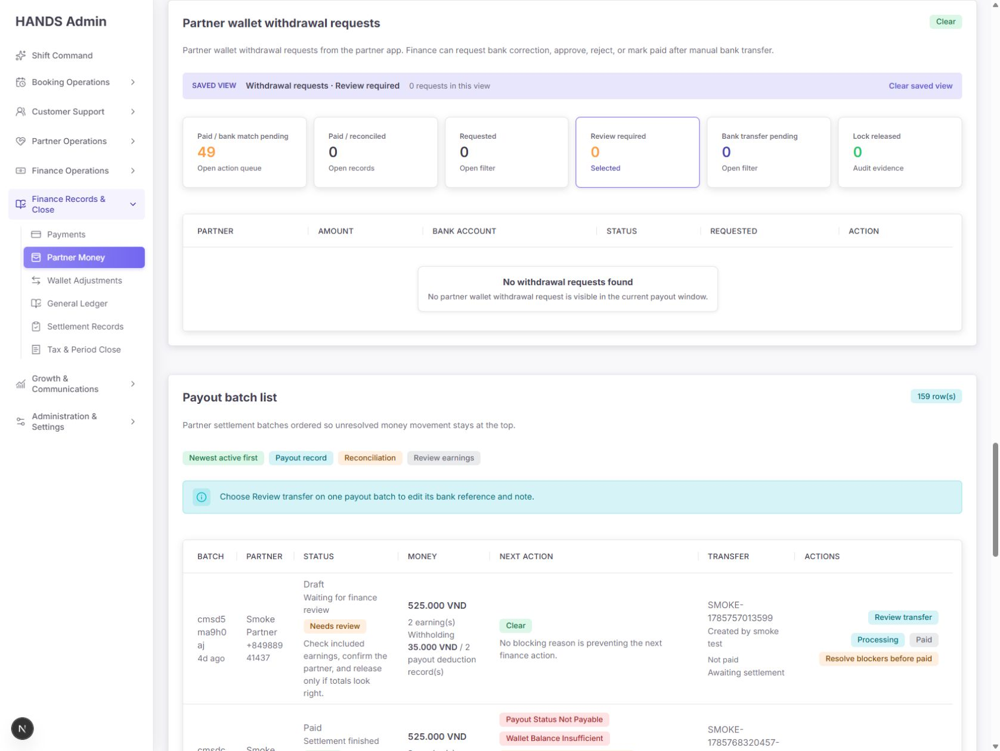

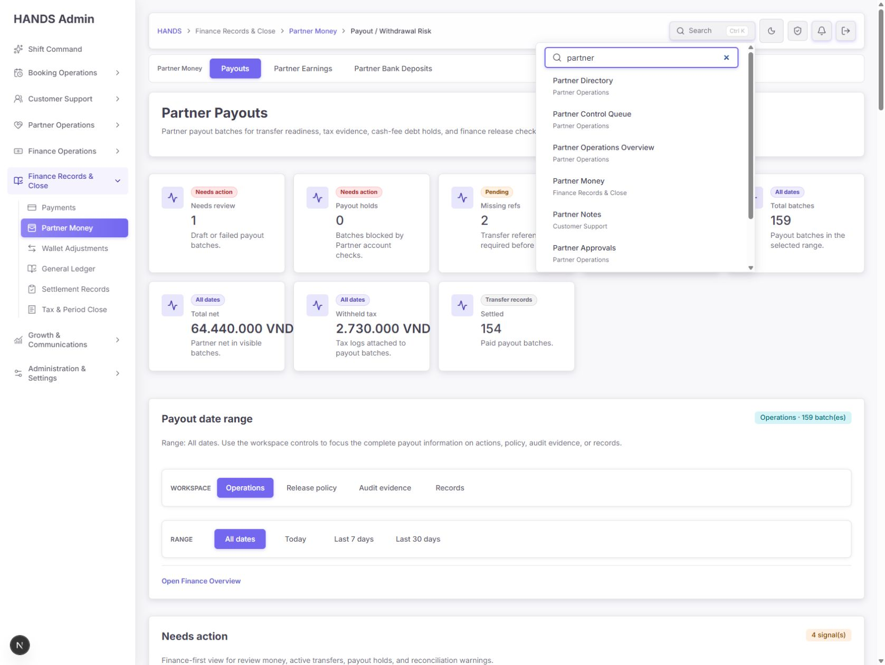

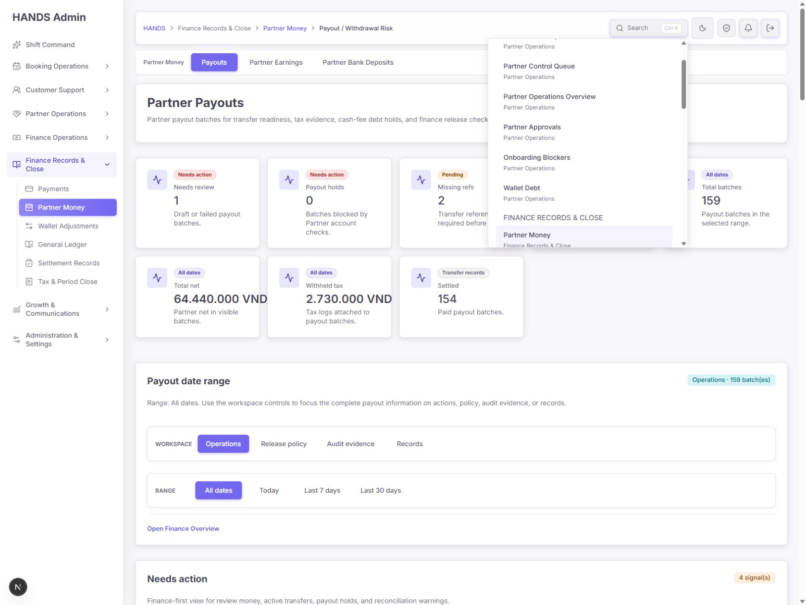

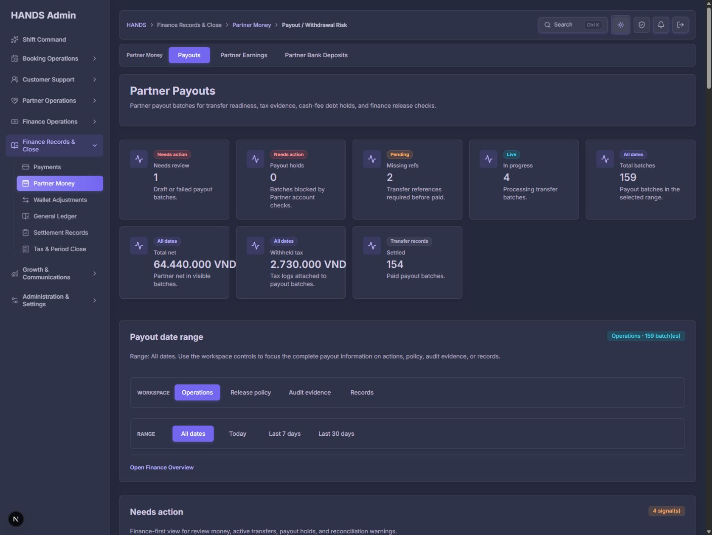

## 7. 최종 완료 조건

- Customer Referrals와 System Health 브레드크럼이 정확한 4단계/3단계 계층을 표시한다.
- 모든 로컬 워크스페이스에서 헤더 액션과 탭 목적지가 중복되지 않는다.
- System Health 세부 링크는 한 곳에서만 노출된다.
- 전체 검색에서 입력창이 고정되고, 전체 보기 전환 시 첫 그룹부터 보인다.
- Operation Alerts Escape 후 트리거에 포커스가 복귀한다.
- `verify:scope admin`이 전체 PASS다.

이 조건이 충족되면 정보구조와 운영 내비게이션은 “프롬프트 반영 완료”로 판정할 수 있다.
