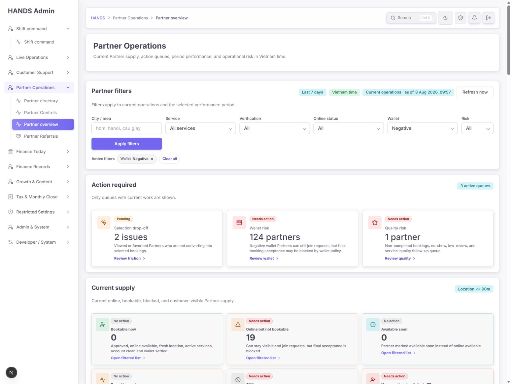
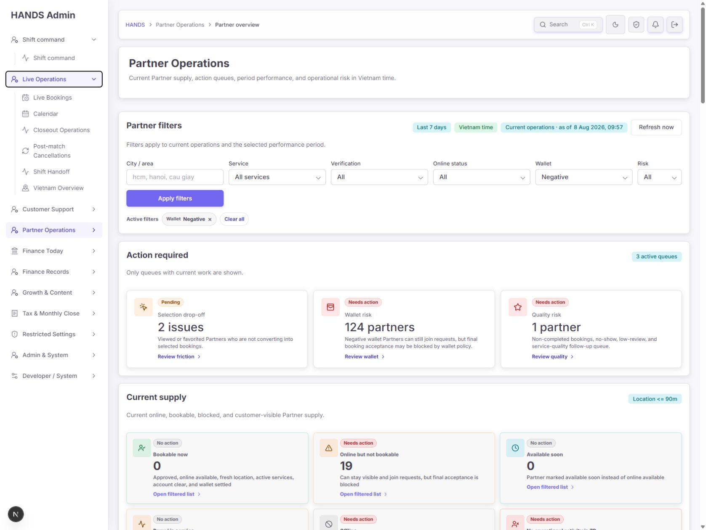
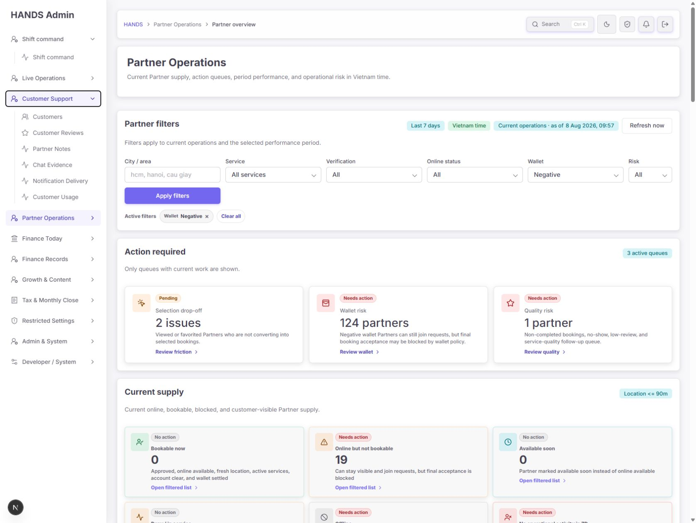
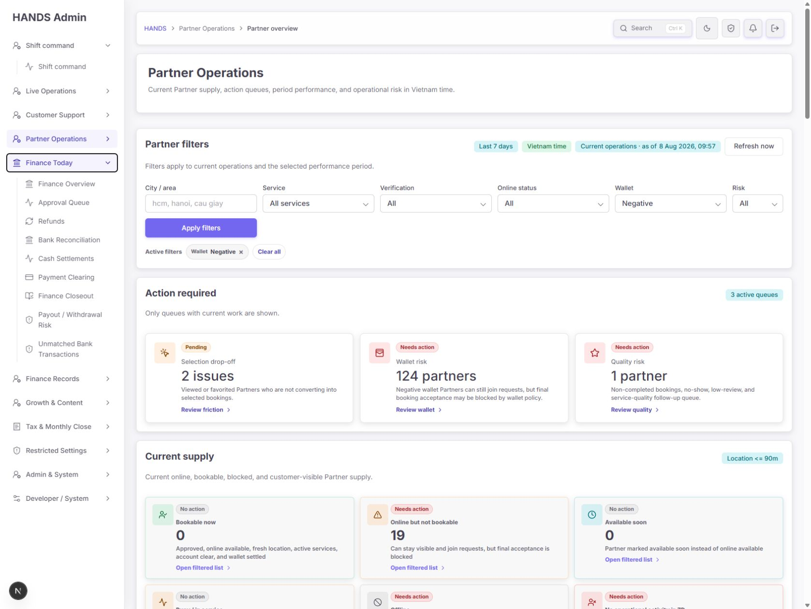
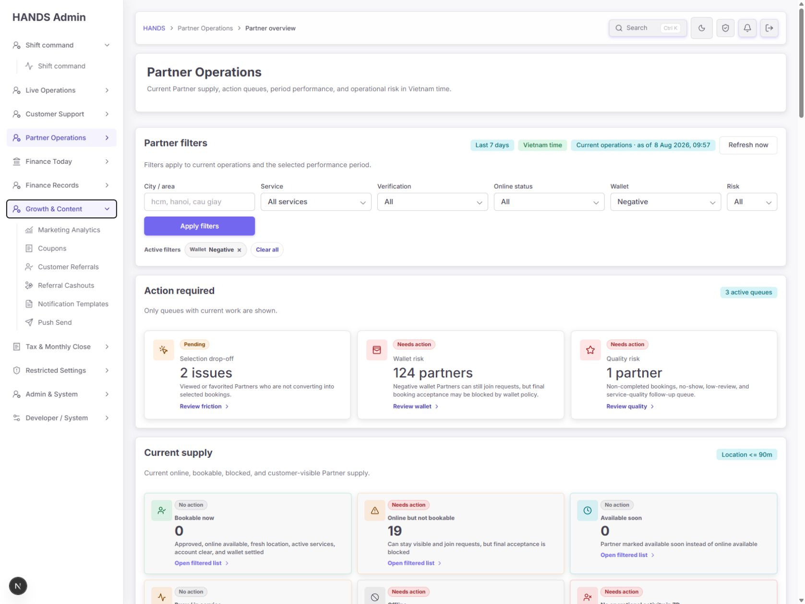
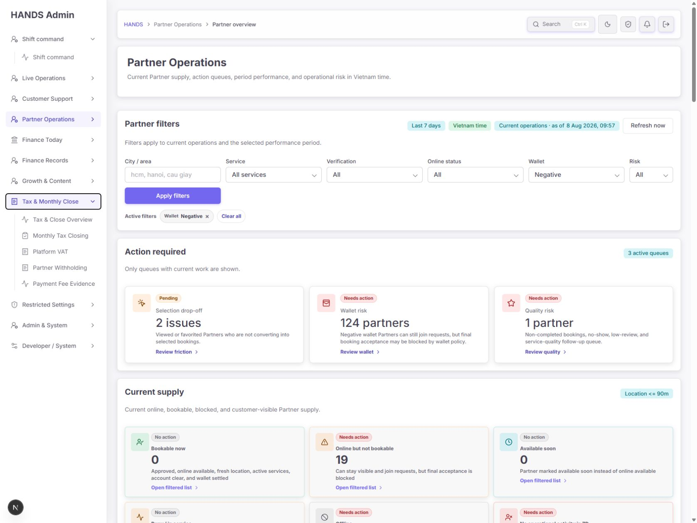
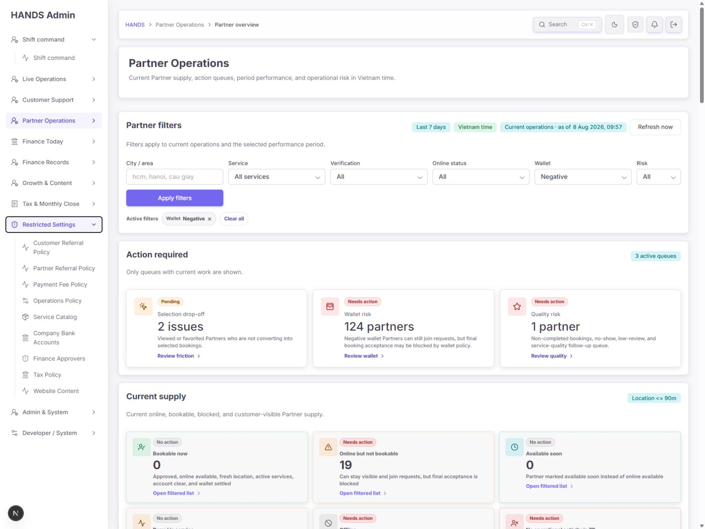
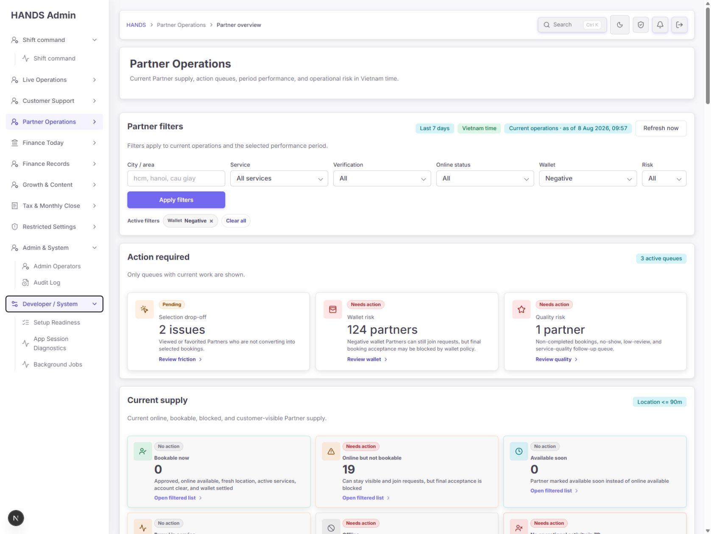
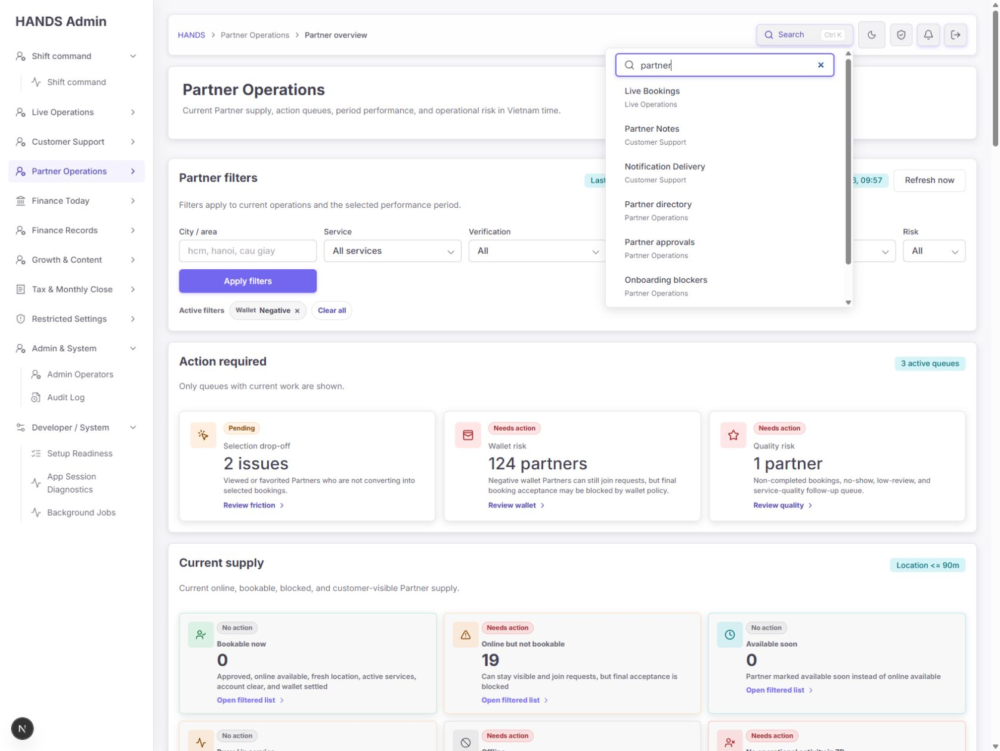

# HANDS 관리자 정보 구조(카테고리) 재감사 보고서

- 감사일: 2026-08-08
- 대상: `http://localhost:3101` 관리자 웹 전체 사이드바, 상단 검색, 메뉴 설정 코드, 공개/숨김 라우트 정책
- 평가 관점: 개발자가 아니라 매일 업무를 처리하는 운영자
- 화면 기준: 1440px 이상 데스크톱만 평가. 1024px 이하 화면은 요청에 따라 평가 대상에서 제외
- 확인 방법: 1692×1272 브라우저 실화면, DOM 구조, 내비게이션 설정 및 테스트 코드, 전체 `page.tsx` 라우트 목록 대조

## 1. 총평

현재 구조는 이전보다 **업무 영역별 구분이 상당히 좋아졌고, 실제 운영 페이지도 빠짐없이 메뉴 또는 숨김 라우트 정책에 등록**되어 있다. 코드 검사도 통과한다. 그러나 운영자가 메뉴를 찾는 방식에는 아직 세 가지 큰 문제가 남아 있다.

1. **분류 기준이 섞여 있다.** `Live Operations`처럼 업무 시점으로 묶은 대분류, `Customer Support`처럼 담당 조직으로 묶은 대분류, `Restricted Settings`처럼 권한 수준으로 묶은 대분류가 같은 깊이에 공존한다.
2. **저장된 필터 상태를 별도 페이지처럼 노출한다.** 동일한 기본 URL이 다른 쿼리로 사이드바에 두 번 들어간 경우가 5개다. 운영자에게는 “새 페이지”처럼 보이지만 실제로는 같은 페이지의 필터/설정 탭이다.
3. **업무 하나가 여러 대분류에 흩어져 있다.** 알림은 Customer Support와 Growth & Content에, 추천인은 Partner Operations·Growth & Content·Restricted Settings에, 결제 수수료는 Tax & Monthly Close와 Restricted Settings에 나뉜다.

최종 권고는 **11개 대분류를 8개로 축소**하고, **사이드바의 60개 링크를 1차로 55개 이하, 화면 통합 후 약 42~46개로 축소**하는 것이다. 단, 기능과 감사 이력을 삭제하라는 뜻이 아니라, 같은 업무의 화면을 로컬 탭/저장 보기로 묶어 탐색 비용을 낮추라는 의미다.

### 현재 상태 점수

| 평가 항목 | 상태 | 판단 |
|---|---|---|
| 페이지 누락 방지 | 양호 | 74개 페이지 라우트가 메뉴 또는 숨김 정책으로 관리됨 |
| 대분류의 일관성 | 개선 필요 | 업무 시점·조직·권한 기준이 혼재 |
| 중복 없는 탐색 | 미흡 | 5개 기본 라우트가 쿼리만 달리해 사이드바 중복 노출 |
| 운영자 언어 | 개선 필요 | `Overview`, `Records`, `Restricted`처럼 행동이 불분명한 명칭 다수 |
| 자주 쓰는 업무 우선순위 | 보통 | 시작/실시간 업무는 상단 배치됐지만 Finance Today가 과밀 |
| 검색 가능성 | 미흡 | 문자열 포함·원본 순서·7개 제한으로 정확한 제목이 뒤로 밀림 |
| 권한별 노출 | 양호 | 권한 기반 섹션 필터가 존재하고 Developer 영역이 제한됨 |
| 시각적 구분 | 미흡 | 현재 라벨과 아이콘 맵이 어긋나 많은 메뉴가 동일 기본 아이콘 사용 |

## 2. 확인된 현재 구조

마스터 관리자 기준 현재 사이드바는 다음 11개 대분류, 60개 링크로 구성된다.

| 대분류 | 링크 수 | 감사 판단 |
|---|---:|---|
| Shift command | 1 | 부모와 자식 이름이 동일해 구조만 한 단계 늘어남 |
| Live Operations | 6 | 실시간과 사후처리가 혼재 |
| Customer Support | 6 | 알림 전달·사용량 분석이 지원 업무와 혼재 |
| Partner Operations | 4 | 영역은 타당하나 `directory/controls/overview` 구분이 모호 |
| Finance Today | 9 | 가장 과밀하며 저장 보기 2개가 독립 메뉴처럼 노출 |
| Finance Records | 9 | 회계 기록이라는 공통점은 있으나 범위가 너무 넓음 |
| Growth & Content | 6 | 알림·추천인 업무가 다른 대분류와 분산 |
| Tax & Monthly Close | 5 | 비교적 일관되지만 Finance Records와 경계가 약함 |
| Restricted Settings | 9 | 권한을 대분류 기준으로 사용하여 업무 맥락을 끊음 |
| Admin & System | 2 | 독립 대분류로는 너무 작음 |
| Developer / System | 3 | 역할 분리는 필요하지만 독립 대분류는 불필요 |

### 수치로 본 중복

- 사이드바 링크: 60개
- 쿼리 문자열을 제외한 고유 기본 라우트: 55개
- 동일 기본 라우트를 두 번 보여 주는 쌍: 5개
- 대분류: 11개
- 소스의 전체 페이지 라우트: 74개(상세·로그인·레거시 별칭 포함)

## 3. 대분류별 상세 감사

### 3.1 Shift command — 미흡

**문제**

- 대분류와 하위 메뉴가 모두 `Shift command`다.
- 링크가 하나뿐인데 접기/펼치기 구조를 사용한다.
- 운영자는 시작 화면으로 바로 가고 싶은 것이지 동일한 이름을 두 번 해석하고 싶지 않다.

**권고**

- 사이드바 최상단을 **단일 직접 링크 `Shift Command`**로 만든다.
- `
` 하위 메뉴를 제거한다.
- 대시보드 성격을 더 분명히 하려면 화면 H1은 `Shift Command`, 보조 문구는 `Start here: priorities, handoff, and overdue work`로 유지한다.

### 3.2 Live Operations — 개선 필요

현재: Live Bookings, Calendar, Closeout Operations, Post-match Cancellations, Shift Handoff, Vietnam Overview

**문제**

- `Live`라는 이름 아래 완료 후 마감과 사후 취소 검토가 들어 있다.
- `Vietnam Overview`는 국가 범위인지 실시간 운영 지도인지 이름만으로 알기 어렵다.
- `Closeout Operations`와 `Post-match Cancellations`는 다른 화면이지만 같은 예약 종료 단계에 속한다.

**권고**

- 대분류를 **`Booking Operations`**로 변경한다.
- `Vietnam Overview`는 **`Vietnam Operations Map`** 또는 **`Regional Operations`**로 변경한다.
- `Closeout Operations`와 `Post-match Cancellations`는 데이터를 한 표에 섞지 말고, **`Booking Closeout` 작업공간의 로컬 탭**으로 묶는다.
  - `Completed & closeout`
  - `Cancellation decisions`
- 기존 URL은 유지하여 북마크·감사 링크를 보호한다.

### 3.3 Customer Support — 개선 필요

현재: Customers, Customer Reviews, Partner Notes, Chat Evidence, Notification Delivery, Customer Usage

**문제**

- `Notification Delivery`는 고객·파트너·관리자 전달 장애를 다루므로 고객 지원만의 업무가 아니다.
- `Customer Usage`는 집계 분석 화면이므로 개별 고객 지원보다 성장/인사이트에 가깝다.
- `Customer Reviews`와 `Partner Notes`는 모두 고객 신뢰 판단을 위한 신호인데 분리되어 있다.

**권고**

- 유지: `Customers`, `Chat Evidence`.
- `Customer Reviews` + `Partner Notes`를 **`Customer Signals`** 작업공간의 탭으로 묶는다.
- `Notification Delivery`는 `Growth & Communications`의 `Messaging`으로 이동한다.
- `Customer Usage`는 `Growth & Communications`의 `Insights` 영역으로 이동한다.
- 고객 상세에서 Review, Partner note, Chat evidence로 바로 가는 컨텍스트 링크는 유지한다.

### 3.4 Partner Operations — 보통

현재: Partner directory, Partner Controls, Partner overview, Partner Referrals

**잘된 점**

- 승인 대기, 온보딩 장애, 지갑 부채를 별도 사이드바 항목으로 만들지 않고 `Partner directory`의 검색 가능 저장 보기로 둔 방향은 올바르다.
- 파트너 관련 핵심 업무가 한 대분류에 모여 있다.

**문제**

- `Partner directory`, `Partner Controls`, `Partner overview`는 모두 추상 명사라 첫 방문자가 차이를 예측하기 어렵다.
- `Partner Referrals`는 추천인 전체 업무가 다른 카테고리에도 존재해 맥락이 분산된다.

**권고 명칭**

- `Partner directory` → **`Partner Directory`**
- `Partner Controls` → **`Partner Control Queue`**
- `Partner overview` → **`Partner Operations Overview`**
- `Partner Referrals`는 통합 `Referrals` 작업공간의 `Partners` 탭으로 이동한다. 파트너 작업공간에서는 해당 탭으로 가는 바로가기를 제공하되 사이드바 중복은 만들지 않는다.

### 3.5 Finance Today — 미흡

현재 9개로 가장 과밀하다.

**즉시 제거할 사이드바 중복**

| 현재 항목 | 실제 정체 | 처리 |
|---|---|---|
| Payout / Withdrawal Risk | `/payouts`의 `REVIEW_REQUIRED` 저장 보기 | `Payouts` 내부 탭/저장 보기로 이동 |
| Unmatched Bank Transactions | `Bank Reconciliation`의 `unmatched` 저장 보기 | `Bank Reconciliation` 내부 탭/배지로 이동 |

**문제**

- `Today`라는 이름인데 일부 페이지는 오늘 업무가 아니라 전체 업무 시스템이다.
- `Finance Overview`, 승인, 환불, 조정, 현금, 지급, 마감이 모두 같은 수준에 나열된다.
- 위험 큐 두 개가 별도 페이지처럼 보여 원본 화면과의 관계를 알기 어렵다.

**권고**

- 대분류를 **`Finance Operations`**로 변경한다.
- 1차 유지: `Finance Overview`, `Approval Queue`, `Refunds`, `Bank Reconciliation`, `Cash Settlements`, `Payment Clearing`, `Finance Closeout`.
- 2차 통합 검토: `Payment Clearing` + `Finance Closeout`을 **`Settlement Operations`** 작업공간의 로컬 탭으로 묶는다. 단, 권한과 승인 주체가 다르면 URL·행동 권한은 그대로 분리한다.
- 위험/미일치 건수는 사이드바 새 링크가 아니라 원본 항목 오른쪽 배지와 Finance Overview 카드로 보여 준다.

### 3.6 Finance Records — 개선 필요

현재: Payments, Partner Deposits, Payouts, Partner Earnings, Wallet Adjustments, General Ledger, Settlement Audit, Settlement Reversals, Coupon Finance

**문제**

- 거래 원장, 파트너 자금, 조정, 감사, 쿠폰 정산이 한 깊이에 9개 나열된다.
- `Settlement Audit`과 `Settlement Reversals`는 동일한 정산 기록을 조회/취소하는 연속 업무다.
- `Coupon Finance`는 저빈도 회계 증빙이라 상시 사이드바 점유 필요성이 낮다.

**권고**

- 대분류를 **`Finance Records & Close`**로 변경하고 현재 Tax & Monthly Close를 이곳에 합친다.
- `Settlement Audit` + `Settlement Reversals` → **`Settlement Records`** 작업공간 탭.
- `Partner Deposits`, `Payouts`, `Partner Earnings`는 **`Partner Money` 로컬 서브내비게이션**으로 연결하되, 위험 승인 행동은 `Payouts` 권한을 유지한다.
- `Coupon Finance`는 `Coupons` 화면의 Finance 탭과 General Ledger에서 교차 링크하고, 일상 사용 빈도가 낮다면 사이드바에서 제외한다.

### 3.7 Growth & Content — 미흡

현재: Marketing Analytics, Coupons, Customer Referrals, Referral Cashouts, Notification Templates, Push Send

**문제**

- 알림 전달 장애는 Customer Support, 템플릿과 발송은 Growth에 있어 한 업무가 분리된다.
- Customer Referral, Partner Referral, Cashout, 두 정책 화면이 세 대분류에 흩어진다.
- `Website Content`가 이름상 이 영역에 와야 하지만 Restricted Settings에 있다.

**권고**

- 대분류를 **`Growth & Communications`**로 변경한다.
- **`Messaging` 작업공간**으로 통합:
  - Delivery incidents
  - Templates
  - Manual send
  - Send history
- **`Referrals` 작업공간**으로 통합:
  - Customer program
  - Partner program
  - Cashouts
  - Policies(권한 보유자에게만 노출)
- `Marketing Analytics` + `Customer Usage`를 `Insights` 로컬 그룹으로 배치한다.
- `Website Content`를 이 대분류로 이동하되 발행 버튼 권한은 그대로 제한한다.

### 3.8 Tax & Monthly Close — 보통

현재: Tax & Close Overview, Monthly Tax Closing, Platform VAT, Partner Withholding, Payment Fee Evidence

**잘된 점**

- 월 마감과 세무 증빙이라는 공통 작업 주기가 명확하다.
- 다른 설정 페이지보다 결산 기록과 더 가깝다.

**문제**

- Finance Records와 업무 경계가 약하고, 별도 대분류를 만들 만큼 일상 링크 수가 많지 않다.
- `Payment Fee Evidence`와 Restricted Settings의 `Payment Fee Policy`는 동일 기본 페이지다.

**권고**

- `Finance Records & Close` 아래 로컬 그룹 또는 `Tax & Close` 작업공간으로 합친다.
- `Payment Fee Evidence`를 대표 메뉴로 두고, 권한 보유자에게만 `Policy` 탭을 보여 준다.
- 결산 업무와 정책 편집은 한 화면에 있더라도 시각·권한·확인 절차를 분리한다.

### 3.9 Restricted Settings — 미흡

현재: Customer Referral Policy, Partner Referral Policy, Payment Fee Policy, Operations Policy, Service Catalog, Company Bank Accounts, Finance Approvers, Tax Policy, Website Content

**문제**

- `Restricted`는 사용자의 업무가 아니라 접근 권한을 설명한다. 운영자는 “무슨 일을 하는 곳인지”로 찾는다.
- 추천인 정책 2개와 결제 수수료 정책은 기존 업무 화면의 설정 탭이다.
- `Website Content`는 권한이 필요하더라도 콘텐츠 업무이며 설정 카테고리로 찾기 어렵다.

**권고**

- 대분류 이름을 **`Administration & Settings`**로 변경한다.
- 사이드바에서 제거하고 원본 작업공간의 권한 탭으로 이동:
  - Customer Referral Policy
  - Partner Referral Policy
  - Payment Fee Policy
- `Website Content`는 Growth & Communications로 이동.
- 유지: Operations Policy, Service Catalog, Company Bank Accounts, Finance Approvers, Tax Policy.

### 3.10 Admin & System / Developer System — 통합 권고

**문제**

- 각각 2개와 3개 링크뿐인데 별도 대분류다.
- `Admin & System`과 `Developer / System`의 경계가 명칭만으로 명확하지 않다.

**권고**

- 둘을 **`Administration & Settings`**에 합친다.
- 로컬 소그룹으로만 구분한다.
  - Access & Audit: Admin Operators, Audit Log
  - System Health: Setup Readiness, App Session Diagnostics, Background Jobs
- System Health는 지금처럼 역할 기반으로 숨긴다. 일반 운영자에게 노출하지 않는다.

## 4. 중복·통합 결정표

| 항목 | 결정 | 이유 |
|---|---|---|
| Shift command 부모/자식 | 부모 구조 제거 | 단일 링크에 접기 UI 불필요 |
| Payout Risk + Payouts | 저장 보기로 통합 | 동일 `/payouts` 기본 라우트 |
| Unmatched Bank + Bank Reconciliation | 저장 보기로 통합 | 동일 기본 라우트 |
| Customer/Partner Referral Policy | Referrals의 권한 탭 | 동일 추천인 업무와 기본 라우트 |
| Payment Fee Policy | Payment Fee Evidence의 권한 탭 | 동일 기본 라우트 |
| Notification Delivery/Templates/Push Send | Messaging 작업공간 | 같은 생성→발송→전달→재시도 생명주기 |
| Customer/Partner Referrals/Cashouts | Referrals 작업공간 | 같은 프로그램의 대상·정산 단계 |
| Customer Reviews/Partner Notes | Customer Signals 작업공간 | 고객 신뢰 판단이라는 동일 운영 목적 |
| Completed/Post-match Cancellations | Booking Closeout 로컬 탭 | 예약 종료 단계는 같지만 행동 위험은 분리 필요 |
| Settlement Audit/Reversals | Settlement Records 로컬 탭 | 동일 정산 레코드의 조회/취소 관계 |
| Payment Clearing/Finance Closeout | 조건부 로컬 탭 | 업무 연속성은 높지만 권한·승인자 확인 필요 |
| Admin & System/Developer System | 대분류 통합, 역할별 소그룹 | 작은 대분류 두 개 제거, 기술 메뉴는 제한 유지 |

## 5. 삭제하면 안 되는 페이지와 실제로 없애도 되는 노출

### 사이드바에서 없애도 되는 항목

- Payout / Withdrawal Risk
- Unmatched Bank Transactions
- Customer Referral Policy
- Partner Referral Policy
- Payment Fee Policy
- 통합 완료 후 Notification Templates / Push Send의 개별 사이드바 링크
- 통합 완료 후 Settlement Reversals의 개별 사이드바 링크
- 저빈도 확인 후 Coupon Finance

이 항목들은 **기능/URL을 삭제하지 말고**, 원본 작업공간의 탭·저장 보기·바로가기로 전환한다.

### 삭제하지 말아야 하는 숨김 라우트

- `/bookings/[id]`, `/customers/[id]`, `/partners/[id]` 등 상세 페이지: 목록에서 진입하는 정상적인 상세 화면이다.
- `/providers`, `/providers/[id]`, `/files`: 레거시 북마크를 새 위치로 보내는 호환 리다이렉트다. 접근 로그가 충분히 0으로 확인되기 전에는 제거하지 않는다.
- `/referrals`: 현재는 고객 추천인으로 리다이렉트하는 숨김 허브다. 통합 Referrals를 만들 때 오히려 대표 URL로 승격하기 좋은 후보다.
- `/login`: 인증 경계이므로 사이드바 미노출이 정상이다.

결론적으로 **현재 완전히 삭제해야 할 핵심 운영 페이지는 확인되지 않았다.** 문제는 페이지 존재가 아니라 사이드바에서의 중복 노출과 분류다.

## 6. 권장 최종 대분류

| 순서 | 권장 대분류 | 핵심 구성 |
|---:|---|---|
| 1 | Shift Command | 단일 직접 링크 |
| 2 | Booking Operations | Live Bookings, Calendar, Booking Closeout, Shift Handoff, Vietnam Operations Map |
| 3 | Customer Support | Customers, Customer Signals, Chat Evidence |
| 4 | Partner Operations | Partner Directory, Partner Control Queue, Partner Operations Overview |
| 5 | Finance Operations | Finance Overview, Approval Queue, Refunds, Reconciliation, Cash Settlements, Settlement Operations |
| 6 | Finance Records & Close | Payments, Partner Money, Wallet Adjustments, General Ledger, Settlement Records, Tax & Close |
| 7 | Growth & Communications | Insights, Coupons, Referrals, Messaging, Website Content |
| 8 | Administration & Settings | Operations/Tax policies, Service Catalog, Bank Accounts, Approvers, Operators, Audit, 역할 제한 System Health |

### 운영자 탐색 규칙

새 분류는 다음 한 가지 질문으로 위치를 예측할 수 있어야 한다.

> “지금 내가 처리하려는 대상과 다음 행동은 무엇인가?”

- 예약을 처리한다 → Booking Operations
- 고객 문제와 증거를 본다 → Customer Support
- 파트너 상태를 바꾼다 → Partner Operations
- 오늘 돈 관련 예외를 해결한다 → Finance Operations
- 과거 거래·원장·마감을 확인한다 → Finance Records & Close
- 캠페인·추천인·메시지를 운영한다 → Growth & Communications
- 정책·권한·시스템을 설정한다 → Administration & Settings

## 7. 메뉴명 수정안

| 현재 | 권장 | 이유 |
|---|---|---|
| Live Operations | Booking Operations | 실시간·완료·취소를 모두 포괄 |
| Vietnam Overview | Vietnam Operations Map | 화면의 실제 목적을 명시 |
| Closeout Operations | Booking Closeout | 대상이 무엇인지 명시 |
| Partner Controls | Partner Control Queue | 검토·조치가 필요한 큐임을 명시 |
| Partner overview | Partner Operations Overview | directory와 구분 |
| Finance Today | Finance Operations | 오늘 필터와 업무 영역을 혼동하지 않음 |
| Finance Records | Finance Records & Close | 세무·월마감 통합을 반영 |
| Growth & Content | Growth & Communications | 알림/발송 업무를 포괄 |
| Restricted Settings | Administration & Settings | 권한이 아니라 업무로 설명 |
| Customer Reviews + Partner Notes | Customer Signals | 두 신뢰 신호의 공통 목적 표현 |
| Notification Delivery 등 3개 | Messaging | 메시지 생명주기 통합 |

표시 언어는 현재 제품이 영어 중심이므로 전면 영어를 유지하되, 한 화면 안에서 `Partner overview`처럼 문장형 대소문자와 Title Case를 섞지 말고 Title Case로 통일한다.

## 8. 사이드바 동작 감사

### 여러 대분류가 동시에 열리는 문제

현재 `
`를 사용해 여러 대분류가 동시에 열린 상태로 남는다. 1692px 화면에서도 Finance Today와 Finance Records처럼 긴 섹션을 함께 열면 탐색 목록이 과도하게 길어진다.

**권고**

- 기본값은 현재 페이지가 속한 대분류 하나만 연다.
- 운영자가 다른 대분류를 열면 이전 대분류를 닫는 아코디언 방식으로 바꾼다.
- Shift Command는 아코디언 밖의 단일 링크로 둔다.
- 긴 Finance 영역에서는 대분류 링크 수를 6~7개 이하로 제한하고 세부 탭은 페이지 내부에 둔다.

### 아이콘이 의미를 잃은 문제

코드의 아이콘 맵이 이전 라벨을 기준으로 남아 있어, 현재의 대분류와 여러 메뉴가 등록되지 않았다. 미등록 대분류는 모두 `UserRoundCog`, 미등록 소분류는 모두 `Activity`로 대체된다. 실제 화면에서도 여러 대분류가 같은 사람/설정 아이콘, 여러 메뉴가 같은 맥박 아이콘으로 보인다.

**권고**

- 라벨 문자열로 아이콘을 찾지 말고 내비게이션 설정에 안정적인 `id` 또는 `iconKey`를 넣는다.
- 라벨 변경이 아이콘 퇴행을 만들지 않도록 현재 모든 항목의 `iconKey` 존재 여부를 테스트한다.
- 아이콘은 대분류 인지만 돕고, 서로 비슷한 의미의 장식 아이콘을 과도하게 만들지 않는다.

## 9. 상단 검색 감사

화면에서 `partner`를 검색했을 때 첫 결과는 `Live Bookings`, 그다음은 `Partner Notes`, `Notification Delivery`였고, 정확한 제목인 `Partner directory`, `Partner Controls`, `Partner overview`가 뒤로 밀렸다.

원인은 코드가 다음 방식이기 때문이다.

- 제목·대분류·설명·별칭을 한 문자열로 합침
- 단순 `includes`로 필터
- 원본 메뉴 순서 유지
- 상위 7개만 표시

따라서 설명에 partner가 한 번 들어간 앞쪽 메뉴가 제목이 Partner로 시작하는 페이지보다 먼저 나온다.

**권고 랭킹**

1. 제목 완전 일치
2. 제목 앞부분 일치
3. 저장 보기 제목/별칭 일치
4. 대분류 일치
5. 설명 본문 일치
6. 최근 방문·업무 주의 건수는 동점 보정에만 사용

추가로 결과를 7개로 자르기 전에 랭킹하고, 결과가 더 있으면 `Show all results (n)`을 제공한다. 빈 검색 시에는 단순 메뉴 앞 7개가 아니라 `Recent`, `Needs attention`, `Common destinations`를 보여 주는 편이 운영자에게 유용하다.

## 10. 코드·테스트 감사

### 확인된 코드 위치

- 전체 메뉴 정의: `apps/admin_web/lib/admin-navigation.ts`
- 사이드바 렌더링/아이콘: `apps/admin_web/components/admin-shell-nav.tsx`
- 상단 검색: `apps/admin_web/components/admin-workspace-header.tsx`
- 숨김/레거시 라우트 정책: `apps/admin_web/lib/admin-hidden-route-policy.ts`
- 메뉴 회귀 테스트: `apps/admin_web/lib/admin-navigation.spec.ts`, `apps/admin_web/components/admin-shell-nav.spec.tsx`

### 테스트 결과

- 관련 Vitest: **25개 통과**
- 이 결과는 링크 권한, URL 매칭, 메뉴/숨김 라우트 누락 방지 측면에서는 양호하다는 뜻이다.
- 그러나 현재 테스트는 “정확한 href 중복”만 막고, **쿼리를 제거한 동일 기본 라우트 중복은 허용**한다.
- 테스트 이름은 `Shift command and the eight operator work areas`라고 쓰였지만 실제 기대 배열은 Shift 포함 10개 운영 섹션이며 Developer를 더하면 11개다. 문서·테스트 명칭도 현재 구조와 어긋난다.

### 추가해야 할 회귀 테스트

1. `pathname`이 같은 사이드바 링크는 명시된 예외 없이는 두 개 이상 금지.
2. 대분류당 링크 7개 초과 시 실패 또는 검토 경고.
3. 링크 하나뿐인 대분류 금지.
4. 모든 대분류/링크에 고유 `id`, 명시적 `iconKey` 요구.
5. 검색에서 정확한 제목이 설명 일치보다 먼저 나오는지 검증.
6. 일반 운영자에게 Developer/System 메뉴가 노출되지 않는지 기존 권한 테스트 유지.
7. 레거시 별칭은 메뉴에 나타나지 않고 대표 URL로 리다이렉트되는지 유지.

## 11. 구현 우선순위

### P0 — 내비게이션만 수정, 데이터/행동 변경 없음

- Shift Command를 단일 링크로 변경.
- 5개 쿼리 중복 항목을 사이드바에서 제거.
- Website Content, Customer Usage, Notification Delivery 위치 이동.
- 대분류를 8개로 재배치하고 메뉴명 정리.
- 현재 라벨 전체의 아이콘 매핑 복구.
- 검색 랭킹 개선.

### P1 — 같은 업무를 로컬 탭으로 통합

- Messaging
- Referrals
- Customer Signals
- Booking Closeout
- Settlement Records
- Tax & Close

기존 URL은 유지하고 대표 작업공간에서 탭으로 연결한다. 브라우저 뒤로가기, 북마크, 감사 로그의 링크가 깨지지 않아야 한다.

### P2 — 실제 사용량으로 저빈도 메뉴 정리

- Coupon Finance, Setup Readiness, App Session Diagnostics 등 최근 30/90일 방문 빈도 측정.
- 90일 동안 직접 진입이 거의 없는 메뉴는 사이드바에서 빼고 관련 상위 화면의 `More tools`로 이동.
- 레거시 `/providers`, `/files`는 접근 로그가 충분히 0인 기간을 확인한 후 별도 제거 계획 수립.

## 12. 완료 판정 기준

- 마스터 관리자 기준 대분류가 8개 이하.
- 한 대분류의 직접 링크가 7개 이하.
- 쿼리를 제외한 동일 기본 라우트가 사이드바에 중복되지 않음.
- `partner` 검색 시 Partner Directory/Controls/Overview가 설명 일치 페이지보다 먼저 노출.
- 일반 운영자는 개발자 메뉴를 보지 않음.
- 권한이 없는 탭은 보이지 않거나 명확한 읽기 전용 상태이며, URL 직접 접근도 서버에서 차단.
- 기존 상세·감사·북마크 URL은 계속 작동.
- Finance 위험 건수와 미일치 건수는 원본 메뉴 배지 또는 Finance Overview에서 한 번만 표현.
- 실제 운영자 3~5명이 “예약 취소 검토”, “파트너 승인”, “미일치 입금”, “알림 실패 재시도”, “추천 정책 변경”을 각각 두 번 이하의 대분류 선택으로 찾을 수 있음.

## 13. 증거 화면

### 현재 Partner Operations와 전체 축소 상태

### Live Operations

### Customer Support

### Finance Today

### Finance Records

### Growth & Content

### Tax & Monthly Close

### Restricted Settings

### Admin & System / Developer System

### 검색 빈 상태

### `partner` 검색 결과

## 14. 범위와 한계

- 로그인된 마스터 관리자 화면과 현재 코드 상태를 기준으로 감사했다.
- 요청에 따라 1440px 이상 데스크톱만 평가했고 1024px 이하 반응형 문제는 포함하지 않았다.
- 키보드 전체 순회, 스크린리더 낭독, 실제 운영자 사용 로그는 이번 범위에서 수행하지 않았다. 따라서 접근성 표준 준수를 단정하지 않는다.
- 방문 빈도 데이터가 없으므로 “저빈도라 삭제” 판단은 조건부다. 운영 로그를 확인하기 전에는 URL/기능을 삭제하지 않는 것이 안전하다.

## 결론

현재 구조의 핵심 기능과 권한 모델은 유지할 가치가 있다. 가장 큰 개선 효과는 새 페이지를 만드는 데서 나오지 않고, **동일 업무를 한 작업공간으로 묶고, 쿼리 기반 저장 보기를 독립 메뉴에서 제거하며, 11개 대분류를 8개의 운영자 업무 모델로 재정렬하는 것**에서 나온다.
