⚠️ DEGRADED: single-context (저장소 `AGENTS.md`가 sub-agent 사용을 금지함)

# HANDS 관리자 웹 심층 재감사 보고서

- 감사일: 2026-08-05
- 대상: `C:\dev\massage-on-demand-vn\apps\admin_web` 및 연결된 `apps/api` 관리자 조회 계약
- 실행본: Admin Web `next start` 3101, 2026-08-05 10:14 시작 / API `dist/main.js`, 2026-08-05 09:27 시작
- 방법: 로그인된 현재 화면 16장 캡처, 1024px 반응형 점검, Next/Nest 소스 역추적, 개인정보·문구·내비게이션·빈 상태 검토, 읽기 전용 DB 집계 비교
- 변경 범위: 앱 코드는 수정하지 않았다. 이 문서와 감사 캡처만 추가했다.

## 1. 결론

시각 구조는 이전보다 분명히 좋아졌다. 특히 Shift Command의 owner/oldest/impact, Partner Approvals의 전용 빈 상태, Finance의 Today/Current Backlog 분리, Operations History와 Current Handoff 분리는 올바른 방향이다.

그러나 지금 가장 큰 문제는 디자인 마감이 아니라 **운영 데이터 신뢰성**이다. Shift Command는 환불 112건과 알림 실패 410건을 보여주지만, 같은 카드의 CTA를 누르면 각 목록이 0건이다. 화면만의 문제가 아니라 공통 테스트 데이터 제외 쿼리의 실제 PostgreSQL 동작이 잘못되어 Booking/Refund/Notification 계열 Prisma 목록이 운영 레코드를 전부 제외하고 있다.

따라서 다음 수정 순서는 명확하다.

1. 공통 production-data Prisma 조건을 고치고 raw SQL 집계와 목록 API의 parity test를 만든다.
2. API 실패를 `0건`으로 숨기는 `adminGet` fallback을 핵심 운영 큐에서 제거한다.
3. 고객 목록 전화번호를 마스킹하고, 상세의 원문 노출은 권한·감사 가능한 reveal로 제한한다.
4. 그 뒤에 알림 필터 벽, 고객 표 1024px 겹침, 인수인계 free text, 문구를 다듬는다.

새 UI 라이브러리, 새 상태관리, 대규모 컴포넌트 재설계는 필요하지 않다. 기존 공통 쿼리와 화면 구성 요소를 고치는 것이 가장 작고 정확한 해결이다.

## 2. 가장 중요한 증거: 집계와 목록이 서로 다른 현실을 보여준다

| 비교 항목 | 현재 화면/실측 | 판정 |
|---|---:|---|
| Shift Command 환불 | 112 overdue / 112 total | raw SQL 집계는 운영 건으로 판정 |
| CTA가 연 환불 목록 | 0 of 0 | Prisma 목록은 같은 건을 전부 제외 |
| Shift Command 알림 실패 | 410 overdue / 410 total | raw SQL production 조건과 일치 |
| CTA가 연 알림 목록 | 0 loaded / 0 total | Prisma production 조건이 전부 제외 |
| DB Booking 전체 | 2,966 | 읽기 전용 집계 |
| SQL production Booking | 2,954 | 의도한 운영 데이터 범위 |
| Prisma production Booking | 0 | 명백한 공통 필터 오류 |
| DB unresolved notification | 412 | fixture 포함 |
| SQL production unresolved notification | 410 | Shift Command와 일치 |
| Prisma production notification | 0 | 목록 0건의 원인 |

원인은 `NOT: { OR: [...] }` 안에 nullable JSON path 조건을 함께 둔 것이다. fixture key가 없는 일반 JSON row에서 PostgreSQL의 null/three-valued logic 때문에 negated predicate가 true가 되지 않아 운영 데이터도 제외된다. Booking 쪽의 `string_contains: ''`는 빈 문자열이 모든 문자열에 포함된다는 문제까지 추가한다.

핵심 코드 근거:

- `apps/api/src/admin/admin-booking-list-query.ts:116-132` — Booking Prisma production-data 조건
- `apps/api/src/admin/admin-booking-list-query.ts:130` — `metadata.smoke string_contains: ''`
- `apps/api/src/admin/admin-booking-list-query.spec.ts:18-27` — 잘못된 조건의 객체 형태만 기대하여 실제 DB 의미를 검증하지 못함
- `apps/api/src/admin/admin.service.ts:40654-40705` — Notification Prisma production-data 조건
- `apps/api/src/admin/admin.service.ts:4798-4817` — Shift Command 환불/알림 raw SQL 집계
- `apps/api/src/admin/admin.service.ts:5316`, `:5331` — 0건 목록으로 이동하는 정확한 CTA URL

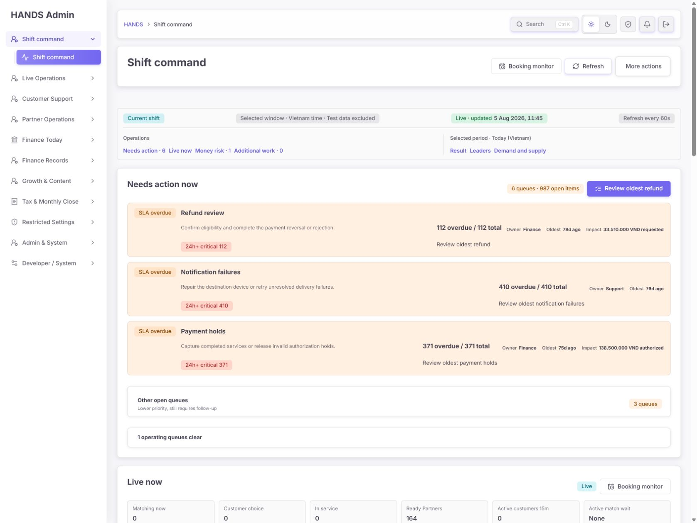

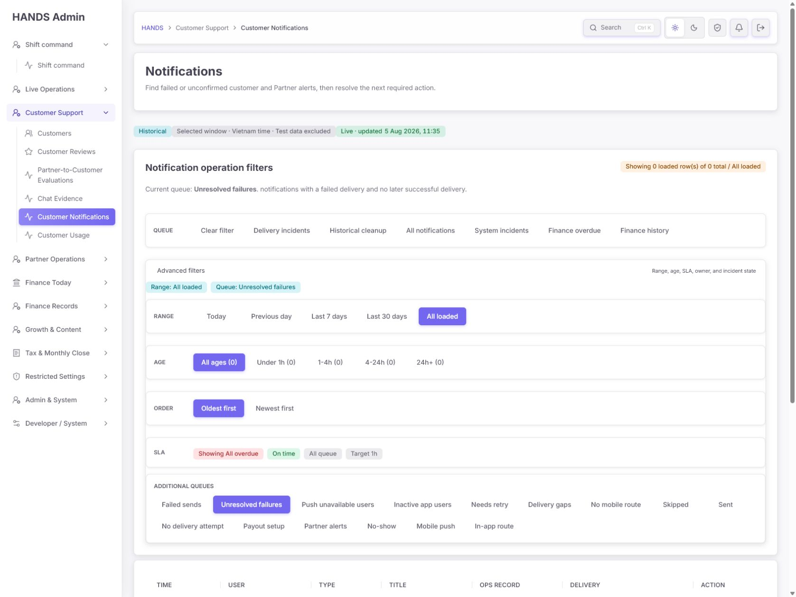

## 3. 디자인 건강 점수

| # | 휴리스틱 | 점수 | 근거 |
|---|---|---:|---|
| 1 | 시스템 상태 가시성 | 2/4 | update/scope/owner/oldest는 좋아졌지만 집계와 목록이 충돌한다. |
| 2 | 실제 업무 언어 | 3/4 | 운영 동사는 좋아졌으나 `row(s)`, `All loaded`, 구현 설명이 남는다. |
| 3 | 사용자 통제와 자유 | 3/4 | 명확한 큐 이동과 disclosure가 있다. 인수인계 취소·미리보기·수정은 부족하다. |
| 4 | 일관성과 표준 | 1/4 | 같은 업무가 화면마다 112↔0, 410↔0으로 다르다. Handoff 위치명도 어긋난다. |
| 5 | 오류 예방 | 2/4 | 위험 행동 가드는 개선됐지만 handoff가 자유 입력이고 존재하지 않는 case/operator를 허용한다. |
| 6 | 기억보다 인식 | 3/4 | next action/owner/age가 보인다. 알림은 필터·지표 집합을 해석해야 한다. |
| 7 | 유연성과 효율 | 2/4 | 고급 필터 접기는 좋다. 일괄 배정, My queue, 구조화된 handoff picker가 없다. |
| 8 | 미학적·최소주의 | 3/4 | 이전보다 정돈됐다. 알림 1024px과 0원 Finance 카드는 여전히 과밀/과대하다. |
| 9 | 오류 인지·복구 | 2/4 | 빈 상태는 좋지만 API/쿼리 오류가 정상 0건처럼 보이고 복구 경로가 없다. |
| 10 | 도움말과 문서 | 3/4 | scope, policy, next action 설명이 좋아졌다. 모순 발생 시 진단 안내는 없다. |
| **합계** |  | **24/40** | **이전 25/40 대비 -1. 시각 개선보다 데이터 신뢰성 결함의 영향이 크다.** |

평가 등급: **Needs work**. UI polish는 진전됐지만 현재 상태로는 운영자가 `0건`을 믿고 교대를 종료하면 실제 미처리 건을 놓칠 수 있다.

## 4. 잘된 부분

- Shift Command는 `무엇을`, `누가`, `얼마나 오래`, `금액 영향`, `다음 행동`을 한 카드에서 보여준다.
- Partner Approvals는 0건일 때 디렉터리 필터를 숨기고 다음 목적지만 남겼다.
- Finance Today와 Current Backlog를 별도 workspace로 나눈 방향이 좋다.
- Finance Backlog의 unassigned/oldest/impact 표시는 실제 관리자 운영에 유용하다.
- Operations History를 읽기 전용으로 만들고 Current Handoff를 별도 view로 분리했다.
- Customers의 `Needs action` 기본 화면과 Customer Detail의 예외 우선 배치는 이전보다 훨씬 운영자 중심이다.
- 타깃 Impeccable 정적 detector에서는 generic AI-copy/구조 패턴 위반이 나오지 않았다. 문제의 중심은 코드 패턴보다 데이터 계약과 실제 workflow다.

## 5. 우선순위별 수정 요구사항

### [P0] DRA-001 — production-data 필터를 null-safe 단일 계약으로 수정

**문제**  
Booking/Refund/Payment-linked/Notification Prisma 목록이 운영 데이터를 0건으로 만든다. 대시보드 raw SQL은 2,954개 production Booking을 인정하지만 동일 목적의 Prisma helper는 0개를 인정한다.

**운영 영향**  
실제 환불 112건과 알림 실패 410건을 운영자가 “없음”으로 오판한다. 이는 디자인 결함이 아니라 업무 누락을 만드는 데이터 정확성 결함이다.

**수정 요구**

- `adminBookingProductionDataWhere()`와 `adminNotificationProductionDataWhere()`의 nullable JSON path를 null-safe 조건으로 바꾼다.
- raw SQL helper와 Prisma helper의 fixture 정의를 문서상 하나로 고정한다.
- 화면별로 조건을 추가하지 말고 현재 공통 helper에서 한 번 고친다.
- `string_contains: ''` 조건은 제거한다.

**수용 기준**

- 같은 DB에서 SQL production Booking count와 Prisma production Booking count가 2,954로 같다.
- Shift Command 환불 112건 CTA를 열면 Refund list/summary/pagination total도 112다.
- Shift Command 알림 410건 CTA를 열면 Notification list/summary total도 410다.
- smoke/seed fixture는 기본 큐에서 계속 제외된다.
- 실제 PostgreSQL을 사용하는 작은 integration test가 JSON key missing/null/string/boolean fixture 사례를 검증한다. 객체 snapshot test만으로 완료 처리하지 않는다.

### [P0] DRA-002 — API 실패와 정상 0건을 시각적으로 분리

**문제**  
`apps/admin_web/lib/admin-api.ts:5473-5496`의 `adminGet()`은 네트워크 오류, 401/403/500, JSON 오류를 전달된 빈 배열/0 summary로 바꾼다. 현재 production-filter 버그와 별개로 API 장애도 “처리할 업무 없음”처럼 보일 수 있다.

**수정 요구**

- Shift Command, Booking, Refund, Notification, Finance backlog처럼 교대 의사결정에 쓰는 페이지는 `adminGetResult()`의 `ok/status`를 사용한다.
- 실패 시 표의 정상 empty state를 렌더링하지 않는다.
- 상단에 `Data unavailable · last successful update … · Retry`를 표시한다.
- 여러 API 중 일부만 실패하면 어떤 카드/표가 unavailable인지 부분 오류로 표시한다.

**수용 기준**

- API 500에서 `0 rows`, `No action needed`, `0 VND`가 보이지 않는다.
- 오류 배너는 `role="alert"`, 재시도 버튼, 마지막 성공 시각, 실패한 데이터 범위를 제공한다.
- 정상 0건은 기존의 친화적인 empty state를 유지한다.

### [P0] DRA-003 — Customer Directory 전화번호 마스킹 복구

**문제**  
Customer Directory가 전체 전화번호를 행마다 노출한다. `apps/admin_web/app/customers/customers-table-section.tsx:57`에서 `row.phone`을 그대로 렌더링하고, `customer-list-model.ts:164-165`와 `customer-management-view-model.ts:175`가 원문을 전달한다.

**운영 영향**  
어깨너머 노출, 화면 공유, 캡처, 낮은 권한 역할에서 불필요한 PII 확산이 생긴다. 현재 1024px 캡처에도 전체 전화번호가 두 번씩 보인다.

**수정 요구**

- 목록 API/read model에서 서버 측 masked phone을 제공하고 표는 masked 값만 사용한다.
- Booking 목록에 이미 있는 전화번호 마스킹 규칙을 재사용한다. 별도 유틸을 중복 생성하지 않는다.
- Customer Detail의 전체 전화번호가 업무상 필요하면 `Reveal phone`을 권한 확인·감사 로그와 함께 제공한다.
- CSV export는 별도 export 권한과 사유가 없으면 마스킹한다.

**수용 기준**

- Directory HTML/CSV/검색 결과에서 전체 번호가 노출되지 않는다.
- 검색은 전체 번호로 가능하더라도 결과 표시는 마스킹된다.
- Reveal은 허용 역할에서만 동작하고 audit log에 actor/customer/reason/time이 남는다.

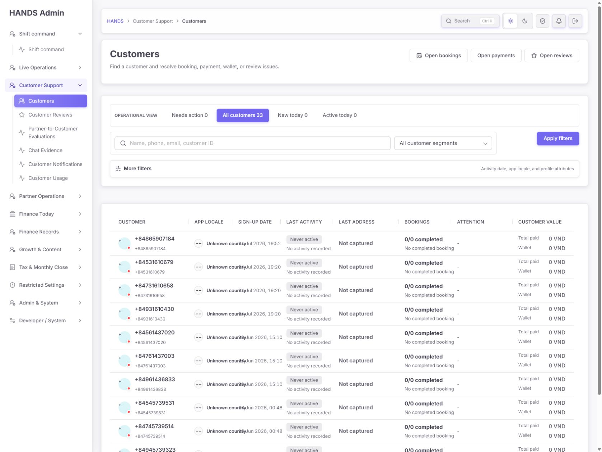

### [P1] DRA-004 — Dashboard와 상세 큐의 상태 정의를 통일

**문제**  
환불 Dashboard SQL은 `COMPLETED/REFUNDED/CANCELLED/REJECTED가 아닌 모든 상태`를 open으로 보지만, Refund API는 네 상태만 active로 본다. 현재 데이터는 REQUESTED라 production 필터만 고치면 맞지만, 새로운/legacy 상태가 생기면 다시 어긋난다.

**수정 요구**

- `open`, `overdue`, `owner`, `oldest`, `amount`의 정의를 큐 계약으로 문서화한다.
- 가능하면 한 서버 함수/상태 목록을 summary와 list가 공유한다.
- raw SQL을 유지한다면 모든 dashboard CTA에 `summary count === linked list total` contract test를 둔다.

**수용 기준**

- 모든 Needs action 카드에서 count/oldest/amount가 링크된 목록과 동일하다.
- 새로운 Refund status가 추가되면 계약 테스트가 실패한다.

### [P1] DRA-005 — Shift Command에서 현재 업무와 75~78일 적체를 분리

**문제**  
첫 화면의 세 핵심 카드가 모두 75일 이상이고 987건이다. 현재 교대가 당장 처리할 live exception과 데이터 정리/legacy backlog가 같은 시각 무게를 갖는다.

**수정 요구**

- `Current shift`, `Overdue operational`, `Legacy cleanup`의 세 bucket을 분리한다.
- 24시간 이상 또는 별도 정책 기준을 넘은 건은 current SLA와 별도로 표시한다.
- 첫 화면에는 각 큐 전체 건수가 아니라 실제로 지금 처리할 상위 case 1~3개와 assignee를 보여준다.
- `1 operating queues clear`는 `1 queue clear` 또는 자연스러운 동적 복수형으로 수정한다.

**수용 기준**

- 첫 viewport에서 current live action과 legacy cleanup이 색·제목·범위로 구분된다.
- 987건 모두를 같은 warning 카드로 반복하지 않는다.
- unassigned queue에서 바로 담당자를 지정하거나 assignment 화면으로 이동할 수 있다.

### [P1] DRA-006 — Notification 화면을 incident 중심으로 축소

**문제**  
Unresolved failures 링크에서는 표보다 queue/advanced filters가 먼저 나오고, 1024px에서는 첫 viewport 전체가 필터다. `Historical`과 `Live · updated`도 동시에 보여 시간 의미가 충돌한다.

**수정 요구**

- 기본 화면은 `Current delivery incidents`와 `Historical cleanup` 두 개만 1차 탭으로 둔다.
- failed/unresolved/needs-retry/FCM 등 기술적 집합은 Developer/System 또는 2차 disclosure로 이동한다.
- 동일 provider/failure code/time window를 한 incident로 묶어 영향 사용자 수, 첫/최근 발생, owner, customer fallback을 보여준다.
- 현재 선택 range에 맞춰 `Live`, `Historical`, `Updated` 배지를 하나의 문장으로 합친다.

**수용 기준**

- 1024px 첫 viewport에서 현재 incident 1행 또는 정상 empty state가 보인다.
- 동일 원인의 수백 실패가 단일 incident로 표시된다.
- Support 운영자는 기술 필터를 해석하지 않고 연락/재시도/에스컬레이션을 선택할 수 있다.

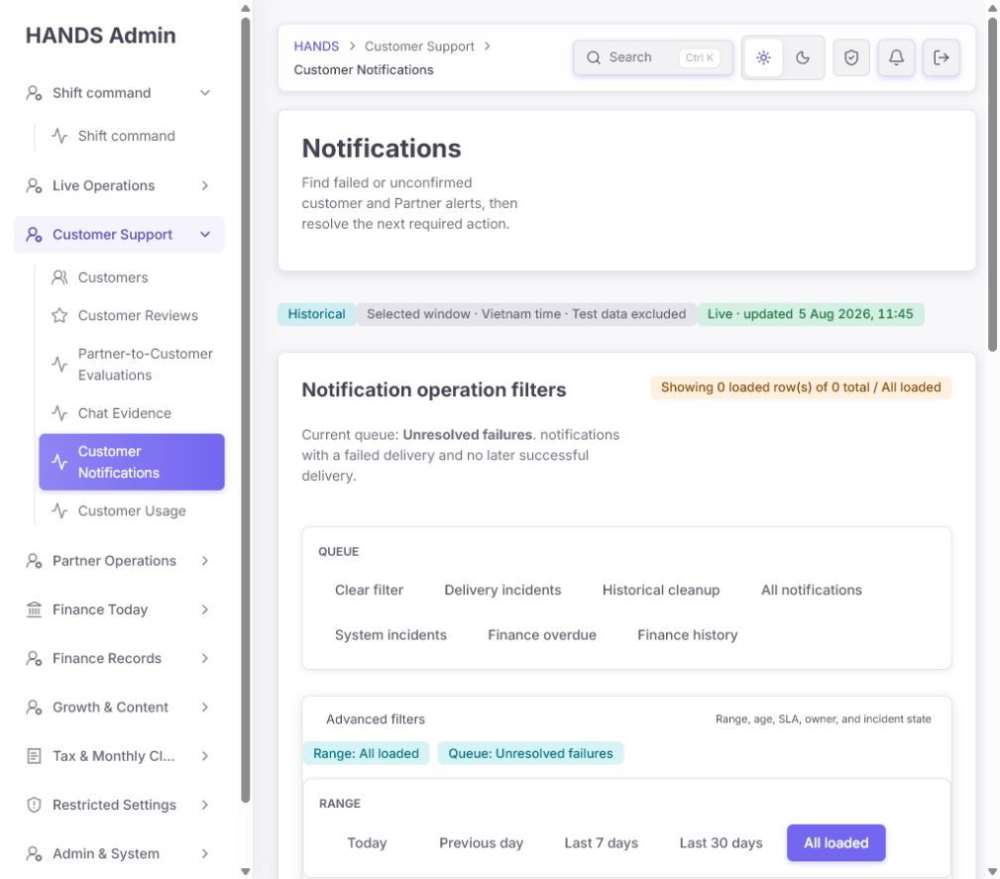

### [P1] DRA-007 — Shift Handoff를 실제 operator/case에 연결

**문제**  
Incoming operator, owner, unresolved case IDs가 모두 자유 입력이다. API는 비어 있지 않은지만 확인한다(`apps/api/src/admin/admin.service.ts:26034-26049`). 존재하지 않는 사용자, 잘못된 case ID, 오타 owner도 저장된다.

**수정 요구**

- Incoming operator는 권한 있는 관리자 combobox로 제공한다.
- Outgoing operator와 shift start/time은 현재 session에서 자동 채운다.
- Owner는 팀/관리자 선택으로 제공한다.
- Unresolved cases는 현재 open queues에서 검색·선택하고 type/상태/owner를 함께 저장한다.
- 제출 전 recipient와 cases를 확인하는 preview를 둔다.
- breadcrumb/sidebar의 `Operations History`와 H1 `Shift Handoff`를 `Current Handoff`로 일치시킨다.

**수용 기준**

- 존재하지 않는 operator/case를 제출할 수 없다.
- incoming operator 자신만 acknowledge하거나 권한 정책이 명확하다.
- case가 이미 닫혔으면 제출 전 경고하고 최신 상태를 보여준다.

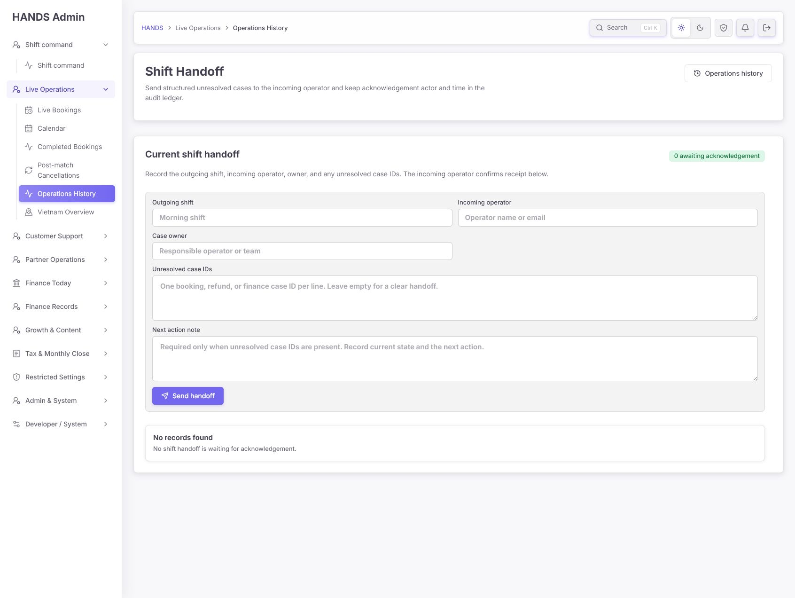

### [P1] DRA-008 — 1024px Customer Directory 표 겹침 수정

**문제**  
1024px 캡처에서 `Unknown country`와 sign-up date가 겹치고 이후 열은 잘린다. CSS는 horizontal scroll을 허용하지만 현재 표가 스크롤 가능한 영역임을 알려주지 않고, 첫 세 열도 읽기 어렵다.

**수정 요구**

- 첫 화면 열을 Customer, Last activity, Bookings, Attention, Value로 축소한다.
- App locale, Sign-up, Last address는 row detail/disclosure로 이동한다.
- 전체 열 유지 시 first column sticky, 명확한 horizontal-scroll affordance, cell overflow test를 둔다.
- `Unknown country`, `Never active`, `No activity recorded`가 모든 행에서 반복될 때는 행별 반복 대신 상단 data-quality summary로 묶는다.

**수용 기준**

- 1024×900에서 텍스트가 다른 열과 겹치지 않는다.
- keyboard로 horizontal scroll과 row link에 접근 가능하다.
- 전체 전화번호 마스킹 요구와 함께 통과한다.

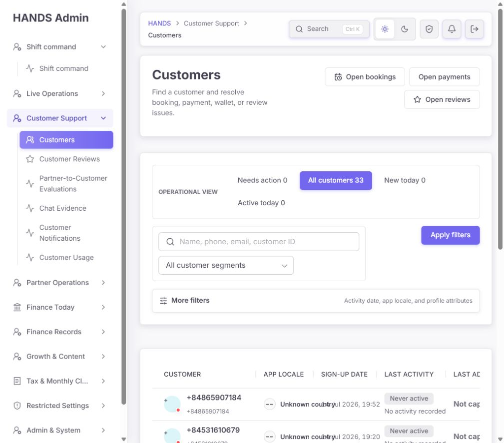

### [P2] DRA-009 — Finance backlog 카드의 실제 경고 원인을 표시

**문제**  
`Tax and closeout review`는 화면에 `0 open tax`, `0 formula issues`만 보이는데 warning queue로 포함된다. 코드는 coupon review, payout outflow/inflow reconciliation 등 숨은 값 중 하나만 커도 warning tone을 준다(`finance-overview-model.ts:1647-1666`).

**수정 요구**

- warning을 만든 정확한 count를 카드에 표시한다.
- 모든 trigger가 0이면 Current Open Backlog에서 숨긴다.
- 카드 action을 `Open queue` 대신 `Review 3 coupon flags`처럼 실제 원인에 맞춘다.

**수용 기준**

- 경고 카드에는 0이 아닌 가시적 원인이 최소 하나 있다.
- 사용자는 카드를 열기 전에 어떤 자료를 처리할지 알 수 있다.

### [P2] DRA-010 — Customer Detail의 empty/diagnostic 밀도와 PII를 조정

**문제**  
예외 우선 배치는 좋지만 action이 없는 고객에게도 `Open technical diagnostics`가 상단 주요 action이다. 전체 전화번호가 subtitle, headline, contact line에 반복되고 아래에는 많은 0/empty section이 이어진다.

**수정 요구**

- Technical diagnostics는 실제 data issue가 있거나 Developer 권한일 때만 secondary disclosure로 제공한다.
- 기본 전화번호는 마스킹하고 한 번만 표시한다.
- 내용 없는 sections는 `No activity yet` 요약 아래 접거나 렌더링하지 않는다.
- Quick actions는 현재 이슈가 있을 때 권장 action 하나를 먼저 강조한다.

**수용 기준**

- no-action 고객의 첫 viewport에 반복 PII와 기술 action이 우선하지 않는다.
- 비어 있는 섹션이 페이지 길이를 불필요하게 만들지 않는다.

### [P2] DRA-011 — 기계적인 문구를 자연스러운 운영 문구로 정리

감사 대상 코드에서 `booking(s)`, `row(s)`, `case(s)`, `record(s)`, `Partner(s)`, `formula issue(s)` 패턴이 spec 포함 132회 발견됐다. 모든 곳을 한 번에 바꿀 필요는 없고, 현재 운영자가 보는 핵심 화면부터 공통 plural helper를 재사용하면 된다.

| 현재 문구 | 권장 문구 |
|---|---|
| `Showing 0 loaded row(s) of 0 total` | `No notifications in this queue` / `Showing 1–10 of 410 notifications` |
| `0 booking(s)` | `No bookings` |
| `1 operating queues clear` | `1 queue clear` |
| `Open cases. refunds awaiting...` | `Open cases awaiting a decision or payment completion.` |
| `Unresolved failures. notifications...` | `Notifications with a failed delivery and no later success.` |
| `All loaded` | `All dates` 또는 `Entire history` |
| `without mixing in older backlog` | `Review today’s money movement and current balances.` |
| `Open queue` 반복 | `Review refunds`, `Assign bank reviews`, `Resolve tax flags` |
| `Pause live` | `Pause live updates` |

**수용 기준**

- 핵심 11개 화면에서 `(s)`가 보이지 않는다.
- 문장이 마침표 뒤 소문자로 이어지지 않는다.
- 구현 의도 설명 대신 운영자가 판단할 범위와 다음 행동을 설명한다.

### [P3] DRA-012 — 시각 우선순위와 상단 공간을 마감

- Shift Command의 세 75일 backlog가 모두 같은 큰 warning block이라 긴급도 차이가 없다.
- Finance Today의 활동 0일 때 0 VND 카드 네 개가 빈 상태보다 더 큰 공간을 차지한다.
- Header의 Search, light, dark, policy, bell, sign out가 동일한 아이콘 버튼으로 연속되어 테마 두 버튼의 목적이 중복된다.

**수정 요구**

- danger는 즉시 고객/금액 차단, warning은 SLA 초과, neutral은 legacy/history로 제한한다.
- Today activity가 0이면 4개 0카드 대신 한 개 compact clear state로 바꾼다.
- light/dark를 하나의 theme toggle로 합친다.
- 페이지당 primary CTA는 하나만 둔다.

## 6. 화면별 재판정

### 1) Shift Command — 2/4, 부분 개선

- 좋아짐: queue count, owner, oldest, impact, CTA, lower-priority disclosure.
- 문제: CTA 결과 0건, 987개 역사 적체가 current shift를 지배, assignment 없음, `1 operating queues clear`.
- 다음 수정: DRA-001/002를 먼저 완료하고 current/legacy를 분리한다.

### 2) Booking Monitor — 2/4, 화면은 깨끗하지만 데이터 확인 불가

- 좋아짐: Needs action/Live now/Records 탭, advanced filters 접기, 친화적인 empty state.
- 문제: 공통 Booking production filter로 실제 레코드가 0건이어서 UI 품질보다 데이터 부재가 먼저 보인다.
- 문구: `Live bookings` 제목과 Records/history view가 한 H1을 공유하고, `Pause live` 대상이 모호하다.
- 감사 한계: 현재 데이터에서 booking detail로 들어갈 수 없어 이번 run의 상세 행동 화면 캡처는 못 했다.

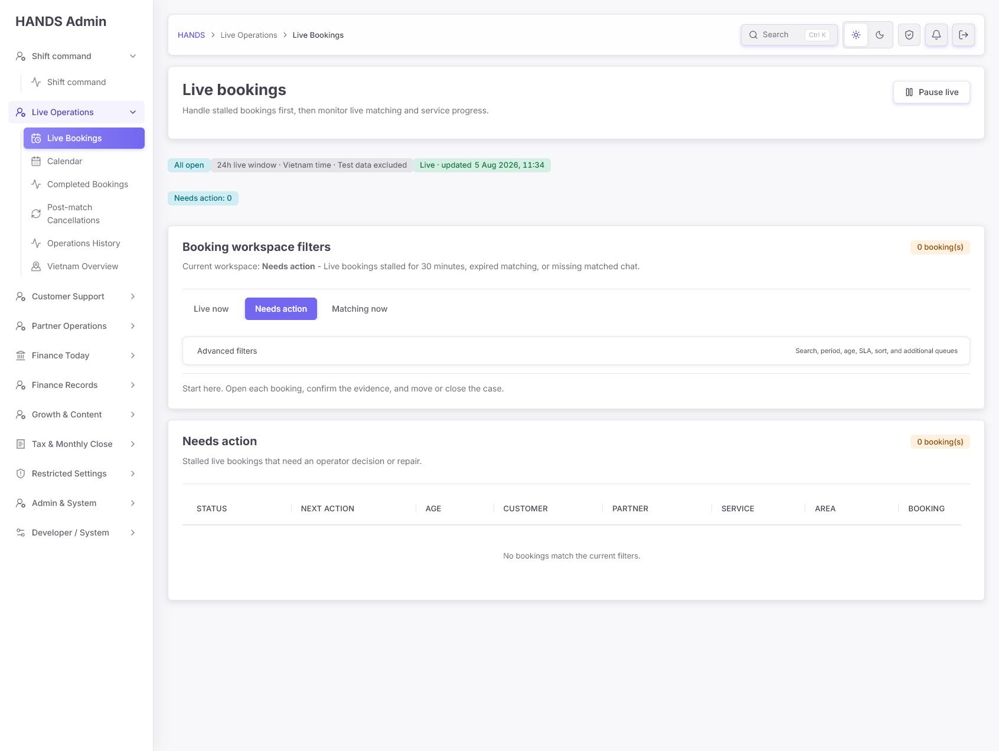

### 3) Refunds — 1/4, 운영 불가

- Shift Command 112건 → Refund queue 0건으로 가장 명확한 신뢰성 실패다.
- 필터/표 자체는 단순해졌지만 정상 empty state가 오류를 숨긴다.
- `No refunds currently match this queue. refunds...` 문법을 고친다.

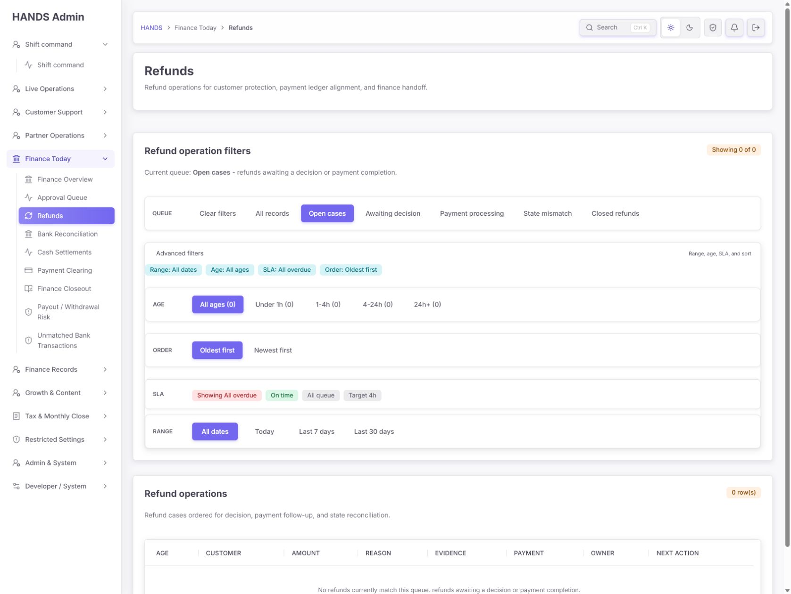

### 4) Notifications — 1.5/4, 계약 실패 + 필터 과밀

- Shift Command 410건 → linked list 0건이다.
- 같은 화면 아래 `Delivery not confirmed 434`, `Push unavailable 92`가 보여 서로 다른 단위/집합임을 해석해야 한다.
- 1024px 첫 viewport에 결과가 보이지 않는다.
- current incident와 historical cleanup을 1차 구조로 유지하고 기술 집합을 낮춘다.

### 5) Customers — 2/4, IA 개선·개인정보 회귀

- 좋아짐: Needs action 기본값, All/New/Active의 이해하기 쉬운 탭, 목적 있는 empty state.
- 문제: All Customers에서 전체 전화번호, 1024px 열 겹침, `App offline/Unknown/Never active` 반복.
- DRA-003/008이 필수다.

### 6) Customer Detail — 2.5/4, 예외 우선은 좋음

- 좋아짐: Needs action을 먼저 보여주고 diagnostics를 별도 action으로 분리했다.
- 문제: 전체 전화번호 3회, no-action에서도 diagnostics가 상단 action, 긴 empty sections.

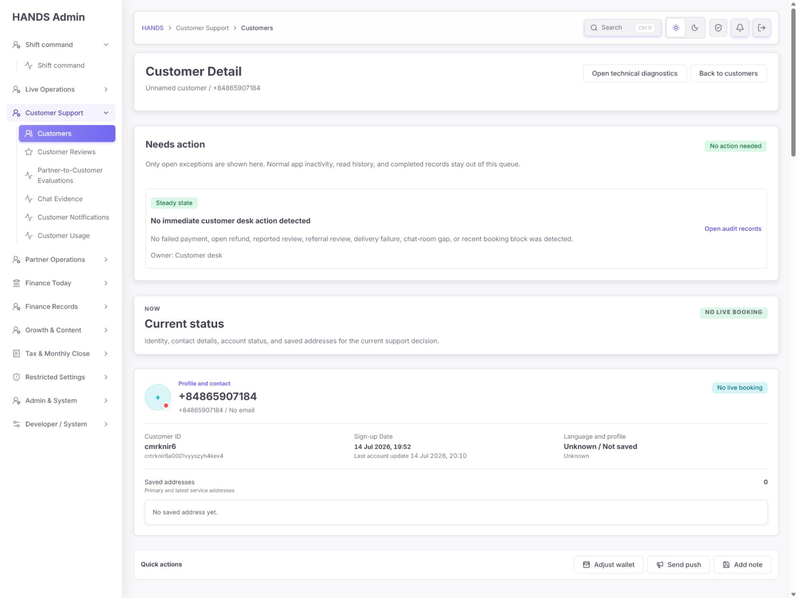

### 7) Partner Approvals — 3.5/4, 가장 잘 정리된 화면

- 0 pending에서 필터·Export를 제거하고 Partner directory/approval history만 제공한다.
- 작은 문제: `Partner Approvals` 화면인데 상단 tab의 `Partners`가 활성으로 보여 active-state가 일치하지 않는다.
- 현재 구조를 다른 전용 0건 큐의 기준으로 삼을 수 있다.

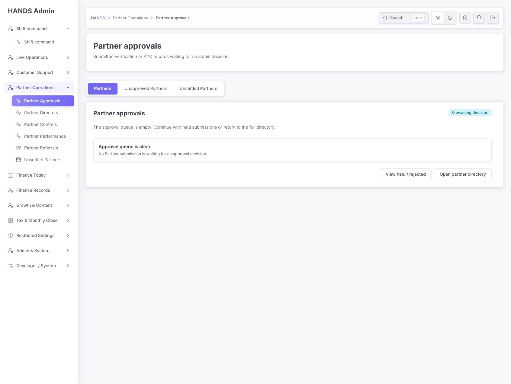

### 8) Finance Overview — 3.5/4, 명확하게 개선

- Today Movement와 Current Balances 분리는 유지해야 한다.
- 0 activity에서는 4개 0 VND 카드보다 compact clear state가 낫다.
- `without mixing in older backlog`는 내부 구현 설명이므로 운영 결과 문구로 바꾼다.

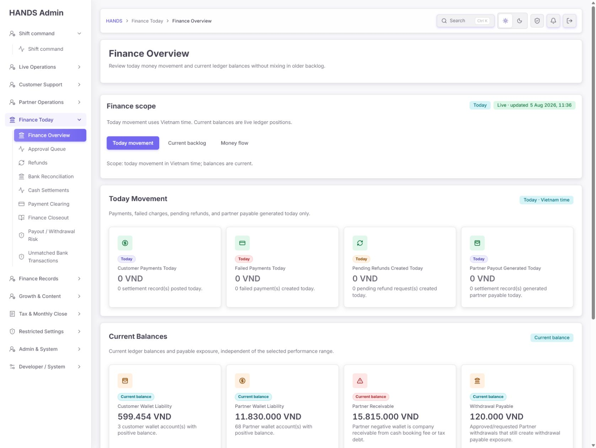

### 9) Finance Current Backlog — 3/4, 원인 라벨 보강 필요

- owner/unassigned/oldest/impact는 실무적으로 좋다.
- Tax/closeout 카드의 visible count가 모두 0인데 warning인 이유를 표시해야 한다.
- 모든 행의 `Open queue`를 실제 행동 동사로 바꾼다.

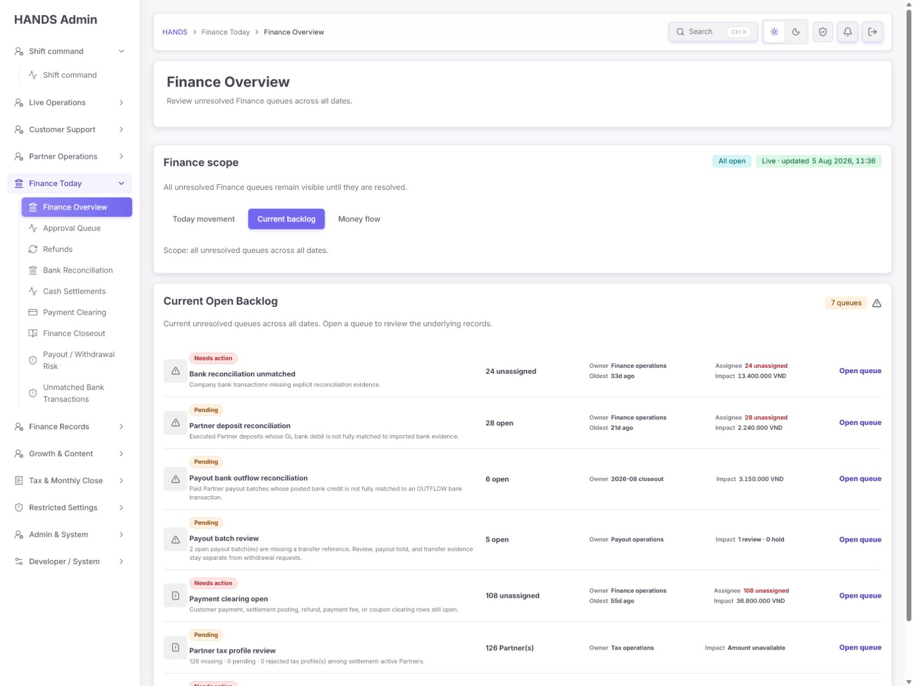

### 10) Operations History — 3.5/4, 모델 분리 성공

- History를 읽기 전용으로 만든 방향이 좋다.
- 데이터가 없을 때 `View completed handoffs`가 상단과 detailed card에서 반복된다.
- summary에 데이터가 없으면 상세 카드 5개를 한 disclosure로 줄인다.

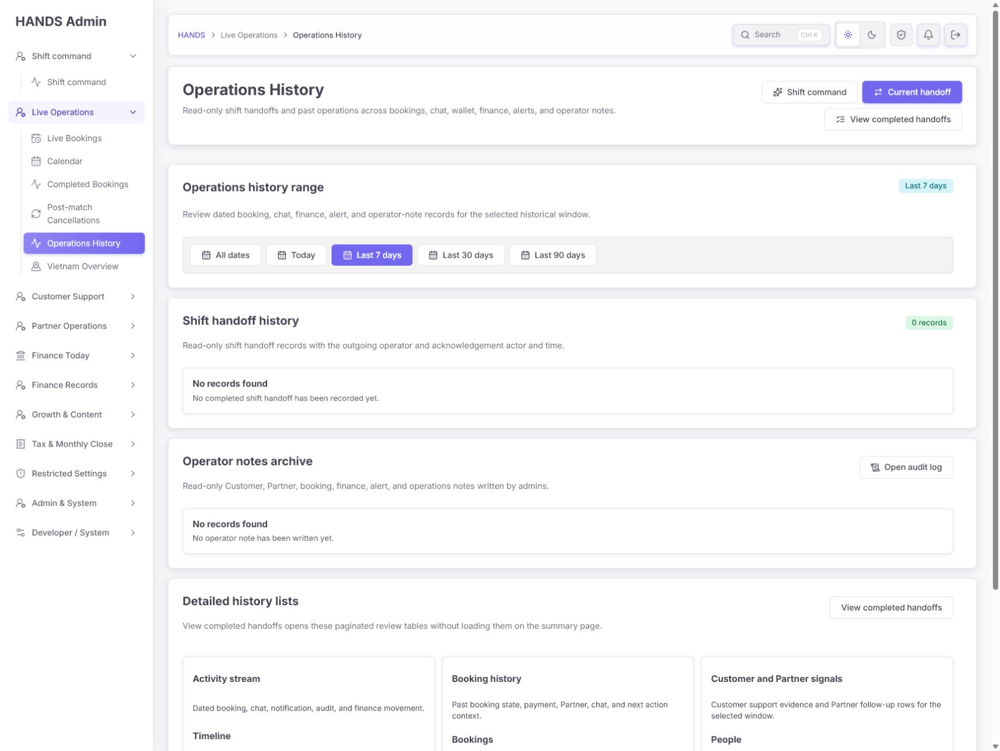

### 11) Current Shift Handoff — 2/4, UI 분리는 됐지만 무결성 미완료

- 별도 view와 acknowledgement 모델은 좋은 출발이다.
- operator/owner/case free text, 잘못된 breadcrumb, preview 부재가 실제 교대 기록 신뢰성을 낮춘다.
- DRA-007처럼 기존 users/open queues 조회를 연결하는 최소 수정이 필요하다.

## 7. 운영자 페르소나 관점

### Alex — 숙련된 교대 책임자

- 좋아진 점: Shift Command에서 owner/oldest/impact를 빠르게 훑을 수 있다.
- 막히는 점: 112건 카드를 눌러 0건이 나오면 숫자를 검증하기 위해 여러 화면·DB 담당자에게 확인해야 한다.
- 필요한 것: 집계-목록 parity, My queue/unassigned, current와 legacy 분리.

### Sam — 신규 고객지원 운영자

- 좋아진 점: Customers/Customer Detail의 `Needs action`과 next action 문구는 학습 부담을 줄인다.
- 막히는 점: Notifications의 434/410/92가 각각 사용자·알림·실패인지 구분하기 어렵고 필터가 너무 많다.
- 필요한 것: incident 단위, 자연어 문구, 권장 action 하나, 기술 필터의 격리.

### Riley — 개인정보·감사 책임자

- 막히는 점: Directory와 Detail에서 전체 전화번호가 기본 노출되고 화면 캡처에도 남는다.
- 필요한 것: list masking, permissioned reveal, audit log, export 권한.

## 8. 디자인 특이성 / Impeccable Assessment B

수동 평가를 먼저 완료한 뒤, 716개의 scannable admin frontend 파일 전체 대신 이번 감사의 대표 경로 8개를 분리해 정적 detector로 검사했다.

- `app/page.tsx`
- `app/bookings`
- `app/refunds`
- `app/notifications`
- `app/customers`
- `app/operations-handoff`
- `app/finance-overview`
- `components`

모든 실행 결과는 `[]`였다. 즉 detector가 찾는 generic landing-page/AI-slop 패턴은 없었다. 다만 이는 이번 P0인 실제 DB null semantics, 화면 간 count mismatch, 개인정보 노출, 1024px 정보 밀도, 운영 용어 문제를 탐지하지 못한다.

Detector overlay는 in-app browser의 읽기 전용 page evaluation 제약과 detector 결과 0건 때문에 주입하지 않았다. DOM·현재-run screenshots·CLI detector로 대체했다.

## 9. 최소 구현 순서

1. **DRA-001** 공통 Booking/Notification production helper 수정 + Postgres parity integration test
2. **DRA-002** 핵심 큐 `adminGetResult` 전환 + unavailable state
3. Shift Command → Refund/Notification/Booking/Payment CTA count parity smoke test
4. **DRA-003** Customer list/server/export masking
5. **DRA-007** Handoff operator/case selectors와 서버 존재 검증
6. **DRA-006/008/009/011** 필터·표·문구 밀도 정리
7. 1688px, 1440px, 1024px, 200% zoom, keyboard-only, screen-reader spot check

이 순서보다 먼저 색상이나 카드 스타일을 손보면 0건 신뢰성 결함이 그대로 남는다.

## 10. 완료 검증 체크리스트

- [ ] SQL production Booking count = Prisma production Booking count
- [ ] SQL production unresolved notification count = Prisma list/summary count
- [ ] Dashboard의 모든 Needs action count = 링크된 목록 total
- [ ] API 500/401/timeout에서 정상 empty state 미노출
- [ ] Refund 112건의 첫 페이지가 실제 row를 표시하고 pagination total 112
- [ ] Notification 410건의 linked queue가 실제 row/incident를 표시
- [ ] smoke/seed fixture 기본 화면 0건
- [ ] Customer Directory/CSV 전체 전화번호 0건
- [ ] Detail reveal 권한·사유·audit log 확인
- [ ] 1024px Customer 표 텍스트 겹침 0건
- [ ] 1024px Notification 첫 viewport에서 결과 또는 empty state 확인
- [ ] Handoff invalid operator/case 제출 차단
- [ ] 핵심 11개 화면 visible `(s)` 문구 0건
- [ ] current/live/historical badge가 상호 모순되지 않음

## 11. 접근성 범위와 한계

- 이번 run에서 현재 DOM/source의 heading, native label, button/link accessible name과 1024px 화면을 확인했다.
- 전체 keyboard-only 여정, 실제 screen reader, 자동 contrast ratio, 200% zoom 전체 경로는 실행하지 않았다. 따라서 WCAG 준수를 주장하지 않는다.
- 1024px 화면에서 확인된 과밀·겹침은 접근성 위험으로 판정하지만, contrast는 수치 측정 전까지 확정 실패로 판정하지 않는다.

## 12. Run Notes

- 질문 생략: 로그인 상태, 현재 실행 화면, 소스, 이전 감사 문서가 충분해 감사 진행을 막는 질문은 없었다.
- 브라우저: 사용자가 로그인한 in-app browser를 읽기 전용으로 사용했고 마지막에 Shift Command로 돌려두었다.
- 데이터: 읽기 전용 count/group aggregate만 실행했으며 개인 식별자나 레코드 내용을 출력하지 않았다.
- 정적 detector: 8개 대표 target, 결과 0건.
- 제약: 저장소 `AGENTS.md`의 단일 에이전트 정책으로 병렬 독립 평가를 수행하지 못했다.
- 출력 폴더: `output/admin-operator-deep-reaudit-2026-08-05`

