# HANDS Admin — Bank Reconciliation 심층 감사 보고서

- 감사일: 2026-08-08 (Asia/Bangkok)
- 대상: `/finance-tax/bank-reconciliation` 및 연결된 거래 상세, 명세 가져오기, 수동 예외, 가져오기 배치 상세
- 관점: 실제 Finance 운영자, 승인자, 감사 대응자
- 화면 범위: 데스크톱 운영 환경만 평가. 1024px 이하 반응형 문제는 본 보고서에서 제외
- 방법: 로그인된 실제 화면의 현재 상태를 캡처한 뒤, 페이지 코드·API 조회/변경 계약·테스트를 교차 검증
- 앱 소스 변경: 없음

## 1. 결론

현재 구현은 **금융 작업의 안전장치와 감사 증거는 강하지만, 매일 처리해야 할 작업을 발견하고 올바른 근거를 선택하는 운영 UX는 아직 위험하다.** 종합 평가는 **6.7/10, 제한적 운영 가능**이다.

가장 시급한 문제는 다음 네 가지다.

1. 루트 진입이 `Today`로 고정되어 실제 전체 미해결 44건과 48시간 초과 미배정 23건을 모두 0으로 보여준다. 운영자가 사이드바로 들어오면 오래된 사고 후보를 놓칠 수 있다.
2. 결제 대사 후보는 최근 30일·최대 50건으로 잘린 뒤 금액 차이만 우선 정렬되고, 선택 문구에 거래일·고객·참조번호가 없다. 화면에는 동일 금액 후보 50건이 노출되며 첫 항목이 기본 선택된다. 잘못된 자금 증거를 연결할 위험이 있다.
3. 가져오기 배치 상세 표에서 `Import result`와 `Reconciliation` 데이터가 서로 뒤바뀌어 표시된다. 실제 화면에 `IGNORED`가 Import result 아래, `IMPORTED`가 Reconciliation 아래에 나타난다.
4. `IGNORED` 거래 상세의 운영 경로가 `Create explicit match`를 다음 행동으로 안내하지만 같은 화면은 “Ignored transactions cannot receive a new match”라고 차단한다. 종료 상태의 안내 계약이 모순된다.

보안·무결성 쪽은 상대적으로 좋다. API는 검토 담당자와 승인자를 분리하고, 남은 금액 초과·중복 소스·동시 변경을 검증하며, 매칭/반전/무시를 감사 로그와 직렬화 트랜잭션으로 보존한다. 따라서 이번 개선은 이 안전 계약을 유지하면서 **기본 진입 범위, 후보 선택, 상태 문구, 표 정보 구조**를 고치는 데 집중해야 한다.

## 2. 실제 운영 상태에서 확인한 숫자

| 상태 | 관찰값 | 운영 해석 |
|---|---:|---|
| 루트 기본값 | Today, 모두 0 | 현재 날짜에 거래가 없다는 뜻일 뿐, 미해결 큐가 비었다는 뜻은 아님 |
| 전체 미해결 | 44건 / 13,400,000 VND | 실제 처리 대상 |
| 48시간 초과 미배정 | 23건 | 즉시 소유권 배정이 필요한 백로그 |
| 전체 미배정 | 24건 / 7,400,000 VND | 1건을 제외하고 모두 48시간 초과 |
| Demo Admin 배정 | 20건 / 6,000,000 VND | 담당자별 과부하를 바로 볼 수 있음 |
| 부분 대사 | 0건 | 현재 우선순위는 신규/미해결 매칭 |
| 완전 매칭 | 0건 | 표시 KPI는 0/57 |
| 무시됨 | 13건 / 18,656,723,091 VND | 정상 종료와 테스트 데이터가 섞여 있으며 별도 해석 필요 |
| 전체 가져오기 배치 | 13건 | 기본 Today 화면의 0건과 큰 차이 |

## 3. 잘된 점

### 3.1 금융 안전 계약

- 매칭·반전·무시는 검토 담당자가 지정되어야 하며, 서명한 Finance 승인자는 그 담당자와 달라야 한다. `apps/api/src/admin/admin.service.ts:33753-33789`
- 매칭 금액이 은행 거래의 잔액 또는 원천 증거의 잔액을 넘지 못하도록 서버가 재검증한다. `apps/api/src/admin/admin.service.ts:19639-19663`
- 변경은 Serializable 트랜잭션과 감사 로그로 묶인다. `apps/api/src/admin/admin.service.ts:19666-19762`
- 무시는 활성 매칭이 없는 UNMATCHED 거래에만 허용된다. `apps/api/src/admin/admin.service.ts:19908-19944`

### 3.2 가져오기 안전성

- CSV는 저장 전에 미리보기·정규화·중복 분류를 거친다.
- 파일 원문을 보존하지 않되 파일명과 SHA-256, 매핑 프리셋, 행별 결과, 운영자 근거를 기록한다.
- 정확한 중복은 차단하고 잠재 중복은 행별 명시 선택을 요구한다.
- 실패/스킵 행을 재시도 CSV로 다운로드할 수 있다.

### 3.3 운영 기반

- 필터가 URL에 남아 공유와 재현이 가능하다.
- 담당자별 Open/48h+/금액/최장 대기 집계가 전체 큐 기준으로 제공된다.
- 상태는 색상만이 아니라 텍스트로도 표현된다.
- 라이트/다크 테마가 모두 동작하고 입력 라벨·표 헤더·확인 대화상자의 기본 시맨틱이 갖춰져 있다.

## 4. 우선순위별 발견 사항

### P1-1. 기본 진입이 오래된 미해결 작업을 숨긴다

**증거**

- `/finance-tax/bank-reconciliation`은 `range=today`, `review=unmatched`로 해석되어 카드 4개가 모두 0이다.
- 같은 시점 `range=all&review=unmatched`에는 미해결 44건과 48h+ 미배정 23건이 있다.
- 사이드바 링크는 루트 URL이지만 검색 항목은 이미 `range=all&review=unmatched`를 사용한다. `apps/admin_web/lib/admin-navigation.ts:488-503`
- 명령 카드의 overview query도 선택된 날짜 범위를 그대로 사용한다. `apps/admin_web/app/finance-tax/bank-reconciliation/page.tsx:132-166`

**위험**

운영자는 “오늘 큐가 비었다”를 “처리할 일이 없다”로 이해할 수 있다. 37일 된 백로그가 정상 첫 화면에서 보이지 않는다.

**수정 요건**

- 미해결 큐의 기본 범위는 `All open`으로 변경한다. 열린 작업은 발생일 필터 때문에 숨겨지면 안 된다.
- 명령 카드 `48h+ unassigned`, `Unmatched exposure`, `Partially matched`는 화면의 날짜 필터와 무관한 글로벌 오픈 큐 지표로 고정한다.
- 날짜 범위는 `Closed/history` 또는 보조 필터로 이동한다.
- 사이드바와 검색 진입 URL을 하나의 canonical URL로 통일한다.
- Today가 필요하면 “오늘 발생”과 “현재 열림”을 명확히 분리한다.

### P1-2. 결제 대사 후보가 불완전하고 식별 정보가 부족하다

**증거**

- 상세는 `range=30d`, `review=open`, `take=50`으로 결제 원천을 가져온다. `apps/admin_web/app/finance-tax/bank-reconciliation/[id]/page.tsx:127-131`
- 후보는 금액 차이, 이후 최신 발생일 순으로 정렬한다. `.../[id]/page.tsx:1231-1239`
- 라벨은 상태·금액·짧은 booking ID만 포함한다. `.../[id]/page.tsx:1242-1247`
- 실제 300,000 VND 거래에서 `50 candidate(s)`가 표시되고 동일 금액 후보가 다수였다.
- 전체 큐의 최장 미해결은 37일인데 결제 후보 범위는 최근 30일이다.
- Advanced source match에서는 payment clearing을 제외하므로 30일 밖 또는 51번째 이후 결제 증거를 ID로 직접 찾을 수도 없다. `.../[id]/page.tsx:709-728`

**위험**

동일 금액 후보의 첫 항목이 기본 선택되어 잘못된 booking/clearing을 승인할 수 있고, 정답이 30일 밖 또는 첫 50건 밖이면 UI로 처리할 수 없다.

**수정 요건**

- 거래 상세 전용 candidate API를 만든다. 현재 은행 거래의 발생일·금액·통화·방향·transfer reference·counterparty를 입력으로 사용하고 점수와 근거를 반환해야 한다.
- 후보 라벨/행에 최소 `발생일시`, `booking/customer`, `결제수단/유형`, `금액`, `transfer reference`, `날짜 차이`, `금액 차이`, `신뢰도`, `왜 후보인지`를 표시한다.
- 후보가 여러 개면 기본값을 비워 두고 운영자가 명시 선택하게 한다.
- 30일/50건을 넘어서는 검색 가능한 “다른 payment clearing 찾기”를 제공한다.
- 후보 0건은 막힌 상태가 아니라 검색/원천 상세로 이어지는 회복 경로를 제공한다.
- 금액 일치만으로 `Recommended`라 부르지 말고 `Candidates`로 표현한다. 강한 참조번호·날짜 근거가 있을 때만 추천 배지를 사용한다.

### P1-3. 가져오기 배치 상세 표의 두 열이 서로 바뀌었다

**증거**

- 헤더 순서: `Classification`, `Import result`, `Reconciliation`.
- 셀 순서: classification, `row.transaction.status`, `row.status`.
- 소스: `apps/admin_web/app/finance-tax/bank-reconciliation/import-batches/[batchImportId]/page.tsx:259-283`
- 실제 화면: `Import result = IGNORED`, `Reconciliation = IMPORTED`.

**위험**

감사자가 가져오기 성공과 후속 대사 상태를 반대로 읽는다. 금융 증거 표의 의미가 잘못된 것이므로 단순 시각 문제가 아니다.

**수정 요건**

- `Import result` 셀에는 `row.status`, `Reconciliation` 셀에는 `row.transaction.status`를 렌더링한다.
- 테스트는 문자열 포함 여부가 아니라 헤더-셀 대응을 DOM 행 단위로 검증한다.
- IGNORED, MATCHED, PARTIALLY_MATCHED, SKIPPED 각각의 테이블 snapshot/semantic test를 추가한다.

### P1-4. 종료 상태 언어가 서로 모순된다

**증거**

- IGNORED 상세는 “Ignored or reversed bank transactions cannot receive a new match”라고 차단한다.
- 같은 화면의 Bank evidence hub는 다음 행동으로 `Create explicit match`를 표시한다.
- 원인은 `bankReconciliationNextAction()`이 MATCHED/PARTIAL/reversed 외에는 모두 `Create explicit match`로 반환하기 때문이다. `.../[id]/page.tsx:1298-1313`

**수정 요건**

- 상태 머신을 단일 함수/모델로 만들고 `IGNORED → Closed — no matching required`, `REVERSED → Re-opened or closed`처럼 실제 허용 동작과 일치시킨다.
- `remainingAmount`만으로 경고 tone을 결정하지 않는다. IGNORED는 미매칭 금액이 남아도 정상 종료일 수 있다.
- evidence hub의 `Finance source`, `Ledger evidence`, `Closeout state`를 terminal status에 맞게 바꾼다.

### P1-5. `Reconciled`가 matched, ignored, reversed를 모두 합쳐 의미를 왜곡한다

**증거**

- 배치 상세은 “Reconciled 1” 아래 설명에 “matched, ignored, or reversed”를 함께 쓴다.
- 큐 필터도 이 세 상태를 `Reconciled`로 합친다. `import-batches/[batchImportId]/page.tsx:353-377`
- 배치 이력에는 `Reconciled 100%`와 `Approval stage: Required at reconciliation`이 동시에 나타난다.

**수정 요건**

- 상위 상태는 `Open / Closed / Skipped`로 바꾼다.
- Closed 내부에서 `Matched / Ignored / Reversed`를 별도 집계·필터로 제공한다.
- approval stage는 거래별 승인 완료 여부에서 계산하거나, 배치 수준에 실제 승인 개념이 없다면 해당 열을 제거한다.
- “Unassigned”는 open row가 0이면 `No active owner needed`로 바꾼다.

### P1-6. 상세에서 목록으로 돌아가면 작업 맥락을 잃는다

**증거**

- 상세의 Back 링크는 항상 `range=30d&review=unmatched&take=25`다. `.../[id]/page.tsx:159-162`
- 전체 기간, owner, page, query, source, age에서 들어와도 모두 사라진다.

**수정 요건**

- 목록 링크에 검증된 `returnTo`를 넣고 상세/확인/변경 후에도 유지한다.
- 허용 path는 `/finance-tax/bank-reconciliation`로 제한하고 query allowlist를 적용한다.
- 브라우저 뒤로가기뿐 아니라 명시적 Back CTA도 같은 위치·페이지·필터로 돌아가야 한다.

### P1-7. 일상 처리 목록의 핵심 행동이 가로 스크롤 뒤에 숨는다

**증거**

- 표는 `width: max-content`이며 마지막 Evidence/Open 열을 고정하지 않는다. `apps/admin_web/app/globals.css:1313-1359`
- 실제 화면에서 `Evidence`와 `Open detail`이 보이지 않고, 거래 ID는 여러 줄로 깨진다.
- 매칭 이력 표도 한 행이 과도하게 높고 status/audit/action이 오른쪽에 숨는다.

**수정 요건**

- Active queue 표는 5개 결정 열로 축약한다: `Transaction`, `Bank evidence`, `Amount`, `Review state`, `Next action`.
- Evidence source는 Review state 안의 배지로 합친다.
- 행 전체 또는 거래 참조를 상세 링크로 유지하되, 마지막 `Open` 열은 sticky right로 고정한다.
- 식별자는 2줄 제한 + 전체값 tooltip/copy 버튼을 사용한다.
- 금액은 우측 정렬·nowrap, 설명은 2줄 clamp한다.
- 매칭 이력은 summary 행 + 펼침 audit timeline으로 바꾼다.

### P1-8. 한 화면이 여러 무거운 집계를 중복 요청한다

**증거**

- review workspace는 현재 큐 summary, 전체 overview summary, evidence facet, owner workload, transaction list, admin directory를 동시에 요청한다. `page.tsx:139-221`
- API는 summary, evidence source, owner workload에서 각각 별도 raw SQL과 최신 assignment lateral join을 수행한다. `admin.service.ts:16343-16726`
- 화면 측정: warm 상태에서 큐 0.79–1.52초, imports 0.47–0.56초, 상세 0.52–0.57초. 첫 상세 진입 한 번은 Next 개발 컴파일 때문에 9.92초였으므로 production 성능으로 단정하지 않는다.

**수정 요건**

- `bank-reconciliation/workbench` read model을 만들어 동일 snapshot에서 cards, facets, owner workload, page rows를 반환하거나 최소한 summary/facets를 짧게 캐시한다.
- current queue summary와 overview summary의 목적을 합치고, command cards는 global open summary 하나를 사용한다.
- 페이지 1,928줄과 상세 1,396줄을 query model, command board, filter bar, queue table, candidate matcher, audit history로 분리한다.
- production에서 endpoint별 p50/p95, DB time, row count를 계측한 뒤 인덱스를 판단한다. 개발 컴파일 시간을 DB 문제로 오인하지 않는다.

### P2-1. 필터가 기본값까지 7줄로 반복되어 목록 도달을 늦춘다

**현재 구조**

Direction → Evidence source → Queue → Review owner → Age → Range → Rows, 이어서 모든 기본 선택을 다시 active chips로 표시한다.

**수정 요건**

- 1행: Queue tabs + count.
- 2행: Search, Owner, Age, Direction.
- `More filters`: Evidence source, Range, Rows.
- active chips는 기본값이 아닌 조건만 표시하고 `Clear all`을 제공한다.
- 결과 설명은 자연어 한 줄로 줄이고 데이터 중복 설명은 도움말로 이동한다.

### P2-2. 수동 예외는 숨은 세 번째 workspace인데 탭은 Import statement로 표시된다

**증거**

- 실제 상태는 operations/imports/manual 세 가지다.
- segmented control에는 Review unmatched와 Import statement만 있고 manual일 때 activeValue를 imports로 강제한다. `page.tsx:343-375`

**수정 요건**

- 권장: `Statement imports` 안의 `Create missing transaction` drawer/modal로 흡수한다.
- 독립 workspace로 유지한다면 세 번째 탭 `Manual exception`을 명시한다.
- “Import statement”를 “Statement imports”로 바꿔 업로드와 이력을 함께 포함한다.

### P2-3. KPI 정의가 운영 완료를 제대로 설명하지 못한다

- `Matched ratio`는 ignored까지 포함한 전체 57건을 분모로 사용해 0%로 보인다.
- 운영 완료 관점에서는 `Resolved = matched + ignored (+ policy-defined reversed)`가 더 유용하다.

**수정 요건**

- 명령 카드: `Unassigned 48h+`, `Open exposure`, `Partially matched`, `Resolved rate`.
- 상세 보조 KPI: Matched rate, Ignored rate, Reopened/reversed count.
- 계산 정의와 분모를 tooltip에 공개한다.

### P2-4. 대량 배정 UI가 선택 전부터 상시 노출된다

- 대상 선택 수가 없는데도 담당자·근거·Assign selected가 먼저 나온다.
- 선택 건수와 합계 금액이 없다.

**수정 요건**

- 체크 후에만 sticky bulk action bar를 띄운다.
- `3 selected · 900,000 VND · 2 over 48h`를 표시한다.
- 헤더에 `Select visible`을 제공하되 현재 페이지에만 적용됨을 명시한다.
- reason 12자와 선택 1건이 충족될 때 CTA를 활성화한다.

### P2-5. Advanced source match가 원시 ID 입력에 의존한다

- Partner deposit, journal, withdrawal, payout을 source ID 문자열로 직접 입력한다.
- 잘못된 ID는 서버가 막지만 운영자는 올바른 원천을 찾을 수 없다.

**수정 요건**

- source type 선택 후 해당 도메인의 검색 autocomplete를 제공한다.
- 선택 직후 금액·통화·상태·소유자·발생일·이미 사용된 금액을 미리 보여준다.
- raw ID 입력은 특권형 “Paste exact ID” 보조 모드로 숨긴다.

### P2-6. 확인 버튼의 시각 상태가 폼 유효성과 일치하지 않는다

- 수동 거래 폼이 비어 있어도 위험 색상의 `Confirm bank transaction import`가 활성 스타일로 보인다.
- 브라우저 required 검증과 서버 검증이 막아 주지만, 운영자는 오류를 눌러서 발견한다.

**수정 요건**

- 필수값·근거 12자·중복 확인 조건이 충족될 때만 확인 disclosure/CTA를 활성화한다.
- 확인 단계에 입력 요약과 누락 필드 목록을 표시한다.
- destructive tone은 삭제/무시 같은 손실성 작업에만 쓰고 새 미해결 행 생성은 warning/primary로 낮춘다.

### P2-7. 감사 증거의 역할 명칭이 중복된다

- ignore API는 review owner와 다른 승인 actor 한 명이 결정을 기록한다.
- 화면은 같은 actor를 `Ignored by`와 `Approved by` 두 줄로 반복한다.

**수정 요건**

- `Review owner`, `Decision approved by`, `Decision recorded at`, `Reason`으로 표현한다.
- 실제 별도의 proposer가 없다면 `Ignored by`를 제거한다.

### P3. 마이크로카피와 시각 밀도

- `Company bank transaction lookup...`은 검색 도구처럼 들리지만 실제 페이지는 작업 큐다. “Resolve unmatched company bank movements and retain auditable evidence.”처럼 목적 중심으로 바꾼다.
- 화면에 `UNMATCHED`, `INFLOW`, `SETTLEMENT_POSTED`, `GENERIC` 같은 내부 enum이 과다 노출된다. 사용자 문구는 Sentence case, 원시 enum은 tooltip/감사 export에 둔다.
- command card의 설명은 12px, 상세 메타는 11–13px까지 내려간다. 1440px 업무 화면에서도 핵심 evidence는 14px 이상을 유지한다.
- 다크 모드는 전체적으로 일관되지만 muted 텍스트 비중이 높아 긴 감사 이력에서 계층이 약하다. 중요 증거·다음 행동만 한 단계 밝게 올린다.

## 5. 권장 화면 구조

### 5.1 목록

1. 헤더: `Bank reconciliation` + `44 open · 23 overdue · 13.4m VND` + `Import statement`
2. 큐 탭: `Needs action 44`, `Partial 0`, `Closed 13`
3. 간결한 도구막대: Search / Owner / Age / Direction / More filters
4. 담당자 workload는 기본적으로 1줄 요약, 클릭 시 펼침
5. 즉시 보이는 처리 표와 sticky Next action

### 5.2 상세

1. sticky decision header: reference, amount, remaining, status, owner, SLA, primary action
2. 좌측: bank evidence + provenance
3. 우측: scored candidate list 또는 assign-owner blocker
4. 하단: audit history, reversed evidence, advanced source search
5. terminal 상태에서는 수정 폼을 숨기고 close reason/evidence만 강조

### 5.3 상태 흐름

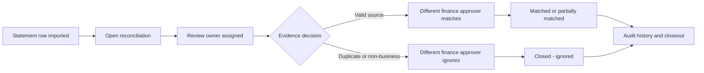

## 6. 구현 순서

### 1차 — 운영 사고 방지

1. 기본 진입을 global open queue로 변경.
2. 배치 상세 두 열의 데이터 순서 수정 및 회귀 테스트.
3. IGNORED/REVERSED 상태의 evidence hub 문구 수정.
4. 상세 returnTo 보존.
5. payment clearing candidate selection을 명시 선택으로 바꾸고 식별 정보 추가.

### 2차 — 처리 속도

1. 필터를 2행 + More filters로 축약.
2. 목록 열을 축약하고 sticky action 추가.
3. bulk action을 선택 후 sticky bar로 변경.
4. manual exception을 statement workspace에 통합.

### 3차 — 데이터/성능 구조

1. 거래 전용 candidate API 및 searchable fallback.
2. workbench read model 또는 summary/facet 캐시.
3. 페이지를 역할별 컴포넌트와 query model로 분리.
4. production telemetry로 쿼리/인덱스 최적화.

## 7. 완료 조건

- 루트 진입 즉시 전체 미해결과 48h+ 미배정이 보인다.
- Today 데이터가 0이어도 오래된 open queue가 0으로 오인되지 않는다.
- `Import result`에는 IMPORTED/SKIPPED, `Reconciliation`에는 UNMATCHED/MATCHED/IGNORED 등이 표시된다.
- IGNORED 거래 어느 곳에도 `Create explicit match`가 나타나지 않는다.
- 상세에서 Back을 누르면 원래 range/owner/age/source/query/page/rows로 돌아간다.
- 동일 금액 후보가 여러 건이면 아무 후보도 자동 선택되지 않는다.
- 30일 밖 또는 첫 50건 밖의 clearing evidence를 검색해 선택할 수 있다.
- 후보에 날짜·booking/customer·reference·차이·신뢰 근거가 보인다.
- Closed가 matched/ignored/reversed를 구분해 집계한다.
- 1440px에서 다음 행동이 가로 스크롤 없이 보이거나 sticky로 유지된다.
- 기존 API의 담당자/승인자 분리와 금액·중복·동시성 검증이 모두 유지된다.

## 8. 검증 결과

| 검증 | 결과 |
|---|---|
| Admin Web bank reconciliation 집중 테스트 | 7 files, 51 tests 통과 |
| API bank reconciliation/statement/transaction 집중 테스트 | 3 files, 64 tests 통과, 711 skipped |
| warm 화면 준비 측정 | queue 789–1,517ms / imports 470–558ms / detail 517–574ms |
| cold 개발 상세 진입 | 9,922ms 1회; Next dev compile이 포함되어 production 결론에서 제외 |
| 소스 수정 | 없음 |
| 보호 영역 수정 | 없음 |

현재 테스트는 API 안전 계약을 잘 보호하지만, **표 헤더-셀 매핑, terminal status 문구, 상세 returnTo, 50개 후보의 식별 가능성, 기본 큐 범위** 같은 운영 UX 회귀는 잡지 못한다.

## 9. 화면 증거

### 1. 기본 Today 화면 — 건강도: 위험

오래된 미해결 백로그가 존재하지만 네 카드가 모두 0으로 보인다.

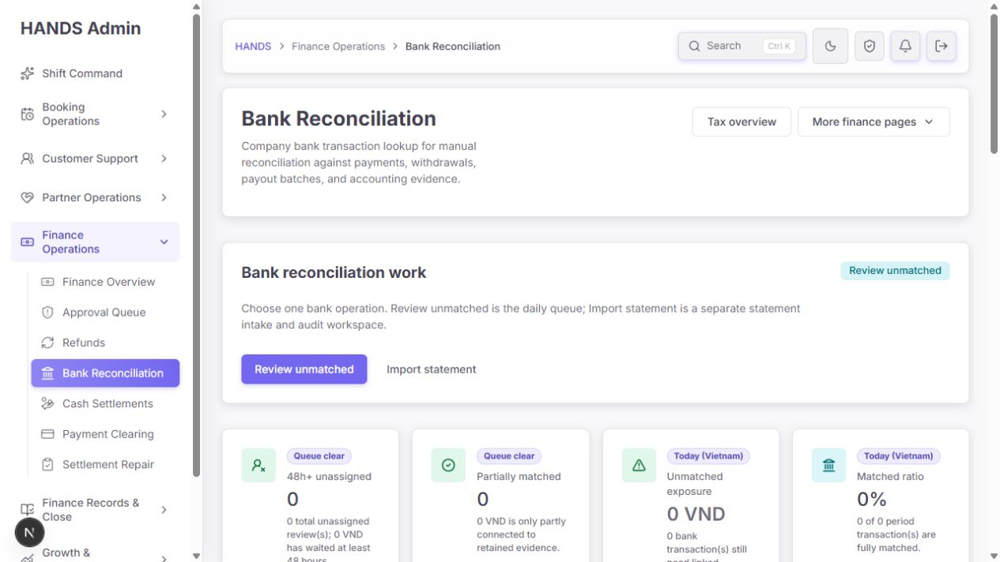

### 2. 전체 기간 명령 보드 — 건강도: 주의

실제 44건·13.4m VND·23건 overdue가 나타나며 기본 화면과 운영 의미가 크게 달라진다.

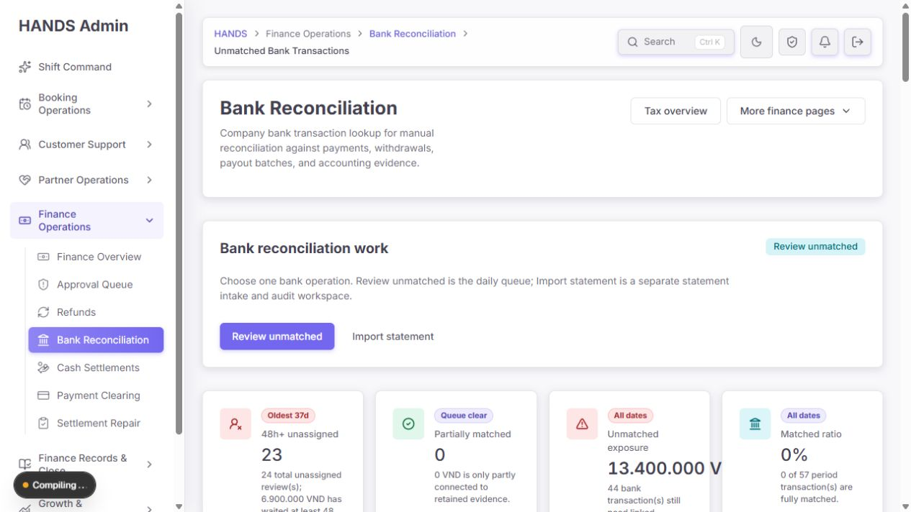

### 3. 필터 — 건강도: 개선 필요

필터 그룹과 기본 active chip 반복이 목록보다 많은 수직 공간을 사용한다.

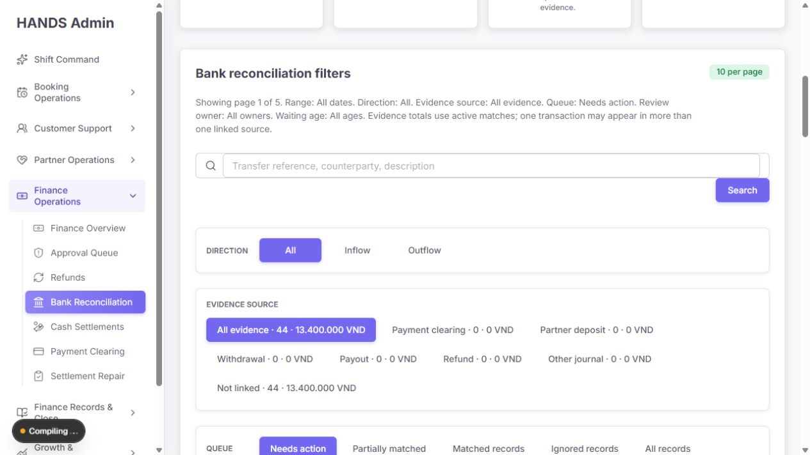

### 4. Needs action 표 — 건강도: 개선 필요

핵심 Evidence/Open 열이 오른쪽에 숨고 식별자가 여러 줄로 분해된다.

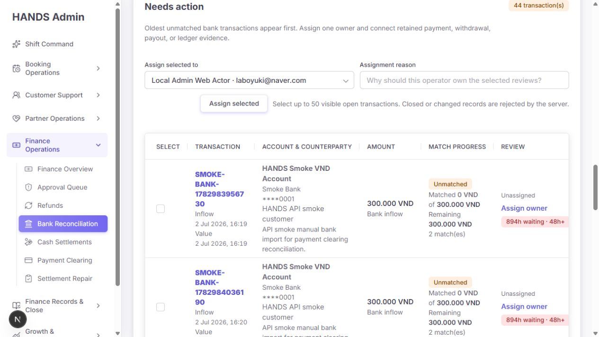

### 5. 담당자 배정 확인 — 건강도: 양호

행동 의미와 owner/reason이 분명하다. reason 입력 전 CTA 시각 상태는 더 명확히 비활성화할 수 있다.

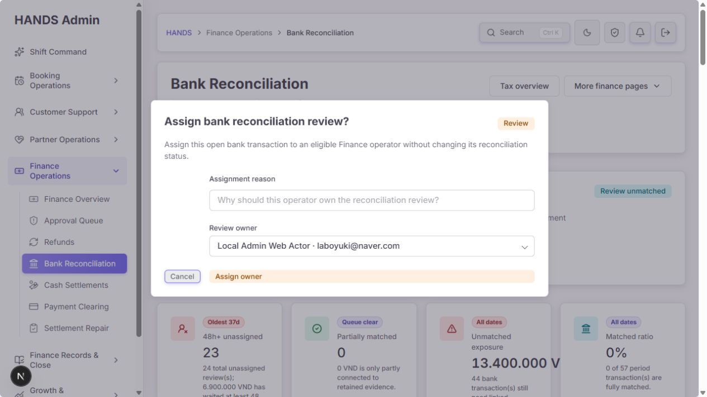

### 6. Evidence hub — 건강도: 주의

흐름 시각화는 유용하지만 상태별 다음 행동 계약이 분리되어 IGNORED에서 모순이 발생한다.

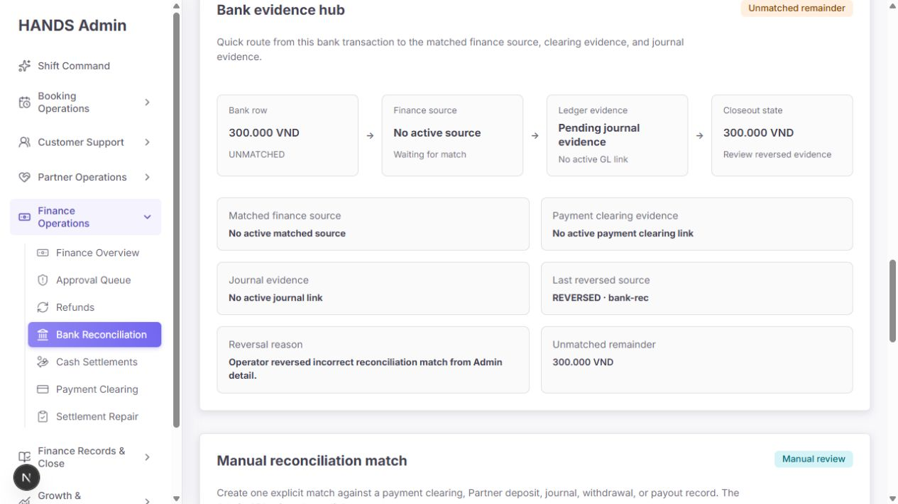

### 7. 매칭 이력 — 건강도: 개선 필요

긴 감사 이력이 한 테이블 행에 들어가 행 높이와 가로 스크롤이 커진다.

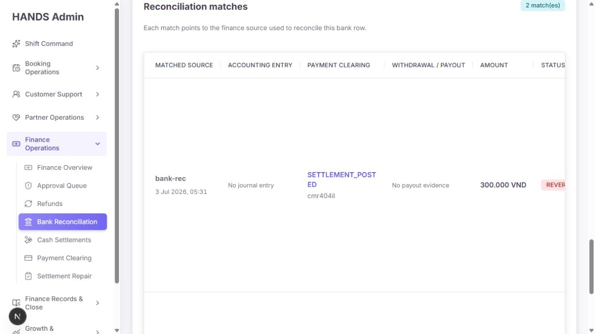

### 8. 결제 대사 후보 — 건강도: 위험

50개 후보 중 첫 항목이 선택되어 있으나 날짜·고객·참조번호가 보이지 않는다.

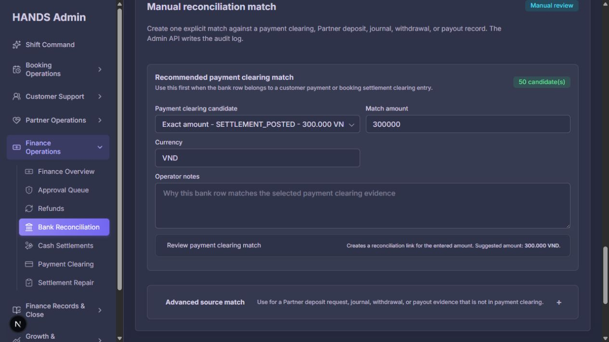

### 9. CSV 업로드 — 건강도: 양호

계정·방향·매핑·파일·템플릿·미리보기 순서가 이해 가능하다.

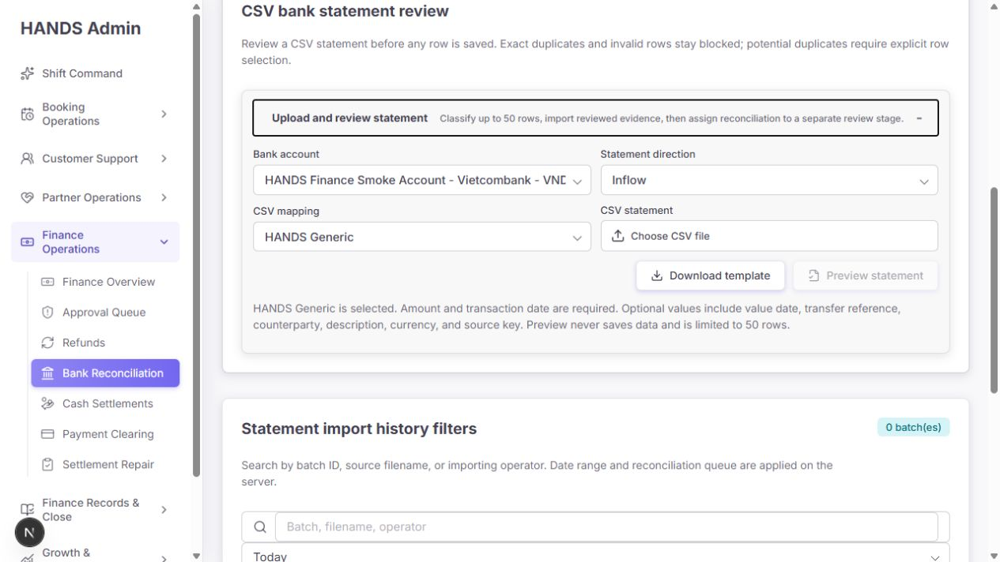

### 10. 수동 예외 확인 — 건강도: 주의

검토 disclosure는 좋지만 빈 폼에서도 위험 CTA가 활성 스타일이다.

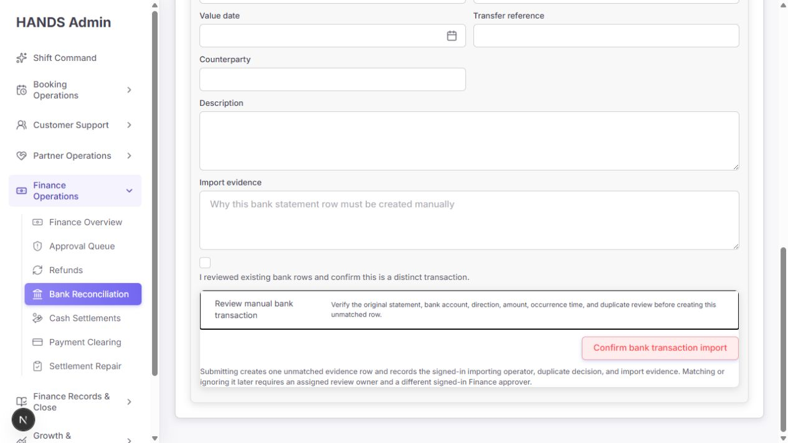

### 11. 무시된 기록 — 건강도: 개선 필요

읽기 전용 보존은 명확하지만 표의 오른쪽 증거·상세 행동이 숨고 큰 테스트 금액이 운영 합계를 왜곡한다.

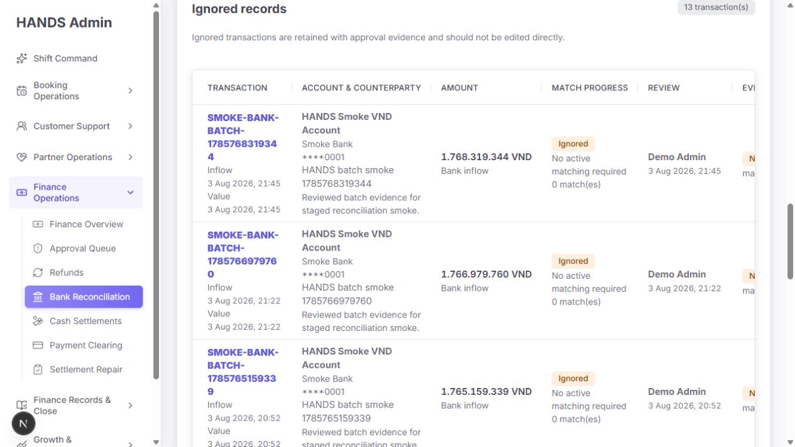

### 12. 가져오기 배치 개요 — 건강도: 주의

Ignored까지 Reconciled로 합산해 성공 의미가 모호하다.

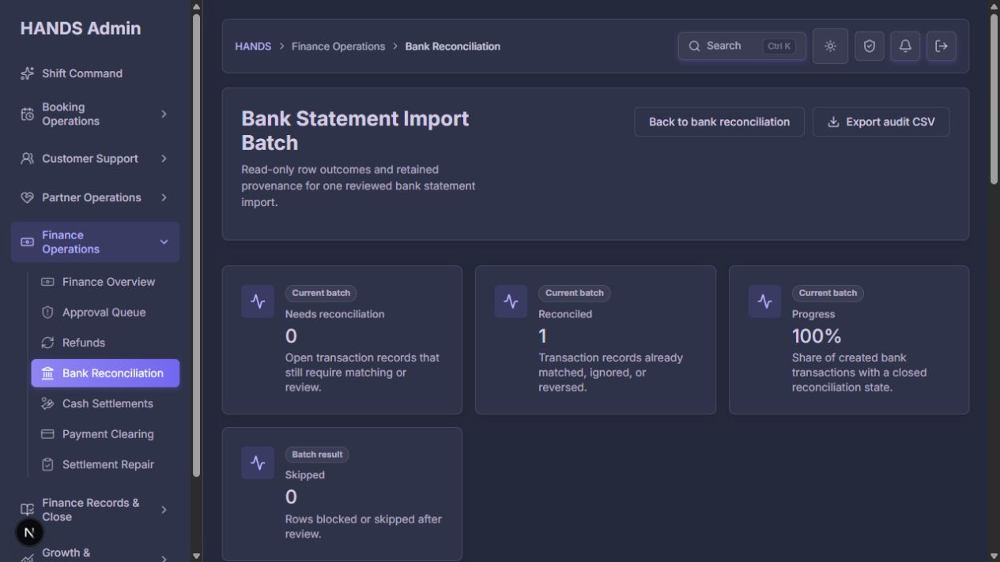

### 13. 가져오기 배치 행 — 건강도: 위험

Import result와 Reconciliation 셀 값이 실제로 뒤바뀌어 있다.

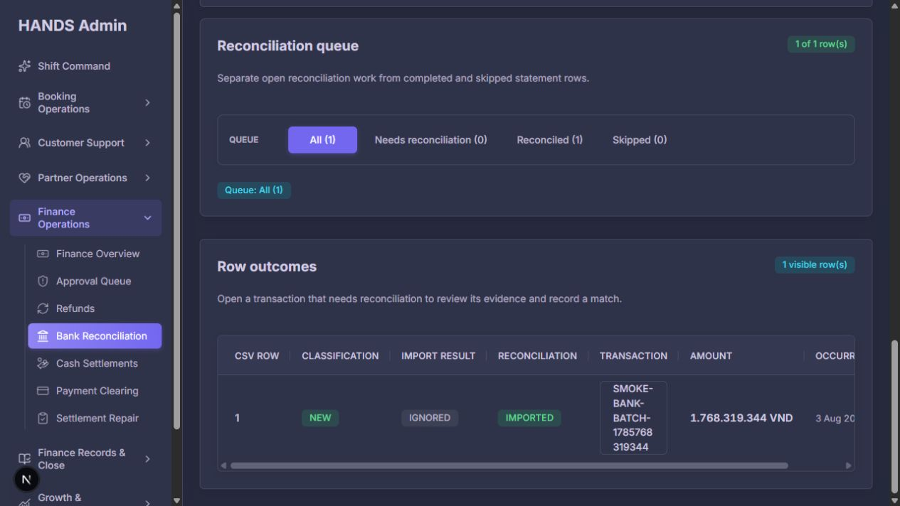

### 14. 다크 모드 — 건강도: 양호

테마 일관성은 좋으나 긴 보조 텍스트의 계층을 조금 더 높일 필요가 있다.

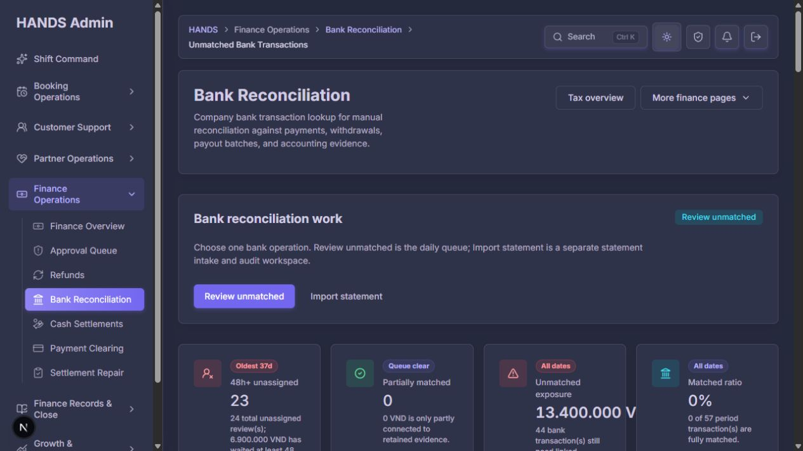

## 10. 남은 위험

- 로컬 데이터는 smoke/test 거래가 많아 실제 운영 분포와 다를 수 있다. 특히 ignored 합계 18.6b VND는 데이터 환경의 영향을 크게 받는다.
- production DB 실행계획과 실제 p95는 이번 화면 감사로 측정하지 않았다.
- CSV 실제 파일 업로드와 금융 변경 제출은 데이터를 바꾸므로 수행하지 않았다. 미리보기 이후 상태는 코드와 테스트로 검증했다.
- 스크린샷만으로 전체 접근성 준수를 주장하지 않는다. 키보드 순서, screen reader announcement, contrast 자동검사는 별도 단계가 필요하다.
