# Bank Reconciliation · Payment Clearing 개선 후 심층 재감사 보고서

- 감사일: 2026-08-09
- 대상 환경: `http://localhost:3101`
- 검수 해상도: **1440 × 900 이상만 검수**
- 제외 범위: 1024px 이하 화면, 모바일·태블릿 반응형 이슈는 본 보고서에 포함하지 않음
- 검수 방식: 이전 감사 보고서/구현 프롬프트 대조, 실제 로그인 화면 캡처, 필터·선택·상세·빈 상태·종결 상태 상호작용, 소스/API/테스트 검토

## 1. 최종 판정

**조건부 통과 — 전체 7.7/10**

이전 감사의 핵심 방향은 상당 부분 올바르게 구현됐다. 특히 아래 항목은 명확한 개선이다.

- 기본 진입이 `All dates + Needs action`으로 바뀌어 과거 미해결 건이 숨지 않는다.
- `Bank transactions / Unmatched payment evidence / Partial matches / Cleared & reversed history`가 하나의 Payment Matching 워크스페이스로 연결됐다.
- 은행 상세 후보가 서버 검색·페이지 이동·적격/부적격 사유를 제공한다.
- 결제 증빙과 은행 거래의 방향 검증, 부분 매칭, 잔액 초과 방지, 종결 상태 API 차단이 구현됐다.
- 상세에서 목록 필터·정렬·페이지로 돌아가는 `returnTo`가 실제로 보존된다.
- Payment Clearing 담당자 지정은 명시적 선택이며 알림 실패와 배정 성공을 분리한다.
- 수동 은행 행 생성과 CSV 가져오기가 일상 검토 큐에서 분리됐다.
- 1440px에서 주요 액션 열이 보이고 다크 모드도 기능적으로 정상이다.

그러나 운영 배포 전에 반드시 정리해야 할 P1 문제가 있다.

1. **`REVERSED` 종결 증빙 상세가 다시 은행 매칭을 유도한다.** 목록은 “No unresolved work”라고 설명하지만 상세는 `Find matching bank transaction`, `Remaining amount`, `Needs match`를 표시한다.
2. **동일 미해결 결제 큐의 금액이 37.8M VND와 36.8M VND로 다르게 보인다.** 담당자 워크로드 집계가 절댓값 기반 잔액이 아니라 부호가 있는 원금 합계를 사용한다.
3. **Partial/History/Imports/Manual 서브 상태에서 좌측 `Payment Matching` 활성 표시와 Finance 브레드크럼이 풀린다.** 같은 워크스페이스 안에서 운영자가 위치를 잃는다.
4. **Payment Clearing 종결 목록의 액션 문구가 `Review and match`다.** 종결 데이터에 실행 가능한 매칭 작업이 남아 있는 것처럼 보인다.
5. **은행 담당자 지정은 첫 번째 운영자를 자동 선택한다.** Payment Clearing의 명시적 선택 정책과 불일치하며 오배정 위험이 있다.
6. **결제 미해결 테이블은 1440px에서도 열이 지나치게 압축되어 단어 단위로 줄바꿈된다.** 정보는 보이지만 빠른 스캔이 어렵다.

백엔드가 `REVERSED` 결제 증빙의 실제 매칭을 거부하므로 현재 확인된 즉시 금전 변조 P0는 없다. 하지만 UI가 잘못된 다음 행동을 강하게 제시하므로 P1을 해결하기 전에는 완전 통과로 볼 수 없다.

## 2. 점수

| 영역 | Bank Reconciliation | Payment Clearing | 판정 |
|---|---:|---:|---|
| 운영 정보 구조 | 8.1 | 7.3 | 통합 방향은 좋으나 서브 상태 활성/브레드크럼 불안정 |
| 업무 우선순위 | 8.3 | 7.5 | 전역 미해결 지표는 좋으나 화면별 맥락 최적화 필요 |
| 상태·금액 정확성 | 8.1 | 6.3 | Payment Clearing 종결 상태와 워크로드 금액이 핵심 감점 |
| 실행 안전성 | 8.6 | 8.5 | API 방향·상태·잔액 차단은 강함 |
| 상세→처리 완결성 | 8.0 | 7.1 | 역방향 탐색은 생겼으나 후보 랭킹/종결 처리 문구 문제 |
| 1440px 가독성 | 7.3 | 6.9 | 필터 수직 깊이와 미해결 테이블 압축 문제 |
| 접근성 기본 구조 | 7.8 | 7.8 | H1·레이블·테이블은 양호, 문서 제목·Skip link 보완 필요 |
| 성능·확장성 | 7.7 | 7.1 | 로컬 warm은 빠르나 페이지당 읽기 호출이 많음 |
| **종합** | **8.0** | **7.3** | **전체 7.7 / 조건부 통과** |

## 3. 실제 운영 데이터 스냅샷

현재 화면에서 확인한 값이다. 테스트 데이터가 많아 화면 설계의 오류와 모순을 확인하기에 충분했다.

### Bank Reconciliation

- 보존 은행 거래: 57건
- Needs action: 44건
- Open exposure: 13,400,000 VND
- 미배정: 24건
- 미배정 중 48h+: 23건, 6,900,000 VND
- 부분 매칭: 0건
- Matched 0 / Ignored 13 / Reversed 0

### Payment Clearing

- 미해결: 108건
- 화면 상단 Open exposure: 37,800,000 VND
- 48h+ 미해결: 106건, 36,800,000 VND
- 미배정: 108건
- 부분 매칭: 0건
- Cleared 0 / Reversed 40
- 담당자 워크로드의 Open amount: **36,800,000 VND**

마지막 값은 같은 108건에 대한 상단 Open exposure 37,800,000 VND와 1,000,000 VND 차이가 난다. 이는 단순 표기 차이가 아니라 집계 수식 차이에서 발생한다.

## 4. 이전 감사 요구사항 재검수

| 이전 요구사항 | 현재 상태 | 판정 | 남은 조치 |
|---|---|---|---|
| 과거 미해결 건을 숨기지 않는 기본 범위 | Bank/Payment 모두 All dates 기본 | 완료 | 유지 |
| 하나의 Payment Matching 운영 워크스페이스 | 공통 4개 상단 탭 구현 | 완료에 가까움 | 서브 쿼리도 좌측 활성·브레드크럼을 유지 |
| 서버 후보 검색·페이지 이동 | 은행 상세 `candidateQ/page/take`, 25개 페이지 이동 | 완료 | 검색 결과 수와 페이지 총수를 더 명확히 표기 |
| OPEN + PARTIAL 후보 포함 | API와 후보 적격 검증 반영 | 완료 | 회귀 테스트 유지 |
| 통화·방향·상태·잔액 검증 | API에서 모두 차단 | 완료 | UI도 같은 상태 모델 사용 |
| Import result / Reconciliation 열 의미 수정 | 헤더와 셀 의미 분리 | 완료 | 실데이터 배치가 생기면 운영 재검증 |
| Ignore 상태에서 매칭 CTA 제거 | 목록/상세에서 차단 | 완료 | 유지 |
| 안전한 목록 복귀 | 검색·정렬·owner·age·take·page 보존 확인 | 완료 | 자동 테스트 강화 |
| 액션 열 가시화 | Bank `Next action`, Payment `Open` 열 표시 | 부분 완료 | Payment 1440px 줄바꿈 개선 |
| 필터 압축 | 일부 disclosure 도입 | 부분 완료 | 고빈도/저빈도 필터 재배치 필요 |
| 선택 시에만 일괄 배정 UI | Bank만 구현 | 부분 완료 | Payment에도 동일 패턴 적용 |
| 담당자 명시적 선택 | Payment 완료, Bank 미완료 | 부분 완료 | Bank에도 빈 기본 옵션 적용 |
| Payment 알림 실패와 배정 성공 분리 | 단건 try/catch, 일괄 allSettled | 완료 | Bank에도 동일 정책 확장 |
| 결제 상세에서 은행 후보로 이동 | 구현됨 | 완료에 가까움 | “best” 근거와 delta/reason 추가 |
| 수수료 정책 증빙 | 누락을 경고로 노출 | 개선됨 | 실제 Policy record 누락 데이터 정비 필요 |
| 문서 제목·접근성 기본 | 폼/테이블은 개선 | 부분 완료 | `<title>`, Skip link 추가 |
| 읽기 모델/성능 통합 | 병렬 호출만 유지 | 미완료 | 워크벤치 read model 또는 캐시 필요 |

## 5. 화면 흐름별 감사

### 5.1 Bank transactions — 상단 운영 구조

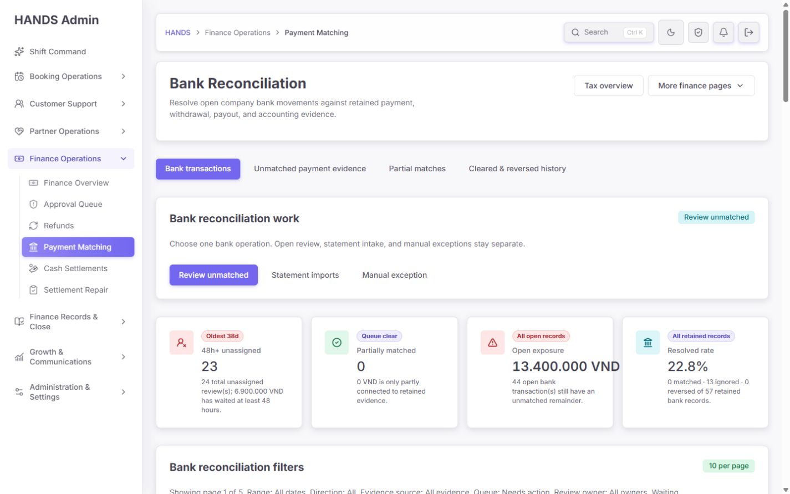

**상태: 양호, 구조 압축 필요**

좋아진 점:

- 과거 미해결 큐가 기본이며 44건/13.4M VND가 즉시 보인다.
- 48h+ 미배정, 부분 매칭, 오픈 노출, 해결률 카드가 모두 실제 큐로 연결되는 링크다.
- `Resolved rate`가 matched/ignored/reversed 구성까지 설명해 이전의 모호한 비율을 해소했다.
- `Statement imports`와 `Manual exception`이 위험한 생성 작업을 분리한다.

남은 문제:

- 상단 `Bank transactions` 탭과 하위 `Review unmatched` 탭은 운영자에게 거의 같은 의미다.
- `Payment matching workspace`와 `Bank reconciliation work` 두 단계 탭이 연속으로 나타나 첫 화면의 높이와 인지 비용을 늘린다.
- Bank 기본 목록의 실제 첫 업무 섹션 `Needs action` H2는 문서 상단에서 약 1,941px 아래에 있다. 900px 높이 화면에서 두 번 이상 스크롤해야 첫 행을 검토한다.

권장 구조:

- 공통 상단 탭은 유지한다. 이것이 대분류다.
- Bank 내부에서는 `Review unmatched` 탭을 제거하고 현재 페이지 자체를 Bank queue로 간주한다.
- `Import statement`, `Manual bank row`를 페이지 헤더의 보조 액션 또는 작은 `Bank intake` 메뉴로 이동한다.
- URL의 `workspace=imports|manual`은 유지한다. 공유·뒤로가기·권한·감사 추적에 유리하므로 물리적으로 한 거대 페이지에 합치지 않는다.

### 5.2 Bank filters와 More filters

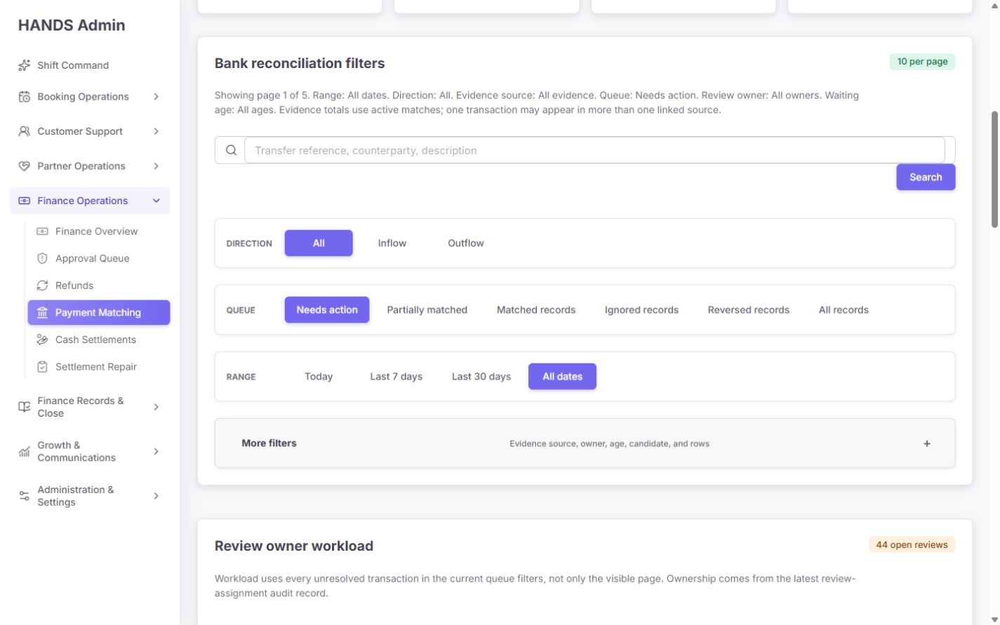

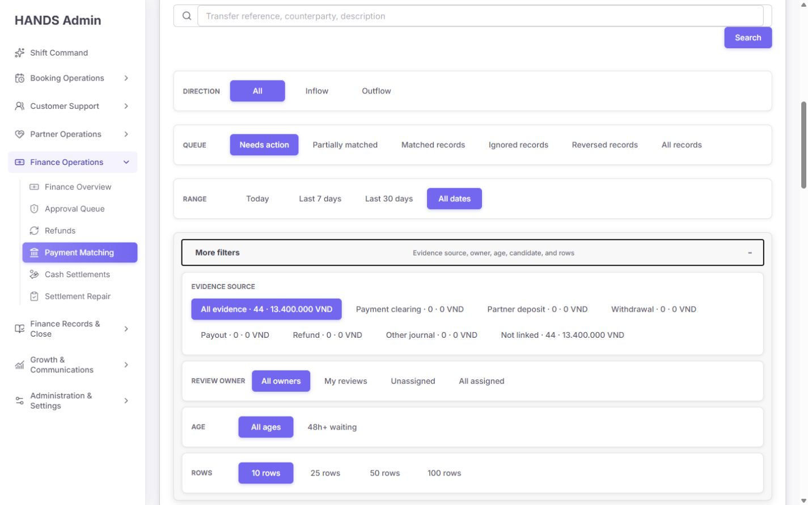

**상태: 기능은 충분, 1440px 운영 효율은 미완료**

현재 검색, Direction, Queue, Range가 각각 전폭 행을 차지한다. More filters를 열면 Evidence source, Review owner, Age, Rows가 다시 전폭 행으로 나타난다. 1440px 전용 관리자 화면이라는 전제에서는 지나치게 넓고 길다.

운영 빈도 기준 재배치:

- 항상 표시: 검색, Queue, Review owner, Age, Direction
- More filters: Evidence source, Range, Rows, Withdrawal candidate
- Range는 기본이 All dates이며 일상 처리에서는 Owner/Age보다 빈도가 낮다.
- 활성 필터 칩은 유지하되 기본값 칩은 숨기고 실제 변경된 값만 표시한다.
- 한 행당 2~4개의 compact control을 배치한다. 현재처럼 한 필터 그룹이 전체 가로폭을 독점하지 않게 한다.
- `More filters` 요약은 현재처럼 “Evidence source, owner, age, candidate, and rows”를 유지하되 활성 개수를 `More filters · 2 active`처럼 표시한다.

### 5.3 Bank work table와 일괄 선택

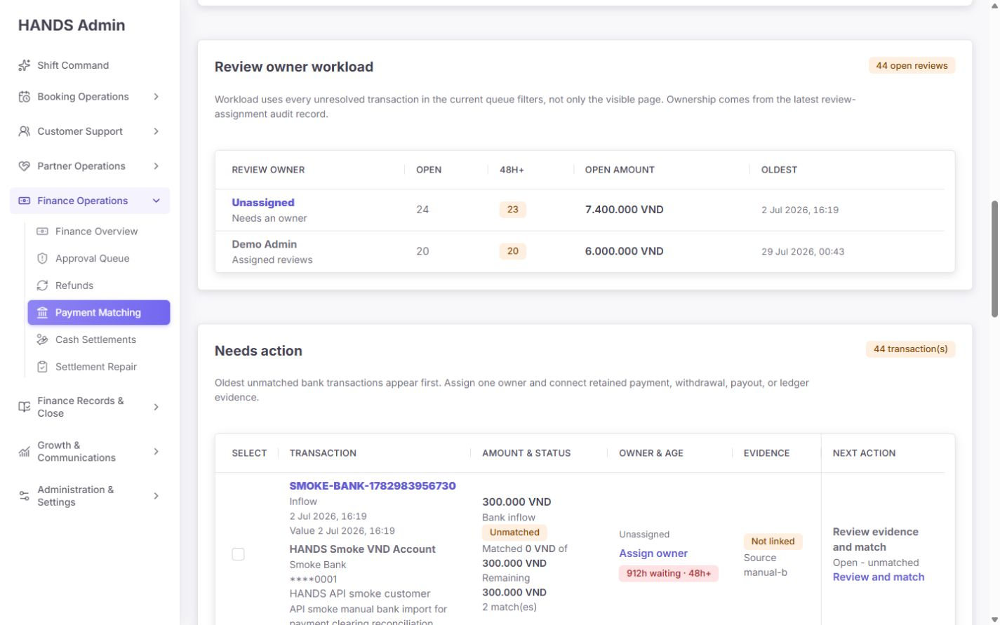

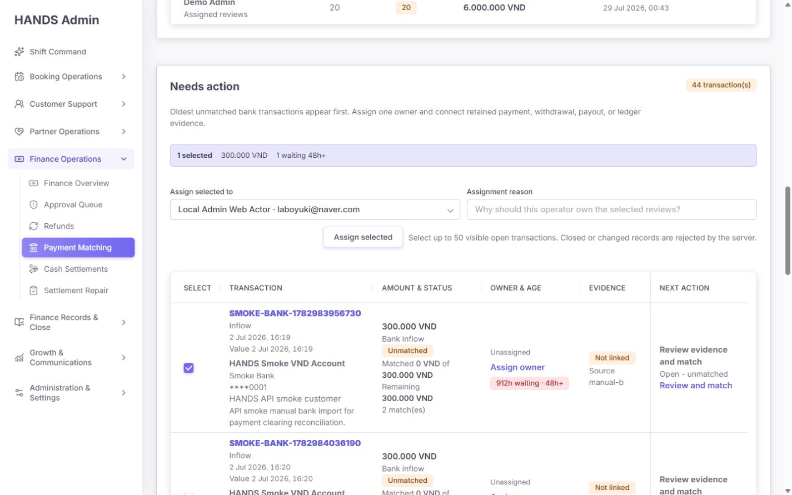

**상태: 액션 발견성 개선, 일괄 배정 안전성 보완 필요**

좋아진 점:

- `Next action`이 항상 보인다.
- 선택 전에는 bulk 입력이 숨고, 선택 후 `1 selected / 300,000 VND / 1 waiting 48h+`가 나타난다.
- 체크박스 레이블은 거래별로 고유하다.
- Owner workload가 페이지 10건이 아닌 전체 큐 기준임을 설명한다.

문제:

- `Assign selected to`가 현재 로그인 운영자로 자동 선택된다. 사용자가 담당자를 선택하지 않아도 이유만 입력하면 제출할 수 있다.
- `Select all visible`이 없어 25/50행 보기에서는 반복 클릭이 필요하다.
- `912h waiting · 48h+` 같은 원시 시간은 `38d` 카드 표기와 불일치한다.
- `2 match(es)`인데 Matched 0 VND인 행이 있다. 실제로는 reversed match 2개이므로 `0 active · 2 reversed`가 정확하다.
- `Source manual-b` 같은 축약 원시 키는 운영 판단에 도움이 되지 않는다.

수정:

- Bank도 Payment와 동일하게 첫 옵션을 `Select an eligible Finance operator`로 둔다.
- `Select all visible / Clear visible selection`을 추가하고 최대 50건 제한을 같은 위치에서 설명한다.
- 나이 표기를 공통 formatter로 통일한다: `38d 0h · Escalate` 또는 `38d · Escalate`.
- 매칭 수는 `activeMatchCount`와 `reversedMatchCount`를 구분해 API에서 제공한다.
- Source는 `Manual entry`, `CSV import`, `Payment clearing` 같은 운영 라벨을 우선 표시하고 원시 키는 상세에서만 보여준다.

### 5.4 Bank detail와 후보 검색

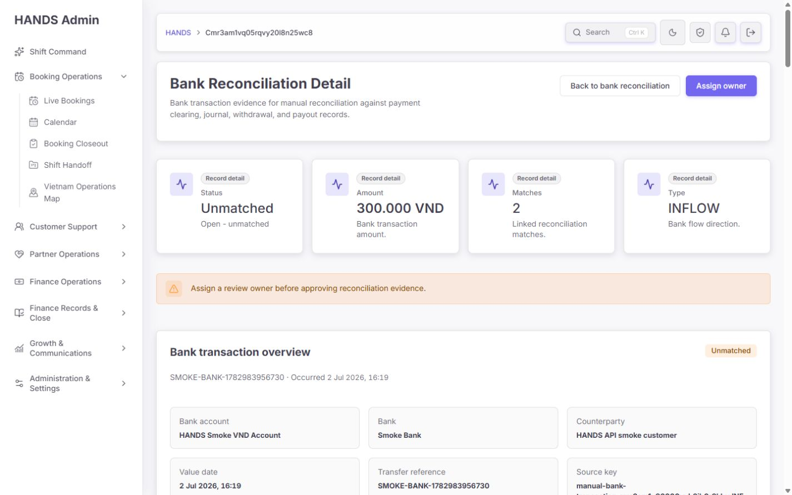

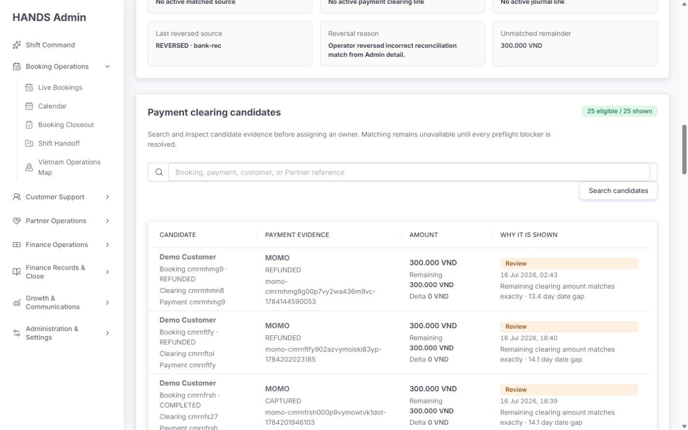

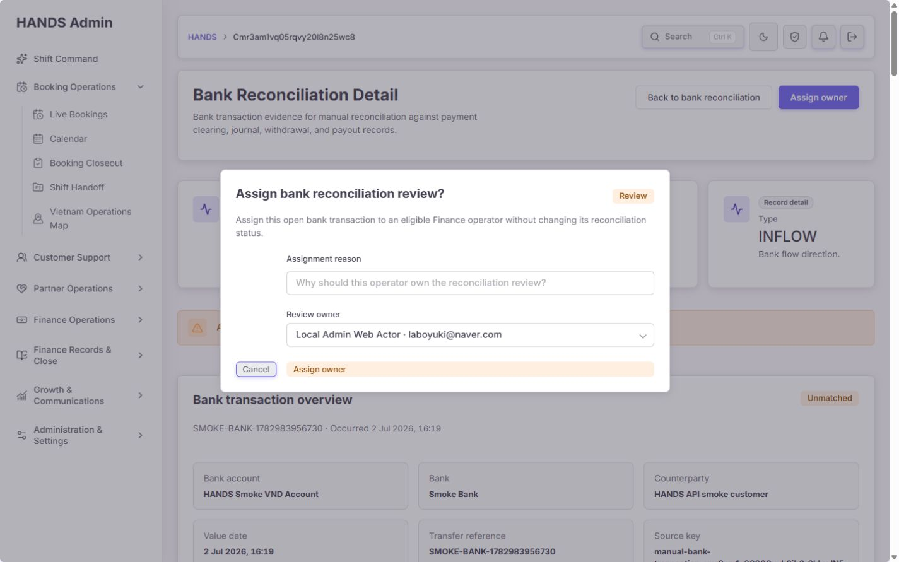

**상태: 이전보다 크게 개선, 담당자·후보 표기 정교화 필요**

좋아진 점:

- 상단에 `Assign owner`가 있고, 소유자 없이는 매칭/ignore를 차단한다.
- 후보는 25개 단위이며 서버 검색, 다음 페이지, clear search가 존재한다.
- 검색 결과는 `eligible / shown`, 남은 금액, delta, 적격 사유, 부적격 사유를 표시한다.
- `REVERSED` 결제 증빙을 검색하면 `Status REVERSED cannot receive an active match`와 방향 불일치가 함께 보인다.
- 후보가 자동 선택되지 않는다.
- 목록 복귀 필터가 보존된다.

문제:

- 담당자 팝업은 첫 운영자를 자동 선택한다.
- `Assign owner` 제출 버튼은 시각적으로 비활성처럼 옅지만 실제 `disabled=false`다. native `required`가 제출을 막더라도 시각 상태와 실제 상태가 다르다.
- 후보 설명의 문법이 `expects a outflow`로 표시된다.
- 상세 상단 Matches 2는 active 0/reversed 2를 구분하지 않아 Status Unmatched와 처음에는 모순처럼 보인다.

수정:

- 빈 담당자 기본 옵션 + 이유 12자 + 실제 disabled 상태를 연동한다.
- `Matches` 카드 값을 `0 active / 2 reversed`로 바꾼다.
- `expects an outflow` 또는 `Expected direction: OUTFLOW`로 문구를 단순화한다.

### 5.5 Statement imports와 Manual exception

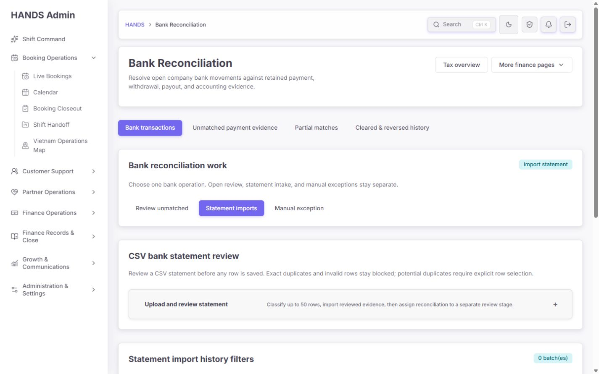

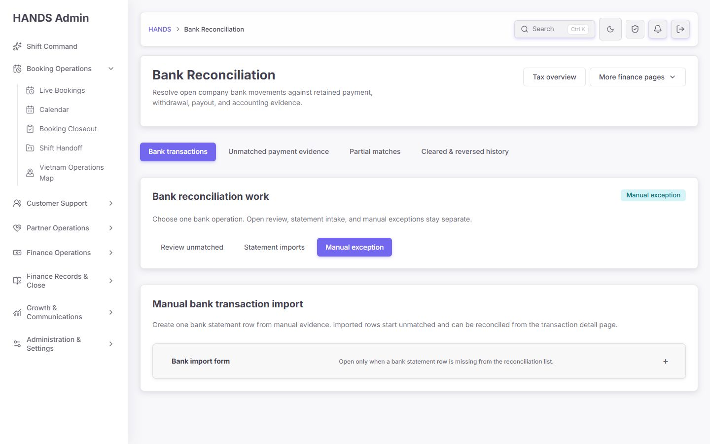

**상태: 운영 분리 방향 적합**

- CSV review가 기본 접힘 상태이고 “저장 전 검토, 정확한 중복 차단, 잠재 중복 명시 선택”을 설명한다.
- 수동 생성은 `Open only when a bank statement row is missing`으로 목적이 분명하며 기본 접힘이다.
- Import history의 `Import result`와 `Reconciliation` 열이 분리됐다.

유지해야 할 이유:

- 이 둘을 일반 매칭 큐에 펼쳐 놓으면 생성 작업과 검토 작업이 섞여 위험하다.
- 별도 URL은 새로고침/공유/권한/브라우저 뒤로가기에서 유리하다.

보완:

- 같은 route의 `workspace=imports|manual` 진입 시 좌측 Payment Matching 활성과 전체 브레드크럼을 유지한다.
- Imports의 `range=all`과 내부 `importRange=Today`가 동시에 URL/화면에 존재할 수 있으므로 외부 range를 제거하거나 내부 필터 이름을 `Import date`로 더 명확히 분리한다.
- 현재 실데이터 import batch가 0건이므로 열 매핑의 화면 실증은 불가했다. 소스와 60개 web 테스트에서 구조는 확인했다.

### 5.6 Unmatched payment evidence

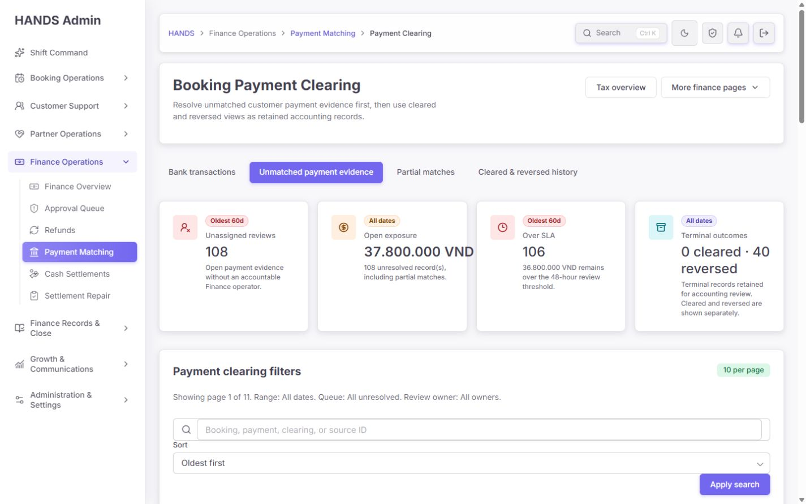

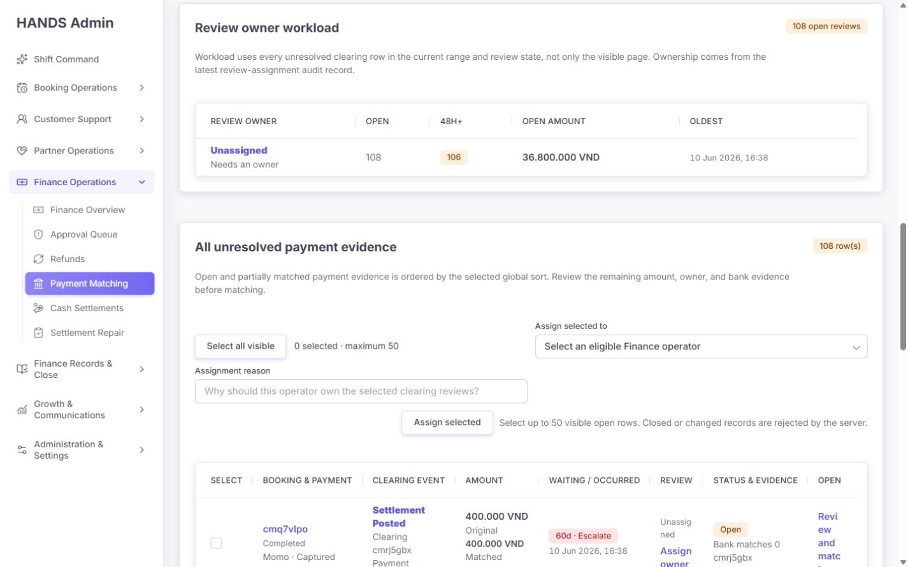

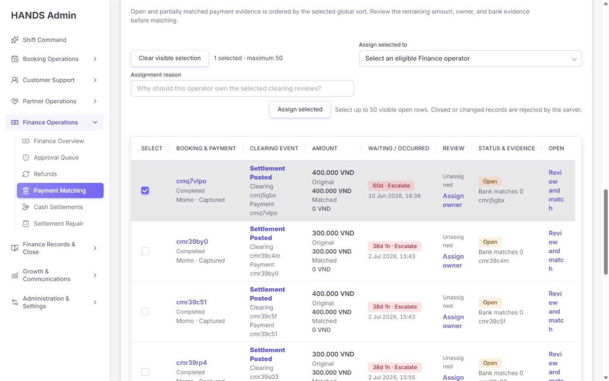

**상태: 큐 모델은 개선, 수직 깊이·열 폭·금액 집계 문제**

좋아진 점:

- 상단 카드가 전역 All dates 기준임을 명시한다.
- 108건 미배정, 37.8M 오픈 노출, 106건 SLA 초과를 바로 큐로 연결한다.
- Search, sort, queue, owner, age, range, rows가 URL에 반영된다.
- `Select all visible`과 최대 50건 제한이 있다.
- 담당자는 명시적으로 선택해야 한다.
- checkbox accessible name이 clearing ID, booking ID, amount를 포함한다.
- 검색·정렬·owner·age·take·page를 포함한 상세 복귀 링크가 보존된다.

문제:

- 필터 영역만 약 881px 높이이며 첫 업무 테이블 H2는 약 1,878px 아래에 있다.
- bulk UI가 `0 selected`일 때도 담당자·이유·버튼까지 항상 보인다. 선택 전에는 불필요한 입력이다.
- 1440px에서 8개 열을 1,050px 안에 넣어 `Unassigned`, `Review and match`가 글자 단위로 여러 줄 갈라진다.
- 같은 108건의 Open amount가 상단 37.8M, owner workload 36.8M으로 다르다.

수정:

- Queue는 항상 보이고 Owner/Age를 한 줄로 묶는다. Range/Rows를 More filters로 이동한다.
- 선택 전에는 `Select all visible · 0 selected`만 보이고 선택 후 sticky bulk bar를 표시한다.
- 테이블을 6개 운영 열로 줄인다.
  - Select
  - Booking / Payment
  - Event / Evidence
  - Remaining / Original
  - Owner / SLA
  - Next action
- `Clearing ID`, `Payment ID`, bank match count는 한 줄 secondary text 또는 상세로 이동한다.
- Owner workload는 signed amount가 아니라 active match 차감 후 `remainingAmount`의 절댓값 합계를 사용한다.

### 5.7 Partial matches

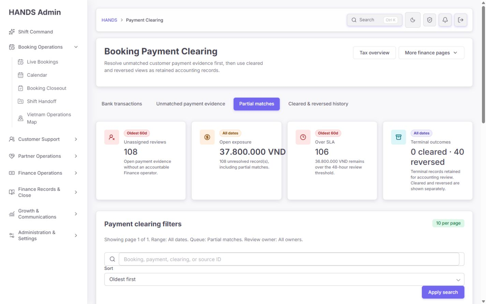

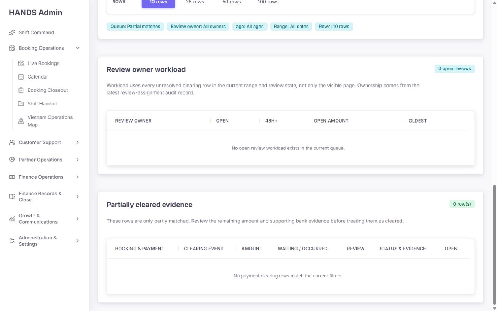

**상태: 큐는 존재하나 빈 상태 경험이 비효율적**

현재 부분 매칭은 0건이다. 그런데 운영자는 먼저 전역 4개 카드, 전체 필터, 0건 owner workload 표를 지나 약 1,921px 아래의 또 다른 0건 표에 도달한다.

문제:

- `No open review workload`와 `No payment clearing rows`가 두 개의 큰 빈 테이블로 중복된다.
- 상단 탭에 0건 배지가 없어 들어오기 전에는 빈 큐인지 알 수 없다.
- 빈 상태가 현재 화면의 주요 결과인데 첫 화면에 보이지 않는다.

수정:

- 탭에 `Partial matches 0` 배지를 표시한다.
- queue count가 0이면 owner workload 패널을 숨기거나 한 줄 `No assigned work`로 축약한다.
- 필터 바로 아래에 `No partial matches. Open exposure remains in Unmatched payment evidence.`와 해당 큐 링크를 표시한다.
- 빈 테이블 header shell을 렌더링하지 말고 compact empty state를 사용한다.

### 5.8 Cleared & reversed history

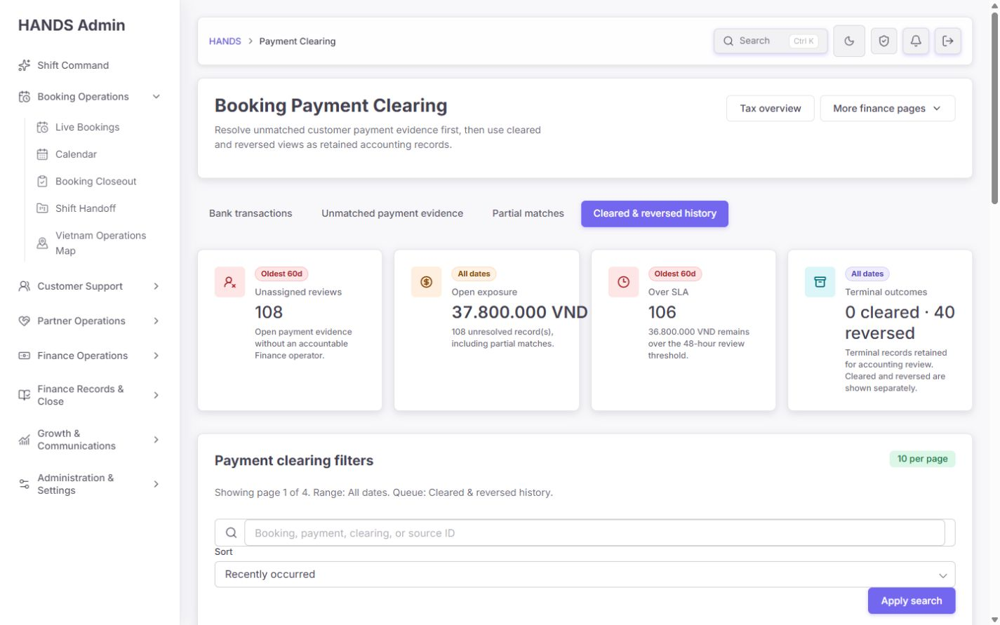

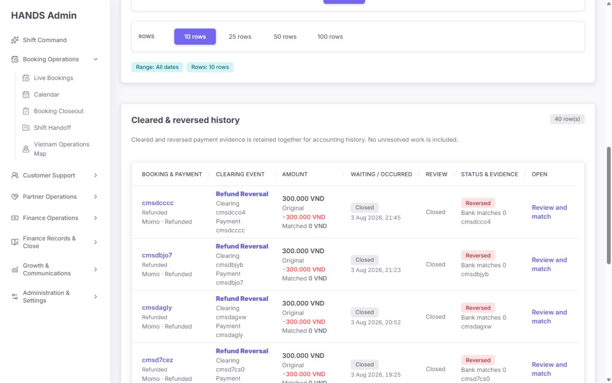

**상태: 분류는 합리적, 문구와 액션이 종결 상태와 충돌**

좋아진 점:

- Cleared와 Reversed를 하나의 History 탭에 묶고 내부 Queue 필터로 각각 분리한다.
- 이 구조는 별도 페이지 두 개보다 효율적이다.
- 소유자/SLA 필터와 bulk UI가 종결 큐에서는 제거된다.

문제:

- `Terminal outcomes` 카드는 0 cleared · 40 reversed라고 쓰지만 링크는 `review=cleared`로 이동한다. 현재 데이터에서는 클릭 즉시 빈 Cleared 큐가 된다.
- 종결 행의 액션이 `Review and match`다. `View evidence` 또는 `Open record`가 맞다.
- Refund Reversal 행은 Amount 300,000 VND와 Original -300,000 VND를 동시에 보여 주며 첫 금액의 의미가 없다.
- 종결 설명은 “No unresolved work”인데 액션 언어는 미해결 작업처럼 보인다.

수정:

- Terminal outcomes 카드 링크를 `review=terminal&sort=recent`로 변경한다. 카드 안에서 `Cleared 0`과 `Reversed 40`을 별도 보조 링크로 제공해도 된다.
- 종결 상태 행은 `View evidence`로 통일한다.
- Amount 열은 `Ledger effect -300,000 VND`와 `Absolute amount 300,000 VND` 또는 `Original -300,000 / Matched 0`처럼 의미를 명시한다.
- History 화면에서는 오픈 큐 카드 3개를 한 줄 compact alert로 줄이고 History 관련 통계가 우선 오게 한다.

### 5.9 REVERSED Payment Clearing detail — 가장 중요한 상태 모순

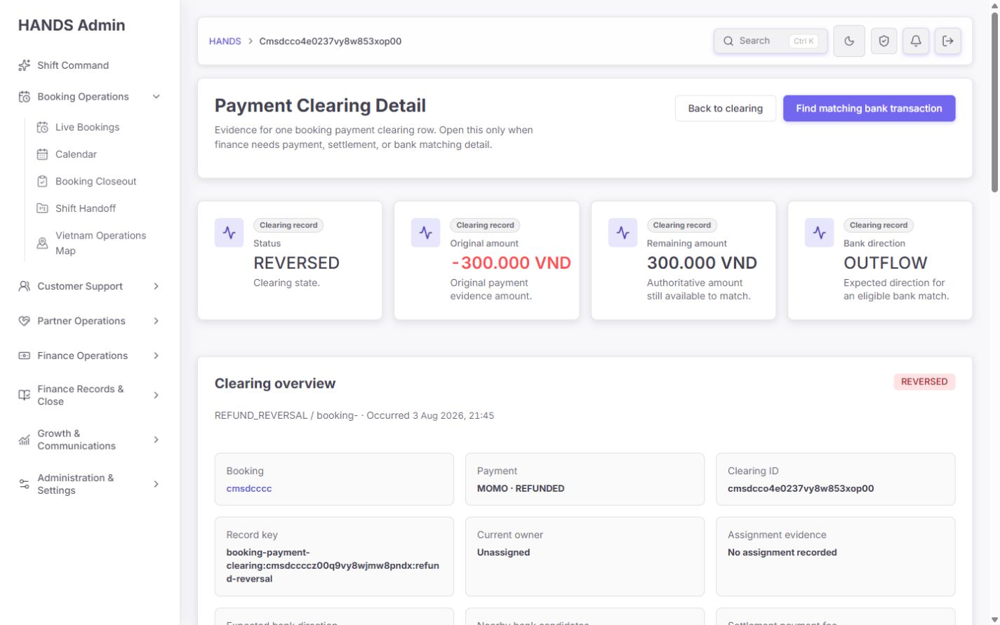

**상태: P1, 즉시 수정 필요**

화면은 동시에 다음을 말한다.

- Status: REVERSED
- Original amount: -300,000 VND
- Remaining amount: 300,000 VND, “still available to match”
- 상단 CTA: `Find matching bank transaction`
- Evidence hub: `Needs match`
- Cleared at: `Waiting`

그러나 목록은 이 레코드를 `Cleared & reversed history`에 넣고 “No unresolved work is included”라고 설명한다. API도 후보 조회와 실제 match 생성에서 OPEN/PARTIALLY_CLEARED만 허용하므로 REVERSED는 매칭할 수 없다.

원인:

- 상세 UI가 `remainingAmount > 0`만 보고 CTA·상태·문구를 결정한다.
- `REVERSED` 여부를 `isMatchable`에 포함하지 않는다.

수정 모델:

```ts
const isMatchable =
  ['OPEN', 'PARTIALLY_CLEARED'].includes(entry.status) && remainingAmount > 0;
const isTerminal = ['CLEARED', 'REVERSED'].includes(entry.status);
```

- 모든 매칭 CTA, 후보 섹션, `Needs match`, `Open Bank transactions`는 `isMatchable`로만 표시한다.
- REVERSED의 Remaining amount 카드는 `Unmatched amount`가 아니라 `Reversed evidence amount` 또는 `No active matching`으로 바꾼다.
- `Cleared at`은 상태별 `Closed at`으로 교체한다. REVERSED에는 reversal/occurred/audit timestamp를 사용한다.
- 종결 상세의 상단 CTA는 `View reversal audit` 또는 `Back to history`만 둔다.
- 회귀 테스트는 단순 source string 검사가 아니라 `REVERSED` fixture를 렌더링해 매칭 CTA가 없음을 검증한다.

### 5.10 OPEN Payment Clearing detail와 역방향 후보

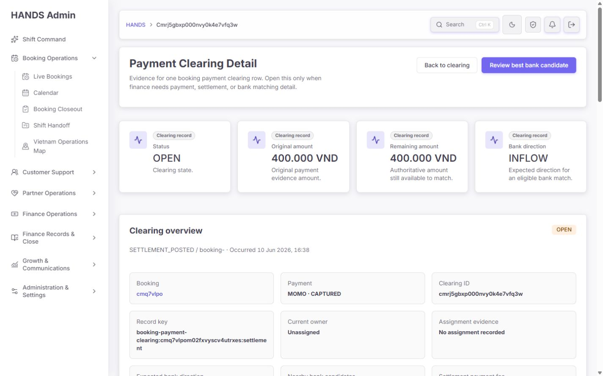

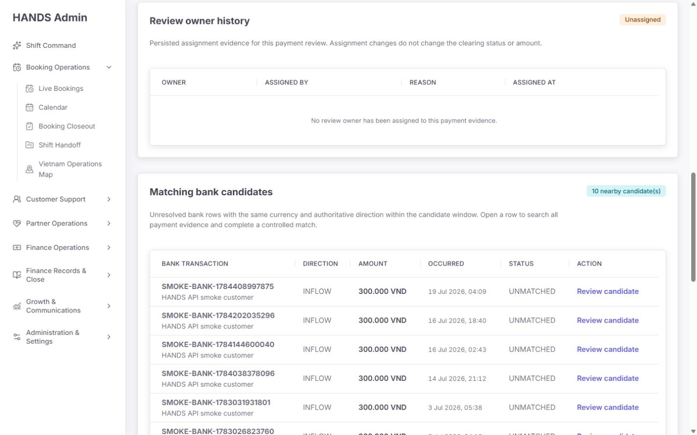

**상태: 연결은 완성, “best” 근거 부족**

좋아진 점:

- Payment record, settlement record, fee evidence, owner, expected direction, bank candidates가 연결됐다.
- 후보 링크는 은행 상세로 이동하며 해당 clearing ID를 후보 검색어로 전달한다.
- 은행 상세에서 최종 적격/부적격 검증을 다시 한다.

문제:

- 400,000 VND 결제 증빙에 표시된 10개 후보가 모두 300,000 VND인데 상단은 `Review best bank candidate`라고 단정한다.
- API의 이 역방향 후보는 `occurredAt desc`일 뿐 금액 delta, 날짜 gap, 참조 유사도를 기준으로 랭킹하지 않는다.
- 후보 표에 remaining, delta, date gap, why shown이 없어 Bank detail 후보 표보다 판단 정보가 부족하다.
- `SETTLEMENT_POSTED / booking-` 문구는 `shortId(sourceKey)`가 의미 없는 `booking-`을 만들기 때문에 운영 식별자로 부적합하다.

수정:

- 점수 모델이 없으면 `Review newest eligible candidate`로 정확히 이름을 바꾸거나 상단 후보 CTA를 제거한다.
- 권장 랭킹: exact amount → remaining delta → date gap → transfer/provider reference similarity.
- 후보 API에 `remainingAmount`, `amountDelta`, `dateGapHours`, `eligibilityReasons`를 제공한다.
- 표에 `300,000 remaining · 100,000 short · 21d gap`을 표시한다.
- `booking-` 대신 booking short ID 또는 human booking reference를 표시한다.
- Payment detail에도 `Assign owner`를 제공해 deep link 진입 시 목록으로 돌아가지 않게 한다.

## 6. 카테고리·서브 메뉴 구조 판정

### 유지할 구조

```text
Finance Operations
└─ Payment Matching
   ├─ Bank transactions
   ├─ Unmatched payment evidence
   ├─ Partial matches
   └─ Cleared & reversed history
```

이 4분류는 운영 의미가 다르므로 하나의 긴 페이지로 합치지 않는 것이 좋다.

- Bank transactions: 회사 계좌에서 관측된 원천 증빙
- Unmatched payment evidence: 고객 결제/정산에서 남은 상대 증빙
- Partial matches: 잔액이 남은 예외 큐
- History: 종결 증빙 조회

권장 구현은 **하나의 공통 워크스페이스 셸 + 별도 논리 route**다. 현재 방향이 대체로 맞다.

### 수정할 구조

- Bank 내부 `Review unmatched`는 상위 `Bank transactions`와 중복이므로 탭에서 제거한다.
- `Statement imports`와 `Manual exception`은 Bank transactions의 보조 작업으로 유지한다.
- 탭마다 전체 건수 배지를 표시한다: `Bank 44`, `Unmatched 108`, `Partial 0`, `History 40`.
- query 값이 달라도 좌측 Payment Matching 활성 상태와 브레드크럼 계층은 유지한다.

## 7. 좌측 메뉴와 브레드크럼 버그

실제 관찰:

| URL 상태 | 브레드크럼 |
|---|---|
| Bank operations | HANDS › Finance Operations › Payment Matching |
| Bank imports/manual | HANDS › Bank Reconciliation |
| Payment unresolved | HANDS › Finance Operations › Payment Matching › Payment Clearing |
| Payment partial/terminal | HANDS › Payment Clearing |

Partial/History와 Imports/Manual에서는 좌측 Finance Operations가 접히고 `Payment Matching` 활성 강조도 사라진다.

원인은 [`admin-nav-match.ts`](../../apps/admin_web/lib/admin-nav-match.ts)의 query가 있는 href 비교가 전체 query 문자열의 정확한 일치를 요구하기 때문이다. `range`, `review`, `sort`, `workspace`가 canonical 링크와 조금만 달라도 active destination을 찾지 못한다.

수정:

- Partner queue에서 사용한 `primaryPartnerReview` 방식처럼 `primaryPaymentMatchingWorkspace(pathname, search)`를 만든다.
- 다음을 같은 nav item으로 매칭한다.
  - `/finance-tax/bank-reconciliation`의 모든 `workspace`, filter, page 상태
  - `/finance-tax/payment-clearing`의 unresolved/open/partial/cleared/reversed/terminal 상태
  - 두 상세 route와 import batch 상세
- 브레드크럼 page label은 query 상태에 따라 `Bank Statement Imports`, `Manual Bank Entry`, `Partial Matches`, `Payment Matching History`로 바꾼다.
- `admin-nav-match.spec.ts`에 위 모든 대표 URL을 추가한다.

## 8. 금액 집계 불일치

Payment Clearing 상단 요약은 active match를 차감한 `ABS(clearing.amount)` 기반 remaining을 사용한다. 반면 owner workload CTE는 [`admin.service.ts`](../../apps/api/src/admin/admin.service.ts)에서 `SUM(workload."amount")`를 사용한다.

결과:

- Open exposure: 37,800,000 VND
- 같은 108건 owner workload: 36,800,000 VND

수정:

- owner workload CTE에도 active matches 집계를 조인한다.
- `remainingAmount = GREATEST(ABS(amount) - matchedAmount, 0)`를 단일 공통 SQL fragment/read model로 만든다.
- openAmount와 over48hAmount 모두 remainingAmount를 합산한다.
- 다음 불변식을 API 테스트로 고정한다.

```text
sum(owner workload openAmount under same filters)
=== queue summary openAmount + partiallyClearedAmount
```

- inflow/outflow의 부호가 필요한 회계 표에서는 `net effect`를 별도 필드로 제공하고, 운영 노출액과 섞지 않는다.

## 9. 알림 실패와 배정 성공 처리

Payment Clearing는 개선됐다.

- 단건: 배정 audit를 저장한 뒤 알림 실패를 catch하고 warning 결과를 반환한다.
- 일괄: `Promise.allSettled`를 사용하고 실패 건을 audit로 남긴다.
- UI: `Assignment saved, but notification delivery needs retry`를 별도로 표시한다.

Bank Reconciliation은 아직 동일 수준이 아니다.

- 단건은 assignment audit 저장 뒤 `createInApp`을 직접 await한다.
- 일괄은 DB transaction 이후 `Promise.all`로 알림을 보낸다.
- 알림 하나가 실패하면 UI는 전체 배정 실패처럼 처리할 수 있다.

수정:

- Bank 단건/일괄도 Payment Clearing와 같은 결과 타입을 사용한다.
- `assignedCount`, `unchangedCount`, `notification.deliveredCount`, `failedCount`, `warning`을 반환한다.
- UI는 “배정 저장 실패”와 “알림만 실패”를 다른 notice로 표시한다.
- bank notification failure 회귀 테스트를 추가한다.

## 10. 성능 검수

### 실제 warm 로컬 측정

운영 테이블 H2가 준비될 때까지 측정했다.

| 화면 | 준비 시간 |
|---|---:|
| Bank transactions | 177ms |
| Unmatched payment evidence | 477ms |
| Partial matches | 140ms |
| Cleared & reversed history | 148ms |

이 수치는 로컬 warm 데이터와 1440px 브라우저에서의 상대 비교이며 production SLA 증명은 아니다. 현재 체감은 과거보다 양호하지만 Unmatched가 다른 Payment Clearing 상태보다 약 3배 느리다.

### 코드 구조상 남은 확장 위험

Bank operations는 한 렌더에서 최대 다음 읽기를 병렬 수행한다.

- current queue summary
- all-date overview summary
- evidence source summary
- owner workload summary
- rows
- eligible admin directory

Payment unresolved는 다음 5개를 읽는다.

- queue summary
- all-date overview summary
- owner workload
- rows
- eligible admin directory

권장:

- 1차: admin directory를 선택이 시작되거나 owner dialog가 열릴 때만 로드한다.
- 2차: summary + source + owner + page rows를 하나의 workbench read model로 묶는다.
- 3차: all-date overview는 15~30초 서버 캐시 또는 태그 기반 재검증을 사용한다.
- 4차: 실제 운영 데이터 규모에서 p95를 측정하고 query plan/인덱스를 검증한다.
- 목표: warm local ≤500ms 유지, production p95는 팀 기준을 명시하고 회귀 예산에 포함한다.

## 11. 접근성·키보드 기본 검수

확인된 양호 항목:

- 1440px에서 body 전체 수평 overflow 없음
- 화면별 H1 존재
- 폼 컨트롤의 이름 없는 요소 0건
- 중복 DOM id 0건
- 데이터 표의 aria label이 서로 구분됨
- 체크박스 이름이 행별로 고유함
- 다크 모드에서 텍스트/상태/버튼이 기능적으로 식별됨

남은 항목:

- `document.title`이 모든 대상 화면에서 빈 문자열이다. 브라우저 탭이 URL 자체로 표시된다.
- Skip-to-content 링크가 없다.
- 숨겨진 desktop-only gate까지 DOM에 두 번째 `<main>`으로 존재한다. 현재 display none이라 직접 충돌은 없지만 landmark 구조는 하나의 visible main으로 고정하는 편이 안전하다.
- Payment 미해결 테이블의 과도한 줄바꿈은 접근성 규격 위반이라고 단정할 수는 없지만 저시력·인지 부담을 높인다.

수정:

- Root metadata template: `%s · HANDS Admin`
- 페이지별 title: `Bank Reconciliation`, `Unmatched Payment Evidence`, `Partial Matches`, `Payment Matching History`, 상세은 transfer/reference + short ID
- 상단 첫 포커스에 `Skip to main content` 추가
- `main`에 고정 id를 부여하고 skip link target으로 사용

## 12. 테스트와 자동 검수 결과

### 통과

- Admin Web: **7 files / 60 tests passed**
- API: **3 files / 797 tests passed**
- Impeccable deterministic detector: 대상 7개 UI 파일, **0 findings**
- 1440px light/dark 실제 화면 확인
- returnTo 실제 복귀 링크 확인
- 서버 후보 검색 결과의 적격/부적격 사유 확인

### 테스트가 놓친 문제

현재 Payment detail 테스트는 `Review best bank candidate`, `Find matching bank transaction` 문자열이 소스에 존재하는지를 확인한다. 상태별 렌더 조건을 검증하지 않아 REVERSED에서도 CTA가 노출되는 회귀를 잡지 못한다.

추가할 테스트:

1. REVERSED detail fixture에는 모든 match CTA와 `Needs match`가 없어야 한다.
2. OPEN/PARTIAL detail에만 candidate CTA가 있어야 한다.
3. Terminal list의 row action은 `View evidence`여야 한다.
4. Terminal outcomes 카드 href는 terminal queue여야 한다.
5. owner workload amount 합계와 queue remaining amount 합계가 같아야 한다.
6. Bank/Payment 서브 쿼리에서도 Payment Matching nav와 전체 breadcrumb가 활성이어야 한다.
7. Bank owner select의 기본값은 빈 값이어야 한다.
8. Bank notification 실패 뒤에도 배정 성공 결과와 warning이 반환돼야 한다.

자동 detector 0건은 색상·기계적 anti-pattern이 없다는 제한적 신호다. 상태 의미, 금융 집계, 작업 문구, 정보 우선순위 문제는 실제 화면과 코드 검수에서 별도로 발견됐다.

## 13. 우선순위별 수정 목록

### P1 — 다음 운영 배포 전에 수정

| ID | 문제 | 수정 핵심 | 완료 기준 |
|---|---|---|---|
| P1-01 | REVERSED detail이 매칭을 유도 | `isMatchable` 상태 게이트 | REVERSED에서 후보/CTA/Needs match 0개 |
| P1-02 | 37.8M vs 36.8M 집계 불일치 | owner workload도 remaining 절댓값 사용 | 같은 필터 합계가 항상 동일 |
| P1-03 | 서브 query에서 nav/breadcrumb 상실 | path-family + primary workspace matcher | 모든 7개 대표 URL에서 Payment Matching 활성 |
| P1-04 | 종결 행 `Review and match` | `View evidence` | terminal/cleared/reversed에 실행 문구 없음 |
| P1-05 | Terminal card가 cleared-only로 이동 | terminal href 또는 내부 split link | 카드 클릭 시 40 reversed가 보임 |
| P1-06 | Bank 알림 실패가 전체 배정 실패처럼 보임 | Payment와 동일한 allSettled/warning | audit 저장 성공이 UI에 정확히 표시 |
| P1-07 | Bank 담당자 자동 선택 | explicit empty option | 사용자가 직접 선택하기 전 제출 불가 |

### P2 — 운영 효율 개선

| ID | 문제 | 수정 핵심 |
|---|---|---|
| P2-01 | 첫 업무 행이 1,878~1,941px 아래 | 필터 2행, contextual KPI, 기본값 chip 숨김 |
| P2-02 | Payment 8열이 1440px에서 과압축 | 6열로 통합, ID를 secondary text로 축소 |
| P2-03 | Payment bulk UI가 선택 전부터 노출 | 선택 후 sticky bulk bar |
| P2-04 | Partial 0건 상태가 두 큰 표로 중복 | compact empty state 1개 |
| P2-05 | 후보 `best`의 근거 없음 | delta/gap/reason 기반 랭킹 또는 문구 변경 |
| P2-06 | Bank active/reversed match 수 혼합 | match count 분리 |
| P2-07 | Bank 두 단계 탭 중복 | Review unmatched 탭 제거, import/manual을 보조 액션화 |
| P2-08 | Payment detail에서 owner 지정 불가 | detail assign owner 액션 추가 |
| P2-09 | 페이지 읽기 호출 과다 | directory lazy load, workbench read model |

### P3 — 문구·마감

- `expects a outflow` → `Expected direction: OUTFLOW`
- `SETTLEMENT_POSTED / booking-` → event label + booking short ID
- `Cleared at: Waiting`를 status-aware `Closed at`으로 변경
- `Source manual-b`를 `Manual entry`로 변경
- `912h waiting`을 `38d` 형식으로 통일
- document title과 Skip link 추가
- 탭에 큐 count badge 추가

## 14. 권장 구현 순서

1. **상태 안전성**: REVERSED 상세 게이트, terminal row/card 문구와 href
2. **금액 신뢰성**: owner workload remaining 집계 통일
3. **탐색 일관성**: nav/breadcrumb path-family 매칭
4. **배정 안전성**: Bank explicit owner + notification partial failure
5. **1440px 운영 밀도**: 필터·테이블·bulk UI 압축
6. **후보 품질**: best ranking 근거와 reverse candidate 정보 대칭
7. **성능**: directory lazy load, read model/캐시
8. **회귀 테스트**: 상태 fixture 기반 렌더와 집계 invariant

## 15. 최종 Acceptance Criteria

### 상태와 금액

- [ ] REVERSED/CLEARED 상세에는 match CTA, match candidate, Needs match가 없다.
- [ ] OPEN/PARTIAL에만 active match가 가능하다.
- [ ] 같은 필터의 queue exposure와 owner workload 합계가 일치한다.
- [ ] terminal 목록은 signed effect와 absolute evidence amount를 구분한다.

### 탐색

- [ ] Bank operations/imports/manual에서 Payment Matching 좌측 메뉴가 활성이다.
- [ ] Payment unresolved/partial/terminal에서 동일한 전체 breadcrumb가 유지된다.
- [ ] 상단 탭에 각 큐 수가 보인다.
- [ ] 상세 복귀가 q/sort/owner/age/take/page를 보존한다.

### 운영 UI

- [ ] 1440×900에서 첫 업무 테이블 제목이 1,200px 이내에 시작한다.
- [ ] Payment row action이 두 줄을 넘지 않는다.
- [ ] 선택 전에는 담당자/사유 bulk 입력이 숨는다.
- [ ] Bank 담당자는 빈 기본값이며 직접 선택해야 한다.
- [ ] Partial 0건은 하나의 compact empty state로 보인다.

### 성능·테스트

- [ ] directory는 실제 배정 시작 전에는 로드하지 않는다.
- [ ] REVERSED fixture 렌더 테스트가 있다.
- [ ] owner workload 금액 invariant 테스트가 있다.
- [ ] nav matcher가 모든 대표 query 상태를 테스트한다.
- [ ] Bank notification partial failure 테스트가 있다.

## 16. 증거 이미지 인덱스

1. `01-bank-operations-all-unmatched-top.png` — Bank 공통 탭·command board
2. `02-bank-filters-work-table.png` — Bank 기본 필터 깊이
3. `03-bank-work-table.png` — Bank 6열 운영 테이블
4. `04-bank-selection-bulk-bar.png` — Bank 선택 후 bulk UI
5. `05-bank-more-filters-expanded.png` — Bank 숨겨진 고급 필터
6. `06-bank-detail-top.png` — Bank 상세·소유자 gate
7. `08-bank-candidate-list.png` — Bank 후보 검색/적격 정보
8. `09-bank-owner-dialog.png` — Bank owner 자동 선택
9. `10-bank-imports-top.png` — Statement imports
10. `11-bank-manual-entry.png` — Manual exception
11. `12-payment-clearing-unresolved-top.png` — Unmatched command board
12. `13-payment-clearing-unresolved-table.png` — 1440px 열 압축
13. `14-payment-clearing-selected.png` — Payment bulk 선택
14. `15-payment-clearing-detail-top.png` — OPEN detail
15. `17-payment-clearing-candidate-rows.png` — 역방향 은행 후보
16. `18-payment-clearing-partial.png` — Partial 상단
17. `23-payment-clearing-partial-empty.png` — 중복 빈 상태
18. `19-payment-clearing-terminal-top.png` — History 탭
19. `20-payment-clearing-terminal-table.png` — 종결 행 액션/금액
20. `21-payment-clearing-terminal-detail.png` — REVERSED 상태 모순
21. `22-bank-dark-mode.png` — 다크 모드

## 17. 검수 한계

- 실제 DB 변경이 발생하는 Assign/Match/Ignore/Reverse 제출은 감사 중 실행하지 않았다.
- 안전성은 화면 전단계, 서버 소스, API 테스트로 확인했다.
- Import history는 현재 0건이어서 실제 배치 상세 화면의 운영 데이터 가독성은 소스·fixture 테스트로만 확인했다.
- production 네트워크/DB p95는 측정하지 않았다.
- 접근성은 구조·이름·랜드마크·가시 상태 중심의 부분 감사이며 전체 WCAG 적합성 인증이 아니다.
- 1024px 이하 화면은 요청에 따라 완전히 제외했다.
