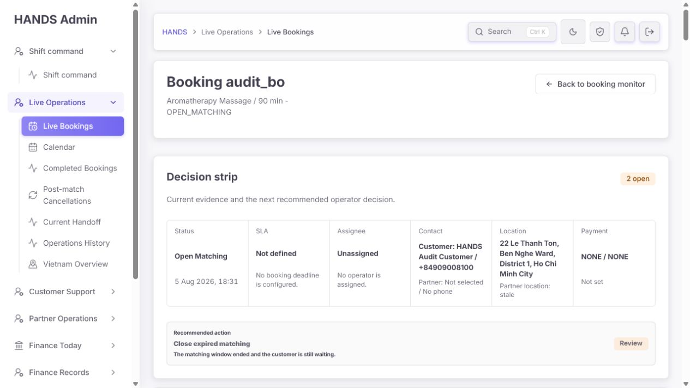
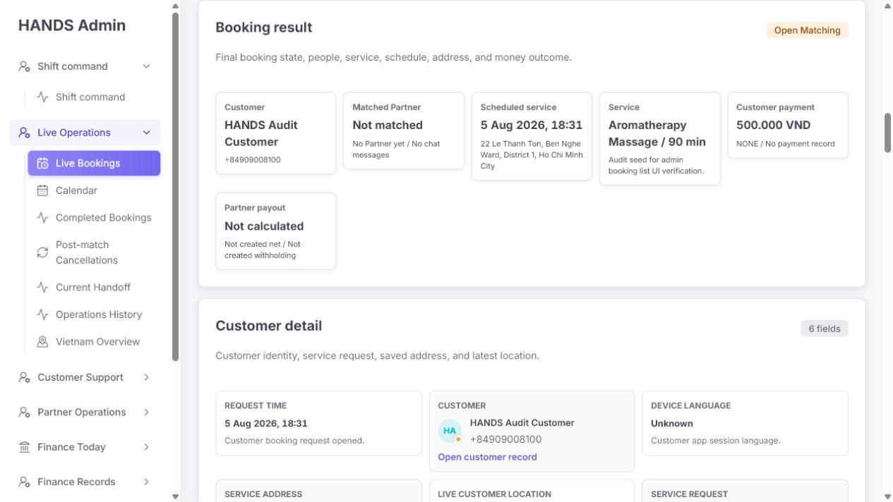
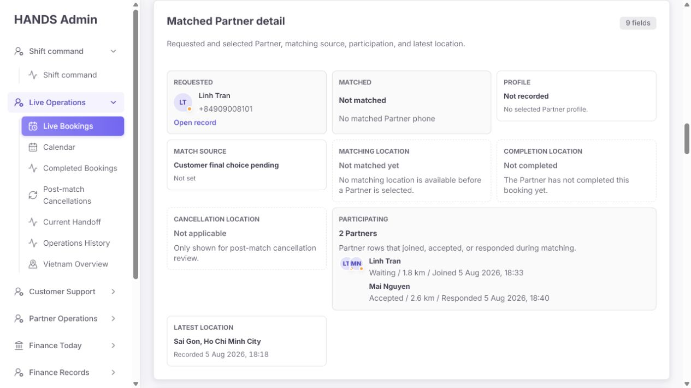
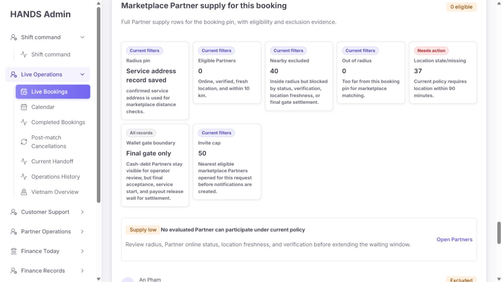

# Booking detail 운영자 UX 심층 감사 보고서

- 감사 대상: `http://localhost:3101/bookings/audit_booking_list_open_matching_booking#booking-command-decision-strip`
- 감사일: 2026-08-05
- 관점: 개발자용 데이터 열람 화면이 아니라, 실제 운영자가 현재 상황을 빠르게 이해하고 안전하게 다음 조치를 결정하는 화면
- 검증 방식: 로그인 상태의 실제 화면 캡처, 1024×768 반응형 확인, DOM/접근성 구조 및 페이지 내 링크 검사, 프론트엔드와 API 처리 코드 대조
- 변경 범위: 이번 작업은 분석과 제안만 수행했으며 애플리케이션 코드는 수정하지 않았다.

## 1. 결론

현재 상세 화면은 데이터가 풍부하고 기록 보존 의도도 좋지만, 운영자의 핵심 질문인 **“지금 무엇을 해야 하는가, 그 판단 근거는 무엇인가, 실행하면 무엇이 바뀌는가”**에 한 가지 일관된 답을 주지 못한다.

가장 큰 문제는 다음 다섯 가지다.

1. 상단은 `Close expired matching`을 최우선으로 추천하지만, 같은 화면의 Activity는 `Prompt customer support to help the customer choose the final Partner`라고 안내하며 Mai Nguyen은 이미 `Accepted` 상태다.
2. 상단에는 `SLA Not defined / No booking deadline is configured`라고 표시되지만, 활동 기록에는 `expires 5 Aug 2026, 19:01`이 명시되어 있다.
3. 결제 레코드가 없는데도 `Customer payment 500,000 VND`, `PAYMENT RECORD 500,000 VND`라고 강조되어 서비스 가격과 실제 결제 상태가 혼동된다.
4. `Close expired matching`은 예약 종료, 결제 승인 해제, 매칭 상태 종료를 동반하는 중요한 작업인데 결과와 복구 가능성, 고객/파트너 알림 여부를 설명하거나 재확인하지 않는다.
5. 운영자 메모와 고객 요청 메모가 같은 `booking.notes`에 섞여 있다. 현재 화면도 같은 문자열을 `Service`의 고객 메모처럼 보여 주면서 동시에 `Operator notes`로 보여 준다.

이 문제는 카드 간격이나 색상을 다듬는 수준으로 해결되지 않는다. 이미 목록 화면에서 사용하는 공통 의사결정 모델은 `customerChoiceCandidateCount > 0`을 만료 처리보다 우선한다. 상세 화면만 별도의 `bookingNeedsActionItems()`와 단순 상태 검사로 판단을 다시 만들면서 충돌이 발생한다. **새 로직을 더 만들지 말고 기존 공통 결정 모델을 상세 화면의 단일 판단 소스로 재사용하는 것이 가장 작고 안전한 해결책**이다.

## 2. 화면 규모와 운영 부담

1024×768에서 측정한 현재 화면은 다음과 같다.

| 항목 | 측정값 | 운영 영향 |
|---|---:|---|
| 전체 문서 높이 | 9,151px | 약 12개 화면을 스크롤해야 하며 판단 근거가 서로 멀리 떨어짐 |
| 주요 섹션 | 21개 | 상태와 무관한 섹션까지 항상 노출됨 |
| 2단계 제목 | 16개 | `Activity`, `Booking chronological activity`처럼 유사 개념이 중복됨 |
| 링크 | 40개 | 무엇이 핵심 행동이고 무엇이 참고 링크인지 구분이 약함 |
| 버튼 | 9개 | 위험 작업과 단순 기록 작업의 위계가 충분히 분리되지 않음 |
| 표 | 2개 | 아직 생성될 수 없는 리뷰/평가 빈 표가 화면을 차지함 |
| 가로 오버플로 | 없음 | 1024px 레이아웃의 기술적 반응형은 양호함 |
| 콘솔 오류/경고 | 없음 | 렌더링 안정성은 양호함 |

페이지가 긴 것 자체보다 더 큰 문제는 **중요도 순서가 상태에 맞지 않는 것**이다. 이 예약에서 종료 판단에 직접 필요한 후보자·현재 공급·결제 결론은 아래쪽에 있고, 아직 적용되지 않는 정산·리뷰·빈 상태가 그보다 먼저 나온다.

## 3. 대표 화면 증거

### 3.1 상단 결정과 체크포인트



상단은 읽기 쉽고 1024px에서도 재배치가 잘 되지만, 보여 주는 사실과 추천이 모순된다. `2 open`의 두 건이 무엇인지도 이 영역만으로는 알 수 없다.

### 3.2 상세 정보와 결제 의미 혼동



`Open Matching`인데 섹션 제목과 설명은 `Booking result`, `Final booking state`, `money outcome`이다. `500,000 VND`는 결제 결과가 아니라 예약 가격인데 결제처럼 표시된다.

### 3.3 후보자 상태와 운영 권고 충돌



Mai Nguyen이 `Accepted`이고 `Customer final choice pending`인데, 상단 추천은 고객 선택 지원이 아니라 매칭 종료다.

### 3.4 현재 공급 근거



현재 정책 기준 가용 공급이 0이라는 근거는 중요하지만 페이지 맨 아래에 묻혀 있다. 또한 “Full Partner supply rows”라고 설명하면서 실제 모델은 8개만 자르고 전체 건수/더보기 수단을 제공하지 않는다.

전체 캡처 목록은 [부록 A](#부록-a-캡처-목록)에 정리했다.

## 4. 우선순위별 상세 발견사항

### P0-01. 상단 추천과 후보자 상태가 충돌한다

**화면 증거**

- Decision strip: `Close expired matching`
- Activity: `Customer choice` / `Prompt customer support to help the customer choose the final Partner.`
- Partner detail: Mai Nguyen `Accepted / 2.6 km / Responded 18:40`
- Matching history: `customer can select from participating or accepted Partners`

**운영 위험**

운영자는 선택 가능한 파트너가 있는데도 예약을 종료할 수 있다. 이미 수락한 파트너와 고객에게 불필요한 취소 경험을 만들고 매출 손실로 이어질 수 있다.

**코드 원인**

- `apps/admin_web/lib/booking-command-decision-strip.ts:225-233`의 기존 공통 모델은 OPEN_MATCHING이면서 고객 선택 후보가 있으면 `Customer choice`를 최우선으로 처리한다.
- 상세 페이지는 이 모델을 사용하지 않고 `apps/admin_web/app/bookings/[id]/page.tsx:662-683`에서 별도의 `bookingNeedsActionItems()` 첫 항목을 추천으로 선택한다.
- `apps/admin_web/lib/booking-operator-action-rules.ts:19-21`의 `canExpireBooking()`은 상태가 `OPEN_MATCHING`인지만 확인한다.
- `apps/admin_web/app/bookings/[id]/booking-needs-action-section.tsx:72-80`은 위 불리언만으로 만료 종료를 추천 목록에 넣는다.

**수정 기준**

1. 상세 화면도 기존 `bookingCommandDecisionStrip()`을 단일 판단 소스로 사용한다.
2. 우선순위는 최소한 다음과 같아야 한다.
   - 주소/안전/결제 차단 이슈
   - 현재 선택 가능한 Accepted/Joined 후보가 있음 → 고객 최종 선택 지원
   - 선택 후보 없음, 유효한 공급 있음 → 매칭 모니터링/연장 판단
   - 매칭 기한 경과, 선택 후보 없음, 유효한 공급 없음 → 만료 종료 검토
3. 비즈니스 규칙상 기한 경과 후 Accepted 후보가 무효라면 `Accepted`를 그대로 보여 주지 말고 `Expired response — no longer selectable`로 명시하고 무효화 시각과 근거를 보여 준다.

**완료 조건**

- 동일한 예약에 대해 목록과 상세의 추천 행동이 항상 같다.
- Accepted 후보가 유효한 동안 `Close expired matching`이 1차 행동으로 노출되지 않는다.
- 추천 행동 테스트에 `OPEN_MATCHING + accepted candidate + expired deadline` 조합이 포함된다.

### P0-02. 만료 종료 작업의 서버 가드와 결과 설명이 부족하다

**화면 증거**

- `Expiry reason`과 `Close expired matching` 버튼만 있다.
- 종료 후 상태, 결제, 알림, 복구 가능 여부가 보이지 않는다.
- 브라우저 기본 `required` 검증 외에 확인 단계가 없다.

**코드 원인과 실제 부작용**

`apps/api/src/admin/admin.service.ts:12641-12717`을 대조하면 다음이 실행된다.

- 서버 가드는 예약 상태가 `OPEN_MATCHING`인지만 확인한다.
- PENDING/AUTHORIZED 결제는 `RELEASED`로 바뀔 수 있다.
- 예약 상태는 `EXPIRED`, 종료 주체는 ADMIN, 종료 사유는 `admin_expired`로 기록된다.
- Redis 매칭 상태를 닫는다.
- `CUSTOMER_CONTACTED` 체크포인트는 오히려 `PENDING`으로 남긴다.
- 이 메서드 안에는 고객/파트너 알림 생성이 없다.

즉, 현재 버튼은 “단순 상태 변경”이 아니라 **예약과 매칭을 종료하고 결제 상태에 영향을 줄 수 있는 작업**이다.

**수정 기준**

- 서버 측 `canExpire` 판단에 최소한 `expiresAt <= now`, 선택 가능한 후보 없음, 최종 파트너 없음 조건을 함께 검증한다.
- 제출 전 요약을 표시한다.
  - 예약: `OPEN_MATCHING → EXPIRED`
  - 매칭: 즉시 종료
  - 결제: 현재 레코드 없음 / 또는 승인 해제 예정
  - 알림: 자동 발송 없음이면 “운영자가 고객에게 별도 안내해야 함”
  - 복구: 불가 또는 권한 있는 복구 경로
- 버튼 문구를 `Review expiry impact`로 시작하고, 확인 화면의 최종 버튼을 `Expire booking and close matching`처럼 결과 중심으로 쓴다.
- 종료 전에 고객 연락 체크포인트를 필수로 할지, 종료 후 필수 후속 업무로 만들지를 정책으로 명확히 한다. 현재처럼 종료하면서 연락 상태를 PENDING으로 되돌리는 동작은 화면에 설명해야 한다.

**완료 조건**

- 프론트와 API가 같은 eligibility 함수를 공유하거나 같은 조건을 각각 검증하는 테스트가 있다.
- 유효한 고객 선택 후보가 있으면 API도 만료 처리를 거부한다.
- 운영자가 제출 전에 상태·결제·알림 결과를 읽을 수 있다.

### P0-03. “마감 없음”과 실제 매칭 만료시각이 동시에 표시된다

**화면 증거**

- Decision strip: `SLA / Not defined / No booking deadline is configured.`
- Chronological activity: `Matching opened ... expires 5 Aug 2026, 19:01`

**코드 원인**

- `apps/admin_web/app/bookings/[id]/page.tsx:845`에서 SLA가 항상 `Not defined`로 하드코딩된다.
- `apps/admin_web/app/bookings/[id]/booking-needs-action-section.tsx:137`은 항상 `No booking deadline is configured.`를 표시한다.
- 실제 `booking.expiresAt`은 Activity에서 정상 사용한다.

**수정 기준**

- 상단의 `SLA`를 이 상태에서는 `Matching deadline`으로 바꾼다.
- 값은 `5 Aug 2026, 19:01`, 보조 문구는 `Expired 12 min ago` 또는 `19 min remaining`처럼 상대시간을 함께 쓴다.
- 운영자 응답 SLA가 별도 개념이라면 `Operator response SLA`라는 별도 필드로 분리하고, 매칭 마감과 섞지 않는다.
- 추천 행동이 만료를 근거로 한다면 반드시 같은 카드 안에서 만료시각과 경과시간을 보여 준다.

**완료 조건**

- `expiresAt`이 있는 예약에서 “No booking deadline” 문구가 나타나지 않는다.
- 화면 어디에서도 같은 예약의 기한 유무가 서로 다르게 표현되지 않는다.

### P0-04. 서비스 가격을 결제 레코드처럼 표시한다

**화면 증거**

- Decision strip: `Payment NONE / NONE / Not set`
- Booking result: `Customer payment 500,000 VND / NONE / No payment record`
- Money result: `PAYMENT RECORD 500,000 VND / NONE / No payment / ref no provider ref`

**코드 원인**

- `apps/admin_web/app/bookings/[id]/booking-unified-detail.ts:146-148`은 `financeTrace.customerPrice`를 `Customer payment` 값으로 사용한다.
- 같은 파일 `:355-361`은 결제가 없어도 `financeTrace.customerPrice`를 `Payment record` 값으로 사용하고 finance-highlight를 적용한다.
- 반면 `bookingPaymentEvidence()`는 실제 `booking.payment`가 없음을 올바르게 알고 있다.

**운영 위험**

운영자가 500,000 VND가 승인·수납된 금액이라고 오인해 환불이나 고객 안내를 잘못할 수 있다.

**수정 기준**

- `500,000 VND`는 `Service price` 또는 `Quoted price`로 표시한다.
- 실제 결제가 없으면 결제 요약은 `No payment record` 한 줄로 끝낸다.
- 종료 판단에는 `No payment authorized or captured — no refund required`처럼 운영 결론을 제공한다.
- 결제 레코드가 있을 때만 `Payment record`, 파트너 earning이 있을 때만 `Partner earning`, 수수료 산출 근거가 있을 때만 `HANDS fee` 강조 카드를 보여 준다.

**완료 조건**

- `booking.payment == null`이면 화면 어디에도 서비스 가격이 `payment` 또는 `payment record`로 라벨링되지 않는다.
- 가격, 승인액, 캡처액, 환불액이 각각 독립된 의미로 표시된다.

### P0-05. 고객 메모와 운영자 메모가 같은 데이터로 혼합된다

**화면 증거**

`Audit seed for admin booking list UI verification.`가 다음 두 위치에 모두 나온다.

- Booking result의 Service 보조문구
- Operator notes의 1개 메모

**코드 원인**

- `booking-unified-detail.ts:141-143`, `:210-212`는 `booking.notes`를 서비스/고객 메모처럼 사용한다.
- `booking-action-status-sections.tsx:520-532`도 같은 `booking.notes`를 운영자 메모 목록으로 사용한다.
- API `admin.service.ts:12465-12488`은 운영자 메모를 다시 `booking.notes` 문자열에 추가하고 별도의 audit log도 남긴다.

**운영 위험**

운영자 내부 메모를 고객 요청으로 오인하거나, 고객 요청에 운영자 기록이 섞여 서비스 인계가 왜곡될 수 있다.

**수정 기준**

- 즉시 수정: Service 카드에서 `booking.notes`를 `Customer note`로 단정하지 말고 `Legacy booking note`로 분리하거나, 신뢰할 수 있는 고객 요청 필드가 없으면 숨긴다.
- 운영자 메모 표시는 이미 생성되는 `booking.ops_note.add` audit log를 사용해 `작성자 · 작성시각 · 내용`을 구성한다.
- 중기적으로 고객 요청 메모와 내부 운영 메모의 저장 경계를 분리한다. 새 저장 구조가 필요하더라도 기존 audit log를 재사용해 중복 시스템을 만들지 않는다.

**완료 조건**

- 운영자 메모가 Service request/customer note에 나타나지 않는다.
- 모든 운영자 메모에 작성자와 실제 생성시각이 표시된다.
- 레거시 혼합 문자열은 출처 불명으로 명확히 표시하거나 마이그레이션한다.

### P1-01. 상단 Decision strip이 결정에 필요한 핵심 사실을 빠뜨린다

현재 상단은 긴 주소와 전체 연락처를 크게 보여 주지만 다음 정보가 없다.

- 매칭 마감과 경과시간
- 선택 가능 후보 `1 accepted / 1 waiting`
- 현재 정책 기준 공급 `0 eligible`
- 고객 연락 여부
- 종료 시 결제 결론
- 실제 담당자 지정/변경 수단

**제안 구성**

| 우선 사실 | 예시 문구 |
|---|---|
| 상태/경과 | `Open matching · 30 min` |
| 매칭 마감 | `Expired at 19:01 · 12 min overdue` |
| 고객 선택 | `1 accepted candidate · customer choice pending` |
| 공급 | `0 currently eligible · 40 nearby excluded` |
| 고객 연락 | `Not contacted` + `Mark contacted` |
| 결제 결론 | `No payment record · no refund required` |
| 담당자 | `Unassigned` + `Assign to me` |

주소는 `District 1, Ho Chi Minh City` 정도로 줄이고 전체 주소는 펼침/복사로 제공한다. 연락처는 한 번만 노출한다.

### P1-02. 상태에 맞지 않는 섹션 때문에 핵심 근거가 묻힌다

OPEN_MATCHING 예약인데 다음이 항상 크게 보인다.

- `Booking result / Final booking state`
- `Money result`의 Partner earning/HANDS fee/tax/wallet
- 빈 Chat 카드
- Customer reviews 빈 표
- Partner evaluations 빈 표
- 매칭 전에는 성립하지 않는 Profile/Completion location/Cancellation location 카드

반면 직접적인 판단 근거인 Accepted 후보와 공급 상태는 뒤쪽에 있다.

**수정 기준**

- `bookingDetailSectionVisibility()`를 실제 렌더링에도 적용한다.
- OPEN_MATCHING 기본 순서를 다음처럼 바꾼다.
  1. Decision & primary action
  2. Contact/checkpoints
  3. Candidates & current supply
  4. Relevant activity
  5. Operator notes
  6. Customer/service details
  7. 기타 기록은 접힌 `More booking records`
- 리뷰는 완료 후 리뷰가 존재하거나 검토가 필요할 때만 펼친다.
- 결제/정산은 실제 payment/earning/finance exception이 있을 때만 상세 노출한다.

### P1-03. 공급 섹션이 “전체”라고 말하지만 8건만 조용히 잘라낸다

**화면/코드 증거**

- 설명: `Full Partner supply rows for the booking pin`
- 요약: `40 nearby excluded`
- 실제 표시: 8개 행
- `booking-marketplace-supply.ts:145-146`: `rows = candidateRows.slice(0, 8)`

**수정 기준**

- 설명을 `Top 8 evaluated Partners`로 정확히 바꾸고 `Showing 8 of 40 excluded`를 표시한다.
- 전체가 필요하면 별도의 필터된 파트너 목록 링크를 제공한다.
- 처음부터 40개를 모두 렌더링할 필요는 없다. 상위 제외 원인 집계와 관련 후보 2명만 기본 노출하는 편이 운영에 더 유용하다.
- 모든 metric 위의 자동 `Current filters` 라벨은 실제 필터가 아니므로 제거하고 `Current policy snapshot` 또는 무라벨로 바꾼다.

### P1-04. Accepted 이력과 현재 공급 제외 상태의 차이를 설명하지 않는다

Mai Nguyen은 이력에서 `Accepted / 2.6 km / Ready now`지만 현재 공급에서는 `Busy with a booking / Profile draft / final gate settlement required / 0 m`로 제외된다. Linh Tran도 참여 이력 1.8 km와 현재 공급 0 m가 다르다.

이 값들이 각각 “참여 당시 스냅샷”과 “현재 프로필 좌표/상태”라면 둘 다 맞을 수 있지만, 화면은 시간 기준과 데이터 출처를 설명하지 않는다.

**수정 기준**

- 이력 값: `At participation · 18:40 · 2.6 km · Accepted`
- 현재 값: `Current evaluation · checked 19:xx · 0 m · Excluded: busy, KYC draft, settlement`
- Accepted 후보가 현재 선택 불가능해졌다면 상단 후보 수에서도 제외하고 이유를 보여 준다.
- 공급 평가시각을 표시해 40분 전 좌표와 현재 판단을 구분한다.

### P1-05. Structured ops는 “운영 흐름”이 아니라 네 개의 비슷한 카드다

`4 open / 4`는 경고 상황인데 info 톤으로 보이고, 첫 카드가 큰 선택 상태를 차지한다. 나머지 카드는 `Review handling detail`처럼 구체성이 없다. 또한 `Unassigned`인데 담당자 지정 행동이 없다.

**수정 기준**

- 헤더를 `4 checkpoints remaining` + warning 톤으로 표시한다.
- 체크포인트를 한 줄 상태 목록으로 압축한다: `Customer contact — Not checked`, `Partner contact — Not required until final selection` 등.
- 현재 상태와 관련 없는 체크포인트는 `Not applicable`로 자동 판정하고 기본 접는다.
- `Could not confirm`을 누르면 사유와 다음 확인시각 입력이 열린다는 점을 chevron/보조문구로 명확히 한다.
- 담당자는 `Assign to me`, `Transfer`를 제공하거나, 실제 할당 기능이 없다면 Decision strip에서 Assignee 필드를 제거한다.

### P1-06. 타임라인이 두 종류로 중복되고 서로 다른 언어를 쓴다

- `Activity`: 비즈니스 단계 1개
- `Booking chronological activity`: 원시 이벤트 7개
- 생성 이벤트는 `OPEN_MATCHING` 원시 enum을 그대로 노출한다.
- Summary metric은 실제 필터가 아닌데 `Current filters`를 반복한다.
- Range는 최신시각을 큰 값으로, 가장 오래된 시각을 보조문구로 분리해 범위가 한눈에 읽히지 않는다.

**수정 기준**

- 기본 화면에는 하나의 `Timeline`만 둔다.
- 상단에는 현재 단계와 다음 행동, 아래에는 최근 이벤트를 표시한다.
- 원시 이벤트/CSV는 `Technical activity`로 접거나 Developer/System 권한에서 제공한다.
- `Range: 18:18–18:40`, `7 events`로 간결히 표현한다.
- `Booking created as Open matching`처럼 enum을 humanize한다.

### P1-07. 실제로 이동하지 않는 `Matching opened` 링크가 있다

브라우저에서 모든 `href="#..."`의 대상을 검사한 결과 `#alerts`만 대상이 없었다.

**코드 원인**

- `booking-activity-records.ts:84-92`에서 `Matching opened`는 `#alerts`를 가리킨다.
- `page.tsx:940-946`은 dispatch disclosure가 보이지 않을 때만 숨은 `#alerts` 앵커를 만든다.
- 현재 OPEN_MATCHING에서는 dispatch disclosure가 보이지만 실제 alert section은 feature flag로 숨겨져 있어 대상이 사라진다.

**수정 기준**

- 현재 구성에서는 `#marketplace-supply` 또는 `#booking-detail-lifecycle-list`로 연결한다.
- 렌더링되는 섹션만 링크 대상으로 사용한다.
- 페이지 테스트에 “모든 내부 fragment 링크가 실제 id를 가진다” 검사를 추가한다.

### P1-08. 운영자 메모 감사 추적이 화면에서 소실된다

API는 timestamp를 문자열에 붙이고 audit log에 actor를 기록하지만, 화면은 줄 단위 `<p>`로만 출력한다. 현재 기존 seed note에는 작성자와 시각이 없다. 또한 `Reviews and notes`는 `0 record(s)`라고 표시하면서 바로 아래 Operator notes는 `1 note`라고 표시한다.

**수정 기준**

- `Operator notes`를 독립 섹션으로 유지하고 `Reviews and notes`라는 잘못된 묶음 제목에서 notes를 제거한다.
- 각 메모는 `작성자 · 시각 · 내용` 구조로 표시한다.
- Add note 입력에 `required`를 추가하고, 빈 제출 시 조용히 아무 일도 하지 않는 대신 인라인 오류를 제공한다.
- 저장 성공/실패 피드백을 현재 화면에서 보여 준다.

### P1-09. 제목과 복귀 동작이 실제 운영 맥락을 보존하지 않는다

- 제목은 `Booking audit_bo`로 잘린 ID만 보여 준다.
- 부제는 `Aromatherapy Massage / 90 min - OPEN_MATCHING`으로 raw enum을 노출한다.
- `Back to booking monitor`는 항상 `/bookings`로 가므로 이전 view, 검색, 정렬, 페이지, 스크롤 위치가 사라진다.

**수정 기준**

- 제목: `Aromatherapy Massage · Open matching`
- 보조 정보: `Booking audit_bo…` + 전체 ID 복사 버튼
- 목록에서 상세로 올 때 `returnTo` 또는 검색 파라미터를 보존해 원래 큐로 돌아간다.
- 브라우저 history가 안전하면 `Back`을 우선하고 직접 진입 시 `/bookings`를 fallback으로 사용한다.

### P2-01. 개발자 중심 문구가 운영 판단을 방해한다

교체 권장 문구:

| 현재 | 권장 |
|---|---|
| `2 open` | `2 actions need review` 또는 실제 항목명 |
| `4 open / 4` | `4 checkpoints remaining` |
| `6 fields`, `9 fields`, `7 fields` | 제거하거나 `Customer details`, `Matching evidence`, `Money evidence` |
| `NONE / NONE` | `No payment method · no payment record` |
| `Not set` | 맥락별 `No deadline`, `No payment`, `Not matched` |
| `Booking result` | OPEN_MATCHING에서는 `Booking overview` |
| `Matched Partner detail` | 매칭 전에는 `Matching & Partner candidates` |
| `Cannot complete service` | `Close matching without a Partner` |
| `Open Partners` | `Review Partners excluded for this booking` |
| `Current filters` | `Current policy` 또는 제거 |
| `1 stage(s)`, `7 event(s)` | `1 stage`, `7 events` |

### P2-02. 전화번호와 주소가 반복 노출된다

상세 화면에서 연락 업무 때문에 전체 전화번호가 필요한 것은 합리적이다. 다만 같은 전체 번호가 Decision strip, Customer detail, Partner card에 반복된다.

**수정 기준**

- Decision strip에서는 `Call`/`Copy` 행동과 함께 한 번만 전체 번호를 보여 준다.
- 나머지 카드에서는 마스킹하거나 `Contact available above`로 줄인다.
- 역할별 접근권한과 조회 감사가 필요하면 기존 operator access/audit 구조를 재사용한다.
- 긴 전체 주소는 상단에서 지역 단위로 줄이고 상세 영역에서 전체 주소와 복사 기능을 제공한다.

### P2-03. 접근성 기본 구조는 양호하지만 행동 의미 검증이 더 필요하다

확인 결과:

- 주요 region은 제목과 연결되어 있다.
- 중복 id는 발견되지 않았다.
- Expiry reason에는 label과 `required`가 있다.
- 1024px에서 가로 오버플로가 없다.
- 숨겨진 Desktop required H1은 `display:none` 상태라 현재 뷰의 중복 제목 문제는 아니다.

추가 확인/수정:

- 위험 작업의 포커스 이동, 확인 모달 키보드 순서, 취소 후 포커스 복귀를 실제 키보드로 검증한다.
- 상태 색상만으로 Pending/Warning을 구분하지 않는다.
- 빈 리뷰 표를 숨기면 스크린리더가 불필요한 표 구조를 통과하지 않아도 된다.
- 현재 캡처만으로 색 대비 수치를 확정할 수 없으므로 디자인 토큰 대비는 자동 검사로 별도 검증한다.

## 5. 권장 정보 구조

### 첫 화면 안에 보여야 하는 것

```text
Booking · Aromatherapy Massage · Open matching
audit_booking_...  [Copy ID]                       [Back to matching queue]

[Decision]
Customer choice pending
Mai accepted at 18:40. Matching deadline passed at 19:01.
Current supply: 0 eligible. Payment: no record.

[Contact customer to choose Mai]  [Review expiry impact]

Status         Deadline             Candidates         Payment        Owner
Open matching  12 min overdue       1 accepted / 1 wait No record      Unassigned [Assign]
```

### 그 아래의 기본 순서

1. **Handling checkpoints** — 고객 연락, 후보 유효성, 위치, 결제 확인
2. **Candidates and supply** — 관련 후보 2명과 현재 eligibility 차이, 제외 사유 집계
3. **Recent timeline** — 현재 단계 + 최근 5~7개 사건
4. **Operator notes** — 작성자/시각 포함
5. **Customer and service details** — 필요 시 펼침
6. **Other records** — chat, finance, reviews, diagnostics를 상태에 따라 조건부 노출

## 6. 최소 수정 순서

### 1단계 — 잘못된 판단과 위험 작업 차단

1. 상세 페이지의 별도 추천 로직을 제거하고 기존 `bookingCommandDecisionStrip()`을 재사용한다.
2. `canExpireBooking()`과 API `expireBooking()`에 실제 만료시각·선택 후보·최종 파트너 조건을 추가한다.
3. 만료 작업에 영향 요약과 최종 확인을 추가한다.
4. 결제 레코드가 없을 때 가격을 payment로 표현하는 코드를 수정한다.
5. `booking.notes`를 고객 메모와 운영자 메모 양쪽으로 표시하지 않는다.

### 2단계 — 운영자 우선 정보 구조

1. Decision strip에 deadline, candidate, supply, contact, payment conclusion, owner를 배치한다.
2. Marketplace supply를 후보자 섹션 바로 아래로 올린다.
3. OPEN_MATCHING과 무관한 정산·리뷰·완료 위치 카드를 숨기거나 접는다.
4. 두 타임라인을 하나로 합친다.

### 3단계 — 문구, 이력, 탐색 마감

1. raw enum, `fields`, `NONE`, `Current filters`를 운영 문구로 교체한다.
2. 공급 평가시각과 참여 당시/현재 값을 구분한다.
3. operator note에 actor/time을 표시한다.
4. `#alerts` 링크와 목록 복귀 컨텍스트를 수정한다.
5. 1024/1280/1440, 키보드, 위험 작업, 빈/오류/로딩 상태를 회귀 검증한다.

## 7. 권장 테스트 시나리오

| 시나리오 | 기대 결과 |
|---|---|
| OPEN_MATCHING, 기한 전, 후보 없음, 공급 있음 | `Monitor matching` 또는 `Extend wait` |
| OPEN_MATCHING, 기한 경과, Accepted 후보 유효 | `Contact customer for final choice`; 만료 종료는 2차 |
| OPEN_MATCHING, 기한 경과, 후보 없음, 공급 0 | `Review expiry impact` |
| OPEN_MATCHING이지만 `expiresAt` 없음 | `Deadline unavailable`; 자동으로 expired라고 단정하지 않음 |
| 결제 레코드 없음, 서비스 가격 500,000 VND | `Service price 500,000 VND`; `No payment record` |
| AUTHORIZED 결제 후 만료 | 확인 화면에 `Authorization will be released` 표시 |
| 운영자 메모 추가 | 작성자/시각/내용 표시, Service customer note에 나타나지 않음 |
| 공급 40건 중 8건 표시 | `Showing 8 of 40`과 전체 필터 링크 표시 |
| 모든 `href="#..."` | 동일 문서에 대응 id 존재 |
| 목록 필터에서 상세 진입 후 복귀 | 동일 view/search/sort/page/scroll 복원 |

## 8. 완료 판단 기준

다음 조건을 모두 만족해야 이 상세 화면을 “운영 친화적으로 개선됨”으로 판단할 수 있다.

- 첫 화면 안에서 현재 상태, 마감, 후보, 결제, 담당자, 다음 행동을 파악할 수 있다.
- 목록과 상세가 같은 추천 행동을 보여 준다.
- 위험 작업은 서버에서도 동일한 조건으로 보호된다.
- 가격과 실제 결제 레코드가 명확히 분리된다.
- 고객 메모와 운영자 메모가 의미상 분리된다.
- OPEN_MATCHING에 불필요한 완료/정산/리뷰 빈 섹션이 기본 노출되지 않는다.
- 후보 참여 당시 데이터와 현재 eligibility 데이터의 시점이 구분된다.
- 모든 내부 링크가 실제 섹션으로 이동한다.
- 1024px에서 가로 스크롤 없이 핵심 행동을 사용할 수 있고 키보드만으로 확인/취소가 가능하다.

## 부록 A. 캡처 목록

1. [Decision strip](./01-decision-strip.png)
2. [Structured ops and expiry](./02-structured-ops-and-expiry.png)
3. [Expiry action and section navigation](./03-expiry-action-and-sections.png)
4. [Booking result](./04-booking-result.png)
5. [Partner and chat](./05-partner-and-chat.png)
6. [Chat and money](./06-chat-and-money.png)
7. [Activity and timeline](./07-activity-and-timeline.png)
8. [Chronological events](./08-chronological-events.png)
9. [Reviews and notes](./09-reviews-and-notes.png)
10. [Operator notes](./10-operator-notes.png)
11. [Marketplace supply](./11-marketplace-supply.png)
12. [Supply exclusions](./12-supply-exclusions.png)
13. [Decision strip at 1024×768](./13-decision-strip-1024x768.png)
14. [Actions at 1024×768](./14-actions-1024x768.png)

## 부록 B. 직접 확인한 주요 코드 위치

- `apps/admin_web/lib/booking-command-decision-strip.ts:42-59, 225-243` — 목록용 공통 결정 모델과 고객 선택 우선순위
- `apps/admin_web/lib/booking-operator-action-rules.ts:19-21` — 상태만 확인하는 만료 가능 규칙
- `apps/admin_web/app/bookings/[id]/page.tsx:662-683` — 상세 전용 추천 선택
- `apps/admin_web/app/bookings/[id]/page.tsx:821-845` — 잘린 제목, raw status, 하드코딩된 assignee/SLA
- `apps/admin_web/app/bookings/[id]/booking-needs-action-section.tsx:72-80, 137-139` — 만료 추천과 잘못된 deadline 문구
- `apps/admin_web/app/bookings/[id]/booking-action-status-sections.tsx:599-647` — 영향 설명 없는 만료 폼
- `apps/api/src/admin/admin.service.ts:12641-12717` — 실제 만료 처리와 결제/Redis/체크포인트 영향
- `apps/admin_web/app/bookings/[id]/booking-unified-detail.ts:119-155, 340-421` — 가격/결제 혼동과 상태 무관 finance rows
- `apps/admin_web/app/bookings/[id]/booking-unified-detail-section.tsx:35-86` — Final result 문구와 항상 노출되는 people/finance 섹션
- `apps/admin_web/app/bookings/[id]/booking-marketplace-supply.ts:66-188` — 현재 공급 평가와 8건 slice
- `apps/admin_web/app/bookings/[id]/booking-activity-records.ts:84-92` — 깨진 `#alerts` 링크
- `apps/admin_web/app/bookings/[id]/booking-action-status-sections.tsx:513-551` — 문자열 기반 operator notes 표시
- `apps/api/src/admin/admin.service.ts:12465-12488` — booking.notes와 audit log에 운영자 메모 저장
