# Booking Detail 재감사 보고서

대상: `http://localhost:3101/bookings/cmrksdu210061vy3gfrmot29g`  
Booking ID: `cmrksdu210061vy3gfrmot29g`  
감사 일자: 2026-08-07 (Asia/Bangkok)  
감사 범위: 운영자용 관리자 웹, 코드, 문구, 상태 전이, 결제/파트너 수수료 결정 흐름  
화면 범위: **1440×900, 1600×900만 검수**. 1024px 이하 및 모바일 항목은 의도적으로 제외했다.

## 1. 결론

이전 감사의 핵심 방향은 최신 소스에 상당 부분 반영됐다. 특히 다음은 올바른 개선이다.

- 결정 사유 선택과 `Other` 사유의 필수 메모 검증
- 단순 브라우저 확인창 대신 금액 변화가 보이는 `<dialog>` 확인 단계
- 파트너 수수료가 없을 때 잘못된 `Keep fee` 선택지를 제거하고 단일 액션만 노출
- 고객 금액, 파트너 수수료, 검토 상태의 전/후 미리보기
- 실패·409 충돌·성공 결과를 운영자 문구로 반환하고 포커스를 결과 메시지로 이동
- API의 이유 코드 검증, 행 잠금, 중복 결정 방지, 감사 로그 메타데이터 보강

그러나 **현재 상태는 배포 승인 불가(Blocked)** 다. 이유는 디자인 완성도보다 더 근본적이다.

1. 브라우저에서 실행 중인 API가 최신 `src`가 아닌 오래된 `dist`다.
2. 최신 Admin 집중 테스트는 64개 중 11개 실패하고, API 집중 테스트는 591개 중 4개 실패한다.
3. 결제 종료가 Booking 트랜잭션의 `tx`가 아닌 별도 Prisma 클라이언트를 사용해 부분 성공 위험이 남아 있다.
4. 원 취소자와 관리자 결정자를 같은 `closedByRole`에 덮어써 운영 감사 의미가 훼손된다.
5. 실제 관리자 결정 시각 대신 원 취소 시각을 `Decision recorded`로 표시한다.
6. 기본 화면은 여전히 약 13,746px, 15개 이상의 뷰포트 길이이며 증거·금액·채팅·액션이 반복된다.

관찰된 실행 화면 점수는 **9/20**이다.

| 항목 | 점수 | 판정 |
|---|---:|---|
| 1440/1600 데스크톱 레이아웃 | 3/4 | 수평 잘림은 없고 다크 모드도 안정적 |
| 운영 정보 구조 | 1/4 | 13.7k px, 동일 사실 반복, 핵심 결정이 첫 화면 밖 |
| 문구·판단 명확성 | 2/4 | 결정 카드 방향은 좋지만 상태·역할·시각 문구가 충돌 |
| 변경 안전성·데이터 무결성 | 1/4 | 구 실행본에서 즉시 변경 발생, 최신 API도 원자성 미완 |
| 접근성·피로도 | 2/4 | 시맨틱 영역은 양호하나 반복 `Open`, 작은 보조문구, 조밀한 표 |

## 2. 감사 중 발생한 로컬 데이터 변경

중요: 이 대상은 `Demo Customer`, `Smoke Partner`, `Local E2E` 문구가 있는 로컬 테스트 레코드로 보인다. 감사 중 변경 전 화면의 `Waive Partner fee deduction`을 확인하려고 클릭했을 때, 감사 도구에서 운영자가 검토할 수 있는 확인 단계가 보이지 않은 채 요청이 완료됐다. 자동 복구는 별도의 금액/상태 변경이므로 수행하지 않았다.

| 항목 | 변경 전 | 변경 후 |
|---|---|---|
| 검토 상태 | Post-match cancellation review | Post-match cancellation resolved |
| 결제 | `CASH / PENDING`, 400,000 VND | `CASH / RELEASED`, 400,000 VND |
| 원 화면의 취소자 | Partner cancelled / `PROVIDER` | Admin decision / `ADMIN` |
| 파트너 earning | 없음 | 없음 |
| 추가된 메모 | 없음 | `Approved after admin chat evidence review.` |
| 채팅 증거 | 0 messages | 0 messages |

이 사건은 두 가지를 분리해서 봐야 한다.

- **구 실행 화면의 실제 문제:** 네이티브 확인 방식은 자동화/접근성/운영 검토 면에서 확실한 차단 장치가 아니었다.
- **최신 소스의 개선:** 현재 프런트 소스는 사유 입력, 결과 매트릭스, `<dialog>`, 명시적 제출 버튼을 추가했다. 다만 대상 레코드가 이미 종료되어 최신 미결정 폼을 동일 레코드로 다시 실행 검증할 수는 없었다.

## 3. 화면별 검수

### 3.1 첫 화면 — 주의 필요

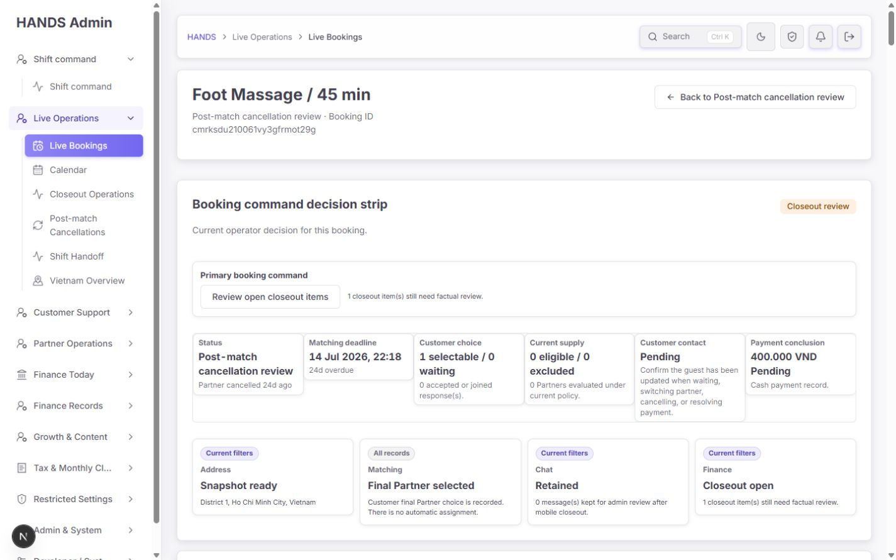

좋은 점:

- 예약 상태, 마감, 고객 선택, 결제 결론을 한 영역에서 찾을 수 있다.
- 1440px에서 수평 잘림이나 겹침은 없다.

문제:

- 가장 중요한 `Post-match cancellation processing`과 결정 액션이 첫 뷰포트에 보이지 않는다.
- 상단 command strip이 약 580px를 차지하고도 `Current filters`, `All records`, `Live`처럼 상세 화면에서 의미 없는 목록 문구를 반복한다.
- 취소·해결된 예약인데 `Continue normal monitoring`, `No immediate booking command issue`를 표시한다.
- `Customer contact: Pending`와 “즉시 문제 없음”이 동시에 있어 운영 우선순위가 충돌한다.
- 매칭 마감이 24일 지났다는 경고가 종료 예약에도 계속 1급 신호로 남는다.

수정 기준:

- 첫 화면의 1순위를 `검토 상태 → 지금 할 일 → 고객 금액 → 파트너 수수료`로 바꾼다.
- 종료된 예약은 `Review closed · no booking action`으로 표시한다.
- 고객 연락이 실제 미완료라면 이를 유일한 남은 액션으로 승격한다. 정책상 완료라면 종료 처리와 함께 완료 상태를 기록한다.
- 목록 필터 문구를 상세 화면에서 제거한다.

### 3.2 취소 사유·증거·금액 — 방향은 좋지만 사실 모델이 잘못됨

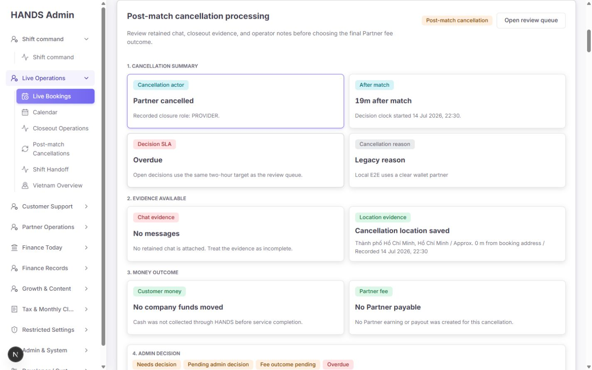

좋은 점:

- `Why cancelled → Evidence available → Current money state → Resolve review` 순서는 운영 판단 순서와 맞는다.
- 취소자, 매칭 후 경과, 사유, 채팅, 위치, 고객 금액, 파트너 금액을 한 맥락에 모았다.
- “No Partner earning or payout”처럼 없는 금액을 명시한 점은 좋다.

문제:

- 관리자 승인 후 `Cancellation actor`가 `Admin decision`으로 바뀐다. 원래 Partner가 취소했다는 사실과 관리자가 승인했다는 사실은 서로 다른 필드여야 한다.
- `Decision SLA` 자리에 해결 후 `Admin approved`가 들어간다. SLA, 결정 결과, 결정 주체를 한 필드에서 바꾸어 쓰고 있다.
- `Recorded closure role: ADMIN`은 운영자 문구가 아니라 내부 enum 노출이다.
- 0개 채팅인데 구 실행본이 “admin chat evidence review”라는 사실과 다른 메모를 저장했다.

수정 기준:

| 표시 필드 | 올바른 의미 |
|---|---|
| Cancellation actor | 최초 취소를 실행한 Customer/Partner/Admin |
| Cancellation at | 최초 취소 시각 |
| Decision status | Pending/Approved/Fee held |
| Decision by | 실제 관리자 이름 또는 역할 |
| Decision at | 관리자 결정 시각 |
| Decision reason | 구조화된 이유 코드의 운영자 라벨 |
| Evidence completeness | Complete/Partial/Missing + 누락 항목 |

### 3.3 결정 액션과 금액 종료 — 구 실행본은 차단, 최신 소스는 방향 양호

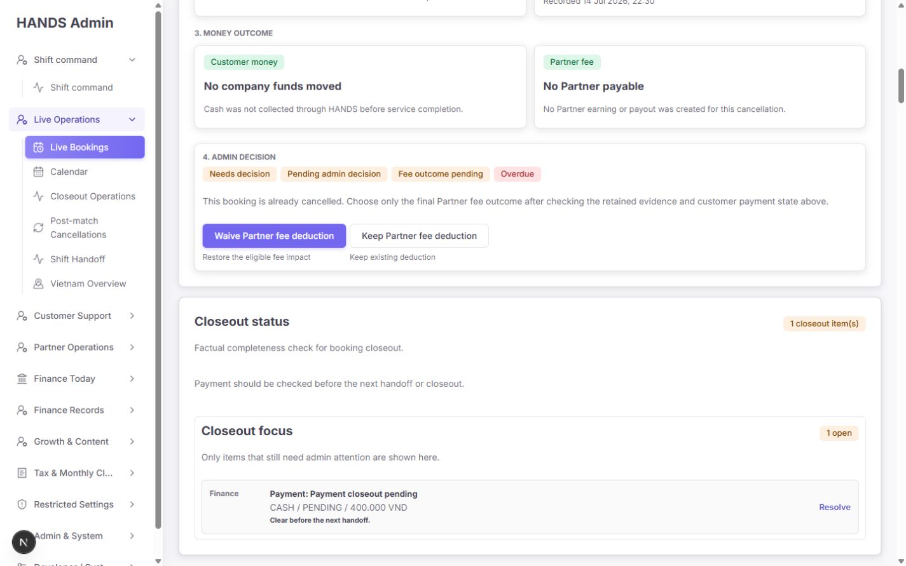

구 실행본 문제:

- earning과 파트너 지급액이 없는데도 `Waive`와 `Keep` 두 액션을 노출했다.
- 이유 입력이 없고 고정 메모가 서버에서 채워졌다.
- 고객 결제 종료와 파트너 수수료 판단이 버튼 문구에서 분리되어 실제 부수효과를 알 수 없었다.

최신 소스 개선:

- `booking-outcome-review-panel.ts`는 수수료가 없으면 `Close review — no money movement` 단일 액션만 만든다.
- 결제 상태에 따라 `release authorization`, `request refund`, `no funds movement`를 구체적으로 계산한다.
- `booking-detail-post-match-decision-section.tsx`는 결정 이유, 선택 메모, 전/후 매트릭스, `<dialog>`를 제공한다.
- `actions.ts`는 `adminPostOrThrow`를 사용하고 409/400/422/기타 오류 문구를 분리한다.

남은 수정:

- 아무 액션도 선택하지 않았을 때 미리보기의 Partner fee 결과가 기본적으로 `approveAfter`를 보여준다. 두 액션이 있는 경우 `Choose an outcome`으로 비워야 한다.
- 액션 텍스트 조합(`Approve, release... & waive...`)은 현재 문자열 치환으로 생성된다. 새 결제 문구가 추가되면 어색해질 수 있으므로 테스트에 실제 최종 라벨을 고정한다. 별도 추상화는 만들 필요 없다.
- 최신 폼의 실제 미결정 상태를 새 테스트 fixture에서 1440px로 한 번 더 브라우저 검증해야 한다.

### 3.4 변경 결과 — 차단

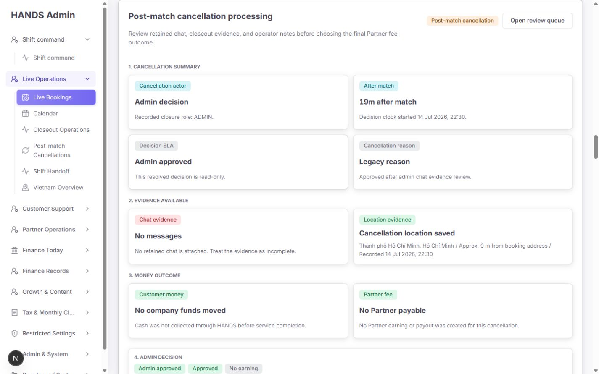

- 화면은 종료 상태로 전환됐지만 성공 토스트/공지 없이 전체 화면만 바뀌었다.
- 결제 `PENDING → RELEASED`, actor `PROVIDER → ADMIN` 등 여러 상태가 함께 바뀌었다.
- 0개 채팅임에도 채팅 증거 검토 문구가 저장됐다.
- 최신 소스에는 결과 메시지가 추가됐지만 실행 API가 오래된 `dist`여서 이 계약을 아직 검증하지 못했다.

### 3.5 해결 후 결정 카드 — 주의 필요

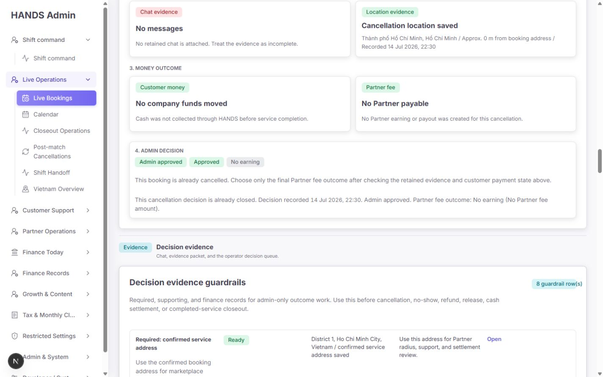

- `Admin approved`, `Approved`, `No earning` 배지가 같은 의미를 반복한다.
- 읽기 전용 상태인데도 설명은 “final Partner fee outcome을 선택”하라고 말한다.
- `Decision recorded 14 Jul 2026, 22:30`은 실제 8월 7일 관리자 결정을 가리키지 않고 원 취소 시각을 사용한다.
- 원인은 `booking-post-match-cancellations-model.ts:147-150`의 `closedAt ?? updatedAt ?? createdAt`이다.

수정 기준:

- 해결 전: `Reason / Evidence gaps / Money before → after / Confirm`.
- 해결 후: `Result / Decision by / Decision at / Customer money result / Partner fee result`만 표시한다.
- 해결 후 입력 안내와 SLA를 제거한다.

### 3.6 Decision evidence guardrails — 정보 과다 및 false-ready

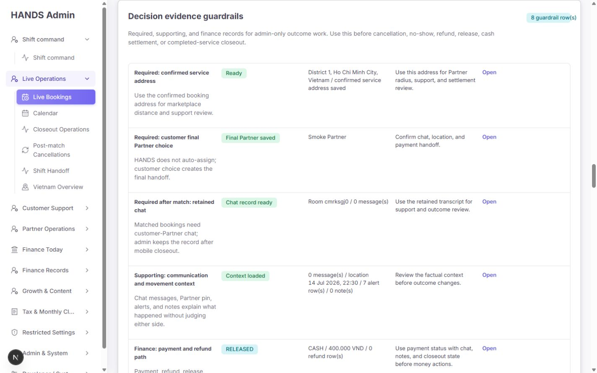

- 채팅방만 존재하고 메시지가 0개인데 `Chat record ready`다.
- 위치나 알림 한 종류만 있어도 `Context loaded`가 된다.
- 8개 행 모두 같은 `Open` 링크라 링크 목적을 구분하기 어렵다.
- 주소, 파트너, 채팅, 결제 등 이미 위에서 본 사실을 다시 표시한다.

원인:

- `booking-decision-evidence-guardrails.ts`는 `hasChatRoom`만으로 채팅을 Ready 처리한다.
- `messageCount || latestLocation || notifications || notes` 중 하나만 있어도 supporting context가 Ready다.

수정 기준:

- Ready를 단일 boolean으로 만들지 말고 필수 항목별 상태를 계산한다.
- 이 건은 `Partial evidence · chat 0 · operator note 0 · location 1 · failed alert 1`처럼 표시한다.
- 링크는 `Open chat`, `Open payment`, `Open location`, `Open audit trail`처럼 목적을 명시한다.

### 3.7 Evidence packet — 주의 필요

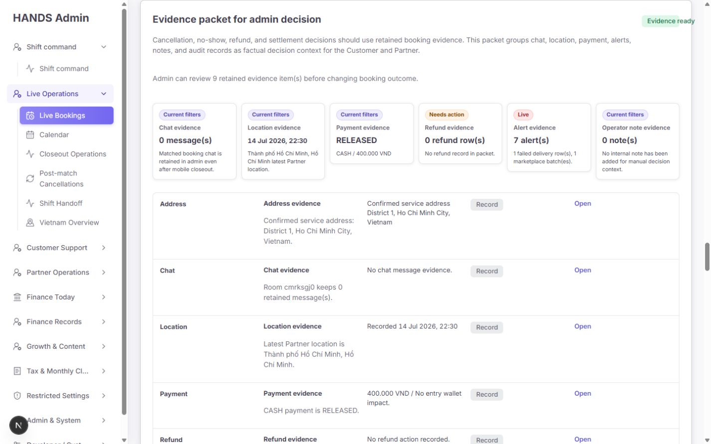

- 채팅 0, 메모 0, 실패 알림 1인데도 `Evidence ready`다.
- 환불이 필요 없는 현금 예약인데 `Refund evidence 0 row(s)`를 `Needs action`으로 표시한다.
- 이 영역에서도 `Current filters`가 반복된다.

원인:

- `booking-evidence-packet.ts:88-94`는 메시지/위치/알림/메모 중 하나만 있으면 전체를 Ready 처리한다.

수정 기준:

- 기대 환불이 없는 경우 `Not expected`로 표시한다.
- 증거 완전성은 “존재 여부”가 아니라 현재 결정에 필요한 항목과 비교한다.

### 3.8 Manual outcome board — 기본 화면에서 제거 권장

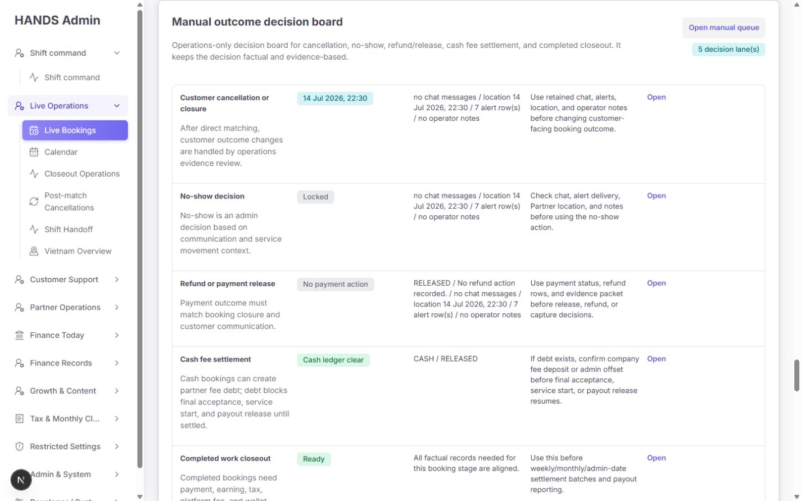

- 취소·해결된 한 예약에 Customer cancellation, No-show, Refund, Cash fee, Completed closeout 5개 lane을 모두 렌더링한다.
- 대부분 Locked/No action인데도 공간과 시선을 차지한다.
- 운영자는 가능한 액션을 찾기 위해 불가능한 액션을 읽어야 한다.

수정 기준:

- 현재 상태와 관련된 lane만 기본 노출한다.
- 나머지는 `Unavailable actions (4)` 접기 아래에 둔다.
- 별도 신규 보드를 만들지 말고 현재 배열을 `relevant/available`로 필터링하는 최소 변경이 적합하다.

### 3.9 Full evidence bundle — 중복 및 금액 오해

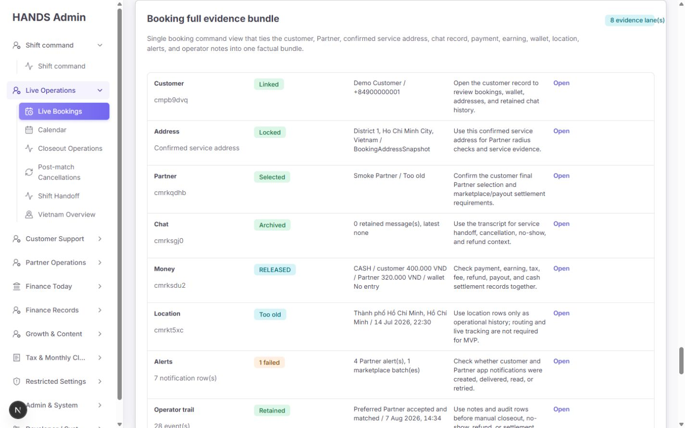

- 고객, 주소, 파트너, 채팅, 금액, 위치, 알림, trail을 네 번째 또는 다섯 번째로 반복한다.
- earning이 없는데 `Partner 320,000 VND`가 보여 실제 지급액처럼 읽힌다. 이는 pricing rule 기반 예상값이다.
- 전화번호가 여러 영역에서 전체 노출된다.

수정 기준:

- `Partner 320,000 VND`를 `Projected payout rule · no earning created`로 바꾼다.
- 운영 정책상 전체 전화번호가 항상 필요한지 검토한다. 필요하지 않다면 기본 마스킹 + 명시적 reveal/audit를 사용한다.
- 이 번들은 `Advanced records` 접기 안으로 이동한다.

### 3.10 Operator action availability — 불가능한 액션이 너무 큼

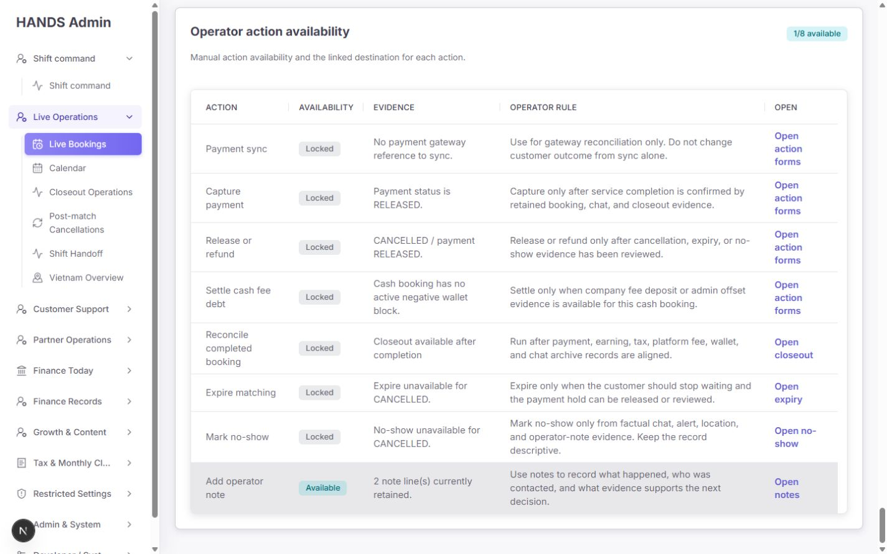

- 8개 중 1개만 가능하지만 7개 locked action과 해당 form 링크가 모두 보인다.
- locked인데 `Open action forms`로 이동할 수 있어 “안 되는 이유 확인”과 “실행”의 경계가 모호하다.

수정 기준:

- 가능한 액션을 먼저 한 줄로 표시한다.
- 불가능한 액션은 접힌 `Unavailable actions (7)`에 이유만 보여준다.
- locked 항목은 실행 폼 링크를 제거한다.

### 3.11 1600px 상단 — 레이아웃은 안정적, 의미는 동일하게 잘못됨

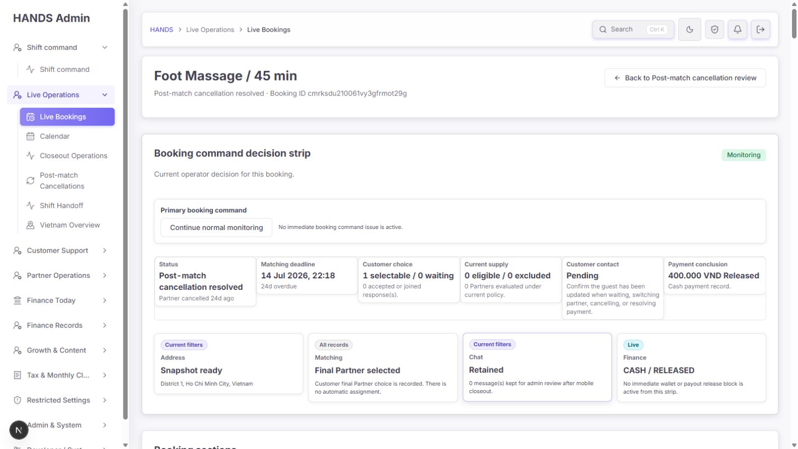

- 1600px에서도 수평 overflow와 카드 겹침은 없다.
- 그러나 `Continue normal monitoring`, 24일 overdue matching, pending customer contact가 같은 우선순위로 남는다.
- 1600px에서 가로로 더 펼치는 대신, 핵심 정보를 첫 화면에 올리고 반복 영역을 접는 편이 더 효율적이다.

### 3.12 다크 모드 — 시각 안정성 양호

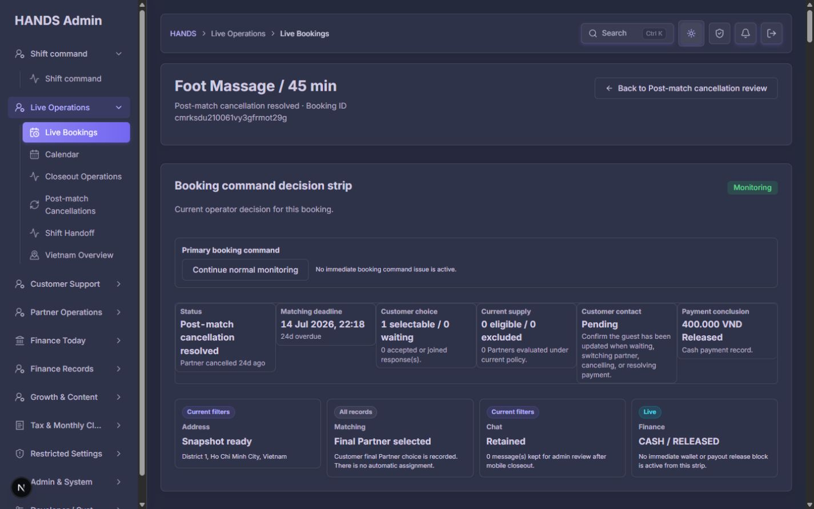

- 표면, 경계, 상태색은 대체로 일관되고 깨짐이 없다.
- 현재 디자인 토큰을 유지하는 것이 좋다.
- 다만 10.9~12px 보조문구가 많아 장시간 운영 시 피로도가 높다. 단순히 글자만 키우기보다 중복 콘텐츠를 먼저 줄이고 보조문구를 12~14px로 정리한다.

## 4. 코드·실행본 정합성 감사

### 4.1 최신 Admin 소스에서 잘된 부분

| 파일 | 확인 내용 |
|---|---|
| `apps/admin_web/app/bookings/[id]/actions.ts:142-180` | 이유/메모 검증, `adminPostOrThrow`, 성공/실패 상태 반환 |
| `apps/admin_web/app/bookings/[id]/booking-detail-post-match-decision-section.tsx:136-228` | 구조화된 form, before/after, `<dialog>`, pending 상태, live result |
| `apps/admin_web/app/bookings/[id]/booking-outcome-review-panel.ts:587-701` | 결제 상태별 결과 문구, 수수료 없는 경우 단일 액션 |
| `apps/api/src/admin/admin.dto.ts:304-315` | 이유 코드 필수, `OTHER`의 메모 필수 |
| `apps/api/src/admin/admin.service.ts:13337-13526` | reason 정규화, booking 행 잠금, fee guard, audit metadata |

### 4.2 P0 — 실행 중 API가 최신 소스가 아님

- API 프로세스는 2026-08-07 09:46에 `node dist/main.js`로 시작했다.
- `dist/admin/admin.service.js` 수정 시각은 12:57이다.
- 최신 `src/admin/admin.dto.ts`와 `src/admin/admin.service.ts`는 14:40에 수정됐다.
- 구 `dist`에는 구조화된 이유 필수 검증이 없고, 채팅이 없어도 기본 문구 `Approved after admin chat evidence review.`를 만든다.
- 구 `dist`는 결제 종료를 Booking transaction 전에 수행한다.

따라서 현재 브라우저 성공은 최신 소스 검증이 아니다. **API build → API 재시작 → 새 미결정 fixture로 브라우저 재검증**이 필수다.

### 4.3 P0 — 최신 소스도 결제 원자성이 완성되지 않음

최신 `admin.service.ts`는 `closeUnmatchedBookingPayment` 호출을 `$transaction` callback 안으로 옮겼다. 하지만 `payments.service.ts:542-581`은 전달받은 `tx`가 아니라 `this.prisma`로 payment/refund를 변경한다.

위험 시나리오:

1. 별도 Prisma로 payment release/refund request 성공
2. 이후 Booking update 또는 AdminAuditLog create 실패
3. 외부 payment 상태는 변경됐지만 Booking review는 미결정 또는 rollback

최소 수정 방향:

- `closeUnmatchedBookingPayment`가 선택적으로 transaction client를 받도록 하고 DB 변경을 같은 `tx`로 수행한다.
- 이 함수는 `bookings.service.ts`, `matching.processor.ts`, `admin.service.ts`에서 공유되므로 호출자 전체를 함께 검토한다.
- 알림처럼 transaction 밖에서 해야 하는 부수효과는 commit 이후 실행하고, 실패 시 재시도 가능한 상태로 남긴다.
- “API 내부에 있으니 괜찮다”는 가정은 금액 경로에서 허용하면 안 된다.

### 4.4 P0 — actor와 decision time 데이터 모델

최신 API도 결정 시 `closedByRole: ADMIN`으로 덮어쓴다. 감사 로그의 `previousClosedByRole`에는 원 actor가 남지만, 기본 Booking 상세 응답과 화면은 이를 읽지 않는다.

최소 수정 방향:

- 새 대규모 테이블부터 만들지 말고 기존 audit metadata 또는 post-match metadata에서 다음 필드를 상세 DTO로 투영할 수 있는지 먼저 확인한다.
- `originalClosedByRole`, `originalClosedReason`, `decisionByAdminId`, `decisionAt`, `decisionReasonCode`를 화면 모델에서 분리한다.
- `postMatchCancellationDecisionAt()`이 `closedAt`을 결정 시각으로 재사용하지 않게 한다.

### 4.5 테스트 상태

Admin 집중 테스트:

```text
10 files / 64 tests
53 passed / 11 failed
```

실패 유형:

- 삭제된 구 action export를 테스트가 계속 import
- 새 `useActionState` 함수 시그니처에 맞지 않는 호출
- 새 `decision.actions` fixture 누락
- 큐 URL 기대값이 이전 `view=post-match-cancellations`에 고정

API 집중 테스트:

```text
2 files / 591 tests
1 passed / 4 failed / 586 skipped
```

실패 유형:

- 성공/hold 테스트에 새 필수 `reason` 누락
- concurrent/pre-match 테스트가 새 input을 전달하지 않아 의도한 Conflict/BadRequest 이전에 TypeError

테스트가 모두 사소한 스냅샷 실패는 아니다. 새 계약이 구현과 테스트 전반에 아직 정착되지 않았다는 증거다.

## 5. 정보 구조 재설계안

새 컴포넌트 체계를 만들 필요는 없다. 현재 데이터를 다음 순서로 재배치하고 반복 섹션을 접는 것이 가장 작은 유효 변경이다.

### 기본 화면

1. **Booking outcome header**
   - `Post-match cancellation · Pending/Resolved`
   - 원 취소자, 원 취소 시각, 원 취소 이유
   - 유일한 primary action 또는 `No booking action`
2. **Decision workspace**
   - 증거 completeness와 누락 항목
   - 고객 금액 before/after
   - 파트너 수수료 before/after
   - reason, note, confirm
3. **People & communication**
   - 고객, 파트너, chat, contact status
4. **Finance**
   - 결제 실제 상태, refund expectation, earning existence, projected rule 구분
5. **Timeline & notes**
   - 원 취소 이벤트, 관리자 결정 이벤트, 이후 금액 이벤트

### 접힌 고급 영역

- Decision evidence guardrails
- Manual outcome board의 unavailable lanes
- Full evidence bundle
- Operator unavailable actions
- 원시 enum/내부 진단 정보

목표는 기본 화면을 현재 약 15.3 viewport에서 **6 viewport 이하**로 줄이는 것이다. 중요한 결정과 금액 결과는 첫 2개 viewport 안에서 끝나야 한다.

## 6. 우선순위별 수정 목록

### P0 — 배포 전 필수

1. Admin 11개, API 4개 집중 테스트 실패 해결.
2. API 최신 소스 build/restart 후 실제 실행본 버전 확인.
3. 미결정 fixture에서 reason → dialog → confirm → success/error 흐름 재검증.
4. payment/refund와 booking/audit의 transaction 경계 통합.
5. 원 취소자와 관리자 결정자를 분리.
6. 실제 `decisionAt` 표시.
7. 채팅 0건일 때 사실과 다른 자동 메모 금지.
8. 감사 중 변경된 로컬 E2E fixture를 팀 정책에 맞게 재seed 또는 명시적 복구.

### P1 — 운영 효율

1. 종료된 예약의 command strip 문구 교체.
2. Post-match Cancellations를 breadcrumb/sidebar 활성 문맥으로 사용.
3. 기본 페이지의 중복 증거 섹션 4개를 하나의 summary + advanced disclosure로 축소.
4. evidence readiness를 필수 항목별로 계산.
5. 관련 없는 manual lanes와 locked actions 기본 숨김.
6. projected payout과 actual earning 구분.
7. customer contact pending 처리 규칙 확정.
8. 전화번호 노출 정책 검토.

### P2 — 문구·마감

1. `Recorded closure role: ADMIN`을 운영자 문구로 교체.
2. `item(s)`, `row(s)`, `message(s)` 복수형 처리.
3. 반복 `Open` 링크를 목적형 라벨로 교체.
4. `Decision SLA`, `Decision result`, `Decision source` 라벨 분리.
5. 해결 후 입력 안내 및 중복 배지 제거.
6. 보조문구 12~14px 정리.

## 7. 완료 승인 기준

다음 조건을 모두 만족해야 완료로 판정한다.

- [ ] 1440×900, 1600×900에서 수평 overflow 없음
- [ ] 첫 뷰포트에 현재 상태와 유일한 primary action이 보임
- [ ] 첫 2개 뷰포트 안에서 증거 누락과 금액 before/after를 판단 가능
- [ ] 수수료 레코드가 없으면 Keep/Waive 두 선택지가 동시에 나오지 않음
- [ ] reason이 없으면 클라이언트와 API 모두 저장을 거부
- [ ] `OTHER`는 note가 없으면 저장을 거부
- [ ] confirm dialog가 고객 금액, 파트너 수수료, 검토 상태 변화를 모두 표시
- [ ] 중복 제출은 409로 막히고 운영자에게 명확히 안내
- [ ] payment/refund와 booking/audit가 부분 성공하지 않음
- [ ] 원 취소자와 관리자 결정자가 동시에 보존됨
- [ ] 결정 시각이 실제 관리자 결정 이벤트와 일치
- [ ] chat 0이면 `Partial/Missing evidence`이며 chat review 문구를 자동 생성하지 않음
- [ ] cash/no-refund 건의 refund evidence는 `Not expected`
- [ ] projected payout과 actual earning을 구분
- [ ] 종료 건에서 overdue matching과 normal monitoring을 primary로 표시하지 않음
- [ ] 관련 없는 lane/action은 기본 접힘
- [ ] Admin/API 집중 테스트 100% 통과
- [ ] 최신 API build/restart 후 브라우저에서 성공·실패·동시 제출 3상태 검증

## 8. 권장 검증 명령

```powershell
npm.cmd exec --workspace @massage-vn/admin-web -- vitest run --config vitest.config.mts "app/bookings/[id]/booking-detail-post-match-decision-section.spec.tsx" "app/bookings/[id]/booking-outcome-review-panel.spec.ts" "app/bookings/[id]/actions.spec.ts"

npm.cmd exec --workspace @massage-vn/api -- vitest run --config vitest.config.mts src/admin/admin.dto.spec.ts src/admin/admin.service.spec.ts -t "post-match cancellation"

npm.cmd run build --workspace @massage-vn/api
```

API를 재시작한 뒤 새 미결정 테스트 예약으로 1440×900, 1600×900 브라우저 검증을 다시 수행한다. 금액 경로이므로 unit test 통과만으로 종료하지 않는다.

## 9. 감사 한계

- 1024px 이하 및 모바일 화면은 요청에 따라 전혀 검사하지 않았다.
- 대상 레코드가 감사 중 해결 상태로 변경되어 최신 소스의 미결정 폼은 같은 레코드에서 재실행하지 못했다.
- 코드가 감사 중 14:40~14:50 사이 계속 변경됐다. 이 보고서의 코드 판정 기준 시각은 2026-08-07 14:51 ICT다.
- 실제 금융 게이트웨이 결제는 수행하지 않았다.
- 전체 screen reader 세션은 수행하지 않았고, 구조·문구·포커스 코드와 시각 상태를 중심으로 검수했다.

