# Booking Settlement Audit 운영자 관점 심층 감사 보고서

- 감사일: 2026-08-09
- 대상: `http://localhost:3101/finance-tax/booking-settlement-audit`
- 포함 범위: 목록, command card, 검색, 기간·결제수단·queue·rows 필터, CSV 메뉴, 정상 상세, 환불/역분개 상세, 목록 복귀, API·DB·회계 계산·테스트
- 화면 기준: 1440×900 이상 데스크톱만 검사
- 제외: 1024px 이하와 모바일·태블릿 반응형은 검사·평가·권고에서 완전히 제외
- 안전 원칙: 조회·탐색과 read-only DB 질의만 수행했으며 정산, 분개, clearing, 환불, 세금 상태를 변경하지 않음

## 1. 최종 결론

현재 화면은 이전보다 훨씬 정돈된 “정산 기록 조회 화면”이다. Settlement Records workspace 안에서 Booking Settlements, Settlement Reversals, Coupon Finance를 분리했고, 목록에서 고객 결제·파트너 지급·원천세·HANDS 수익·수수료 증거를 한 행으로 읽을 수 있다. 상세에서는 예약, 결제, 파트너, 분개, clearing으로 이동할 수 있다. 1440px에서 가로 레이아웃도 깨지지 않는다.

하지만 `Audit`이라는 이름과 초록색 상태를 운영자가 신뢰하기에는 판정 계약이 불완전하다. 종합 완성도는 **1.7/4, 약 43/100**으로 판단한다. 가장 큰 문제는 미관이 아니라 다음의 재무 진실성 문제다.

1. **P0 — 환불·역분개된 40건 모두 상세 화면의 증거 해석이 서로 모순된다.** 실제 확인한 건은 settlement/tax가 `REVERSED`이고 최신 journal은 `BOOKING_SETTLEMENT_REVERSAL`, clearing은 `REFUND_REVERSAL · REVERSED`인데 화면은 초록색 `Evidence retained`, `0 reversal`, `No reversal`, `Ready for tax review`를 동시에 표시했다.
2. **P1 — 기본 Today 화면이 0건이라 실제 200건 backlog를 숨긴다.** All dates에는 240건, Needs action 200건, Tax open 199건, Payment fee issues 107건이 있으며 가장 오래된 조치 건은 2026-06-10이다. 날짜 제한이 없는 미처리 큐가 필요한데 기본 일일 범위가 오래된 재무 의무를 가린다.
3. **P1 — `All records`를 클릭하면 다시 `Needs action`으로 바뀐다.** 명시적 `review=all` URL은 동작하지만 UI link가 `review`를 제거하고 parser는 누락값을 `open`으로 복원한다.
4. **P1 — 회사 부담 쿠폰이 있는 정상 정산을 배분 오류로 오인한다.** 현재 allocation formula는 `companyCouponExpense`를 더하지 않는다. 기존 settlement test의 정상 사례 `540,000 + 60,000 - 430,000 - 42,000 - 128,000 = 0`을 현재 화면은 `-60,000 VND · Review required`로 계산한다.
5. **P1 — Audit queue가 tax와 payment fee만 검사한다.** journal/clearing 누락, reversal 불완전, reconciliation delta, coupon evidence, allocation delta, bank match를 Needs action/Resolved 정의에 포함하지 않는다.
6. **P1 — CSV는 현재 25행만 내보내면서 전체 결과처럼 보이고, 일반 admin 권한에 고객·파트너 전화번호 원문을 포함하며, API 실패도 200 빈 CSV로 위장한다.**

따라서 먼저 해야 할 일은 카드 색상이나 간격 조정이 아니다. **하나의 서버 권위 `settlementAuditHealth` 계약**을 만들고 list, summary, detail, reversal, closeout, export가 같은 정의를 사용하도록 해야 한다. 그 다음 backlog 기본 범위, All records, 검색·period·returnTo, export를 고치는 순서가 안전하다.

## 2. 운영자가 이 페이지에서 해결해야 할 일

재무 운영자가 Booking Settlement Audit에서 해야 하는 핵심 작업은 다음과 같다.

1. 오래된 정산 차단 건을 한눈에 파악하고 위험도·금액·연령 순으로 처리한다.
2. 고객 결제 → 정산 배분 → 파트너 지급/미수 → 분개 → clearing → 은행 대사 → 세금 귀속을 끝까지 추적한다.
3. 정상 원장과 reversal 원장을 명확히 구분하고, 환불이 원정산을 정확히 상쇄했는지 확인한다.
4. 회사 부담 쿠폰과 결제 처리 수수료가 수익·비용·부채에 올바르게 반영됐는지 확인한다.
5. 상세 조사 후 이전 검색·queue·range·period·page·rows 문맥으로 돌아간다.
6. 화면과 같은 판정 정의를 가진 감사 CSV를 필요한 권한으로 내보낸다.
7. API 장애, 진짜 0건, 아직 검사하지 않은 상태를 서로 구분한다.

현재 화면은 2번의 링크 구조와 4번의 일부 금액은 제공하지만, 1·3·5·6·7번은 불완전하거나 잘못 판정한다.

## 3. 실제 데이터 기준 핵심 수치

read-only DB와 실제 화면을 교차 확인한 결과다.

| 항목 | 확인 값 | 운영 의미 |
|---|---:|---|
| 전체 settlement snapshots | 240 | All dates 전체 기록 |
| Needs action | 200 | 현재 정의는 tax open/declared 또는 payment fee issue만 포함 |
| Tax open | 199 | 미신고 tax backlog |
| Declared | 0 | 신고 후 납부 대기 없음 |
| Payment fee issues | 107 | CARD/MoMo/VNPay policy evidence 문제 |
| Resolved | 0 | 현재 좁은 resolved 정의 기준 |
| Reversed | 40 | settlement 또는 tax가 reversed |
| Clearing 없는 snapshots | 133 | audit health에 포함되지 않는 핵심 증거 gap |
| Journal 2개 이상 | 41 | 정상/역분개를 분리해 보여야 하는 건 |
| Clearing 2개 이상 | 41 | 원 clearing/환불 clearing을 분리해 보여야 하는 건 |
| Reversed인데 reversalEntries 없음 | 40/40 | 현재 detail의 `reversalEntries` 기반 판정이 legacy/open reversal을 놓침 |
| Reversed + reversal journal 존재 | 40/40 | 화면의 `No reversal`과 직접 모순 |
| 가장 오래된 Needs action | 2026-06-10 | Today 기본값으로 숨기면 안 되는 backlog |
| 현재 데이터 allocation delta | 0건 | 현재 dataset에는 coupon metadata가 없어 잠재 formula bug는 UI에서 아직 노출되지 않음 |
| coupon metadata 보유 snapshot | 0건 | coupon 없는 상태를 `Policy record OK`로 성공 처리 중 |

이 숫자는 local dataset의 사실이며 production 전체 상태를 단정하지 않는다. 다만 reversed 40건의 판정 결함은 현재 local data 전부에서 재현된다.

## 4. 종합 점수

| 항목 | 점수 | 판단 |
|---|---:|---|
| 재무 판정 신뢰도 | 0.7/4 | reversal과 증거 분류가 모순되고 Audit queue가 핵심 증거를 검사하지 않음 |
| Queue·우선순위 | 1.2/4 | 오래된 순 정렬은 좋지만 Today 기본값이 200건 backlog를 숨김 |
| 필터·검색 정확성 | 1.3/4 | All records가 깨지고 이름 검색과 period 선택이 없음 |
| 목록 가독성 | 2.1/4 | 1440px에서 표는 읽히나 첫 행이 y=1612라 첫 viewport에 데이터가 없음 |
| 상세 조사 흐름 | 1.5/4 | 관련 ledger 링크는 좋지만 증거 종류를 잘못 라벨링하고 return context를 잃음 |
| 오류·복구 | 0.8/4 | API 실패가 0건/404/빈 CSV로 위장됨 |
| Export·감사성 | 1.0/4 | 현재 page만 export, PII 원문, 생성자/시간/필터/health 없음 |
| 문구·정보 구조 | 1.8/4 | Audit처럼 보이나 실제 정의는 tax/fee review이며 raw enum과 붙은 문구가 많음 |
| 접근성 | 2.0/4 | heading/label은 있으나 menu Escape와 focus contract가 불완전 |
| 성능·확장성 | 2.0/4 | bounded pagination은 좋지만 live 요청 3개, `%query% ILIKE`, 매우 긴 filter preamble이 있음 |

## 5. 확인된 강점 — 유지할 것

- Settlement Records workspace의 `Booking Settlements / Settlement Reversals / Coupon Finance` 분리는 데이터 목적이 달라 유지할 가치가 있다.
- list API가 raw journal entries 전체를 매 행 hydrate하지 않고 bounded `take <= 100` pagination을 사용한다.
- Needs action 계열은 오래된 postedAt부터 정렬한다.
- 목록 한 행에서 customer paid, partner payout, withholding, HANDS fee gross/net/VAT를 함께 비교할 수 있다.
- 상세에서 booking, payment, partner, journal, clearing으로 drill-down할 수 있다.
- settlement amount를 immutable evidence로 설명하고 refund/closed period를 reversal로 처리하라는 원칙은 옳다.
- payment fee를 company operating expense로 분리하고 수익에서 직접 차감하지 않는 회계 방향은 settlement journal과 일치한다.
- 상태를 색상뿐 아니라 텍스트로도 표시한다.
- 실제 금전 변경 CTA가 없는 read-only 감사 화면이라는 점은 안전하다.
- 1440px에서 document horizontal overflow는 없었다.
- 관련 Admin Web 121개 테스트와 API booking settlement 7개 테스트가 통과했다.

이 강점을 유지하되, green success와 Needs action의 정의를 더 엄격하게 만들어야 한다.

## 6. 실제 화면 흐름 감사

### Step 0 — 최초 runtime asset 상태 — 건강도 별도, 배포 신뢰성 경고

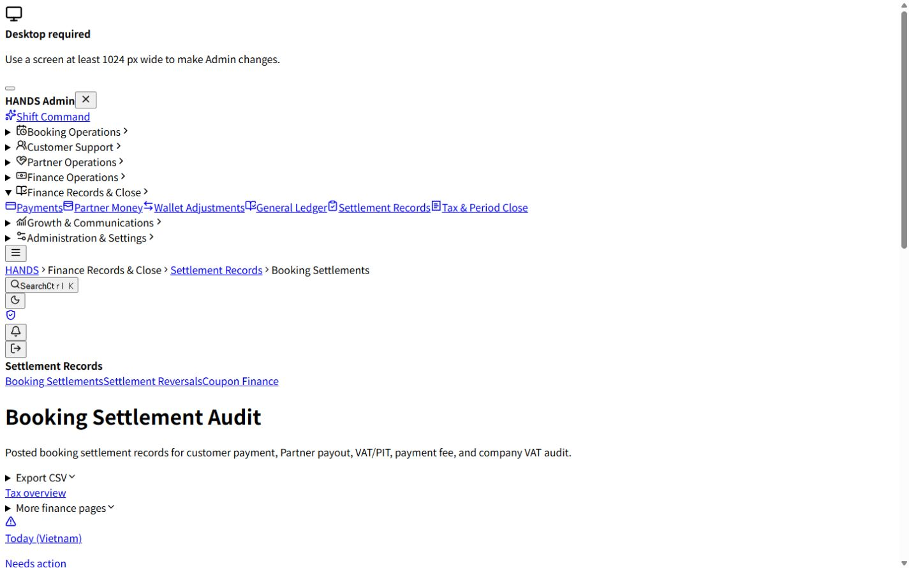

최초 접속에서 Next HTML이 참조한 CSS chunk 하나가 404였고 화면이 unstyled 상태로 열렸다. local admin server를 정상 재시작한 뒤 현재 두 CSS chunk 모두 200이고 정상 스타일로 복구됐다. 이는 Booking Settlement 전용 디자인 결함으로 점수화하지 않았지만, 배포 artifact와 HTML manifest가 어긋나면 모든 관리자 화면이 사용할 수 없어진다는 경고다.

수정 기준:

- 배포는 `.next` artifact를 원자적으로 교체하고 이전 process가 새 HTML/옛 static을 섞어 제공하지 않게 한다.
- smoke test에서 HTML이 참조한 모든 CSS/JS chunk를 200으로 검증한다.
- readiness는 route 200뿐 아니라 필수 static asset 200을 포함한다.
- 이번 감사 종료 시 현재 CSS chunk 두 개는 모두 200임을 재확인했다.

### Step 1 — 기본 Today / Needs action — 건강도 1.3/4

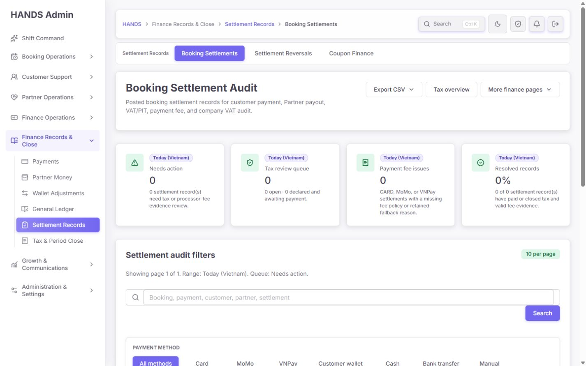

기본 화면은 `Needs action 0`, `Tax review queue 0`, `Payment fee issues 0`, `Resolved 0%`로 보인다. 같은 데이터의 All dates에는 Needs action 200건이 있다. 재무 backlog는 오늘 생성된 기록만 보는 activity가 아니라 “아직 해결되지 않은 모든 의무”이므로 날짜 filter가 action queue를 가리면 안 된다.

또한 `0 of 0`인데 Resolved card는 green `0%`를 보여 성공 신호처럼 보인다. 진짜 데이터 없음과 0% resolved를 분리해야 한다.

수정 기준:

- 기본 entry를 `range=all&review=open&sort=oldest&take=25`로 바꾸는 것을 권장한다.
- Today는 별도 `Posted today` activity metric으로 제공한다.
- 상단 card는 `Backlog · All dates`, `Today posted`, `Oldest blocker`, `At-risk amount`처럼 scope를 고정해 filter와 독립 여부를 표시한다.
- 0/0은 `No records in scope` neutral tone으로 표시하고 0% success를 금지한다.
- `oldestNeedsActionAt`이 API summary에 이미 있으므로 `Oldest: 60 days`와 SLA 상태를 노출한다.
- Today를 유지한다면 empty state에 `200 older records still need action · View backlog` CTA가 반드시 있어야 한다.

### Step 2 — All dates 전체 backlog — 건강도 2.0/4


All dates로 들어가면 실제 workload가 드러난다. 200 needs action, 199 tax open, 107 payment fee issues, resolved 0/240이다. command card가 크고 읽히는 점은 좋지만 tax와 payment fee만으로 audit 상태를 구성해 journal/clearing/reversal/coupon/bank 문제를 누락한다.

수정 기준:

- card를 `Integrity blockers`, `Tax due`, `Clearing exceptions`, `Reversal exceptions`로 재구성한다.
- payment fee는 Integrity blocker 하위 reason으로 집계하거나 5번째 compact metric으로 둔다.
- 각 card에 `count`, `amount at risk`, `oldest age`, `unassigned count`를 제공한다.
- `Resolved`는 tax/fee만 통과한 상태가 아니라 모든 evidence check가 clear인 상태로 정의한다.
- card click은 exact queue와 sort를 URL에 명시한다.

### Step 3 — 필터 높이와 첫 행 도달 — 건강도 1.5/4

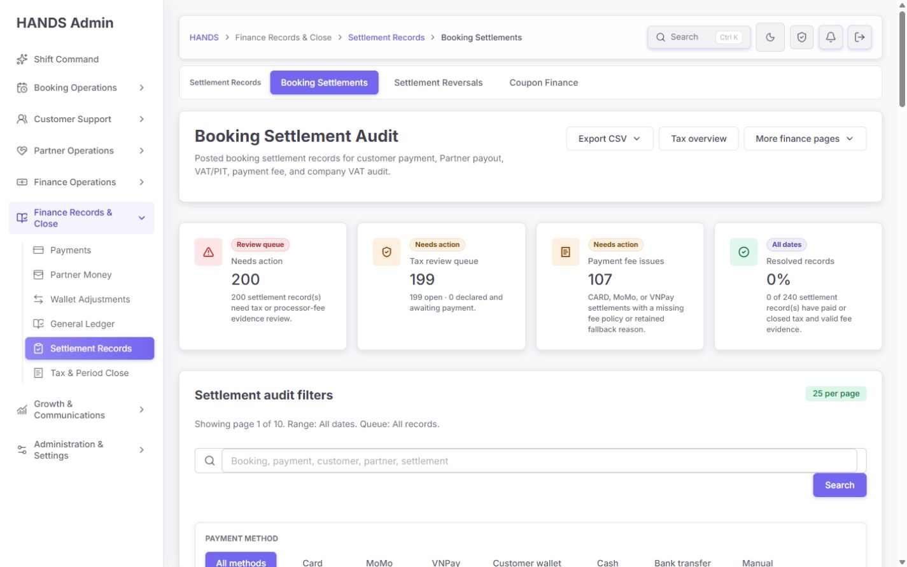

1440×900에서 첫 settlement row의 document Y 좌표는 약 1612px였다. 첫 viewport에는 title, 4개 card, search와 payment method 일부만 보이고 실제 기록은 전혀 보이지 않는다. 25행 화면의 전체 높이는 약 5108px였다. 가로 overflow는 없지만 운영자가 데이터를 보기 전에 두 viewport 가까이 내려가야 한다.

필터는 payment method, range, queue, rows를 각각 큰 full-width panel로 써 공간을 과도하게 소비한다. 현재 화면의 visible interactive control은 sidebar를 포함해 89개였다.

수정 기준:

- command card를 4개 compact strip으로 줄이고 filter를 최대 2행 toolbar로 만든다.
- 1행: Search, Queue, Period/Range, Sort, Reset.
- 2행: Payment method, Rows, Advanced filters, active filter chips.
- 1440×900에서 table header와 최소 첫 행이 초기 viewport 안에 보이도록 한다.
- payment method 8개는 segmented chip 한 줄 또는 select로 만들고 `Manual/Bank transfer/Wallet` 빈도가 낮다면 Advanced에 둔다.
- `Rows`는 25 기본 select 하나로 충분하며 4개 큰 chip row는 제거한다.
- active chips는 변경된 값만 보이고 기본값은 반복하지 않는다.

### Step 4 — All records 선택 — 건강도 0.5/4, 기능 버그

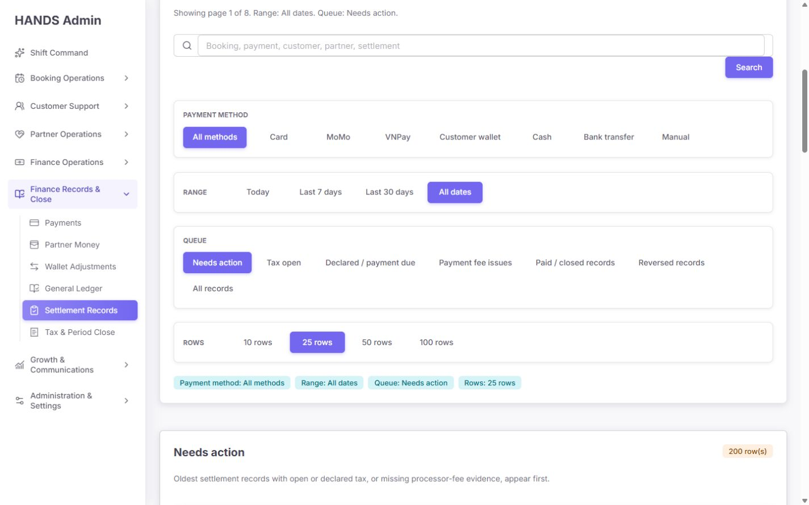

직접 `review=all`을 넣으면 All records가 동작하지만, 화면의 `All records` link를 클릭하면 URL에서 review가 빠지고 다시 `Needs action`이 active 된다. 설명도 `Queue: Needs action`, 결과도 200 needs action으로 돌아간다.

원인은 다음 계약 충돌이다.

- `bookingSettlementAuditHref()`는 `review === 'all'`이면 query param을 생략한다: `tax-settlement-page-model.ts:624-632`.
- `normalizeBookingSettlementReview()`는 누락 review를 `open`으로 해석한다: 같은 파일 `2674-2677`.

수정 기준:

- 명시적 All 선택은 반드시 `review=all`로 직렬화한다.
- direct route 기본값과 explicit All을 구분한다.
- link href → parser → active chip → list API → summary API를 하나의 통합 테스트로 묶는다.
- 다른 Settlement Reversal/Coupon Finance의 all 생략 계약도 같은 오류가 있는지 회귀 검사한다.

### Step 5 — Needs action 목록 — 건강도 2.0/4

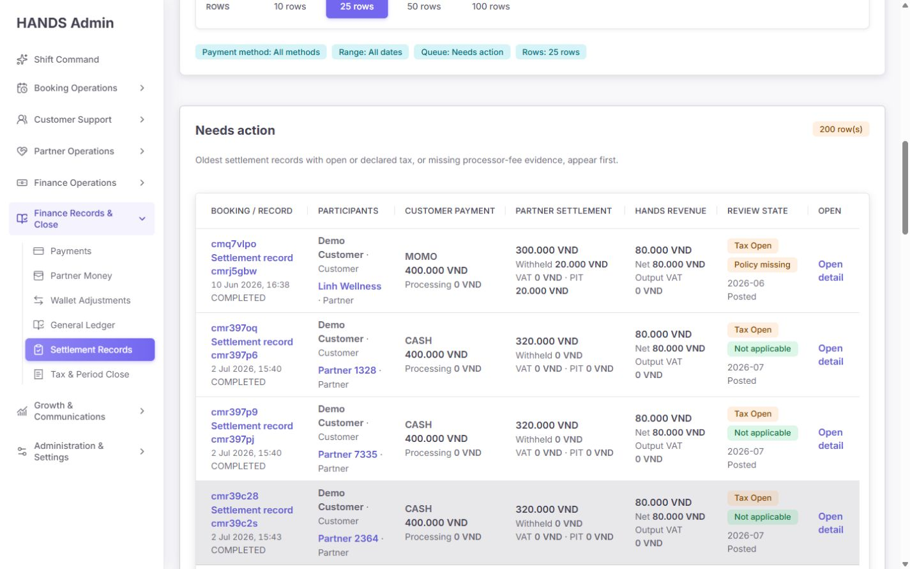

표는 1440px에서 가로 스크롤 없이 읽을 수 있고 오래된 건이 먼저 나온다. 하지만 `Needs action` 이유가 행에서 명확하지 않다. `Tax Open`, `Policy missing`은 보이지만 clearing 누락, journal 유형, reversal, age, owner, exact next action이 없다.

또한 `Customer payment` 열 아래의 `Processing`은 고객에게 부과한 비용처럼 읽힐 수 있지만 회계 정책상 HANDS operating expense다. `Booking / record`에 booking 링크, settlement record 링크, `Open detail` 링크가 반복되고 Customer는 링크가 아닌데 Partner만 링크다.

수정 기준:

- 첫 열의 settlement record title을 primary link 하나로 만들고 booking은 secondary context로 둔다.
- 마지막 `Open` 열을 제거하거나 primary action을 `Review blockers` 하나로 통일한다.
- Customer와 Partner 모두 profile link를 제공한다.
- `Processing`은 `Processor fee · HANDS expense`로 바꾸고 HANDS cost column 또는 evidence cell에 둔다.
- Review state는 `Highest blocker`, `N more`, `Owner`, `Age`, `Next action`을 보여 준다.
- tax/settlement/payment enum은 human label로 통일한다.
- 금액은 우측 정렬하고 customer/partner/HANDS 세 그룹의 합계 관계를 더 쉽게 비교하게 한다.

### Step 6 — 이름 검색 — 건강도 1.0/4

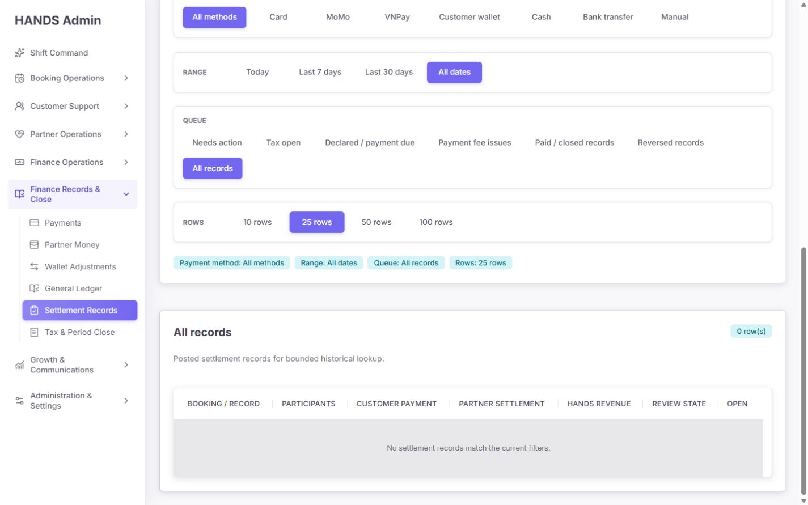

화면 placeholder는 `Booking, payment, customer, partner, settlement`라고 약속한다. 목록에 `Demo Customer`가 다수 보이지만 `Demo Customer`로 검색하면 0건이다. API q는 snapshot id, sourceKey, bookingId, paymentId, customerProfileId, providerProfileId만 `%query% ILIKE`로 검색한다: `admin.service.ts:40243-40253`.

수정 기준:

- 실제 이름 검색을 지원하려면 User/ProviderProfile join 또는 별도 normalized search projection을 사용한다.
- 당장 이름 검색을 만들지 않으면 placeholder를 `Booking, payment, settlement, customer ID or partner ID`로 정직하게 바꾼다.
- exact ID는 contains 검색보다 먼저 처리하고 exact match를 최상단 또는 직접 상세 이동한다.
- 검색어를 active chip `Search: Demo Customer ×`로 노출한다.
- 0건 상태에서 `Clear search`와 `Reset all filters`를 분리한다.
- `%term% ILIKE`는 데이터 증가 시 일반 B-tree index를 활용하기 어렵다. exact/prefix와 이름 검색을 분리하고 실제 규모가 커질 때만 trigram index를 검토한다.

### Step 7 — 정상/지급 완료 상세 상단 — 건강도 2.0/4

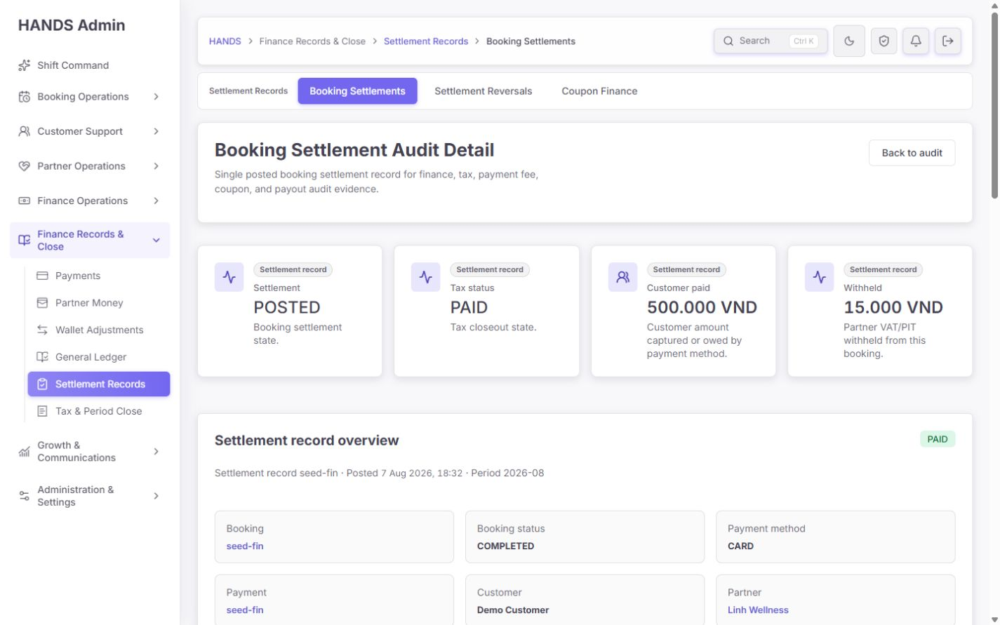

Settlement `POSTED`, tax `PAID`, customer paid 500,000 VND, withheld 15,000 VND를 상단에서 읽을 수 있고 booking/payment/partner 연결도 있다. 다만 4개의 큰 metric card가 overview와 중복돼 첫 결정 정보를 늦춘다. Customer는 profile link가 없고 short ID를 full ID로 복사할 수 없다.

수정 기준:

- 상단을 `Overall audit decision strip`으로 바꿔 Clear / Action required / Unknown / Reversed를 하나만 표시한다.
- 바로 옆에 `Highest blocker`, `Owner`, `Age`, `Checked at`, `Next workflow`를 둔다.
- settlement/tax/amount metric 반복은 overview에 통합한다.
- customer profile link를 추가하고 booking/payment/snapshot full ID copy action을 제공한다.
- `Back to audit`는 `Back to results`로 바꾸고 정확한 return context를 보존한다.

### Step 8 — 증거 hub — 건강도 1.2/4

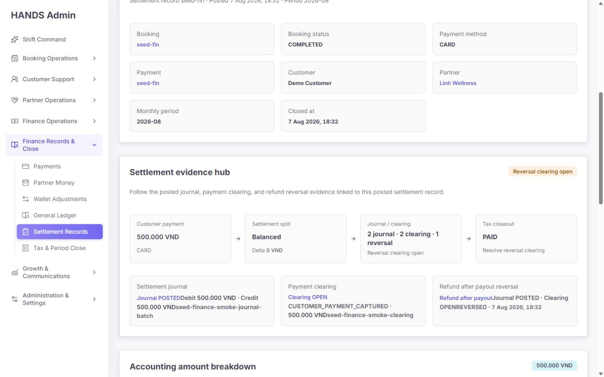

고객 결제 → 정산 split → journal/clearing → tax closeout 흐름을 한 줄로 표현한 방향은 좋다. seed record는 reversal clearing open을 warning으로 보여 준다. 그러나 counts만 표시하고 실제 증거의 역할과 상태를 검증하지 않는다.

`SettlementJournalEvidence`와 `PaymentClearingEvidence`는 각각 배열의 첫 번째만 사용한다. API는 최신 3개를 내려 주지만 UI는 2개 이상일 때 나머지를 숨긴다. 실제 41건이 journal 2개, clearing 2개를 가진다. 정상 journal과 reversal journal을 sourceType으로 구분하지 않아 latest reversal을 `Settlement journal`이라고 표시할 수 있다.

문구도 `Journal POSTEDDebit 500.000 VND`, `Clearing OPENCUSTOMER_PAYMENT_CAPTURED`, source key가 붙어 읽힌다.

수정 기준:

- canonical settlement journal: `sourceType === BOOKING_SETTLEMENT`.
- reversal journal: `sourceType === BOOKING_SETTLEMENT_REVERSAL`.
- canonical clearing과 `REFUND_REVERSAL` clearing을 유형별로 분리한다.
- 배열 첫 건만 보여 주지 말고 type별 대표 + count + `View all evidence`를 제공한다.
- journal은 posted 여부뿐 아니라 entry sum, header↔entry, reconciliation delta account를 검사한다.
- clearing은 status, amount, matched amount, unmatched amount, bank match, age를 검사한다.
- label/value/source ID를 각각 block으로 배치해 글자가 붙지 않게 한다.
- evidence count 자체를 success로 해석하지 않는다.

### Step 9 — Accounting amount breakdown — 건강도 1.4/4

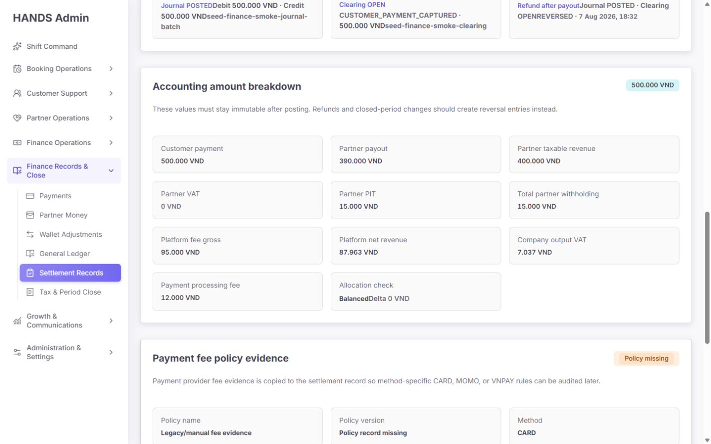

현재 seed record는 `500,000 - 390,000 - 15,000 - 95,000 = 0`이라 Balanced가 맞다. payment processing fee 12,000은 expense/clearing 양쪽에 대칭 기록되므로 이 settlement allocation 공식에서 빼지 않는 현재 방향도 옳다.

그러나 회사 부담 coupon 60,000이 있는 기존 정상 test fixture는 `customerPaymentAmount=540,000`, `partnerPayout=430,000`, `withholding=42,000`, `platformFeeGross=128,000`, `companyCouponExpense=60,000`이다. journal은 600,000/600,000으로 정상인데 현재 UI 공식은 -60,000을 반환한다.

필수 공식:

```text
allocationDelta =
  customerPaymentAmount
  + companyCouponExpense
  - partnerPayoutAmount
  - partnerWithholdingTotal
  - platformFeeGross
```

수정 기준:

- coupon metadata를 먼저 파싱하고 위 공식으로 list/detail/API health를 통일한다.
- 화면에 공식을 사람 문장으로 표시한다: `Customer paid + HANDS coupon expense = Partner payout + withheld tax + platform fee gross`.
- payment processing fee는 `HANDS processor cost`로 별도 비용 검사를 한다.
- journal의 `settlement_reconciliation_delta` entry가 1 VND라도 있으면 green Clear를 금지한다.
- client-only 계산이 아니라 서버에서 raw inputs, expected total, delta, formulaVersion을 반환한다.
- 현재 General Ledger 상세가 payment fee를 allocation에서 차감하는 기존 정의와도 통일해야 한다. settlement journal 기준으로 processing fee는 이 split에서 차감하지 않는다.

### Step 10 — Payment fee와 coupon policy — 건강도 1.2/4

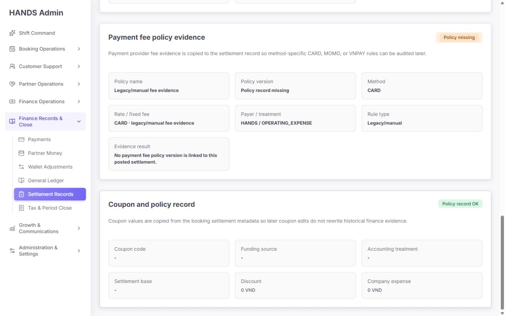

Payment fee panel은 `Policy missing`을 명확히 경고해 좋다. 반면 coupon metadata가 전부 `-`, discount 0, company expense 0인데도 초록색 `Policy record OK`를 표시한다. 현재 local 240건 모두 coupon metadata가 없으므로 대다수 상세가 이 false-success 문구를 보여 준다.

수정 기준:

- coupon code/discount/expense가 모두 없으면 `No coupon applied` neutral로 표시한다.
- coupon가 적용됐는데 funding/accounting/base/version evidence가 없으면 `Coupon evidence missing` danger/warning으로 표시한다.
- `reviewFlag`가 없다는 이유만으로 policy OK로 판단하지 않는다.
- coupon policy version, funding source, accounting treatment, settlement base, discount, company expense, reversal state를 명시적으로 검증한다.
- company coupon이 reversal됐다면 original/reversed expense를 함께 보여 준다.
- raw `HANDS / OPERATING_EXPENSE`는 `Paid by HANDS · Operating expense`로 humanize하고 원 enum은 technical disclosure로 둔다.

### Step 11 — Reversed record 상단 — 건강도 1.5/4

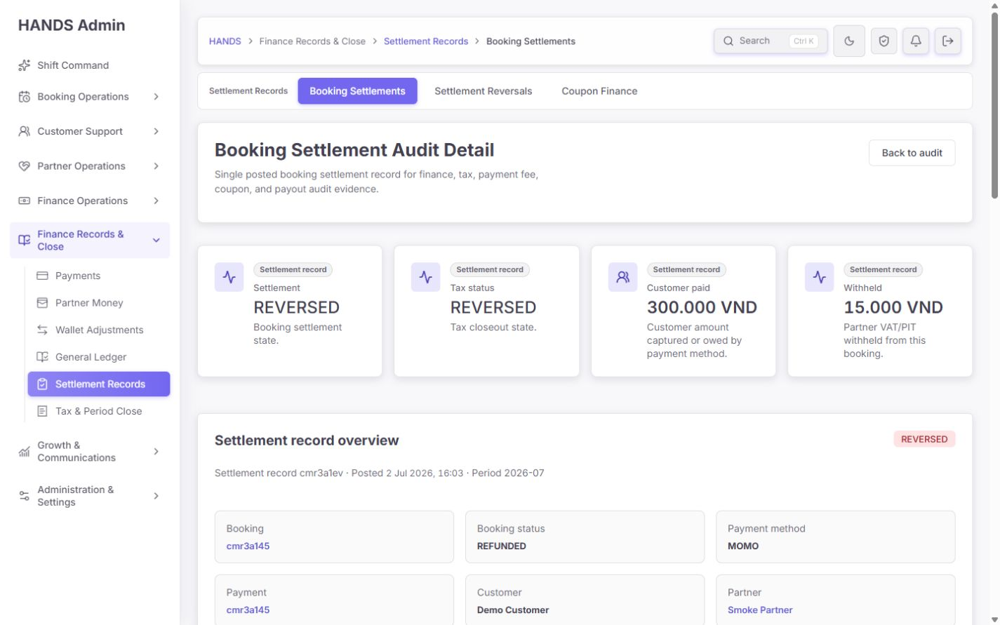

상단은 settlement와 tax가 모두 REVERSED, booking이 REFUNDED임을 올바르게 보여 준다. 이 상태만 보면 운영자는 아래 evidence도 reversal 중심으로 이어질 것으로 기대한다.

수정 기준:

- overall state를 `Reversed · Evidence check required/complete`로 표시한다.
- 일반 tax closeout action을 숨기고 reversal workflow를 primary로 한다.
- reversal reason, actor, reversedAt, original period, reversal period, closed-period 여부를 첫 화면에 제공한다.

### Step 12 — Reversed evidence 판정 — 건강도 0.2/4, P0

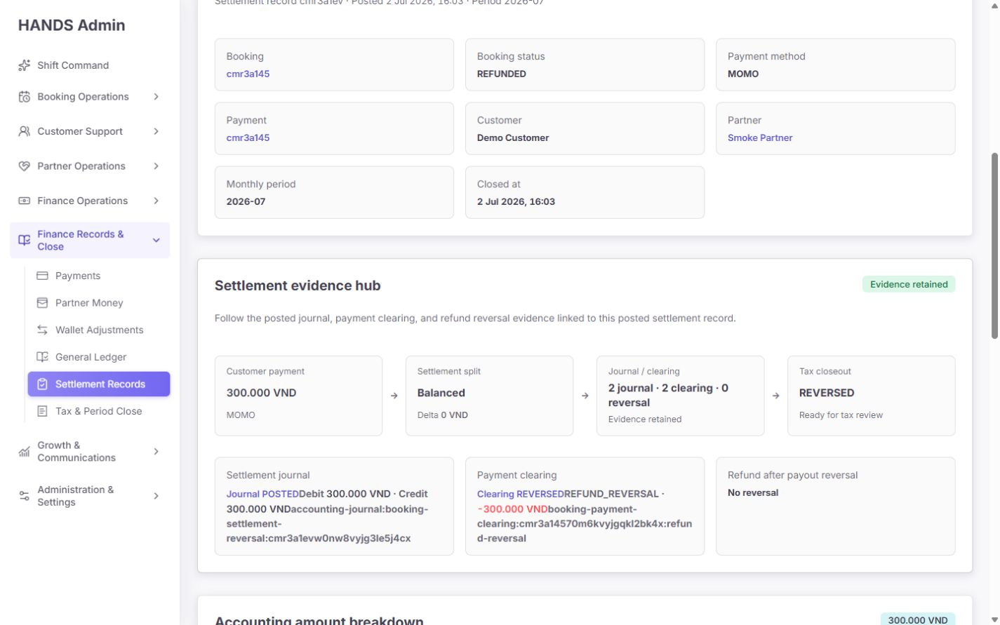

실제 화면에서 다음 모순이 동시에 보였다.

- 상단: Settlement `REVERSED`, Tax `REVERSED`, Booking `REFUNDED`.
- 최신 journal source: `accounting-journal:booking-settlement-reversal:...`.
- 최신 clearing type/status: `REFUND_REVERSAL · REVERSED · -300,000 VND`.
- panel result: 초록색 `Evidence retained`.
- count: `2 journal · 2 clearing · 0 reversal`.
- next action: `Ready for tax review`.
- reversal card: `No reversal`.
- reversal journal을 `Settlement journal`, refund clearing을 `Payment clearing`으로 잘못 라벨링.

read-only DB에서 reversed snapshot 40건 모두 `BookingSettlementReversalEntry`는 없지만 `BOOKING_SETTLEMENT_REVERSAL` journal이 존재했다. 현재 detail은 새로운 `reversalEntries` relation만 reversal로 인정하고 기존 open-period reversal evidence를 지원하지 않는다.

필수 수정:

1. reversal state branch를 `settlementNextAction()`의 가장 앞에 둔다.
2. open-period legacy reversal과 closed-period `BookingSettlementReversalEntry`를 명시적으로 구분한다.
3. `settlementStatus/taxStatus/reversalReason/reversedById/reversal journal/refund clearing`을 함께 읽는 server health를 만든다.
4. reversal journal을 canonical settlement journal로 표시하지 않는다.
5. `No reversal`은 어떤 reversal 신호도 없을 때만 허용한다.
6. reversed record가 tax review queue로 돌아가지 않게 한다.
7. reversal evidence가 완전하면 `Reversal evidenced`, 불완전하면 `Reversal incomplete`를 표시한다.
8. 40개 기존 record를 migration 없이도 legacy evidence로 읽을 수 있게 하고, 별도 backfill이 필요하면 원본을 덮어쓰지 않는 audit report부터 만든다.

### Step 13 — Export menu — 건강도 1.1/4

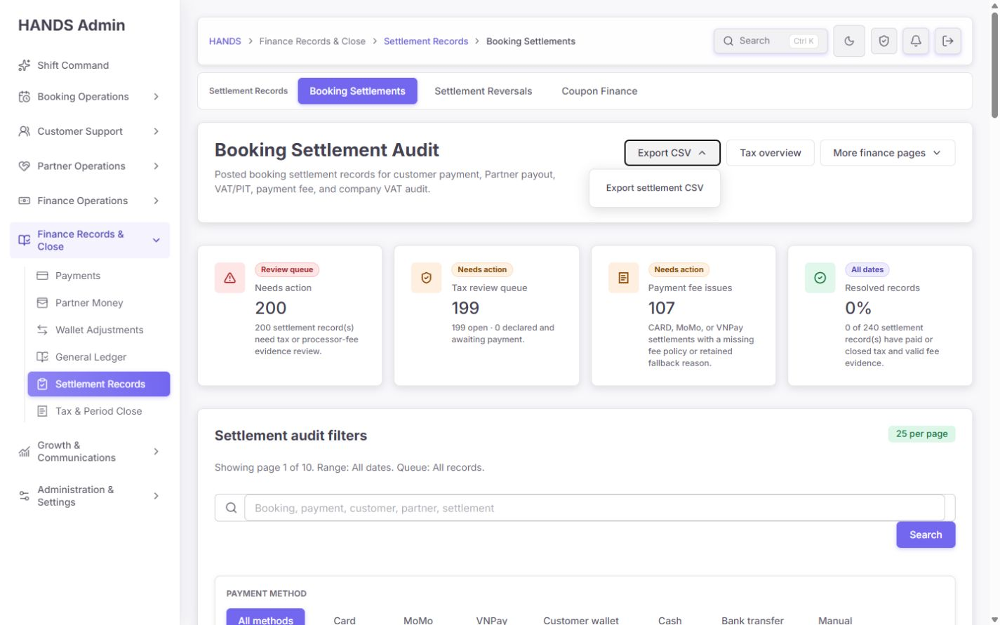

Export는 dropdown 한 단계 안에 있고 current href는 `range=all&review=all&take=25`였다. CSV route도 page/take 그대로 list API를 호출하므로 240건 중 첫 25건만 내보낸다. 파일명과 label은 current page export임을 말하지 않는다.

추가 코드 문제:

- export row에 `customer_phone`, `partner_phone` 원문이 포함된다: `tax-settlement-page-model.ts:2302-2335`.
- `requireAdminWebAccess()`만 확인하고 export-specific role/audit log가 없다.
- `adminGet(..., [])` 실패가 HTTP 200 header-only CSV가 된다: export route `24-40`.
- generatedAt, timezone, operator, filter summary, audit health, blocker code, canonical/reversal evidence가 없다.
- native details menu는 Escape를 눌러도 닫히지 않았다.

수정 기준:

- label을 `Export filtered results`로 바꾸고 예상 행 수를 `240 rows`로 표시한다.
- page/take가 아닌 전체 filtered result를 bounded async export로 생성한다.
- 소량이면 server cursor/page loop를 사용하되 최대 행 수와 timeout을 명시한다.
- 기본 CSV는 phone을 제외하거나 masked로 제공한다. 원문 PII export는 별도 역할·사유·audit log가 있어야 한다.
- export API failure는 502/503과 JSON/UX error로 반환하고 빈 성공 파일을 금지한다.
- generatedAt, timezone, generatedBy, filters, sort, auditState, blockers, formula inputs/delta, journal/clearing/reversal IDs를 포함한다.
- Escape, outside click, ArrowUp/Down, Home/End, focus return을 지원하는 공용 ActionMenu로 교체한다.

### Step 14 — 상세에서 목록 복귀 — 건강도 1.0/4

상세의 `Back to audit`는 항상 `/finance-tax/booking-settlement-audit?range=30d&review=open&take=25`다. All dates, All records, search, payment method, period, page, rows 문맥을 모두 잃는다.

수정 기준:

- list의 detail href에 현재 상대 경로를 `returnTo`로 전달한다.
- `safeBookingSettlementAuditReturnTo()`는 `/finance-tax/booking-settlement-audit` 내부 상대 URL만 allowlist한다.
- q/range/review/paymentMethod/period/page/take/sort를 보존한다.
- `Back to results` 후 이전 row로 focus와 scroll을 복원한다.
- payment clearing에 이미 있는 safe returnTo 패턴을 재사용하고 새로운 범용 router를 과도하게 만들지 않는다.

## 7. P0/P1 코드 감사 결과

### P0-1. Reversal evidence의 source 분류 실패

근거:

- detail API는 journal/clearing/reversal을 각각 최신 3개 가져온다: `admin.service.ts:1263-1323`.
- UI는 `accountingJournalBatches?.[0]`, `paymentClearingEntries?.[0]`, `reversalEntries?.[0]`만 사용한다: detail `286-365`.
- `settlementEvidenceStatus()`는 journal/clearing의 존재 여부만 보고, reversal은 `reversalEntries`만 본다: detail `368-387`.
- 실제 reversed 40건은 모두 reversal journal이 있지만 reversalEntries가 없다.
- 그 결과 screenshot Step 12의 상호 모순이 발생한다.

영향:

- 환불된 정산을 정상 evidence retained로 오인한다.
- reversal journal/clearing을 원 settlement 증거로 잘못 읽는다.
- tax reversed record에 Ready for tax review라는 잘못된 다음 행동을 준다.

필수 조치:

- sourceType/type/relation을 반영한 server-side evidence classifier를 만든다.
- legacy open-period reversal과 closed-period reversal entry를 함께 지원한다.
- UI가 배열 순서에 따라 증거 의미를 정하지 않게 한다.
- list/summary/detail/reversal workspace가 동일한 classifier 결과를 사용한다.

### P1-1. Needs action / Resolved 정의가 Audit 목적보다 좁음

현재 API 정의:

- Needs action: non-reversed + tax OPEN/DECLARED 또는 processor fee issue.
- Resolved: settlement POSTED + tax PAID/CLOSED + processor fee issue 없음.
- processor fee issue: CARD/MOMO/VNPAY + policyVersion null 또는 retained reason.

근거: `admin.service.ts:40292-40327`.

누락된 blocker:

- missing canonical journal
- journal status/entry/header mismatch
- `settlement_reconciliation_delta`
- missing/partial/open canonical clearing
- clearing amount mismatch
- missing bank match 또는 unmatched amount
- coupon allocation/policy evidence mismatch
- reversal journal/clearing 누락 또는 상태 모순
- monthly period/closing state mismatch
- full allocation formula delta

`Resolved`는 위 모든 check가 clear이거나 정책상 not applicable일 때만 허용해야 한다. 계산하지 않은 값은 success가 아니라 `UNKNOWN`이다.

### P1-2. Coupon-aware allocation 공식 누락

현재 detail `settlementAllocationDelta()`는 다음만 계산한다: detail `418-424`.

```text
customerPayment - partnerPayout - withholding - platformFeeGross
```

Settlement journal은 `companyCouponExpense`를 debit marketing expense로 추가하며 정상 test에서 reconciliation delta 0을 보장한다: `settlement-journal.ts:33-168`, `settlement-journal.spec.ts:60-95`, `137-168`.

따라서 formula version과 coupon expense를 포함한 서버 계산이 필요하다. payment processing fee는 expense와 clearing에 대칭이므로 allocation split에서 빼면 안 된다.

### P1-3. Today default가 compliance backlog를 숨김

page default range는 Today이고 overview summary도 그 range를 사용한다. 실제 all-date Needs action 200건과 oldest 2026-06-10이 기본 화면에서 모두 0으로 보인다.

actionable queue는 unresolved lifecycle이므로 range를 적용하지 않거나 `created/posting activity range`와 `unresolved backlog`를 분리해야 한다.

### P1-4. All records 직렬화/파싱 계약 충돌

`bookingSettlementAuditHref()`는 all을 생략하고 parser는 누락을 open으로 읽는다. explicit state는 explicit query로 유지하고 reload-safe integration test를 추가해야 한다.

### P1-5. 이름 검색 약속과 API 범위 불일치

placeholder는 customer/partner를 약속하지만 q는 profile ID만 검색한다. 이름 검색을 구현하거나 문구를 실제 범위에 맞춰야 한다.

### P1-6. API failure가 empty/404로 위장

- 목록은 3개 `adminGet()`에 empty summary와 `[]` fallback을 사용한다: page `60-72`.
- `adminGet()`은 `adminGetResult`의 `ok/status`를 버린다: `admin-api.ts:5940-5975`.
- detail은 upstream failure도 `null`이 되어 `notFound()`가 된다: detail `38-43`.
- export도 실패를 200 empty CSV로 바꾼다.

수정:

- page/detail/export 모두 `adminGetResult`를 사용한다.
- 404, 401/403, 5xx/network, true empty를 구분한다.
- summary 일부 실패 시 표를 유지하고 해당 card만 degraded로 표시한다.
- `Data unavailable · Retry · Reference ID`를 제공한다.
- stale/last successful timestamp를 표시하되 stale data를 current green으로 보이지 않는다.

### P1-7. Export scope·PII·감사 로그 문제

현재 export는 active page/take만 반환하고 phone 원문을 포함한다. export-specific permission, audit log, reason, row count preview, expiration도 없다. 화면과 동일한 health contract를 사용하지도 않는다.

### P1-8. Period filter가 URL을 통해 들어왔을 때만 보임

page는 `filters.period`가 이미 있을 때만 `Period YYYY-MM / All periods` links를 렌더한다: page `188-210`. 화면 자체에는 month picker가 없어 사용자가 이 route에서 period를 설정할 수 없다.

수정:

- Month select 또는 period picker를 항상 보이는 filter로 둔다.
- period와 posting date range를 혼동하지 않도록 각각 `Accounting period`, `Posted date`로 라벨한다.
- Tax overview에서 진입한 period를 보존하고 목록에서 바꿀 수 있게 한다.

### P1-9. 목록·상세 context 상실

detail href는 snapshot id만 포함하고 Back link는 30d/open/25를 하드코딩한다. 조사 흐름의 비용이 크므로 safe returnTo가 필요하다.

## 8. 권장 정보 구조

현재 세 개 상위 tab을 한 거대한 표로 합치지는 않는 것이 좋다. 서로 다른 record lifecycle이므로 **한 workspace 안의 별도 view**가 적합하다.

```text
Settlement Records
├─ Integrity Exceptions  ← 기본 운영 진입
│  ├─ Missing/invalid journal
│  ├─ Allocation mismatch
│  ├─ Clearing/bank mismatch
│  ├─ Tax/period mismatch
│  ├─ Fee/coupon evidence
│  └─ Reversal incomplete
├─ Booking Settlements
│  ├─ All canonical settlement records
│  └─ read-only historical lookup
├─ Settlement Reversals
│  ├─ Open-period legacy reversal
│  └─ Closed-period reversal entries
└─ Coupon Finance
   ├─ Company-funded coupon expense
   └─ Coupon policy/reversal evidence
```

현재 sidebar의 `Settlement Records`는 유지하되 route 기본은 `Integrity Exceptions`가 적합하다. Tax open/declared의 소유권은 `Tax & Period Close`에 두고 이 페이지는 tax evidence 상태와 deep link만 제공한다. Payment Clearing와 General Ledger도 별도 전문 workspace를 유지하며 settlement detail은 이들을 연결하는 trace hub가 된다.

권장 URL:

- `/finance-tax/booking-settlement-audit?view=exceptions&range=all&sort=oldest`
- `/finance-tax/booking-settlement-audit?view=records&review=all&period=2026-08`
- `/finance-tax/settlement-reversals?review=incomplete&sort=oldest`
- `/finance-tax/coupon-finance?review=needs-evidence&period=2026-08`

## 9. 서버 권위 Audit Health 계약

UI마다 임의 계산하지 말고 API에서 다음과 같은 계약을 반환해야 한다.

```ts
type SettlementAuditHealth = {
  state: 'CLEAR' | 'ACTION_REQUIRED' | 'REVERSED_CLEAR' | 'UNKNOWN';
  checkedAt: string;
  formulaVersion: string;
  blockers: Array<{
    code:
      | 'ALLOCATION_DELTA'
      | 'CANONICAL_JOURNAL_MISSING'
      | 'JOURNAL_ENTRY_MISMATCH'
      | 'RECONCILIATION_DELTA_ENTRY'
      | 'CANONICAL_CLEARING_MISSING'
      | 'CLEARING_AMOUNT_MISMATCH'
      | 'BANK_MATCH_INCOMPLETE'
      | 'PAYMENT_FEE_POLICY_MISSING'
      | 'COUPON_EVIDENCE_MISSING'
      | 'TAX_PERIOD_MISMATCH'
      | 'REVERSAL_EVIDENCE_INCOMPLETE';
    severity: 'BLOCKER' | 'WARNING';
    amount?: number;
    ownerTeam: string;
    nextAction: string;
  }>;
  allocation: {
    customerPayment: number;
    companyCouponExpense: number;
    partnerPayout: number;
    partnerWithholding: number;
    platformFeeGross: number;
    delta: number;
  };
  canonicalJournal: EvidenceState;
  canonicalClearing: EvidenceState;
  reversal: EvidenceState;
  tax: EvidenceState;
  feePolicy: EvidenceState;
  couponPolicy: EvidenceState;
};
```

규칙:

- list, summary, detail, queue count, closeout preflight, export가 같은 함수/SQL projection을 사용한다.
- UNKNOWN을 green success로 바꾸지 않는다.
- reversal은 canonical evidence와 별도 분류한다.
- aggregate 계산을 per-row N+1로 구현하지 않는다. SQL CTE/grouped projection 또는 유지 가능한 materialized health projection을 사용한다.
- 원본 회계 record를 자동 수정하지 않고 health는 파생 데이터로 계산한다.

## 10. 권장 목록 화면 구성

### 첫 viewport

1. title + last checked + export
2. compact decision strip
   - Blockers
   - Amount at risk
   - Oldest age
   - Unassigned
3. compact filter toolbar
4. table header + 첫 행

### 항상 보이는 filter

- View: Exceptions / All records
- Queue
- Accounting period
- Posted date preset 또는 custom from/to
- Search
- Sort: Oldest blocker / Largest amount / Newest / Oldest
- Reset all

### Advanced filter

- Payment method
- settlement/tax status
- audit blocker code
- journal/clearing/reversal/bank evidence state
- customer/partner/booking/payment/snapshot exact ID
- customer/partner name
- amount range
- owner/assignment
- currency

### 권장 table columns

1. Record: settlement ID, booking, period, posted time
2. Parties: customer/partner links
3. Money split: customer + coupon, payout, withholding, fee gross
4. Evidence: canonical journal, clearing/bank, reversal
5. Highest blocker: code, amount, age
6. Owner / next action
7. Review

## 11. 권장 상세 화면 구성

1. `Audit decision strip`
   - final state
   - highest blocker
   - checked at
   - owner
   - next action
2. `Record identity`
   - snapshot/booking/payment/customer/partner
   - period, posted, closed/reversed
3. `Allocation equation`
   - customer paid + company coupon = payout + withholding + fee gross
   - delta and formula version
4. `Canonical settlement evidence`
   - settlement journal and entries integrity
   - settlement clearing and bank match
5. `Reversal evidence`
   - legacy/open-period vs closed-period type
   - reversal reason/actor/time
   - journal/clearing/amount/period
6. `Tax and policy evidence`
   - tax state and linked monthly close
   - payment fee policy
   - coupon policy
7. `Technical evidence`
   - raw enums, source keys, immutable metadata, copy IDs

운영자는 첫 화면에서 “정상인가, 무엇이 차단됐나, 누가 무엇을 해야 하나”를 판단하고, technical metadata는 필요할 때만 펼쳐야 한다.

## 12. 문구 개선안

| 현재 | 권장 |
|---|---|
| Booking Settlement Audit | Settlement Integrity 또는 실제 health 완성 후 유지 |
| Needs action | Integrity exceptions |
| Tax review queue | Tax evidence due |
| Resolved records | Integrity clear |
| 0% (0 of 0) | No records in scope |
| Customer payment / Processing | Customer paid / Processor fee · HANDS expense |
| HANDS revenue | Platform fee gross / Net revenue / Output VAT |
| Open detail | Review blockers |
| Settlement split · Balanced | Allocation equation · Clear |
| Evidence retained | Evidence present / Integrity clear를 구분 |
| Ready for tax review (REVERSED) | Reversal evidence complete 또는 Resolve reversal evidence |
| No reversal | No reversal recorded, 단 reversal signal이 전혀 없을 때만 |
| Policy record OK (no coupon) | No coupon applied |
| Legacy/manual fee evidence | Legacy fee record · Policy link missing |
| Export settlement CSV | Export filtered results · N rows |
| Back to audit | Back to results |

Raw enum은 기본 화면에서 `Customer payment captured`, `Refund reversal`, `Operating expense`, `Booking settlement reversal`로 humanize하고 원문은 copy 가능한 technical value로 제공한다.

## 13. 접근성 감사

확인된 강점:

- h1/h2 구조, search accessible label, table column header가 있다.
- 상태는 텍스트를 병행한다.
- filter group에 accessible name이 있다.
- 1440px에서 가로 overflow가 없다.

개선 필요:

1. Export native details는 Escape로 닫히지 않았다. menu role을 유지하려면 ArrowUp/Down, Home/End, Escape, outside click, focus return을 완성한다.
2. 긴 source key와 여러 inline value가 붙어 읽힌다. label/value/source를 semantic block으로 분리한다.
3. 첫 결과가 초기 viewport 밖에 있어 keyboard와 확대 사용자에게 탐색 비용이 크다. skip link 또는 결과 heading focus target을 제공한다.
4. GET search/filter 후 결과 heading 또는 empty state로 focus를 이동하거나 live result count를 알린다.
5. API error state와 retry가 없어 오류를 스크린리더에 알릴 수 없다.
6. table region 공용 이름이 다른 finance table과 반복되지 않도록 `Booking settlement audit results`처럼 고유 이름을 준다.
7. status 색은 유지하되 `Clear/Blocked/Unknown/Reversed` 텍스트와 icon을 같이 사용한다.
8. full ID copy button은 명확한 accessible name과 성공 announcement를 제공한다.

본 감사는 1440px 실제 DOM·keyboard·화면을 결합한 검사이며 완전한 WCAG 인증이나 스크린리더 전체 실기는 아니다.

## 14. 오류·빈 상태 명세

반드시 구분해야 할 상태:

- Today 진짜 0건: `No settlements posted today` + backlog CTA.
- 검색 0건: 검색어 표시 + Clear search + Reset filters.
- API summary 일부 실패: failed card만 unavailable, table은 유지.
- list API 실패: `Settlement data unavailable · Retry`.
- detail true 404: `Settlement record not found`.
- detail 5xx/network: `Settlement record could not be loaded` — 404로 위장 금지.
- evidence 미검사: `Not checked` neutral/unknown.
- evidence 없음: blocker.
- export 실패: non-2xx + 오류 안내, empty successful CSV 금지.
- no coupon: neutral `No coupon applied`, success policy로 표현 금지.

## 15. 성능·확장성

현재 목록은 매 render마다 다음 live/no-store 요청 3개를 병렬 실행한다.

1. current queue summary
2. search와 독립인 overview summary
3. list rows

240건에서는 버틸 수 있지만 다음을 개선할 수 있다.

- list contract를 `rows + total + currentQueueSummary`로 합쳐 동일 WHERE의 중복을 줄인다.
- overview는 scope를 명시하고 15~30초 aggregate cache를 검토한다.
- search가 있더라도 overview는 검색을 무시하므로 UI에 `All records in scope`라고 표시한다.
- audit health를 list에 추가할 때 relation 전체 hydrate 또는 per-row N+1을 금지한다.
- exact ID 검색과 name search를 구조화한다.
- 현재 schema의 `[monthlyPeriod,taxStatus]`, `[settlementStatus,postedAt]`, `[paymentMethod,postedAt]` index는 기본 filter에 도움 된다.
- unresolved all-date queue가 핵심이면 `taxStatus/settlementStatus/postedAt` 조합과 실제 query plan을 측정한 후 index를 조정한다.
- CSS/JS chunk readiness 검사로 stale build artifact를 막는다.

## 16. 구현 우선순위

### P0 — 재무 진실성

1. canonical settlement journal/clearing과 reversal journal/clearing을 sourceType/type으로 분류한다.
2. legacy open-period reversal과 closed-period reversal entry를 모두 지원한다.
3. reversed 40건의 `Evidence retained / 0 reversal / No reversal / Ready for tax review` 모순을 제거한다.
4. server-side `settlementAuditHealth`를 만들고 list/summary/detail/reversal/closeout/export에서 공유한다.
5. green success는 모든 필수 check가 clear일 때만 허용하고 unknown을 success로 금지한다.

### P1 — 정확성·운영 생산성

6. coupon-aware allocation formula와 formulaVersion을 구현한다.
7. Needs action/Resolved에 journal, clearing, bank, coupon, reversal, tax, allocation blocker를 모두 반영한다.
8. default action queue를 All dates backlog로 바꾸고 Today activity와 분리한다.
9. All records를 explicit `review=all`로 수정한다.
10. customer/partner name 검색을 구현하거나 placeholder를 정확히 수정한다.
11. accounting period picker, custom date, sort, reset all을 추가한다.
12. `adminGetResult`로 API failure와 empty/404를 분리한다.
13. safe returnTo로 목록 문맥을 보존한다.
14. 전체 filtered export, PII 권한, audit log, error status를 구현한다.

### P2 — 화면 밀도·문구·접근성

15. first row가 1440×900 초기 viewport에 보이도록 command/filter 높이를 줄인다.
16. 중복 record/detail links를 정리하고 customer link를 추가한다.
17. processing fee를 HANDS expense로 명확히 라벨한다.
18. inline 문구 붙음과 source key wrapping을 수정한다.
19. coupon 없음은 neutral state로 바꾼다.
20. Export/More finance menu keyboard contract를 완성한다.
21. 고유 table label, focus 이동, live result announcement를 추가한다.

## 17. 수용 기준

- [ ] reversed snapshot에서 canonical journal과 reversal journal이 서로 다른 card에 표시된다.
- [ ] `BOOKING_SETTLEMENT_REVERSAL` journal과 `REFUND_REVERSAL` clearing이 있는데 `No reversal`이 표시되지 않는다.
- [ ] reversed record next action이 `Ready for tax review`가 아니다.
- [ ] 현재 40개 reversed record가 `Reversal evidenced` 또는 구체적 `Reversal incomplete`로 분류된다.
- [ ] list, summary, detail, reversal, closeout, CSV가 같은 audit health를 사용한다.
- [ ] missing journal/clearing, reconciliation delta, allocation delta, coupon evidence, reversal incomplete가 Needs action에 포함된다.
- [ ] 모든 필수 check가 clear가 아니면 green `Integrity clear`가 표시되지 않는다.
- [ ] company coupon fixture 540k + 60k - 430k - 42k - 128k가 delta 0이다.
- [ ] payment processing fee는 allocation 식에서 차감되지 않고 별도 HANDS expense로 표시된다.
- [ ] direct route default와 explicit All records가 reload 후 각각 정확히 유지된다.
- [ ] 기본 action 화면에서 200건 backlog와 oldest age를 볼 수 있다.
- [ ] 1440×900 초기 viewport에 table header와 첫 결과 행이 보인다.
- [ ] `Demo Customer` 이름 검색을 지원하거나 placeholder에서 이름 약속을 제거한다.
- [ ] accounting period를 이 화면에서 직접 선택할 수 있다.
- [ ] detail의 Back to results가 q/range/review/paymentMethod/period/page/take/sort를 모두 복원한다.
- [ ] API 5xx/network가 0건 또는 404로 보이지 않는다.
- [ ] export는 전체 filtered row count를 사전에 보여 주고 현재 page에 제한되지 않는다.
- [ ] 기본 export에서 phone 원문을 제외하거나 export-specific 권한·사유·audit log를 요구한다.
- [ ] export failure가 200 empty CSV가 아니다.
- [ ] no coupon record가 `Policy record OK` success로 보이지 않는다.
- [ ] Export menu가 Escape로 닫히고 focus가 trigger로 돌아간다.

## 18. 필수 테스트 보강

실행 결과:

```text
Admin Web
6 files, 121 tests passed

API booking settlement
1 file, 7 tests passed, 583 skipped
```

기존 테스트가 통과해도 이번 결함을 막지 못한다. 다음 테스트가 필요하다.

- explicit All link → parser → active chip → list/summary API 통합 계약
- Today 0 + all-date backlog empty-state CTA
- customer/partner name search 또는 정확한 placeholder contract
- period picker URL round-trip
- canonical vs reversal journal classification
- canonical vs refund reversal clearing classification
- legacy reversed snapshot without `reversalEntries`
- reversed next action과 result tone
- multiple journal/clearing을 첫 배열 요소로만 오인하지 않음
- missing journal/clearing and reconciliation delta blocker
- company-funded coupon allocation delta 0
- no coupon neutral vs coupon evidence missing
- API 500/network vs true empty/404
- safe returnTo allowlist와 full context 복원
- export all filtered rows vs current page
- export 5xx propagation
- export PII role/audit log
- menu Escape/Arrow focus behavior
- 1440×900 first-row visual regression

Impeccable 기계 검사는 이 페이지 전용 치명 스타일 패턴을 추가로 찾지 못했고, 전역 CSS의 다른 화면에 속한 side-tab 경고만 보고했다. 이번 핵심 문제는 정규식 스타일 검사보다 실제 데이터, source type, 회계 journal, URL 상태, export 코드를 교차 검증하면서 발견됐다.

## 19. 코드·데이터 관찰

- `BookingSettlementSnapshot`에는 `[customerProfileId,postedAt]`, `[providerProfileId,postedAt]`, `[monthlyPeriod,taxStatus]`, `[settlementStatus,postedAt]`, `[paymentMethod,postedAt]` index가 있다.
- list select는 customer/partner phone 원문을 API에서 가져오지만 UI list에는 노출하지 않고 CSV에서만 노출한다.
- detail select는 journal/clearing/reversal 각 3개를 가져오지만 UI는 첫 건만 표시한다.
- reversal process는 기존 snapshot status를 REVERSED로 바꾸고 같은 snapshot에 reversal journal/clearing을 연결하는 open-period path가 있다. 별도 `BookingSettlementReversalEntry`만 보는 UI는 이 path를 놓친다.
- journal은 `settlement_reconciliation_delta`를 명시적으로 기록해 header를 balance시킨다. 따라서 header debit=credit만으로 integrity clear를 판단하면 안 된다.
- 현재 monthly close allocation도 payment processing fee를 빼지 않아 Booking Settlement의 기본 비-coupon 방향과 일치한다.
- coupon settlement tests는 company-funded coupon만 지원하고 partner/platform-funded coupon은 아직 거부한다. UI는 지원 상태를 technical policy로 명확히 표시해야 한다.

## 20. 검증 범위와 한계

- 실제 settlement, journal, clearing, refund, tax 상태 변경은 수행하지 않았다.
- production 데이터와 외부 회계기준 준수 인증은 확인하지 않았다.
- current local data에는 coupon metadata가 없어 coupon formula 결함은 기존 service/journal test fixture와 실행 경로를 대조해 확정했다.
- API 서버를 의도적으로 중단하거나 권한을 변경하지 않았다. 실패 masking은 코드로 확인했다.
- 스크린리더 전체 실기는 수행하지 않았다.
- 1024px 이하 화면은 사용자 운영 범위 밖이므로 검사·평가·권고에 포함하지 않았다.
- export phone 보존 정책, 재무 역할 분리, SLA 기준은 제품·재무·개인정보 책임자의 승인 대상이다.

## 21. 변경 파일·보호 영역·실행 명령

애플리케이션 소스는 수정하지 않았다. 새로 만든 것은 이 보고서와 화면 증거뿐이다.

보호한 영역:

- dirty worktree의 기존 Admin Web/API/schema 변경
- 실제 정산·분개·clearing·환불·세금 데이터
- 로그인 권한과 운영 설정

주요 실행 검증:

```text
npm.cmd run test --workspace @massage-vn/admin-web --
  app/finance-tax/booking-settlement-audit/page.spec.tsx
  app/finance-tax/booking-settlement-audit/[id]/page.spec.tsx
  app/finance-tax/finance-list-pages.spec.tsx
  app/finance-tax/tax-settlement-page-model.spec.ts
  app/api/admin/finance-tax/booking-settlement-audit/export/route.spec.ts
  app/finance-tax/tax-finance-workflow-actions.spec.tsx

npm.cmd run test --workspace @massage-vn/api --
  src/admin/admin.service.spec.ts -t "booking settlement"
```

read-only DB 질의로 total/queue/evidence/reversal/coupon 현황을 확인했다. local server의 stale CSS chunk 문제는 재시작으로 복구했고 종료 전 두 CSS chunk가 200임을 확인했다.

## 22. 최종 판단

현재 페이지는 “정산 금액 조회와 관련 원장 링크”로는 의미 있는 기반이다. 그러나 운영자가 `Audit`, `Evidence retained`, `Balanced`, `Resolved`를 재무 판단 근거로 쓰기에는 아직 위험하다. 특히 reversed 40건 모두에서 실제 reversal journal/clearing을 보여 주면서도 `0 reversal / No reversal / Ready for tax review`라고 말하는 문제는 가장 먼저 막아야 한다.

첫 릴리스는 **reversal/canonical evidence classifier + 공통 audit health + coupon-aware formula + green success 제한**까지로 잡는 것이 좋다. 두 번째 릴리스에서 **backlog 기본값 + All records + period/name search + returnTo + failure states**, 세 번째에서 **전체 filtered export + PII 권한 + compact 1440 layout**을 완성하는 순서를 권장한다.
