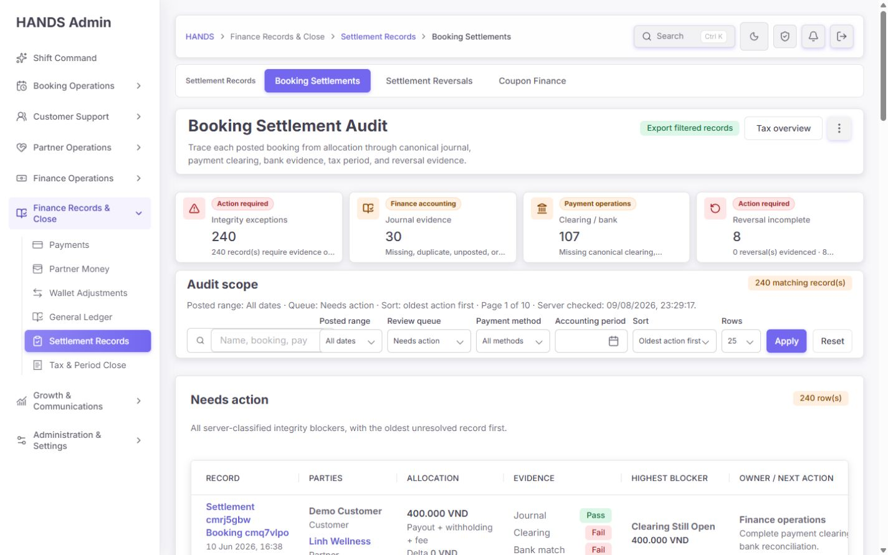
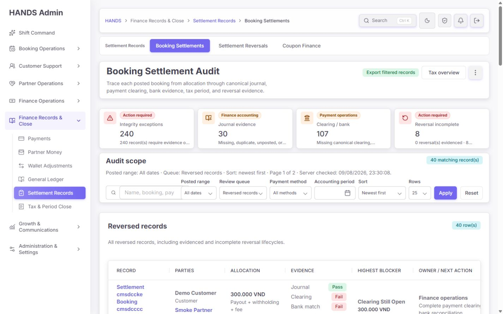
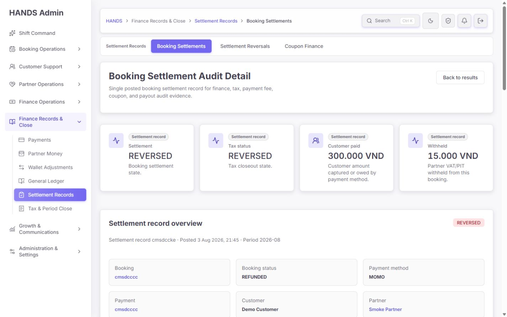
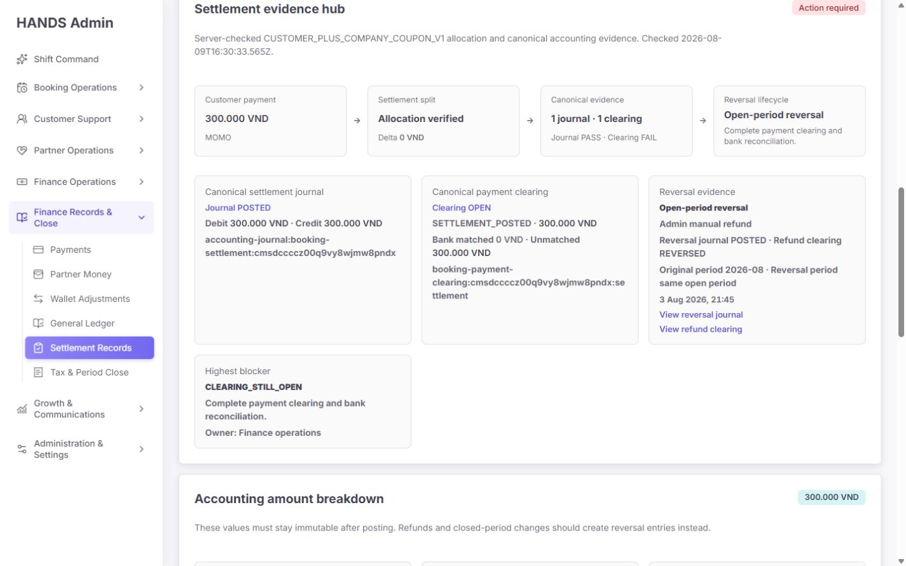
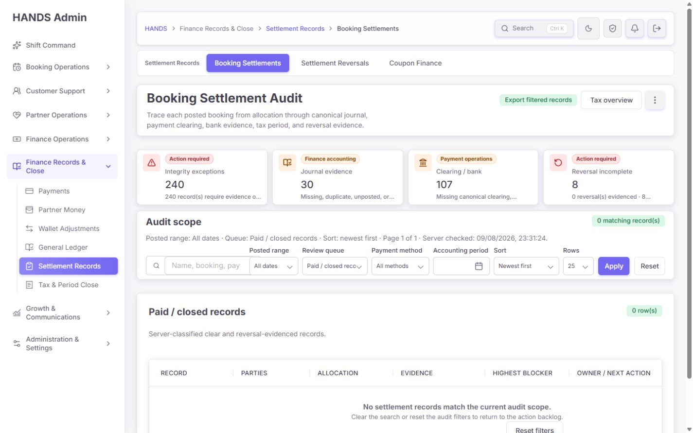
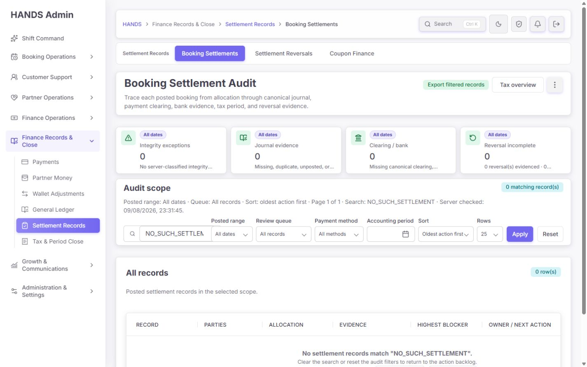
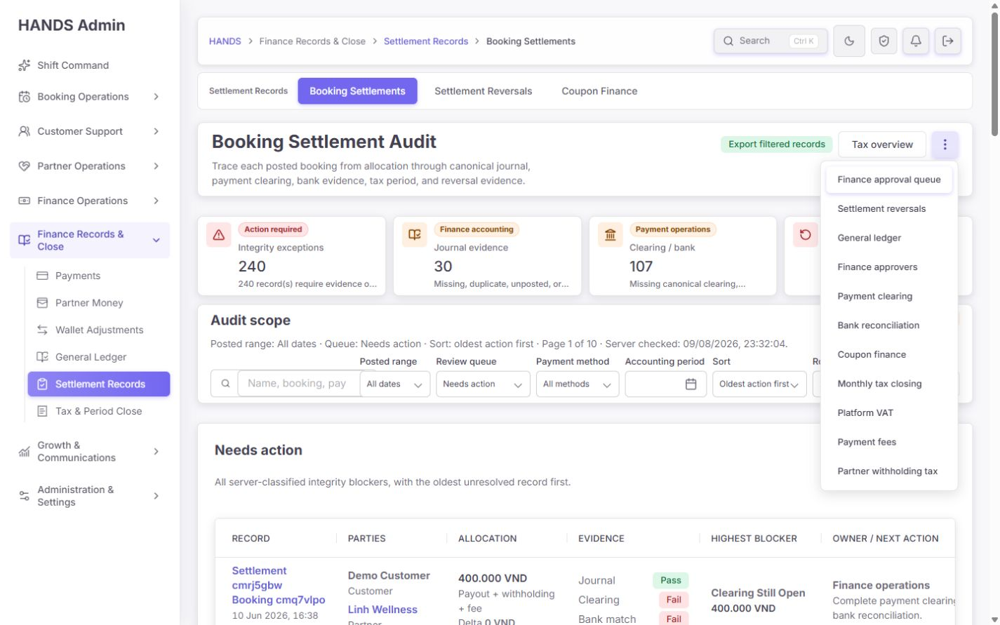
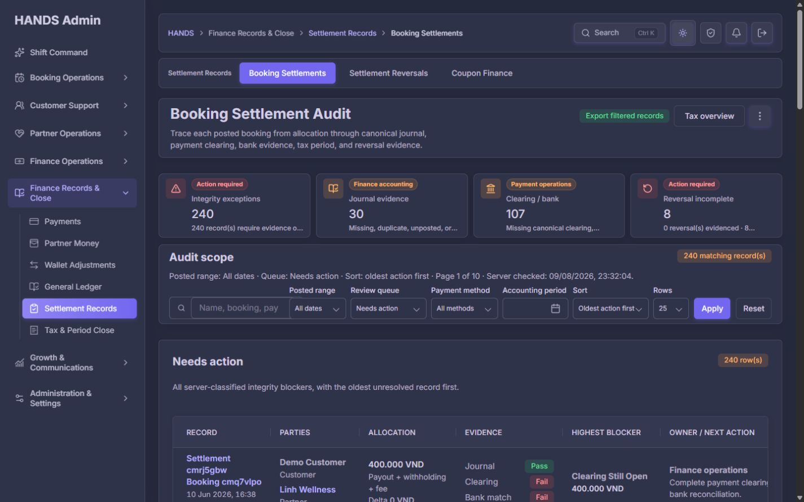
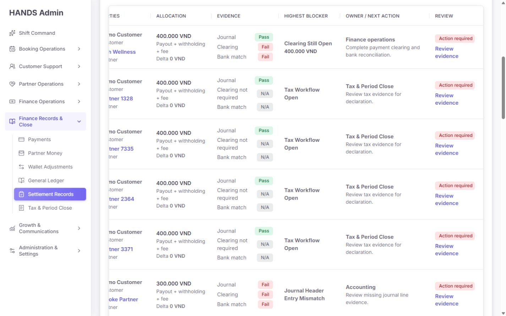

# Booking Settlement Audit 개선 후 심층 재감사 보고서

- 대상: `http://localhost:3101/finance-tax/booking-settlement-audit`
- 상세 검증 대상: 목록에서 연결되는 `/finance-tax/booking-settlement-audit/[id]`
- 작성일: 2026-08-09 (Asia/Bangkok)
- 운영 기준: 재무·세무·결제 증거를 검토하는 실제 관리자
- 화면 기준: **1440×900 및 1440px 이상 데스크톱만 평가**
- 명시적 제외: **1024px 이하, 모바일, 태블릿, 반응형은 검사·점수·권고에서 완전히 제외**
- 작업 성격: 화면·코드·API·문구·상태·테스트 재감사. 소스 코드는 수정하지 않았다.

## 1. 최종 판정

이전 감사의 핵심 결함은 상당 부분 실제로 개선됐다. 페이지는 이제 단순 정산 목록이 아니라 `배분 → journal → clearing/bank → tax → reversal`을 연결하는 감사 작업공간에 가까워졌다. 특히 다음 항목은 분명한 진전이다.

- 기본 범위가 `All dates / Needs action / Oldest first`로 바뀌어 오래된 backlog를 숨기지 않는다.
- `All records`가 실제 전체 기록을 표시한다.
- 고객·파트너 이름 검색, 회계 기간, 결제 수단, 정렬, 페이지 크기가 서버 요청에 전달된다.
- coupon 비용을 포함하는 배분식이 서버 권위 판정으로 통일됐다.
- 원 journal/clearing과 reversal journal/clearing을 의미 기준으로 분리한다.
- API 실패를 정상적인 0건으로 위장하지 않는다.
- 상세에서 목록의 필터·페이지 문맥으로 돌아갈 수 있다.
- CSV는 필터 전체 행을 페이지 순회로 수집하고, 전화번호를 제외하며, 생성자·시각·필터·정렬·행 수를 기록하고 export 활동 로그를 남긴다.
- `More finance pages` 메뉴는 Arrow key와 Escape를 지원한다.
- 명도·다크 테마 모두 상태 텍스트와 표 구조를 유지한다.

그러나 **운영 배포 완료로 판정하기에는 아직 이르다.** 이번 재감사에서는 판정 계약·집계·성능 구조에 새로운 중요 문제가 확인됐다.

1. **P0 — 정상적인 세무 진행 상태가 무결성 오류로 분류된다.** `TAX_WORKFLOW_OPEN`이 무조건 BLOCKER이므로 현재 240개 전체 기록이 모두 `Integrity exceptions / Action required`가 되었고 `Resolved`는 0건이다. 현재 local data에서 `Tax / period` 199건과 `Tax open` 199건은 레코드 집합까지 완전히 동일하다.
2. **P0 — CASH와 CUSTOMER_WALLET 환불은 시스템이 reversal clearing을 만들지 않는데 감사 판정은 이를 필수로 요구한다.** 실제 reversal 생성 계약과 audit health 계약이 충돌한다. 해당 결제수단의 환불이 생기면 정상 reversal도 `REVERSAL_CLEARING_MISSING`으로 오판한다.
3. **P1 — “0 reversal(s) evidenced” 집계가 사실과 다르다.** 실제 상세에서 `Open-period reversal PASS`, reversal journal POSTED, refund clearing REVERSED가 확인됐지만 카드에는 0건으로 표시된다. `reversedClearCount`가 reversal 증거 완료 수가 아니라 전체 audit state가 `REVERSED_CLEAR`인 수를 세기 때문이다.
4. **P1 — 목록·summary·export가 확장되지 않는 전체 메모리 스캔 구조다.** 한 페이지 표시에도 중첩 journal/clearing/bank match를 포함한 전체 후보를 최대 세 번 읽고 Node 메모리에서 판정·필터·정렬한 뒤 25행만 자른다. 100,000행 export는 매 page마다 전체 집합을 다시 읽는 O(n²)에 가까운 구조다.
5. **P1 — 검색과 필터가 상단 command board의 “전체 backlog”도 함께 0으로 만든다.** 검색 범위라는 표식 없이 `All dates · Integrity exceptions 0`으로 보여 운영자가 전사 backlog가 0이라고 오해할 수 있다.
6. **P1 — 한 레코드의 여러 blocker 중 첫 번째 하나만 노출된다.** 실제 확인한 reversal 레코드는 clearing, bank match, payment fee evidence 문제가 함께 있으나 목록과 상세는 `blockers[0]`만 “Highest blocker”로 보여 준다.
7. **P1 — 1440px에서도 핵심 Review/Action 열을 보려면 가로 스크롤이 필요하고, 오른쪽으로 이동하면 고정하려던 Record 열이 사이드바 뒤로 사라진다.** 첫 데이터 행은 y=803에서 시작해 900px 첫 화면에서 행 하단도 잘린다.

종합 완성도는 **12.0/20, 약 60/100**이다. 이전 43/100 수준보다 큰 개선이지만, 재무 판정의 의미와 대량 데이터 구조를 바로잡은 뒤 운영 승인하는 것이 안전하다.

## 2. 재감사 범위와 방법

다음을 직접 대조했다.

- 이전 보고서와 구현용 마스터 프롬프트
- 목록·상세 React Server Component
- 필터·URL·CSV 생성 model
- Admin API route와 service
- `settlementAuditHealth` 판정 함수와 reversal 생성 service
- Prisma 모델과 인덱스
- page/API/unit test
- 로그인된 실제 화면의 DOM, URL, 링크, 메뉴, 키보드 동작, 1440×900 스크린샷
- 명도·다크 테마
- default, all, reversed, resolved, 검색 0건, 결제수단 필터, 모든 review queue

금전 mutation, 승인, 환불, closeout은 실행하지 않았다. 실제 production data 전체나 production 트래픽 성능을 단정하지 않는다.

## 3. 이전 보고서 대비 구현 완료표

| 이전 핵심 요구 | 현재 판정 | 확인 근거 |
|---|---:|---|
| 원 증거와 reversal 증거의 의미 기반 분리 | 구현 | `BOOKING_SETTLEMENT`, `BOOKING_SETTLEMENT_REVERSAL`, `SETTLEMENT_POSTED`, `REFUND_REVERSAL`을 분리 |
| open/closed-period reversal lifecycle | 구현 | 실제 상세에서 Open-period reversal과 원/역 journal·clearing 링크 확인 |
| reversed에 `Ready for tax review` 금지 | 구현 | 문구 제거, reversal lifecycle과 next action 노출 |
| 서버 권위 audit health | 구현 | 목록·상세·CSV가 `settlementAuditHealth` 사용 |
| coupon-aware allocation | 구현 | `customer paid + company coupon = payout + withholding + fee gross` |
| All dates backlog 기본값 | 구현 | 기본 URL이 `range=all&review=open&sort=oldest` |
| All records 선택 오류 | 구현 | `review=all` 유지, 실제 240건 확인 |
| 고객·파트너 이름 검색 | 구현 | Prisma relation name search 포함 |
| Accounting period 항상 노출 | 구현 | 1440px toolbar에 month control 상시 표시 |
| API failure와 empty 분리 | 구현 | summary/records error state 별도 |
| 상세 복귀 context | 구현 | 안전한 `returnTo` allowlist와 실제 URL 확인 |
| CSV 전체 필터 범위 | 구현 | summary count 기준 page 순회, 중간 실패 시 non-CSV error |
| CSV PII 제거·감사 기록 | 구현 | 전화번호 미포함, generatedBy/filter/timezone/rowCount, activity log |
| 메뉴 키보드 지원 | 구현 | ArrowDown 이동, Escape 닫힘 확인 |
| 1440px 표 밀도 개선 | 부분 | 열 수는 줄었으나 1280px table이 1050px scrollport를 초과 |
| reversal 판정 정확성 | 부분 | 의미 분리는 성공했지만 CASH/WALLET clearing 계약 충돌 잔존 |
| queue 의미 정확성 | 미완료 | 정상 tax workflow를 integrity blocker로 합쳐 240/240 action required |
| 대량 데이터 성능 | 미완료 | 전체 hydration 후 memory filter/sort/slice 구조 |

## 4. 실제 데이터와 queue 구조

2026-08-09 local data를 같은 `All dates` 범위로 확인했다.

| Queue | 건수 | 운영 해석 |
|---|---:|---|
| All records | 240 | 전체 posted settlement snapshot |
| Needs action / Integrity exceptions | 240 | 전체와 동일하여 예외 큐의 분별력 없음 |
| Allocation mismatch | 0 | coupon-aware 배분식은 현재 데이터에서 통과 |
| Journal evidence | 30 | journal line/header 또는 reconciliation delta 문제 |
| Clearing / bank | 107 | clearing/bank match 문제 |
| Reversal incomplete | 8 | reversal check 자체가 FAIL인 건 |
| Tax / period | 199 | 현재는 Tax open과 동일 |
| Tax open | 199 | 정상 진행 상태와 overdue가 분리되지 않음 |
| Declared / payment due | 0 | 현재 데이터 없음 |
| Payment fee issues | 107 | 현재는 Clearing / bank와 레코드 집합까지 107/107 동일 |
| Coupon evidence | 0 | 현재 데이터 없음 |
| Unknown | 0 | 현재 데이터 없음 |
| Paid / closed records (`resolved`) | 0 | 정상 baseline 부재 |
| Reversed records | 40 | reversal lifecycle 전체 |

중요한 관찰:

- `Tax / period`와 `Tax open`은 현재 199개 ID가 완전히 동일했다. broad queue와 narrow queue를 모두 유지하려면 차이를 설명하거나, mismatch가 0일 때는 중복 option을 줄여야 한다.
- `Clearing / bank`와 `Payment fee issues`도 현재 107개 ID가 완전히 동일했다. 서로 다른 원인이지만 owner와 대상이 동일하므로 한 레코드가 두 queue에 중복 노출된다.
- `Reversal incomplete 8`은 reversal evidence 자체의 실패 수다. 반면 카드의 `0 reversal(s) evidenced`는 전체 audit state 기준이라 실제 reversal PASS 레코드도 제외한다.
- 전체 240건이 action required이면 “예외”가 아니라 “모든 정상 lifecycle과 legacy gap을 한 바구니에 넣은 상태”다. 이 상태에서는 운영자가 가장 위험한 10건을 식별할 수 없다.

## 5. 화면 단계별 감사

### Step 1 — 기본 All dates / Needs action — 건강도 2.6/4



좋아진 점:

- 제목, 설명, 4개 command queue, audit scope, table의 작업 흐름이 일관적이다.
- 가장 오래된 레코드가 먼저 나오며 owner와 next action을 직접 보여 준다.
- 전화번호를 목록에서 제거해 정보 밀도와 PII 노출을 줄였다.

남은 문제:

- 240/240이 모두 예외라 우선순위 의미가 사라진다.
- 카드 description이 한 줄 ellipsis로 잘려 왜 문제인지 읽기 어렵다.
- 검색 입력은 `Name, booking, pay...`에서 잘려 settlement/payment까지의 검색 범위를 전달하지 못한다.
- 첫 데이터 행의 top은 y=803, bottom은 y=926이다. 900px 첫 화면에서 완전한 한 행조차 볼 수 없다.

### Step 2 — All records — 건강도 2.3/4


- 이전 `All records` URL 회귀는 해결됐다.
- 그러나 전체 240건과 action queue 240건이 같다. 정상/완료 baseline이 없으므로 운영자는 판정 계약이 너무 엄격한 것인지 실제 데이터가 모두 잘못된 것인지 구분할 수 없다.

### Step 3 — Reversed records — 건강도 2.2/4



- 40건의 reversed 원장을 별도로 찾을 수 있다.
- 행에서 reversal lifecycle PASS/FAIL을 추가로 표시한다.
- 카드에는 `0 reversal(s) evidenced · 8 incomplete`라고 나오지만 실제 첫 행부터 `Open-period reversal Pass`다. 운영자 문구로는 사실과 모순된다.

### Step 4 — Reversed detail 상단 — 건강도 2.7/4



- settlement/tax가 모두 REVERSED이며 booking이 REFUNDED인 점이 명확하다.
- 목록 복귀 버튼이 필터 context를 보존한다.
- 상단 metric 4개와 바로 아래 overview가 settlement/tax/payment/party 정보를 반복한다. 상세의 핵심은 “왜 action required인가”이므로 decision strip이 overview보다 먼저 와야 한다.

### Step 5 — Evidence hub — 건강도 3.0/4



이번 개선에서 가장 좋은 부분이다.

- 원 journal과 원 clearing, reversal journal과 refund clearing을 구분한다.
- 금액·상태·sourceKey·bank matched/unmatched를 보여 준다.
- 실제 확인 레코드는 reversal journal POSTED, refund clearing REVERSED, reversal PASS였다.

남은 문제:

- `CUSTOMER_PLUS_COMPANY_COUPON_V1`, ISO UTC timestamp, `CLEARING_STILL_OPEN` 같은 내부 코드를 운영 문구로 그대로 노출한다.
- 한 레코드에 복수 blocker가 있어도 `Highest blocker` 하나만 표시한다.
- “Highest”를 정하는 severity/금액/SLA 정렬 규칙이 없다. 현재는 함수가 blocker를 추가한 순서의 첫 항목이다.
- sourceKey와 긴 ID가 좁은 card에서 여러 줄로 부서진다. copy button 또는 축약 표시가 필요하다.

### Step 6 — Resolved 0건 — 건강도 1.5/4



- empty recovery 자체는 명확하다.
- 그러나 240개 전체가 action required이고 resolved가 0이면 일반적인 성공색 0건 empty가 아니라 **audit model 또는 historical migration gap 경고**가 필요하다.
- option label은 `Paid / closed records`지만 실제 `resolved` 정의에는 `REVERSED_CLEAR`도 포함된다. label과 데이터 계약이 일치하지 않는다.

### Step 7 — 검색 0건 — 건강도 1.8/4



- 검색어를 보존하고 `Clear search`, `Reset filters`를 제공하는 점은 좋다.
- 상단 4개 command card도 검색어를 적용해 전부 0이 되지만 card scope는 `All dates`라고만 표시한다.
- 권장: 전역 backlog card는 검색과 분리해 유지하거나, 카드 상단에 `Filtered by search: NO_SUCH_SETTLEMENT`을 명시한다.

### Step 8 — More finance pages — 건강도 3.1/4



- menu/menuitem semantic, ArrowDown 순환, Escape 닫힘을 확인했다.
- 11개 항목이 한 목록에 섞여 길다. `Approval`, `Settlement & Ledger`, `Tax`의 세 그룹 또는 검색 가능한 finance switcher가 더 빠르다.
- 핵심 3개 sibling은 이미 상단 workspace subnav에 있어 현재 menu는 보조 이동 수단으로 유지해도 된다.

### Step 9 — Dark theme — 건강도 3.3/4



- surface, table, filter, 상태 badge가 모두 유지된다.
- Pass/Fail/N/A가 색뿐 아니라 텍스트로도 구분된다.
- 다크 테마 자체에서 blocker급 문제는 확인하지 못했다.

### Step 10 — Table 오른쪽 열 — 건강도 1.6/4



정량 측정:

- content width: 1,117px
- table scrollport client width: 1,050px
- table scroll width: 1,280px
- 필요한 수평 이동: 약 215~230px
- 오른쪽 이동 후 container left: 309px, 첫 header left: 95px

즉 `Record` sticky column이 scroll container의 왼쪽에 남지 않고 fixed sidebar 뒤로 이동한다. 결과적으로 오른쪽의 `Review evidence`를 보려면 record identity를 잃는다. 1440px 전용 운영 환경에서도 명백한 사용성 회귀다.

## 6. 판정 계약 코드 감사

### P0-1. Tax workflow와 integrity exception을 분리해야 한다

`apps/api/src/settlements/settlement-audit-health.ts:571-596`

- `OPEN` 또는 `DECLARED`이면 `TAX_WORKFLOW_OPEN` BLOCKER를 추가한다.
- blocker가 하나라도 있으면 전체 state가 `ACTION_REQUIRED`다.
- 기간 마감일, 신고 due date, overdue 여부를 확인하지 않는다.

문제:

- 정상적인 월중 OPEN도 데이터 무결성 오류처럼 보인다.
- `Integrity exceptions`와 `Tax open` queue가 중복된다.
- 전체 데이터가 예외가 되어 journal/clearing/reversal anomaly의 우선순위가 묻힌다.

권장 계약:

```text
integrityState = CLEAR | ACTION_REQUIRED | UNKNOWN | REVERSED_CLEAR
workflowState  = TAX_OPEN | TAX_DECLARED | TAX_PAID | TAX_CLOSED | REVERSED
urgency        = NORMAL | DUE_SOON | OVERDUE | BLOCKED
```

- `TAX_PERIOD_MISMATCH`는 integrity blocker로 유지한다.
- `TAX_WORKFLOW_OPEN`은 workflow state로 분리한다.
- due date를 넘긴 OPEN/DECLARED만 `OVERDUE` 작업 queue에 넣는다.
- 기본 `Integrity exceptions`는 실제 증거·배분·중복·불일치만 포함한다.

### P0-2. CASH/CUSTOMER_WALLET reversal clearing 계약 충돌

- 감사: `apps/api/src/settlements/settlement-audit-health.ts:478-524`
- 실제 생성: `apps/api/src/settlements/settlements.service.ts:475-480`

실제 reversal service는 CASH와 CUSTOMER_WALLET에서 external refund clearing을 만들지 않고 반환한다. 하지만 `reversalCheck`는 payment method를 받지 않고 모든 reversal에 refund clearing을 강제한다.

수정 방향:

- `reversalCheck`에 `paymentMethod` 또는 `reversalClearingRequired`를 전달한다.
- CASH와 CUSTOMER_WALLET은 reversal clearing을 `NOT_APPLICABLE`로 판정한다.
- journal과 wallet ledger evidence는 별도 check로 검증한다.
- open-period·closed-period 각각 CASH, CUSTOMER_WALLET, MOMO/CARD fixture를 추가한다.

### P1-1. Reversal evidence count가 잘못된 지표를 사용한다

- summary: `apps/api/src/admin/admin.service.ts:15707-15718`
- card: `apps/admin_web/app/finance-tax/booking-settlement-audit/page.tsx:150-157`

현재 `reversedClearCount`는 전체 state가 `REVERSED_CLEAR`인 건만 센다. reversal check가 PASS여도 다른 blocker가 있으면 제외된다.

필요한 지표:

- `reversalEvidenceCompleteCount`: reversal signal이 있고 `checks.reversal === PASS`
- `reversalEvidenceIncompleteCount`: reversal signal이 있고 `checks.reversal === FAIL`
- `reversedWithOtherBlockersCount`: reversal PASS지만 다른 integrity blocker가 있는 건
- `reversedClearCount`: 모든 검사가 clear인 최종 수

카드 문구는 위 지표를 혼용하지 않아야 한다.

### P1-2. “Highest blocker”는 실제 우선순위가 아니다

- 목록: `apps/admin_web/app/finance-tax/booking-settlement-audit/page.tsx:318-388`
- 상세: `apps/admin_web/app/finance-tax/booking-settlement-audit/[id]/page.tsx:205-218`
- next action: 같은 상세 파일 `446-451`

모두 `health.blockers[0]`을 사용한다. 현재 배열 순서는 allocation → journal → clearing → coupon → payment fee → tax → reversal 판정 실행 순서다.

권장:

- blocker에 `priority`, `dueAt`, `blockingCloseout`, `remediationHref`를 둔다.
- 모든 blocker를 owner별로 표시한다.
- 첫 행에서는 `Top blocker + 2 more`를 보여 준다.
- 상세에서는 checklist로 전부 보여 주고 각 항목을 실제 수정 workspace로 연결한다.

### P1-3. payment fee와 clearing queue가 현재 완전히 중복된다

현재 107개 ID가 두 queue에 모두 들어간다. 원인은 다르지만 운영자는 같은 107건을 두 번 본다.

권장 IA:

- 1차 lane: `Payment evidence`
- 2차 reason filter: `Clearing`, `Bank match`, `Fee policy`
- 행에는 동시에 발생한 reason chip을 모두 표시한다.
- 별도 queue를 유지한다면 `107 records · all also have fee-policy gaps` 같은 overlap 정보를 제공한다.

## 7. 성능·확장성 감사

### P1-1. 한 화면에 전체 중첩 데이터 full scan 3회

`apps/admin_web/app/finance-tax/booking-settlement-audit/page.tsx:61-75`는 동시에 다음을 요청한다.

1. 현재 queue summary
2. all-review overview summary
3. 현재 page rows

API 구현:

- list: `apps/api/src/admin/admin.service.ts:15579-15595`
- summary: `apps/api/src/admin/admin.service.ts:15634-15647`

두 메서드 모두 DB `findMany`에 `take/skip`을 넣지 않는다. 중첩 journal entries, clearing entries, bank matches, reversal entries를 전체 hydration한 뒤 Node에서 audit health를 계산하고 review filter·sort를 적용한다. list는 마지막에야 `slice(skip, skip + take)`한다.

240건 local warm navigation 한 번은 약 421ms에 operator content가 표시됐으므로 현재 local dataset만으로 “항상 느리다”고 단정할 수는 없다. 그러나 데이터가 늘면 응답시간과 메모리가 선형 이상으로 증가한다.

### P1-2. 100,000행 export는 반복 full scan

`apps/admin_web/app/api/admin/finance-tax/booking-settlement-audit/export/route.ts:18-76`

- export page size 100
- 최대 100,000행
- 각 page마다 list API 호출
- list API는 매번 전체 후보를 읽고 판정·정렬 후 해당 slice만 반환

100,000행이면 최대 1,000회 전체 판정이 반복될 수 있다. 이 제한은 안전장치가 아니라 서버 장애 범위를 키운다.

권장 구조:

1. `SettlementAuditHealthSnapshot` 또는 materialized read model을 저장한다.
2. `state`, `reasonCodes`, `primaryOwner`, `largestRiskAmount`, `checkedAt`, `formulaVersion`을 indexed column으로 둔다.
3. journal/clearing/reversal mutation transaction 또는 idempotent reconciliation job에서 갱신한다.
4. 목록은 indexed read model에서 DB-side filter/sort/cursor pagination 후 25행만 hydrate한다.
5. summary는 aggregate query로 계산한다.
6. export는 cursor/seek pagination과 streaming CSV를 사용하고 동일한 row를 한 번만 읽는다.
7. read model과 canonical evidence가 어긋나면 `UNKNOWN`으로 fail closed 한다.

### P1-3. 사용하지 않는 전화번호를 API list select가 계속 읽는다

`apps/api/src/admin/admin.service.ts:1152-1163`

목록 UI와 CSV는 전화번호를 출력하지 않지만 API select는 customer/partner phone을 포함한다. 불필요한 PII와 payload다.

- 목록·summary select에서는 phone을 제거한다.
- 정말 필요한 상세 action만 별도 권한과 명시적 endpoint로 요청한다.
- 현재 page test가 phone select를 기대하므로 test도 data-minimization 기준으로 바꾼다.

## 8. 1440px 정보 구조 개선안

### 8.1 첫 viewport 목표

현재 첫 데이터 행 top은 y=803이다. 목표는 **y=680 이하에서 최소 1개 완전한 행**을 보여 주는 것이다.

권장 순서:

1. compact page header: title + current scope + primary action 한 줄
2. command strip: unique action count, overdue, amount at risk, oldest age
3. primary filters: Search, Queue, Owner, Sort, Apply
4. applied-filter chips
5. table
6. advanced filters disclosure: range, period, payment method, rows

### 8.2 Command board 재구성

현재 4개 카드 대신 겹침을 인정하는 owner lane이 더 적합하다.

| Lane | 표시할 핵심 |
|---|---|
| Accounting integrity | unique records, journal/reconciliation reasons, amount at risk |
| Payment evidence | clearing/bank/fee reason breakdown, unmatched amount |
| Tax workflow | due soon, overdue, current period; 정상 open은 exception에서 제외 |
| Reversal lifecycle | evidence complete, incomplete, complete-but-other-blockers |

모든 카드에 다음을 명시한다.

- `Global backlog` 또는 `Filtered result`
- unique count와 overlap count
- oldest age/SLA
- owner
- 클릭 후 적용될 filter 이름

### 8.3 Filter taxonomy

현재 review select는 14개 option이다. 다음처럼 줄인다.

- Primary queue: `Integrity exceptions`, `Payment evidence`, `Tax workflow`, `Reversals`, `Resolved`, `All`
- Reason: allocation, journal, clearing, bank, fee policy, coupon, tax period, unknown
- Status: open, declared, paid, closed, reversed
- Owner: Accounting, Finance operations, Tax & Period Close

`Tax / period`와 `Tax open`, `Payment evidence` 내부의 중복은 reason/status facet으로 해결한다.

### 8.4 Table 재구성

1440px에서 5개 열을 권장한다.

| 열 | 내용 |
|---|---|
| Record & parties | settlement/booking, date, method, period, customer/partner |
| Exposure | customer amount, allocation delta, unmatched/at-risk amount |
| Evidence & blockers | journal/clearing/bank/reversal states + `2 more` |
| Owner & next action | primary owner, SLA, direct remediation link |
| Review | overall state, detail link |

가로 스크롤을 유지한다면:

- sticky first column의 containing block을 수정해 container left에 남게 한다.
- Playwright/DOM test에서 `firstHeader.left >= container.left`를 검증한다.
- scrollbar를 table 상단에도 제공하거나 `Shift+wheel` 안내를 추가한다.

## 9. 상세 화면 개선안

권장 상세 순서:

1. `Audit decision strip`: overall state, blocker count, primary owner, oldest/due, amount at risk
2. `All blockers`: reason, evidence, next action, remediation CTA
3. `Identity`: settlement, booking, payment, parties, period
4. `Allocation equation`
5. `Canonical evidence`
6. `Reversal evidence` — signal이 있을 때 항상 표시
7. `Payment fee / coupon / tax evidence`
8. raw IDs/sourceKey는 접힌 technical evidence 영역

문구 변경:

| 현재 | 권장 |
|---|---|
| `CUSTOMER_PLUS_COMPANY_COUPON_V1` | `Allocation rule: Customer payment + HANDS-funded coupon` |
| `CLEARING_STILL_OPEN` | `Settlement clearing is still open` |
| `2026-08-09T16:30:33.565Z` | `Checked 09 Aug 2026, 23:30 ICT` |
| `Paid / closed records` | `Resolved evidence` 또는 `Clear & evidenced reversals` |
| `0 reversal(s) evidenced` | 실제 `reversalEvidenceCompleteCount` 사용 |
| `Review evidence` | blocker에 따라 `Open clearing`, `Open journal`, `Review tax period` |

## 10. 접근성·테마

확인된 강점:

- H1/H2 구조와 table header가 존재한다.
- scroll container는 `role=region`, 명시적 aria-label, `tabIndex=0`, focus-visible outline을 가진다.
- 검색 입력은 accessible label을 가진다.
- 상태는 색과 Pass/Fail/N/A/Action required 텍스트를 함께 사용한다.
- menu/menuitem, expanded state, Arrow key, Escape가 동작한다.
- 다크 테마에서 control과 table 텍스트가 유지된다.

남은 보완:

- 가로 스크롤 후 Record column이 사이드바 뒤로 사라지는 것은 키보드 사용자에게도 context 손실이다.
- detail의 긴 sourceKey는 단어 단위 navigation과 읽기를 방해한다. 축약 + copy accessible name을 사용한다.
- 카드 description ellipsis는 hover title만으로 해결하지 말고 visible key phrase를 남긴다.
- full WCAG 적합성 감사나 screen reader end-to-end 인증을 수행한 것은 아니다.

## 11. 테스트 결과와 테스트 부채

### 실행 결과

- Admin Web targeted: **4 files, 54 tests passed**
- API settlement health/service: **2 files, 23 tests passed**
- Admin API settlement snapshot: **3 passed, 589 skipped by test filter**
- Admin Web typecheck: **passed**
- API typecheck: **passed**
- Impeccable detector: 글로벌 CSS의 다른 surface에 대한 side-tab warning 6건. 이번 Booking Settlement Audit selector와 직접 관련 없는 것으로 확인했다.

### 현재 테스트가 놓치는 것

1. `settlementAuditHealth.spec.ts`는 CUSTOMER_WALLET의 정상 canonical clearing N/A는 검사하지만 **CUSTOMER_WALLET reversal**은 검사하지 않는다.
2. settlement service test는 wallet reversal에서 clearing을 만들지 않는다고 검증하지만 audit health test와 계약 test가 연결되지 않는다.
3. detail page spec은 실제 render가 아니라 source string 포함 여부만 확인한다.
4. summary test는 `reversedClearCount`와 reversal evidence complete count의 차이를 검증하지 않는다.
5. list API test는 DB `take/skip` 부재를 실패로 보지 않는다.
6. export test는 101행 기능은 확인하지만 대량 반복 full scan 비용은 확인하지 않는다.
7. 1440px table sticky column의 bounding box를 확인하는 UI test가 없다.
8. 검색 시 command board가 filtered라는 표식이 있는지 검사하지 않는다.

## 12. 구현 우선순위

### P0 — 판정 신뢰성

1. `TAX_WORKFLOW_OPEN`을 integrity blocker에서 분리하고 due/overdue workflow로 모델링한다.
2. CASH/CUSTOMER_WALLET reversal clearing을 N/A로 처리하고 wallet ledger evidence를 검사한다.
3. 위 계약을 open/closed-period와 결제수단 조합 test로 고정한다.

### P1 — 집계·운영·성능

4. reversal evidence 완료/미완료/다른 blocker 동반 집계를 분리한다.
5. 모든 blocker와 direct remediation CTA를 노출한다.
6. 검색·필터가 command board에 적용되면 `Filtered` scope를 명시한다.
7. Tax/period vs Tax open, Clearing vs Fee queue의 중복 taxonomy를 정리한다.
8. audit read model + DB-side filter/sort/pagination + aggregate summary로 전환한다.
9. export를 cursor/streaming으로 바꾸고 100k 반복 full scan을 제거한다.
10. 사용하지 않는 phone select를 제거한다.
11. 1440px table을 5열로 줄이거나 sticky first column을 실제 scrollport에 고정한다.

### P2 — 문구와 polish

12. raw enum/formula/time을 운영 문구로 번역한다.
13. 첫 viewport를 줄여 완전한 첫 행을 표시한다.
14. 11개 finance overflow menu를 세 그룹으로 정리한다.
15. detail 상단 metric/overview 중복을 줄이고 decision strip을 먼저 배치한다.

권장 Impeccable 순서:

1. **[P0] `$impeccable clarify`** — integrity, workflow, reversal evidence 집계의 언어와 상태 계약을 분리
2. **[P1] `$impeccable distill`** — 중복 queue/filter와 detail 중복 제거
3. **[P1] `$impeccable layout`** — 1440px 첫 viewport와 table 열 재구성
4. **[P1] `$impeccable optimize`** — full scan, pagination, export 구조 개선
5. **[P2] `$impeccable polish`** — 문구, time, technical evidence, menu 마감

## 13. 완료 수용 기준

다음이 모두 충족돼야 재감사를 통과한 것으로 본다.

### 판정

- [ ] 정상 tax OPEN이 `Integrity exceptions`에 들어가지 않는다.
- [ ] overdue tax는 due date 근거와 함께 별도 queue에 들어간다.
- [ ] CASH/CUSTOMER_WALLET reversal은 refund clearing 없이도 올바른 N/A 판정을 받는다.
- [ ] CARD/MOMO/VNPAY reversal은 필요한 refund clearing이 없으면 FAIL한다.
- [ ] `reversalEvidenceCompleteCount`가 실제 reversal PASS 수와 일치한다.
- [ ] `0 reversal evidenced`와 실제 상세 PASS가 동시에 나타나지 않는다.

### 운영 UI

- [ ] unique action count, overlap, oldest/SLA, amount at risk를 구분한다.
- [ ] 검색 결과 card는 Global인지 Filtered인지 명시한다.
- [ ] 한 레코드의 모든 blocker를 볼 수 있다.
- [ ] 각 blocker에 owner, next action, remediation link가 있다.
- [ ] `resolved` option label이 실제 포함 state와 일치한다.
- [ ] 1440×900 첫 화면에서 최소 1개 완전한 데이터 행이 보인다.
- [ ] 가로 스크롤 후 Record column이 container left에서 사라지지 않는다.

### 성능·데이터 최소화

- [ ] list query가 page 크기만 hydrate하거나 bounded candidate set을 사용한다.
- [ ] summary가 전체 중첩 evidence를 Node로 가져오지 않는다.
- [ ] 10만 행 export가 각 page마다 전체 집합을 재계산하지 않는다.
- [ ] list/summary payload에 사용하지 않는 phone이 없다.
- [ ] 성능 예산과 production-like dataset benchmark가 CI 또는 release evidence에 남는다.

### 테스트

- [ ] CASH/WALLET/MOMO/CARD reversal matrix test가 있다.
- [ ] tax normal/due/overdue state test가 있다.
- [ ] reversal card count contract test가 있다.
- [ ] detail을 실제 render해 모든 blocker를 확인한다.
- [ ] 1440px table bounding box와 sticky column E2E가 있다.
- [ ] export cursor/stream completion과 upstream partial failure test가 있다.

## 14. 최종 권고

현재 구현은 **감사 증거를 연결하는 방향과 화면 골격은 성공**했다. 특히 evidence hub와 export 실패 처리, context 복귀, server-authoritative health는 유지할 가치가 높다.

다음 수정의 중심은 색상이나 spacing이 아니다. 먼저 아래 세 가지를 끝내야 한다.

1. `Integrity exception`과 정상 tax workflow를 분리한다.
2. reversal clearing requirement를 실제 결제수단 계약과 일치시킨다.
3. 전체 memory scan을 indexed audit read model로 교체한다.

그 다음에 queue 중복, 모든 blocker 노출, 1440px table과 문구를 정리하면 운영자가 “무엇이 정말 잘못됐고, 누가, 어디에서, 언제까지 해결해야 하는가”를 한 번에 판단할 수 있는 페이지가 된다.

---

> 이 보고서는 1440px 이상 데스크톱 운영 환경만 대상으로 했다. 1024px 이하 화면은 의도적으로 검사·평가·권고에 포함하지 않았다.
