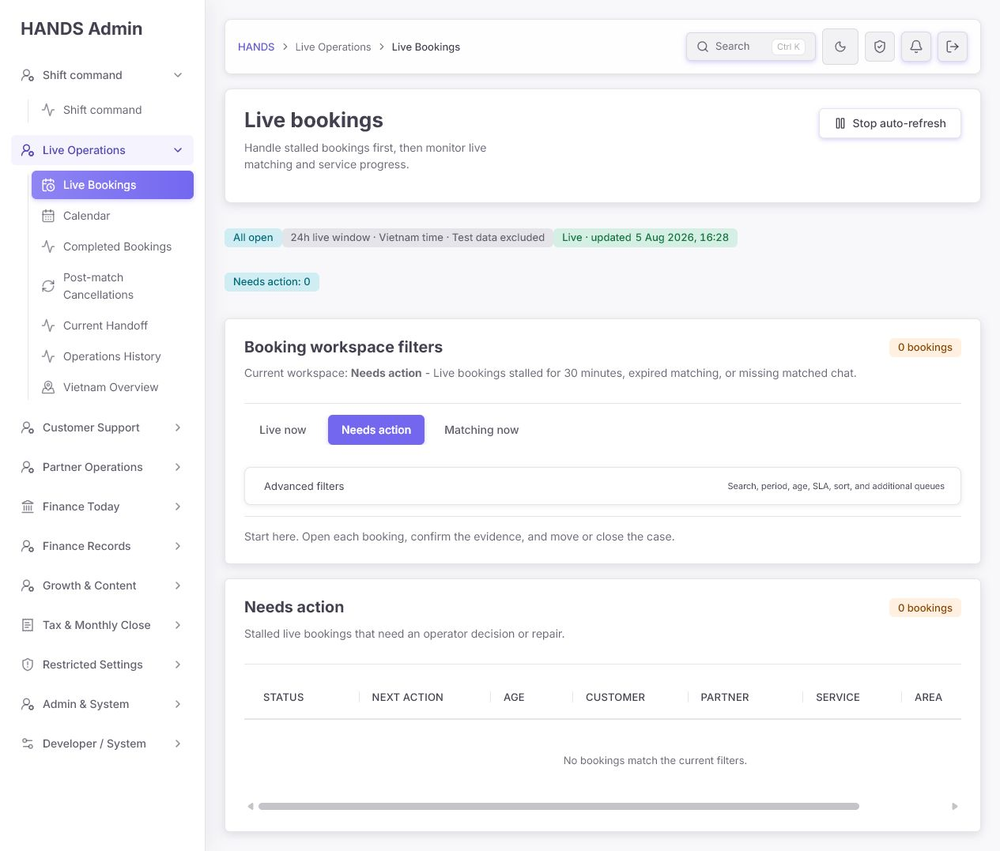
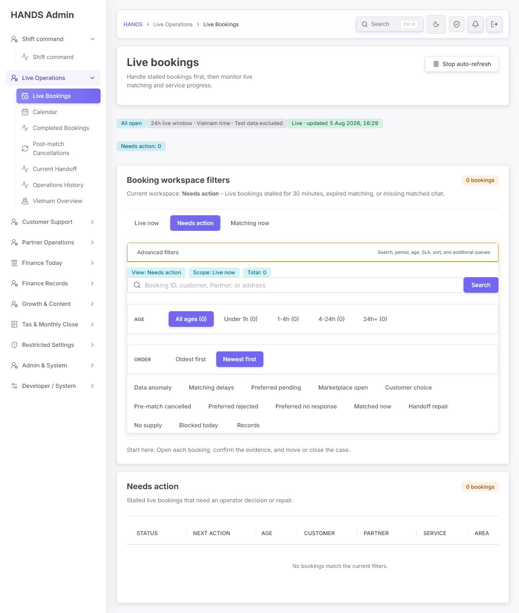
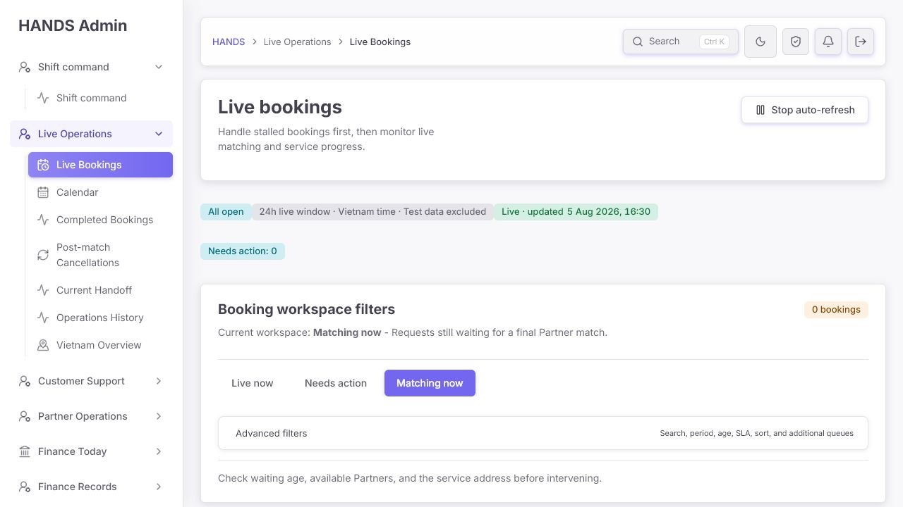

# HANDS Admin — Live Bookings 운영자 관점 심층 감사

- 감사 일시: 2026-08-05 16:28–16:36 (Vietnam time)
- 대상: `apps/admin_web`의 `/bookings`
- 사용자 목표: 긴급하거나 멈춘 예약을 먼저 찾고, 매칭·배차·서비스 진행 상태를 감시하며, 필요한 예약 기록을 빠르게 조회하는 것
- 감사 방식: 로그인된 실제 화면, 주요 필터 전환, 30일 기록 조회, 1024×768 레이아웃 측정, 화면 코드와 API 조회 코드 대조
- 변경 범위: 분석과 보고서만 수행. 애플리케이션 코드는 수정하지 않음

## 1. 결론

현재 페이지는 서버 페이지네이션, 실제 deep link, 검색, 대기열 분리, 데이터 실패 상태와 실시간 갱신 기반을 갖추고 있다. 그러나 **운영자가 가장 많이 사용할 핵심 전환인 `Live now`가 동작하지 않는 기능 결함**이 있다.

`Live now`를 누르면 URL은 `/bookings?view=active`로 바뀌지만 화면은 다시 `Needs action`으로 돌아온다. `active` 타입은 존재하지만 URL 허용 목록에서 빠졌기 때문이다. 이는 디자인 개선보다 먼저 고쳐야 하는 P0 결함이다.

그 다음으로 큰 문제는 하나의 화면이 서로 다른 세 가지 역할을 동시에 수행하면서 맥락 표시가 바뀌지 않는다는 점이다.

1. 현재 실시간 예약 감시
2. 문제 예약 처리
3. 과거 예약 기록 검색

30일 `Records` 화면에서 1,290건을 조회해도 페이지 제목은 `Live bookings`, 상태는 `All open · 24h live window`, 요약은 `Needs action: 0`으로 유지된다. 같은 화면에 `Demo Customer`, `Smoke Partner`, `Api Smoke Fixture Complete`가 보이는데도 `Test data excluded`라고 표시된다. 운영자는 지금 보고 있는 범위와 데이터 신뢰도를 잘못 이해할 수 있다.

최우선 방향은 새 기능 추가가 아니라 다음 네 가지다.

1. `Live now` 라우팅을 고친다.
2. 실시간 대기열과 기록 조회의 제목·상태·요약을 분리한다.
3. 비어 있는 대기열에서는 표 헤더와 큰 필터 카드를 숨기고 다음 행동만 보여준다.
4. 라이브 표는 실제 운영 판단에 필요한 여섯 열 정도로 줄이고 `Open age`와 `Idle time`을 구분한다.

## 2. 감사 단계와 화면 증거

### Step 1 — 기본 `Needs action`: 개선 필요

- 장점: 기본 진입을 문제 예약에 두었고, 설명도 `stalled bookings first`로 분명하다.
- 문제: 0건인데도 8열 빈 표, 가로 스크롤과 큰 필터 카드가 그대로 남아 있다.
- 문제: `Needs action: 0`, `0 bookings`, `Needs action`, `No bookings match...`가 같은 사실을 네 번 반복한다.
- 운영 영향: 아무 일도 없다는 사실을 확인하는 데 화면 한 개가 필요하고, 다음에 볼 대기열이 제시되지 않는다.

### Step 2 — `Live now` 전환: 기능 장애

- 실제 동작: `Live now`를 클릭하면 URL은 `/bookings?view=active`로 변경됐다.
- 실제 결과: `Current workspace`와 표는 다시 `Needs action`으로 렌더링됐다.
- 코드 원인: `BookingPageView`에는 `active`가 있지만 `BOOKING_VIEWS` Set에는 `active`가 없다. 따라서 `readBookingView('active')`가 기본값 `attention`을 반환한다. `apps/admin_web/app/bookings/booking-page-params.ts:4-35`, `47-79`, `107-123`
- 테스트 공백: `booking-page-params.spec.ts`는 여러 view를 검사하지만 `active`를 검사하지 않는다. `apps/admin_web/app/bookings/booking-page-params.spec.ts:3-19`

### Step 3 — Advanced filters: 위험

- 검색, 나이, 정렬과 추가 대기열을 한 곳에 둔 방향은 좋다.
- 하지만 13개의 추가 대기열이 업무 단계·위험도·현재/과거 구분 없이 한 평면에 놓여 있다.
- `Data anomaly`, `Matching delays`, `Preferred pending`, `Pre-match cancelled`, `Records`가 같은 중요도로 보인다.
- 각 추가 대기열의 건수가 없어 운영자는 열어보기 전까지 비어 있는지 알 수 없다.
- `View`, `Scope`, `Total` 요약은 바로 위의 `Current workspace`와 오른쪽 `0 bookings`를 반복한다.

### Step 4 — `Matching now`: 개선 필요

- `Matching now`는 정상적으로 전환되고 현재 설명과 운영 힌트가 바뀐다.
- 하지만 0건일 때도 기본 화면과 같은 빈 8열 표가 남는다.
- 상단 `Needs action: 0`만 보여주므로 `Live bookings 0`, `Matching now 0`, `Service in progress 0`, `Data anomaly 0`를 한눈에 비교할 수 없다.

### Step 5 — `Records · Last month`: 위험

브라우저 DOM과 코드에서 다음 상태를 확인했다.

- `Records · Last month`: 1,290 bookings
- 상단 상태: `All open · 24h live window · Test data excluded`
- 상단 요약: `Needs action: 0`
- 표에는 `Demo Customer`, `Smoke Partner`, `Api Smoke Fixture Complete`가 포함됨
- 표의 기록 중 일부는 `Action`이 필요한데 필터 결과 배지는 성공 색상으로 표시됨

이 단계는 긴 표 상태에서 in-app browser 이미지 캡처가 실패해 DOM과 코드로만 확인했다. 간접 페이지나 이전 캡처를 증거로 대체하지 않았다.

### Step 6 — 1024×768: 위험

실제 viewport를 1024×768로 전환하고 요소 크기를 측정했다.

- 사이드바: 260px
- 본문 폭: 약 701px
- 표 스크롤 영역: 636px
- 표 최소 폭: 1,040px
- 필요한 가로 이동: 약 404px
- 필터 카드 하단: y=756
- 실제 결과 표 시작: y=774

따라서 작은 노트북 첫 화면에서는 표의 행이나 다음 행동이 보이지 않고, 표 안에서도 오른쪽 `Booking` 열을 보기 위해 가로 스크롤해야 한다. viewport 변경 상태의 이미지 캡처가 브라우저에서 실패해 수치와 DOM으로만 검증했다.

## 3. 잘된 부분

1. 기본 view를 `attention`으로 두어 문제 예약을 먼저 보게 한 방향은 운영 목적에 맞다. `apps/admin_web/app/bookings/booking-monitor-page.tsx:36-50`
2. API는 목록, 요약, 정책, 감사 로그를 분리해서 불러오며 일부 소스 실패를 구분한다. `apps/admin_web/app/bookings/booking-monitor-page.tsx:137-184`
3. 목록은 서버 페이지네이션을 사용해 1,290건을 한 번에 렌더링하지 않는다. `apps/admin_web/app/bookings/booking-monitor-route-load-plan.ts:74-114`, `apps/api/src/admin/admin.service.ts:11932-12003`
4. 검색은 Booking ID, 고객, Partner, 전화번호와 주소를 서버에서 찾는다. `apps/api/src/admin/admin-booking-list-query.ts:338-371`
5. 고객 전화번호를 목록에서 마스킹하고 정확한 위치 좌표를 제거한다. `apps/api/src/admin/admin-booking-list-metadata.ts:190-223`
6. 표는 실제 `<table>`, `<th scope="col">` 구조를 쓰고 빈 상태를 `role=status`로 알린다. `apps/admin_web/components/admin-data-table.tsx:125-158`
7. 고급 필터는 native disclosure를 사용하고, URL에 필터가 있으면 자동으로 열려 현재 상태를 숨기지 않는다. `apps/admin_web/app/bookings/booking-monitor-filters-section.tsx:142-190`
8. 실시간 이벤트를 750ms로 모아 새로고침 폭주를 줄이고, 연결 오류 상태를 따로 처리한다. `apps/admin_web/app/bookings/booking-monitor.tsx:356-453`

## 4. 우선순위별 상세 문제와 수정 요건

### BK-001 [P0] `Live now`가 `Needs action`으로 되돌아간다

근거:

- 링크는 `/bookings?view=active`로 정확히 생성된다.
- `BookingPageView` union에는 `active`가 있다. `booking-page-params.ts:4-35`
- 허용 Set에는 `active`가 없다. `booking-page-params.ts:47-79`
- 알 수 없는 view는 `attention`으로 돌아간다. `booking-page-params.ts:107-123`

최소 수정:

- `BOOKING_VIEWS`에 `'active'`를 추가한다.
- `readBookingView('active') === 'active'` 회귀 테스트 하나를 추가한다.
- `/bookings?view=active`를 새로고침해도 `Live now`와 realtime API 결과가 유지되는지 브라우저로 확인한다.

완료 기준:

- 클릭, 직접 URL 입력, 새로고침 모두 `Live now`를 유지한다.
- API 요청의 `statusGroup`이 `realtime`이고 화면의 선택 상태도 `active`다.

### BK-002 [P1] 기록 화면에서도 실시간 범위와 요약을 표시한다

근거:

- `/bookings` route는 view와 관계없이 `dataScope="all-open"`을 전달한다. `booking-monitor-page.tsx:175-180`
- `/bookings` 요약은 view와 date range에 관계없이 `/admin/bookings/summary`를 사용한다. `booking-monitor-route-load-plan.ts:44-50`
- `view=all&dateRange=30d`에서 1,290건을 조회해도 `All open`, `24h live window`, `Needs action: 0`이 유지됐다.

수정 방법:

- `view=all`, `pre-match-cancelled`, `preferred-rejected`, `preferred-no-response`는 `historical` scope로 표시한다.
- Records일 때 제목을 `Booking records`, 상태를 `Last month · 1,290 records · Updated ...`로 바꾼다.
- live summary는 live views에서만 표시하고 Records에서는 기간·검색 결과 요약을 표시한다.
- 페이지를 새로 만들 필요는 없다. 현재 route config에 view별 표시 모델만 추가하면 된다.

### BK-003 [P1] `Test data excluded` 표시를 신뢰할 수 없다

근거:

- 30일 Records에 `Demo Customer`, `Smoke Partner`, `Api Smoke Fixture Complete`가 보였다.
- 현재 production filter는 ID prefix `smoke`, `seed-`와 일부 metadata 필드만 제외한다. `apps/api/src/admin/admin-booking-list-query.ts:116-163`
- 이름이나 closure note만 테스트 성격을 띠는 레코드는 통과할 수 있다.

수정 방법:

- 이름 패턴으로 임의 제외하지 않는다.
- fixture 생성 시 `metadata.smokeFixture=true` 또는 명시적인 fixture 식별자를 반드시 저장하도록 기존 seed/smoke 생성 경로를 점검한다.
- 기존 레코드는 삭제하지 말고 확인된 fixture만 명시적으로 backfill한다.
- 필터 검증이 끝날 때까지 문구를 `Known fixtures excluded`로 낮추거나, 누락 수를 검증한 후에만 `Test data excluded`를 사용한다.

완료 기준:

- 운영 목록에서 fixture로 확인된 Demo/Smoke 레코드가 나오지 않는다.
- 실제 운영 계정은 이름만 보고 제외되지 않는다.

### BK-004 [P1] `Age`가 실제로는 생성 시각인데 `Updated`라고 표시된다

근거:

- API age filter는 `createdAt`을 사용한다. `apps/api/src/admin/admin-booking-list-query.ts:200-203`
- 정렬/표시 시간도 `createdAt`을 우선한다. `apps/admin_web/lib/admin-booking-time.ts:13-19`
- 그러나 목록 문구는 `Updated 1d ago`라고 표시한다. `apps/admin_web/app/bookings/booking-list-time.ts:56-77`
- `Needs action`의 30분 정체 판단은 `updatedAt`을 사용한다. `apps/api/src/admin/admin-booking-list-query.ts:295-312`

운영 영향:

- 운영자는 예약이 1일 전에 생성된 것인지, 마지막 상태 변경이 1일 전인지 구분할 수 없다.
- 오래된 예약과 최근까지 움직이다 멈춘 예약의 우선순위를 잘못 판단할 수 있다.

수정 방법:

- 열 이름을 `Waiting / idle`로 바꾼다.
- live queue에서는 `Open 42m · no update 31m`을 보여준다.
- historical record에서는 `Opened 4 Aug · closed 4 Aug` 또는 `Created 1d ago`를 보여준다.
- 기존 createdAt/updatedAt을 사용하면 되므로 새 API 필드는 필요하지 않다.

### BK-005 [P1] 0건 상태에서도 큰 필터 카드와 빈 표를 렌더링한다

근거:

- 0건이어도 8개 column header와 최소 폭 1,040px 표가 렌더링된다. `booking-monitor-list-section.tsx:279-288`, `391-443`
- 기본 화면은 동일한 0건 정보를 네 차례 반복한다.

수정 방법:

- 결과가 0이면 표 전체를 렌더링하지 않고 compact empty state를 사용한다.
- 권장 문구: `No stalled bookings need action.`
- 보조 행동: `View Live now`, `View Matching now`, `Return to Shift Command`.
- 검색 조건이 있을 때는 `No bookings match “{query}”. Clear filters.`로 원인을 구분한다.

### BK-006 [P1] `Next action`과 `Clear`가 한 행에서 충돌한다

근거:

- Expired 기록의 Next action은 `Confirm customer communication`을 요구하지만 같은 셀 아래 신호는 `Clear`다.
- Next action과 check signal은 별도 계산이며 운영 의미가 합쳐지지 않는다. `booking-monitor-list-row-model.ts:53-97`, `booking-monitor-list-section.tsx:677-683`

수정 방법:

- `Clear`가 구조적 체크 결과라면 `Checks clear`로 정확히 이름을 바꾼다.
- 사람이 해야 할 후속 작업이 있으면 전역적으로 `Clear`를 표시하지 않는다.
- Records에서는 점검 신호보다 outcome과 후속 작업 여부를 보여준다.

### BK-007 [P2] Advanced filters가 서로 다른 업무 13개를 평면적으로 나열한다

현재 혼합된 범주:

- 현재 매칭: Matching delays, Preferred pending, Marketplace open, Customer choice, No supply
- 배차/서비스 복구: Matched now, Handoff repair
- 데이터 문제: Data anomaly, Blocked today
- 과거 결과: Pre-match cancelled, Preferred rejected, Preferred no response, Records

수정 방법:

- `/bookings` 기본 화면에는 현재 운영에 필요한 다섯 개만 남긴다: Matching delays, No supply, Handoff repair, Data anomaly, Blocked today.
- 과거 결과는 `Records` 아래나 기존 Completed/Post-match 화면으로 보낸다.
- 새 드롭다운 컴포넌트를 만들지 말고 기존 disclosure 안에서 두 개의 작은 그룹으로 나누면 충분하다.

### BK-008 [P2] 대기열 전환에 건수가 없어 빈 대기열을 반복해서 열게 된다

근거:

- `bookingViewCounts`를 계산하지만 버튼 label에는 사용하지 않는다. `booking-monitor.tsx:299-342`
- 화면에는 `Live now`, `Needs action`, `Matching now`만 있고 각 건수가 없다.

수정 방법:

- `Live now 0`, `Needs action 0`, `Matching now 0`처럼 기존 count를 label에 포함한다.
- 0건은 중립, 1건 이상 Needs action은 warning/danger로 표시한다.
- count를 위해 추가 API를 만들지 말고 이미 있는 overview summary를 사용한다.

### BK-009 [P2] 작은 노트북에서 표의 39%가 가려진다

근거:

- operations table의 최소 폭은 1,040px다. `globals.css:4116-4119`
- 1024 viewport에서 실제 table viewport는 636px였다.
- 오른쪽 `Area`, `Booking`과 일부 Service 정보는 첫 화면에서 보이지 않는다.

수정 방법:

- live queue는 다음 여섯 열로 축소한다.
  1. Priority / state
  2. Waiting / idle
  3. Customer + service
  4. Partner / participation
  5. Area
  6. Next action
- Booking ID는 Next action 아래 보조 텍스트로 합친다.
- Records는 별도 column set을 사용한다: Outcome, Closed, Customer/Partner, Service, Follow-up, Booking.
- 가로 스크롤을 완전히 없앨 수 없다면 첫 열과 마지막 action 열을 sticky로 만들고, 스크롤 영역에 명확한 이름과 focus 표시를 준다.

### BK-010 [P2] 목록에 내부 진단 문구가 그대로 노출된다

실제 예:

- `actor missing closure`
- `provider closure`
- `Terminal booking has no explicit closure actor/reason saved yet.`
- `Api Smoke Fixture Complete`

수정 방법:

- 목록에서는 `Closure actor not recorded`, `Closure reason not recorded`처럼 짧게 표시한다.
- 원본 note와 시스템 진단은 예약 상세의 evidence/audit 영역으로 내린다.
- `provider` 사용자 노출 문구는 `Partner`로 통일한다.

### BK-011 [P2] 가격 문구 `/ min`의 의미가 모호하다

근거:

- 실제 화면: `Customer 400.000 VND / min 300.000 VND`
- `min`은 분당 가격이 아니라 minimum price를 뜻한다. `apps/admin_web/lib/booking-service-list-labels.ts:55-73`

수정 방법:

- `Customer price 400,000 VND · Minimum 300,000 VND`로 명시한다.
- 라이브 운영에서 minimum price가 행동에 필요 없다면 목록에서는 고객 결제액만 보여주고 상세로 내린다.

### BK-012 [P2] Records 1,290건 배지가 성공 색상이다

근거:

- filter result tone은 `view === 'all' ? 'success' : 'warning'`으로 고정된다. `booking-monitor-filters-section.tsx:162-173`
- Records 안에는 Action이 필요한 기록도 포함된다.

수정 방법:

- Records의 총건수는 neutral tone을 사용한다.
- success는 실제로 모든 후속 작업이 완료된 상태에만 사용한다.

### BK-013 [P2] 필터 카드가 같은 맥락을 여러 번 반복한다

반복되는 정보:

- Booking workspace filters
- Current workspace: Needs action
- Needs action 버튼
- View: Needs action
- 0 bookings / Total: 0
- 아래 Needs action section

수정 방법:

- 상단 queue switcher와 결과 section을 직접 연결한다.
- `Booking workspace filters` 카드 제목과 `Current workspace` 문장을 제거한다.
- Advanced disclosure에는 검색·나이·SLA·정렬만 남긴다.

### BK-014 [P2] `Stop auto-refresh`가 헤더의 유일한 강한 행동이다

정상 운영의 기본 행동은 예약을 여는 것이지 자동 갱신을 중지하는 것이 아니다.

수정 방법:

- 헤더에는 `Live · Updated 16:36 ICT`를 compact status로 표시한다.
- pause는 작은 보조 toggle로 내린다.
- paused 상태에서는 `Auto-refresh paused · Resume`를 명확하게 표시한다.

### BK-015 [P2] 가로 스크롤 영역은 키보드 focus가 되지만 이름과 focus 표시가 부족하다

근거:

- `AdminTableScroll`은 `tabIndex={0}`이므로 키보드 스크롤은 가능하다. `components/admin-data-table.tsx:51-57`
- 그러나 aria-label이 없고 글로벌 focus-visible 스타일은 `a`, `button`, `input`, `select`, `textarea`에만 적용된다. `globals.css:17296-17305`

수정 방법:

- `AdminTableScroll`에 `aria-label="Booking results; scroll horizontally for more columns"`를 전달할 수 있게 한다.
- `.admin-table-scroll:focus-visible`에 기존 accent outline을 재사용한다.
- 200% 확대, Tab 이동, 화살표 가로 스크롤과 screen reader 표 헤더 발화를 수동 검증한다.

### BK-016 [P2] 0건 안내가 현재 상태와 맞지 않는다

현재 문구:

- `Start here. Open each booking...`
- `No bookings match the current filters.`

필터가 없는 기본 Needs action 0건은 “필터 불일치”가 아니라 정상적인 빈 대기열이다.

권장 분기:

- 기본 0건: `No stalled bookings need action.`
- Matching 0건: `No customers are waiting for a Partner match.`
- 검색 결과 0건: `No bookings match “{query}”.`
- 데이터 실패: 기존 `Booking records unavailable` 유지

## 5. 권장 화면 구성

### 첫 화면

1. `Live bookings`
   - `Live · Updated 16:36 ICT · Auto-refresh on`
2. Queue counters
   - Needs action
   - Matching now
   - In service
   - Handoff repair
   - Data anomaly
3. Queue switcher
   - `Needs action 0`, `Live now 0`, `Matching now 0`
4. 검색과 필터
   - Search, age, SLA, sort
5. 결과
   - 0건이면 compact empty state
   - 1건 이상이면 우선순위 정렬된 6열 표
6. `Other queues` disclosure
   - 현재 운영 예외만 그룹화

### Records view

- 제목: `Booking records`
- 상태: `Last month · 1,290 records · Updated 16:36 ICT`
- summary: period, query, result count
- table: 기록 조회에 맞는 column set
- live-only 상태와 `Needs action: 0`은 숨김

## 6. 권장 문구

| 현재 문구 | 권장 문구 |
|---|---|
| Handle stalled bookings first, then monitor live matching and service progress. | Resolve stalled bookings, then monitor matching and active services. |
| Needs action: 0 | Needs action 0 · Matching 0 · In service 0 |
| No bookings match the current filters. | No stalled bookings need action. |
| Booking workspace filters | 제거 |
| Current workspace: Needs action | 제거; 선택된 queue button과 결과 제목으로 충분 |
| Advanced filters | Search & filters |
| Stop auto-refresh | Auto-refresh on / Pause |
| Updated 1d ago | Open 1d / Idle 31m |
| actor missing closure | Closure actor not recorded |
| provider closure | Partner closure |
| Customer 400.000 VND / min 300.000 VND | Customer price 400,000 VND · Minimum 300,000 VND |
| Clear | Checks clear 또는 제거 |
| All open · 24h live window | Live bookings · last 24h |
| Test data excluded | Known fixtures excluded; 완전 검증 후 Test data excluded |

## 7. 구현 순서

### Phase A — 즉시 수정

1. `BOOKING_VIEWS`에 `active` 추가 및 회귀 테스트
2. Records의 제목·scope·summary를 historical context로 변경
3. `Updated`/Age 문구를 실제 timestamp 의미에 맞게 수정
4. Records result tone을 neutral로 변경
5. fixture 누락 경로 조사 및 명시적 fixture marker 보강

### Phase B — 운영 밀도 개선

1. queue button에 기존 count 표시
2. 0건이면 표와 반복 요약을 compact empty state로 교체
3. Advanced options를 현재 운영/과거 기록으로 그룹화
4. 중복 `Booking workspace filters`, Current workspace, Total 요약 제거

### Phase C — 표와 접근성

1. live/records mode별 column set
2. `Open age`와 `Idle time` 분리
3. 내부 진단 문구를 상세 화면으로 이동
4. table scroll 영역 이름과 focus-visible 추가
5. 1024×768과 200% 확대 재검증

## 8. 전체 완료 기준

- `/bookings?view=active`가 클릭, 직접 입력, 새로고침 후에도 Live now를 유지한다.
- 기본 화면에서 세 주요 queue의 실제 건수를 클릭 전에 볼 수 있다.
- 0건일 때 빈 8열 표를 렌더링하지 않는다.
- Records에서 `Live bookings`, `24h live window`, `Needs action: 0`이 표시되지 않는다.
- `Age`와 `Updated`가 같은 timestamp를 잘못 설명하지 않는다.
- test/fixture로 확인된 레코드가 `Test data excluded` 화면에 나오지 않는다.
- 1024×768에서 Next action 또는 Open booking 동작을 가로 스크롤 없이 사용할 수 있다.
- 표 가로 스크롤 영역은 키보드 focus가 보이고 접근 가능한 이름을 가진다.
- 사용자 노출 문구는 `Partner`로 통일되고 내부 진단 문구는 기본 목록에서 숨겨진다.
- 새 UI 라이브러리, 새 상태관리, 새 route를 추가하지 않는다.

## 9. 검증 한계

- 현재 live queue가 0건이라 실제 진행 중 예약 행의 모든 상태 조합은 확인하지 못했다.
- 30일 Records의 DOM과 1개 검색 결과는 확인했지만 긴 표 상태의 브라우저 이미지 저장이 실패했다.
- 1024×768 viewport의 DOM, computed width와 위치는 확인했지만 해당 상태의 이미지 저장은 실패했다.
- screen reader 발화, 실제 색 대비 수치, 200% 확대는 별도 수동 검증이 필요하다.
- 개별 예약 상세의 action 실행, 권한 오류, 저장 성공/실패 복구는 이번 `/bookings` 목록 감사 범위에 포함하지 않았다.

