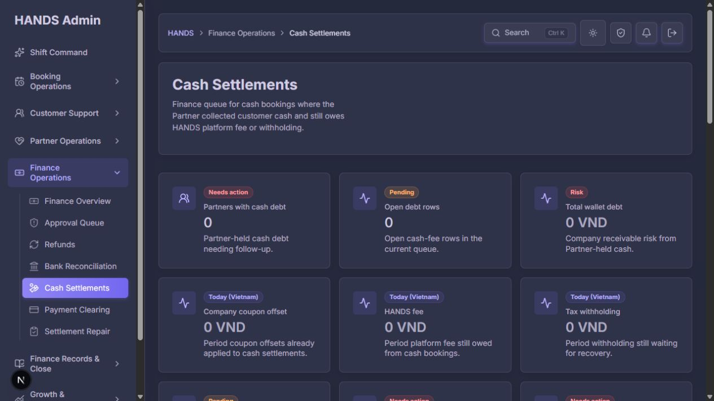
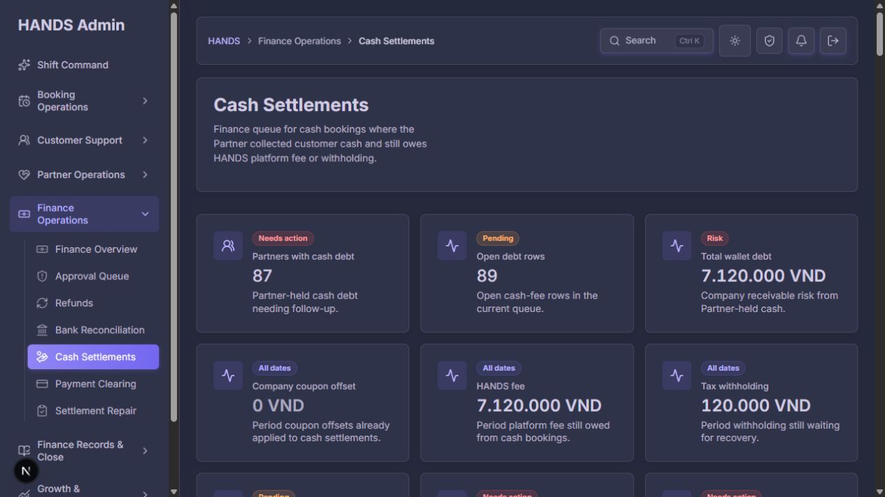
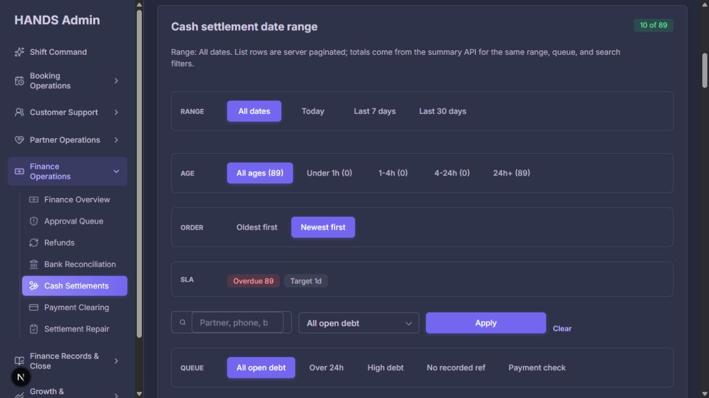
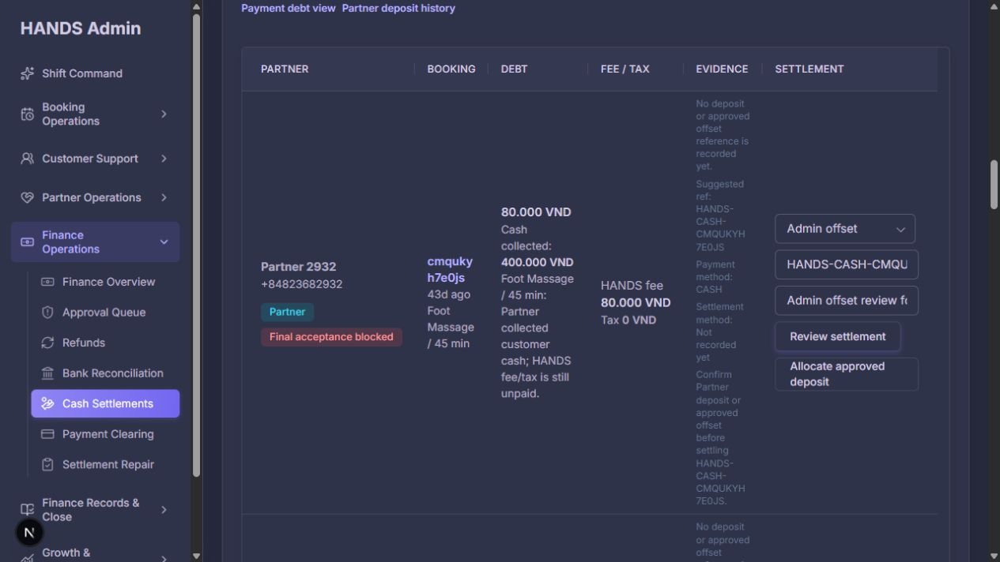
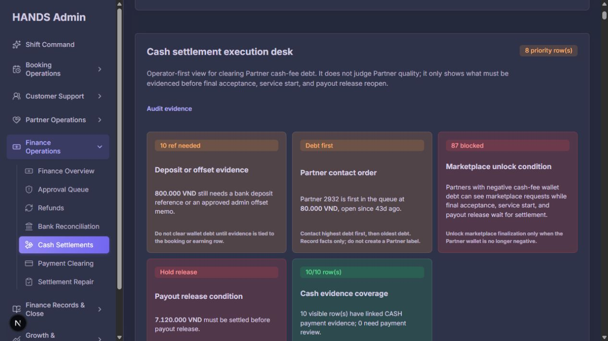
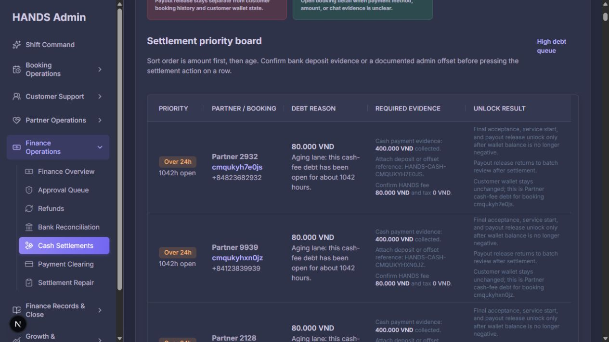
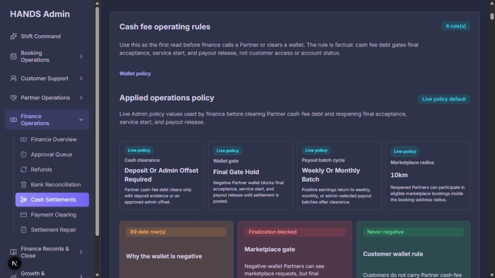
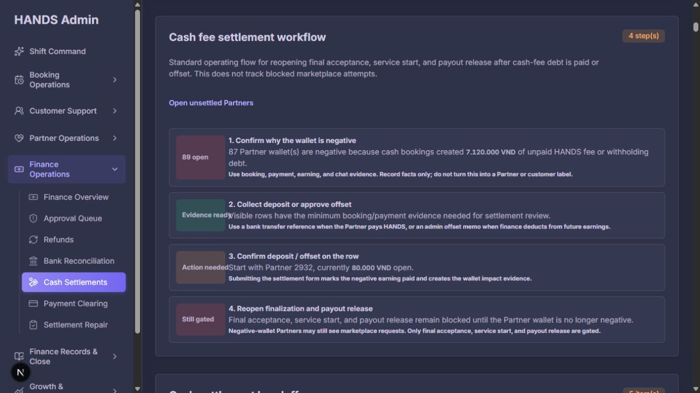
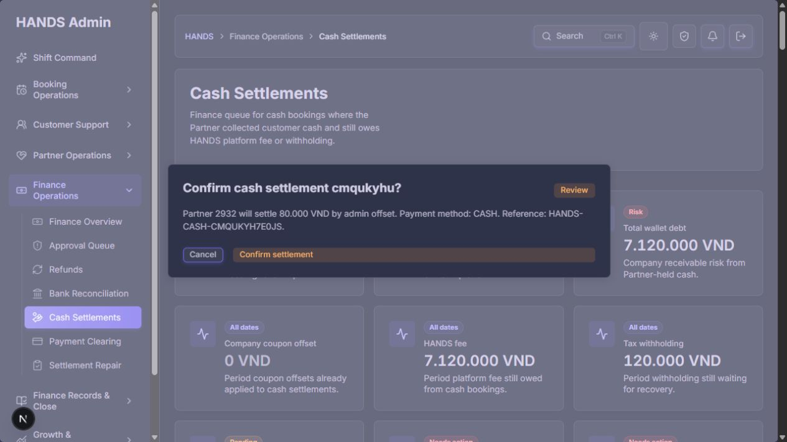

# Cash Settlements 운영 화면 재감사 보고서

- 감사일: 2026-08-08
- 대상: `/cash-settlements`, `?range=all`, `?view=full`, `?queue=missing-ref` 및 정산 확인 흐름
- 관점: 개발자 편의가 아니라 실제 재무·운영 담당자의 일상 업무, 금전 변경 안전성, 작업 완료 가능성
- 화면 기준: 1440px 이상 데스크톱 운영 환경. 1024px 이하 반응형은 요청에 따라 평가에서 제외했다.
- 방법: 로그인된 실제 화면 캡처, URL 상태 전환, 버튼 흐름 재현, Admin Web/API 코드 및 테스트 검토

## 1. 결론

기본 시각 체계와 테마 일관성은 양호하고, 현금 수금에서 플랫폼 수수료·세금 채권을 분리하려는 정보 구조도 이전보다 분명하다. 그러나 현재 화면은 **업무 화면처럼 보이지만 핵심 정산 작업을 안전하고 확실하게 끝내기 어려운 상태**다.

가장 심각한 문제는 다음 네 가지다.

1. `Review settlement`를 누르면 현재 필터 문맥이 사라져 확인 대화상자 자체가 나타나지 않는 경로가 있다.
2. 실제 입금·승인 증빙이 아닌 자동 생성 문자열을 `Admin offset` 증빙처럼 미리 채워 정산 완료에 사용할 수 있다.
3. 정산 API 실패·권한 거부·네트워크 오류가 화면에서 성공처럼 조용히 끝날 수 있다.
4. 이미 정산된 채권을 다시 처리할 때 증빙, 처리 시각, 메모를 덮어쓸 가능성을 막는 명확한 서버 상태 가드가 없다.

따라서 현 상태의 운영 준비도는 **4.8/10**이다. 색상·카드·표 스타일을 더 다듬는 것보다 먼저 금융 작업의 상태 보존, 증빙 검증, 실패 피드백, 멱등성을 고쳐야 한다.

## 2. 화면 흐름별 관찰

### 2.1 기본 진입: 오늘 생성된 건만 보여 실제 위험을 숨김

기본 URL은 `Today` 범위이며 모든 핵심 지표가 0이다. 같은 시점에 `All dates`에는 89건, 7,120,000 VND, 최장 43일의 미정산 채권이 있었다. 운영자가 사이드바에서 처음 진입했을 때 “현재 처리할 일이 없다”고 오판할 가능성이 크다.

권고:

- 기본값을 `All open`으로 변경한다.
- 첫 정렬은 `Oldest overdue` 또는 `Highest exposure` 중 명시적인 운영 기본값으로 서버에서 적용한다.
- 오늘 생성 건은 범위 필터로 남기되 전체 미해결 위험을 기본 화면에서 숨기지 않는다.
- `Total wallet debt`는 실제 지갑 잔액 전체로 오해될 수 있으므로 `Open cash-fee receivable`처럼 계산 범위를 드러낸다.

### 2.2 전체 미정산: 중요한 숫자는 보이나 우선순위가 분산됨

관찰 당시 전역 현황은 87 partners, 89 open rows, 7,120,000 VND open debt, 120,000 VND tax, oldest 43d, over 24h 89건이었다. 그러나 상단에 9개 수준의 동등한 카드가 놓여 “지금 무엇부터 처리해야 하는가”가 즉시 드러나지 않는다.

권고:

- 1차 KPI를 `Open exposure`, `Overdue`, `Missing settlement evidence`, `Owners/partners affected` 네 개로 줄인다.
- 수수료·세금·쿠폰 구성은 2차 상세로 내린다.
- `Payment evidence OK`를 제거하거나 두 지표로 분리한다.
  - `Booking cash record`: 예약이 현금 결제로 기록되었는가
  - `Settlement evidence`: 입금 또는 승인된 상계 증빙이 연결되었는가
- 현재처럼 89건 모두 `missing-ref`인데 상단에는 `Payment evidence OK`가 표시되는 의미 충돌을 없앤다.

### 2.3 필터: 같은 선택을 여러 방식으로 반복하고 기본값까지 칩으로 표시

범위, 연령, 정렬, SLA, 검색, 큐 선택, 큐 바로가기, 활성 필터 칩이 한 구역에 겹쳐 있다. 큐는 셀렉트와 링크 두 방식으로 중복되며 기본값도 활성 칩처럼 표시되어 실제로 사용자가 바꾼 조건을 찾기 어렵다.

코드상 링크와 폼마다 보존하는 쿼리 파라미터도 다르다. 범위·검색·큐 링크와 페이지네이션이 `sla`, `sort`, `age`, `view` 중 일부를 떨어뜨린다.

권고:

- 1행: Queue tabs (`All open`, `Overdue`, `Missing evidence`, `High exposure`, `Payment check`).
- 2행: 검색 + 정렬 + `Advanced filters`.
- 고급 필터 안에 날짜 범위, 연령, SLA, page size를 둔다.
- 활성 칩은 기본값이 아닌 사용자가 변경한 조건만 표시한다.
- 모든 이동을 단일 `buildCashSettlementUrl(currentState, patch)` 함수로 통일하여 검색·필터·정렬·페이지·view 문맥을 보존한다.

### 2.4 행 단위 작업: 목록이 데이터 표와 편집 폼을 동시에 수행

한 행에 예약/파트너/금액/세금/증빙 설명/3개 입력 필드/2개 버튼이 모두 들어간다. 10개 행이면 반복 입력과 반복 버튼으로 키보드 이동량과 시각적 높이가 과도해진다. 동일한 accessible name이 반복되어 보조기기 사용자에게 어느 행의 필드인지 불분명해질 수 있다.

권고:

- 표는 `Partner`, `Booking`, `Exposure`, `Age/SLA`, `Evidence`, `Owner`, `Next action` 중심의 스캔 가능한 요약으로 줄인다.
- 행의 유일한 주 동작은 `Review`로 둔다.
- 클릭 시 우측 drawer에 예약·earning·원장·증빙·메모·승인 내역과 정산 폼을 표시한다.
- 각 필드는 earning/booking/partner를 포함한 고유 label 또는 `fieldset/legend`를 사용한다.
- 은행 입금 요청은 파트너 단위 사건이므로 earning 행마다 반복 생성하지 말고 Partner Deposit/Approval 흐름으로 이동한다.

### 2.5 Full operations view: 데이터보다 설명 카드가 많고 집계 범위가 섞임

`view=full`은 약 10,000px 길이로, execution desk, priority board, operating rules, cause board, workflow, handoff map, command queue, checklist, partner group, debt table이 같은 사실을 반복한다. 측정된 로컬 응답 시간도 일반 화면 약 0.96~1.35초 대비 full view 약 2.13초로 두 배 수준이었다. 이는 로컬 단일 측정이므로 운영 성능의 확정값은 아니지만, 추가 정책 요청과 큰 서버 렌더 트리가 비용을 키우는 방향은 분명하다.

더 위험한 점은 집계 범위다. 상단 전역 요약은 89건/87 partners인데, priority/reference/provider 카드 일부는 현재 페이지 10건에서 계산되어 `10 reference needed`, `8 priority rows`처럼 보인다. 전역 수치와 현재 페이지 수치를 같은 등급으로 제시하여 판단을 왜곡한다.

권고:

- `full`을 별도 운영 화면으로 유지하지 않는다.
- 기본 화면을 하나의 operational workbench로 만들고 다음 세 구역만 남긴다.
  1. 전역 KPI 및 큐
  2. 작업 목록
  3. 선택 행의 상세 drawer
- 정책·업무 순서·용어 설명은 `Operating guide` drawer 또는 접이식 도움말로 이동한다.
- 전역 집계가 필요한 카드에는 API의 전역 read model을 사용하고, 페이지 기반 값이면 반드시 `Visible 10 rows`로 명시한다.
- 이미 API가 반환하는 `topProviderGroups`를 활용하거나, 필요하면 전용 집계 엔드포인트를 만든다. 현재 페이지 10건을 전역 파트너 우선순위로 사용하지 않는다.

### 2.6 핵심 차단 버그: Review settlement가 현재 문맥을 잃음

`?range=all&sort=oldest`에서 첫 행의 `Review settlement`를 누르면 URL이 confirm 파라미터만 가진 루트 형태로 바뀐다. 기본 범위가 Today로 돌아가 현재 페이지에서 earning을 찾지 못하고 확인 대화상자가 렌더되지 않았다. 운영자는 버튼을 눌렀지만 아무 일도 일어나지 않은 것으로 느낀다.

원인:

- 확인 URL 생성기가 현재 쿼리 상태를 포함하지 않는다.
- 확인 대상은 별도 조회가 아니라 현재 페이지의 `rows.find(earningId)`로만 찾는다.
- Cancel도 `/cash-settlements`로 고정되어 문맥을 잃는다.

수정 기준:

- 현재 검색 상태를 canonical query 또는 검증된 same-origin `returnTo`로 보존한다.
- 확인 대상은 earning ID로 별도 조회하거나 이미 선택한 row의 안전한 서버/클라이언트 상태로 구성한다.
- 확인·취소·성공·오류 후 모두 동일한 queue/filter/sort/page/view와 포커스로 돌아온다.
- 임의 외부 URL로 이동할 수 없도록 `returnTo`를 서버에서 검증한다.

### 2.7 확인 대화상자: 실제 증빙이 아닌 생성 문자열로 금전 상태 변경 가능

필터를 수동 복원하면 확인 대화상자가 나타난다. 하지만 기본 `Settlement reference`는 `HANDS-CASH-<booking-short-id>` 형식의 자동 생성 문자열이며, 실제 은행 입금 참조나 승인된 상계 문서가 아니다. 현재 UI와 API는 이 문자열이 비어 있지 않다는 이유만으로 증빙 조건을 통과할 수 있다.

또한 확인창에는 파트너, 80,000 VND, CASH, admin offset 정도만 보이며 다음 정보가 없다.

- 전체 booking ID와 earning ID
- 현재 파트너 지갑/채권 잔액과 처리 후 예상 잔액
- 승인된 offset request/approval ID
- 연결될 ledger entry와 회계 효과
- 기존 증빙/메모 및 중복 처리 여부
- 수행자와 필수 사유

수정 기준:

- 합성 reference를 실제 증빙으로 취급하지 않는다. placeholder로도 자동 제출되지 않게 한다.
- `Admin offset`은 승인된 offset/finance approval 레코드를 선택해야만 실행 가능하게 한다.
- 서버가 해당 승인 레코드의 partner, earning, amount, status, 미사용 여부를 검증한다.
- 가능하면 maker-checker를 적용한다. 요청자와 승인자가 분리되고 Approval Queue에서 승인된 후에만 정산한다.
- 확인창에 before/after 금액, 승인 근거, 원장 반영, 대상 식별자, 행위 결과를 명시한다.
- 자유 메모가 아니라 필수 reason code + 상세 사유를 기록한다.

## 3. 코드 및 금융 안전성 감사

### P0 — 즉시 수정

#### F-01. 확인 흐름 문맥 손실

- 관련 코드: `cash-settlement-action-confirmation.ts`, `cash-settlement-open-debt-table-section.tsx`, `page.tsx`
- 문제: confirm/cancel URL이 필터를 버리고 대상 earning을 현재 10개 row에서만 찾는다.
- 영향: 운영 작업 차단, 재탐색, 잘못된 대상 재선택 가능성.
- 완료 조건: 모든 진입 상태에서 Review → Confirm/Cancel/Success/Error가 같은 문맥과 대상에 머문다.

#### F-02. 합성 reference를 증빙처럼 사용

- 관련 코드: `cash-settlement-page-helpers.ts`, `cash-settlement-page-rows.ts`, open debt table, API policy
- 문제: 생성 문자열이 `Reference ready`와 제출 기본값으로 사용된다.
- 영향: 실재하지 않는 증빙으로 채권을 PAID 처리할 수 있다.
- 완료 조건: 실제 deposit evidence 또는 승인된 offset record 없이는 서버가 상태 변경을 거절한다.

#### F-03. 실패가 조용히 삼켜짐

- 관련 코드: `actions.ts`, `admin-api.ts`의 `adminPost`
- 문제: 권한 거부, 비정상 응답, 네트워크 예외를 fallback으로 반환한다. 사용자 성공/실패 피드백도 없다.
- 영향: 운영자는 실패를 성공으로 오인하고 장부 불일치를 장시간 방치할 수 있다.
- 완료 조건: 예외를 보존하고 오류 코드/메시지를 표시하며 성공 시 처리 결과와 audit ID를 보여준다.

### P1 — 배포 전 필수

#### F-04. 재처리 상태 가드와 멱등성 부족

- 관련 코드: `earnings.service.ts`의 mark-paid 및 wallet ledger upsert
- 문제: 이미 PAID인 earning을 다시 호출할 때 paidAt/reference/notes를 덮어쓸 수 있다.
- 수정: 허용 상태 조건부 update, 원자적 트랜잭션, 기존 evidence 불변, 동일 요청 멱등 응답, 충돌 오류를 구현한다.

#### F-05. 서버 정렬과 화면 정렬이 다름

- API는 createdAt/netAmount 기준으로 페이지를 자르고, 화면은 받은 10개만 debt/age로 다시 정렬한다.
- 결과적으로 `amount first, then age`는 전체 89건에 대해 사실이 아니다.
- 수정: 정렬을 서버 쿼리의 단일 source of truth로 만들고 페이지네이션 전에 적용한다.

#### F-06. 집계 의미 충돌

- `missingPaymentEvidence`는 booking payment 존재 여부만 검사하지만 UI 문구는 정산 증빙까지 정상인 것처럼 읽힌다.
- `missing-ref=89`와 `Payment evidence OK`가 동시에 표시된다.
- 수정: booking payment evidence와 settlement evidence를 API 필드부터 분리하고 정의를 UI 도움말에 명시한다.

#### F-07. 현재 페이지 집계와 전역 집계 혼합

- Full view 카드 일부는 현재 10건, 일부는 summary 전역 89건이다.
- 수정: 전역 read model 또는 명시적 visible-page scope를 사용하고 두 범위를 한 카드 그룹에서 섞지 않는다.

#### F-08. 입금 요청의 업무 단위가 잘못됨

- 파트너 은행 입금은 파트너 단위인데 earning 행마다 폼이 반복된다.
- 수정: provider/partner 단위 deposit request로 만들고 승인된 입금에서 여러 earning으로 배분한다. 동일 파트너의 중복 요청을 방지한다.

## 4. 운영자가 꼭 필요하지만 현재 부족한 정보

- 담당자/owner 및 팀
- 마지막 연락 시각과 결과
- 다음 follow-up 예정 시각
- partner timezone 및 현지 연락 가능 시간
- 약속된 입금일/offset 처리일
- escalation level과 사유
- 최근 상태 변경 및 audit trail 링크
- 승인된 입금/상계 증빙의 명확한 연결 상태
- 처리 후 예상 잔액
- 최근 완료·실패 결과를 확인하는 history 탭 또는 링크

이 정보가 없으면 89건의 24시간 초과 항목이 있어도 누가 무엇을 처리 중인지 알 수 없다. 단순 age 정렬만으로는 팀 단위 운영이 되지 않는다.

## 5. 권장 최종 화면 구성

1. **Header**: `Cash settlement receivables`, 마지막 갱신 시각, 새로고침, Operating guide.
2. **Primary KPIs**: Open exposure / Overdue / Missing settlement evidence / Partners affected.
3. **Queue + search bar**: 큐 탭, 검색, 정렬, 고급 필터.
4. **Work table**: partner, booking, exposure, age/SLA, evidence, owner, next action.
5. **Detail drawer**: 사건 맥락, timeline, evidence, linked approvals, before/after, safe action.
6. **Secondary views**: `Open`, `Deposit requests`, `Offset approvals`, `Recently settled`.

`view=full`에서 반복되던 정책/워크플로 문서는 Operating guide로 이동하고, 실행 데이터와 교육용 설명을 같은 스크롤에 나열하지 않는다.

## 6. 접근성·시각 품질·성능 평가

| 항목 | 점수 | 판단 |
|---|---:|---|
| 접근성 | 2/4 | semantic table, label, alertdialog는 긍정적. 반복 accessible name, 긴 tab sequence, drawer focus 검증이 필요하다. |
| 성능 | 2/4 | 일반 화면은 보통이나 full view는 렌더·데이터 요청·DOM이 커진다. 실제 운영 데이터로 profile 필요. |
| 테마 | 4/4 | dark/light 모두 대비와 컴포넌트 일관성이 양호했다. |
| 무결성 | 1/4 | 화면이 깨지지는 않지만 금융 상태 변경·문맥 보존·오류 처리의 무결성이 부족하다. |
| 반응형 | N/A | 사용자 요청에 따라 1024px 이하 및 모바일은 검사하지 않았다. |

자동 anti-pattern 검사에서는 결정적 시각 규칙 위반이 발견되지 않았다. 즉, 현재 핵심 문제는 “예쁘지 않음”보다 **운영 의미와 금융 워크플로 무결성**이다. 화면 캡처만으로 WCAG 준수를 단정하지 않으며, 최종 배포 전 키보드·스크린리더·고대비 수동 검증이 필요하다.

## 7. 구현 우선순위

### Phase 1 — 금융 안전과 작업 완료성

1. 확인 URL/대상 조회/return context 수정.
2. 합성 증빙 제거 및 approved offset/deposit 검증.
3. action 오류 전파, 성공/실패 배너, audit ID.
4. server status guard, evidence 불변, 멱등성.

### Phase 2 — 데이터 정확성과 정보 구조

1. 기본 범위 All open.
2. 서버 전역 정렬과 canonical filter state.
3. booking evidence/settlement evidence 분리.
4. Full view 제거·통합, 전역/페이지 집계 분리.

### Phase 3 — 운영 생산성

1. 표 + detail drawer 구조.
2. owner, follow-up, promise date, escalation.
3. deposit request/offset approval/recently settled 연결.
4. 키보드·보조기기·성능 검증.

## 8. 필수 회귀 테스트

- `range=all&sort=oldest&queue=missing-ref&page=2`에서 Review/Cancel/Confirm 후 모든 쿼리가 보존된다.
- 현재 10개 페이지에 없는 earning ID도 확인 대상이 정확히 조회된다.
- 임의 외부 `returnTo`는 거절된다.
- 합성 reference만으로 정산할 수 없다.
- 승인되지 않았거나 다른 partner/amount의 offset은 거절된다.
- 권한 거부/API 4xx·5xx/네트워크 오류가 사용자에게 오류로 보인다.
- 성공 후 row가 open queue에서 제거되고 결과/audit ID가 보인다.
- 동일 요청 재전송 시 evidence와 paidAt이 덮어써지지 않는다.
- `highest debt`, `oldest`, `SLA` 정렬이 페이지 경계를 넘어 전역적으로 정확하다.
- 필터·검색·큐·페이지 링크가 canonical state를 보존한다.
- 화면 집계가 API 전역 값과 일치하고 `visible rows`가 전역으로 오인되지 않는다.
- 반복 행 작업의 accessible name이 고유하며 drawer focus가 열기/닫기 후 복원된다.

## 9. 현재 테스트 결과

- Admin Web cash-settlements: 9 files, 46 tests passed.
- API cash settlement 관련 선택 테스트: 4 files, 32 passed, 788 skipped.

기존 테스트 통과는 현재 구현의 안전성을 의미하지 않는다. 일부 테스트는 오히려 confirm/cancel이 루트로 돌아가고 direct settlement가 오류를 삼키는 helper를 사용한다는 현재 동작을 고정하고 있으므로, 위 요구에 맞게 회귀 테스트를 먼저 수정해야 한다.

## 10. 배포 판정

**판정: 조건부 보류.** 읽기 전용 현황 확인에는 사용할 수 있지만, 직접 `Admin offset`으로 PAID 상태를 변경하는 운영 배포는 Phase 1 완료와 금융 도메인 회귀 테스트 통과 전까지 제한하는 것이 안전하다.
