# Cash Settlements 개선 후 심층 재감사 보고서

- 감사일: 2026-08-09
- 대상: `/cash-settlements`와 queue/filter/page/review/legacy view 상태
- 평가 관점: 실제 재무 운영자의 판단 정확성, 금융 증빙 안전성, 반복 작업 효율, 문구의 오해 가능성
- 화면 기준: 1440px 이상 데스크톱. 요청에 따라 1024px 이하·모바일·태블릿은 검사와 점수에서 제외했다.
- 방법: 로그인된 실제 화면 1440×900 캡처, URL/필터/페이지/오류/drawer/keyboard/dark mode 검증, Admin Web·API·권한·테스트 코드 검토
- 금융 변경: 감사 중 실제 입금 배분이나 금전 상태 변경은 실행하지 않았다.

## 1. 최종 결론

이전 감사의 핵심 P0 문제는 상당히 잘 해결됐다. 기본 진입이 `All dates + All open + Oldest first`로 바뀌었고, Review 문맥 보존, 선택 earning 별도 조회, 실제 실행·승인된 Partner deposit만 증빙으로 허용, 합성 reference 차단, 실패 배너와 audit ID, SERIALIZABLE transaction 및 중복·초과 배분 방어가 코드와 화면에 모두 반영됐다. 10,000px에 가까웠던 `view=full`도 하나의 workbench와 접이식 가이드로 정리됐다.

다만 아직 **최종 운영 승인 전 반드시 수정해야 할 데이터 정확성 문제가 1개** 있다. 부분 배분이 발생하면 drawer는 `remainingDebtAmount`를 정확히 계산하지만, 목록의 Exposure, 상단 Open exposure, 파트너 합계, `High exposure`, `Highest exposure` 정렬은 배분 전 `abs(netAmount)`를 계속 사용한다. 예를 들어 원채권 170,000 VND에 70,000 VND를 배분해도 목록과 요약은 170,000 VND로 보이고 drawer만 100,000 VND로 보일 수 있다. 이는 같은 화면 안에서 서로 다른 채권 잔액을 제시하는 문제다.

종합 운영 준비도는 **7.6/10, 조건부 통과**다.

- 승인 가능한 부분: 실제 증빙 기반 처리, 오류 가시성, query 문맥, drawer 접근성, 기본 queue, dark mode, legacy full 정리
- 배포 전 필수: 부분 배분 후 남은 채권을 목록·요약·필터·정렬의 단일 기준으로 통일
- 운영 확장 전 필수: 실제 owner/follow-up 모델, 권한 카테고리 정합성, 1440px 표 압축 해소

## 2. 이전 감사 항목별 이행 상태

| 이전 항목 | 상태 | 재감사 판단 |
|---|---|---|
| Review가 필터·페이지 문맥을 잃음 | 해결 | `queue/q/age/sla/sort/page/pageSize`가 Review·Close·페이지 이동에 보존되고, 대상은 ID로 별도 조회된다. 외부 `returnTo`도 차단된다. |
| 합성 `HANDS-CASH-*`를 증빙으로 사용 | 실행 경로 해결 | 현재 drawer는 ledger/journal이 있는 `EXECUTED` Partner deposit만 제시한다. 단, 사용되지 않는 legacy confirmation helper에는 `ADMIN_OFFSET` 경로가 남아 있다. |
| API 오류가 조용히 성공처럼 끝남 | 해결 | 불완전 데이터, 실행 실패, 권한, stale/duplicate, evidence invalid가 명시적 notice로 표시된다. 성공 결과에는 amount/method/status/audit ID가 포함된다. |
| 상태 가드·멱등성·증빙 불변성 부족 | 대부분 해결 | SERIALIZABLE transaction, 상태·partner·currency·잔액 검증, P2002/P2034 처리, fully allocated일 때만 PAID 전환이 구현됐다. |
| 페이지를 자른 뒤 client sort | 해결 | oldest/newest/highest-debt가 서버에서 pagination 전에 정렬된다. 단, highest-debt가 원금 기준이라 부분 배분 후 잔액 기준 정렬은 아니다. |
| booking evidence와 settlement evidence 의미 충돌 | 해결 | `Missing settlement evidence`와 `Payment records needing review`가 분리됐다. |
| 현재 10행 집계와 전역 집계 혼합 | 해결 | 상단 수치는 summary API를 사용하고 표는 server pagination을 사용한다. |
| earning별 입금 요청 폼 | 해결 | 입금 생성·승인은 Partner deposit 흐름으로 이동했고, 이 화면은 승인된 잔여 recovery를 배분한다. |
| 과도한 `view=full` | 해결 | 동일 workbench로 정규화되고 운영 규칙은 disclosure로 축소됐다. |
| owner/follow-up 부재 | 미해결 | 컬럼은 생겼지만 모든 행에 `No owner recorded / Finance follow-up`이 하드코딩돼 실제 운영 상태가 아니다. |

## 3. 화면 흐름별 재감사

### 3.1 기본 진입 — 건강함

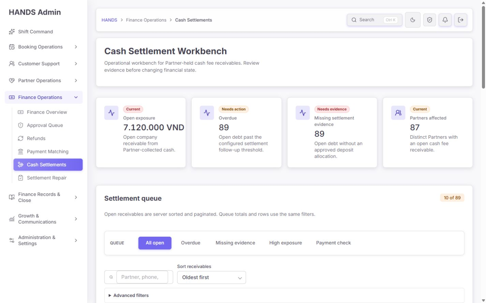

1. 1440px 기본 진입에서 sidebar, breadcrumb, H1, 설명, 네 개 핵심 KPI의 위계가 명확하다.
2. 기본 범위가 All dates이고 현재 89건, 7,120,000 VND, overdue 89, missing evidence 89, 87 partners를 즉시 노출한다.
3. `Today` 0건 때문에 전체 backlog를 숨기던 이전 오판 위험이 사라졌다.
4. KPI가 네 개로 줄어들어 운영자가 첫 화면에서 규모·기한·증빙·영향 파트너를 읽을 수 있다.

건강도: **좋음**. 다만 KPI가 선택 queue에 따라 모두 0으로 바뀌는 scope 문제는 3.7에서 별도로 다룬다.

### 3.2 필터와 queue — 구조는 개선됐지만 운영 신호가 부족함

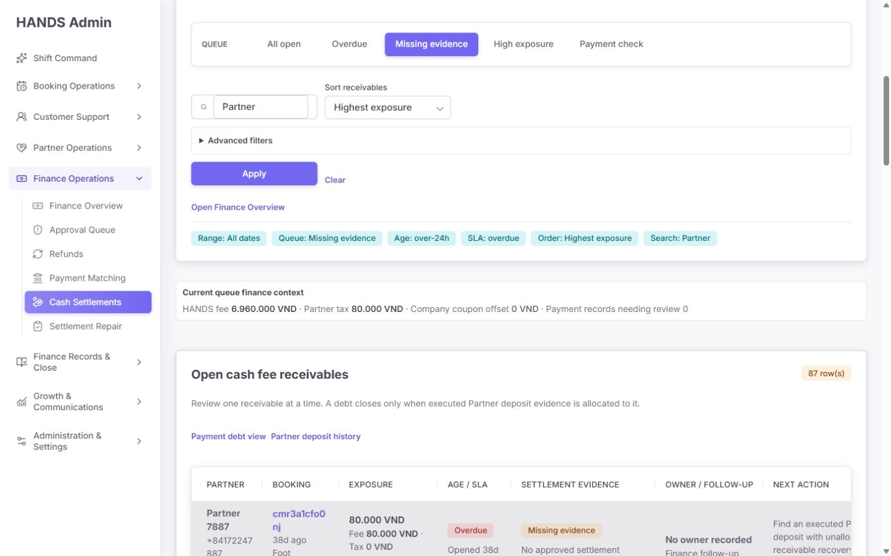

1. Queue tab → search/sort → advanced filters의 2단 구조는 이전 중복 UI보다 훨씬 낫다.
2. 복합 URL `queue=missing-evidence&age=over-24h&sort=highest-debt&sla=overdue&page=2&pageSize=25&q=Partner`에서 Review, Close, pagination이 상태를 보존했다.
3. 잘못된 `sort=highest`는 지원 값인 `oldest`로 안전하게 정규화된다.
4. 그러나 queue tab에 건수 badge가 없다. 현재 실제 분포는 `All open 89 / Overdue 89 / Missing evidence 89 / High exposure 0 / Payment check 0`인데, 운영자는 tab을 눌러 보기 전에는 이를 알 수 없다.
5. 현재 데이터에서는 All open·Overdue·Missing evidence가 사실상 같은 89건이고 High exposure·Payment check는 비어 있어, 다섯 tab이 우선순위를 나누기보다 탐색 비용을 만든다.
6. Active filter summary는 바뀐 조건만 보여주지 않고 기본값인 `Range: All dates`, `Age: all`, `Order: Oldest first`까지 항상 출력한다.
7. `Apply`가 넓은 primary control로 표현되어 검색·정렬보다 시각적 비중이 크다.

권고:

- 각 queue에 서버 authoritative count badge를 붙인다.
- `All open`을 1차 queue로 두고, `Overdue`, `Missing evidence`는 quick filter chip으로 운영하거나 count가 실제로 분기될 때만 동일 수준 tab으로 유지한다.
- 0건인 `High exposure`, `Payment check`는 `Additional queues` 또는 overflow menu로 내리고 badge를 함께 표시한다.
- High exposure의 500,000 VND 기준을 tooltip/help text로 명시한다.
- active filter chip은 사용자가 기본값에서 변경한 항목과 search만 표시한다.
- Apply는 검색·정렬과 같은 toolbar 크기로 줄이고, filter 변경 시 적용되는 범위를 명시한다.

건강도: **보통**.

### 3.3 표 — 1440px에서도 스캔 효율이 부족함

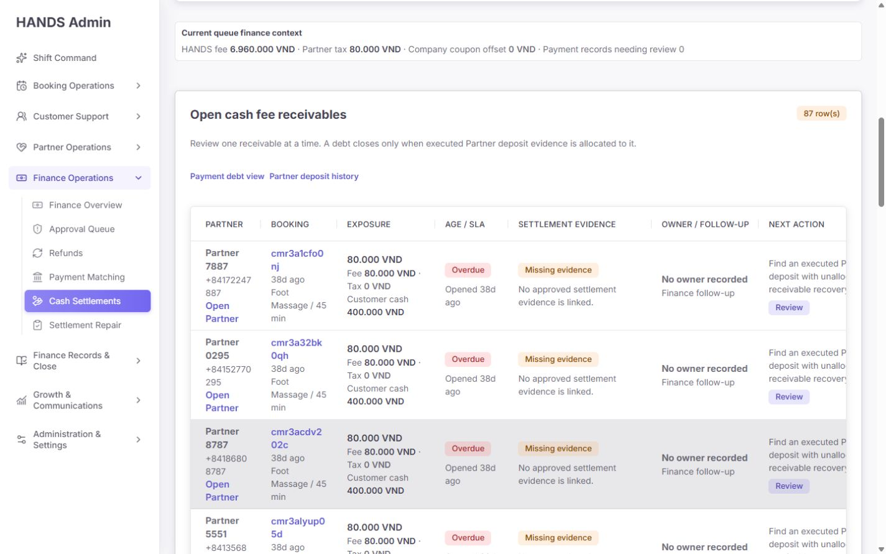

1. 표의 정보 축은 Partner, Booking, Exposure, Age/SLA, Evidence, Owner, Next action으로 운영 의미에 맞게 재구성됐다.
2. 한 행에 여러 입력 폼이 있던 이전 구현과 달리, 행의 주동작이 Review 하나로 줄었다.
3. 그러나 1440px에서 표 container는 약 1050px인데 table의 CSS `min-width`는 1180px라 내부 horizontal scroll이 발생한다.
4. booking ID와 전화번호가 좁은 폭에서 여러 줄로 잘리고, 가장 중요한 Next action 설명도 오른쪽에서 과도하게 줄바꿈된다.
5. 10행 기본 페이지의 문서 높이가 약 3,170px이고 표 H2 시작점이 약 y=1,242px다. 반복 업무 표가 첫 viewport 밖에 있어 검색 후 실제 작업까지 스크롤이 필요하다.
6. `Owner / follow-up`은 존재하지만 모든 행이 같은 하드코딩 문구다. 실제 owner가 없음을 알려주는 것과 업무 필드가 구현된 것은 다르다.

권고 최종 열 구성:

1. `Partner / Booking`: Partner, phone, booking short ID, service를 한 열로 합친다.
2. `Remaining exposure`: 남은 채권을 1차, 원채권·배분액을 2차로 표시한다.
3. `Age / SLA / Evidence`: overdue 및 evidence 상태를 짧은 badge로 결합한다.
4. `Owner / next follow-up`: 실제 assignee, last contact, next due를 표시한다.
5. `Action`: 한 줄 next action label + Review button만 둔다. 장문 안내는 drawer로 이동한다.

완료 기준은 1440px에서 horizontal scroll 없이 핵심 식별자와 Review가 한 화면 폭에 보이고, 첫 work row가 1,100~1,200px 이내에서 시작하는 것이다.

건강도: **개선 필요**.

### 3.4 Review drawer — 핵심 금융 안전성은 좋음

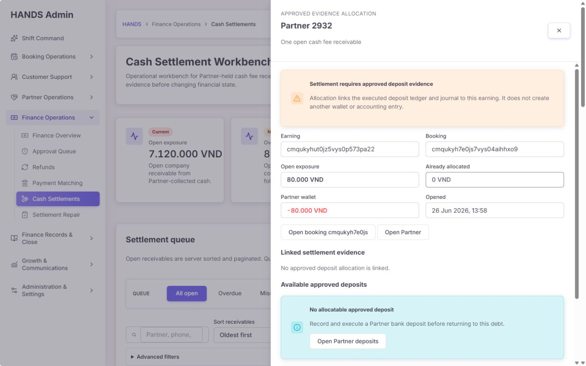

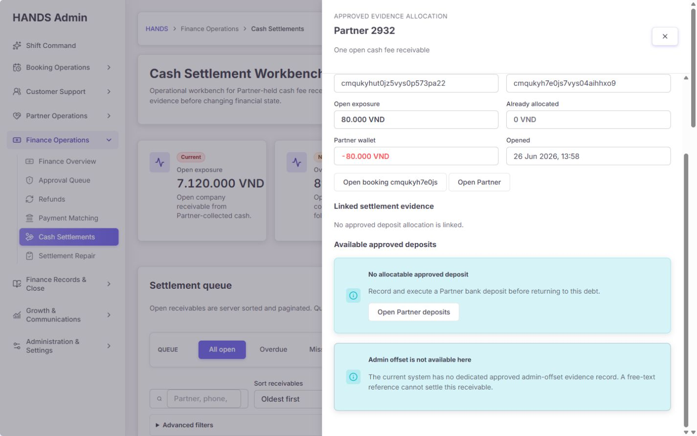

1. earning ID와 booking ID를 축약하지 않고 보여준다.
2. `Open exposure`, `Already allocated`, Partner wallet, opened time을 한 묶음으로 제공한다.
3. linked approved deposit과 available approved deposit을 분리하고, deposit evidence 원문으로 이동할 수 있다.
4. ledger entry와 journal batch가 있는 `EXECUTED` deposit만 후보가 된다.
5. 가용 deposit과 remaining debt 중 작은 값을 allocation max로 사용한다.
6. free-text reference나 synthetic ID는 증빙이 아니라고 명확히 쓰고, 승인 모델이 없는 Admin offset은 차단한다.
7. 열릴 때 close button으로 focus가 이동하고 Escape로 닫힌 뒤 원래 Review link로 focus가 복귀했다.
8. dialog role, `aria-labelledby`, 고유 close label이 확인됐다.

남은 개선:

- API가 `auditLogs`를 50개까지 조회하지만 drawer는 timeline을 렌더하지 않는다. 최근 배분·실패·수정·담당자를 보여주는 audit section을 추가한다.
- 이미 배분된 경우 `Original debt / Allocated / Remaining` 세 값을 동시에 보여 목록과 의미를 맞춘다.
- 성공 시 ledger/journal/deposit allocation ID로 이동할 수 있는 링크를 결과 notice에 제공한다.
- 기본 Audit reason은 raw ID를 이어 붙인 boilerplate다. reason code를 선택하고 operator가 실제 사유·확인 내용을 작성하게 하되, 최소 길이만으로 감사 품질을 대신하지 않는다.
- 사용자의 권한에 allocation capability가 없으면 submit form을 숨기거나 disabled 상태로 이유를 선제 표시한다.

건강도: **좋음, 후속 보강 필요**.

### 3.5 잘못되거나 stale한 review 대상 — 건강함

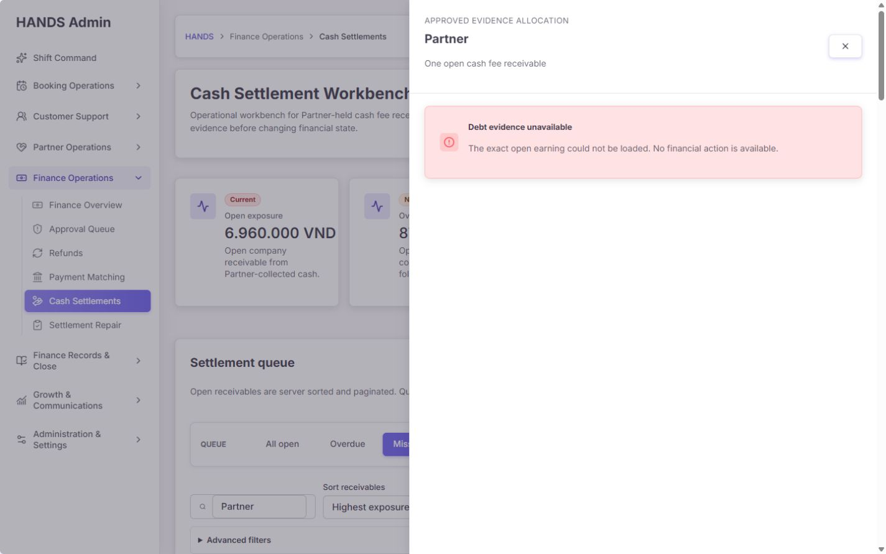

1. 현재 필터·검색·정렬·페이지 문맥이 유지된다.
2. 정확한 earning을 찾지 못하면 `Debt evidence unavailable`과 `No financial action is available`을 표시한다.
3. 실패 상태에서 금융 submit control이 렌더되지 않는다.

건강도: **좋음**.

### 3.6 legacy full view와 운영 가이드 — 정리는 성공, 발견성은 부족

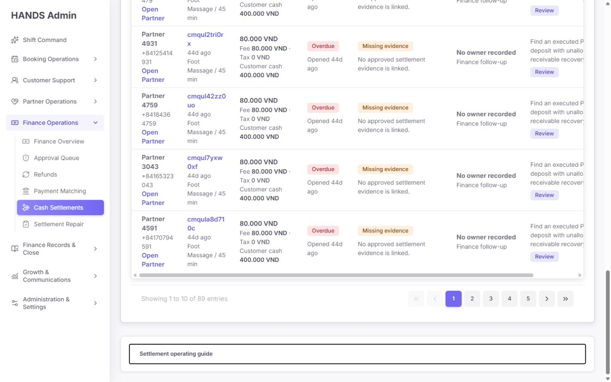

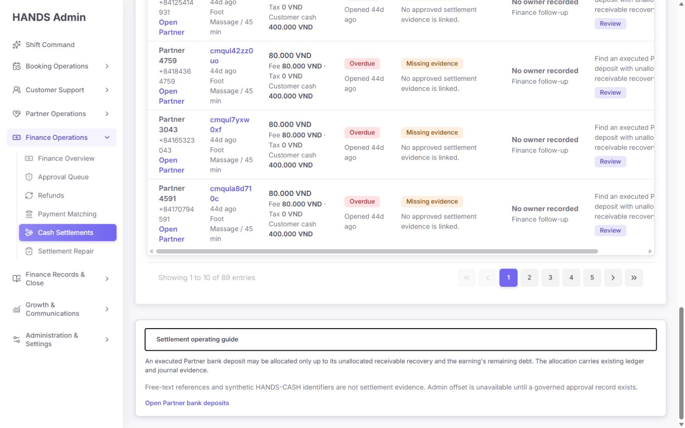

1. `?view=full`은 더 이상 별도 10,000px dashboard를 만들지 않고 동일 workbench로 정규화된다.
2. 반복되던 command/priority/rule/workflow/provider section이 사라졌다.
3. 운영 규칙은 짧은 disclosure에 모이고 synthetic evidence와 admin offset 정책을 명확히 설명한다.
4. 다만 guide는 표 전체 뒤에 있어 89건을 처리하는 신규 운영자가 찾기 어렵다.
5. URL은 내부적으로 `full → guide`로 읽지만 address bar의 legacy `view=full` 자체는 즉시 canonical redirect되지 않는다.

권고:

- header 또는 filter panel 우측에 `Operating guide` 링크를 두고 drawer/modal로 연다.
- legacy `view=full`은 server redirect로 `view=guide` 또는 canonical root에 정규화한다.
- 사용되지 않는 구 full-view component와 그 테스트를 삭제해 재도입 위험과 테스트 비용을 줄인다.

건강도: **좋음**.

### 3.7 0건 queue — 글로벌 backlog를 숨기는 scope 오류

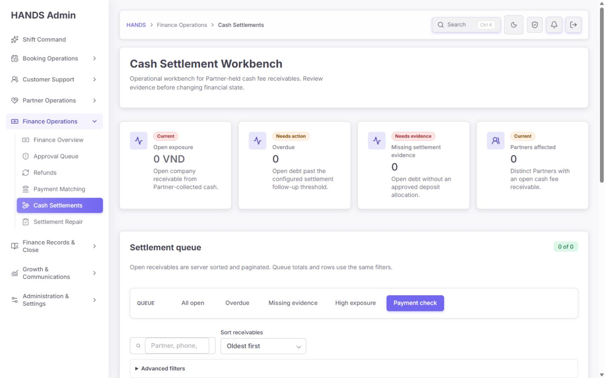

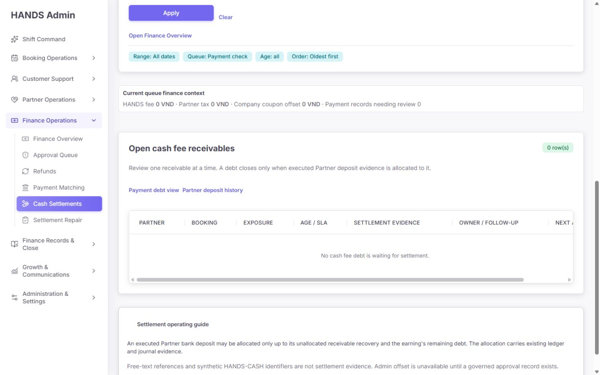

`Payment check`를 선택하면 89건/7,120,000 VND의 전체 backlog가 존재하는데도 네 KPI가 모두 0으로 바뀐다. 설명상 queue totals이 같은 filter를 따르는 것은 기술적으로 일관되지만, `Open exposure`, `Overdue`, `Partners affected`라는 일반 명칭 때문에 운영자는 전체 backlog가 0이라고 오해할 수 있다.

또한 0건 상태에서도 네 개 0 KPI, filter panel, finance context, 7열 빈 table shell, horizontal scrollbar가 모두 남고 마지막에야 `No cash fee debt is waiting for settlement`이 보인다.

권고:

- 상단 command KPI는 global open scope로 고정하고 `All open 89 · 7,120,000 VND`를 유지한다.
- 선택 queue 값은 별도 `Filtered queue` summary로 표시한다. 만약 KPI를 filter scope로 유지한다면 모든 label에 `Selected queue`를 명시한다.
- 0건일 때 table shell과 scrollbar를 제거하고 filter 바로 아래 compact empty state를 보여준다.
- empty state CTA는 `Return to All open (89)`와 `Clear filters`로 제공한다.
- 문구를 queue별로 구체화한다. 예: `No booking-payment anomalies are waiting for review.`

건강도: **개선 필요**.

### 3.8 Dark mode와 접근성 — 기본 품질은 양호

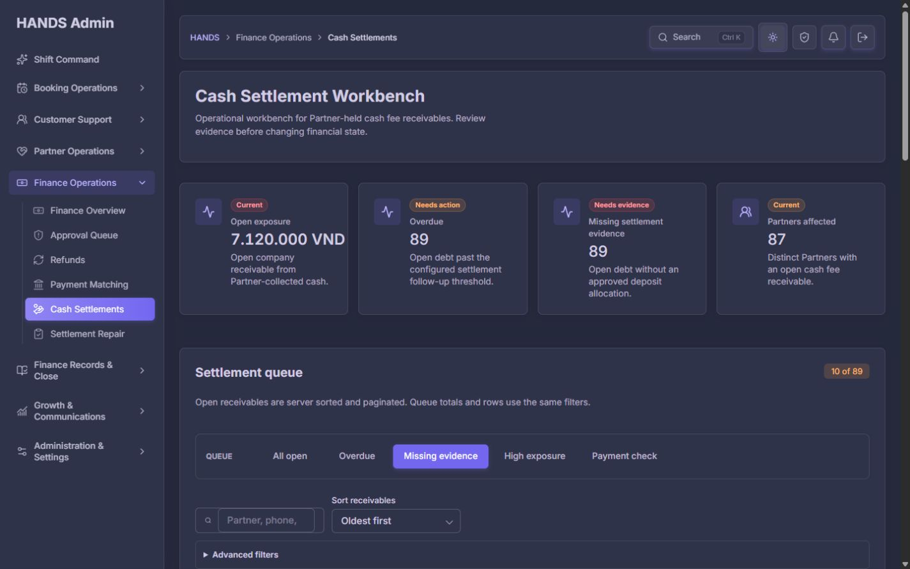

- dark mode의 본문, KPI, tab, filter, badge 대비는 육안상 안정적이다.
- H1은 1개, main landmark는 1개, duplicate ID는 없고 sidebar active item에 `aria-current=page`가 있다.
- search의 접근성 이름 `Search cash settlement queue`가 노출된다.
- drawer keyboard focus와 Escape 복귀가 정상 동작했다.
- body 전체 horizontal overflow는 없지만 work table 내부 overflow는 존재한다.
- `document.title`이 비어 있고 skip link가 없다.

권고:

- route metadata에 `Cash Settlement Workbench | HANDS Admin` 같은 document title을 지정한다.
- 공통 shell에 `Skip to main content`를 추가한다.
- 표의 ID/전화번호는 단어 중간 강제 분할 대신 copy affordance 또는 짧은 표시+전체 accessible label을 사용한다.

이 검토는 실제 1440px 화면과 DOM 기반 감사이며 WCAG 적합성 인증은 아니다.

## 4. 코드·금융 무결성 핵심 발견

### P1-01. 부분 배분 후 남은 채권이 목록·요약·정렬에 반영되지 않음

증거:

- `apps/admin_web/app/cash-settlements/cash-settlement-page-rows.ts:35`는 `debtAmount = Math.abs(earning.netAmount)`를 사용한다.
- 같은 row에서 allocation 합계는 별도 `allocatedAmount`로만 계산하고 Exposure에서는 차감하지 않는다.
- `apps/api/src/earnings/earnings.service.ts:1460`의 `totalDebtAmount`도 raw `netAmount` 합계의 절대값이다.
- `highest-debt` queue와 정렬은 `netAmount` 원금 기준이다.
- 반면 detail은 `apps/api/src/earnings/earnings.service.ts:1549`에서 `abs(netAmount) - allocatedAmount`를 정확히 계산한다.

영향:

- list, KPI, drawer가 서로 다른 open exposure를 표시한다.
- High exposure queue와 우선순위가 실제 남은 위험보다 과장될 수 있다.
- 파트너·전체 합계가 부분 배분만큼 부풀려진다.

수정 원칙:

- `remainingDebtAmount`를 list, summary, provider aggregation, high-exposure filter, highest-exposure sort의 단일 source of truth로 만든다.
- pagination 후 client에서 차감·정렬하지 않는다.
- 운영 규모가 크다면 transaction에서 `allocatedCashDebtAmount` 또는 `remainingCashDebtAmount`를 원자적으로 유지하거나 SQL read model/subquery로 서버 정렬 가능한 값을 만든다.
- 표에는 `Remaining 100,000 / Original 170,000 / Allocated 70,000`을 표시한다.

필수 회귀 테스트:

- 원채권 170,000, 배분 70,000이면 list·KPI·provider total이 모두 100,000이다.
- remaining 499,999는 High exposure 500,000 queue에서 제외된다.
- highest exposure 정렬은 remaining 기준으로 page 경계 전에 수행된다.
- 완전 배분된 earning은 open queue와 summary에서 제외된다.

### P1-02. 조회 권한과 실행 권한 카테고리가 다르지만 UI가 이를 선제 표현하지 않음

- cash settlement list/detail은 `FINANCE_SETTLEMENTS` 경로다.
- allocation POST는 `/provider-wallet/deposit-requests/:id/cash-debt-allocations`라 `FINANCE_WALLET_ADJUSTMENTS`에 매핑된다.
- 상위 `FINANCE` 권한은 둘 다 통과하지만 세분 권한만 가진 운영자는 drawer와 form을 본 뒤 submit에서 403을 받을 수 있다.

수정:

- 이 배분이 Settlement 권한인지 Wallet Adjustment 권한인지 업무 정책을 확정한다.
- 전용 cash-settlement allocation route로 권한을 맞추거나, UI에 operator capability를 전달해 form을 숨기고 `You can review but cannot allocate`를 표시한다.
- maker/checker가 필요한 경우 `request allocation`과 `approve allocation` 권한을 분리하되 실패 후에야 알게 만들지 않는다.

### P1-03. Owner/follow-up 컬럼이 실제 데이터가 아닌 placeholder

`apps/admin_web/app/cash-settlements/cash-settlement-open-debt-table-section.tsx:136-137`은 모든 행에 `No owner recorded / Finance follow-up`을 하드코딩한다.

수정:

- 최소 필드: ownerAdminId, ownerName, assignedAt, lastContactAt/result, nextFollowUpAt, promiseToPayAt, escalationLevel/reason.
- 아직 domain model을 만들지 않을 경우 컬럼을 제거하고 `Assignment is not available`을 페이지 수준에서 한 번만 알린다.
- owner/next follow-up 정렬·필터와 stale assignment takeover 규칙을 함께 구현한다.

## 5. P2/P3 개선 backlog

| ID | 우선순위 | 문제 | 구체적 수정 |
|---|---|---|---|
| CS-04 | P2 | Queue에 count가 없고 현재 3개가 89건으로 중복, 2개가 0건 | authoritative count badge, 0건 additional queue, threshold 설명 |
| CS-05 | P2 | 0건 queue에서도 global backlog가 0처럼 보임 | global KPI와 filtered summary 분리 |
| CS-06 | P2 | 빈 table shell·scrollbar까지 렌더 | filter 직후 compact empty state와 All open CTA |
| CS-07 | P2 | 1440px 표에 1180px min-width가 강제돼 내부 scroll | 열 5개 수준으로 통합, 장문을 drawer로 이동, 고정 min-width 제거 |
| CS-08 | P2 | auditLogs를 조회하지만 화면에 미표시 | drawer에 최근 audit timeline과 actor/result 링크 |
| CS-09 | P2 | summary 요청이 약 15개 DB operation을 수행 | 불필요한 topProviderGroups/profile hydration 제거, count aggregation 통합, query timing 계측 |
| CS-10 | P2 | current page가 사용하지 않는 `topProviderGroups`까지 API가 생성·전송 | `includeTopProviders` 분리 또는 전용 lightweight workbench summary |
| CS-11 | P2 | active filter에 기본값까지 표시 | changed-only chip 생성 |
| CS-12 | P2 | 운영 가이드가 표 뒤에 묻힘 | header action + drawer, legacy `full` canonical redirect |
| CS-13 | P2 | dead legacy confirmation helper에 `ADMIN_OFFSET`와 root cancel이 남음 | helper/spec 삭제 또는 governed offset model로 완전 교체 |
| CS-14 | P3 | page row/type에 렌더하지 않는 legacy 필드가 다수 남음 | actionRows, preview, defaults 등 unreachable model 제거 |
| CS-15 | P3 | 기본 Audit reason이 raw ID 기반 boilerplate | reason code + 실제 상세 사유 + reviewed evidence 체크 |
| CS-16 | P3 | document title과 skip link 없음 | route metadata, 공통 skip navigation |

## 6. 성능 분석

현재 페이지는 review가 닫혀 있을 때 list와 summary를 병렬 호출하고, review가 열리면 detail을 추가 호출한다. 병렬화 자체는 적절하다. 문제는 summary 한 번의 내부 비용이다.

`cashSettlementSummaryForAdmin`은 현재 구현 기준 대략 다음을 수행한다.

1. SLA policy 1회
2. aggregate/count/groupBy 및 evidence/payment/coupon 관련 8회
3. age bucket count 5회
4. SLA overdue count 1회
5. top 20 partner profile hydration 1회

즉 summary만 약 15개의 DB operation이며, 현재 Cash Settlement Workbench는 `topProviderGroups`를 렌더하지 않는다. review drawer를 열면 exact earning, available deposits, wallet balance, audit logs 조회가 추가된다.

권고:

- `topProviderGroups` 계산과 profile query를 기본 summary에서 제거한다.
- age/SLA/queue count를 조건부 aggregation 또는 전용 SQL read query로 통합한다.
- coupon JSON 전체 `findMany` hydration을 가능한 경우 저장된 정규 필드·집계로 교체한다.
- API 응답에 Server-Timing 또는 structured query timing을 넣고 p50/p95를 측정한다.
- acceptance target 예시: warm local이 아닌 staging 운영 데이터에서 workbench p95 API ≤ 800ms, review detail p95 ≤ 600ms. 실제 인프라 기준을 합의해 확정한다.

이번 보고서는 캡처 후 인증 세션이 종료돼 신뢰할 수 있는 새 warm timing 표본을 산출하지 않았으며, 성능 판정은 코드 경로와 렌더 구조에 기반한다.

## 7. 운영자가 꼭 필요하지만 아직 없는 정보

- 실제 담당자와 팀, 할당 시각
- 마지막 연락 시각·채널·결과
- 다음 follow-up 예정 시각
- Partner가 약속한 입금일과 약속 금액
- escalation level, 사유, 승인자
- Partner 현지 시간과 연락 가능 시간
- 최근 audit timeline과 상태 변경 actor
- 원채권 / 누적 배분 / 남은 채권의 일관된 표시
- 최근 완료·실패 결과 history 및 allocation/deposit/ledger/journal 링크
- 현재 로그인 운영자의 `review only` / `allocate allowed` capability

이 중 owner, next follow-up, promise date가 없으면 89건 모두 overdue인 상황에서 팀 단위 분배와 인수인계가 불가능하다.

## 8. 권장 최종 화면 구조

1. Header: Cash Settlement Workbench, global open count/amount, last refreshed, Operating guide.
2. Global command strip: Open exposure / Overdue / Missing evidence / Partners affected.
3. Queue toolbar: All open + quick filters + count badge, search, remaining-exposure sort, advanced filters.
4. Filtered result summary: 선택 queue 건수·금액·적용된 변경 조건만 표시.
5. Compact work table: Partner/Booking, Remaining, Age/Evidence, Owner/Follow-up, Action.
6. Review drawer: original/allocated/remaining, booking/payment, deposit evidence, permission, audit timeline, governed action.
7. Empty state: table shell 대신 queue별 설명, `Return to All open (n)`, clear filter.
8. Secondary navigation: Partner deposits, recently settled/history, failed allocations.

## 9. 테스트 및 자동 검사 결과

- Admin Web cash-settlements: **10 files, 43 tests passed**.
- API 관련 선택 테스트: **6 files, 917 tests passed**.
- 포함 범위: earnings service, admin service/controller/DTO, operator category guard, route-domain ownership.
- Impeccable detector: global CSS에서 side-tab 계열 6건을 보고했으나 모두 Vietnam map, marketing, dispatch, timeline, booking 등 Cash Settlements가 사용하지 않는 selector였다. 현재 Cash Settlements 컴포넌트에 직접 해당하는 deterministic finding은 없었다.

테스트 gap:

- 부분 배분 후 remaining 기준 list/summary/filter/sort 회귀 테스트가 없다.
- 세분 권한이 `FINANCE_SETTLEMENTS`만 있거나 `FINANCE_WALLET_ADJUSTMENTS`만 있는 실제 UI capability 테스트가 없다.
- owner/follow-up은 placeholder를 기대하는 테스트가 있어 현재 미구현 상태를 오히려 고정한다.
- 0건 queue의 global KPI/filtered KPI 의미 검증이 없다.
- 1440px에서 work table horizontal overflow를 방지하는 visual/layout regression이 없다.

## 10. 배포 판정과 수정 순서

**판정: 조건부 통과.** 이전 P0 금융 안전 문제는 실행 경로에서 해결됐으나, 부분 배분을 지원하는 현재 도메인에서 remaining exposure 불일치는 배포 전 수정해야 한다.

### Phase 1 — 배포 전

1. remainingDebtAmount를 list/summary/provider aggregation/high-exposure/sort의 단일 기준으로 통일한다.
2. 부분·완전 배분 회귀 테스트를 추가한다.
3. settlement 조회 권한과 allocation 실행 권한을 정합화하거나 capability-gated UI를 구현한다.

### Phase 2 — 운영 효율

1. 실제 owner/follow-up/promise/escalation 모델을 추가한다.
2. 1440px table을 5열 수준으로 압축하고 horizontal scroll을 제거한다.
3. global KPI와 filtered queue summary를 분리하고 count badge·compact empty state를 구현한다.

### Phase 3 — 품질·성능

1. audit timeline과 성공 결과 evidence 링크를 drawer에 추가한다.
2. summary의 불필요한 top provider hydration과 다중 count query를 최적화한다.
3. dead legacy full-view/ADMIN_OFFSET/action model을 삭제한다.
4. metadata title, skip link, staging p95 계측을 추가한다.

## 11. 최종 완료 조건

- 부분 배분 후 모든 화면·API의 open amount가 남은 채권과 정확히 일치한다.
- remaining 기준 queue, sort, pagination이 서버에서 수행된다.
- 운영자는 submit 전에 자신의 실행 권한 여부를 알 수 있다.
- 모든 행에 실제 owner와 next follow-up이 있거나, 기능이 없음을 placeholder column 없이 명확히 표현한다.
- 1440px에서 work table에 horizontal scroll이 없고 ID·Next action이 읽힌다.
- 0건 queue에서도 global backlog와 selected queue 0이 동시에 명확하다.
- Review/Close/Success/Error가 canonical filter/query/page 문맥을 보존한다.
- 성공 결과에서 audit/allocation/deposit/ledger/journal evidence를 추적할 수 있다.
- Admin Web/API 회귀 테스트와 staging 데이터 기반 성능 기준을 통과한다.

