# Chat Evidence Search 운영자 UX·보안 심층 감사 보고서

- 감사일: 2026-08-06 (Asia/Bangkok)
- 대상: `http://localhost:3101/chat-archive`
- 범위: 로그인된 실제 관리자 화면, 기본/전체 기간/검색/발신자/잘못된 날짜/범위 밖 페이지, 1024×768·1280×720·1440×900 화면, Admin Web·API·Prisma·권한·감사·보존/내보내기 문서
- 방식: 화면과 DOM을 먼저 캡처한 뒤 연결 코드를 추적했다. 데이터 변경, CSV 다운로드, 채팅 수정, 복구 실행은 하지 않았다.
- 콘솔: 점검한 상태에서 warning/error 0건

## 1. 결론

이 경로는 **삭제할 페이지가 아니다.** 예약·고객·Partner 상세를 하나씩 열지 않고 여러 예약의 대화 증거를 찾는 글로벌 검색 수요가 실제로 있으며, 로컬 데이터만 해도 전체 범위에서 1,077개 방이 조회된다. 다만 현재 화면은 이름과 달리 `Chat Evidence Search`가 아니라 **채팅방 등록부 + 운영 지표 + 페이지 미리보기 CSV**에 가깝다.

운영 투입 전 P0 수정이 필요하다. 가장 큰 문제는 미관이 아니라 결과 신뢰와 민감정보 통제다.

1. `All time`을 화면에서 선택해도 Today의 From/To가 남아 실제로는 오늘만 조회된다.
2. 날짜 필터는 메시지 전송 시각이 아니라 예약의 opened/created/updated/matched/closed/expires 시각 중 하나를 사용한다.
3. 검색은 전체 메시지 본문을 대상으로 하지만 결과 목록에는 일치한 메시지 문구·발신자·전송 시각이 나타나지 않는다.
4. Partner 발신 필터는 “Partner 메시지가 하나라도 있는 방”을 찾을 뿐이다. 화면의 `32 messages`에는 Customer 메시지 13건이 포함되고 CSV에도 Customer 최신 메시지가 들어간다.
5. 목록·요약 API 오류와 잘못된 날짜 400 응답이 `adminGet` fallback 때문에 정상적인 0건으로 보인다.
6. `page=999`는 데이터 요청에는 999를 사용하면서 페이지 UI만 108로 보정한다. 결과는 `0 rows / 258 messages / Showing 0 to 0 of 1077 / page 108 selected`가 동시에 표시된다.
7. CSV는 메시지·양측 전화번호를 `data:` URL로 페이지 HTML에 직접 넣고, 서버 권한 재확인·내보내기 감사 기록·보존 정책 집행 없이 다운로드된다.
8. `CUSTOMERS_REVIEWS` 권한이 전체 채팅 증거를 열 수 있지만, 권한 설명상 chat evidence는 `BOOKINGS_DETAIL` 범위다. 현재 권한 정의가 서로 모순된다.
9. 기본 API에는 기존 production-data 필터가 없어 audit/smoke/seed 성격 데이터가 운영 결과에 섞인다.
10. 1024px에서는 1,180px 표가 561px 넘치고 1440px에서도 145px 넘친다. 핵심 작업과 날짜가 오른쪽에 숨는다.

권장 정보구조는 단순하다.

- 이 페이지는 **메시지 중심 글로벌 증거 검색**으로 유지한다.
- 한 행은 “일치한 메시지” 또는 “일치한 메시지 묶음”이어야 하며, 일치 문구·발신자·전송 시각이 첫 화면에 보여야 한다.
- 전체 대화 원문은 기존 Booking Activity의 읽기 전용 transcript에서 계속 확인한다.
- chat repair, missing room, active room without message 같은 무결성/운영 작업은 기존 `/bookings?view=chat-repair`에 둔다.
- 보존·내보내기 정책이 확정되기 전까지 현재 `data:` CSV 내보내기는 제거하거나 비활성화한다.

## 2. 실제 화면과 데이터 증거

| 상태 | 확인 결과 |
|---|---:|
| 기본 `/chat-archive` | Today, 0 rooms, 0 messages |
| 직접 `/chat-archive?range=all` | 1,077 rooms, 258 messages, 284 completed, 2 active, 835 empty |
| 화면에서 Today → All time 선택 후 Apply | URL에 `range=all&from=2026-08-06&to=2026-08-06`가 남아 0건 |
| `q=cancellation` | 8 rooms, 16 messages; 일치 메시지 문구는 목록에 없음 |
| `sender=partner` | 16 rooms, 32 total messages = 13 customer + 19 Partner |
| `page=999` | URL 999, UI 선택 108, total 1,077, rows 0 |
| From `2026-08-06` / To `2026-08-01` | API 400이지만 화면은 오류 없이 0건 |
| 1024px | 표 1,180px / 가용 619px / 561px overflow |
| 1280px | 표 1,180px / 가용 875px / 305px overflow |
| 1440px | 표 1,180px / 가용 1,035px / 145px overflow |

현재 데이터는 `audit_...` 식별자와 테스트용 인물이 다수 보이는 로컬 자료다. 따라서 835 empty rooms를 실제 운영 backlog라고 해석할 수는 없다. 오히려 default production-data 경계가 이 API에 없다는 점을 보여주는 증거다.

## 3. 화면 단계별 평가

### Step 1 — 기본 진입: 위험

**상태: 위험**

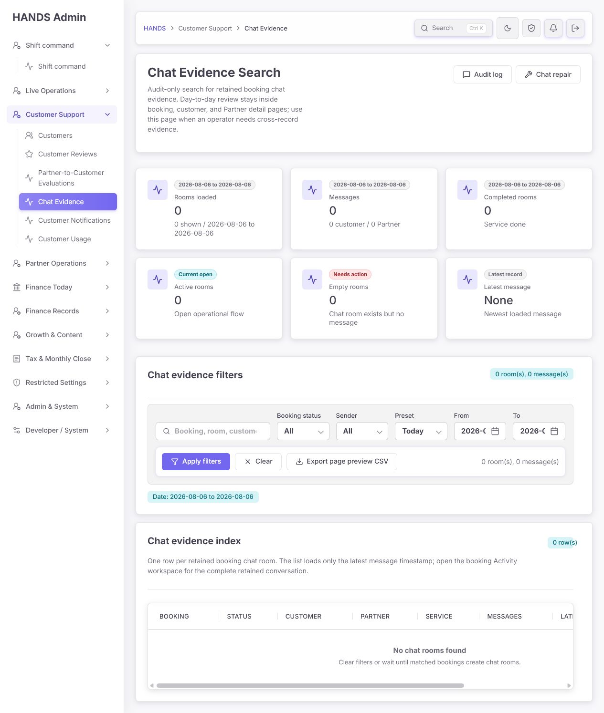

장점:

- H1과 설명이 이 화면을 cross-record evidence search라고 명확히 정의한다.
- 일상 검토는 Booking/Customer/Partner 상세에서 하고, 이곳은 조사용이라는 역할 구분이 좋다.
- `Audit log`, `Chat repair`의 인접 업무 링크가 있다.

문제:

- 글로벌 archive/search인데 기본값이 Today라서 첫 화면이 0건이다.
- 운영자는 “오늘 메시지가 없음”인지 “아카이브가 비어 있음”인지 즉시 구분하기 어렵다.
- `Clear`도 base route로 돌아가므로 필터를 제거하는 대신 Today를 다시 적용한다.
- 0건인데 6개 KPI와 큰 필터·표가 모두 렌더링되어 실제 해야 할 일이 없다.

권장:

- base route는 All time으로 하되 서버 페이지네이션을 유지한다.
- 운영 부하 때문에 범위를 제한해야 한다면 Last 30 days를 명시적 기본값으로 쓰고 “기본 범위: 최근 30일”을 표시한다. 현재처럼 암묵적 Today는 피한다.
- 빈 초기 화면에는 검색 입력과 최근 증거/범위 안내만 우선한다.

### Step 2 — 실제 전체 범위와 요약: 보통 이하

**상태: 구조 개선 필요**

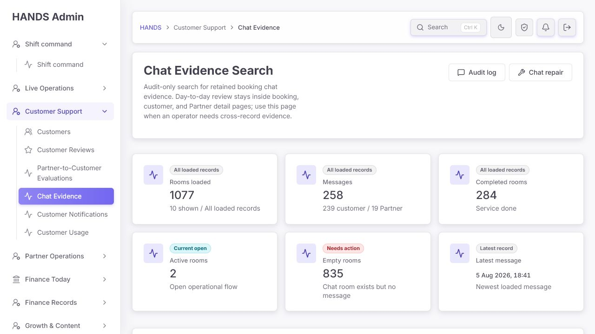

장점:

- API summary가 전체 일치 집합의 room/message count를 계산한다.
- 최신 메시지, Customer/Partner 메시지 수를 분리하려는 시도는 좋다.

문제:

- `Rooms loaded 1077`은 실제로 10개 row만 로드한 상태라 문구가 틀렸다. `Matching rooms` 또는 `Total rooms`여야 한다.
- 6개 카드가 첫 화면 대부분을 차지한다. 1440px에서 4+2 배열이 되어 두 번째 줄 오른쪽이 크게 빈다.
- `Completed`, `Active`, `Empty`는 서로 배타적인 상태가 아니며 증거 검색의 핵심 판단값도 아니다.
- 모든 empty room을 `Needs action`으로 표시한다. 완료·취소·테스트 방도 포함되므로 835건이 실제 조치 대상이라는 잘못된 인상을 준다.
- `Messages`의 역할 분해에는 Admin/System이 없다. 현재 데이터에서 우연히 합계가 맞을 뿐, Admin/System 메시지가 있으면 helper 합이 total과 달라진다.

권장:

- 요약은 한 줄로 축소한다: `Matching messages`, `Rooms represented`, `Latest match`, 필요하면 `Attachments`.
- `Active/Empty/Missing room` 상태는 Chat repair queue에서 실제 조치 가능 조건으로 계산한다.
- `Empty rooms`를 유지해야 한다면 `active or matched + no messages`처럼 조치 가능한 범위만 센다.

### Step 3 — 기간 필터: 실패

**상태: 실패**

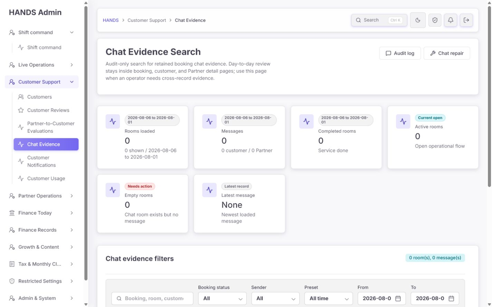

확인된 결함:

- `Preset`과 From/To가 동시에 활성 입력이다.
- Today에서 All time을 선택해도 기존 From/To가 자동으로 지워지지 않는다.
- 그 결과 All time 화면 선택이 `range=all&from=today&to=today`를 전송한다.
- From/To가 있으면 API에는 custom으로 보내지만 화면 select에는 Custom option이 없다. 사용자는 All time과 custom 중 무엇이 적용됐는지 알 수 없다.
- 임의 날짜를 넣은 상태에서 pagination href를 만들 때 `range !== custom`이면 From/To를 버리므로 2페이지부터 기간이 달라질 수 있다.
- 역전 날짜는 API에서 정상적으로 400을 반환하지만 Admin Web이 오류를 0건으로 숨긴다.
- shared `readDetailDateFilters`는 화면 내부 검사에서는 min/max로 날짜를 조용히 뒤집어 API 규칙과도 다르다.
- 최대 90일 custom 제한도 UI에 사전 안내가 없다.
- 무엇의 날짜인지 표시가 없다. 실제 서버 쿼리는 메시지 시각이 아니라 Booking lifecycle 시각이다.

권장:

- 한 가지 date mode만 사용한다: `All time / Today / 7 days / 30 days / Custom`.
- Preset 선택 시 custom From/To를 명확히 초기화하고, From/To 입력 시 mode를 Custom으로 바꾼다.
- 라벨을 `Message sent date`로 바꾸고 `ChatMessage.createdAt`을 기준으로 검색한다.
- 빈 custom, 한쪽 날짜만 입력, 역전 날짜, 90일 초과를 제출 전에 inline error로 안내한다.
- URL과 pagination이 q/status/sender/date/sort를 모두 보존하는지 테스트한다.

### Step 4 — 메시지 검색: 실패

**상태: 실패**

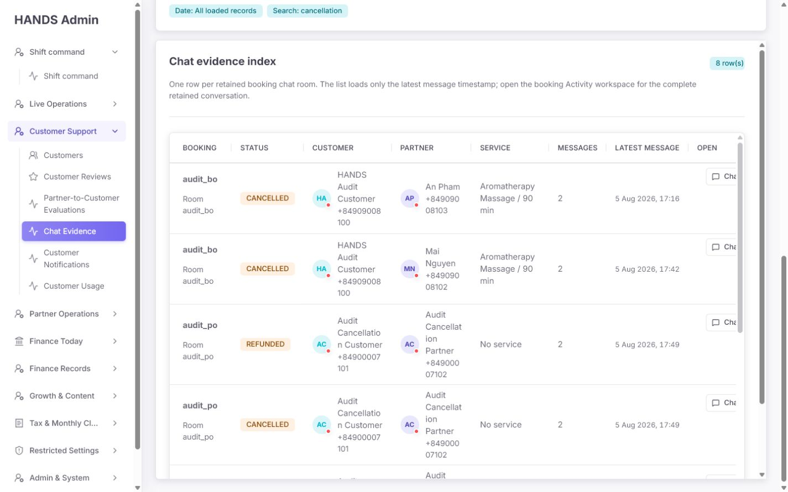

장점:

- 서버 검색은 booking ID, room ID, Customer/Partner ID·이름·전화번호, 메시지 body를 폭넓게 검색한다.
- 검색 상태가 URL에 남아 공유할 수 있다.

문제:

- `cancellation` 검색이 8개 방을 찾지만 어떤 메시지가 왜 일치했는지 보이지 않는다.
- 첫 두 행처럼 인물명에도 cancellation이 없으면 운영자는 4개의 링크 중 하나를 열어 transcript를 직접 뒤져야 한다.
- API는 방별 최신 메시지 한 건만 반환한다. 검색 일치 메시지가 최신이 아니면 Admin Web이 갖고 있지도 않다.
- summary의 `16 messages`는 검색어와 일치한 메시지 수가 아니라 “일치하는 방 안의 전체 메시지 수”다.
- 기본 정렬은 latest message가 아니라 Booking `updatedAt desc`다. 최신 증거가 위에 온다는 보장이 없다.

권장:

- 검색 API 결과 단위를 message match로 바꾼다. 최소 반환값: message id/body/sentAt/sender role, room/booking id, booking status, Customer, Partner, attachment count.
- 방별 그룹이 필요하면 첫 번째 일치 문구와 `N matching messages`를 표시한다.
- 기본 정렬은 `message.createdAt desc`, 보조 정렬은 message id로 안정화한다.
- 검색 문구를 2–3줄로 보여주고 일치 부분을 강조하되 새 라이브러리는 추가하지 않는다.

### Step 5 — Sender 필터: 실패

**상태: 실패**

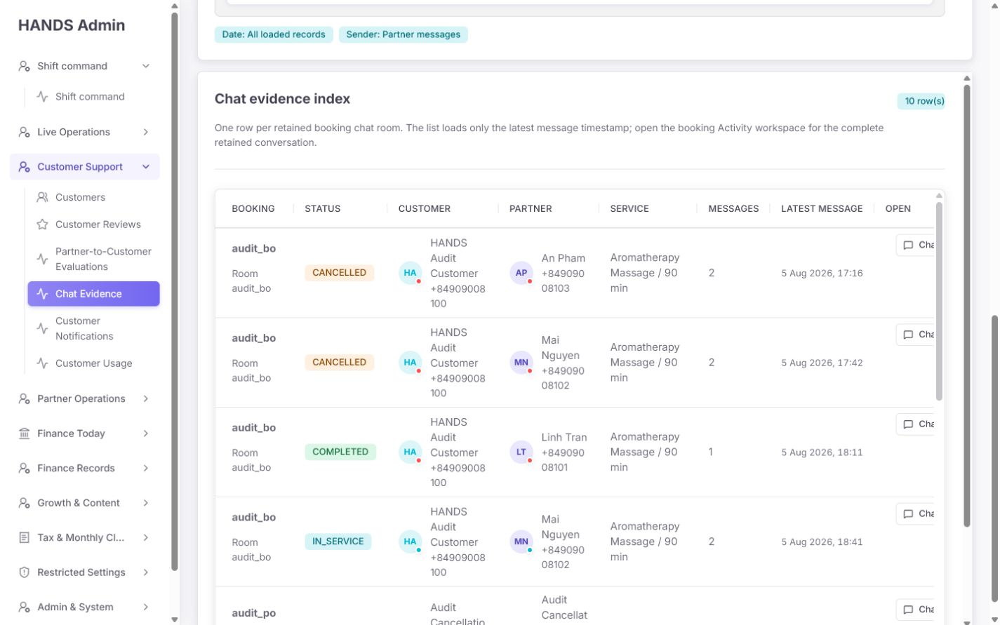

확인 결과:

- Partner messages 필터는 Partner가 작성한 메시지 19건이 아니라 Partner 메시지가 하나라도 있는 16개 방을 찾는다.
- 결과 badge는 `10 rooms, 32 messages`이며 32건에는 Customer 13건이 포함된다.
- 행에는 최신 메시지의 sender나 body가 없으므로 Partner 필터가 실제로 적용됐는지 검증할 수 없다.
- CSV는 page preview의 최신 메시지를 내보내므로 Partner 필터 상태에서도 Customer 최신 메시지가 포함된다.

권장:

- sender는 message-level 필터여야 한다.
- 결과 수, 화면 row, excerpt, CSV가 모두 같은 message predicate를 사용해야 한다.
- `Admin/system`을 하나로 묶을 정책이 맞는지 확인하고, 합계 helper에도 Other/Admin/System 수를 포함한다.

### Step 6 — 결과 인덱스와 다음 행동: 실패

**상태: 실패**

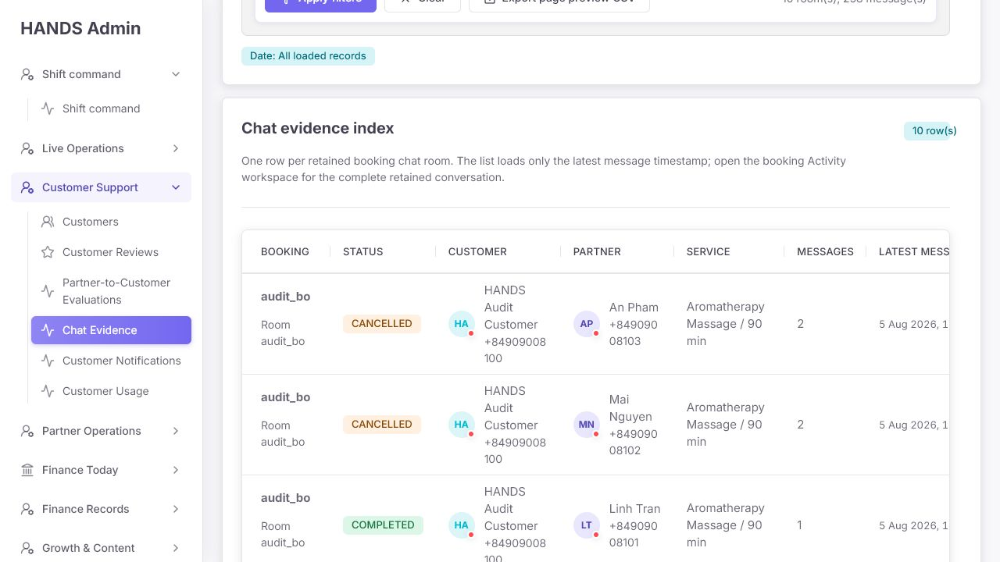

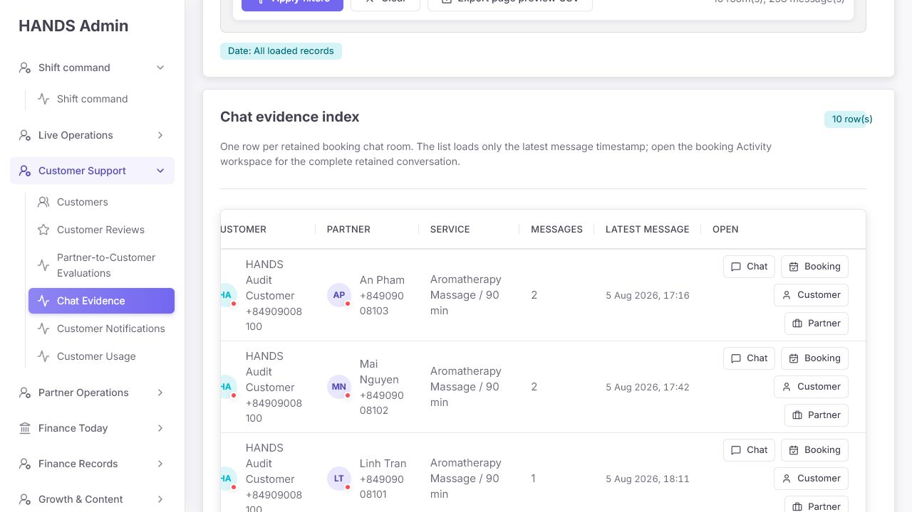

장점:

- semantic table과 status badge를 사용한다.
- Booking, Customer, Partner 상세로 이동할 수 있다.
- 전체 transcript를 이 페이지에 중복하지 않고 Booking Activity에서 읽게 한 점은 적절하다.

문제:

- 증거 검색의 핵심인 메시지 body가 없다.
- `shortId()` 때문에 여러 booking과 room이 모두 `audit_bo`로 보여 구분되지 않는다.
- Customer/Partner의 전체 전화번호가 기본 목록에서 높은 공간을 차지한다.
- avatar status의 `App offline`/`Work in progress`는 실제 app session이 아니라 Booking status에서 파생된다. 역사 증거 화면에서 실제 접속 상태처럼 오해된다.
- `Chat`과 `Booking`은 같은 URL이다.
- Customer/Partner 이름이 이미 상세 링크인데 Open 열에서 같은 링크를 다시 버튼으로 제공한다.
- Open 열이 수평 스크롤 뒤에 있다.
- attachment 유무가 보이지 않는다. DB와 Booking transcript는 attachments를 보유하지만 archive preview select는 제외한다.

권장 기본 행:

1. `Sent` — 메시지 전송 시각과 sender role
2. `Matched message` — 2–3줄 immutable excerpt + attachment indicator
3. `People` — Customer / Partner 이름, 전화번호는 기본 비표시
4. `Booking` — 읽을 수 있는 booking reference, status, service
5. `Open transcript` — 하나의 명확한 primary link

Customer/Partner 이름 링크는 유지하고 별도 Customer/Partner action button은 제거한다. Booking reference는 충돌하지 않는 길이 또는 복사 가능한 전체 ID를 제공한다.

### Step 7 — 범위 밖 페이지: 실패

**상태: 실패**

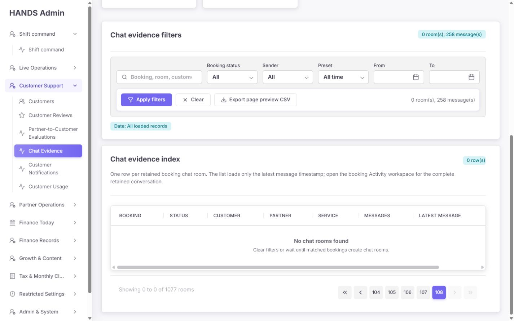

동시에 표시되는 내용:

- URL: `page=999`
- total: 1,077 rooms
- summary: 258 messages
- visible rows: 0
- range: `Showing 0 to 0 of 1077 rooms`
- pagination selected: 108

원인:

- API skip은 원래 activePage 999로 계산한다.
- footer 내부 UI는 totalPages 108에 맞춰 숫자만 clamp한다.
- clamp된 페이지 데이터를 다시 가져오거나 redirect하지 않는다.

권장:

- total을 받은 뒤 `page > totalPages`면 필터를 보존한 마지막 유효 URL로 redirect하고 그 페이지 rows를 다시 가져온다.
- 같은 패턴을 쓰는 다른 관리자 목록이 있다면 shared root cause를 한 번 수정한다.

### Step 8 — 검색 결과 없음과 오류: 위험

**상태: 위험**

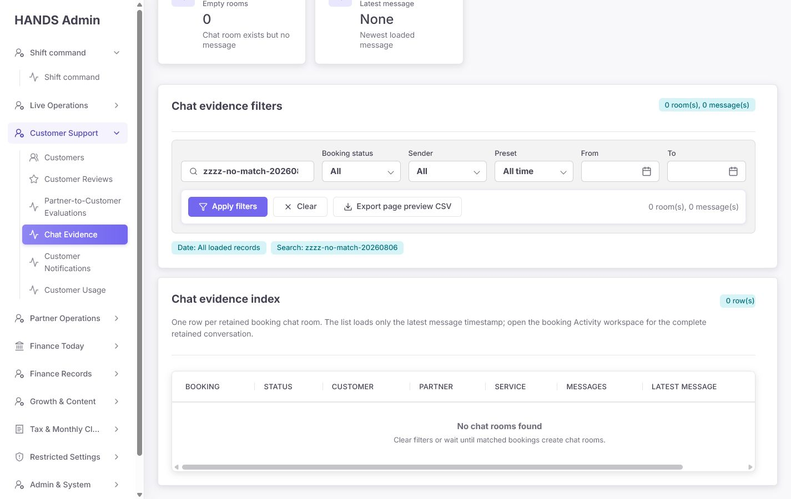

현재 empty copy는 모든 상황에 동일하다.

> No chat rooms found — Clear filters or wait until matched bookings create chat rooms.

이 문구는 다음을 구분하지 않는다.

- 전체에 아직 message가 없음
- 현재 검색/필터에 일치하지 않음
- 역전/90일 초과 custom 날짜 400
- list API 실패
- summary API 실패
- page 범위 밖

권장 상태:

- no data: `No retained messages exist in this scope.`
- no match: `No messages match the current search and filters.` + Clear filters
- invalid date: 입력 옆 inline error
- load failure: `Chat evidence could not be loaded.` + Retry
- partial failure: 어떤 count/list가 unavailable인지 명시

### Step 9 — 1024·1440 반응형: 실패

**상태: 실패**

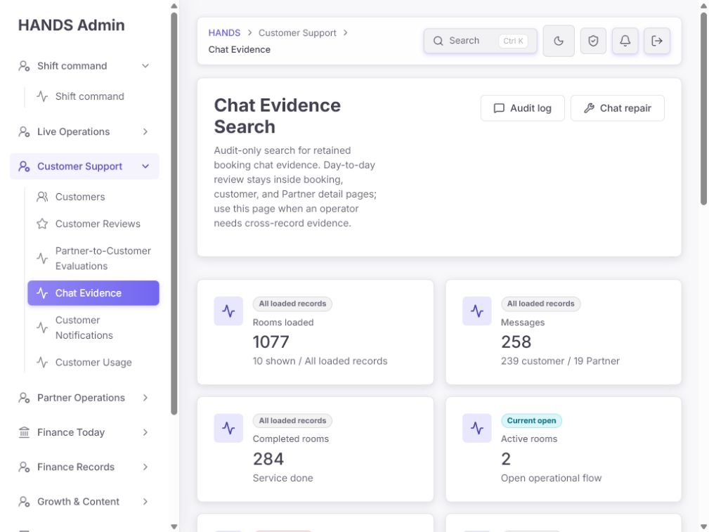

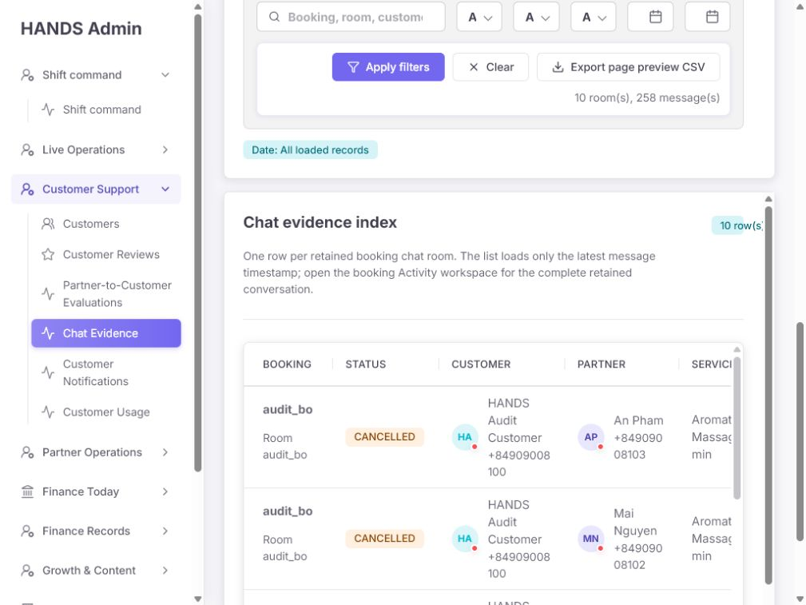

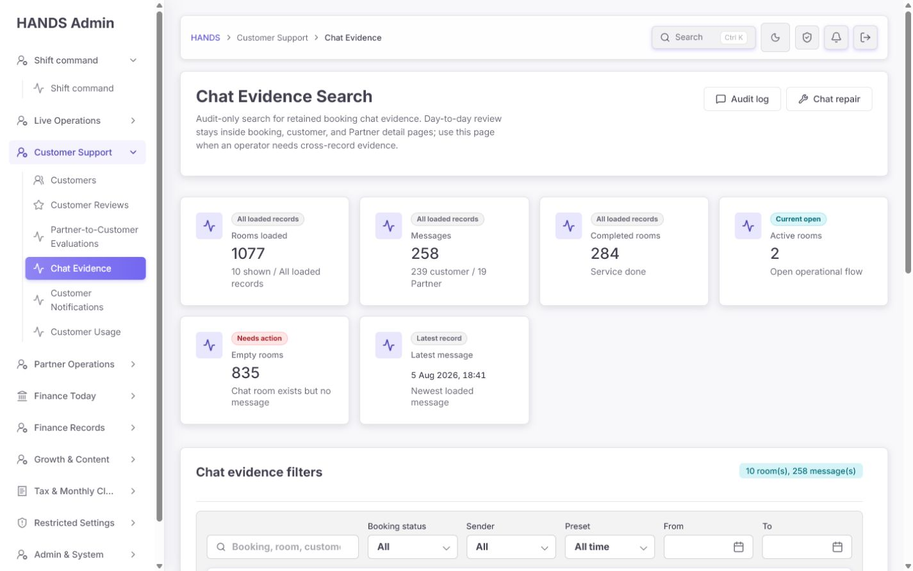

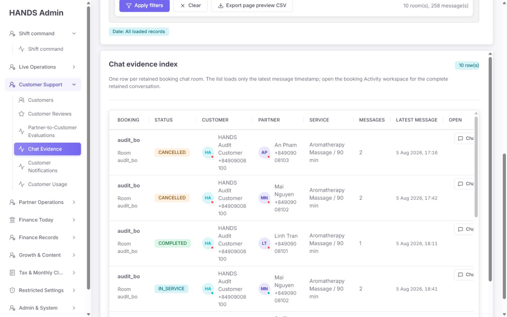

확인 결과:

- 1024px에서 select value가 `A`만 보일 정도로 6개 필터 열이 압축된다.
- 1024px에서 표는 가용 폭보다 561px 넓다.
- 1440px에서도 Open 열이 잘리고 145px 수평 overflow가 남는다.
- `.chat-archive-page > .card`가 자체 세로 scroll을 만들고 그 안의 `.admin-table-scroll`도 세로·가로 scroll을 만든다.
- sidebar, page, table card, table region에 스크롤 축이 중첩된다.
- 키보드/저시력 사용자는 현재 위치와 숨은 action을 찾기 어렵고, 200% zoom에서 2차원 스크롤 위험이 크다.

권장:

- 페이지 자체 세로 스크롤 하나만 유지한다. table 내부 vertical max-height는 제거한다.
- 5열 이하 message-first 구조로 바꾸고 핵심 message/action은 수평 스크롤 없이 표시한다.
- 1024px 필터는 2–3열로 reflow하고 action row는 다음 줄에 둔다.
- 200% zoom에서 검색, message, sender, timestamp, open transcript가 같은 읽기 흐름에 남아야 한다.

### Step 10 — 내보내기·권한·감사·보존: 매우 위험

**상태: 운영 투입 차단 수준**

#### 현재 export

- `page.tsx:100-131`에서 현재 10개 room preview의 latest message, body, Customer/Partner 전화번호를 CSV data URI로 만든다.
- 민감 데이터가 server export route가 아니라 렌더된 HTML `href`에 존재한다.
- 내보내기 재권한 확인, export audit, 사유, 범위 확인이 없다.
- 버튼명은 preview라고 쓰지만 summary는 전체 258 messages를 보여 사용자가 범위를 오해하기 쉽다.
- sender/search 필터와 export message predicate가 일치하지 않는다.
- attachments는 빠진다.

#### 권한 불일치

- Admin Web/API는 `/chat-archive`를 `CUSTOMERS_REVIEWS`로 분류한다.
- `CUSTOMERS_REVIEWS` 설명은 Customer reviews와 Partner customer evaluations다.
- 별도 권한 정의의 `BOOKINGS_DETAIL` 설명에는 chat evidence가 명시돼 있다.
- 따라서 review 권한만 가진 운영자가 Customer/Partner 전화번호와 message body를 포함한 chat archive 응답을 받을 수 있다.

#### 감사 불일치

- Booking detail의 full transcript read는 `booking.chat.view` audit를 기록한다.
- global archive list/search/summary는 viewer를 받지 않아 읽기 감사가 없다.
- data URI export도 서버를 통과하지 않아 export audit가 불가능하다.

#### 보존 정책 미결정

- `docs/architecture/master-progress-roadmap.md:108`은 chat retention/export policy for disputes가 production 전 미결정이라고 명시한다.
- 그런데 UI는 이미 `retained evidence`와 CSV export를 운영 기능처럼 제공한다.

권장 순서:

1. product/legal/operations가 최소 retention, access, export, dispute hold, attachment scope를 결정한다.
2. 결정 전까지 data URI export를 제거 또는 disable한다.
3. 정확한 필터 결과만 내보내는 protected server route를 사용한다.
4. actor, filters, result count, reason, generatedAt를 audit log에 기록한다.
5. chat search/list/detail/export의 permission category를 한 기준으로 정렬한다.
6. 목록의 전화번호는 제거하고 필요 시 entity detail에서 확인한다.
7. production data를 기본으로 하고 fixtures는 별도 diagnostics 권한과 명시적 source filter에서만 본다.

## 4. 코드 근거와 수정 지점

| 문제 | 코드 근거 | 권장 수정 |
|---|---|---|
| API 실패가 0건으로 보임 | `apps/admin_web/app/chat-archive/page.tsx:86-92` | `adminGetResult` + explicit error/partial state |
| data URI PII export | `page.tsx:100-131`, `270-277` | 정책 확정 전 제거; 이후 protected audited route |
| 6개 과밀 KPI | `page.tsx:149-194` | compact message-search summary |
| Preset + From/To 충돌 | `page.tsx:239-260` | 단일 date mode + Custom option |
| 메시지 문구 없는 room table | `page.tsx:290-391` | matching message excerpt 중심 결과 |
| 전화번호/가짜 app status | `page.tsx:470-495`, `521-569`, `628-643` | 기본 목록에서 제거; 실제 의미만 표시 |
| 오류 fallback summary | `page.tsx:440-462` | 실패와 실제 count 분리 |
| base Today | `chat-archive-page-model.ts:33-35` | archive base를 All 또는 명시적 정책 기본값으로 변경 |
| custom bounds가 pagination에서 사라짐 | `chat-archive-page-model.ts:98-115` | 실제 date mode/bounds 전부 보존 |
| 역전 날짜 silent swap | `apps/admin_web/lib/detail-date-filter.ts:36-49` | validation error, no swap |
| 날짜가 Booking lifecycle 기준 | `apps/api/src/admin/admin.service.ts:28846-28855`, `admin-booking-list-query.ts:55-80` | chat message createdAt 기준 query |
| room이 Partner sender predicate | `admin.service.ts:28882-28900` | message-level sender result |
| 검색 match 문구 반환 안 함 | `admin.service.ts:28916-28951`, `admin-chat-archive-selects.ts:40-60` | matching messages select/DTO |
| Booking updatedAt 정렬 | `admin.service.ts:12457-12466` | message createdAt + stable id sort |
| summary가 방 안 전체 메시지를 셈 | `admin.service.ts:12469-12523` | list/search와 동일한 message predicate |
| full transcript만 read audit | `admin.service.ts:12567-12601` | global search/export audit 추가 |
| production filter 누락 | `admin.service.ts:28846-28856` | 기존 `adminBookingProductionDataWhere()` 재사용 |
| attachments preview 누락 | `admin-chat-archive-selects.ts:47-59`, Prisma `ChatMessage.attachments` | attachment count/indicator, full detail 유지 |
| permission scope 모순 | `admin-operator-access-model.ts:173-175, 223-225`, `admin-operator-permissions.ts:58-62, 78-83` | least-privilege category 재정렬 |
| 1,180px 강제 표 | `apps/admin_web/app/globals.css:5652-5666` | message-first responsive layout |
| 중첩 세로 scroll | `globals.css:5652-5657, 5694-5698` | page scroll 하나만 유지 |
| 정책 미결정 | `docs/architecture/master-progress-roadmap.md:108` | production export 전에 정책 결정 |

## 5. 제거·유지·추가할 요소

### 제거 또는 다른 queue로 이동

- 증거 검색 화면의 Completed rooms, Active rooms, Empty rooms 대형 카드
- 모든 empty room을 `Needs action`으로 보는 표현
- 전체 전화번호 기본 표시
- Booking status를 실제 app 상태처럼 보여주는 avatar presence
- `Chat`과 `Booking` 중복 링크
- 이름 링크와 중복되는 Customer/Partner action 버튼
- `data:` URL CSV export
- 1,180px min-width와 table/card 중첩 vertical scroll
- `room(s)`, `message(s)` 식 문구

### 유지

- `/chat-archive` 글로벌 경로와 `Chat Evidence` navigation
- 읽기 전용 evidence 원칙
- server-side bounded pagination
- Booking Activity의 full retained transcript
- Customer/Partner/Booking context link
- visible form labels
- semantic status badge와 timestamp component
- full transcript read audit 및 200-message hard limit/truncated signal

### 추가

- 일치 message excerpt, sender role/name, sentAt
- message date filter와 newest/oldest sort
- attachment indicator
- exact matching-message count
- explicit error/no-data/no-match states
- canonical page redirect
- production/test source boundary
- chat search/view/export access audit
- export scope·reason·result count 확인
- internal sensitive evidence 안내와 확정된 retention/export 정책 링크

## 6. 권장 화면 구조

```text
Chat Evidence Search                         [Access log] [Chat integrity queue]
Search retained booking messages across customers and Partners.
Restricted internal evidence · Read only

[ Search message, booking, customer or Partner ]
[ Sender ] [Message date: All / Today / 7d / 30d / Custom] [Sort]
[ Apply ] [Clear filters]

258 matching messages · 242 rooms represented · Latest 5 Aug 2026, 18:41

Sent             Matching message                  Context                    Open
5 Aug 18:41      Partner · “...starting...”        Customer / Partner         Transcript
                 Attachment 1                      Booking · IN_SERVICE

Showing 1–20 of 258 messages                        1 2 3 …
```

Chat integrity/repair 상태는 같은 화면에 섞지 않는다.

```text
Chat integrity queue
- Matched/active booking missing room
- Matched/active room with no message after threshold
- Transcript/attachment load failure
```

## 7. 권장 문구

| 현재 | 권장 |
|---|---|
| Chat Evidence Search | 유지 |
| Audit-only search for retained booking chat evidence... | Search retained booking messages across customers and Partners. Open the booking transcript for full context. |
| Rooms loaded | Rooms represented 또는 제거 |
| Messages | Matching messages |
| Completed rooms | repair queue로 이동 |
| Active rooms | repair queue로 이동 |
| Empty rooms / Needs action | 실제 action predicate가 있을 때만 Chat integrity queue에 표시 |
| Chat evidence filters | Search retained messages |
| Preset | Message date |
| Export page preview CSV | 정책 확정 전 제거; 이후 Export matching messages |
| Chat evidence index | Matching messages |
| No chat rooms found | No messages match the current search and filters. |
| Clear filters or wait... | Adjust or clear the current filters. |
| Chat | Open transcript |
| Audit log | Chat access log 또는 Access log |
| Chat repair | Chat integrity queue |

## 8. 우선순위별 수정 요건

### P0 — 결과 신뢰·개인정보·정책

1. list/summary 오류를 0건으로 숨기지 않는다.
2. 날짜를 ChatMessage.createdAt 기준으로 통일한다.
3. All/Custom/date pagination 상태를 하나의 URL contract로 정리한다.
4. 역전·불완전·90일 초과 날짜를 inline error로 표시한다.
5. page 범위를 canonical redirect + re-fetch로 고친다.
6. search/sender/count/export가 동일한 message predicate를 사용한다.
7. 일치 message excerpt를 결과에 표시한다.
8. production data를 기본으로 하고 fixture를 분리한다.
9. chat archive permission을 least privilege에 맞게 재분류한다.
10. retention/export policy 확정 전 data URI export를 제거한다.
11. search/view/export audit를 남긴다.
12. 기본 목록에서 전화번호를 제거한다.

### P1 — 운영 조사 효율

1. room table을 message-first 결과로 바꾼다.
2. newest sent / oldest sent sort를 추가한다.
3. matching message count와 rooms represented를 구분한다.
4. attachment indicator를 추가한다.
5. duplicate action을 하나의 Open transcript로 줄인다.
6. 충돌하는 short ID 대신 읽을 수 있는 reference를 제공한다.
7. no-data/no-match/error/invalid-page를 분리한다.
8. active/empty/missing room은 chat repair queue로 이동한다.

### P2 — 반응형·문구·접근성

1. 1024px에서 필터를 2–3열로 reflow한다.
2. 핵심 message/action을 수평 스크롤 없이 표시한다.
3. nested vertical scroll을 제거한다.
4. `room(s)`, `message(s)`를 자연스러운 복수형으로 바꾼다.
5. internal/read-only/sensitive evidence 안내를 한 번만 명확히 표시한다.
6. 200% zoom, keyboard focus, screen reader result announcement를 검증한다.

## 9. 완료 판정 기준

1. base route와 Clear의 의미가 일치한다.
2. UI에서 All time을 선택하면 From/To가 남지 않고 실제 all-time 결과가 나온다.
3. Custom은 명시적 option이며 pagination 후에도 같은 bounds가 유지된다.
4. 역전·불완전·90일 초과 날짜가 0건이 아니라 오류로 안내된다.
5. 날짜·정렬·표의 Sent가 모두 `ChatMessage.createdAt`을 사용한다.
6. `q=cancellation` 결과에서 일치 message excerpt와 sender가 보인다.
7. Partner sender 필터의 count, rows, excerpt, export가 Partner 메시지만 포함한다.
8. `page=999`는 마지막 유효 page로 redirect되고 실제 rows를 다시 불러온다.
9. list/summary 장애는 명시적 error 상태다.
10. default 결과에 fixture/test rows가 섞이지 않는다.
11. archive 접근 권한이 문서·Web·API에서 동일하다.
12. search/view/export가 actor와 범위를 audit log에 기록한다.
13. export는 protected route이며 정확한 filtered result만 포함한다.
14. 전화번호와 message body가 data URI에 들어가지 않는다.
15. 1024×768과 1440×900에서 message와 Open transcript가 수평 스크롤 없이 보인다.
16. page/table/card 중첩 vertical scroll이 없다.
17. Customer/Partner/Booking 상세의 full transcript와 attachments가 계속 동작한다.
18. console warning/error가 없다.

## 10. 검증 시나리오

### 기능

- base route
- Today / 7d / 30d / All
- Custom valid, From only, To only, reversed, invalid date, over 90 days
- message text hit / entity hit / no match
- sender Customer / Partner / Admin-system
- Booking status filters
- newest/oldest sort
- first/middle/last/out-of-range page
- transcript open and return preserving filters
- attachment and no-attachment result

### 보안·감사

- 권한 없는 category에서 list/summary/export 거부
- permission boundary와 nav visibility 일치
- search/view/export audit actor, filters, count, timestamp
- production default에서 smoke/seed/audit fixtures 제외
- export URL/HTML에 raw phone/body 미포함
- retention hold/expired evidence의 export 정책

### 화면·접근성

- 1024×768, 1280×720, 1440×900, 200% zoom
- keyboard-only filter → result → transcript
- focus visible, transcript return focus/position
- screen reader가 result count와 error를 안내
- 상태/발신자/attachment를 색만으로 전달하지 않음
- core content에서 horizontal scroll 없음

## 11. 감사 한계

- local 데이터에는 audit fixture가 많으므로 production volume·backlog 품질은 판단하지 않았다.
- CSV는 다운로드하지 않았다. 링크와 렌더된 href 및 생성 코드를 검사했다.
- Booking Activity transcript로 이동하는 downstream 화면은 이번 캡처 범위에 포함하지 않았다. 링크, full transcript API, attachment select, read audit는 코드로 확인했다.
- screenshot/DOM만으로 WCAG 준수를 확정하지 않았다. keyboard, assistive technology, 실제 contrast는 별도 검증이 필요하다.
- 실제 API 장애를 인위적으로 발생시키지 않았다. fallback과 error masking은 호출 코드 및 역전 날짜 400 경로로 확인했다.

## 12. 캡처 단계 목록

| Step | 캡처 | 상태 |
|---:|---|---|
| 1 | 기본 Today 0건 | 위험 |
| 2 | 직접 All time 전체 결과 | 구조 개선 필요 |
| 3 | 전체 결과 표 왼쪽 | 실패 |
| 4 | 표 오른쪽 작업 열 | 실패 |
| 5 | 1024 상단 | 위험 |
| 6 | 1024 필터/표 | 실패 |
| 7 | 1440 상단 | 보통 이하 |
| 8 | 1440 표 | 실패 |
| 9 | page=999 | 실패 |
| 10 | 역전 날짜 | 실패 |
| 11 | 검색 결과 맥락 | 실패 |
| 12 | 검색 no-match | 위험 |
| 13 | Partner sender filter | 실패 |

모든 캡처는 이 보고서와 같은 폴더에 저장했다.
