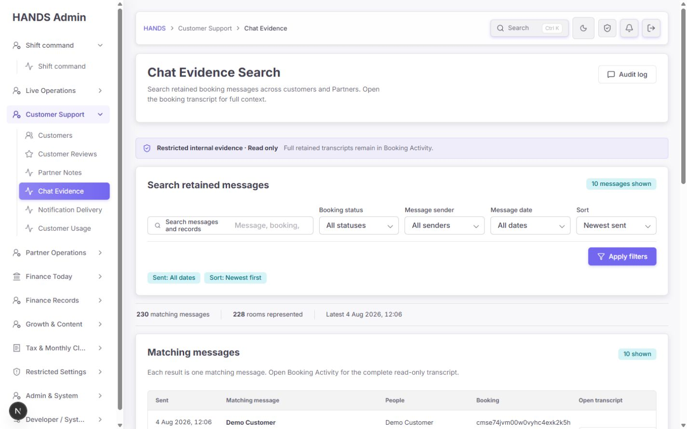
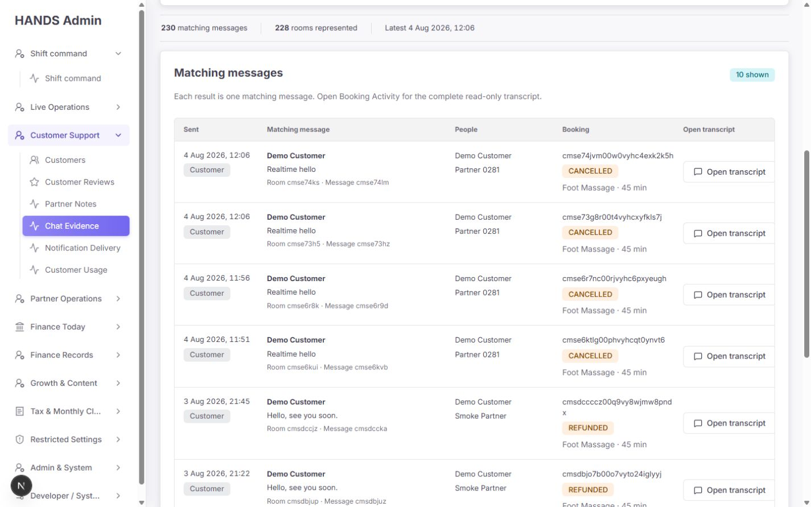
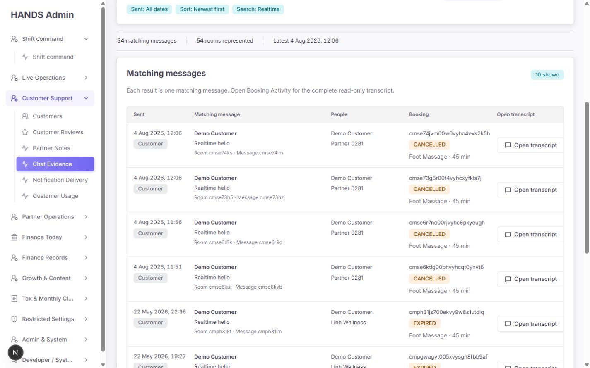
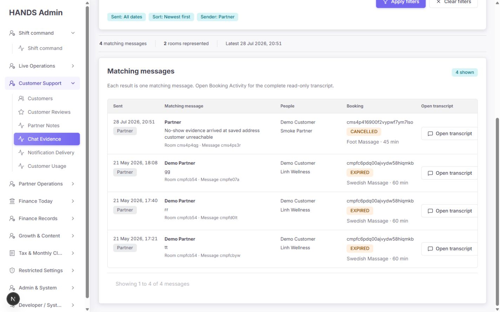
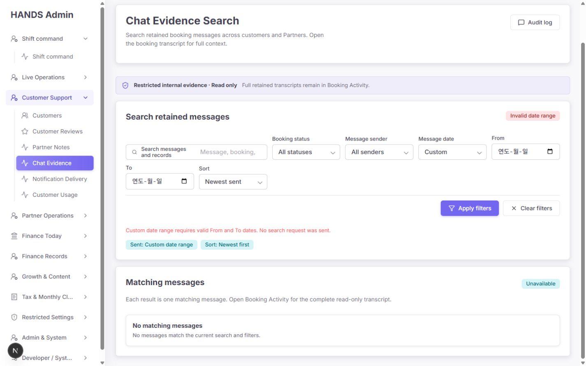
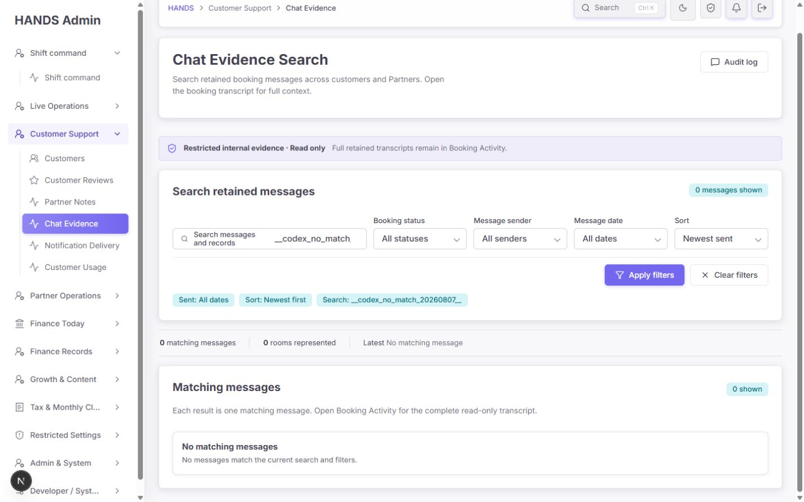
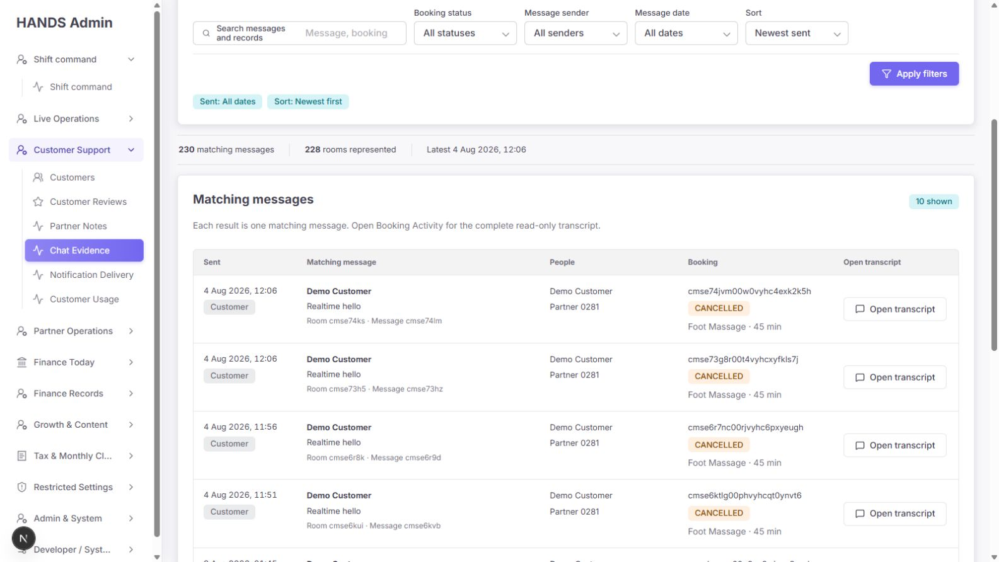
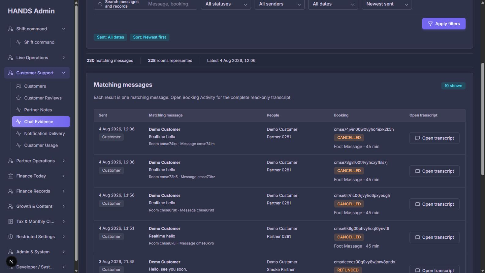
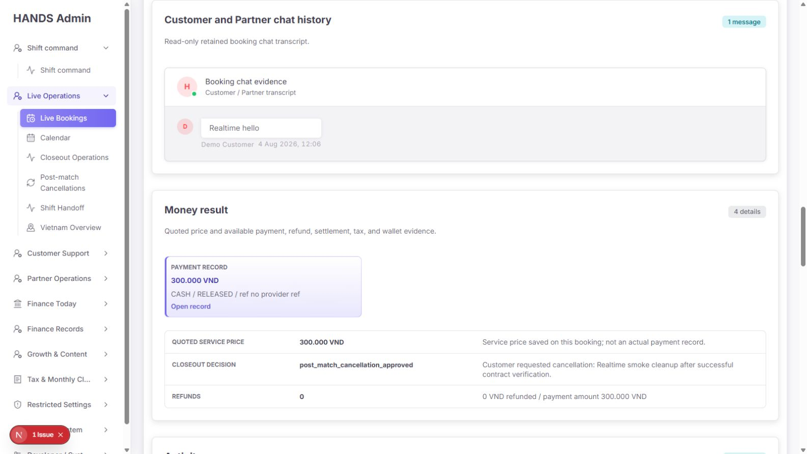

# Chat Evidence Search 개선 후 심층 감사 보고서

- 감사일: 2026-08-07 (Asia/Bangkok)
- 대상: `http://localhost:3101/chat-archive`
- 화면 범위: 1440×900, 1600×900 데스크톱만 검사
- 제외 범위: 1024px 이하 및 모바일/태블릿 반응형은 검사·평가·권고에서 완전히 제외
- 감사 방식: 현재 실행 화면 캡처 → 검색·필터·페이지 이동·transcript 연결 동선 검증 → 이전 감사 보고서와 코드/API/테스트 대조
- 안전 원칙: 실제 운영 데이터의 생성·수정·삭제·내보내기는 하지 않았다. GET 검색, 필터, 페이지 이동, 읽기 전용 transcript 열기만 수행했다.

## 1. 최종 결론

이전 감사에서 지적한 핵심 결함은 **대부분 제대로 수정됐다.** 현재 페이지는 더 이상 “채팅방 등록부”가 아니라 메시지 단위의 읽기 전용 글로벌 증거 검색으로 작동한다. 기본 All dates, 메시지 전송 시각 기준 검색, 정확한 발신자 필터, 본문 미리보기, 오류 분리, 범위 밖 페이지 보정, 권한 정렬, 검색 감사 로그, production-data 경계, PII CSV 제거가 모두 코드와 실제 화면에서 확인됐다.

현재 판단은 다음과 같다.

- **P0 운영 차단 결함: 0건**
- **P1 우선 수정: 3건** — 잘못된 missing-room 연결, Custom 기간의 2단계 오류 흐름, 보존 정책/증거 부재 의미 미확정
- **P2 개선: 6건** — 첫 결과가 접힘 아래에 있음, 검색 일치 근거 미강조, 행 정보 위계, 상태·건수 중복, URL 정규화, summary 감사/응답 일관성
- **P3 다듬기: 2건** — 다크 모드 보조 텍스트 대비, transcript 도착 화면의 hydration 경고

즉, **일반 검색은 조건부 운영 가능**하지만 “채팅방 없음/수리 대상” 업무에는 아직 이 페이지를 사용하면 안 된다. 또한 Custom 기간 검색과 보존 정책이 정리되기 전에는 “검색 결과 0건 = 메시지가 원래 없었다”라고 운영자가 단정하지 않도록 해야 한다.

## 2. 개선 점수

| 평가 축 | 점수 | 평가 |
|---|---:|---|
| Craft | 3/4 | 1440·1600에서 깨짐과 수평 스크롤이 없고 라이트/다크가 안정적이다. 긴 Booking ID 줄바꿈은 미완성이다. |
| Composition | 2/4 | 필터와 상태 정보가 정돈됐지만 1440 첫 화면에 데이터 행이 사실상 보이지 않는다. |
| Coherence | 3/4 | Admin 디자인 시스템과 일관되고 상태 색상도 안정적이다. 기본 chip과 건수 표시는 과도하게 반복된다. |
| Content | 3/4 | read-only·retained·full transcript의 역할이 명확하다. Custom 오류 상태와 retention 의미는 아직 부정확하다. |
| Usability | 2/4 | 일반 검색·발신자·페이지 이동·복귀는 성공했다. missing-room 오동작과 Custom 2단계 흐름은 운영 실수를 만든다. |
| **합계** | **13/20** | **기반은 좋고, 소수의 운영 핵심 결함을 집중 수정해야 하는 상태** |

## 3. 이전 감사 항목 대비 수정 완료도

| 이전 핵심 지적 | 현재 상태 | 검증 근거 |
|---|---|---|
| All time 선택 시 Today 날짜가 남음 | 완료 | base route가 All dates이며 custom이 아닌 경우 From/To를 API와 URL에서 제거한다. |
| Booking lifecycle 날짜를 메시지 날짜처럼 사용 | 완료 | API가 `ChatMessage.createdAt`을 기준으로 검색한다. |
| 본문 검색 결과에 일치 메시지가 안 보임 | 완료 | 한 행이 한 메시지이며 본문·발신자·전송 시각이 표시된다. |
| Partner 필터가 Partner가 있는 방 전체를 반환 | 완료 | `sender.roles has PROVIDER`가 message predicate에 직접 적용된다. 실제로 Partner 4건만 반환됐다. |
| API 실패/잘못된 날짜가 0건으로 숨겨짐 | 완료 | `adminGetResult`, `AdminErrorState`, inline date error로 분리됐다. |
| `page=999`가 빈 데이터와 보정된 UI를 동시에 표시 | 완료 | `q=Realtime&page=999`가 실제 마지막 페이지인 `page=6`으로 redirect됐다. |
| HTML data URI에 PII CSV가 포함됨 | 완료 | CSV/export UI와 `buildCsvDataHref`가 제거됐다. |
| `CUSTOMERS_REVIEWS`와 `BOOKINGS_DETAIL` 권한 충돌 | 완료 | Web/API 모두 Booking Detail 범위로 정렬됐다. |
| fixture 데이터가 기본 결과에 섞임 | 완료 | message의 booking predicate에 `adminBookingProductionDataWhere()`가 적용된다. |
| 1440에서도 표가 잘리고 중첩 스크롤 발생 | 완료 | 1440·1600에서 문서 수평 overflow와 내부 세로 스크롤이 없었다. |
| 글로벌 검색 읽기 감사가 없음 | 대부분 완료 | list 검색은 `booking.chat.search`로 기록된다. summary 직접 조회는 아직 감사되지 않는다. |
| retention/export 정책 미결정 | 미완료 | export는 제거됐지만 roadmap의 retention 정책 결정 항목은 남아 있다. |

## 4. 현재 화면 증거

### 4.1 기본 1440 화면

좋아진 점:

- 페이지 역할이 `Chat Evidence Search`로 정확해졌다.
- `Restricted internal evidence · Read only`가 민감도와 수정 불가 상태를 분명히 한다.
- 기본 All dates, 명확한 Booking status / Message sender / Message date / Sort가 제공된다.
- 이전의 6개 과밀 KPI와 위험한 CSV가 사라졌다.

남은 문제:

- 1440×900에서 첫 실제 데이터 행의 시작 위치는 `y=859.7px`이다. 화면 높이가 900px이므로 첫 행은 약 40px만 보이고 본문은 사실상 읽을 수 없다.
- 상단 필터 카드 높이는 271px이며 기본값인데도 `Sent: All dates`, `Sort: Newest first` chip을 표시한다.
- 운영자는 매 진입마다 스크롤해야 검색 결과를 확인한다.

### 4.2 메시지 중심 결과 표

좋아진 점:

- Sent / Matching message / People / Booking / Open transcript의 5열 구조가 올바르다.
- message body, sender role, sent time, room/message reference, attachment count, service와 상태를 한 행에서 확인할 수 있다.
- 전화번호가 기본 목록에서 제거됐다.
- transcript action이 항상 오른쪽에 보이고 수평 스크롤이 없다.

남은 문제:

- 본문보다 sender 이름이 굵게 보여 핵심 증거가 아닌 인물명이 시각적 1순위다.
- Sent 열에 sender role, Matching message에 sender name, People에 양측 인물이 반복된다.
- 24자 Booking ID가 좁은 열에서 글자 단위로 줄바꿈되며 일부 행은 마지막 한 글자만 다음 줄에 남는다.
- Booking ID 링크와 `Open transcript`가 같은 URL을 중복 제공한다.

### 4.3 본문 검색

- `Realtime` 검색은 54개의 message row와 54개의 room을 반환했다.
- 반환된 본문에 `Realtime hello`가 실제로 보였다.
- 필터와 검색어는 pagination 및 transcript의 `returnTo`에 보존됐다.
- 다만 검색어가 본문·인물·Booking·Room·Service 중 어디에서 일치했는지 강조가 없다. 현재 예시는 우연히 본문이 명확하지만 인물명/서비스/Booking ID 검색에서는 일치 이유를 빠르게 찾기 어렵다.

### 4.4 Partner 발신자 필터

- Partner 필터는 4개 message, 2개 room으로 집계됐다.
- 모든 visible row의 sender badge가 Partner이며 Customer 메시지가 섞이지 않았다.
- 이전 감사의 가장 중요한 데이터 신뢰 결함 중 하나가 정확히 해결됐다.

### 4.5 Custom 기간 오류 상태

- 잘못된 범위에서는 API를 호출하지 않고 inline error를 표시한다는 점은 좋다.
- 그러나 기본 화면에서 `Custom`을 선택해도 From/To 입력은 서버 재렌더 전에는 존재하지 않는다. 운영자는 먼저 `Apply filters`를 눌러 오류 페이지로 이동한 뒤 날짜를 입력하고 다시 Apply 해야 한다.
- `No search request was sent`와 동시에 결과 영역은 `No matching messages`라고 표시한다. “검색하지 않음”과 “검색했지만 0건”이 충돌한다.

### 4.6 검색 결과 없음

- empty copy는 API 오류와 구분되고 Clear filters도 제공된다.
- 그러나 `0 messages shown` → `0 matching messages` → `0 shown` → `No matching messages`로 동일 상태가 네 번 반복된다.

### 4.7 1600과 다크 모드

- 1600×900에서도 전체 열과 action이 안정적으로 보인다.
- 문서 수평 폭은 1585px로 viewport 1600px 안에 있으며 별도 내부 스크롤이 없다.
- 다크 모드에서도 상태 badge와 primary action은 명확하다.
- 보조 metadata와 muted text는 밝은 모드보다 대비가 낮아 장시간 증거 검토 시 피로 가능성이 있다. 현재는 판독 가능하므로 P3다.

### 4.8 Transcript 연결 동선

- `Open transcript`는 Booking Activity의 `#booking-chat-history`로 정확히 이동했다.
- 연결된 disclosure가 열린 상태이며 해당 section이 viewport 상단에 도착했다.
- `returnTo=/chat-archive?q=Realtime`가 보존되고 Booking 상단의 `Back to Chat Evidence Search`도 동일 검색으로 돌아간다.
- 실제 동선은 성공했지만 destination에서 `
` hydration mismatch가 개발 콘솔에 1건 기록됐다. 이 오류는 Chat Evidence 본문이 아니라 Booking Detail의 disclosure 초기 상태에서 발생했다.

## 5. 우선순위별 수정 권고

## P1-1. `missing-room` 링크가 잘못된 전체 메시지 검색으로 조용히 풀린다

### 증거

- `/chat-archive?status=missing-room`에 직접 진입하면 URL은 그대로 남지만 UI는 `All statuses`를 선택하고 전체 230건을 보여준다.
- 모델은 허용 상태를 `active | completed | closed`로만 제한하고 그 외 값을 빈 문자열로 바꾼다: `apps/admin_web/app/chat-archive/chat-archive-page-model.ts:100-103`.
- 하지만 잘못된 상태를 canonical redirect 또는 오류로 처리하지 않는다: `chat-archive-page-model.ts:63-65`.
- 여전히 다음 두 코드가 이 잘못된 URL을 생성한다.
  - `apps/admin_web/lib/booking-closeout-checklist-rows.ts:113-117`
  - `apps/admin_web/app/operations-policy/policy-impact-details.ts:365-369`

### 운영 영향

운영자는 “채팅방 누락 수리 대상”을 열었다고 생각하지만 실제로는 전체 retained message 검색을 보게 된다. 230건의 정상 메시지를 repair queue로 오해하거나, 누락 대상이 없다고 잘못 판단할 수 있다.

### 수정 방법

1. 두 stale link를 실제 repair queue인 `/bookings?view=chat-repair`로 바꾼다.
2. Chat Evidence의 허용되지 않은 `status`, `sender`, `range`, `page` 값은 정규 URL로 redirect하거나 명시적 invalid-filter notice를 보여준다.
3. `missing-room`은 message가 존재하지 않는 booking을 찾는 업무이므로 message search status option으로 다시 넣지 않는다.

### 완료 기준

- 두 연결 링크가 `/bookings?view=chat-repair`로 이동한다.
- `/chat-archive?status=missing-room`은 전체 검색을 조용히 표시하지 않는다.
- stale/unknown filter마다 model test와 route-level rendering test가 있다.

## P1-2. Custom 기간은 오류 제출을 한 번 거쳐야 입력할 수 있다

### 증거

- From/To는 `plan.dateFilters.range === 'custom'`일 때만 서버 렌더된다: `apps/admin_web/app/chat-archive/page.tsx:147-170`.
- 기본 화면의 select 변경만으로는 server component가 다시 렌더되지 않는다.
- `range=custom`으로 제출한 뒤에야 From/To가 생기고 즉시 `Invalid date range`가 표시된다.
- 이때 결과 영역은 `Unavailable`이 아니라 `No matching messages`로 렌더된다: `page.tsx:226-235`.

### 운영 영향

기간 조사의 기본 행동이 `선택 → 오류 → 날짜 입력 → 재검색`의 2회 제출이 된다. 오류를 정상 진입 절차처럼 학습시키며, 검색 미실행을 검색 0건으로 오해하게 한다.

### 수정 방법

- 최소 client wrapper 하나로 date-range select 변경 시 Custom From/To를 즉시 노출한다. 기존 `AdminFormDate`와 native date input을 그대로 재사용한다.
- 또는 Custom 날짜 control을 한 묶음의 client component로 분리하되 새 date-picker 라이브러리는 추가하지 않는다.
- validationError일 때 결과 영역은 `Search not run` / `Complete both dates to search`로 표시하고 matching empty state와 분리한다.
- 90일 제한을 From/To 아래 helper text로 제출 전에 보여준다.

### 완료 기준

- 기본 화면에서 Custom을 선택하자마자 From/To가 나타난다.
- 유효 날짜를 한 번 제출해 결과가 나온다.
- 빈/역전/90일 초과는 inline error이며 `No matching messages`를 표시하지 않는다.
- keyboard로 select → From → To → Apply 순서가 자연스럽다.

## P1-3. “retained evidence가 없음”의 운영 의미가 아직 확정되지 않았다

### 증거

- UI는 `retained booking messages`, `Restricted internal evidence`라고 명시한다.
- export는 제거됐지만 `docs/architecture/master-progress-roadmap.md:108`의 “Decide retention/export policy for disputes before production”은 여전히 미완료다.
- 결과 0건이 “원래 메시지 없음”, “보존 기간 만료”, “legal/dispute hold 제외”, “production data 경계에서 제외” 중 무엇인지 화면에서 구분되지 않는다.

### 운영 영향

분쟁 조사에서 “검색되지 않는다”를 “대화가 없었다”로 단정할 위험이 있다. 이는 UI 미관이 아니라 증거 판단 기준의 문제다.

### 수정 방법

1. 운영·법무·제품이 retention 기간, 삭제/익명화, dispute hold, attachment 범위를 결정한다.
2. 정책 확정 전에는 empty state에 `No retained messages are available; absence does not confirm no conversation occurred.` 성격의 안내를 둔다.
3. 정책 확정 후 화면에 `Retention coverage` 또는 도움말 링크를 표시한다. 결과마다 삭제 예정일을 넣을 필요는 없고 페이지 수준 설명이면 충분하다.

### 완료 기준

- 문서상 retention, hold, attachment, access 책임자가 결정돼 있다.
- UI copy가 정책과 일치한다.
- 운영 매뉴얼에 “0건 결과 해석” 규칙이 있다.

## P2-1. 1440 첫 화면에서 실제 증거가 보이지 않는다

### 계측

- viewport: 1440×900
- trust line: `y=288.7–332.7`
- filter panel: `y=348.7–619.9`, 높이 271.3px
- summary: `y=635.9–683.9`
- results section 시작: `y=699.9`
- table header: `y=820.1–859.7`
- 첫 data row: `y=859.7–969.0`

### 수정 방법

- 기본값인 All dates / Newest first chip은 active filter에서 숨긴다.
- filter action의 별도 full-width row를 줄이고 Apply/Clear를 마지막 control 옆에 배치한다.
- summary 3개 값을 `Matching messages` section header에 합친다.
- page description, trust line, table description에서 반복되는 Booking Activity 설명을 한 곳으로 모은다.

### 완료 기준

- 1440×900, scrollY=0에서 table header와 최소 2개의 데이터 행이 보인다.
- 검색어/비기본 필터가 있을 때만 active chip이 나타난다.
- 접근 권한/read-only 안내는 제거하지 않는다.

## P2-2. 검색 일치 이유를 시각적으로 찾기 어렵다

### 증거

- 검색 predicate는 body뿐 아니라 message ID, room ID, booking ID, Customer/Partner 이름·ID, service name까지 포함한다: `apps/api/src/admin/admin.service.ts:29567-29610`.
- UI는 검색어가 어느 field에서 일치했는지 표시하거나 강조하지 않는다.
- `Realtime`은 본문에 보여 이해 가능했지만 인물명·service·booking 검색은 row 전체가 반환돼도 일치 이유를 빨리 찾기 어렵다.

### 수정 방법

- 새 라이브러리 없이 안전한 React text split으로 visible field의 일치 문자열만 `<mark>` 처리한다.
- 본문 외 field가 일치하면 작은 `Matched booking`, `Matched customer`, `Matched service` label 중 하나를 표시한다.
- 검색 결과 count의 의미는 계속 “matching message rows”로 유지한다.

### 완료 기준

- body/name/booking/service 각각의 검색 테스트가 일치 위치 또는 이유 label을 검증한다.
- HTML 문자열 주입 없이 React node로 강조한다.
- 다크 모드에서도 mark 대비가 충분하다.

## P2-3. 행의 시각적 위계와 중복 action을 정리해야 한다

### 문제

- message body보다 sender name이 굵다: `apps/admin_web/app/chat-archive/page.tsx:314-321`.
- full Booking ID가 `overflow-wrap:anywhere`로 좁은 열에서 깨진다: `apps/admin_web/app/globals.css:6193-6196`.
- Booking ID와 `Open transcript`가 동일 href다: `page.tsx:305`, `338`, `346-349`.

### 수정 방법

- message body를 primary text로, sender name을 secondary metadata로 내린다.
- Booking은 `service / status / readable reference` 순서로 배치한다.
- 화면에는 충돌하지 않는 10–12자 reference와 copy affordance를 두고 전체 ID는 accessible label/title/copy 값으로 유지한다.
- transcript 이동은 오른쪽 primary link 하나만 남기고 Booking reference는 복사 전용 또는 일반 텍스트로 둔다.

### 완료 기준

- 1440에서 Booking reference가 한 줄 또는 예측 가능한 두 줄 이내다.
- 같은 목적지의 반복 링크가 한 행에 하나다.
- body 2–3줄이 가장 먼저 읽힌다.

## P2-4. 결과 상태와 기본 filter 정보가 반복된다

### 증거

- 기본 화면: `10 messages shown`, `10 shown`, `Showing 1 to 10 of 230 messages`가 반복된다.
- no-match 화면: `0 messages shown`, `0 matching messages`, `0 shown`, `No matching messages`가 반복된다.
- 기본값도 active filter chip으로 표시된다.

### 수정 방법

- filter panel의 result badge는 오류/validation 때만 사용한다.
- 정상 건수는 section header + pagination footer만 유지한다.
- 기본값 chip은 숨기고 검색어/비기본 sender/status/date/sort만 표시한다.

### 완료 기준

- 한 viewport 안에서 동일 건수 문구가 두 번을 넘지 않는다.
- no-match는 heading + 한 문장 + Clear filter 한 경로로 끝난다.

## P2-5. 알 수 없는 query와 잘못된 page를 모두 canonicalize해야 한다

### 증거

- `page=999`와 `page=0`은 처리하지만 `page=abc`, `page=1.5`, unknown status/sender/range는 URL에 남은 채 기본값으로 조용히 정규화될 수 있다: `chat-archive-page-model.ts:95-108`, `192-198`.
- 현재 실제 오류는 `status=missing-room`에서 확인됐다.

### 수정 방법

- raw 값과 normalized 값이 다르면 `needsCanonicalFilterRedirect`에 포함한다.
- page는 `/^[1-9]\d*$/`만 허용하고 그 외는 page 1 canonical URL로 보낸다.
- user-entered `q`는 보존하되 길이를 Web/API 양쪽에서 제한한다.

### 완료 기준

- unknown range/status/sender/sort와 non-integer page 테스트가 있다.
- URL, select, active chip, API predicate가 서로 다른 상태를 표시하지 않는다.

## P2-6. list와 summary의 감사·일관성을 한 응답 경계로 정리할 가치가 있다

### 증거

- 페이지는 summary를 먼저 호출하고, 그 결과로 page를 보정한 뒤 list를 호출한다: `apps/admin_web/app/chat-archive/page.tsx:49-65`.
- list는 `booking.chat.search` audit을 기록한다: `apps/api/src/admin/admin.service.ts:12972-12995`.
- summary route는 viewer를 받지 않고 audit을 남기지 않는다: `apps/api/src/admin/admin-booking.routes.ts:136-145`.
- out-of-range redirect 또는 summary 직접 API 호출은 search audit 없이 count를 조회할 수 있다.

### 영향

권한 guard는 정렬돼 있어 즉시 데이터 노출 취약점은 아니다. 다만 count query와 list query가 별도 시점에 실행돼 데이터가 빠르게 늘 때 total/rows가 잠시 다를 수 있고, summary 직접 조회는 증거 검색 감사에 남지 않는다.

### 권장

- 장기적으로 표준 paged response `{ items, total, roomsRepresented, latestMessageAt }` 하나로 합쳐 query와 audit 경계를 단순화한다.
- 지금 구조를 유지한다면 summary에도 viewer/audit을 추가하되 한 화면 로드가 audit 두 건으로 중복되지 않도록 request/search correlation을 정한다.

### 완료 기준

- 한 사용자 검색 행동이 감사 로그에서 한 번의 명확한 event로 보인다.
- page 보정 후의 실제 결과와 total이 같은 predicate/snapshot 계약을 공유한다.

## P3-1. 다크 모드의 muted metadata 대비를 한 단계 높인다

- room/message reference와 일부 secondary copy가 장시간 검토 시 옅다.
- 전역 muted token을 바꾸기보다 `.chat-evidence-message .muted`, `.chat-evidence-booking .muted` 범위에서만 대비를 소폭 높인다.
- WCAG 4.5:1 대상인 일반 본문인지, 3:1이 허용되는 큰 텍스트인지 실제 색상값으로 확인한다.

## P3-2. Transcript destination의 hydration mismatch를 제거한다

- Booking Activity 진입은 성공했지만 개발 콘솔에 `details open` server/client 불일치가 기록됐다.
- 대상은 Chat Evidence 자체가 아니라 Booking Detail의 `AdminDetails`/disclosure 초기 open 상태다.
- hash target이 disclosure 내부일 때 server와 client가 같은 `open` 값을 계산하도록 단일 source of truth를 사용한다.

## 6. 운영자 관점의 권장 최종 화면 구조

상단을 더 작게 만드는 권장 순서는 다음과 같다.

1. **제목 행** — Chat Evidence Search / Audit log / read-only badge
2. **한 줄 검색·필터** — Search, Booking, Sender, Date, Sort, Apply, Clear
3. **비기본 active filters만 표시** — 검색어나 실제로 바꾼 값만
4. **결과 헤더** — `230 messages · 228 rooms · Latest 4 Aug 12:06`
5. **message-first rows** — Body → sent/sender → people → booking/service/status → Open transcript
6. **footer** — `Showing 1–10 of 230` + pagination

기본 All dates와 Newest first는 UI control에는 보이되 chip으로 다시 말하지 않는다. “Restricted/read only/full transcript” 설명은 제목 또는 trust line 한 곳에서만 말한다.

## 7. 단계별 운영 흐름 평가

| Step | 운영 행동 | 상태 | 평가 |
|---:|---|---|---|
| 1 | 기본 진입 후 전체 retained message 확인 | 주의 | 데이터와 집계는 정확하지만 첫 행이 fold 아래에 있다. |
| 2 | 검색어로 message/record 찾기 | 양호 | 결과 단위·본문·count가 맞고 URL이 보존된다. 일치 강조가 필요하다. |
| 3 | sender/status/date/sort 적용 | 부분 양호 | Partner와 preset은 정확하다. Custom은 오류 제출을 먼저 요구한다. |
| 4 | 페이지 이동 및 범위 밖 page 처리 | 양호 | 필터 보존과 마지막 페이지 redirect가 성공했다. |
| 5 | 결과 없음과 API 오류 구분 | 부분 양호 | no-match와 failure는 분리됐다. validation은 no-match와 충돌한다. |
| 6 | Open transcript 및 검색 상태 복귀 | 양호 | 정확한 anchor 도착과 `returnTo` 복귀가 성공했다. |
| 7 | 채팅방 누락/수리 업무 진입 | 실패 | stale `status=missing-room` 링크가 전체 검색으로 풀린다. |
| 8 | 민감정보·권한·감사 | 부분 양호 | PII export 제거, Booking Detail 권한, list audit은 완료. summary/retention이 남았다. |

## 8. 코드·보안 검수 요약

### 확인된 좋은 구현

- `AdminChatArchiveMessage`가 phone을 포함하지 않는다: `apps/admin_web/lib/admin-api.ts:2170-2204`.
- Prisma select에도 phone이 없고 attachment는 count로만 변환된다: `apps/api/src/admin/admin-chat-archive-selects.ts`.
- message predicate와 summary predicate가 동일한 date/sender/search/booking 조건을 재사용한다: `admin.service.ts:29508-29524`.
- stable sort가 `createdAt + id`로 구성됐다: `admin.service.ts:12974-12982`.
- search audit에는 actor, normalized filters, resultCount, searchedAt이 기록된다: `admin.service.ts:12985-12990`.
- production booking predicate가 기본 적용된다: `admin.service.ts:29527-29544`.
- API permission category는 `BOOKINGS_DETAIL`로 정렬됐다: `apps/api/src/admin/admin-operator-category.guard.ts:44`.

### 남은 보안·거버넌스 주의

- summary direct query의 read audit 부재
- q 길이 제한이 UI/API 계약에 명시되지 않음
- retention/dispute hold 정책 미결정
- 검색 audit metadata에 원문 q가 저장되므로 운영자가 민감한 전체 본문을 무분별하게 검색어로 넣지 않도록 정책이 필요함

## 9. 검증 명령과 결과

| 명령/검증 | 결과 |
|---|---|
| Admin Web chat archive focused Vitest | 2 files, 17 tests 통과 |
| API chat evidence/message/date focused Vitest | 1 file, 3 tests 통과 |
| API controller chat archive focused Vitest | 1 test 통과 |
| Admin Web typecheck (`next typegen && tsc --noEmit`) | 통과 |
| API typecheck (`tsc --noEmit`) | 통과 |
| Admin Web scoped ESLint | 통과 |
| API scoped ESLint | 통과 |
| `security:admin-sensitive` | 통과, violation 0 |
| `admin:query-guards` | 통과, violation 0 |
| `admin:visible-copy` | 실패 — `partner-controls/page.tsx`의 기존 `Trust badge` 3건이며 Chat Evidence 범위와 무관 |
| Impeccable detector | Chat Evidence 관련 finding 0. `globals.css` 다른 페이지의 side-tab 7건은 범위 밖 false positive/비대상 |
| Browser console | Chat Evidence 자체 warning/error 없음. Booking transcript destination에서 hydration mismatch 1건 |

## 10. 권장 수정 순서

### 1차 — 운영 오판 방지

1. stale missing-room 링크 2곳을 `/bookings?view=chat-repair`로 교체
2. unknown filter/page canonicalization
3. Custom 즉시 입력 노출 + validation 전용 상태
4. retention/empty-result 운영 문구와 정책 결정

### 2차 — 처리 속도 향상

1. 1440 첫 화면에 2개 이상의 result row 노출
2. 기본 active chip과 건수 중복 제거
3. 검색 일치 강조/이유 label
4. message body 중심 행 위계와 Booking reference 축약

### 3차 — 신뢰성·마감

1. list/summary 응답 및 audit 경계 통합 검토
2. 다크 muted 대비 보정
3. Booking Detail hydration mismatch 수정

## 11. 변경 및 보호 영역

- 이 감사에서 제품 소스 코드는 수정하지 않았다.
- 새로 생성한 것은 본 보고서와 감사 스크린샷뿐이다.
- DB schema/migration, auth, wallet, payment, settlement, matching, bookings, shared types, infra는 변경하지 않았다.
- 현재 working tree의 기존 변경은 사용자 작업으로 간주하고 건드리지 않았다.

## 12. 다음 작업

다음 작업은 **P1-1 missing-room 오동작과 P1-2 Custom 기간 흐름을 한 번에 수정하는 좁은 Codex 구현 프롬프트 작성**이다. 두 문제는 현재 운영자가 직접 잘못된 화면이나 오류 절차에 도달하는 항목이라 시각적 다듬기보다 먼저 처리해야 한다.
