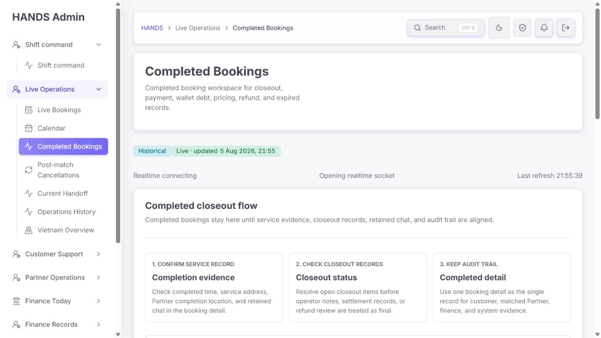
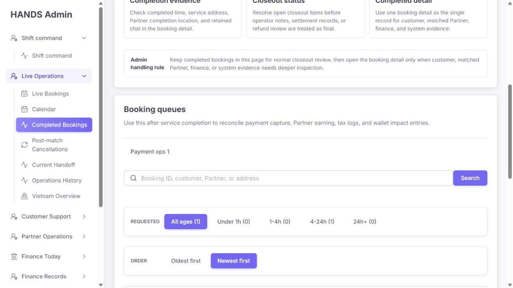
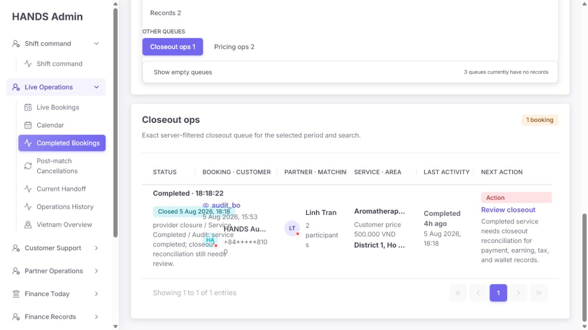
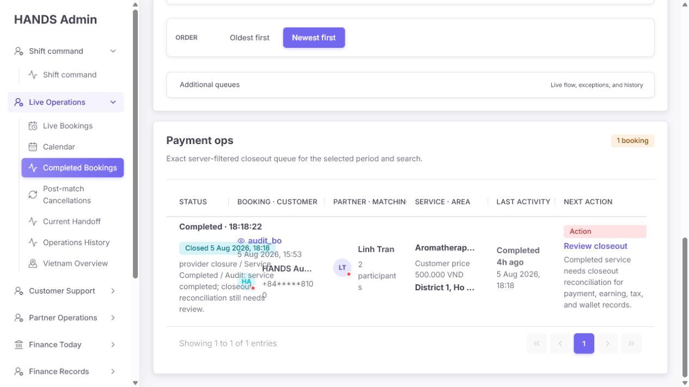
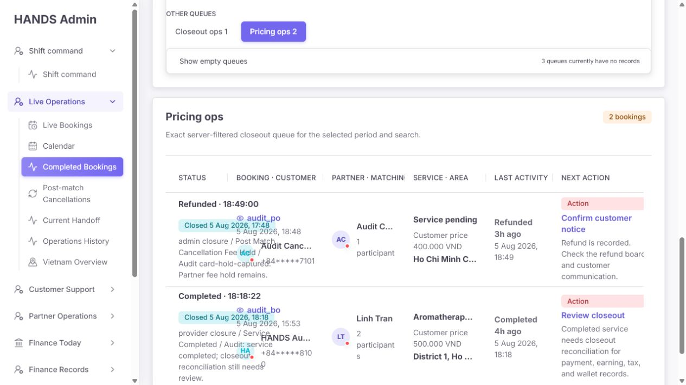
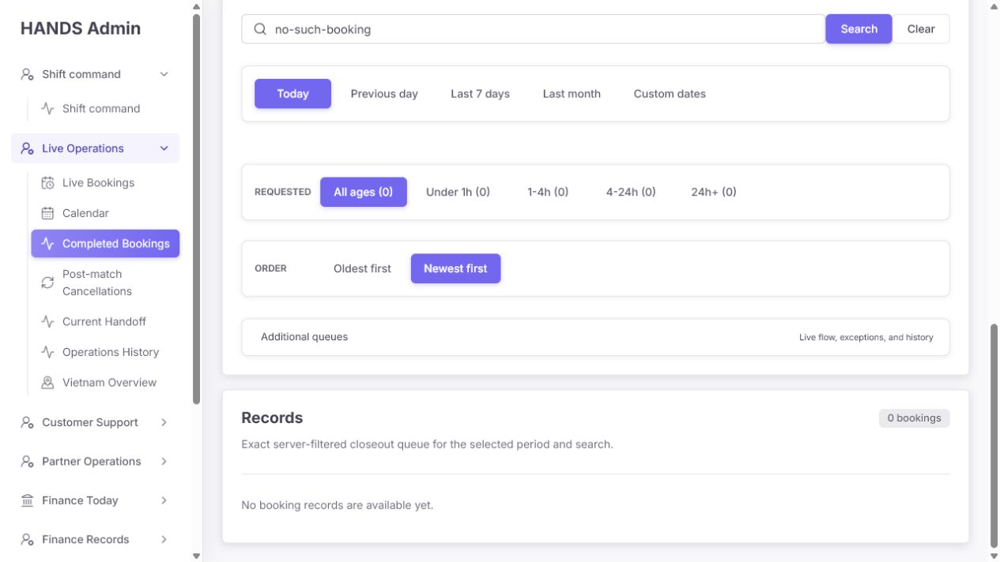
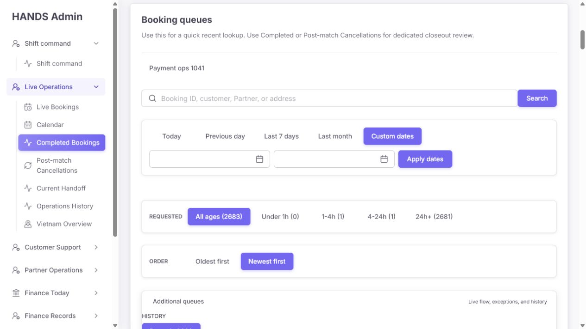

# Completed Bookings 운영자 관점 심층 감사

- 감사 대상: `http://localhost:3101/bookings/completed`
- 감사 일시: 2026-08-05 (Asia/Bangkok, 화면 표기는 Asia/Ho_Chi_Minh)
- 실제 확인 상태: 기본 Closeout ops, Payment ops, Pricing ops, Records/Today, 검색 결과 없음, 빈 Custom dates, 상세 화면 딥링크
- 실제 화면 크기: 1280 × 720px. 왼쪽 내비게이션이 열린 일반 노트북 환경
- 주의: 화면의 예약과 건수는 로컬 감사 fixture이다. 건수 자체가 아니라 큐 분류·문구·상호작용·레이아웃 동작을 평가했다.

## 1. 결론

현재 화면은 “서버에서 정확히 필터링되는 운영 큐”의 골격은 갖췄지만, 운영자가 첫눈에 **무엇이 잘못됐고 무엇을 처리해야 하는지** 판단하기 어렵다. 특히 다음 세 가지는 먼저 고쳐야 한다.

1. 1280px 화면에서도 예약 행의 텍스트가 서로 겹쳐 고객·상태·금액을 안정적으로 읽을 수 없다.
2. 큐의 목적과 행의 액션이 일치하지 않는다. 실제로 `Pricing ops` 안의 환불 건이 `Confirm customer notice`를 제시한다.
3. 날짜를 입력하지 않은 `Custom dates`가 전체 이력 2,683건을 즉시 조회한다. 실수로 매우 넓은 범위를 불러오고도 오류나 경고가 없다.

이 페이지를 예쁘게 다듬는 수준으로는 부족하다. 우선 **큐의 의미 → 행에 필요한 증거 → 큐별 다음 행동**을 일치시킨 뒤, 그 정보를 읽을 수 있는 표/카드 레이아웃으로 재배치해야 한다.

## 2. 캡처 증거

### 첫 화면: 정적 안내가 실제 작업 큐를 화면 아래로 밀어냄



### 큐 필터와 부가 큐



### 기본 Closeout ops 표



상태 설명, 예약 ID, 고객명과 시간이 같은 영역에서 겹친다. `Aromatherap...`, `HANDS Au...`, `District 1, Ho ...`처럼 의사결정에 필요한 값도 잘린다.

### Payment ops도 같은 레이아웃과 같은 일반 액션을 사용



### Pricing ops에 Refunded와 Completed가 함께 있고 액션도 서로 다름



첫 행은 `Refunded`인데 큐는 `Pricing ops`, 액션은 `Confirm customer notice`이다. “왜 가격 큐에 들어왔는지”는 행에서 알 수 없다.

### 검색 결과 없음



검색어가 활성화됐는데도 `No booking records are available yet.`라고 표시한다. 데이터가 아직 생성되지 않은 것처럼 오해하게 한다.

### 날짜 없는 Custom dates



두 날짜가 비어 있는데 `All ages (2683)`, `Payment ops 1041`이 노출된다.

## 3. 잘된 점

- 예약 ID, 고객, Partner, 주소를 하나의 검색창에서 찾을 수 있다.
- 전화번호가 목록에서 마스킹되어 있다.
- 테이블 헤더와 각 셀의 의미가 시맨틱 구조로 제공되고, 가로 스크롤 영역은 키보드 포커스를 받을 수 있다.
- 빈 큐를 기본으로 접어 노이즈를 줄이려는 방향은 좋다.
- `Review closeout`과 `Payment ops`의 상세 딥링크 대상 ID는 실제 상세 화면에 존재했다.
- 서버 페이지네이션과 서버 큐 카운트가 이미 있어 대량 데이터를 클라이언트에서 억지로 처리하지 않는다.
- 결제, earning, tax log, platform fee log, wallet ledger 데이터가 기존 `AdminBooking` 모델에 이미 포함되어 있어 핵심 상태를 목록에 표시하기 위해 새 의존성이나 별도 UI 프레임워크를 추가할 필요가 없다.

## 4. 우선순위별 문제와 수정 요건

### P0-1. 일반 노트북 폭에서 표가 읽을 수 없을 정도로 겹침

**화면 증거**

- 1280px viewport에서 사이드바를 제외한 콘텐츠 폭이 좁아지자 상태 설명·예약 ID·고객명·시간이 겹친다.
- 표 헤더와 서비스/지역/액션도 잘려서 스캔 순서를 잃는다.

**코드 원인**

- `apps/admin_web/app/globals.css:4122`에서 operations table 최소 폭은 820px이다.
- 각 열은 별도의 최소 폭을 갖고 `table-layout: fixed`를 사용한다.
- 카드형 레이아웃 전환은 viewport 기준 `max-width: 1100px`(`apps/admin_web/app/globals.css:17622`)에서만 발생한다.
- 1280px viewport라도 250px 안팎의 사이드바를 빼면 실제 콘텐츠 컨테이너는 표가 안정적으로 들어갈 폭보다 좁다. viewport breakpoint가 아니라 **실제 표 컨테이너 폭**을 기준으로 바뀌어야 한다.

**수정 방법**

- `AdminTablePanel` 또는 `.admin-table-scroll`에 container query를 적용해 표 컨테이너가 약 1,050~1,100px 미만이면 2열 또는 3열 카드형 행으로 전환한다.
- 단순히 글자 크기를 줄이거나 `overflow: hidden`으로 숨기지 않는다.
- 데스크톱 표를 유지할 때는 실제 열 최소 폭의 합보다 작은 `min-width: 820px`를 제거하고, 충분한 최소 폭 + 명확한 가로 스크롤을 제공한다.
- 상태의 긴 closure note는 목록에서 1줄 요약으로 줄이고 전체 내용은 상세에서 확인하게 한다.

**완료 기준**

- 1280px/사이드바 열림에서 텍스트 겹침 0건.
- 1024px 데스크톱 포인터 환경에서 카드형 행 또는 안전한 가로 스크롤로 모든 값 확인 가능.
- 1440px 이상에서 6열 표가 자연스럽게 유지됨.

### P0-2. 큐의 원인과 행의 다음 행동이 서로 다름

**화면 증거**

- `Pricing ops`의 Refunded 행은 `Confirm customer notice`를 제시한다.
- 같은 완료 예약이 Payment ops, Closeout ops, Pricing ops에 동시에 나타나지만 각 행은 모두 예약 상태 기반의 일반 액션을 보여준다.

**코드 원인**

- `bookingMonitorNextAction(booking, nowMs)`는 현재 `view`를 받지 않는다 (`apps/admin_web/app/bookings/booking-monitor-next-action-label.ts:5`).
- 상태별 라벨 맵은 `COMPLETED → Review closeout`, `REFUNDED → Confirm customer notice`로만 결정된다 (`.../booking-monitor-next-action-label.ts:42`).
- operations row도 현재 큐의 실패 이유를 렌더링하지 않는다 (`.../booking-monitor-list-section.tsx:659`).
- API의 `completed-pricing` 조건은 COMPLETED에 한정되지 않고 모든 terminal fact에 적용된다 (`apps/api/src/admin/admin.service.ts:30349`). 서비스가 아직 없던 환불/만료 건도 가격 예외가 될 수 있다.

**수정 방법**

- `bookingMonitorNextAction`에 `view`를 전달해 큐별 행동을 최우선으로 결정한다.
  - Payment ops: `Resolve authorization`, `Release hold`, `Add gateway reference`, `Confirm cash status`
  - Closeout ops: 실제 누락 항목에 따라 `Create earning`, `Add tax log`, `Add wallet entry`, `Reconcile closeout`
  - Pricing ops: `Verify booked price` 또는 `Fix payout rule`
- 행에 `왜 이 큐에 포함됐는지`를 1~3개의 짧은 issue chip으로 표시한다.
- `completed-pricing`은 원칙적으로 `status = COMPLETED`에 한정한다. 환불 건의 가격 불일치가 실제 회계처리에 필요한 경우에만 별도의 `Refund amount mismatch` 규칙으로 명시한다.

**완료 기준**

- 모든 행의 primary action이 현재 큐의 포함 사유를 직접 해결한다.
- Refunded/Expired 건이 Pricing ops에 들어오는 규칙이 테스트로 명시되고, 불필요한 건은 제외된다.
- 큐별 테스트 fixture에서 원인 chip과 액션이 일치한다.

### P0-3. 날짜 없는 Custom dates가 전체 기간으로 해석됨

**화면 증거**

- `dateRange=custom`만 설정하고 두 날짜가 비어 있는 상태에서 2,683건, 54페이지가 조회됐다.
- 오류·필수 표시·범위 경고가 없다.

**코드 원인**

- Custom date input에 `required`가 없다 (`apps/admin_web/app/bookings/booking-monitor-filters-section.tsx:220`, `:227`).
- API는 두 값이 모두 invalid/null이면 date bounds를 `undefined`로 반환한다 (`apps/api/src/admin/admin-booking-list-query.ts:402-407`). 결과적으로 날짜 조건이 완전히 사라진다.
- 시작일이 종료일보다 늦으면 API가 조용히 두 값을 바꾼다. 운영자의 입력 실수를 숨긴다.

**수정 방법**

- 화면에서 시작일·종료일을 둘 다 필수로 하고, 종료일이 시작일보다 빠르면 제출을 막고 문장형 오류를 표시한다.
- 서버에서도 `dateRange=custom`인데 두 날짜가 없거나 유효하지 않으면 400 validation error를 반환한다. UI validation만 믿지 않는다.
- 운영 성능을 위해 한 번에 조회할 수 있는 최대 기간을 정한다. 우선 90일을 권장하고, 더 긴 기록은 기간을 나누어 조회하게 한다.
- `Custom dates` chip을 누른 순간에는 조회하지 말고 입력 폼만 연다. `Apply dates`에서만 URL을 변경한다.

**완료 기준**

- 빈 날짜, 한쪽 날짜만 입력, 역전 범위, 잘못된 날짜가 모두 전체 조회로 내려가지 않는다.
- 유효한 기간만 URL/API에 전달되고 Asia/Ho_Chi_Minh 날짜 경계 테스트가 통과한다.

### P1-1. “Completed Bookings”와 실제 데이터 범위가 다름

**화면/코드 증거**

- 페이지 설명은 completed, payment, wallet debt, pricing, refund, expired를 모두 포함한다.
- `Records`는 COMPLETED, EXPIRED, REFUNDED를 반환한다 (`apps/api/src/admin/admin-booking-list-query.ts`의 `completed` status group).
- 반면 view 설명은 `Booking history across all states`라고 말한다 (`apps/admin_web/app/bookings/booking-monitor-options.ts:242`). CANCELLED/NO_SHOW 등 모든 상태를 포함하지 않으므로 문구가 사실과 다르다.
- `isRecordsView`는 일반 `/bookings`의 `view=all`만 인식한다 (`apps/admin_web/app/bookings/booking-monitor-page.tsx:167`). 완료 경로의 Records는 여전히 `Completed Bookings` 제목을 유지한다.

**수정 방향**

두 방향 중 하나를 제품 결정으로 고정해야 한다.

1. **완료 서비스 전용으로 유지**: 이 페이지에는 COMPLETED만 두고 Expired/Refunded를 전용 큐로 이동한다.
2. **현재 데이터를 유지**: 페이지/내비게이션 이름을 `Closeout operations`로 바꾸고 상위 상태 필터를 `Completed services / Refunded / Expired / All terminal records`로 명시한다.

현재 코드 변경량과 실제 데이터 범위를 고려하면 2번이 더 작고 일관된 수정이다. 다만 `Pricing ops`는 완료 서비스 중심으로 좁혀야 한다.

### P1-2. Queue age가 closeout 대기시간이 아니라 예약 생성시간임

**증거**

- UI가 `Queue age is measured from the booking request creation time.`라고 명시한다.
- API도 age 필터를 `createdAt`에 적용한다 (`apps/api/src/admin/admin-booking-list-query.ts:201-203`).
- 감사 예약은 완료 후 약 4시간인데, 요청 생성시간 기준으로 `4-24h`에 들어간다.

**수정 방법**

- closeout/payment/pricing/refund 큐의 age 기준은 `queueEnteredAt`에 해당하는 이벤트를 사용한다.
  - Completed closeout: `closedAt` 또는 completed `statusChangedAt`
  - Refund review: refund created/updated timestamp
  - Expired: `closedAt` 또는 `expiresAt`
- UI 라벨도 `Requested` 대신 `Waiting` 또는 `Closed age`로 변경한다.
- 각 큐가 다른 기준을 쓴다면 도움말에 한 문장으로 표시한다.

### P1-3. 기본 정렬이 “최근 것 먼저”라 오래된 미해결 건이 뒤로 밀림

- 현재 기본은 `Newest first`이다.
- closeout 예외 큐의 운영 목표는 새 항목 구경이 아니라 오래 미해결된 항목 제거이다.
- 기본을 `Longest waiting`으로 바꾸고, 보조 정렬로 `Recently closed`를 둔다.
- 기존 summary의 `oldestCloseoutAt`을 활용해 큐 상단에 `Oldest waiting 4h`처럼 보여준다.

### P1-4. 목록에 closeout 판단에 필요한 금융 결과가 없음

현재 행은 고객 가격만 보여주고 다음을 숨긴다.

- payment method/status/provider ref
- earning 존재·상태·net amount
- platform fee log 존재
- tax log 존재
- wallet ledger entry 존재
- refund 존재·상태

이 값들은 기존 `AdminBooking.payment`, `AdminBooking.earning`, `platformFeeLogs`, `taxLogs`, `walletLedgerEntries`에 이미 있으므로 새 데이터 모델보다 기존 값을 재사용한다.

**권장 열**

| 열 | 운영자가 답해야 하는 질문 |
|---|---|
| Priority / issue | 얼마나 오래 열려 있고 무엇이 누락됐는가? |
| Booking / customer | 어떤 예약·고객인가? |
| Completed service | 언제 완료됐고 어떤 서비스인가? |
| Payment | 결제 수단·상태·금액·gateway ref가 정상인가? |
| Partner closeout | earning·fee·tax·wallet이 모두 생성됐는가? |
| Next action | 지금 한 가지 무엇을 해야 하는가? |

`Partner · Matching`의 참여자 수와 앱 online/offline은 종료 후 closeout 판단보다 우선순위가 낮으므로 제거하거나 상세로 이동한다.

### P1-5. 상태 셀이 감사 로그 전문을 그대로 보여줘 스캔을 방해함

현재 한 셀에 다음이 함께 나온다.

- `Completed · 18:18:22`
- `Closed 5 Aug 2026, 18:18`
- `provider closure / Service Completed / Audit: ...`

시간은 중복되고, role/reason/note가 `/`로 이어져 개발 로그처럼 보인다.

**권장 표시**

- 1줄: `Completed · waiting 4h`
- 2줄: `Closed 5 Aug, 18:18 by Partner`
- issue chips: `Earning missing`, `Tax missing`, `Wallet missing`
- 긴 close note는 tooltip이 아니라 상세 화면의 `Closure evidence`에서 전체 제공한다.

### P1-6. 정적 “Completed closeout flow”가 첫 화면을 과도하게 점유함

- 세 개의 교육 카드와 handling rule이 매번 약 한 화면을 사용한다.
- 실제 큐와 첫 행은 첫 화면에서 보이지 않는다.
- 카드 내용은 대부분 “상세에서 확인하라”는 안내라 숙련 운영자에게 반복 노이즈다.

**수정 방법**

- 기본 화면에서는 `Closeout queues`와 오래된 미해결 건을 먼저 보여준다.
- flow는 `How to review closeout` disclosure로 접거나 Operations Policy로 이동한다.
- 정적 3단계 대신 동적 요약 `Closeout 1 · Payment 1 · Pricing 2 · Oldest 4h`를 표시한다.

### P1-7. Historical 화면에 “Realtime connecting”이 계속 표시됨

**코드 원인**

- realtime 사용 여부는 `/bookings`의 live view에만 true다 (`apps/admin_web/app/bookings/booking-monitor-realtime.ts:14`).
- 그런데 state 초기값은 항상 `connecting`이다 (`apps/admin_web/app/bookings/booking-monitor.tsx:161`).
- Completed 화면도 live status section을 렌더링하므로 socket을 열지 않으면서 `Opening realtime socket`이 보인다.

**수정 방법**

- `usesRealtime === false`이면 realtime 상태 행을 렌더링하지 않는다.
- historical page에는 `Snapshot refreshed 21:55`만 표시한다.
- `Historical`과 `Live · updated`를 동시에 보여주지 말고 `Historical snapshot · refreshed ...`로 합친다.

### P1-8. 큐 설명이 모든 view에서 같은 문장을 사용함

`Exact server-filtered closeout queue for the selected period and search.`가 Payment, Pricing, Records에도 반복된다 (`apps/admin_web/app/bookings/booking-monitor.tsx:714`). Closeout/Payment/Pricing 화면에는 날짜 컨트롤도 숨겨져 있어 `selected period`가 보이지 않는다.

**정확한 권장 문구**

- Closeout ops: `Completed services with one or more missing closeout records.`
- Payment ops: `Terminal bookings with unresolved capture, release, refund, cash, or gateway reference.`
- Pricing ops: `Completed services whose booked price or Partner payout rule cannot be verified.`
- Records: `Completed, refunded, and expired records closed in the selected period.`

### P1-9. 큐 건수는 서로 중복되지만 UI가 이를 설명하지 않음

한 예약이 Payment 1, Closeout 1, Pricing 2 중 여러 큐에 동시에 포함될 수 있다. 현재 배치는 합계처럼 읽힌다.

- 큐 그룹 제목 옆에 `Bookings may appear in more than one queue`를 한 번 표시한다.
- 행에는 현재 큐 포함 사유를 강조하고, 다른 큐 membership은 보조 chip으로 제공한다.
- 중복을 제거하려고 억지로 한 큐에만 배정하지 않는다. 운영 문제는 동시에 존재할 수 있다.

### P1-10. Today/기간의 기준 이벤트가 불명확함

API 기간 필터는 openedAt, createdAt, updatedAt, matchedAt, closedAt, expiresAt 중 하나라도 기간에 들어오면 포함한다 (`apps/api/src/admin/admin.service.ts:30531` 이하). 따라서 “Today”가 오늘 종료된 건인지, 오늘 수정된 과거 건인지 구분되지 않는다.

**수정 방법**

- terminal records의 기본 기간은 `COALESCE(closedAt, statusChangedAt, updatedAt)` 하나로 통일한다.
- 과거 건이 오늘 다시 수정된 것을 보고 싶다면 별도 `Updated today` filter로 제공한다.
- UI 라벨을 `Closed period`로 바꿔 기준을 명확히 한다.

### P1-11. 검색 결과 없음 문구가 필터 상태를 반영하지 않음

- 검색어가 있는데도 `No booking records are available yet.`라고 나온다.
- 원인은 `emptyBookingMessage(view)`가 search/date/age 상태를 받지 않기 때문이다 (`apps/admin_web/app/bookings/booking-monitor.tsx:598`).

**권장 문구**

- 검색 활성: `No bookings match “no-such-booking”. Clear search or change the closed period.`
- 날짜/age 활성: `No records match the current period and waiting-time filters.`
- 필터 없음: 기존 큐별 “모두 정상” 문구를 사용한다.

### P2-1. 종료된 예약의 앱 online/offline 신호가 거짓 긴급도를 만듦

완료/환불 기록에서 고객·Partner의 현재 앱 상태는 closeout 판단과 거의 무관하다. 빨간 점과 `App offline`이 금융 누락보다 더 눈에 띈다.

- terminal operations table에서는 제거한다.
- 실시간 연락이 실제 다음 행동인 경우에만 고객/Partner 연락 가능성을 보조 정보로 표시한다.

### P2-2. `2 participants`는 완료 후 핵심 정보가 아님

- 최종 Partner와 payout/earning 상태가 중요하다.
- 참여자 수는 matching 감사 상세로 이동하고, 목록에는 `Linh Tran · earning missing`처럼 표시한다.

### P2-3. 1페이지뿐인데 비활성 페이지 버튼이 5개 보임

`AdminTablePaginationFooter`는 `totalRows > 0`이면 totalPages가 1이어도 pagination을 표시한다 (`apps/admin_web/components/admin-data-table.tsx:101`).

- `totalPages <= 1`이면 페이지 버튼을 숨기고 `1 booking` 또는 `Showing 1 booking`만 유지한다.

### P2-4. Completed 경로는 페이지당 50건으로 고정됨

`kind !== all`이면 50건을 요청한다 (`apps/admin_web/app/bookings/booking-monitor-route-load-plan.ts:96`). 긴 closure 문구가 있는 50개 행은 스캔하기 어렵고 Custom dates 실수의 비용도 커진다.

- 20~25건을 기본으로 사용한다.
- 페이지 크기 선택기는 실제 운영자가 필요하다고 확인되기 전에는 추가하지 않는다.

### P2-5. 접근성 구조는 기본은 있으나 실제 키보드/스크린리더 검증이 필요함

- 장점: searchbox 이름, 날짜 입력 이름, 표 column header, region label, 링크 이름이 존재한다.
- 코드/DOM에서 duplicate id는 발견되지 않았다.
- 숨겨진 desktop blocker와 실제 앱이 DOM에 함께 있어 DOM snapshot에는 `Desktop required` H1과 페이지 H1이 동시에 관찰됐다. CSS `display:none`이면 일반 접근성 트리에서는 제외되지만 VoiceOver/NVDA로 최종 확인해야 한다.
- 이 감사에서는 물리 키보드 전체 순회와 실제 스크린리더 낭독을 수행하지 않았다.

## 5. 권장 화면 구조

### 첫 화면

1. 제목: `Closeout operations`
2. 설명: `Review completed, refunded, and expired bookings that still need payment or settlement follow-up.`
3. 상태: `Historical snapshot · refreshed 21:55`
4. 핵심 큐: `Closeout 1`, `Payment 1`, `Cash debt 0`, `Pricing 2`, `Refund 0`, `Expired 0`
5. 보조 문구: `Bookings may appear in more than one queue.`
6. 검색 + `Closed period` + `Waiting` + 정렬
7. 즉시 첫 결과 행
8. closeout guide는 접힌 도움말

### 표/카드 행

```text
[Action · waiting 4h]  audit_bo · HANDS Audit Customer
Aromatherapy 90 min · Completed 5 Aug 18:18 · District 1
Payment: MOMO · CAPTURED · 500,000 VND
Partner: Linh Tran · Earning missing · Tax missing · Wallet missing
[Reconcile closeout]
```

이 구조는 운영자가 “누구의 예약인가 → 무엇이 끝났나 → 돈 상태가 어떤가 → 무엇을 해야 하나” 순서로 읽게 한다.

## 6. 문구 교체표

| 현재 | 권장 |
|---|---|
| Completed Bookings | Closeout operations |
| Booking queues | Closeout queues |
| Requested | Waiting / Closed age |
| Oldest first | Longest waiting |
| Newest first | Recently closed |
| Partner · Matching | Partner · Payout |
| Service · Area | Completed service |
| Last activity | Closed / waiting |
| Review closeout | 누락 항목에 맞는 구체 액션 |
| Records | Terminal records |
| No booking records are available yet. | No bookings match the current filters. |
| Realtime connecting | historical 화면에서 제거 |

## 7. 최소 구현 순서

### 1단계: 오판·오조회 방지

1. Custom dates의 양쪽 날짜 필수 + 서버 validation.
2. Pricing ops의 status 범위와 view별 primary action 수정.
3. table을 컨테이너 폭 기반 반응형으로 전환.
4. realtime 문구를 historical 화면에서 제거.

### 2단계: 운영 판단 정보 보강

1. queue age 기준을 createdAt에서 closeout/refund/expiry 이벤트 시각으로 변경.
2. 기본 정렬을 longest waiting으로 변경.
3. 기존 payment/earning/tax/wallet 데이터를 행에 표시.
4. closure note 전문과 app presence/participant count를 목록에서 제거.

### 3단계: 정보 구조와 마감

1. page title과 terminal data scope를 일치시킴.
2. 정적 closeout flow를 접고 동적 queue summary를 상단으로 이동.
3. 필터-aware empty state와 view별 설명 적용.
4. 1페이지 pagination 숨김, page size 20~25로 조정.

새 UI 라이브러리나 새로운 전역 상태 관리 도구는 필요 없다. 기존 `AdminTablePanel`, `AdminSegmentedControl`, `StatusBadge`, `AdminDataTable`, 기존 AdminBooking finance facts를 재사용하는 것이 가장 작은 수정이다.

## 8. 필수 회귀 테스트

1. 1280×720, sidebar open: 행의 모든 텍스트가 겹치지 않는다.
2. 1024px desktop pointer: 카드형 행 또는 정상 가로 스크롤이 동작한다.
3. 1440px 이상: 6열 표와 포커스 가능한 스크롤이 유지된다.
4. Custom dates: 빈 값/한쪽만/역전/invalid가 전체 조회로 내려가지 않는다.
5. Custom dates: 유효한 범위는 베트남 현지 날짜의 시작~종료를 정확히 포함한다.
6. Payment/Closeout/Pricing fixture: 큐 포함 사유와 primary action이 일치한다.
7. Refunded/Expired fixture: 불필요한 Pricing ops 포함이 없다.
8. age bucket: completed queue는 completed/closed 시각을 기준으로 분류된다.
9. default sort: 가장 오래 기다린 미해결 항목이 첫 행이다.
10. 검색 결과 없음: 검색어와 clear action이 문구에 반영된다.
11. realtime 비사용 route: socket 연결 문구가 보이지 않는다.
12. totalPages=1: pagination 버튼이 렌더링되지 않는다.
13. `Review closeout`, finance action 링크: 상세의 해당 anchor가 존재하고 포커스 가능한 제목 근처로 이동한다.
14. NVDA 또는 VoiceOver: H1, 필터, 표 region, issue chip, primary action의 낭독 순서가 자연스럽다.

## 9. 코드 영향 범위

주요 수정 후보:

- `apps/admin_web/app/bookings/booking-monitor-page.tsx`
- `apps/admin_web/app/bookings/booking-monitor.tsx`
- `apps/admin_web/app/bookings/booking-monitor-options.ts`
- `apps/admin_web/app/bookings/booking-monitor-filters-section.tsx`
- `apps/admin_web/app/bookings/booking-monitor-list-section.tsx`
- `apps/admin_web/app/bookings/booking-monitor-next-action-label.ts`
- `apps/admin_web/app/bookings/booking-empty-message.ts`
- `apps/admin_web/app/bookings/booking-monitor-route-load-plan.ts`
- `apps/admin_web/app/globals.css`
- `apps/api/src/admin/admin-booking-list-query.ts`
- `apps/api/src/admin/admin.service.ts`

API booking query는 보호 영역이므로 동작 변경 시 `npm.cmd run verify:scope -- -Scope api`, Admin 변경은 `npm.cmd run verify:scope -- -Scope admin`을 함께 실행해야 한다.

## 10. 최종 판정

- 운영 정확성: **조건부 사용 가능** — 큐는 존재하지만 queue reason/action 불일치가 있다.
- 가독성: **수정 필요** — 1280px에서 표 겹침은 작업 오류를 유발할 수 있다.
- 검색/필터 안전성: **수정 필요** — 빈 custom range가 전체 이력 조회로 바뀐다.
- 정보 구조: **수정 필요** — Completed라는 제목과 terminal 데이터 범위가 다르다.
- 접근성: **기본 구조 양호, 실사용 검증 필요**.
- 외부 요소: **추가 불필요** — 현재 디자인 시스템과 기존 데이터로 해결 가능하다.

