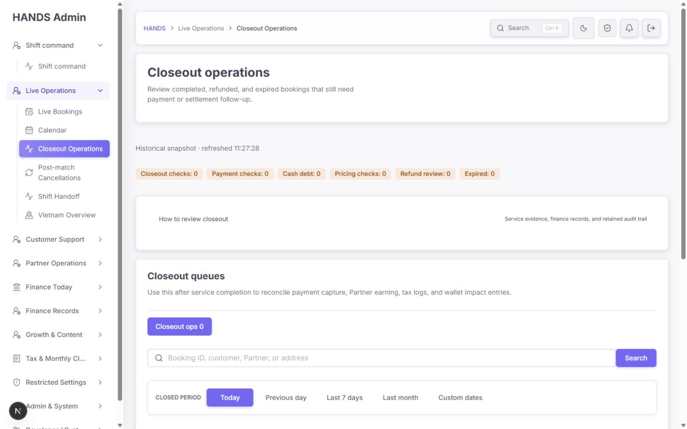
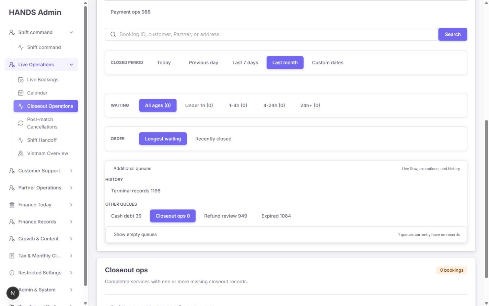
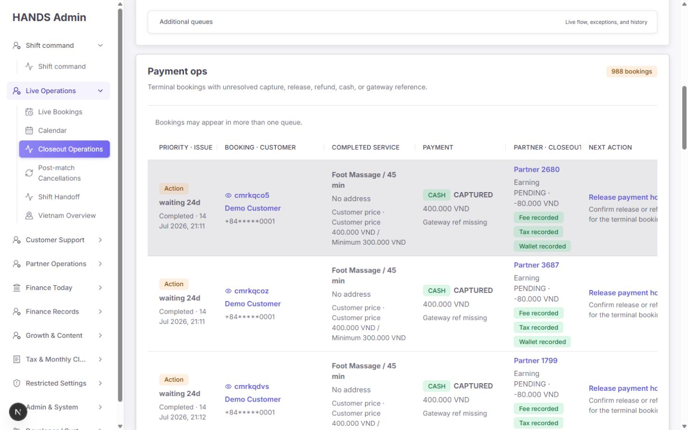
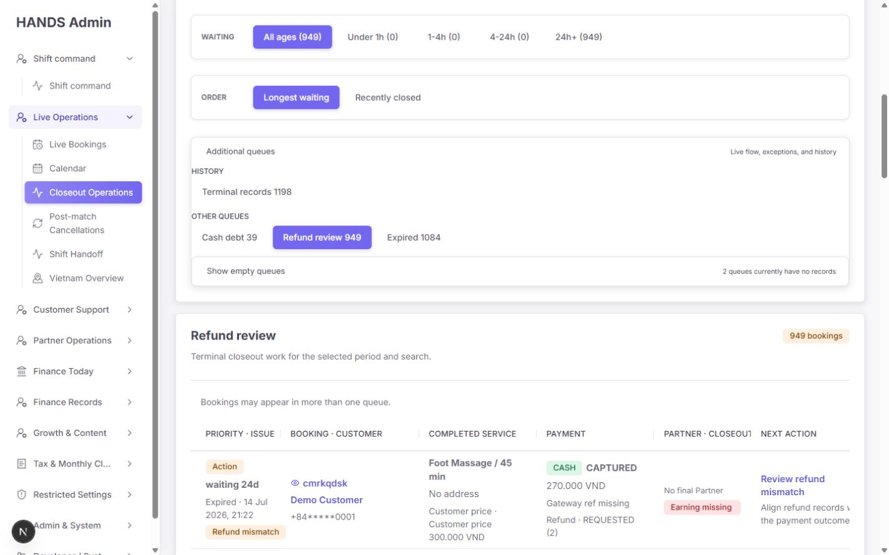
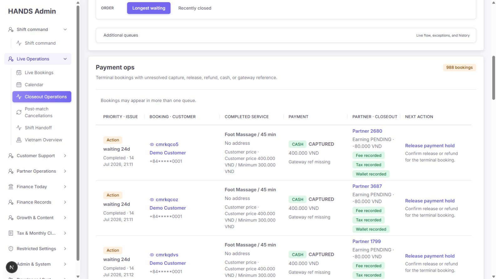
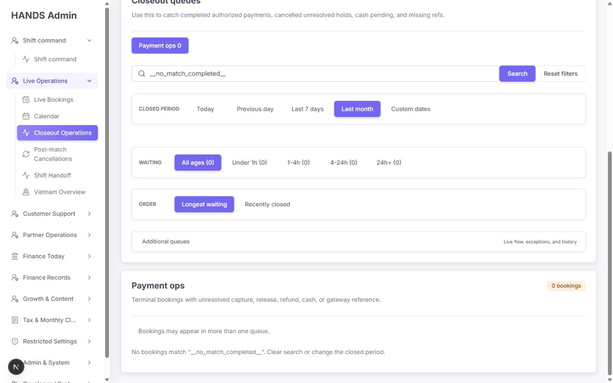
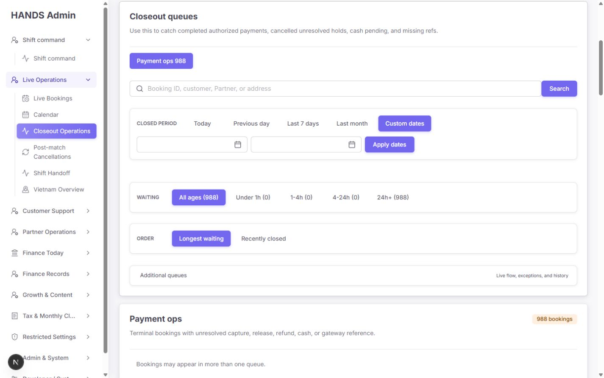
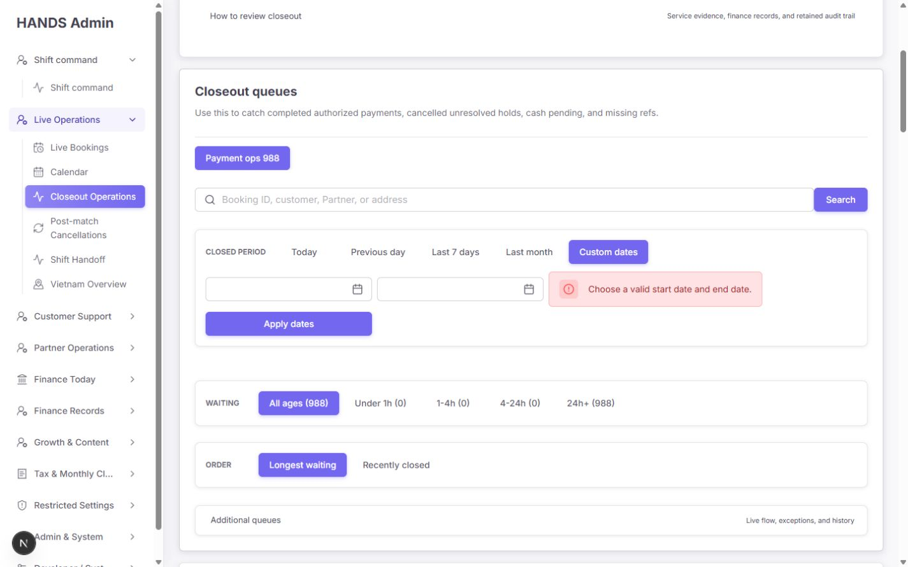
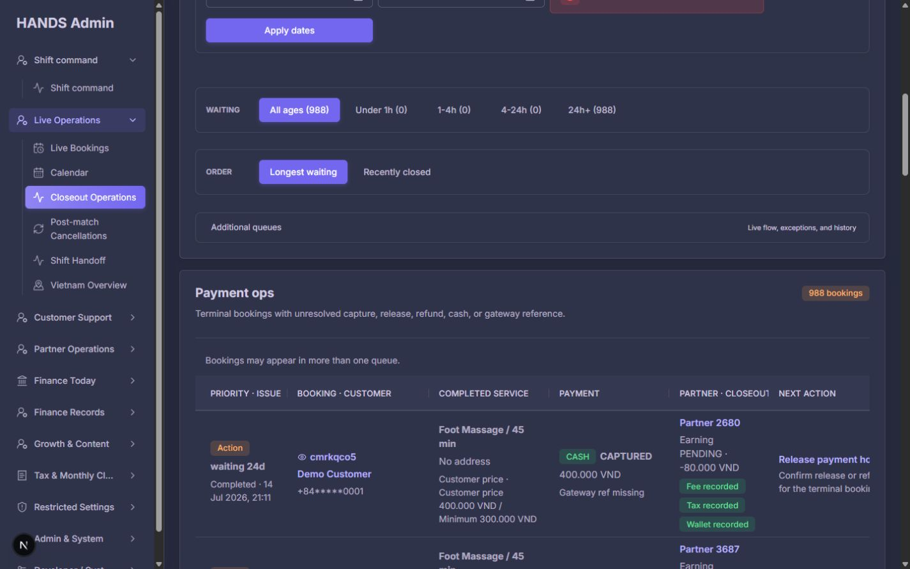

# Closeout operations 재감사 보고서

- 대상: `http://localhost:3101/bookings/completed`
- 감사일: 2026-08-07, Asia/Bangkok
- 기준 화면: 1440×900, 1600×900 데스크톱
- 방법: 로그인된 실제 화면, 검색·기간·큐·정렬·페이지네이션 상호작용, light/dark theme, 현재 React/Next.js 코드와 NestJS/Prisma 조회 조건, 관련 테스트를 함께 대조
- 주의: 현재 로컬 DB에는 `Demo Customer` 레코드가 다수 보인다. 아래 건수는 운영 KPI가 아니라 현재 화면·분류 동작 검증용 스냅샷으로 취급했다.

## 1. 최종 판정

이전 감사에서 지적한 구조 문제는 상당 부분 제대로 수정됐다. 특히 Custom dates 전체 조회 방지, terminal event 기준 기간·대기시간·정렬, 검색 빈 상태, 큐별 issue chip, 6개 closeout 정보 묶음, 서버 페이지네이션, historical 상태 문구는 분명히 개선됐다.

그러나 **운영자가 실제 돈 관련 판단을 맡기기에는 아직 조건부 실패**다. 가장 큰 이유는 `Payment ops`에 들어온 현금부채 건이 화면에서 `Release payment hold`로 안내되는 점이다. 현재 행은 `CASH / CAPTURED`, Partner earning `PENDING · -80.000 VND`, fee/tax/wallet `recorded`인데도 `Gateway ref missing`과 `Release payment hold`를 보여준다. 이 조합은 행의 실제 포함 사유와 행동이 다르며, 잘못된 환불·release 판단을 유도할 수 있다.

또한 `Expired 1084`는 실제 미해결 업무가 아니라 단순히 `status = EXPIRED`인 모든 이력을 작업 큐로 올린다. 이미 payment가 `RELEASED`여도 `Action / Customer notice check`가 붙고, 통지 확인을 완료·제거하는 저장 상태가 없다. 따라서 이 큐는 구조상 0으로 줄일 수 없는 영구 backlog다.

**재감사 점수: 64/100**

- 화면 구조·필터 안정성: 80/100
- 목록 정보 구조: 74/100
- 큐 분류·행동 정확성: 42/100
- 1440px 스캔성: 58/100
- 접근성 기본 구조: 72/100
- 운영 종료 가능성: 48/100

## 2. 이전 감사 대비 개선 확인

| 이전 문제 | 현재 결과 | 판정 |
|---|---|---|
| `Completed Bookings` 명칭과 terminal 데이터 범위 불일치 | 페이지·내비게이션이 `Closeout operations`로 변경됨 | 해결 |
| historical 화면에 realtime 연결 문구 노출 | `Historical snapshot · refreshed ...`만 표시 | 해결 |
| Custom dates 미입력 시 전체 이력 조회 | 미입력 제출을 막고 `Choose a valid start date and end date.` 표시, API도 400 방어 | 해결 |
| 역전 날짜·90일 초과 방어 없음 | UI/API 모두 검증 코드와 테스트 존재 | 해결 |
| Pricing ops에 Expired/Refunded 혼입 | API predicate가 `COMPLETED`를 요구 | 해결 |
| 상태 기반 일반 action만 표시 | `view`를 받아 큐별 action을 선택 | 부분 해결 |
| 큐 포함 사유를 알 수 없음 | `Refund mismatch`, `Cash commission due` 등 issue chip 추가 | 부분 해결 |
| closeout 판단용 finance 정보 없음 | Payment, earning, fee, tax, wallet, refund를 목록에 표시 | 해결 |
| closeout age가 생성시간 기준 | terminal event 기준 SQL을 summary/list/age/sort에 공유 | 해결 |
| 기본 정렬이 최근순 | 작업 큐는 longest waiting, Terminal records는 recently closed | 해결 |
| 검색 결과 없음 문구가 일반적 | 검색어를 포함한 원인별 empty copy와 Reset filters 제공 | 해결 |
| 50건 페이지 | 25건으로 축소하고 first/prev/next/last 페이지 링크 제공 | 해결 |
| 정적 closeout flow가 크게 점유 | 기본 닫힘 disclosure로 이동 | 부분 해결: 닫혀도 114px 사용 |

## 3. 실제 운영 흐름별 건강도

| 운영 단계 | 현재 상태 | 운영자 영향 |
|---|---|---|
| 페이지 진입 | 개선 필요 | 기본 진입은 빈 `Closeout ops 0`인데 가장 눈에 띄는 1차 chip은 `Payment ops 988`이다. 현재 큐는 Additional queues 안에 있어 첫눈에 알기 어렵다. |
| 기간 선택 | 양호 | Today/Previous day/7d/30d/custom이 terminal 기준으로 동작하고 invalid custom range를 차단한다. |
| 큐 선택 | 개선 필요 | Payment가 현금부채·환불·closeout을 포함하는 상위 합집합인데 설명이 이를 밝히지 않는다. `Additional queues`의 그룹 문구도 closeout 화면과 맞지 않는다. |
| 오래된 건 찾기 | 양호 | 작업 큐는 `Longest waiting`, Terminal records는 `Recently closed`; URL·화면·SQL이 일치한다. |
| 행 원인 파악 | 위험 | Refund/Cash 전용 큐에서는 원인이 보이지만 Payment aggregate에서는 `Cash commission due`가 사라지고 irrelevant gateway 경고가 보인다. |
| 다음 행동 선택 | 치명적 결함 | 현금 CAPTURED/negative earning 행에 `Release payment hold`가 노출된다. |
| 상세로 이동 | 양호 | action link가 booking detail의 finance anchor로 이동하고 `returnTo`를 보존한다. |
| 업무 완료 후 큐 제거 | 미완성 | Expired의 customer notice check를 완료 처리할 저장 조건이 없어 backlog가 영구히 남는다. |
| 검색 실패 복구 | 양호 | 검색어가 보존되고 Reset filters가 제공된다. |
| 대량 결과 이동 | 양호 | 988건/40페이지에서 first, previous, next, last와 숫자 페이지 링크가 제공된다. |

## 4. 화면 증거

### 4.1 Today 기본 진입 — 결과보다 안내와 필터가 우선



- 1440×900 첫 화면에서 결과 영역이 보이지 않는다.
- summary 6개, 114px의 닫힌 help card, filter panel이 순서대로 쌓인다.
- Today가 0건인 사실 자체는 정상이나, 빈 작업 상태를 확인하려면 한 화면을 내려야 한다.

### 4.2 Last month — 활성 큐가 Additional 안에 숨음



- 기본 route의 실제 active view는 `Closeout ops 0`이다.
- 첫 번째 primary chip은 `Payment ops 988`이지만 active가 아니고, 실제 active queue는 펼쳐진 `Additional queues`의 `Other queues` 안에 있다.
- `Waiting`의 0건은 오류가 아니라 현재 활성 `Closeout ops 0`에 대한 count다. 다만 화면만 보면 위의 `Payment ops 988`에 대한 age처럼 오해하기 쉽다.

### 4.3 Payment ops — 잘못된 finance 행동과 1440px clipping



- 첫 행은 `CASH / CAPTURED`, `Earning PENDING · -80.000 VND`, fee/tax/wallet 모두 recorded다.
- 그런데 payment 셀은 `Gateway ref missing`, Next action은 `Release payment hold`이다.
- 1440px에서 table scroll wrapper는 1052px, table은 1120px로 68px가 숨는다. Next action의 끝부분이 초기 화면에서 잘린다.

### 4.4 Refund review — 큐별 reason/action은 개선됐지만 같은 가로 문제 유지



- `Refund mismatch` → `Review refund mismatch`는 현재 큐와 행동이 정확히 연결된다.
- 반면 `CASH / CAPTURED`에 `Gateway ref missing`이 계속 표시되고 `Next action` 열은 1440px에서 잘린다.

### 4.5 1600px — 표는 들어오지만 정보 문구 문제는 동일



- 1600×900에서는 wrapper와 table이 모두 1212px로 가로 clipping이 없다.
- 즉 표 구조가 전면적으로 무너진 것은 아니고, 지원 범위의 하한인 1440px에서만 68px를 줄이면 된다.
- 별도 테이블 라이브러리나 카드형 반응형 구조는 필요 없다.

### 4.6 검색 결과 없음 — 정상



- `No bookings match “__no_match_completed__”. Clear search or change the closed period.`가 현재 검색 상태를 정확히 설명한다.
- `Reset filters`가 search/view/period 맥락 안에서 제공된다.

### 4.7 Custom dates — 안전하지만 라벨·오류 배치 개선 필요





- Custom dates를 누른 것만으로 URL 조회가 발생하지 않고 Apply에서만 제출된다.
- 미입력 제출은 차단되고 `role="alert"` 오류가 표시된다.
- 두 입력은 화면상 시작/종료 라벨이 없이 달력 아이콘만 있다. DOM에는 screen-reader label이 있지만 시각 운영자는 좌/우 의미를 추측해야 한다.
- 오류가 나타나면 Apply 버튼이 다음 줄 전체 폭으로 이동해 폼 높이가 크게 바뀐다.

### 4.8 Dark mode — 색상 체계는 안정적, 1440px clipping은 동일



- surface, border, text hierarchy는 dark mode에서도 유지된다.
- 가로 clipping과 잘못된 action/copy는 theme과 무관하게 동일하다.

## 5. 우선순위별 수정 요건

### P0-1. Payment ops의 포함 사유와 Next action을 반드시 일치시켜야 함

**재현 데이터**

```text
CASH / CAPTURED / 400.000 VND
Gateway ref missing
Partner 2680
Earning PENDING · -80.000 VND
Fee recorded / Tax recorded / Wallet recorded
Next action: Release payment hold
```

**코드 원인**

- API의 `completed-payment`는 자체 payment 조건뿐 아니라 `completed-cash-debt`를 OR로 포함한다: `apps/api/src/admin/admin.service.ts:31727-31754`.
- Payment view issue chip은 cash debt를 검사하지 않는다: `apps/admin_web/app/bookings/booking-monitor-list-row-model.ts:125-131`.
- Payment view action은 known conditions에 해당하지 않으면 무조건 `Release payment hold`로 떨어진다: `apps/admin_web/app/bookings/booking-monitor-next-action-label.ts:69-84`.
- renderer는 결제수단과 무관하게 providerRef가 없으면 `Gateway ref missing`을 출력한다: `apps/admin_web/app/bookings/booking-monitor-list-section.tsx:747-758`.

**수정 방법 — 최소 변경 권장**

1. Payment aggregate는 유지하되 이름을 `All payment exceptions`로 바꾼다.
2. `bookingCloseoutQueueAction()`의 payment 분기에서 cash debt를 refund/authorization fallback보다 먼저 확인한다.
3. payment view issue chip에도 `Cash commission due`를 추가한다.
4. `payment.method === CASH`이면 gateway reference 줄을 렌더링하지 않거나 `Gateway reference · Not applicable`로 표시한다.
5. `CASH + CAPTURED + negative earning + unpaid`의 action은 `Settle cash commission`이어야 한다.
6. `Release payment hold`는 실제로 AUTHORIZED/PENDING gateway hold 또는 EXPIRED unresolved payment일 때만 표시한다.

**완료 기준**

- 현재 첫 3개 Payment rows에서 `Release payment hold`가 사라지고 `Settle cash commission`이 보인다.
- CASH 행에 `Gateway ref missing`이 보이지 않는다.
- `booking-monitor-next-action-label.spec.ts`에 현재 재현 조합이 추가된다.
- Payment predicate, issue chip, action의 truth table을 한 테스트 표로 고정한다.

### P1-1. Expired를 영구 작업 큐가 아닌 실제 예외 큐로 바꿔야 함

**화면 결과**

- Last month terminal records 1198건 중 Expired가 1084건이다.
- `RELEASED` payment인 행도 `Action`, `Customer notice check`, `Confirm customer notice`로 표시된다.

**코드 원인**

- `completed-expired` predicate는 오직 `facts.status = EXPIRED`다: `apps/api/src/admin/admin.service.ts:31796-31797`.
- UI는 payment가 released/refunded이면 자동으로 `Customer notice check`와 `Confirm customer notice`를 만든다: `apps/admin_web/app/bookings/booking-monitor-list-row-model.ts:143-148`, `booking-monitor-next-action-label.ts:115-119`.
- notice 확인을 저장하거나 resolved queue에서 제외하는 조건이 이 view에는 없다.

**권장 제품 결정**

- `Expired`를 neutral history인 `Expired records`로 바꾸고 `Terminal records` 하위 기록으로 둔다.
- 실제 action queue는 기존 데이터로 판정 가능한 `Expiry payment exceptions`만 둔다: payment가 RELEASED/REFUNDED가 아닌 expired booking.
- 고객 알림 follow-up을 정말 운영 업무로 만들려면 notification delivery failure/unattempted와 persisted resolution 상태가 있을 때만 별도 `Expiry notification follow-up`을 만든다. 단순 status만으로 새 업무 큐를 만들지 않는다.

**완료 기준**

- 정상적으로 release/refund된 expired record는 warning `Action`으로 보이지 않는다.
- actionable expired queue는 처리 후 실제로 감소할 수 있다.
- 기록과 작업이 동일한 오렌지 warning tone을 공유하지 않는다.

### P1-2. 기본 진입 큐와 primary navigation을 일치시켜야 함

**코드 원인**

- completed route 기본값은 `closeout`: `apps/admin_web/app/bookings/booking-monitor-page.tsx:51-64`.
- generic primary set에는 completed view가 하나도 없어, 첫 non-empty option인 Payment만 primary에 남는다: `booking-monitor-filters-section.tsx:90-95`, `:144-163`.
- active closeout은 Additional을 자동으로 열어서 그 안에서만 표시한다: `booking-monitor-filters-section.tsx:315-325`.

**수정 방법**

- completed route 전용 primary grouping을 둔다.
  - `Needs action`: All payment exceptions, Cash commission, Refund mismatch, Closeout records, Pricing
  - `History`: Expired records, Terminal records
- 기본 진입은 `payment` 또는 명시적인 `all-payment-exceptions`로 고정한다. 데이터 건수에 따라 동적으로 default를 바꾸지 않는다.
- active queue명과 count를 filter panel 제목 바로 아래에 한 번만 표시한다.
- zero queue는 `Show 2 empty checks` 한 줄 disclosure로 접는다.

**완료 기준**

- `/bookings/completed?dateRange=30d` 첫 화면에서 active chip과 결과 제목이 모두 같은 queue를 가리킨다.
- 활성 큐를 찾기 위해 Additional queues를 열거나 아래로 내릴 필요가 없다.

### P1-3. 1440px에서 가로 스크롤 없이 Next action까지 보여야 함

**측정**

- 1440×900: wrapper 1052px, table 1120px, 68px overflow.
- 1600×900: wrapper/table 1212px, overflow 0.
- 원인 CSS: `apps/admin_web/app/globals.css:4123-4126`, 열 폭 `:4262-4300`.

**수정 방법**

- closeout operations table에 한해 `min-width: 1120px`을 제거하고 `width: 100%`로 둔다.
- 6개 열의 비율은 유지하되 `Partner · Closeout`과 `Next action`의 최소 폭을 각각 약 110~150px 범위로 줄이고 줄바꿈을 허용한다.
- action helper는 최대 2줄로 제한하되 primary action 링크는 자르지 않는다.
- gateway reference 전체 값은 목록에서 짧게 `Reference saved`로 표시하고 전체 값은 title/상세에서 제공한다.

**완료 기준**

- 1440×900에서 `.admin-table-scroll.clientWidth === scrollWidth`.
- first viewport에서 Next action 링크가 전부 읽힌다.
- 1600×900 열 비율이 무너지지 않는다.

### P1-4. 겹치는 queue의 역할을 이름과 행에서 설명해야 함

현재 스냅샷:

- Terminal records 1198
- Payment checks 988
- Refund review 949
- Cash debt 39
- `949 + 39 = 988`

API에서도 Payment가 cash debt와 refund/expired payment exception을 포함하므로 숫자는 독립 합계가 아니다. `Bookings may appear in more than one queue.`만으로는 Payment가 상위 aggregate라는 구조를 설명하지 못한다.

**수정 방법**

- `Payment ops` → `All payment exceptions`.
- 보조 문구: `Includes cash commission, refund mismatch, unresolved authorization, and release exceptions.`
- 행의 issue chip에는 현재 booking이 속한 실제 원인을 모두 표시하되 primary reason은 첫 번째로 둔다.
- 상단 6개 오렌지 summary badge는 queue chip과 중복되므로 제거하거나 clickable queue summary 하나로 합친다.
- 합계를 더할 수 없다는 문구보다 포함 관계를 직접 설명한다: `Counts overlap; All payment exceptions includes the cash and refund queues.`

### P1-5. 금융 문구를 운영 언어로 바꿔야 함

1. `Customer price · Customer price 400.000 VND`는 renderer와 helper가 같은 prefix를 중복한다.
   - 원인: `booking-monitor-list-section.tsx:740-745`, `apps/admin_web/lib/booking-service-list-labels.ts:70-73`.
   - 수정: renderer의 `Customer price ·`를 제거하거나 helper를 순수 금액으로 반환한다.
2. `Minimum 300.000 VND`는 무엇의 minimum인지 불명확하다.
   - Pricing queue에서만 `Catalog minimum`으로 표시하고 다른 queue에서는 숨긴다.
3. `Earning PENDING · -80.000 VND`는 운영자가 Partner에게 지급할 금액처럼 읽힌다.
   - negative cash earning이면 `Partner owes HANDS 80.000 VND` 또는 프로젝트의 기존 cash settlement 문구를 재사용한다.
4. `Gateway ref missing`은 CASH에 적용하지 않는다.
5. Next action 링크는 실제 mutation 버튼이 아니라 상세 anchor 이동이다.
   - 링크 동작은 유지하되 helper에 `Open booking finance evidence`처럼 검토 이동임을 분명히 한다.

### P2-1. 첫 900px 안에 결과를 올려야 함

- 닫힌 `How to review closeout`가 약 114px를 사용하고 disclosure affordance도 약하다.
- 상단 warning summary는 아래 queue count와 중복된다.
- 1440×900과 1600×900 모두 결과 시작점이 fold 아래다.

**수정 방법**

- `BookingCompletedCloseoutSection`의 raised card를 compact `AdminDisclosure` 한 줄로 바꾸거나 filter panel 우측 help link로 이동한다.
- historical summary와 queue count를 하나로 합친다.
- 목표: 1440×900에서 queue title, 필터, result header, 첫 row 상단이 모두 보이게 한다.

### P2-2. Custom date 입력에 시각 라벨을 표시해야 함

- DOM label은 있어 keyboard/screen reader 기본은 지켜진다.
- 화면에는 두 빈 박스와 달력 아이콘만 있어 start/end를 추측해야 한다.

**수정 방법**

- 각 필드 위에 `Start date`, `End date`를 보이게 표시한다.
- 오류가 나타나도 Apply 버튼 위치가 크게 이동하지 않도록 error row를 두 입력 아래 전체 폭으로 고정한다.
- 현재 UI/API validation 로직은 그대로 재사용한다.

### P2-3. 경고 색과 0건 표현을 구분해야 함

- historical summary의 0건도 모두 warning orange다.
- active purple `rgb(115,103,240)` 위 14px white text의 계산 대비는 약 4.26:1로, 일반 텍스트 AA 4.5:1에 조금 못 미친다.

**수정 방법**

- 0건은 neutral/success, 실제 action count만 warning/danger.
- active accent를 약간 어둡게 하거나 텍스트 대비를 4.5:1 이상으로 조정한다.
- dark mode에서도 같은 상태 의미를 유지한다.

### P2-4. Additional queues 문구와 단수형을 정리해야 함

- `Live flow, exceptions, and history`는 closeout 화면에 live flow가 없어 사실과 다르다.
- 코드가 항상 `{n} queues`를 써 1건이면 `1 queues currently have no records`가 된다: `booking-monitor-filters-section.tsx:338-343`.

**수정 문구**

- `Other closeout queues and records`
- `1 queue currently has no records`
- `2 queues currently have no records`

### P2-5. historical 화면에서도 fixture 분류를 보존해야 함

- 화면에는 `Demo Customer`가 반복되지만 snapshot 영역에는 test/audit 표시가 없다.
- `BookingMonitorLiveStatusSection`은 historical이면 `auditFixtureVisible`을 사용하기 전에 return한다: `apps/admin_web/app/bookings/booking-monitor-live-status-section.tsx:41-56`.

**수정 방법**

- historical branch에도 `Audit fixtures visible` 또는 `Production data · test data excluded`를 compact neutral badge로 표시한다.
- 이름 문자열로 Demo를 추측하지 말고 API의 명시적 `dataClass/test` fact만 사용한다.

## 6. 권장 최종 화면 구조

새 라이브러리나 새 대시보드는 필요 없다. 현재 컴포넌트를 줄이고 재배치하면 된다.

```text
Closeout operations                           Historical · refreshed 11:32
Resolve terminal payment, refund, cash and ledger exceptions.

[All payment exceptions 988] [Cash commission 39] [Refund mismatch 949]
[Closeout records 0] [Pricing 0] [Expired records 1084] [Terminal records 1198]
Counts overlap: All payment exceptions includes cash and refund queues.

[Search........................................................] [Search]
Closed period  Today  Previous day  7 days  30 days  Custom
Waiting        All  <1h  1–4h  4–24h  24h+
Order          Longest waiting  Recently closed

Payment exception                                           988 bookings
Priority | Booking/customer | Service | Payment | Partner/closeout | Next action
first row...

[How to review closeout ▾]   [Show 2 empty checks ▾]
```

핵심은 더 많은 카드를 추가하는 것이 아니라 다음 세 가지다.

1. 현재 active queue를 숨기지 않는다.
2. aggregate와 subqueue의 포함 관계를 이름으로 설명한다.
3. 각 행의 action은 실제 inclusion reason에서만 나온다.

## 7. Codex 구현 순서

### 1차 — 배포 차단 결함

1. Payment cash-debt 행의 issue/action truth table 수정.
2. CASH gateway reference copy 제거.
3. 관련 UI unit test 추가.

### 2차 — 업무 큐 의미

1. Expired history와 actionable expiry exception 분리.
2. Payment aggregate 명칭·설명 수정.
3. completed 전용 primary queue grouping과 default view 정렬.

### 3차 — 1440px·문구

1. table min-width 1120 제거 및 1440 overflow 0 검증.
2. Customer price 중복, negative earning, Additional copy, 단수형 수정.
3. compact help/summary로 첫 row를 900px 안에 올림.

### 4차 — 접근성·상태 신뢰

1. custom date visible labels와 안정적 error row.
2. active purple contrast 4.5:1 이상.
3. historical fixture/data-class badge.

## 8. 수정 시 지켜야 할 제약

- 새 UI/table/state/dependency를 추가하지 않는다.
- DB migration은 추가하지 않는다. Expired notice resolution에 저장 fact가 없다면 먼저 기록 큐로 낮춘다.
- payment/refund/settlement mutation은 이번 목록 개선에서 건드리지 않는다.
- 기존 `returnTo`와 detail anchor를 유지한다.
- phone masking을 유지한다.
- terminalAt SQL definition은 이미 summary/list/age/sort에 공유되므로 복제하지 않는다.
- Custom date UI/API validation은 이미 정상이라 다시 작성하지 않는다.

## 9. 테스트 추가·수정 요건

### Admin Web

- `booking-monitor-next-action-label.spec.ts`
  - CASH + CAPTURED + negative unpaid earning + payment view → `Settle cash commission`
  - released/refunded expired history → action warning 없음 또는 record action
- `booking-monitor-list-row-model.spec.ts`
  - payment aggregate에서 cash-debt issue chip 표시
  - CASH에 gateway missing reason 없음
- `booking-monitor-list-section.spec.tsx`
  - CASH renderer가 gateway ref missing을 표시하지 않음
  - customer price prefix 1회
  - negative earning의 operator copy
- `booking-monitor-filters-section.spec.tsx`
  - completed primary grouping
  - `1 queue` 단수형
- CSS contract
  - 1440 target에서 closeout table min-width가 container를 강제 초과하지 않음

### API

- `admin.service.spec.ts`
  - `completed-payment`가 cash debt를 포함하는 것이 제품 의도라면 그 관계를 명시하는 test
  - actionable expired predicate는 released/refunded normal record를 제외
- 기존 custom range, terminalAt, pricing completed-only 테스트는 유지한다.

### Browser acceptance

- 1440×900 light: default, all payment exceptions, cash, refund, expired, custom error, search empty
- 1440×900 dark: payment table
- 1600×900 light: payment table
- 1440과 1600에서 table horizontal overflow 0
- 첫 화면 900px 안에 result header와 첫 row 상단 노출
- CASH CAPTURED row에 `Release payment hold`와 `Gateway ref missing`이 없음
- 정상 expired record가 warning action queue에 남지 않음

## 10. 이번 감사 검증 결과

### 통과

- Admin Web 관련 8개 spec: 83/83 통과
- API completed 관련 spec: 10/10 통과
- Impeccable static detector: finding 0; 수동 화면/semantic 검사를 별도로 수행
- 1440×900, 1600×900 light 화면 확인
- 1440×900 dark 화면 확인
- 검색 결과 없음, custom date 미입력 오류, queue sort, pagination, action deep link 확인

### 전체 파일 실행 중 기존 실패

- `admin-booking-list-query.spec.ts + admin.service.spec.ts`: 556개 중 555 통과, 1 실패
- 실패: `builds booking monitor totals from database counts instead of the current page`
- 원인: test mock에 `operationalPolicySetting.findUnique`가 없어 `bookingMonitorSummary()`가 reject됨.
- completed 전용 테스트만 다시 실행하면 10/10 통과했다. 이번 감사 산출물은 앱 코드를 수정하지 않았으므로 실패를 고치지 않았다.

## 11. Handoff

- 이번 작업에서 추가한 파일: 이 보고서와 `01`~`13` PNG 증거
- 앱/API 코드 변경: 없음
- 보호 영역 변경: 없음
- 기존 dirty worktree: 보존, 되돌리거나 정리하지 않음
- commit: Not committed
- 다음 권장 작업: P0-1의 cash-debt/payment action truth table을 가장 먼저 수정하고 1440px acceptance screenshot까지 한 번에 검증
