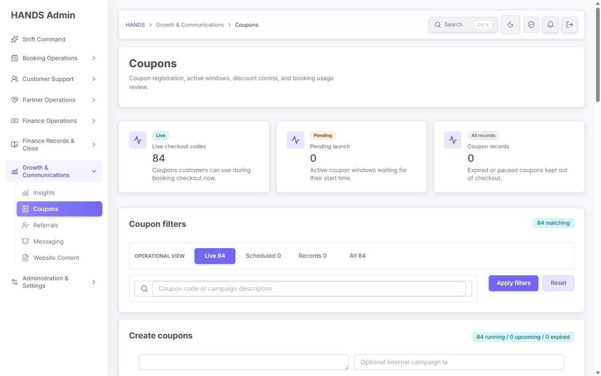
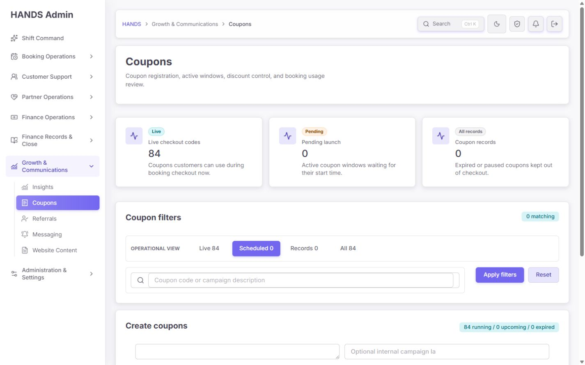
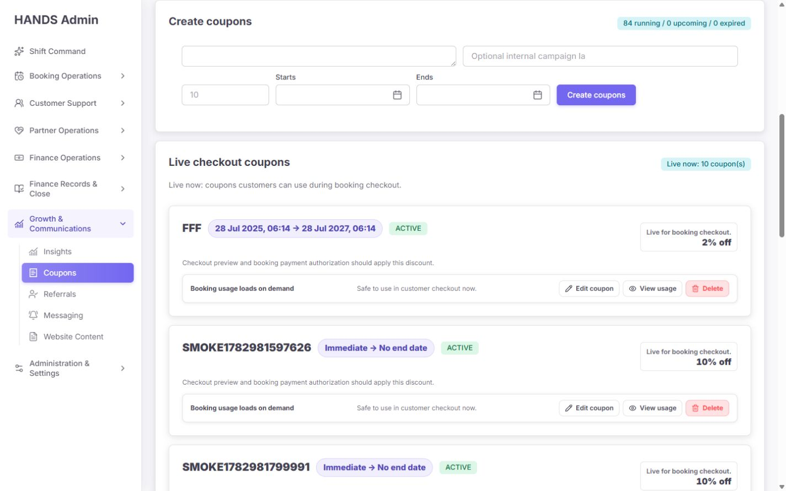
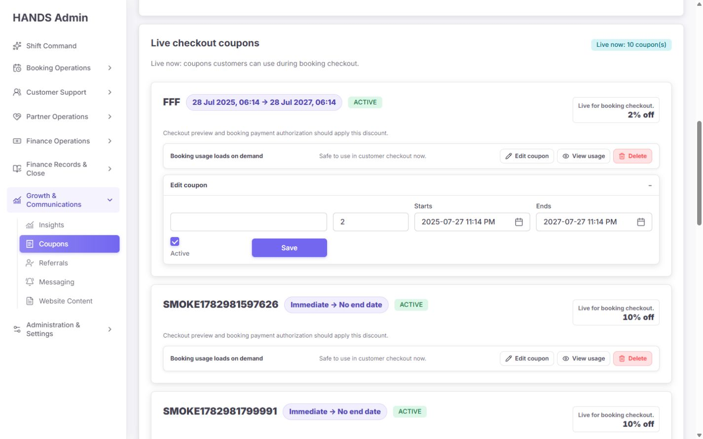
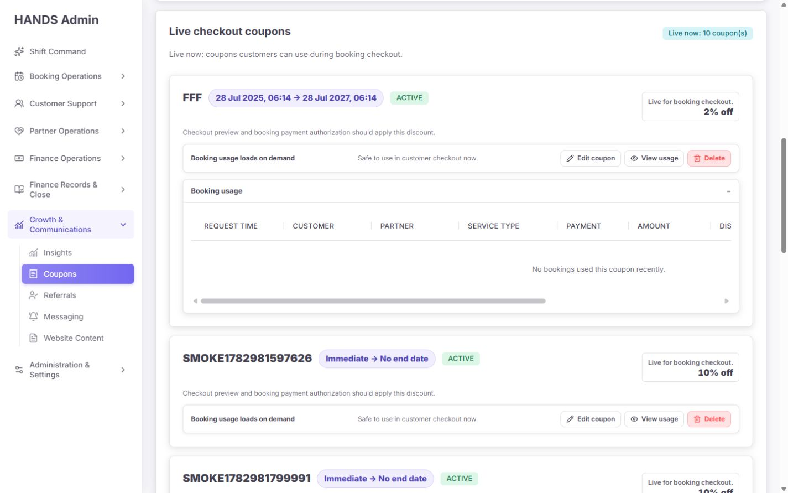
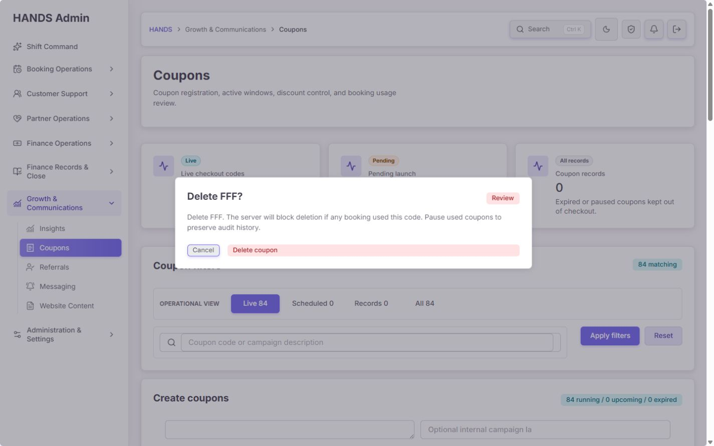
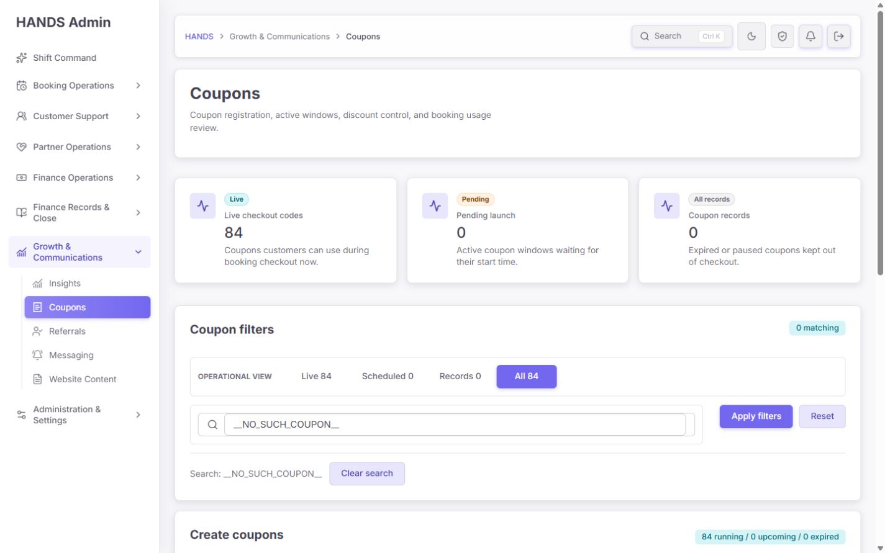
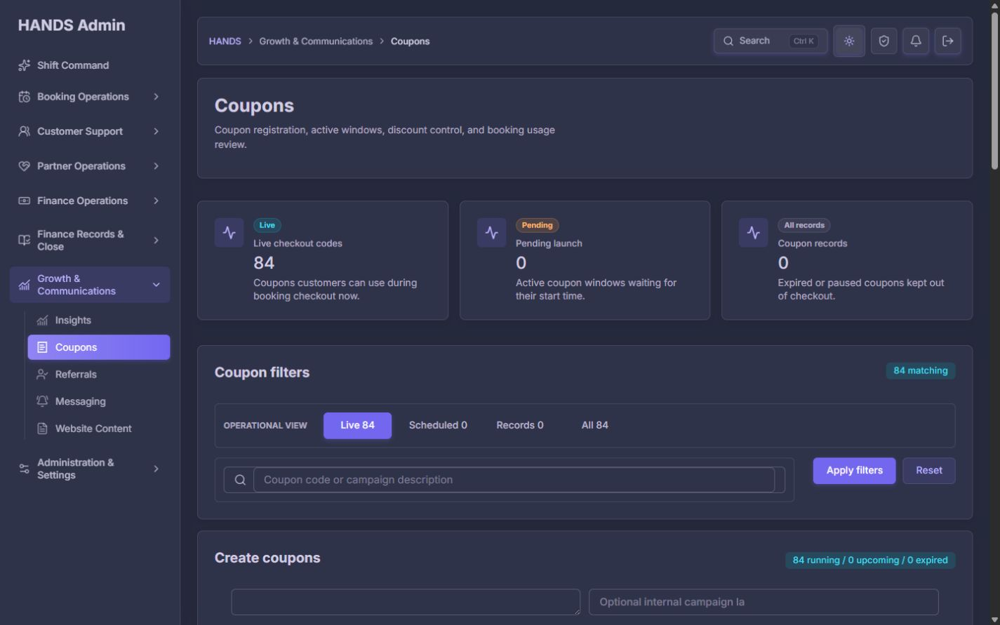
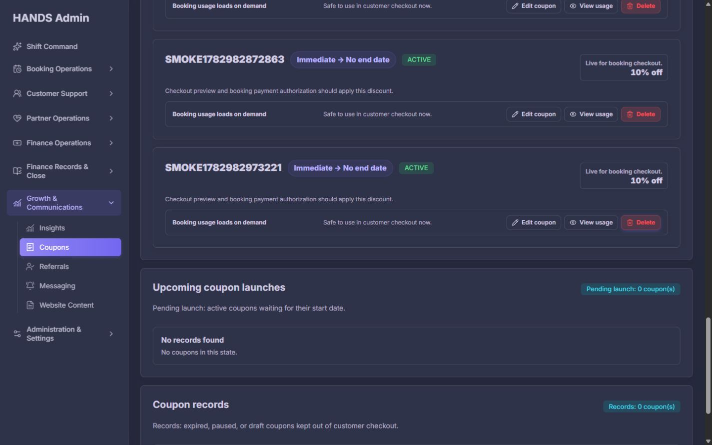

# Coupons 개선 후 심층 재감사 보고서

- 대상: `http://localhost:3101/coupons`
- 감사일: 2026-08-10
- 화면 기준: 로그인된 로컬 관리자, 1440×900 데스크톱
- 검증 상태: 기본 Live, Scheduled 0건, All 검색 0건, 검색 결과, 2페이지, 생성 폼, 편집 폼, 사용내역, Pause/Delete 확인창, dark theme
- 코드 범위: Admin Web Coupons page/filter/model/actions/presenter/CSS, 공통 datetime/confirmation components, Admin API coupon query/summary/usage/write contract, Prisma Coupon schema, 관련 테스트
- 변경 범위: 애플리케이션 소스와 운영 데이터는 수정하지 않았으며 이 보고서와 현재 실행 캡처만 생성했다.

## 1. 최종 판정

**판정: 재수정 필요. 이전 개선으로 목록 탐색과 기본 안전장치는 분명 좋아졌지만, 현재 상태는 운영 배포 승인 수준이 아니다.**

잘된 부분은 명확하다. Live/Scheduled/Records/All을 서버 조건으로 분리했고, 검색과 페이지네이션도 서버 기준으로 동작한다. 사용내역은 선택한 쿠폰만 지연 로드하며, 삭제는 확인창과 서버 사용 이력 검사를 거친다. 생성·수정·삭제에는 Admin audit log가 남고, 관련 Coupons unit test 35개와 API coupon test 11개도 통과했다. 확인창의 `alertdialog`, focus trap, Cancel 우선 포커스와 dark theme도 양호하다.

하지만 다음 네 가지는 운영자가 실제로 캠페인을 관리할 때 오류 또는 잘못된 판단을 만들 수 있다.

1. **편집 날짜의 무변경 저장이 ICT 기준 시간을 7시간 앞당길 수 있다.** 카드에는 `28 Jul 2025, 06:14`로 보이지만 편집 입력은 `2025-07-27 11:14 PM`으로 열렸다. 현재 `toISOString().slice(0, 16)`과 local datetime parser 조합은 UTC 값을 현지시각처럼 다시 해석한다.
2. **2페이지 이후, Scheduled, Records, 검색 결과의 Delete 확인창이 열리지 않는다.** Delete 링크가 현재 `view`, `q`, `couponPage`를 버리고 기본 Live 1페이지로 이동하며, 확인 모델은 현재 10개 목록에서만 대상 쿠폰을 찾는다.
3. **Pause/Activate 확인 기능은 코드에만 있고 실제 카드에는 진입 링크가 없다.** 운영자는 Edit에서 `Active`를 해제하고 확인 없이 Save해야 한다. 즉, 구현된 안전 확인 절차가 실제 업무 경로와 연결되지 않았다.
4. **현재 데이터 84개 중 83개가 `SMOKE*`이며 모두 Live 검색 결과에 포함된다.** 이것은 화면 구조와 별개로 현재 관리자 수치를 운영 판단에 사용할 수 없게 만드는 데이터 위생 문제다.

추가로 생성 폼의 핵심 세 필드 이름이 시각적으로 숨겨져 있고, 빈 textarea가 무엇인지 화면만 보고는 알기 어렵다. 생성은 기본 `active: true`, 시작 즉시, 종료 없음이 가능하며 대량 입력 개수 제한이나 사전 확인이 없다. 카드에서는 campaign description이 전혀 표시되지 않고 기술 문구가 반복되며, 10개 카드가 3,444px 길이로 늘어난다.

### 종합 점수

| 영역 | 점수 | 판정 |
|---|---:|---|
| 운영 작업 흐름 | 58/100 | 핵심 action 결함 |
| 정보 구조·문구 | 68/100 | 구조는 개선, 중복과 누락 잔존 |
| 데이터 계약 정확성 | 55/100 | 시간 round-trip 및 false-zero 위험 |
| 변경 안전성 | 57/100 | Delete 보호는 양호, 생성/상태 변경 위험 |
| 데이터 신뢰성 | 25/100 | 83/84 Smoke 데이터 |
| 1440px 시각 완성도 | 78/100 | 정돈됐으나 지나치게 긴 카드 목록 |
| 접근성 | 81/100 | dialog/landmark 양호, focus/visual label 보완 필요 |
| 로컬 성능 | 86/100 | 즉시 병목 없음, interaction refetch 최적화 여지 |
| **전체** | **64/100** | **재수정 후 재검수 필요** |

## 2. 이전 개선 반영 상태

Coupons 전용 이전 보고서 파일은 현재 `output`에서 확인되지 않았다. 따라서 현재 코드 diff, 관련 테스트, 기존 관리자 공통 감사 기준을 근거로 개선 의도를 복원해 판정했다.

| 개선 의도 | 상태 | 현재 확인 결과 |
|---|---|---|
| Live/Scheduled/Records/All 운영 view | 완료 | 서버 state filter와 count가 연결되고 active view에는 `aria-current="page"`가 적용된다. |
| 쿠폰 코드·campaign description 검색 | 완료 | API가 code/description case-insensitive 검색을 수행하고 Clear search가 현재 view를 보존한다. |
| 서버 페이지네이션 | 완료 | 10건 단위 list와 filteredCount 기반 pagination이 동작한다. |
| 생성/편집 description 지원 | 부분 | 저장과 검색은 되지만 카드에서 description을 렌더링하지 않는다. |
| percent 1–100 검증 | 완료 | Web action과 API 모두 같은 범위를 검증한다. |
| 날짜 순서 검증 | 부분 | start ≤ end는 검증하지만 기존 UTC 값을 편집 폼으로 되돌리는 과정이 잘못됐다. |
| 사용내역 지연 로드 및 pagination | 완료 | 선택한 쿠폰만 `/usage`를 호출한다. 기본 목록 payload는 작다. |
| 사용내역 payment 정보 | 완료 | method/status 열이 추가됐다. |
| 사용된 쿠폰 삭제 방지 | 부분 | 서버 보호와 첫 페이지 확인창은 정상이나, 확인창 진입 자체가 현재 페이지 밖에서 실패한다. |
| Pause/Activate 확인 | 미완료 | confirmation builder/action/menu item은 있으나 카드에 trigger가 없다. |
| 성공·실패 notice | 완료 | 생성 partial, auth, update, delete-used 등의 구체 상태가 있다. |
| API failure 상태 분리 | 미완료 | `adminGet` fallback을 그대로 사용해 장애를 0건 또는 empty usage처럼 표시한다. |
| 운영 데이터 위생 | 미완료 | 화면에 83개 `SMOKE*` Live coupon이 남아 있다. |
| dark theme | 완료 | 주요 surface, badge, filter, input 대비가 안정적이다. |

## 3. 화면 흐름별 감사

### Step 1 — Live 첫 진입 · 상태: 구조는 양호, 데이터 신뢰는 심각

잘된 점:

- 페이지 제목, breadcrumb, Growth & Communications 내 현재 위치가 명확하다.
- Live, Pending launch, Records의 세 가지 lifecycle KPI는 서로 구분된다.
- filter와 create, 결과 목록이 카드 단위로 나뉘어 시각적 경계가 안정적이다.
- 1440px에서 주요 toolbar와 filter는 가로 잘림 없이 보인다.

문제:

- `Live checkout codes 84`가 첫 KPI로 크게 보이지만 그중 83개가 `SMOKE*`다. 현재 수치는 운영 캠페인 수가 아니라 테스트 잔존 데이터 수에 가깝다.
- `generatedAt`은 API summary에 존재하지만 화면에 표시되지 않는다. operator는 이 84가 언제 계산된 값인지 확인할 수 없다.
- list/summary 요청이 실패해도 각각 `[]`, zero summary로 fallback한다. 장애 시에도 `Live 0 / Pending 0 / Records 0`처럼 정상 0건으로 보인다.
- KPI 아이콘이 세 카드 모두 동일한 pulse mark라 lifecycle 의미를 구분하는 데 도움을 주지 않는다.
- title description이 “registration, active windows, discount control, booking usage review”로 기능을 나열할 뿐, 오늘 운영자가 먼저 할 일을 알려주지 않는다.

권장:

- KPI 위에 `Data current as of … ICT` 또는 `Source unavailable` 상태를 둔다.
- `Live codes`, `Ending in 24h`, `Redemptions today`, `Discount spend today`, `Needs review` 중 실제 운영 의사결정에 필요한 3–5개로 재구성한다.
- 테스트/fixture provenance가 해결되기 전에는 `Not for production decisions` 수준의 명확한 경고를 표시한다.

### Step 2 — Filter와 Scheduled 0건 · 상태: filter는 좋지만 결과가 너무 늦다

잘된 점:

- `Live 84`, `Scheduled 0`, `Records 0`, `All 84`가 한 줄에 있고 count가 view label과 함께 표시된다.
- Scheduled 선택에는 `aria-current="page"`가 적용된다.
- 검색은 현재 view를 hidden input으로 보존하고, 별도의 Clear search도 제공한다.

문제:

- Scheduled를 선택하면 화면 상단에는 `0 matching`만 보이고 실제 `No coupons in this state`는 항상 열린 Create panel 아래에 있다. 900px 높이에서 결과 상태를 확인하려면 스크롤해야 한다.
- `0 matching`은 무엇이 0인지 단위가 없다. `0 coupons`가 더 직접적이다.
- Reset은 현재 view와 검색을 모두 버리고 Live로 돌아간다. 의미는 맞지만 `Reset all`처럼 범위를 명시해야 Clear search와 혼동이 없다.
- All view는 현재 10건 page slice를 다시 Live/Upcoming/Records 세 section으로 나눈다. section badge의 숫자는 전체 state count가 아니라 현재 page에 포함된 건수다.

권장:

- 결과 목록을 filter 바로 아래로 올리고 Create는 우측 상단 `Create coupon` 버튼으로 시작하는 drawer/dialog로 이동한다.
- zero-count view는 즉시 `No scheduled coupons`와 `Create scheduled coupon` secondary action을 보여준다.
- section badge는 `Showing 10 of 84 live coupons`처럼 현재 page와 전체 count를 구분한다.

### Step 3 — Create coupons · 상태: 시각 label과 변경 안전성이 부족

현재 화면에서 보이는 생성 폼은 첫 줄에 라벨 없는 textarea, 잘린 description placeholder, 다음 줄에 `10` placeholder만 있는 숫자 입력, Starts, Ends, Create coupons 버튼이다.

문제:

- `Coupon codes`, `Campaign description`, `Discount %`는 DOM label이 있지만 `.sr-only`라 운영자에게 보이지 않는다. 첫 번째 빈 textarea가 코드 입력인지 메모 입력인지 추론해야 한다.
- 여러 코드를 공백·쉼표·줄바꿈으로 나눌 수 있다는 핵심 batch 규칙이 화면에 없다.
- 입력한 코드 개수, 중복 제거 결과, 80자 초과, 기존 코드 충돌을 submit 전에 확인할 수 없다.
- 개수 상한이 없고 server action이 코드마다 순차 POST한다. 대량 붙여넣기는 긴 요청과 부분 성공을 만들 수 있다.
- partial failure notice는 성공/실패 개수만 알려주고 어느 코드가 실패했는지 알려주지 않는다.
- 생성은 항상 `active: true`다. Starts/Ends가 비어 있으면 즉시 사용 가능하며 종료일도 없다.
- 실제로 83개 Smoke coupon이 `Immediate → No end date / ACTIVE`인 현재 데이터는 이 위험이 단순 가정이 아님을 보여준다.
- Create panel status `84 running / 0 upcoming / 0 expired`는 상단 KPI를 반복하며, paused도 합산하면서 label은 expired라고 표현한다.

권장 생성 flow:

1. 화면 우측 상단 `Create coupon`을 누르면 drawer를 연다.
2. visible label과 helper를 제공한다: `Coupon codes`, `One per line or separated by commas`, `Campaign name`, `Discount percent`, `Start`, `End`.
3. paste 후 `83 codes detected · 4 duplicates removed · 2 invalid` preview를 표시한다.
4. batch 상한을 예: 50개로 제한하고 API batch endpoint가 code별 결과를 반환하게 한다.
5. 기본 저장 상태는 `Draft/Paused`로 한다. 즉시 활성화는 별도 `Activate at checkout` 선택과 확인을 요구한다.
6. `No end date`는 빈 값이 아니라 명시적 checkbox로 선택하게 한다.
7. submit 전 최종 요약을 보여준다: `Create 12 active coupons, 10% off, starts now, no end date`.

### Step 4 — Coupon card 목록 · 상태: 읽을 수는 있으나 운영 효율이 낮다

문제:

- description은 row model에 존재하지만 card에 표시되지 않는다. 코드가 `SMOKE...`처럼 의미 없는 경우 캠페인 목적을 알 수 없다.
- 한 카드가 같은 뜻을 여러 번 반복한다: `ACTIVE`, `Live for booking checkout`, `Checkout preview … should apply`, `Safe to use in customer checkout now`.
- `Checkout preview and booking payment authorization should apply this discount`는 개발/결제 구현 문구이며 운영자 판단 문구가 아니다.
- `Booking usage loads on demand`는 사용이 0이라는 뜻인지 아직 조회하지 않았다는 뜻인지 읽는 순간 구분하기 어렵다.
- quick action은 Edit, View usage, Delete뿐이다. 가장 자주 필요한 Pause/Activate가 없다.
- 빨간 Delete가 모든 카드에 항상 노출돼 시각적 위험 신호가 과도하다. 사용 이력 여부도 모르는 상태에서 Delete를 첫급 action으로 올릴 필요가 없다.
- 10개 카드로 기본 페이지 높이가 3,444px다. 84개를 9페이지에 걸쳐 카드로 관리하는 구조는 비교·스캔·대량 검토에 비효율적이다.

권장 구조:

| Code / campaign | Discount | Checkout window | Status | Usage | Discount spend | Owner | Actions |
|---|---|---|---|---:|---:|---|---|
| FFF · Summer test | 2% | 28 Jul 2025 – 28 Jul 2027 ICT | Live | 0 | ₫0 | Growth | View · Pause · More |

- 기본은 48–56px dense table row로 바꾸고, 상세/편집/usage는 우측 drawer에서 연다.
- primary row에는 code, description, discount, local window, lifecycle, usage count만 둔다.
- `Pause/Activate`는 status 옆 quick action, Delete는 `More` 안의 저빈도 destructive action으로 내린다.
- 사용 이력을 아직 조회하지 않았다면 `Usage not loaded`라고 쓰고, API가 `usageBookingCount`를 list에 제공하면 즉시 숫자로 바꾼다.

### Step 5 — Edit coupon · 상태: P0 시간 오류와 이동 동선 결함

확인한 실제 값:

- 카드 표시: `28 Jul 2025, 06:14 → 28 Jul 2027, 06:14`
- 편집 visible input: `2025-07-27 11:14 PM → 2027-07-27 11:14 PM`
- hidden form value: `2025-07-27T23:14 → 2027-07-27T23:14`

원인:

- `datetimeLocalInputValue()`가 ISO UTC timestamp에 `toISOString().slice(0, 16)`을 적용한다.
- `AdminFormDatePickerField`는 이 timezone 없는 값을 browser local datetime으로 파싱한다.
- submit action은 다시 `new Date(raw).toISOString()`을 호출한다.
- ICT browser에서 무변경 Save 시 UTC instant가 7시간 앞당겨질 수 있다.

추가 문제:

- 카드에서 Edit를 클릭하면 query navigation 뒤 scroll이 `793 → 0`으로 돌아갔고, 열린 edit panel top은 viewport 아래 `1,331px`였다. operator는 방금 누른 폼을 즉시 볼 수 없다.
- focus도 edit field가 아니라 기존 Edit link에 남는다.
- Campaign description과 Discount % visible label이 숨겨져 있다.
- Save 외에 Cancel/Discard가 없다.
- Active checkbox로 상태를 바꾸면 Pause/Activate confirmation을 우회한다.
- 변경 전/후 값, timezone, 영향받는 checkout window를 요약하지 않는다.

수정 방법:

1. UTC instant를 ICT wall time으로 변환해 picker에 전달하고, submit에서 명시적으로 ICT → UTC 변환한다.
2. 공통 helper에 `instantToIctDateTimeLocal()`과 `ictDateTimeLocalToInstant()` 같은 역함수를 두고 round-trip test를 작성한다.
3. 모든 visible timestamp에 `ICT`를 표시한다.
4. edit는 drawer에서 열거나 `#coupon-{id}-edit` anchor로 이동하고 첫 editable field에 focus한다.
5. Active checkbox를 제거하고 상태 변경은 별도 confirmed action으로 통일한다.
6. `Save changes`와 `Cancel`을 제공하고 dirty-state에서 닫을 때만 discard 확인을 한다.

### Step 6 — Booking usage · 상태: lazy loading은 좋지만 audit 정보가 약하다

잘된 점:

- 기본 목록에서는 usage 요청이 없고, 선택한 쿠폰만 10건 단위로 조회한다.
- booking detail로 이동할 수 있고 customer, partner, service, payment, amount, discount, booking state, reversal을 제공한다.
- server query가 couponId와 legacy couponCode metadata를 함께 검색하고, 사용 이력이 있으면 삭제를 막는다.

문제:

- 빈 usage에서도 1,490px table이 972px container 안에 생겨 가로 스크롤이 노출된다.
- `Amount`는 실제 customer payment amount지만 column label만으로는 original price인지 paid amount인지 알 수 없다.
- original amount가 API에 있는데 화면에는 표시하지 않는다.
- service query는 `take: 1`이라 multi-service booking은 첫 서비스만 보여준다.
- usage summary가 없다. 총 redemptions, gross sales, discount cost, refunded/reversed count를 operator가 판단할 수 없다.
- usage API 실패도 empty fallback으로 바뀌어 `No bookings used this coupon recently`라고 잘못 표시된다.
- 문구의 `recently`는 API가 전체 이력을 count/query하므로 정확하지 않다.

권장:

- 빈 상태에서는 table header와 scrollbar를 렌더링하지 않고 `No recorded bookings for this coupon`만 표시한다.
- 상단 summary에 `Bookings`, `Customer paid`, `Discount granted`, `Reversed`를 추가한다.
- column을 `Customer paid`, `Original price`, `Discount`, `Payment status`, `Booking status`, `Reversal`로 명확히 한다.
- multi-service는 `Thai Massage +2`처럼 요약하고 hover/detail에서 전체를 제공한다.
- 사용내역 실패는 `Usage unavailable · Retry`로 분리한다.

### Step 7 — Delete confirmation · 상태: 첫 페이지는 양호, 범위 밖은 기능 실패

첫 페이지에서 잘된 점:

- `alertdialog`, `aria-modal`, label/description 연결, focus trap이 적용된다.
- 초기 focus가 Cancel에 있어 실수로 Enter를 눌러 삭제할 가능성을 줄인다.
- 사용 이력이 있으면 서버가 삭제를 막고 Pause를 권장한다.
- 배경 click, Escape, Cancel 경로가 공통 focus boundary로 관리된다.

그러나 2페이지 첫 쿠폰 `SMOKE1782982973221`의 Delete를 누른 결과 URL은 `confirm=delete&couponId=...`로 바뀌었지만 dialog 수는 0이었다.

원인:

- `couponDeleteConfirmHref(row.id)`가 현재 `view`, `q`, `couponPage`를 포함하지 않는다.
- confirm navigation 후 page가 기본 Live 1페이지 10건을 다시 로드한다.
- `buildCouponDeleteConfirmation(couponModel.orderedCoupons, couponId)`는 그 10건 안에서만 target을 찾는다.
- Scheduled, Records, page 2+, 검색 결과에만 보이는 쿠폰은 confirmation model이 `null`이 된다.

수정 방법:

1. confirmation 대상은 현재 page list에서 찾지 말고 `/admin/coupons/:id`로 독립 조회한다.
2. confirm href에 `returnTo` 또는 현재 canonical query를 포함한다.
3. Cancel과 성공 후 redirect는 원래 view/search/page로 돌아간다.
4. 대상 조회 실패 시 dialog를 조용히 숨기지 말고 `Coupon could not be loaded` notice와 안전한 return action을 표시한다.
5. page 2, Scheduled, Records, search result를 각각 integration test에 추가한다.

### Step 8 — Pause/Activate · 상태: 구현됐으나 운영 경로 없음

직접 query로 연 `Pause FFF?` dialog는 copy와 server action이 정상적으로 구성돼 있었다. 그러나 실제 카드의 action link 목록에는 Pause 또는 Activate가 하나도 없다.

코드에는 다음이 모두 존재한다.

- `couponActionMenuItems()`의 Pause/Activate item
- `couponToggleConfirmHref()`
- `buildCouponToggleConfirmation()`
- `toggleCoupon()`

하지만 `CouponsTableSection`은 이 presenter/action menu를 사용하지 않는다. 현재 실제 상태 변경은 edit form의 Active checkbox뿐이며 확인창을 우회한다.

권장:

- Live/Scheduled row에는 `Pause`, Records row에는 window가 유효할 때 `Activate`를 quick action으로 제공한다.
- Active checkbox 직접 수정은 제거한다.
- activation 시 start/end window, 종료 여부, 예상 customer exposure를 확인창에서 요약한다.
- expired coupon의 Activate는 end date를 고치기 전에는 disabled하고 이유를 표시한다.

### Step 9 — Search·empty state · 상태: 기능은 맞지만 결과 hierarchy가 약함

잘된 점:

- 현재 검색어와 `Clear search`가 보인다.
- matching count가 서버 filteredCount와 일치한다.
- view 전환 링크가 검색어를 보존한다.

문제:

- All + 0 search 결과에서도 Create panel이 먼저 나오고 Live/Upcoming/Records의 empty section 세 개가 뒤에 반복된다.
- `No coupons in this state`만으로는 검색 결과 0인지 lifecycle 0인지 구분되지 않는다.
- 검색어 highlight, exact code match 우선, active filter summary가 없다.

권장:

- 검색 0건은 하나의 통합 empty state로 처리한다: `No coupons match “…”` + `Clear search`.
- code exact match를 우선 정렬하고 일치 문자열을 강조한다.
- All view는 한 테이블에 Status column을 두는 것이 세 개 empty section보다 효율적이다.

### Step 10 — Dark theme · 상태: 양호

- surface, active view, status badge, input, sidebar 대비가 안정적이다.
- light theme와 같은 정보 구조가 유지된다.
- 위험 색상 Delete가 dark에서도 식별된다.
- 남은 핵심 문제는 theme보다 workflow, data contract, card density에 있다.

### Step 11 — 현재 데이터 위생 · 상태: 운영 판단 불가

실화면 검색 결과:

- 전체 coupon: 84
- `SMOKE` matching: 83
- 현재 page의 Smoke row: 모두 `ACTIVE`, `Immediate → No end date`, 대부분 `10% off`

이 상태에서 `Live checkout codes 84`는 실제 성장 캠페인 상태를 의미하지 않는다. 또한 smoke test가 생성한 coupon이 cleanup되지 않는다면 결제 checkout에 실제로 노출될 수 있다.

권장:

1. smoke/E2E fixture에는 명시적 provenance field 또는 전용 tenant/environment를 사용한다.
2. 테스트는 생성한 coupon id를 기록하고 `afterAll`에서 사용 이력이 없는 fixture만 정리한다.
3. production-like environment에서는 `SMOKE*`, `AUDIT*` 같은 이름 규칙이 아니라 metadata provenance로 차단한다.
4. 현재 83건은 자동 삭제하지 말고 usage 여부, environment, creator audit log를 확인한 뒤 별도 cleanup 계획으로 처리한다.
5. 운영 화면에 fixture 포함 여부와 count를 명시한다.

## 4. 우선순위별 수정 요건

### P0 — 배포 전 필수

#### P0-1. ICT 시간 round-trip을 무손실로 만든다

- card 표시와 edit picker가 같은 wall time을 보여야 한다.
- 무변경 Save 후 DB instant가 1ms도 바뀌지 않아야 한다.
- DST가 없는 ICT를 기준으로 하더라도 server/browser timezone이 달라질 수 있으므로 timezone 없는 문자열을 `new Date(value)`에 직접 맡기지 않는다.
- create, edit, display, audit log에 동일한 timezone contract를 적용한다.

수용 기준:

- `2025-07-27T23:14:00.000Z`가 화면과 picker에서 `28 Jul 2025, 06:14 ICT`로 일치한다.
- unchanged submit payload가 원래 instant와 동일하다.
- UTC, ICT, browser timezone 2종에서 unit/integration test가 통과한다.

#### P0-2. API failure와 진짜 0건을 분리한다

- `adminGetResult`로 list, summary, usage의 `ok/status`를 보존한다.
- summary 실패 시 KPI를 0으로 표시하지 않는다.
- list 실패 시 empty state 대신 `Coupon data unavailable · Retry`를 표시한다.
- usage 실패 시 `No bookings`라고 주장하지 않는다.
- source unavailable 상태에서는 create/edit/delete를 그대로 노출할지 permission/policy를 명시적으로 결정한다.

#### P0-3. Smoke coupon provenance를 정리한다

- 83개 fixture의 생성 audit actor, usage count, environment를 먼저 inventory한다.
- 사용 이력 있는 coupon은 삭제하지 않고 Pause/Archive한다.
- 사용 이력 없는 fixture도 검증된 목록으로만 정리한다.
- 이후 test isolation과 cleanup을 CI 수용 기준에 포함한다.

### P1 — 운영 workflow 완성

#### P1-1. 모든 view/page에서 confirmation을 열 수 있게 한다

- target coupon 독립 조회, return context 보존, missing-target error를 구현한다.
- page 2+, Scheduled, Records, search, stale URL test를 추가한다.

#### P1-2. Pause/Activate를 실제 UI에 연결한다

- active checkbox 우회 경로를 없애고 confirmed status action 하나로 통합한다.
- status/date window에 따라 action enablement와 copy를 달리한다.

#### P1-3. 생성 flow를 안전한 draft-first flow로 바꾼다

- visible labels, helper, batch preview, 상한, per-code result, explicit no-end, activation confirmation을 추가한다.
- 생성과 activation을 한 단계에 묶어야 한다면 open-ended active coupon에 대한 강한 확인을 요구한다.

#### P1-4. card list를 dense table + drawer로 변경한다

- page 길이와 반복 문구를 줄이고 campaign description을 주요 정보로 올린다.
- edit/usage를 drawer로 열어 scroll/focus를 보존한다.
- section count는 현재 page가 아닌 전체 state count를 표현한다.

#### P1-5. operator-facing copy로 교체한다

현재 → 권장:

| 현재 문구 | 권장 문구 |
|---|---|
| Checkout preview and booking payment authorization should apply this discount. | Available at checkout now. |
| Safe to use in customer checkout now. | 제거 — status와 중복 |
| Booking usage loads on demand | Usage not loaded · View usage |
| 84 running / 0 upcoming / 0 expired | 제거 또는 `84 live · 0 scheduled · 0 records` |
| 10 coupon(s) | `10 coupons` / `1 coupon` 단수·복수 처리 |
| No bookings used this coupon recently. | No recorded bookings for this coupon. |

### P2 — 정보 완성도

#### P2-1. coupon 운영 metric을 보강한다

- usage count, unique customers, discount granted, revenue after discount, reversed/refunded, last used at을 제공한다.
- `generatedAt`, freshness, source status를 표시한다.
- list API는 최소 `usageBookingCount` 또는 `hasUsage`를 반환한다.

#### P2-2. campaign governance 필드를 설계한다

현재 schema는 code, description, discount, active, startsAt, endsAt만 가진다. 실제 운영에는 다음이 필요할 수 있다.

- campaign owner
- internal campaign id/tag
- max total redemptions / per-customer limit
- minimum order value
- eligible services, regions, customer segments
- budget cap
- lifecycle: Draft, Scheduled, Live, Paused, Expired, Archived
- createdAt, updatedAt, createdBy, pausedReason

한 번에 모두 추가하지 말고 실제 정책을 먼저 확정한 뒤 가장 필요한 owner, usage limit, archived lifecycle부터 도입한다.

#### P2-3. usage table을 audit-friendly하게 만든다

- original/paid/discount를 분리하고 multi-service를 보존한다.
- empty 상태에서 wide table을 제거한다.
- summary와 export가 필요하면 permission과 개인정보 기준을 함께 정의한다.

### P3 — 시각 polish

- 동일 pulse 아이콘 대신 lifecycle에 맞는 아이콘 또는 아이콘 자체를 줄인다.
- `Coupon filters` heading과 `Operational view` label의 반복을 줄인다.
- pill 안의 긴 date range는 plain text 또는 두 줄 `Starts / Ends`로 바꿔 badge 과잉을 줄인다.
- Delete red button은 overflow menu 안으로 이동한다.
- detector가 찾은 global side-tab warnings는 Coupons selector에 직접 연결된 문제가 아니므로 이번 수정 범위에서는 우선순위를 낮춘다.

## 5. 권장 최종 화면 구성

### 첫 화면

1. Header: `Coupons` + `Create coupon` primary action
2. Data status: `Updated 18:02 ICT · Live source` 또는 source error
3. KPI: Live codes / Ending soon / Redemptions today / Discount spend today / Needs review
4. Toolbar: Search / lifecycle segmented view / owner / date window / more filters
5. Dense table: code·campaign / discount / window / status / usage / spend / owner / actions
6. Pagination

### 우측 drawer

- Overview: campaign description, checkout availability, owner, usage summary
- Edit: visible labels, timezone, save/cancel
- Usage: summary + booking table
- Audit: create/update/pause actor and time

이 구조는 create와 edit를 목록 밖 별도 페이지로 늘리지 않으면서도 현재 3,444px 세로 목록, scroll reset, detail 반복을 동시에 줄인다.

## 6. 코드 단위 권장 변경점

| 위치 | 현재 문제 | 권장 변경 |
|---|---|---|
| `apps/admin_web/app/coupons/coupon-page-model.ts:438-449` | ISO UTC를 timezone 없는 datetime-local 값으로 자름 | 명시적 ICT formatter/parser와 round-trip test |
| `apps/admin_web/components/admin-form-date-picker-field.tsx:154-198` | datetime-local을 browser local `Date`로 해석 | timezone contract를 prop/helper로 명시하거나 instant/local 타입 분리 |
| `apps/admin_web/app/coupons/page.tsx:75-84` | list/summary/usage 실패를 fallback data로 숨김 | `adminGetResult`와 source-state UI 사용 |
| `apps/admin_web/app/coupons/page.tsx:98-113` | confirmation 대상이 현재 10개 목록에 의존 | coupon detail 독립 fetch |
| `apps/admin_web/app/coupons/page.tsx:163-219` | create panel 상시 노출, 핵심 label 숨김 | drawer + visible labels + safe batch preview |
| `apps/admin_web/app/coupons/coupon-action-confirmation.ts:23-29` | href가 view/q/page context를 버림 | return context를 포함하거나 modal state routing 통합 |
| `apps/admin_web/app/coupons/coupon-page-presenters.ts:5-16` | Pause/Activate item이 실제 card에 연결되지 않음 | ActionMenu 렌더링 또는 presenter 제거 후 명시 action 구현 |
| `apps/admin_web/app/coupons/coupons-table-section.tsx:158-202` | description 미표시, copy 중복, Pause 없음, Delete 과노출 | dense row와 lifecycle action 재구성 |
| `apps/admin_web/app/coupons/coupons-table-section.tsx:204-264` | edit/usage query navigation이 scroll/focus를 잃음 | drawer/anchor/focus restore |
| `apps/admin_web/app/coupons/coupons-table-section.tsx:269-335` | empty wide table와 모호한 amount | summary, semantic columns, empty state 분기 |
| `apps/admin_web/app/coupons/actions.ts:13-65` | unbounded sequential batch, partial 결과가 count뿐 | batch limit, batch API, per-code result, draft-first |
| `apps/admin_web/app/coupons/actions.ts:68-104` | Active checkbox update가 confirmation 우회 | field update와 lifecycle action 분리 |
| `apps/api/src/admin/admin.service.ts:27928-27945` | list에 usage/owner/freshness가 없음 | 최소 `usageBookingCount/hasUsage`, 필요 metric join/aggregate |
| `apps/api/src/admin/admin.service.ts:27947-27983` | generatedAt은 있으나 UI에서 미사용 | freshness UI에 연결 |
| `apps/api/src/admin/admin.service.ts:28045-28056` | 첫 service만 선택 | service summary를 모두 보존 |
| `apps/api/prisma/schema.prisma:2393-2403` | 운영 governance 필드 부족 | 정책 확정 후 owner/limit/lifecycle부터 단계 도입 |

## 7. 성능 검수

### 잘된 점

- 기본 화면은 list와 summary를 `Promise.all`로 병렬 요청한다.
- usage는 선택한 coupon에 대해서만 요청한다.
- list와 usage가 각각 10건으로 제한돼 payload가 무제한 증가하지 않는다.
- warmed local route navigation은 5회 관측에서 약 124–154ms, 평균 141ms였다. 로컬 환경에서 즉시 체감 병목은 없었다.

### 개선점

- 기본 Live 화면은 약 921 DOM nodes, 3,444px document height였다. 10개의 반복 card가 주된 원인이다.
- Edit/View usage query navigation은 서버 페이지 전체를 다시 구성하고 scroll을 top으로 되돌린다. drawer client state 또는 parallel route를 사용하면 인지 성능이 크게 좋아진다.
- create action은 코드 개수만큼 POST를 순차 실행한다. batch가 커지면 latency가 선형 증가하고 server action timeout/partial failure 위험이 커진다.
- summary는 5개 count 후 filtered count를 추가로 수행한다. 현재 규모에서는 문제 없지만 view/search 트래픽이 늘면 state별 count를 한 query/aggregate로 합치는 것을 검토한다.
- `All`에서 10개를 가져온 후 client에서 세 section으로 나누는 방식은 각 section total과 pagination 의미를 흐린다. 하나의 table이 더 단순하고 빠르다.

## 8. 접근성·안전성 검수

### 통과

- skip link, sidebar complementary landmark, main, breadcrumb, 단일 H1이 있다.
- filter active state는 색상뿐 아니라 `aria-current="page"`로 전달된다.
- 검색, coupon code, description, percent, date 입력은 접근 가능한 name이 있다.
- delete confirmation은 `alertdialog`, `aria-modal`, label/description, focus trap, Escape/backdrop close를 제공한다.
- 초기 focus는 Cancel에 놓인다.
- status는 ACTIVE/SCHEDULED/EXPIRED/PAUSED 텍스트를 함께 사용한다.
- dark theme에서 육안상 텍스트/상태 대비는 안정적이다.

### 남은 문제

- create/edit의 핵심 label이 스크린리더에는 있지만 시각적으로 숨겨져 있어 인지 접근성이 낮다.
- edit navigation 뒤 열린 form으로 scroll/focus가 이동하지 않는다.
- empty usage가 wide table/scrollbar를 먼저 노출한다.
- Pause confirmation은 keyboard로 접근 가능한 trigger 자체가 없다.
- server notice는 page top에 렌더링되지만 save 후 focus/announcement 위치를 보장하지 않는다.
- date control에 timezone 설명이 없다.

## 9. 테스트와 검증 결과

### 통과

Admin Web Coupons 집중 테스트:

- 7 files passed
- 35 tests passed
- 범위: actions, confirmation, filter board, filter parser/href, page model, table section, page fetch contract

Admin API coupon 집중 테스트:

- 1 file passed
- 11 coupon tests passed
- 588 unrelated tests skipped by name filter

### 프로젝트 전체 제한

Admin Web typecheck는 Coupons와 무관한 기존 Finance 오류 2건 때문에 실패했다.

- `finance-tax/booking-settlement-audit/page.tsx`: `settlementAuditAgeLabel` import/local declaration conflict
- 같은 파일: `ALLOCATION_MISMATCH`가 현재 blocker code union에 없음

따라서 Coupons unit/API test는 통과했지만 workspace-wide typecheck green이라고 판정할 수는 없다.

### 반드시 추가할 테스트

1. 기존 ISO timestamp → ICT picker → unchanged submit → 동일 ISO round-trip
2. Delete/Pause confirmation: page 2, Scheduled, Records, q search
3. list/summary/usage API failure가 0/empty와 구분되는지
4. Edit/View usage 클릭 뒤 drawer/anchor focus와 scroll 보존
5. batch 0, 1, 상한, 상한 초과, duplicate, mixed success의 code별 결과
6. active open-ended 생성 확인
7. smoke fixture 생성 후 cleanup 및 production list 제외
8. multi-service booking usage 표시
9. source count와 section/table total parity

## 10. 최종 수용 기준

- [ ] 편집 폼의 start/end가 card display와 같은 ICT 시간을 보인다.
- [ ] 값을 바꾸지 않고 Save해도 DB instant가 변하지 않는다.
- [ ] page 2+, Scheduled, Records, search 결과에서 Delete와 Pause dialog가 열린다.
- [ ] Cancel과 완료 후 원래 view/q/page로 돌아간다.
- [ ] Pause/Activate가 카드 또는 row에서 직접 접근 가능하고 edit checkbox 우회를 제거한다.
- [ ] create/edit의 모든 핵심 label이 시각적으로 보인다.
- [ ] 대량 생성 전에 parsed count, duplicate, invalid, activation/window 요약을 확인한다.
- [ ] 기본 생성이 draft이거나 active/no-end 생성에 명시적 확인이 있다.
- [ ] API 장애가 Live 0 또는 No bookings로 표시되지 않는다.
- [ ] campaign description이 목록 주요 정보에 표시된다.
- [ ] section/table count가 filtered total과 모순되지 않는다.
- [ ] usage empty 상태에 불필요한 horizontal scrollbar가 없다.
- [ ] usage가 customer paid/original/discount/reversal을 명확히 구분한다.
- [ ] 83개 Smoke coupon의 provenance가 확인되고 안전한 처리 계획이 완료된다.
- [ ] smoke/E2E가 생성한 coupon이 운영 집계와 checkout에 남지 않는다.
- [ ] Coupons 집중 test, API test, workspace typecheck가 모두 green이다.

## 11. 감사 한계

- 실제 coupon 생성, 수정, Pause, Delete submit은 운영 데이터 변경을 피하기 위해 실행하지 않았다. form 값, action/API 계약, confirm UI, unit/API test로 검증했다.
- 현재 로컬 데이터의 83개 Smoke coupon을 삭제하거나 Pause하지 않았다.
- warmed localhost timing은 production network/database 성능을 대표하지 않는다.
- Coupons 전용 이전 보고서 artifact가 로컬 `output`에 없어 현재 diff와 공통 감사 기준으로 반영 여부를 복원했다.
- 감사 캡처는 모두 이번 실행에서 새로 생성한 1440×900 화면만 사용했다.
