# Finance Closeout / Settlement Repair 심층 운영 감사 보고서

- 감사일: 2026-08-09
- 대상: `http://localhost:3101/finance-closeout`
- 포함 상태: 기본 복구 큐, Canonical, Historical evidence ready, Evidence blocked, 개별 복구 미리보기, Operations closeout, Batch evidence, dry-run, 10건 비교
- 관점: 실제 재무 운영자가 이상을 찾고, 근거를 확인하고, 안전하게 복구하고, 결과를 인계·감사할 수 있는가
- 제외: 1024px 이하/모바일 대응은 요청에 따라 평가·점수·개선 항목에서 제외
- 안전 범위: 조회·필터·읽기 전용 dry-run만 실행했으며 실제 정산 복구는 제출하지 않음

## 1. 결론

현재 페이지는 이전보다 훨씬 성숙하다. 복구 대상을 `Canonical / Historical ready / Evidence blocked / Manual review`로 나누고, 개별 복구 전에 근거를 미리 보여 주며, 다른 재무 승인자·복구 사유·부킹 ID 재입력을 요구하고, 복구 후 checkpoint를 확인하도록 만든 방향은 정확하다.

그러나 지금 상태를 **재무 운영의 최종 권위 화면**으로 승인하기는 어렵다. 가장 큰 이유는 다음 네 가지다.

1. 읽기 API가 실패하면 빈 배열·0으로 대체되어 실제 장애가 `0건`, `Clear`, `Ready`로 보일 수 있다.
2. 배치 dry-run이 66건 모두에 `PAYMENT_FEE_POLICY_DEFAULTED` 정책 검토를 요구하지만, 개별 미리보기와 10건 비교는 그대로 `Eligible / Full preview passed`라고 표시하고 복구 버튼을 연다.
3. `Operations closeout`은 서로 다른 범위와 최대 10건 샘플을 섞어 쓰면서도 `Clear/Ready`를 단정하고, 동일 내용을 네 번 가까이 반복한다.
4. 하나의 `Settlement Repair` 제목 아래에 교대 마감·개별 복구·배치 진단이라는 서로 다른 업무가 동일 위계로 들어가 있다.

**릴리스 판단: 조건부 보류.** 조회 실패를 실패로 표시하는 fail-closed 처리와 정책 검토 상태의 개별 복구 전달을 P0/P1로 먼저 해결해야 한다. 그 뒤에는 현재 구조를 충분히 좋은 운영 도구로 발전시킬 수 있다.

## 2. 현재 운영 데이터에서 보인 상태

| 항목 | 현재 표시 |
|---|---:|
| 24시간 초과 정산 누락 | 85건 |
| Canonical repair | 18건 |
| Historical evidence ready | 66건 |
| Evidence blocked | 1건 |
| Manual review | 0건 |
| 가장 오래된 누락 | 79일 |
| Historical dry-run | 66/66 평가 |
| 개별 preview blocker | 0건 |
| 정책 검토 | 66건 모두 payment-fee policy defaulted |
| Journal balance | 66건 balanced, delta review 0 |

85건이 `18 + 66 + 1 + 0`으로 정확히 분해되는 점은 좋다. 문제는 66건의 회계 계산이 기술적으로 균형을 맞춘 것과, 지급 수수료 정책 근거가 정상이라는 판단이 서로 다르다는 점이다. 현재 UI는 이 두 상태를 충분히 구분하지 않는다.

## 3. 감사 화면 흐름

### Step 1 — 복구 큐 진입: 주의 필요

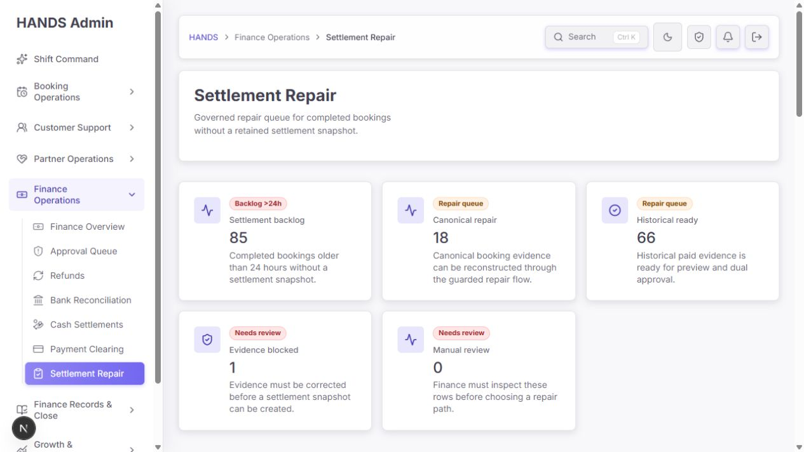

총 누락과 네 가지 복구 트랙을 첫 화면에서 볼 수 있는 것은 좋다. 다만 5개 카드가 두 줄을 차지하고, 같은 수치가 아래 필터 요약에서 다시 반복된다. 현재 운영자에게 가장 중요한 것은 `전체 85 / 지금 처리 가능 84 / 차단 1 / 최고 경과 79일`이다.

### Step 2 — 필터와 대상 목록: 보통

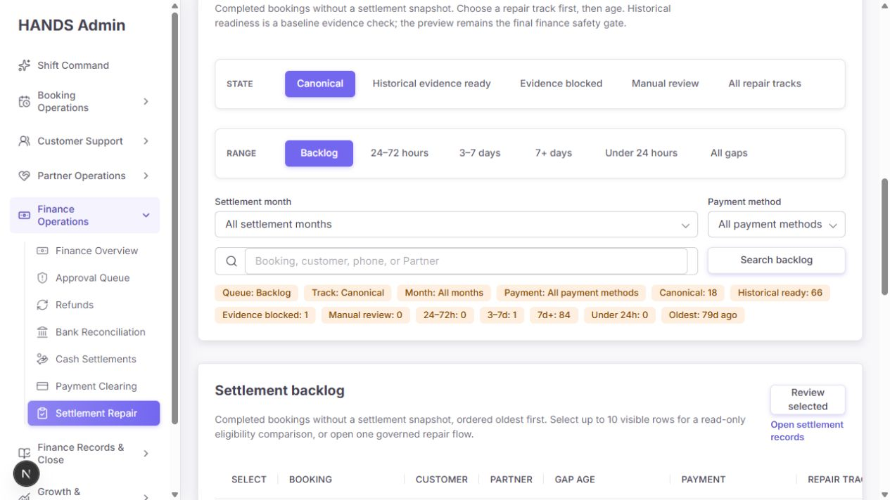

트랙과 나이를 먼저 고르게 한 구조는 합리적이다. 그러나 `State`는 상태가 아니라 복구 준비도/방식이고, `Range`는 날짜 범위가 아니라 누락 경과 시간이다. 하단의 13개 요약 pill은 상단 카드와 중복되며, 월·결제수단 필터를 걸어도 전역 summary 값이 섞인다.

### Step 3 — 표준 복구 미리보기: 좋음, 승인 근거 보강 필요

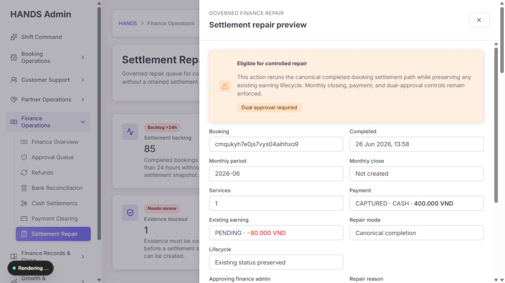

부킹, 완료일, 월 마감, 결제, 기존 earning, 복구 모드, lifecycle을 쓰기 전에 보여 주는 것은 좋다.

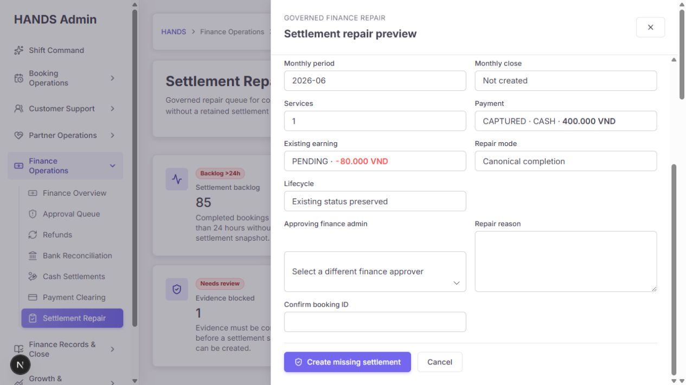

별도 승인자, 사유, 부킹 ID 확인은 좋은 안전장치다. 다만 적용 후 생성될 snapshot/journal/clearing과 변하지 않는 금액을 `Before → After`로 보여 주지 않고, 유효한 승인자 목록에서 현재 로그인 사용자나 비활성/테스트 운영자를 UI에서 제거하지 않는다.

### Step 4 — 과거 지급 증빙 복구: 정책 상태 불일치

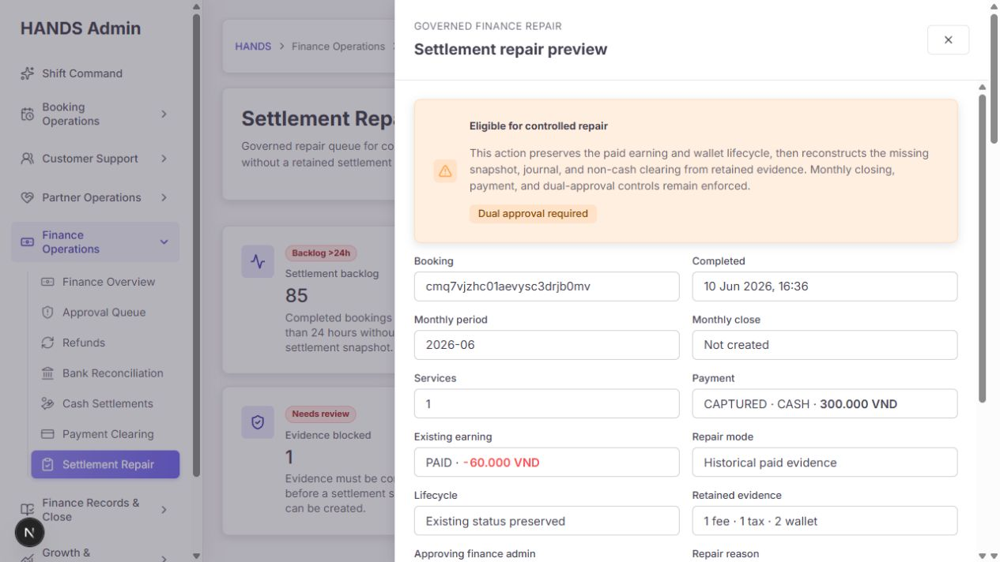

기존 PAID earning과 wallet lifecycle을 보존한다고 명시한 점은 좋다. 하지만 이 부킹이 속한 배치에는 지급 수수료 정책 검토가 필요함에도 이 drawer에는 그 경고가 없다.

### Step 5 — 차단 상태: 진단은 명확, 해결 경로 없음

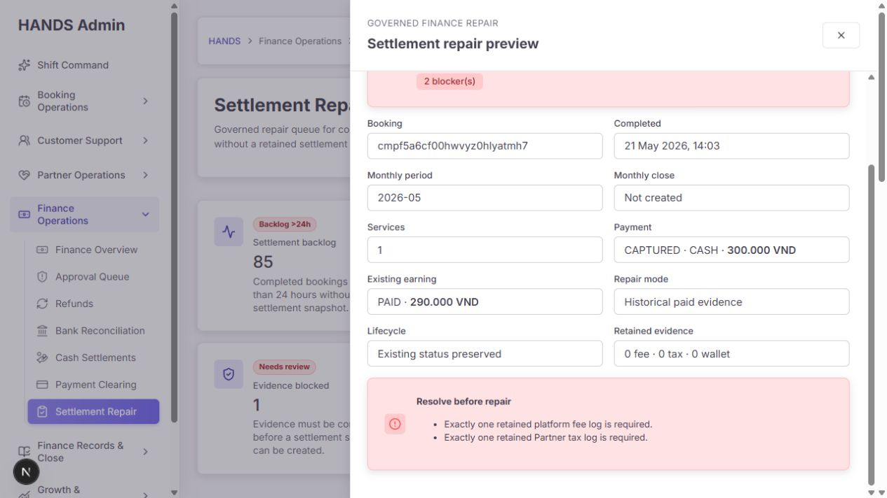

`platform fee log 1개`, `Partner tax log 1개`가 필요하다는 차단 이유는 명확하다. 그러나 무엇을 열어 누구에게 맡기고 어떤 증빙을 만든 뒤 다시 확인해야 하는지가 없다. 차단된 운영자는 drawer를 닫고 다른 페이지를 추측해야 한다.

### Step 6 — Operations closeout: 구조적 중복

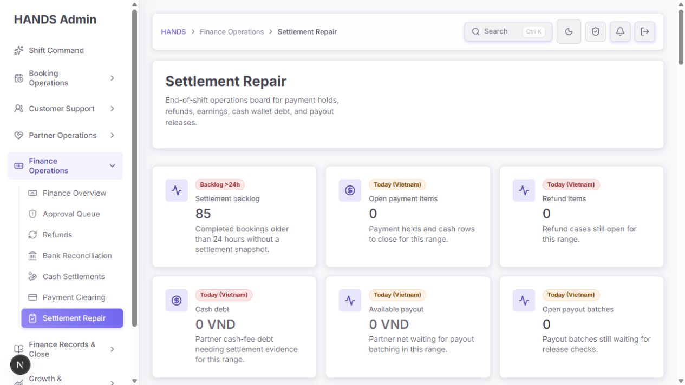

화면 제목은 여전히 `Settlement Repair`지만 내용은 교대 마감 보드다. 이는 breadcrumb, 검색 결과, 브라우저 히스토리, 교육 문서에서 실제 업무를 잘못 설명한다.

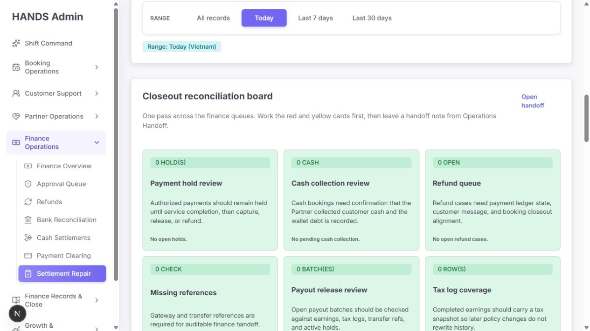

모든 카드가 0일 때도 큰 녹색 카드 6개를 모두 보여 준다.

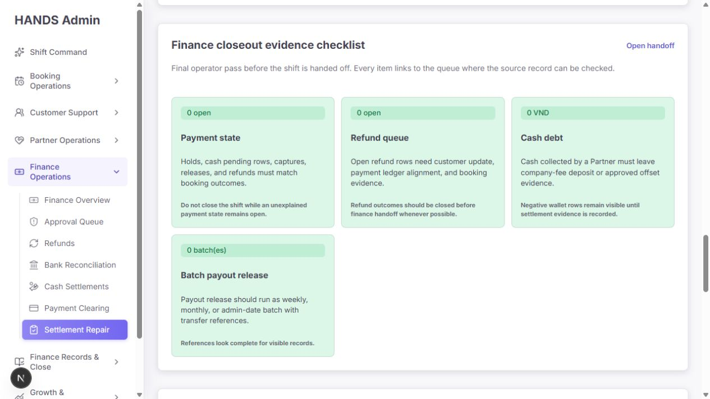

같은 payment/refund/cash/payout 상태를 다시 보여 준다.

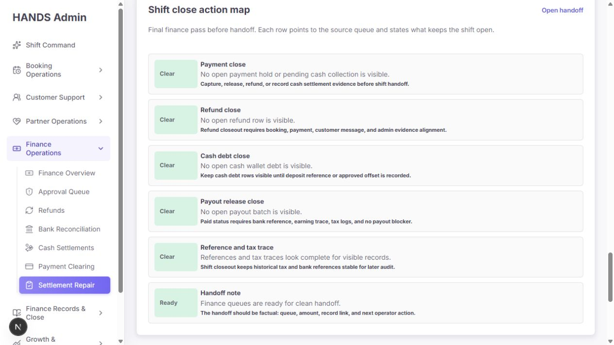

동일 상태를 세 번째로 `Clear` 형태로 반복한다. 이 페이지 뒤에는 `Payout release checks` 표도 있어 사실상 네 번째 반복이다. 정상 상태일수록 스크롤이 더 길어지는 역전이 발생한다.

### Step 7 — Batch evidence dry-run: 강한 기능, 약한 결정 게이트

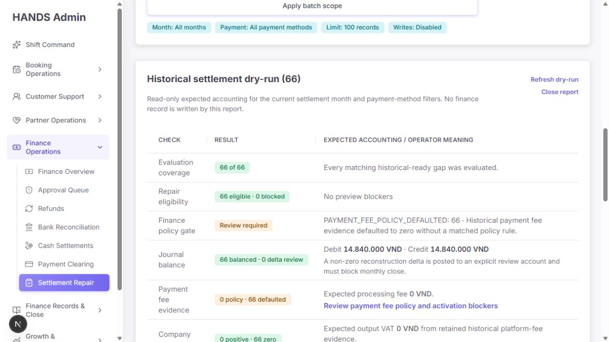

평가 범위, 수리 가능 여부, journal balance, 수수료 정책, VAT, 예상 자금 흐름을 한 번에 보여 주는 것은 이 페이지의 가장 좋은 부분이다. 그러나 내부 코드 `PAYMENT_FEE_POLICY_DEFAULTED`가 그대로 노출되고, `66 eligible`과 `Review required`가 동시에 보여 운영자가 어떤 판단을 우선해야 하는지 불명확하다.

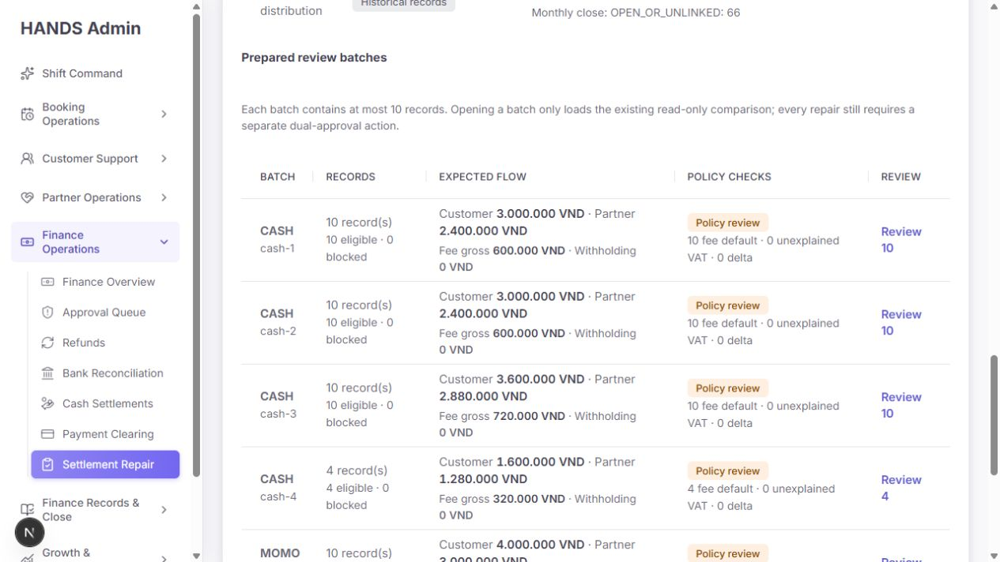

`cash-1`, `cash-2` 같은 기술 배치명보다 월·결제수단·금액·정책 예외를 중심으로 표현해야 한다.

### Step 8 — 10건 비교: 과밀하고 정책 경고가 사라짐

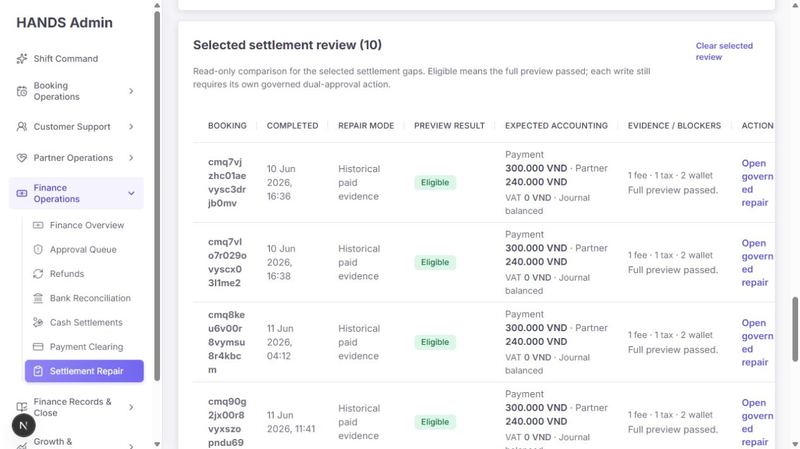

비교 화면은 raw booking ID 때문에 열 폭이 깨지고 고객·파트너 맥락이 없다. 더 중요한 문제는 batch에서 보인 payment-fee policy exception이 행 단위 비교에서는 사라지고 `Eligible / Full preview passed`만 남는다는 점이다.

## 4. 우선순위별 문제와 수정 요건

### P0 — 반드시 먼저 수정

#### P0-1. API 조회 실패가 정상 0건/완료 상태로 보인다

- 근거 코드:
  - `apps/admin_web/lib/admin-api.ts:5751-5786` — `adminGet`은 실패 상태를 버리고 fallback data만 반환한다.
  - `apps/admin_web/app/finance-closeout/page.tsx:84-180` — 모든 주요 조회에 `[]`, `null`, 0 summary fallback을 사용한다.
  - `apps/admin_web/lib/finance-closeout.ts:312-380` — 0을 `Clear`, 최종 `Ready`로 변환한다.
- 영향:
  - API 장애, 인증 만료, timeout, 5xx가 발생해도 운영자는 `No open holds`, `References look complete`, `Finance queues are ready`를 볼 수 있다.
  - 복구 큐도 장애 시 빈 큐처럼 보일 수 있다.
- 수정:
  1. 이 페이지에서는 `adminGetResult` 또는 오류를 보존하는 전용 loader를 사용한다.
  2. 필수 소스 하나라도 실패하면 `Data unavailable / do not close shift` 상태로 fail closed 한다.
  3. 실패한 source 이름, 마지막 성공 시각, 재시도 버튼을 보여 준다.
  4. 실패한 값으로 `Clear`, `Ready`, 0건을 계산하지 않는다.
  5. 부분 성공은 `5 of 7 sources loaded`처럼 명시하고 완료 액션을 잠근다.

### P1 — 운영 안전성과 결정 품질

#### P1-1. 정책 검토 필요 상태가 개별 복구에서 사라진다

- 근거 코드:
  - `apps/api/src/admin/admin.service.ts:38574-38619` — payment fee default를 `REVIEW_REQUIRED`로 분류한다.
  - `apps/admin_web/app/finance-closeout/finance-closeout-settlement-dry-run-section.tsx:82-135` — batch에는 경고를 표시한다.
  - `apps/admin_web/app/finance-closeout/finance-closeout-settlement-batch-preview-section.tsx:51-104` — 행 비교는 `preview.canRepair`만 보고 `Full preview passed`라고 표시한다.
  - `apps/admin_web/app/finance-closeout/finance-closeout-settlement-repair-drawer.tsx:78-173` — 개별 drawer에도 policy gate가 없다.
- 영향: 운영자가 66건 모두를 회계 정책 근거가 완전한 것으로 오인하고 개별 복구할 수 있다.
- 수정:
  1. preview API가 `technicalEligibility`와 `policyDecision`을 별도 필드로 반환한다.
  2. `Eligible` 대신 `Technically valid · Policy review required`처럼 두 상태를 동시에 표시한다.
  3. 정책 exception이 있으면 drawer에 동일한 경고와 정책 페이지 링크를 넣는다.
  4. 정책 검토 완료 전에는 복구 버튼을 막거나, 승인자가 exception code와 검토 근거를 명시적으로 승인하도록 한다.
  5. 그 승인 근거·정책 버전·exception code를 snapshot/audit metadata에 남긴다.

#### P1-2. Operations closeout이 정확하지 않은 범위와 표본으로 완료를 단정한다

- 근거 코드:
  - `apps/admin_web/app/finance-closeout/page.tsx:433-437` — payment hold만 all-time이라는 API 한계를 화면에서 인정한다.
  - `apps/admin_web/lib/finance-closeout.ts:70, 487-535` — detail source를 최대 10건만 읽는다.
  - `apps/admin_web/lib/finance-closeout.ts:143-179` — payout, missing reference, tax-log 수를 bounded list 길이로 계산한다.
- 영향: `Today` 카드 안에 all-time과 today가 섞이며, 10건 초과 queue는 정확한 총계가 아니다. 그런데 UI는 `Clear/Ready` 또는 정확한 총수처럼 표현한다.
- 수정:
  1. closeout 전용 aggregate endpoint 하나를 만들고 모든 gate를 동일한 Vietnam-time cut-off로 계산한다.
  2. 각 gate에 `count`, `amount`, `oldestAt`, `scope`, `sourceStatus`, `generatedAt`을 반환한다.
  3. 표본 배열의 길이로 총계를 계산하지 않는다.
  4. all-time 예외가 남는 동안은 Today 보드에서 분리하여 `All-time unresolved`로 명시한다.

#### P1-3. 하나의 화면이 세 가지 업무를 동일 위계로 섞는다

- 근거 코드:
  - `apps/admin_web/app/finance-closeout/page.tsx:347` — 모든 상태의 H1이 `Settlement Repair`다.
  - `apps/admin_web/app/finance-closeout/page.spec.tsx:57-70` — Operations view를 코드 스스로 `former ... compatibility view`라고 정의한다.
- 수정 방향:
  - `/finance-closeout`은 **Settlement Repair** 한 업무에 집중한다.
  - `Batch evidence`는 동일 도메인의 보조 기능이므로 `Batch diagnostics` secondary view로 유지한다.
  - `Operations closeout` equal tab은 제거하고, 유용한 단일 `Finance handoff gate`를 Finance Overview 또는 Operations Handoff에 통합한다.
  - 기존 `?view=operations`는 한동안 새 위치로 redirect하여 링크 호환성을 보존한다.
  - 당장 유지해야 한다면 H1/breadcrumb/loading title을 `Finance Closeout`으로 동적 변경하고 `Legacy compatibility`임을 명시한다.

#### P1-4. 정상 상태를 반복해서 보여 주어 실제 예외를 가린다

- 근거 코드: `page.tsx:674-690`에서 task board, payment/earning, cash debt, checklist, action map, payout checks를 모두 순서대로 렌더링한다.
- 수정:
  - 운영 마감에는 하나의 gate list만 둔다.
  - 기본값은 `Open/Blocked only`; 모두 정상일 때는 `6 checks clear` 한 줄과 펼치기만 보여 준다.
  - 행 구조는 `Gate / status / count & amount / oldest / owner / next action`으로 통일한다.
  - 인계 메모 CTA는 한 번만 제공한다.

#### P1-5. post-write 결과가 운영자에게 충분히 남지 않는다

- 근거 코드:
  - `apps/api/src/admin/admin.service.ts:14960-15045` — requested audit, finance mutation, checkpoint, final audit이 한 사용자 결과로 묶이지만 전체가 단일 원자적 결과는 아니다.
  - `apps/admin_web/app/finance-closeout/page.tsx:751-757` — redirect에는 booking ID/checkpoint만 남고 result의 snapshot/audit ID가 사라진다.
  - `page.tsx:361-375` — 성공/실패 notice는 raw checkpoint code만 보여 준다.
- 영향: mutation 후 final audit 또는 응답이 실패하면 운영자는 실제로 쓰기가 됐는지 확신하기 어렵다. 성공 후에도 생성된 snapshot/journal/clearing/audit로 바로 이동할 수 없다.
- 수정:
  1. repair request에 idempotency key를 요구한다.
  2. 가능한 finance writes와 success audit를 하나의 transaction/outbox 경계로 묶는다.
  3. 응답 불명확 시 booking ID로 authoritative repair status를 조회한다.
  4. 결과 화면에 snapshot ID, journal ID, clearing ID, checkpoint, audit ID, actor/approver, 시각을 표시하고 링크를 제공한다.
  5. `Do not retry`만 보여 주지 말고 `Open checkpoint`, `Open settlement record`, `Open audit trail`을 제공한다.

#### P1-6. modal 접근성: 포커스가 body에 남고 배경이 계속 탐색 가능하다

- 실제 확인: drawer 진입 직후 active element가 `BODY`였고, dialog 밖에 focus 가능한 요소가 112개 남아 있었다.
- 근거 코드:
  - `finance-closeout-settlement-repair-drawer.tsx:45-68` — SSR drawer와 backdrop만 렌더링한다.
  - `components/admin-surface.tsx:474-495` — `aria-modal`만 전달하고 focus 이동·trap·return을 처리하지 않는다.
- 기준: WCAG 2.1.1 Keyboard, 2.4.3 Focus Order, WAI-ARIA modal dialog pattern.
- 수정:
  1. 열릴 때 heading 또는 첫 입력으로 focus 이동.
  2. Tab/Shift+Tab을 drawer 내부에 가둔다.
  3. Escape로 닫고 원래 `Preview repair` 링크로 focus를 돌린다.
  4. 배경을 `inert` 처리한다.
  5. hidden input은 접근성 테스트의 tabbable 계산에서 제외하고 실제 interactive order를 자동 테스트한다.

#### P1-7. 차단 이유는 있으나 해결 업무가 없다

- 현재: `Exactly one retained platform fee log is required`, `Exactly one retained Partner tax log is required`만 표시.
- 수정:
  - blocker code별 `owner`, `source page`, `next action`, `recheck`를 매핑한다.
  - 예: `Retained platform-fee record missing` → `Open booking finance evidence`, `Open payment-fee policy`, `Assign Finance Tax owner`.
  - 해결 도구가 아직 없다면 `Create remediation case`를 만들어 blocker, booking, 월, owner, dueAt, audit link를 저장한다.

#### P1-8. dry-run과 10건 비교가 N+1 호출 구조다

- 근거 코드:
  - `apps/api/src/admin/admin.service.ts:14801-14819` — 최대 100건을 5개씩 preview 함수로 반복한다.
  - `apps/admin_web/app/finance-closeout/page.tsx:164-173` — 선택 10건을 10개 개별 API 요청으로 읽는다.
- 현재 로컬 측정(참고용): cold navigation 약 2.2~3.2초, warm navigation 기본 1.1초 / operations 1.0초 / dry-run 1.3초 / 10건 비교 1.6초.
- 수정:
  1. batch preview endpoint가 필요한 booking/payment/earning/closing/evidence를 묶어서 읽도록 한다.
  2. 10개 개별 HTTP 요청 대신 `POST /preview-batch` 또는 query batch endpoint를 사용한다.
  3. dry-run 결과는 filter + source version을 key로 짧게 캐시하고 generatedAt을 표시한다.
  4. 100건 실행은 progressive 결과/작업 job을 고려하되, 실제 결과가 2초 내면 단순 request-response를 유지한다.

#### P1-9. filter summary의 범위가 실제 필터와 일치하지 않는다

- 근거 코드:
  - `page.tsx:147`과 `lib/finance-closeout.ts:525` — summary는 filter 없이 전역 조회한다.
  - `page.tsx:566-583` — 같은 summary 안에 active month/payment와 전역 track/age count를 같이 보여 준다.
- 수정:
  - summary endpoint가 list와 동일한 `period/paymentMethod/q`를 받게 한다.
  - 또는 전역 값이면 `All backlog`로 명시하고 active-filter result와 별도 구역에 둔다.

### P2 — 다음 개선 패스

#### P2-1. 필터 용어와 빈 옵션

- `State` → `Repair readiness`
- `Range` → `Gap age`
- `Canonical` → `Standard reconstruction`
- `Historical evidence ready` → `Paid-record reconstruction`
- `Manual review 0`은 equal-weight tab으로 두지 말고 0일 때 muted/More 처리한다.
- 상단 카드와 필터 아래 중복 카운트 pill 중 하나만 남긴다.

#### P2-2. 목록이 부킹 ID 중심이라 판단 맥락이 부족하다

- raw ID는 8~10자 축약 + copy button, 전체 값은 accessible label/tooltip에 둔다.
- 서비스, 도시/지역, 완료 시각, 고객·파트너, 결제액, 경과/SLA, repair mode, blocker/next action, owner를 한 행에서 읽게 한다.
- sticky header와 sticky action column을 사용하고 1440+에서 주요 열이 한 화면에 들어오게 한다.
- `Review selected`는 선택 0건일 때 disabled, 선택 수를 `Compare selected (3)`으로 표시한다.

#### P2-3. 승인자 목록이 운영상 정제되지 않았다

- 현재 UI는 `FINANCE_APPROVER` role만 필터하며 로그인 actor를 제외하지 않는다.
- API는 self approval을 막지만 UI에서 실패 가능한 선택지를 보여 주는 것은 불필요하다.
- eligible directory에서 actor, disabled operator, category 미보유, test/smoke identity를 제외하고 이름·업무 그룹을 우선 표시한다. raw ID는 보조 정보로 내린다.

#### P2-4. 사유 입력 계약이 UI와 API에서 다르다

- Admin Web은 8자 이상을 요구하지만 API DTO는 non-empty만 검증한다.
- API에도 최소 길이와 공백/반복 문자 검증을 두고, `원인 / 확인한 증빙 / 기대 결과 / 티켓 번호` 구조를 권장한다.

#### P2-5. 내부 코드와 개발자 문구가 노출된다

| 현재 | 제안 |
|---|---|
| `PAYMENT_FEE_POLICY_DEFAULTED: 66` | `66 records have no matched payment-fee policy. Expected fee is currently 0 VND; review before approval.` |
| `Historical settlement dry-run` | `Batch safety check (read-only)` |
| `Run read-only dry-run` | `Run safety check` |
| `Open governed repair` | `Review & repair` |
| `Completed / snapshot missing` | `Settlement snapshot missing` |
| `Writes: Disabled` | `Read-only — no records will be changed` |

#### P2-6. 갱신 시각·데이터 신선도가 보이지 않는다

- API가 가진 `generatedAt`을 상단에 표시한다.
- `Last refreshed 14:03 ICT`, `Refresh`를 제공한다.
- repair drawer를 연 뒤 데이터가 바뀌면 stale preview를 거절하고 새 preview를 요구한다.

## 5. 권장 최종 화면 구조

### A. Settlement Repair 기본 화면

1. 헤더: `Settlement Repair`, 짧은 설명, last refreshed, audit trail.
2. 요약 strip: `Backlog 85`, `Actionable 84`, `Blocked 1`, `Oldest 79d`.
3. queue tabs: `Actionable`, `Blocked`, `Manual review`; 내부 repair mode는 열/필터로 유지.
4. 필터: gap age, month, payment method, search, owner.
5. 표: priority, booking context, amount/method, gap age, repair mode, policy/blocker, owner, next action.
6. drawer: Summary → Before/After → Evidence → Policy gate → Approval.
7. 결과: created evidence와 audit 링크를 남기는 persistent result panel.

### B. Batch diagnostics

- Repair 화면의 secondary tab/버튼으로 유지.
- 실행 전 선택 scope, 최대 건수, read-only를 명시.
- 결과 상단에 하나의 결정 banner:
  - `Ready for individual approval`
  - 또는 `Policy review required — individual repair is paused`
- batch 표는 기술 batch key가 아니라 `June 2026 · Cash · 10 records`로 표현.
- 비교 행에도 batch policy exception을 그대로 전달.

### C. Operations closeout

- 이 페이지에서 제거하고 Finance Overview 또는 Operations Handoff의 단일 `Finance handoff gate`로 통합.
- open/blocked만 기본 표시하고 clear 항목은 접는다.
- 실제 close/handoff 상태, owner, acknowledgement가 있는 하나의 워크플로로 만든다.
- 기존 호환 URL은 redirect하고 audit/history 링크는 보존한다.

## 6. 기술 품질 점수

요청에 따라 반응형 항목은 평가하지 않았다.

| 차원 | 점수 | 핵심 판단 |
|---|---:|---|
| 접근성 | 2/4 | 의미 구조는 괜찮지만 modal focus 이동/trap/return이 없음 |
| 성능 | 2/4 | 기본은 병렬이나 dry-run N+1, 10개 preview HTTP 호출, 다중 live source가 남음 |
| 테마 | 3/4 | 공용 token과 component를 잘 사용; 이번 감사에서는 dark 상태를 별도 검증하지 않음 |
| 구현 무결성 | 1/4 | API 실패의 false-clear와 policy gate 불일치가 재무 판단을 훼손 |
| 합계 | **8/16** | 시각적 기반은 좋지만 운영 안전성 보완이 필요 |

별도 운영 UX 평가는 **6/10**이다. 기능 범위와 복구 안전장치는 강하지만, 정보 구조·정확한 범위·예외 해결·결과 증빙이 아직 최종 운영 도구 수준에 못 미친다.

## 7. 잘된 부분

- default route가 실제 repair queue로 바로 진입한다.
- 85건을 repair track과 age로 분해할 수 있다.
- oldest-first, 10건 pagination, 검색·월·결제수단 필터가 있다.
- individual preview가 write 전에 결제/earning/monthly close/evidence를 보여 준다.
- 별도 Finance Approver, 사유, 부킹 ID 확인을 요구한다.
- blocked preview는 mutation control을 노출하지 않는다.
- historical reconstruction이 기존 PAID earning/wallet lifecycle을 보존함을 설명한다.
- dry-run은 write 없이 production calculator/journal 결과를 비교한다.
- journal balance, reconstruction delta, VAT, payment fee, expected money flow를 계산한다.
- post-repair checkpoint와 audit event를 코드에 보유한다.
- 디자인 token/component 사용은 일관되고 Impeccable deterministic detector는 0건이었다.

## 8. 필수 테스트 추가

1. 모든 필수 API 실패 시 0/Clear/Ready가 절대 렌더링되지 않는 테스트.
2. 한 source만 실패한 partial data 상태와 완료 gate 잠금 테스트.
3. filtered summary가 list와 동일한 period/payment/q 범위를 쓰는 테스트.
4. 10건을 넘는 payout/missing-ref/tax queue 총계 정확성 테스트.
5. policy `REVIEW_REQUIRED`가 batch → selected comparison → drawer → submit까지 유지되는 테스트.
6. exception 승인 근거와 policy version이 audit metadata에 저장되는 테스트.
7. self approver가 UI에서 제외되고 API에서도 거절되는 테스트.
8. API reason 최소 길이/공백만 입력 거절 테스트.
9. modal open focus, Tab loop, Shift+Tab, Escape, return focus 테스트.
10. idempotency key 재전송, concurrent repair, post-write response loss 테스트.
11. checkpoint-failed 후 snapshot/audit 링크가 노출되는 테스트.
12. 100건 dry-run 및 10건 comparison의 query/latency budget 테스트.

현재 관련 테스트 결과:

- Admin Web finance-closeout 관련 8개 파일: **45 passed**
- API settlement gap/repair 관련 선택 테스트: **7 passed, 726 skipped**
- Impeccable deterministic detector: **0 findings**

테스트가 통과해도 위 문제는 남는다. 현재 테스트는 구현된 동작을 잘 고정하지만, `fallback → false green`, modal focus, policy exception의 end-to-end 전달, critical drawer/backlog/dry-run 컴포넌트의 상호작용을 충분히 검증하지 않는다.

## 9. 구현 순서

1. **P0**: API source health를 보존하고 false-clear를 금지.
2. **P1**: policy gate를 개별 preview/action에 전달하고 승인 근거 저장.
3. **P1**: exact closeout aggregate endpoint와 동일한 Vietnam-time scope 도입.
4. **P1**: Operations compatibility view 제거/통합, 중복 보드 하나로 축소.
5. **P1**: modal focus, result evidence, idempotency/ambiguous result 처리.
6. **P1**: blocker별 remediation CTA와 owner/recheck 도입.
7. **P2**: 필터 용어, 표 밀도, 승인자 목록, copy 정리.
8. **P2**: batch preview API와 dry-run query 최적화.
9. 전체 테스트와 실제 1440+ 운영 데이터로 재감사.

## 10. 증거 한계

- 로그인된 로컬 환경의 현재 데이터로 확인했다. 실제 금융 write는 안전상 실행하지 않았다.
- 브라우저 캡처 surface는 1280×720이었지만 1024 이하/모바일 문제는 보고서에 포함하지 않았다. 1440+ 구조 판단은 화면 캡처와 desktop component/CSS를 함께 대조했다.
- 스크린샷만으로 WCAG 준수를 선언하지 않았으며, focus 상태는 실제 DOM과 코드로 추가 확인했다.
- 로컬 navigation 시간은 개발/로컬 네트워크 영향을 포함하므로 절대 성능 SLA가 아니라 구조적 비교 근거로만 사용했다.

