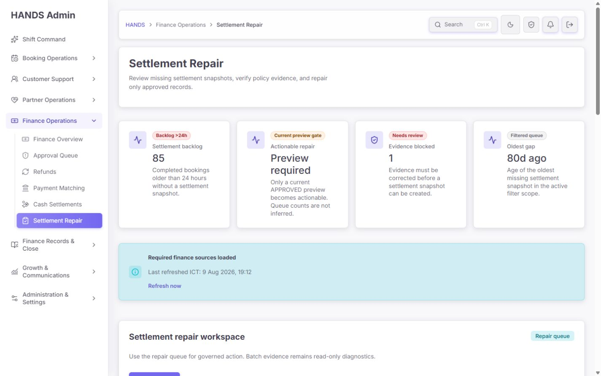
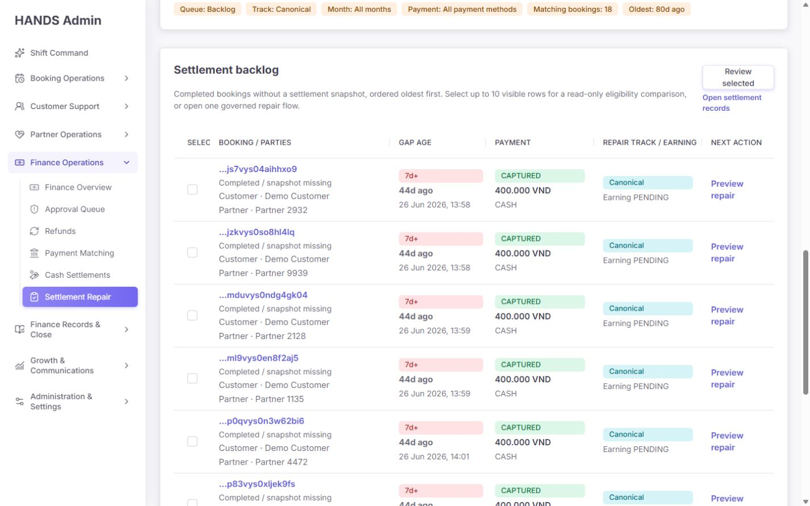
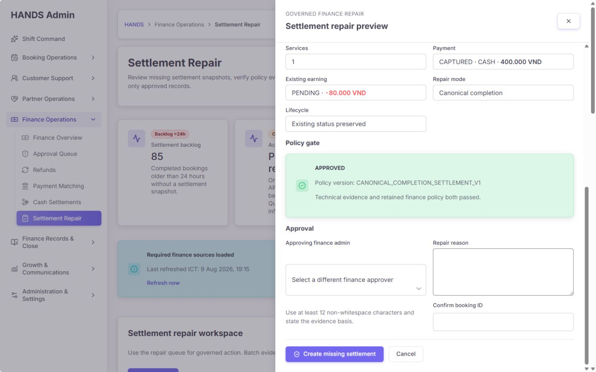
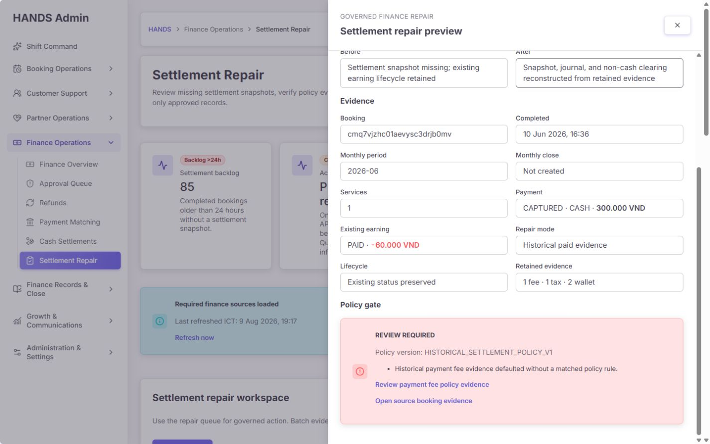
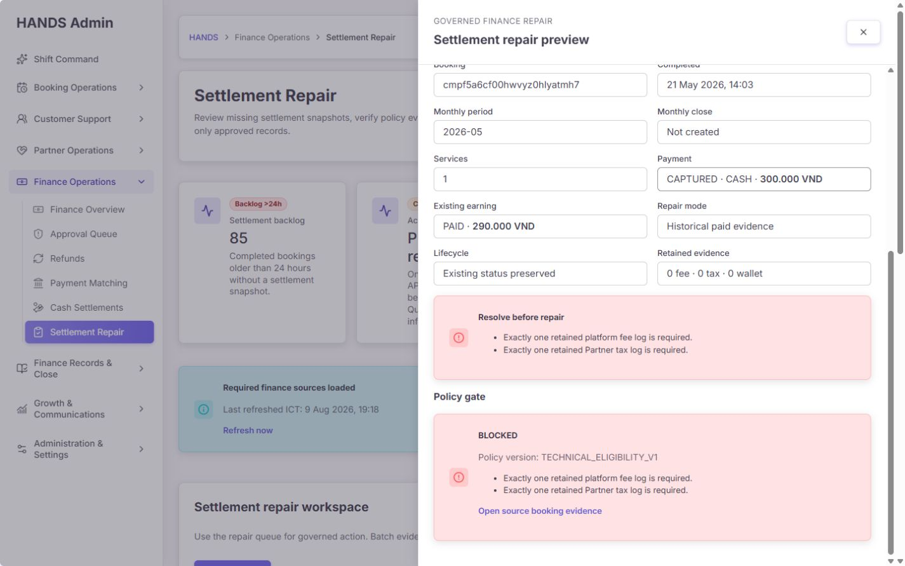
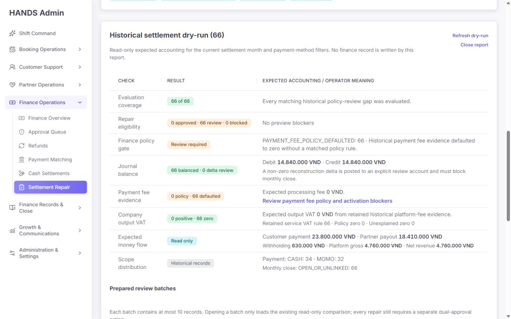
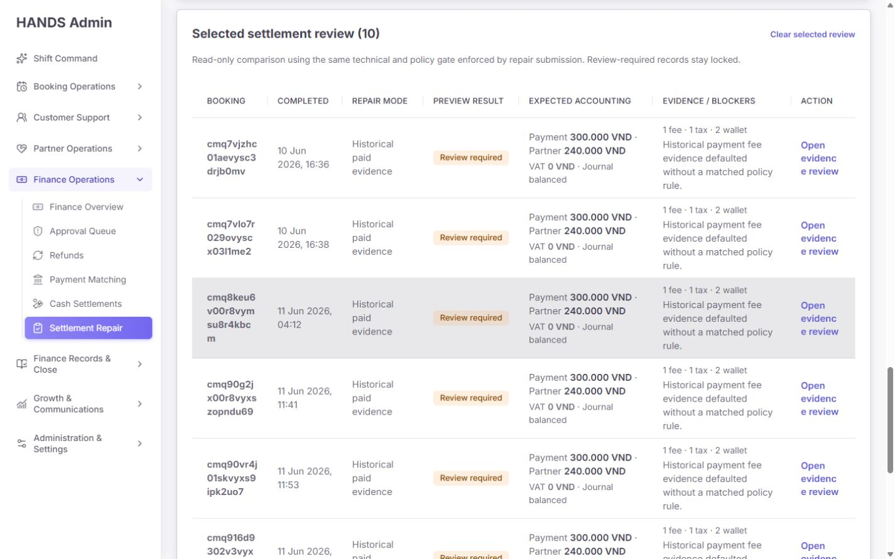
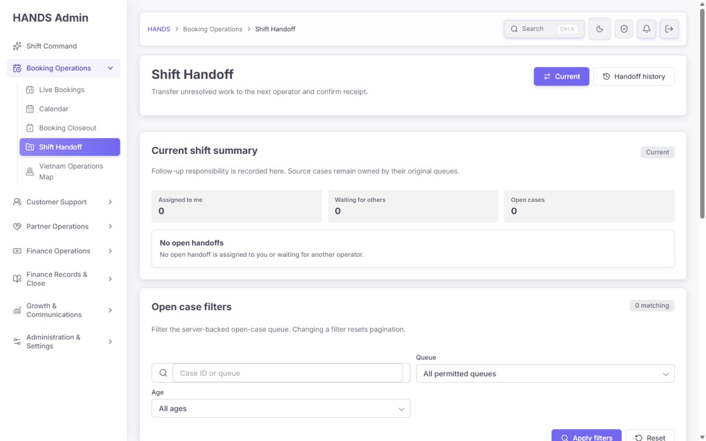
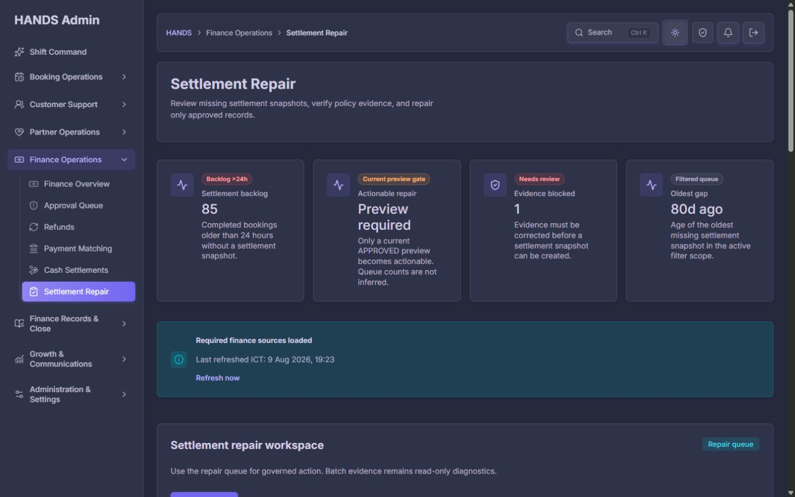

# Finance Closeout / Settlement Repair 개선 후 심층 재감사 보고서

- 감사일: 2026-08-09
- 대상: `http://localhost:3101/finance-closeout`
- 포함 상태: 기본 Repair queue, Canonical, Historical policy review, Evidence blocked, 개별 preview drawer, Batch evidence, read-only dry-run, 10건 비교, legacy `?view=operations` 이관 경로, light/dark theme
- 화면 기준: **1440×900 이상 데스크톱만 평가**
- 제외: 요청에 따라 1024px 이하, 모바일, 태블릿 관련 문제는 평가·점수·개선 목록에 포함하지 않음
- 안전 범위: 조회, 필터, drawer, 키보드 이동, read-only dry-run만 실행했으며 실제 정산 복구 write는 실행하지 않음

## 1. 최종 판단

이번 개선은 이전 감사의 핵심 안전 문제를 상당히 정확하게 해결했다. 특히 다음은 명백한 개선이다.

- 필수 API 중 하나라도 실패하면 빈 큐나 `0 / Clear / Ready`로 위장하지 않는 fail-closed 처리
- Historical paid-evidence 레코드의 `REVIEW_REQUIRED` 정책 판정을 batch → 비교 → drawer → submit gate까지 유지
- `APPROVED`인 경우에만 mutation 입력을 노출하고, 다른 finance approver·사유·booking ID confirmation을 요구
- preview 이후 source version이 바뀌면 서버가 제출을 거부
- drawer focus 이동, Tab/Shift+Tab loop, Escape close, trigger focus return, 배경 inert 처리
- 복구 결과에 booking, snapshot, earning, audit log, actor/approver, checkpoint를 연결하는 증거 링크
- 클라이언트의 10개 개별 preview HTTP 요청을 하나의 batch endpoint로 통합
- 오래된 Operations closeout 보드를 Settlement Repair 화면에서 제거하여 중복 카드를 크게 줄임

하지만 **현재 상태는 조건부 승인**이다. `Settlement Repair` 자체의 안전 게이트는 좋아졌지만, 운영자가 다음 업무로 이동하는 연결과 현재 필터가 뜻하는 숫자의 정확성에 두 가지 큰 문제가 남았다.

1. `Open Shift Handoff finance review`와 legacy `?view=operations` redirect가 실제로 존재하지 않는 handoff section/anchor로 이동한다. 결과는 Shift Handoff 페이지 최상단이며 finance review를 찾을 수 없다.
2. 화면이 `Oldest gap · Filtered queue`라고 설명하지만 summary API는 `track`과 `age`를 받지 않는다. 예를 들어 Canonical backlog 18건을 보고 있어도 oldest와 evidence-blocked KPI는 전체 85건 범위에서 계산된다.

따라서 **정산 write 안전성은 이전보다 높은 수준**, **운영 workflow 완결성과 표시 수치의 신뢰성은 아직 release gate를 통과하지 못한 수준**으로 판단한다.

## 2. 감사 점수

| # | 평가 영역 | 점수 | 핵심 판단 |
|---:|---|---:|---|
| 1 | 접근성 | 3/4 | drawer keyboard/focus는 좋아졌으나 빈 document title과 중복 close accessible name이 남음 |
| 2 | 성능 | 2/4 | browser-level batch 호출은 개선됐지만 서버는 최대 100건을 record별 preview로 반복 조회 |
| 3 | 1440+ 데스크톱 적합성 | 3/4 | 기본 queue는 안정적이나 10건 비교표가 booking ID와 action wrapping으로 과밀 |
| 4 | 테마 | 3/4 | dark mode 구조와 surface는 일관됨; muted text 대비는 수치 검증이 더 필요 |
| 5 | 구현 무결성 | 2/4 | 정책·승인 계약은 강하지만 dead handoff destination과 summary scope 불일치가 운영 신뢰를 훼손 |
| **합계** |  | **13/20** | **Acceptable — 중요한 운영 결함 수정 후 승인 권장** |

`impeccable` 정적 detector는 관련 UI 파일 7개에서 **0건**을 반환했다. 이는 하드코딩·대표 anti-pattern을 찾지 못했다는 뜻이며, live workflow의 dead anchor나 데이터 scope 의미 오류까지 안전하다는 뜻은 아니다.

## 3. 현재 데이터에서 확인한 운영 상태

| 항목 | 확인값 |
|---|---:|
| 전체 24시간 초과 backlog | 85 |
| Canonical queue | 18 |
| Historical policy review | 66 |
| Evidence blocked | 1 |
| Manual review | 0 |
| 가장 오래된 gap | 약 80일 |
| Historical dry-run | 66/66 평가 |
| 정책 승인 | 0 |
| 정책 검토 필요 | 66 |
| 기술 blocker | 0 |
| Journal balance | 66 balanced / 0 delta |
| Payment-fee policy default | 66 |

중요한 해석은 `66 balanced`가 `66 approved`를 뜻하지 않는다는 점이다. 현재 UI는 이 차이를 이전보다 잘 보존하며, 66건을 모두 `Policy review required`로 잠근다. 이 부분은 통과다.

## 4. 화면 흐름별 재검수

### Step 1 — 기본 Repair queue: 주의 필요



좋아진 점:

- H1과 설명이 실제 업무인 `Settlement Repair`에 집중한다.
- 상단에 `Required finance sources loaded`, refresh 시각, refresh action이 있어 데이터 신선도를 판단할 수 있다.
- `Repair queue / Batch evidence`의 업무 경계가 명확하다.
- 1440px에서 페이지 전체 horizontal overflow가 없고 본문 위계도 안정적이다.

남은 문제:

- 기본 Canonical backlog 결과는 18건인데 `Settlement backlog 85`, `Evidence blocked 1`, `Oldest 80d`가 함께 표시된다. 전역 KPI라면 `All tracks`라고 명시해야 하고, active filter KPI라면 API가 동일 filter를 적용해야 한다.
- `Actionable repair`가 실제 건수 대신 `Preview required`라서 4개 KPI 중 유일하게 값의 단위가 다르다. 안전 의도는 좋지만 KPI가 아니라 process rule 또는 banner가 더 적합하다.
- `State`는 상태가 아니라 repair track, `Range`는 날짜가 아니라 gap age다.
- 기본값까지 `Queue / Track / Month / Payment / Matching / Oldest` 여섯 pill로 반복해 상단 KPI와 정보가 중복된다.

### Step 2 — Queue 표: 기본 스캔은 개선, 운영 맥락은 부족



좋아진 점:

- 고객, 파트너, payment, amount, gap age, repair track, earning을 한 행에서 볼 수 있다.
- 1440px에서 표 자체가 horizontal overflow 없이 표시된다.
- 개별 `Preview`가 mutation이 아닌 검토 drawer를 먼저 연다.

남은 문제:

- service/location, owner, 현재 blocker 또는 다음 행동이 없다. ID와 이름만으로 우선순위를 판단해야 한다.
- booking ID가 주 정보처럼 보이지만 복사 affordance나 짧은 표시가 없다.
- `Review selected`가 선택 0건에서도 활성화되어 보이고 선택 수가 없다. 운영자는 눌러 보기 전까지 동작 조건을 알 수 없다.
- batch comparison의 목적이라면 `Compare selected (n)`가 더 정확하고, n=0일 때 disabled + helper가 필요하다.

### Step 3 — Canonical preview와 approval: 통과, 소규모 보완



통과 항목:

- `Summary → Before and after → Evidence → Policy gate → Approval` 순서가 합리적이다.
- 승인 상태, policy version, payment, earning, monthly close, lifecycle을 제출 전에 확인할 수 있다.
- 다른 approver, 12자 이상의 사유, booking ID 재입력을 요구한다.
- API도 actor와 approver가 같으면 거부하고, 제출 시 최신 preview 및 source version을 다시 확인한다.
- Tab/Shift+Tab 순환, Escape, focus return, background inert가 실제 브라우저에서 정상 작동했다.

보완 항목:

- approver option은 사람 이름 뒤에 긴 raw ID를 그대로 붙인다. 업무 그룹/상태를 우선하고 ID는 보조 정보나 tooltip로 낮추는 편이 빠르다.
- backdrop button과 header close icon이 모두 `Close settlement repair preview`라는 동일 accessible name을 가진다. backdrop은 screen reader/tab 순서에서 제거하고 pointer-dismiss 영역으로만 쓰거나 modal 내부 하나의 명시적 close control만 노출해야 한다.
- Canonical path는 최종 audit에는 actor/approver가 남지만 snapshot 생성 호출에는 historical path처럼 approval context가 직접 전달되지 않는다. 도메인상 snapshot metadata에도 승인 provenance가 필요한지 결정하고 두 경로의 evidence contract를 통일하는 것이 안전하다.

### Step 4 — Historical policy review: 통과



이전 감사의 가장 위험한 불일치는 해결됐다.

- drawer가 `Policy review required — repair locked`라고 표시한다.
- `REVIEW REQUIRED`가 개별 row와 drawer에서 사라지지 않는다.
- approval form과 repair CTA를 노출하지 않는다.
- policy reason과 payment-fee policy evidence 링크를 제공한다.
- server submit도 `policyDecision !== APPROVED`를 거부한다.

현재 66건은 계산상 balanced지만 payment-fee rule이 defaulted 되었으므로 approval 0, review 66이 맞다. 기술적 정합성과 정책 승인 가능성을 분리한 점은 운영 안전 측면에서 높은 완성도다.

### Step 5 — Evidence blocked: 진단은 통과, 해결 workflow는 미완료



좋아진 점:

- `Repair blocked`, retained evidence count, 구체적 blocker를 보여 준다.
- approval control은 숨겨져 있다.
- source booking evidence로 이동할 수 있다.

남은 문제:

- 동일 blocker 문장이 `Resolve before repair`와 `Policy gate`에 반복된다.
- 누가 해결할지 owner/assignee가 없다.
- platform fee, Partner tax, wallet evidence 중 어느 페이지에서 무엇을 생성·보정해야 하는지 direct link가 없다.
- 수정 후 `Recheck evidence` 또는 refresh action이 없다.
- remediation case/task ID, due time, audit trail 연결이 없다.

운영자는 “왜 못 하는지”는 알지만 “지금 누구에게 무엇을 시켜야 하는지”는 알 수 없다. 차단 큐는 진단 화면이 아니라 remediation workbench가 되어야 한다.

### Step 6 — Batch evidence와 dry-run: 기능은 강함, 문구와 해석은 과밀



좋아진 점:

- read-only임을 반복해 알리고 finance write를 만들지 않는다.
- 100건 제한, 평가 coverage, policy gate, journal balance, payment fee, VAT, money flow를 한 화면에서 확인할 수 있다.
- prepared batch는 최대 10건으로 제한한다.
- browser에서 66건 dry-run은 warm local 기준 약 0.75초, 선택 10건 비교는 약 0.81초에 로드됐다. 이는 개발 환경 참고값이며 production SLA로 해석하면 안 된다.

남은 문제:

- `Historical settlement dry-run`, `Run read-only dry-run`, `Writes: Disabled`는 개발·회계 시스템 용어다. 운영 행동 중심의 `Batch safety check (read-only)`, `Run safety check`, `Read-only — no records will be changed`가 더 명확하다.
- `Repair eligibility: 0 approved · 66 review · 0 blocked`의 operator meaning이 `No preview blockers`라서 기술 blocker와 policy blocker의 차이를 다시 해석해야 한다.
- `PAYMENT_FEE_POLICY_DEFAULTED: 66`, `OPEN_OR_UNLINKED: 66` 같은 machine code가 그대로 노출된다. 코드는 audit detail에 보관하고 본문에는 원인·영향·다음 행동을 문장으로 제공해야 한다.
- `Manual review 0`이 active issue KPI와 같은 크기로 표시된다. 0인 정상 상태는 secondary summary나 disclosure로 내려도 된다.

### Step 7 — 선택 10건 비교: 1440px 운영성 보완 필요



정책 판정은 올바르게 유지된다. 그러나 1440px에서 표의 실제 사용성은 미흡하다.

- 전체 booking ID가 3~4줄로 잘린다.
- 마지막 action이 `Open / evidence / review`처럼 단어별로 줄바꿈된다.
- completed, mode, amount, policy, evidence를 모두 같은 표에 넣어 행 높이가 과도하게 커진다.
- 고객/파트너 맥락은 없고 raw ID가 가장 많은 폭을 차지한다.

권장 구조:

1. ID는 앞 8~10자 + copy button, 전체 값은 accessible label/tooltip.
2. `Record` 열에 booking ID, 완료일, customer/partner를 2~3줄로 묶는다.
3. `Expected accounting`은 핵심 금액 + `View details` disclosure로 축약한다.
4. action column은 최소 폭과 `white-space: nowrap`을 보장하고 `Review evidence`처럼 짧게 쓴다.
5. 비교 목적이면 7열보다 `Record / Policy / Accounting / Evidence / Action` 5열이 적합하다.

### Step 8 — Legacy Operations closeout 이관: 실패



`/finance-closeout?view=operations`는 `/operations-handoff?details=all&range=today#operations-handoff-finance-review`로 redirect된다. URL hash는 생기지만 실제 DOM에는 `operations-handoff-finance-review` ID가 없고 finance review 텍스트도 없으며 scrollY는 0이었다.

코드상 `operations-handoff-finance-action-section.tsx`에는 같은 ID를 가진 section이 남아 있지만 현재 `operations-handoff/page.tsx`는 이 component를 import하거나 render하지 않는다. 즉 **기능이 구현된 것이 아니라 orphan component와 redirect test만 남은 상태**다.

현재 test는 redirect 문자열만 검증하고 destination page에 section이 실제 render되는지 검증하지 않는다. 이 상태에서 사용자에게는 “Finance review로 이동”한다고 약속하지만 generic Shift Handoff top으로 보낸다.

### Step 9 — Dark mode: 시각적 통과



1440px에서 card, filter, header, status surface가 무너지지 않고 light mode와 구조가 일치했다. 일부 muted purple/gray text는 대비 수치 측정이 더 필요하지만, 이번 감사에서는 명백한 broken surface를 발견하지 못했다. 전체 WCAG 적합을 주장하지는 않는다.

## 5. 우선순위별 남은 문제와 수정 요건

### P1-1. Finance Handoff destination이 실제 화면에 없다

- 위치:
  - `apps/admin_web/lib/finance-closeout.ts:578-579`
  - `apps/admin_web/app/finance-closeout/page.tsx:423-425`
  - `apps/admin_web/app/operations-handoff/operations-handoff-finance-action-section.tsx:13-94`
  - `apps/admin_web/app/operations-handoff/page.tsx:1-133`
- 영향: settlement repair에서 handoff로 이어지는 운영 흐름이 끊기고 legacy bookmark도 잘못된 위치에 도착한다.
- 수정:
  1. finance handoff가 현재 제품에서 정말 필요한지 결정한다.
  2. 필요하면 `OperationsHandoffFinanceActionSection`을 실제 current handoff page에 server-backed aggregate data와 함께 render한다.
  3. 불필요하면 dead link/anchor/orphan component를 제거하고 `Finance Overview` 또는 정확한 finance queue로 redirect한다.
  4. destination page integration test에서 해당 ID, heading, finance rows, focus/scroll target까지 검증한다.
- 완료 조건: redirect 후 `#operations-handoff-finance-review`가 실제 element를 가리키고 finance 작업/clear state가 보인다.

### P1-2. KPI와 filter summary가 active queue scope와 불일치한다

- 위치:
  - `apps/admin_web/lib/finance-closeout.ts:500-531`
  - `apps/admin_web/app/finance-closeout/page.tsx:231-263, 514-526`
  - `apps/api/src/admin/admin.service.ts:14941-15023`
- 원인: list query는 `age`, `track`, `q`, `period`, `paymentMethod`를 사용하지만 summary query와 service scope는 `q`, `period`, `paymentMethod`만 사용한다.
- 영향: `Matching bookings: 18` 옆 `Oldest: 80d`가 같은 scope처럼 보이지만 서로 다른 모집단이다. 운영자는 canonical backlog의 SLA로 오해할 수 있다.
- 수정 방향은 둘 중 하나로 명확히 선택한다.
  1. **Active-scope summary:** summary endpoint가 `age`와 `track`을 받아 list와 완전히 동일한 where를 사용한다.
  2. **Global overview:** 전역 KPI를 유지하되 `All repair tracks / All ages`를 label과 helper에 명시하고 active filter summary에서는 list-derived count/oldest만 보여 준다.
- 완료 조건: 화면에 함께 묶인 count와 oldest가 반드시 동일 query scope를 사용한다.

### P1-3. 빈 browser document title

- 실제 확인: `/finance-closeout`의 `document.title`이 빈 문자열이었다.
- 위치: `apps/admin_web/app/finance-closeout/page.tsx`에 route metadata 없음.
- 영향: browser tab, history, screen reader page identification, 여러 admin tab 전환에서 페이지를 구별하기 어렵다.
- 기준: WCAG 2.4.2 Page Titled.
- 수정: `export const metadata = { title: 'Settlement Repair · HANDS Admin' }` 또는 프로젝트의 기존 metadata helper를 사용한다.
- 완료 조건: queue, batch, drawer 상태에서도 기본 route title이 비지 않고 일관된다.

### P1-4. Evidence blocked가 해결 가능한 운영 task가 아니다

- 위치: `finance-closeout-settlement-repair-drawer.tsx:218-262`
- 수정:
  - blocker code별 `Owner / Missing evidence / Open source / Next action / Recheck`를 정의한다.
  - 정확한 기존 finance evidence 페이지로 deep link한다.
  - 직접 해결 도구가 없으면 현재 case/task 도메인을 재사용해 remediation case를 만들고 assignee·dueAt·audit ID를 보존한다.
  - blocker 이유는 한 번만 보여 주고 policy section에는 판정 요약만 둔다.
- 완료 조건: 차단 drawer에서 운영자가 다른 메뉴를 추측하지 않고 해결 담당과 다음 행동을 정할 수 있다.

### P2-1. Batch endpoint 내부의 record별 preview 반복 조회

- 위치:
  - `apps/api/src/admin/admin.service.ts:15026-15080`
  - `apps/api/src/admin/admin.service.ts:15210-15227`
  - `apps/api/src/admin/admin.service.ts:15083` 이후 preview 구현
- 현재 개선: Admin Web의 10개 개별 HTTP 요청은 단일 batch endpoint로 교체됐다.
- 남은 문제: 서버 batch는 `Promise.all(ids.map(preview))`, dry-run은 최대 100건을 concurrency chunk로 나눠 같은 preview를 record별 호출한다. 각 preview는 booking, monthly close, historical reconstruction evidence를 다시 읽는다.
- 영향: local 66건은 빠르지만 production DB latency와 100건 scope에서는 query fan-out이 커질 수 있다.
- 수정:
  - 대상 bookings/payment/earning/evidence를 bulk select한다.
  - 필요한 monthly periods를 dedupe하여 closing 상태를 한 번에 읽는다.
  - 정책 계산은 in-memory mapping으로 수행한다.
  - 변경 전후 SQL/query count, p50/p95, 100건 elapsed를 동일 데이터로 측정한다.
- 주의: 현재 측정이 빠르므로 job queue나 신규 infrastructure를 먼저 도입하지 말고 bulk-read부터 적용한다.

### P2-2. 10건 비교표가 1440px에서 과밀하다

- 위치: `finance-closeout-settlement-batch-preview-section.tsx:20-120`
- 수정: 7열을 5열 안팎으로 재구성하고 ID 축약/copy, action nowrap, evidence disclosure를 적용한다.
- 완료 조건: 1440px에서 booking ID와 primary action이 단어 단위로 깨지지 않고 한 행의 핵심 판단을 2~3초 안에 스캔할 수 있다.

### P2-3. 선택 전에도 `Review selected`가 활성화되어 보인다

- 위치: `finance-closeout-settlement-backlog-section.tsx:52-69`
- 수정:
  - 선택 0: `Compare selected` disabled + `Select up to 10 records` helper.
  - 선택 후: `Compare selected (3)`.
  - max 10을 UI에서 사전 제한하고 초과 선택 이유를 설명한다.
- 완료 조건: 활성/비활성 상태와 선택 수가 control 자체에서 명확하다.

### P2-4. drawer close control의 accessible name 중복

- 위치:
  - `finance-closeout-settlement-repair-drawer.tsx:68, 82-89`
  - `components/admin-drawer-backdrop-button.tsx:7-15`
- 수정: backdrop을 `aria-hidden="true" tabIndex={-1}`인 pointer dismiss layer로 만들거나 검증된 dialog primitive에서 외부 클릭만 처리한다. screen reader에는 내부 close button 하나만 노출한다.

### P2-5. 명시적 idempotency/status 조회 계약은 확인되지 않음

- 현재 보호: booking settlement snapshot의 `bookingId` unique, upsert, stale source re-preview, checkpoint가 중복 write 위험을 상당히 낮춘다.
- 남은 위험: 요청 자체의 idempotency key와 timeout 후 authoritative repair-status 조회 흐름은 DTO/API에서 확인되지 않았다. 동시에 두 요청이 preview gate를 통과하면 `repair_requested` audit가 중복될 수 있다.
- 수정: existing idempotency infrastructure가 있으면 재사용하고, 없으면 booking + sourceVersion + action scope의 request key 및 authoritative status endpoint를 검토한다. 신규 DB 구조는 필요성을 측정한 뒤 결정한다.

### P3-1. 운영 문구가 여전히 기술 용어 중심이다

| 현재 | 권장 |
|---|---|
| `State` | `Repair track` 또는 `Repair readiness` |
| `Range` | `Gap age` |
| `Historical settlement dry-run` | `Batch safety check (read-only)` |
| `Run read-only dry-run` | `Run safety check` |
| `Writes: Disabled` | `Read-only — no records will be changed` |
| `OPEN_OR_UNLINKED` | `Monthly close is open or not linked` |
| `PAYMENT_FEE_POLICY_DEFAULTED` | `No matching payment-fee policy; review required` |
| `Open governed repair` | `Review & repair` |

### P3-2. 기본값과 0 상태가 과도하게 반복된다

- unchanged `All months`, `All payment methods`는 기본 상태에서 숨기고 적용된 필터만 chip으로 보여 준다.
- `Manual review 0`은 equal-weight KPI에서 내린다.
- global KPI와 active-filter summary가 같은 count를 반복하지 않게 한다.

### P3-3. `aria-current="page"` 의미가 필터·tab·pagination에 중복 사용된다

segmented filter는 route navigation, tab, selection 중 무엇인지 component semantics에 맞게 `aria-current`, `aria-selected`, `aria-pressed`를 구분해야 한다. 현재 한 화면에서 여러 요소가 동시에 current page로 노출될 수 있다. 공용 component 변경이므로 전체 admin 회귀 테스트와 함께 처리한다.

## 6. 이전 감사 항목 해결 매핑

| 이전 감사 항목 | 현재 상태 | 재감사 판단 |
|---|---|---|
| API 실패가 0/Clear로 보임 | fail-closed notice와 source 상태 | **해결** |
| batch 정책 경고가 drawer에서 사라짐 | policyDecision 전 구간 유지, submit 차단 | **해결** |
| Operations closeout 중복 카드 | Settlement Repair에서 제거 | **구조 해결** |
| legacy Operations 새 위치 이관 | redirect만 있고 target section 미렌더 | **미해결/회귀** |
| post-write evidence 부족 | snapshot/earning/audit/checkpoint 링크 | **대부분 해결**, 실제 write E2E 미실행 |
| drawer keyboard/focus | focus trap, inert, Escape, focus return | **해결** |
| blocked 해결 경로 없음 | booking link만 추가 | **부분 해결** |
| 10개 client HTTP N+1 | batch endpoint 1회 | **부분 해결**, server fan-out 잔존 |
| summary scope 불일치 | q/period/payment만 적용 | **미해결** |
| stale preview | sourceVersion server validation | **해결** |
| 운영 문구/raw code | 일부만 정리 | **부분 해결** |
| data freshness | loaded status, refreshed ICT, refresh | **해결** |
| 1440 table scanability | queue 개선, comparison 과밀 | **부분 해결** |

## 7. 권장 수정 순서

1. **P1 — destination 복구:** Finance Handoff section을 실제로 render하거나 dead link/redirect를 정확한 existing page로 교체한다.
2. **P1 — 숫자 신뢰성:** summary/list query scope를 통일하고 global/filtered 지표를 명시적으로 분리한다.
3. **P1 — page title:** route metadata를 추가한다.
4. **P1 — blocker remediation:** owner, deep link, next action, recheck/case 흐름을 추가한다.
5. **P2 — batch bulk read:** query count와 100건 성능을 측정한 뒤 서버 fan-out을 bulk select로 줄인다.
6. **P2 — 1440 comparison layout:** 5열 구조, ID 축약/copy, action nowrap, detail disclosure를 적용한다.
7. **P2 — selection/close accessibility:** selection count·disabled state와 backdrop semantics를 고친다.
8. **P3 — copy/hierarchy polish:** technical code를 operator message로 번역하고 0/default 정보의 시각 무게를 낮춘다.

## 8. 구체적 완료 조건

- `/finance-closeout?view=operations` redirect 후 실제 finance review heading과 rows/clear state가 보인다.
- `#operations-handoff-finance-review`가 실제 DOM element를 가리키고 target으로 이동한다.
- Canonical/backlog 18건을 볼 때 matching count와 oldest가 동일한 track/age scope를 사용한다.
- global KPI는 `All tracks`임을 명시하고 active-filter summary와 혼동되지 않는다.
- `document.title`이 `Settlement Repair · HANDS Admin` 등 유효한 값이다.
- Evidence blocked drawer에서 owner, 정확한 source link, next action, recheck가 보인다.
- 1440px selected comparison에서 ID와 action이 단어별로 깨지지 않는다.
- 선택 0건일 때 comparison CTA가 disabled이고 선택 수가 표시된다.
- screen reader에서 close action이 하나의 명확한 control로 노출된다.
- batch/dry-run 100건 query count와 p95가 측정되고 bulk read 적용 효과가 보고된다.
- 기존 fail-closed, policy gate, sourceVersion, dual approval, drawer keyboard 회귀 테스트가 계속 통과한다.
- 실제 finance write E2E는 승인된 staging 데이터에서 별도로 검증한다.

## 9. 검증 기록

### 브라우저

- 1440×900 light mode: queue, filters, table, Canonical drawer, Historical drawer, Evidence blocked drawer, Batch evidence, dry-run, prepared batch, selected comparison 확인
- dark mode: 기본 queue 상단 구조 확인
- keyboard: drawer 최초 focus, Tab/Shift+Tab loop, Escape close, trigger focus return 확인
- legacy redirect: URL hash는 있으나 target element/finance content 없음 확인
- 실제 금융 mutation: 미실행

### 자동 테스트

```text
Admin Web: 3 files passed, 31 tests passed
API:       3 files passed, 9 tests passed, 788 skipped by settlement-only filter
```

실행 대상:

```text
apps/admin_web/app/finance-closeout/page.spec.tsx
apps/admin_web/lib/finance-closeout.spec.ts
apps/admin_web/app/operations-handoff/operations-handoff-finance-action-section.spec.tsx
apps/api/src/admin/admin.controller.spec.ts
apps/api/src/admin/admin.service.spec.ts
apps/api/src/admin/admin.dto.spec.ts
```

중요: 현재 operations test는 orphan section 자체와 redirect 문자열을 각각 통과시키지만, destination page에 그 section이 실제 render되는지는 검증하지 않는다. 따라서 테스트 green과 live workflow 실패가 동시에 존재한다.

### 정적 UI detector

```text
Relevant UI targets: 7 files
Findings: 0
```

## 10. 종합 결론

전체 퀄리티는 이전 감사 당시보다 분명히 높아졌다. 특히 finance mutation 전의 정책 판정, dual approval, stale data 검증, fail-closed, keyboard 접근성은 운영 도구로서 신뢰할 만한 방향이다. 기본 Repair queue 역시 1440px 업무 화면으로 충분히 정돈됐다.

다만 운영 화면은 예쁜 것보다 **링크가 실제 업무에 도착하는지**, **한 화면의 숫자가 같은 모집단을 뜻하는지**, **차단된 담당자가 다음 행동을 바로 실행할 수 있는지**가 더 중요하다. 현재는 이 세 가지 중 두 가지가 P1 수준으로 남아 있다. 우선 dead Finance Handoff destination과 summary scope를 수정한 뒤 release 승인하고, blocker workflow와 batch layout/performance를 다음 패스로 처리하는 것이 가장 합리적이다.
