# Finance Overview 개선 후 심층 재감사 보고서

- 감사 일자: 2026-08-09
- 대상: `http://localhost:3101/finance-overview`
- 함께 검수한 상태:
  - `/finance-overview`
  - `/finance-overview?view=queues`
  - `/finance-overview?view=flow&range=today&period=2026-08`
  - `/finance-overview?view=flow&range=7d&period=2026-08`
  - 주요 Backlog 행의 실제 클릭 목적지
- 화면 기준: **1440×900 이상 데스크톱 전용**
- 제외 범위: 요청에 따라 1024px 이하 반응형·모바일 UI는 검사 및 보고에서 완전히 제외
- 검수 근거: 로그인된 실제 화면, 라이트/다크 테마, URL 정규화, 클릭 결과, 소스·API 집계 계약, 테스트, 브라우저 콘솔
- 구현 변경: 없음. 본 문서와 감사 스크린샷만 생성

## 1. 최종 판정

**조건부 불통과 — 이전 보고서의 UI·범위·신선도 개선은 대부분 잘 반영됐지만, 운영 큐의 대표 숫자와 클릭 후 목적지 목록이 일치하지 않는 P0 결함 3건 때문에 현재 상태를 재무 운영용으로 최종 승인하면 안 된다.**

시각적 완성도와 작업공간 구조는 확실히 좋아졌다. `Today movement / Current backlog / Money flow`는 서로 다른 운영 질문을 한 페이지에서 자연스럽게 분리하며, 이 세 작업공간을 별도 페이지로 다시 나눌 이유는 없다. Snapshot 시각과 Refresh도 실제로 동작하고, canonical URL, Backlog 행 구조, 비교 정보, 수수료의 월 범위 표기, General Ledger 범위도 이전보다 명확하다.

그러나 재무 운영 화면에서 가장 중요한 신뢰 계약은 다음과 같다.

> 화면에 `N건`이 보이면 그 행을 눌렀을 때 동일한 기준의 `N건`을 처리할 수 있어야 한다.

현재 이 계약이 다음 세 곳에서 깨진다.

1. `Tax and closeout review 6` → 목적지 `Needs action 200`
2. `Payout bank outflow reconciliation 6` → 목적지 결과 `0`
3. `Partner deposit reconciliation 28` → 목적지의 일반 Bank queue `44 unmatched / 24 unassigned`

이 문제는 문구만 바꾸면 해결되지 않는다. 요약 집계와 목적지 목록이 같은 엔티티·필터·기간을 사용하도록 데이터 계약을 다시 연결해야 한다.

### 종합 점수

| 항목 | 이전 | 현재 | 판정 |
|---|---:|---:|---|
| 운영자 정보 구조 | 3/4 | 4/4 | 세 작업공간 유지가 적절하고 구분이 명확함 |
| 1440px+ 데스크톱 레이아웃 | 2/4 | 3/4 | Backlog는 개선됐으나 KPI 금액·scope badge 잘림이 남음 |
| 데이터 신뢰성과 drill-down | 2/4 | 1/4 | 표면의 범위 표시는 개선됐지만 실제 목적지 계약에서 중대 결함 확인 |
| 접근성·조작 의미 | 3/4 | 3/4 | navigation은 개선, range tabs 의미는 부분 구현 |
| 테마·시각 완성도 | 4/4 | 4/4 | 라이트/다크 모두 안정적 |
| 상태 갱신·성능·복원력 | 2/4 | 3/4 | Snapshot/Refresh 개선, 전체 집계 실패 범위와 loading 문맥은 보완 필요 |
| **합계** | **16/24** | **18/24** | **시각·구조는 향상, 운영 신뢰성 P0 때문에 승인 보류** |

점수는 전반적 완성도의 상승을 반영하지만, P0는 평균 점수와 관계없이 배포 차단 항목이다.

## 2. 이전 보고서 반영 결과

| 이전 요구사항 | 결과 | 재검수 근거 |
|---|---|---|
| Snapshot 시각 + 수동 Refresh + stale 처리 | **통과** | Refresh 클릭 시 `Refreshing` → 완료 live status, 생성 시각 갱신 확인. 5분 stale 로직 존재 |
| 작업공간별 canonical URL | **통과** | Today/Backlog에서 불필요한 range/period 제거. 잘못된 `view=queues&range=7d` 진입도 canonical URL로 이동 |
| Backlog 행 한 줄 구조와 짧은 Open action | **통과** | 1440px에서 Queue/Work/Oldest/Impact/Owner/Open이 안정적으로 정렬 |
| Backlog 위험 정렬 | **부분 통과** | SLA → oldest → owner → impact 정렬은 구현됨. 화면에 정렬 기준과 선택권은 없음 |
| Payment fee의 range/period 구분 | **대체로 통과** | 수수료 method에는 월 period가 표시됨. 다만 대표 값 `3`은 의미가 불명확 |
| General Ledger count와 목적지 범위 | **통과** | all-time count가 `/general-ledger?range=all`로 연결 |
| Tax/closeout 대표 count | **표면 통과, 기능 실패** | `6 closeout checks`로 바뀌었으나 목적지가 200건 settlement queue라 처리 대상 불일치 |
| Backlog 링크의 접근 가능한 이름 | **통과** | 행의 visible content가 링크 문맥을 보존함 |
| Today/Flow 0값 상태 압축 | **부분 통과** | Flow Today는 한 줄 strip으로 개선. Today Movement는 큰 `AdminSection`을 유지 |
| 이전 기간 비교 표시 | **통과** | 7일 비교 카드와 증감률이 렌더링됨 |
| 행 클릭 affordance | **통과** | `Open` + chevron으로 단순화 |
| Segmented control 의미 개선 | **부분 통과** | workspace는 `<nav>` + `aria-current`. range는 완전한 tabs pattern이 아님 |
| 1440px 이상 회귀 없음 | **실패** | 7일 KPI 금액 4개와 Reconciliation scope badge가 1440px에서 잘림 |

## 3. 실제 화면 흐름 감사

### Step 1 — Today movement

**상태: 부분 통과**

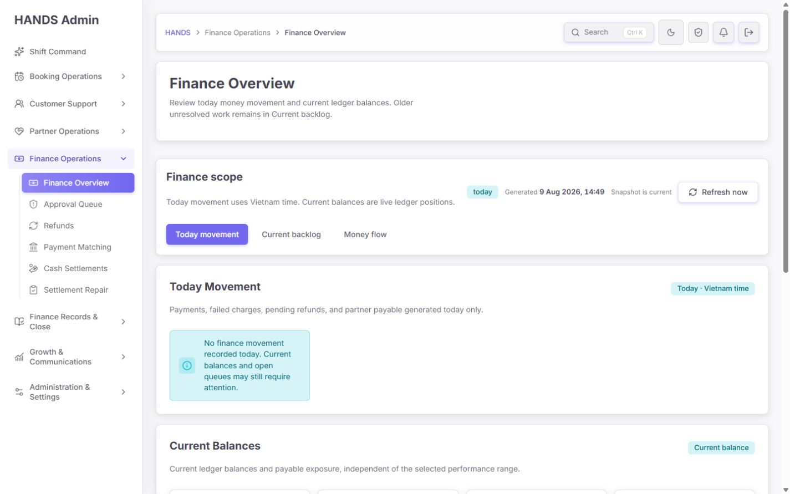

잘된 점:

- `Finance Overview → Finance scope → Today Movement → Current Balances`의 이해 순서가 명확하다.
- 오늘 흐름과 현재 책임 잔액을 분리한 정보 구조는 올바르다.
- Snapshot 시각과 Refresh가 상단 scope 안에서 자연스럽게 보인다.
- 현재 URL이 `/finance-overview`로 단순해져 공유·새로고침 시 상태가 명확하다.

남은 문제:

- 오늘 거래가 없는데도 `Today Movement`가 제목·설명·상태 badge·큰 body를 모두 차지한다.
- 1440×900 첫 화면에서 `Current Balances` 제목까지만 보이고 실제 잔액 값은 아래로 밀린다.
- 운영자에게 “오늘 0건”보다 중요한 현재 liability/exposure 확인이 한 스크롤 늦다.

권장 수정:

- `isTodayMovementClear`일 때 `AdminSection` 전체를 렌더링하지 말고 Current Balances 바로 위에 높이 40~48px의 inline notice만 둔다.
- 문구는 현재 문구를 유지해도 좋다: `No finance movement recorded today. Current balances and open queues may still require attention.`
- 첫 viewport 안에 Current Balances 1행 전체가 들어오는 것을 1440×900 시각 회귀 기준으로 둔다.

### Step 2 — Current backlog 상단

**상태: 레이아웃 통과, 업무 연결성 불통과**

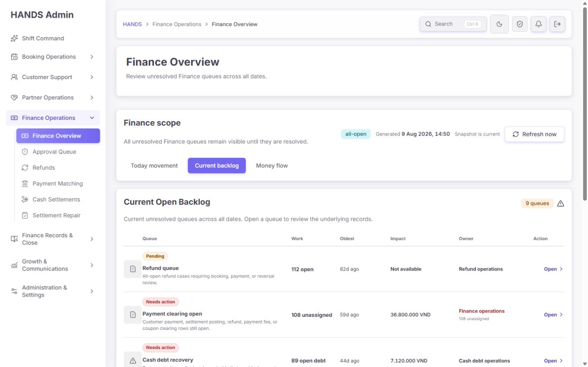

잘된 점:

- 이전의 세로로 깨지던 긴 작업 문구가 `Open`으로 축소됐다.
- Queue, Work, Oldest, Impact, Owner 열이 1440px에서 읽기 좋다.
- Refund 82d, Payment clearing 59d, Cash debt 44d처럼 오래된 큐가 상단에 배치돼 운영 위험을 빠르게 발견할 수 있다.
- owner 상태와 금액 영향도가 같은 행 안에 보여 다음 행동 판단이 쉽다.

남은 문제:

- 기본 정렬 규칙이 화면에 표시되지 않는다. 코드상 `SLA breach → oldest → owner → impact → tone`인데 운영자는 왜 이 순서인지 알 수 없다.
- `Risk / Oldest` 같은 최소 정렬 선택도 없다. 필수는 아니지만 인수인계나 집중 작업 시 유용하다.

권장 수정:

- 표 헤더 우측에 `Sorted by operational risk`를 표시한다.
- 실제 운영 요구가 확인될 때만 `Risk / Oldest` 2개 선택을 추가한다. 다중 정렬 UI는 만들지 않는다.
- 정렬 설명은 테스트와 같은 단일 상수/모델에서 생성해 문구와 코드 규칙이 어긋나지 않게 한다.

### Step 3 — Money flow, Today

**상태: 통과**

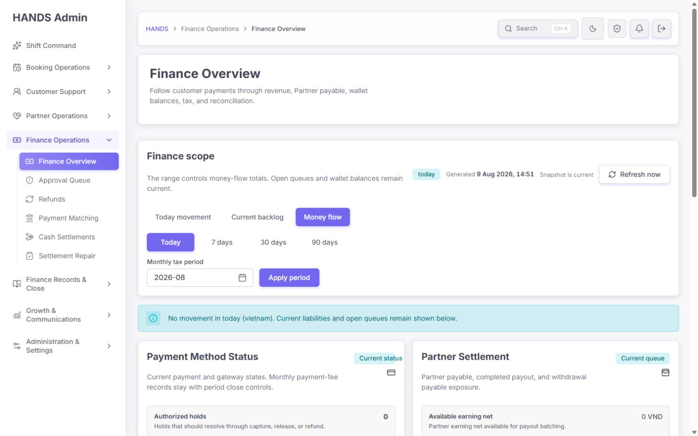

- 0값 KPI 네 장을 제거하고 `No movement in today` strip으로 축약한 방향이 좋다.
- current liabilities/open controls가 바로 이어져 0값보다 실제 책임 상태를 먼저 확인할 수 있다.
- Movement range와 Monthly tax period를 분리해 범위 계약이 이전보다 명확하다.

추가 개선은 P0 해결 이후의 시각 다듬기 수준이다.

### Step 4 — Money flow, Last 7 days 상단

**상태: 1440px 시각 회귀 실패**

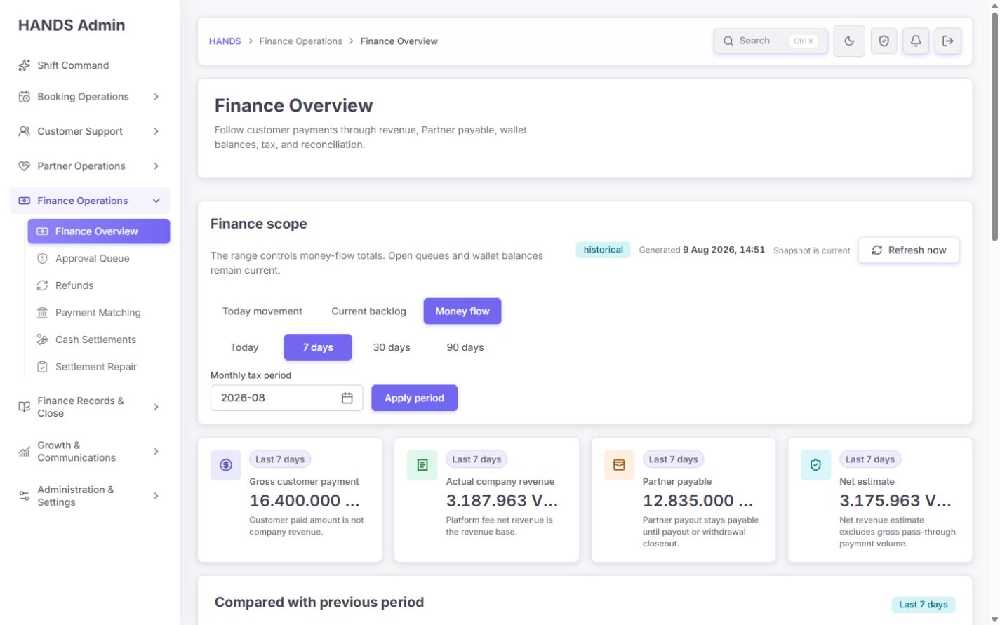

잘된 점:

- Gross customer payment, Actual company revenue, Partner payable, Net estimate의 구분과 흐름은 이해하기 쉽다.
- 값이 있는 범위에서는 카드가 0값 상태보다 훨씬 유용하다.

문제:

- 1440px에서 네 카드의 핵심 금액이 모두 ellipsis로 잘린다.
- 예: `16.400.000 ...`, `3.187.963 V...`, `12.835.000 ...`, `3.175.963 V...`
- 원인은 `.finance-overview-principle-card > div > strong`에 `overflow:hidden; text-overflow:ellipsis; white-space:nowrap`가 적용된 것이다 (`globals.css:12413-12420`).
- 재무 금액은 카드의 가장 중요한 정보이므로 생략 부호 처리는 허용하면 안 된다.

권장 수정:

1. 금액에는 ellipsis를 제거한다.
2. 숫자와 통화를 별도 inline element로 렌더링한다. 예: `16,400,000` + 작은 `VND`.
3. 숫자에는 `font-variant-numeric: tabular-nums`를 적용한다.
4. 1440px에서 긴 금액이 한 줄로 들어오지 않으면 글자 크기를 clamp하거나 2×2 grid를 사용한다. 금액 자체를 축약하지 않는다.
5. 1440×900 screenshot test 또는 Playwright 시각 회귀에 “4개 금액이 잘리지 않음”을 추가한다.

### Step 5 — 비교 영역

**상태: 시각 통과, drill-down 부분 실패**

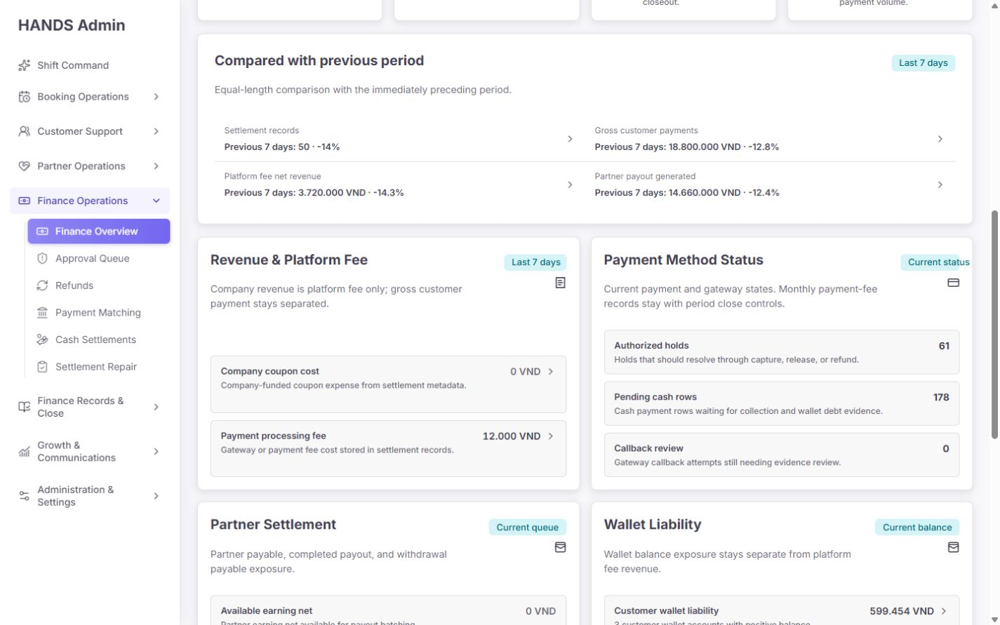

- 이전 기간 값과 증감률이 화면에 표시돼 이전의 미사용 comparison 계산 문제가 해결됐다.
- 비교 hierarchy와 색상은 과하지 않고 읽기 좋다.

그러나 비교 카드의 링크는 선택 범위와 이전 범위를 보존하지 않는다 (`finance-overview-model.ts:923-975`). `Settlement records`, `Gross customer payments`, `Platform fee net revenue`는 모두 필터 없는 booking settlement audit로, Partner payout은 필터 없는 earnings로 이동한다.

권장 수정:

- 현재 기간과 이전 기간의 `from/to` 또는 동일한 range token을 목적지 URL에 전달한다.
- 목적지에서 동일한 비교 집합을 표현할 수 없다면 비교 카드 전체를 링크로 만들지 말고 별도 `View current period records` action만 제공한다.

### Step 6 — Tax / Reconciliation 하단

**상태: 부분 통과**

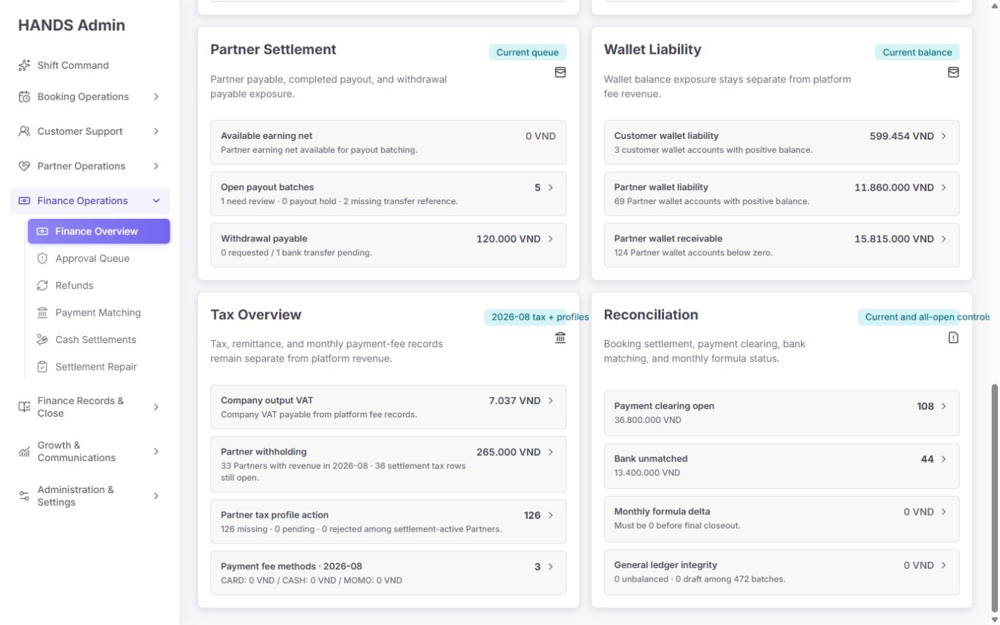

문제 1 — scope badge 잘림:

- `Current and all-open controls`가 카드 우측에서 잘린다.
- `Current + all-open`으로 줄이거나 badge의 max-width/nowrap 규칙을 조정한다.

문제 2 — `Payment fee methods 3`의 의미:

- 현재 CARD/CASH/MOMO가 각각 0인데 대표 값은 bare number `3`이다.
- 운영자는 이를 3건의 문제 또는 3개의 active fee method로 오해할 수 있다.
- 권장: `3 configured methods`, `0 VND across 3 methods`, 또는 실제 fee가 있는 method 수를 대표 값으로 사용한다.

문제 3 — 월 범위가 링크에서 사라짐:

- Company output VAT와 Partner withholding은 카드에 `2026-08 tax + profiles`라고 보이지만 링크는 각각 `/finance-tax/platform-vat`, `/finance-tax/partner-withholding-tax`로 period가 없다 (`finance-overview-model.ts:1157-1179`).
- 선택 월을 바꾼 뒤 클릭하면 화면에서 본 월과 목적지 기본 월이 달라질 수 있다.
- 월간 행에는 모두 `?period=2026-08`을 전달한다.
- `Partner tax profile action`은 all-open/current 데이터이므로 월간 tax rows와 분리해 scope를 `All settlement-active Partners`로 명시한다.

### Step 7 — Dark theme

**상태: 테마 통과, 동일 레이아웃 결함 재현**

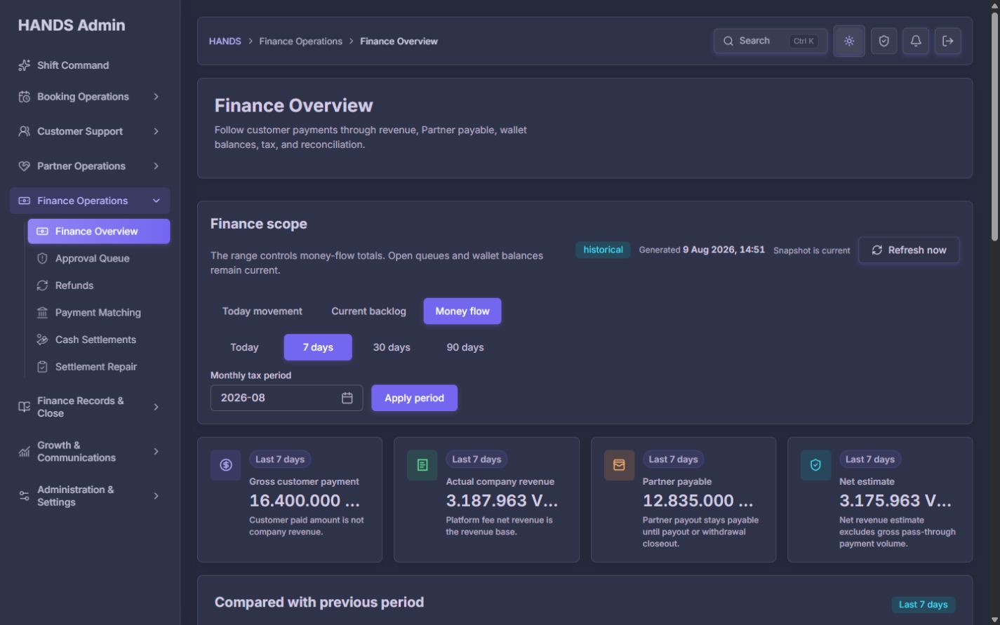

- 배경, 카드 경계, 위험/정보 색, 본문 대비가 안정적이다.
- 테마 전환에 따른 레이아웃 이동이나 기능 손실은 관찰되지 않았다.
- 다만 KPI 금액 ellipsis는 다크 테마에서도 동일하게 재현된다.

### Step 8 — Current backlog 하단

**상태: P0 중복 및 잘못된 목적지 확인**

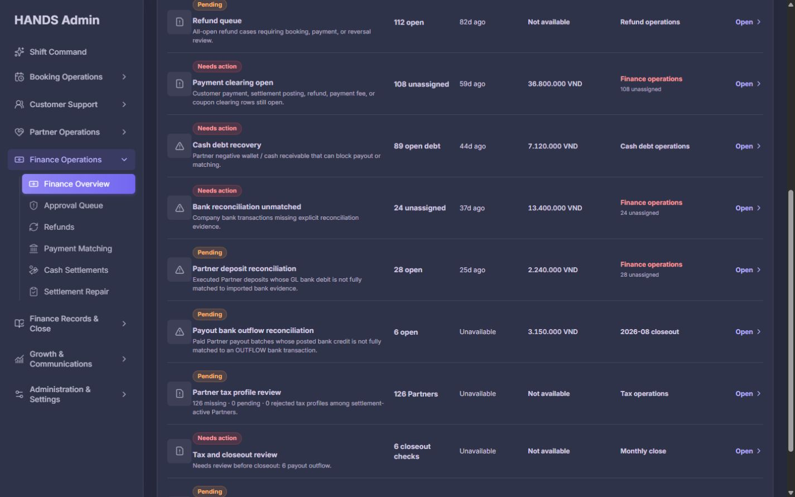

하단에는 다음 두 행이 동시에 나타난다.

- `Payout bank outflow reconciliation · 6 open · 3.15m VND`
- `Tax and closeout review · 6 closeout checks · Needs review: 6 payout outflow`

현재 데이터에서는 두 행이 사실상 같은 6건을 중복 표현한다. 복합 `Tax and closeout review` count는 open tax, coupon review, payout outflow, payout return, formula issue를 단순 합산한다 (`finance-overview-model.ts:1441-1456`). 개별 큐 행이 이미 존재하는데 합계 행까지 같은 목록에 두면 운영자가 업무를 두 번 처리해야 하는 것처럼 보인다.

권장 수정:

- Current backlog에서는 `Tax and closeout review` 복합 행을 제거한다.
- 월 마감 orchestration entry가 반드시 필요하면 `/finance-tax?period=...`의 preflight 화면으로 연결하고, server의 실제 `preflight.blockers`를 대표 count로 사용한다.
- 복합 행 내부에는 중복 합계 대신 `Open tax / Coupon / Payout outflow / Return / Formula`별 direct action을 제공한다.

### Step 9 — Dark backlog 상단

**상태: 시각 통과**

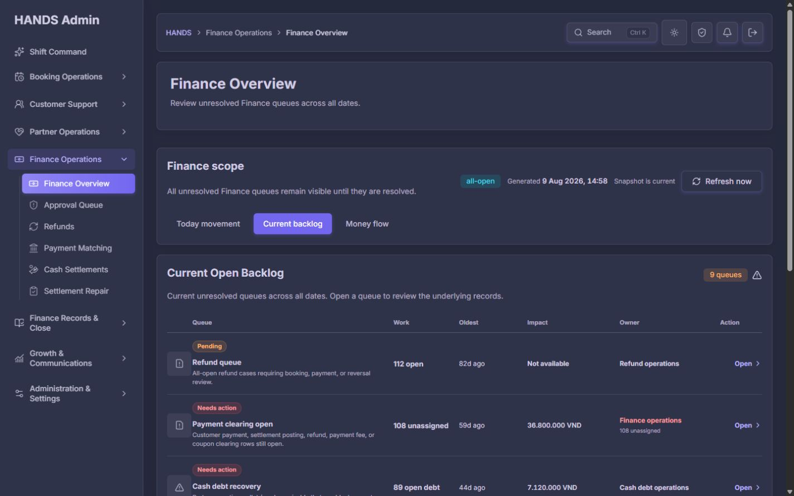

다크 테마에서도 열 정렬과 owner badge 가독성은 안정적이다. 이 화면의 남은 핵심 문제는 시각이 아니라 아래의 클릭 결과 계약이다.

### Step 10 — `Tax and closeout review 6` 클릭 결과

**상태: P0 실패**

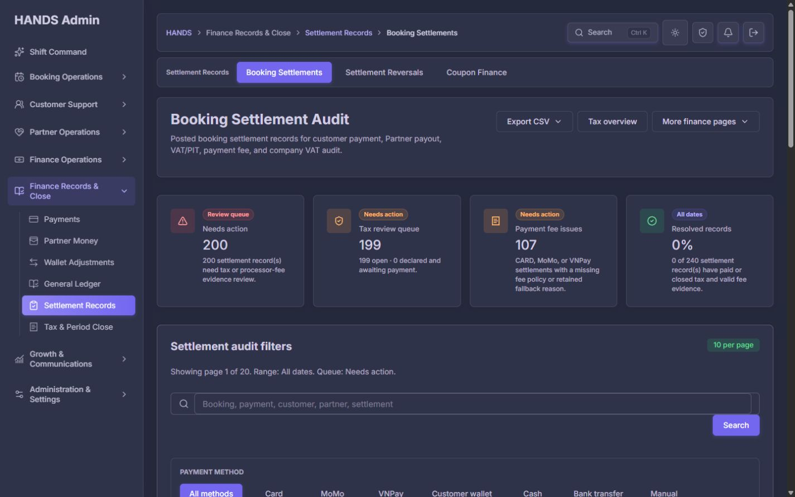

실제 결과:

- 출발: `Tax and closeout review · 6 closeout checks`
- URL: `/finance-tax/booking-settlement-audit?range=all&review=open`
- 도착 화면: `Needs action 200`, `Tax review 199`, `Payment fee issues 107`

원인:

- 출발 count는 서로 다른 5종류의 closeout trigger 합계다.
- 목적지는 booking settlement의 open review 목록 하나뿐이다 (`finance-overview-model.ts:1727-1732`).
- 따라서 6이라는 숫자와 200건의 목적지는 같은 엔티티 집합이 아니다.

완료 조건:

- 출발 6건을 누르면 동일 6건 또는 유형별 합계 6을 정확히 재현하는 orchestration 화면이 열려야 한다.
- 그 화면을 만들지 않을 경우 복합 행을 제거해야 한다.

### Step 11 — `Payout bank outflow reconciliation 6` 클릭 결과

**상태: P0 실패**

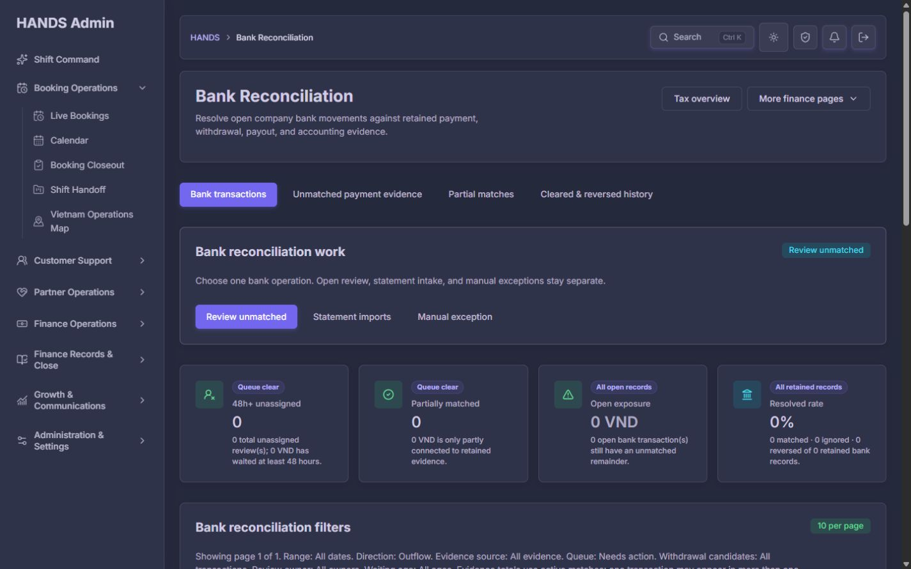

실제 결과:

- 출발: `6 open · 3.15m VND`
- URL: `/finance-tax/bank-reconciliation?workspace=operations&range=all&review=unmatched&type=OUTFLOW`
- 도착: 0 VND, 0 transactions

코드상 정확한 원인:

- 출발 숫자는 `ProviderPayoutBatch` 중 PAID이며 해당 월의 bank match 금액이 target보다 작은 payout batch를 집계한다 (`admin.service.ts:42414-42470`).
- 목적지는 이미 존재하는 `CompanyBankTransaction` 중 unmatched OUTFLOW를 조회한다.
- 즉 출발은 **은행 거래 증빙이 없거나 부족한 payout batch**, 도착은 **이미 존재하지만 미매칭인 bank transaction**이다. 서로 반대편 엔티티다.

권장 수정:

- `openPayoutBankOutflows`와 같은 payout-batch 후보 집합을 그대로 목록화하는 전용 queue를 제공한다.
- 전용 화면이 없다면 `/payouts`에 `status=paid&bankEvidence=incomplete&period=2026-08` 같은 실제 지원 필터를 만들고 연결한다.
- 일반 Bank Reconciliation으로 보낼 경우 목적지 API가 payout batch missing-evidence 후보까지 같은 기준으로 조회할 수 있어야 한다.
- `period`, `source=payout`, `returnTo`를 목적지에 보존한다.

### Step 12 — `Partner deposit reconciliation 28` 클릭 결과

**상태: P0 실패**

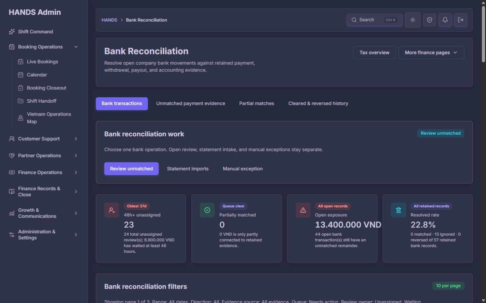

실제 결과:

- 출발: `Partner deposit reconciliation · 28 open · 2.24m VND`
- 최초 링크: `/finance-tax/approval-queue?view=reconciliation&owner=unassigned`
- redirect 후: `/finance-tax/bank-reconciliation?range=all&review=unmatched&workspace=operations&owner=unassigned`
- 도착: 일반 Bank queue `44 unmatched`, `24 unassigned`, `13.4m VND`

원인:

- 출발 숫자는 executed `PartnerBankDepositRequest`의 target/matched 차이를 집계한다 (`admin.service.ts:42347-42410`).
- 목적지는 일반 unmatched bank transaction queue이며 partner deposit request 집합이 아니다.
- 모델이 legacy approval-queue URL을 만들고 있다 (`finance-overview-model.ts:245-249`).

권장 수정:

- 전용 partner deposit reconciliation queue로 직접 연결한다.
- 예시 계약: `/finance-tax/partner-bank-deposits?review=needs-reconciliation&owner=unassigned&sort=oldest&period=...`
- 해당 화면이 아직 없으면 기존 목적지에서 `source=partner-deposit` 필터와 deposit request 기준 candidate list를 먼저 구현한다.
- redirect를 전제로 한 legacy URL은 Overview 모델에서 제거한다.

## 4. 우선순위별 수정 요구사항

### P0 — 운영 배포 전 필수

#### P0-1. 모든 Backlog 행에 “숫자 = 목적지 결과” 계약 적용

각 action item에 다음 데이터를 함께 정의하고 서버/프런트가 공유해야 한다.

- `sourceEntity`
- `scope` (`current`, `all-open`, `period`)
- `filters`
- `count`
- `amount`
- `destinationHref`
- `destinationExpectedCount`

UI 테스트가 아니라 실제 목적지 loader/API를 호출하는 계약 테스트로 다음을 보장한다.

```text
overview item count === destination filtered result count
overview item amount === destination filtered result amount
```

예외적으로 pagination total을 사용하는 것은 허용하지만 화면의 visible row 수와 비교하면 안 된다.

#### P0-2. Payout outflow의 source/destination 엔티티 통일

`ProviderPayoutBatch missing bank evidence`를 `CompanyBankTransaction unmatched`로 보내지 않는다. payout batch 기준 전용 queue 또는 정확한 payout filter가 필요하다.

#### P0-3. Partner deposit의 source/destination 엔티티 통일

`PartnerBankDepositRequest incomplete match`를 generic Bank transaction queue로 보내지 않는다. legacy redirect를 제거하고 동일 deposit candidate 목록으로 연결한다.

#### P0-4. 복합 closeout 행 제거 또는 전용 orchestration view 제공

단순 합계 6을 settlement 200건으로 보내는 현재 연결을 제거한다. 개별 행을 유지한다면 복합 행은 삭제하는 것이 가장 단순하고 운영상 명확하다.

### P1 — P0 직후 필수 완성도

1. **재무 금액 ellipsis 금지:** 1440px에서 KPI 금액 전체 표시.
2. **월 범위 링크 보존:** VAT/withholding/monthly formula 관련 모든 링크에 selected period 전달.
3. **비교 drill-down 범위 보존:** 비교 카드 클릭 시 current/previous 기간을 재현.
4. **Today clear section 압축:** empty `AdminSection`을 한 줄 notice로 대체.
5. **Finance 전용 loading boundary:** root의 `Shift Command` loading 대신 `/finance-overview/loading.tsx`에서 `Finance Overview`와 현재 workspace 문맥 표시.
6. **1440 시각 회귀 테스트:** 긴 VND 금액, scope badge, owner/action 열을 포함한 fixture 검증.

### P2 — 운영 친화성·복원력

1. `Payment fee methods 3`을 `3 configured methods` 또는 금액 포함 문구로 변경.
2. `Current and all-open controls`를 `Current + all-open`으로 축약하거나 badge overflow 수정.
3. `Sorted by operational risk` 표시, 필요 시 `Risk / Oldest`만 제공.
4. range navigation은 URL을 바꾸는 링크이므로 `<nav aria-label="Finance overview range">` + `aria-current="page"`가 가장 단순하다. 현재처럼 `role=tab`을 유지한다면 연결된 `tabpanel`, roving tabindex, 좌우 화살표 키를 포함한 완전한 tabs pattern을 구현한다 (`admin-segmented-control.tsx:27-59`).
5. API 22개 summary의 all-or-nothing 실패 범위를 줄인다. 브라우저 요청을 여러 개로 쪼개 waterfall을 만들기보다 server aggregation에서 section별 결과/오류/freshness를 반환한다 (`admin.service.ts:14439-14493`).
6. workspace가 `queues`일 때 flow-only historical summary를 반드시 계산해야 하는지 profile한 뒤 불필요하면 server 옵션으로 생략한다.

## 5. 문구와 UI 교체안

| 현재 | 권장 |
|---|---|
| `Current and all-open controls` | `Current + all-open` |
| `Payment fee methods · 2026-08` / `3` | `Payment fee methods · 2026-08` / `3 configured methods` 또는 `0 VND across 3 methods` |
| `Tax and closeout review · 6 closeout checks` | 개별 큐가 있으면 행 제거. 유지 시 `Monthly close blockers · 6` + 전용 preflight 링크 |
| Today의 큰 empty section | Current Balances 위 한 줄 notice |
| 설명 없는 고정 정렬 | `Sorted by operational risk` |
| root loading `Shift Command` | `Finance Overview · Loading current finance snapshot` |

## 6. 권장 최종 구조

### Today movement

1. Finance scope + snapshot/refresh
2. 이동이 없으면 한 줄 notice
3. Current Balances
4. Records

### Current backlog

1. `Sorted by operational risk`
2. 동일 entity contract를 가진 queue rows
3. 개별 처리 큐만 표시
4. Monthly close composite는 별도 preflight entry로 분리하거나 제거

### Money flow

1. Movement range + Monthly tax period
2. 전체 금액이 잘리지 않는 principle cards
3. Previous period comparison
4. flow sections
5. current balances / all-open controls
6. 월간 tax와 all-open Partner profile을 별도 scope로 명시

## 7. 성능·상태·코드 품질

### 통과한 부분

- 브라우저 콘솔 warning/error는 관찰되지 않았다.
- Snapshot Refresh가 실제로 pending/완료 상태를 알리고 generated time을 갱신한다.
- stale 기준이 5분으로 구현돼 장시간 열린 탭의 신뢰도를 개선했다.
- 작업공간 URL 정규화가 동작한다.
- 다크/라이트 테마 전환에서 기능 손실이 없다.
- 로컬 warm route 응답은 반복 측정에서 대체로 수십 ms 수준이었고, 이번 감사 중 지속적인 페이지 멈춤은 관찰되지 않았다. 이 수치는 로컬 warm 환경 참고치이며 운영 API latency를 대체하지 않는다.

### 남은 위험

- API는 모든 workspace에서 22개 summary를 하나의 `Promise.all`로 실행한다 (`admin.service.ts:14439-14493`). 가장 느린 집계가 전체 렌더를 지연시키고 하나의 reject가 페이지 전체 실패로 번질 수 있다.
- `/finance-overview/loading.tsx`가 없어 느린 이동 시 root loading의 `Shift Command`와 `Loading priority queue`가 순간적으로 노출된다 (`apps/admin_web/app/loading.tsx:4`). Finance 페이지에서 다른 업무공간 이름이 보이는 것은 운영 문맥 오류다.
- 현재 테스트는 모델의 href 문자열과 count 표시를 각각 확인하지만, 목적지에서 같은 count가 나오는지는 확인하지 않는다. 이번 P0 세 건이 이 틈에서 통과했다.

권장 구현 순서:

1. P0 destination contract test 작성
2. payout/deposit/closeout 링크 및 목적지 loader 통일
3. 1440 금액 overflow 수정 + 시각 테스트
4. period/range 보존
5. loading boundary
6. 실제 운영 trace로 22개 summary의 latency와 실패율 측정 후 최적화

## 8. 테스트 결과와 추가 테스트

실행한 테스트:

```text
finance-overview-model.spec.ts
finance-overview/page.spec.tsx
finance-overview/finance-overview-snapshot-control.spec.tsx
```

결과: **3 files / 46 tests passed / 약 2.43초**

현재 테스트가 잘 보장하는 것:

- canonical URL
- snapshot stale/refresh
- 위험 정렬의 주요 조건
- General Ledger 범위
- fee scope 문구
- comparison rendering
- closeout 대표 count 표시

반드시 추가할 테스트:

1. `Payout bank outflow count 6` fixture → destination API total 6
2. `Partner deposit count 28` fixture → destination API total 28
3. closeout composite를 유지할 경우 trigger 합계 → preflight blocker 합계 일치
4. destination URL에 period/source/owner/returnTo 보존
5. selected period가 바뀌어도 VAT/withholding 목적지 period 일치
6. comparison card가 선택 current/previous window를 보존
7. 1440px에서 네 KPI 금액의 `scrollWidth <= clientWidth` 또는 screenshot diff
8. 1440px에서 Reconciliation scope badge 잘림 없음
9. Finance route loading에 `Shift Command`/`priority queue` 문구가 없음
10. range control을 navigation으로 바꿀 경우 active link의 `aria-current=page`

## 9. 최종 완료 조건

다음이 모두 충족돼야 Finance Overview 개선 완료로 판정한다.

- Backlog의 모든 non-zero 행을 클릭했을 때 동일 scope의 동일 total count/amount가 목적지에 재현된다.
- `Payout outflow 6`이 0건 destination을 열지 않는다.
- `Partner deposit 28`이 generic 44/24 bank queue를 열지 않는다.
- `Closeout 6`이 200 settlement rows를 열지 않는다.
- 중복 큐가 제거되거나 각 행의 책임과 목적지가 명백히 다르다.
- 1440px에서 모든 핵심 VND 금액과 status badge가 생략 없이 보인다.
- 월간 수치의 모든 상세 링크가 selected period를 유지한다.
- Today clear 상태에서 Current Balances 값이 첫 1440×900 viewport에 보인다.
- Finance loading 상태가 Finance 문맥을 유지한다.
- 기존 46개 테스트와 신규 destination-contract/visual 테스트가 모두 통과한다.
- 라이트/다크 테마에서 회귀가 없다.

## 10. 감사 한계

- 원장·은행 명세와 금액을 대조한 회계 감사가 아니라, 화면·집계 코드·목적지 목록 사이의 운영 계약 감사다.
- 실제 데이터에 승인, 배정, 수정, 지급 등 쓰기 작업은 하지 않았다.
- 실제 스크린리더 전체 탐색은 수행하지 않았으며 DOM 의미와 소스 중심으로 검수했다.
- 로컬 warm timing은 운영 환경 성능을 보장하지 않는다. 운영 APM/DB query trace가 필요하다.
- 요청에 따라 1024px 이하 화면은 캡처·분석·보고에 포함하지 않았다.

