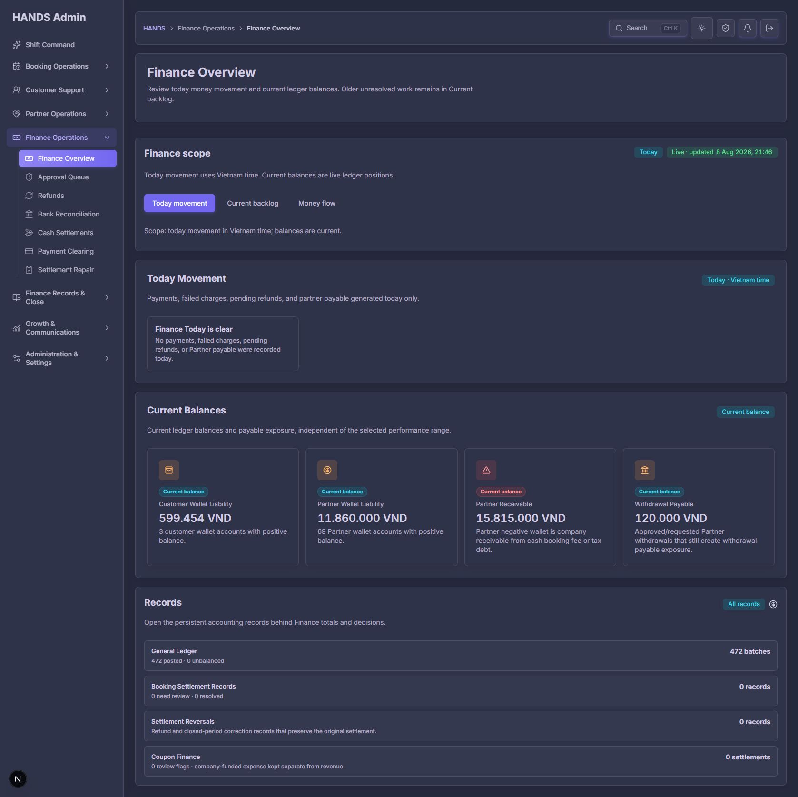
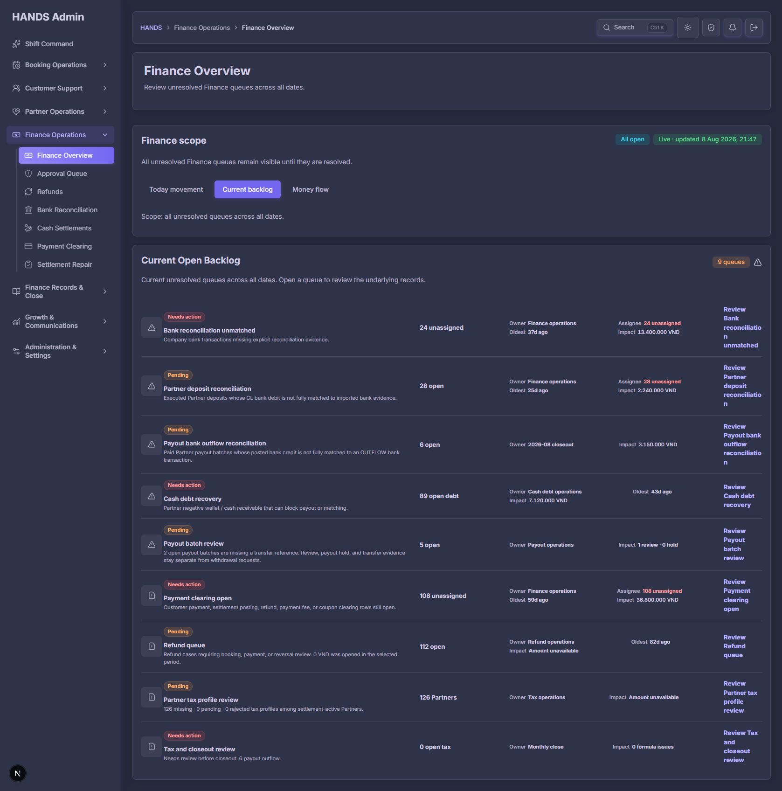
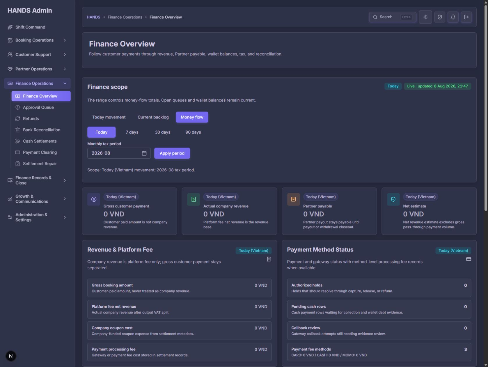
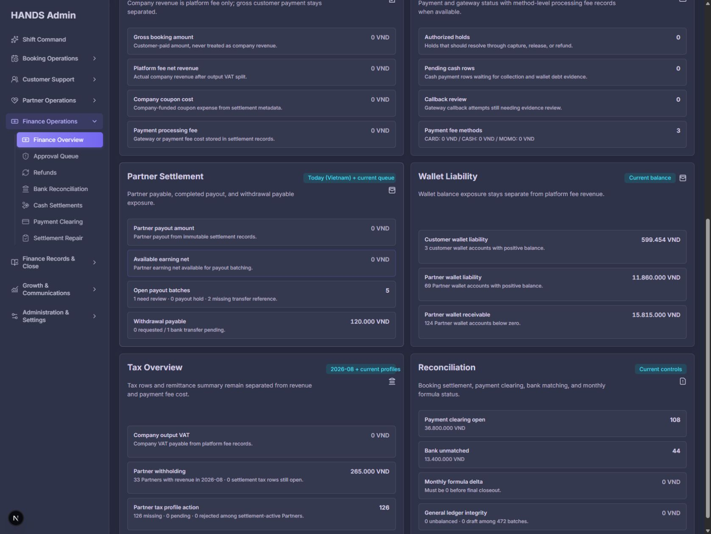
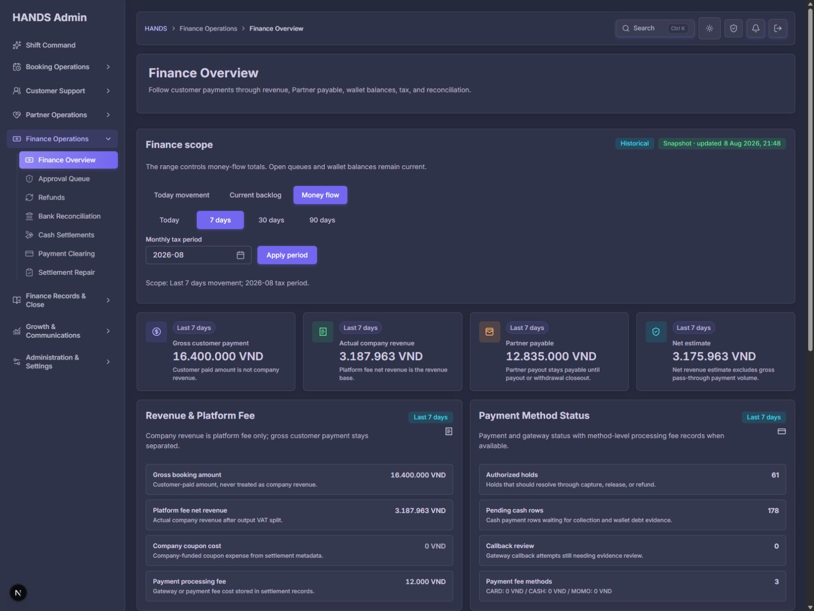
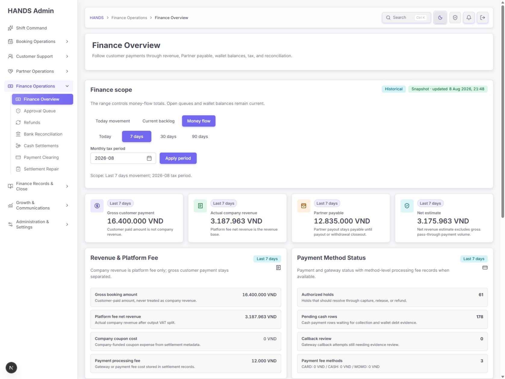

# Finance Overview 심층 재감사 보고서

- 감사 일자: 2026-08-08
- 대상: `http://localhost:3101/finance-overview`
- 대상 화면: 1692×1272 데스크톱, 1440px 이상 운영 환경
- 제외 범위: 1024px 이하 반응형/모바일 UI
- 검수 방식: 로그인된 실제 화면, 상태 전환, 다크/라이트 테마, 소스 코드, 모델/서비스 데이터 계약, 테스트 결과를 함께 검수
- 구현 변경: 없음. 본 문서와 감사 스크린샷만 생성함

## 1. 최종 판정

**조건부 통과 — 구조와 시각 완성도는 좋아졌지만, 재무 데이터의 범위·신선도·우선순위에 대한 신뢰 문제는 운영 배포 전에 반드시 보완해야 한다.**

현재 페이지를 `Today movement / Current backlog / Money flow`의 세 작업공간으로 한 페이지 안에 구성한 방향은 적절하다. 서로 다른 운영 질문을 분리하면서도 페이지 이동을 늘리지 않았고, “오늘 발생한 돈”, “지금 남은 일”, “기간별 흐름”을 한 재무 허브 안에서 다룬다. 따라서 이 페이지를 다시 여러 페이지로 나눌 필요는 없다.

다만 현재는 숫자가 맞아 보여도 실제 조회 범위가 다른 데이터가 한 카드 안에서 섞이거나, URL이 나타내는 범위와 화면이 사용하는 범위가 다르거나, `Live`라는 문구가 실제 자동 갱신을 보장하지 않는 문제가 있다. 재무 관리자 화면에서는 미관보다 데이터 계약의 명료성이 우선이므로 아래 P1 항목을 먼저 해결해야 한다.

### 종합 점수

| 항목 | 점수 | 판정 |
|---|---:|---|
| 운영자 정보 구조 | 3/4 | 세 작업공간 구분은 명확하나 범위 안내가 중복되고 일부 중요 정보의 위치가 낮음 |
| 데스크톱 레이아웃(1440+) | 2/4 | 전반은 안정적이나 Backlog의 82px 작업 열이 1692px에서도 심하게 줄바꿈됨 |
| 데이터 신뢰성과 구현 일관성 | 2/4 | range/period/all-open 계약이 여러 지점에서 혼재 |
| 접근성 | 3/4 | 기본 대비와 제목 구조는 양호하나 링크 접근 가능한 이름과 segmented control 의미가 부족 |
| 테마·시각 완성도 | 4/4 | 다크/라이트 모두 일관되고 가독성 양호 |
| 성능·상태 갱신 | 2/4 | 프런트 요청은 하나지만 서버 내부 22개 병렬 집계, 불필요 계산, 갱신 통제가 없음 |
| **합계** | **16/24** | **Good / 신뢰성 보완 필요** |

## 2. 운영자가 이 페이지에서 답을 얻어야 하는 질문

1. 오늘 실제로 들어오고 나간 금액은 얼마인가?
2. 현재 회사·파트너·고객 지갑에 남아 있는 책임 금액은 얼마인가?
3. 지금 즉시 처리해야 할 재무 예외는 무엇이며, 무엇부터 처리해야 하는가?
4. 선택 기간의 총 결제액, 실제 회사 수익, 파트너 지급액, 비용은 어떻게 연결되는가?
5. 보고 있는 숫자는 언제 갱신되었고, 어떤 기간과 기준으로 계산되었는가?

현재 화면은 1~4번 질문을 위한 구성 요소는 갖추었으나, 3번의 우선순위와 5번의 데이터 신뢰 표시는 아직 충분하지 않다.

## 3. 화면별 감사

### Step 1 — Today movement

**상태: 대체로 양호, 빈 상태 압축 필요**

잘된 점:

- `Finance Overview → Finance scope → Today Movement → Current Balances → Records` 순서가 자연스럽다.
- 오늘의 증감과 현재 잔액을 분리해, “오늘 0”을 “현재 잔액 0”으로 오해하지 않게 했다.
- Partner Receivable을 위험 색상으로 표시해 회수 책임을 빠르게 발견할 수 있다.
- General Ledger, settlement, reversal, coupon 등의 원장 진입점을 한 화면에서 제공한다.

개선할 점:

- 오늘 이동이 없을 때 작은 빈 상태 카드가 큰 섹션 중앙에 남아 과도한 빈 공간을 만든다. 운영자는 빈 상태 자체보다 현재 잔액과 미처리 큐를 더 빨리 보고 싶다.
- 빈 상태를 한 줄 상태 배너로 축소하고 곧바로 Current Balances를 보여주는 편이 낫다.
- 권장 문구: `No finance movement recorded today. Current balances and open queues may still require attention.`
- `General Ledger 472 batches`는 전체 기간 집계인데 링크는 현재 `range=today`로 이동한다. 화면의 수치와 클릭 후 결과 수가 달라지는 신뢰 문제다.

### Step 2 — Current backlog

**상태: 운영 우선순위와 행 레이아웃 재설계 필요**

가장 큰 문제는 이 화면이 “업무 목록”은 제공하지만 “처리 순서”를 충분히 설명하지 않는다는 점이다.

- 9개 큐가 위험 색상과 담당 상태에 따라 정렬되지만, oldest와 금액 영향도가 정렬에 반영되지 않는다.
- 실제 화면에서 Refund는 82일, Payment clearing은 59일째인데 아래쪽에 놓였다. Bank reconciliation 37일이 첫 행인 현재 순서는 운영자가 가장 오래 방치된 업무를 놓치게 할 수 있다.
- 코드상 정렬도 `tone → ownerState → 원래 배열 순서`뿐이다. oldest와 impact는 비교하지 않는다 (`finance-overview-model.ts:1314`).
- `Tax and closeout review`는 `Needs action`, 상세에는 `6 payout outflow`가 있지만 대표 수치는 `0 open tax`, 영향도는 `0 formula issues`로 보인다. 행이 왜 위험한지 대표 숫자에서 드러나지 않는다.
- Refund의 `112 open`은 전체 미해결 건수인데 상세 금액은 “selected period에서 열린 금액”이다. Current backlog는 all-open 작업공간이므로 한 행 안에서 시점이 섞여 있다.
- 1692px에서도 우측 작업 열이 82px뿐이라 `Review Bank reconciliation unmatched` 같은 문구가 여러 줄로 깨진다 (`globals.css:11016-11022`).
- 각 행이 이미 링크인데도 우측에 긴 `Review {queue name}`을 반복한다. 이름을 두 번 읽게 하고 핵심 수치의 폭을 줄인다.

권장 구조:

| Priority | Queue | Work | Oldest | Exposure/Impact | Owner | Action |
|---|---|---:|---:|---:|---|---|
| P1 | Refund review | 112 | 82d | 현재 open 금액 | 담당자 | `Open` + chevron |

권장 정렬 원칙:

1. SLA breach 여부
2. 미배정 업무
3. 가장 오래된 건의 나이
4. 금액 또는 고객/파트너 영향도
5. 동일 조건에서만 고정 소스 순서

화면에 `Sorted by operational risk`를 명시하고, 운영자가 필요하면 `Risk / Oldest / Highest exposure`를 선택할 수 있게 한다. 단, 처음부터 복잡한 다중 정렬 UI를 넣기보다 기본 Risk와 Oldest 두 옵션이면 충분하다.

### Step 3 — Money flow 상단, Today

**상태: 데이터가 0일 때 지나치게 많은 0을 보여줌**

- 총 고객 결제액, 실제 회사 수익, 파트너 지급액, 순수익 추정치를 분리한 원칙은 좋다.
- 그러나 Today가 모두 0인 경우에도 4개 요약 카드와 전체 상세 섹션을 그대로 렌더링한다.
- 상단 4개 카드의 값이 바로 아래 상세 행에서 다시 반복돼 같은 정보를 두 번 읽게 한다.
- Finance scope 패널 안에 작업공간, 날짜 범위, 월별 세금 기간, 설명 문구가 모두 세로로 쌓여 페이지 시작부가 과도하게 높다.
- 패널의 description과 하단 `Scope:` 문장은 사실상 같은 정보를 반복한다.

개선 방법:

- 범위 내 이동이 모두 0이면 요약 카드를 `No movement in selected range` 한 줄로 축약한다.
- 그 아래에는 0이 아니거나 현재 위험을 나타내는 `current balances / authorized holds / pending cash / open queues`만 우선 표시한다.
- 상단 카드를 유지할 경우 아래 상세에서 동일한 4개 총계를 다시 반복하지 말고, 구성 항목과 차이 설명만 보여준다.
- 작업공간 탭은 1행, Flow에서만 `Movement range`와 `Tax period`를 같은 제어 행에 배치한다.

### Step 4 — Money flow 하단

**상태: 정보는 유용하지만 현재 책임 정보가 너무 아래에 있음**

- Partner Settlement, Wallet Liability, Tax Overview, Reconciliation의 2열 배치는 데스크톱 환경에 적절하다.
- 현재 지갑 책임과 reconciliation backlog는 운영 가치가 높지만, 기간 내 0값 섹션 아래로 밀린다.
- 세부 행은 클릭 가능하지만 정적 텍스트와 시각적으로 크게 다르지 않다. hover/focus뿐 아니라 기본 상태에도 작은 chevron 또는 `View` 힌트가 필요하다.
- 모든 카드에서 `Current balance`와 범위 배지를 반복해 시각적 소음이 생긴다. 섹션 제목/그룹에서 한 번 선언할 수 있는 범위는 반복하지 않아도 된다.

### Step 5 — Money flow, Last 7 days

**상태: 수치가 채워지면 읽기 좋지만 조회 범위 불일치가 확인됨**

확인 값:

- Gross customer payment: 16.4m VND
- Actual company revenue: 3,187,963 VND
- Partner payable: 12,835,000 VND
- Net revenue estimate: 3,175,963 VND
- Payment processing fee: 12,000 VND

치명적인 불일치:

- `Payment processing fee` 총액은 7일 범위에서 12,000 VND인데 `Payment fee methods`의 CARD/CASH/MOMO는 모두 0이면서 값은 `3`이다.
- 원인은 API가 총액 관련 데이터를 `rangeOptions`로 조회하지만 payment method breakdown은 `periodOptions`로 조회하기 때문이다 (`admin.service.ts:14237-14289`).
- UI 섹션은 `Last 7 days` 범위로 표시되므로 운영자는 두 데이터가 같은 범위라고 해석한다.
- 해결은 두 데이터 모두 같은 range를 사용하거나, breakdown에 `2026-08 monthly fee records`처럼 별도 범위를 명시하는 것이다. 재무 화면에서 범위가 다른 수치를 같은 섹션에 무표시로 섞어서는 안 된다.

추가 관찰:

- `Authorized holds 61`, `Pending cash rows 178`은 현재 책임 상태이므로 기간 흐름과 명시적으로 분리해야 한다.
- 이전 기간 비교 데이터가 서버에서 계산되어 응답되지만 페이지에는 렌더링되지 않는다. 7/30/90일에는 전기 대비 증감이 실제 운영 판단에 유용하다. 표시하지 않을 계획이라면 계산을 제거해 비용을 줄여야 한다.

### Step 6 — Light theme

**상태: 통과**

- 카드 경계, 배경 위계, 본문 대비가 모두 안정적이다.
- 다크 테마의 muted text도 측정상 약 5.53:1로 일반 본문 기준을 만족했다.
- 테마 전환 후 레이아웃 이동이나 컨트롤 손실은 관찰되지 않았다.

## 4. 우선순위별 개선 요구사항

### P1 — 배포 전 필수

#### P1-1. `Live` 상태를 실제 갱신 정책과 일치시킬 것

페이지는 서버 렌더 시점의 `generatedAt`으로 상태를 계산하지만 자동 갱신도, 수동 Refresh 버튼도 없다. 탭을 오래 열어도 녹색 `Live · updated`는 그대로 남는다. `dashboard-trace-summary.tsx:74-163`에는 `refreshSeconds` 지원이 있지만 Finance Overview는 전달하지 않는다 (`page.tsx:174`).

요구사항:

- 60초 자동 갱신을 구현하면 `Updated 21:49 · Auto-refresh 60s`로 표시한다.
- 자동 갱신을 넣지 않는다면 `Snapshot updated 21:49`와 명시적인 `Refresh` 버튼을 제공한다.
- 클라이언트 시간 기준으로 stale 상태를 다시 계산해 5분이 지나면 상태를 변경한다.
- 실제 자동 갱신이 없는 화면에서 `Live`라는 단어를 쓰지 않는다.

#### P1-2. 작업공간별 canonical URL을 보장할 것

7일 Money Flow에서 `Today movement`를 누른 실제 결과:

- URL: `/finance-overview?range=7d&period=2026-08`
- 화면: `Scope: today movement in Vietnam time; balances are current.`

비-flow 작업공간은 서버에서 range를 today/all-open으로 강제하지만 링크는 기존 `filters.range`를 보존한다 (`page.tsx:196-218`). URL이 상태의 진실이 아니므로 새로고침, 공유, 테스트가 혼란스러워진다.

요구사항:

- Today: irrelevant `range`와 `period`를 제거하거나 canonical `range=today`만 유지한다.
- Backlog: `range=all` 또는 range 파라미터 자체를 제거한다.
- Money Flow에서만 range와 period를 보존한다.
- 잘못된 조합으로 진입하면 canonical URL로 redirect/replace한다.

#### P1-3. Backlog 기본 정렬을 운영 위험 기준으로 바꿀 것

현재 `tone → ownerState → insertion order` 정렬을 `SLA breach → unassigned → oldest → impact`로 변경한다. 위험 점수의 근거를 화면과 코드에 명시하고, 82일/59일 방치 건이 하단으로 내려가지 않는 테스트를 추가한다.

#### P1-4. Payment fee의 range/period 계약을 통일할 것

- 범위 총액과 결제수단 breakdown을 동일한 조회 범위로 계산한다.
- 월간 세금 기간 데이터를 유지해야 한다면 독립 섹션으로 분리하고 월 범위를 제목에 명시한다.
- 7일 총 수수료가 0보다 큰데 모든 method가 0인 fixture를 실패시키는 계약 테스트를 추가한다.

#### P1-5. General Ledger count와 목적지 필터를 일치시킬 것

`General Ledger 472 batches`는 all-range summary인데 클릭 목적지는 active range다 (`finance-overview-model.ts:849`). 다음 중 하나로 통일한다.

- 카드 수치를 active range로 계산하고 동일 range 목록으로 이동
- 수치를 all-time으로 유지하고 `/general-ledger?range=all`로 이동

#### P1-6. Tax/closeout 대표 수치를 실제 trigger로 바꿀 것

`0 open tax` 대신 전체 열려 있는 closeout 검토 합계를 대표 수치로 사용한다.

- 권장: `6 closeout checks`
- 상세: `6 payout outflow · 0 tax · 0 formula`

#### P1-7. Current backlog 안의 시점 혼합을 제거할 것

Refund 행의 open count와 금액을 둘 다 “현재 미해결” 기준으로 맞춘다. current open amount를 구할 수 없다면 selected-period 금액을 행에서 제거한다 (`finance-overview-model.ts:1601`).

#### P1-8. 링크의 접근 가능한 이름에 핵심 업무 정보를 보존할 것

행 전체 링크에 `ariaLabel="Review {item.label}"`을 지정해 내부 count/oldest/impact 텍스트가 스크린리더 링크 이름에서 사라진다 (`page.tsx:518-540`).

- 가능하면 별도 aria-label을 제거하고 visible content를 접근 가능한 이름으로 사용한다.
- 별도 이름이 필요하면 `Open Refund review, 112 open, oldest 82 days, unassigned`처럼 핵심 맥락을 포함한다.

### P2 — 다음 개선 주기

1. **Backlog 행 단순화:** 82px 긴 작업 문구를 삭제하고 행 전체 클릭 + `Open` 또는 chevron만 둔다.
2. **Scope 패널 압축:** 중복 description/Scope 문장을 하나로 합치고 Flow에서만 Movement range와 Tax period를 보인다.
3. **Today 빈 상태 압축:** 큰 빈 섹션 대신 1줄 성공/중립 배너를 사용한다.
4. **0값 섹션 억제:** 기간 이동이 전부 0이면 한 번만 안내하고 현재 잔액과 backlog를 우선한다.
5. **중복 KPI 제거:** 상단 4개 요약과 하단 동일 총계를 동시에 반복하지 않는다.
6. **전기 비교 활용:** 이미 계산하는 comparison summary를 7/30/90일에서 증감으로 표시하거나 서버 계산을 제거한다.
7. **행 링크 affordance:** 기본 상태에 chevron, hover/focus에 `View`를 제공한다.
8. **Segmented control 의미 개선:** 단순 `
` 대신 작업공간은 `<nav aria-label>`로, range는 적절한 group/tab 의미로 구성한다. 모든 active 링크를 무조건 `aria-current="page"`로 표현하지 않는다.
9. **Payment fee methods 문구 개선:** `3`만 보여주지 말고 `3 methods` 또는 실제 method coverage/금액을 보여준다.

### P3 — 시각 다듬기

- 각 카드의 반복되는 `Current balance`/range badge를 그룹 단위로 줄인다.
- 경고 아이콘을 모든 메타 열에 반복하지 말고 행 전체 priority에 한 번만 쓴다.
- owner, oldest, impact의 타이포그래피와 열 기준선을 통일한다.

## 5. 권장 최종 화면 구조

### 공통 헤더

1. `Finance Overview`
2. 신선도: `Snapshot updated HH:mm` + `Refresh` 또는 자동 갱신 상태
3. 작업공간: `Today movement | Current backlog | Money flow`

### Today movement

1. 컴팩트한 오늘 상태 스트립
2. 오늘 money-in / money-out / net movement
3. Current exposure balances
4. Records shortcuts
5. 오늘 이동이 0이면 2번을 축약하고 3번을 즉시 노출

### Current backlog

1. 가장 위험한 1~3건 요약
2. `Risk / Oldest` 정렬
3. Queue table: Priority / Queue / Work / Oldest / Exposure / Owner / chevron
4. 모든 숫자는 all-open/current 기준

### Money flow

1. 한 줄 제어: Movement range + Tax period
2. Gross → Partner payable → Fees → Actual company revenue의 관계가 보이는 요약
3. 이전 기간 대비 변화
4. 범위 기준 movement sections
5. 별도 구획의 current liabilities/open queues
6. 월간 데이터는 월간 범위를 카드 제목에 직접 표시

## 6. 문구 교체안

| 현재 | 권장 |
|---|---|
| `Live · updated …` | 자동 갱신 시 `Updated … · Auto-refresh 60s`, 아니면 `Snapshot updated … · Refresh` |
| `Review Bank reconciliation unmatched` | `Open` 또는 chevron; 링크 이름에는 전체 맥락 포함 |
| `0 open tax` + `6 payout outflow` | `6 closeout checks` / `6 payout outflow · 0 tax · 0 formula` |
| `Payment fee methods 3` | `3 methods` 또는 `12,000 VND across 1/3 methods` |
| Today 대형 빈 상태 | `No finance movement recorded today. Current balances and open queues may still require attention.` |
| 중복 `Scope:` 문장 | `Last 7 days movement · 2026-08 tax period` 한 줄 |

## 7. 성능 및 코드 품질 관찰

- 프런트에서는 `adminGetResult` 한 번으로 집계해 여러 브라우저 요청을 피한 점은 좋다.
- API의 `financeOverviewSummary`는 내부에서 22개 summary를 `Promise.all`로 실행한다 (`admin.service.ts:14237-14291`). 병렬화되어 있지만 가장 느린 집계 하나가 전체 렌더를 막고, 일부 실패가 전체 실패로 번질 수 있다.
- 측정된 이동 시간은 초기 1.277초, Backlog 0.801초, Money Flow Today 0.999초, 7일 Flow 2.427초였다.
- 7일 Flow DOM은 약 752개 요소, 70개 SVG, 72개 focusable, 60개 link로 측정됐다. 치명적인 규모는 아니지만 0값 섹션과 중복 KPI를 줄이면 인지 부하와 DOM을 함께 낮출 수 있다.
- `comparisonSummary`는 계산·응답되지만 화면에서 사용하지 않는다. 표시 또는 제거가 필요하다.
- 페이지에 loading boundary나 부분 성공 모델이 없어 전체 aggregate 완료까지 기다린다. 최소한 `current queues`와 `historical flow`를 캐시 정책 또는 서버 집계 계층에서 분리 검토할 가치가 있다. 단, 세 개의 브라우저 요청으로 단순 분해해 waterfall을 만드는 방식은 피한다.
- 브라우저 콘솔 warning/error는 관찰되지 않았다.

## 8. 검증 및 테스트 결과

- 실행: `finance-overview-model.spec.ts`, `finance-overview/page.spec.tsx`
- 결과: **2 files / 41 tests passed**, 약 11.96초
- 현재 정렬 테스트는 danger가 warning보다 먼저 오는 것만 보장하며 oldest/impact 우선순위는 보장하지 않는다.

추가해야 할 테스트:

1. 82일 refund가 37일 reconciliation보다 먼저 오는 위험 정렬 계약
2. non-flow 작업공간에서 irrelevant range/period가 제거되는 canonical URL 테스트
3. range fee total과 method breakdown 합계/범위 일치 테스트
4. General Ledger count와 destination filter 일치 테스트
5. tax 0, payout 6일 때 대표 count가 6인 테스트
6. backlog 링크의 접근 가능한 이름에 count/oldest/owner가 포함되는 테스트
7. stale 시간이 지난 뒤 Live가 Snapshot/Stale로 바뀌는 테스트

## 9. 완료 조건

다음 조건을 모두 만족하면 본 감사 항목을 완료로 판정할 수 있다.

- URL의 range/period/workspace와 화면 scope가 항상 일치한다.
- 같은 섹션 안의 모든 숫자는 동일한 데이터 범위를 사용하거나, 다른 범위가 제목에 명시된다.
- Backlog의 기본 첫 행이 실제 최고 운영 위험을 나타낸다.
- 1692px에서 모든 backlog 행이 한 줄 구조를 유지하고 action 문구가 세로로 깨지지 않는다.
- 자동 갱신이 없을 때 `Live`를 표시하지 않으며 운영자가 직접 갱신할 수 있다.
- Today 0 상태에서 현재 balance와 open queue가 첫 화면 안에 들어온다.
- 7일 fee total이 양수일 때 동일 범위 method breakdown이 전부 0으로 보이지 않는다.
- 41개 기존 테스트와 위 신규 계약 테스트가 모두 통과한다.
- 다크/라이트 테마, 1440px 이상 데스크톱에서 회귀가 없다.

## 10. 감사 한계

- 실제 금액의 회계적 정확성 자체는 원장 대조 없이 검증하지 않았다. 본 감사는 화면과 코드 사이의 데이터 범위·표현 계약을 검증했다.
- 실제 스크린리더로 전체 탐색하지 않았으며 접근성 트리와 소스 코드 중심으로 확인했다.
- 키보드 포커스 가능한 요소 수와 전역 focus-visible 규칙은 확인했지만 60개 링크 전체를 순차 수동 탐색하지 않았다.
- 운영 데이터에 쓰기 작업을 수행하지 않았다.
- 요청에 따라 1024px 이하 UI는 검사하지 않았다.

